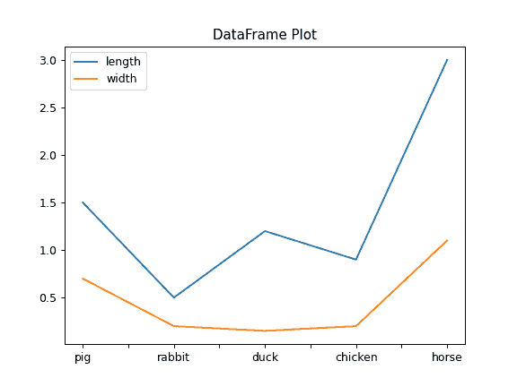
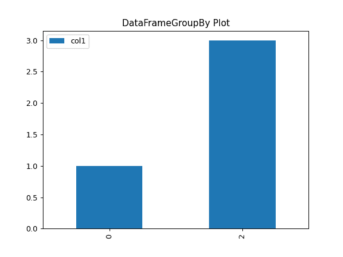

# `pandas.DataFrame.plot`

> 原文：[`pandas.pydata.org/docs/reference/api/pandas.DataFrame.plot.html`](https://pandas.pydata.org/docs/reference/api/pandas.DataFrame.plot.html)

```py
DataFrame.plot(*args, **kwargs)
```

绘制 Series 或 DataFrame 的图。

使用由选项`plotting.backend`指定的后端。默认情况下使用 matplotlib。

参数：

**数据**Series 或 DataFrame

调用该方法的对象。

**x**标签或位置，默认为 None

仅在数据为 DataFrame 时使用。

**y**标签，位置或标签列表，默认为 None

允许绘制一列与另一列。仅在数据为 DataFrame 时使用。

**类型**str

要生成的图的类型：

+   ‘line’：线图（默认）

+   ‘bar’：垂直条形图

+   ‘barh’：水平条形图

+   ‘hist’：直方图

+   ‘box’：箱线图

+   ‘kde’：核密度估计图

+   ‘density’：与‘kde’相同

+   ‘area’：面积图

+   ‘pie’：饼图

+   ‘scatter’：散点图（仅 DataFrame）

+   ‘hexbin’：六边形图（仅 DataFrame）

**ax**matplotlib 轴对象，默认为 None

当前图形的轴。

**subplots**bool 或可迭代序列，默认为 False

是否将列分组为子图：

+   `False`：不使用子图

+   `True`：为每列创建单独的子图。

+   列标签的可迭代序列：为每组列创建一个子图。例如[(‘a’, ‘c’), (‘b’, ‘d’)]将创建 2 个子图：一个包含列‘a’和‘c’，另一个包含列‘b’和‘d’。未指定的剩余列将在额外的子图中绘制（每列一个）。

    版本 1.5.0 中的新功能。

**sharex**bool，默认为 True（如果 ax 为 None）否则为 False

如果`subplots=True`，共享 x 轴并将一些 x 轴标签设置为不可见；如果未传入 ax，则默认为 True，否则如果传入了 ax，则为 False；请注意，传入 ax 和`sharex=True`将改变图中所有轴的所有 x 轴标签。

**sharey**bool，默认为 False

如果`subplots=True`，共享 y 轴并将一些 y 轴标签设置为不可见。

**布局**元组，可选

（行，列）用于子图布局。

**figsize**元组（宽度，高度）以英寸为单位

图形对象的大小。

**use_index**bool，默认为 True

使用索引作为 x 轴的刻度。

**标题**str 或列表

用于图的标题。如果传递了字符串，则在图的顶部打印字符串。如果传递了列表并且 subplots 为 True，则在相应子图的上方打印列表中的每个项目。

**网格**bool，默认为 None（matlab 风格默认）

轴网格线。

**图例**bool 或{‘reverse’}

将图例放置在轴子图上。

**样式**列表或字典

每列的 matplotlib 线样式。

**logx**bool 或‘sym’，默认为 False

在 x 轴上使用对数缩放或对数缩放。

**logy**bool 或‘sym’默认为 False

在 y 轴上使用对数缩放或对数缩放。

**loglog**bool 或‘sym’，默认为 False

在 x 和 y 轴上同时使用对数缩放或对数缩放。

**xticks**序列

用于 xticks 的值。

**yticks**序列

用于 yticks 的值。

**xlim**2-元组/列表

设置当前轴的 x 限制。

**ylim**2-元组/列表

设置当前轴的 y 限制。

**xlabel**标签，可选

用于 x 轴上的 xlabel 的名称。默认使用索引名称作为 xlabel，或者对于平面图，使用 x 列名称。

在 2.0.0 版本中更改：现在适用于直方图。

**ylabel**标签，可选

用于 y 轴标签的名称。默认情况下不显示 y 轴标签，或者对于平面图，显示 y 列名称。

在 2.0.0 版本中更改：现在适用于直方图。

**rot**浮点数，默认为 None

刻度的旋转（垂直图的 xticks，水平图的 yticks）。

**fontsize**浮点数，默认为 None

xticks 和 yticks 的字体大小。

**colormap**str 或 matplotlib 颜色图对象，默认为 None

从中选择颜色的颜色图。如果是字符串，则从 matplotlib 加载具有该名称的颜色图。

**colorbar**bool, optional

如果为 True，则绘制颜色条（仅适用于‘scatter’和‘hexbin’图）。

**position**浮点数

指定条形图布局的相对对齐。从 0（左/底部）到 1（右/顶部）。默认为 0.5（中心）。

**table**bool，Series 或 DataFrame，默认为 False

如果为 True，则使用 DataFrame 中的数据绘制表，并且数据将被转置以满足 matplotlib 的默认布局。如果传递了 Series 或 DataFrame，则使用传递的数据绘制表。

**yerr**DataFrame，Series，类数组，字典和字符串

有关详细信息，请参阅带有误差条的绘图。

**xerr**DataFrame，Series，类数组，字典和字符串

等效于 yerr。

**stacked**bool，默认为线图和条形图中的 False，面积图中的 True

如果为 True，则创建堆叠图。

**secondary_y**bool 或序列，默认为 False

如果是列表/元组，则是否在辅助 y 轴上绘制，要在辅助 y 轴上绘制哪些列。

**mark_right**bool，默认为 True

使用辅助 y 轴时，在图例中自动标记列标签为“(right)”。

**include_bool**bool，默认为 False

如果为 True，则可以绘制布尔值。

**backend**str，默认为 None

要使用的后端，而不是在选项`plotting.backend`中指定的后端。例如，‘matplotlib’。或者，要为整个会话指定`plotting.backend`，请设置`pd.options.plotting.backend`。

****kwargs**

传递给 matplotlib 绘图方法的选项。

返回：

[`matplotlib.axes.Axes`](https://matplotlib.org/stable/api/_as-gen/matplotlib.axes.Axes.html#matplotlib.axes.Axes "(在 Matplotlib v3.8.4 中)") 或它们的 numpy.ndarray

如果后端不是默认的 matplotlib，则返回值将是后端返回的对象。

注意

+   有关此主题的更多信息，请在线查看 matplotlib 文档

+   如果 kind = ‘bar’或‘barh’，则可以通过 position 关键字指定条形图布局的相对对齐。从 0（左/底部）到 1（右/顶部）。默认为 0.5（中心）

示例

对于 Series：

```py
>>> ser = pd.Series([1, 2, 3, 3])
>>> plot = ser.plot(kind='hist', title="My plot") 
```


对于 DataFrame：

```py
>>> df = pd.DataFrame({'length': [1.5, 0.5, 1.2, 0.9, 3],
...                   'width': [0.7, 0.2, 0.15, 0.2, 1.1]},
...                   index=['pig', 'rabbit', 'duck', 'chicken', 'horse'])
>>> plot = df.plot(title="DataFrame Plot") 
```



对于 SeriesGroupBy：

```py
>>> lst = [-1, -2, -3, 1, 2, 3]
>>> ser = pd.Series([1, 2, 2, 4, 6, 6], index=lst)
>>> plot = ser.groupby(lambda x: x > 0).plot(title="SeriesGroupBy Plot") 
```


对于 DataFrameGroupBy：

```py
>>> df = pd.DataFrame({"col1" : [1, 2, 3, 4],
...                   "col2" : ["A", "B", "A", "B"]})
>>> plot = df.groupby("col2").plot(kind="bar", title="DataFrameGroupBy Plot") 
```


