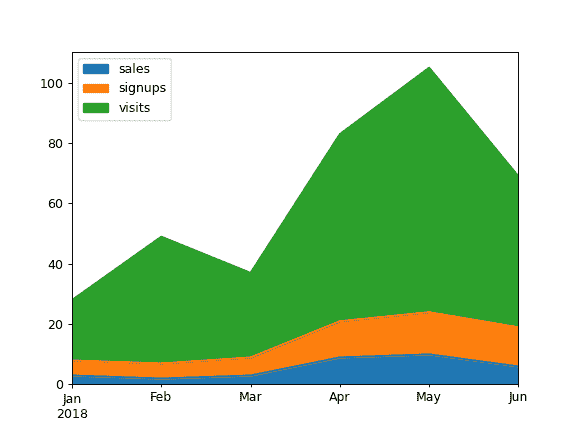
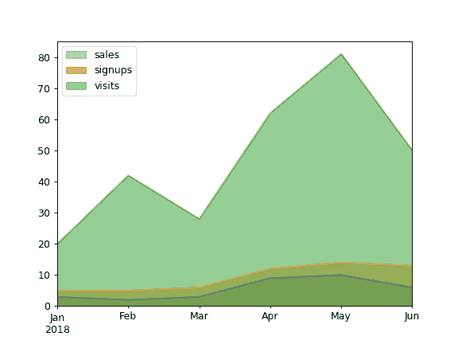
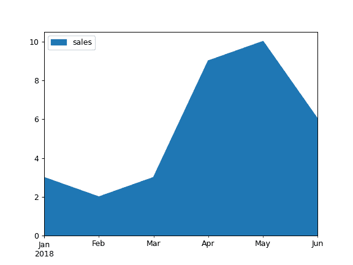
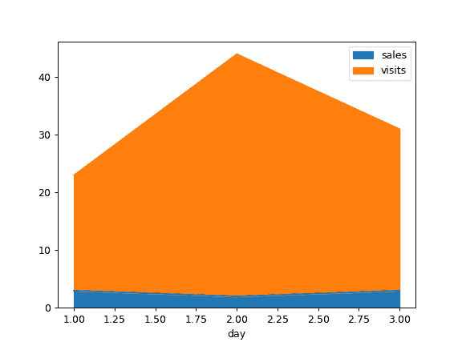

# pandas.DataFrame.plot.area

> 原文：[`pandas.pydata.org/docs/reference/api/pandas.DataFrame.plot.area.html`](https://pandas.pydata.org/docs/reference/api/pandas.DataFrame.plot.area.html)

```py
DataFrame.plot.area(x=None, y=None, stacked=True, **kwargs)
```

绘制堆叠的区域图。

区域图可视化显示定量数据。此函数包装了 matplotlib 的 area 函数。

参数：

**x**轴标签或位置，可选

X 轴的坐标。默认情况下使用索引。

**y**轴标签或位置，可选

要绘制的列。默认情况下使用所有列。

**stacked**布尔值，默认为 True

默认情况下，区域图是堆叠的。设置为 False 以创建非堆叠图。

****kwargs**

额外的关键字参数在`DataFrame.plot()`中有文档记录。

返回：

matplotlib.axes.Axes 或 numpy.ndarray

区域图，或者如果 subplots 为 True，则为区域图数组。

另请参阅

`DataFrame.plot`

使用 matplotlib / pylab 绘制 DataFrame 的图形。

示例

基于基本业务指标绘制区域图：

```py
>>> df = pd.DataFrame({
...     'sales': [3, 2, 3, 9, 10, 6],
...     'signups': [5, 5, 6, 12, 14, 13],
...     'visits': [20, 42, 28, 62, 81, 50],
... }, index=pd.date_range(start='2018/01/01', end='2018/07/01',
...                        freq='ME'))
>>> ax = df.plot.area() 
```



默认情况下，区域图是堆叠的。要生成非堆叠图，请传递`stacked=False`：

```py
>>> ax = df.plot.area(stacked=False) 
```



绘制单列的区域图：

```py
>>> ax = df.plot.area(y='sales') 
```



使用不同的 x 绘制：

```py
>>> df = pd.DataFrame({
...     'sales': [3, 2, 3],
...     'visits': [20, 42, 28],
...     'day': [1, 2, 3],
... })
>>> ax = df.plot.area(x='day') 
```


