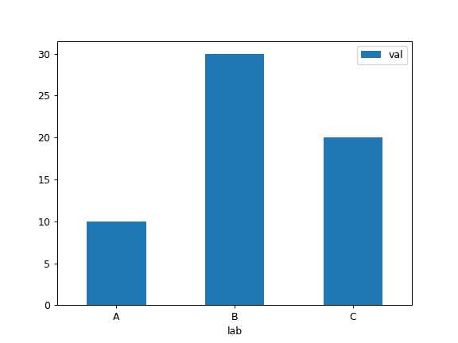
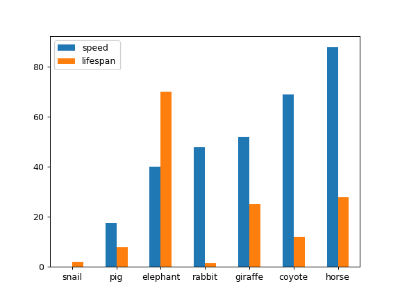
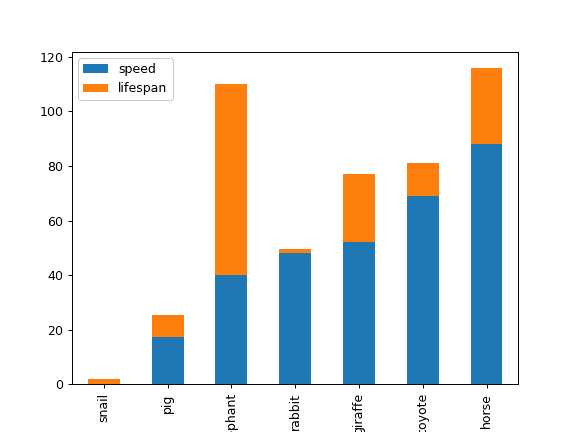
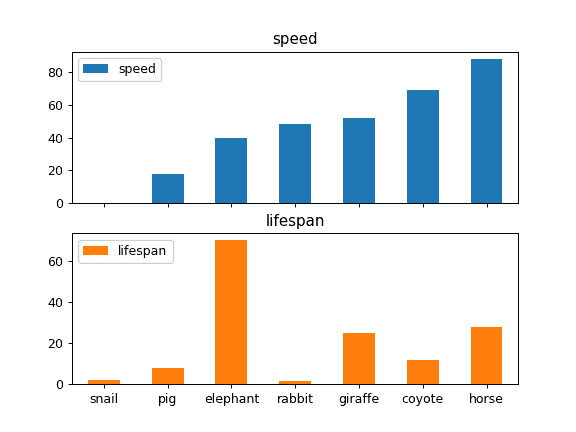
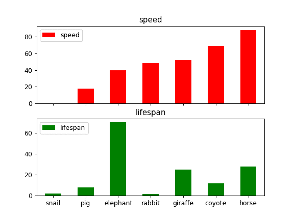
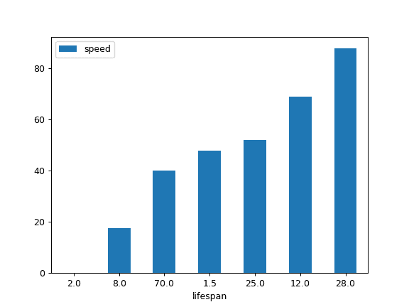

# `pandas.DataFrame.plot.bar`

> 原文：[`pandas.pydata.org/docs/reference/api/pandas.DataFrame.plot.bar.html`](https://pandas.pydata.org/docs/reference/api/pandas.DataFrame.plot.bar.html)

```py
DataFrame.plot.bar(x=None, y=None, **kwargs)
```

垂直条形图。

条形图是一种用矩形条表示分类数据的图表，其长度与它们代表的值成比例。条形图显示离散类别之间的比较。图表的一个轴显示正在比较的具体类别，另一个轴代表一个测量值。

参数：

**x**标签或位置，可选

允许绘制一列与另一列的图。如果未指定，则使用 DataFrame 的索引。

**y**标签或位置，可选

允许绘制一列与另一列的图。如果未指定，则使用所有数值列。

**颜色**str，类似数组或字典，可选

DataFrame 的每一列的颜色。可能的值有：

+   一个单一的颜色字符串，通过名称、RGB 或 RGBA 代码，

    例如‘红色’或‘#a98d19’。

+   一系列颜色字符串，通过名称、RGB 或 RGBA 引用

    代码，将递归地用于每一列。例如[‘绿色’，‘黄色’]，每一列的条形图将交替填充为绿色或黄色。如果只有一个要绘制的列，则只会使用颜色列表中的第一个颜色。

+   一个形如{列名颜色}的字典，这样每一列都会

    相应着色。例如，如果你的列名为 a 和 b，那么传递{‘a’：‘绿色’，‘b’：‘红色’}将使列 a 的条形图呈绿色，列 b 的条形图呈红色。

****kwargs**

额外的关键字参数在`DataFrame.plot()`中有文档记录。

返回：

matplotlib.axes.Axes 或它们的 np.ndarray

当`subplots=True`时，每列返回一个[`matplotlib.axes.Axes`](https://matplotlib.org/stable/api/_as-gen/matplotlib.axes.Axes.html#matplotlib.axes.Axes "(在 Matplotlib v3.8.4 中)")的 ndarray。

另请参阅

`DataFrame.plot.barh`

水平条形图。

`DataFrame.plot`

绘制 DataFrame 的图表。

[`matplotlib.pyplot.bar`](https://matplotlib.org/stable/api/_as-gen/matplotlib.pyplot.bar.html#matplotlib.pyplot.bar "(在 Matplotlib v3.8.4 中)")

使用 matplotlib 制作条形图。

示例

基本图表。

```py
>>> df = pd.DataFrame({'lab':['A', 'B', 'C'], 'val':[10, 30, 20]})
>>> ax = df.plot.bar(x='lab', y='val', rot=0) 
```



将整个数据框绘制为条形图。每一列被分配一个不同的颜色，每一行在水平轴上嵌套在一个组中。

```py
>>> speed = [0.1, 17.5, 40, 48, 52, 69, 88]
>>> lifespan = [2, 8, 70, 1.5, 25, 12, 28]
>>> index = ['snail', 'pig', 'elephant',
...          'rabbit', 'giraffe', 'coyote', 'horse']
>>> df = pd.DataFrame({'speed': speed,
...                    'lifespan': lifespan}, index=index)
>>> ax = df.plot.bar(rot=0) 
```



为 DataFrame 绘制堆叠条形图

```py
>>> ax = df.plot.bar(stacked=True) 
```



不需要嵌套，可以通过`subplots=True`按列拆分图表。在这种情况下，会返回一个[`numpy.ndarray`](https://numpy.org/doc/stable/reference/generated/numpy.ndarray.html#numpy.ndarray "(在 NumPy v1.26)")的[`matplotlib.axes.Axes`](https://matplotlib.org/stable/api/_as_gen/matplotlib.axes.Axes.html#matplotlib.axes.Axes "(在 Matplotlib v3.8.4)")。

```py
>>> axes = df.plot.bar(rot=0, subplots=True)
>>> axes[1].legend(loc=2) 
```



如果你不喜欢默认的颜色，你可以指定每一列的颜色。

```py
>>> axes = df.plot.bar(
...     rot=0, subplots=True, color={"speed": "red", "lifespan": "green"}
... )
>>> axes[1].legend(loc=2) 
```



绘制单列。

```py
>>> ax = df.plot.bar(y='speed', rot=0) 
```


仅为数据框绘制选定的类别。

```py
>>> ax = df.plot.bar(x='lifespan', rot=0) 
```


