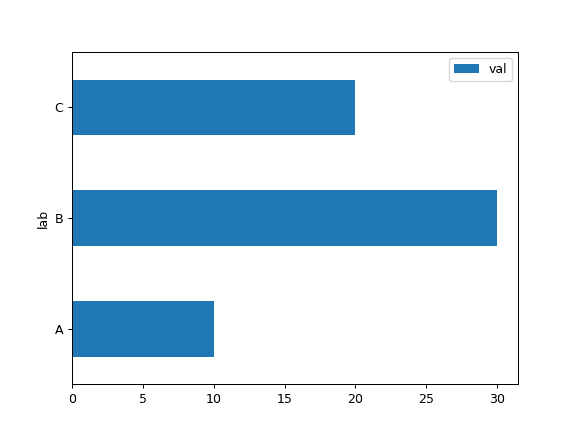
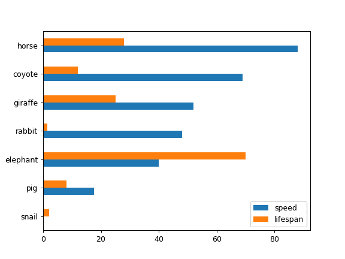
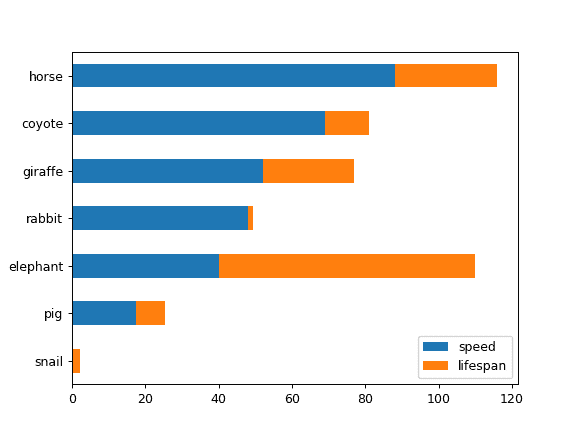
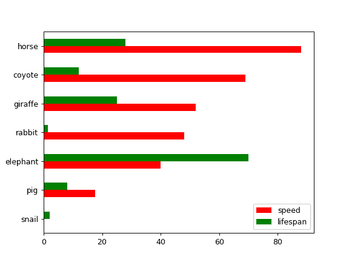
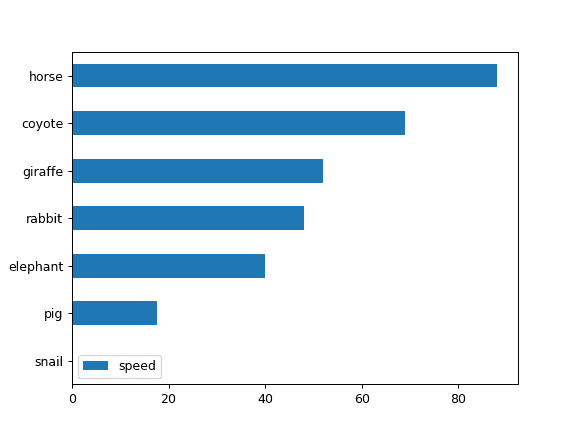
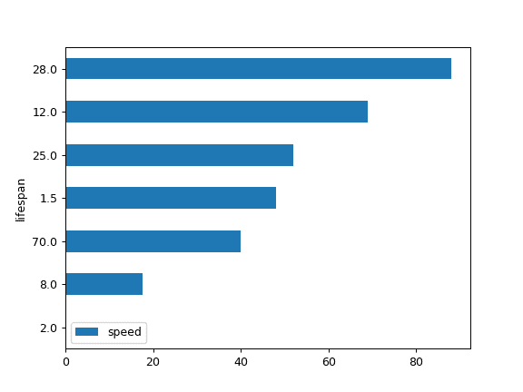

# pandas.DataFrame.plot.barh

> 原文：[`pandas.pydata.org/docs/reference/api/pandas.DataFrame.plot.barh.html`](https://pandas.pydata.org/docs/reference/api/pandas.DataFrame.plot.barh.html)

```py
DataFrame.plot.barh(x=None, y=None, **kwargs)
```

制作一个水平条形图。

水平条形图是一种用矩形条表示数量数据的图表，其长度与它们代表的值成比例。条形图显示了离散类别之间的比较。图表的一个轴显示了正在比较的具体类别，另一个轴代表了一个测量值。

参数：

**x**标签或位置，可选

允许绘制一列与另一列的关系。如果未指定，则使用 DataFrame 的索引。

**y**标签或位置，可选

允许绘制一列与另一列的关系。如果未指定，则使用所有数值列。

**color**str、array-like 或 dict，可选

DataFrame 的每一列的颜色。可能的值包括：

+   一个单一的颜色字符串，通过名称、RGB 或 RGBA 代码引用，

    例如‘red’或‘#a98d19’。

+   一系列颜色字符串，通过名称、RGB 或 RGBA 引用

    代码，将递归地用于每一列。例如[‘green’,’yellow’]，每一列的条形图将交替填充为绿色或黄色。如果只有一个要绘制的列，则只会使用颜色列表中的第一个颜色。

+   一个形如{列名颜色}的字典，以便每一列都会

    相应着颜色。例如，如果你的列名为 a 和 b，那么传入{‘a’: ‘green’, ‘b’: ‘red’}将会用绿色为列 a 的条形图上色，用红色为列 b 的条形图上色。

****kwargs**

额外的关键字参数在`DataFrame.plot()`中有文档记录。

返回：

matplotlib.axes.Axes 或它们的 np.ndarray

当`subplots=True`时，每列返回一个[`matplotlib.axes.Axes`](https://matplotlib.org/stable/api/_as-gen/matplotlib.axes.Axes.html#matplotlib.axes.Axes "(在 Matplotlib v3.8.4 中)")或它们的 np.ndarray。

另请参阅

`DataFrame.plot.bar`

垂直条形图。

`DataFrame.plot`

使用 matplotlib 绘制 DataFrame 的图表。

[`matplotlib.axes.Axes.bar`](https://matplotlib.org/stable/api/_as-gen/matplotlib.axes.Axes.bar.html#matplotlib.axes.Axes.bar "(在 Matplotlib v3.8.4 中)")

使用 matplotlib 绘制垂直条形图。

示例

基本示例

```py
>>> df = pd.DataFrame({'lab': ['A', 'B', 'C'], 'val': [10, 30, 20]})
>>> ax = df.plot.barh(x='lab', y='val') 
```



将整个 DataFrame 绘制为水平条形图

```py
>>> speed = [0.1, 17.5, 40, 48, 52, 69, 88]
>>> lifespan = [2, 8, 70, 1.5, 25, 12, 28]
>>> index = ['snail', 'pig', 'elephant',
...          'rabbit', 'giraffe', 'coyote', 'horse']
>>> df = pd.DataFrame({'speed': speed,
...                    'lifespan': lifespan}, index=index)
>>> ax = df.plot.barh() 
```



为 DataFrame 绘制堆叠的水平条形图

```py
>>> ax = df.plot.barh(stacked=True) 
```



我们可以为每一列指定颜色

```py
>>> ax = df.plot.barh(color={"speed": "red", "lifespan": "green"}) 
```



绘制数据框的一列到水平条形图

```py
>>> speed = [0.1, 17.5, 40, 48, 52, 69, 88]
>>> lifespan = [2, 8, 70, 1.5, 25, 12, 28]
>>> index = ['snail', 'pig', 'elephant',
...          'rabbit', 'giraffe', 'coyote', 'horse']
>>> df = pd.DataFrame({'speed': speed,
...                    'lifespan': lifespan}, index=index)
>>> ax = df.plot.barh(y='speed') 
```



绘制数据框与所需列的关系

```py
>>> speed = [0.1, 17.5, 40, 48, 52, 69, 88]
>>> lifespan = [2, 8, 70, 1.5, 25, 12, 28]
>>> index = ['snail', 'pig', 'elephant',
...          'rabbit', 'giraffe', 'coyote', 'horse']
>>> df = pd.DataFrame({'speed': speed,
...                    'lifespan': lifespan}, index=index)
>>> ax = df.plot.barh(x='lifespan') 
```


