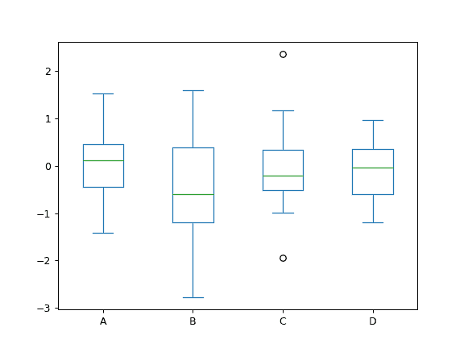
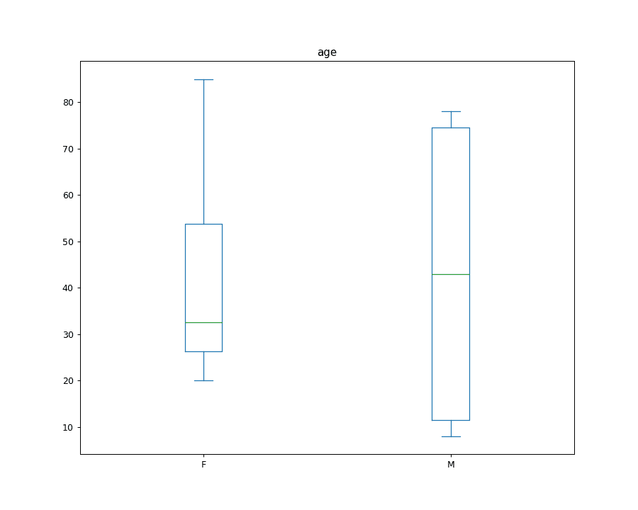

# pandas.DataFrame.plot.box

> 原文：[`pandas.pydata.org/docs/reference/api/pandas.DataFrame.plot.box.html`](https://pandas.pydata.org/docs/reference/api/pandas.DataFrame.plot.box.html)

```py
DataFrame.plot.box(by=None, **kwargs)
```

绘制 DataFrame 列的箱线图。

箱线图是一种通过其四分位数图形地描绘数值数据组的方法。 箱子从数据的 Q1 到 Q3 四分位数值延伸，中位数（Q2）处有一条线。 箱须从箱子的边缘延伸以显示数据的范围。 箱须的位置默认设置为离箱子边缘 1.5 倍 IQR（IQR = Q3 - Q1）。 异常点是那些超出箱须末端的点。

有关详细信息，请参阅维基百科的[箱线图](https://en.wikipedia.org/wiki/Box_plot)条目。

使用此图表时需要考虑的一个问题是，箱体和箱须可能会重叠，在绘制少量数据时非常常见。

参数：

**by**str 或序列

DataFrame 中用于分组的列。

在版本 1.4.0 中更改：以前，by 会被静默忽略并且不进行分组

****kwargs**

其他关键字在`DataFrame.plot()`中有文档记录。

返回：

[`matplotlib.axes.Axes`](https://matplotlib.org/stable/api/_as-gen/matplotlib.axes.Axes.html#matplotlib.axes.Axes "(在 Matplotlib v3.8.4 中)") 或其数组

另请参见

`DataFrame.boxplot`

绘制箱线图的另一种方法。

`Series.plot.box`

从一个 Series 对象绘制箱线图。

[`matplotlib.pyplot.boxplot`](https://matplotlib.org/stable/api/_as_gen/matplotlib.pyplot.boxplot.html#matplotlib.pyplot.boxplot "(在 Matplotlib v3.8.4 中)")

在 matplotlib 中绘制箱线图。

示例

从具有四列随机生成数据的 DataFrame 绘制箱线图。

```py
>>> data = np.random.randn(25, 4)
>>> df = pd.DataFrame(data, columns=list('ABCD'))
>>> ax = df.plot.box() 
```



如果指定 by 参数（可以是列名，也可以是列名的列表或元组），还可以生成分组：

在版本 1.4.0 中更改。

```py
>>> age_list = [8, 10, 12, 14, 72, 74, 76, 78, 20, 25, 30, 35, 60, 85]
>>> df = pd.DataFrame({"gender": list("MMMMMMMMFFFFFF"), "age": age_list})
>>> ax = df.plot.box(column="age", by="gender", figsize=(10, 8)) 
```


