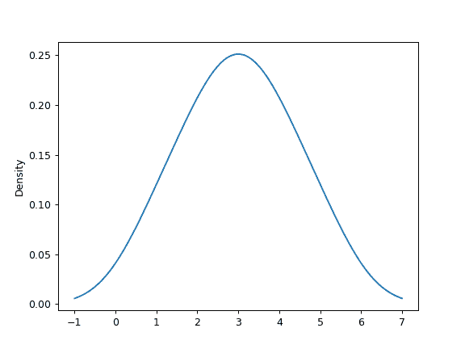
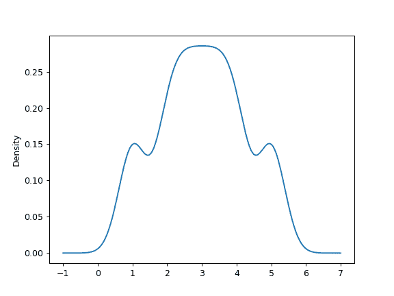
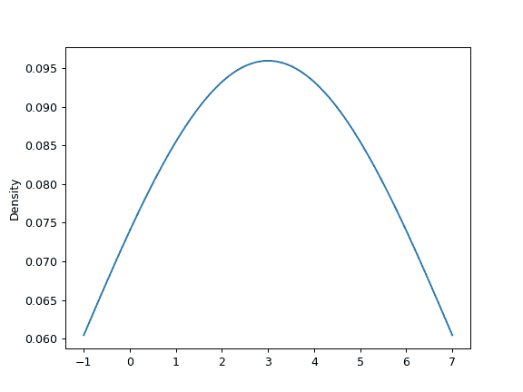
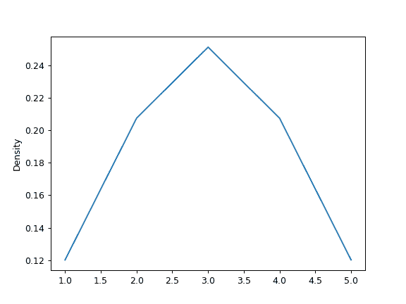
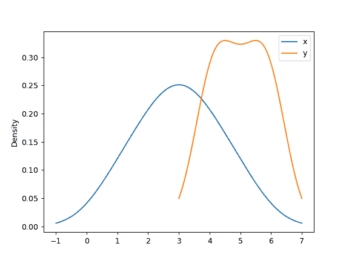
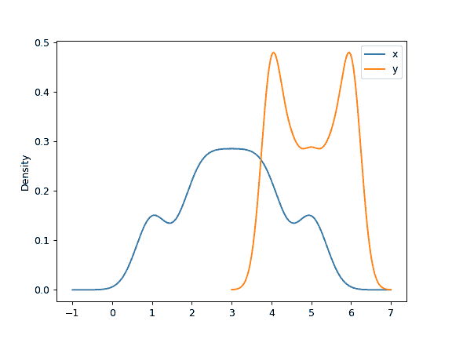
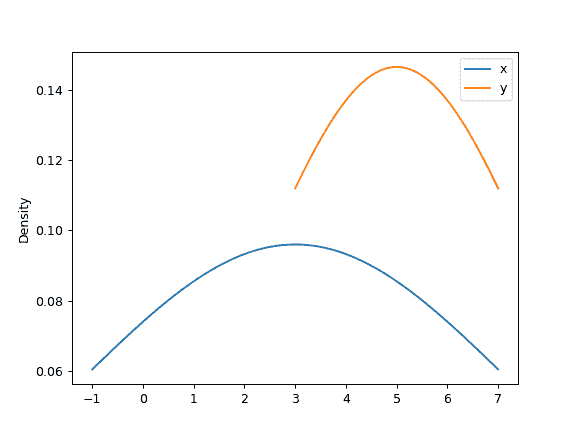
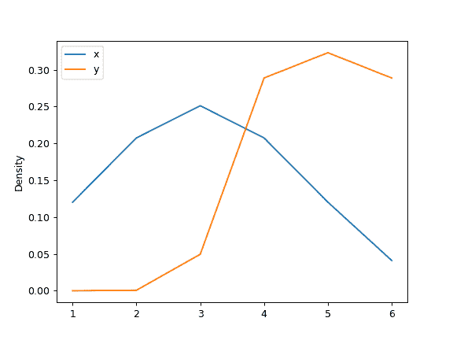

# pandas.DataFrame.plot.density

> 原文：[`pandas.pydata.org/docs/reference/api/pandas.DataFrame.plot.density.html`](https://pandas.pydata.org/docs/reference/api/pandas.DataFrame.plot.density.html)

```py
DataFrame.plot.density(bw_method=None, ind=None, **kwargs)
```

使用高斯核生成核密度估计图。

在统计学中，[核密度估计](https://en.wikipedia.org/wiki/Kernel_density_estimation)（KDE）是一种非参数估计随机变量概率密度函数（PDF）的方法。该函数使用高斯核并包括自动带宽确定。

参数：

**bw_method**str，标量或可调用对象，可选

用于计算估计器带宽的方法。可以是‘scott’，‘silverman’，标量常数或可调用对象。如果为 None（默认），则使用‘scott’。有关更多信息，请参阅[`scipy.stats.gaussian_kde`](https://docs.scipy.org/doc/scipy/reference/generated/scipy.stats.gaussian_kde.html#scipy.stats.gaussian_kde "(在 SciPy v1.13.0)")。

**ind**NumPy 数组或整数，可选

用于估计 PDF 的评估点。如果为 None（默认），则使用 1000 个等间距点。如果 ind 是 NumPy 数组，则在传递的点处评估 KDE。如果 ind 是整数，则使用 ind 数量的等间距点。

****kwargs**

额外的关键字参数在`DataFrame.plot()`中有文档记录。

返回：

matplotlib.axes.Axes 或其 numpy.ndarray

另请参阅

[`scipy.stats.gaussian_kde`](https://docs.scipy.org/doc/scipy/reference/generated/scipy.stats.gaussian_kde.html#scipy.stats.gaussian_kde "(在 SciPy v1.13.0)")

使用高斯核的核密度估计的表示。这是内部用于估计 PDF 的函数。

示例

给定从未知分布中随机抽样的一系列点，使用具有自动带宽确定的 KDE 估计其 PDF，并在 1000 个等间距点（默认）上评估结果并绘制：

```py
>>> s = pd.Series([1, 2, 2.5, 3, 3.5, 4, 5])
>>> ax = s.plot.kde() 
```



可以指定标量带宽。使用较小的带宽值可能导致过拟合，而使用较大的带宽值可能导致欠拟合：

```py
>>> ax = s.plot.kde(bw_method=0.3) 
```



```py
>>> ax = s.plot.kde(bw_method=3) 
```



最后，ind 参数确定了用于绘制估计 PDF 的评估点：

```py
>>> ax = s.plot.kde(ind=[1, 2, 3, 4, 5]) 
```



对于 DataFrame，它的工作方式相同：

```py
>>> df = pd.DataFrame({
...     'x': [1, 2, 2.5, 3, 3.5, 4, 5],
...     'y': [4, 4, 4.5, 5, 5.5, 6, 6],
... })
>>> ax = df.plot.kde() 
```



可以指定标量带宽。使用较小的带宽值可能导致过拟合，而使用较大的带宽值可能导致欠拟合：

```py
>>> ax = df.plot.kde(bw_method=0.3) 
```



```py
>>> ax = df.plot.kde(bw_method=3) 
```



最后，ind 参数确定了估计概率密度函数的绘图评估点：

```py
>>> ax = df.plot.kde(ind=[1, 2, 3, 4, 5, 6]) 
```


