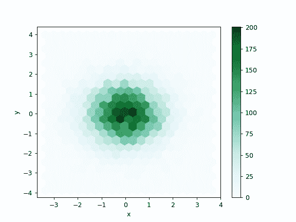
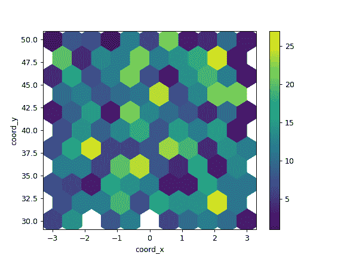

# pandas.DataFrame.plot.hexbin

> 原文：[`pandas.pydata.org/docs/reference/api/pandas.DataFrame.plot.hexbin.html`](https://pandas.pydata.org/docs/reference/api/pandas.DataFrame.plot.hexbin.html)

```py
DataFrame.plot.hexbin(x, y, C=None, reduce_C_function=None, gridsize=None, **kwargs)
```

生成一个六边形 binning 图。

生成 x 与 y 的六边形 binning 图。如果 C 为 None（默认值），这是一个关于观察值在 `(x[i], y[i])` 处出现次数的直方图。

如果指定了 C，则指定给定坐标 `(x[i], y[i])` 处的值。这些值将累积到每个六边形箱中，然后根据 reduce_C_function 进行减少，其默认值为 NumPy 的均值函数（`numpy.mean()`）。（如果指定了 C，则它必须也是与 x 和 y 长度相同的 1-D 序列，或者是一个列标签。）

参数：

**x**int or str

x 点的列标签或位置。

**y**int or str

y 点的列标签或位置。

**C**int or str, optional

(x, y) 点值的列标签或位置。

**reduce_C_function**callable, default np.mean

一个参数的函数，将箱中的所有值减少到一个单一数字（例如 np.mean, np.max, np.sum, np.std）。

**gridsize**int or tuple of (int, int), default 100

x 方向上的六边形数量。选择 y 方向上相应数量的六边形，以使六边形大致规则。或者，gridsize 可以是一个包含两个元素的元组，指定 x 方向和 y 方向上的六边形数量。

****kwargs**

额外的关键字参数在`DataFrame.plot()`中有记录。

返回：

matplotlib.AxesSubplot

绘制六边形 binning 的 matplotlib `Axes`。

另请参阅

`DataFrame.plot`

绘制 DataFrame 的图。

[`matplotlib.pyplot.hexbin`](https://matplotlib.org/stable/api/_as-gen/matplotlib.pyplot.hexbin.html#matplotlib.pyplot.hexbin "(在 Matplotlib v3.8.4 中)")

使用 matplotlib 进行六边形 binning 绘图，这是在幕后使用的 matplotlib 函数。

示例

以下示例是使用正态分布的随机数据生成的。

```py
>>> n = 10000
>>> df = pd.DataFrame({'x': np.random.randn(n),
...                    'y': np.random.randn(n)})
>>> ax = df.plot.hexbin(x='x', y='y', gridsize=20) 
```



下一个示例使用 C 和 np.sum 作为 reduce_C_function。请注意，'observations' 的值范围从 1 到 5，但结果图显示的值超过 25。这是由于 reduce_C_function。

```py
>>> n = 500
>>> df = pd.DataFrame({
...     'coord_x': np.random.uniform(-3, 3, size=n),
...     'coord_y': np.random.uniform(30, 50, size=n),
...     'observations': np.random.randint(1,5, size=n)
...     })
>>> ax = df.plot.hexbin(x='coord_x',
...                     y='coord_y',
...                     C='observations',
...                     reduce_C_function=np.sum,
...                     gridsize=10,
...                     cmap="viridis") 
```


