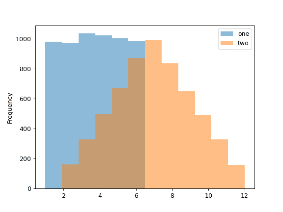
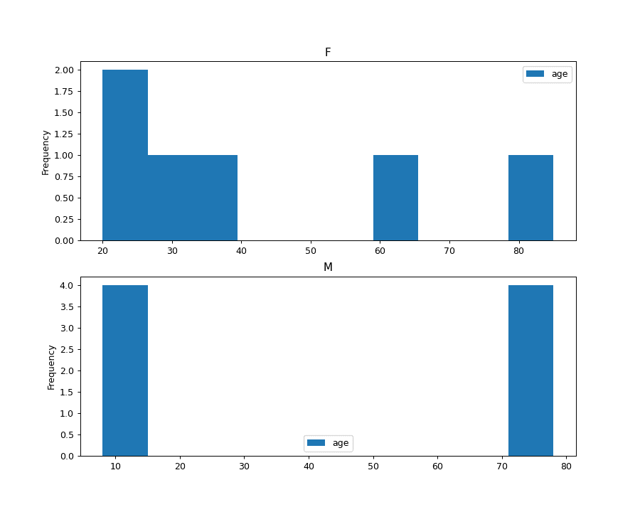

# pandas.DataFrame.plot.hist

> 原文：[`pandas.pydata.org/docs/reference/api/pandas.DataFrame.plot.hist.html`](https://pandas.pydata.org/docs/reference/api/pandas.DataFrame.plot.hist.html)

```py
DataFrame.plot.hist(by=None, bins=10, **kwargs)
```

绘制 DataFrame 列的一个直方图。

直方图是数据分布的表示。此函数将 DataFrame 中所有给定 Series 的值分组到箱中，并在一个[`matplotlib.axes.Axes`](https://matplotlib.org/stable/api/_as-gen/matplotlib.axes.Axes.html#matplotlib.axes.Axes "(在 Matplotlib v3.8.4 中)")中绘制所有箱。当 DataFrame 的 Series 在相似的比例时，这是很有用的。

参数：

**by**str 或序列，可选

要按列分组的 DataFrame 中的列。

从版本 1.4.0 开始更改：以前，by 被忽略并且不进行分组

**bins**int，默认值为 10

要使用的直方图箱的数量。

****kwargs**

额外的关键字参数在`DataFrame.plot()`中有文档记录。

返回：

类：matplotlib.AxesSubplot

返回一个直方图图表。

另请参见

`DataFrame.hist`

绘制每个 DataFrame 的 Series 的直方图。

`Series.hist`

绘制具有 Series 数据的直方图。

示例

当我们掷骰子 6000 次时，我们期望每个值出现大约 1000 次。但是当我们掷两个骰子并求和结果时，分布将会有所不同。直方图说明了这些分布。

```py
>>> df = pd.DataFrame(np.random.randint(1, 7, 6000), columns=['one'])
>>> df['two'] = df['one'] + np.random.randint(1, 7, 6000)
>>> ax = df.plot.hist(bins=12, alpha=0.5) 
```



通过提供参数 by（可以是列名或列名列表）可以生成分组的直方图：

```py
>>> age_list = [8, 10, 12, 14, 72, 74, 76, 78, 20, 25, 30, 35, 60, 85]
>>> df = pd.DataFrame({"gender": list("MMMMMMMMFFFFFF"), "age": age_list})
>>> ax = df.plot.hist(column=["age"], by="gender", figsize=(10, 8)) 
```


