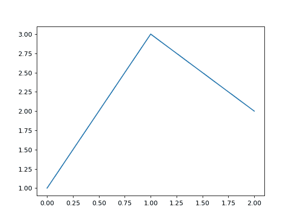
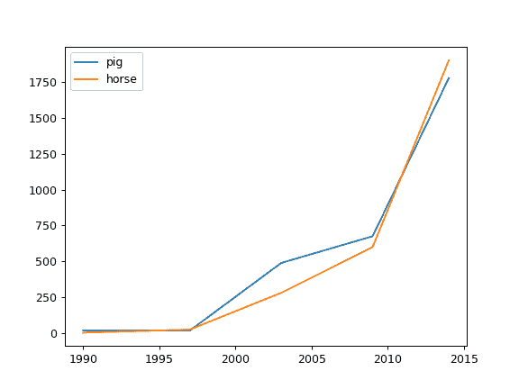
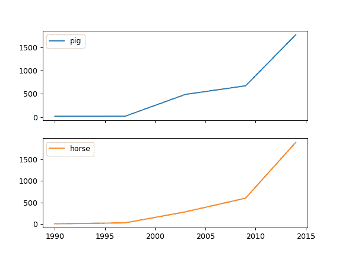
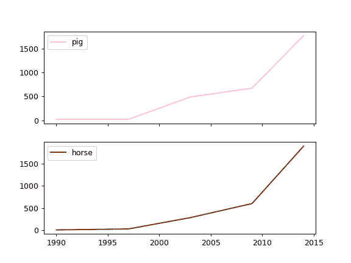
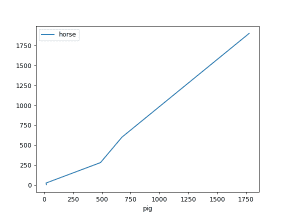

# pandas.DataFrame.plot.line

> 原文：[`pandas.pydata.org/docs/reference/api/pandas.DataFrame.plot.line.html`](https://pandas.pydata.org/docs/reference/api/pandas.DataFrame.plot.line.html)

```py
DataFrame.plot.line(x=None, y=None, **kwargs)
```

将系列或数据框绘制为线条。

此函数用于使用数据框的值作为坐标绘制线条。

参数：

**x**标签或位置，可选

允许绘制一列与另一列的关系。如果未指定，则使用数据框的索引。

**y**标签或位置，可选

允许绘制一列与另一列的关系。如果未指定，则使用所有数值列。

**color**str，类似数组或字典，可选

数据框的每一列的颜色。可能的值为：

+   一个单一的颜色字符串，通过名称、RGB 或 RGBA 代码，

    例如‘红色’或‘#a98d19’。

+   一系列颜色字符串，通过名称、RGB 或 RGBA 引用

    代码，将递归地用于每一列。例如[‘绿色’，‘黄色’]，每一列的线条将交替填充为绿色或黄色。如果只有一列要绘制，则只使用颜色列表中的第一种颜色。

+   一个形式为{列名颜色}的字典，以便每一列都将

    相应着色。例如，如果您的列名为 a 和 b，则传递{‘a’：‘绿色’，‘b’：‘红色’}将使列 a 的线条呈绿色，列 b 的线条呈红色。

****kwargs**

额外的关键字参数在`DataFrame.plot()`中有文档记录。

返回：

matplotlib.axes.Axes 或其 np.ndarray

当`subplots=True`时，每列返回一个[`matplotlib.axes.Axes`](https://matplotlib.org/stable/api/_as-gen/matplotlib.axes.Axes.html#matplotlib.axes.Axes "(在 Matplotlib v3.8.4)")。

另请参阅

[`matplotlib.pyplot.plot`](https://matplotlib.org/stable/api/_as-gen/matplotlib.pyplot.plot.html#matplotlib.pyplot.plot "(在 Matplotlib v3.8.4)")

将 y 相对于 x 绘制为线条和/或标记。

示例

```py
>>> s = pd.Series([1, 3, 2])
>>> s.plot.line() 
```



以下示例显示了一些动物随着时间的人口数量。

```py
>>> df = pd.DataFrame({
...    'pig': [20, 18, 489, 675, 1776],
...    'horse': [4, 25, 281, 600, 1900]
...    }, index=[1990, 1997, 2003, 2009, 2014])
>>> lines = df.plot.line() 
```



一个包含子图的示例，因此返回一个轴数组。

```py
>>> axes = df.plot.line(subplots=True)
>>> type(axes)
<class 'numpy.ndarray'> 
```



让我们重复相同的示例，但为每一列指定颜色（在这种情况下，为每种动物）。

```py
>>> axes = df.plot.line(
...     subplots=True, color={"pig": "pink", "horse": "#742802"}
... ) 
```



以下示例显示了两个人口之间的关系。

```py
>>> lines = df.plot.line(x='pig', y='horse') 
```


