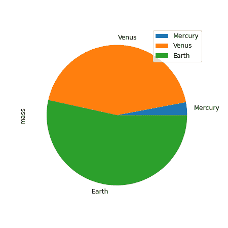
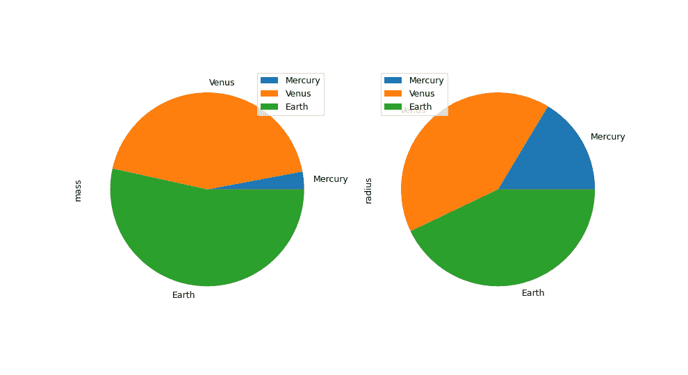

# pandas.DataFrame.plot.pie

> 原文：[`pandas.pydata.org/docs/reference/api/pandas.DataFrame.plot.pie.html`](https://pandas.pydata.org/docs/reference/api/pandas.DataFrame.plot.pie.html)

```py
DataFrame.plot.pie(**kwargs)
```

生成一个饼图。

饼图是对列中的数值数据的比例表示。此函数为指定的列包装了`matplotlib.pyplot.pie()`。如果没有传递列引用且`subplots=True`，则会为每个数值列独立绘制一个饼图。

参数：

**y**int 或标签，可选

要绘制的列的标签或位置。如果未提供，必须传递`subplots=True`参数。

****kwargs**

要传递给`DataFrame.plot()`的关键字参数。

返回：

matplotlib.axes.Axes 或它们的 np.ndarray

当 subplots 为 True 时返回一个 NumPy 数组。

另请参见

`Series.plot.pie`

为一个序列生成饼图。

`DataFrame.plot`

绘制数据框的图。

示例

在下面的示例中，我们有一个包含有关行星质量和半径信息的数据框。我们将“质量”列传递给饼图函数以获得一个饼图。

```py
>>> df = pd.DataFrame({'mass': [0.330, 4.87 , 5.97],
...                    'radius': [2439.7, 6051.8, 6378.1]},
...                   index=['Mercury', 'Venus', 'Earth'])
>>> plot = df.plot.pie(y='mass', figsize=(5, 5)) 
```



```py
>>> plot = df.plot.pie(subplots=True, figsize=(11, 6)) 
```


