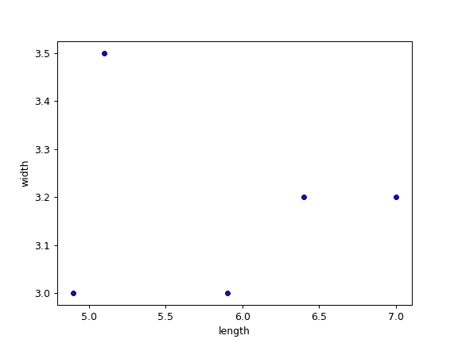
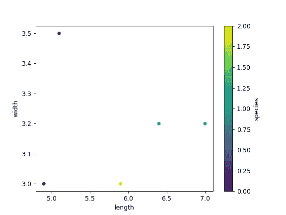

# `pandas.DataFrame.plot.scatter`

> 原文：[`pandas.pydata.org/docs/reference/api/pandas.DataFrame.plot.scatter.html`](https://pandas.pydata.org/docs/reference/api/pandas.DataFrame.plot.scatter.html)

```py
DataFrame.plot.scatter(x, y, s=None, c=None, **kwargs)
```

创建一个散点图，其中标记点的大小和颜色各不相同。

每个点的坐标由两个数据框列定义，并使用填充圆表示每个点。这种图表对于查看两个变量之间的复杂相关性很有用。例如，点可以是自然的 2D 坐标，如地图上的经度和纬度，或者一般来说，可以相互绘制的任何一对度量。

参数：

**x**int 或 str

要用作每个点的水平坐标的列名或列位置。

**y**int 或 str

要用作每个点的垂直坐标的列名或列位置。

**s**str，标量或类似数组，可选

每个点的大小。可能的值为：

+   用于标记大小的列的名称字符串。

+   单个标量，因此所有点都具有相同的大小。

+   一系列标量，将递归地用于每个点的大小。例如，当传递[2,14]时，所有点的大小将交替为 2 或 14。

**c**str，int 或类似数组，可选

每个点的颜色。可能的值为：

+   单个颜色字符串，通过名称、RGB 或 RGBA 代码引用，例如‘red’或‘#a98d19’。

+   一系列颜色字符串，通过名称、RGB 或 RGBA 代码引用，将递归地用于每个点的颜色。例如[‘green’,’yellow’]，所有点将交替填充为绿色或黄色。

+   列名或位置，其值将用于根据颜色图对标记点着色。

****kwargs**

要传递给`DataFrame.plot()`的关键字参数。

返回：

[`matplotlib.axes.Axes`](https://matplotlib.org/stable/api/_as-gen/matplotlib.axes.Axes.html#matplotlib.axes.Axes "(在 Matplotlib v3.8.4 中)")或它们的 numpy.ndarray

另请参见

[`matplotlib.pyplot.scatter`](https://matplotlib.org/stable/api/_as-gen/matplotlib.pyplot.scatter.html#matplotlib.pyplot.scatter "(在 Matplotlib v3.8.4 中)")

使用多种输入数据格式的散点图。

示例

让我们看看如何使用数据框列中的值来绘制散点图。

```py
>>> df = pd.DataFrame([[5.1, 3.5, 0], [4.9, 3.0, 0], [7.0, 3.2, 1],
...                    [6.4, 3.2, 1], [5.9, 3.0, 2]],
...                   columns=['length', 'width', 'species'])
>>> ax1 = df.plot.scatter(x='length',
...                       y='width',
...                       c='DarkBlue') 
```



现在颜色也由一列确定。

```py
>>> ax2 = df.plot.scatter(x='length',
...                       y='width',
...                       c='species',
...                       colormap='viridis') 
```


