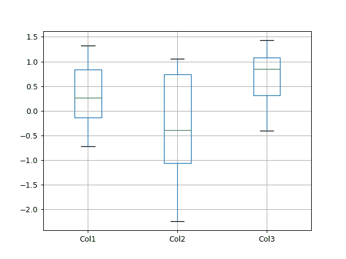
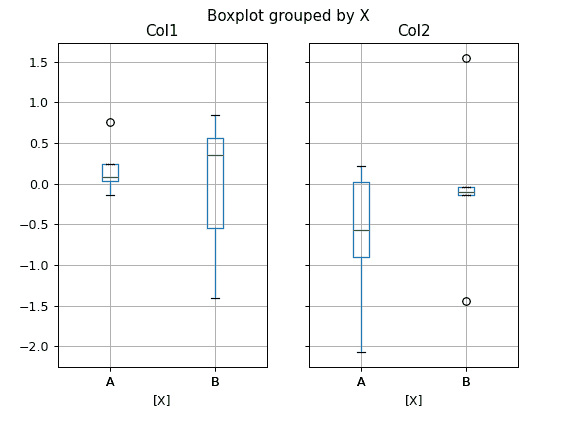
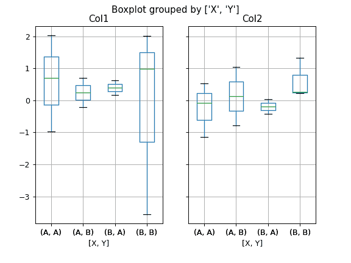
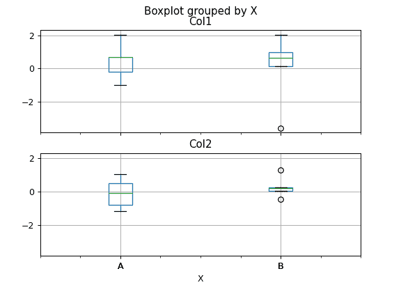
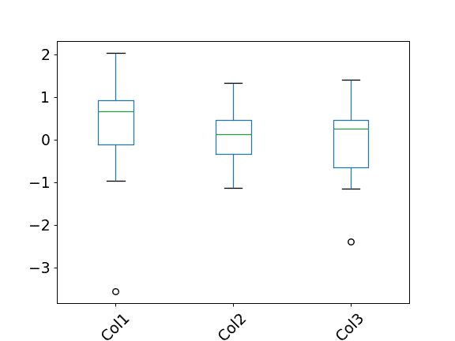

# `pandas.DataFrame.boxplot`

> 原文：[`pandas.pydata.org/docs/reference/api/pandas.DataFrame.boxplot.html`](https://pandas.pydata.org/docs/reference/api/pandas.DataFrame.boxplot.html)

```py
DataFrame.boxplot(column=None, by=None, ax=None, fontsize=None, rot=0, grid=True, figsize=None, layout=None, return_type=None, backend=None, **kwargs)
```

从 DataFrame 列制作箱线图。

从 DataFrame 列制作箱线图，可选择按其他某些列分组。箱线图是一种通过四分位数图形化表示数值数据组的方法。箱子从数据的 Q1 到 Q3 四分位值延伸，中位数（Q2）处有一条线。触须从箱子的边缘延伸，显示数据的范围。默��情况下，它们不会超过箱子边缘的 1.5 * IQR（IQR = Q3 - Q1），结束于该间隔内最远的数据点。异常值将作为单独的点绘制。

更多细节请参阅维基百科关于[箱线图](https://en.wikipedia.org/wiki/Box_plot)的条目。

参数：

**column** 字符串或字符串列表，可选

列名或名称列表，或向量。可以是任何有效的输入到 `pandas.DataFrame.groupby()` 的内容。

**by** 字符串或类数组，可选

DataFrame 中用于 `pandas.DataFrame.groupby()` 的列。将根据 by 中列的每个值绘制一个箱线图。

**ax** 类 matplotlib.axes.Axes 的对象，可选

用于箱线图的 matplotlib 坐标轴。

**fontsize** 浮点数或字符串

刻度标签字体大小，以点或字符串形式（例如，large）。

**rot** 浮点数，默认为 0

标签相对于屏幕坐标系的旋转角度（以度为单位）。

**grid** 布尔值，默认为 True

将此设置为 True 将显示网格。

**figsize** 一个元组（宽度，高度），单位为英寸

在 matplotlib 中创建的图的大小。

**layout** 元组（行，列），可选

例如，（3，5）将使用 3 行 5 列显示子图，从左上角开始。

**return_type** {‘axes’, ‘dict’, ‘both’} 或 None，默认为 ‘axes’

要返回的对象类型。默认为 `axes`。

+   ‘axes’ 返回绘制箱线图的 matplotlib 坐标轴。

+   ‘dict’ 返回一个字典，其值为箱线图的 matplotlib 线条。

+   ‘both’ 返回一个具有坐标轴和字典的命名元组。

+   使用 `by` 进行分组时，将返回将列映射到 `return_type` 的 Series。

    如果 `return_type` 为 None，则返回一个与 `layout` 形状相同的 NumPy 数组的坐标轴。

**backend** 字符串，默认为 None

要使用的后端，而不是在选项 `plotting.backend` 中指定的后端。例如，‘matplotlib’。或者，要为整个会话指定 `plotting.backend`，请设置 `pd.options.plotting.backend`。

****kwargs**

要传递给 [`matplotlib.pyplot.boxplot()`](https://matplotlib.org/stable/api/_as-gen/matplotlib.pyplot.boxplot.html#matplotlib.pyplot.boxplot "(在 Matplotlib v3.8.4 中)") 的所有其他绘图关键字参数。

返回：

结果

请参阅注释。

另请参见

`pandas.Series.plot.hist`

制作直方图。

[`matplotlib.pyplot.boxplot`](https://matplotlib.org/stable/api/_as-gen/matplotlib.pyplot.boxplot.html#matplotlib.pyplot.boxplot "(在 Matplotlib v3.8.4)")

Matplotlib 等效图。

注意

返回类型取决于`return_type`参数：

+   ‘axes’：matplotlib.axes.Axes 类的对象

+   ‘dict’：包含 matplotlib.lines.Line2D 对象的字典

+   ‘both’：一个具有结构（ax，lines）的命名元组

对使用`by`分组的数据，返回上述内容的 Series 或 NumPy 数组：

+   `Series`

+   `array`（对于`return_type = None`）

当您想要在绘图后调整线条外观时，请使用`return_type='dict'`。在这种情况下，返回一个包含组成箱子、帽子、离群值、中位数和须的线条的字典。

示例

可以通过`df.boxplot()`或指定要使用的列来为数据框中的每一列创建箱线图：

```py
>>> np.random.seed(1234)
>>> df = pd.DataFrame(np.random.randn(10, 4),
...                   columns=['Col1', 'Col2', 'Col3', 'Col4'])
>>> boxplot = df.boxplot(column=['Col1', 'Col2', 'Col3']) 
```



可以使用选项`by`创建根据第三个变量的值分组的变量分布的箱线图。例如：

```py
>>> df = pd.DataFrame(np.random.randn(10, 2),
...                   columns=['Col1', 'Col2'])
>>> df['X'] = pd.Series(['A', 'A', 'A', 'A', 'A',
...                      'B', 'B', 'B', 'B', 'B'])
>>> boxplot = df.boxplot(by='X') 
```



可以向 boxplot 传递一个字符串列表（即`['X'，'Y']`），以便按 x 轴中变量的组合对数据进行分组：

```py
>>> df = pd.DataFrame(np.random.randn(10, 3),
...                   columns=['Col1', 'Col2', 'Col3'])
>>> df['X'] = pd.Series(['A', 'A', 'A', 'A', 'A',
...                      'B', 'B', 'B', 'B', 'B'])
>>> df['Y'] = pd.Series(['A', 'B', 'A', 'B', 'A',
...                      'B', 'A', 'B', 'A', 'B'])
>>> boxplot = df.boxplot(column=['Col1', 'Col2'], by=['X', 'Y']) 
```



可以通过向`layout`提供一个元组来调整箱线图的布局：

```py
>>> boxplot = df.boxplot(column=['Col1', 'Col2'], by='X',
...                      layout=(2, 1)) 
```



可以对箱线图进行额外的格式设置，如取消网格（`grid=False`），旋转 x 轴上的标签（即`rot=45`）或更改字体大小（即`fontsize=15`）：

```py
>>> boxplot = df.boxplot(grid=False, rot=45, fontsize=15) 
```



参数`return_type`可用于选择箱线图返回的元素类型。当选择`return_type='axes'`时，返回绘制箱线图的 matplotlib 轴：

```py
>>> boxplot = df.boxplot(column=['Col1', 'Col2'], return_type='axes')
>>> type(boxplot)
<class 'matplotlib.axes._axes.Axes'> 
```

使用`by`进行分组时，返回将列映射到`return_type`的 Series：

```py
>>> boxplot = df.boxplot(column=['Col1', 'Col2'], by='X',
...                      return_type='axes')
>>> type(boxplot)
<class 'pandas.core.series.Series'> 
```

如果`return_type`为 None，则返回与`layout`形状相同的轴的 NumPy 数组：

```py
>>> boxplot = df.boxplot(column=['Col1', 'Col2'], by='X',
...                      return_type=None)
>>> type(boxplot)
<class 'numpy.ndarray'> 
```
