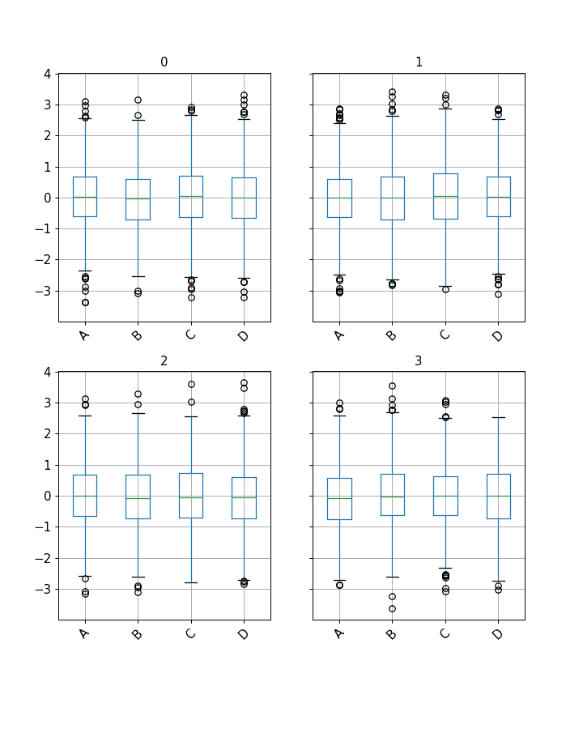
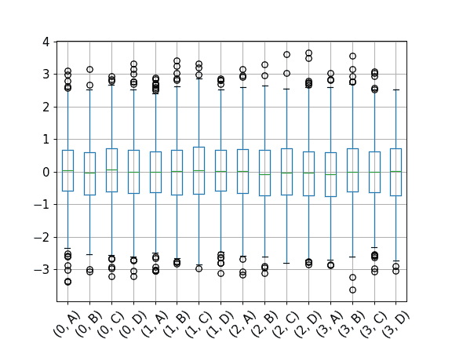

# `pandas.core.groupby.DataFrameGroupBy.boxplot`

> 原文：[`pandas.pydata.org/docs/reference/api/pandas.core.groupby.DataFrameGroupBy.boxplot.html`](https://pandas.pydata.org/docs/reference/api/pandas.core.groupby.DataFrameGroupBy.boxplot.html)

```py
DataFrameGroupBy.boxplot(subplots=True, column=None, fontsize=None, rot=0, grid=True, ax=None, figsize=None, layout=None, sharex=False, sharey=True, backend=None, **kwargs)
```

从 DataFrameGroupBy 数据制作箱线图。

参数：

**grouped**分组的 DataFrame

**subplots**布尔值

+   `False` - 不使用子图

+   `True` - 为每个组创建一个子图。

**column**列名或列名列表，或向量

可以是任何有效的 groupby 输入。

**fontsize**浮点数或字符串

**rot**标签旋转角度

**grid**将其设置为 True 将显示网格

**ax**Matplotlib 轴对象，默认为 None

**figsize**以英寸为单位的元组（宽度，高度）

**layout**元组（可选）

绘图的布局：（行，列）。

**sharex**布尔值，默认为 False

x 轴是否在子图之间共享。

**sharey**布尔值，默认为 True

是否在子图之间共享 y 轴。

**backend**字符串，默认为 None

要使用的后端，而不是在选项`plotting.backend`中指定的后端。例如，'matplotlib'。或者，要为整个会话指定`plotting.backend`，请设置`pd.options.plotting.backend`。

****kwargs**

所有其他绘图关键字参数将传递给 matplotlib 的 boxplot 函数。

返回：

键/值对的字典=组键/DataFrame.boxplot 返回值

或者在 subplots=figures=False 的情况下返回 DataFrame.boxplot 的返回值

示例

您可以为分组数据创建箱线图，并将它们显示为单独的子图：

```py
>>> import itertools
>>> tuples = [t for t in itertools.product(range(1000), range(4))]
>>> index = pd.MultiIndex.from_tuples(tuples, names=['lvl0', 'lvl1'])
>>> data = np.random.randn(len(index), 4)
>>> df = pd.DataFrame(data, columns=list('ABCD'), index=index)
>>> grouped = df.groupby(level='lvl1')
>>> grouped.boxplot(rot=45, fontsize=12, figsize=(8, 10)) 
```



选项`subplots=False`将在单个图中显示箱线图。

```py
>>> grouped.boxplot(subplots=False, rot=45, fontsize=12) 
```


