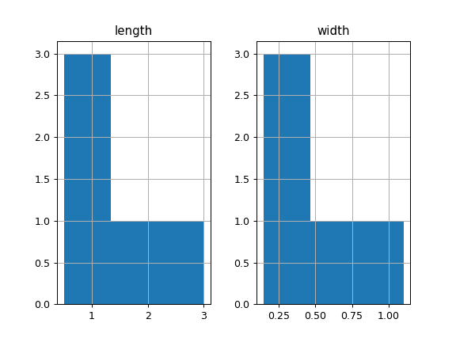

# `pandas.core.groupby.DataFrameGroupBy.hist`

> 原文：[`pandas.pydata.org/docs/reference/api/pandas.core.groupby.DataFrameGroupBy.hist.html`](https://pandas.pydata.org/docs/reference/api/pandas.core.groupby.DataFrameGroupBy.hist.html)

```py
DataFrameGroupBy.hist(column=None, by=None, grid=True, xlabelsize=None, xrot=None, ylabelsize=None, yrot=None, ax=None, sharex=False, sharey=False, figsize=None, layout=None, bins=10, backend=None, legend=False, **kwargs)
```

制作 DataFrame 列的直方图。

[直方图](https://en.wikipedia.org/wiki/Histogram)是数据分布的表示。此函数在 DataFrame 中的每个系列上调用`matplotlib.pyplot.hist()`，从而每列产生一个直方图。

参数：

**data**DataFrame

包含数据的 pandas 对象。

**column**str 或序列，可选

如果传入，将用于将数据限制为列的子集。

**by**对象，可选

如果传入，则用于为不同组形成直方图。

**grid**bool，默认为 True

是否显示轴网格线。

**xlabelsize**int，默认为 None

如果指定，更改 x 轴标签大小。

**xrot**float，默认为 None

x 轴标签的旋转。例如，值为 90 会将 x 标签顺时针旋转 90 度。

**ylabelsize**int，默认为 None

如果指定，更改 y 轴标签大小。

**yrot**float，默认为 None

y 轴标签的旋转。例如，值为 90 会将 y 标签顺时针旋转 90 度。

**ax**Matplotlib axes object, 默认为 None

要在其上绘制直方图的轴。

**sharex**bool，默认为 True 如果 ax 为 None，否则为 False

如果 subplots=True，则共享 x 轴并将一些 x 轴标签设置为不可见；如果 ax 为 None，则默认为 True，否则如果传入了 ax，则为 False。请注意，同时传入 ax 和 sharex=True 将改变图中所有子图的所有 x 轴标签。

**sharey**bool，默认为 False

如果 subplots=True，则共享 y 轴并将一些 y 轴标签设置为不可见。

**figsize**元组，可选

要创建的图的英寸大小。默认情况下使用 matplotlib.rcParams 中的值。

**layout**元组，可选

用于直方图布局的元组（行，列）。

**bins**int 或序列，默认为 10

���使用的直方图箱数。如果给定整数，则计算并返回 bins + 1 个箱边。如果 bins 是一个序列，则给出箱边，包括第一个箱的左边缘和最后一个箱的右边缘。在这种情况下，bins 将不经修改地返回。

**backend**str，默认为 None

要使用的后端，而不是在选项`plotting.backend`中指定的后端。例如，'matplotlib'。或者，要为整个会话指定`plotting.backend`，请设置`pd.options.plotting.backend`。

**legend**bool，默认为 False

是否显示图例。

****kwargs**

要传递给`matplotlib.pyplot.hist()`的所有其他绘图关键字参数。

返回：

matplotlib.AxesSubplot 或其 numpy.ndarray

参见

[`matplotlib.pyplot.hist`](https://matplotlib.org/stable/api/_as-gen/matplotlib.pyplot.hist.html#matplotlib.pyplot.hist "(在 Matplotlib v3.8.4 中)")

使用 matplotlib 绘制直方图。

示例

此示例基于一些动物的长度和宽度绘制直方图，显示在三个 bin 中

```py
>>> data = {'length': [1.5, 0.5, 1.2, 0.9, 3],
...         'width': [0.7, 0.2, 0.15, 0.2, 1.1]}
>>> index = ['pig', 'rabbit', 'duck', 'chicken', 'horse']
>>> df = pd.DataFrame(data, index=index)
>>> hist = df.hist(bins=3) 
```


