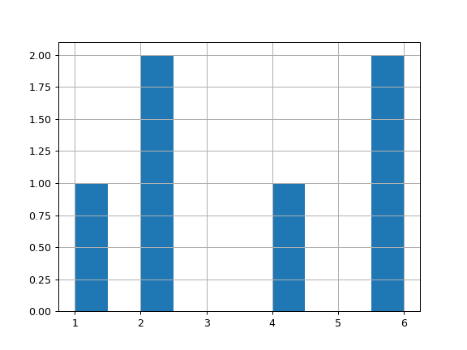
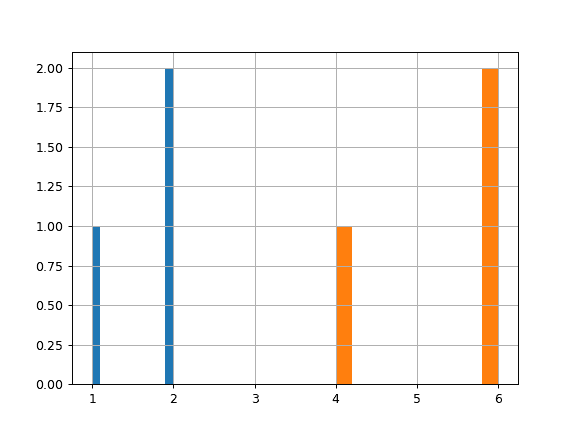

# pandas.core.groupby.SeriesGroupBy.hist

> 原文：[`pandas.pydata.org/docs/reference/api/pandas.core.groupby.SeriesGroupBy.hist.html`](https://pandas.pydata.org/docs/reference/api/pandas.core.groupby.SeriesGroupBy.hist.html)

```py
SeriesGroupBy.hist(by=None, ax=None, grid=True, xlabelsize=None, xrot=None, ylabelsize=None, yrot=None, figsize=None, bins=10, backend=None, legend=False, **kwargs)
```

使用 matplotlib 绘制输入系列的直方图。

参数：

**by**对象，可选

如果传递，则用于为单独的组形成直方图。

**ax**matplotlib 轴对象

如果未传递，使用 gca()。

**grid**bool，默认为 True

是否显示坐标轴网格线。

**xlabelsize**int，默认为 None

如果指定，更改 x 轴标签大小。

**xrot**float，默认为 None

x 轴标签的旋转。

**ylabelsize**int，默认为 None

如果指定，更改 y 轴标签大小。

**yrot**float，默认为 None

y 轴标签的旋转。

**figsize**元组，默认为 None

默认为英寸的图形大小。

**bins**int 或序列，默认为 10

要使用的直方图箱数。如果给定整数，则计算并返回 bins + 1 个箱边缘。如果 bins 是一个序列，则给出箱边缘，包括第一个箱的左边缘和最后一个箱的右边缘。在这种情况下，bins 将保持不变。

**backend**str，默认为 None

要使用的后端，而不是在选项 `plotting.backend` 中指定的后端。例如，'matplotlib'。或者，要为整个会话指定 `plotting.backend`，请设置 `pd.options.plotting.backend`。

**legend**bool，默认为 False

是否显示图例。

****kwargs**

要传递给实际绘图函数。

返回：

matplotlib.AxesSubplot

一个直方图图表。

另请参阅

[`matplotlib.axes.Axes.hist`](https://matplotlib.org/stable/api/_as_gen/matplotlib.axes.Axes.hist.html#matplotlib.axes.Axes.hist "(在 Matplotlib v3.8.4 中)")

使用 matplotlib 绘制直方图。

示例

对于 Series：

```py
>>> lst = ['a', 'a', 'a', 'b', 'b', 'b']
>>> ser = pd.Series([1, 2, 2, 4, 6, 6], index=lst)
>>> hist = ser.hist() 
```



对于 Groupby：

```py
>>> lst = ['a', 'a', 'a', 'b', 'b', 'b']
>>> ser = pd.Series([1, 2, 2, 4, 6, 6], index=lst)
>>> hist = ser.groupby(level=0).hist() 
```


