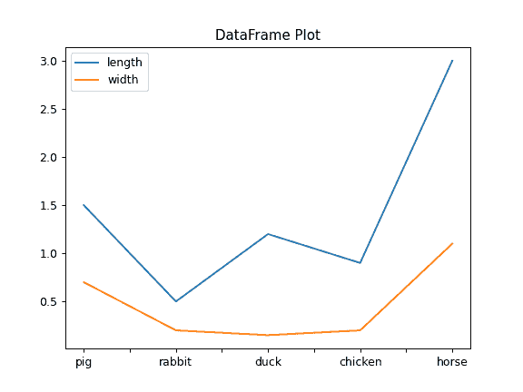
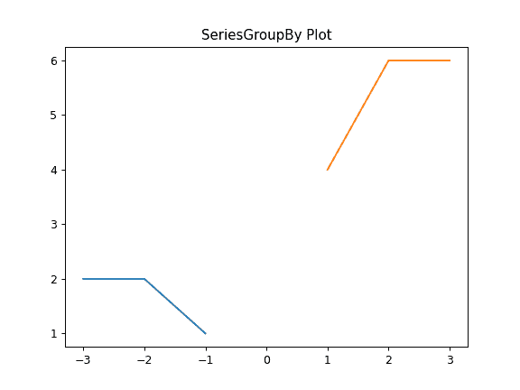
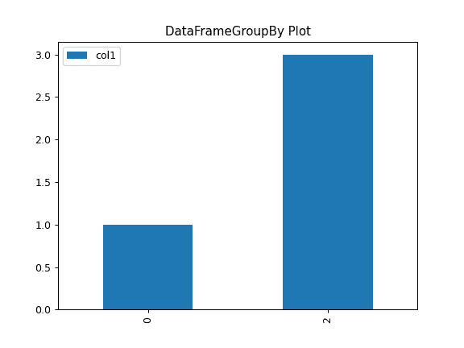
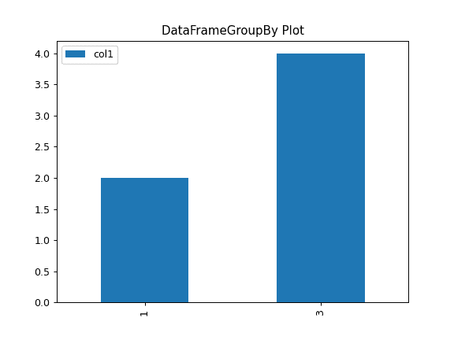

# pandas.core.groupby.DataFrameGroupBy.plot

> 原文：[`pandas.pydata.org/docs/reference/api/pandas.core.groupby.DataFrameGroupBy.plot.html`](https://pandas.pydata.org/docs/reference/api/pandas.core.groupby.DataFrameGroupBy.plot.html)

```py
property DataFrameGroupBy.plot
```

绘制 Series 或 DataFrame 的图。

使用由选项`plotting.backend`指定的后端。默认情况下，使用 matplotlib。

参数：

**data**Series 或 DataFrame

调用该方法的对象。

**x**标签或位置，默认为 None

仅当数据是 DataFrame 时使用。

**y**标签、位置或标签列表，默认为 None

允许绘制一列与另一列的图。仅当数据是 DataFrame 时使用。

**kind**字符串

要生成的图的类型：

+   ‘line’ ：线图（默认）

+   ‘bar’ ：垂直条形图

+   ‘barh’ ：水平条形图

+   ‘hist’ ：直方图

+   ‘box’ ：箱线图

+   ‘kde’ ：核密度估计图

+   ‘density’ ：与‘kde’相同

+   ‘area’ ：面积图

+   ‘pie’ ：饼图

+   ‘scatter’ ：散点图（仅 DataFrame）

+   ‘hexbin’ ：六边形图（仅 DataFrame）

**ax**matplotlib 轴对象，默认为 None

当前图的轴。

**subplots**布尔值或迭代序列，默认为 False

是否将列分组为子图：

+   `False` ：不使用子图

+   `True` ：为每列绘制单独的子图。

+   列标签的迭代序列：为每组列创建一个子图。例如[(‘a’, ‘c’), (‘b’, ‘d’)]将创建 2 个子图：一个包含列‘a’和‘c’，另一个包含列‘b’和‘d’。未指定的剩余列将在额外的子图中绘制（每列一个）。

    新版本 1.5.0 中的新功能。

**sharex**布尔值，默认为 None（matlab 样式默认值）

如果`subplots=True`，则共享 x 轴并将一些 x 轴标签设置为不可见；如果没有传递 ax，则默认为 True，否则如果传递了 ax，则为 False；请注意，传递 ax 和`sharex=True`将改变图中所有轴的所有 x 轴标签。

**sharey**布尔值，默认为 False

如果`subplots=True`，则共享 y 轴并设置一些 y 轴标签为不可见。

**layout**元组，可选

子图布局的（行，列）。

**figsize**一个元组（宽度，高度），单位为英寸

图对象的大小。

**use_index**布尔值，默认为 True

将索引用作 x 轴的刻度。

**title**字符串或列表

绘制图表时使用的标题。如果传递了字符串，则在图的顶部打印字符串。如果传递了列表并且`subplots`为 True，则在相应的子图上方打印列表中的每个项目。

**grid**布尔值，默认为 None（matlab 样式默认值）

轴网格线。

**legend**布尔值或{‘reverse’}

将图例放置在轴子图上。

**style**列表或字典

每列的 matplotlib 线样式。

**logx**布尔值或‘sym’，默认为 False

在 x 轴上使用对数比例尺或对数对比例尺。

**logy**布尔值或‘sym’默认为 False

在 y 轴上使用对数比例尺或对数对比例尺。

**loglog**布尔值或‘sym’，默认为 False

在 x 和 y 轴上使用对数比例尺或对数对比例尺。

**xticks**序列

用于 xticks 的值。

**yticks**序列

用于 yticks 的值。

**xlim**2-元组/列表

设置当前坐标轴的 x 范围。

**ylim** 2-元组/列表

设置当前坐标轴的 y 范围。

**xlabel** 标签，可选

用于 x 轴的 xlabel 的名称。默认使用索引名称作为 xlabel，或者对于平面图，使用 x 列名称。

在 2.0.0 版中更改：现在适用于直方图。

**ylabel** 标签，可选

用于 y 轴的 ylabel 的名称。默认不显示 ylabel，或者对于平面图，使用 y 列名称。

在 2.0.0 版中更改：现在适用于直方图。

**rot** 浮点数，默认��� None

刻度的旋转（垂直图的 xticks，水平图的 yticks）。

**fontsize** 浮点数，默认为 None

xticks 和 yticks 的字体大小。

**colormap** 字符串或 matplotlib 色图对象，默认为 None

选择颜色的色图。如果是字符串，则从 matplotlib 加载具有该名称的色图。

**colorbar** 布尔值，可选

如果为 True，则绘制颜色条（仅适用于“scatter”和“hexbin”图）。

**position** 浮点数

指定条形图布局的相对对齐方式。从 0（左/底部）到 1（右/顶部）。默认为 0.5（中心）。

**table** 布尔值、Series 或 DataFrame，默认为 False

如果为 True，则使用 DataFrame 中的数据绘制表格，并且数据将被转置以符合 matplotlib 的默认布局。如果传递了 Series 或 DataFrame，则使用传递的数据绘制表格。

**yerr** DataFrame、Series、类数组、字典和字符串

详细信息请参见带有误差条的绘图。

**xerr**DataFrame、Series、类数组、字典和字符串

与 yerr 相当。

**stacked** 布尔值，默认为线图和条形图中的 False，面积图中的 True

如果为 True，则创建堆叠图。

**secondary_y** 布尔值或序列，默认为 False

如果是列表/元组，则是否在次要 y 轴上绘图，以及要在次要 y 轴上绘制哪些列。

**mark_right** 布尔值，默认为 True

在使用 secondary_y 轴时，在图例中自动标记列标签为“(right)”。

**include_bool** 布尔值，默认为 False

如果为 True，则可以绘制布尔值。

**backend** 字符串，默认为 None

要使用的后端，而不是在选项 `plotting.backend` 中指定的后端。例如，“matplotlib”。或者，要为整个会话指定 `plotting.backend`，请设置 `pd.options.plotting.backend`。

****kwargs**

传递给 matplotlib 绘图方法的选项。

返回：

[`matplotlib.axes.Axes`](https://matplotlib.org/stable/api/_as-gen/matplotlib.axes.Axes.html#matplotlib.axes.Axes "(在 Matplotlib v3.8.4 中)") 或其 numpy.ndarray

如果后端不是默认的 matplotlib，则返回值将是后端返回的对象。

注意

+   有关此主题的更多信息，请在线查看 matplotlib 文档。

+   如果 kind = 'bar' 或 'barh'，则可以通过 position 关键字指定条形图布局的相对对齐方式。从 0（左/底部）到 1（右/顶部）。默认为 0.5（中心）。

示例

对于 Series：

```py
>>> ser = pd.Series([1, 2, 3, 3])
>>> plot = ser.plot(kind='hist', title="My plot") 
```


对于 DataFrame：

```py
>>> df = pd.DataFrame({'length': [1.5, 0.5, 1.2, 0.9, 3],
...                   'width': [0.7, 0.2, 0.15, 0.2, 1.1]},
...                   index=['pig', 'rabbit', 'duck', 'chicken', 'horse'])
>>> plot = df.plot(title="DataFrame Plot") 
```



对于 SeriesGroupBy：

```py
>>> lst = [-1, -2, -3, 1, 2, 3]
>>> ser = pd.Series([1, 2, 2, 4, 6, 6], index=lst)
>>> plot = ser.groupby(lambda x: x > 0).plot(title="SeriesGroupBy Plot") 
```



对于 DataFrameGroupBy：

```py
>>> df = pd.DataFrame({"col1" : [1, 2, 3, 4],
...                   "col2" : ["A", "B", "A", "B"]})
>>> plot = df.groupby("col2").plot(kind="bar", title="DataFrameGroupBy Plot") 
```


