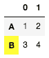
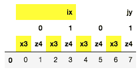

# pandas.io.formats.style.Styler.apply_index

> 原文：[`pandas.pydata.org/docs/reference/api/pandas.io.formats.style.Styler.apply_index.html`](https://pandas.pydata.org/docs/reference/api/pandas.io.formats.style.Styler.apply_index.html)

```py
Styler.apply_index(func, axis=0, level=None, **kwargs)
```

对索引或列标题按级别应用 CSS 样式函数。

使用结果更新 HTML 表示。

从 1.4.0 版本开始。

从 2.1.0 版本开始：`Styler.applymap_index`已被弃用并更名为`Styler.map_index`。

参数：

**func**函数

`func`应该接受一个 Series 并返回一个相同长度的字符串数组。

**axis**{0, 1, “index”, “columns”}

应用函数的标头。

**level**整数，字符串，列表，可选的

如果索引是 MultiIndex，则应用函数的级别。

****kwargs**字典

传递给`func`。

返回：

Styler

另请参阅

`Styler.map_index`

对标头逐个元素应用 CSS 样式函数。

`Styler.apply`

对列、行或整个表格应用 CSS 样式函数。

`Styler.map`

逐个元素应用 CSS 样式函数。

注意事项

`func`的每个输入将作为 Series 的索引，如果是索引，则为 MultiIndex 的级别。`func`的输出应该是相同大小的字符串数组，格式为“属性：值；属性 2：值 2；…”或，如果不想应用于该元素，则为空字符串或`None`。

示例

在索引中有条件地突出显示值的基本用法。

```py
>>> df = pd.DataFrame([[1,2], [3,4]], index=["A", "B"])
>>> def color_b(s):
...     return np.where(s == "B", "background-color: yellow;", "")
>>> df.style.apply_index(color_b) 
```



选择性地应用于 MultiIndex 列的特定级别。

```py
>>> midx = pd.MultiIndex.from_product([['ix', 'jy'], [0, 1], ['x3', 'z4']])
>>> df = pd.DataFrame([np.arange(8)], columns=midx)
>>> def highlight_x(s):
...     return ["background-color: yellow;" if "x" in v else "" for v in s]
>>> df.style.apply_index(highlight_x, axis="columns", level=[0, 2])
... 
```


