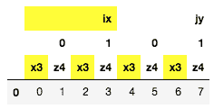

# pandas.io.formats.style.Styler.map_index

> 原文：[`pandas.pydata.org/docs/reference/api/pandas.io.formats.style.Styler.map_index.html`](https://pandas.pydata.org/docs/reference/api/pandas.io.formats.style.Styler.map_index.html)

```py
Styler.map_index(func, axis=0, level=None, **kwargs)
```

将 CSS 样式函数应用于索引或列标题，逐元素。

使用结果更新 HTML 表示。

新版本 1.4.0 中。

新版本 2.1.0 中：Styler.applymap_index 已被弃用，并更名为 Styler.map_index。

参数：

**func**function

`func` 应该接受一个标量并返回一个字符串。

**axis**{0, 1, “index”, “columns”}

应用函数的标题。

**level**int, str, list, optional

如果索引是多重索引，则应用函数的级别。

****kwargs**dict

传递给 `func`。

返回：

Styler

另请参阅

`Styler.apply_index`

逐级别应用 CSS 样式函数于标题。

`Styler.apply`

逐列、逐行或整个表格应用 CSS 样式函数。

`Styler.map`

逐元素应用 CSS 样式函数。

注释

`func` 的每个输入将是一个索引值（如果是索引）或多重索引的级别值。`func` 的输出应该是 CSS 样式字符串，格式为 ‘attribute: value; attribute2: value2; …’，或者，如果不应用于该元素，则为空字符串或 `None`。

示例

在索引中有条件地突出显示值的基本用法。

```py
>>> df = pd.DataFrame([[1,2], [3,4]], index=["A", "B"])
>>> def color_b(s):
...     return "background-color: yellow;" if v == "B" else None
>>> df.style.map_index(color_b) 
```


有选择地应用于多重索引列的特定级别。

```py
>>> midx = pd.MultiIndex.from_product([['ix', 'jy'], [0, 1], ['x3', 'z4']])
>>> df = pd.DataFrame([np.arange(8)], columns=midx)
>>> def highlight_x(v):
...     return "background-color: yellow;" if "x" in v else None
>>> df.style.map_index(highlight_x, axis="columns", level=[0, 2])
... 
```


