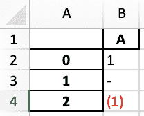

# pandas.io.formats.style.Styler.format

> 原文：[`pandas.pydata.org/docs/reference/api/pandas.io.formats.style.Styler.format.html`](https://pandas.pydata.org/docs/reference/api/pandas.io.formats.style.Styler.format.html)

```py
Styler.format(formatter=None, subset=None, na_rep=None, precision=None, decimal='.', thousands=None, escape=None, hyperlinks=None)
```

格式化单元格的文本显示值。

参数：

**formatter**字符串，可调用，字典或 None

用于定义值如何显示的对象。请参阅注释。

**subset**标签，类似数组，IndexSlice，可选

有效的 2D 输入用于 DataFrame.loc[<subset>]，或者在 1D 输入或单个键的情况下，用于 DataFrame.loc[:, <subset>]，其中列被优先考虑，以限制`data`在应用函数*之前*的范围。

**na_rep**字符串，可选

用于缺失值的表示。如果`na_rep`为 None，则不应用任何特殊格式。

**precision**整数，可选

用于显示目的的浮点精度，如果未由指定的`formatter`确定。

自版本 1.3.0 起新增。

**decimal**字符串，默认为“.”

用作浮点数、复数和整数的小数点分隔符的字符。

自版本 1.3.0 起新增。

**thousands**字符串，可选，默认为 None

用作浮点数、复数和整数的千位分隔符的字符。

自版本 1.3.0 起新增。

**escape**字符串，可选

使用‘html’将单元格显示字符串中的字符`&`，`<`，`>`，`'`和`"`替换为 HTML 安全序列。使用‘latex’将单元格显示字符串中的字符`&`，`%`，`$`，`#`，`_`，`{`，`}`，`~`，`^`和`\`替换为 LaTeX 安全序列。使用‘latex-math’以与‘latex’模式相同的方式替换字符，除了数学子字符串，这些子字符串要么被两个字符`$`包围，要么以字符`\(`开头，以`\)`结尾。转义在`formatter`之前完成。

自版本 1.3.0 起新增。

**超链接**{“html”, “latex”}，可选

将包含[https://](https://)、[http://](http://)、ftp://或 www.的字符串模式转换为 HTML <a>标签，作为可点击的 URL 超链接，如果是“html”，或者转换为 LaTeX href 命令，如果是“latex”。

自版本 1.4.0 起新增。

返回：

样式化器

另请参阅

`Styler.format_index`

格式化索引标签的文本显示值。

注释

此方法为 DataFrame 中的每个单元格分配一个格式化函数`formatter`。如果`formatter`为`None`，则使用默认格式化程序。如果是可调用的，则该函数应将数据值作为输入并返回可显示的表示，例如字符串。如果`formatter`给定为字符串，则假定为有效的 Python 格式规范，并将其包装为可调用的`string.format(x)`。如果给定一个`dict`，键应对应列名，值应为字符串或可调用对象，如上所述。

默认格式化程序当前使用 pandas 显示精度表示浮点数和复数，除非在此处使用`precision`参数。默认格式化程序不会调整缺失值的表示，除非使用`na_rep`参数。

`subset`参数定义要应用格式化函数的区域。如果以字典形式给出的`formatter`参数不包括子集中的所有列，则这些列将应用默认的 formatter。在 formatter 字典中排除在子集之外的任何列将被忽略。

当使用`formatter`字符串时，数据类型必须兼容，否则将引发 ValueError。

在实例化 Styler 时，可以通过设置`pandas.options`来应用默认格式：

> +   `styler.format.formatter`：默认为 None。
> +   
> +   `styler.format.na_rep`：默认为 None。
> +   
> +   `styler.format.precision`：默认为 6。
> +   
> +   `styler.format.decimal`：默认为“.”。
> +   
> +   `styler.format.thousands`：默认为 None。
> +   
> +   `styler.format.escape`：默认为 None。

警告

当使用输出格式`Styler.to_excel`时，`Styler.format`将被忽略，因为 Excel 和 Python 具有不同的格式结构。但是，可以使用数字格式伪 CSS 属性来强制 Excel 允许的格式。请参见示例。

示例

使用默认的`formatter`来使用`na_rep`和`precision`

```py
>>> df = pd.DataFrame([[np.nan, 1.0, 'A'], [2.0, np.nan, 3.0]])
>>> df.style.format(na_rep='MISS', precision=3)  
 0       1       2
0    MISS   1.000       A
1   2.000    MISS   3.000 
```

在一致的列数据类型上使用`formatter`规范

```py
>>> df.style.format('{:.2f}', na_rep='MISS', subset=[0,1])  
 0      1          2
0    MISS   1.00          A
1    2.00   MISS   3.000000 
```

对于未指定列使用默认的`formatter`

```py
>>> df.style.format({0: '{:.2f}', 1: '£ {:.1f}'}, na_rep='MISS', precision=1)
...  
 0      1     2
0    MISS   £ 1.0     A
1    2.00    MISS   3.0 
```

在默认的`formatter`下使用多个`na_rep`或`precision`规范。

```py
>>> (df.style.format(na_rep='MISS', precision=1, subset=[0])
...     .format(na_rep='PASS', precision=2, subset=[1, 2]))  
 0      1      2
0    MISS   1.00      A
1     2.0   PASS   3.00 
```

使用可调用的`formatter`函数。

```py
>>> func = lambda s: 'STRING' if isinstance(s, str) else 'FLOAT'
>>> df.style.format({0: '{:.1f}', 2: func}, precision=4, na_rep='MISS')
...  
 0        1        2
0    MISS   1.0000   STRING
1     2.0     MISS    FLOAT 
```

使用带有 HTML `escape`和`na_rep`的`formatter`。

```py
>>> df = pd.DataFrame([['<div></div>', '"A&B"', None]])
>>> s = df.style.format(
...     '<a href="a.com/{0}">{0}</a>', escape="html", na_rep="NA"
...     )
>>> s.to_html()  
...
<td .. ><a href="a.com/&lt;div&gt;&lt;/div&gt;">&lt;div&gt;&lt;/div&gt;</a></td>
<td .. ><a href="a.com/&#34;A&amp;B&#34;">&#34;A&amp;B&#34;</a></td>
<td .. >NA</td>
... 
```

在‘latex’模式下使用带有`escape`的`formatter`。

```py
>>> df = pd.DataFrame([["123"], ["~ ^"], ["$%#"]])
>>> df.style.format("\\textbf{{{}}}", escape="latex").to_latex()
...  
\begin{tabular}{ll}
 & 0 \\
0 & \textbf{123} \\
1 & \textbf{\textasciitilde \space \textasciicircum } \\
2 & \textbf{\$\%\#} \\
\end{tabular} 
```

在‘latex-math’模式下应用`escape`。在下面的示例中，我们使用字符`$`进入数学模式。

```py
>>> df = pd.DataFrame([[r"$\sum_{i=1}^{10} a_i$ a~b $\alpha \
...     = \frac{\beta}{\zeta²}$"], ["%#^ $ \$x² $"]])
>>> df.style.format(escape="latex-math").to_latex()
...  
\begin{tabular}{ll}
 & 0 \\
0 & $\sum_{i=1}^{10} a_i$ a\textasciitilde b $\alpha = \frac{\beta}{\zeta²}$ \\
1 & \%\#\textasciicircum \space $ \$x² $ \\
\end{tabular} 
```

我们可以使用字符`\(`进入数学模式，使用字符`\)`关闭数学模式。

```py
>>> df = pd.DataFrame([[r"\(\sum_{i=1}^{10} a_i\) a~b \(\alpha \
...     = \frac{\beta}{\zeta²}\)"], ["%#^ \( \$x² \)"]])
>>> df.style.format(escape="latex-math").to_latex()
...  
\begin{tabular}{ll}
 & 0 \\
0 & \(\sum_{i=1}^{10} a_i\) a\textasciitilde b \(\alpha
= \frac{\beta}{\zeta²}\) \\
1 & \%\#\textasciicircum \space \( \$x² \) \\
\end{tabular} 
```

如果在一个 DataFrame 单元格中同时使用数学公式的简写形式，将应用带有符号`$`的简写形式。

```py
>>> df = pd.DataFrame([[r"\( x² \)  $x²$"], \
...     [r"$\frac{\beta}{\zeta}$ \(\frac{\beta}{\zeta}\)"]])
>>> df.style.format(escape="latex-math").to_latex()
...  
\begin{tabular}{ll}
 & 0 \\
0 & \textbackslash ( x\textasciicircum 2 \textbackslash )  $x²$ \\
1 & $\frac{\beta}{\zeta}$ \textbackslash (\textbackslash
frac\{\textbackslash beta\}\{\textbackslash zeta\}\textbackslash ) \\
\end{tabular} 
```

Pandas 定义了一个数字格式伪 CSS 属性，而不是`.format`方法来创建`to_excel`允许的格式。请注意，分号是 CSS 受保护字符，但在 Excel 的格式字符串中用作分隔符。在定义格式时，请将分号替换为分节分隔符字符（ASCII-245）。

```py
>>> df = pd.DataFrame({"A": [1, 0, -1]})
>>> pseudo_css = "number-format: 0§Red§-§@;"
>>> filename = "formatted_file.xlsx"
>>> df.style.map(lambda v: pseudo_css).to_excel(filename) 
```


