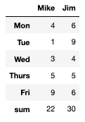
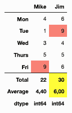

# pandas.io.formats.style.Styler.concat

> 原文：[`pandas.pydata.org/docs/reference/api/pandas.io.formats.style.Styler.concat.html`](https://pandas.pydata.org/docs/reference/api/pandas.io.formats.style.Styler.concat.html)

```py
Styler.concat(other)
```

添加另一个样式器以将输出组合成单个表格。

自 1.5.0 版本新增。

参数：

**其他**样式器

其他样式器对象已经被样式化和格式化。此样式器的数据必须与原始数据的列相同，并且索引级别的数量也必须相同才能正确呈现。

返回：

样式器

注意事项

此方法的目的是通过其他可能有用但不符合原始结构的指标来扩展现有的样式化数据框。例如，添加小计行，或显示诸如均值、方差或计数之类的指标。

使用 `apply`、`map`、`apply_index` 和 `map_index` 应用的样式以及使用 `format` 和 `format_index` 应用的格式将被保留。

警告

只有 `to_html`、`to_string` 和 `to_latex` 输出方法当前与拼接的样式器一起使用。

其他输出方法，包括 `to_excel`，**不适用于** 拼接的样式器。

应注意以下内容：

> +   `table_styles`、`table_attributes`、`caption` 和 `uuid` 都从原始样式器继承，而不是从 `other` 继承。
> +   
> +   隐藏的列和隐藏的索引级别将从原始样式器继承
> +   
> +   `css` 将从原始样式器继承，并且键 `data`、`row_heading` 和 `row` 的值将以 `foot0_` 开头。如果链接更多的拼接，它们的样式将以 `foot1_`、`foot2_` 等开头，如果一个拼接的样式有另一个拼接的样式，第二个样式将以 `foot{parent}_foot{child}_` 开头。

一个常见的用例是使用 `DataFrame.agg` 或者通过 `DataFrame.describe` 描述的统计信息来连接用户定义的函数。见示例。

示例

一个常见的用例是通过 `DataFrame.agg` 中计算的方法添加总行或其他内容。

```py
>>> df = pd.DataFrame([[4, 6], [1, 9], [3, 4], [5, 5], [9, 6]],
...                   columns=["Mike", "Jim"],
...                   index=["Mon", "Tue", "Wed", "Thurs", "Fri"])
>>> styler = df.style.concat(df.agg(["sum"]).style) 
```



由于拼接的对象是样式器，因此可以使用现有功能对其进行条件格式化以及对原始数据进行格式化。

```py
>>> descriptors = df.agg(["sum", "mean", lambda s: s.dtype])
>>> descriptors.index = ["Total", "Average", "dtype"]
>>> other = (descriptors.style
...          .highlight_max(axis=1, subset=(["Total", "Average"], slice(None)))
...          .format(subset=("Average", slice(None)), precision=2, decimal=",")
...          .map(lambda v: "font-weight: bold;"))
>>> styler = (df.style
...             .highlight_max(color="salmon")
...             .set_table_styles([{"selector": ".foot_row0",
...                                 "props": "border-top: 1px solid black;"}]))
>>> styler.concat(other) 
```



当 `other` 的索引级别少于原始样式器时，可以扩展 `other` 中的索引，并使用占位符级别。

```py
>>> df = pd.DataFrame([[1], [2]],
...                   index=pd.MultiIndex.from_product([[0], [1, 2]]))
>>> descriptors = df.agg(["sum"])
>>> descriptors.index = pd.MultiIndex.from_product([[""], descriptors.index])
>>> df.style.concat(descriptors.style) 
```
