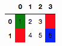
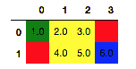
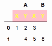
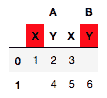

# `pandas.io.formats.style.Styler.pipe`

> 原文：[`pandas.pydata.org/docs/reference/api/pandas.io.formats.style.Styler.pipe.html`](https://pandas.pydata.org/docs/reference/api/pandas.io.formats.style.Styler.pipe.html)

```py
Styler.pipe(func, *args, **kwargs)
```

应用 `func(self, *args, **kwargs)`，并返回结果。

参数：

**func**函数

函数应用到 Styler 上。或者，一个`(callable, keyword)`元组，其中 `keyword` 是一个字符串，表示 `callable` 期望的 Styler 的关键字。

***args**可选

传递给 func 的参数。

****kwargs**可选

传递给 `func` 的关键字参数的字典。

返回值：

对象

`func` 的返回值。

另请参阅

`DataFrame.pipe`

DataFrame 的类似方法。

`Styler.apply`

对列、行或表进行 CSS 样式化函数的应用。

注释

与 `DataFrame.pipe()` 类似，此方法可以简化对 styler 应用多个用户定义函数的操作。而不是编写：

```py
f(g(df.style.format(precision=3), arg1=a), arg2=b, arg3=c) 
```

用户可以编写：

```py
(df.style.format(precision=3)
   .pipe(g, arg1=a)
   .pipe(f, arg2=b, arg3=c)) 
```

特别是，这允许用户定义接受 styler 对象以及其他参数的函数，并在进行样式更改后返回 styler（例如调用 `Styler.apply()` 或 `Styler.set_properties()`）。

示例

**常见用法**

一个常见的用法模式是预先定义样式化操作，这些操作可以轻松应用于单个 `pipe` 调用中的通用 styler。

```py
>>> def some_highlights(styler, min_color="red", max_color="blue"):
...      styler.highlight_min(color=min_color, axis=None)
...      styler.highlight_max(color=max_color, axis=None)
...      styler.highlight_null()
...      return styler
>>> df = pd.DataFrame([[1, 2, 3, pd.NA], [pd.NA, 4, 5, 6]], dtype="Int64")
>>> df.style.pipe(some_highlights, min_color="green") 
```



由于该方法返回一个 `Styler` 对象，因此可以像直接应用底层高亮器一样，将其与其他方法链接起来。

```py
>>> (df.style.format("{:.1f}")
...         .pipe(some_highlights, min_color="green")
...         .highlight_between(left=2, right=5)) 
```



**高级用法**

有时可能需要预先定义样式化函数，但在这些函数依赖于 styler、数据或上下文的情况下。由于 `Styler.use` 和 `Styler.export` 设计为非数据相关，因此不能用于此目的。此外，`Styler.apply` 和 `Styler.format` 类型方法不具有上下文感知能力，因此解决方案是使用 `pipe` 动态包装此功能。

假设我们想编写一个通用样式化函数，用于高亮显示多索引的最终级别。索引中级别的数量是动态的，因此我们需要 `Styler` 上下文来定义级别。

```py
>>> def highlight_last_level(styler):
...     return styler.apply_index(
...         lambda v: "background-color: pink; color: yellow", axis="columns",
...         level=styler.columns.nlevels-1
...     )  
>>> df.columns = pd.MultiIndex.from_product([["A", "B"], ["X", "Y"]])
>>> df.style.pipe(highlight_last_level) 
```



此外，假设我们希望在列头中高亮显示任何列中存在缺失数据的列。在这种情况下，我们需要数据对象本身来确定对列标题的影响。

```py
>>> def highlight_header_missing(styler, level):
...     def dynamic_highlight(s):
...         return np.where(
...             styler.data.isna().any(), "background-color: red;", ""
...         )
...     return styler.apply_index(dynamic_highlight, axis=1, level=level)
>>> df.style.pipe(highlight_header_missing, level=1) 
```


