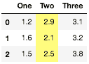
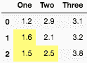
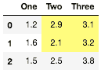
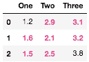

# `pandas.io.formats.style.Styler.highlight_between`

> 原文：[`pandas.pydata.org/docs/reference/api/pandas.io.formats.style.Styler.highlight_between.html`](https://pandas.pydata.org/docs/reference/api/pandas.io.formats.style.Styler.highlight_between.html)

```py
Styler.highlight_between(subset=None, color='yellow', axis=0, left=None, right=None, inclusive='both', props=None)
```

用样式突出显示定义范围。

新版本 1.3.0 中新增。

参数：

**subset**标签，类数组，IndexSlice，可选

有效的 2d 输入为 DataFrame.loc[<subset>]，或者在 1d 输入或单个键的情况下，为 DataFrame.loc[:, <subset>]，其中列被优先考虑，以在应用函���之前限制 `data`。

**color**str，默认为 ‘yellow’

用于突出显示的背景颜色。

**axis**{0 或 ‘index’，1 或 ‘columns’，None}，默认为 0

如果 `left` 或 `right` 作为序列给出，则沿着应用这些边界的轴。请参阅示例。

**left**标量或类似日期时间，或序列或类数组，默认为 None

定义范围的左边界。

**right**标量或类似日期时间，或序列或类数组，默认为 None

定义范围的右边界。

**inclusive**{‘both’，‘neither’，‘left’，‘right’}

识别边界是封闭还是开放的。

**props**str，默认为 None

用于突出显示的 CSS 属性。如果给定了 `props`，则不使用 `color`。

返回：

Styler

另请参阅

`Styler.highlight_null`

用样式突出显示缺失值。

`Styler.highlight_max`

用样式突出显示最大值。

`Styler.highlight_min`

用样式突出显示最小值。

`Styler.highlight_quantile`

用样式突出显示由分位数定义的值。

注意

如果 `left` 为 `None`，则仅应用右边界。如果 `right` 为 `None`，则仅应用左边界。如果两者都为 `None`，则突出显示所有值。

如果 `left` 或 `right` 作为序列或类数组对象提供，则只需要 `axis` 来对齐形状。如果 `left` 和 `right` 都是标量，则所有 `axis` 输入将给出相同结果。

此函数仅适用于兼容的 `dtypes`。例如，类似日期时间的区域只能使用等效的类似日期时间的 `left` 和 `right` 参数。使用 `subset` 来控制具有多个 `dtypes` 的区域。

示例

基本用法

```py
>>> df = pd.DataFrame({
...     'One': [1.2, 1.6, 1.5],
...     'Two': [2.9, 2.1, 2.5],
...     'Three': [3.1, 3.2, 3.8],
... })
>>> df.style.highlight_between(left=2.1, right=2.9) 
```



使用沿着 `axis` 的范围输入序列，在这种情况下为每列单独设置 `left` 和 `right`

```py
>>> df.style.highlight_between(left=[1.4, 2.4, 3.4], right=[1.6, 2.6, 3.6],
...     axis=1, color="#fffd75") 
```



使用 `axis=None` 并提供 `left` 参数作为与输入 DataFrame 匹配的数组，同时使用常量 `right`

```py
>>> df.style.highlight_between(left=[[2,2,3],[2,2,3],[3,3,3]], right=3.5,
...     axis=None, color="#fffd75") 
```



使用 `props` 替代默认的背景颜色

```py
>>> df.style.highlight_between(left=1.5, right=3.5,
...     props='font-weight:bold;color:#e83e8c') 
```


