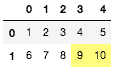
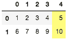
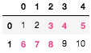

# pandas.io.formats.style.Styler.highlight_quantile

> 原文：[`pandas.pydata.org/docs/reference/api/pandas.io.formats.style.Styler.highlight_quantile.html`](https://pandas.pydata.org/docs/reference/api/pandas.io.formats.style.Styler.highlight_quantile.html)

```py
Styler.highlight_quantile(subset=None, color='yellow', axis=0, q_left=0.0, q_right=1.0, interpolation='linear', inclusive='both', props=None)
```

用样式突出显示由分位数定义的值。

新版本 1.3.0 中新增。

参数：

**subset**标签，类似数组，IndexSlice，可选

一个有效的 DataFrame.loc[<subset>] 的 2d 输入，或者在 1d 输入或单个键的情况下，对 DataFrame.loc[:, <subset>] 进行操作，其中列被优先考虑，以限制在应用该函数之前的数据。

**color**str，默认值 ‘yellow’

用于突出显示的背景颜色。

**axis**{0 或 ‘index’，1 或 ‘columns’，None}，默认值 0

用于确定并突出显示分位数的轴。如果 `None`，则分位数是在整个 DataFrame 上测量的。参见示例。

**q_left**float，默认值 0

目标分位数范围的左边界，位于 [0, q_right)。

**q_right**float，默认值 1

目标分位数范围的右边界，位于 (q_left, 1]。

**interpolation**{‘linear’, ‘lower’, ‘higher’, ‘midpoint’, ‘nearest’}

传递给 `Series.quantile` 或 `DataFrame.quantile` 以进行分位数估计的参数。

**inclusive**{‘both’, ‘neither’, ‘left’, ‘right’}

确定分位数边界是封闭还是开放。

**props**str，默认值 None

用于突出显示的 CSS 属性。如果给定了 `props`，则不使用 `color`。

返回：

Styler

另请参见

`Styler.highlight_null`

用样式突出显示缺失值。

`Styler.highlight_max`

用样式突出显示最大值。

`Styler.highlight_min`

用样式突出显示最小值。

`Styler.highlight_between`

用样式突出显示定义的范围。

注意

该函数不适用于 `str` 数据类型。

示例

使用 `axis=None` 并对所有集合数据应用一个分位数

```py
>>> df = pd.DataFrame(np.arange(10).reshape(2,5) + 1)
>>> df.style.highlight_quantile(axis=None, q_left=0.8, color="#fffd75")
... 
```



或者按行或按列突出显示分位数，在这种情况下按行突出显示

```py
>>> df.style.highlight_quantile(axis=1, q_left=0.8, color="#fffd75")
... 
```



使用 `props` 而不是默认的背景颜色

```py
>>> df.style.highlight_quantile(axis=None, q_left=0.2, q_right=0.8,
...     props='font-weight:bold;color:#e83e8c') 
```


