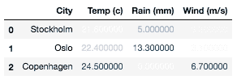
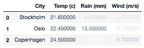
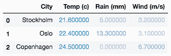
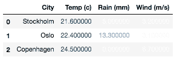
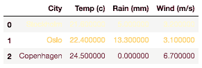
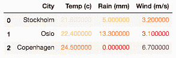

# pandas.io.formats.style.Styler.text_gradient

> 原文：[`pandas.pydata.org/docs/reference/api/pandas.io.formats.style.Styler.text_gradient.html`](https://pandas.pydata.org/docs/reference/api/pandas.io.formats.style.Styler.text_gradient.html)

```py
Styler.text_gradient(cmap='PuBu', low=0, high=0, axis=0, subset=None, vmin=None, vmax=None, gmap=None)
```

以渐变样式着色文本。

文本颜色根据每列、行或框架中的数据或给定的渐变映射确定。需要 matplotlib。

参数：

**cmap**str 或者 colormap

Matplotlib colormap。

**low**浮点数

在低端压缩颜色范围。这是数据范围的倍数，用于扩展到最小值以下；通常在[0, 1]之间取好值，默认为 0。

**high**浮点数

在高端压缩颜色范围。这是数据范围的倍数，用于扩展到最大值以上；通常在[0, 1]之间取好值，默认为 0。

**axis**{0, 1, “index”, “columns”, None}，默认 0

对每一列应用（`axis=0`或者`'index'`），对每一行应用（`axis=1`或者`'columns'`），或者一次性对整个 DataFrame 应用（`axis=None`）。

**subset**标签，类似数组，IndexSlice，可选

有效的 2d 输入 DataFrame.loc[<subset>]，或者在 1d 输入或单个键的情况下，DataFrame.loc[:, <subset>]，其中列被优先考虑，以限制在应用函数*之前*的`data`。

**vmin**浮点数，可选

对应于 colormap 最小值的最小数据值。如果未指定，将使用数据（或 gmap）的最小值。

**vmax**浮点数，可选

对应于 colormap 最大值的最大数据值。如果未指定，将使用数据（或 gmap）的最大值。

**gmap**类似数组，可选

用于确定文本颜色的渐变映射。如果未提供，将使用行、列或框架的基础数据。如果作为 ndarray 或类似列表提供，必须与基础数据的形状相同，考虑`axis`和`subset`。如果作为 DataFrame 或 Series 提供，必须具有相同的索引和列标签，考虑`axis`和`subset`。如果提供了`vmin`和`vmax`，应相对于此渐变映射给出。

新版本 1.3.0 中新增。

返回：

样式化器

另请参阅

`Styler.background_gradient`

以渐变样式着色背景。

注意

当使用`low`和`high`时，渐变范围由数据给出（如果未给出 gmap）或由 gmap 给出，在低端有效地扩展为 map.min - low * map.range，在高端为 map.max + high * map.range，然后归一化和确定颜色。

如果与`vmin`���`vmax`结合使用，map.min、map.max 和 map.range 将被根据从`vmin`和`vmax`派生的值替换。

该方法将预先选择数值列，并忽略非数值列，除非提供了`gmap`，在这种情况下不会进行预先选择。

示例

```py
>>> df = pd.DataFrame(columns=["City", "Temp (c)", "Rain (mm)", "Wind (m/s)"],
...                   data=[["Stockholm", 21.6, 5.0, 3.2],
...                         ["Oslo", 22.4, 13.3, 3.1],
...                         ["Copenhagen", 24.5, 0.0, 6.7]]) 
```

按列着色值，使用`axis=0`，预先选择数值列

```py
>>> df.style.text_gradient(axis=0) 
```



使用`axis=None`集体着色所有值

```py
>>> df.style.text_gradient(axis=None) 
```



从`低`和`高`两端压缩颜色映射

```py
>>> df.style.text_gradient(axis=None, low=0.75, high=1.0) 
```



手动设置`vmin`和`vmax`梯度阈值

```py
>>> df.style.text_gradient(axis=None, vmin=6.7, vmax=21.6) 
```



设置一个`gmap`并应用到所有具有另一个`cmap`的列

```py
>>> df.style.text_gradient(axis=0, gmap=df['Temp (c)'], cmap='YlOrRd')
... 
```



为一个数据框设置梯度映射（即`axis=None`），我们需要明确说明`subset`以匹配`gmap`的形状

```py
>>> gmap = np.array([[1,2,3], [2,3,4], [3,4,5]])
>>> df.style.text_gradient(axis=None, gmap=gmap,
...     cmap='YlOrRd', subset=['Temp (c)', 'Rain (mm)', 'Wind (m/s)']
... ) 
```


