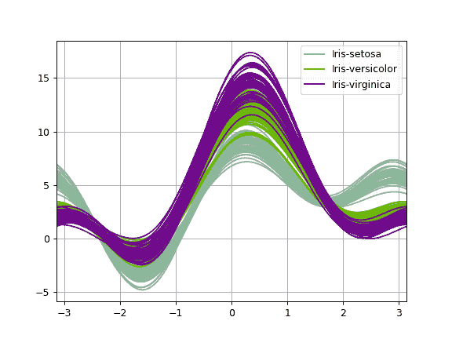

# pandas.plotting.andrews_curves

> 原文：[`pandas.pydata.org/docs/reference/api/pandas.plotting.andrews_curves.html`](https://pandas.pydata.org/docs/reference/api/pandas.plotting.andrews_curves.html)

```py
pandas.plotting.andrews_curves(frame, class_column, ax=None, samples=200, color=None, colormap=None, **kwargs)
```

生成用于可视化多变量数据聚类的 matplotlib 绘图。

Andrews 曲线的函数形式为：

\[f(t) = \frac{x_1}{\sqrt{2}} + x_2 \sin(t) + x_3 \cos(t) + x_4 \sin(2t) + x_5 \cos(2t) + \cdots\]

其中 \(x\) 系数对应于每个维度的值，\(t\) 在 \(-\pi\) 和 \(+\pi\) 之间线性间隔。然后，frame 的每一行对应于单个曲线。

参数：

**frame**DataFrame

待绘制的数据，最好归一化到（0.0，1.0）。

**类别列**label

包含类名的列的名称。

**ax**axes 对象，默认为 None

要使用的坐标轴。

**样本**int

每条曲线中要绘制的点数。

**颜色**str、list[str] 或 tuple[str]，可选

用于不同类别的颜色。颜色可以是字符串或 3 元浮点 RGB 值。

**色图**str 或 matplotlib 色图对象，默认为 None

要从中选择颜色的色图。如果是字符串，则从 matplotlib 加载该名称的色图。

****kwargs**

传递给 matplotlib 绘图方法的选项。

返回：

[`matplotlib.axes.Axes`](https://matplotlib.org/stable/api/_as-gen/matplotlib.axes.Axes.html#matplotlib.axes.Axes "(在 Matplotlib v3.8.4 中)")

示例

```py
>>> df = pd.read_csv(
...     'https://raw.githubusercontent.com/pandas-dev/'
...     'pandas/main/pandas/tests/io/data/csv/iris.csv'
... )
>>> pd.plotting.andrews_curves(df, 'Name') 
```


