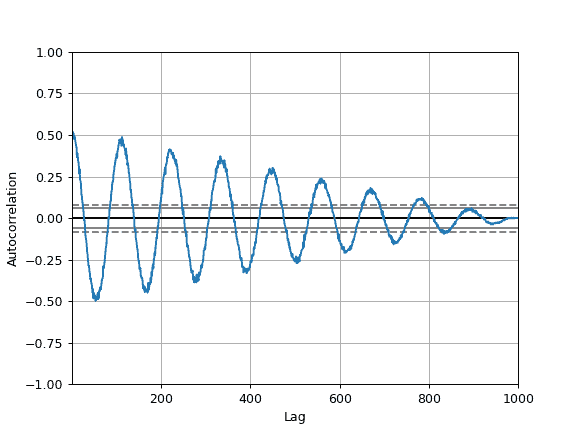

# `pandas.plotting.autocorrelation_plot`

> 原文：[`pandas.pydata.org/docs/reference/api/pandas.plotting.autocorrelation_plot.html`](https://pandas.pydata.org/docs/reference/api/pandas.plotting.autocorrelation_plot.html)

```py
pandas.plotting.autocorrelation_plot(series, ax=None, **kwargs)
```

时间序列的自相关图。

参数：

**series**Series

要可视化的时间序列。

**ax**Matplotlib 轴对象，可选

要使用的 matplotlib 轴对象。

****kwargs**

传递给 matplotlib 绘图方法的选项。

返回：

matplotlib.axes.Axes

示例

图中的水平线对应于 95%和 99%的置信区间。

虚线代表 99%的置信区间。

```py
>>> spacing = np.linspace(-9 * np.pi, 9 * np.pi, num=1000)
>>> s = pd.Series(0.7 * np.random.rand(1000) + 0.3 * np.sin(spacing))
>>> pd.plotting.autocorrelation_plot(s) 
```


