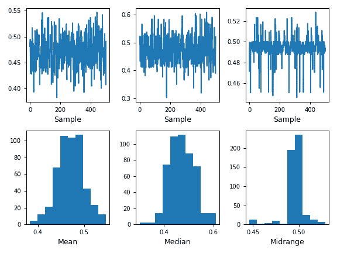

# pandas.plotting.bootstrap_plot

> 原文：[`pandas.pydata.org/docs/reference/api/pandas.plotting.bootstrap_plot.html`](https://pandas.pydata.org/docs/reference/api/pandas.plotting.bootstrap_plot.html)

```py
pandas.plotting.bootstrap_plot(series, fig=None, size=50, samples=500, **kwds)
```

均值、中位数和中程统计的自举绘图。

自举绘图用于通过依赖带有替换的随机抽样来估计统计量的不确定性[[1]](#r11075647b7c8-1)。此函数将为给定大小的给定样本数生成均值、中位数和中程统计的自举绘图。

[1]

在[`en.wikipedia.org/wiki/Bootstrapping_%28statistics%29`](https://en.wikipedia.org/wiki/Bootstrapping_%28statistics%29)中的“自举法（统计学）”

参数：

**series**pandas.Series

从中获取自举抽样的 Series。

**fig**matplotlib.figure.Figure，默认为 None

如果给定，它将使用 fig 引用进行绘图，而不是使用默认参数创建一个新的。

**size**int，默认为 50

在每次抽样中考虑的数据点数。它必须小于或等于系列的长度。

**samples**int，默认为 500

执行自举程序的次数。

****kwds**

传递给 matplotlib 绘图方法的选项。

返回：

matplotlib.figure.Figure

Matplotlib 图。

另请参见

`pandas.DataFrame.plot`

DataFrame 对象的基本绘图。

`pandas.Series.plot`

Series 对象的基本绘图。

示例

此示例为 Series 绘制了一个基本的自举绘图。

```py
>>> s = pd.Series(np.random.uniform(size=100))
>>> pd.plotting.bootstrap_plot(s)  
<Figure size 640x480 with 6 Axes> 
```


