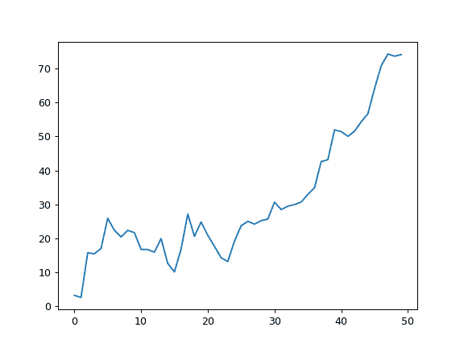
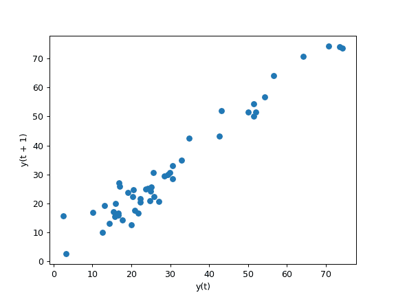

# `pandas.plotting.lag_plot`

> 原文：[`pandas.pydata.org/docs/reference/api/pandas.plotting.lag_plot.html`](https://pandas.pydata.org/docs/reference/api/pandas.plotting.lag_plot.html)

```py
pandas.plotting.lag_plot(series, lag=1, ax=None, **kwds)
```

时间序列的滞后图。

参数：

**series**系列

要可视化的时间序列。

**lag**int，默认为 1

散点图的滞后长度。

**ax**Matplotlib 坐标轴对象，可选

要使用的 matplotlib 坐标轴对象。

****kwds**

Matplotlib 散点图方法的关键字参数。

返回：

matplotlib.axes.Axes

示例

滞后图最常用于查找时间序列数据中的模式。

给定以下时间序列

```py
>>> np.random.seed(5)
>>> x = np.cumsum(np.random.normal(loc=1, scale=5, size=50))
>>> s = pd.Series(x)
>>> s.plot() 
```



使用 `lag=1` 的滞后图返回

```py
>>> pd.plotting.lag_plot(s, lag=1)
<Axes: xlabel='y(t)', ylabel='y(t + 1)'> 
```


