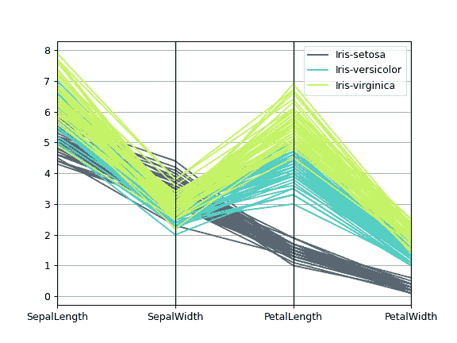

# `pandas.plotting.parallel_coordinates`

> 原文：[`pandas.pydata.org/docs/reference/api/pandas.plotting.parallel_coordinates.html`](https://pandas.pydata.org/docs/reference/api/pandas.plotting.parallel_coordinates.html)

```py
pandas.plotting.parallel_coordinates(frame, class_column, cols=None, ax=None, color=None, use_columns=False, xticks=None, colormap=None, axvlines=True, axvlines_kwds=None, sort_labels=False, **kwargs)
```

平行坐标绘图。

参数：

**frame**数据帧

**class_column**字符串

包含类名的列名。

**cols**列表，可选

要使用的列名列表。

**ax**matplotlib.axis，可选

Matplotlib 坐标轴对象。

**color**列表或元组，可选

用于不同类别的颜色。

**use_columns**布尔值，可选

如果为真，则列将用作 xticks。

**xticks**列表或元组，可选

用于 xticks 的值列表。

**colormap**字符串或 matplotlib 色图，默认为 None

用于线颜色的色图。

**axvlines**布尔值，可选

如果为真，则在每个 xtick 处添加垂直线。

**axvlines_kwds**关键字，可选

传递给垂直线的 axvline 方法的选项。

**sort_labels**布尔值，默认为 False

对 class_column 标签进行排序，在分配颜色时有用。

****kwargs**

传递给 matplotlib 绘图方法的选项。

返回：

matplotlib.axes.Axes

示例

```py
>>> df = pd.read_csv(
...     'https://raw.githubusercontent.com/pandas-dev/'
...     'pandas/main/pandas/tests/io/data/csv/iris.csv'
... )
>>> pd.plotting.parallel_coordinates(
...     df, 'Name', color=('#556270', '#4ECDC4', '#C7F464')
... ) 
```


