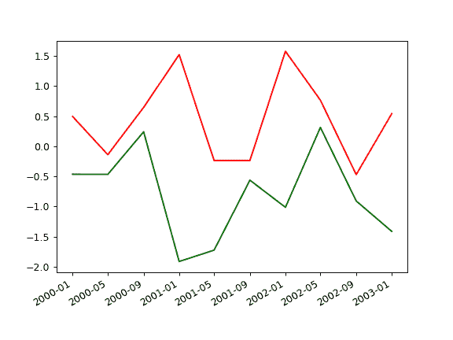

# pandas.plotting.plot_params

> 原文：[`pandas.pydata.org/docs/reference/api/pandas.plotting.plot_params.html`](https://pandas.pydata.org/docs/reference/api/pandas.plotting.plot_params.html)

```py
pandas.plotting.plot_params = {'xaxis.compat': False}
```

存储 pandas 绘图选项。

允许参数别名，因此您可以直接使用与绘图函数参数相同的参数名称，但以便于后续分组的规范格式存储。

示例

```py
>>> np.random.seed(42)
>>> df = pd.DataFrame({'A': np.random.randn(10),
...                   'B': np.random.randn(10)},
...                   index=pd.date_range("1/1/2000",
...                   freq='4MS', periods=10))
>>> with pd.plotting.plot_params.use("x_compat", True):
...     _ = df["A"].plot(color="r")
...     _ = df["B"].plot(color="g") 
```


