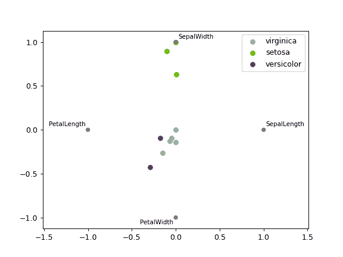

# pandas.plotting.radviz

> 原文：[`pandas.pydata.org/docs/reference/api/pandas.plotting.radviz.html`](https://pandas.pydata.org/docs/reference/api/pandas.plotting.radviz.html)

```py
pandas.plotting.radviz(frame, class_column, ax=None, color=None, colormap=None, **kwds)
```

在二维空间中绘制多维数据集。

DataFrame 中的每个 Series 被表示为圆上均匀分布的切片。根据每个 Series 上的值，在圆中渲染每个数据点。在 DataFrame 中高度相关的 Series 被放置在单位圆上更接近的位置。

RadViz 允许将 N 维数据集投影到二维空间中，在此空间中，每个维度的影响可以解释为所有维度的影响之间的平衡。

在描述 RadViz 的[原始文章](https://doi.org/10.1145/331770.331775)中提供了更多信息。

参数：

**帧**DataFrame

持有数据的对象。

**类别列**str

包含数据点类别名称的列名。

**ax**[`matplotlib.axes.Axes`](https://matplotlib.org/stable/api/_as_gen/matplotlib.axes.Axes.html#matplotlib.axes.Axes "(在 Matplotlib v3.8.4 中)")，可选

要添加信息的绘图实例。

**颜色**list[str] 或 tuple[str]，可选

为每个类别分配一种颜色。例如：[‘blue’, ‘green’]。

**颜色映射**str 或 [`matplotlib.colors.Colormap`](https://matplotlib.org/stable/api/_as_gen/matplotlib.colors.Colormap.html#matplotlib.colors.Colormap "(在 Matplotlib v3.8.4 中)")，默认为 None

用于选择颜色的颜色映射。如果是字符串，则从 matplotlib 加载该名称的颜色映射。

****kwds**

传递给 matplotlib 散点绘图方法的选项。

返回：

[`matplotlib.axes.Axes`](https://matplotlib.org/stable/api/_as_gen/matplotlib.axes.Axes.html#matplotlib.axes.Axes "(在 Matplotlib v3.8.4 中)")

另请参阅

`pandas.plotting.andrews_curves`

绘制聚类可视化。

示例

```py
>>> df = pd.DataFrame(
...     {
...         'SepalLength': [6.5, 7.7, 5.1, 5.8, 7.6, 5.0, 5.4, 4.6, 6.7, 4.6],
...         'SepalWidth': [3.0, 3.8, 3.8, 2.7, 3.0, 2.3, 3.0, 3.2, 3.3, 3.6],
...         'PetalLength': [5.5, 6.7, 1.9, 5.1, 6.6, 3.3, 4.5, 1.4, 5.7, 1.0],
...         'PetalWidth': [1.8, 2.2, 0.4, 1.9, 2.1, 1.0, 1.5, 0.2, 2.1, 0.2],
...         'Category': [
...             'virginica',
...             'virginica',
...             'setosa',
...             'virginica',
...             'virginica',
...             'versicolor',
...             'versicolor',
...             'setosa',
...             'virginica',
...             'setosa'
...         ]
...     }
... )
>>> pd.plotting.radviz(df, 'Category') 
```


