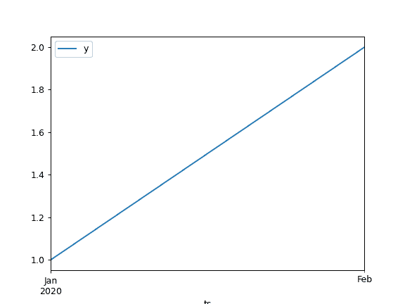

# pandas.plotting.register_matplotlib_converters

> 原文：[`pandas.pydata.org/docs/reference/api/pandas.plotting.register_matplotlib_converters.html`](https://pandas.pydata.org/docs/reference/api/pandas.plotting.register_matplotlib_converters.html)

```py
pandas.plotting.register_matplotlib_converters()
```

使用 matplotlib 注册 pandas 格式化程序和转换器。

此函数修改全局`matplotlib.units.registry`字典。pandas 添加了自定义转换器以

+   pd.Timestamp

+   pd.Period

+   np.datetime64

+   datetime.datetime

+   datetime.date

+   datetime.time

另请参见

`deregister_matplotlib_converters`

移除 pandas 格式化程序和转换器。

示例

以下行由 pandas 自动完成，以便能够渲染绘图：

```py
>>> pd.plotting.register_matplotlib_converters() 
```

```py
>>> df = pd.DataFrame({'ts': pd.period_range('2020', periods=2, freq='M'),
...                    'y': [1, 2]
...                    })
>>> plot = df.plot.line(x='ts', y='y') 
```



手动取消注册会引发错误：

```py
>>> pd.set_option("plotting.matplotlib.register_converters",
...               False)  
>>> df.plot.line(x='ts', y='y')  
Traceback (most recent call last):
TypeError: float() argument must be a string or a real number, not 'Period' 
```
