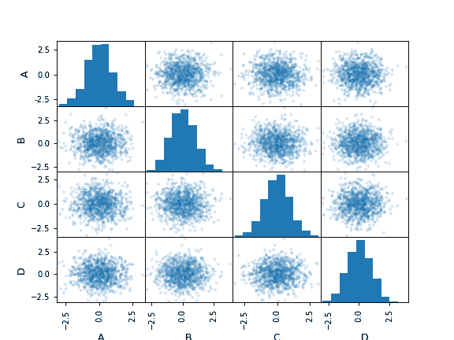

# pandas.plotting.scatter_matrix

> 原文：[`pandas.pydata.org/docs/reference/api/pandas.plotting.scatter_matrix.html`](https://pandas.pydata.org/docs/reference/api/pandas.plotting.scatter_matrix.html)

```py
pandas.plotting.scatter_matrix(frame, alpha=0.5, figsize=None, ax=None, grid=False, diagonal='hist', marker='.', density_kwds=None, hist_kwds=None, range_padding=0.05, **kwargs)
```

绘制散点矩阵。

参数：

**frame**DataFrame

**alpha**float，可选

应用的透明度量。

**figsize**(float,float)，可选

以英寸为单位的元组（宽度，高度）。

**ax**Matplotlib 轴对象，可选

**grid**bool，可选

将此设置为 True 将显示网格。

**diagonal**{‘hist’, ‘kde’}

在对角线上选择‘kde’和‘hist’，分别用于核密度估计或直方图绘制。

**marker**str，可选

Matplotlib 标记类型，默认为 ‘.’。

**density_kwds**关键字

要传递给核密度估计图的关键字参数。

**hist_kwds**关键字

要传递给 hist 函数的关键字参数。

**range_padding**float，默认值为 0.05

相对于 (x_max - x_min) 或 (y_max - y_min) 的 x 和 y 轴范围的相对扩展。

****kwargs**

要传递给散点函数的关键字参数。

返回：

numpy.ndarray

散点矩阵。

示例

```py
>>> df = pd.DataFrame(np.random.randn(1000, 4), columns=['A','B','C','D'])
>>> pd.plotting.scatter_matrix(df, alpha=0.2)
array([[<Axes: xlabel='A', ylabel='A'>, <Axes: xlabel='B', ylabel='A'>,
 <Axes: xlabel='C', ylabel='A'>, <Axes: xlabel='D', ylabel='A'>],
 [<Axes: xlabel='A', ylabel='B'>, <Axes: xlabel='B', ylabel='B'>,
 <Axes: xlabel='C', ylabel='B'>, <Axes: xlabel='D', ylabel='B'>],
 [<Axes: xlabel='A', ylabel='C'>, <Axes: xlabel='B', ylabel='C'>,
 <Axes: xlabel='C', ylabel='C'>, <Axes: xlabel='D', ylabel='C'>],
 [<Axes: xlabel='A', ylabel='D'>, <Axes: xlabel='B', ylabel='D'>,
 <Axes: xlabel='C', ylabel='D'>, <Axes: xlabel='D', ylabel='D'>]],
 dtype=object) 
```


