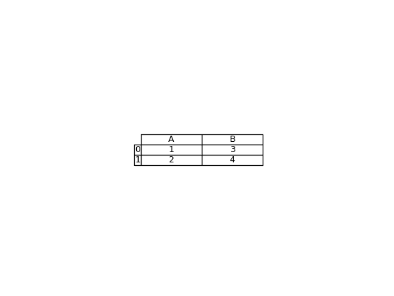

# `pandas.plotting.table`

> 原文：[`pandas.pydata.org/docs/reference/api/pandas.plotting.table.html`](https://pandas.pydata.org/docs/reference/api/pandas.plotting.table.html)

```py
pandas.plotting.table(ax, data, **kwargs)
```

将 DataFrame 和 Series 转换为 matplotlib.table 的辅助函数。

参数：

**ax**Matplotlib 轴对象

**data**DataFrame 或 Series

表内容的数据。

****kwargs**

要传递给 matplotlib.table.table 的关键字参数。如果未指定 rowLabels 或 colLabels，则使用数据索引或列名。

返回：

matplotlib 表对象

示例

```py
>>> import matplotlib.pyplot as plt
>>> df = pd.DataFrame({'A': [1, 2], 'B': [3, 4]})
>>> fix, ax = plt.subplots()
>>> ax.axis('off')
(0.0, 1.0, 0.0, 1.0)
>>> table = pd.plotting.table(ax, df, loc='center',
...                           cellLoc='center', colWidths=list([.2, .2])) 
```


