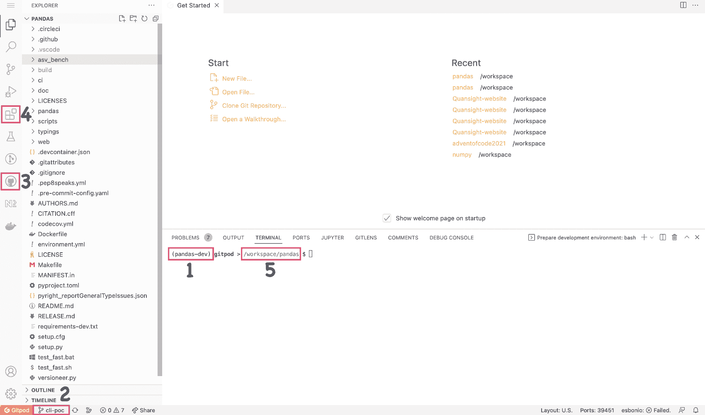
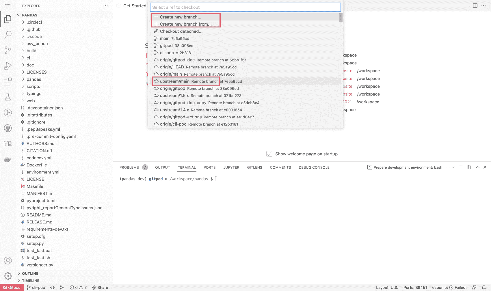
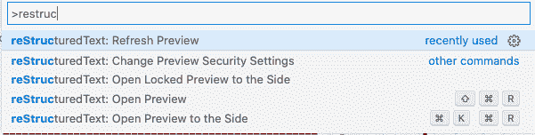
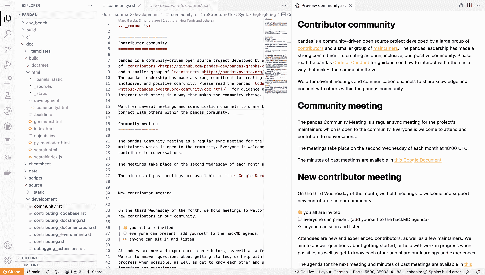
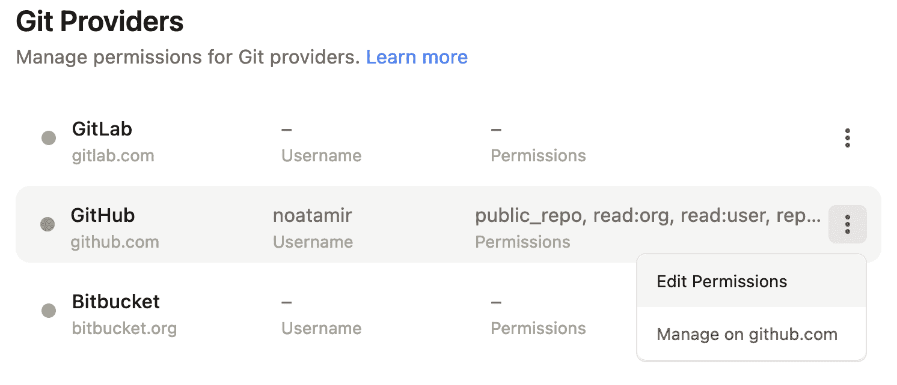
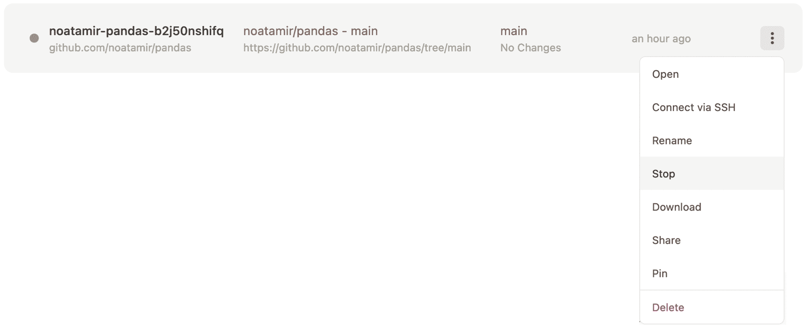
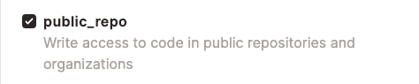

# 使用 Gitpod 进行 pandas 开发

> 原文：[`pandas.pydata.org/docs/development/contributing_gitpod.html`](https://pandas.pydata.org/docs/development/contributing_gitpod.html)

本文档的这一部分将指导你完成：

+   使用 Gitpod 进行你的 pandas 开发环境

+   在 GitHub 上创建一个个人分叉的 pandas 存储库

+   pandas 和 VSCode 的快速浏览

+   在 Gitpod 中工作 pandas 文档

## Gitpod

[Gitpod](https://www.gitpod.io/) 是一个开源平台，用于自动化和准备就绪的开发环境。它使开发人员能够将他们的开发环境描述为代码，并直接从浏览器开始每个新任务的即时和新鲜的开发环境。这减少了安装本地开发环境和处理不兼容依赖关系的需要。

## Gitpod GitHub 集成

要能够使用 Gitpod，你需要在你的 GitHub 帐户上安装 Gitpod 应用程序，所以如果你还没有帐户，你需要首先创建一个。

要开始使用，请在 [Gitpod](https://www.gitpod.io/) 登录，并授予 GitHub 适当的权限。

我们构建了一个 python 3.10 环境，并且所有开发依赖项都将在环境启动时安装。

## 分叉 pandas 存储库

作为贡献者在 pandas 上工作的最佳方式是首先制作存储库的分叉。

1.  浏览到 [GitHub 上的 pandas 存储库](https://github.com/pandas-dev/pandas) 并[创建你自己的分叉](https://help.github.com/en/articles/fork-a-repo)。

1.  浏览到你的分叉。你的分叉将有一个类似于 [noatamir/pandas-dev](https://github.com/noatamir/pandas-dev) 的 URL，只是用你的 GitHub 用户名代替 `noatamir`。

## 启动 Gitpod

一旦你通过 GitHub 对 Gitpod 进行了身份验证，你就可以安装 [Gitpod Chromium 或 Firefox 浏览器扩展程序](https://www.gitpod.io/docs/browser-extension)，它将在存储库的 **Code** 按钮旁边添加一个 **Gitpod** 按钮：


1.  如果你安装了扩展程序 - 你可以点击 **Gitpod** 按钮启动新的工作区。

1.  或者，如果你不想安装浏览器扩展程序，你可以访问[`gitpod.io/#https://github.com/USERNAME/pandas`](https://gitpod.io/#https://github.com/USERNAME/pandas)，将`USERNAME`替换为你的 GitHub 用户名。

1.  在这两种情况下，这将在你的网络浏览器中打开一个新的标签，并开始构建你的开发环境。请注意，这可能需要几分钟的时间。

1.  构建完成后，你将被引导到你的工作区，包括 VSCode 编辑器和你在 pandas 上工作所需的所有依赖项。当你第一次启动你的工作区时，你会注意到可能有一些操作正在运行。这将确保你安装了 pandas 的开发版本。

1.  当你的工作区准备好时，你可以通过输入来测试构建：

    ```py
    $ python -m pytest pandas 
    ```

    请注意，此命令运行时间较长，因此一旦确认正在运行，您可能希望使用 ctrl-c 取消它。

## 快速的工作空间导览

Gitpod 使用 VSCode 作为编辑器。如果您以前没有使用过此编辑器，则可以查看入门 [VSCode 文档](https://code.visualstudio.com/docs/getstarted/tips-and-tricks) 以熟悉它。

您的工作空间将类似于下图所示：



我们在编辑器中标记了一些重要的部分：

1.  您当前的 Python 解释器 - 默认情况下，这是 `pandas-dev`，应显示在状态栏和终端上。您不需要激活 conda 环境，因为这将始终为您激活。

1.  您当前的分支始终显示在状态栏中。您还可以使用此按钮来更改或创建分支。

1.  GitHub 拉取请求扩展 - 您可以使用此扩展从工作空间处理拉取请求。

1.  市场扩展 - 我们已向 pandas Gitpod 添加了一些基本扩展。但是，您还可以为自己安装其他扩展或语法突出显示主题，这些扩展将为您保留。

1.  您的工作空间目录 - 默认情况下，它是 `/workspace/pandas-dev`。**不要更改此目录**，因为这是 Gitpod 中保留的唯一目录。

我们还预先安装了一些工具和 VSCode 扩展，以帮助开发体验：

+   [VSCode rst 扩展](https://marketplace.visualstudio.com/items?itemName=lextudio.restructuredtext)

+   [Markdown All in One](https://marketplace.visualstudio.com/items?itemName=yzhang.markdown-all-in-one)

+   [VSCode Gitlens 扩展](https://marketplace.visualstudio.com/items?itemName=eamodio.gitlens)

+   [VSCode Git 图形扩展](https://marketplace.visualstudio.com/items?itemName=mhutchie.git-graph)

## 通过 Gitpod 进行开发的工作流程

本文档的 为 pandas 做贡献 部分包含有关 pandas 开发工作流程的信息。在开始工作之前，请确保查看此内容。

使用 Gitpod 时，git 已为您预先配置：

1.  您不需要配置 git 用户名和电子邮件，因为在通过 GitHub 进行身份验证时应已完成此操作。除非您正在使用 GitHub 功能保持电子邮件地址私密。您可以在终端中使用命令 `git config --list` 检查 git 配置。使用 `git config --global user.email “your-secret-email@users.noreply.github.com”` 将您的电子邮件地址设置为您在 github 个人资料中使用的电子邮件地址进行提交。

1.  由于你是从自己的 pandas 分支开始工作的，默认情况下会将 `upstream` 和 `origin` 添加为远程。您可以在终端上键入 `git remote` 来验证此操作，或者单击状态栏上的 **分支名称**（参见下图）。

    

## 渲染 pandas 文档

你可以在如何构建 pandas 文档部分找到有关如何使用 Sphinx 渲染文档的详细文档。要构建完整的文档，你需要在`/doc`目录中运行以下命令：

```py
$ cd doc
$ python make.py html 
```

或者你可以构建一个单页，使用：

```py
python make.py --single development/contributing_gitpod.rst 
```

在 Gitpod 中，你有两个主要选项来渲染文档。

### 选项 1：使用 Liveserve

1.  在`pandas/doc/build/html`中查看文档。

1.  要查看页面的渲染版本，你可以右键点击`.html`文件，然后点击**使用 Live Serve 打开**。另外，你也可以在编辑器中打开文件，然后点击状态栏上的**Go live**按钮。

    > 

1.  一个简单的浏览器将会在编辑器的右侧打开。我们建议关闭它，然后点击弹出窗口中的**在浏览器中打开**按钮。

1.  要停止服务器，请点击状态栏上的**端口：5500**按钮。

### 选项 2：使用 rst 扩展

一个快速简便的方法来在你编辑`.rst`文件时查看实时更改，就是使用 docutils 的 rst 扩展。

注意

这将生成一个简单的文档实时预览，没有`html`主题，有些反向链接可能不会被正确添加。但这是一个轻松和简便的方式来即时获取你的工作反馈，而不需要构建 html 文件。

1.  在编辑器中打开位于`doc/source`中的任何源文档文件。

1.  在 Mac 上使用``Cmd`-`Shift`-`P``或在 Linux 和 Windows 上使用``Ctrl`-`Shift`-`P``打开 VSCode 命令面板。开始输入“restructured”，然后选择“打开预览”或“打开侧边预览”。

    > 

1.  当你编辑文档时，你会在编辑器上看到实时渲染。

    > 

如果你想要看到带有`html`主题的最终输出，你需��使用`make html`重新构建文档，并按照选项 1 中描述的使用 Live Serve。

## 常见问题和故障排除

### 我的 Gitpod 工作区会被保留多久？

如果你不使用，你停止的工作区将会保留 14 天，之后将会被删除。

### 我可以回到之前的工作区吗？

是的，假设你离开一段时间，想继续在你的 pandas 贡献上工作。你需要访问[`gitpod.io/workspaces`](https://gitpod.io/workspaces)，然后点击你想要重新启动的工作区。你的所有更改将会保留，就像你上次离开的那样。

### 我可以安装额外的 VSCode 扩展吗？

当然！你安装的任何扩展都将被安装在你自己的工作区中并得到保留。

### 我在 Gitpod 上注册了，但我仍然看不到我的存储库中的`Gitpod`按钮。

前往 [`gitpod.io/integrations`](https://gitpod.io/integrations) 并确保您已登录。将鼠标悬停在 GitHub 上，然后单击右侧出现的三个按钮。单击编辑权限，确保您已选中 `user:email`、`read:user` 和 `public_repo`。单击 **更新权限** 并在 GitHub 应用页面上确认更改。



### 如果我不使用工作区，它会保持活动多长时间？

如果您在浏览器选项卡中保持工作区处于打开状态但不与其交互，它将在 30 分钟后关闭。如果关闭浏览器选项卡，它将在 3 分钟后关闭。

### 我的终端是空白的 - 没有光标，完全没有响应

不幸的是，这是 Gitpod 方面已知的问题。您可以通过两种方式解决此问题：

1.  新建一个全新的 Gitpod 工作区。

1.  前往您的 [Gitpod 仪表板](https://gitpod.io/workspaces) 并找到正在运行的工作区。将鼠标悬停在其上，然后单击 **三个点菜单**，然后单击 **停止**。当工作区完全停止时，您可以单击其名称重新启动它。



### 我通过 GitHub 进行了身份验证，但仍然无法通过 Gitpod 提交到仓库。

前往 [`gitpod.io/integrations`](https://gitpod.io/integrations) 并确保您已登录。将鼠标悬停在 GitHub 上，然后单击右侧出现的三个按钮。单击编辑权限，确保您已选中 `public_repo`。单击 **更新权限** 并在 GitHub 应用页面上确认更改。



## 致谢

此页面是从 [NumPy](https://www.numpy.org/) 项目轻微调整的。

## Gitpod

[Gitpod](https://www.gitpod.io/) 是一个用于自动化和即用即开发的开源平台，它使开发人员能够将他们的开发环境描述为代码，并直接从浏览器为每个新任务启动即时而新鲜的开发环境。这减少了安装本地开发环境和处理不兼容依赖项的需求。

## Gitpod GitHub 集成

要使用 Gitpod，您需要在 GitHub 帐户上安装 Gitpod 应用程序，因此，如果您尚未拥有帐户，则需要首先创建一个。

要开始工作，只需在 [Gitpod](https://www.gitpod.io/) 登录，并为 GitHub 授予适当的权限。

我们已构建了一个 Python 3.10 环境，并且所有开发依赖项都将在环境启动时安装。

## 创建 pandas 仓库的分支

作为贡献者工作 pandas 的最佳方式是首先创建该仓库的分支。

1.  浏览到[GitHub 上的 pandas 存储库](https://github.com/pandas-dev/pandas)并[创建你自己的分支](https://help.github.com/en/articles/fork-a-repo)。

1.  浏览到你的分支。你的分支将有一个类似于[noatamir/pandas-dev](https://github.com/noatamir/pandas-dev)的 URL，只是将`noatamir`替换为你的 GitHub 用户名。

## 启动 Gitpod

一旦通过 GitHub 在 Gitpod 上进行了身份验证，你可以安装[Gitpod Chromium 或 Firefox 浏览器扩展](https://www.gitpod.io/docs/browser-extension)，它将在存储库中的**Code**按钮旁边添加一个**Gitpod**按钮：


1.  如果你安装了扩展 - 你可以点击**Gitpod**按钮启动一个新的工作空间。

1.  或者，如果你不想安装浏览器扩展，你可以访问[`gitpod.io/#https://github.com/USERNAME/pandas`](https://gitpod.io/#https://github.com/USERNAME/pandas)，将`USERNAME`替换为你的 GitHub 用户名。

1.  在这两种情况下，这将在你的网络浏览器上打开一个新标签页并开始构建你的开发环境。请注意，这可能需要几分钟。

1.  一旦构建完成，你将被引导到你的工作空间，包括 VSCode 编辑器和你在 pandas 上工作所需的所有依赖项。第一次启动工作空间时，你���注意到可能有一些操作正在运行。这将确保你安装了 pandas 的开发版本。

1.  当你的工作空间准备好后，你可以通过输入以下内容来测试构建：

    ```py
    $ python -m pytest pandas 
    ```

    请注意，这个命令运行起来需要一段时间，所以一旦确认它正在运行，你可能想要使用 ctrl-c 取消它。

## 快速工作空间导览

Gitpod 使用 VSCode 作为编辑器。如果你以前没有使用过这个编辑器，你可以查看[VSCode 文档](https://code.visualstudio.com/docs/getstarted/tips-and-tricks)来熟悉它。

你的工作空间将类似于下面的图片：


我们在编辑器中标记了一些重要部分：

1.  你当前的 Python 解释器 - 默认情况下是`pandas-dev`，应该显示在状态栏和终端上。你不需要激活 conda 环境，因为这将始终为你激活。

1.  你当前的分支始终显示在状态栏中。你也可以使用这个按钮来更改或创建分支。

1.  GitHub 拉取请求扩展 - 你可以使用这个扩展来处理来自工作空间的拉取请求。

1.  Marketplace 扩展 - 我们已经为 pandas Gitpod 添加了一些必要的扩展。但是，你也可以安装其他扩展或语法高亮主题供你使用，并且这些将为你保留。

1.  你的工作空间目录 - 默认情况下是`/workspace/pandas-dev`。**请不要更改**，因为这是 Gitpod 中唯一保留的目录。

我们还预先安装了一些工具和 VSCode 扩展以帮助开发体验：

+   [VSCode rst 扩展](https://marketplace.visualstudio.com/items?itemName=lextudio.restructuredtext)

+   [Markdown All in One](https://marketplace.visualstudio.com/items?itemName=yzhang.markdown-all-in-one)

+   [VSCode Gitlens 扩展](https://marketplace.visualstudio.com/items?itemName=eamodio.gitlens)

+   [VSCode Git 图表扩展](https://marketplace.visualstudio.com/items?itemName=mhutchie.git-graph)

## 使用 Gitpod 的开发工作流程

本文档的贡献给 pandas 部分包含有关 pandas 开发工作流程的信息。在开始贡献之前，请务必查阅此内容。

在使用 Gitpod 时，git 已经为您预先配置好：

1.  您不需要配置 git 用户名和电子邮件，因为在您通过 GitHub 进行身份验证时应该已经为您完成了此操作。除非您使用 GitHub 功能保持电子邮件地址私密。您可以在终端中使用命令 `git config --list` 检查 git 配置。使用 `git config --global user.email “your-secret-email@users.noreply.github.com”` 命令将您的电子邮件地址设置为您在 github 个人资料中用于提交的地址。

1.  由于您从自己的 pandas 分支启动了工作空间，默认情况下会将`upstream`和`origin`添加为远程。您可以在终端上键入 `git remote` 或点击状态栏上的**branch name**（见下图）来验证这一点。

    

## 渲染 pandas 文档

您可以在如何构建 pandas 文档部分找到有关使用 Sphinx 渲染文档的详细文档。要构建完整的文档，您需要在 `/doc` 目录中运行以下命令：

```py
$ cd doc
$ python make.py html 
```

或者，您可以构建单个页面：

```py
python make.py --single development/contributing_gitpod.rst 
```

在 Gitpod 中呈现文档有两种主要选项。

### 选项 1：使用 Live Serve

1.  查看位于 `pandas/doc/build/html` 中的文档。

1.  要查看页面的渲染版本，您可以右键单击 `.html` 文件，然后单击**Open with Live Serve**。或者，您可以在编辑器中打开文件，然后单击状态栏上的**Go live**按钮。

    > 

1.  简单的浏览器将会在编辑器的右侧打开。我们建议将其关闭，并单击弹出窗口中的**Open in browser**按钮。

1.  要停止服务器，请点击状态栏上的**Port: 5500**按钮。

### 选项 2：使用 rst 扩展

在您编辑 `.rst` 文件时，快速且方便地查看实时更改的方法是使用带有 docutils 的 rst 扩展。

注意

这将生成一个简单的文档实时预览，不使用`html`主题，有些反向链接可能添加不正确。但这是一个轻松和轻量级的方式，可以即时获得对你的工作的反馈，而无需构建 html 文件。

1.  在编辑器中打开位于`doc/source`中的任何源文档文件。

1.  在 Mac 上使用``Cmd`-`Shift`-`P``或在 Linux 和 Windows 上使用``Ctrl`-`Shift`-`P``打开 VSCode 命令面板。开始输入“restructured”，然后选择“打开预览”或“打开侧边栏预览”。

    > 

1.  当你在文档上工作时，你会在编辑器上看到实时渲染。

    > 

如果你想看到带有`html`主题的最终输出，你需要使用`make html`重新构建文档，并按照选项 1 中描述的使用 Live Serve。

### 选项 1：使用 Live Serve

1.  在`pandas/doc/build/html`中查看文档。

1.  要查看页面的渲染版本，你可以右键点击`.html`文件，然后点击**使用 Live Serve 打开**。或者，你可以在编辑器中打开文件，然后点击状态栏上的**Go live**按钮。

    > 

1.  一个简单的浏览器将在编辑器的右侧打开。我们建议关闭它，然后点击弹出窗口中的**在浏览器中打开**按钮。

1.  要停止服务器，请点击状态栏上的**端口：5500**按钮。

### 选项 2：使用 rst 扩展

一个快速简单的方法，可以在你编辑`.rst`文件时看到实时更改，使用带有 docutils 的 rst 扩展。

注意

这将生成一个简单的文档实时预览，不使用`html`主题，有些反向链接可能添加不正确。但这是一个轻松和轻量级的方式，可以即时获得对你的工作的反馈，而无需构建 html 文件。

1.  在编辑器中打开位于`doc/source`中的任何源文档文件。

1.  在 Mac 上使用``Cmd`-`Shift`-`P``或在 Linux 和 Windows 上使用``Ctrl`-`Shift`-`P``打开 VSCode 命令面板。开始输入“restructured”，然后选择“打开预览”或“打开侧边栏预览”。

    > 

1.  当你在文档上工作时，你会在编辑器上看到实时渲染。

    > 

如果你想看到带有`html`主题的最终输出，你需要使用`make html`重新构建文档，并按照选项 1 中描述的使用 Live Serve。

## 常见问题和故障排除

### 我的 Gitpod 工作区会保留多久���

你停止的工作区将保留 14 天，如果你不使用它们，之后将被删除。

### 我可以回到以前的工作区吗？

是的，比如你离开一段时间，想要继续在你的 pandas 贡献上工作。你需要访问[`gitpod.io/workspaces`](https://gitpod.io/workspaces)，然后点击你想要重新启动的工作空间。你的所有更改将和你上次离开的状态一样。

### 我可以安装额外的 VSCode 扩展吗？

当然可以！你安装的任何扩展都将安装在你自己的工作空间中并得以保留。

### 我在 Gitpod 上注册了，但仍然看不到我的存储库中的`Gitpod`按钮。

前往[`gitpod.io/integrations`](https://gitpod.io/integrations)，确保你已经登录。悬停在 GitHub 上，点击右侧出现的三个按钮。点击编辑权限，确保你勾选了`user:email`，`read:user`和`public_repo`。点击**更新权限**，并在 GitHub 应用页面确认更改。


### 如果我不使用工作空间，它会保持活动多长时间？

如果你在浏览器标签页中保持工作空间打开但没有与其交互，它将在 30 分钟后关闭。如果你关闭了浏览器标签页，它将在 3 分钟后关闭。

### 我的终端是空白的 - 没有光标，完全没有反应。

不幸的是，这是 Gitpod 方面已知的问题。你可以通过两种方式解决这个问题：

1.  创建一个全新的 Gitpod 工作空间。

1.  前往你的[Gitpod 仪表板](https://gitpod.io/workspaces)，找到正在运行的工作空间。悬停在其上，然后点击**三个点的菜单**，然后点击**停止**。当工作空间完全停止后，你可以点击其名称重新启动它。


### 我通过 GitHub 进行了身份验证，但仍然无法通过 Gitpod 提交到存储库。

前往[`gitpod.io/integrations`](https://gitpod.io/integrations)，确保你已经登录。悬停在 GitHub 上，点击右侧出现的三个按钮。点击编辑权限，确保你勾选了`public_repo`。点击**更新权限**，并在 GitHub 应用页面确认更改。


### 我的 Gitpod 工作空间保留多久？

你停止的工作空间将保留 14 天，如果你不使用它们，将在此之后删除。

### 我可以返回之前的工作空间吗？

是的，比如你离开一段时间，想要继续在你的 pandas 贡献上工作。你需要访问[`gitpod.io/workspaces`](https://gitpod.io/workspaces)，然后点击你想要重新启动的工作空间。你的所有更改将和你上次离开的状态一样。

### 我可以安装额外的 VSCode 扩展吗？

当然可以！你安装的任何扩展都将安装在你自己的工作空间中并得以保留。

### 我在 Gitpod 上注册了，但仍然看不到我的存储库中的`Gitpod`按钮。

前往[`gitpod.io/integrations`](https://gitpod.io/integrations)，确保已登录。将鼠标悬停在 GitHub 上，然后单击右侧出现的三个按钮。单击编辑权限，并确保已选中`user:email`、`read:user`和`public_repo`。单击**更新权限**，并在 GitHub 应用页面上确认更改。


### 如果我不使用工作区，它会保持活动多长时间？

如果你将工作区保持在浏览器选项卡中打开但不与其交互，它将在 30 分钟后关闭。如果关闭浏览器选项卡，则在 3 分钟后关闭。

### 我的终端是空白的 - 没有光标，完全没有响应

不幸的是，这是 Gitpod 方面已知的问题。你可以通过两种方式解决此问题：

1.  创建一个全新的 Gitpod 工作区。

1.  前往你的[Gitpod 仪表板](https://gitpod.io/workspaces)，找到正在运行的工作区。将鼠标悬停在其上，然后点击**三个点菜单**，然后点击**停止**。当工作区完全停止后，你可以点击其名称重新启动它。


### 我通过 GitHub 进行了身份验证，但仍然无法通过 Gitpod 提交到存储库。

前往[`gitpod.io/integrations`](https://gitpod.io/integrations)，确保已登录。将鼠标悬停在 GitHub 上，然后单击右侧出现的三个按钮。单击编辑权限，并确保已选中`public_repo`。单击**更新权限**，并在 GitHub 应用页面上确认更改。


## 致谢

本页面轻微改编自[NumPy](https://www.numpy.org/)项目。
