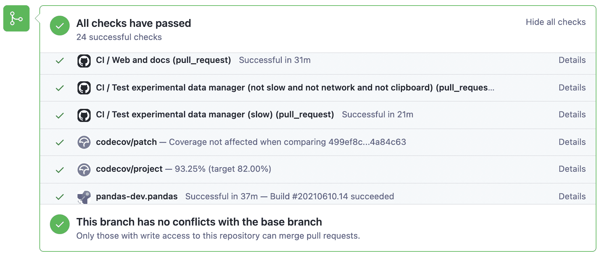

# 贡献代码基础

> 原文：[`pandas.pydata.org/docs/development/contributing_codebase.html`](https://pandas.pydata.org/docs/development/contributing_codebase.html)

目录：

+   代码标准

+   Pre-commit

+   可选依赖项

+   向后兼容性

+   类型提示

    +   样式指南

    +   pandas 特定类型

    +   验证类型提示

    +   使用 pandas 测试代码中的类型提示

+   使用持续集成进行测试

+   测试驱动开发

    +   编写测试

    +   使用 `pytest`

        +   测试结构

        +   首选的 `pytest` 习惯用法

        +   测试警告

        +   测试异常

        +   涉及文件的测试

        +   涉及网络连接的测试

        +   示例

    +   使用 `hypothesis`

+   运行测试套件

+   运行性能测试套件

+   记录您的代码

## 代码标准

写好的代码不仅仅是你写了什么。还有关于*如何*你写的。在持续集成测试期间，将运行多个工具来检查代码的风格错误。生成任何警告都将导致测试失败。因此，良好的风格是向 pandas 提交代码的要求。

在 pandas 中有几个工具可帮助贡献者在贡献到项目之前验证其更改

+   `./ci/code_checks.sh`：一个脚本用于验证文档字符串中的文档测试、格式以及导入的模块。可以使用参数`docstrings`、`code`和`doctests`独立运行检查（例如`./ci/code_checks.sh doctests`）；

+   `pre-commit`，我们将在下一节详细讨论。

此外，因为很多人使用我们的库，重要的是我们不要对代码进行突然的更改，这可能会导致大量用户代码出现潜在的错误，也就是说，我们需要尽可能做到*向后兼容*，以避免大规模的破坏。

## Pre-commit

此外，持续集成将使用[预提交钩子](https://pre-commit.com/)运行代码格式检查，例如`black`、`ruff`、`isort`和`clang-format`等等。来自这些检查的任何警告都会导致持续集成失败；因此，在提交代码之前运行检查很有帮助。这可以通过安装`pre-commit`（如果你遵循了设置开发环境中的说明，则应该已经完成）然后运行：

```py
pre-commit install 
```

从 pandas 仓库的根目录开始。现在，每次提交更改时都会运行所有的样式检查，而无需手动运行每一个。此外，使用`pre-commit`还可以更轻松地保持与我们的代码检查的最新状态。

注意，如果需要，你可以通过`git commit --no-verify`跳过这些检查。

如果你不想在工作流程中使用`pre-commit`，你仍然可以使用它来运行其检查之一：

```py
pre-commit run --files <files you have modified>
pre-commit run --from-ref=upstream/main --to-ref=HEAD --all-files 
```

无需事先执行`pre-commit install`。

最后，我们还有一些慢的预提交检查，它们不会在每次提交时运行，但会在持续集成期间运行。你可以使用以下命令手动触发它们：

```py
pre-commit run --hook-stage manual --all-files 
```

注意

你可能希望定期运行`pre-commit gc`，以清理不再使用的仓库。

注意

如果你有冲突的`virtualenv`安装，那么你可能会遇到错误-参见[这里](https://github.com/pypa/virtualenv/issues/1875)。

另外，由于[虚拟环境中的一个错误](https://github.com/pypa/virtualenv/issues/1986)，如果你正在使用 conda，可能会遇到问题。要解决这个问题，你可以将`virtualenv`降级到`20.0.33`版本。

注意

如果你最近从上游分支合并到主分支，那么`pre-commit`使用的一些依赖项可能已经发生了变化。确保更新你的开发环境。

## 可选依赖项

可选依赖项（例如 matplotlib）应使用私有助手`pandas.compat._optional.import_optional_dependency`导入。这样可以在未满足依赖关系时确保一致的错误消息。

所有使用可选依赖项的方法都应包含一个断言，断言在未找到可选依赖项时会引发`ImportError`。如果库存在，则应跳过此测试。

所有可选依赖项都应在可选依赖项中进行文档化，并且最低所需版本应在`pandas.compat._optional.VERSIONS`字典中设置。

## 向后兼容性

请尽量保持向后兼容性。pandas 有很多用户和大量现有代码，因此请尽量避免破坏它。如果认为需要破坏，请在拉取请求中清楚说明原因。在更改方法签名时要小心，并在需要时添加弃用警告。还要在弃用的函数或方法中添加弃用的 sphinx 指令。

如果存在与被弃用函数相同参数的函数，则可以使用`pandas.util._decorators.deprecate`：

```py
from pandas.util._decorators import deprecate

deprecate('old_func', 'new_func', '1.1.0') 
```

否则，您需要手动执行：

```py
import warnings
from pandas.util._exceptions import find_stack_level

def old_func():
  """Summary of the function.

 .. deprecated:: 1.1.0
 Use new_func instead.
 """
    warnings.warn(
        'Use new_func instead.',
        FutureWarning,
        stacklevel=find_stack_level(),
    )
    new_func()

def new_func():
    pass 
```

您还需要

1.  编写一个新的测试，断言在调用已弃用参数时会发出警告

1.  更新所有 pandas 现有的测试和代码以使用新参数

查看测试警告以获取更多信息。

## 类型提示

pandas 强烈鼓励使用[**PEP 484**](https://peps.python.org/pep-0484/)风格的类型提示。新开发应包含类型提示，同时也接受用于注释现有代码的拉取请求！

### 风格指南

类型导入应遵循`from typing import ...`约定。您的代码可能会被预提交检查自动重写以使用一些现代构造（例如，使用内置的`list`而不是`typing.List`）。

在代码库中的某些情况下，类可能定义会遮蔽内置变量。这会导致问题，如[Mypy 1775](https://github.com/python/mypy/issues/1775#issuecomment-310969854)中所述。这里的防御性解决方案是创建内置变量的明确别名，并在注释中使用该别名。例如，如果遇到类似于以下定义

```py
class SomeClass1:
    str = None 
```

对此进行注释的适当方式如下

```py
str_type = str

class SomeClass2:
    str: str_type = None 
```

在某些情况下，您可能会被诱惑在您比分析器更了解的情况下使用`typing`模块中的`cast`。这种情况特别发生在使用自定义推断函数时。例如

```py
from typing import cast

from pandas.core.dtypes.common import is_number

def cannot_infer_bad(obj: Union[str, int, float]):

    if is_number(obj):
        ...
    else:  # Reasonably only str objects would reach this but...
        obj = cast(str, obj)  # Mypy complains without this!
        return obj.upper() 
```

这里的限制在于，虽然人类可以合理地理解`is_number`会捕捉`int`和`float`类型，但 mypy 目前无法做出相同的推断（参见[mypy #5206](https://github.com/python/mypy/issues/5206)）。虽然上述方法有效，但**强烈不建议**使用`cast`。在适用的情况下，最好重构代码以满足静态分析的要求。

```py
def cannot_infer_good(obj: Union[str, int, float]):

    if isinstance(obj, str):
        return obj.upper()
    else:
        ... 
```

对于自定义类型和推断，这并不总是可能的，因此会有例外情况，但在采取这种方法之前应尽一切努力避免使用`cast`。

### pandas 特定类型

pandas 中常用的特定类型将出现在[pandas._typing](https://github.com/pandas-dev/pandas/blob/main/pandas/_typing.py)中，您应该在适用的地方使用这些类型。目前，此模块是私有的，但最终应该向希望对 pandas 进行类型检查的第三方库公开此模块。

例如，pandas 中有相当多的函数接受`dtype`参数。这可以表示为字符串，如`"object"`，`numpy.dtype`，如`np.int64`，甚至是 pandas 的`ExtensionDtype`，如`pd.CategoricalDtype`。与其让用户不断地注释所有这些选项，不如从 pandas._typing 模块中导入并重用。

```py
from pandas._typing import Dtype

def as_type(dtype: Dtype) -> ...:
    ... 
```

此模块最终将包含诸如“路径样式”、“数组样式”、“数字”等重复使用的概念的类型，并且还可以保存常见参数的别名，如`axis`。该模块的开发活跃，因此请务必参考源代码以获取最新的可用类型列表。

### 验证类型提示

pandas 使用[mypy](http://mypy-lang.org)和[pyright](https://github.com/microsoft/pyright)对代码库和类型提示进行静态分析。在进行任何更改后，您可以通过运行以下命令确保您的类型提示一致

```py
pre-commit  run  --hook-stage  manual  --all-files  mypy
pre-commit  run  --hook-stage  manual  --all-files  pyright
pre-commit  run  --hook-stage  manual  --all-files  pyright_reportGeneralTypeIssues
# the following might fail if the installed pandas version does not correspond to your local git version
pre-commit  run  --hook-stage  manual  --all-files  stubtest 
```

在您的 python 环境中。

警告

+   请注意，上述命令将使用当前的 python 环境。如果您的 python 包比 pandas CI 安装的包更新/较旧，则上述命令可能会失败。当`mypy`或`numpy`版本不匹配时，经常会出现这种情况。请参阅如何设置 python 环境或选择[最近成功的工作流程](https://github.com/pandas-dev/pandas/actions/workflows/code-checks.yml?query=branch%3Amain+is%3Asuccess)，选择“文档字符串验证、类型提示和其他手动预提交挂钩”作业，然后单击“设置 Conda”和“环境信息”以查看 pandas CI 安装了哪些版本。

### 使用 pandas 在代码中测试类型提示

警告

+   Pandas 还不是一个 py.typed 库（[**PEP 561**](https://peps.python.org/pep-0561/)）！本地声明 pandas 为 py.typed 库的主要目的是测试和改进 pandas 内置的类型注解。

在 pandas 成为 py.typed 库之前，通过在 pandas 安装文件夹中创建一个名为“py.typed”的空文件，可以轻松尝试使用 pandas 提供的类型注解：

```py
python -c "import pandas; import pathlib; (pathlib.Path(pandas.__path__[0]) / 'py.typed').touch()" 
```

py.typed 文件的存在表示类型检查器已经意识到 pandas 已经是一个 py.typed 库。这使得类型检查器知道了 pandas 提供的类型注解。

## 使用持续集成进行测试

一旦您提交了拉取请求，pandas 测试套件将在[GitHub Actions](https://github.com/features/actions/)持续集成服务上自动运行。但是，如果您希望在提交拉取请求之前在分支上运行测试套件，则需要将持续集成服务挂钩到您的 GitHub 存储库。有关[GitHub Actions](https://docs.github.com/en/actions/)的说明在这里。

当你拥有全部“绿色”构建时，拉取请求将被考虑合并。如果有任何测试失败，那么你将会得到一个红色的“X”，你可以点击查看单个失败的测试。这是一个绿色构建的示例。

 ## 测试驱动开发

pandas 对测试非常重视，并强烈鼓励贡献者采用[测试驱动开发（TDD）](https://zh.wikipedia.org/wiki/%E6%B5%8B%E8%AF%95%E9%A9%B1%E5%8A%A8%E5%BC%80%E5%8F%91)。这个开发过程“依赖于非常短的开发周期的重复：首先开发人员编写一个（最初失败的）自动化测试用例，定义了期望的改进或新功能，然后生成最小量的代码来通过该测试。”因此，在实际编写任何代码之前，你应该先编写你的测试。通常测试可以从原始的 GitHub 问题中获取。然而，值得考虑的是额外的用例，并编写相应的测试。

在代码推送到 pandas 之后，添加测试是最常见的请求之一。因此，养成提前编写测试的习惯非常值得。

### 编写测试

所有测试应该放在特定包的 `tests` 子目录中。此文件夹包含许多当前测试的示例，我们建议参考这些示例以获取灵感。

一般建议，你可以使用集成开发环境（IDE）中的搜索功能或终端中的 git grep 命令来查找调用该方法的测试文件。如果你不确定最佳位置放置测试，可以尽力猜测，但请注意，审阅者可能会要求您将测试移到不同的位置。

要使用 git grep，您可以在终端中运行以下命令：

`git grep "function_name("`

这将在您的仓库中的所有文件中搜索文本 `function_name(`。这可以是快速定位代码库中函数并确定添加测试的最佳位置的有效方法。

理想情况下，应该有一个，且仅有一个明显的位置来存放测试。在达到这个理想状态之前，以下是一些测试应该放置的一些经验法则。

1.  你的测试是否仅依赖于 `pd._libs.tslibs` 中的代码？此测试可能属于以下之一：

    +   tests.tslibs

        注意

        `tests.tslibs` 中的任何文件都不应该从 `pd._libs` 之外的 pandas 模块中导入。

    +   tests.scalar

    +   tests.tseries.offsets

1.  你的测试是否仅依赖于 `pd._libs` 中的代码？此测试可能属于以下之一：

    +   tests.libs

    +   tests.groupby.test_libgroupby

1.  你的测试是针对算术还是比较方法？此测试可能属于以下之一：

    +   tests.arithmetic

        注意

        这些旨在用于共享测试，以测试使用 `box_with_array` 固定器的 DataFrame/Series/Index/ExtensionArray 的行为。

    +   tests.frame.test_arithmetic

    +   tests.series.test_arithmetic

1.  你的测试是针对缩减方法（min、max、sum、prod 等）吗？此测试可能属于以下之一：

    +   tests.reductions

        注意

        这些测试旨在测试 DataFrame/Series/Index/ExtensionArray 的行为是否可以共享。

    +   tests.frame.test_reductions

    +   tests.series.test_reductions

    +   tests.test_nanops

1.  你的测试是否针对一个索引方法？这是确定测试属于何处最困难的情况，因为有许多这些测试，并且其中许多测试不止一个方法（例如`Series.__getitem__`和`Series.loc.__getitem__`）

    1.  测试是否专门针对索引方法（例如`Index.get_loc`、`Index.get_indexer`）？此测试可能属于以下之一：

        +   tests.indexes.test_indexing

        +   tests.indexes.fooindex.test_indexing

        在该文件中应该有一个特定于方法的测试类，例如`TestGetLoc`。

        在大多数情况下，这些测试中不需要`Series`或`DataFrame`对象。

    1.  测试是否针对 Series 或 DataFrame 的索引方法*其他*于`__getitem__`或`__setitem__`，例如`xs`、`where`、`take`、`mask`、`lookup`或`insert`？此测试可能属于以下之一：

        +   tests.frame.indexing.test_methodname

        +   tests.series.indexing.test_methodname

    1.  是否测试了`loc`、`iloc`、`at`或`iat`中的任何一个？此测试可能属于以下之一：

        +   tests.indexing.test_loc

        +   tests.indexing.test_iloc

        +   tests.indexing.test_at

        +   tests.indexing.test_iat

        在适当的文件中，测试类对应于索引器的类型（例如`TestLocBooleanMask`）或主要用例（例如`TestLocSetitemWithExpansion`）。

        参见关于测试多个索引方法的 D)部分的注释。

    1.  测试是否针对`Series.__getitem__`、`Series.__setitem__`、`DataFrame.__getitem__`或`DataFrame.__setitem__`？此测试可能属于以下之一：

        +   tests.series.test_getitem

        +   tests.series.test_setitem

        +   tests.frame.test_getitem

        +   tests.frame.test_setitem

        在许多情况下，这样的测试可能测试多个类似的方法，例如

        ```py
        import pandas as pd
        import pandas._testing as tm

        def test_getitem_listlike_of_ints():
            ser = pd.Series(range(5))

            result = ser[[3, 4]]
            expected = pd.Series([2, 3])
            tm.assert_series_equal(result, expected)

            result = ser.loc[[3, 4]]
            tm.assert_series_equal(result, expected) 
        ```

    > 在这种情况下，测试位置应基于正在测试的*底层*方法。或者在修复错误的测试中，应基于实际错误的位置。所以在这个例子中，我们知道`Series.__getitem__`调用`Series.loc.__getitem__`，所以这实际上是一个对`loc.__getitem__`的测试。所以这个测试应该属于`tests.indexing.test_loc`。

1.  你的测试是否针对 DataFrame 或 Series 的方法？

    1.  方法是否为绘图方法？此测试可能属于以下之一：

        +   tests.plotting

    1.  方法是否属于 IO 方法？此测试可能属于以下之一：

        +   tests.io

            注意

            这包括`to_string`，但不包括`__repr__`，`__repr__`在`tests.frame.test_repr`和`tests.series.test_repr`中测试。其他类通常有一个`test_formats`文件。

    1.  否则此测试可能属于以下之一：

        +   tests.series.methods.test_mymethod

        +   tests.frame.methods.test_mymethod

            注意

            如果一个测试可以在 DataFrame/Series 之间共享使用`frame_or_series` fixture，则按照惯例，它会放在`tests.frame`文件中。

1.  你的测试是否针对索引方法，而不依赖于 Series/DataFrame？此测试可能属于以下之一：

    +   tests.indexes

1.  你的测试是否针对 pandas 提供的 ExtensionArrays（`Categorical`、`DatetimeArray`、`TimedeltaArray`、`PeriodArray`、`IntervalArray`、`NumpyExtensionArray`、`FloatArray`、`BoolArray`、`StringArray`）之一？这个测试可能属于以下之一：

    +   tests.arrays

1.  你的测试是否针对*所有* ExtensionArray 子类（“EA 接口”）？这个测试可能属于以下之一：

    +   tests.extension

### 使用`pytest`

#### 测试结构

pandas 现有的测试结构*大多*是基于类的，这意味着你通常会发现测试被包裹在一个类中。

```py
class TestReallyCoolFeature:
    def test_cool_feature_aspect(self):
        pass 
```

我们更倾向于使用更*功能化*的风格，使用提供更丰富测试框架的[pytest](https://docs.pytest.org/en/latest/)框架，这将有助于测试和开发。因此，我们将编写像这样的测试函数，而不是编写测试类：

```py
def test_really_cool_feature():
    pass 
```

#### 首选的`pytest`习惯用法

+   功能测试命名为`def test_*`，*只*接受作为装置或参数的参数。

+   对于测试标量和真值测试，请使用裸`assert`。

+   用于比较`Series`和`DataFrame`结果的方法分别是`tm.assert_series_equal(result, expected)`和`tm.assert_frame_equal(result, expected)`。

+   当测试多个情况时，请使用[@pytest.mark.parameterize](https://docs.pytest.org/en/latest/how-to/parametrize.html)。

+   当一个测试用例预期会失败时，请使用[pytest.mark.xfail](https://docs.pytest.org/en/latest/reference/reference.html?#pytest.mark.xfail)。

+   当一个测试用例永远不会通过时，请使用[pytest.mark.skip](https://docs.pytest.org/en/latest/reference/reference.html?#pytest.mark.skip)。

+   当一个测试用例需要特定标记时，请使用[pytest.param](https://docs.pytest.org/en/latest/reference/reference.html?#pytest-param)。

+   如果多个测试可以共享一个设置对象，请使用[@pytest.fixture](https://docs.pytest.org/en/latest/reference/reference.html?#pytest-fixture)。

警告

不要使用`pytest.xfail`（与`pytest.mark.xfail`不同），因为它会立即停止测试，而不会检查测试是否会失败。如果这是你想要的行为，请改用`pytest.skip`。

如果一个测试已知会失败，但失败的方式不打算被捕获，请使用`pytest.mark.xfail`。通常用这种方法来测试表现出错误行为或未实现的功能的测试。如果失败的测试具有不稳定的行为，请使用参数`strict=False`。这将使得 pytest 在测试恰好通过时不会失败。使用`strict=False`是非常不可取的，请仅在万不得已时使用。

最好使用装饰器 `@pytest.mark.xfail` 和参数 `pytest.param` 而不是在测试中使用，以便在 pytest 的收集阶段适当地标记测试。对于涉及多个参数、fixture 或这些组合的测试，只能在测试阶段进行 xfail。为此，请使用 `request` fixture：

```py
def test_xfail(request):
    mark = pytest.mark.xfail(raises=TypeError, reason="Indicate why here")
    request.applymarker(mark) 
```

xfail 不应该用于涉及由于无效用户参数而失败的测试。对于这些测试，我们需要验证正确的异常类型和错误消息是否被引发，而不是使用 `pytest.raises`。

#### 测试警告

使用 `tm.assert_produces_warning` 作为上下文管理器来检查一段代码是否引发了警告。

```py
with tm.assert_produces_warning(DeprecationWarning):
    pd.deprecated_function() 
```

如果一段代码块中特定地不应该出现警告，请将`False`传递给上下文管理器。

```py
with tm.assert_produces_warning(False):
    pd.no_warning_function() 
```

如果你有一个会产生警告的测试，但你实际上并没有测试警告本身（比如因为它将来会被移除，或者因为我们正在匹配第三方库的行为），那么使用 `pytest.mark.filterwarnings` 来忽略该错误。

```py
@pytest.mark.filterwarnings("ignore:msg:category")
def test_thing(self):
    pass 
```

#### 测试异常

使用 [pytest.raises](https://docs.pytest.org/en/latest/reference/reference.html#pytest-raises) 作为上下文管理器，与特定的异常子类（即永远不要使用[`Exception`](https://docs.python.org/3/library/exceptions.html#Exception "(在 Python v3.12 中)")) 和 `match` 中的异常消息一起。

```py
with pytest.raises(ValueError, match="an error"):
    raise ValueError("an error") 
```

#### 涉及文件的测试

`tm.ensure_clean` 上下文管理器创建一个临时文件进行测试，带有一个生成的文件名（或者如果提供了你的文件名，则使用该文件名），当退出上下文块时自动删除。

```py
with tm.ensure_clean('my_file_path') as path:
    # do something with the path 
```

#### 涉及网络连接的测试

由于网络连接的不稳定性和连接到的服务器的所有权缺失，单元测试不应该通过互联网访问公共数据集。为了模拟这种交互，使用 [pytest-localserver 插件](https://github.com/pytest-dev/pytest-localserver) 中的 `httpserver` fixture 与合成数据。

```py
@pytest.mark.network
@pytest.mark.single_cpu
def test_network(httpserver):
    httpserver.serve_content(content="content")
    result = pd.read_html(httpserver.url) 
```

#### 示例

这是一个在文件 `pandas/tests/test_cool_feature.py` 中包含多个我们喜欢使用的特性的自包含测试集的示例。请记得在新测试中作为注释添加 GitHub 问题编号。

```py
import pytest
import numpy as np
import pandas as pd

@pytest.mark.parametrize('dtype', ['int8', 'int16', 'int32', 'int64'])
def test_dtypes(dtype):
    assert str(np.dtype(dtype)) == dtype

@pytest.mark.parametrize(
    'dtype', ['float32', pytest.param('int16', marks=pytest.mark.skip),
              pytest.param('int32', marks=pytest.mark.xfail(
                  reason='to show how it works'))])
def test_mark(dtype):
    assert str(np.dtype(dtype)) == 'float32'

@pytest.fixture
def series():
    return pd.Series([1, 2, 3])

@pytest.fixture(params=['int8', 'int16', 'int32', 'int64'])
def dtype(request):
    return request.param

def test_series(series, dtype):
    # GH <issue_number>
    result = series.astype(dtype)
    assert result.dtype == dtype

    expected = pd.Series([1, 2, 3], dtype=dtype)
    tm.assert_series_equal(result, expected) 
```

运行这个测试得到

```py
((pandas)  bash-3.2$  pytest  test_cool_feature.py  -v
===========================  test  session  starts  ===========================
platform  darwin  --  Python  3.6.2,  pytest-3.6.0,  py-1.4.31,  pluggy-0.4.0
collected  11  items

tester.py::test_dtypes[int8]  PASSED
tester.py::test_dtypes[int16]  PASSED
tester.py::test_dtypes[int32]  PASSED
tester.py::test_dtypes[int64]  PASSED
tester.py::test_mark[float32]  PASSED
tester.py::test_mark[int16]  SKIPPED
tester.py::test_mark[int32]  xfail
tester.py::test_series[int8]  PASSED
tester.py::test_series[int16]  PASSED
tester.py::test_series[int32]  PASSED
tester.py::test_series[int64]  PASSED 
```

我们已经`参数化`的测试现在可以通过测试名称访问，例如我们可以使用 `-k int8` 来仅选择与 `int8` 匹配的测试。

```py
((pandas)  bash-3.2$  pytest  test_cool_feature.py  -v  -k  int8
===========================  test  session  starts  ===========================
platform  darwin  --  Python  3.6.2,  pytest-3.6.0,  py-1.4.31,  pluggy-0.4.0
collected  11  items

test_cool_feature.py::test_dtypes[int8]  PASSED
test_cool_feature.py::test_series[int8]  PASSED 
```

### 使用 `hypothesis`

Hypothesis 是一个基于属性的测试库。你可以描述*所有*有效的输入，让 Hypothesis 尝试找到一个失败的输入，而不是显式地为测试参数化。更好的是，无论它尝试了多少随机示例，Hypothesis 总是报告一个单一的最小反例给你的断言 - 通常是一个你从未想过要测试的示例。

查看[使用 Hypothesis 入门](https://hypothesis.works/articles/getting-started-with-hypothesis/)获取更多介绍，然后参考[Hypothesis 文档获取详细信息](https://hypothesis.readthedocs.io/en/latest/index.html)。

```py
import json
from hypothesis import given, strategies as st

any_json_value = st.deferred(lambda: st.one_of(
    st.none(), st.booleans(), st.floats(allow_nan=False), st.text(),
    st.lists(any_json_value), st.dictionaries(st.text(), any_json_value)
))

@given(value=any_json_value)
def test_json_roundtrip(value):
    result = json.loads(json.dumps(value))
    assert value == result 
```

此测试展示了 Hypothesis 的几个有用功能，同时展示了一个很好的用例：检查应在大型或复杂输入域上保持的属性。

为了使 pandas 测试套件快速运行，如果输入或逻辑简单，则首选参数化测试，Hypothesis 测试保留用于具有复杂逻辑或需要测试的选项组合或微妙交互太多而无法测试（或考虑！）所有这些。  ## 运行测试套件

然后可以直接在您的 Git 克隆中运行这些测试（无需安装 pandas），方法是输入：

```py
pytest pandas 
```

注意

如果有一些测试未通过，这可能不是与您的 pandas 安装有关的问题。一些测试（例如一些 SQLAlchemy 测试）需要额外的设置，其他测试可能会因为非固定库发布了新版本而开始失败，还有一些测试如果并行运行可能会出现问题。只要您可以从本地构建的版本中导入 pandas，您的安装可能是正常的，您可以开始贡献！

通常，在运行整个测试套件之前，值得先运行一部分测试以查看您所做的更改周围的情况（提示：您可以使用[pandas-coverage app](https://pandas-coverage-12d2130077bc.herokuapp.com/)）来找出哪些测试命中了您修改的代码行，然后只运行那些测试）。

最简单的方法是使用：

```py
pytest pandas/path/to/test.py -k regex_matching_test_name 
```

或者使用以下构造之一：

```py
pytest pandas/tests/[test-module].py
pytest pandas/tests/[test-module].py::[TestClass]
pytest pandas/tests/[test-module].py::[TestClass]::[test_method] 
```

使用[pytest-xdist](https://pypi.org/project/pytest-xdist)，它包含在我们的‘pandas-dev’环境中，可以加快多核机器上的本地测试速度。然后在运行 pytest 时可以指定`-n`数字标志以在指定的核心数上并行运行测试，或者使用 auto 来利用您机器上所有可用的核心。

```py
# Utilize 4 cores
pytest  -n  4  pandas

# Utilizes all available cores
pytest  -n  auto  pandas 
```

如果您想进一步加快速度，更高级的使用此命令的方式如下

```py
pytest  pandas  -n  4  -m  "not slow and not network and not db and not single_cpu"  -r  sxX 
```

除了多线程性能提升外，通过使用`-m`标记标志跳过一些测试，可以提高测试速度：

+   slow：任何需要很长时间的测试（考虑秒而不是毫秒）

+   network：需要网络连接的测试

+   db：需要数据库（mysql 或 postgres）的测试

+   single_cpu：仅应在单个 CPU 上运行的测试

如果相关，您可能希望启用以下选项：

+   arm_slow：在 arm64 架构上需要很长时间的测试

这些标记在 [此 toml 文件](https://github.com/pandas-dev/pandas/blob/main/pyproject.toml) 中定义，在`[tool.pytest.ini_options]`下的名为`markers`的列表中，以便您查看是否已创建您感兴趣的新标记。

`-r`报告标志将显示简短的摘要信息（参见[pytest 文档](https://docs.pytest.org/en/4.6.x/usage.html#detailed-summary-report)）。这里我们显示的是数量：

+   s: 跳过的测试

+   x: 未通过的测试

+   X: 通过的测试

摘要是可选的，如果您不需要额外信息，可以将其删除。使用并行化选项可以显著减少在提交拉取请求之前本地运行测试所需的时间。

如果您需要协助处理结果，过去曾发生过，请在运行命令和提交错误报告之前设置一个种子，这样我们可以重现。以下是在 Windows 上设置种子的示例

```py
set  PYTHONHASHSEED=314159265
pytest  pandas  -n  4  -m  "not slow and not network and not db and not single_cpu"  -r  sxX 
```

在 Unix 上使用

```py
export  PYTHONHASHSEED=314159265
pytest  pandas  -n  4  -m  "not slow and not network and not db and not single_cpu"  -r  sxX 
```

欲知更多，请参阅[pytest](https://docs.pytest.org/en/latest/)文档。

此外，可以运行

```py
pd.test() 
```

以类似方式运行测试的导入 pandas。

## 运行性能测试套件

性能很重要，值得考虑您的代码是否引入了性能退化。pandas 正在迁移到[asv 基准测试](https://github.com/airspeed-velocity/asv)以便轻松监控关键 pandas 操作的性能。这些基准测试都位于`pandas/asv_bench`目录中，测试结果可以在[这里](https://asv-runner.github.io/asv-collection/pandas)找到。

要使用 asv 的所有功能，您需要`conda`或`virtualenv`。有关更多详细信息，请查看[asv 安装网页](https://asv.readthedocs.io/en/latest/installing.html)。

要安装 asv：

```py
pip install git+https://github.com/airspeed-velocity/asv 
```

如果您需要运行基准测试，请将目录更改为`asv_bench/`并运行：

```py
asv continuous -f 1.1 upstream/main HEAD 
```

您可以将`HEAD`替换为您正在工作的分支名称，并报告变化超过 10%的基准测试。该命令默认使用`conda`创建基准测试环境。如果想要改用 virtualenv，写入：

```py
asv continuous -f 1.1 -E virtualenv upstream/main HEAD 
```

所有运行基准测试的`asv`命令都应添加`-E virtualenv`选项。默认值在`asv.conf.json`中定义。

运行完整的基准测试套件可能是一整天的过程，这取决于您的硬件及其资源利用情况。然而，通常只需将部分结果粘贴到拉取请求中即可表明提交的更改不会导致意外性能退化。您可以使用`-b`标志运行特定基准测试，该标志接受正则表达式。例如，这将仅运行来自`pandas/asv_bench/benchmarks/groupby.py`文件的基准测试：

```py
asv continuous -f 1.1 upstream/main HEAD -b ^groupby 
```

如果您只想从文件中运行特定组的基准测试，可以使用`.`作为分隔符。例如：

```py
asv continuous -f 1.1 upstream/main HEAD -b groupby.GroupByMethods 
```

仅运行`groupby.py`中定义的`GroupByMethods`基准测试。

您还可以使用当前 Python 环境中已安装的`pandas`版本运行基准测试套件。如果您没有 virtualenv 或 conda，或者正在使用上面讨论的`setup.py develop`方法；对于就地构建，您需要设置`PYTHONPATH`，例如`PYTHONPATH="$PWD/.." asv [remaining arguments]`。您可以通过以下方式使用现有 Python 环境运行基准测试：

```py
asv run -e -E existing 
```

或者，使用特定的 Python 解释器：

```py
asv run -e -E existing:python3.6 
```

这将显示基准测试的 stderr，并使用来自您的`$PATH`的本地`python`。

有关如何编写基准测试以及如何使用 asv 的信息可以在[asv 文档](https://asv.readthedocs.io/en/latest/writing_benchmarks.html)中找到。

## 为您的代码编写文档

更改应该反映在`doc/source/whatsnew/vx.y.z.rst`中的发布说明中。该文件包含每个版本的持续更改日志。向此文件添加条目以记录您的修复、增强功能或（不可避免的）破坏性更改。在添加条目时，请确保包含 GitHub 问题编号（使用`:issue:`1234``，其中`1234`是问题/拉取请求编号）。您的条目应使用完整句子和正确的语法编写。

在提及 API 的部分时，根据需要使用 Sphinx 的`:func:`、`:meth:`或`:class:`指令。并非所有公共 API 函数和方法都有文档页面；理想情况下，只有在解析后才会添加链接。通常可以通过检查以前版本的发布说明来找到类似的示例。

如果您的代码是一个修复 bug 的代码，请将您的条目添加到相关的 bug 修复部分。避免添加到`其他`部分；只有在极少数情况下才应该将条目放在那里。bug 的描述应尽可能简洁，包括用户可能遇到 bug 的方式以及 bug 本身的指示，例如“产生不正确的结果”或“错误地引发”。可能还需要指示新行为。

如果您的代码是一个增强功能，很可能需要向现有文档添加使用示例。可以在关于文档的部分之后完成此操作。此外，为了让用户知道何时添加了此功能，使用`versionadded`指令。sphinx 的语法如下：

```py
.. versionadded:: 2.1.0 
```

这将在放置 sphinx 指令的地方显示*新版本 2.1.0 中的内容*。当添加新函数或方法（[示例](https://github.com/pandas-dev/pandas/blob/v0.20.2/pandas/core/frame.py#L1495)）或新关键字参数（[示例](https://github.com/pandas-dev/pandas/blob/v0.20.2/pandas/core/generic.py#L568)）时，这也应该放在 docstring 中。

## 代码规范

写出优秀的代码不仅仅是关于你写了什么。它也关乎于你*如何*编写它。在持续集成测试期间，将运行多个工具来检查你的代码是否存在风格错误。生成任何警告将导致测试失败。因此，良好的代码风格是提交代码给 pandas 的要求之一。

在贡献者提交项目之前，pandas 中有一些工具可帮助他们验证其更改

+   `./ci/code_checks.sh`：一个脚本验证了 doctests，docstrings 中的格式化和导入的模块。可以使用参数`docstrings`，`code`和`doctests`独立运行检查（例如`./ci/code_checks.sh doctests`）;

+   `pre-commit`，我们将在下一节详细介绍。

此外，由于很多人使用我们的库，重要的是我们不要对可能导致大量用户代码破坏的代码进行突然的更改，也就是说，我们需要尽可能地使其*向后兼容*，以避免大规模的破坏。

## 预提交

此外，持续集成将使用[pre-commit hooks](https://pre-commit.com/)运行代码格式检查，如`black`、`ruff`、`isort`和`clang-format`等等。这些检查的任何警告都将导致持续集成失败；因此，在提交代码之前自行运行检查是有帮助的。这可以通过安装`pre-commit`（如果您遵循设置开发环境中的说明，应该已经发生）然后运行来完成：

```py
pre-commit install 
```

从 pandas 存储库的根目录运行。现在，每次提交更改时都会运行所有样式检查，而无需手动运行每个检查。此外，使用`pre-commit`还将使您更轻松地保持与我们的代码检查的更新。

请注意，如果需要，您可以使用`git commit --no-verify`跳过这些检查。

如果您不想将`pre-commit`作为您的工作流的一部分，您仍然可以使用它来运行其检查之一：

```py
pre-commit run --files <files you have modified>
pre-commit run --from-ref=upstream/main --to-ref=HEAD --all-files 
```

在之前不需要执行`pre-commit install`的情况下。

最后，我们还有一些较慢的预提交检查，这些检查不会在每次提交时运行，但会在持续集成期间运行。你可以手动触发它们：

```py
pre-commit run --hook-stage manual --all-files 
```

注意

您可能想定期运行`pre-commit gc`，以清理不再使用的存储库。

注意

如果您安装了冲突的`virtualenv`，那么您可能会收到错误消息 - 请参阅[这里](https://github.com/pypa/virtualenv/issues/1875)。

另外，由于[virtualenv 中的一个错误](https://github.com/pypa/virtualenv/issues/1986)，如果你使用 conda 可能会遇到问题。为了解决这个问题，你可以将`virtualenv`降级到`20.0.33`版本。

注意

如果你最近从上游分支合并了主分支，`pre-commit`所使用的一些依赖项可能已经更改。请确保更新你的开发环境。

## 可选依赖项

可选依赖项（例如 matplotlib）应该使用私有助手`pandas.compat._optional.import_optional_dependency`进行导入。这样可以确保在未满足依赖关系时显示一致的错误消息。

所有使用可选依赖项的方法都应包含一个断言测试，断言当可选依赖项未找到时会引发`ImportError`。如果库存在，则应跳过此测试。

所有可选依赖项都应在可选依赖项中进行文档记录，并且最低要求的版本应在`pandas.compat._optional.VERSIONS`字典中设置。

## 向后兼容性

请尽量保持向后兼容性。pandas 有很多用户和大量现有代码，所以尽量不要破坏它。如果你认为需要破坏，请在拉取请求的一部分清楚说明原因。此外，在更改方法签名时要小心，并在需要时添加弃用警告。同时，将弃用指令添加到已弃用的函数或方法中。

如果存在与被弃用函数相同参数的函数，你可以使用`pandas.util._decorators.deprecate`：

```py
from pandas.util._decorators import deprecate

deprecate('old_func', 'new_func', '1.1.0') 
```

否则，你需要手动操作：

```py
import warnings
from pandas.util._exceptions import find_stack_level

def old_func():
  """Summary of the function.

 .. deprecated:: 1.1.0
 Use new_func instead.
 """
    warnings.warn(
        'Use new_func instead.',
        FutureWarning,
        stacklevel=find_stack_level(),
    )
    new_func()

def new_func():
    pass 
```

你还需要

1.  编写一个新的测试，断言在调用时会发出警告。

1.  更新所有现有的 pandas 测试和代码以使用新的参数

更多信息请参见测试警告。

## 类型提示

pandas 强烈鼓励使用[**PEP 484**](https://peps.python.org/pep-0484/)风格的类型提示。新的开发应包含类型提示，对现有代码进行注释的拉取请求也将被接受！

### 样式指南

类型导入应遵循`from typing import ...`的约定。你的代码可能会被 pre-commit 检查自动重写以使用一些现代构造（例如，使用内置的`list`而不是`typing.List`）。

有些情况下，在代码库中，类可能会定义与内置变量同名的类变量。这会导致问题，就像[Mypy 1775](https://github.com/python/mypy/issues/1775#issuecomment-310969854)中描述的那样。这里的防御性解决方案是创建内置变量的明确别名，并在注释中使用该别名。例如，如果你遇到了这样的定义：

```py
class SomeClass1:
    str = None 
```

注释此的合适方法应该是如下方式

```py
str_type = str

class SomeClass2:
    str: str_type = None 
```

在某些情况下，当你比分析器更清楚时，你可能会想要使用来自 typing 模块的`cast`。这种情况特别发生在使用自定义推理函数时。例如

```py
from typing import cast

from pandas.core.dtypes.common import is_number

def cannot_infer_bad(obj: Union[str, int, float]):

    if is_number(obj):
        ...
    else:  # Reasonably only str objects would reach this but...
        obj = cast(str, obj)  # Mypy complains without this!
        return obj.upper() 
```

这里的限制在于，虽然人类可以合理地理解 `is_number` 会捕捉到 `int` 和 `float` 类型，但是目前 mypy 还不能做出相同的推断（参见 [mypy #5206](https://github.com/python/mypy/issues/5206)）。虽然上述方法可行，但**强烈不建议**使用 `cast`。在适用的情况下，重构代码以符合静态分析更可取。

```py
def cannot_infer_good(obj: Union[str, int, float]):

    if isinstance(obj, str):
        return obj.upper()
    else:
        ... 
```

使用自定义类型和推断并非总是可行的，所以会有例外情况，但在走上这样的道路之前，应尽一切努力避免使用 `cast`。

### pandas 特定类型

特定于 pandas 的常用类型将出现在 [pandas._typing](https://github.com/pandas-dev/pandas/blob/main/pandas/_typing.py) 中，您应在适用的地方使用这些类型。目前，该模块是私有的，但最终应将其暴露给希望对 pandas 进行类型检查的第三方库。

例如，pandas 中有相当多的函数接受一个 `dtype` 参数。这可以表示为一个字符串，如 `"object"`，一个 `numpy.dtype`，如 `np.int64`，甚至是一个 pandas 的 `ExtensionDtype`，如 `pd.CategoricalDtype`。与其让用户不断地对所有这些选项进行注释，不如直接从 pandas._typing 模块中导入并重复使用它们

```py
from pandas._typing import Dtype

def as_type(dtype: Dtype) -> ...:
    ... 
```

该模块最终将容纳重复使用的概念，如 “path-like”、“array-like”、“numeric” 等类型，还可以保存常见参数的别名，如 `axis`。该模块的开发活跃，因此请务必参考源代码以获取最新的可用类型列表。

### 验证类型提示

pandas 使用 [mypy](http://mypy-lang.org) 和 [pyright](https://github.com/microsoft/pyright) 对代码库和类型提示进行静态分析。在进行任何更改后，您可以通过运行以下命令确保您的类型提示是一致的

```py
pre-commit  run  --hook-stage  manual  --all-files  mypy
pre-commit  run  --hook-stage  manual  --all-files  pyright
pre-commit  run  --hook-stage  manual  --all-files  pyright_reportGeneralTypeIssues
# the following might fail if the installed pandas version does not correspond to your local git version
pre-commit  run  --hook-stage  manual  --all-files  stubtest 
```

在您的 Python 环境中。

警告

+   请注意，上述命令将使用当前的 Python 环境。如果您的 Python 包比由 pandas CI 安装的包要旧/新，则上述命令可能会失败。当 `mypy` 或 `numpy` 版本不匹配时，通常会出现这种情况。请参阅 如何设置 Python 环境 或选择一个 [最近成功的工作流](https://github.com/pandas-dev/pandas/actions/workflows/code-checks.yml?query=branch%3Amain+is%3Asuccess)，选择 “Docstring validation, typing, and other manual pre-commit hooks” 作业，然后单击 “Set up Conda” 和 “Environment info” 查看 pandas CI 安装的版本。

### 使用 pandas 在代码中测试类型提示

警告

+   Pandas 尚未成为一个 py.typed 库（[**PEP 561**](https://peps.python.org/pep-0561/)）！将 pandas 本地声明为 py.typed 库的主要目的是测试和改进 pandas 内置的类型注释。

在 pandas 成为一个 py.typed 库之前，可以通过在 pandas 安装文件夹中创建一个名为“py.typed”的空文件，轻松地使用 pandas 提供的类型注释进行实验：

```py
python -c "import pandas; import pathlib; (pathlib.Path(pandas.__path__[0]) / 'py.typed').touch()" 
```

py.typed 文件的存在表明类型检查器已经意识到 pandas 已经是一个 py.typed 库。这使得类型检查器了解了与 pandas 一起提供的类型注释。

### 样式指南

类型导入应遵循 `from typing import ...` 的约定。您的代码可能会被提交前检查自动重写，以使用一些现代构造（例如使用内置的 `list` 而不是 `typing.List`)。

在代码库中，有些情况下，类定义了会遮蔽内置的类变量。这会引发一个问题，如[Mypy 1775](https://github.com/python/mypy/issues/1775#issuecomment-310969854)中所述。这里的防御性解决方案是创建内置的一个明确的别名，并在不使用您的注释的情况下使用它。例如，如果您遇到以下定义

```py
class SomeClass1:
    str = None 
```

对此进行注释的适当方式如下

```py
str_type = str

class SomeClass2:
    str: str_type = None 
```

在某些情况下，您可能会被诱导在您比分析器更了解的情况下使用`typing`模块中的`cast`。这特别发生在使用自定义推断函数时。例如

```py
from typing import cast

from pandas.core.dtypes.common import is_number

def cannot_infer_bad(obj: Union[str, int, float]):

    if is_number(obj):
        ...
    else:  # Reasonably only str objects would reach this but...
        obj = cast(str, obj)  # Mypy complains without this!
        return obj.upper() 
```

这里的限制是，虽然人类可以合理地理解 `is_number` 将捕获 `int` 和 `float` 类型，但是 mypy 目前还不能做出同样的推断（参见 [mypy #5206](https://github.com/python/mypy/issues/5206)。虽然上述方法可行，但强烈不建议使用`cast`。在适用的情况下，改写代码以满足静态分析是更可取的

```py
def cannot_infer_good(obj: Union[str, int, float]):

    if isinstance(obj, str):
        return obj.upper()
    else:
        ... 
```

对于自定义类型和推断，这并不总是可能的，因此会有一些例外，但在走上这些路径之前，应尽一切努力避免`cast`。

### pandas-specific types

特定于 pandas 的常用类型将出现在 [pandas._typing](https://github.com/pandas-dev/pandas/blob/main/pandas/_typing.py) 中，您应该在适用的地方使用它们。目前，该模块是私有的，但最终应该向想要对 pandas 进行类型检查的第三方库暴露该模块。

例如，pandas 中有很多函数接受一个 `dtype` 参数。这可以表示为字符串，如`"object"`，一个`numpy.dtype`，如`np.int64`，甚至是 pandas 的 `ExtensionDtype`，如`pd.CategoricalDtype`。与其让用户不断地为所有这些选项进行注释，不如简单地从 pandas._typing 模块中导入并重复使用

```py
from pandas._typing import Dtype

def as_type(dtype: Dtype) -> ...:
    ... 
```

该模块最终将包含用于重复使用的概念的类型，如“类似路径”，“类似数组”，“数值”等，并且还可以保存常见参数的别名，如 `axis`。该模块的开发活动，因此请确保参考源以获取最新的可用类型列表。

### 验证类型提示

pandas 使用 [mypy](http://mypy-lang.org) 和 [pyright](https://github.com/microsoft/pyright) 来静态分析代码库和类型提示。在进行任何更改后，您可以通过运行以下命令确保您的类型提示是一致的

```py
pre-commit  run  --hook-stage  manual  --all-files  mypy
pre-commit  run  --hook-stage  manual  --all-files  pyright
pre-commit  run  --hook-stage  manual  --all-files  pyright_reportGeneralTypeIssues
# the following might fail if the installed pandas version does not correspond to your local git version
pre-commit  run  --hook-stage  manual  --all-files  stubtest 
```

在你的 python 环境中。

警告

+   请注意，上述命令将使用当前的 python 环境。如果你的 python 包比 pandas CI 安装的包旧/新，上述命令可能会失败。当 `mypy` 或 `numpy` 版本不匹配时，这种情况经常发生。请参阅如何设置 python 环境或选择一个[最近成功的工作流](https://github.com/pandas-dev/pandas/actions/workflows/code-checks.yml?query=branch%3Amain+is%3Asuccess)，选择“Docstring validation, typing, and other manual pre-commit hooks”作业，然后点击“Set up Conda”和“Environment info”查看 pandas CI 安装的版本。

### 使用 pandas 在代码中测试类型提示

警告

+   Pandas 还不是一个 py.typed 库（[**PEP 561**](https://peps.python.org/pep-0561/)）！在本地声明 pandas 为 py.typed 库的主要目的是测试和改进 pandas 内置的类型注解。

在 pandas 成为一个 py.typed 库之前，可以通过在 pandas 安装文件夹中创建一个名为“py.typed”的空文件来轻松尝试 pandas 随附的类型注解。

```py
python -c "import pandas; import pathlib; (pathlib.Path(pandas.__path__[0]) / 'py.typed').touch()" 
```

存在 py.typed 文件表明 pandas 已经是一个 py.typed 库。这使得类型检查器意识到 pandas 随附的类型注解。

## 使用持续集成进行测试

一旦您提交拉取请求，Pandas 测试套件将自动在 [GitHub Actions](https://github.com/features/actions/) 持续集成服务上运行。然而，如果您希望在提交拉取请求之前在分支上运行测试套件，则需要将持续集成服务连接到您的 GitHub 仓库。这里有关于[GitHub Actions](https://docs.github.com/en/actions/)的说明。

当您拥有一个全“绿色”构建时，拉取请求将被考虑合并。如果有任何测试失败，则会得到一个红色的“X”，您可以点击查看单个失败的测试。这是一个绿色构建的示例。

 ## 测试驱动开发

pandas 对测试非常严肃，并强烈鼓励贡献者采用[测试驱动开发（TDD）](https://en.wikipedia.org/wiki/Test-driven_development)。这种开发过程“依赖于一个非常短的开发周期的重复：首先开发人员编写一个（最初失败的）自动化测试用例，定义所需的改进或新功能，然后产生最少量的代码来通过该测试。”因此，在实际编写任何代码之前，你应该编写你的测试。通常测试可以从原始的 GitHub 问题中获取。然而，值得考虑额外的用例并编写相应的测试。

在代码被推送到 pandas 之后，添加测试是最常见的请求之一。因此，值得养成提前编写测试的习惯，这样就不会成为问题。

### 编写测试

所有测试应该放在特定包的`tests`子目录中。该文件夹包含许多当前的测试示例，我们建议参考这些示例来获得灵感。

作为一般提示，你可以在集成开发环境（IDE）中使用搜索功能，或者在终端中使用`git grep`命令查找调用该方法的测试文件。如果你不确定最佳位置放置你的测试，请尽力猜测，但请注意，审阅者可能会要求你将测试移动到其他位置。

要使用`git grep`，你可以在终端中运行以下命令：

`git grep "function_name("`

这将搜索你的代码库中所有文件中的`function_name(`文本。这是一种快速定位代码库中函数并确定最佳位置添加测试的有用方式。

理想情况下，应该有一个，而且只有一个，明显的测试位置。在达到理想状态之前，以下是一些测试应该放置在何处的经验法则。

1.  你的测试是否只依赖于`pd._libs.tslibs`中的代码？这个测试可能属于以下其中之一：

    +   tests.tslibs

        注意

        `tests.tslibs`中的任何文件都不应该从`pd._libs.tslibs`以外的任何 pandas 模块导入

    +   tests.scalar

    +   tests.tseries.offsets

1.  你的测试是否只依赖于`pd._libs`中的代码？这个测试可能属于以下其中之一：

    +   tests.libs

    +   tests.groupby.test_libgroupby

1.  你的测试是否是算术或比较方法？这个测试可能属于以下其中之一：

    +   tests.arithmetic

        注意

        这些测试旨在使用`box_with_array`夹具测试 DataFrame/Series/Index/ExtensionArray 的行为是否可以共享。

    +   tests.frame.test_arithmetic

    +   tests.series.test_arithmetic

1.  你的测试是否是减少方法（min、max、sum、prod 等）？这个测试可能属于以下其中之一：

    +   tests.reductions

        注意

        这些测试旨在测试 DataFrame/Series/Index/ExtensionArray 的行为是否可以共享。

    +   tests.frame.test_reductions

    +   tests.series.test_reductions

    +   tests.test_nanops

1.  你的测试是否为索引方法？这是决定测试应该放在何处的最困难的情况，因为这些测试有很多，并且其中许多测试超过一个方法（例如 `Series.__getitem__` 和 `Series.loc.__getitem__`）

    1.  测试是否特定测试索引方法（例如 `Index.get_loc`、`Index.get_indexer`）？这种测试可能应该放在以下某个位置：

        +   tests.indexes.test_indexing

        +   tests.indexes.fooindex.test_indexing

        在该文件中应该有一个特定于方法的测试类，例如 `TestGetLoc`。

        在大多数情况下，这些测试中不需要 `Series` 或 `DataFrame` 对象。

    1.  测试是否为 Series 或 DataFrame 索引方法 *其他* 于 `__getitem__` 或 `__setitem__`，例如 `xs`、`where`、`take`、`mask`、`lookup` 或 `insert`？这种测试可能应该放在以下某个位置：

        +   tests.frame.indexing.test_methodname

        +   tests.series.indexing.test_methodname

    1.  测试是否为 `loc`、`iloc`、`at` 或 `iat` 之一？这种测试可能应该放在以下某个位置：

        +   tests.indexing.test_loc

        +   tests.indexing.test_iloc

        +   tests.indexing.test_at

        +   tests.indexing.test_iat

        在适当的文件中，测试类对应于索引器的类型（例如 `TestLocBooleanMask`）或主要用例（例如 `TestLocSetitemWithExpansion`）。

        请参见第 D 节中有关测试多个索引方法的说明。

    1.  测试是否为 `Series.__getitem__`、`Series.__setitem__`、`DataFrame.__getitem__` 或 `DataFrame.__setitem__`？这种测试可能应该放在以下某个位置：

        +   tests.series.test_getitem

        +   tests.series.test_setitem

        +   tests.frame.test_getitem

        +   tests.frame.test_setitem

        如果许多情况下这样的测试可能测试多个类似的方法，例如

        ```py
        import pandas as pd
        import pandas._testing as tm

        def test_getitem_listlike_of_ints():
            ser = pd.Series(range(5))

            result = ser[[3, 4]]
            expected = pd.Series([2, 3])
            tm.assert_series_equal(result, expected)

            result = ser.loc[[3, 4]]
            tm.assert_series_equal(result, expected) 
        ```

    > 在这种情况下，测试位置应基于正在测试的 *底层* 方法。或者在修复 bug 的情况下，实际 bug 的位置。因此，在这个例子中，我们知道 `Series.__getitem__` 调用 `Series.loc.__getitem__`，因此这实际上是一个 `loc.__getitem__` 的测试。因此，这个测试应该放在 `tests.indexing.test_loc`。 

1.  你的测试是否针对 DataFrame 或 Series 方法？

    1.  方法是否为绘图方法？这种测试可能应该放在以下某个位置：

        +   tests.plotting

    1.  方法是否为 IO 方法？这种测试可能应该放在以下某个位置：

        +   tests.io

            注意

            这包括 `to_string` 但不包括 `__repr__`，后者在 `tests.frame.test_repr` 和 `tests.series.test_repr` 中进行测试。其他类通常有一个 `test_formats` 文件。

    1.  否则，这种测试可能应该放在以下某个位置：

        +   tests.series.methods.test_mymethod

        +   tests.frame.methods.test_mymethod

            注意

            如果一个测试可以在 DataFrame/Series 之间共享使用 `frame_or_series` fixture，则按照惯例放在 `tests.frame` 文件中。

1.  你的测试是否为索引方法，不依赖于 Series/DataFrame？这种测试可能应该放在以下某个位置：

    +   tests.indexes

1.  你的测试是否为 pandas 提供的 ExtensionArrays 之一（`Categorical`、`DatetimeArray`、`TimedeltaArray`、`PeriodArray`、`IntervalArray`、`NumpyExtensionArray`、`FloatArray`、`BoolArray`、`StringArray`）？这种测试可能应该放在以下某个位置：

    +   tests.arrays

1.  你的测试是否针对 *所有* ExtensionArray 的子类（“EA Interface”）？这个测试很可能属于以下其中之一：

    +   tests.extension

### 使用 `pytest`

#### 测试结构

pandas 现有的测试结构 *大多* 是基于类的，这意味着您通常会发现测试封装在一个类中。

```py
class TestReallyCoolFeature:
    def test_cool_feature_aspect(self):
        pass 
```

我们更倾向于使用[pytest](https://docs.pytest.org/en/latest/)框架的更*功能*风格，该框架提供了一个更丰富的测试框架，可以促进测试和开发。因此，我们将不再编写测试类，而是编写像这样的测试函数：

```py
def test_really_cool_feature():
    pass 
```

#### 首选的 `pytest` 习惯用法

+   名为 `def test_*` 的功能测试只接受夹具或参数。

+   对于测试标量和真值测试，请使用裸的 `assert`

+   用于比较`Series`和`DataFrame`结果的分别是 `tm.assert_series_equal(result, expected)` 和 `tm.assert_frame_equal(result, expected)`。

+   当测试多个情况时，请使用[@pytest.mark.parameterize](https://docs.pytest.org/en/latest/how-to/parametrize.html)。

+   当一个测试用例预期会失败时，请使用[pytest.mark.xfail](https://docs.pytest.org/en/latest/reference/reference.html?#pytest.mark.xfail)。

+   当一个测试用例永远不会通过时，请使用[pytest.mark.skip](https://docs.pytest.org/en/latest/reference/reference.html?#pytest.mark.skip)。

+   当一个测试用例需要特定标记时，请使用[pytest.param](https://docs.pytest.org/en/latest/reference/reference.html?#pytest-param)。

+   如果多个测试可以共享设置对象，请使用[@pytest.fixture](https://docs.pytest.org/en/latest/reference/reference.html?#pytest-fixture)。

警告

不要使用 `pytest.xfail`（与 `pytest.mark.xfail` 不同），因为它会立即停止测试，并且不会检查测试是否会失败。如果这是您想要的行为，请改用 `pytest.skip`。

如果一个测试已知会失败，但其失败方式不应该被捕获，则使用 `pytest.mark.xfail`。通常情况下，会使用这种方法来测试表现出错误行为或未实现的功能的测试。如果失败的测试具有不稳定的行为，请使用参数 `strict=False`。这样做会使 pytest 在测试恰好通过时不会失败。使用 `strict=False` 是非常不可取的，请仅在万不得已时使用它。

优先使用装饰器 `@pytest.mark.xfail` 和参数 `pytest.param`，而不是在测试中使用，以便在 pytest 的收集阶段适当地标记测试。对于涉及多个参数、夹具或这两者的测试，只能在测试阶段进行 xfail。要这样做，请使用 `request` 夹具：

```py
def test_xfail(request):
    mark = pytest.mark.xfail(raises=TypeError, reason="Indicate why here")
    request.applymarker(mark) 
```

xfail 不应用于涉及由于无效用户参数导致的失败的测试。对于这些测试，我们需要使用 `pytest.raises` 来验证是否引发了正确的异常类型和错误消息。

#### 测试警告

使用`tm.assert_produces_warning`作为上下文管理器来检查一段代码是否引发了警告。

```py
with tm.assert_produces_warning(DeprecationWarning):
    pd.deprecated_function() 
```

如果一段代码中明确不应该发生警告，请将`False`传递给上下文管理器。

```py
with tm.assert_produces_warning(False):
    pd.no_warning_function() 
```

如果您有一个会发出警告的测试，但实际上您并不测试警告本身（比如因为它将来会被删除，或者因为我们正在匹配第三方库的行为），那么使用`pytest.mark.filterwarnings`来忽略错误。

```py
@pytest.mark.filterwarnings("ignore:msg:category")
def test_thing(self):
    pass 
```

#### 测试异常

使用 [pytest.raises](https://docs.pytest.org/en/latest/reference/reference.html#pytest-raises) 作为上下文管理器，并使用特定的异常子类（即永远不要使用[`Exception`](https://docs.python.org/3/library/exceptions.html#Exception "(在 Python v3.12 中)")）和 `match` 中的异常消息。

```py
with pytest.raises(ValueError, match="an error"):
    raise ValueError("an error") 
```

#### 涉及文件的测试

`tm.ensure_clean` 上下文管理器创建一个临时文件用于测试，带有生成的文件名（或者如果提供了您的文件名），当上下文块退出时自动删除。

```py
with tm.ensure_clean('my_file_path') as path:
    # do something with the path 
```

#### 涉及网络连接的测试

单元测试不应该访问公共数据集，因为网络连接不稳定并且连接到的服务器没有所有权。为了模拟这种交互，使用来自[pytest-localserver 插件](https://github.com/pytest-dev/pytest-localserver)的`httpserver` fixture 与合成数据。

```py
@pytest.mark.network
@pytest.mark.single_cpu
def test_network(httpserver):
    httpserver.serve_content(content="content")
    result = pd.read_html(httpserver.url) 
```

#### 示例

这是一个在文件 `pandas/tests/test_cool_feature.py` 中的一组自包含测试的示例，展示了我们喜欢使用的多个功能。请记得将 GitHub 问题编号作为新测试的注释添加。

```py
import pytest
import numpy as np
import pandas as pd

@pytest.mark.parametrize('dtype', ['int8', 'int16', 'int32', 'int64'])
def test_dtypes(dtype):
    assert str(np.dtype(dtype)) == dtype

@pytest.mark.parametrize(
    'dtype', ['float32', pytest.param('int16', marks=pytest.mark.skip),
              pytest.param('int32', marks=pytest.mark.xfail(
                  reason='to show how it works'))])
def test_mark(dtype):
    assert str(np.dtype(dtype)) == 'float32'

@pytest.fixture
def series():
    return pd.Series([1, 2, 3])

@pytest.fixture(params=['int8', 'int16', 'int32', 'int64'])
def dtype(request):
    return request.param

def test_series(series, dtype):
    # GH <issue_number>
    result = series.astype(dtype)
    assert result.dtype == dtype

    expected = pd.Series([1, 2, 3], dtype=dtype)
    tm.assert_series_equal(result, expected) 
```

这个测试运行结果为

```py
((pandas)  bash-3.2$  pytest  test_cool_feature.py  -v
===========================  test  session  starts  ===========================
platform  darwin  --  Python  3.6.2,  pytest-3.6.0,  py-1.4.31,  pluggy-0.4.0
collected  11  items

tester.py::test_dtypes[int8]  PASSED
tester.py::test_dtypes[int16]  PASSED
tester.py::test_dtypes[int32]  PASSED
tester.py::test_dtypes[int64]  PASSED
tester.py::test_mark[float32]  PASSED
tester.py::test_mark[int16]  SKIPPED
tester.py::test_mark[int32]  xfail
tester.py::test_series[int8]  PASSED
tester.py::test_series[int16]  PASSED
tester.py::test_series[int32]  PASSED
tester.py::test_series[int64]  PASSED 
```

我们已经`参数化`的测试现在可以通过测试名称访问，例如，我们可以使用`-k int8`来仅选择与`int8`匹配的测试。

```py
((pandas)  bash-3.2$  pytest  test_cool_feature.py  -v  -k  int8
===========================  test  session  starts  ===========================
platform  darwin  --  Python  3.6.2,  pytest-3.6.0,  py-1.4.31,  pluggy-0.4.0
collected  11  items

test_cool_feature.py::test_dtypes[int8]  PASSED
test_cool_feature.py::test_series[int8]  PASSED 
```

### 使用 `hypothesis`

假设是用于基于属性的测试的库。不是显式地为测试参数化，而是可以描述*所有*有效的输入，然后让假设尝试找到一个失败的输入。更好的是，无论它尝试多少随机示例，假设总是报告一个单一的最小反例给你的断言 - 通常是一个你从未想过要测试的示例。

查看 [Getting Started with Hypothesis](https://hypothesis.works/articles/getting-started-with-hypothesis/) 以获取更多介绍，然后 [参考 Hypothesis 文档获取详情](https://hypothesis.readthedocs.io/en/latest/index.html)。

```py
import json
from hypothesis import given, strategies as st

any_json_value = st.deferred(lambda: st.one_of(
    st.none(), st.booleans(), st.floats(allow_nan=False), st.text(),
    st.lists(any_json_value), st.dictionaries(st.text(), any_json_value)
))

@given(value=any_json_value)
def test_json_roundtrip(value):
    result = json.loads(json.dumps(value))
    assert value == result 
```

这个测试展示了假设的几个有用功能，以及演示了一个很好的用例：检查应该在大型或复杂的输入域上保持的属性。

为了保持 pandas 测试套件的运行速度，如果输入或逻辑简单，首选参数化测试，保留 Hypothesis 测试用于逻辑复杂或选项组合太多或细微交互太多的情况下测试（或思考！）所有这些情况。

### 编写测试

所有测试都应该放在特定包的`tests`子目录中。此文件夹包含许多当前的测试示例，我们建议参考这些示例来获取灵感。

作为一般提示，您可以使用集成开发环境（IDE）中的搜索功能或在终端中使用 git grep 命令来查找调用该方法的测试文件。如果您不确定最佳位置在哪里放置您的测试，请尽量猜测，但请注意，审阅者可能会要求您将测试移动到其他位置。

要使用 git grep，在终端中运行以下命令：

`git grep "function_name（"`

这将搜索存储库中所有文件中的文本`function_name（`。这是一个快速定位代码库中函数并确定最佳位置添加测试的有用方式。

理想情况下，应该有一个，而且只有一个，显而易见的地方可以放置一个测试。在我们达到这个理想状态之前，以下是一些关于测试应该放置在何处的经验法则。

1.  您的测试是否仅依赖于`pd._libs.tslibs`中的代码？这个测试可能属于以下之一：

    +   tests.tslibs

        注意

        `tests.tslibs`中的任何文件都不应该从`pd._libs.tslibs`之外的任何 pandas 模块中导入。

    +   tests.scalar

    +   tests.tseries.offsets

1.  您的测试是否仅依赖于`pd._libs`中的代码？这个测试可能属于以下之一：

    +   tests.libs

    +   tests.groupby.test_libgroupby

1.  您的测试是否针对算术或比较方法？这个测试可能属于以下之一：

    +   tests.arithmetic

        注意

        这些旨在测试可以共享以使用`box_with_array`装置测试 DataFrame/Series/Index/ExtensionArray 的行为。

    +   tests.frame.test_arithmetic

    +   tests.series.test_arithmetic

1.  您的测试是否针对一个减少方法（min、max、sum、prod 等）？这个测试可能属于以下之一：

    +   tests.reductions

        注意

        这些旨在测试可以共享以测试 DataFrame/Series/Index/ExtensionArray 的行为。

    +   tests.frame.test_reductions

    +   tests.series.test_reductions

    +   tests.test_nanops

1.  您的测试是否针对索引方法？这是最难决定测试应该放在哪里的情况，因为有许多这些测试，并且其中许多测试不止一个方法（例如`Series.__getitem__`和`Series.loc.__getitem__`）

    1.  您的测试是否专门测试索引方法（例如`Index.get_loc`，`Index.get_indexer`）？这个测试可能属于以下之一：

        +   tests.indexes.test_indexing

        +   tests.indexes.fooindex.test_indexing

        在该文件中应该有一个特定于方法的测试类，例如`TestGetLoc`。

        在大多数情况下，这些测试中都不需要`Series`或`DataFrame`对象。

    1.  测试是针对 Series 或 DataFrame 索引方法*而非*`__getitem__`或`__setitem__`的方法吗，例如`xs`、`where`、`take`、`mask`、`lookup`或`insert`？这个测试可能属于以下之一：

        +   tests.frame.indexing.test_methodname

        +   tests.series.indexing.test_methodname

    1.  测试是针对`loc`、`iloc`、`at`或`iat`中的任何一个吗？这个测试可能属于以下之一：

        +   tests.indexing.test_loc

        +   tests.indexing.test_iloc

        +   tests.indexing.test_at

        +   tests.indexing.test_iat

        在适当的文件中，测试类对应于索引器类型（例如`TestLocBooleanMask`）或主要用例（例如`TestLocSetitemWithExpansion`）。

        请参见关于测试多个索引方法的部分 D 中的注释。

    1.  测试是针对`Series.__getitem__`、`Series.__setitem__`、`DataFrame.__getitem__`还是`DataFrame.__setitem__`？这个测试可能属于以下之一：

        +   tests.series.test_getitem

        +   tests.series.test_setitem

        +   tests.frame.test_getitem

        +   tests.frame.test_setitem

        在许多情况下，这样的测试可能测试多个类似的方法，例如

        ```py
        import pandas as pd
        import pandas._testing as tm

        def test_getitem_listlike_of_ints():
            ser = pd.Series(range(5))

            result = ser[[3, 4]]
            expected = pd.Series([2, 3])
            tm.assert_series_equal(result, expected)

            result = ser.loc[[3, 4]]
            tm.assert_series_equal(result, expected) 
        ```

    > 在这种情况下，测试位置应基于正在测试的*基础*方法。或者在测试修复错误时，应基于实际错误的位置。因此，在这个例子中，我们知道`Series.__getitem__`调用`Series.loc.__getitem__`，因此这实际上是对`loc.__getitem__`的测试。因此，这个测试应该属于`tests.indexing.test_loc`。

1.  你的测试是针对 DataFrame 还是 Series 方法？

    1.  方法是绘图方法吗？这个测试可能属于以下之一：

        +   tests.plotting

    1.  方法是 IO 方法吗？这个测试可能属于以下之一：

        +   tests.io

            注意

            这包括`to_string`但不包括`__repr__`，后者在`tests.frame.test_repr`和`tests.series.test_repr`中进行测试。其他类通常有一个`test_formats`文件。

    1.  否则，这个测试可能属于以下之一：

        +   tests.series.methods.test_mymethod

        +   tests.frame.methods.test_mymethod

            注意

            如果一个测试可以在 DataFrame/Series 之间共享使用`frame_or_series` fixture，按照惯例，它应该放在`tests.frame`文件中。

1.  你的测试是针对索引方法，不依赖于 Series/DataFrame 吗？这个测试可能属于以下之一：

    +   tests.indexes

1.  你的测试是针对 pandas 提供的 ExtensionArrays 之一（`Categorical`、`DatetimeArray`、`TimedeltaArray`、`PeriodArray`、`IntervalArray`、`NumpyExtensionArray`、`FloatArray`、`BoolArray`、`StringArray`）吗？这个测试可能属于以下之一：

    +   tests.arrays

1.  你的测试是针对*所有*ExtensionArray 子类（“EA 接口”）吗？这个测试可能属于以下之一：

    +   tests.extension

### 使用`pytest`

#### 测试结构

pandas 现有的测试结构*大多*是基于类的，这意味着你通常会发现测试包装在一个类中。

```py
class TestReallyCoolFeature:
    def test_cool_feature_aspect(self):
        pass 
```

我们更喜欢使用[pytest](https://docs.pytest.org/en/latest/)框架的更*功能*风格，它提供了更丰富的测试框架，将有助于测试和开发。因此，我们将编写类似于以下的测试函数，而不是编写测试类：

```py
def test_really_cool_feature():
    pass 
```

#### 首选的`pytest`习惯用法

+   函数测试命名为`def test_*`，并且*只*接受 fixtures 或参数。

+   用于测试标量和真值测试的裸`assert`。

+   用于比较`Series`和`DataFrame`结果的`tm.assert_series_equal(result, expected)`和`tm.assert_frame_equal(result, expected)`。

+   当测试多个情况时，请使用[@pytest.mark.parameterize](https://docs.pytest.org/en/latest/how-to/parametrize.html)。

+   当一个测试用例预期会失败时，请使用[pytest.mark.xfail](https://docs.pytest.org/en/latest/reference/reference.html?#pytest.mark.xfail)。

+   当一个测试用例永远不会通过时，请使用[pytest.mark.skip](https://docs.pytest.org/en/latest/reference/reference.html?#pytest.mark.skip)。

+   当一个测试用例需要特定标记时，请使用[pytest.param](https://docs.pytest.org/en/latest/reference/reference.html?#pytest-param)。

+   如果多个测试可以共享一个设置对象，请使用[@pytest.fixture](https://docs.pytest.org/en/latest/reference/reference.html?#pytest-fixture)。

警告

不要使用`pytest.xfail`（与`pytest.mark.xfail`不同），因为它会立即停止测试，而不会检查测试是否会失败。如果这是您想要的行为，请改用`pytest.skip`。

如果一个测试已知会失败，但失败的方式不打算捕获，使用`pytest.mark.xfail`。通常用于展示错误行为或未实现的功能的测试。如果失败的测试具有不稳定的行为，请使用参数`strict=False`。如果测试恰好通过，pytest 不会失败。使用`strict=False`是非常不可取的，请仅在万不得已时使用。

优先使用装饰器`@pytest.mark.xfail`和参数`pytest.param`，而不是在测试中使用，以便在 pytest 的收集阶段正确标记测试。对于涉及多个参数、一个 fixture 或这两者组合的测试，只能在测试阶段标记为 xfail。要这样做，请使用`request` fixture：

```py
def test_xfail(request):
    mark = pytest.mark.xfail(raises=TypeError, reason="Indicate why here")
    request.applymarker(mark) 
```

xfail 不应用于涉及由于无效用户参数而导致失败的测试。对于这些测试，我们需要使用`pytest.raises`来验证正确的异常类型和错误消息是否被引发。

#### 测试警告

使用`tm.assert_produces_warning`作为上下文管理器来检查一段代码是否引发警告。

```py
with tm.assert_produces_warning(DeprecationWarning):
    pd.deprecated_function() 
```

如果一个警告在一段代码中明确不应该发生，请将`False`传递给上下文管理器。

```py
with tm.assert_produces_warning(False):
    pd.no_warning_function() 
```

如果有一个测试会发出警告，但实际上并不测试警告本身（比如因为将来会被移除，或者因为我们要匹配第三方库的行为），那么使用`pytest.mark.filterwarnings`来忽略错误。

```py
@pytest.mark.filterwarnings("ignore:msg:category")
def test_thing(self):
    pass 
```

#### 测试异常

使用 [pytest.raises](https://docs.pytest.org/en/latest/reference/reference.html#pytest-raises) 作为上下文管理器，并使用特定的异常子类（即永远不要使用[`Exception`](https://docs.python.org/3/library/exceptions.html#Exception "(在 Python v3.12 中)")），并在 `match` 中添加异常消息。

```py
with pytest.raises(ValueError, match="an error"):
    raise ValueError("an error") 
```

#### 涉及文件的测试

`tm.ensure_clean` 上下文管理器会创建一个临时文件进行测试，文件名是自动生成的（或者如果提供了文件名，则是您提供的文件名），在退出上下文块时会自动删除。

```py
with tm.ensure_clean('my_file_path') as path:
    # do something with the path 
```

#### 涉及网络连接的测试

由于网络连接的不稳定性和连接到的服务器的所有权问题，单元测试不应访问公共数据集。为了模拟这种交互，请使用 [pytest-localserver 插件的 `httpserver` fixture。](https://github.com/pytest-dev/pytest-localserver) 并使用合成数据。

```py
@pytest.mark.network
@pytest.mark.single_cpu
def test_network(httpserver):
    httpserver.serve_content(content="content")
    result = pd.read_html(httpserver.url) 
```

#### 示例

这里是一个自包含的测试示例，位于文件 `pandas/tests/test_cool_feature.py` 中，展示了我们喜欢使用的多个功能。请记得将 GitHub 问题编号作为新测试的注释添加。

```py
import pytest
import numpy as np
import pandas as pd

@pytest.mark.parametrize('dtype', ['int8', 'int16', 'int32', 'int64'])
def test_dtypes(dtype):
    assert str(np.dtype(dtype)) == dtype

@pytest.mark.parametrize(
    'dtype', ['float32', pytest.param('int16', marks=pytest.mark.skip),
              pytest.param('int32', marks=pytest.mark.xfail(
                  reason='to show how it works'))])
def test_mark(dtype):
    assert str(np.dtype(dtype)) == 'float32'

@pytest.fixture
def series():
    return pd.Series([1, 2, 3])

@pytest.fixture(params=['int8', 'int16', 'int32', 'int64'])
def dtype(request):
    return request.param

def test_series(series, dtype):
    # GH <issue_number>
    result = series.astype(dtype)
    assert result.dtype == dtype

    expected = pd.Series([1, 2, 3], dtype=dtype)
    tm.assert_series_equal(result, expected) 
```

对此的测试运行结果为

```py
((pandas)  bash-3.2$  pytest  test_cool_feature.py  -v
===========================  test  session  starts  ===========================
platform  darwin  --  Python  3.6.2,  pytest-3.6.0,  py-1.4.31,  pluggy-0.4.0
collected  11  items

tester.py::test_dtypes[int8]  PASSED
tester.py::test_dtypes[int16]  PASSED
tester.py::test_dtypes[int32]  PASSED
tester.py::test_dtypes[int64]  PASSED
tester.py::test_mark[float32]  PASSED
tester.py::test_mark[int16]  SKIPPED
tester.py::test_mark[int32]  xfail
tester.py::test_series[int8]  PASSED
tester.py::test_series[int16]  PASSED
tester.py::test_series[int32]  PASSED
tester.py::test_series[int64]  PASSED 
```

我们已经`参数化`的测试现在可以通过测试名称访问，例如，我们可以使用 `-k int8` 仅选择与 `int8` 匹配的测试。

```py
((pandas)  bash-3.2$  pytest  test_cool_feature.py  -v  -k  int8
===========================  test  session  starts  ===========================
platform  darwin  --  Python  3.6.2,  pytest-3.6.0,  py-1.4.31,  pluggy-0.4.0
collected  11  items

test_cool_feature.py::test_dtypes[int8]  PASSED
test_cool_feature.py::test_series[int8]  PASSED 
```

#### 测试结构

pandas 现有的测试结构 *主要* 是基于类的，这意味着您通常会在一个类中找到包装的测试。

```py
class TestReallyCoolFeature:
    def test_cool_feature_aspect(self):
        pass 
```

我们更喜欢使用 [pytest](https://docs.pytest.org/en/latest/) 框架的更 *功能化* 风格，该框架提供了一个更丰富的测试框架，将有助于测试和开发。因此，我们将编写类似于以下的测试函数，而不是编写测试类：

```py
def test_really_cool_feature():
    pass 
```

#### 首选的 `pytest` 习语

+   功能测试命名为 `def test_*`，并且 *仅* 接受夹具或参数。

+   对于测试标量和真值测试，请使用裸露的 `assert`。

+   分别使用`tm.assert_series_equal(result, expected)`和`tm.assert_frame_equal(result, expected)`来比较`Series`和`DataFrame`的结果。

+   当测试多个案例时，请使用 [@pytest.mark.parameterize](https://docs.pytest.org/en/latest/how-to/parametrize.html)。

+   当预计一个测试案例会失败时，请使用 [pytest.mark.xfail](https://docs.pytest.org/en/latest/reference/reference.html?#pytest.mark.xfail)。

+   当一个测试案例预计永远不会通过时，请使用 [pytest.mark.skip](https://docs.pytest.org/en/latest/reference/reference.html?#pytest.mark.skip)。

+   当一个测试案例需要特定标记时，请使用 [pytest.param](https://docs.pytest.org/en/latest/reference/reference.html?#pytest-param)。 

+   如果多个测试可以共享一个设置对象，请使用 [@pytest.fixture](https://docs.pytest.org/en/latest/reference/reference.html?#pytest-fixture)。

警告

不要使用`pytest.xfail`（与`pytest.mark.xfail`不同），因为它会立即停止测试，而不会检查测试是否会失败。如果这是您想要的行为，请改用`pytest.skip`。

如果已知一个测试会失败，但失败的方式不打算捕获，使用`pytest.mark.xfail`。通常用于展示有 bug 的行为或未实现的功能。如果失败的测试具有不稳定的行为，使用参数`strict=False`。这将使 pytest 在测试偶然通过时不会失败。使用`strict=False`是非常不可取的，请仅在万不得已时使用。

更倾向于使用装饰器`@pytest.mark.xfail`和参数`pytest.param`，而不是在测试中使用，以便在 pytest 的收集阶段适当标记测试。对于涉及多个参数、fixture 或这些组合的测试，只能在测试阶段标记为 xfail。为此，请使用`request` fixture：

```py
def test_xfail(request):
    mark = pytest.mark.xfail(raises=TypeError, reason="Indicate why here")
    request.applymarker(mark) 
```

xfail 不应用于涉及由于无效用户参数而导致失败的测试。对于这些测试，我们需要验证是否引发了正确的异常类型和错误消息，而不是使用`pytest.raises`。

#### 测试警告

使用`tm.assert_produces_warning`作为上下文管理器来检查一段代码是否引发警告。

```py
with tm.assert_produces_warning(DeprecationWarning):
    pd.deprecated_function() 
```

如果在一段代码块中特别不希望出现警告，请将`False`传递给上下文管理器。

```py
with tm.assert_produces_warning(False):
    pd.no_warning_function() 
```

如果有一个测试会发出警告，但实际上并不测试警告本身（比如因为它将来会被移除，或者因为我们正在匹配第三方库的行为），那么使用`pytest.mark.filterwarnings`来忽略错误。

```py
@pytest.mark.filterwarnings("ignore:msg:category")
def test_thing(self):
    pass 
```

#### 测试异常

使用[pytest.raises](https://docs.pytest.org/en/latest/reference/reference.html#pytest-raises)作为上下文管理器，指定特定的异常子类（即永远不要使用[`Exception`](https://docs.python.org/3/library/exceptions.html#Exception "(在 Python v3.12 中)"))和在`match`中的异常消息。

```py
with pytest.raises(ValueError, match="an error"):
    raise ValueError("an error") 
```

#### 涉及文件的测试

`tm.ensure_clean`上下文管理器会为测试创建一个临时文件，文件名是自动生成的（或者如果提供了文件名，则使用提供的文件名），在退出上下文块时会自动删除。

```py
with tm.ensure_clean('my_file_path') as path:
    # do something with the path 
```

#### 涉及网络连接的测试

单元测试不应访问公共数据集的网络连接，因为网络连接不稳定且无法拥有所连接的服务器。为了模拟这种交互，使用[pytest-localserver 插件中的`httpserver` fixture](https://github.com/pytest-dev/pytest-localserver)和合成数据。

```py
@pytest.mark.network
@pytest.mark.single_cpu
def test_network(httpserver):
    httpserver.serve_content(content="content")
    result = pd.read_html(httpserver.url) 
```

#### 示例

这里有一个示例，展示了一个自包含的测试集合，位于文件`pandas/tests/test_cool_feature.py`中，展示了我们喜欢使用的多个功能。请记得在新测试中作为注释添加 GitHub Issue 编号。

```py
import pytest
import numpy as np
import pandas as pd

@pytest.mark.parametrize('dtype', ['int8', 'int16', 'int32', 'int64'])
def test_dtypes(dtype):
    assert str(np.dtype(dtype)) == dtype

@pytest.mark.parametrize(
    'dtype', ['float32', pytest.param('int16', marks=pytest.mark.skip),
              pytest.param('int32', marks=pytest.mark.xfail(
                  reason='to show how it works'))])
def test_mark(dtype):
    assert str(np.dtype(dtype)) == 'float32'

@pytest.fixture
def series():
    return pd.Series([1, 2, 3])

@pytest.fixture(params=['int8', 'int16', 'int32', 'int64'])
def dtype(request):
    return request.param

def test_series(series, dtype):
    # GH <issue_number>
    result = series.astype(dtype)
    assert result.dtype == dtype

    expected = pd.Series([1, 2, 3], dtype=dtype)
    tm.assert_series_equal(result, expected) 
```

运行此测试会产生以下结果

```py
((pandas)  bash-3.2$  pytest  test_cool_feature.py  -v
===========================  test  session  starts  ===========================
platform  darwin  --  Python  3.6.2,  pytest-3.6.0,  py-1.4.31,  pluggy-0.4.0
collected  11  items

tester.py::test_dtypes[int8]  PASSED
tester.py::test_dtypes[int16]  PASSED
tester.py::test_dtypes[int32]  PASSED
tester.py::test_dtypes[int64]  PASSED
tester.py::test_mark[float32]  PASSED
tester.py::test_mark[int16]  SKIPPED
tester.py::test_mark[int32]  xfail
tester.py::test_series[int8]  PASSED
tester.py::test_series[int16]  PASSED
tester.py::test_series[int32]  PASSED
tester.py::test_series[int64]  PASSED 
```

我们已经`参数化`的测试现在可以通过测试名称访问，例如我们可以使用`-k int8`来仅选择与`int8`匹配的*仅*那些测试。

```py
((pandas)  bash-3.2$  pytest  test_cool_feature.py  -v  -k  int8
===========================  test  session  starts  ===========================
platform  darwin  --  Python  3.6.2,  pytest-3.6.0,  py-1.4.31,  pluggy-0.4.0
collected  11  items

test_cool_feature.py::test_dtypes[int8]  PASSED
test_cool_feature.py::test_series[int8]  PASSED 
```

### 使用`hypothesis`

Hypothesis 是一个基于属性的测试库。与显式地为测试参数化不同，你可以描述*所有*有效的输入，让 Hypothesis 尝试找到一个失败的输入。更好的是，无论它尝试多少个随机示例，Hypothesis 总是报告一个最小的反例给你的断言 - 通常是一个你从未想过要测试的示例。

查看[使用 Hypothesis 入门](https://hypothesis.works/articles/getting-started-with-hypothesis/)获取更多介绍，然后参考[Hypothesis 文档获取详细信息](https://hypothesis.readthedocs.io/en/latest/index.html)。

```py
import json
from hypothesis import given, strategies as st

any_json_value = st.deferred(lambda: st.one_of(
    st.none(), st.booleans(), st.floats(allow_nan=False), st.text(),
    st.lists(any_json_value), st.dictionaries(st.text(), any_json_value)
))

@given(value=any_json_value)
def test_json_roundtrip(value):
    result = json.loads(json.dumps(value))
    assert value == result 
```

这个测试展示了 Hypothesis 的几个有用特性，同时展示了一个很好的用例：检查应该在大型或复杂输入域上保持的属性。

为了保持 pandas 测试套件的快速运行，如果输入或逻辑简单，则首选参数化测试，Hypothesis 测试保留用于具有复杂逻辑或选项组合太多或细微交互需要测试（或考虑！）的情况。

## 运行测试套件

然后可以直接在你的 Git 克隆中运行这些测试（无需安装 pandas���，方法是输入： 

```py
pytest pandas 
```

注意

如果有一些测试不通过，这可能不是你的 pandas 安装的问题。一些测试（例如一些 SQLAlchemy 测试）需要额外的设置，其他可能会因为非固定库发布了新版本而开始失败，并且如果并行运行可能会有一些不稳定的测试。只要你可以从本地构建的版本中导入 pandas，你的安装可能是正常的，你可以开始贡献了！

通常值得在运行整个套件之前先运行一部分测试以检查你的更改（提示：你可以使用[pandas-coverage 应用程序](https://pandas-coverage-12d2130077bc.herokuapp.com/)）找出哪些测试命中了你修改的代码行，然后只运行那些测试）。

最简单的方法是使用：

```py
pytest pandas/path/to/test.py -k regex_matching_test_name 
```

或使用以下构造之一：

```py
pytest pandas/tests/[test-module].py
pytest pandas/tests/[test-module].py::[TestClass]
pytest pandas/tests/[test-module].py::[TestClass]::[test_method] 
```

使用[pytest-xdist](https://pypi.org/project/pytest-xdist)，它包含在我们的‘pandas-dev’环境中，可以加快多核机器上的本地测试速度。然后在运行 pytest 时可以指定`-n`数字标志，以便在指定的核心数上并行运行测试，或者自动使用机器上所有可用的核心。

```py
# Utilize 4 cores
pytest  -n  4  pandas

# Utilizes all available cores
pytest  -n  auto  pandas 
```

如果你想进一步加快速度，这个命令的更高级用法会像这样

```py
pytest  pandas  -n  4  -m  "not slow and not network and not db and not single_cpu"  -r  sxX 
```

除了多线程性能提升外，这还通过使用`-m`标记标志跳过一些测试来提高测试速度：

+   slow：任何需要很长时间的测试（考虑秒而不是毫秒）

+   network：需要网络连接的测试

+   db：需要数据库（mysql 或 postgres）的测试

+   single_cpu: 只能在单个 CPU 上运行的测试

如果适用，您可能想启用以下选项：

+   arm_slow: 在 arm64 架构上运行时间较长的任何测试

这些标记在 [此 toml 文件](https://github.com/pandas-dev/pandas/blob/main/pyproject.toml) 中定义，在 `[tool.pytest.ini_options]` 下的名为 `markers` 的列表中，以便您检查是否已创建您感兴趣的新标记。

`-r` 报告标志将显示简短的摘要信息（请参阅[pytest 文档](https://docs.pytest.org/en/4.6.x/usage.html#detailed-summary-report)）。这里我们显示以下数量：

+   S: 跳过测试

+   x: 未通过的测试

+   X: 通过测试

摘要是可选的，如果您不需要额外的信息，可以删除它。使用并行化选项可以显著减少在提交拉取请求之前本地运行测试所需的时间。

如果您需要帮助处理结果，过去发生过，请在运行命令并打开错误报告之前设置一个种子，这样我们就可以重现它。以下是在 Windows 上设置种子的示例

```py
set  PYTHONHASHSEED=314159265
pytest  pandas  -n  4  -m  "not slow and not network and not db and not single_cpu"  -r  sxX 
```

在 Unix 上使用

```py
export  PYTHONHASHSEED=314159265
pytest  pandas  -n  4  -m  "not slow and not network and not db and not single_cpu"  -r  sxX 
```

欲了解更多，请参阅[pytest](https://docs.pytest.org/en/latest/)文档。

此外，可以运行

```py
pd.test() 
```

使用导入的 pandas 运行类似的测试。

## 运行性能测试套件

性能很重要，值得考虑您的代码是否引入了性能回归。 pandas 正在迁移到[asv 基准测试](https://github.com/airspeed-velocity/asv)，以便轻松监控关键 pandas 操作的性能。这些基准测试都在 `pandas/asv_bench` 目录下找到，测试结果可以在[此处](https://asv-runner.github.io/asv-collection/pandas)找到。

要使用 asv 的所有功能，您需要安装 `conda` 或 `virtualenv`。更多详情请查看[asv 安装网页](https://asv.readthedocs.io/en/latest/installing.html)。

安装 asv：

```py
pip install git+https://github.com/airspeed-velocity/asv 
```

如果您需要运行基准测试，请将目录更改为 `asv_bench/` 并运行：

```py
asv continuous -f 1.1 upstream/main HEAD 
```

您可以将 `HEAD` 替换为您正在工作的分支名称，并报告变更超过 10% 的基准测试。该命令默认使用 `conda` 创建基准测试环境。如果您想改用 virtualenv，请写：

```py
asv continuous -f 1.1 -E virtualenv upstream/main HEAD 
```

`-E virtualenv` 选项应该添加到运行基准测试的所有 `asv` 命令中。默认值在 `asv.conf.json` 中定义。

运行完整的基准测试套件可能是全天的过程，具体取决于您的硬件及其资源利用情况。但是，通常仅需要将部分结果粘贴到拉取请求中，以显示提交的更改未引起意外的性能回归。您可以使用 `-b` 标志运行特定的基准测试，该标志采用正则表达式。例如，这将仅运行来自 `pandas/asv_bench/benchmarks/groupby.py` 文件的基准测试：

```py
asv continuous -f 1.1 upstream/main HEAD -b ^groupby 
```

如果您只想从文件中运行特定组的基准测试，可以使用`.`作为分隔符。例如：

```py
asv continuous -f 1.1 upstream/main HEAD -b groupby.GroupByMethods 
```

仅会运行在`groupby.py`中定义的`GroupByMethods`基准测试。

您还可以使用当前 Python 环境中已安装的`pandas`版本运行基准测试套件。如果您没有 virtualenv 或 conda，或者正在使用上面讨论的`setup.py develop`方法；对于就地构建，您需要设置`PYTHONPATH`，例如`PYTHONPATH="$PWD/.." asv [remaining arguments]`。您可以通过以下方式使用现有 Python 环境运行基准测试：

```py
asv run -e -E existing 
```

或者，使用特定的 Python 解释器：

```py
asv run -e -E existing:python3.6 
```

这将显示基准测试的 stderr，并使用来自您的`$PATH`的本地`python`。

有关如何编写基准测试以及如何使用 asv 的信息可以在[asv 文档](https://asv.readthedocs.io/en/latest/writing_benchmarks.html)中找到。

## 记录您的代码

更改应反映在位于`doc/source/whatsnew/vx.y.z.rst`的发布说明中。该文件包含每个版本的持续变更日志。在此文件中添加条目以记录您的修复、增强或（不可避免的）破坏性更改。在添加条目时，请确保包含 GitHub 问题编号（使用`:issue:`1234``，其中`1234`是问题/拉取请求编号）。您的条目应使用完整句子和正确的语法编写。

在提及 API 的部分时，根据需要使用 Sphinx 的`:func:`、`:meth:`或`:class:`指令。并非所有公共 API 函数和方法都有文档页面；理想情况下，只有在它们解析时才会添加链接。通常可以通过检查以前版本的发布说明来找到类似的示例。

如果您的代码是一个错误修复，请将您的条目添加到相关的错误修复部分。避免添加到`Other`部分；只有在极少数情况下才应该添加条目。尽可能简洁地描述错误的描述应包括用户可能遇到错误的方式以及错误本身的指示，例如“产生不正确的结果”或“错误引发”。可能还需要指示新行为。

如果您的代码是一个增强功能，很可能需要向现有文档添加使用示例。可以在关于文档的部分之后完成此操作。此外，为了让用户知道何时添加了此功能，使用`versionadded`指令。sphinx 的语法如下：

```py
.. versionadded:: 2.1.0 
```

这将在您放置 sphinx 指令的地方放置文本*New in version 2.1.0*。当添加新函数或方法（[示例](https://github.com/pandas-dev/pandas/blob/v0.20.2/pandas/core/frame.py#L1495)）或新关键字参数（[示例](https://github.com/pandas-dev/pandas/blob/v0.20.2/pandas/core/generic.py#L568)）时，这也应该放在 docstring 中。
