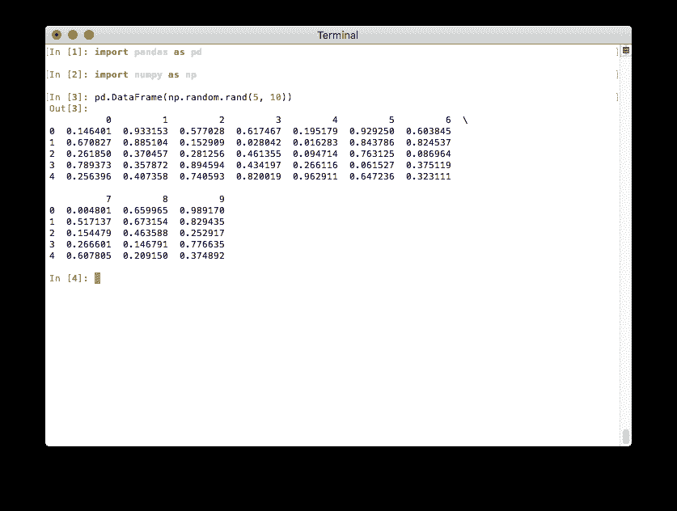
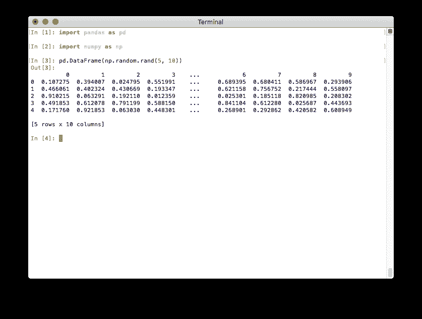

# 0.23.0 版本新特性（2018 年 5 月 15 日）

> 原文：[`pandas.pydata.org/docs/whatsnew/v0.23.0.html`](https://pandas.pydata.org/docs/whatsnew/v0.23.0.html)

这是从 0.22.0 版本开始的一个重要发布，包括一些 API 变更、弃用功能、新功能、增强功能和性能改进，以及大量的错误修复。我们建议所有用户升级到此版本。

主要亮点包括：

+   具有 'table' 方向的可循环 JSON 格式。

+   从字典实例化时尊重 Python 3.6+ 的顺序。

+   为 `assign` 提供依赖列参数。

+   在列和索引级别的组合上进行合并/排序。

+   使用自定义类型扩展 pandas。

+   从 groupby 中排除未观察到的类别。

+   更改以使 DataFrame.apply 的输出形状一致。

在更新前请查看 API 变更 和 弃用功能。

警告

从 2019 年 1 月 1 日开始，pandas 功能发布将仅支持 Python 3。有关更多信息，请参见 [放弃 Python 2.7](https://pandas.pydata.org/pandas-docs/version/0.24/install.html#install-dropping-27)。

0.23.0 版本新特性

+   新特性

    +   JSON 读写与 `orient='table'` 一致

    +   方法 `.assign()` 接受依赖参数

    +   在列和索引级别的组合上进行合并

    +   按列和索引级别的组合排序

    +   使用自定义类型扩展 pandas（实验性）

    +   在`GroupBy`中排除未观察到的类别的新关键字

    +   滚动/扩展应用程序() 接受 `raw=False` 以将 `Series` 传递给函数

    +   `DataFrame.interpolate` 现已获得 `limit_area` kwarg

    +   `get_dummies` 函数现在支持 `dtype` 参数

    +   时间增量模块方法

    +   当存在 `NaN` 时，方法 `.rank()` 处理 `inf` 值

    +   `Series.str.cat` 现已获得 `join` kwarg

    +   `DataFrame.astype` 执行列-wise 转换到 `Categorical`

    +   其他增强

+   不兼容的 API 更改

    +   依赖项已增加最低版本要求

    +   从字典实例化保留字典插入顺序，适用于 Python 3.6+

    +   弃用 Panel

    +   pandas.core.common 移除

    +   更改以使 `DataFrame.apply` 的输出一致

    +   连接将不再排序

    +   构建更改

    +   索引除零填充正确

    +   从字符串中提取匹配模式

    +   `CategoricalDtype` 的 `ordered` 参数的默认值

    +   在终端中更好地打印 DataFrame

    +   日期时间 API 更改

    +   其他 API 更改

+   弃用

+   删除先前版本的弃用/更改

+   性能改进

+   文档更改

+   错误修复

    +   分类

    +   日期时间

    +   时间增量

    +   时区

    +   偏移

    +   数值

    +   字符串

    +   索引

    +   多重索引

    +   IO

    +   绘图

    +   GroupBy/resample/rolling

    +   稀疏

    +   重塑

    +   其他

+   贡献者

## 新功能

### 使用 `orient='table'` 可以进行 JSON 读写往返

通过使用 `orient='table'` 参数，现在可以将 `DataFrame` 写入 JSON 并随后读取，同时保留元数据（参见 [GH 18912](https://github.com/pandas-dev/pandas/issues/18912) 和 [GH 9146](https://github.com/pandas-dev/pandas/issues/9146)）。以前，所有可用的 `orient` 值都不能保证保留 dtypes 和索引名称等其他元数据。

```py
In [1]: df = pd.DataFrame({'foo': [1, 2, 3, 4],
 ...:                   'bar': ['a', 'b', 'c', 'd'],
 ...:                   'baz': pd.date_range('2018-01-01', freq='d', periods=4),
 ...:                   'qux': pd.Categorical(['a', 'b', 'c', 'c'])},
 ...:                  index=pd.Index(range(4), name='idx'))
 ...: 

In [2]: df
Out[2]: 
 foo bar        baz qux
idx 
0      1   a 2018-01-01   a
1      2   b 2018-01-02   b
2      3   c 2018-01-03   c
3      4   d 2018-01-04   c

[4 rows x 4 columns]

In [3]: df.dtypes
Out[3]: 
foo             int64
bar            object
baz    datetime64[ns]
qux          category
Length: 4, dtype: object

In [4]: df.to_json('test.json', orient='table')

In [5]: new_df = pd.read_json('test.json', orient='table')

In [6]: new_df
Out[6]: 
 foo bar        baz qux
idx 
0      1   a 2018-01-01   a
1      2   b 2018-01-02   b
2      3   c 2018-01-03   c
3      4   d 2018-01-04   c

[4 rows x 4 columns]

In [7]: new_df.dtypes
Out[7]: 
foo             int64
bar            object
baz    datetime64[ns]
qux          category
Length: 4, dtype: object 
```

请注意，字符串 `index` 在往返格式中不受支持，因为它在 `write_json` 中默认用于指示缺少的索引名��。

```py
In [8]: df.index.name = 'index'

In [9]: df.to_json('test.json', orient='table')

In [10]: new_df = pd.read_json('test.json', orient='table')

In [11]: new_df
Out[11]: 
 foo bar        baz qux
0    1   a 2018-01-01   a
1    2   b 2018-01-02   b
2    3   c 2018-01-03   c
3    4   d 2018-01-04   c

[4 rows x 4 columns]

In [12]: new_df.dtypes
Out[12]: 
foo             int64
bar            object
baz    datetime64[ns]
qux          category
Length: 4, dtype: object 
```  ### 方法 `.assign()` 接受依赖参数

`DataFrame.assign()` 现在接受依赖关键字参数，适用于 Python 版本高于 3.6（另请参阅 [PEP 468](https://www.python.org/dev/peps/pep-0468/)）。如果参数是可调用的，则后续关键字参数现在可以引用先前的关键字参数。请查看此处的文档（[GH 14207](https://github.com/pandas-dev/pandas/issues/14207)）

```py
In [13]: df = pd.DataFrame({'A': [1, 2, 3]})

In [14]: df
Out[14]: 
 A
0  1
1  2
2  3

[3 rows x 1 columns]

In [15]: df.assign(B=df.A, C=lambda x: x['A'] + x['B'])
Out[15]: 
 A  B  C
0  1  1  2
1  2  2  4
2  3  3  6

[3 rows x 3 columns] 
```

警告

当您使用`.assign()`更新现有列时，这可能会微妙地改变代码的行为。以前，引用其他正在更新的变量的可调用函数会得到“旧”值

先前的行为：

```py
In [2]: df = pd.DataFrame({"A": [1, 2, 3]})

In [3]: df.assign(A=lambda df: df.A + 1, C=lambda df: df.A * -1)
Out[3]:
 A  C
0  2 -1
1  3 -2
2  4 -3 
```

新行为：

```py
In [16]: df.assign(A=df.A + 1, C=lambda df: df.A * -1)
Out[16]: 
 A  C
0  2 -2
1  3 -3
2  4 -4

[3 rows x 2 columns] 
```  ### 按列和索引级别的组合合并

字符串传递给`DataFrame.merge()`作为`on`、`left_on`和`right_on`参数，现在可以引用列名或索引级别名称。这使得可以在不重置索引的情况下，根据索引级别和列的组合合并`DataFrame`实例。请参阅按列和级别合并文档部分。([GH 14355](https://github.com/pandas-dev/pandas/issues/14355))

```py
In [17]: left_index = pd.Index(['K0', 'K0', 'K1', 'K2'], name='key1')

In [18]: left = pd.DataFrame({'A': ['A0', 'A1', 'A2', 'A3'],
 ....:                     'B': ['B0', 'B1', 'B2', 'B3'],
 ....:                     'key2': ['K0', 'K1', 'K0', 'K1']},
 ....:                    index=left_index)
 ....: 

In [19]: right_index = pd.Index(['K0', 'K1', 'K2', 'K2'], name='key1')

In [20]: right = pd.DataFrame({'C': ['C0', 'C1', 'C2', 'C3'],
 ....:                      'D': ['D0', 'D1', 'D2', 'D3'],
 ....:                      'key2': ['K0', 'K0', 'K0', 'K1']},
 ....:                     index=right_index)
 ....: 

In [21]: left.merge(right, on=['key1', 'key2'])
Out[21]: 
 A   B key2   C   D
key1 
K0    A0  B0   K0  C0  D0
K1    A2  B2   K0  C1  D1
K2    A3  B3   K1  C3  D3

[3 rows x 5 columns] 
```  ### 按列和索引级别的组合排序

字符串传递给`DataFrame.sort_values()`作为`by`参数，现在可以引用列名或索引级别名称。这使得可以按照索引级别和列的组合对`DataFrame`实例进行排序，而无需重置索引。请参阅按索引和值排序文档部分。([GH 14353](https://github.com/pandas-dev/pandas/issues/14353))

```py
# Build MultiIndex
In [22]: idx = pd.MultiIndex.from_tuples([('a', 1), ('a', 2), ('a', 2),
 ....:                                 ('b', 2), ('b', 1), ('b', 1)])
 ....: 

In [23]: idx.names = ['first', 'second']

# Build DataFrame
In [24]: df_multi = pd.DataFrame({'A': np.arange(6, 0, -1)},
 ....:                        index=idx)
 ....: 

In [25]: df_multi
Out[25]: 
 A
first second 
a     1       6
 2       5
 2       4
b     2       3
 1       2
 1       1

[6 rows x 1 columns]

# Sort by 'second' (index) and 'A' (column)
In [26]: df_multi.sort_values(by=['second', 'A'])
Out[26]: 
 A
first second 
b     1       1
 1       2
a     1       6
b     2       3
a     2       4
 2       5

[6 rows x 1 columns] 
```  ### 使用自定义类型扩展 pandas（实验性）

pandas 现在支持将不一定是 1-D NumPy 数组的类似数组对象存储为 DataFrame 中的列或 Series 中的值。这允许第三方库实现对 NumPy 类型的扩展，类似于 pandas 实现的分类、带时区的日期时间、周期和间隔。

作为演示，我们将使用[cyberpandas](https://cyberpandas.readthedocs.io/en/latest/)，它提供了一种用于存储 IP 地址的`IPArray`类型。

```py
In [1]: from cyberpandas import IPArray

In [2]: values = IPArray([
 ...:    0,
 ...:    3232235777,
 ...:    42540766452641154071740215577757643572
 ...: ])
 ...:
 ...: 
```

`IPArray`不是一个普通的 1-D NumPy 数组，但因为它是一个 pandas 的`ExtensionArray`，所以它可以被正确地存储在 pandas 的容器中。

```py
In [3]: ser = pd.Series(values)

In [4]: ser
Out[4]:
0                         0.0.0.0
1                     192.168.1.1
2    2001:db8:85a3::8a2e:370:7334
dtype: ip 
```

请注意 dtype 是`ip`。底层数组的缺失值语义得到了尊重：

```py
In [5]: ser.isna()
Out[5]:
0     True
1    False
2    False
dtype: bool 
```

更多信息，请参阅扩展类型文档。如果您构建了一个扩展数组，请在[生态系统页面](https://pandas.pydata.org/community/ecosystem.html)上公开它。  ### 新的`observed`关键字用于排除未观察到的类别在`GroupBy`中

按分类分组时，输出中包含未观察到的类别。当按多个分类列分组时，这意味着你会得到所有类别的笛卡尔积，包括没有观察到的组合，这可能导致大量的分组。我们添加了一个关键字`observed`来控制这种行为，默认为`observed=False`以保持向后兼容。([GH 14942](https://github.com/pandas-dev/pandas/issues/14942), [GH 8138](https://github.com/pandas-dev/pandas/issues/8138), [GH 15217](https://github.com/pandas-dev/pandas/issues/15217), [GH 17594](https://github.com/pandas-dev/pandas/issues/17594), [GH 8669](https://github.com/pandas-dev/pandas/issues/8669), [GH 20583](https://github.com/pandas-dev/pandas/issues/20583), [GH 20902](https://github.com/pandas-dev/pandas/issues/20902))

```py
In [27]: cat1 = pd.Categorical(["a", "a", "b", "b"],
 ....:                      categories=["a", "b", "z"], ordered=True)
 ....: 

In [28]: cat2 = pd.Categorical(["c", "d", "c", "d"],
 ....:                      categories=["c", "d", "y"], ordered=True)
 ....: 

In [29]: df = pd.DataFrame({"A": cat1, "B": cat2, "values": [1, 2, 3, 4]})

In [30]: df['C'] = ['foo', 'bar'] * 2

In [31]: df
Out[31]: 
 A  B  values    C
0  a  c       1  foo
1  a  d       2  bar
2  b  c       3  foo
3  b  d       4  bar

[4 rows x 4 columns] 
```

要显示所有值，以前的行为：

```py
In [32]: df.groupby(['A', 'B', 'C'], observed=False).count()
Out[32]: 
 values
A B C 
a c bar       0
 foo       1
 d bar       1
 foo       0
 y bar       0
...         ...
z c foo       0
 d bar       0
 foo       0
 y bar       0
 foo       0

[18 rows x 1 columns] 
```

仅显示观察到的值：

```py
In [33]: df.groupby(['A', 'B', 'C'], observed=True).count()
Out[33]: 
 values
A B C 
a c foo       1
 d bar       1
b c foo       1
 d bar       1

[4 rows x 1 columns] 
```

对于数据透视操作，这种行为已经被`dropna`关键字控制：

```py
In [34]: cat1 = pd.Categorical(["a", "a", "b", "b"],
 ....:                      categories=["a", "b", "z"], ordered=True)
 ....: 

In [35]: cat2 = pd.Categorical(["c", "d", "c", "d"],
 ....:                      categories=["c", "d", "y"], ordered=True)
 ....: 

In [36]: df = pd.DataFrame({"A": cat1, "B": cat2, "values": [1, 2, 3, 4]})

In [37]: df
Out[37]: 
 A  B  values
0  a  c       1
1  a  d       2
2  b  c       3
3  b  d       4

[4 rows x 3 columns] 
```

```py
In [1]: pd.pivot_table(df, values='values', index=['A', 'B'], dropna=True)

Out[1]:
 values
A B
a c     1.0
 d     2.0
b c     3.0
 d     4.0

In [2]: pd.pivot_table(df, values='values', index=['A', 'B'], dropna=False)

Out[2]:
 values
A B
a c     1.0
 d     2.0
 y     NaN
b c     3.0
 d     4.0
 y     NaN
z c     NaN
 d     NaN
 y     NaN 
```  ### Rolling/Expanding.apply()接受`raw=False`以将`Series`传递给函数

`Series.rolling().apply()`, `DataFrame.rolling().apply()`, `Series.expanding().apply()`, 和 `DataFrame.expanding().apply()` 增加了一个`raw=None`参数。这类似于`DataFame.apply()`。如果为`True`，允许将`np.ndarray`发送到应用的函数。如果为`False`，将传递一个`Series`。默认值为`None`，保持向后兼容性，因此默认为`True`，发送一个`np.ndarray`。在将来的版本中，默认值将更改为`False`，发送一个`Series`。([GH 5071](https://github.com/pandas-dev/pandas/issues/5071), [GH 20584](https://github.com/pandas-dev/pandas/issues/20584))

```py
In [38]: s = pd.Series(np.arange(5), np.arange(5) + 1)

In [39]: s
Out[39]: 
1    0
2    1
3    2
4    3
5    4
Length: 5, dtype: int64 
```

传递一个`Series`：

```py
In [40]: s.rolling(2, min_periods=1).apply(lambda x: x.iloc[-1], raw=False)
Out[40]: 
1    0.0
2    1.0
3    2.0
4    3.0
5    4.0
Length: 5, dtype: float64 
```

模仿传递一个 ndarray 的原始行为：

```py
In [41]: s.rolling(2, min_periods=1).apply(lambda x: x[-1], raw=True)
Out[41]: 
1    0.0
2    1.0
3    2.0
4    3.0
5    4.0
Length: 5, dtype: float64 
```  ### `DataFrame.interpolate`增加了`limit_area`关键字参数

`DataFrame.interpolate()` 增加了一个`limit_area`参数，以进一步控制替换哪些`NaN`。使用`limit_area='inside'`仅填充被有效值包围的 NaN，或使用`limit_area='outside'`仅填充现有有效值之外的`NaN`，同时保留其中的值。([GH 16284](https://github.com/pandas-dev/pandas/issues/16284)) 查看完整文档。

```py
In [42]: ser = pd.Series([np.nan, np.nan, 5, np.nan, np.nan,
 ....:                 np.nan, 13, np.nan, np.nan])
 ....: 

In [43]: ser
Out[43]: 
0     NaN
1     NaN
2     5.0
3     NaN
4     NaN
5     NaN
6    13.0
7     NaN
8     NaN
Length: 9, dtype: float64 
```

填充一个连续的内部值

```py
In [44]: ser.interpolate(limit_direction='both', limit_area='inside', limit=1)
Out[44]: 
0     NaN
1     NaN
2     5.0
3     7.0
4     NaN
5    11.0
6    13.0
7     NaN
8     NaN
Length: 9, dtype: float64 
```

向后填充所有连续的外部值

```py
In [45]: ser.interpolate(limit_direction='backward', limit_area='outside')
Out[45]: 
0     5.0
1     5.0
2     5.0
3     NaN
4     NaN
5     NaN
6    13.0
7     NaN
8     NaN
Length: 9, dtype: float64 
```

填充所有连续的外部值

```py
In [46]: ser.interpolate(limit_direction='both', limit_area='outside')
Out[46]: 
0     5.0
1     5.0
2     5.0
3     NaN
4     NaN
5     NaN
6    13.0
7    13.0
8    13.0
Length: 9, dtype: float64 
```  ### 函数`get_dummies`现在支持`dtype`参数

`get_dummies()` 现在接受一个`dtype`参数，指定新列的 dtype。默认值仍为 uint8。([GH 18330](https://github.com/pandas-dev/pandas/issues/18330))

```py
In [47]: df = pd.DataFrame({'a': [1, 2], 'b': [3, 4], 'c': [5, 6]})

In [48]: pd.get_dummies(df, columns=['c']).dtypes
Out[48]: 
a      int64
b      int64
c_5     bool
c_6     bool
Length: 4, dtype: object

In [49]: pd.get_dummies(df, columns=['c'], dtype=bool).dtypes
Out[49]: 
a      int64
b      int64
c_5     bool
c_6     bool
Length: 4, dtype: object 
```  ### 时间增量模块方法

当使用类似 timedelta 或数值参数进行操作时，`mod` (%) 和 `divmod` 操作现在在 `Timedelta` 对象上定义。请参阅这里的文档。 ([GH 19365](https://github.com/pandas-dev/pandas/issues/19365))

```py
In [50]: td = pd.Timedelta(hours=37)

In [51]: td % pd.Timedelta(minutes=45)
Out[51]: Timedelta('0 days 00:15:00') 
```  ### 方法 `.rank()` 处理 `NaN` 存在时的 `inf` 值

在先前版本中，`.rank()` 会将 `inf` 元素分配为它们的等级 `NaN`。现在等级被正确计算了。 ([GH 6945](https://github.com/pandas-dev/pandas/issues/6945))

```py
In [52]: s = pd.Series([-np.inf, 0, 1, np.nan, np.inf])

In [53]: s
Out[53]: 
0   -inf
1    0.0
2    1.0
3    NaN
4    inf
Length: 5, dtype: float64 
```

先前的行为：

```py
In [11]: s.rank()
Out[11]:
0    1.0
1    2.0
2    3.0
3    NaN
4    NaN
dtype: float64 
```

当前行为：

```py
In [54]: s.rank()
Out[54]: 
0    1.0
1    2.0
2    3.0
3    NaN
4    4.0
Length: 5, dtype: float64 
```

此外，以前如果您对 `inf` 或 `-inf` 值与 `NaN` 值进行排名，使用 ‘top’ 或 ‘bottom’ 参数时计算将无法区分 `NaN` 和无穷大。

```py
In [55]: s = pd.Series([np.nan, np.nan, -np.inf, -np.inf])

In [56]: s
Out[56]: 
0    NaN
1    NaN
2   -inf
3   -inf
Length: 4, dtype: float64 
```

先前的行为：

```py
In [15]: s.rank(na_option='top')
Out[15]:
0    2.5
1    2.5
2    2.5
3    2.5
dtype: float64 
```

当前行为：

```py
In [57]: s.rank(na_option='top')
Out[57]: 
0    1.5
1    1.5
2    3.5
3    3.5
Length: 4, dtype: float64 
```

这些错误已经被解决：

+   当 `method='dense'` 和 `pct=True` 时，在 `DataFrame.rank()` 和 `Series.rank()` 中存在百分位排名未与不同观察次数一起使用的错误（[GH 15630](https://github.com/pandas-dev/pandas/issues/15630)）

+   当 `ascending='False'` 时，在 `Series.rank()` 和 `DataFrame.rank()` 中存在一个错误，如果 `NaN` 存在，对无穷大值返回的等级不正确 ([GH 19538](https://github.com/pandas-dev/pandas/issues/19538))

+   在 `DataFrameGroupBy.rank()` 中存在一个错误，当同时存在无穷大和 `NaN` 时排名不正确 ([GH 20561](https://github.com/pandas-dev/pandas/issues/20561))  ### `Series.str.cat` 增加了 `join` kwarg

以前，`Series.str.cat()`与大多数 `pandas` 不同，在连接之前不会对 `Series` 根据它们的索引进行对齐（参见 [GH 18657](https://github.com/pandas-dev/pandas/issues/18657)）。该方法现在增加了一个关键字 `join` 来控制对齐的方式，见下面的示例和这里。

在 v.0.23 中，`join` 将默认为 None（表示没有对齐），但这个默认值将在 pandas 的将来版本中更改为 `'left'`。

```py
In [58]: s = pd.Series(['a', 'b', 'c', 'd'])

In [59]: t = pd.Series(['b', 'd', 'e', 'c'], index=[1, 3, 4, 2])

In [60]: s.str.cat(t)
Out[60]: 
0    NaN
1     bb
2     cc
3     dd
Length: 4, dtype: object

In [61]: s.str.cat(t, join='left', na_rep='-')
Out[61]: 
0    a-
1    bb
2    cc
3    dd
Length: 4, dtype: object 
```

此外，现在 `Series.str.cat()` 也适用于 `CategoricalIndex`（之前会引发 `ValueError`；请参见 [GH 20842](https://github.com/pandas-dev/pandas/issues/20842)）。  ### `DataFrame.astype` 对 `Categorical` 进行列转换

通过提供字符串`'category'`或`CategoricalDtype`，`DataFrame.astype()` 现在可以执行列转换为`Categorical`。以前尝试这样做会引发`NotImplementedError`。有关更多详细信息和示例，请参阅对象创建部分的文档。([GH 12860](https://github.com/pandas-dev/pandas/issues/12860)，[GH 18099](https://github.com/pandas-dev/pandas/issues/18099))

提供字符串`'category'`执行列转换，只有标签出现在给定列中，才将其设置为类别：

```py
In [62]: df = pd.DataFrame({'A': list('abca'), 'B': list('bccd')})

In [63]: df = df.astype('category')

In [64]: df['A'].dtype
Out[64]: CategoricalDtype(categories=['a', 'b', 'c'], ordered=False, categories_dtype=object)

In [65]: df['B'].dtype
Out[65]: CategoricalDtype(categories=['b', 'c', 'd'], ordered=False, categories_dtype=object) 
```

使用`CategoricalDtype`将使每列中的类别与提供的 dtype 保持一致：

```py
In [66]: from pandas.api.types import CategoricalDtype

In [67]: df = pd.DataFrame({'A': list('abca'), 'B': list('bccd')})

In [68]: cdt = CategoricalDtype(categories=list('abcd'), ordered=True)

In [69]: df = df.astype(cdt)

In [70]: df['A'].dtype
Out[70]: CategoricalDtype(categories=['a', 'b', 'c', 'd'], ordered=True, categories_dtype=object)

In [71]: df['B'].dtype
Out[71]: CategoricalDtype(categories=['a', 'b', 'c', 'd'], ordered=True, categories_dtype=object) 
```  ### 其他增强

+   对`Series`和`DataFrame`现在允许一元`+`作为数值运算符。([GH 16073](https://github.com/pandas-dev/pandas/issues/16073))

+   更好地支持使用`xlsxwriter`引擎的`to_excel()`输出。([GH 16149](https://github.com/pandas-dev/pandas/issues/16149))

+   `pandas.tseries.frequencies.to_offset()` 现在接受前导‘+’符号，例如‘+1h’。([GH 18171](https://github.com/pandas-dev/pandas/issues/18171))

+   `MultiIndex.unique()` 现在支持`level=`参数，用于从特定索引级别获取唯一值。([GH 17896](https://github.com/pandas-dev/pandas/issues/17896))

+   `pandas.io.formats.style.Styler` 现在具有`hide_index()`方法，用于确定输出中是否呈现索引。([GH 14194](https://github.com/pandas-dev/pandas/issues/14194))

+   `pandas.io.formats.style.Styler` 现在具有`hide_columns()`方法，用于确定输出中是否隐藏列。([GH 14194](https://github.com/pandas-dev/pandas/issues/14194))

+   在`to_datetime()`中，当`unit=`与不可转换的值一起传递时，改进了`ValueError`的措辞。([GH 14350](https://github.com/pandas-dev/pandas/issues/14350))

+   `Series.fillna()` 现在接受一个 Series 或一个字典作为分类 dtype 的`value`。([GH 17033](https://github.com/pandas-dev/pandas/issues/17033))

+   `pandas.read_clipboard()` 现在使用 qtpy，备用 PyQt5 和 PyQt4，增加了与 Python3 和多个 Python-qt 绑定的兼容性（[GH 17722](https://github.com/pandas-dev/pandas/issues/17722)）

+   在 `read_csv()` 中，当 `usecols` 参数无法匹配所有列时，改进了 `ValueError` 的措辞。([GH 17301](https://github.com/pandas-dev/pandas/issues/17301))

+   `DataFrame.corrwith()` 现在在传递 Series 时会在静默情况下删除非数值列。之前，会引发异常 ([GH 18570](https://github.com/pandas-dev/pandas/issues/18570))

+   `IntervalIndex` 现在支持时区感知的 `Interval` 对象（[GH 18537](https://github.com/pandas-dev/pandas/issues/18537), [GH 18538](https://github.com/pandas-dev/pandas/issues/18538)）

+   `Series()` / `DataFrame()` 表补全还会返回`MultiIndex()` 中第一级的标识符。（[GH 16326](https://github.com/pandas-dev/pandas/issues/16326)）

+   `read_excel()` 增加了 `nrows` 参数 ([GH 16645](https://github.com/pandas-dev/pandas/issues/16645))

+   `DataFrame.append()` 现在在更多情况下可以保留调用 dataframe 列的类型（例如，如果两者都是 `CategoricalIndex`）（[GH 18359](https://github.com/pandas-dev/pandas/issues/18359))

+   `DataFrame.to_json()` 和 `Series.to_json()` 现在接受一个 `index` 参数，允许用户在 JSON 输出中排除索引 ([GH 17394](https://github.com/pandas-dev/pandas/issues/17394))

+   `IntervalIndex.to_tuples()` 增加了 `na_tuple` 参数，用于控制是否将 NA 作为 NA 元组返回，还是作为 NA 本身返回（[GH 18756](https://github.com/pandas-dev/pandas/issues/18756)）

+   `Categorical.rename_categories`，`CategoricalIndex.rename_categories` 和 `Series.cat.rename_categories` 现在可以接受一个可调用对象作为参数 ([GH 18862](https://github.com/pandas-dev/pandas/issues/18862))

+   `Interval` 和 `IntervalIndex` 增加了一个`length`属性 ([GH 18789](https://github.com/pandas-dev/pandas/issues/18789))

+   `Resampler` 对象现在具有一个可用的`Resampler.pipe`方法。之前，对`pipe`的调用被重定向到`mean`方法（[GH 17905](https://github.com/pandas-dev/pandas/issues/17905)）。

+   `is_scalar()` 现在对`DateOffset`对象返回`True` ([GH 18943](https://github.com/pandas-dev/pandas/issues/18943)).

+   `DataFrame.pivot()` 现在接受`values=` kwarg 的列表参数（[GH 17160](https://github.com/pandas-dev/pandas/issues/17160)).

+   添加了 `pandas.api.extensions.register_dataframe_accessor()`、`pandas.api.extensions.register_series_accessor()` 和 `pandas.api.extensions.register_index_accessor()`，用于让 pandas 下游库注册自定义访问器，如在 pandas 对象上注册`.cat`。更多信息请参见注册自定义访问器（[GH 14781](https://github.com/pandas-dev/pandas/issues/14781)).

+   `IntervalIndex.astype` 现在支持在传递`IntervalDtype`时在子类型之间进行转换（[GH 19197](https://github.com/pandas-dev/pandas/issues/19197))

+   `IntervalIndex` 及其关联的构造方法（`from_arrays`、`from_breaks`、`from_tuples`）现在增加了一个`dtype`参数（[GH 19262](https://github.com/pandas-dev/pandas/issues/19262))

+   添加了 `SeriesGroupBy.is_monotonic_increasing()` 和 `SeriesGroupBy.is_monotonic_decreasing()` ([GH 17015](https://github.com/pandas-dev/pandas/issues/17015))

+   对于子类化的`DataFrames`，`DataFrame.apply()`现在在将数据传递给应用函数时会保留`Series`子类（如果已定义）（[GH 19822](https://github.com/pandas-dev/pandas/issues/19822)）

+   `DataFrame.from_dict()` 现在接受一个 `columns` 参数，当 `orient='index'` 时可以用来指定列名（[GH 18529](https://github.com/pandas-dev/pandas/issues/18529)）

+   添加了选项 `display.html.use_mathjax`，以便在 `Jupyter` 笔记本中渲染表格时可以禁用 [MathJax](https://www.mathjax.org/)（[GH 19856](https://github.com/pandas-dev/pandas/issues/19856), [GH 19824](https://github.com/pandas-dev/pandas/issues/19824))

+   `DataFrame.replace()` 现在支持 `method` 参数，当 `to_replace` 是标量、列表或元组且 `value` 是 `None` 时，可以用它来指定替换方法（[GH 19632](https://github.com/pandas-dev/pandas/issues/19632)）

+   `Timestamp.month_name()`、`DatetimeIndex.month_name()` 和 `Series.dt.month_name()` 现在可用了（[GH 12805](https://github.com/pandas-dev/pandas/issues/12805)）

+   `Timestamp.day_name()` 和 `DatetimeIndex.day_name()` 现在可以返回指定语言环境下的星期几名称了（[GH 12806](https://github.com/pandas-dev/pandas/issues/12806)）

+   `DataFrame.to_sql()` 现在如果底层连接支持，则会执行多值插入，而不是逐行插入。支持多值插入的 `SQLAlchemy` 方言包括：`mysql`、`postgresql`、`sqlite` 和任何带有 `supports_multivalues_insert` 的方言。([GH 14315](https://github.com/pandas-dev/pandas/issues/14315), [GH 8953](https://github.com/pandas-dev/pandas/issues/8953))

+   `read_html()` 现在接受一个 `displayed_only` 关键字参数来控制是否解析隐藏元素（默认为 `True`）（[GH 20027](https://github.com/pandas-dev/pandas/issues/20027)）

+   `read_html()` 现在会读取表格中的所有 `<tbody>` 元素，而不仅仅是第一个（[GH 20690](https://github.com/pandas-dev/pandas/issues/20690)）

+   `Rolling.quantile()` 和 `Expanding.quantile()` 现在接受 `interpolation` 关键字，默认为 `linear` ([GH 20497](https://github.com/pandas-dev/pandas/issues/20497))

+   通过 `compression=zip` 在 `DataFrame.to_pickle()`, `Series.to_pickle()`, `DataFrame.to_csv()`, `Series.to_csv()`, `DataFrame.to_json()`, `Series.to_json()` 支持 zip 压缩。([GH 17778](https://github.com/pandas-dev/pandas/issues/17778))

+   `WeekOfMonth` 构造函数现在支持 `n=0` ([GH 20517](https://github.com/pandas-dev/pandas/issues/20517)).

+   `DataFrame` 和 `Series` 现在支持矩阵乘法 (`@`) 运算符 ([GH 10259](https://github.com/pandas-dev/pandas/issues/10259)) 适用于 Python>=3.5

+   更新了 `DataFrame.to_gbq()` 和 `pandas.read_gbq()` 的签名和文档，以反映来自 pandas-gbq 库版本 0.4.0 的更改。添加了到 pandas-gbq 库的 intersphinx 映射。([GH 20564](https://github.com/pandas-dev/pandas/issues/20564))

+   新增了用于导出 Stata dta 文件的新写入器，版本为 117，`StataWriter117`。该格式支持导出长度最长为 2,000,000 个字符的字符串 ([GH 16450](https://github.com/pandas-dev/pandas/issues/16450))

+   `to_hdf()` 和 `read_hdf()` 现在接受一个 `errors` 关键字参数来控制编码错误处理（[GH 20835](https://github.com/pandas-dev/pandas/issues/20835))

+   `cut()` 增加了 `duplicates='raise'|'drop'` 选项，用于控制是否在重复边缘上引发异常 ([GH 20947](https://github.com/pandas-dev/pandas/issues/20947))

+   `date_range()`、`timedelta_range()` 和 `interval_range()` 现在如果指定了 `start`、`stop` 和 `periods`，但没有指定 `freq`，则返回一个线性间隔的索引。 ([GH 20808](https://github.com/pandas-dev/pandas/issues/20808), [GH 20983](https://github.com/pandas-dev/pandas/issues/20983), [GH 20976](https://github.com/pandas-dev/pandas/issues/20976))  ## 不兼容的 API 变更

### 依赖关系已增加最低版本

我们已经更新了我们的依赖关系的最低支持版本 ([GH 15184](https://github.com/pandas-dev/pandas/issues/15184))。如果安装了，我们现在需要：

| 包 | 最低版本 | 必需的 | 问题 |
| --- | --- | --- | --- |
| python-dateutil | 2.5.0 | X | [GH 15184](https://github.com/pandas-dev/pandas/issues/15184) |
| openpyxl | 2.4.0 |  | [GH 15184](https://github.com/pandas-dev/pandas/issues/15184) |
| beautifulsoup4 | 4.2.1 |  | [GH 20082](https://github.com/pandas-dev/pandas/issues/20082) |

| setuptools | 24.2.0 |  | [GH 20698](https://github.com/pandas-dev/pandas/issues/20698) |  ### 从字典实例化保留 Python 3.6+ 的字典插入顺序

直到 Python 3.6，Python 中的字典没有正式定义的排序方式。对于版本 3.6 及更高版本的 Python，字典按插入顺序排序，参见 [PEP 468](https://www.python.org/dev/peps/pep-0468/)。当从字典创建 `Series` 或 `DataFrame` 时，pandas 将使用字典的插入顺序。如果您使用的是 Python 版本 3.6 或更高版本。 ([GH 19884](https://github.com/pandas-dev/pandas/issues/19884))

先前的行为（如果在 Python < 3.6 上）：

```py
In [16]: pd.Series({'Income': 2000,
 ....:           'Expenses': -1500,
 ....:           'Taxes': -200,
 ....:           'Net result': 300})
Out[16]:
Expenses     -1500
Income        2000
Net result     300
Taxes         -200
dtype: int64 
```

请注意上述 Series 是按索引值字母顺序排列的。

新行为（对于 Python >= 3.6）：

```py
In [72]: pd.Series({'Income': 2000,
 ....:           'Expenses': -1500,
 ....:           'Taxes': -200,
 ....:           'Net result': 300})
 ....: 
Out[72]: 
Income        2000
Expenses     -1500
Taxes         -200
Net result     300
Length: 4, dtype: int64 
```

注意现在系列按插入顺序排序。所有相关的 pandas 类型（`Series`、`DataFrame`、`SparseSeries` 和 `SparseDataFrame`）都使用了这种新行为。

如果您希望保留旧行为同时使用 Python >= 3.6，您可以使用 `.sort_index()`：

```py
In [73]: pd.Series({'Income': 2000,
 ....:           'Expenses': -1500,
 ....:           'Taxes': -200,
 ....:           'Net result': 300}).sort_index()
 ....: 
Out[73]: 
Expenses     -1500
Income        2000
Net result     300
Taxes         -200
Length: 4, dtype: int64 
```  ### 弃用 Panel

`Panel` 在 0.20.x 版本中已弃用，显示为 `DeprecationWarning`。现在使用 `Panel` 将会显示一个 `FutureWarning`。表示 3-D 数据的推荐方式是在 `DataFrame` 上使用 `MultiIndex`，通过 `to_frame()` 方法或使用 [xarray package](http://xarray.pydata.org/en/stable/)。pandas 提供了 `to_xarray()` 方法来自动执行此转换 ([GH 13563](https://github.com/pandas-dev/pandas/issues/13563), [GH 18324](https://github.com/pandas-dev/pandas/issues/18324))。

```py
In [75]: import pandas._testing as tm

In [76]: p = tm.makePanel()

In [77]: p
Out[77]:
<class 'pandas.core.panel.Panel'>
Dimensions: 3 (items) x 3 (major_axis) x 4 (minor_axis)
Items axis: ItemA to ItemC
Major_axis axis: 2000-01-03 00:00:00 to 2000-01-05 00:00:00
Minor_axis axis: A to D 
```

转换为 MultiIndex DataFrame

```py
In [78]: p.to_frame()
Out[78]:
 ItemA     ItemB     ItemC
major      minor
2000-01-03 A      0.469112  0.721555  0.404705
 B     -1.135632  0.271860 -1.039268
 C      0.119209  0.276232 -1.344312
 D     -2.104569  0.113648 -0.109050
2000-01-04 A     -0.282863 -0.706771  0.577046
 B      1.212112 -0.424972 -0.370647
 C     -1.044236 -1.087401  0.844885
 D     -0.494929 -1.478427  1.643563
2000-01-05 A     -1.509059 -1.039575 -1.715002
 B     -0.173215  0.567020 -1.157892
 C     -0.861849 -0.673690  1.075770
 D      1.071804  0.524988 -1.469388

[12 rows x 3 columns] 
```

转换为 xarray DataArray

```py
In [79]: p.to_xarray()
Out[79]:
<xarray.DataArray (items: 3, major_axis: 3, minor_axis: 4)>
array([[[ 0.469112, -1.135632,  0.119209, -2.104569],
 [-0.282863,  1.212112, -1.044236, -0.494929],
 [-1.509059, -0.173215, -0.861849,  1.071804]],

 [[ 0.721555,  0.27186 ,  0.276232,  0.113648],
 [-0.706771, -0.424972, -1.087401, -1.478427],
 [-1.039575,  0.56702 , -0.67369 ,  0.524988]],

 [[ 0.404705, -1.039268, -1.344312, -0.10905 ],
 [ 0.577046, -0.370647,  0.844885,  1.643563],
 [-1.715002, -1.157892,  1.07577 , -1.469388]]])
Coordinates:
 * items       (items) object 'ItemA' 'ItemB' 'ItemC'
 * major_axis  (major_axis) datetime64[ns] 2000-01-03 2000-01-04 2000-01-05
 * minor_axis  (minor_axis) object 'A' 'B' 'C' 'D' 
```  ### pandas.core.common 移除

以下错误和警告消息已从 `pandas.core.common` 中移除（[GH 13634](https://github.com/pandas-dev/pandas/issues/13634), [GH 19769](https://github.com/pandas-dev/pandas/issues/19769)）：

+   `PerformanceWarning`

+   `UnsupportedFunctionCall`

+   `UnsortedIndexError`

+   `AbstractMethodError`

这些可以从 `pandas.errors` 导入（自 0.19.0 起）。  ### 更改使 `DataFrame.apply` 的输出一致

`DataFrame.apply()` 在应用返回类似列表的任意用户定义函数时存在不一致性，`axis=1`。解决了几个错误和不一致性。如果应用的函数返回一个 Series，则 pandas 将返回一个 DataFrame；否则将返回一个 Series，包括返回类似列表（例如 `tuple` 或 `list`）的情况（[GH 16353](https://github.com/pandas-dev/pandas/issues/16353), [GH 17437](https://github.com/pandas-dev/pandas/issues/17437), [GH 17970](https://github.com/pandas-dev/pandas/issues/17970), [GH 17348](https://github.com/pandas-dev/pandas/issues/17348), [GH 17892](https://github.com/pandas-dev/pandas/issues/17892), [GH 18573](https://github.com/pandas-dev/pandas/issues/18573), [GH 17602](https://github.com/pandas-dev/pandas/issues/17602), [GH 18775](https://github.com/pandas-dev/pandas/issues/18775), [GH 18901](https://github.com/pandas-dev/pandas/issues/18901), [GH 18919](https://github.com/pandas-dev/pandas/issues/18919)).

```py
In [74]: df = pd.DataFrame(np.tile(np.arange(3), 6).reshape(6, -1) + 1,
 ....:                  columns=['A', 'B', 'C'])
 ....: 

In [75]: df
Out[75]: 
 A  B  C
0  1  2  3
1  1  2  3
2  1  2  3
3  1  2  3
4  1  2  3
5  1  2  3

[6 rows x 3 columns] 
```

先前行为：如果返回形状恰好与原始列的长度匹配，则返回一个 `DataFrame`。如果返回形状不匹配，则返回一个带有列表的 `Series`。

```py
In [3]: df.apply(lambda x: [1, 2, 3], axis=1)
Out[3]:
   A  B  C
0  1  2  3
1  1  2  3
2  1  2  3
3  1  2  3
4  1  2  3
5  1  2  3

In [4]: df.apply(lambda x: [1, 2], axis=1)
Out[4]:
0    [1, 2]
1    [1, 2]
2    [1, 2]
3    [1, 2]
4    [1, 2]
5    [1, 2]
dtype: object 
```

新行为：当应用的函数返回类似列表时，现在将*始终*返回一个 `Series`。

```py
In [76]: df.apply(lambda x: [1, 2, 3], axis=1)
Out[76]: 
0    [1, 2, 3]
1    [1, 2, 3]
2    [1, 2, 3]
3    [1, 2, 3]
4    [1, 2, 3]
5    [1, 2, 3]
Length: 6, dtype: object

In [77]: df.apply(lambda x: [1, 2], axis=1)
Out[77]: 
0    [1, 2]
1    [1, 2]
2    [1, 2]
3    [1, 2]
4    [1, 2]
5    [1, 2]
Length: 6, dtype: object 
```

要扩展列，可以使用 `result_type='expand'`

```py
In [78]: df.apply(lambda x: [1, 2, 3], axis=1, result_type='expand')
Out[78]: 
 0  1  2
0  1  2  3
1  1  2  3
2  1  2  3
3  1  2  3
4  1  2  3
5  1  2  3

[6 rows x 3 columns] 
```

要在原始列上广播结果（正确长度的列表类似的旧行为），可以使用 `result_type='broadcast'`。形状必须与原始列匹配。

```py
In [79]: df.apply(lambda x: [1, 2, 3], axis=1, result_type='broadcast')
Out[79]: 
 A  B  C
0  1  2  3
1  1  2  3
2  1  2  3
3  1  2  3
4  1  2  3
5  1  2  3

[6 rows x 3 columns] 
```

返回一个 `Series` 允许控制确切的返回结构和列名：

```py
In [80]: df.apply(lambda x: pd.Series([1, 2, 3], index=['D', 'E', 'F']), axis=1)
Out[80]: 
 D  E  F
0  1  2  3
1  1  2  3
2  1  2  3
3  1  2  3
4  1  2  3
5  1  2  3

[6 rows x 3 columns] 
```  ### 连接将不再排序

在未来的 pandas 版本中，`pandas.concat()` 在非连接轴未对齐时将不再对其进行排序。当前行为与以前相同（排序），但现在在未指定 `sort` 且非连接轴未对齐时会发出警告（[GH 4588](https://github.com/pandas-dev/pandas/issues/4588)）。

```py
In [81]: df1 = pd.DataFrame({"a": [1, 2], "b": [1, 2]}, columns=['b', 'a'])

In [82]: df2 = pd.DataFrame({"a": [4, 5]})

In [83]: pd.concat([df1, df2])
Out[83]: 
 b  a
0  1.0  1
1  2.0  2
0  NaN  4
1  NaN  5

[4 rows x 2 columns] 
```

要保留先前的行为（排序）并消除警告，请传递 `sort=True`

```py
In [84]: pd.concat([df1, df2], sort=True)
Out[84]: 
 a    b
0  1  1.0
1  2  2.0
0  4  NaN
1  5  NaN

[4 rows x 2 columns] 
```

要接受未来行为（不排序），请传递 `sort=False`

请注意，此更改也适用于 `DataFrame.append()`，它还接收了一个 `sort` 关键字以控制此行为。  ### 构建更改

+   为了开发构建 pandas，现在需要 `cython >= 0.24` ([GH 18613](https://github.com/pandas-dev/pandas/issues/18613))

+   现在从源代码构建明确要求 `setup.py` 中包含 `setuptools` ([GH 18113](https://github.com/pandas-dev/pandas/issues/18113))

+   更新 conda 配方以符合 conda-build 3.0+ ([GH 18002](https://github.com/pandas-dev/pandas/issues/18002))  ### 索引除以零填充正确

`Index` 及其子类上的除法运算现在将正数除以零填充为 `np.inf`，负数除以零填充为 `-np.inf`，以及 `0 / 0` 填充为 `np.nan`。这与现有的 `Series` 行为相匹配。 ([GH 19322](https://github.com/pandas-dev/pandas/issues/19322), [GH 19347](https://github.com/pandas-dev/pandas/issues/19347))

先前的行为:

```py
In [6]: index = pd.Int64Index([-1, 0, 1])

In [7]: index / 0
Out[7]: Int64Index([0, 0, 0], dtype='int64')

# Previous behavior yielded different results depending on the type of zero in the divisor
In [8]: index / 0.0
Out[8]: Float64Index([-inf, nan, inf], dtype='float64')

In [9]: index = pd.UInt64Index([0, 1])

In [10]: index / np.array([0, 0], dtype=np.uint64)
Out[10]: UInt64Index([0, 0], dtype='uint64')

In [11]: pd.RangeIndex(1, 5) / 0
ZeroDivisionError: integer division or modulo by zero 
```

当前行为:

```py
In [12]: index = pd.Int64Index([-1, 0, 1])
# division by zero gives -infinity where negative,
# +infinity where positive, and NaN for 0 / 0
In [13]: index / 0

# The result of division by zero should not depend on
# whether the zero is int or float
In [14]: index / 0.0

In [15]: index = pd.UInt64Index([0, 1])
In [16]: index / np.array([0, 0], dtype=np.uint64)

In [17]: pd.RangeIndex(1, 5) / 0 
```  ### 从字符串中提取匹配模式

默认情况下，使用 `str.extract()` 从字符串中提取匹配模式，如果提取了单个组，则返回 `Series`（如果提取了多个组，则返回 `DataFrame`）。 从 pandas 0.23.0 开始，`str.extract()` 总是返回 `DataFrame`，除非 `expand` 设置为 `False`。最后，`None` 是 `expand` 参数的接受值（等同于 `False`），但现在会引发 `ValueError`。 ([GH 11386](https://github.com/pandas-dev/pandas/issues/11386))

先前的行为:

```py
In [1]: s = pd.Series(['number 10', '12 eggs'])

In [2]: extracted = s.str.extract(r'.*(\d\d).*')

In [3]: extracted
Out [3]:
0    10
1    12
dtype: object

In [4]: type(extracted)
Out [4]:
pandas.core.series.Series 
```

新行为:

```py
In [85]: s = pd.Series(['number 10', '12 eggs'])

In [86]: extracted = s.str.extract(r'.*(\d\d).*')

In [87]: extracted
Out[87]: 
 0
0  10
1  12

[2 rows x 1 columns]

In [88]: type(extracted)
Out[88]: pandas.core.frame.DataFrame 
```

要恢复先前的行为，只需将 `expand` 设置为 `False`:

```py
In [89]: s = pd.Series(['number 10', '12 eggs'])

In [90]: extracted = s.str.extract(r'.*(\d\d).*', expand=False)

In [91]: extracted
Out[91]: 
0    10
1    12
Length: 2, dtype: object

In [92]: type(extracted)
Out[92]: pandas.core.series.Series 
```  ### `CategoricalDtype` 的 `ordered` 参数的默认值

`CategoricalDtype` 的 `ordered` 参数的默认值已从 `False` 更改为 `None`，以允许更新 `categories` 而不影响 `ordered`。行为应保持一致，以便于下游对象，例如 `Categorical` ([GH 18790](https://github.com/pandas-dev/pandas/issues/18790))

在先前的版本中，`ordered` 参数的默认值为 `False`。这可能会导致用户在尝试更新 `categories` 时，如果未明确指定 `ordered`，则无意中将 `ordered` 参数从 `True` 更改为 `False`，因为它会默认为 `False` 而没有提醒。`ordered=None` 的新行为是保留 `ordered` 的现有值。

新行为:

```py
In [2]: from pandas.api.types import CategoricalDtype

In [3]: cat = pd.Categorical(list('abcaba'), ordered=True, categories=list('cba'))

In [4]: cat
Out[4]:
[a, b, c, a, b, a]
Categories (3, object): [c < b < a]

In [5]: cdt = CategoricalDtype(categories=list('cbad'))

In [6]: cat.astype(cdt)
Out[6]:
[a, b, c, a, b, a]
Categories (4, object): [c < b < a < d] 
```

请注意上面的示例中，转换后的 `Categorical` 保留了 `ordered=True`。如果 `ordered` 的默认值仍然为 `False`，则转换后的 `Categorical` 将变为无序，尽管从未显式指定过 `ordered=False`。要更改 `ordered` 的值，请将其明确传递给新的 dtype，例如 `CategoricalDtype(categories=list('cbad'), ordered=False)`。

请注意，由于分别存在阻止 `astype` 进行任何类型的类别到类别转换的错误（[GH 10696](https://github.com/pandas-dev/pandas/issues/10696)、[GH 18593](https://github.com/pandas-dev/pandas/issues/18593)），因此上述讨论的 `ordered` 的意外转换在以前的版本中未出现。这些错误已在此版本中修复，并促使更改 `ordered` 的默认值。  ### 更好的终端中的 DataFrame 漂亮打印

以前，最大列数的默认值为 `pd.options.display.max_columns=20`。这意味着相对较宽的数据帧将无法适应终端宽度，并且 pandas 将引入换行符以显示这 20 列。这导致输出相对难以阅读：



如果 Python 在终端中运行，则现在会自动确定列的最大数量，以使打印的数据帧适合当前终端宽度（`pd.options.display.max_columns=0`）（[GH 17023](https://github.com/pandas-dev/pandas/issues/17023)）。如果 Python 作为 Jupyter 内核运行（例如 Jupyter QtConsole 或 Jupyter 笔记本，以及许多 IDE），则无法自动推断此值，因此将其设置为`20`，与以前的版本相同。在终端中，这会产生更好的输出：



请注意，如果您不喜欢新的默认设置，则始终可以自己设置此选项。要恢复到旧设置，可以运行以下行：

```py
pd.options.display.max_columns = 20 
```  ### Datetimelike API changes

+   默认的 `Timedelta` 构造函数现在接受 `ISO 8601 Duration` 字符串作为参数（[GH 19040](https://github.com/pandas-dev/pandas/issues/19040)）

+   从具有 `dtype='datetime64[ns]'` 的 `Series` 中减去 `NaT` 会返回一个 `dtype='timedelta64[ns]'` 的 `Series`，而不是 `dtype='datetime64[ns]'`（[GH 18808](https://github.com/pandas-dev/pandas/issues/18808)）

+   从 `TimedeltaIndex` 中加或减 `NaT` 将返回 `TimedeltaIndex`，而不是 `DatetimeIndex`（[GH 19124](https://github.com/pandas-dev/pandas/issues/19124))

+   当索引对象频率为 `None` 时，`DatetimeIndex.shift()` 和 `TimedeltaIndex.shift()` 现在会引发 `NullFrequencyError`（它是 `ValueError` 的子类，在旧版本中引发 `ValueError`）（[GH 19147](https://github.com/pandas-dev/pandas/issues/19147)）

+   从具有 `dtype='timedelta64[ns]'` 的 `Series` 中加减 `NaN` 将引发 `TypeError`，而不是将 `NaN` 视为 `NaT`（[GH 19274](https://github.com/pandas-dev/pandas/issues/19274)）

+   使用[`datetime.timedelta`](https://docs.python.org/3/library/datetime.html#datetime.timedelta "(in Python v3.12)")进行`NaT`除法现在将返回`NaN`，而不是引发异常（[GH 17876](https://github.com/pandas-dev/pandas/issues/17876))

+   在`Series`的 dtype 为`dtype='datetime64[ns]'`和`PeriodIndex`之间的操作将正确引发`TypeError`（[GH 18850](https://github.com/pandas-dev/pandas/issues/18850))

+   对于带有不匹配时区的`dtype='datetime64[ns]'`的`Series`进行减法运算将引发`TypeError`，而不是`ValueError`（[GH 18817](https://github.com/pandas-dev/pandas/issues/18817))

+   `Timestamp`不再悄悄地忽略未使用或无效的`tz`或`tzinfo`关键字参数（[GH 17690](https://github.com/pandas-dev/pandas/issues/17690))

+   `Timestamp`不再悄悄地忽略无效的`freq`参数（[GH 5168](https://github.com/pandas-dev/pandas/issues/5168))

+   `CacheableOffset`和`WeekDay`不再在`pandas.tseries.offsets`模块中可用（[GH 17830](https://github.com/pandas-dev/pandas/issues/17830))

+   `pandas.tseries.frequencies.get_freq_group()`和`pandas.tseries.frequencies.DAYS`已从公共 API 中移除（[GH 18034](https://github.com/pandas-dev/pandas/issues/18034))

+   如果索引未排序，`Series.truncate()`和`DataFrame.truncate()`将引发`ValueError`，而不是无用的`KeyError`（[GH 17935](https://github.com/pandas-dev/pandas/issues/17935))

+   当索引不是`DatetimeIndex`时，`Series.first`和`DataFrame.first`现在将引发`TypeError`，而不是`NotImplementedError`（[GH 20725](https://github.com/pandas-dev/pandas/issues/20725)).

+   当索引不是`DatetimeIndex`时，`Series.last`和`DataFrame.last`现在将引发`TypeError`，而不是`NotImplementedError`（[GH 20725](https://github.com/pandas-dev/pandas/issues/20725)).

+   限制了`DateOffset`关键字参数。以前，`DateOffset`子类允许任意关键字参数，这可能导致意外行为。现在，只有有效的参数将被接受（[GH 17176](https://github.com/pandas-dev/pandas/issues/17176)，[GH 18226](https://github.com/pandas-dev/pandas/issues/18226)）。

+   在尝试在时区感知和时区无关的列上进行合并时，`pandas.merge()`提供了更具信息性的错误消息（[GH 15800](https://github.com/pandas-dev/pandas/issues/15800)）。

+   对于具有`freq=None`的`DatetimeIndex`和`TimedeltaIndex`，对整数 dtype 数组或`Index`的加法或减法将引发`NullFrequencyError`而不是`TypeError`（[GH 19895](https://github.com/pandas-dev/pandas/issues/19895)）。

+   `Timestamp`构造函数现在接受一个`nanosecond`关键字或位置参数（[GH 18898](https://github.com/pandas-dev/pandas/issues/18898)）。

+   当在实例化后设置`tz`属性时，`DatetimeIndex`现在将引发`AttributeError`（[GH 3746](https://github.com/pandas-dev/pandas/issues/3746)）。

+   具有`pytz`时区的`DatetimeIndex`现在将返回一致的`pytz`时区（[GH 18595](https://github.com/pandas-dev/pandas/issues/18595)）  ### 其他 API 更改

+   当具有不兼容 dtype 的`Series.astype()`和`Index.astype()`时，现在将引发`TypeError`而不是`ValueError`（[GH 18231](https://github.com/pandas-dev/pandas/issues/18231)）。

+   使用具有`object` dtyped tz-aware datetime 和指定`dtype=object`的`Series`构造，现在将返回一个`object` dtyped 的`Series`，以前会推断 datetime dtype（[GH 18231](https://github.com/pandas-dev/pandas/issues/18231)）。

+   从空`dict`构造的`dtype=category`的`Series`现在将具有`dtype=object`的类别，而不是`dtype=float64`，与传递空列表的情况一致（[GH 18515](https://github.com/pandas-dev/pandas/issues/18515)）。

+   所有`MultiIndex`中的全 NaN 级别现在被分配为`float`而不是`object` dtype，以促进与`Index`的一致性（[GH 17929](https://github.com/pandas-dev/pandas/issues/17929)）。

+   `MultiIndex`的级别名称（当不为 None 时）现在必须是唯一的：尝试创建具有重复名称的`MultiIndex`将引发`ValueError`（[GH 18872](https://github.com/pandas-dev/pandas/issues/18872)）

+   现在，构建和重命名具有非可哈希`name`/`names`的`Index`/`MultiIndex`都将引发`TypeError`（[GH 20527](https://github.com/pandas-dev/pandas/issues/20527)）

+   `Index.map()`现在可以接受`Series`和字典输入对象（[GH 12756](https://github.com/pandas-dev/pandas/issues/12756), [GH 18482](https://github.com/pandas-dev/pandas/issues/18482), [GH 18509](https://github.com/pandas-dev/pandas/issues/18509)）

+   `DataFrame.unstack()`现在默认使用`np.nan`填充`object`列（[GH 12815](https://github.com/pandas-dev/pandas/issues/12815)）

+   如果`closed`参数与推断为关闭的输入数据的方式发生冲突，`IntervalIndex`构造函数将引发错误（[GH 18421](https://github.com/pandas-dev/pandas/issues/18421)）

+   插入缺失值到索引中将适用于所有类型的索引，并且无论传入的类型是什么，都会自动插入正确类型的缺失值（`NaN`、`NaT`等）（[GH 18295](https://github.com/pandas-dev/pandas/issues/18295)）

+   当创建具有重复标签的`MultiIndex`时，现在会引发`ValueError`（[GH 17464](https://github.com/pandas-dev/pandas/issues/17464)）

+   当作为`value`传入列表、元组或数据框时，`Series.fillna()`现在会引发`TypeError`而不是`ValueError`（[GH 18293](https://github.com/pandas-dev/pandas/issues/18293)）

+   在使用`int`和`float`列进行合并时，`pandas.DataFrame.merge()`不再将`float`列强制转换为`object`（[GH 16572](https://github.com/pandas-dev/pandas/issues/16572)）

+   `pandas.merge()`现在在尝试在不兼容的数据类型上合并时会引发`ValueError`（[GH 9780](https://github.com/pandas-dev/pandas/issues/9780)）

+   `UInt64Index`的默认 NA 值已从 0 更改为`NaN`，这会影响具有 NA 掩码的方法，例如`UInt64Index.where()`（[GH 18398](https://github.com/pandas-dev/pandas/issues/18398)）

+   重构了`setup.py`以使用`find_packages`而不是显式列出所有子包（[GH 18535](https://github.com/pandas-dev/pandas/issues/18535)）

+   重新排列了`read_excel()`中的关键字参数顺序，以与`read_csv()`对齐（[GH 16672](https://github.com/pandas-dev/pandas/issues/16672))

+   `wide_to_long()`之前将类似数字的后缀保留为`object`类型。现在如果可能的话会转换为数字类型（[GH 17627](https://github.com/pandas-dev/pandas/issues/17627))

+   在`read_excel()`中，`comment`参数现在作为一个命名参数暴露出来（[GH 18735](https://github.com/pandas-dev/pandas/issues/18735))

+   重新排列了`read_excel()`中的关键字参数顺序，以与`read_csv()`对齐（[GH 16672](https://github.com/pandas-dev/pandas/issues/16672))

+   选项`html.border`和`mode.use_inf_as_null`在之前的版本中已被弃用，现在会显示`FutureWarning`而不是`DeprecationWarning`（[GH 19003](https://github.com/pandas-dev/pandas/issues/19003))

+   `IntervalIndex`和`IntervalDtype`不再支持分类、对象和字符串子类型（[GH 19016](https://github.com/pandas-dev/pandas/issues/19016))

+   当与`'interval'`进行比较时，`IntervalDtype`现在会返回`True`，无论子类型如何，而`IntervalDtype.name`现在会返回`'interval'`，无论子类型如何（[GH 18980](https://github.com/pandas-dev/pandas/issues/18980))

+   在具有重复元素的轴上删除不存在元素时，`drop()`、`drop()`、`drop()`、`drop()`中的`KeyError`现在会引发而不是`ValueError`（[GH 19186](https://github.com/pandas-dev/pandas/issues/19186))

+   `Series.to_csv()`现在接受一个`compression`参数，其工作方式与`DataFrame.to_csv()`中的`compression`参数相同（[GH 18958](https://github.com/pandas-dev/pandas/issues/18958))

+   在不兼容索引类型的`IntervalIndex`上进行集合操作（并集、差集等）现在会引发`TypeError`而不是`ValueError`（[GH 19329](https://github.com/pandas-dev/pandas/issues/19329))

+   `DateOffset` 对象的呈现更简单，例如 `<DateOffset: days=1>` 而不是 `<DateOffset: kwds={'days': 1}>`（[GH 19403](https://github.com/pandas-dev/pandas/issues/19403)）。

+   `Categorical.fillna` 现在验证其 `value` 和 `method` 关键字参数。当两者都指定或都未指定时，它现在会引发错误，与 `Series.fillna()` 的行为相匹配（[GH 19682](https://github.com/pandas-dev/pandas/issues/19682)）。

+   `pd.to_datetime('today')` 现在返回一个 datetime，与 `pd.Timestamp('today')` 保持一致；之前 `pd.to_datetime('today')` 返回一个 `.normalized()` datetime（[GH 19935](https://github.com/pandas-dev/pandas/issues/19935)）。

+   `Series.str.replace()` 现在接受一个可选的 `regex` 关键字，当设置为 `False` 时，使用字面字符串替换而不是正则表达式替换（[GH 16808](https://github.com/pandas-dev/pandas/issues/16808)）。

+   `DatetimeIndex.strftime()` 和 `PeriodIndex.strftime()` 现在返回一个 `Index`，而不是一个 numpy 数组，以与类似的访问器保持一致（[GH 20127](https://github.com/pandas-dev/pandas/issues/20127)）。

+   当指定更长的索引时，从长度为 1 的列表构造 Series 不再广播此列表（[GH 19714](https://github.com/pandas-dev/pandas/issues/19714)，[GH 20391](https://github.com/pandas-dev/pandas/issues/20391)）。

+   `DataFrame.to_dict()` 在使用 `orient='index'` 时不再将整数列强制转换为浮点数，适用于只有整数和浮点数列的 DataFrame（[GH 18580](https://github.com/pandas-dev/pandas/issues/18580)）。

+   当将用户定义的函数传递给 `Series.rolling().aggregate()`、`DataFrame.rolling().aggregate()` 或其扩展版本时，现在*总是*传递 `Series`，而不是 `np.array`；`.apply()` 仅具有 `raw` 关键字，请参见 这里。这与 pandas 中 `.aggregate()` 的签名保持一致（[GH 20584](https://github.com/pandas-dev/pandas/issues/20584)）。

+   滚动和扩展类型在迭代时会引发 `NotImplementedError`（[GH 11704](https://github.com/pandas-dev/pandas/issues/11704)）。 ## 弃用功能

+   `Series.from_array` 和 `SparseSeries.from_array` 已经弃用。请使用普通构造函数 `Series(..)` 和 `SparseSeries(..)` 代替（[GH 18213](https://github.com/pandas-dev/pandas/issues/18213)）。

+   `DataFrame.as_matrix` 已经弃用。请使用 `DataFrame.values` 代替（[GH 18458](https://github.com/pandas-dev/pandas/issues/18458)）。

+   `Series.asobject`、`DatetimeIndex.asobject`、`PeriodIndex.asobject`和`TimeDeltaIndex.asobject`已被弃用。改用`.astype(object)`代替（[GH 18572](https://github.com/pandas-dev/pandas/issues/18572)）

+   通过键元组分组现在会发出`FutureWarning`并已弃用。将来，传递给`'by'`的元组将始终指代一个实际元组的单个键，而不是将元组视为多个键。要保留先前的行为，请使用列表而不是元组（[GH 18314](https://github.com/pandas-dev/pandas/issues/18314)）

+   `Series.valid`已弃用。改用`Series.dropna()`代替（[GH 18800](https://github.com/pandas-dev/pandas/issues/18800)）

+   `read_excel()`已弃用`skip_footer`参数。改用`skipfooter`代替（[GH 18836](https://github.com/pandas-dev/pandas/issues/18836)）

+   `ExcelFile.parse()`已弃用`sheetname`，改用`sheet_name`以与`read_excel()`保持一致（[GH 20920](https://github.com/pandas-dev/pandas/issues/20920)）

+   `is_copy`属性已弃用，并将在将来的版本中移除（[GH 18801](https://github.com/pandas-dev/pandas/issues/18801)）

+   `IntervalIndex.from_intervals`已弃用，推荐使用`IntervalIndex`构造函数（[GH 19263](https://github.com/pandas-dev/pandas/issues/19263)）

+   `DataFrame.from_items`已弃用。改用`DataFrame.from_dict()`代替，或者如果希望保留键顺序，则使用`DataFrame.from_dict(OrderedDict())`（[GH 17320](https://github.com/pandas-dev/pandas/issues/17320)，[GH 17312](https://github.com/pandas-dev/pandas/issues/17312)）

+   使用包含一些缺失键的列表对`MultiIndex`或`FloatIndex`进行索引现在会显示一个[`FutureWarning`](https://docs.python.org/3/library/exceptions.html#FutureWarning "(在 Python v3.12 中)")，这与其他类型的索引一致（[GH 17758](https://github.com/pandas-dev/pandas/issues/17758)）

+   `.apply()`的`broadcast`参数已弃用，推荐使用`result_type='broadcast'`（[GH 18577](https://github.com/pandas-dev/pandas/issues/18577)）

+   `.apply()`的`reduce`参数已弃用，推荐使用`result_type='reduce'`（[GH 18577](https://github.com/pandas-dev/pandas/issues/18577)）

+   `factorize()` 的 `order` 参数已被弃用，并将在将来的版本中移除（[GH 19727](https://github.com/pandas-dev/pandas/issues/19727)）

+   `Timestamp.weekday_name`、`DatetimeIndex.weekday_name` 和 `Series.dt.weekday_name` 已被弃用，推荐使用 `Timestamp.day_name()`、`DatetimeIndex.day_name()` 和 `Series.dt.day_name()` 代替（[GH 12806](https://github.com/pandas-dev/pandas/issues/12806)）

+   `pandas.tseries.plotting.tsplot` 已弃用。请使用 `Series.plot()` 代替（[GH 18627](https://github.com/pandas-dev/pandas/issues/18627)）

+   `Index.summary()` 已弃用，并将在将来的版本中移除（[GH 18217](https://github.com/pandas-dev/pandas/issues/18217)）

+   `NDFrame.get_ftype_counts()` 已被弃用，并将在将来的版本中移除（[GH 18243](https://github.com/pandas-dev/pandas/issues/18243)）

+   `DataFrame.to_records()` 中的 `convert_datetime64` 参数已被弃用，并将在将来的版本中移除。引起此参数的 NumPy 错误已得到解决。此参数的默认值也从 `True` 更改为 `None`（[GH 18160](https://github.com/pandas-dev/pandas/issues/18160)）。

+   `Series.rolling().apply()`、`DataFrame.rolling().apply()`、`Series.expanding().apply()` 和 `DataFrame.expanding().apply()` 默认不再支持传递 `np.array`。现在需要通过传递新的 `raw` 参数来明确传递的内容（[GH 20584](https://github.com/pandas-dev/pandas/issues/20584)）

+   `Series` 和 `Index` 类的 `data`、`base`、`strides`、`flags` 和 `itemsize` 属性已弃用，并将在将来的版本中移除（[GH 20419](https://github.com/pandas-dev/pandas/issues/20419)）。

+   `DatetimeIndex.offset` 已弃用。请使用 `DatetimeIndex.freq` 代替（[GH 20716](https://github.com/pandas-dev/pandas/issues/20716)）

+   整数 ndarray 和 `Timedelta` 之间的地板除法已弃用。请改为除以 `Timedelta.value`（[GH 19761](https://github.com/pandas-dev/pandas/issues/19761)）

+   设置 `PeriodIndex.freq`（不能保证正确工作）已被弃用。请改用 `PeriodIndex.asfreq()`（[GH 20678](https://github.com/pandas-dev/pandas/issues/20678)）

+   `Index.get_duplicates()` 已弃用，并将在将来的版本中移除（[GH 20239](https://github.com/pandas-dev/pandas/issues/20239)）

+   `Categorical.take` 中负索引的先前默认行为已弃用。在将来的版本中，它将从表示缺失值更改为表示从右侧的位置索引。未来行为与 `Series.take()` 一致（[GH 20664](https://github.com/pandas-dev/pandas/issues/20664)）

+   在 `DataFrame.dropna()` 中将多个轴传递给 `axis` 参数已被弃用，并将在将来的版本中移除（[GH 20987](https://github.com/pandas-dev/pandas/issues/20987)）## 移除之前版本的弃用/更改

+   不再建议使用 `Categorical(codes, categories)`，当 `Categorical()` 的前两个参数具有不同的数据类型时会发出警告，建议改用 `Categorical.from_codes`（[GH 8074](https://github.com/pandas-dev/pandas/issues/8074)）

+   `MultiIndex` 的 `levels` 和 `labels` 属性不再可以直接设置（[GH 4039](https://github.com/pandas-dev/pandas/issues/4039)）

+   `pd.tseries.util.pivot_annual` 已被移除（自 v0.19 起已弃用）。请改用 `pivot_table`（[GH 18370](https://github.com/pandas-dev/pandas/issues/18370)）

+   `pd.tseries.util.isleapyear` 已被移除（自 v0.19 起已弃用）。请改用 Datetime-likes 中的 `.is_leap_year` 属性（[GH 18370](https://github.com/pandas-dev/pandas/issues/18370)）

+   `pd.ordered_merge` 已被移除（自 v0.19 起已弃用）。请改用 `pd.merge_ordered`（[GH 18459](https://github.com/pandas-dev/pandas/issues/18459)）

+   `SparseList` 类已被移除（[GH 14007](https://github.com/pandas-dev/pandas/issues/14007)）

+   `pandas.io.wb` 和 `pandas.io.data` 存根模块已被移除（[GH 13735](https://github.com/pandas-dev/pandas/issues/13735)）

+   `Categorical.from_array` 已被移除（[GH 13854](https://github.com/pandas-dev/pandas/issues/13854)）

+   `DataFrame` 和 `Series` 的 `rolling`/`expanding`/`ewm` 方法中的 `freq` 和 `how` 参数已被移除（自 v0.18 起已弃用）。请在调用方法之前重新采样（[GH 18601](https://github.com/pandas-dev/pandas/issues/18601) & [GH 18668](https://github.com/pandas-dev/pandas/issues/18668)）

+   `DatetimeIndex.to_datetime`、`Timestamp.to_datetime`、`PeriodIndex.to_datetime` 和 `Index.to_datetime` 已被删除 ([GH 8254](https://github.com/pandas-dev/pandas/issues/8254), [GH 14096](https://github.com/pandas-dev/pandas/issues/14096), [GH 14113](https://github.com/pandas-dev/pandas/issues/14113))

+   `read_csv()` 删除了 `skip_footer` 参数 ([GH 13386](https://github.com/pandas-dev/pandas/issues/13386))

+   `read_csv()` 删除了 `as_recarray` 参数 ([GH 13373](https://github.com/pandas-dev/pandas/issues/13373))

+   `read_csv()` 删除了 `buffer_lines` 参数 ([GH 13360](https://github.com/pandas-dev/pandas/issues/13360))

+   `read_csv()` 删除了 `compact_ints` 和 `use_unsigned` 参数 ([GH 13323](https://github.com/pandas-dev/pandas/issues/13323))

+   `Timestamp` 类已删除了 `offset` 属性，改为使用 `freq` ([GH 13593](https://github.com/pandas-dev/pandas/issues/13593))

+   `Series`、`Categorical` 和 `Index` 类已删除了 `reshape` 方法 ([GH 13012](https://github.com/pandas-dev/pandas/issues/13012))

+   `pandas.tseries.frequencies.get_standard_freq` 已被删除，改为使用 `pandas.tseries.frequencies.to_offset(freq).rule_code` ([GH 13874](https://github.com/pandas-dev/pandas/issues/13874))

+   `pandas.tseries.frequencies.to_offset` 中已删除了 `freqstr` 关键字，改为使用 `freq` ([GH 13874](https://github.com/pandas-dev/pandas/issues/13874))

+   `Panel4D` 和 `PanelND` 类已被删除 ([GH 13776](https://github.com/pandas-dev/pandas/issues/13776))

+   `Panel` 类已删除了 `to_long` 和 `toLong` 方法 ([GH 19077](https://github.com/pandas-dev/pandas/issues/19077))

+   `display.line_with` 和 `display.height` 选项已被删除，改为分别使用 `display.width` 和 `display.max_rows` ([GH 4391](https://github.com/pandas-dev/pandas/issues/4391), [GH 19107](https://github.com/pandas-dev/pandas/issues/19107))

+   `Categorical` 类的 `labels` 属性已被删除，改为使用 `Categorical.codes` ([GH 7768](https://github.com/pandas-dev/pandas/issues/7768))

+   `to_sql()` 方法中已删除了 `flavor` 参数 ([GH 13611](https://github.com/pandas-dev/pandas/issues/13611))

+   模块 `pandas.tools.hashing` 和 `pandas.util.hashing` 已被删除 ([GH 16223](https://github.com/pandas-dev/pandas/issues/16223))

+   顶层函数`pd.rolling_*`、`pd.expanding_*`和`pd.ewm*`已被移除（自 v0.18 起弃用）。取而代之的是使用 DataFrame/Series 方法`rolling`、`expanding`和`ewm`（[GH 18723](https://github.com/pandas-dev/pandas/issues/18723))

+   从`pandas.core.common`导入函数（如`is_datetime64_dtype`）已被移除。这些函数现在位于`pandas.api.types`中（[GH 13634](https://github.com/pandas-dev/pandas/issues/13634), [GH 19769](https://github.com/pandas-dev/pandas/issues/19769))

+   `Series.tz_localize()`、`DatetimeIndex.tz_localize()`和`DatetimeIndex`中的`infer_dst`关键字已被移除。`infer_dst=True`等同于`ambiguous='infer'`，`infer_dst=False`等同于`ambiguous='raise'`（[GH 7963](https://github.com/pandas-dev/pandas/issues/7963)).

+   当`.resample()`从 eager 操作更改为 lazy 操作，类似于 v0.18.0 中的`.groupby()`时，我们实施了兼容性（带有`FutureWarning`），以便操作继续工作。现在完全移除了这一点，因此`Resampler`将不再支持向前兼容操作（[GH 20554](https://github.com/pandas-dev/pandas/issues/20554))

+   从`.replace()`方法中移除了长期弃用的`axis=None`参数（[GH 20271](https://github.com/pandas-dev/pandas/issues/20271))  ## 性能改进

+   `Series`或`DataFrame`上的索引器不再创建引用循环（[GH 17956](https://github.com/pandas-dev/pandas/issues/17956))

+   在`to_datetime()`中添加了一个关键字参数`cache`，用于提高转换重复 datetime 参数的性能（[GH 11665](https://github.com/pandas-dev/pandas/issues/11665))

+   `DateOffset`算术性能得到改善（[GH 18218](https://github.com/pandas-dev/pandas/issues/18218))

+   将`Series`中的`Timedelta`对象转换为 days、seconds 等的速度通过底层方法的向量化得到提升（[GH 18092](https://github.com/pandas-dev/pandas/issues/18092))

+   通过`Series/dict`输入改进了`.map()`方法的性能（[GH 15081](https://github.com/pandas-dev/pandas/issues/15081))

+   覆盖的`Timedelta`属性 days、seconds 和 microseconds 已被移除，改为使用其内置的 Python 版本（[GH 18242](https://github.com/pandas-dev/pandas/issues/18242))

+   在某些情况下，`Series`构造将减少对输入数据的副本数量（[GH 17449](https://github.com/pandas-dev/pandas/issues/17449)）

+   提高了`Series.dt.date()`和`DatetimeIndex.date()`的性能（[GH 18058](https://github.com/pandas-dev/pandas/issues/18058)）

+   提高了`Series.dt.time()`和`DatetimeIndex.time()`的性能（[GH 18461](https://github.com/pandas-dev/pandas/issues/18461)）

+   提高了`IntervalIndex.symmetric_difference()`的性能（[GH 18475](https://github.com/pandas-dev/pandas/issues/18475)）

+   提高了带有商业月份和商业季度频率的`DatetimeIndex`和`Series`算术运算的性能（[GH 18489](https://github.com/pandas-dev/pandas/issues/18489)）

+   `Series()` / `DataFrame()` 的 tab 完成限制为 100 个值，以提高性能。 （[GH 18587](https://github.com/pandas-dev/pandas/issues/18587)）

+   当未安装瓶颈时，通过`axis=1`提高了`DataFrame.median()`的性能（[GH 16468](https://github.com/pandas-dev/pandas/issues/16468)）

+   提高了大型索引的`MultiIndex.get_loc()`的性能，但对于小型索引，性能会有所降低（[GH 18519](https://github.com/pandas-dev/pandas/issues/18519)）

+   提高了`MultiIndex.remove_unused_levels()`的性能，当没有未使用的级别时，性能有所提升，但当有未使用的级别时，性能会降低（[GH 19289](https://github.com/pandas-dev/pandas/issues/19289)）

+   对于非唯一索引，提高了`Index.get_loc()`的性能（[GH 19478](https://github.com/pandas-dev/pandas/issues/19478)）

+   使用`.cov()`和`.corr()`操作对`.rolling()`和`.expanding()`进行成对性能提升（[GH 17917](https://github.com/pandas-dev/pandas/issues/17917)）

+   提高了`GroupBy.rank()`的性能（[GH 15779](https://github.com/pandas-dev/pandas/issues/15779)）

+   对于变量`.rolling()`上的`.min()`和`.max()`提高了性能（[GH 19521](https://github.com/pandas-dev/pandas/issues/19521)）

+   改进了`GroupBy.ffill()`和`GroupBy.bfill()`的性能（[GH 11296](https://github.com/pandas-dev/pandas/issues/11296))

+   改进了`GroupBy.any()`和`GroupBy.all()`的性能（[GH 15435](https://github.com/pandas-dev/pandas/issues/15435))

+   改进了`GroupBy.pct_change()`的性能（[GH 19165](https://github.com/pandas-dev/pandas/issues/19165))

+   对于分类类型（categorical dtypes）的情况，改进了`Series.isin()`的性能（[GH 20003](https://github.com/pandas-dev/pandas/issues/20003))

+   当 Series 具有特定索引类型时，改进了`getattr(Series, attr)`的性能。这在具有 `DatetimeIndex` 的大型 Series 的打印速度慢时表现出来（[GH 19764](https://github.com/pandas-dev/pandas/issues/19764))

+   修复了在某些对象列中`GroupBy.nth()`和`GroupBy.last()`的性能退化（[GH 19283](https://github.com/pandas-dev/pandas/issues/19283))

+   改进了`Categorical.from_codes()`的性能（[GH 18501](https://github.com/pandas-dev/pandas/issues/18501))  ## 文档更改

感谢所有参与了于 3 月 10 日举行的 pandas 文档冲刺活动的贡献者。我们有来自世界 30 多个地点的约 500 名参与者。您应该注意到许多 API 文档字符串 已经得到了极大的改进。

由于贡献太多，无法为每一项改进都添加发布说明，但是这个 [GitHub 搜索](https://github.com/pandas-dev/pandas/pulls?utf8=%E2%9C%93&q=is%3Apr+label%3ADocs+created%3A2018-03-10..2018-03-15+) 应该能让您了解到有多少文档字符串得到了改进。

特别感谢 [Marc Garcia](https://github.com/datapythonista) 组织了这次冲刺活动。更多信息，请阅读 [NumFOCUS 的博文](https://www.numfocus.org/blog/worldwide-pandas-sprint/) 回顾这次冲刺活动。

+   将“numpy”拼写改为“NumPy”，将“python”拼写改为“Python”。（[GH 19017](https://github.com/pandas-dev/pandas/issues/19017))

+   在引入代码示例时保持一致性，使用冒号或句号。重写了一些句子以提高清晰度，增加了对函数、方法和类更动态的引用。([GH 18941](https://github.com/pandas-dev/pandas/issues/18941), [GH 18948](https://github.com/pandas-dev/pandas/issues/18948), [GH 18973](https://github.com/pandas-dev/pandas/issues/18973), [GH 19017](https://github.com/pandas-dev/pandas/issues/19017))

+   在合并文档的连接部分添加了对 `DataFrame.assign()` 的引用（[GH 18665](https://github.com/pandas-dev/pandas/issues/18665))  ## 错误修复

### 分类（Categorical）

警告

在 pandas 0.21 中引入了一类错误，涉及`CategoricalDtype`，影响了像`merge`、`concat`和索引等操作的正确性，当比较多个无序的`Categorical`数组具有相同的类别但顺序不同时。我们强烈建议升级或在执行这些操作之前手动对齐您的类别。

+   `Categorical.equals`中的错误，当比较两个无序的`Categorical`数组具有相同的类别但顺序不同时返回错误的结果（[GH 16603](https://github.com/pandas-dev/pandas/issues/16603)）

+   `pandas.api.types.union_categoricals()`中的错误，对于类别顺序不同的无序分类返回错误的结果。这影响了带有 Categorical 数据的`pandas.concat()`（[GH 19096](https://github.com/pandas-dev/pandas/issues/19096)）

+   `pandas.merge()`中的错误，当在无序的`Categorical`上进行连接时返回错误的结果，这些`Categorical`具有相同的类别但顺序不同（[GH 19551](https://github.com/pandas-dev/pandas/issues/19551)）

+   `CategoricalIndex.get_indexer()`中的错误，当`target`是一个无序的`Categorical`，具有与`self`相同的类别但顺序不同时返回错误的结果（[GH 19551](https://github.com/pandas-dev/pandas/issues/19551)）

+   `Index.astype()`中的错误，使用分类 dtype 时，结果索引未转换为`CategoricalIndex`适用于所有类型的索引（[GH 18630](https://github.com/pandas-dev/pandas/issues/18630))

+   `Series.astype()`和`Categorical.astype()`中的错误，现有的分类数据没有得到更新（[GH 10696](https://github.com/pandas-dev/pandas/issues/10696)，[GH 18593](https://github.com/pandas-dev/pandas/issues/18593)）

+   `Series.str.split()`中的错误，使用`expand=True`在空字符串上错误地引发 IndexError（[GH 20002](https://github.com/pandas-dev/pandas/issues/20002)）

+   `Index`构造函数中的错误，使用`dtype=CategoricalDtype(...)`时，`categories`和`ordered`没有得到维护（[GH 19032](https://github.com/pandas-dev/pandas/issues/19032)）

+   在使用标量和`dtype=CategoricalDtype(...)`的`Series`构造函数中存在的错误，未保留`categories`和`ordered`（[GH 19565](https://github.com/pandas-dev/pandas/issues/19565)）

+   在`Categorical.__iter__`中存在的错误，未将其转换为 Python 类型（[GH 19909](https://github.com/pandas-dev/pandas/issues/19909)）

+   在`pandas.factorize()`中存在的错误，返回`uniques`的唯一代码。现在返回与输入相同 dtype 的`Categorical`（[GH 19721](https://github.com/pandas-dev/pandas/issues/19721)）

+   在`pandas.factorize()`中存在的错误，返回值中包含了缺失值的项目`uniques`（[GH 19721](https://github.com/pandas-dev/pandas/issues/19721)）

+   在带有分类数据的`Series.take()`中存在的错误，将`indices`中的`-1`解释为缺失值标记，而不是 Series 的最后一个元素（[GH 20664](https://github.com/pandas-dev/pandas/issues/20664)）

### Datetimelike

+   在`Series.__sub__()`中存在的错误，从`Series`中减去非纳秒`np.datetime64`对象会导致不正确的结果（[GH 7996](https://github.com/pandas-dev/pandas/issues/7996)）

+   在`DatetimeIndex`，`TimedeltaIndex`中存在的错误，将零维整数数组添加或减去时，会导致不正确的结果（[GH 19012](https://github.com/pandas-dev/pandas/issues/19012)）

+   在`DatetimeIndex`和`TimedeltaIndex`中存在的错误，添加或减去一组`DateOffset`对象时，可能会引发错误（`np.array`，`pd.Index`）或错误地广播（`pd.Series`）（[GH 18849](https://github.com/pandas-dev/pandas/issues/18849)）

+   在`Series.__add__()`中存在的错误，将具有`timedelta64[ns]`类型的 Series 添加到带有时区信息的`DatetimeIndex`时，错误地丢弃了时区信息（[GH 13905](https://github.com/pandas-dev/pandas/issues/13905)）

+   将`Period`对象添加到`datetime`或`Timestamp`对象中现在将正确引发`TypeError`（[GH 17983](https://github.com/pandas-dev/pandas/issues/17983)）

+   在`Timestamp`中存在的错误，与一组`Timestamp`对象进行比较会导致`RecursionError`（[GH 15183](https://github.com/pandas-dev/pandas/issues/15183)）

+   Bug in `Series` 的 floor-division 操作，对标量 `timedelta` 进行操作时会引发异常。([GH 18846](https://github.com/pandas-dev/pandas/issues/18846))

+   Bug in `DatetimeIndex` 的 repr 没有在一天结束时显示高精度的时间值（例如，23:59:59.999999999）。([GH 19030](https://github.com/pandas-dev/pandas/issues/19030))

+   Bug in `.astype()` 将非纳秒（ns）的时间间隔单位转换为持有不正确的 dtype。([GH 19176](https://github.com/pandas-dev/pandas/issues/19176), [GH 19223](https://github.com/pandas-dev/pandas/issues/19223), [GH 12425](https://github.com/pandas-dev/pandas/issues/12425))

+   Bug in 将 `Series` 减去 `NaT` 时，错误地返回 `NaT`。([GH 19158](https://github.com/pandas-dev/pandas/issues/19158))

+   Bug in `Series.truncate()` 在使用单调的 `PeriodIndex` 时抛出 `TypeError`。([GH 17717](https://github.com/pandas-dev/pandas/issues/17717))

+   Bug in `pct_change()` 使用 `periods` 和 `freq` 参数返回不同长度的输出。([GH 7292](https://github.com/pandas-dev/pandas/issues/7292))

+   Bug in 对比 `DatetimeIndex` 和 `None` 或 `datetime.date` 对象时，使用 `==` 和 `!=` 运算符抛出 `TypeError` 而不是全部为 `False` 和全部为 `True`。([GH 19301](https://github.com/pandas-dev/pandas/issues/19301))

+   Bug in `Timestamp` 和 `to_datetime()`，当一个字符串表示一个几乎超出范围的时间戳时，会错误地向下舍入，而不是抛出 `OutOfBoundsDatetime`。([GH 19382](https://github.com/pandas-dev/pandas/issues/19382))

+   Bug in `Timestamp.floor()` 和 `DatetimeIndex.floor()` 在远未来和过去的时间戳没有正确舍入。([GH 19206](https://github.com/pandas-dev/pandas/issues/19206))

+   Bug in `to_datetime()` 在使用 `errors='coerce'` 和 `utc=True` 参数时，当传递一个超出范围的日期时间时，会抛出 `OutOfBoundsDatetime` 而不是解析为 `NaT`。([GH 19612](https://github.com/pandas-dev/pandas/issues/19612))

+   在`DatetimeIndex`和`TimedeltaIndex`的加法和减法中，返回对象的名称不一致。([GH 19744](https://github.com/pandas-dev/pandas/issues/19744))

+   在`DatetimeIndex`和`TimedeltaIndex`的加法和减法中，与 numpy 数组进行操作会引发`TypeError`([GH 19847](https://github.com/pandas-dev/pandas/issues/19847))

+   在`DatetimeIndex`和`TimedeltaIndex`中存在一个 bug，其中设置`freq`属性的支持不完全（[GH 20678](https://github.com/pandas-dev/pandas/issues/20678)）

### Timedelta

+   在`Timedelta.__mul__()`中存在一个 bug，与`NaT`相乘返回`NaT`而不是引发`TypeError`（[GH 19819](https://github.com/pandas-dev/pandas/issues/19819)）

+   在`Series`中存在一个 bug，其`dtype='timedelta64[ns]'`，在`TimedeltaIndex`的加法或减法操作会将结果强制转换为`dtype='int64'`（[GH 17250](https://github.com/pandas-dev/pandas/issues/17250)）

+   在`Series`中存在一个 bug，其`dtype='timedelta64[ns]'`，在`TimedeltaIndex`的加法或减法操作可能会返回一个带有不正确名称的`Series`（[GH 19043](https://github.com/pandas-dev/pandas/issues/19043)）

+   在`Timedelta.__floordiv__()`和`Timedelta.__rfloordiv__()`中存在一个 bug，允许除以许多不兼容的 numpy 对象([GH 18846](https://github.com/pandas-dev/pandas/issues/18846))

+   在除以标量时间间隔类对象与`TimedeltaIndex`的 bug 中，执行了倒数操作([GH 19125](https://github.com/pandas-dev/pandas/issues/19125))

+   在`TimedeltaIndex`中存在一个 bug，通过`Series`除法返回一个`TimedeltaIndex`而不是一个`Series`([GH 19042](https://github.com/pandas-dev/pandas/issues/19042))

+   在`Timedelta.__add__()`、`Timedelta.__sub__()`中存在一个 bug，当添加或减去`np.timedelta64`对象时，会返回另一个`np.timedelta64`而不是`Timedelta`（[GH 19738](https://github.com/pandas-dev/pandas/issues/19738)）

+   在`Timedelta.__floordiv__()`、`Timedelta.__rfloordiv__()`中，使用`Tick`对象进行操作会引发`TypeError`而不是返回数值（[GH 19738](https://github.com/pandas-dev/pandas/issues/19738)）

+   在`Period.asfreq()`中，接近`datetime(1, 1, 1)`的周期可能会被错误地转换（[GH 19643](https://github.com/pandas-dev/pandas/issues/19643), [GH 19834](https://github.com/pandas-dev/pandas/issues/19834)）

+   `Timedelta.total_seconds()`中的错误导致精度错误，例如`Timedelta('30S').total_seconds()==30.000000000000004`（[GH 19458](https://github.com/pandas-dev/pandas/issues/19458)）

+   在`Timedelta.__rmod__()`中，与`numpy.timedelta64`进行操作会返回`timedelta64`对象而不是`Timedelta`（[GH 19820](https://github.com/pandas-dev/pandas/issues/19820)）

+   对`TimedeltaIndex`进行乘法操作现在会在长度不匹配的情况下引发`TypeError`而不是`ValueError`（[GH 19333](https://github.com/pandas-dev/pandas/issues/19333)）

+   使用`np.timedelta64`对象对`TimedeltaIndex`进行索引时会引发`TypeError`的错误（[GH 20393](https://github.com/pandas-dev/pandas/issues/20393)）

### 时区

+   从包含 tz-naive 和 tz-aware 值的数组创建`Series`时存在的错误会导致`Series`的 dtype 为 tz-aware 而不是 object（[GH 16406](https://github.com/pandas-dev/pandas/issues/16406)）

+   时区感知的`DatetimeIndex`与`NaT`比较时错误地引发`TypeError`（[GH 19276](https://github.com/pandas-dev/pandas/issues/19276)）

+   在`DatetimeIndex.astype()`中，在时区感知 dtype 之间转换以及从时区感知到 naive 的转换时存在错误（[GH 18951](https://github.com/pandas-dev/pandas/issues/18951)）

+   比较`DatetimeIndex`时，尝试比较时区感知和时区 naive 日期时间对象时未能引发`TypeError`的错误（[GH 18162](https://github.com/pandas-dev/pandas/issues/18162))

+   在`Series`构造函数中对 naive、datetime 字符串进行本地化时，如果 dtype 为`datetime64[ns, tz]`会存在错误（[GH 174151](https://github.com/pandas-dev/pandas/issues/174151)）

+   `Timestamp.replace()`现在会优雅地处理夏令时转换（[GH 18319](https://github.com/pandas-dev/pandas/issues/18319)）

+   Bug in tz-aware `DatetimeIndex` where addition/subtraction with a `TimedeltaIndex` or array with `dtype='timedelta64[ns]'` was incorrect ([GH 17558](https://github.com/pandas-dev/pandas/issues/17558))

+   Bug in `DatetimeIndex.insert()` where inserting `NaT` into a timezone-aware index incorrectly raised ([GH 16357](https://github.com/pandas-dev/pandas/issues/16357))

+   Bug in `DataFrame` constructor, where tz-aware Datetimeindex and a given column name will result in an empty `DataFrame` ([GH 19157](https://github.com/pandas-dev/pandas/issues/19157))

+   Bug in `Timestamp.tz_localize()` where localizing a timestamp near the minimum or maximum valid values could overflow and return a timestamp with an incorrect nanosecond value ([GH 12677](https://github.com/pandas-dev/pandas/issues/12677))

+   Bug when iterating over `DatetimeIndex` that was localized with fixed timezone offset that rounded nanosecond precision to microseconds ([GH 19603](https://github.com/pandas-dev/pandas/issues/19603))

+   Bug in `DataFrame.diff()` that raised an `IndexError` with tz-aware values ([GH 18578](https://github.com/pandas-dev/pandas/issues/18578))

+   Bug in `melt()` that converted tz-aware dtypes to tz-naive ([GH 15785](https://github.com/pandas-dev/pandas/issues/15785))

+   Bug in `Dataframe.count()` that raised an `ValueError`, if `Dataframe.dropna()` was called for a single column with timezone-aware values. ([GH 13407](https://github.com/pandas-dev/pandas/issues/13407))

### Offsets

+   Bug in `WeekOfMonth` and `Week` where addition and subtraction did not roll correctly ([GH 18510](https://github.com/pandas-dev/pandas/issues/18510), [GH 18672](https://github.com/pandas-dev/pandas/issues/18672), [GH 18864](https://github.com/pandas-dev/pandas/issues/18864))

+   Bug in `WeekOfMonth` and `LastWeekOfMonth` where default keyword arguments for constructor raised `ValueError` ([GH 19142](https://github.com/pandas-dev/pandas/issues/19142))

+   Bug in `FY5253Quarter`, `LastWeekOfMonth` where rollback and rollforward behavior was inconsistent with addition and subtraction behavior ([GH 18854](https://github.com/pandas-dev/pandas/issues/18854))

+   Bug in `FY5253` where `datetime` addition and subtraction incremented incorrectly for dates on the year-end but not normalized to midnight ([GH 18854](https://github.com/pandas-dev/pandas/issues/18854))

+   在 `FY5253` 中，日期偏移可能错误地在算术操作中引发 `AssertionError` 的 Bug（[GH 14774](https://github.com/pandas-dev/pandas/issues/14774)）

### 数值

+   在用整数或浮点数列表构造 `Series` 时，指定 `dtype=str`、`dtype='str'` 或 `dtype='U'` 未能将数据元素转换为字符串的 Bug（[GH 16605](https://github.com/pandas-dev/pandas/issues/16605)）

+   在 `Index` 的乘法和除法方法中，与 `Series` 进行操作会返回 `Index` 对象而不是 `Series` 对象的 Bug（[GH 19042](https://github.com/pandas-dev/pandas/issues/19042)）

+   在构造 `DataFrame` 时，包含非常大的正数或负数的数据引起 `OverflowError` 的 Bug（[GH 18584](https://github.com/pandas-dev/pandas/issues/18584)）

+   在 `dtype='uint64'` 的情况下构造 `Index` 时，类似整数的浮点数未强制转换为 `UInt64Index` 的 Bug（[GH 18400](https://github.com/pandas-dev/pandas/issues/18400)）

+   在灵活算术中，使用 `fill_value` 作为除 `None` 以外的其他值（例如 `df.add(other, fill_value=foo)`）在一些极端情况下未能引发 `NotImplementedError` 的 Bug，其中一个数据帧或 `other` 的长度为零（[GH 19522](https://github.com/pandas-dev/pandas/issues/19522)）

+   数值类型的 `Index` 与类似时间间隔的标量相乘和相除返回 `TimedeltaIndex` 而不是引发 `TypeError` 的 Bug（[GH 19333](https://github.com/pandas-dev/pandas/issues/19333)）

+   当 `fill_method` 不是 `None` 时，`Series.pct_change()` 和 `DataFrame.pct_change()` 返回 `NaN` 而不是 0 的 Bug（[GH 19873](https://github.com/pandas-dev/pandas/issues/19873)）

### 字符串

+   使用字典作为值且索引不在键中的情况下，在 `Series.str.get()` 中引发 `KeyError` 的 Bug（[GH 20671](https://github.com/pandas-dev/pandas/issues/20671)）

### 索引

+   当从混合类型元组列表构建 `Index` 时存在 Bug（[GH 18505](https://github.com/pandas-dev/pandas/issues/18505)）

+   当传递包含元组和非元组的列表时，`Index.drop()` 存在 Bug（[GH 18304](https://github.com/pandas-dev/pandas/issues/18304)）

+   在`DataFrame.drop()`，`Panel.drop()`，`Series.drop()`，`Index.drop()`中存在一个错误，当从包含重复项的轴中删除不存在的元素时，不会引发`KeyError` ([GH 19186](https://github.com/pandas-dev/pandas/issues/19186))

+   在索引 datetimelike `Index`时存在一个错误，会引发`ValueError`而不是`IndexError` ([GH 18386](https://github.com/pandas-dev/pandas/issues/18386))

+   `Index.to_series()`现在接受`index`和`name`参数 ([GH 18699](https://github.com/pandas-dev/pandas/issues/18699))

+   `DatetimeIndex.to_series()`现在接受`index`和`name`参数 ([GH 18699](https://github.com/pandas-dev/pandas/issues/18699))

+   在从具有非唯一`Index`的`Series`中索引非标量值时存在一个错误，将返回扁平化的值 ([GH 17610](https://github.com/pandas-dev/pandas/issues/17610))

+   在包含只有缺失键的迭代器中进行索引时存在一个错误，不会引发错误 ([GH 20748](https://github.com/pandas-dev/pandas/issues/20748))

+   在`.ix`之间的不一致性已经修复，在索引具有整数 dtype 并且不包含所需键时，列表和标量键之间（[GH 20753](https://github.com/pandas-dev/pandas/issues/20753))

+   在`__setitem__`中存在一个错误，当使用 2 维布尔 ndarray 对`DataFrame`进行索引时 ([GH 18582](https://github.com/pandas-dev/pandas/issues/18582))

+   在`str.extractall`中存在一个错误，当没有匹配时，会返回空的`Index`，而不是适当的`MultiIndex` ([GH 19034](https://github.com/pandas-dev/pandas/issues/19034))

+   在`IntervalIndex`中存在一个错误，构造空和纯 NA 数据的方式存在不一致性，取决于构造方法 ([GH 18421](https://github.com/pandas-dev/pandas/issues/18421))

+   在`IntervalIndex.symmetric_difference()`中存在一个错误，其中与非`IntervalIndex`的对称差异未引发异常 ([GH 18475](https://github.com/pandas-dev/pandas/issues/18475))

+   在`IntervalIndex`中存在一个错误，返回空的`IntervalIndex`的集合操作具有错误的 dtype ([GH 19101](https://github.com/pandas-dev/pandas/issues/19101))

+   在`DataFrame.drop_duplicates()`中存在错误，当传递不存在于`DataFrame`上的列时未引发`KeyError`（[GH 19726](https://github.com/pandas-dev/pandas/issues/19726))。

+   在`Index`子类构造函数中存在错误，忽略了意外的关键字参数（[GH 19348](https://github.com/pandas-dev/pandas/issues/19348))。

+   在对自身`Index`取差集时存在错误`Index.difference()`（[GH 20040](https://github.com/pandas-dev/pandas/issues/20040))。

+   在整行 NaN 值存在的情况下，`DataFrame.first_valid_index()`和`DataFrame.last_valid_index()`中存在的错误（[GH 20499](https://github.com/pandas-dev/pandas/issues/20499))。

+   在`IntervalIndex`中存在错误，某些索引操作不支持重叠或非单调的`uint64`数据（[GH 20636](https://github.com/pandas-dev/pandas/issues/20636))。

+   在`Series.is_unique`中存在错误，如果 Series 包含有`__ne__`定义的对象，则显示不必要的标准错误输出（[GH 20661](https://github.com/pandas-dev/pandas/issues/20661))。

+   在使用单元素类似列表的`.loc`赋值时错误地分配为列表（[GH 19474](https://github.com/pandas-dev/pandas/issues/19474))。

+   在具有单调递减的`DatetimeIndex`的`Series/DataFrame`上进行部分字符串索引时存在错误（[GH 19362](https://github.com/pandas-dev/pandas/issues/19362))。

+   在具有重复`Index`的`DataFrame`上执行就地操作时存在错误（[GH 17105](https://github.com/pandas-dev/pandas/issues/17105))。

+   在与包含单个间隔的`IntervalIndex`一起使用时存在错误，`IntervalIndex.get_loc()`和`IntervalIndex.get_indexer()`（[GH 17284](https://github.com/pandas-dev/pandas/issues/17284)，[GH 20921](https://github.com/pandas-dev/pandas/issues/20921))。

+   在使用`uint64`索引器时存在`.loc`中的错误（[GH 20722](https://github.com/pandas-dev/pandas/issues/20722))。

### 多重索引

+   在`MultiIndex.__contains__()`中存在错误，非元组键即使已被删除也会返回`True`（[GH 19027](https://github.com/pandas-dev/pandas/issues/19027)）。

+   Bug in `MultiIndex.set_labels()` 会导致新标签的强制转换（可能会截断），如果`level`参数不是 0 或类似[0, 1, … ]的列表（[GH 19057](https://github.com/pandas-dev/pandas/issues/19057))

+   Bug in `MultiIndex.get_level_values()` 会在具有缺失值的整数级别上返回无效索引（[GH 17924](https://github.com/pandas-dev/pandas/issues/17924))

+   Bug in `MultiIndex.unique()` 在空的`MultiIndex`上调用时会出错（[GH 20568](https://github.com/pandas-dev/pandas/issues/20568))

+   Bug in `MultiIndex.unique()` 会导致级别名称丢失（[GH 20570](https://github.com/pandas-dev/pandas/issues/20570))

+   Bug in `MultiIndex.remove_unused_levels()` 会填充 nan 值（[GH 18417](https://github.com/pandas-dev/pandas/issues/18417))

+   Bug in `MultiIndex.from_tuples()` 无法在 python3 中处理压缩的元组（[GH 18434](https://github.com/pandas-dev/pandas/issues/18434))

+   Bug in `MultiIndex.get_loc()` 无法自动在浮点数和整数之间转换值（[GH 18818](https://github.com/pandas-dev/pandas/issues/18818), [GH 15994](https://github.com/pandas-dev/pandas/issues/15994))

+   Bug in `MultiIndex.get_loc()` 会将布尔值转换为整数标签（[GH 19086](https://github.com/pandas-dev/pandas/issues/19086))

+   Bug in `MultiIndex.get_loc()` 无法定位包含`NaN`的键（[GH 18485](https://github.com/pandas-dev/pandas/issues/18485))

+   Bug in `MultiIndex.get_loc()` 在大型`MultiIndex`中，当级别具有不同的数据类型时会失败（[GH 18520](https://github.com/pandas-dev/pandas/issues/18520))

+   Bug in 索引中，只有 numpy 数组的嵌套索引处理不正确（[GH 19686](https://github.com/pandas-dev/pandas/issues/19686))

### IO

+   `read_html()` 现在在解析失败后，会在尝试使用新解析器之前，将可寻址 IO 对象倒回。如果解析器出错且对象不可寻址，则会引发一个信息性错误，建议使用不同的解析器（[GH 17975](https://github.com/pandas-dev/pandas/issues/17975)）

+   `DataFrame.to_html()` 现在有一个选项，可以在前导的`<table>`标签上添加一个 id（[GH 8496](https://github.com/pandas-dev/pandas/issues/8496)）

+   在 Python 2 中传递不存在的文件给`read_msgpack()`会导致一个错误（[GH 15296](https://github.com/pandas-dev/pandas/issues/15296)）

+   Bug in `read_csv()` 中的一个问题是，具有重复列的`MultiIndex`未被适当处理（[GH 18062](https://github.com/pandas-dev/pandas/issues/18062)）

+   Bug in `read_csv()` 中的一个问题是，在`keep_default_na=False`且使用字典`na_values`时，缺失值未被正确处理（[GH 19227](https://github.com/pandas-dev/pandas/issues/19227)）

+   Bug in `read_csv()` 在 32 位、大端架构上导致堆破坏（[GH 20785](https://github.com/pandas-dev/pandas/issues/20785)）

+   Bug in `read_sas()` 中的一个问题是，一个具有 0 个变量的文件错误地引发了`AttributeError`。现在会引发`EmptyDataError`（[GH 18184](https://github.com/pandas-dev/pandas/issues/18184)）

+   Bug in `DataFrame.to_latex()` 中的一个问题是，用作不可见占位符的大括号对被转义了（[GH 18667](https://github.com/pandas-dev/pandas/issues/18667)）

+   Bug in `DataFrame.to_latex()` 中的一个问题是，在`MultiIndex`中的`NaN`会导致`IndexError`或不正确的输出（[GH 14249](https://github.com/pandas-dev/pandas/issues/14249)）

+   Bug in `DataFrame.to_latex()` 中的一个问题是，非字符串索引级别名称会导致`AttributeError`（[GH 19981](https://github.com/pandas-dev/pandas/issues/19981)）

+   Bug in `DataFrame.to_latex()` 中的一个问题是，索引名称和`index_names=False`选项的组合会导致不正确的输出（[GH 18326](https://github.com/pandas-dev/pandas/issues/18326)）

+   在 `DataFrame.to_latex()` 中存在的 bug，`MultiIndex` 的名称为空字符串会导致输出错误（[GH 18669](https://github.com/pandas-dev/pandas/issues/18669))

+   在 `DataFrame.to_latex()` 中存在的 bug，缺少空格字符会导致错误的转义，并在某些情况下生成非有效的 latex（[GH 20859](https://github.com/pandas-dev/pandas/issues/20859))

+   在 `read_json()` 中存在的 bug，大数值导致 `OverflowError`（[GH 18842](https://github.com/pandas-dev/pandas/issues/18842))

+   在 `DataFrame.to_parquet()` 中存在的 bug，如果写入目标是 S3，则会引发异常（[GH 19134](https://github.com/pandas-dev/pandas/issues/19134))

+   `Interval` 现在支持在所有 Excel 文件类型的 `DataFrame.to_excel()` 中（[GH 19242](https://github.com/pandas-dev/pandas/issues/19242))

+   `Timedelta` 现在支持在所有 Excel 文件类型的 `DataFrame.to_excel()` 中（[GH 19242](https://github.com/pandas-dev/pandas/issues/19242), [GH 9155](https://github.com/pandas-dev/pandas/issues/9155), [GH 19900](https://github.com/pandas-dev/pandas/issues/19900))

+   在调用非常旧文件时，`pandas.io.stata.StataReader.value_labels()` 出现 `AttributeError` 的 bug。现在返回一个空字典（[GH 19417](https://github.com/pandas-dev/pandas/issues/19417))

+   在 `read_pickle()` 中存在的 bug，当反序列化对象时，`TimedeltaIndex` 或使用 pandas 版本 0.20 之前创建的 `Float64Index` 时出现问题（[GH 19939](https://github.com/pandas-dev/pandas/issues/19939))

+   在 `pandas.io.json.json_normalize()` 中存在的 bug，如果任何子记录的值为 NoneType，则子记录未正确规范化（[GH 20030](https://github.com/pandas-dev/pandas/issues/20030))

+   在 `read_csv()` 中的 `usecols` 参数存在的 bug，当传递字符串时未正确引发错误。([GH 20529](https://github.com/pandas-dev/pandas/issues/20529))

+   在使用软链接读取文件时，`HDFStore.keys()`中的错误导致异常（[GH 20523](https://github.com/pandas-dev/pandas/issues/20523)���。

+   在`HDFStore.select_column()`中出现的错误，当键不是有效存储时引发`AttributeError`而不是`KeyError`（[GH 17912](https://github.com/pandas-dev/pandas/issues/17912））。

### 绘图

+   当尝试绘图但未安装 matplotlib 时，会提供更好的错误消息（[GH 19810](https://github.com/pandas-dev/pandas/issues/19810)）。

+   当`x`或`y`参数格式不正确时，`DataFrame.plot()`现在会引发`ValueError`（[GH 18671](https://github.com/pandas-dev/pandas/issues/18671)）。

+   在`DataFrame.plot()`中，当`x`和`y`参数作为位置给出时，导致线条、柱状图和区域图引用列不正确的错误（[GH 20056](https://github.com/pandas-dev/pandas/issues/20056)）。

+   使用`datetime.time()`和小数秒格式化刻度标签时出现的错误（[GH 18478](https://github.com/pandas-dev/pandas/issues/18478)）。

+   在文档字符串中暴露了`Series.plot.kde()`的参数`ind`和`bw_method`（[GH 18461](https://github.com/pandas-dev/pandas/issues/18461)）。参数`ind`现在也可以是整数（样本点数）。

+   `DataFrame.plot()`现在支持将多列作为`y`参数（[GH 19699](https://github.com/pandas-dev/pandas/issues/19699)）。

### GroupBy/resample/rolling

+   在按单个列分组并使用`list`或`tuple`等类进行聚合时出现的错误（[GH 18079](https://github.com/pandas-dev/pandas/issues/18079)）。

+   在`DataFrame.groupby()`中修复了回归，当使用不在索引中的元组键调用时不会发出错误（[GH 18798](https://github.com/pandas-dev/pandas/issues/18798)）。

+   在`DataFrame.resample()`中，对于`label`、`closed`和`convention`选项不支持（或拼写错误）时会静默忽略的错误（[GH 19303](https://github.com/pandas-dev/pandas/issues/19303)）。

+   在`DataFrame.groupby()`中，元组被解释为键的列表而不是键（[GH 17979](https://github.com/pandas-dev/pandas/issues/17979)，[GH 18249](https://github.com/pandas-dev/pandas/issues/18249)）。

+   `DataFrame.groupby()`中的一个错误，通过`first`/`last`/`min`/`max`进行聚合导致时间戳失去精度（[GH 19526](https://github.com/pandas-dev/pandas/issues/19526)）

+   `DataFrame.transform()`中的一个错误，特定的聚合函数被错误地转换以匹配分组数据的 dtype（[GH 19200](https://github.com/pandas-dev/pandas/issues/19200)）

+   `DataFrame.groupby()`中的一个错误，传递`on=` kwarg，然后使用`.apply()`（[GH 17813](https://github.com/pandas-dev/pandas/issues/17813)）

+   `DataFrame.resample().aggregate`中的一个错误，在聚合不存在的列时未引发`KeyError`（[GH 16766](https://github.com/pandas-dev/pandas/issues/16766)，[GH 19566](https://github.com/pandas-dev/pandas/issues/19566)）

+   `DataFrameGroupBy.cumsum()`和`DataFrameGroupBy.cumprod()`中的一个错误，当传递`skipna`时（[GH 19806](https://github.com/pandas-dev/pandas/issues/19806)）

+   `DataFrame.resample()`中的一个错误，丢失时区信息（[GH 13238](https://github.com/pandas-dev/pandas/issues/13238)）

+   `DataFrame.groupby()`中的一个错误，使用`np.all`和`np.any`进行转换引发`ValueError`（[GH 20653](https://github.com/pandas-dev/pandas/issues/20653)）

+   `DataFrame.resample()`中的一个错误，`ffill`、`bfill`、`pad`、`backfill`、`fillna`、`interpolate`和`asfreq`忽略了`loffset`（[GH 20744](https://github.com/pandas-dev/pandas/issues/20744)）

+   `DataFrame.groupby()`中的一个错误，应用具有混合数据类型并且用户提供的函数可能在分组列上失败的函数时（[GH 20949](https://github.com/pandas-dev/pandas/issues/20949)）

+   `DataFrameGroupBy.rolling().apply()`中的一个错误，对关联的`DataFrameGroupBy`对象执行的操作可能影响结果中分组项的包含（[GH 14013](https://github.com/pandas-dev/pandas/issues/14013)）

### 稀疏

+   从稠密`Series`或不支持的类型创建`SparseDataFrame`引发未受控制的异常的错误（[GH 19374](https://github.com/pandas-dev/pandas/issues/19374)）

+   `SparseDataFrame.to_csv`中引发异常的一个错误（[GH 19384](https://github.com/pandas-dev/pandas/issues/19384)）

+   `SparseSeries.memory_usage` 中存在 bug，通过访问非稀疏元素导致 segfault（[GH 19368](https://github.com/pandas-dev/pandas/issues/19368)）

+   构建 `SparseArray` 中存在 bug：如果 `data` 是标量并且定义了 `index`，则会强制转换为 `float64`，而不管标量的 dtype 如何。（[GH 19163](https://github.com/pandas-dev/pandas/issues/19163)）

### 重塑

+   `DataFrame.merge()` 中存在 bug，其中通过名称引用 `CategoricalIndex`，`by` 参数会引发 `KeyError`（[GH 20777](https://github.com/pandas-dev/pandas/issues/20777)）

+   `DataFrame.stack()` 中存在 bug，在 Python 3 下尝试对混合类型级别进行排序会失败（[GH 18310](https://github.com/pandas-dev/pandas/issues/18310)）

+   `DataFrame.unstack()` 存在 bug，如果 `columns` 是带有未使用级别的 `MultiIndex`，则将 int 转换为 float（[GH 17845](https://github.com/pandas-dev/pandas/issues/17845)）

+   `DataFrame.unstack()` 中存在 bug，如果 `index` 是带有未使用标签的 `MultiIndex`，则会引发错误（[GH 18562](https://github.com/pandas-dev/pandas/issues/18562)）

+   修复了从包含 `NaN` 作为键的 `dict` 构建 `Series` 的 bug（[GH 18480](https://github.com/pandas-dev/pandas/issues/18480)）

+   修复了从包含 `NaN` 作为键的 `dict` 构建 `DataFrame` 的 bug（[GH 18455](https://github.com/pandas-dev/pandas/issues/18455)）

+   禁用了构建长度（`len(index)`）大于长度（`len(data)`）等于 1 的 `Series`，以前会广播数据项，现在引发 `ValueError`（[GH 18819](https://github.com/pandas-dev/pandas/issues/18819)）

+   在从包含标量值的 `dict` 构建 `DataFrame` 时，抑制了错误，当相应的键未包含在传递的索引中时（[GH 18600](https://github.com/pandas-dev/pandas/issues/18600)）

+   修复了（从 `object` 更改为 `float64`）用轴、无数据和 `dtype=int` 初始化的 `DataFrame` 的 dtype（[GH 19646](https://github.com/pandas-dev/pandas/issues/19646)）

+   `Series.rank()` 中存在 bug：包含 `NaT` 的 `Series` 会修改该 `Series`（[GH 18521](https://github.com/pandas-dev/pandas/issues/18521)）

+   修复了`cut()`中的错误，当使用只读数组时失败 ([GH 18773](https://github.com/pandas-dev/pandas/issues/18773))

+   修复了`DataFrame.pivot_table()`中的错误，当 `aggfunc` 参数为字符串类型时失败。现在的行为与 `agg` 和 `apply` 等方法一致 ([GH 18713](https://github.com/pandas-dev/pandas/issues/18713))

+   修复了`DataFrame.merge()`中的错误，在使用 `Index` 对象作为向量合并时引发异常 ([GH 19038](https://github.com/pandas-dev/pandas/issues/19038))

+   修复了`DataFrame.stack()`、`DataFrame.unstack()`、`Series.unstack()`中的错误，这些方法没有返回子类 ([GH 15563](https://github.com/pandas-dev/pandas/issues/15563))

+   修复了时区比较中的错误，表现为在`.concat()`中将索引转换为 UTC ([GH 18523](https://github.com/pandas-dev/pandas/issues/18523))

+   修复了`concat()`中的错误，当连接稀疏和密集序列时，仅返回`SparseDataFrame`。应该返回`DataFrame`。 ([GH 18914](https://github.com/pandas-dev/pandas/issues/18914), [GH 18686](https://github.com/pandas-dev/pandas/issues/18686)和[GH 16874](https://github.com/pandas-dev/pandas/issues/16874))

+   修复了`DataFrame.merge()`的错误消息，当没有共同的合并键时 ([GH 19427](https://github.com/pandas-dev/pandas/issues/19427))

+   修复了`DataFrame.join()`中的错误，当调用多个 DataFrame 并且其中一些具有非唯一索引时，执行 `outer` 而不是 `left` 连接 ([GH 19624](https://github.com/pandas-dev/pandas/issues/19624))

+   `Series.rename()`现在接受`axis`作为关键字参数 ([GH 18589](https://github.com/pandas-dev/pandas/issues/18589))

+   修复了`rename()`中的错误，其中长度相同的元组索引被转换为多重索引 ([GH 19497](https://github.com/pandas-dev/pandas/issues/19497))

+   `Series`和`Index`之间的比较会返回一个带有不正确名称的`Series`，忽略`Index`的名称属性（[GH 19582](https://github.com/pandas-dev/pandas/issues/19582)）

+   `qcut()`中的错误，当存在`NaT`的日期时间和时间增量数据时会引发`ValueError`（[GH 19768](https://github.com/pandas-dev/pandas/issues/19768)）

+   `DataFrame.iterrows()`中的错误，会将不符合[ISO8601](https://en.wikipedia.org/wiki/ISO_8601)标准的字符串推断为日期时间（[GH 19671](https://github.com/pandas-dev/pandas/issues/19671)）

+   带有`Categorical`的`Series`构造函数中的错误，在给定不同长度的索引时未引发`ValueError`（[GH 19342](https://github.com/pandas-dev/pandas/issues/19342)）

+   `DataFrame.astype()`中的错误，在转换为分类或数据类型字典时会丢失列元数据（[GH 19920](https://github.com/pandas-dev/pandas/issues/19920)）

+   `cut()`和`qcut()`中的错误，会丢失时区信息（[GH 19872](https://github.com/pandas-dev/pandas/issues/19872)）

+   带有`dtype=str`的`Series`构造函数中的错误，在某些情况下先前引发错误（[GH 19853](https://github.com/pandas-dev/pandas/issues/19853)）

+   `get_dummies()`和`select_dtypes()`中的错误，重复的列名导致不正确的行为（[GH 20848](https://github.com/pandas-dev/pandas/issues/20848))

+   `isna()`中的错误，无法处理模糊类型的列表（[GH 20675](https://github.com/pandas-dev/pandas/issues/20675)）

+   `concat()`中的错误，在连接带有时区信息的数据框和全为 NaT 的数据框时会引发错误（[GH 12396](https://github.com/pandas-dev/pandas/issues/12396)）

+   `concat()`中的错误，在连接空的带时区信息的系列时会引发错误（[GH 18447](https://github.com/pandas-dev/pandas/issues/18447)）

### 其他

+   改进了在`numexpr`支持的查询中尝试使用 Python 关键字作为标识符时的错误消息（[GH 18221](https://github.com/pandas-dev/pandas/issues/18221)）

+   访问 `pandas.get_option()` 出现错误，有时会引发 `KeyError` 而不是 `OptionError`（[GH 19789](https://github.com/pandas-dev/pandas/issues/19789)）

+   在处理具有不同 Unicode 数据的 Series 或 DataFrame 时，`testing.assert_series_equal()` 和 `testing.assert_frame_equal()` 存在问题（[GH 20503](https://github.com/pandas-dev/pandas/issues/20503)） ## 贡献者

总共有 328 人为这个版本提交了补丁。名字后面有“+”符号的人第一次贡献了补丁。

+   Aaron Critchley

+   AbdealiJK +

+   Adam Hooper +

+   Albert Villanova del Moral

+   Alejandro Giacometti +

+   Alejandro Hohmann +

+   Alex Rychyk

+   Alexander Buchkovsky

+   Alexander Lenail +

+   Alexander Michael Schade

+   Aly Sivji +

+   Andreas Költringer +

+   Andrew

+   Andrew Bui +

+   András Novoszáth +

+   Andy Craze +

+   Andy R. Terrel

+   Anh Le +

+   Anil Kumar Pallekonda +

+   Antoine Pitrou +

+   Antonio Linde +

+   Antonio Molina +

+   Antonio Quinonez +

+   Armin Varshokar +

+   Artem Bogachev +

+   Avi Sen +

+   Azeez Oluwafemi +

+   Ben Auffarth +

+   Bernhard Thiel +

+   Bhavesh Poddar +

+   BielStela +

+   Blair +

+   Bob Haffner

+   Brett Naul +

+   Brock Mendel

+   Bryce Guinta +

+   Carlos Eduardo Moreira dos Santos +

+   Carlos García Márquez +

+   Carol Willing

+   Cheuk Ting Ho +

+   Chitrank Dixit +

+   Chris

+   Chris Burr +

+   Chris Catalfo +

+   Chris Mazzullo

+   Christian Chwala +

+   Cihan Ceyhan +

+   Clemens Brunner

+   Colin +

+   Cornelius Riemenschneider

+   Crystal Gong +

+   DaanVanHauwermeiren

+   Dan Dixey +

+   Daniel Frank +

+   Daniel Garrido +

+   Daniel Sakuma +

+   DataOmbudsman +

+   Dave Hirschfeld

+   Dave Lewis +

+   David Adrián Cañones Castellano +

+   David Arcos +

+   David C Hall +

+   David Fischer

+   David Hoese +

+   David Lutz +

+   David Polo +

+   David Stansby

+   Dennis Kamau +

+   Dillon Niederhut

+   Dimitri +

+   Dr. Irv

+   Dror Atariah

+   Eric Chea +

+   Eric Kisslinger

+   Eric O. LEBIGOT（EOL）+

+   FAN-GOD +

+   Fabian Retkowski +

+   Fer Sar +

+   Gabriel de Maeztu +

+   Gianpaolo Macario +

+   Giftlin Rajaiah

+   Gilberto Olimpio +

+   Gina +

+   Gjelt +

+   Graham Inggs +

+   Grant Roch

+   Grant Smith +

+   Grzegorz Konefał +

+   Guilherme Beltramini

+   HagaiHargil +

+   Hamish Pitkeathly +

+   Hammad Mashkoor +

+   Hannah Ferchland +

+   Hans

+   Haochen Wu +

+   Hissashi Rocha +

+   Iain Barr +

+   Ibrahim Sharaf ElDen +

+   Ignasi Fosch +

+   Igor Conrado Alves de Lima +

+   Igor Shelvinskyi +

+   Imanflow +

+   Ingolf Becker

+   Israel Saeta Pérez

+   Iva Koevska +

+   Jakub Nowacki +

+   Jan F-F +

+   Jan Koch +

+   Jan Werkmann

+   Janelle Zoutkamp +

+   Jason Bandlow +

+   Jaume Bonet +

+   Jay Alammar +

+   Jeff Reback

+   JennaVergeynst

+   Jimmy Woo +

+   Jing Qiang Goh +

+   Joachim Wagner +

+   Joan Martin Miralles +

+   Joel Nothman

+   Joeun Park +

+   John Cant +

+   Johnny Metz +

+   Jon Mease

+   Jonas Schulze +

+   Jongwony +

+   Jordi Contestí +

+   Joris Van den Bossche

+   José F. R. Fonseca +

+   Jovixe +

+   Julio Martinez +

+   Jörg Döpfert

+   KOBAYASHI Ittoku +

+   Kate Surta +

+   Kenneth +

+   Kevin Kuhl

+   Kevin Sheppard

+   Krzysztof Chomski

+   Ksenia +

+   Ksenia Bobrova +

+   Kunal Gosar +

+   Kurtis Kerstein +

+   Kyle Barron +

+   Laksh Arora +

+   Laurens Geffert +

+   Leif Walsh

+   Liam Marshall +

+   Liam3851 +

+   Licht Takeuchi

+   Liudmila +

+   Ludovico Russo +

+   Mabel Villalba +

+   Manan Pal Singh +

+   Manraj Singh

+   Marc +

+   Marc Garcia

+   Marco Hemken +

+   Maria del Mar Bibiloni +

+   Mario Corchero +

+   Mark Woodbridge +

+   Martin Journois +

+   Mason Gallo +

+   Matias Heikkilä +

+   Matt Braymer-Hayes

+   Matt Kirk +

+   Matt Maybeno +

+   Matthew Kirk +

+   Matthew Rocklin +

+   Matthew Roeschke

+   Matthias Bussonnier +

+   Max Mikhaylov +

+   Maxim Veksler +

+   Maximilian Roos

+   Maximiliano Greco +

+   Michael Penkov

+   Michael Röttger +

+   Michael Selik +

+   Michael Waskom

+   Mie~~~

+   Mike Kutzma +

+   Ming Li +

+   Mitar +

+   Mitch Negus +

+   Montana Low +

+   Moritz Münst +

+   Mortada Mehyar

+   Myles Braithwaite +

+   Nate Yoder

+   Nicholas Ursa +

+   Nick Chmura

+   Nikos Karagiannakis +

+   Nipun Sadvilkar +

+   Nis Martensen +

+   Noah +

+   Noémi Éltető +

+   Olivier Bilodeau +

+   Ondrej Kokes +

+   Onno Eberhard +

+   Paul Ganssle +

+   Paul Mannino +

+   Paul Reidy

+   Paulo Roberto de Oliveira Castro +

+   Pepe Flores +

+   Peter Hoffmann

+   Phil Ngo +

+   Pietro Battiston

+   Pranav Suri +

+   Priyanka Ojha +

+   Pulkit Maloo +

+   README Bot +

+   Ray Bell +

+   Riccardo Magliocchetti +

+   Ridhwan Luthra +

+   Robert Meyer

+   Robin

+   Robin Kiplang’at +

+   Rohan Pandit +

+   Rok Mihevc +

+   Rouz Azari

+   Ryszard T. Kaleta +

+   Sam Cohan

+   Sam Foo

+   Samir Musali +

+   Samuel Sinayoko +

+   Sangwoong Yoon

+   SarahJessica +

+   Sharad Vijalapuram +

+   Shubham Chaudhary +

+   SiYoungOh +

+   Sietse Brouwer

+   Simone Basso +

+   Stefania Delprete +

+   Stefano Cianciulli +

+   Stephen Childs +

+   StephenVoland +

+   Stijn Van Hoey +

+   Sven

+   Talitha Pumar +

+   Tarbo Fukazawa +

+   Ted Petrou +

+   Thomas A Caswell

+   Tim Hoffmann +

+   Tim Swast

+   Tom Augspurger

+   Tommy +

+   Tulio Casagrande +

+   Tushar Gupta +

+   Tushar Mittal +

+   Upkar Lidder +

+   Victor Villas +

+   Vince W +

+   Vinícius Figueiredo +

+   Vipin Kumar +

+   WBare

+   Wenhuan +

+   Wes Turner

+   William Ayd

+   Wilson Lin +

+   Xbar

+   Yaroslav Halchenko

+   Yee Mey

+   Yeongseon Choe +

+   Yian +

+   Yimeng Zhang

+   朱宝和 +

+   Zihao Zhao +

+   adatasetaday +

+   akielbowicz +

+   akosel +

+   alinde1 +

+   amuta +

+   bolkedebruin

+   cbertinato

+   cgohlke

+   charlie0389 +

+   chris-b1

+   csfarkas +

+   dajcs +

+   deflatSOCO +

+   derestle-htwg

+   discort

+   dmanikowski-reef +

+   donK23 +

+   elrubio +

+   fivemok +

+   fjdiod

+   fjetter +

+   froessler +

+   gabrielclow

+   gfyoung

+   ghasemnaddaf

+   h-vetinari +

+   himanshu awasthi +

+   ignamv +

+   jayfoad +

+   jazzmuesli +

+   jbrockmendel

+   jen w +

+   jjames34 +

+   joaoavf +

+   joders +

+   jschendel

+   juan huguet +

+   l736x +

+   luzpaz +

+   mdeboc +

+   miguelmorin +

+   miker985

+   miquelcamprodon +

+   orereta +

+   ottiP +

+   peterpanmj +

+   rafarui +

+   raph-m +

+   readyready15728 +

+   rmihael +

+   samghelms +

+   scriptomation +

+   sfoo +

+   stefansimik +

+   stonebig

+   tmnhat2001 +

+   tomneep +

+   topper-123

+   tv3141 +

+   verakai +

+   xpvpc +

+   zhanghui +  ## 新功能

### JSON 读/写循环使用`orient='table'`

可以通过使用 `orient='table'` 参数将 `DataFrame` 写入 JSON，并在随后读取时保留元数据（参见 [GH 18912](https://github.com/pandas-dev/pandas/issues/18912) 和 [GH 9146](https://github.com/pandas-dev/pandas/issues/9146)）。以前，所有可用的 `orient` 值都不能保证保留 dtype 和索引名称等其他元数据。

```py
In [1]: df = pd.DataFrame({'foo': [1, 2, 3, 4],
 ...:                   'bar': ['a', 'b', 'c', 'd'],
 ...:                   'baz': pd.date_range('2018-01-01', freq='d', periods=4),
 ...:                   'qux': pd.Categorical(['a', 'b', 'c', 'c'])},
 ...:                  index=pd.Index(range(4), name='idx'))
 ...: 

In [2]: df
Out[2]: 
 foo bar        baz qux
idx 
0      1   a 2018-01-01   a
1      2   b 2018-01-02   b
2      3   c 2018-01-03   c
3      4   d 2018-01-04   c

[4 rows x 4 columns]

In [3]: df.dtypes
Out[3]: 
foo             int64
bar            object
baz    datetime64[ns]
qux          category
Length: 4, dtype: object

In [4]: df.to_json('test.json', orient='table')

In [5]: new_df = pd.read_json('test.json', orient='table')

In [6]: new_df
Out[6]: 
 foo bar        baz qux
idx 
0      1   a 2018-01-01   a
1      2   b 2018-01-02   b
2      3   c 2018-01-03   c
3      4   d 2018-01-04   c

[4 rows x 4 columns]

In [7]: new_df.dtypes
Out[7]: 
foo             int64
bar            object
baz    datetime64[ns]
qux          category
Length: 4, dtype: object 
```

请注意，字符串 `index` 不支持往返格式，因为它在 `write_json` 中默认用于指示缺失的索引名称。

```py
In [8]: df.index.name = 'index'

In [9]: df.to_json('test.json', orient='table')

In [10]: new_df = pd.read_json('test.json', orient='table')

In [11]: new_df
Out[11]: 
 foo bar        baz qux
0    1   a 2018-01-01   a
1    2   b 2018-01-02   b
2    3   c 2018-01-03   c
3    4   d 2018-01-04   c

[4 rows x 4 columns]

In [12]: new_df.dtypes
Out[12]: 
foo             int64
bar            object
baz    datetime64[ns]
qux          category
Length: 4, dtype: object 
```  ### 方法 `.assign()` 接受依赖参数

`DataFrame.assign()` 现在在 Python 版本大于 3.6 时接受依赖关键字参数（详见 [PEP 468](https://www.python.org/dev/peps/pep-0468/)）。如果参数是可调用的，则后续关键字参数现在可以引用前面的参数。参见此处的文档 ([GH 14207](https://github.com/pandas-dev/pandas/issues/14207))

```py
In [13]: df = pd.DataFrame({'A': [1, 2, 3]})

In [14]: df
Out[14]: 
 A
0  1
1  2
2  3

[3 rows x 1 columns]

In [15]: df.assign(B=df.A, C=lambda x: x['A'] + x['B'])
Out[15]: 
 A  B  C
0  1  1  2
1  2  2  4
2  3  3  6

[3 rows x 3 columns] 
```

警告

当您使用 `.assign()` 更新现有列时，这可能会微妙地改变代码的行为。以前，引用正在更新的其他变量的可调用对象会得到“旧”的值。

以前的行为：

```py
In [2]: df = pd.DataFrame({"A": [1, 2, 3]})

In [3]: df.assign(A=lambda df: df.A + 1, C=lambda df: df.A * -1)
Out[3]:
 A  C
0  2 -1
1  3 -2
2  4 -3 
```

新行为：

```py
In [16]: df.assign(A=df.A + 1, C=lambda df: df.A * -1)
Out[16]: 
 A  C
0  2 -2
1  3 -3
2  4 -4

[3 rows x 2 columns] 
```  ### 按列和索引级别的组合合并

字符串传递给 `DataFrame.merge()` 的 `on`、`left_on` 和 `right_on` 参数现在可以引用列名或索引级别名。这使得可以在不重置索引的情况下，根据索引级别和列的组合来合并 `DataFrame` 实例。请参阅根据列和级别合并文档部分。 ([GH 14355](https://github.com/pandas-dev/pandas/issues/14355))

```py
In [17]: left_index = pd.Index(['K0', 'K0', 'K1', 'K2'], name='key1')

In [18]: left = pd.DataFrame({'A': ['A0', 'A1', 'A2', 'A3'],
 ....:                     'B': ['B0', 'B1', 'B2', 'B3'],
 ....:                     'key2': ['K0', 'K1', 'K0', 'K1']},
 ....:                    index=left_index)
 ....: 

In [19]: right_index = pd.Index(['K0', 'K1', 'K2', 'K2'], name='key1')

In [20]: right = pd.DataFrame({'C': ['C0', 'C1', 'C2', 'C3'],
 ....:                      'D': ['D0', 'D1', 'D2', 'D3'],
 ....:                      'key2': ['K0', 'K0', 'K0', 'K1']},
 ....:                     index=right_index)
 ....: 

In [21]: left.merge(right, on=['key1', 'key2'])
Out[21]: 
 A   B key2   C   D
key1 
K0    A0  B0   K0  C0  D0
K1    A2  B2   K0  C1  D1
K2    A3  B3   K1  C3  D3

[3 rows x 5 columns] 
```  ### 按列和索引级别的组合排序

字符串传递给 `DataFrame.sort_values()` 的 `by` 参数现在可以引用列名或索引级别名。这使得可以在不重置索引的情况下，按索引级别和列的组合排序 `DataFrame` 实例。请参阅按索引和值排序文档部分。 ([GH 14353](https://github.com/pandas-dev/pandas/issues/14353))

```py
# Build MultiIndex
In [22]: idx = pd.MultiIndex.from_tuples([('a', 1), ('a', 2), ('a', 2),
 ....:                                 ('b', 2), ('b', 1), ('b', 1)])
 ....: 

In [23]: idx.names = ['first', 'second']

# Build DataFrame
In [24]: df_multi = pd.DataFrame({'A': np.arange(6, 0, -1)},
 ....:                        index=idx)
 ....: 

In [25]: df_multi
Out[25]: 
 A
first second 
a     1       6
 2       5
 2       4
b     2       3
 1       2
 1       1

[6 rows x 1 columns]

# Sort by 'second' (index) and 'A' (column)
In [26]: df_multi.sort_values(by=['second', 'A'])
Out[26]: 
 A
first second 
b     1       1
 1       2
a     1       6
b     2       3
a     2       4
 2       5

[6 rows x 1 columns] 
```  ### 使用自定义类型扩展 pandas（实验性）

pandas 现在支持将不一定是 1-D NumPy 数组的类数组对象存储为 DataFrame 的列或 Series 的值。这允许第三方库实现对 NumPy 类型的扩展，类似于 pandas 实现的分类、带时区的日期时间、周期和间隔。

作为演示，我们将使用[cyberpandas](https://cyberpandas.readthedocs.io/en/latest/)，它提供了一个`IPArray`类型用于存储 ip 地址。

```py
In [1]: from cyberpandas import IPArray

In [2]: values = IPArray([
 ...:    0,
 ...:    3232235777,
 ...:    42540766452641154071740215577757643572
 ...: ])
 ...:
 ...: 
```

`IPArray`不是一个普通的 1-D NumPy 数组，但因为它是一个 pandas `ExtensionArray`，它可以正确地存储在 pandas 的容器中。

```py
In [3]: ser = pd.Series(values)

In [4]: ser
Out[4]:
0                         0.0.0.0
1                     192.168.1.1
2    2001:db8:85a3::8a2e:370:7334
dtype: ip 
```

注意 dtype 为`ip`。 底层数组的缺失值语义得到了尊重：

```py
In [5]: ser.isna()
Out[5]:
0     True
1    False
2    False
dtype: bool 
```

更多信息，请参阅扩展类型文档。如果您构建了一个扩展数组，请在[生态系统页面](https://pandas.pydata.org/community/ecosystem.html)上公开它。  ### 新的`observed`关键字用于在`GroupBy`中排除未观察到的类别

通过分类进行分组会将未观察到的类别包含在输出中。 当按多个分类列进行分组时，这意味着您会得到所有类别的笛卡尔积，包括没有观察到的组合，这可能会导致大量的分组。 我们已添加了一个关键字`observed`来控制这种行为，默认值为`observed=False`以实现向后兼容性。 ([GH 14942](https://github.com/pandas-dev/pandas/issues/14942), [GH 8138](https://github.com/pandas-dev/pandas/issues/8138), [GH 15217](https://github.com/pandas-dev/pandas/issues/15217), [GH 17594](https://github.com/pandas-dev/pandas/issues/17594), [GH 8669](https://github.com/pandas-dev/pandas/issues/8669), [GH 20583](https://github.com/pandas-dev/pandas/issues/20583), [GH 20902](https://github.com/pandas-dev/pandas/issues/20902))

```py
In [27]: cat1 = pd.Categorical(["a", "a", "b", "b"],
 ....:                      categories=["a", "b", "z"], ordered=True)
 ....: 

In [28]: cat2 = pd.Categorical(["c", "d", "c", "d"],
 ....:                      categories=["c", "d", "y"], ordered=True)
 ....: 

In [29]: df = pd.DataFrame({"A": cat1, "B": cat2, "values": [1, 2, 3, 4]})

In [30]: df['C'] = ['foo', 'bar'] * 2

In [31]: df
Out[31]: 
 A  B  values    C
0  a  c       1  foo
1  a  d       2  bar
2  b  c       3  foo
3  b  d       4  bar

[4 rows x 4 columns] 
```

要显示所有值，先前的行为：

```py
In [32]: df.groupby(['A', 'B', 'C'], observed=False).count()
Out[32]: 
 values
A B C 
a c bar       0
 foo       1
 d bar       1
 foo       0
 y bar       0
...         ...
z c foo       0
 d bar       0
 foo       0
 y bar       0
 foo       0

[18 rows x 1 columns] 
```

仅显示观察到的值：

```py
In [33]: df.groupby(['A', 'B', 'C'], observed=True).count()
Out[33]: 
 values
A B C 
a c foo       1
 d bar       1
b c foo       1
 d bar       1

[4 rows x 1 columns] 
```

对于数据透视操作，此行为已经由`dropna`关键字控制：

```py
In [34]: cat1 = pd.Categorical(["a", "a", "b", "b"],
 ....:                      categories=["a", "b", "z"], ordered=True)
 ....: 

In [35]: cat2 = pd.Categorical(["c", "d", "c", "d"],
 ....:                      categories=["c", "d", "y"], ordered=True)
 ....: 

In [36]: df = pd.DataFrame({"A": cat1, "B": cat2, "values": [1, 2, 3, 4]})

In [37]: df
Out[37]: 
 A  B  values
0  a  c       1
1  a  d       2
2  b  c       3
3  b  d       4

[4 rows x 3 columns] 
```

```py
In [1]: pd.pivot_table(df, values='values', index=['A', 'B'], dropna=True)

Out[1]:
 values
A B
a c     1.0
 d     2.0
b c     3.0
 d     4.0

In [2]: pd.pivot_table(df, values='values', index=['A', 'B'], dropna=False)

Out[2]:
 values
A B
a c     1.0
 d     2.0
 y     NaN
b c     3.0
 d     4.0
 y     NaN
z c     NaN
 d     NaN
 y     NaN 
```  ### 滚动/扩展.apply()接受`raw=False`以传递`Series`给函数

`Series.rolling().apply()`, `DataFrame.rolling().apply()`, `Series.expanding().apply()`, 和 `DataFrame.expanding().apply()`已经增加了一个`raw=None`参数。 这类似于`DataFame.apply()`。 如果`True`，允许将`np.ndarray`发送到应用函数。 如果`False`，将传递一个`Series`。 默认值为`None`，这保留了向后兼容性，因此这将默认为`True`，发送一个`np.ndarray`。 在将来的版本中，默认值将更改为`False`，发送一个`Series`。 ([GH 5071](https://github.com/pandas-dev/pandas/issues/5071), [GH 20584](https://github.com/pandas-dev/pandas/issues/20584))

```py
In [38]: s = pd.Series(np.arange(5), np.arange(5) + 1)

In [39]: s
Out[39]: 
1    0
2    1
3    2
4    3
5    4
Length: 5, dtype: int64 
```

传递一个`Series`：

```py
In [40]: s.rolling(2, min_periods=1).apply(lambda x: x.iloc[-1], raw=False)
Out[40]: 
1    0.0
2    1.0
3    2.0
4    3.0
5    4.0
Length: 5, dtype: float64 
```

模仿传递一个 ndarray 的原始行为：

```py
In [41]: s.rolling(2, min_periods=1).apply(lambda x: x[-1], raw=True)
Out[41]: 
1    0.0
2    1.0
3    2.0
4    3.0
5    4.0
Length: 5, dtype: float64 
```  ### `DataFrame.interpolate`已获得了`limit_area` kwarg

`DataFrame.interpolate()`现在增加了一个`limit_area`参数，以进一步控制替换哪些`NaN`。使用`limit_area='inside'`只填充被有效值包围的 NaN，或者使用`limit_area='outside'`只填充现有有效值之外的`NaN`，同时保留其中的值。([GH 16284](https://github.com/pandas-dev/pandas/issues/16284)) 查看完整文档。

```py
In [42]: ser = pd.Series([np.nan, np.nan, 5, np.nan, np.nan,
 ....:                 np.nan, 13, np.nan, np.nan])
 ....: 

In [43]: ser
Out[43]: 
0     NaN
1     NaN
2     5.0
3     NaN
4     NaN
5     NaN
6    13.0
7     NaN
8     NaN
Length: 9, dtype: float64 
```

向两个方向填充一个连续���内部值

```py
In [44]: ser.interpolate(limit_direction='both', limit_area='inside', limit=1)
Out[44]: 
0     NaN
1     NaN
2     5.0
3     7.0
4     NaN
5    11.0
6    13.0
7     NaN
8     NaN
Length: 9, dtype: float64 
```

向后填充所有连续的外部值

```py
In [45]: ser.interpolate(limit_direction='backward', limit_area='outside')
Out[45]: 
0     5.0
1     5.0
2     5.0
3     NaN
4     NaN
5     NaN
6    13.0
7     NaN
8     NaN
Length: 9, dtype: float64 
```

向两个方向填充所有连续的外部值

```py
In [46]: ser.interpolate(limit_direction='both', limit_area='outside')
Out[46]: 
0     5.0
1     5.0
2     5.0
3     NaN
4     NaN
5     NaN
6    13.0
7    13.0
8    13.0
Length: 9, dtype: float64 
```  ### 函数`get_dummies`现在支持`dtype`参数

`get_dummies()`现在接受一个`dtype`参数，指定新列的数据类型。默认值仍为 uint8。([GH 18330](https://github.com/pandas-dev/pandas/issues/18330))

```py
In [47]: df = pd.DataFrame({'a': [1, 2], 'b': [3, 4], 'c': [5, 6]})

In [48]: pd.get_dummies(df, columns=['c']).dtypes
Out[48]: 
a      int64
b      int64
c_5     bool
c_6     bool
Length: 4, dtype: object

In [49]: pd.get_dummies(df, columns=['c'], dtype=bool).dtypes
Out[49]: 
a      int64
b      int64
c_5     bool
c_6     bool
Length: 4, dtype: object 
```  ### 时间间隔 mod 方法

`mod`（%）和`divmod`操作现在在`Timedelta`对象上定义，当与类似时间间隔或数值参数一起操作时。查看此处的文档。([GH 19365](https://github.com/pandas-dev/pandas/issues/19365))

```py
In [50]: td = pd.Timedelta(hours=37)

In [51]: td % pd.Timedelta(minutes=45)
Out[51]: Timedelta('0 days 00:15:00') 
```  ### 方法`.rank()`处理`inf`值时，当存在`NaN`时

在以前的版本中，`.rank()`会将`inf`元素分配为`NaN`作为它们的排名。现在排名被正确计算了。([GH 6945](https://github.com/pandas-dev/pandas/issues/6945))

```py
In [52]: s = pd.Series([-np.inf, 0, 1, np.nan, np.inf])

In [53]: s
Out[53]: 
0   -inf
1    0.0
2    1.0
3    NaN
4    inf
Length: 5, dtype: float64 
```

先前行为：

```py
In [11]: s.rank()
Out[11]:
0    1.0
1    2.0
2    3.0
3    NaN
4    NaN
dtype: float64 
```

当前行为：

```py
In [54]: s.rank()
Out[54]: 
0    1.0
1    2.0
2    3.0
3    NaN
4    4.0
Length: 5, dtype: float64 
```

此外，以前如果您将`inf`或`-inf`值与`NaN`值一起排名，当使用‘top’或‘bottom’参数时，计算不会区分`NaN`和无穷大。

```py
In [55]: s = pd.Series([np.nan, np.nan, -np.inf, -np.inf])

In [56]: s
Out[56]: 
0    NaN
1    NaN
2   -inf
3   -inf
Length: 4, dtype: float64 
```

先前行为：

```py
In [15]: s.rank(na_option='top')
Out[15]:
0    2.5
1    2.5
2    2.5
3    2.5
dtype: float64 
```

当前行为：

```py
In [57]: s.rank(na_option='top')
Out[57]: 
0    1.5
1    1.5
2    3.5
3    3.5
Length: 4, dtype: float64 
```

这些错误已被修复：

+   在`DataFrame.rank()`和`Series.rank()`中，当`method='dense'`和`pct=True`时，百分位排名未能与不同观察值的数量一起使用（[GH 15630](https://github.com/pandas-dev/pandas/issues/15630))

+   在`Series.rank()`和`DataFrame.rank()`中，当`ascending='False'`时，如果存在`NaN`，无穷大的排名未能返回正确的排名（[GH 19538](https://github.com/pandas-dev/pandas/issues/19538)）

+   在`DataFrameGroupBy.rank()`中存在的错误，当同时存在无穷大和`NaN`时，排名不正确（[GH 20561](https://github.com/pandas-dev/pandas/issues/20561)）

以前，`Series.str.cat()`与大多数`pandas`不同，在连接之前不会对它们的索引进行对齐（参见[GH 18657](https://github.com/pandas-dev/pandas/issues/18657)）。该方法现在增加了一个关键字`join`来控制对齐的方式，参见下面的示例和这里。

在 v.0.23 中，`join`将默认为 None（表示没有对齐），但这个默认值将在未来的 pandas 版本中更改为`'left'`。

```py
In [58]: s = pd.Series(['a', 'b', 'c', 'd'])

In [59]: t = pd.Series(['b', 'd', 'e', 'c'], index=[1, 3, 4, 2])

In [60]: s.str.cat(t)
Out[60]: 
0    NaN
1     bb
2     cc
3     dd
Length: 4, dtype: object

In [61]: s.str.cat(t, join='left', na_rep='-')
Out[61]: 
0    a-
1    bb
2    cc
3    dd
Length: 4, dtype: object 
```

此外，`Series.str.cat()`现在也适用于`CategoricalIndex`（以前会引发`ValueError`；参见[GH 20842](https://github.com/pandas-dev/pandas/issues/20842))。### `DataFrame.astype`执行列转换为`Categorical`

`DataFrame.astype()`现在可以通过提供字符串`'category'`或`CategoricalDtype`执行列转换为`Categorical`。以前尝试这样做会引发`NotImplementedError`。有关更多详细信息和示例，请参阅文档中的对象创建部分。([GH 12860](https://github.com/pandas-dev/pandas/issues/12860), [GH 18099](https://github.com/pandas-dev/pandas/issues/18099))

供应字符串`'category'`执行列转换，只有在给定列中出现的标签才被设置为类别：

```py
In [62]: df = pd.DataFrame({'A': list('abca'), 'B': list('bccd')})

In [63]: df = df.astype('category')

In [64]: df['A'].dtype
Out[64]: CategoricalDtype(categories=['a', 'b', 'c'], ordered=False, categories_dtype=object)

In [65]: df['B'].dtype
Out[65]: CategoricalDtype(categories=['b', 'c', 'd'], ordered=False, categories_dtype=object) 
```

提供`CategoricalDtype`将使每列中的类别与提供的 dtype 一致：

```py
In [66]: from pandas.api.types import CategoricalDtype

In [67]: df = pd.DataFrame({'A': list('abca'), 'B': list('bccd')})

In [68]: cdt = CategoricalDtype(categories=list('abcd'), ordered=True)

In [69]: df = df.astype(cdt)

In [70]: df['A'].dtype
Out[70]: CategoricalDtype(categories=['a', 'b', 'c', 'd'], ordered=True, categories_dtype=object)

In [71]: df['B'].dtype
Out[71]: CategoricalDtype(categories=['a', 'b', 'c', 'd'], ordered=True, categories_dtype=object) 
```  ### 其他增强功能

+   现在允许对`Series`和`DataFrame`进行一元`+`作为数值运算符。([GH 16073](https://github.com/pandas-dev/pandas/issues/16073))

+   使用`xlsxwriter`引擎更好地支持`to_excel()`输出。([GH 16149](https://github.com/pandas-dev/pandas/issues/16149))

+   `pandas.tseries.frequencies.to_offset()`现在接受前导的‘+’符号，例如‘+1h’。([GH 18171](https://github.com/pandas-dev/pandas/issues/18171))

+   `MultiIndex.unique()`现在支持`level=`参数，以从特定索引级别获取唯一值。([GH 17896](https://github.com/pandas-dev/pandas/issues/17896))

+   `pandas.io.formats.style.Styler` 现在具有`hide_index()`方法来确定索引是否在输出中呈现（[GH 14194](https://github.com/pandas-dev/pandas/issues/14194)）。

+   `pandas.io.formats.style.Styler` 现在具有`hide_columns()`方法来确定在输出中是否隐藏列（[GH 14194](https://github.com/pandas-dev/pandas/issues/14194)）。

+   在 `to_datetime()` 中改进了当`unit=`参数传递了不可转换的值时引发的`ValueError`的措辞（[GH 14350](https://github.com/pandas-dev/pandas/issues/14350)）。

+   `Series.fillna()` 现在接受 Series 或字典作为分类数据类型的`value`（[GH 17033](https://github.com/pandas-dev/pandas/issues/17033)）。

+   `pandas.read_clipboard()` 更新为使用 qtpy，回退到 PyQt5 然后 PyQt4，并添加了与 Python3 和多个 python-qt 绑定的兼容性（[GH 17722](https://github.com/pandas-dev/pandas/issues/17722)）。

+   在 `read_csv()` 中改进了当`usecols`参数无法匹配所有列时引发的`ValueError`的措辞（[GH 17301](https://github.com/pandas-dev/pandas/issues/17301)）。

+   `DataFrame.corrwith()` 现在在传递了一个 Series 时会静默地删除非数值列。之前会引发异常（[GH 18570](https://github.com/pandas-dev/pandas/issues/18570)）。

+   `IntervalIndex` 现在支持时区感知的`Interval`对象（[GH 18537](https://github.com/pandas-dev/pandas/issues/18537), [GH 18538](https://github.com/pandas-dev/pandas/issues/18538)）。

+   `Series()` / `DataFrame()` 的 tab 补全也会返回 `MultiIndex()` 中第一级的标识符（[GH 16326](https://github.com/pandas-dev/pandas/issues/16326)）。

+   `read_excel()` 现在增加了`nrows`参数（[GH 16645](https://github.com/pandas-dev/pandas/issues/16645)）。

+   `DataFrame.append()` 现在可以在更多情况下保留调用数据框列的类型（例如，如果两者都是 `CategoricalIndex`）（[GH 18359](https://github.com/pandas-dev/pandas/issues/18359)）。

+   `DataFrame.to_json()` 和 `Series.to_json()` 现在接受一个 `index` 参数，允许用户将索引从 JSON 输出中排除（[GH 17394](https://github.com/pandas-dev/pandas/issues/17394)）。

+   `IntervalIndex.to_tuples()` 增加了 `na_tuple` 参数，用于控制是否将 NA 返回为 NA 元组，或者是 NA 本身（[GH 18756](https://github.com/pandas-dev/pandas/issues/18756)）。

+   `Categorical.rename_categories`、`CategoricalIndex.rename_categories` 和 `Series.cat.rename_categories` 现在可以接受一个可调用对象作为它们的参数（[GH 18862](https://github.com/pandas-dev/pandas/issues/18862)）。

+   `Interval` 和 `IntervalIndex` 增加了一个 `length` 属性（[GH 18789](https://github.com/pandas-dev/pandas/issues/18789)）。

+   `Resampler` 对象现在拥有一个可运行的 `Resampler.pipe` 方法。之前，对 `pipe` 的调用会被转到 `mean` 方法（[GH 17905](https://github.com/pandas-dev/pandas/issues/17905)）。

+   `is_scalar()` 现在对 `DateOffset` 对象返回 `True`（[GH 18943](https://github.com/pandas-dev/pandas/issues/18943)）。

+   `DataFrame.pivot()` 现在接受一个列表作为 `values=` 参数（[GH 17160](https://github.com/pandas-dev/pandas/issues/17160)）。

+   增加了 `pandas.api.extensions.register_dataframe_accessor()`、`pandas.api.extensions.register_series_accessor()` 和 `pandas.api.extensions.register_index_accessor()`，为 pandas 下游库注册自定义访问器，如在 pandas 对象上注册 `.cat`。详情请参阅注册自定义访问器（[GH 14781](https://github.com/pandas-dev/pandas/issues/14781)）

+   `IntervalIndex.astype` 现在支持在传递 `IntervalDtype` 时在子类型之间进行转换（[GH 19197](https://github.com/pandas-dev/pandas/issues/19197)）

+   `IntervalIndex` 及其关联的构造方法（`from_arrays`、`from_breaks`、`from_tuples`）现在具有 `dtype` 参数（[GH 19262](https://github.com/pandas-dev/pandas/issues/19262)）

+   增加了 `SeriesGroupBy.is_monotonic_increasing()` 和 `SeriesGroupBy.is_monotonic_decreasing()`（[GH 17015](https://github.com/pandas-dev/pandas/issues/17015)）

+   对于子类化的 `DataFrames`，当传递数据给应用函数时，`DataFrame.apply()` 现在会保留 `Series` 子类（如果定义了）（[GH 19822](https://github.com/pandas-dev/pandas/issues/19822)）

+   `DataFrame.from_dict()` 现在接受一个 `columns` 参数，当 `orient='index'` 时可以用它来指定列名（[GH 18529](https://github.com/pandas-dev/pandas/issues/18529)）

+   增加了选项 `display.html.use_mathjax`，因此可以在 `Jupyter` 笔记本中渲染表格时禁用 [MathJax](https://www.mathjax.org/)（[GH 19856](https://github.com/pandas-dev/pandas/issues/19856)，[GH 19824](https://github.com/pandas-dev/pandas/issues/19824)）

+   `DataFrame.replace()` 现在支持 `method` 参数，当 `to_replace` 是标量、列表或元组且 `value` 为 `None` 时，可以用它来指定替换方法（[GH 19632](https://github.com/pandas-dev/pandas/issues/19632)）

+   `Timestamp.month_name()`、`DatetimeIndex.month_name()` 和 `Series.dt.month_name()` 现在可用（[GH 12805](https://github.com/pandas-dev/pandas/issues/12805)）

+   `Timestamp.day_name()` 和 `DatetimeIndex.day_name()` 现在可用于返回指定语言环境下的星期几（[GH 12806](https://github.com/pandas-dev/pandas/issues/12806)）

+   `DataFrame.to_sql()` 现在在底层连接支持时执行多值插入，而不是逐行插入。支持多值插入的 `SQLAlchemy` 方言包括：`mysql`、`postgresql`、`sqlite` 和任何具有 `supports_multivalues_insert` 的方言。（[GH 14315](https://github.com/pandas-dev/pandas/issues/14315)、[GH 8953](https://github.com/pandas-dev/pandas/issues/8953)）

+   `read_html()` 现在接受一个 `displayed_only` 关键字参数来控制是否解析隐藏元素（默认为 `True`）（[GH 20027](https://github.com/pandas-dev/pandas/issues/20027)）

+   `read_html()` 现在读取 `<table>` 中的所有 `<tbody>` 元素，而不仅仅是第一个。（[GH 20690](https://github.com/pandas-dev/pandas/issues/20690)）

+   `Rolling.quantile()` 和 `Expanding.quantile()` 现在接受 `interpolation` 关键字，默认为 `linear`（[GH 20497](https://github.com/pandas-dev/pandas/issues/20497)）

+   通过在`DataFrame.to_pickle()`、`Series.to_pickle()`、`DataFrame.to_csv()`、`Series.to_csv()`、`DataFrame.to_json()`、`Series.to_json()` 中使用 `compression=zip`，支持 zip 压缩。([GH 17778](https://github.com/pandas-dev/pandas/issues/17778))

+   `WeekOfMonth` 构造函数现在支持 `n=0`。([GH 20517](https://github.com/pandas-dev/pandas/issues/20517))

+   `DataFrame` 和`Series` 现在支持矩阵乘法 (`@`) 运算符，适用于 Python>=3.5。([GH 10259](https://github.com/pandas-dev/pandas/issues/10259))

+   更新了`DataFrame.to_gbq()`和`pandas.read_gbq()`的签名和文档，以反映来自 pandas-gbq 库版本 0.4.0 的更改。添加了到 pandas-gbq 库的 intersphinx 映射。([GH 20564](https://github.com/pandas-dev/pandas/issues/20564))

+   在版本 117 中添加了用于导出 Stata dta 文件的新写入器，`StataWriter117`。该格式支持导出长度最长达 2,000,000 个字符的字符串。([GH 16450](https://github.com/pandas-dev/pandas/issues/16450))

+   `to_hdf()` 和`read_hdf()` 现在接受一个 `errors` 关键字参数，用于控制编码错误处理。([GH 20835](https://github.com/pandas-dev/pandas/issues/20835))

+   `cut()` 现在增加了 `duplicates='raise'|'drop'` 选项，用于控制是否在重复边缘上引发异常。([GH 20947](https://github.com/pandas-dev/pandas/issues/20947))

+   `date_range()`、`timedelta_range()` 和 `interval_range()` 现在在指定 `start`、`stop` 和 `periods` 的情况下返回线性间隔索引，但没有指定 `freq`。([GH 20808](https://github.com/pandas-dev/pandas/issues/20808)、[GH 20983](https://github.com/pandas-dev/pandas/issues/20983)、[GH 20976](https://github.com/pandas-dev/pandas/issues/20976))  ### JSON 读写循环与 `orient='table'` 兼容

通过使用 `orient='table'` 参数，现在可以通过 JSON 将 `DataFrame` 写入并随后读回，同时通过保留元数据来使用（参见[GH 18912](https://github.com/pandas-dev/pandas/issues/18912)和[GH 9146](https://github.com/pandas-dev/pandas/issues/9146)）。之前，所有可用的 `orient` 值都不能保证保留 dtype 和索引名称等元数据。

```py
In [1]: df = pd.DataFrame({'foo': [1, 2, 3, 4],
 ...:                   'bar': ['a', 'b', 'c', 'd'],
 ...:                   'baz': pd.date_range('2018-01-01', freq='d', periods=4),
 ...:                   'qux': pd.Categorical(['a', 'b', 'c', 'c'])},
 ...:                  index=pd.Index(range(4), name='idx'))
 ...: 

In [2]: df
Out[2]: 
 foo bar        baz qux
idx 
0      1   a 2018-01-01   a
1      2   b 2018-01-02   b
2      3   c 2018-01-03   c
3      4   d 2018-01-04   c

[4 rows x 4 columns]

In [3]: df.dtypes
Out[3]: 
foo             int64
bar            object
baz    datetime64[ns]
qux          category
Length: 4, dtype: object

In [4]: df.to_json('test.json', orient='table')

In [5]: new_df = pd.read_json('test.json', orient='table')

In [6]: new_df
Out[6]: 
 foo bar        baz qux
idx 
0      1   a 2018-01-01   a
1      2   b 2018-01-02   b
2      3   c 2018-01-03   c
3      4   d 2018-01-04   c

[4 rows x 4 columns]

In [7]: new_df.dtypes
Out[7]: 
foo             int64
bar            object
baz    datetime64[ns]
qux          category
Length: 4, dtype: object 
```

请注意，字符串 `index` 在往返格式中不受支持，因为在 `write_json` 中默认使用它来指示缺少索引名称。

```py
In [8]: df.index.name = 'index'

In [9]: df.to_json('test.json', orient='table')

In [10]: new_df = pd.read_json('test.json', orient='table')

In [11]: new_df
Out[11]: 
 foo bar        baz qux
0    1   a 2018-01-01   a
1    2   b 2018-01-02   b
2    3   c 2018-01-03   c
3    4   d 2018-01-04   c

[4 rows x 4 columns]

In [12]: new_df.dtypes
Out[12]: 
foo             int64
bar            object
baz    datetime64[ns]
qux          category
Length: 4, dtype: object 
```

### 方法 `.assign()` 接受依赖参数

`DataFrame.assign()` 现在接受了依赖关键字参数，适用于 Python 版本大于 3.6（另见 [PEP 468](https://www.python.org/dev/peps/pep-0468/)）。如果参数是可调用的，则后续关键字参数现在可以引用之前的关键字参数。参见此处的文档（[GH 14207](https://github.com/pandas-dev/pandas/issues/14207)）

```py
In [13]: df = pd.DataFrame({'A': [1, 2, 3]})

In [14]: df
Out[14]: 
 A
0  1
1  2
2  3

[3 rows x 1 columns]

In [15]: df.assign(B=df.A, C=lambda x: x['A'] + x['B'])
Out[15]: 
 A  B  C
0  1  1  2
1  2  2  4
2  3  3  6

[3 rows x 3 columns] 
```

警告

当您使用 `.assign()` 更新现有列时，这可能会微妙地改变代码的行为。之前，引用正在更新的其他变量的可调用函数会得到“旧”值。

以前的行为：

```py
In [2]: df = pd.DataFrame({"A": [1, 2, 3]})

In [3]: df.assign(A=lambda df: df.A + 1, C=lambda df: df.A * -1)
Out[3]:
 A  C
0  2 -1
1  3 -2
2  4 -3 
```

新行为：

```py
In [16]: df.assign(A=df.A + 1, C=lambda df: df.A * -1)
Out[16]: 
 A  C
0  2 -2
1  3 -3
2  4 -4

[3 rows x 2 columns] 
```

### 在列和索引级别的组合上合并

传递给 `DataFrame.merge()` 的字符串，作为 `on`、`left_on` 和 `right_on` 参数，现在可以引用列名或索引级别名。这使得可以在索引级别和列的组合上合并 `DataFrame` 实例，而无需重置索引。参见列和级别上的合并文档部分。([GH 14355](https://github.com/pandas-dev/pandas/issues/14355))

```py
In [17]: left_index = pd.Index(['K0', 'K0', 'K1', 'K2'], name='key1')

In [18]: left = pd.DataFrame({'A': ['A0', 'A1', 'A2', 'A3'],
 ....:                     'B': ['B0', 'B1', 'B2', 'B3'],
 ....:                     'key2': ['K0', 'K1', 'K0', 'K1']},
 ....:                    index=left_index)
 ....: 

In [19]: right_index = pd.Index(['K0', 'K1', 'K2', 'K2'], name='key1')

In [20]: right = pd.DataFrame({'C': ['C0', 'C1', 'C2', 'C3'],
 ....:                      'D': ['D0', 'D1', 'D2', 'D3'],
 ....:                      'key2': ['K0', 'K0', 'K0', 'K1']},
 ....:                     index=right_index)
 ....: 

In [21]: left.merge(right, on=['key1', 'key2'])
Out[21]: 
 A   B key2   C   D
key1 
K0    A0  B0   K0  C0  D0
K1    A2  B2   K0  C1  D1
K2    A3  B3   K1  C3  D3

[3 rows x 5 columns] 
```

### 按列和索引级别的组合排序

作为 `by` 参数传递给 `DataFrame.sort_values()` 的字符串现在可以是列名或索引级别名。这使得可以按索引级别和列的组合对 `DataFrame` 实例进行排序而不用重置索引。请参阅按索引和值排序文档部分。（[GH 14353](https://github.com/pandas-dev/pandas/issues/14353)）

```py
# Build MultiIndex
In [22]: idx = pd.MultiIndex.from_tuples([('a', 1), ('a', 2), ('a', 2),
 ....:                                 ('b', 2), ('b', 1), ('b', 1)])
 ....: 

In [23]: idx.names = ['first', 'second']

# Build DataFrame
In [24]: df_multi = pd.DataFrame({'A': np.arange(6, 0, -1)},
 ....:                        index=idx)
 ....: 

In [25]: df_multi
Out[25]: 
 A
first second 
a     1       6
 2       5
 2       4
b     2       3
 1       2
 1       1

[6 rows x 1 columns]

# Sort by 'second' (index) and 'A' (column)
In [26]: df_multi.sort_values(by=['second', 'A'])
Out[26]: 
 A
first second 
b     1       1
 1       2
a     1       6
b     2       3
a     2       4
 2       5

[6 rows x 1 columns] 
```

### 用自定义类型扩展 pandas（实验性）

现在 pandas 支持将不一定是 1-D NumPy 数组的类似数组对象存储为 DataFrame 的列或 Series 的值。这使得第三方库可以实现对 NumPy 类型的扩展，类似于 pandas 实现分类、带时区的日期时间、周期和区间。

作为演示，我们将使用 [cyberpandas](https://cyberpandas.readthedocs.io/en/latest/)，它提供了一种用于存储 IP 地址的 `IPArray` 类型。

```py
In [1]: from cyberpandas import IPArray

In [2]: values = IPArray([
 ...:    0,
 ...:    3232235777,
 ...:    42540766452641154071740215577757643572
 ...: ])
 ...:
 ...: 
```

`IPArray`并不是一个普通的 1-D NumPy 数组，但由于它是一个 pandas `ExtensionArray`，它可以被适当地存储在 pandas 的容器中。

```py
In [3]: ser = pd.Series(values)

In [4]: ser
Out[4]:
0                         0.0.0.0
1                     192.168.1.1
2    2001:db8:85a3::8a2e:370:7334
dtype: ip 
```

请注意 dtype 是 `ip`。底层数组的缺失值语义得到了尊重：

```py
In [5]: ser.isna()
Out[5]:
0     True
1    False
2    False
dtype: bool 
```

更多信息，请参阅扩展类型文档。如果您构建了扩展数组，请在[生态系统页面](https://pandas.pydata.org/community/ecosystem.html)上公布。

### `GroupBy` 中排除未观察到的类别的新 `observed` 关键字

按分类分组时，输出中包括未观察到的类别。当按多个分类列分组时，这意味着您会得到所有类别的笛卡尔积，包括没有观察到的组合，这可能导致大量的组。我们添加了一个关键字 `observed` 来控制此行为，默认值为 `observed=False`，以确保向后兼容。（[GH 14942](https://github.com/pandas-dev/pandas/issues/14942), [GH 8138](https://github.com/pandas-dev/pandas/issues/8138), [GH 15217](https://github.com/pandas-dev/pandas/issues/15217), [GH 17594](https://github.com/pandas-dev/pandas/issues/17594), [GH 8669](https://github.com/pandas-dev/pandas/issues/8669), [GH 20583](https://github.com/pandas-dev/pandas/issues/20583), [GH 20902](https://github.com/pandas-dev/pandas/issues/20902)）

```py
In [27]: cat1 = pd.Categorical(["a", "a", "b", "b"],
 ....:                      categories=["a", "b", "z"], ordered=True)
 ....: 

In [28]: cat2 = pd.Categorical(["c", "d", "c", "d"],
 ....:                      categories=["c", "d", "y"], ordered=True)
 ....: 

In [29]: df = pd.DataFrame({"A": cat1, "B": cat2, "values": [1, 2, 3, 4]})

In [30]: df['C'] = ['foo', 'bar'] * 2

In [31]: df
Out[31]: 
 A  B  values    C
0  a  c       1  foo
1  a  d       2  bar
2  b  c       3  foo
3  b  d       4  bar

[4 rows x 4 columns] 
```

要显示所有值，前面的行为：

```py
In [32]: df.groupby(['A', 'B', 'C'], observed=False).count()
Out[32]: 
 values
A B C 
a c bar       0
 foo       1
 d bar       1
 foo       0
 y bar       0
...         ...
z c foo       0
 d bar       0
 foo       0
 y bar       0
 foo       0

[18 rows x 1 columns] 
```

仅显示观察到的值：

```py
In [33]: df.groupby(['A', 'B', 'C'], observed=True).count()
Out[33]: 
 values
A B C 
a c foo       1
 d bar       1
b c foo       1
 d bar       1

[4 rows x 1 columns] 
```

对于数据透视操作，此行为已经由 `dropna` 关键字控制：

```py
In [34]: cat1 = pd.Categorical(["a", "a", "b", "b"],
 ....:                      categories=["a", "b", "z"], ordered=True)
 ....: 

In [35]: cat2 = pd.Categorical(["c", "d", "c", "d"],
 ....:                      categories=["c", "d", "y"], ordered=True)
 ....: 

In [36]: df = pd.DataFrame({"A": cat1, "B": cat2, "values": [1, 2, 3, 4]})

In [37]: df
Out[37]: 
 A  B  values
0  a  c       1
1  a  d       2
2  b  c       3
3  b  d       4

[4 rows x 3 columns] 
```

```py
In [1]: pd.pivot_table(df, values='values', index=['A', 'B'], dropna=True)

Out[1]:
 values
A B
a c     1.0
 d     2.0
b c     3.0
 d     4.0

In [2]: pd.pivot_table(df, values='values', index=['A', 'B'], dropna=False)

Out[2]:
 values
A B
a c     1.0
 d     2.0
 y     NaN
b c     3.0
 d     4.0
 y     NaN
z c     NaN
 d     NaN
 y     NaN 
```

### Rolling/Expanding.apply() 接受 `raw=False` 以将 `Series` 传递给函数

`Series.rolling().apply()`、`DataFrame.rolling().apply()`、`Series.expanding().apply()` 和 `DataFrame.expanding().apply()` 现在增加了一个 `raw=None` 参数。这类似于 `DataFame.apply()`。如果为 `True`，则允许将 `np.ndarray` 发送到应用的函数。如果为 `False`，则将传递一个 `Series`。默认值为 `None`，它保留了向后兼容性，因此这将默认为 `True`，发送一个 `np.ndarray`。在将来的版本中，默认值将被更改为 `False`，发送一个 `Series`。 ([GH 5071](https://github.com/pandas-dev/pandas/issues/5071), [GH 20584](https://github.com/pandas-dev/pandas/issues/20584))

```py
In [38]: s = pd.Series(np.arange(5), np.arange(5) + 1)

In [39]: s
Out[39]: 
1    0
2    1
3    2
4    3
5    4
Length: 5, dtype: int64 
```

传递一个 `Series`：

```py
In [40]: s.rolling(2, min_periods=1).apply(lambda x: x.iloc[-1], raw=False)
Out[40]: 
1    0.0
2    1.0
3    2.0
4    3.0
5    4.0
Length: 5, dtype: float64 
```

模仿传递 ndarray 的原始行为：

```py
In [41]: s.rolling(2, min_periods=1).apply(lambda x: x[-1], raw=True)
Out[41]: 
1    0.0
2    1.0
3    2.0
4    3.0
5    4.0
Length: 5, dtype: float64 
```

### `DataFrame.interpolate` 已经增加了 `limit_area` 参数

`DataFrame.interpolate()` 现在增加了一个 `limit_area` 参数，以进一步控制哪些 `NaN` 将被替换。使用 `limit_area='inside'` 仅填充被有效值环绕的 NaN，或使用 `limit_area='outside'` 仅填充现有有效值外的 NaN，同时保留内部的有效值。 ([GH 16284](https://github.com/pandas-dev/pandas/issues/16284)) 请参阅完整文档。

```py
In [42]: ser = pd.Series([np.nan, np.nan, 5, np.nan, np.nan,
 ....:                 np.nan, 13, np.nan, np.nan])
 ....: 

In [43]: ser
Out[43]: 
0     NaN
1     NaN
2     5.0
3     NaN
4     NaN
5     NaN
6    13.0
7     NaN
8     NaN
Length: 9, dtype: float64 
```

在两个方向上填充一个连续的内部值

```py
In [44]: ser.interpolate(limit_direction='both', limit_area='inside', limit=1)
Out[44]: 
0     NaN
1     NaN
2     5.0
3     7.0
4     NaN
5    11.0
6    13.0
7     NaN
8     NaN
Length: 9, dtype: float64 
```

向后填充所有连续的外部值

```py
In [45]: ser.interpolate(limit_direction='backward', limit_area='outside')
Out[45]: 
0     5.0
1     5.0
2     5.0
3     NaN
4     NaN
5     NaN
6    13.0
7     NaN
8     NaN
Length: 9, dtype: float64 
```

在两个方向上填充所有连续的外部值

```py
In [46]: ser.interpolate(limit_direction='both', limit_area='outside')
Out[46]: 
0     5.0
1     5.0
2     5.0
3     NaN
4     NaN
5     NaN
6    13.0
7    13.0
8    13.0
Length: 9, dtype: float64 
```

### 函数 `get_dummies` 现在支持 `dtype` 参数

`get_dummies()` 现在接受一个 `dtype` 参数，该参数指定新列的数据类型。默认值保持为 uint8。 ([GH 18330](https://github.com/pandas-dev/pandas/issues/18330))

```py
In [47]: df = pd.DataFrame({'a': [1, 2], 'b': [3, 4], 'c': [5, 6]})

In [48]: pd.get_dummies(df, columns=['c']).dtypes
Out[48]: 
a      int64
b      int64
c_5     bool
c_6     bool
Length: 4, dtype: object

In [49]: pd.get_dummies(df, columns=['c'], dtype=bool).dtypes
Out[49]: 
a      int64
b      int64
c_5     bool
c_6     bool
Length: 4, dtype: object 
```

### Timedelta mod 方法

当对 timedelta-like 或数值参数进行操作时，`mod`（%）和 `divmod` 操作现在在 `Timedelta` 对象上定义了。请参阅此处的文档。 ([GH 19365](https://github.com/pandas-dev/pandas/issues/19365))

```py
In [50]: td = pd.Timedelta(hours=37)

In [51]: td % pd.Timedelta(minutes=45)
Out[51]: Timedelta('0 days 00:15:00') 
```

### 方法 `.rank()` 处理当 `NaN` 存在时的 `inf` 值

在之前的版本中，`.rank()` 会将 `inf` 元素分配为它们的排名为 `NaN`。现在排名被正确计算了。 ([GH 6945](https://github.com/pandas-dev/pandas/issues/6945))

```py
In [52]: s = pd.Series([-np.inf, 0, 1, np.nan, np.inf])

In [53]: s
Out[53]: 
0   -inf
1    0.0
2    1.0
3    NaN
4    inf
Length: 5, dtype: float64 
```

先前的行为：

```py
In [11]: s.rank()
Out[11]:
0    1.0
1    2.0
2    3.0
3    NaN
4    NaN
dtype: float64 
```

当前行为：

```py
In [54]: s.rank()
Out[54]: 
0    1.0
1    2.0
2    3.0
3    NaN
4    4.0
Length: 5, dtype: float64 
```

此外，以前如果你将 `inf` 或 `-inf` 值与 `NaN` 值一起排列，当使用 'top' 或 'bottom' 参数时，计算不会区分 `NaN` 和无穷大。

```py
In [55]: s = pd.Series([np.nan, np.nan, -np.inf, -np.inf])

In [56]: s
Out[56]: 
0    NaN
1    NaN
2   -inf
3   -inf
Length: 4, dtype: float64 
```

先前的行为：

```py
In [15]: s.rank(na_option='top')
Out[15]:
0    2.5
1    2.5
2    2.5
3    2.5
dtype: float64 
```

当前行为：

```py
In [57]: s.rank(na_option='top')
Out[57]: 
0    1.5
1    1.5
2    3.5
3    3.5
Length: 4, dtype: float64 
```

这些 bug 已经被修复：

+   当`method='dense'`且`pct=True`时，在`DataFrame.rank()` 和 `Series.rank()` 中存在一个 bug，百分位排名未与不同观察值的数量一起使用。([GH 15630](https://github.com/pandas-dev/pandas/issues/15630))

+   当`ascending='False'`时，`Series.rank()` 和 `DataFrame.rank()` 中的一个 bug 导致如果存在`NaN`，则无法正确返回无穷大的排名。([GH 19538](https://github.com/pandas-dev/pandas/issues/19538))

+   在`DataFrameGroupBy.rank()`中存在一个 bug，当同时存在无穷大和`NaN`时，排名不正确。([GH 20561](https://github.com/pandas-dev/pandas/issues/20561))

### `Series.str.cat` 增加了`join`关键字参数

之前，`Series.str.cat()` 与大多数`pandas`不同，在连接之前未对它们的索引进行对齐（参见[GH 18657](https://github.com/pandas-dev/pandas/issues/18657)）。该方法现在增加了一个关键字`join`来控制对齐的方式，请参见下面的示例和这里。

在 v.0.23 中，`join` 将默认为 None（表示无对齐），但这个默认值将在 pandas 的将来版本中更改为`'left'`。

```py
In [58]: s = pd.Series(['a', 'b', 'c', 'd'])

In [59]: t = pd.Series(['b', 'd', 'e', 'c'], index=[1, 3, 4, 2])

In [60]: s.str.cat(t)
Out[60]: 
0    NaN
1     bb
2     cc
3     dd
Length: 4, dtype: object

In [61]: s.str.cat(t, join='left', na_rep='-')
Out[61]: 
0    a-
1    bb
2    cc
3    dd
Length: 4, dtype: object 
```

此外，`Series.str.cat()` 现在也适用于`CategoricalIndex`（之前会引发`ValueError`；请参见[GH 20842](https://github.com/pandas-dev/pandas/issues/20842)）。

### `DataFrame.astype` 执行列级转换为`Categorical`

`DataFrame.astype()` 现在可以通过提供字符串`'category'`或`CategoricalDtype`来执行列级转换为`Categorical`。之前尝试这样做会引发`NotImplementedError`。更多详细信息和示例请参见文档中的对象创建部分。([GH 12860](https://github.com/pandas-dev/pandas/issues/12860), [GH 18099](https://github.com/pandas-dev/pandas/issues/18099))

提供字符串`'category'`执行列级转换，只有在给定列中出现的标签才被设置为类别：

```py
In [62]: df = pd.DataFrame({'A': list('abca'), 'B': list('bccd')})

In [63]: df = df.astype('category')

In [64]: df['A'].dtype
Out[64]: CategoricalDtype(categories=['a', 'b', 'c'], ordered=False, categories_dtype=object)

In [65]: df['B'].dtype
Out[65]: CategoricalDtype(categories=['b', 'c', 'd'], ordered=False, categories_dtype=object) 
```

提供`CategoricalDtype`将使每列中的类别与提供的 dtype 一致：

```py
In [66]: from pandas.api.types import CategoricalDtype

In [67]: df = pd.DataFrame({'A': list('abca'), 'B': list('bccd')})

In [68]: cdt = CategoricalDtype(categories=list('abcd'), ordered=True)

In [69]: df = df.astype(cdt)

In [70]: df['A'].dtype
Out[70]: CategoricalDtype(categories=['a', 'b', 'c', 'd'], ordered=True, categories_dtype=object)

In [71]: df['B'].dtype
Out[71]: CategoricalDtype(categories=['a', 'b', 'c', 'd'], ordered=True, categories_dtype=object) 
```

### 其他增强功能

+   现在允许对`Series`和`DataFrame`使用一元`+`作为数值运算符。([GH 16073](https://github.com/pandas-dev/pandas/issues/16073))

+   通过 `xlsxwriter` 引擎改进了 `to_excel()` 的输出支持。（[GH 16149](https://github.com/pandas-dev/pandas/issues/16149)）

+   `pandas.tseries.frequencies.to_offset()` 现在接受前导‘+’符号，例如‘+1h’。（[GH 18171](https://github.com/pandas-dev/pandas/issues/18171)）

+   `MultiIndex.unique()` 现在支持 `level=` 参数，以从特定索引级别获取唯一值（[GH 17896](https://github.com/pandas-dev/pandas/issues/17896)）

+   `pandas.io.formats.style.Styler` 现在有了 `hide_index()` 方法，确定输出中是否呈现索引（[GH 14194](https://github.com/pandas-dev/pandas/issues/14194)）

+   `pandas.io.formats.style.Styler` 现在有了 `hide_columns()` 方法，确定输出中是否隐藏列（[GH 14194](https://github.com/pandas-dev/pandas/issues/14194)）

+   当传递不可转换值的 `unit=` 参数给 `to_datetime()` 时，改进了 `ValueError` 的提示语（[GH 14350](https://github.com/pandas-dev/pandas/issues/14350)）

+   `Series.fillna()` 现在接受 Series 或 dict 作为分类 dtype 的 `value`（[GH 17033](https://github.com/pandas-dev/pandas/issues/17033)）

+   更新了 `pandas.read_clipboard()` 使用 qtpy，回退到 PyQt5 然后 PyQt4，添加了与 Python3 和多个 python-qt 绑定的兼容性（[GH 17722](https://github.com/pandas-dev/pandas/issues/17722)）

+   `read_csv()` 中 `usecols` 参数无法匹配所有列时，改进了 `ValueError` 的提示语。（[GH 17301](https://github.com/pandas-dev/pandas/issues/17301)）

+   当传递 Series 给 `DataFrame.corrwith()` 时，现在会默默地删除非数值列。之前会抛出异常。（[GH 18570](https://github.com/pandas-dev/pandas/issues/18570)）

+   `IntervalIndex` 现在支持时区感知的 `Interval` 对象（[GH 18537](https://github.com/pandas-dev/pandas/issues/18537), [GH 18538](https://github.com/pandas-dev/pandas/issues/18538)）

+   `Series()` / `DataFrame()` 的 tab 补全也会返回 `MultiIndex()` 的第一级标识符。 ([GH 16326](https://github.com/pandas-dev/pandas/issues/16326))

+   `read_excel()` 增加了 `nrows` 参数 ([GH 16645](https://github.com/pandas-dev/pandas/issues/16645))

+   `DataFrame.append()` 现在在更多情况下可以保留调用数据框列的类型（例如，如果两者都��� `CategoricalIndex`） ([GH 18359](https://github.com/pandas-dev/pandas/issues/18359))

+   `DataFrame.to_json()` 和 `Series.to_json()` 现在接受一个 `index` 参数，允许用户在 JSON 输出中排除索引（[GH 17394](https://github.com/pandas-dev/pandas/issues/17394))

+   `IntervalIndex.to_tuples()` 增加了 `na_tuple` 参数，用于控制是否将 NA 返回为 NA 的元组，还是 NA 本身 ([GH 18756](https://github.com/pandas-dev/pandas/issues/18756))

+   `Categorical.rename_categories`, `CategoricalIndex.rename_categories` 和 `Series.cat.rename_categories` 现在可以接受一个可调用对象作为参数 ([GH 18862](https://github.com/pandas-dev/pandas/issues/18862))

+   `Interval` 和 `IntervalIndex` 增加了 `length` 属性 ([GH 18789](https://github.com/pandas-dev/pandas/issues/18789))

+   `Resampler` 对象现在具有一个可用的 `Resampler.pipe` 方法。之前，对 `pipe` 的调用被重定向到 `mean` 方法 ([GH 17905](https://github.com/pandas-dev/pandas/issues/17905)).

+   `is_scalar()` 现在对 `DateOffset` 对象返回 `True` ([GH 18943](https://github.com/pandas-dev/pandas/issues/18943)).

+   `DataFrame.pivot()` 现在接受一个列表作为 `values=` 参数 ([GH 17160](https://github.com/pandas-dev/pandas/issues/17160)).

+   增加了 `pandas.api.extensions.register_dataframe_accessor()`、`pandas.api.extensions.register_series_accessor()` 和 `pandas.api.extensions.register_index_accessor()`，为 pandas 下游库注册自定义访问器，例如在 pandas 对象上注册 `.cat`。查看 注册自定义访问器 以获取更多信息 ([GH 14781](https://github.com/pandas-dev/pandas/issues/14781))。

+   `IntervalIndex.astype` 现在支持传递 `IntervalDtype` 时的子类型转换 ([GH 19197](https://github.com/pandas-dev/pandas/issues/19197))。

+   `IntervalIndex` 及其相关构造方法 (`from_arrays`, `from_breaks`, `from_tuples`) 增加了 `dtype` 参数 ([GH 19262](https://github.com/pandas-dev/pandas/issues/19262))。

+   增加了 `SeriesGroupBy.is_monotonic_increasing()` 和 `SeriesGroupBy.is_monotonic_decreasing()` ([GH 17015](https://github.com/pandas-dev/pandas/issues/17015))。

+   对于子类化的 `DataFrame`，当传递数据给应用函数时，`DataFrame.apply()` 现在会保留 `Series` 子类（如果已定义） ([GH 19822](https://github.com/pandas-dev/pandas/issues/19822))。

+   `DataFrame.from_dict()` 现在接受一个 `columns` 参数，当 `orient='index'` 时可用于指定列名 ([GH 18529](https://github.com/pandas-dev/pandas/issues/18529))。

+   增加了选项 `display.html.use_mathjax`，因此在 `Jupyter` 笔记本中渲染表格时可以禁用 [MathJax](https://www.mathjax.org/) ([GH 19856](https://github.com/pandas-dev/pandas/issues/19856), [GH 19824](https://github.com/pandas-dev/pandas/issues/19824))。

+   `DataFrame.replace()` 现在支持 `method` 参数，当 `to_replace` 是标量、列表或元组且 `value` 为 `None` 时，可以用于指定替换方法 ([GH 19632](https://github.com/pandas-dev/pandas/issues/19632))。

+   `Timestamp.month_name()`、`DatetimeIndex.month_name()` 和 `Series.dt.month_name()` 现在可用。 ([GH 12805](https://github.com/pandas-dev/pandas/issues/12805))

+   `Timestamp.day_name()` 和 `DatetimeIndex.day_name()` 现在可用于返回指定语言环境下的星期几名称 ([GH 12806](https://github.com/pandas-dev/pandas/issues/12806))

+   `DataFrame.to_sql()` 现在执行多值插入（如果底层连接支持），而不是逐行插入。支持多值插入的 `SQLAlchemy` 方言包括：`mysql`、`postgresql`、`sqlite` 以及任何具有 `supports_multivalues_insert` 的方言。 ([GH 14315](https://github.com/pandas-dev/pandas/issues/14315), [GH 8953](https://github.com/pandas-dev/pandas/issues/8953))

+   `read_html()` 现在接受一个 `displayed_only` 关键字参数来控制是否解析隐藏的元素（默认为 `True`） ([GH 20027](https://github.com/pandas-dev/pandas/issues/20027))

+   `read_html()` 现在读取所有 `<table>` 中的 `<tbody>` 元素，而不仅仅是第一个。 ([GH 20690](https://github.com/pandas-dev/pandas/issues/20690))

+   `Rolling.quantile()` 和 `Expanding.quantile()` 现在接受 `interpolation` 关键字， 默认为 `linear` ([GH 20497](https://github.com/pandas-dev/pandas/issues/20497))

+   通过 `compression=zip` 在 `DataFrame.to_pickle()`、`Series.to_pickle()`、`DataFrame.to_csv()`、`Series.to_csv()`、`DataFrame.to_json()`、`Series.to_json()` 中支持 zip 压缩。([GH 17778](https://github.com/pandas-dev/pandas/issues/17778))

+   `WeekOfMonth` 构造函数现在支持 `n=0` ([GH 20517](https://github.com/pandas-dev/pandas/issues/20517))

+   `DataFrame` 和 `Series` 现在支持矩阵乘法 (`@`) 运算符，适用于 Python>=3.5 ([GH 10259](https://github.com/pandas-dev/pandas/issues/10259))

+   更新了 `DataFrame.to_gbq()` 和 `pandas.read_gbq()` 的签名和文档，以反映来自 pandas-gbq 库版本 0.4.0 的更改。添加了到 pandas-gbq 库的 intersphinx 映射。([GH 20564](https://github.com/pandas-dev/pandas/issues/20564))

+   在版本 117 中添加了新的写入器 `StataWriter117`，用于导出 Stata dta 文件。该格式支持导出长度最长为 2,000,000 个字符的字符串 ([GH 16450](https://github.com/pandas-dev/pandas/issues/16450))

+   `to_hdf()` 和 `read_hdf()` 现在接受一个 `errors` 关键字参数，用于控制编码错误处理 ([GH 20835](https://github.com/pandas-dev/pandas/issues/20835))

+   `cut()` 现在增加了 `duplicates='raise'|'drop'` 选项，用于控制是否在重复边缘处引发错误 ([GH 20947](https://github.com/pandas-dev/pandas/issues/20947))

+   `date_range()`, `timedelta_range()`, 和 `interval_range()` 现在如果指定了 `start`、`stop` 和 `periods`，但未指定 `freq`，则返回一个线性间隔的索引。 ([GH 20808](https://github.com/pandas-dev/pandas/issues/20808), [GH 20983](https://github.com/pandas-dev/pandas/issues/20983), [GH 20976](https://github.com/pandas-dev/pandas/issues/20976))

## 不兼容的 API 更改

### 依赖关系已增加最低版本

我们已更新我们的依赖项的最低支持版本（[GH 15184](https://github.com/pandas-dev/pandas/issues/15184)）。如果已安装，我们现在需要：

| Package | Minimum Version | Required | Issue |
| --- | --- | --- | --- |
| python-dateutil | 2.5.0 | X | [GH 15184](https://github.com/pandas-dev/pandas/issues/15184) |
| openpyxl | 2.4.0 |  | [GH 15184](https://github.com/pandas-dev/pandas/issues/15184) |
| beautifulsoup4 | 4.2.1 |  | [GH 20082](https://github.com/pandas-dev/pandas/issues/20082) |

| setuptools | 24.2.0 |  | [GH 20698](https://github.com/pandas-dev/pandas/issues/20698) |  ### 从字典实例化保留了 Python 3.6+ 的字典插入顺序

直到 Python 3.6，Python 中的字典没有正式定义的顺序。对于 Python 版本 3.6 及更高版本，字典按插入顺序排序，请参阅 [PEP 468](https://www.python.org/dev/peps/pep-0468/)。当使用 Python 版本 3.6 或更高版本从字典创建 `Series` 或 `DataFrame` 时，pandas 将使用字典的插入顺序。 ([GH 19884](https://github.com/pandas-dev/pandas/issues/19884))

以前的行为（如果在 Python < 3.6 上则为当前行为）：

```py
In [16]: pd.Series({'Income': 2000,
 ....:           'Expenses': -1500,
 ....:           'Taxes': -200,
 ....:           'Net result': 300})
Out[16]:
Expenses     -1500
Income        2000
Net result     300
Taxes         -200
dtype: int64 
```

请注意上述 Series 是按索引值按字母顺序排序的。

新行为（对于 Python >= 3.6）：

```py
In [72]: pd.Series({'Income': 2000,
 ....:           'Expenses': -1500,
 ....:           'Taxes': -200,
 ....:           'Net result': 300})
 ....: 
Out[72]: 
Income        2000
Expenses     -1500
Taxes         -200
Net result     300
Length: 4, dtype: int64 
```

请注意，Series 现在按插入顺序排序。此新行为适用于所有相关的 pandas 类型（`Series`、`DataFrame`、`SparseSeries` 和 `SparseDataFrame`）。

如果您希望在使用 Python >= 3.6 时保留旧行为，可以使用 `.sort_index()`：

```py
In [73]: pd.Series({'Income': 2000,
 ....:           'Expenses': -1500,
 ....:           'Taxes': -200,
 ....:           'Net result': 300}).sort_index()
 ....: 
Out[73]: 
Expenses     -1500
Income        2000
Net result     300
Taxes         -200
Length: 4, dtype: int64 
```  ### 弃用 Panel

`Panel` 在 0.20.x 版本中已被弃用，显示为 `DeprecationWarning`。现在使用 `Panel` 将显示 `FutureWarning`。表示 3-D 数据的推荐方式是通过 `DataFrame` 上的 `MultiIndex` 或使用 [xarray 包](http://xarray.pydata.org/en/stable/)。pandas 提供了一个 `to_xarray()` 方法来自动执行此转换 ([GH 13563](https://github.com/pandas-dev/pandas/issues/13563), [GH 18324](https://github.com/pandas-dev/pandas/issues/18324))。

```py
In [75]: import pandas._testing as tm

In [76]: p = tm.makePanel()

In [77]: p
Out[77]:
<class 'pandas.core.panel.Panel'>
Dimensions: 3 (items) x 3 (major_axis) x 4 (minor_axis)
Items axis: ItemA to ItemC
Major_axis axis: 2000-01-03 00:00:00 to 2000-01-05 00:00:00
Minor_axis axis: A to D 
```

转换为 MultiIndex DataFrame

```py
In [78]: p.to_frame()
Out[78]:
 ItemA     ItemB     ItemC
major      minor
2000-01-03 A      0.469112  0.721555  0.404705
 B     -1.135632  0.271860 -1.039268
 C      0.119209  0.276232 -1.344312
 D     -2.104569  0.113648 -0.109050
2000-01-04 A     -0.282863 -0.706771  0.577046
 B      1.212112 -0.424972 -0.370647
 C     -1.044236 -1.087401  0.844885
 D     -0.494929 -1.478427  1.643563
2000-01-05 A     -1.509059 -1.039575 -1.715002
 B     -0.173215  0.567020 -1.157892
 C     -0.861849 -0.673690  1.075770
 D      1.071804  0.524988 -1.469388

[12 rows x 3 columns] 
```

转换为 xarray DataArray

```py
In [79]: p.to_xarray()
Out[79]:
<xarray.DataArray (items: 3, major_axis: 3, minor_axis: 4)>
array([[[ 0.469112, -1.135632,  0.119209, -2.104569],
 [-0.282863,  1.212112, -1.044236, -0.494929],
 [-1.509059, -0.173215, -0.861849,  1.071804]],

 [[ 0.721555,  0.27186 ,  0.276232,  0.113648],
 [-0.706771, -0.424972, -1.087401, -1.478427],
 [-1.039575,  0.56702 , -0.67369 ,  0.524988]],

 [[ 0.404705, -1.039268, -1.344312, -0.10905 ],
 [ 0.577046, -0.370647,  0.844885,  1.643563],
 [-1.715002, -1.157892,  1.07577 , -1.469388]]])
Coordinates:
 * items       (items) object 'ItemA' 'ItemB' 'ItemC'
 * major_axis  (major_axis) datetime64[ns] 2000-01-03 2000-01-04 2000-01-05
 * minor_axis  (minor_axis) object 'A' 'B' 'C' 'D' 
```  ### 移除 pandas.core.common

下面的错误和警告消息从 `pandas.core.common` 中删除（[GH 13634](https://github.com/pandas-dev/pandas/issues/13634)，[GH 19769](https://github.com/pandas-dev/pandas/issues/19769))：

+   `PerformanceWarning`

+   `UnsupportedFunctionCall`

+   `UnsortedIndexError`

+   `AbstractMethodError`

这些可以从 `pandas.errors` 导入（自 0.19.0 起）。### 使 `DataFrame.apply` 的输出保持一致

`DataFrame.apply()` 在应用返回类似列表的任意用户定义函数时，`axis=1` 不一致的问题已得到解决。解决了几个错误和不一致性。如果应用的函数返回一个 Series，则 pandas 将返回一个 DataFrame；否则将返回一个 Series，这包括返回类似列表（例如 `tuple` 或 `list`）的情况（[GH 16353](https://github.com/pandas-dev/pandas/issues/16353)，[GH 17437](https://github.com/pandas-dev/pandas/issues/17437)，[GH 17970](https://github.com/pandas-dev/pandas/issues/17970)，[GH 17348](https://github.com/pandas-dev/pandas/issues/17348)，[GH 17892](https://github.com/pandas-dev/pandas/issues/17892)，[GH 18573](https://github.com/pandas-dev/pandas/issues/18573)，[GH 17602](https://github.com/pandas-dev/pandas/issues/17602)，[GH 18775](https://github.com/pandas-dev/pandas/issues/18775)，[GH 18901](https://github.com/pandas-dev/pandas/issues/18901)，[GH 18919](https://github.com/pandas-dev/pandas/issues/18919))。

```py
In [74]: df = pd.DataFrame(np.tile(np.arange(3), 6).reshape(6, -1) + 1,
 ....:                  columns=['A', 'B', 'C'])
 ....: 

In [75]: df
Out[75]: 
 A  B  C
0  1  2  3
1  1  2  3
2  1  2  3
3  1  2  3
4  1  2  3
5  1  2  3

[6 rows x 3 columns] 
```

先前的行为：如果返回的形状恰好匹配原始列的长度，则会返回一个 `DataFrame`。如果返回形状不匹配，则返回带有列表的 `Series`。

```py
In [3]: df.apply(lambda x: [1, 2, 3], axis=1)
Out[3]:
   A  B  C
0  1  2  3
1  1  2  3
2  1  2  3
3  1  2  3
4  1  2  3
5  1  2  3

In [4]: df.apply(lambda x: [1, 2], axis=1)
Out[4]:
0    [1, 2]
1    [1, 2]
2    [1, 2]
3    [1, 2]
4    [1, 2]
5    [1, 2]
dtype: object 
```

新行为：当应用的函数返回类似列表时，这将始终返回一个 `Series`。

```py
In [76]: df.apply(lambda x: [1, 2, 3], axis=1)
Out[76]: 
0    [1, 2, 3]
1    [1, 2, 3]
2    [1, 2, 3]
3    [1, 2, 3]
4    [1, 2, 3]
5    [1, 2, 3]
Length: 6, dtype: object

In [77]: df.apply(lambda x: [1, 2], axis=1)
Out[77]: 
0    [1, 2]
1    [1, 2]
2    [1, 2]
3    [1, 2]
4    [1, 2]
5    [1, 2]
Length: 6, dtype: object 
```

要扩展列，您可以使用 `result_type='expand'`

```py
In [78]: df.apply(lambda x: [1, 2, 3], axis=1, result_type='expand')
Out[78]: 
 0  1  2
0  1  2  3
1  1  2  3
2  1  2  3
3  1  2  3
4  1  2  3
5  1  2  3

[6 rows x 3 columns] 
```

要在原始列上广播结果（正确长度的列表式的旧行为），您可以使用 `result_type='broadcast'`。形状必须与原始列匹配。

```py
In [79]: df.apply(lambda x: [1, 2, 3], axis=1, result_type='broadcast')
Out[79]: 
 A  B  C
0  1  2  3
1  1  2  3
2  1  2  3
3  1  2  3
4  1  2  3
5  1  2  3

[6 rows x 3 columns] 
```

返回 `Series` 允许控制确切的返回结构和列名：

```py
In [80]: df.apply(lambda x: pd.Series([1, 2, 3], index=['D', 'E', 'F']), axis=1)
Out[80]: 
 D  E  F
0  1  2  3
1  1  2  3
2  1  2  3
3  1  2  3
4  1  2  3
5  1  2  3

[6 rows x 3 columns] 
``` ### 连接不再排序

在 pandas 的将来版本中，`pandas.concat()` 当非连接轴未对齐时不再对非连接轴进行排序。当前行为与先前的行为相同（排序），但当未指定 `sort` 且非连接轴未对齐时会发出警告（[GH 4588](https://github.com/pandas-dev/pandas/issues/4588)）。

```py
In [81]: df1 = pd.DataFrame({"a": [1, 2], "b": [1, 2]}, columns=['b', 'a'])

In [82]: df2 = pd.DataFrame({"a": [4, 5]})

In [83]: pd.concat([df1, df2])
Out[83]: 
 b  a
0  1.0  1
1  2.0  2
0  NaN  4
1  NaN  5

[4 rows x 2 columns] 
```

要保留先前的行为（排序）并消除警告，请传递 `sort=True`

```py
In [84]: pd.concat([df1, df2], sort=True)
Out[84]: 
 a    b
0  1  1.0
1  2  2.0
0  4  NaN
1  5  NaN

[4 rows x 2 columns] 
```

要接受未来的行为（不排序），请传递 `sort=False`

请注意，此更改也适用于 `DataFrame.append()`，该方法还为控制此行为添加了一个 `sort` 关键字。### 构建更改

+   为了进行开发，构建 pandas 现在需要 `cython >= 0.24` ([GH 18613](https://github.com/pandas-dev/pandas/issues/18613))

+   在 `setup.py` 中构建源码现在明确要求使用 `setuptools` ([GH 18113](https://github.com/pandas-dev/pandas/issues/18113))

+   更新 conda 配方以符合 conda-build 3.0+ ([GH 18002](https://github.com/pandas-dev/pandas/issues/18002))  ### 索引除以零正确填充

对于 `Index` 和子类的除法操作，现在将正数除以零的结果填充为 `np.inf`，负数除以零的结果填充为 `-np.inf`，`0 / 0` 填充为 `np.nan`。这与现有的 `Series` 行为相匹配。 ([GH 19322](https://github.com/pandas-dev/pandas/issues/19322), [GH 19347](https://github.com/pandas-dev/pandas/issues/19347))

之前的行为：

```py
In [6]: index = pd.Int64Index([-1, 0, 1])

In [7]: index / 0
Out[7]: Int64Index([0, 0, 0], dtype='int64')

# Previous behavior yielded different results depending on the type of zero in the divisor
In [8]: index / 0.0
Out[8]: Float64Index([-inf, nan, inf], dtype='float64')

In [9]: index = pd.UInt64Index([0, 1])

In [10]: index / np.array([0, 0], dtype=np.uint64)
Out[10]: UInt64Index([0, 0], dtype='uint64')

In [11]: pd.RangeIndex(1, 5) / 0
ZeroDivisionError: integer division or modulo by zero 
```

当前行为：

```py
In [12]: index = pd.Int64Index([-1, 0, 1])
# division by zero gives -infinity where negative,
# +infinity where positive, and NaN for 0 / 0
In [13]: index / 0

# The result of division by zero should not depend on
# whether the zero is int or float
In [14]: index / 0.0

In [15]: index = pd.UInt64Index([0, 1])
In [16]: index / np.array([0, 0], dtype=np.uint64)

In [17]: pd.RangeIndex(1, 5) / 0 
```  ### 从字符串中提取匹配模式

默认情况下，使用 `str.extract()` 从字符串中提取匹配模式，如果提取了单个组，则返回一个 `Series`（如果提取了多个组，则返回一个 `DataFrame`）。从 pandas 0.23.0 开始，`str.extract()` 总是返回一个 `DataFrame`，除非 `expand` 设置为 `False`。最后，`None` 是 `expand` 参数的接受值（等效于 `False`），但现在会引发 `ValueError`。 ([GH 11386](https://github.com/pandas-dev/pandas/issues/11386))

之前的行为：

```py
In [1]: s = pd.Series(['number 10', '12 eggs'])

In [2]: extracted = s.str.extract(r'.*(\d\d).*')

In [3]: extracted
Out [3]:
0    10
1    12
dtype: object

In [4]: type(extracted)
Out [4]:
pandas.core.series.Series 
```

新行为：

```py
In [85]: s = pd.Series(['number 10', '12 eggs'])

In [86]: extracted = s.str.extract(r'.*(\d\d).*')

In [87]: extracted
Out[87]: 
 0
0  10
1  12

[2 rows x 1 columns]

In [88]: type(extracted)
Out[88]: pandas.core.frame.DataFrame 
```

要恢复以前的行为，只需将 `expand` 设置为 `False`：

```py
In [89]: s = pd.Series(['number 10', '12 eggs'])

In [90]: extracted = s.str.extract(r'.*(\d\d).*', expand=False)

In [91]: extracted
Out[91]: 
0    10
1    12
Length: 2, dtype: object

In [92]: type(extracted)
Out[92]: pandas.core.series.Series 
```  ### `CategoricalDtype` 的 `ordered` 参数的默认值

`CategoricalDtype` 的 `ordered` 参数的默认值已从 `False` 更改为 `None`，以允许更新 `categories` 而不影响 `ordered`。行为对于下游对象（例如 `Categorical`）应保持一致。 ([GH 18790](https://github.com/pandas-dev/pandas/issues/18790))

在以前的版本中，`ordered` 参数的默认值为 `False`。这可能会导致在尝试更新 `categories` 时无意中将 `ordered` 参数从 `True` 更改为 `False`，因为它会静默地默认为 `False`。`ordered=None` 的新行为是保留 `ordered` 的现有值。

新行为：

```py
In [2]: from pandas.api.types import CategoricalDtype

In [3]: cat = pd.Categorical(list('abcaba'), ordered=True, categories=list('cba'))

In [4]: cat
Out[4]:
[a, b, c, a, b, a]
Categories (3, object): [c < b < a]

In [5]: cdt = CategoricalDtype(categories=list('cbad'))

In [6]: cat.astype(cdt)
Out[6]:
[a, b, c, a, b, a]
Categories (4, object): [c < b < a < d] 
```

注意上面的示例中转换后的 `Categorical` 保留了 `ordered=True`。如果 `ordered` 的默认值保持为 `False`，则转换后的 `Categorical` 将变为无序，尽管从未明确指定过 `ordered=False`。要更改 `ordered` 的值，必须将其明确传递给新的 dtype，例如 `CategoricalDtype(categories=list('cbad'), ordered=False)`。

请注意，由于以前版本中存在阻止`astype`进行任何类型的类别到类别转换的两个单独的错误，因此不会出现上述意外的`ordered`转换（[GH 10696](https://github.com/pandas-dev/pandas/issues/10696)，[GH 18593](https://github.com/pandas-dev/pandas/issues/18593)）。这些错误已在此版本中修复，并促使更改`ordered`的默认值。### 在终端中更好地打印数据框

以前，最大列数的默认值为`pd.options.display.max_columns=20`。这意味着相对宽的数据框不适合终端宽度，并且 pandas 将引入换行符以显示这 20 列。这导致输出相对难以阅读：


如果 Python 在终端中运行，最大列数现在将自动确定，以使打印的数据框适合当前终端宽度（`pd.options.display.max_columns=0`）（[GH 17023](https://github.com/pandas-dev/pandas/issues/17023)）。如果 Python 作为 Jupyter 内核运行（如 Jupyter QtConsole 或 Jupyter 笔记本，以及许多 IDE），则无法自动推断此值，因此将其设置为`20`，与之前的版本相同。在终端中，这会产生更好的输出：


请注意，如果您不喜欢新的默认值，您可以随时自行设置此选项。要恢复到旧设置，您可以运行以下行：

```py
pd.options.display.max_columns = 20 
```  ### 日期时间 API 更改

+   默认的 `Timedelta` 构造函数现在接受 `ISO 8601 Duration` 字符串作为参数（[GH 19040](https://github.com/pandas-dev/pandas/issues/19040)）

+   使用`dtype='datetime64[ns]'`从 `Series` 中减去`NaT`将返回`dtype='timedelta64[ns]'`的 `Series`，而不是`dtype='datetime64[ns]'`（[GH 18808](https://github.com/pandas-dev/pandas/issues/18808)）

+   从`TimedeltaIndex` 中加减`NaT`将返回`TimedeltaIndex`，而不是`DatetimeIndex`（[GH 19124](https://github.com/pandas-dev/pandas/issues/19124)）

+   当索引对象频率为`None`时，`DatetimeIndex.shift()` 和 `TimedeltaIndex.shift()` 现在将引发`NullFrequencyError`（它是`ValueError`的子类，以前版本中引发）（[GH 19147](https://github.com/pandas-dev/pandas/issues/19147)）

+   使用`dtype='timedelta64[ns]'`从 `Series` 中进行`NaN`的加减会引发`TypeError`，而不是将`NaN`视为`NaT`（[GH 19274](https://github.com/pandas-dev/pandas/issues/19274)）

+   使用[`datetime.timedelta`](https://docs.python.org/3/library/datetime.html#datetime.timedelta "(在 Python v3.12 中)")进行`NaT`除法现在将返回`NaN`而不是引发异常（[GH 17876](https://github.com/pandas-dev/pandas/issues/17876))

+   在具有`dtype='datetime64[ns]'`的`Series`和`PeriodIndex`之间的操作将正确引发`TypeError`（[GH 18850](https://github.com/pandas-dev/pandas/issues/18850))

+   具有时区感知`dtype='datetime64[ns]'`的`Series`与不匹配时区的减法将引发`TypeError`而不是`ValueError`（[GH 18817](https://github.com/pandas-dev/pandas/issues/18817))

+   当`Timestamp`的未使用或无效的`tz`或`tzinfo`关键字参数时，将不再悄悄忽略（[GH 17690](https://github.com/pandas-dev/pandas/issues/17690))

+   `Timestamp`将不再悄悄忽略无效的`freq`参数（[GH 5168](https://github.com/pandas-dev/pandas/issues/5168))

+   `CacheableOffset`和`WeekDay`不再在`pandas.tseries.offsets`模块中可用（[GH 17830](https://github.com/pandas-dev/pandas/issues/17830))

+   `pandas.tseries.frequencies.get_freq_group()`和`pandas.tseries.frequencies.DAYS`已从公共 API 中移除（[GH 18034](https://github.com/pandas-dev/pandas/issues/18034))

+   如果索引未排序，`Series.truncate()`和`DataFrame.truncate()`将引发`ValueError`而不是无用的`KeyError`（[GH 17935](https://github.com/pandas-dev/pandas/issues/17935))

+   当索引不是`DatetimeIndex`时，`Series.first`和`DataFrame.first`现在会引发`TypeError`而不是`NotImplementedError`（[GH 20725](https://github.com/pandas-dev/pandas/issues/20725)).

+   当索引不是`DatetimeIndex`时，`Series.last`和`DataFrame.last`现在会引发`TypeError`而不是`NotImplementedError`（[GH 20725](https://github.com/pandas-dev/pandas/issues/20725)).

+   限制了 `DateOffset` 关键字参数。以前，`DateOffset` 子类允许任意关键字参数，这可能导致意外行为。现在，只有有效的参数将被接受。（[GH 17176](https://github.com/pandas-dev/pandas/issues/17176)，[GH 18226](https://github.com/pandas-dev/pandas/issues/18226)）

+   `pandas.merge()` 在尝试在时区感知和时区无关列上合并时提供了更具信息性的错误消息（[GH 15800](https://github.com/pandas-dev/pandas/issues/15800)）

+   对于带有 `freq=None` 的 `DatetimeIndex` 和 `TimedeltaIndex`，对整数 dtyped 数组或 `Index` 进行加法或减法将引发 `NullFrequencyError` 而不是 `TypeError`（[GH 19895](https://github.com/pandas-dev/pandas/issues/19895)）

+   `Timestamp` 构造函数现在接受 `nanosecond` 关键字或位置参数（[GH 18898](https://github.com/pandas-dev/pandas/issues/18898)）

+   `DatetimeIndex` 现在在实例化后设置 `tz` 属性时会引发 `AttributeError`（[GH 3746](https://github.com/pandas-dev/pandas/issues/3746)）

+   带有 `pytz` 时区的 `DatetimeIndex` 现在将返回一致的 `pytz` 时区（[GH 18595](https://github.com/pandas-dev/pandas/issues/18595)）### 其他 API 变更

+   `Series.astype()` 和 `Index.astype()` 与不兼容的 dtype 进行转换现在将引发 `TypeError` 而不是 `ValueError`（[GH 18231](https://github.com/pandas-dev/pandas/issues/18231)）

+   使用 `object` dtyped 时区感知的 datetime 和指定 `dtype=object` 进行 `Series` 构造，现在将返回一个 `object` dtyped `Series`，以前会推断 datetime dtype（[GH 18231](https://github.com/pandas-dev/pandas/issues/18231)）

+   从空 `dict` 构造的 `dtype=category` 的 `Series` 现在将具有 `dtype=object` 的类别，而不是 `dtype=float64`，与传递空列表的情况一致（[GH 18515](https://github.com/pandas-dev/pandas/issues/18515)）

+   `MultiIndex` 中的所有 NaN 级别现在分配 `float` 而不是 `object` dtype，与 `Index` 一致（[GH 17929](https://github.com/pandas-dev/pandas/issues/17929））

+   `MultiIndex` 的级别名称（当不为 None 时）现在需要是唯一的：尝试创建具有重复名称的 `MultiIndex` 将引发 `ValueError`（[GH 18872](https://github.com/pandas-dev/pandas/issues/18872)）

+   使用不可散列的 `name`/`names` 构造和重命名 `Index`/`MultiIndex` 现在将引发 `TypeError`（[GH 20527](https://github.com/pandas-dev/pandas/issues/20527)）

+   `Index.map()` 现在可以接受 `Series` 和字典输入对象（[GH 12756](https://github.com/pandas-dev/pandas/issues/12756), [GH 18482](https://github.com/pandas-dev/pandas/issues/18482), [GH 18509](https://github.com/pandas-dev/pandas/issues/18509)）

+   `DataFrame.unstack()` 现在默认使用 `np.nan` 填充 `object` 列。（[GH 12815](https://github.com/pandas-dev/pandas/issues/12815)）

+   `IntervalIndex` 构造函数将在 `closed` 参数与推断为闭合的输入数据的方式冲突时引发异常（[GH 18421](https://github.com/pandas-dev/pandas/issues/18421)）

+   对索引插入缺失值将适用于所有类型的索引，并自动插入正确类型的缺失值（`NaN`、`NaT` 等），无论传入的类型如何（[GH 18295](https://github.com/pandas-dev/pandas/issues/18295)）

+   当使用重复标签创建时，`MultiIndex` 现在会引发 `ValueError`。（[GH 17464](https://github.com/pandas-dev/pandas/issues/17464)）

+   `Series.fillna()` 现在在传递列表、元组或 DataFrame 作为 `value` 时会引发 `TypeError` 而不是 `ValueError`（[GH 18293](https://github.com/pandas-dev/pandas/issues/18293)）

+   `pandas.DataFrame.merge()` 在以前在 `int` 和 `float` 列上合并时不再将 `float` 列转换为 `object`（[GH 16572](https://github.com/pandas-dev/pandas/issues/16572)）

+   `pandas.merge()` 现在在尝试在不兼容的数据类型上合并时会引发 `ValueError`（[GH 9780](https://github.com/pandas-dev/pandas/issues/9780)）

+   `UInt64Index` 的默认 NA 值已从 0 更改为 `NaN`，这会影响到使用 NA 进行掩码的方法，例如 `UInt64Index.where()`（[GH 18398](https://github.com/pandas-dev/pandas/issues/18398)）

+   将 `setup.py` 重构为使用 `find_packages` 而不是明确列出所有子包（[GH 18535](https://github.com/pandas-dev/pandas/issues/18535)）

+   在`read_excel()`中重新排列了关键字参数的顺序，以与`read_csv()`一致（[GH 16672](https://github.com/pandas-dev/pandas/issues/16672)）

+   `wide_to_long()`以前将类似数字的后缀保留为`object` dtype。现在，如果可能，它们将被转换为数字（[GH 17627](https://github.com/pandas-dev/pandas/issues/17627)）

+   在`read_excel()`中，`comment`参数现在作为一个命名参数暴露出来了（[GH 18735](https://github.com/pandas-dev/pandas/issues/18735)）

+   在`read_excel()`中重新排列了关键字参数的顺序，以与`read_csv()`一致（[GH 16672](https://github.com/pandas-dev/pandas/issues/16672)）

+   选项`html.border`和`mode.use_inf_as_null`在之前的版本中已经弃用，现在会显示`FutureWarning`而不是`DeprecationWarning`（[GH 19003](https://github.com/pandas-dev/pandas/issues/19003)）

+   `IntervalIndex`和`IntervalDtype`不再支持类别，对象和字符串子类型（[GH 19016](https://github.com/pandas-dev/pandas/issues/19016)）

+   `IntervalDtype`现在在与`'interval'`进行比较时，无论子类型如何都会返回`True`，并且`IntervalDtype.name`现在无论子类型如何都会返回`'interval'`（[GH 18980](https://github.com/pandas-dev/pandas/issues/18980)）

+   在从具有重复项的轴中删除不存在元素时，`drop()`、`drop()`、`drop()`、`drop()`现在会引发`KeyError`而不是`ValueError`（[GH 19186](https://github.com/pandas-dev/pandas/issues/19186)）

+   `Series.to_csv()`现在接受一个`compression`参数，其工作方式与`DataFrame.to_csv()`中的`compression`参数相同（[GH 18958](https://github.com/pandas-dev/pandas/issues/18958)）

+   对于具有不兼容索引类型的`IntervalIndex`上的集合操作（并集，差集等），现在会引发`TypeError`而不是`ValueError`（[GH 19329](https://github.com/pandas-dev/pandas/issues/19329)）

+   `DateOffset`对象更简洁地呈现，例如 `<DateOffset: days=1>` 而不是 `<DateOffset: kwds={'days': 1}>`（[GH 19403](https://github.com/pandas-dev/pandas/issues/19403)）

+   `Categorical.fillna`现在验证其`value`和`method`关键字参数。现在在两者都指定或两者都未指定时引发错误，与`Series.fillna()`的行为匹配（[GH 19682](https://github.com/pandas-dev/pandas/issues/19682)）

+   `pd.to_datetime('today')` 现在返回一个 datetime，与 `pd.Timestamp('today')` 一致；之前 `pd.to_datetime('today')` 返回一个`.normalized()` datetime（[GH 19935](https://github.com/pandas-dev/pandas/issues/19935)）

+   `Series.str.replace()`现在带有一个可选的`regex`关键字参数，当设置为`False`时，使用字面字符串替换而不是正则表达式替换（[GH 16808](https://github.com/pandas-dev/pandas/issues/16808)）

+   `DatetimeIndex.strftime()`和`PeriodIndex.strftime()`现在返回一个`Index`而不是一个 numpy 数组，以与类似的访问器保持一致（[GH 20127](https://github.com/pandas-dev/pandas/issues/20127)）

+   从长度为 1 的列表构造一个 Series 不再在指定更长索引时广播此列表（[GH 19714](https://github.com/pandas-dev/pandas/issues/19714), [GH 20391](https://github.com/pandas-dev/pandas/issues/20391)）。

+   `DataFrame.to_dict()`在`orient='index'`时，不再将整数列转换为浮点数，适用于只有整数和浮点数列的 DataFrame（[GH 18580](https://github.com/pandas-dev/pandas/issues/18580)）

+   传递给`Series.rolling().aggregate()`、`DataFrame.rolling().aggregate()`或其扩展方法的用户定义函数现在*始终*传递一个`Series`，而不是一个`np.array`；`.apply()`只有`raw`关键字，参见此处。这与整个 pandas 中`.aggregate()`的签名保持一致（[GH 20584](https://github.com/pandas-dev/pandas/issues/20584)）

+   滚动和扩展类型在迭代时引发`NotImplementedError`（[GH 11704](https://github.com/pandas-dev/pandas/issues/11704)）。### 依赖项已增加最低版本

我们已更新我们的依赖项的最低支持版本（[GH 15184](https://github.com/pandas-dev/pandas/issues/15184)）。如果已安装，则现在我们需要：

| Package | Minimum Version | Required | Issue |
| --- | --- | --- | --- |
| python-dateutil | 2.5.0 | X | [GH 15184](https://github.com/pandas-dev/pandas/issues/15184) |
| openpyxl | 2.4.0 |  | [GH 15184](https://github.com/pandas-dev/pandas/issues/15184) |
| beautifulsoup4 | 4.2.1 |  | [GH 20082](https://github.com/pandas-dev/pandas/issues/20082) |
| setuptools | 24.2.0 |  | [GH 20698](https://github.com/pandas-dev/pandas/issues/20698) |

### 从字典实例化保留 Python 3.6+ 的字典插入顺序

直到 Python 3.6 版本，Python 中的字典没有正式定义的顺序。对于 Python 3.6 及更高版本，字典按照插入顺序排序，请参阅 [PEP 468](https://www.python.org/dev/peps/pep-0468/)。当使用 Python 版本为 3.6 或更高版本创建 `Series` 或 `DataFrame` 时，pandas 将使用字典的插入顺序。 ([GH 19884](https://github.com/pandas-dev/pandas/issues/19884))

先前的行为（如果在 Python < 3.6 上）：

```py
In [16]: pd.Series({'Income': 2000,
 ....:           'Expenses': -1500,
 ....:           'Taxes': -200,
 ....:           'Net result': 300})
Out[16]:
Expenses     -1500
Income        2000
Net result     300
Taxes         -200
dtype: int64 
```

请注意上述 Series 是按索引值按字母顺序排序的。

新行为（对于 Python >= 3.6）：

```py
In [72]: pd.Series({'Income': 2000,
 ....:           'Expenses': -1500,
 ....:           'Taxes': -200,
 ....:           'Net result': 300})
 ....: 
Out[72]: 
Income        2000
Expenses     -1500
Taxes         -200
Net result     300
Length: 4, dtype: int64 
```

请注意，Series 现在按插入顺序排序。此新行为适用于所有相关的 pandas 类型（`Series`、`DataFrame`、`SparseSeries` 和 `SparseDataFrame`）。

如果您希望在使用 Python >= 3.6 时保留旧行为，您可以使用 `.sort_index()`：

```py
In [73]: pd.Series({'Income': 2000,
 ....:           'Expenses': -1500,
 ....:           'Taxes': -200,
 ....:           'Net result': 300}).sort_index()
 ....: 
Out[73]: 
Expenses     -1500
Income        2000
Net result     300
Taxes         -200
Length: 4, dtype: int64 
```

### 废弃 Panel

在 0.20.x 版本中，`Panel` 被弃用，显示为 `DeprecationWarning`。现在使用 `Panel` 将显示 `FutureWarning`。表示 3-D 数据的推荐方式是使用 `DataFrame` 上的 `MultiIndex` 通过 `to_frame()` 或使用 [xarray package](http://xarray.pydata.org/en/stable/)。pandas 提供了一个 `to_xarray()` 方法来自动执行此转换 ([GH 13563](https://github.com/pandas-dev/pandas/issues/13563), [GH 18324](https://github.com/pandas-dev/pandas/issues/18324))。

```py
In [75]: import pandas._testing as tm

In [76]: p = tm.makePanel()

In [77]: p
Out[77]:
<class 'pandas.core.panel.Panel'>
Dimensions: 3 (items) x 3 (major_axis) x 4 (minor_axis)
Items axis: ItemA to ItemC
Major_axis axis: 2000-01-03 00:00:00 to 2000-01-05 00:00:00
Minor_axis axis: A to D 
```

转换为 MultiIndex DataFrame

```py
In [78]: p.to_frame()
Out[78]:
 ItemA     ItemB     ItemC
major      minor
2000-01-03 A      0.469112  0.721555  0.404705
 B     -1.135632  0.271860 -1.039268
 C      0.119209  0.276232 -1.344312
 D     -2.104569  0.113648 -0.109050
2000-01-04 A     -0.282863 -0.706771  0.577046
 B      1.212112 -0.424972 -0.370647
 C     -1.044236 -1.087401  0.844885
 D     -0.494929 -1.478427  1.643563
2000-01-05 A     -1.509059 -1.039575 -1.715002
 B     -0.173215  0.567020 -1.157892
 C     -0.861849 -0.673690  1.075770
 D      1.071804  0.524988 -1.469388

[12 rows x 3 columns] 
```

转换为 xarray DataArray

```py
In [79]: p.to_xarray()
Out[79]:
<xarray.DataArray (items: 3, major_axis: 3, minor_axis: 4)>
array([[[ 0.469112, -1.135632,  0.119209, -2.104569],
 [-0.282863,  1.212112, -1.044236, -0.494929],
 [-1.509059, -0.173215, -0.861849,  1.071804]],

 [[ 0.721555,  0.27186 ,  0.276232,  0.113648],
 [-0.706771, -0.424972, -1.087401, -1.478427],
 [-1.039575,  0.56702 , -0.67369 ,  0.524988]],

 [[ 0.404705, -1.039268, -1.344312, -0.10905 ],
 [ 0.577046, -0.370647,  0.844885,  1.643563],
 [-1.715002, -1.157892,  1.07577 , -1.469388]]])
Coordinates:
 * items       (items) object 'ItemA' 'ItemB' 'ItemC'
 * major_axis  (major_axis) datetime64[ns] 2000-01-03 2000-01-04 2000-01-05
 * minor_axis  (minor_axis) object 'A' 'B' 'C' 'D' 
```

### 移除 pandas.core.common

从 `pandas.core.common` 中删除以下错误和警告消息 ([GH 13634](https://github.com/pandas-dev/pandas/issues/13634), [GH 19769](https://github.com/pandas-dev/pandas/issues/19769))：

+   `PerformanceWarning`

+   `UnsupportedFunctionCall`

+   `UnsortedIndexError`

+   `AbstractMethodError`

这些可从 `pandas.errors` 导入（自 0.19.0 起）。

### 更改以使 `DataFrame.apply` 的输出一致

`DataFrame.apply()`在应用返回类似列表的任意用户定义函数时存在不一致性，带有`axis=1`。解决了几个错误和不一致性。如果应用的函数返回一个 Series，则 pandas 将返回一个 DataFrame；否则将返回一个 Series，这包括返回列表类似（例如 `tuple` 或 `list`）的情况（[GH 16353](https://github.com/pandas-dev/pandas/issues/16353)，[GH 17437](https://github.com/pandas-dev/pandas/issues/17437)，[GH 17970](https://github.com/pandas-dev/pandas/issues/17970)，[GH 17348](https://github.com/pandas-dev/pandas/issues/17348)，[GH 17892](https://github.com/pandas-dev/pandas/issues/17892)，[GH 18573](https://github.com/pandas-dev/pandas/issues/18573)，[GH 17602](https://github.com/pandas-dev/pandas/issues/17602)，[GH 18775](https://github.com/pandas-dev/pandas/issues/18775)，[GH 18901](https://github.com/pandas-dev/pandas/issues/18901)，[GH 18919](https://github.com/pandas-dev/pandas/issues/18919))。

```py
In [74]: df = pd.DataFrame(np.tile(np.arange(3), 6).reshape(6, -1) + 1,
 ....:                  columns=['A', 'B', 'C'])
 ....: 

In [75]: df
Out[75]: 
 A  B  C
0  1  2  3
1  1  2  3
2  1  2  3
3  1  2  3
4  1  2  3
5  1  2  3

[6 rows x 3 columns] 
```

以前的行为：如果返回的形状恰好与原始列的长度相匹配，这将返回一个`DataFrame`。如果返回的形状不匹配，则返回带有列表的`Series`。

```py
In [3]: df.apply(lambda x: [1, 2, 3], axis=1)
Out[3]:
   A  B  C
0  1  2  3
1  1  2  3
2  1  2  3
3  1  2  3
4  1  2  3
5  1  2  3

In [4]: df.apply(lambda x: [1, 2], axis=1)
Out[4]:
0    [1, 2]
1    [1, 2]
2    [1, 2]
3    [1, 2]
4    [1, 2]
5    [1, 2]
dtype: object 
```

新行为：当应用函数返回类似列表时，这现在*总是*返回一个`Series`。

```py
In [76]: df.apply(lambda x: [1, 2, 3], axis=1)
Out[76]: 
0    [1, 2, 3]
1    [1, 2, 3]
2    [1, 2, 3]
3    [1, 2, 3]
4    [1, 2, 3]
5    [1, 2, 3]
Length: 6, dtype: object

In [77]: df.apply(lambda x: [1, 2], axis=1)
Out[77]: 
0    [1, 2]
1    [1, 2]
2    [1, 2]
3    [1, 2]
4    [1, 2]
5    [1, 2]
Length: 6, dtype: object 
```

要有扩展列，可以使用`result_type='expand'`。

```py
In [78]: df.apply(lambda x: [1, 2, 3], axis=1, result_type='expand')
Out[78]: 
 0  1  2
0  1  2  3
1  1  2  3
2  1  2  3
3  1  2  3
4  1  2  3
5  1  2  3

[6 rows x 3 columns] 
```

要在原始列上广播结果（正确长度的列表的旧行为），可以使用`result_type='broadcast'`。形状必须与原始列匹配。

```py
In [79]: df.apply(lambda x: [1, 2, 3], axis=1, result_type='broadcast')
Out[79]: 
 A  B  C
0  1  2  3
1  1  2  3
2  1  2  3
3  1  2  3
4  1  2  3
5  1  2  3

[6 rows x 3 columns] 
```

返回`Series`允许控制确切的返回结构和列名：

```py
In [80]: df.apply(lambda x: pd.Series([1, 2, 3], index=['D', 'E', 'F']), axis=1)
Out[80]: 
 D  E  F
0  1  2  3
1  1  2  3
2  1  2  3
3  1  2  3
4  1  2  3
5  1  2  3

[6 rows x 3 columns] 
```

### 连接将不再排序

在未来版本的 pandas `pandas.concat()`中，当非连接轴未对齐时，将不再对非连接轴进行排序。当前行为与以前的行为相同（排序），但是当未指定`sort`且非连接轴未对齐时会发出警告（[GH 4588](https://github.com/pandas-dev/pandas/issues/4588)）。

```py
In [81]: df1 = pd.DataFrame({"a": [1, 2], "b": [1, 2]}, columns=['b', 'a'])

In [82]: df2 = pd.DataFrame({"a": [4, 5]})

In [83]: pd.concat([df1, df2])
Out[83]: 
 b  a
0  1.0  1
1  2.0  2
0  NaN  4
1  NaN  5

[4 rows x 2 columns] 
```

要保留以前的行为（排序）并消除警告，请传递`sort=True`。

```py
In [84]: pd.concat([df1, df2], sort=True)
Out[84]: 
 a    b
0  1  1.0
1  2  2.0
0  4  NaN
1  5  NaN

[4 rows x 2 columns] 
```

要接受未来的行为（不排序），请传递`sort=False`。

请注意，此更改也适用于`DataFrame.append()`，该方法也接收了一个`sort`关键字来控制此行为。

### 构建更改

+   现在构建 pandas 以进行开发需要`cython >= 0.24`（[GH 18613](https://github.com/pandas-dev/pandas/issues/18613)）。

+   现在从源代码构建明确需要`setup.py`中的`setuptools`（[GH 18113](https://github.com/pandas-dev/pandas/issues/18113)）。

+   更新 conda 配方以符合 conda-build 3.0+（[GH 18002](https://github.com/pandas-dev/pandas/issues/18002)）。

### 索引除零填充正确

`Index` 和其子类的除法操作现在将正数除以零填充为`np.inf`，负数除以零填充为`-np.inf`，`0 / 0`填充为`np.nan`。这与现有的`Series`行为相匹配。([GH 19322](https://github.com/pandas-dev/pandas/issues/19322), [GH 19347](https://github.com/pandas-dev/pandas/issues/19347))

先前行为：

```py
In [6]: index = pd.Int64Index([-1, 0, 1])

In [7]: index / 0
Out[7]: Int64Index([0, 0, 0], dtype='int64')

# Previous behavior yielded different results depending on the type of zero in the divisor
In [8]: index / 0.0
Out[8]: Float64Index([-inf, nan, inf], dtype='float64')

In [9]: index = pd.UInt64Index([0, 1])

In [10]: index / np.array([0, 0], dtype=np.uint64)
Out[10]: UInt64Index([0, 0], dtype='uint64')

In [11]: pd.RangeIndex(1, 5) / 0
ZeroDivisionError: integer division or modulo by zero 
```

当前行为：

```py
In [12]: index = pd.Int64Index([-1, 0, 1])
# division by zero gives -infinity where negative,
# +infinity where positive, and NaN for 0 / 0
In [13]: index / 0

# The result of division by zero should not depend on
# whether the zero is int or float
In [14]: index / 0.0

In [15]: index = pd.UInt64Index([0, 1])
In [16]: index / np.array([0, 0], dtype=np.uint64)

In [17]: pd.RangeIndex(1, 5) / 0 
```

### 从字符串中提取匹配模式

默认情况下，使用`str.extract()`从字符串中提取匹配模式如果提取了单个组，则返回一个`Series`（如果提取了多个组，则返回一个`DataFrame`）。从 pandas 0.23.0 开始，`str.extract()`始终返回一个`DataFrame`，除非将`expand`设置为`False`。最后，`None`是`expand`参数的一个接受的值（等同于`False`），但现在会引发`ValueError`。([GH 11386](https://github.com/pandas-dev/pandas/issues/11386))

先前行为：

```py
In [1]: s = pd.Series(['number 10', '12 eggs'])

In [2]: extracted = s.str.extract(r'.*(\d\d).*')

In [3]: extracted
Out [3]:
0    10
1    12
dtype: object

In [4]: type(extracted)
Out [4]:
pandas.core.series.Series 
```

新行为：

```py
In [85]: s = pd.Series(['number 10', '12 eggs'])

In [86]: extracted = s.str.extract(r'.*(\d\d).*')

In [87]: extracted
Out[87]: 
 0
0  10
1  12

[2 rows x 1 columns]

In [88]: type(extracted)
Out[88]: pandas.core.frame.DataFrame 
```

要恢复以前的行为，只需将`expand`设置为`False`：

```py
In [89]: s = pd.Series(['number 10', '12 eggs'])

In [90]: extracted = s.str.extract(r'.*(\d\d).*', expand=False)

In [91]: extracted
Out[91]: 
0    10
1    12
Length: 2, dtype: object

In [92]: type(extracted)
Out[92]: pandas.core.series.Series 
```

### `CategoricalDtype`的`ordered`参数的默认值

`CategoricalDtype`的`ordered`参数的默认值已从`False`更改为`None`，以允许更新`categories`而不影响`ordered`。行为应保持一致，例如`Categorical` ([GH 18790](https://github.com/pandas-dev/pandas/issues/18790))

在以前的版本中，`ordered`参数的默认值为`False`。当用户尝试更新`categories`时，如果未明确指定`ordered`，可能会导致`ordered`参数意外地从`True`更改为`False`，因为它会默认为`False`。对于`ordered=None`的新行为是保留`ordered`的现有值。

新行为：

```py
In [2]: from pandas.api.types import CategoricalDtype

In [3]: cat = pd.Categorical(list('abcaba'), ordered=True, categories=list('cba'))

In [4]: cat
Out[4]:
[a, b, c, a, b, a]
Categories (3, object): [c < b < a]

In [5]: cdt = CategoricalDtype(categories=list('cbad'))

In [6]: cat.astype(cdt)
Out[6]:
[a, b, c, a, b, a]
Categories (4, object): [c < b < a < d] 
```

请注意上面的示例中，转换后的`Categorical`保留了`ordered=True`。如果`ordered`的默认值仍然为`False`，则转换后的`Categorical`将变为无序，尽管从未明确指定`ordered=False`。要更改`ordered`的值，请将其明确传递给新的 dtype，例如`CategoricalDtype(categories=list('cbad'), ordered=False)`。

请注意，上述讨论中`ordered`的意外转换在以前的版本中并未出现，因为由于阻止`astype`执行任何类型的类别到类别转换的不同错误，`ordered`没有发生变化([GH 10696](https://github.com/pandas-dev/pandas/issues/10696), [GH 18593](https://github.com/pandas-dev/pandas/issues/18593))。这些错误已在此版本中修复，并促使更改`ordered`的默认值。

### 终端中 DataFrames 更好的漂亮打印

之前，最大列数的默认值是`pd.options.display.max_columns=20`。这意味着相对较宽的数据框无法适应终端宽度，并且 pandas 会引入换行符来显示这 20 列。这导致输出相对难以阅读：


如果 Python 运行在终端中，则最大列数现在会自动确定，以使打印的数据框适合当前终端宽度（`pd.options.display.max_columns=0`）（[GH 17023](https://github.com/pandas-dev/pandas/issues/17023)）。如果 Python 作为 Jupyter 内核运行（例如 Jupyter QtConsole 或 Jupyter 笔记本，以及许多 IDE），则无法自动推断此值，因此设置为与之前版本相同的 `20`。在终端中，这会产生更好的输出：


请注意，如果您不喜欢新的默认设置，您始终可以自行设置此选项。要恢复到旧设置，您可以运行此行：

```py
pd.options.display.max_columns = 20 
```

### 日期时间 API 更改

+   默认的 `Timedelta` 构造函数现在接受 `ISO 8601 Duration` 字符串作为参数（[GH 19040](https://github.com/pandas-dev/pandas/issues/19040)）

+   从具有`dtype='datetime64[ns]'`的 `Series` 中减去`NaT`会返回具有`dtype='timedelta64[ns]'`的 `Series`，而不是`dtype='datetime64[ns]'`（[GH 18808](https://github.com/pandas-dev/pandas/issues/18808)）

+   从 `TimedeltaIndex` 中加或减 `NaT` 现在将返回 `TimedeltaIndex` 而不是 `DatetimeIndex`（[GH 19124](https://github.com/pandas-dev/pandas/issues/19124)）

+   当索引对象频率为 `None` 时，`DatetimeIndex.shift()` 和 `TimedeltaIndex.shift()` 现在会引发 `NullFrequencyError`（其是 `ValueError` 的子类，在旧版本中引发 `ValueError`）（[GH 19147](https://github.com/pandas-dev/pandas/issues/19147)）

+   使用具有`dtype='timedelta64[ns]'`的 `Series` 对`NaN`进行加减法现在会引发`TypeError`，而不是将`NaN`视为`NaT`（[GH 19274](https://github.com/pandas-dev/pandas/issues/19274)）

+   使用 [`datetime.timedelta`](https://docs.python.org/3/library/datetime.html#datetime.timedelta "(in Python v3.12)") 对 `NaT` 进行除法现在将返回 `NaN`，而不是引发错误（[GH 17876](https://github.com/pandas-dev/pandas/issues/17876)）

+   具有`dtype='datetime64[ns]'`的 `Series` 与 `PeriodIndex` 之间的操作现在将正确引发 `TypeError`（[GH 18850](https://github.com/pandas-dev/pandas/issues/18850)）

+   具有不匹配时区的时区感知 `dtype='datetime64[ns]'` 的 `Series` 的减法将引发 `TypeError` 而不是 `ValueError` ([GH 18817](https://github.com/pandas-dev/pandas/issues/18817))

+   `Timestamp` 将不再默默忽略未使用或无效的 `tz` 或 `tzinfo` 关键字参数 ([GH 17690](https://github.com/pandas-dev/pandas/issues/17690))

+   `Timestamp` 将不再默默忽略无效的 `freq` 参数 ([GH 5168](https://github.com/pandas-dev/pandas/issues/5168))

+   `CacheableOffset` 和 `WeekDay` 不再在 `pandas.tseries.offsets` 模块中可用 ([GH 17830](https://github.com/pandas-dev/pandas/issues/17830))

+   `pandas.tseries.frequencies.get_freq_group()` 和 `pandas.tseries.frequencies.DAYS` 从公共 API 中移除 ([GH 18034](https://github.com/pandas-dev/pandas/issues/18034))

+   `Series.truncate()` 和 `DataFrame.truncate()` 如果索引未排序将引发 `ValueError` 而不是无用的 `KeyError` ([GH 17935](https://github.com/pandas-dev/pandas/issues/17935))

+   `Series.first` 和 `DataFrame.first` 现在在索引不是 `DatetimeIndex` 时将引发 `TypeError` 而不是 `NotImplementedError` ([GH 20725](https://github.com/pandas-dev/pandas/issues/20725)).

+   `Series.last` 和 `DataFrame.last` 现在在索引不是 `DatetimeIndex` 时将引发 `TypeError` 而不是 `NotImplementedError` ([GH 20725](https://github.com/pandas-dev/pandas/issues/20725)).

+   限制了`DateOffset`关键字参数。以前，`DateOffset`子类允许任意关键字参数，这可能导致意外行为。现在，只有有效的参数将被接受。([GH 17176](https://github.com/pandas-dev/pandas/issues/17176), [GH 18226](https://github.com/pandas-dev/pandas/issues/18226)).

+   `pandas.merge()` 在尝试在时区感知和时区无关列上合并时提供更具信息性的错误消息 ([GH 15800](https://github.com/pandas-dev/pandas/issues/15800))

+   对于具有`freq=None`的`DatetimeIndex`和`TimedeltaIndex`，对整数数据类型数组或`Index`进行加减操作将引发`NullFrequencyError`错误，而不是`TypeError`错误（[GH 19895](https://github.com/pandas-dev/pandas/issues/19895)）

+   `Timestamp`构造函数现在接受`nanosecond`关键字或位置参数（[GH 18898](https://github.com/pandas-dev/pandas/issues/18898)）

+   当实例化后设置`tz`属性时，`DatetimeIndex`现在将引发`AttributeError`错误（[GH 3746](https://github.com/pandas-dev/pandas/issues/3746)）

+   具有`pytz`时区的`DatetimeIndex`现在将返回一致的`pytz`时区（[GH 18595](https://github.com/pandas-dev/pandas/issues/18595)）

### 其他 API 更改

+   使用不兼容数据类型的`Series.astype()`和`Index.astype()`现在将引发`TypeError`错误，而不是`ValueError`错误（[GH 18231](https://github.com/pandas-dev/pandas/issues/18231)）

+   使用`object`数据类型的时区感知日期时间构建`Series`，并指定`dtype=object`，现在将返回一个`object`数据类型的`Series`，之前会推断日期时间数据类型（[GH 18231](https://github.com/pandas-dev/pandas/issues/18231)）

+   从空`dict`构建的`dtype=category`的`Series`现在将具有`dtype=object`的类别，而不是`dtype=float64`，与传递空列表的情况一致（[GH 18515](https://github.com/pandas-dev/pandas/issues/18515)）

+   `MultiIndex`中的所有 NaN 级别现在分配为`float`数据类型，而不是`object`数据类型，以与`Index`保持一致（[GH 17929](https://github.com/pandas-dev/pandas/issues/17929））

+   `MultiIndex`的级别名称（非 None 时）现在必须是唯一的：尝试创建具有重复名称的`MultiIndex`将引发`ValueError`错误（[GH 18872](https://github.com/pandas-dev/pandas/issues/18872)）

+   使用不可哈希的`name`/`names`构建和重命名`Index`/`MultiIndex`现在将引发`TypeError`错误（[GH 20527](https://github.com/pandas-dev/pandas/issues/20527)）

+   `Index.map()`现在可以接受`Series`和字典输入对象。([GH 12756](https://github.com/pandas-dev/pandas/issues/12756), [GH 18482](https://github.com/pandas-dev/pandas/issues/18482), [GH 18509](https://github.com/pandas-dev/pandas/issues/18509))

+   `DataFrame.unstack()`现在默认使用`np.nan`填充`object`列。([GH 12815](https://github.com/pandas-dev/pandas/issues/12815))

+   如果`closed`参数与推断的输入数据的闭合方式冲突，`IntervalIndex`构造函数将引发异常。([GH 18421](https://github.com/pandas-dev/pandas/issues/18421))

+   将缺失值插入索引将适用于所有类型的索引，并自动插入正确类型的缺失值（`NaN`、`NaT`等），而不管传入的类型如何。([GH 18295](https://github.com/pandas-dev/pandas/issues/18295))

+   当创建带有重复标签的`MultiIndex`时，现在会引发`ValueError`。([GH 17464](https://github.com/pandas-dev/pandas/issues/17464))

+   当将列表、元组或 DataFrame 作为`value`参数传递给`Series.fillna()`时，现在会引发`TypeError`而不是`ValueError`。([GH 18293](https://github.com/pandas-dev/pandas/issues/18293))

+   在合并`int`和`float`列时，`pandas.DataFrame.merge()`不再将`float`列转换为`object`。([GH 16572](https://github.com/pandas-dev/pandas/issues/16572))

+   当尝试在不兼容的数据类型上合并时，`pandas.merge()`现在会引发`ValueError`。([GH 9780](https://github.com/pandas-dev/pandas/issues/9780))

+   默认的`UInt64Index`的 NA 值已从 0 更改为`NaN`，这会影响到诸如`UInt64Index.where()`的掩码方法。([GH 18398](https://github.com/pandas-dev/pandas/issues/18398))

+   重构了`setup.py`，使用`find_packages`而不是显式列出所有子包。([GH 18535](https://github.com/pandas-dev/pandas/issues/18535))

+   `read_excel()`中关键字参数的顺序已重新排列，以与`read_csv()`对齐。([GH 16672](https://github.com/pandas-dev/pandas/issues/16672))

+   `wide_to_long()`以前会将类似数值的后缀保留为`object` dtype。现在，如果可能，它们会转换为数值型。([GH 17627](https://github.com/pandas-dev/pandas/issues/17627))

+   在 `read_excel()` 中，`comment`参数现在作为命名参数暴露出来（[GH 18735](https://github.com/pandas-dev/pandas/issues/18735)）

+   在 `read_excel()` 中重新排列了关键字参数的顺序，以与 `read_csv()` 保持一致（[GH 16672](https://github.com/pandas-dev/pandas/issues/16672)）

+   选项 `html.border` 和 `mode.use_inf_as_null` 在之前的版本中已被弃用，现在会显示`FutureWarning`而不是`DeprecationWarning`（[GH 19003](https://github.com/pandas-dev/pandas/issues/19003)）

+   `IntervalIndex` 和 `IntervalDtype` 现在不再支持类别、对象和字符串子类型（[GH 19016](https://github.com/pandas-dev/pandas/issues/19016)）

+   `IntervalDtype` 现在在与`'interval'`进行比较时，无论子类型如何都返回`True`，并且`IntervalDtype.name`现在无论子类型如何都返回`'interval'`（[GH 18980](https://github.com/pandas-dev/pandas/issues/18980)）

+   在 `drop()`、`drop()`、`drop()`、`drop()` 中删除轴上不存在的元素时，现在`KeyError`会引发而不是`ValueError`（[GH 19186](https://github.com/pandas-dev/pandas/issues/19186)）

+   `Series.to_csv()` 现在接受一个 `compression` 参数，其工作方式与 `DataFrame.to_csv()` 中的 `compression` 参数相同（[GH 18958](https://github.com/pandas-dev/pandas/issues/18958)）

+   对于具有不兼容索引类型的`IntervalIndex`进行集合操作（并集、差集…）现在会引发`TypeError`而不是`ValueError`（[GH 19329](https://github.com/pandas-dev/pandas/issues/19329)）

+   `DateOffset` 对象现在呈现更简单，例如 `<DateOffset: days=1>` 而不是 `<DateOffset: kwds={'days': 1}>`（[GH 19403](https://github.com/pandas-dev/pandas/issues/19403)）

+   `Categorical.fillna` 现在验证其 `value` 和 `method` 关键字参数。 当两者都指定或都未指定时，它现在会引发异常，与 `Series.fillna()` 的行为相匹配（[GH 19682](https://github.com/pandas-dev/pandas/issues/19682)）

+   `pd.to_datetime('today')` 现在返回一个 datetime，与 `pd.Timestamp('today')` 一致；之前 `pd.to_datetime('today')` 返回一个 `.normalized()` datetime ([GH 19935](https://github.com/pandas-dev/pandas/issues/19935))。

+   `Series.str.replace()` 现在有一个可选的 `regex` 关键字，当设置为 `False` 时，将使用字面字符串替换而不是正则表达式替换 ([GH 16808](https://github.com/pandas-dev/pandas/issues/16808))。

+   `DatetimeIndex.strftime()` 和 `PeriodIndex.strftime()` 现在返回一个 `Index`，以保持与类似访问器的一致性 ([GH 20127](https://github.com/pandas-dev/pandas/issues/20127))。

+   当指定了较长的索引时，从长度为 1 的列表构造 Series 不再广播此列表 ([GH 19714](https://github.com/pandas-dev/pandas/issues/19714), [GH 20391](https://github.com/pandas-dev/pandas/issues/20391))。

+   `DataFrame.to_dict()` 使用 `orient='index'` 时，不再将 int 列转换为 float（对于仅包含 int 和 float 列的 DataFrame） ([GH 18580](https://github.com/pandas-dev/pandas/issues/18580))。

+   传递给 `Series.rolling().aggregate()`、`DataFrame.rolling().aggregate()` 或其扩展版本的用户定义函数现在*始终*会传递一个 `Series` 而不是一个 `np.array`；`.apply()` 仅具有 `raw` 关键字，请参阅 这里。这与 pandas 中 `.aggregate()` 的签名一致 ([GH 20584](https://github.com/pandas-dev/pandas/issues/20584))。

+   迭代 Rolling 和 Expanding 类型时会引发 `NotImplementedError` ([GH 11704](https://github.com/pandas-dev/pandas/issues/11704))。

## 弃用

+   `Series.from_array` 和 `SparseSeries.from_array` 已弃用。请改用正常的构造函数 `Series(..)` 和 `SparseSeries(..)` ([GH 18213](https://github.com/pandas-dev/pandas/issues/18213))。

+   `DataFrame.as_matrix` 已弃用。请改用 `DataFrame.values` ([GH 18458](https://github.com/pandas-dev/pandas/issues/18458))。

+   `Series.asobject`、`DatetimeIndex.asobject`、`PeriodIndex.asobject` 和 `TimeDeltaIndex.asobject` 已被弃用。请改用 `.astype(object)` ([GH 18572](https://github.com/pandas-dev/pandas/issues/18572))。

+   现在对键元组进行分组会发出 `FutureWarning` 并已弃用。未来，传递给 `'by'` 的元组将始终表示实际元组的单个键，而不是将元组视为多个键。为保留以前的行为，请改用列表而不是元组 ([GH 18314](https://github.com/pandas-dev/pandas/issues/18314))。

+   `Series.valid` 已弃用。请使用 `Series.dropna()` 替代 ([GH 18800](https://github.com/pandas-dev/pandas/issues/18800))。

+   `read_excel()` 已弃用 `skip_footer` 参数。请改用 `skipfooter` ([GH 18836](https://github.com/pandas-dev/pandas/issues/18836))。

+   `ExcelFile.parse()` 已弃用 `sheetname`，改为 `sheet_name` 以保持与 `read_excel()` 的一致性 ([GH 20920](https://github.com/pandas-dev/pandas/issues/20920))。

+   `is_copy` 属性已弃用，将在将来的版本中移除 ([GH 18801](https://github.com/pandas-dev/pandas/issues/18801))。

+   `IntervalIndex.from_intervals` 已弃用，建议使用 `IntervalIndex` 构造函数 ([GH 19263](https://github.com/pandas-dev/pandas/issues/19263))。

+   `DataFrame.from_items` 已弃用。请使用 `DataFrame.from_dict()`，或者如果希望保留键的顺序，请使用 `DataFrame.from_dict(OrderedDict())` ([GH 17320](https://github.com/pandas-dev/pandas/issues/17320), [GH 17312](https://github.com/pandas-dev/pandas/issues/17312))。

+   使用包含部分缺失键的列表对 `MultiIndex` 或 `FloatIndex` 进行索引现在将显示 [`FutureWarning`](https://docs.python.org/3/library/exceptions.html#FutureWarning "(in Python v3.12)")，这与其他类型的索引一致 ([GH 17758](https://github.com/pandas-dev/pandas/issues/17758))。

+   `.apply()` 的 `broadcast` 参数已弃用，建议使用 `result_type='broadcast'` ([GH 18577](https://github.com/pandas-dev/pandas/issues/18577))。

+   `.apply()` 的 `reduce` 参数已弃用，建议使用 `result_type='reduce'` ([GH 18577](https://github.com/pandas-dev/pandas/issues/18577))。

+   `factorize()` 的 `order` 参数已弃用，并将在将来的版本中移除 ([GH 19727](https://github.com/pandas-dev/pandas/issues/19727))。

+   `Timestamp.weekday_name`、`DatetimeIndex.weekday_name`和`Series.dt.weekday_name`已被弃用，建议使用`Timestamp.day_name()`、`DatetimeIndex.day_name()`和`Series.dt.day_name()`代替（[GH 12806](https://github.com/pandas-dev/pandas/issues/12806)）

+   `pandas.tseries.plotting.tsplot`已弃用。请使用`Series.plot()`代替（[GH 18627](https://github.com/pandas-dev/pandas/issues/18627)）

+   `Index.summary()`已弃用，并将在将来的版本中移除（[GH 18217](https://github.com/pandas-dev/pandas/issues/18217)）

+   `NDFrame.get_ftype_counts()`已弃用，并将在将来的版本中移除（[GH 18243](https://github.com/pandas-dev/pandas/issues/18243)）

+   `DataFrame.to_records()`中的`convert_datetime64`参数已弃用，并将在将来的版本中移除。导致此参数的 NumPy 错误已解决。此参数的默认值也已从`True`更改为`None`（[GH 18160](https://github.com/pandas-dev/pandas/issues/18160)）

+   `Series.rolling().apply()`、`DataFrame.rolling().apply()`、`Series.expanding().apply()`和`DataFrame.expanding().apply()`已弃用默认传递`np.array`。需要显式传递新的`raw`参数来明确传递内容（[GH 20584](https://github.com/pandas-dev/pandas/issues/20584)）

+   `Series`和`Index`类的`data`、`base`、`strides`、`flags`和`itemsize`属性已弃用，并将在将来的版本中移除（[GH 20419](https://github.com/pandas-dev/pandas/issues/20419)）

+   `DatetimeIndex.offset`已弃用。请使用`DatetimeIndex.freq`代替（[GH 20716](https://github.com/pandas-dev/pandas/issues/20716)）

+   整数 ndarray 与`Timedelta`之间的 floor division 已弃用。请使用`Timedelta.value`进行除法运算（[GH 19761](https://github.com/pandas-dev/pandas/issues/19761)）

+   设置`PeriodIndex.freq`（此前无法保证正常工作）已被弃用。请使用`PeriodIndex.asfreq()`代替（[GH 20678](https://github.com/pandas-dev/pandas/issues/20678)）

+   `Index.get_duplicates()`已被弃用，并将在将来的版本中移除（[GH 20239](https://github.com/pandas-dev/pandas/issues/20239)）

+   在 `Categorical.take` 中，负索引的先前默认行为已被弃用。在将来的版本中，它将从表示缺失值变为表示从右边的位置索引。将来的行为与 `Series.take()` 一致 ([GH 20664](https://github.com/pandas-dev/pandas/issues/20664)).

+   将多个轴传递给 `DataFrame.dropna()` 中的 `axis` 参数已被弃用，并将在将来的版本中移除 ([GH 20987](https://github.com/pandas-dev/pandas/issues/20987))

## 移除之前版本的弃用/更改

+   不再警告使用过时的 `Categorical(codes, categories)` 用法，例如当 `Categorical()` 的前两个参数具有不同的数据类型时发出的警告，并建议使用 `Categorical.from_codes`，现已被移除 ([GH 8074](https://github.com/pandas-dev/pandas/issues/8074))

+   `MultiIndex` 的 `levels` 和 `labels` 属性现在不能直接设置了 ([GH 4039](https://github.com/pandas-dev/pandas/issues/4039)).

+   `pd.tseries.util.pivot_annual` 已被移除（自 v0.19 起已弃用）。请使用 `pivot_table` 代替 ([GH 18370](https://github.com/pandas-dev/pandas/issues/18370))

+   `pd.tseries.util.isleapyear` 已被移除（自 v0.19 起已弃用）。请在类似日期时间的对象中使用 `.is_leap_year` 属性 ([GH 18370](https://github.com/pandas-dev/pandas/issues/18370))

+   `pd.ordered_merge` 已被移除（自 v0.19 起已弃用）。请使用 `pd.merge_ordered` 代替 ([GH 18459](https://github.com/pandas-dev/pandas/issues/18459))

+   `SparseList` 类已被移除 ([GH 14007](https://github.com/pandas-dev/pandas/issues/14007))

+   `pandas.io.wb` 和 `pandas.io.data` 模块已被移除 ([GH 13735](https://github.com/pandas-dev/pandas/issues/13735))

+   `Categorical.from_array` 已被移除 ([GH 13854](https://github.com/pandas-dev/pandas/issues/13854))

+   DataFrame 和 Series 的 `rolling`/`expanding`/`ewm` 方法中已移除 `freq` 和 `how` 参数（自 v0.18 起已弃用）。请在调用方法之前重新采样。 ([GH 18601](https://github.com/pandas-dev/pandas/issues/18601) & [GH 18668](https://github.com/pandas-dev/pandas/issues/18668))

+   `DatetimeIndex.to_datetime`, `Timestamp.to_datetime`, `PeriodIndex.to_datetime`, 和 `Index.to_datetime` 已被移除 ([GH 8254](https://github.com/pandas-dev/pandas/issues/8254), [GH 14096](https://github.com/pandas-dev/pandas/issues/14096), [GH 14113](https://github.com/pandas-dev/pandas/issues/14113))

+   `read_csv()` 已经移除了 `skip_footer` 参数 ([GH 13386](https://github.com/pandas-dev/pandas/issues/13386))

+   `read_csv()` 已删除 `as_recarray` 参数（[GH 13373](https://github.com/pandas-dev/pandas/issues/13373))

+   `read_csv()` 已删除 `buffer_lines` 参数（[GH 13360](https://github.com/pandas-dev/pandas/issues/13360))

+   `read_csv()` 已删除 `compact_ints` 和 `use_unsigned` 参数（[GH 13323](https://github.com/pandas-dev/pandas/issues/13323))

+   `Timestamp` 类已删除 `offset` 属性，改为使用 `freq`（[GH 13593](https://github.com/pandas-dev/pandas/issues/13593))

+   `Series`, `Categorical`, 和 `Index` 类已删除 `reshape` 方法（[GH 13012](https://github.com/pandas-dev/pandas/issues/13012))

+   `pandas.tseries.frequencies.get_standard_freq` 已移除，改为使用 `pandas.tseries.frequencies.to_offset(freq).rule_code`（[GH 13874](https://github.com/pandas-dev/pandas/issues/13874))

+   `pandas.tseries.frequencies.to_offset` 中已移除 `freqstr` 关键字，改为使用 `freq`（[GH 13874](https://github.com/pandas-dev/pandas/issues/13874))

+   `Panel4D` 和 `PanelND` 类已移除（[GH 13776](https://github.com/pandas-dev/pandas/issues/13776))

+   `Panel` 类已删除 `to_long` 和 `toLong` 方法（[GH 19077](https://github.com/pandas-dev/pandas/issues/19077))

+   选项 `display.line_with` 和 `display.height` 已移除，改为使用 `display.width` 和 `display.max_rows` 分别（[GH 4391](https://github.com/pandas-dev/pandas/issues/4391), [GH 19107](https://github.com/pandas-dev/pandas/issues/19107))

+   `Categorical` 类的 `labels` 属性已删除，改为使用 `Categorical.codes`（[GH 7768](https://github.com/pandas-dev/pandas/issues/7768))

+   `to_sql()` 方法中已移除 `flavor` 参数（[GH 13611](https://github.com/pandas-dev/pandas/issues/13611))

+   模块 `pandas.tools.hashing` 和 `pandas.util.hashing` 已移除（[GH 16223](https://github.com/pandas-dev/pandas/issues/16223))

+   顶层函数 `pd.rolling_*`, `pd.expanding_*` 和 `pd.ewm*` 已移除（自 v0.18 版本起弃用）。请使用 DataFrame/Series 方法 `rolling`, `expanding` 和 `ewm` 代替（[GH 18723](https://github.com/pandas-dev/pandas/issues/18723))

+   从`pandas.core.common`导入的函数（如`is_datetime64_dtype`）现已移除。这些函数现在位于`pandas.api.types`中（[GH 13634](https://github.com/pandas-dev/pandas/issues/13634)，[GH 19769](https://github.com/pandas-dev/pandas/issues/19769)）。

+   `Series.tz_localize()`、`DatetimeIndex.tz_localize()`和`DatetimeIndex`中的`infer_dst`关键字已被移除。`infer_dst=True`等同于`ambiguous='infer'`，而`infer_dst=False`等同于`ambiguous='raise'`（[GH 7963](https://github.com/pandas-dev/pandas/issues/7963)）。

+   当`.resample()`从 eager 操作更改为 lazy 操作时，类似于 v0.18.0 中的`.groupby()`，我们已经实施了兼容性（带有`FutureWarning`），以便操作继续工作。现在已完全移除，因此`Resampler`将不再进行向前兼容操作（[GH 20554](https://github.com/pandas-dev/pandas/issues/20554)）。

+   从`.replace()`中移除了长期弃用的`axis=None`参数（[GH 20271](https://github.com/pandas-dev/pandas/issues/20271)）。

## 性能改进

+   `Series`或`DataFrame`上的索引器不再创建引用循环（[GH 17956](https://github.com/pandas-dev/pandas/issues/17956)）。

+   在`to_datetime()`中添加了一个关键字参数`cache`，提高了转换重复日期时间参数的性能（[GH 11665](https://github.com/pandas-dev/pandas/issues/11665)）。

+   改进了`DateOffset`算术性能（[GH 18218](https://github.com/pandas-dev/pandas/issues/18218)）。

+   通过对底层方法进行向量化，将`Timedelta`对象的`Series`转换为 days、seconds 等的速度加快了（[GH 18092](https://github.com/pandas-dev/pandas/issues/18092)）。

+   通过`Series/dict`输入改进了`.map()`的性能（[GH 15081](https://github.com/pandas-dev/pandas/issues/15081)）。

+   已移除`Timedelta`的 days、seconds 和 microseconds 属性的重写，改为使用其内置的 Python 版本（[GH 18242](https://github.com/pandas-dev/pandas/issues/18242)）。

+   在某些情况下，`Series`构造将减少对输入数据的复制次数（[GH 17449](https://github.com/pandas-dev/pandas/issues/17449)）。

+   改进了`Series.dt.date()`和`DatetimeIndex.date()`的性能（[GH 18058](https://github.com/pandas-dev/pandas/issues/18058)）。

+   改进了`Series.dt.time()`和`DatetimeIndex.time()`的性能（[GH 18461](https://github.com/pandas-dev/pandas/issues/18461)）

+   提高了`IntervalIndex.symmetric_difference()`的性能（[GH 18475](https://github.com/pandas-dev/pandas/issues/18475)）

+   通过工作日月和工作日季度频率，改善了`DatetimeIndex`和`Series`的算术操作性能（[GH 18489](https://github.com/pandas-dev/pandas/issues/18489)）

+   `Series()` / `DataFrame()`的 tab 自动补全限制为 100 个值，以提高性能。 ([GH 18587](https://github.com/pandas-dev/pandas/issues/18587))

+   当未安装瓶颈时，改善了带有`axis=1`的`DataFrame.median()`的性能（[GH 16468](https://github.com/pandas-dev/pandas/issues/16468)）

+   对大型索引改进了`MultiIndex.get_loc()`的性能，但对小型索引的性能有所下降（[GH 18519](https://github.com/pandas-dev/pandas/issues/18519)）

+   当没有未使用的级别时，通过牺牲性能来提高`MultiIndex.remove_unused_levels()`的性能，但当有未使用的级别时性能会下降 ([GH 19289](https://github.com/pandas-dev/pandas/issues/19289))

+   提高了非唯一索引的`Index.get_loc()`的性能（[GH 19478](https://github.com/pandas-dev/pandas/issues/19478)）

+   使用`.cov()`和`.corr()`操作改进了`.rolling()`和`.expanding()`的成对性能（[GH 17917](https://github.com/pandas-dev/pandas/issues/17917)）

+   改进了`GroupBy.rank()`的性能（[GH 15779](https://github.com/pandas-dev/pandas/issues/15779)）

+   在`.min()`和`.max()`上改进了变量`.rolling()`的性能（[GH 19521](https://github.com/pandas-dev/pandas/issues/19521)）

+   提高了`GroupBy.ffill()`和`GroupBy.bfill()`的性能（[GH 11296](https://github.com/pandas-dev/pandas/issues/11296)）

+   提高了`GroupBy.any()`和`GroupBy.all()`的性能（[GH 15435](https://github.com/pandas-dev/pandas/issues/15435)）

+   提高了`GroupBy.pct_change()`的性能（[GH 19165](https://github.com/pandas-dev/pandas/issues/19165)）

+   在分类 dtypes 的情况下改进了`Series.isin()`的性能（[GH 20003](https://github.com/pandas-dev/pandas/issues/20003)）

+   当 Series 具有某些索引类型时，改进了`getattr(Series, attr)`的性能。这在具有`DatetimeIndex`的大型 Series 的打印速度较慢时表现出来（[GH 19764](https://github.com/pandas-dev/pandas/issues/19764)）

+   修复了`GroupBy.nth()`和`GroupBy.last()`与某些对象列的性能退化（[GH 19283](https://github.com/pandas-dev/pandas/issues/19283)）

+   改进了`Categorical.from_codes()`的性能（[GH 18501](https://github.com/pandas-dev/pandas/issues/18501)）

## 文档更改

感谢所有参与于 3 月 10 日举行的 pandas 文档编写短期狂欢的贡献者。我们有来自世界各地 30 多个地点的大约 500 名参与者。你应该注意到许多 API 文档字符串已经得到了极大的改进。

由于同时贡献的贡献太多，无法为每个改进包含一个发布说明，但是这个[GitHub 搜索](https://github.com/pandas-dev/pandas/pulls?utf8=%E2%9C%93&q=is%3Apr+label%3ADocs+created%3A2018-03-10..2018-03-15+)应该能给你一个改进了多少文档字符串的概念。

特别感谢[Marc Garcia](https://github.com/datapythonista)组织了这次狂欢。更多信息，请阅读[NumFOCUS 博文](https://www.numfocus.org/blog/worldwide-pandas-sprint/)回顾这次狂欢。

+   将“numpy”拼写更改为“NumPy”，将“python”更改为“Python”（[GH 19017](https://github.com/pandas-dev/pandas/issues/19017)）

+   在引入代码示例时保持一致性，使用冒号或句号。重新编写了一些句子以提高清晰度，增加了对函数、方法和类的更多动态引用。 ([GH 18941](https://github.com/pandas-dev/pandas/issues/18941), [GH 18948](https://github.com/pandas-dev/pandas/issues/18948), [GH 18973](https://github.com/pandas-dev/pandas/issues/18973), [GH 19017](https://github.com/pandas-dev/pandas/issues/19017))

+   在合并文档的连接部分中添加了对`DataFrame.assign()`的引用（[GH 18665](https://github.com/pandas-dev/pandas/issues/18665)）

## Bug 修复

### 分类

警告

在 pandas 0.21 中引入了一类与`CategoricalDtype`相关的错误，这影响了像`merge`，`concat`和索引等操作的正确性，当比较具有相同类别但顺序不同的多个无序`Categorical`数组时。我们强烈建议在执行这些操作之前升级或手动调整你的类别。

+   在`Categorical.equals`中存在错误，当比较两个无序的`Categorical`数组具有相同的类别但顺序不同时返回错误结果（[GH 16603](https://github.com/pandas-dev/pandas/issues/16603)）。

+   在`pandas.api.types.union_categoricals()`中存在错误，当无序分类的类别以不同的顺序排列时返回错误结果。这影响了带有分类数据的`pandas.concat()`（[GH 19096](https://github.com/pandas-dev/pandas/issues/19096)）。

+   在`pandas.merge()`中存在错误，当连接到一个无序的`Categorical`时返回错误的结果，该分类具有相同的类别但顺序不同（[GH 19551](https://github.com/pandas-dev/pandas/issues/19551)）。

+   在`CategoricalIndex.get_indexer()`中存在错误，当`target`是一个无序的`Categorical`，其类别与`self`相同但顺序不同时返回错误结果（[GH 19551](https://github.com/pandas-dev/pandas/issues/19551)）。

+   在`Index.astype()`中存在错误，当结果索引未转换为`CategoricalIndex`时，其分类 dtype 为所有类型的索引（[GH 18630](https://github.com/pandas-dev/pandas/issues/18630)）。

+   在`Series.astype()`和`Categorical.astype()`中存在错误，当存在的分类数据不被更新时（[GH 10696](https://github.com/pandas-dev/pandas/issues/10696)，[GH 18593](https://github.com/pandas-dev/pandas/issues/18593)）。

+   在`Series.str.split()`中存在错误，当`expand=True`时，在空字符串上错误地引发 IndexError（[GH 20002](https://github.com/pandas-dev/pandas/issues/20002)）。

+   在`Index`构造函数中存在错误，当`dtype=CategoricalDtype(...)`时，`categories`和`ordered`不会被维护（[GH 19032](https://github.com/pandas-dev/pandas/issues/19032)）。

+   在`Series`构造函数中存在错误，当标量和`dtype=CategoricalDtype(...)`时，`categories`和`ordered`不会被维护（[GH 19565](https://github.com/pandas-dev/pandas/issues/19565)）。

+   在`Categorical.__iter__`中存在错误，不会将其转换为 Python 类型（[GH 19909](https://github.com/pandas-dev/pandas/issues/19909)）。

+   内联代码`pandas.factorize()`中的错误，返回`uniques`的唯一代码。现在返回与输入相同 dtype 的`Categorical`（[GH 19721](https://github.com/pandas-dev/pandas/issues/19721)）

+   `pandas.factorize()`中的错误，包括在`uniques`返回值中的缺失值项（[GH 19721](https://github.com/pandas-dev/pandas/issues/19721)）

+   `Series.take()`中的错误，处理分类数据时，将`indices`中的`-1`解释为缺失值标记，而不是 Series 的最后一个元素（[GH 20664](https://github.com/pandas-dev/pandas/issues/20664)）

### Datetimelike

+   `Series.__sub__()`中的错误，从`Series`中减去非纳秒`np.datetime64`对象会产生不正确的结果（[GH 7996](https://github.com/pandas-dev/pandas/issues/7996)）

+   `DatetimeIndex`，`TimedeltaIndex`中零维整数数组的加法和减法会产生不正确的结果（[GH 19012](https://github.com/pandas-dev/pandas/issues/19012)）

+   `DatetimeIndex`和`TimedeltaIndex`中的错误，在添加或减去`DateOffset`对象的数组时，要么引发（`np.array`，`pd.Index`），要么错误地广播（`pd.Series`）（[GH 18849](https://github.com/pandas-dev/pandas/issues/18849)）

+   `Series.__add__()`中的错误，将 dtype 为`timedelta64[ns]`的 Series 添加到时区感知的`DatetimeIndex`中，不正确地丢弃了时区信息（[GH 13905](https://github.com/pandas-dev/pandas/issues/13905)）

+   将`Period`对象添加到`datetime`或`Timestamp`对象中现在会正确引发`TypeError`（[GH 17983](https://github.com/pandas-dev/pandas/issues/17983)）

+   `Timestamp`中的错误，与一组`Timestamp`对象比较会导致`RecursionError`（[GH 15183](https://github.com/pandas-dev/pandas/issues/15183)）

+   `Series`地板除中的错误，对标量`timedelta`进行操作会引发异常（[GH 18846](https://github.com/pandas-dev/pandas/issues/18846)）

+   `DatetimeIndex`中的错误，repr 未显示一天结束时的高精度时间值（例如，23:59:59.999999999）（[GH 19030](https://github.com/pandas-dev/pandas/issues/19030)）

+   对非 ns 时间增量单位的 `.astype()` 中存在的 Bug，将保持不正确的 dtype。([GH 19176](https://github.com/pandas-dev/pandas/issues/19176), [GH 19223](https://github.com/pandas-dev/pandas/issues/19223), [GH 12425](https://github.com/pandas-dev/pandas/issues/12425))

+   从 `NaT` 中减去 `Series` 的 Bug，错误地返回 `NaT`。([GH 19158](https://github.com/pandas-dev/pandas/issues/19158))

+   `Series.truncate()` 中存在的 Bug，对于单调的 `PeriodIndex` 引发 `TypeError`。([GH 17717](https://github.com/pandas-dev/pandas/issues/17717))

+   使用 `periods` 和 `freq` 的 `pct_change()` 中存在的 Bug，返回不同长度的输出。([GH 7292](https://github.com/pandas-dev/pandas/issues/7292))

+   比较 `DatetimeIndex` 与 `None` 或 `datetime.date` 对象的 Bug，使用 `==` 和 `!=` 进行比较时抛出 `TypeError`，而不是全部为 `False` 和全部为 `True`。([GH 19301](https://github.com/pandas-dev/pandas/issues/19301))

+   `Timestamp` 和 `to_datetime()` 中存在的 Bug，代表略微超出范围的时间戳的字符串会被错误地向下舍入，而不是引发 `OutOfBoundsDatetime`。([GH 19382](https://github.com/pandas-dev/pandas/issues/19382))

+   `Timestamp.floor()` `DatetimeIndex.floor()` 中存在的 Bug，远在未来和过去的时间戳未正确四舍五入。([GH 19206](https://github.com/pandas-dev/pandas/issues/19206))

+   `to_datetime()` 中存在的 Bug，使用 `errors='coerce'` 和 `utc=True` 传递超出范围的日期时间会引发 `OutOfBoundsDatetime`，而不是解析为 `NaT`。([GH 19612](https://github.com/pandas-dev/pandas/issues/19612))

+   `DatetimeIndex` 和 `TimedeltaIndex` 加减中存在的 Bug，返回对象的名称未始终一致设置。([GH 19744](https://github.com/pandas-dev/pandas/issues/19744))

+   `DatetimeIndex` 和 `TimedeltaIndex` 的加法和减法中存在错误，使用 numpy 数组进行操作会引发 `TypeError`（[GH 19847](https://github.com/pandas-dev/pandas/issues/19847)）

+   `DatetimeIndex` 和 `TimedeltaIndex` 中的错误，在设置 `freq` 属性时不完全支持（[GH 20678](https://github.com/pandas-dev/pandas/issues/20678)）

### Timedelta

+   `Timedelta.__mul__()` 中的错误，将 `NaT` 乘以时返回 `NaT` 而不是引发 `TypeError`（[GH 19819](https://github.com/pandas-dev/pandas/issues/19819)）

+   `Series` 中存在错误，使用 `dtype='timedelta64[ns]'` 时，对 `TimedeltaIndex` 的加法或减法结果会被转换为 `dtype='int64'`（[GH 17250](https://github.com/pandas-dev/pandas/issues/17250)）

+   `Series` 中存在错误，使用 `dtype='timedelta64[ns]'` 时，对 `TimedeltaIndex` 的加法或减法可能会返回具有不正确名称的 `Series`（[GH 19043](https://github.com/pandas-dev/pandas/issues/19043)）

+   `Timedelta.__floordiv__()` 和 `Timedelta.__rfloordiv__()` 中的错误，将许多不兼容的 numpy 对象进行除法时会错误地允许（[GH 18846](https://github.com/pandas-dev/pandas/issues/18846)）

+   存在错误，在将标量时间增量对象除以 `TimedeltaIndex` 时执行倒数操作（[GH 19125](https://github.com/pandas-dev/pandas/issues/19125)）

+   `TimedeltaIndex` 中存在错误，在除以 `Series` 时会返回 `TimedeltaIndex` 而不是 `Series`（[GH 19042](https://github.com/pandas-dev/pandas/issues/19042)）

+   `Timedelta.__add__()` 和 `Timedelta.__sub__()` 中的错误，在添加或减去 `np.timedelta64` 对象时返回另一个 `np.timedelta64` 而不是 `Timedelta`（[GH 19738](https://github.com/pandas-dev/pandas/issues/19738)）

+   `Timedelta.__floordiv__()`、`Timedelta.__rfloordiv__()` 中的错误，在与 `Tick` 对象操作时会引发 `TypeError` 而不是返回数值（[GH 19738](https://github.com/pandas-dev/pandas/issues/19738)）

+   `Period.asfreq()` 中的错误，接近 `datetime(1, 1, 1)` 的周期可能会被错误地转换（[GH 19643](https://github.com/pandas-dev/pandas/issues/19643), [GH 19834](https://github.com/pandas-dev/pandas/issues/19834)）

+   `Timedelta.total_seconds()`中的错误导致精度错误，例如`Timedelta('30S').total_seconds()==30.000000000000004` ([GH 19458](https://github.com/pandas-dev/pandas/issues/19458))

+   `Timedelta.__rmod__()`中的错误，使用`numpy.timedelta64`进行操作返回了一个`timedelta64`对象而不是`Timedelta`对象 ([GH 19820](https://github.com/pandas-dev/pandas/issues/19820))

+   `TimedeltaIndex`乘以`TimedeltaIndex`现在会引发`TypeError`，而不是在长度不匹配的情况下引发`ValueError` ([GH 19333](https://github.com/pandas-dev/pandas/issues/19333))

+   使用`np.timedelta64`对象索引`TimedeltaIndex`时引发`TypeError`的错误 ([GH 20393](https://github.com/pandas-dev/pandas/issues/20393))

### 时区

+   从包含时区无关和时区感知值的数组创建`Series`会导致`Series`的 dtype 为时区感知而不是对象的错误 ([GH 16406](https://github.com/pandas-dev/pandas/issues/16406))

+   时区感知的`DatetimeIndex`与`NaT`比较的错误，错误地引发了`TypeError` ([GH 19276](https://github.com/pandas-dev/pandas/issues/19276))

+   在转换时区感知 dtype 之间以及从时区感知到时区无关时的`DatetimeIndex.astype()`中的错误 ([GH 18951](https://github.com/pandas-dev/pandas/issues/18951))

+   比较`DatetimeIndex`时，尝试比较时区感知和时区无关日期时间对象时未能引发`TypeError`的错误 ([GH 18162](https://github.com/pandas-dev/pandas/issues/18162))

+   在`Series`构造函数中将一个时区无关的日期时间字符串本地化为`datetime64[ns, tz]` dtype 时出现的错误 ([GH 174151](https://github.com/pandas-dev/pandas/issues/174151))

+   `Timestamp.replace()`现在会优雅地处理夏令时转换 ([GH 18319](https://github.com/pandas-dev/pandas/issues/18319))

+   时区感知的`DatetimeIndex`在与`TimedeltaIndex`或`dtype='timedelta64[ns]'`数组进行加减时出现错误 ([GH 17558](https://github.com/pandas-dev/pandas/issues/17558))

+   在将`NaT`插入到时区感知索引中时，`DatetimeIndex.insert()`中的错误错误地引发了错误 ([GH 16357](https://github.com/pandas-dev/pandas/issues/16357))

+   修复了 `DataFrame` 构造函数中的错误，其中时区感知的 Datetimeindex 和给定的列名将导致空的 `DataFrame`（[GH 19157](https://github.com/pandas-dev/pandas/issues/19157))

+   修复了 `Timestamp.tz_localize()` 中的错误，该错误在将时间戳本地化为接近最小或最大有效值时可能会溢出并返回具有不正确纳秒值的时间戳（[GH 12677](https://github.com/pandas-dev/pandas/issues/12677))

+   修复了对 `DatetimeIndex` 进行迭代时的错误，该错误在具有固定时区偏移并将纳秒精度四舍五入为微秒的情况下出现（[GH 19603](https://github.com/pandas-dev/pandas/issues/19603))

+   修复了 `DataFrame.diff()` 中的错误，该错误在具有时区感知值时引发了 `IndexError`（[GH 18578](https://github.com/pandas-dev/pandas/issues/18578))

+   修复了 `melt()` 中的错误，该错误将具有时区感知的数据类型转换为时区无关的类型（[GH 15785](https://github.com/pandas-dev/pandas/issues/15785))

+   修复了 `Dataframe.count()` 中的错误，如果对具有时区感知值的单个列调用了 `Dataframe.dropna()`，则会引发 `ValueError`。（[GH 13407](https://github.com/pandas-dev/pandas/issues/13407))

### 偏移

+   修复了 `WeekOfMonth` 和 `Week` 中的错误，其中加法和减法未正确滚动（[GH 18510](https://github.com/pandas-dev/pandas/issues/18510), [GH 18672](https://github.com/pandas-dev/pandas/issues/18672), [GH 18864](https://github.com/pandas-dev/pandas/issues/18864))

+   修复了 `WeekOfMonth` 和 `LastWeekOfMonth` 中的错误，构造函数的默认关键字参数引发了 `ValueError`（[GH 19142](https://github.com/pandas-dev/pandas/issues/19142))

+   修复了 `FY5253Quarter`、`LastWeekOfMonth` 中的错误，其中回滚和前滚行为与加法和减法行为不一致（[GH 18854](https://github.com/pandas-dev/pandas/issues/18854))

+   修复了 `FY5253` 中的错误，其中 `datetime` 的加法和减法在年末日期上错误地增加，但未规范化为午夜（[GH 18854](https://github.com/pandas-dev/pandas/issues/18854))

+   修复了 `FY5253` 中的错误，其中日期偏移在算术操作中可能错误地引发 `AssertionError`（[GH 14774](https://github.com/pandas-dev/pandas/issues/14774))

### 数值

+   修复了具有整数或浮点数列表的 `Series` 构造函数中的错误，其中指定 `dtype=str`、`dtype='str'` 或 `dtype='U'` 未能将数据元素转换为字符串（[GH 16605](https://github.com/pandas-dev/pandas/issues/16605))

+   在使用 `Series` 进行运算时，`Index` 的乘法和除法方法存在错误，返回的是 `Index` 对象而不是 `Series` 对象（[GH 19042](https://github.com/pandas-dev/pandas/issues/19042)）

+   `DataFrame` 构造函数中的错误，当数据包含非常大的正数或非常大的负数时，会引发 `OverflowError`（[GH 18584](https://github.com/pandas-dev/pandas/issues/18584)）

+   在使用 `dtype='uint64'` 的 `Index` 构造函数中，整数型浮点数未被强制转换为 `UInt64Index` 存在错误（[GH 18400](https://github.com/pandas-dev/pandas/issues/18400)）

+   `DataFrame` 的灵活算术（例如 `df.add(other, fill_value=foo)`）中，当 `fill_value` 不是 `None` 时，在某些边界情况下未能引发 `NotImplementedError`，其中之一是当框架或 `other` 的长度为零时（[GH 19522](https://github.com/pandas-dev/pandas/issues/19522)）

+   用时间增量标量对数值类型的 `Index` 对象进行乘法和除法运算时返回 `TimedeltaIndex` 而不是引发 `TypeError`（[GH 19333](https://github.com/pandas-dev/pandas/issues/19333)）

+   当 `fill_method` 不是 `None` 时，`Series.pct_change()` 和 `DataFrame.pct_change()` 返回 `NaN` 而不是 0 的错误（[GH 19873](https://github.com/pandas-dev/pandas/issues/19873)）

### 字符串

+   在 `Series.str.get()` 中，当字典中的值不在键中时，引发 `KeyError`（[GH 20671](https://github.com/pandas-dev/pandas/issues/20671)）

### 索引

+   从混合类型元组列表构造 `Index` 存在错误（[GH 18505](https://github.com/pandas-dev/pandas/issues/18505)）

+   在传递既有元组又有非元组列表时，`Index.drop()` 存在错误（[GH 18304](https://github.com/pandas-dev/pandas/issues/18304)）

+   在`DataFrame.drop()`，`Panel.drop()`，`Series.drop()`，`Index.drop()`中存在问题，当从包含重复元素的轴中删除不存在的元素时，不会引发`KeyError`（[GH 19186](https://github.com/pandas-dev/pandas/issues/19186)）

+   在索引日期时间样式的`Index`中出现的错误，引发了`ValueError`而不是`IndexError`（[GH 18386](https://github.com/pandas-dev/pandas/issues/18386)）。

+   `Index.to_series()` 现在接受 `index` 和 `name` 参数 ([GH 18699](https://github.com/pandas-dev/pandas/issues/18699))

+   `DatetimeIndex.to_series()` 现在接受 `index` 和 `name` 参数 ([GH 18699](https://github.com/pandas-dev/pandas/issues/18699))

+   从具有非唯一 `Index` 的 `Series` 中索引非标量值时出现问题，将返回展平的值 ([GH 17610](https://github.com/pandas-dev/pandas/issues/17610))

+   在包含仅丢失键的迭代器的索引中存在问题，未引发错误（[GH 20748](https://github.com/pandas-dev/pandas/issues/20748)）

+   在 `.ix` 中存在不一致性，当索引具有整数 dtype 并且不包含所需键时，列表和标量键之间存在不一致性 ([GH 20753](https://github.com/pandas-dev/pandas/issues/20753))

+   在使用 2-D 布尔 ndarray 对 `DataFrame` 进行索引时出现问题 ([GH 18582](https://github.com/pandas-dev/pandas/issues/18582))

+   在 `str.extractall` 中存在问题，当没有匹配时返回空的 `Index` 而不是适当的 `MultiIndex` ([GH 19034](https://github.com/pandas-dev/pandas/issues/19034))

+   在 `IntervalIndex` 中，根据构造方法的不同一致性地构造空和纯 NA 数据 ([GH 18421](https://github.com/pandas-dev/pandas/issues/18421))

+   在`IntervalIndex.symmetric_difference()`中出现的错误，与非`IntervalIndex`的对称差异未引发（[GH 18475](https://github.com/pandas-dev/pandas/issues/18475)）

+   在 `IntervalIndex` 中，返回空`IntervalIndex`的集合操作具有错误的 dtype ([GH 19101](https://github.com/pandas-dev/pandas/issues/19101))

+   Bug in `DataFrame.drop_duplicates()` 在`DataFrame.drop_duplicates()`中的一个错误，在传入不存在于`DataFrame`上的列时未引发`KeyError` ([GH 19726](https://github.com/pandas-dev/pandas/issues/19726))

+   Bug in `Index` subclasses constructors that ignore unexpected keyword arguments 在忽略意外关键字参数的`Index`子类构造函数中的一个错误 ([GH 19348](https://github.com/pandas-dev/pandas/issues/19348))

+   Bug in `Index.difference()` 在`Index.difference()`中的一个错误，当取一个`Index`与自身的差异时 ([GH 20040](https://github.com/pandas-dev/pandas/issues/20040))

+   Bug in `DataFrame.first_valid_index()` 和 `DataFrame.last_valid_index()` 在中间值中存在整行 NaN 时的错误 ([GH 20499](https://github.com/pandas-dev/pandas/issues/20499)).

+   Bug in `IntervalIndex` 在一些索引操作中不支持重叠或非单调`uint64`数据时的错误 ([GH 20636](https://github.com/pandas-dev/pandas/issues/20636))

+   Bug in `Series.is_unique` 在`Series.is_unique`中的一个错误，如果 Series 包含具有定义了`__ne__`的对象，则显示多余的 stderr 输出 ([GH 20661](https://github.com/pandas-dev/pandas/issues/20661))

+   在单元素类似列表的`.loc`赋值中不正确地分配为列表的错误 ([GH 19474](https://github.com/pandas-dev/pandas/issues/19474))

+   Bug in partial string indexing on a `Series/DataFrame` with a monotonic decreasing `DatetimeIndex` 在具有单调递减的`DatetimeIndex`的`Series/DataFrame`上的部分字符串索引中的错误 ([GH 19362](https://github.com/pandas-dev/pandas/issues/19362))

+   在具有重复`Index`的`DataFrame`上执行就地操作的错误 ([GH 17105](https://github.com/pandas-dev/pandas/issues/17105))

+   Bug in `IntervalIndex.get_loc()` 和 `IntervalIndex.get_indexer()` 在与包含单个区间的`IntervalIndex`一起使用时的错误 ([GH 17284](https://github.com/pandas-dev/pandas/issues/17284), [GH 20921](https://github.com/pandas-dev/pandas/issues/20921))

+   在具有`uint64`索引器的`.loc`中的错误 ([GH 20722](https://github.com/pandas-dev/pandas/issues/20722))

### MultiIndex

+   Bug in `MultiIndex.__contains__()` 在`MultiIndex.__contains__()`中的一个错误，非元组键返回`True`，即使它们已经被删除 ([GH 19027](https://github.com/pandas-dev/pandas/issues/19027))

+   `MultiIndex.set_labels()`中的错误，如果`level`参数不是 0 或类似于[0, 1, … ]的列表，则会导致新标签的转换（和可能的剪裁）（[GH 19057](https://github.com/pandas-dev/pandas/issues/19057)）

+   `MultiIndex.get_level_values()`中的错误，在具有缺失值的整数级别上返回无效索引（[GH 17924](https://github.com/pandas-dev/pandas/issues/17924)）

+   调用空的`MultiIndex`上的`MultiIndex.unique()`时的错误（[GH 20568](https://github.com/pandas-dev/pandas/issues/20568)）

+   `MultiIndex.unique()`中的错误，不会保留级别名称（[GH 20570](https://github.com/pandas-dev/pandas/issues/20570)）

+   `MultiIndex.remove_unused_levels()`中的错误，会填充 nan 值（[GH 18417](https://github.com/pandas-dev/pandas/issues/18417)）

+   `MultiIndex.from_tuples()`中的错误，将在 python3 中无法接受压缩的元组（[GH 18434](https://github.com/pandas-dev/pandas/issues/18434)）

+   `MultiIndex.get_loc()`中的错误，无法自动转换浮点值和整数值之间的值（[GH 18818](https://github.com/pandas-dev/pandas/issues/18818), [GH 15994](https://github.com/pandas-dev/pandas/issues/15994)）

+   `MultiIndex.get_loc()`中的错误，会将布尔值转换为整数标签（[GH 19086](https://github.com/pandas-dev/pandas/issues/19086)）

+   `MultiIndex.get_loc()`中的错误，无法定位包含`NaN`的键（[GH 18485](https://github.com/pandas-dev/pandas/issues/18485)）

+   在大型`MultiIndex`中，`MultiIndex.get_loc()`中的错误，当级别具有不同的 dtype 时将失败（[GH 18520](https://github.com/pandas-dev/pandas/issues/18520)）

+   处理嵌套索引器时的索引错误，只有 numpy 数组时处理不正确（[GH 19686](https://github.com/pandas-dev/pandas/issues/19686)）

### IO

+   `read_html()`现在在解析失败后会将可寻址 IO 对象倒带，然后尝试用新的解析器解析。如果解析器出错且对象不可寻址，则会引发一个提供使用不同解析器的信息性错误（[GH 17975](https://github.com/pandas-dev/pandas/issues/17975)）

+   `DataFrame.to_html()`现在有一个选项可以在前导`<table>`标签上添加一个 id（[GH 8496](https://github.com/pandas-dev/pandas/issues/8496)）

+   在 Python 2 中传递一个不存在的文件给`read_msgpack()`会导致 bug（[GH 15296](https://github.com/pandas-dev/pandas/issues/15296)）

+   在`read_csv()`中存在一个 bug，具有重复列的`MultiIndex`未被适当处理（[GH 18062](https://github.com/pandas-dev/pandas/issues/18062)）

+   在`read_csv()`中存在一个 bug，当`keep_default_na=False`且字典`na_values`时，缺失值未被正确处理（[GH 19227](https://github.com/pandas-dev/pandas/issues/19227)）

+   在`read_csv()`中存在一个 bug，在 32 位大端架构上导致堆破坏（[GH 20785](https://github.com/pandas-dev/pandas/issues/20785)）

+   在`read_sas()`中存在一个 bug，具有 0 个变量的文件错���地引发了`AttributeError`。现在会引发`EmptyDataError`（[GH 18184](https://github.com/pandas-dev/pandas/issues/18184)）

+   在`DataFrame.to_latex()`中存在一个 bug，用作不可见占位符的大括号对被转义了（[GH 18667](https://github.com/pandas-dev/pandas/issues/18667)）

+   在`DataFrame.to_latex()`中存在一个 bug，`MultiIndex`中的`NaN`会导致`IndexError`或输出不正确（[GH 14249](https://github.com/pandas-dev/pandas/issues/14249)）

+   在`DataFrame.to_latex()`中存在一个 bug，非字符串索引级别名称会导致`AttributeError`（[GH 19981](https://github.com/pandas-dev/pandas/issues/19981)）

+   在`DataFrame.to_latex()`中存在一个 bug，当索引名称和`index_names=False`选项的组合会导致输出不正确（[GH 18326](https://github.com/pandas-dev/pandas/issues/18326)）

+   Bug in `DataFrame.to_latex()` 中的一个问题是，当`MultiIndex`的名称为空字符串时，会导致输出不正确（[GH 18669](https://github.com/pandas-dev/pandas/issues/18669)）

+   Bug in `DataFrame.to_latex()` 中的一个问题是，缺少空格字符会导致错误的转义，并在某些情况下生成非有效的 latex（[GH 20859](https://github.com/pandas-dev/pandas/issues/20859)）

+   Bug in `read_json()`](../reference/api/pandas.read_json.html#pandas.read_json "pandas.read_json") 中的一个问题是，大数值会导致`OverflowError`（[GH 18842](https://github.com/pandas-dev/pandas/issues/18842)）

+   Bug in `DataFrame.to_parquet()` 中的一个问题是，如果写入目标是 S3，则会引发异常（[GH 19134](https://github.com/pandas-dev/pandas/issues/19134)）

+   `Interval` 现在在所有 Excel 文件类型中都受到 `DataFrame.to_excel()` 的支持（[GH 19242](https://github.com/pandas-dev/pandas/issues/19242))

+   `Timedelta` 现在在所有 Excel 文件类型中都受到 `DataFrame.to_excel()` 的支持（[GH 19242](https://github.com/pandas-dev/pandas/issues/19242), [GH 9155](https://github.com/pandas-dev/pandas/issues/9155), [GH 19900](https://github.com/pandas-dev/pandas/issues/19900)）

+   Bug in `pandas.io.stata.StataReader.value_labels()` 在调用非��旧文件时引发`AttributeError`。现在返回一个空字典（[GH 19417](https://github.com/pandas-dev/pandas/issues/19417)）

+   Bug in `read_pickle()` 中的一个问题是，在使用早于 0.20 版本的 pandas 创建的`TimedeltaIndex`或`Float64Index`时，会出现问题（[GH 19939](https://github.com/pandas-dev/pandas/issues/19939)）

+   Bug in `pandas.io.json.json_normalize()` 中的一个问题是，如果任何子记录的值是 NoneType，则子记录未正确规范化（[GH 20030](https://github.com/pandas-dev/pandas/issues/20030)）

+   Bug in `read_csv()`](../reference/api/pandas.read_csv.html#pandas.read_csv "pandas.read_csv") 中的`usecols`参数，当传递字符串时，错误没有被正确引发。([GH 20529](https://github.com/pandas-dev/pandas/issues/20529))

+   Bug in `HDFStore.keys()` 当读取带软链接的文件时，`HDFStore.keys()` 存在异常 ([GH 20523](https://github.com/pandas-dev/pandas/issues/20523))

+   Bug in `HDFStore.select_column()` 当键不是有效存储时，抛出 `AttributeError` 而不是 `KeyError` ([GH 17912](https://github.com/pandas-dev/pandas/issues/17912))

### 绘图

+   尝试绘图但未安装 matplotlib 时出现更好的错误消息 ([GH 19810](https://github.com/pandas-dev/pandas/issues/19810)).

+   `DataFrame.plot()` 现在在 `x` 或 `y` 参数格式不正确时会引发 `ValueError` ([GH 18671](https://github.com/pandas-dev/pandas/issues/18671))

+   Bug in `DataFrame.plot()` 当 `x` 和 `y` 参数以位置给出时，对线条、条形图和区域图引发了引用错误的列 ([GH 20056](https://github.com/pandas-dev/pandas/issues/20056))

+   使用 `datetime.time()` 和小数秒格式化刻度标签时的错误修复 ([GH 18478](https://github.com/pandas-dev/pandas/issues/18478)).

+   `Series.plot.kde()` 已在文档字符串中公开了参数 `ind` 和 `bw_method` ([GH 18461](https://github.com/pandas-dev/pandas/issues/18461))。参数 `ind` 现在也可以是整数（采样点数）。

+   `DataFrame.plot()` 现在支持将多列传递给 `y` 参数 ([GH 19699](https://github.com/pandas-dev/pandas/issues/19699))

### 分组/重采样/滚动

+   当以类似于 `list` 或 `tuple` 的类进行分组聚合时出现的错误 ([GH 18079](https://github.com/pandas-dev/pandas/issues/18079))

+   修复了 `DataFrame.groupby()` 中的回归，当以索引中不存在的元组键调用时不会产生错误 ([GH 18798](https://github.com/pandas-dev/pandas/issues/18798))

+   Bug in `DataFrame.resample()` 在 `label`、`closed` 和 `convention` 的选项不受支持（或输入错误）时会静默忽略 ([GH 19303](https://github.com/pandas-dev/pandas/issues/19303))

+   Bug in `DataFrame.groupby()` 中元组被解释为键列表而不是键 ([GH 17979](https://github.com/pandas-dev/pandas/issues/17979), [GH 18249](https://github.com/pandas-dev/pandas/issues/18249))

+   在 `DataFrame.groupby()` 中，通过 `first`/`last`/`min`/`max` 进行聚合导致时间戳失去精度的 bug ([GH 19526](https://github.com/pandas-dev/pandas/issues/19526))

+   在 `DataFrame.transform()` 中，特定聚合函数被错误地转换以匹配分组数据的 dtype(s) 的 bug ([GH 19200](https://github.com/pandas-dev/pandas/issues/19200))

+   在 `DataFrame.groupby()` 中传递 `on=` kwarg，并随后使用 `.apply()` 的 bug ([GH 17813](https://github.com/pandas-dev/pandas/issues/17813))

+   `DataFrame.resample().aggregate` 中的 bug，在聚合不存在的列时未引发 `KeyError`（[GH 16766](https://github.com/pandas-dev/pandas/issues/16766)，[GH 19566](https://github.com/pandas-dev/pandas/issues/19566)）

+   在 `DataFrameGroupBy.cumsum()` 和 `DataFrameGroupBy.cumprod()` 中传递 `skipna` 时的 bug ([GH 19806](https://github.com/pandas-dev/pandas/issues/19806))

+   在 `DataFrame.resample()` 中丢弃时区信息的 bug ([GH 13238](https://github.com/pandas-dev/pandas/issues/13238))

+   在 `DataFrame.groupby()` 中使用 `np.all` 和 `np.any` 进行转换引发 `ValueError` 的 bug ([GH 20653](https://github.com/pandas-dev/pandas/issues/20653))

+   在 `DataFrame.resample()` 中，`ffill`、`bfill`、`pad`、`backfill`、`fillna`、`interpolate` 和 `asfreq` 忽略了 `loffset` 的 bug ([GH 20744](https://github.com/pandas-dev/pandas/issues/20744))

+   在 `DataFrame.groupby()` 中应用具有混合数据类型且用户提供的函数可能在分组列上失败时的 bug ([GH 20949](https://github.com/pandas-dev/pandas/issues/20949))

+   `DataFrameGroupBy.rolling().apply()` 中的 bug，操作影响与结果中的分组项相关联的 `DataFrameGroupBy` 对象的包含性 ([GH 14013](https://github.com/pandas-dev/pandas/issues/14013))

### 稀疏

+   创建 `SparseDataFrame` 从密集 `Series` 或不支持的类型引发未受控制的异常的 bug ([GH 19374](https://github.com/pandas-dev/pandas/issues/19374))

+   `SparseDataFrame.to_csv` 中的 bug 导致异常（[GH 19384](https://github.com/pandas-dev/pandas/issues/19384)）

+   `SparseSeries.memory_usage`中的错误，通过访问非稀疏元素导致段错误（[GH 19368](https://github.com/pandas-dev/pandas/issues/19368))

+   在构造`SparseArray`时的错误：如果`data`是一个标量并且`index`已定义，它将强制转换为`float64`，而不管标量的 dtype 是什么。（[GH 19163](https://github.com/pandas-dev/pandas/issues/19163))

### 重塑

+   在`DataFrame.merge()`中的错误，通过名称引用`CategoricalIndex`，其中`by` kwarg 将引发`KeyError`（[GH 20777](https://github.com/pandas-dev/pandas/issues/20777))

+   `DataFrame.stack()`中的错误，在 Python 3 下尝试对混合类型级别进行排序时失败（[GH 18310](https://github.com/pandas-dev/pandas/issues/18310))

+   `DataFrame.unstack()`中的错误，如果`columns`是具有未使用级别的`MultiIndex`，则将整数转换为浮点数（[GH 17845](https://github.com/pandas-dev/pandas/issues/17845))

+   `DataFrame.unstack()`中的错误，如果`index`是具有未使用标签的`MultiIndex`，则引发错误（[GH 18562](https://github.com/pandas-dev/pandas/issues/18562))

+   从包含`NaN`作为键的`dict`构造`Series`的错误已修正（[GH 18480](https://github.com/pandas-dev/pandas/issues/18480))

+   修正了从包含`NaN`作为键的`dict`构造`DataFrame`的错误（[GH 18455](https://github.com/pandas-dev/pandas/issues/18455))

+   禁用了构造具有 len(index) > len(data) = 1 的`Series`，先前会广播数据项，现在引发`ValueError`（[GH 18819](https://github.com/pandas-dev/pandas/issues/18819))

+   在从包含标量值的`dict`构造`DataFrame`时抑制了错误，当相应的键未包含在传递的索引中时（[GH 18600](https://github.com/pandas-dev/pandas/issues/18600))

+   修正了使用轴、无数据和`dtype=int`初始化的`DataFrame`的数据类型（从`object`更改为`float64`）（[GH 19646](https://github.com/pandas-dev/pandas/issues/19646))

+   修复了`Series.rank()`中的错误，其中包含`NaT`的`Series`会修改原地的`Series`（[GH 18521](https://github.com/pandas-dev/pandas/issues/18521))

+   在`cut()`中存在一个错误，当使用只读数组时会失败（[GH 18773](https://github.com/pandas-dev/pandas/issues/18773)）

+   在`DataFrame.pivot_table()`中存在一个错误，当`aggfunc`参数为字符串类型时会失败。现在的行为与`agg`和`apply`等其他方法一致（[GH 18713](https://github.com/pandas-dev/pandas/issues/18713)）

+   在`DataFrame.merge()`中存在一个错误，使用`Index`对象作为向量进行合并会引发异常（[GH 19038](https://github.com/pandas-dev/pandas/issues/19038)）

+   在`DataFrame.stack()`、`DataFrame.unstack()`、`Series.unstack()`中存在一个错误，它们没有返回子类（[GH 15563](https://github.com/pandas-dev/pandas/issues/15563)）

+   时区比较中存在的错误，表现为在`.concat()`中将索引转换为 UTC（[GH 18523](https://github.com/pandas-dev/pandas/issues/18523)）

+   在`concat()`中存在一个错误，当连接稀疏和密集系列时，它仅返回`SparseDataFrame`。应该是一个`DataFrame`（[GH 18914](https://github.com/pandas-dev/pandas/issues/18914)、[GH 18686](https://github.com/pandas-dev/pandas/issues/18686)和[GH 16874](https://github.com/pandas-dev/pandas/issues/16874)）

+   当没有共同的合并键时，为`DataFrame.merge()`改进了错误消息（[GH 19427](https://github.com/pandas-dev/pandas/issues/19427)）

+   在`DataFrame.join()`中存在一个错误，当与多个 DataFrame 一起调用且某些具有非唯一索引时，它执行`outer`而不是`left`连接（[GH 19624](https://github.com/pandas-dev/pandas/issues/19624)）

+   `Series.rename()`现在接受`axis`作为关键字参数（[GH 18589](https://github.com/pandas-dev/pandas/issues/18589)）

+   在`rename()`中存在一个错误，其中具有相同长度元组的索引被转换为多重索引（[GH 19497](https://github.com/pandas-dev/pandas/issues/19497)）

+   `Series` 和 `Index` 之间的比较将返回一个具有不正确名称的 `Series`，忽略了 `Index` 的名称属性（[GH 19582](https://github.com/pandas-dev/pandas/issues/19582)）

+   Bug in `qcut()`，当存在 `NaT` 的日期时间和时间增量数据时引发 `ValueError`（[GH 19768](https://github.com/pandas-dev/pandas/issues/19768)）

+   Bug in `DataFrame.iterrows()`，将不符合 [ISO8601](https://en.wikipedia.org/wiki/ISO_8601) 的字符串解释为日期时间（[GH 19671](https://github.com/pandas-dev/pandas/issues/19671)）

+   Bug in `Series` 构造函数与 `Categorical` 的问题，在给定不同长度的索引时未引发 `ValueError`（[GH 19342](https://github.com/pandas-dev/pandas/issues/19342)）

+   Bug in `DataFrame.astype()`，在转换为分类或 dtype 字典时丢失列元数据（[GH 19920](https://github.com/pandas-dev/pandas/issues/19920)）

+   Bug in `cut()` 和 `qcut()`，时区信息被丢弃的问题（[GH 19872](https://github.com/pandas-dev/pandas/issues/19872)）

+   Bug in `Series` 构造函数与 `dtype=str`，以前在某些情况下引发错误（[GH 19853](https://github.com/pandas-dev/pandas/issues/19853)）

+   Bug in `get_dummies()` 和 `select_dtypes()`，重复的列名导致了不正确的行为（[GH 20848](https://github.com/pandas-dev/pandas/issues/20848)）

+   Bug in `isna()`，无法处理模糊类型列表的问题（[GH 20675](https://github.com/pandas-dev/pandas/issues/20675)）

+   Bug in `concat()`，当连接 TZ-aware 数据框和全 NaT 数据框时会引发错误（[GH 12396](https://github.com/pandas-dev/pandas/issues/12396)）

+   Bug in `concat()`，当连接空的 TZ-aware 系列时会引发错误（[GH 18447](https://github.com/pandas-dev/pandas/issues/18447)）

### 其他

+   尝试在 `numexpr` 支持的查询中使用 Python 关键字作为标识符时，改进了错误消息（[GH 18221](https://github.com/pandas-dev/pandas/issues/18221)）

+   在某些情况下，访问 `pandas.get_option()` 时会引发 `KeyError`，而不是引发 `OptionError`，因为查找不存在的选项键时引发了错误（[GH 19789](https://github.com/pandas-dev/pandas/issues/19789)）

+   `testing.assert_series_equal()` 和 `testing.assert_frame_equal()` 在具有不同 unicode 数据的 Series 或 DataFrames 上存在错误（[GH 20503](https://github.com/pandas-dev/pandas/issues/20503)）

### Categorical

警告

pandas 0.21 引入了一类错误，涉及 `CategoricalDtype`，影响到像 `merge`、`concat` 以及索引等操作的正确性，当比较多个无序的 `Categorical` 数组时，这些数组具有相同的类别，但顺序不同。我们强烈建议在执行这些操作之前升级或手动对齐您的类别。

+   在比较两个无序的 `Categorical` 数组时，类别相同但顺序不同时，`Categorical.equals` 返回错误的结果（[GH 16603](https://github.com/pandas-dev/pandas/issues/16603)）

+   当类别的顺序不同的无序类别进行联合时，`pandas.api.types.union_categoricals()` 返回错误的结果。这影响了带有 Categorical 数据的 `pandas.concat()`（[GH 19096](https://github.com/pandas-dev/pandas/issues/19096)）

+   当在无序的 `Categorical` 上进行连接时，`pandas.merge()` 返回错误的结果，即使它们具有相同的类别但顺序不同（[GH 19551](https://github.com/pandas-dev/pandas/issues/19551)）

+   在 `CategoricalIndex.get_indexer()` 中存在错误，当 `target` 是一个无序的 `Categorical`，它的类别与 `self` 相同但顺序不同时，会返回错误的结果（[GH 19551](https://github.com/pandas-dev/pandas/issues/19551)）

+   当结果索引不是转换为 `CategoricalIndex` 的情况下，带有分类 dtype 的 `Index.astype()` 存在错误（[GH 18630](https://github.com/pandas-dev/pandas/issues/18630)）

+   `Series.astype()` 和 `Categorical.astype()` 中存在的 bug，现有的分类数据未得到更新（[GH 10696](https://github.com/pandas-dev/pandas/issues/10696)，[GH 18593](https://github.com/pandas-dev/pandas/issues/18593)）

+   `Series.str.split()` 中存在的 bug，当 `expand=True` 时，空字符串错误地在空字符串上引发 IndexError（[GH 20002](https://github.com/pandas-dev/pandas/issues/20002)）

+   构造函数 `Index` 中存在的 bug，当 `dtype=CategoricalDtype(...)` 时，`categories` 和 `ordered` 未被维护（[GH 19032](https://github.com/pandas-dev/pandas/issues/19032)）

+   构造函数 `Series` 中存在的 bug，当标量和 `dtype=CategoricalDtype(...)` 时，`categories` 和 `ordered` 未被维护（[GH 19565](https://github.com/pandas-dev/pandas/issues/19565)）

+   `Categorical.__iter__` 中存在的 bug，未将其转换为 Python 类型（[GH 19909](https://github.com/pandas-dev/pandas/issues/19909)）

+   `pandas.factorize()` 中存在的 bug 返回 `uniques` 的唯一编码。现在返回一个与输入相同 dtype 的 `Categorical`（[GH 19721](https://github.com/pandas-dev/pandas/issues/19721)）

+   `pandas.factorize()` 中存在的 bug 在 `uniques` 返回值中包含了缺失值的项目（[GH 19721](https://github.com/pandas-dev/pandas/issues/19721)）

+   `Series.take()` 中存在的 bug 处理分类数据时将 `indices` 中的 `-1` 解释为缺失值标记，而不是 Series 的最后一个元素（[GH 20664](https://github.com/pandas-dev/pandas/issues/20664)）

### Datetimelike

+   `Series.__sub__()` 中存在的 bug，从 `Series` 减去非纳秒 `np.datetime64` 对象会产生不正确的结果（[GH 7996](https://github.com/pandas-dev/pandas/issues/7996)）

+   `DatetimeIndex`、`TimedeltaIndex` 中存在的 bug，零维整数数组的加法和减法产生不正确的结果（[GH 19012](https://github.com/pandas-dev/pandas/issues/19012)）

+   `DatetimeIndex`和`TimedeltaIndex`中的 Bug，添加或减去一组`DateOffset`对象会引发异常（`np.array`，`pd.Index`）或不正确地广播（`pd.Series`）（[GH 18849](https://github.com/pandas-dev/pandas/issues/18849))

+   `Series.__add__()`中的 Bug，将 dtype 为`timedelta64[ns]`的 Series 添加到带时区的`DatetimeIndex`时不正确地丢弃了时区信息（[GH 13905](https://github.com/pandas-dev/pandas/issues/13905))

+   将`Period`对象添加到`datetime`或`Timestamp`对象现在将正确引发`TypeError`（[GH 17983](https://github.com/pandas-dev/pandas/issues/17983))

+   `Timestamp`中的 Bug，与一组`Timestamp`对象进行比较会导致`RecursionError`（[GH 15183](https://github.com/pandas-dev/pandas/issues/15183))

+   `Series` floor-division 中的 Bug，对标量`timedelta`进行操作会引发异常（[GH 18846](https://github.com/pandas-dev/pandas/issues/18846))

+   `DatetimeIndex`中的 Bug，repr 未显示高精度时间值，例如一天的最后（例如，23:59:59.999999999）（[GH 19030](https://github.com/pandas-dev/pandas/issues/19030))

+   `.astype()`到非纳秒级时间间隔单元会保持不正确的 dtype 的 Bug（[GH 19176](https://github.com/pandas-dev/pandas/issues/19176), [GH 19223](https://github.com/pandas-dev/pandas/issues/19223), [GH 12425](https://github.com/pandas-dev/pandas/issues/12425))

+   从`NaT`减去`Series`时的错误 Bug，错误地返回`NaT`（[GH 19158](https://github.com/pandas-dev/pandas/issues/19158))

+   `Series.truncate()`中的 Bug，使用单调的`PeriodIndex`引发`TypeError`（[GH 17717](https://github.com/pandas-dev/pandas/issues/17717))

+   使用`periods`和`freq`的`pct_change()`比较返回不同长度的输出的 Bug（[GH 7292](https://github.com/pandas-dev/pandas/issues/7292))

+   `DatetimeIndex`与`None`或`datetime.date`对象的比较中的 Bug，在`==`和`!=`比较中引发`TypeError`而不是分别全部为`False`和全部为`True`（[GH 19301](https://github.com/pandas-dev/pandas/issues/19301))

+   `Timestamp` 和 `to_datetime()` 中，表示略微超出范围的时间戳字符串会被错误地向下舍入而不是引发 `OutOfBoundsDatetime` 的问题 ([GH 19382](https://github.com/pandas-dev/pandas/issues/19382))

+   `Timestamp.floor()` 和 `DatetimeIndex.floor()` 中远未来和远过去的时间戳未正确四舍五入的问题 ([GH 19206](https://github.com/pandas-dev/pandas/issues/19206))

+   `to_datetime()` 中使用 `errors='coerce'` 和 `utc=True` 时，超出范围的日期时间会引发 `OutOfBoundsDatetime` 而不是解析为 `NaT` 的问题 ([GH 19612](https://github.com/pandas-dev/pandas/issues/19612))

+   `DatetimeIndex` 和 `TimedeltaIndex` 的加法和减法中，返回对象的名称不一致的问题 ([GH 19744](https://github.com/pandas-dev/pandas/issues/19744))

+   `DatetimeIndex` 和 `TimedeltaIndex` 的加法和减法中，与 numpy 数组进行操作引发 `TypeError` 的问题 ([GH 19847](https://github.com/pandas-dev/pandas/issues/19847))

+   Bug in `DatetimeIndex` 和 `TimedeltaIndex` 中 `freq` 属性设置不完全支持的问题 ([GH 20678](https://github.com/pandas-dev/pandas/issues/20678))

### 时间差

+   `Timedelta.__mul__()` 中，与 `NaT` 相乘返回 `NaT` 而不是引发 `TypeError` 的问题 ([GH 19819](https://github.com/pandas-dev/pandas/issues/19819))

+   `Series` 使用 `dtype='timedelta64[ns]'` 时，`TimedeltaIndex` 的加法或减法结果被转换为 `dtype='int64'` 的问题 ([GH 17250](https://github.com/pandas-dev/pandas/issues/17250))

+   `Series` 使用 `dtype='timedelta64[ns]'` 时，`TimedeltaIndex` 的加法或减法可能返回具有不正确名称的 `Series` 的问题 ([GH 19043](https://github.com/pandas-dev/pandas/issues/19043))

+   `Timedelta.__floordiv__()` 和 `Timedelta.__rfloordiv__()` 中的一个 bug，允许通过许多不兼容的 numpy 对象进行除法运算 ([GH 18846](https://github.com/pandas-dev/pandas/issues/18846))

+   一个 bug，将标量 timedelta-like 对象与 `TimedeltaIndex` 进行除法运算会执行倒数运算 ([GH 19125](https://github.com/pandas-dev/pandas/issues/19125))

+   `TimedeltaIndex` 中的一个 bug，在除以 `Series` 时会返回一个 `TimedeltaIndex`，而不是一个 `Series` ([GH 19042](https://github.com/pandas-dev/pandas/issues/19042))

+   `Timedelta.__add__()` 和 `Timedelta.__sub__()` 中的一个 bug，在加减 `np.timedelta64` 对象时会返回另一个 `np.timedelta64`，而不是一个 `Timedelta` ([GH 19738](https://github.com/pandas-dev/pandas/issues/19738))

+   `Timedelta.__floordiv__()` 和 `Timedelta.__rfloordiv__()` 中的一个 bug，在与 `Tick` 对象进行运算时，会引发 `TypeError`，而不是返回一个数值 ([GH 19738](https://github.com/pandas-dev/pandas/issues/19738))

+   `Period.asfreq()` 中的一个 bug，在接近 `datetime(1, 1, 1)` 的周期可能会被错误地转换 ([GH 19643](https://github.com/pandas-dev/pandas/issues/19643), [GH 19834](https://github.com/pandas-dev/pandas/issues/19834))

+   `Timedelta.total_seconds()` 中的一个 bug，导致精度错误，例如 `Timedelta('30S').total_seconds()==30.000000000000004` ([GH 19458](https://github.com/pandas-dev/pandas/issues/19458))

+   `Timedelta.__rmod__()` 中的一个 bug，当与 `numpy.timedelta64` 运算时返回了一个 `timedelta64` 对象，而不是一个 `Timedelta` 对象 ([GH 19820](https://github.com/pandas-dev/pandas/issues/19820))

+   `TimedeltaIndex` 乘以 `TimedeltaIndex` 现在会引发 `TypeError`，而不是在长度不匹配的情况下引发 `ValueError` ([GH 19333](https://github.com/pandas-dev/pandas/issues/19333))

+   用 `np.timedelta64` 对象索引一个 `TimedeltaIndex` 的一个 bug，会引发 `TypeError` ([GH 20393](https://github.com/pandas-dev/pandas/issues/20393))

### 时区

+   创建一个包含 tz-naive 和 tz-aware 值的数组的 `Series` 中的一个 bug，会导致 `Series` 的 dtype 是 tz-aware，而不是 object ([GH 16406](https://github.com/pandas-dev/pandas/issues/16406))

+   时区感知的`DatetimeIndex`与`NaT`比较中的错误引发了`TypeError`（[GH 19276](https://github.com/pandas-dev/pandas/issues/19276)）

+   在将时区感知的数据类型转换为时区感知的数据类型，并从时区感知的转换为无时区时的`DatetimeIndex.astype()`中存在错误（[GH 18951](https://github.com/pandas-dev/pandas/issues/18951)）

+   在比较`DatetimeIndex`时，当尝试比较时区感知和时区无关的日期时间对象时，未能引发`TypeError`（[GH 18162](https://github.com/pandas-dev/pandas/issues/18162)）

+   在`Series`构造函数中，对于具有`datetime64[ns, tz]`数据类型的无时区，日期时间字符串的本地化存在错误（[GH 174151](https://github.com/pandas-dev/pandas/issues/174151)）

+   `Timestamp.replace()`现在将优雅地处理夏令时转换（[GH 18319](https://github.com/pandas-dev/pandas/issues/18319)）

+   具有时区感知的`DatetimeIndex`中的错误，与具有`dtype='timedelta64[ns]'`的`TimedeltaIndex`或数组进行加法/减法时是错误的（[GH 17558](https://github.com/pandas-dev/pandas/issues/17558)）

+   在`DatetimeIndex.insert()`中插入`NaT`到时区感知索引时出现错误的 bug（[GH 16357](https://github.com/pandas-dev/pandas/issues/16357)）

+   在`DataFrame`构造函数中，时区感知的`Datetimeindex`和给定的列名将导致空的`DataFrame`（[GH 19157](https://github.com/pandas-dev/pandas/issues/19157)）

+   `Timestamp.tz_localize()`中的错误，在将时间戳定位到接近最小或最大有效值时可能会溢出，并返回具有不正确纳秒值的时间戳（[GH 12677](https://github.com/pandas-dev/pandas/issues/12677)）

+   在迭代经过固定时区偏移定位的`DatetimeIndex`时，会将纳秒精度舍入为微秒的错误（[GH 19603](https://github.com/pandas-dev/pandas/issues/19603)）

+   在具有时区感知值的情况下，`DataFrame.diff()`引发了`IndexError`（[GH 18578](https://github.com/pandas-dev/pandas/issues/18578)）

+   `melt()` 中的错误，将时区感知的数据类型转换为时区不可知的数据类型（[GH 15785](https://github.com/pandas-dev/pandas/issues/15785)）

+   `Dataframe.count()` 中的错误，如果为具有时区感知值的单个列调用 `Dataframe.dropna()`，则引发 `ValueError`（[GH 13407](https://github.com/pandas-dev/pandas/issues/13407)）

### 偏移量

+   `WeekOfMonth` 和 `Week` 中的错误，加法和减法未正确进行滚动（[GH 18510](https://github.com/pandas-dev/pandas/issues/18510)，[GH 18672](https://github.com/pandas-dev/pandas/issues/18672)，[GH 18864](https://github.com/pandas-dev/pandas/issues/18864)）

+   `WeekOfMonth` 和 `LastWeekOfMonth` 中的错误，构造函数的默认关键字参数引发了 `ValueError`（[GH 19142](https://github.com/pandas-dev/pandas/issues/19142)）

+   `FY5253Quarter` 和 `LastWeekOfMonth` 中的错误，回滚和前进行为与加法和减法行为不一致（[GH 18854](https://github.com/pandas-dev/pandas/issues/18854)）

+   `FY5253` 中的一个错误，`datetime` 的加法和减法在年末的日期上递增不正确，但未归一化到午夜（[GH 18854](https://github.com/pandas-dev/pandas/issues/18854)）

+   `FY5253` 中的一个错误，日期偏移可能会在算术运算中错误地引发 `AssertionError`（[GH 14774](https://github.com/pandas-dev/pandas/issues/14774)）

### 数值

+   使用整数或浮点数列表的 `Series` 构造函数存在错误，指定 `dtype=str`、`dtype='str'` 或 `dtype='U'` 未能将数据元素转换为字符串（[GH 16605](https://github.com/pandas-dev/pandas/issues/16605)）

+   `Index` 的乘法和除法方法中的错误，与 `Series` 进行操作会返回一个 `Index` 对象，而不是一个 `Series` 对象（[GH 19042](https://github.com/pandas-dev/pandas/issues/19042)）

+   `DataFrame` 构造函数中的错误，包含非常大的正数或非常大的负数的数据引起 `OverflowError`（[GH 18584](https://github.com/pandas-dev/pandas/issues/18584)）

+   使用 `dtype='uint64'` 的 `Index` 构造函数存在错误，其中类似整数的浮点数未被强制转换为 `UInt64Index`（[GH 18400](https://github.com/pandas-dev/pandas/issues/18400)）

+   `DataFrame` 灵活算术中的错误（例如 `df.add(other, fill_value=foo)`），当帧或 `other` 中的一个长度为零时，在某些情况下未能引发 `NotImplementedError`（[GH 19522](https://github.com/pandas-dev/pandas/issues/19522)）

+   数值类型的`Index`对象与类似时间跨度的标量的乘法和除法返回`TimedeltaIndex`，而不是引发`TypeError`（[GH 19333](https://github.com/pandas-dev/pandas/issues/19333)）

+   当`fill_method`不是`None`时，`Series.pct_change()`和`DataFrame.pct_change()`返回`NaN`而不是 0 的错误修复（[GH 19873](https://github.com/pandas-dev/pandas/issues/19873)）

### 字符串

+   使用字典作为值且索引不在键中的情况下，`Series.str.get()`存在错误，引发`KeyError`（[GH 20671](https://github.com/pandas-dev/pandas/issues/20671)）

### 索引

+   在从混合类型元组列表构建`Index`时存在错误（[GH 18505](https://github.com/pandas-dev/pandas/issues/18505)）

+   在传递既包含元组又包含非元组的列表时存在`Index.drop()`中的错误（[GH 18304](https://github.com/pandas-dev/pandas/issues/18304)）

+   在`DataFrame.drop()`、`Panel.drop()`、`Series.drop()`、`Index.drop()`中删除轴上不存在的元素时未引发`KeyError`的错误修复，该轴包含重复项（[GH 19186](https://github.com/pandas-dev/pandas/issues/19186)）

+   索引日期时间类`Index`时引发`ValueError`而不是`IndexError`的错误（[GH 18386](https://github.com/pandas-dev/pandas/issues/18386)）

+   `Index.to_series()`现在接受`index`和`name`关键字参数（[GH 18699](https://github.com/pandas-dev/pandas/issues/18699)）

+   `DatetimeIndex.to_series()`现在接受`index`和`name`关键字参数（[GH 18699](https://github.com/pandas-dev/pandas/issues/18699)）

+   从具有非唯一`Index`的`Series`中索引非标量值时返回平坦化值的错误（[GH 17610](https://github.com/pandas-dev/pandas/issues/17610)）

+   包含仅包含缺失键的迭代器的索引存在错误，但未引发错误（[GH 20748](https://github.com/pandas-dev/pandas/issues/20748)）

+   修复了`.ix`在索引具有整数类型且不包含所需键时列表和标量键之间的不一致性（[GH 20753](https://github.com/pandas-dev/pandas/issues/20753)）

+   在索引 `DataFrame` 时，`__setitem__` 中的错误，使用 2-d 布尔 ndarray ([GH 18582](https://github.com/pandas-dev/pandas/issues/18582))

+   `str.extractall` 中的错误，当没有匹配时，返回了空的 `Index` 而不是适当的 `MultiIndex` ([GH 19034](https://github.com/pandas-dev/pandas/issues/19034))

+   `IntervalIndex` 中的错误，根据构建方法不一致地构建了空的和纯 NA 数据 ([GH 18421](https://github.com/pandas-dev/pandas/issues/18421))

+   `IntervalIndex.symmetric_difference()` 中的错误，与非 `IntervalIndex` 的对称差异未引发 ([GH 18475](https://github.com/pandas-dev/pandas/issues/18475))

+   `IntervalIndex` 中存在的错误，即返回空的 `IntervalIndex` 的集合操作具有错误的 dtype ([GH 19101](https://github.com/pandas-dev/pandas/issues/19101))

+   `DataFrame.drop_duplicates()` 中的错误，在传入不存在于 `DataFrame` 上的列时，不会引发 `KeyError` ([GH 19726](https://github.com/pandas-dev/pandas/issues/19726))

+   在忽略意外关键字参数时，`Index` 子类构造函数中的错误 ([GH 19348](https://github.com/pandas-dev/pandas/issues/19348))

+   `Index.difference()` 中的错误，在将 `Index` 与自身取差集时 ([GH 20040](https://github.com/pandas-dev/pandas/issues/20040))

+   在中间值中存在整行 NaN 时，`DataFrame.first_valid_index()` 和 `DataFrame.last_valid_index()` 中的错误 ([GH 20499](https://github.com/pandas-dev/pandas/issues/20499))

+   `IntervalIndex` 中的错误，在重叠或非单调 `uint64` 数据上不支持一些索引操作 ([GH 20636](https://github.com/pandas-dev/pandas/issues/20636))

+   `Series.is_unique` 中的错误，在 Series 包含定义了 `__ne__` 的对象时，显示了多余的 stderr 输出 ([GH 20661](https://github.com/pandas-dev/pandas/issues/20661))

+   `.loc` 分配中存在的单元素类似列表的错误分配为列表的错误（[GH 19474](https://github.com/pandas-dev/pandas/issues/19474)）

+   在具有单调递减`DatetimeIndex`的`Series/DataFrame`上进行部分字符串索引的错误（[GH 19362](https://github.com/pandas-dev/pandas/issues/19362)）

+   在具有重复`Index`的`DataFrame`上执行原地操作时的错误（[GH 17105](https://github.com/pandas-dev/pandas/issues/17105)）

+   在包含单个区间的`IntervalIndex`上使用时，`IntervalIndex.get_loc()` 和 `IntervalIndex.get_indexer()` 中的错误（[GH 17284](https://github.com/pandas-dev/pandas/issues/17284), [GH 20921](https://github.com/pandas-dev/pandas/issues/20921)）

+   使用`uint64`索引器时`.loc`中的错误（[GH 20722](https://github.com/pandas-dev/pandas/issues/20722)）

### 多级索引

+   `MultiIndex.__contains__()` 中的错误，非元组键会返回`True`，即使它们已被删除（[GH 19027](https://github.com/pandas-dev/pandas/issues/19027)）

+   `MultiIndex.set_labels()` 中的错误，如果`level`参数不是 0 或类似于[0, 1, … ]的列表，则会导致新标签的转换（可能会截断）（[GH 19057](https://github.com/pandas-dev/pandas/issues/19057)）

+   `MultiIndex.get_level_values()` 中的错误，会在具有缺失值的整数级别上返回无效索引（[GH 17924](https://github.com/pandas-dev/pandas/issues/17924)）

+   在空的`MultiIndex`上调用时，`MultiIndex.unique()` 中的错误（[GH 20568](https://github.com/pandas-dev/pandas/issues/20568)）

+   `MultiIndex.unique()` 中的错误，不会保留级别名称（[GH 20570](https://github.com/pandas-dev/pandas/issues/20570)）

+   `MultiIndex.remove_unused_levels()` 中的错误，会填充 nan 值（[GH 18417](https://github.com/pandas-dev/pandas/issues/18417)）

+   `MultiIndex.from_tuples()` 中的错误，会在 python3 中无法处理压缩的元组（[GH 18434](https://github.com/pandas-dev/pandas/issues/18434)）

+   `MultiIndex.get_loc()` 中的一个错误，无法自动将值在浮点和整数之间转换（[GH 18818](https://github.com/pandas-dev/pandas/issues/18818), [GH 15994](https://github.com/pandas-dev/pandas/issues/15994)）

+   `MultiIndex.get_loc()` 中的一个错误，会将布尔值转换为整数标签（[GH 19086](https://github.com/pandas-dev/pandas/issues/19086)）

+   `MultiIndex.get_loc()` 中的一个错误，无法定位包含 `NaN` 的键（[GH 18485](https://github.com/pandas-dev/pandas/issues/18485)）

+   在大型 `MultiIndex` 中，`MultiIndex.get_loc()` 中的一个错误，当级别具有不同的数据类型时会失败（[GH 18520](https://github.com/pandas-dev/pandas/issues/18520)）

+   索引中的一个错误，处理仅包含 numpy 数组的嵌套索引时会出现错误（[GH 19686](https://github.com/pandas-dev/pandas/issues/19686)）

### IO

+   `read_html()` 现在在解析失败后，会在尝试使用新解析器之前将可寻址 IO 对象倒回。如果解析器出错并且对象不可寻址，则会提出建议使用不同的解析器的详细错误（[GH 17975](https://github.com/pandas-dev/pandas/issues/17975)）

+   `DataFrame.to_html()` 现在有一个选项，可以在前导 `<table>` 标签上添加一个 id（[GH 8496](https://github.com/pandas-dev/pandas/issues/8496)）

+   在 Python 2 中传递了一个不存在的文件时，在 `read_msgpack()` 中出现错误（[GH 15296](https://github.com/pandas-dev/pandas/issues/15296)）

+   `read_csv()` 中的一个错误，`MultiIndex` 中存在重复列时未被适当地处理（[GH 18062](https://github.com/pandas-dev/pandas/issues/18062)）

+   在 `keep_default_na=False` 且带有字典 `na_values` 时，`read_csv()` 中的一个错误，缺失值未被正确处理（[GH 19227](https://github.com/pandas-dev/pandas/issues/19227)）

+   `read_csv()` 中的一个错误，在 32 位、大端架构上导致堆损坏（[GH 20785](https://github.com/pandas-dev/pandas/issues/20785)）

+   `read_sas()`中的一个错误，其中具有 0 变量的文件错误地导致`AttributeError`。现在会给出`EmptyDataError`（[GH 18184](https://github.com/pandas-dev/pandas/issues/18184)）

+   `DataFrame.to_latex()`中的一个错误，其中作为不可见占位符的一对大括号会被转义（[GH 18667](https://github.com/pandas-dev/pandas/issues/18667)）

+   `DataFrame.to_latex()`中的一个错误，其中`MultiIndex`中的`NaN`会导致`IndexError`或不正确的输出（[GH 14249](https://github.com/pandas-dev/pandas/issues/14249)）

+   `DataFrame.to_latex()`中的一个错误，其中非字符串索引级别名称会导致`AttributeError`（[GH 19981](https://github.com/pandas-dev/pandas/issues/19981)）

+   `DataFrame.to_latex()`中的一个错误，其中索引名称和`index_names=False`选项的组合会导致不正确的输出（[GH 18326](https://github.com/pandas-dev/pandas/issues/18326)）

+   `DataFrame.to_latex()`中的一个错误，其中具有空字符串作为名称的`MultiIndex`会导致不正确的输出（[GH 18669](https://github.com/pandas-dev/pandas/issues/18669)）

+   `DataFrame.to_latex()`中的一个错误，其中缺少空格字符会导致错误的转义，并在某些情况下生成无效的 latex（[GH 20859](https://github.com/pandas-dev/pandas/issues/20859)）

+   `read_json()`中的一个错误，其中大数值会导致`OverflowError`（[GH 18842](https://github.com/pandas-dev/pandas/issues/18842)）

+   `DataFrame.to_parquet()`中的一个错误，其中如果写入目标是 S3，则会引发异常（[GH 19134](https://github.com/pandas-dev/pandas/issues/19134)）

+   `DataFrame.to_excel()`中现在支持所有 Excel 文件类型的`Interval`（[GH 19242](https://github.com/pandas-dev/pandas/issues/19242)）

+   `Timedelta` 现在支持在所有 Excel 文件类型中使用 `DataFrame.to_excel()`（[GH 19242](https://github.com/pandas-dev/pandas/issues/19242), [GH 9155](https://github.com/pandas-dev/pandas/issues/9155), [GH 19900](https://github.com/pandas-dev/pandas/issues/19900))

+   在调用非常旧文件时，`pandas.io.stata.StataReader.value_labels()` 报错 `AttributeError` 的 bug 已修复，现在返回一个空字典 ([GH 19417](https://github.com/pandas-dev/pandas/issues/19417))

+   在使用 pandas 版本 0.20 之前创建的具有 `TimedeltaIndex` 或 `Float64Index` 的对象时，在 `read_pickle()` 中的 bug 已修复 ([GH 19939](https://github.com/pandas-dev/pandas/issues/19939))

+   在 `pandas.io.json.json_normalize()` 中的 bug 已修复，如果任何子记录的值为 NoneType，则子记录未正确规范化 ([GH 20030](https://github.com/pandas-dev/pandas/issues/20030))

+   在 `read_csv()` 中的 `usecols` 参数中，当传递字符串时未正确引发错误 ([GH 20529](https://github.com/pandas-dev/pandas/issues/20529))

+   在读取带软链接文件时，`HDFStore.keys()` 中的 bug 导致异常 ([GH 20523](https://github.com/pandas-dev/pandas/issues/20523))

+   在 `HDFStore.select_column()` 中的 bug 已修复，当键无效时引发 `AttributeError` 而不是 `KeyError` ([GH 17912](https://github.com/pandas-dev/pandas/issues/17912))

### 绘图

+   当尝试绘图但未安装 matplotlib 时，现在会有更好的错误消息提示 ([GH 19810](https://github.com/pandas-dev/pandas/issues/19810)).

+   当 `x` 或 `y` 参数格式不正确时，`DataFrame.plot()` 现在会引发 `ValueError` ([GH 18671](https://github.com/pandas-dev/pandas/issues/18671))

+   修复了当 `x` 和 `y` 参数作为位置给出时，在线条、柱状图和面积图中引用的列不正确的 bug ([GH 20056](https://github.com/pandas-dev/pandas/issues/20056))

+   修复了使用 `datetime.time()` 和小数秒格式化刻度标签时的 bug ([GH 18478](https://github.com/pandas-dev/pandas/issues/18478)).

+   `Series.plot.kde()` 中的文档现已公开参数 `ind` 和 `bw_method`（[GH 18461](https://github.com/pandas-dev/pandas/issues/18461)）。现在参数 `ind` 也可以是整数（样本点的数量）。

+   `DataFrame.plot()` 现在支持将多列传递给 `y` 参数（[GH 19699](https://github.com/pandas-dev/pandas/issues/19699)）

### GroupBy/resample/rolling

+   当按单个列进行分组并使用 `list` 或 `tuple` 等类进行聚合时存在的 bug（[GH 18079](https://github.com/pandas-dev/pandas/issues/18079)）

+   在 `DataFrame.groupby()` 存在的回归错误已修复，在以元组键调用时不会产生错误，即使该键不在索引中（[GH 18798](https://github.com/pandas-dev/pandas/issues/18798)）

+   `DataFrame.resample()`存在的 bug，会默默地忽略对 `label`、`closed` 和 `convention` 不支持（或者输错了的）选项（[GH 19303](https://github.com/pandas-dev/pandas/issues/19303)）

+   `DataFrame.groupby()` 存在的 bug，在解释元组时将其视为键列表而不是键本身（[GH 17979](https://github.com/pandas-dev/pandas/issues/17979)，[GH 18249](https://github.com/pandas-dev/pandas/issues/18249)）

+   `DataFrame.groupby()` 中存在的 bug，在通过 `first`/`last`/`min`/`max` 进行聚合时导致时间戳失去精度（[GH 19526](https://github.com/pandas-dev/pandas/issues/19526)）

+   `DataFrame.transform()` 中存在的 bug，特定聚合函数被错误地转换以匹配分组数据的 dtype（[GH 19200](https://github.com/pandas-dev/pandas/issues/19200)）

+   `DataFrame.groupby()` 中存在的 bug，在传递 `on=` 关键字参数并随后使用 `.apply()` 时（[GH 17813](https://github.com/pandas-dev/pandas/issues/17813)）

+   `DataFrame.resample().aggregate` 存在的 bug，在聚合不存在的列时没有触发 `KeyError`（[GH 16766](https://github.com/pandas-dev/pandas/issues/16766)，[GH 19566](https://github.com/pandas-dev/pandas/issues/19566)）

+   `DataFrameGroupBy.cumsum()` 和 `DataFrameGroupBy.cumprod()` 存在的 bug，当传递了 `skipna` 参数时出现问题（[GH 19806](https://github.com/pandas-dev/pandas/issues/19806)）

+   在`DataFrame.resample()`中删除时区信息的错误（[GH 13238](https://github.com/pandas-dev/pandas/issues/13238)）

+   在`DataFrame.groupby()`中使用`np.all`和`np.any`进行转换时引发`ValueError`的错误（[GH 20653](https://github.com/pandas-dev/pandas/issues/20653)）

+   在`DataFrame.resample()`中，`ffill`、`bfill`、`pad`、`backfill`、`fillna`、`interpolate`和`asfreq`忽略了`loffset`。（[GH 20744](https://github.com/pandas-dev/pandas/issues/20744)）

+   在`DataFrame.groupby()`中的错误，应用具有混合数据类型且用户提供的函数可能在分组列上失败（[GH 20949](https://github.com/pandas-dev/pandas/issues/20949)）

+   在`DataFrameGroupBy.rolling().apply()`中的错误，其中对关联的`DataFrameGroupBy`对象执行的操作可能会影响结果中组合项的包含情况（[GH 14013](https://github.com/pandas-dev/pandas/issues/14013)）

### 稀疏

+   从密集`Series`或不支持的类型创建`SparseDataFrame`时引发未受控制的异常的错误（[GH 19374](https://github.com/pandas-dev/pandas/issues/19374)）

+   在`SparseDataFrame.to_csv`中引发异常的错误（[GH 19384](https://github.com/pandas-dev/pandas/issues/19384)）

+   在`SparseSeries.memory_usage`中的错误，通过访问非稀疏元素导致段错误（[GH 19368](https://github.com/pandas-dev/pandas/issues/19368)）

+   构建`SparseArray`时的错误：如果`data`是标量且`index`已定义，则无论标量的 dtype 如何，它都会强制转换为`float64`。（[GH 19163](https://github.com/pandas-dev/pandas/issues/19163)）

### 重塑

+   在`DataFrame.merge()`中的错误，在其中通过名称引用`CategoricalIndex`，`by` kwarg 会引发`KeyError`（[GH 20777](https://github.com/pandas-dev/pandas/issues/20777)）

+   在`DataFrame.stack()`中的错误，尝试在 Python 3 下对混合类型级别进行排序时失败（[GH 18310](https://github.com/pandas-dev/pandas/issues/18310)）

+   在`DataFrame.unstack()`中的错误，如果`columns`是具有未使用级别的`MultiIndex`，则将 int 转换为 float（[GH 17845](https://github.com/pandas-dev/pandas/issues/17845)）

+   修复了`DataFrame.unstack()`中的错误，如果`index`是未使用标签的`MultiIndex`，则会引发错误（[GH 18562](https://github.com/pandas-dev/pandas/issues/18562)）

+   修复了从包含`NaN`作为键的`dict`构建`Series`的错误（[GH 18480](https://github.com/pandas-dev/pandas/issues/18480)）

+   修复了从包含`NaN`作为键的`dict`构建`DataFrame`的错误（[GH 18455](https://github.com/pandas-dev/pandas/issues/18455)）

+   禁止构建长度（index）>长度（data）= 1 的`Series`，以前会广播数据项，现在会引发`ValueError`（[GH 18819](https://github.com/pandas-dev/pandas/issues/18819)）

+   修复了从包含标量值的`dict`构建`DataFrame`时的错误，当传递的索引中不包含相应的键时（[GH 18600](https://github.com/pandas-dev/pandas/issues/18600)）

+   修复了使用轴、无数据和`dtype=int`初始化的`DataFrame`的 dtype（从`object`更改为`float64`）（[GH 19646](https://github.com/pandas-dev/pandas/issues/19646)）

+   修复了`Series.rank()`中的错误，其中包含`NaT`的`Series`会就地修改`Series`（[GH 18521](https://github.com/pandas-dev/pandas/issues/18521)）

+   修复了`cut()`中的错误，当使用只读数组时会失败（[GH 18773](https://github.com/pandas-dev/pandas/issues/18773)）

+   修复了`DataFrame.pivot_table()`中的错误，当`aggfunc`参数为字符串类型时会失败。现在的行为与`agg`和`apply`等其他方法一致（[GH 18713](https://github.com/pandas-dev/pandas/issues/18713)）

+   修复了`DataFrame.merge()`中的错误，使用`Index`对象作为向量进行合并会引发异常（[GH 19038](https://github.com/pandas-dev/pandas/issues/19038)）

+   `DataFrame.stack()`，`DataFrame.unstack()`，`Series.unstack()` 中的错误，未返回子类 ([GH 15563](https://github.com/pandas-dev/pandas/issues/15563))

+   时区比较中的错误，表现为在`.concat()`中将索引转换为 UTC 时间 ([GH 18523](https://github.com/pandas-dev/pandas/issues/18523))

+   `concat()` 中的错误，在连接稀疏和稠密系列时，只返回一个 `SparseDataFrame`，应该返回一个 `DataFrame` ([GH 18914](https://github.com/pandas-dev/pandas/issues/18914), [GH 18686](https://github.com/pandas-dev/pandas/issues/18686) 和 [GH 16874](https://github.com/pandas-dev/pandas/issues/16874))

+   `DataFrame.merge()` 的改进错误消息，当没有共同的合并键时，会有更好的错误消息（[GH 19427](https://github.com/pandas-dev/pandas/issues/19427)）

+   `DataFrame.join()` 中的错误，在调用多个 DataFrame 并且其中一些具有非唯一索引时，执行 `outer` 而不是 `left` 连接 ([GH 19624](https://github.com/pandas-dev/pandas/issues/19624))

+   `Series.rename()` 现在接受 `axis` 作为关键字参数 ([GH 18589](https://github.com/pandas-dev/pandas/issues/18589))

+   `rename()` 中的错误，当索引为相同长度的元组时，被转换为 MultiIndex ([GH 19497](https://github.com/pandas-dev/pandas/issues/19497))

+   `Series` 和 `Index` 之间的比较将返回一个带有错误名称的 `Series`，忽略了 `Index` 的名称属性 ([GH 19582](https://github.com/pandas-dev/pandas/issues/19582))

+   `qcut()` 中的错误，当存在 `NaT` 的日期时间和时间间隔数据时，引发 `ValueError` ([GH 19768](https://github.com/pandas-dev/pandas/issues/19768))

+   `DataFrame.iterrows()` 中的错误，将非符合 [ISO8601](https://en.wikipedia.org/wiki/ISO_8601) 的字符串推断为日期时间 ([GH 19671](https://github.com/pandas-dev/pandas/issues/19671))

+   使用 `Categorical` 的 `Series` 构造函数中的一个错误，当给出不同长度的索引时未引发 `ValueError`（[GH 19342](https://github.com/pandas-dev/pandas/issues/19342)）

+   `DataFrame.astype()`中的一个错误，在转换为分类或 dtype 字典时丢失列元数据（[GH 19920](https://github.com/pandas-dev/pandas/issues/19920)）

+   `cut()` 和 `qcut()` 中的一个错误，丢弃了时区信息（[GH 19872](https://github.com/pandas-dev/pandas/issues/19872)）

+   使用 `dtype=str` 的 `Series` 构造函数中的一个错误，在某些情况下之前引发错误（[GH 19853](https://github.com/pandas-dev/pandas/issues/19853)）

+   `get_dummies()` 和 `select_dtypes()` 中的一个错误，重复的列名导致了不正确的行为（[GH 20848](https://github.com/pandas-dev/pandas/issues/20848)）

+   `isna()`中的一个错误，无法处理模糊类型的列表（[GH 20675](https://github.com/pandas-dev/pandas/issues/20675)）

+   `concat()`中的一个错误，在连接 TZ-aware 数据框和全部为 NaT 的数据框时引发错误（[GH 12396](https://github.com/pandas-dev/pandas/issues/12396)）

+   `concat()`中的一个错误，在连接空的 TZ-aware Series 时引发错误（[GH 18447](https://github.com/pandas-dev/pandas/issues/18447)）

### 其他

+   尝试在 `numexpr` 支持的查询中使用 Python 关键字作为标识符时改进了错误消息（[GH 18221](https://github.com/pandas-dev/pandas/issues/18221)）

+   访问 `pandas.get_option()`时的一个错误，在某些情况下，查找不存在的选项键时引发 `KeyError` 而不是 `OptionError`（[GH 19789](https://github.com/pandas-dev/pandas/issues/19789)）

+   `testing.assert_series_equal()` 和 `testing.assert_frame_equal()`中的一个错误，涉及具有不同 Unicode 数据的 Series 或 DataFrames（[GH 20503](https://github.com/pandas-dev/pandas/issues/20503)）

## 贡献者

共有 328 人为此版本提交了补丁。名字后面带有“+”的人是第一次为此贡献补丁的。

+   Aaron Critchley

+   AbdealiJK +

+   Adam Hooper +

+   Albert Villanova del Moral

+   Alejandro Giacometti +

+   Alejandro Hohmann +

+   Alex Rychyk

+   Alexander Buchkovsky

+   Alexander Lenail +

+   Alexander Michael Schade

+   Aly Sivji +

+   Andreas Költringer +

+   Andrew

+   Andrew Bui +

+   András Novoszáth +

+   Andy Craze +

+   Andy R. Terrel

+   Anh Le +

+   Anil Kumar Pallekonda +

+   Antoine Pitrou +

+   Antonio Linde +

+   Antonio Molina +

+   Antonio Quinonez +

+   Armin Varshokar +

+   Artem Bogachev +

+   Avi Sen +

+   Azeez Oluwafemi +

+   Ben Auffarth +

+   Bernhard Thiel +

+   Bhavesh Poddar +

+   BielStela +

+   Blair +

+   Bob Haffner

+   Brett Naul +

+   Brock Mendel

+   Bryce Guinta +

+   Carlos Eduardo Moreira dos Santos +

+   Carlos García Márquez +

+   Carol Willing

+   Cheuk Ting Ho +

+   Chitrank Dixit +

+   Chris

+   Chris Burr +

+   Chris Catalfo +

+   Chris Mazzullo

+   Christian Chwala +

+   Cihan Ceyhan +

+   Clemens Brunner

+   Colin +

+   Cornelius Riemenschneider

+   Crystal Gong +

+   DaanVanHauwermeiren

+   Dan Dixey +

+   Daniel Frank +

+   Daniel Garrido +

+   Daniel Sakuma +

+   DataOmbudsman +

+   Dave Hirschfeld

+   Dave Lewis +

+   David Adrián Cañones Castellano +

+   David Arcos +

+   David C Hall +

+   David Fischer

+   David Hoese +

+   David Lutz +

+   David Polo +

+   David Stansby

+   Dennis Kamau +

+   Dillon Niederhut

+   Dimitri +

+   Dr. Irv

+   Dror Atariah

+   Eric Chea +

+   Eric Kisslinger

+   Eric O. LEBIGOT (EOL) +

+   FAN-GOD +

+   Fabian Retkowski +

+   Fer Sar +

+   Gabriel de Maeztu +

+   Gianpaolo Macario +

+   Giftlin Rajaiah

+   Gilberto Olimpio +

+   Gina +

+   Gjelt +

+   Graham Inggs +

+   Grant Roch

+   Grant Smith +

+   Grzegorz Konefał +

+   Guilherme Beltramini

+   HagaiHargil +

+   Hamish Pitkeathly +

+   Hammad Mashkoor +

+   Hannah Ferchland +

+   Hans

+   Haochen Wu +

+   Hissashi Rocha +

+   Iain Barr +

+   Ibrahim Sharaf ElDen +

+   Ignasi Fosch +

+   Igor Conrado Alves de Lima +

+   Igor Shelvinskyi +

+   Imanflow +

+   Ingolf Becker

+   Israel Saeta Pérez

+   Iva Koevska +

+   Jakub Nowacki +

+   Jan F-F +

+   Jan Koch +

+   Jan Werkmann

+   Janelle Zoutkamp +

+   Jason Bandlow +

+   Jaume Bonet +

+   Jay Alammar +

+   Jeff Reback

+   JennaVergeynst

+   Jimmy Woo +

+   Jing Qiang Goh +

+   Joachim Wagner +

+   Joan Martin Miralles +

+   Joel Nothman

+   Joeun Park +

+   John Cant +

+   Johnny Metz +

+   Jon Mease

+   Jonas Schulze +

+   Jongwony +

+   Jordi Contestí +

+   Joris Van den Bossche

+   José F. R. Fonseca +

+   Jovixe +

+   Julio Martinez +

+   Jörg Döpfert

+   KOBAYASHI Ittoku +

+   Kate Surta +

+   Kenneth +

+   Kevin Kuhl

+   Kevin Sheppard

+   Krzysztof Chomski

+   Ksenia +

+   Ksenia Bobrova +

+   Kunal Gosar +

+   Kurtis Kerstein +

+   Kyle Barron +

+   Laksh Arora +

+   Laurens Geffert +

+   Leif Walsh

+   Liam Marshall +

+   Liam3851 +

+   Licht Takeuchi

+   Liudmila +

+   Ludovico Russo +

+   Mabel Villalba +

+   Manan Pal Singh +

+   Manraj Singh

+   Marc +

+   Marc Garcia

+   Marco Hemken +

+   Maria del Mar Bibiloni +

+   Mario Corchero +

+   Mark Woodbridge +

+   Martin Journois +

+   Mason Gallo +

+   Matias Heikkilä +

+   Matt Braymer-Hayes

+   Matt Kirk +

+   Matt Maybeno +

+   Matthew Kirk +

+   Matthew Rocklin +

+   Matthew Roeschke

+   Matthias Bussonnier +

+   Max Mikhaylov +

+   Maxim Veksler +

+   Maximilian Roos

+   Maximiliano Greco +

+   Michael Penkov

+   Michael Röttger +

+   Michael Selik +

+   Michael Waskom

+   Mie~~~

+   Mike Kutzma +

+   Ming Li +

+   Mitar +

+   Mitch Negus +

+   Montana Low +

+   Moritz Münst +

+   Mortada Mehyar

+   Myles Braithwaite +

+   Nate Yoder

+   Nicholas Ursa +

+   Nick Chmura

+   Nikos Karagiannakis +

+   Nipun Sadvilkar +

+   Nis Martensen +

+   Noah +

+   Noémi Éltető +

+   Olivier Bilodeau +

+   Ondrej Kokes +

+   Onno Eberhard +

+   Paul Ganssle +

+   Paul Mannino +

+   Paul Reidy

+   Paulo Roberto de Oliveira Castro +

+   Pepe Flores +

+   Peter Hoffmann

+   Phil Ngo +

+   Pietro Battiston

+   Pranav Suri +

+   Priyanka Ojha +

+   Pulkit Maloo +

+   README Bot +

+   Ray Bell +

+   Riccardo Magliocchetti +

+   Ridhwan Luthra +

+   Robert Meyer

+   Robin

+   Robin Kiplang’at +

+   Rohan Pandit +

+   Rok Mihevc +

+   Rouz Azari

+   Ryszard T. Kaleta +

+   Sam Cohan

+   Sam Foo

+   Samir Musali +

+   Samuel Sinayoko +

+   Sangwoong Yoon

+   SarahJessica +

+   Sharad Vijalapuram +

+   Shubham Chaudhary +

+   SiYoungOh +

+   Sietse Brouwer

+   Simone Basso +

+   Stefania Delprete +

+   Stefano Cianciulli +

+   Stephen Childs +

+   StephenVoland +

+   Stijn Van Hoey +

+   Sven

+   Talitha Pumar +

+   Tarbo Fukazawa +

+   Ted Petrou +

+   Thomas A Caswell

+   Tim Hoffmann +

+   Tim Swast

+   Tom Augspurger

+   Tommy +

+   Tulio Casagrande +

+   Tushar Gupta +

+   Tushar Mittal +

+   Upkar Lidder +

+   Victor Villas +

+   Vince W +

+   Vinícius Figueiredo +

+   Vipin Kumar +

+   WBare

+   Wenhuan +

+   Wes Turner

+   William Ayd

+   Wilson Lin +

+   Xbar

+   Yaroslav Halchenko

+   Yee Mey

+   Yeongseon Choe +

+   Yian +

+   Yimeng Zhang

+   ZhuBaohe +

+   Zihao Zhao +

+   adatasetaday +

+   akielbowicz +

+   akosel +

+   alinde1 +

+   amuta +

+   bolkedebruin

+   cbertinato

+   cgohlke

+   charlie0389 +

+   chris-b1

+   csfarkas +

+   dajcs +

+   deflatSOCO +

+   derestle-htwg

+   discort

+   dmanikowski-reef +

+   donK23 +

+   elrubio +

+   fivemok +

+   fjdiod

+   fjetter +

+   froessler +

+   gabrielclow

+   gfyoung

+   ghasemnaddaf

+   h-vetinari +

+   himanshu awasthi +

+   ignamv +

+   jayfoad +

+   jazzmuesli +

+   jbrockmendel

+   jen w +

+   jjames34 +

+   joaoavf +

+   joders +

+   jschendel

+   juan huguet +

+   l736x +

+   luzpaz +

+   mdeboc +

+   miguelmorin +

+   miker985

+   miquelcamprodon +

+   orereta +

+   ottiP +

+   peterpanmj +

+   rafarui +

+   raph-m +

+   readyready15728 +

+   rmihael +

+   samghelms +

+   scriptomation +

+   sfoo +

+   stefansimik +

+   stonebig

+   tmnhat2001 +

+   tomneep +

+   topper-123

+   tv3141 +

+   verakai +

+   xpvpc +

+   zhanghui +
