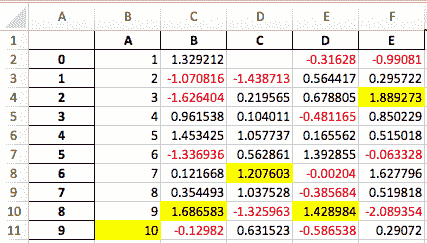

# 版本 0.20.1（2017 年 5 月 5 日）

> 原文：[`pandas.pydata.org/docs/whatsnew/v0.20.0.html`](https://pandas.pydata.org/docs/whatsnew/v0.20.0.html)

这是从 0.19.2 开始的一个重大版本发布，包括一些 API 更改、弃用、新功能、增强功能和性能改进以及大量的错误修复。我们建议所有用户升级到此版本。

亮点包括：

+   新的 `.agg()` API 用于 Series/DataFrame，类似于 groupby-rolling-resample API，请参见这里

+   与 `feather-format` 的集成，包括一个新的顶级 `pd.read_feather()` 和 `DataFrame.to_feather()` 方法，请参见这里。

+   `.ix` 索引器已经弃用，请参见这里

+   `Panel` 已经弃用，请参见这里

+   添加了 `IntervalIndex` 和 `Interval` 标量类型，请参见这里

+   在 `.groupby()` 中按索引级别分组时，用户 API 得到了改进，请参见这里

+   改进对 `UInt64` 数据类型的支持，请参见这里

+   JSON 序列化的新方向，`orient='table'`，使用 Table Schema 规范，并为 Jupyter Notebook 中的更交互性表示提供可能性，请参见这里

+   实验性支持将样式化的 DataFrame（`DataFrame.style`）导出到 Excel，请参见这里

+   窗口二进制相关操作现在返回一个多级索引的 `DataFrame` 而不是 `Panel`，因为 `Panel` 已经被弃用，请参见这里

+   对 S3 处理的支持现在使用 `s3fs`，请参见这里

+   Google BigQuery 支持现在使用 `pandas-gbq` 库，请参见这里

警告

pandas 已经更改了代码库的内部结构和布局。这可能会影响到不是来自顶级 `pandas.*` 命名空间的导入，请参见这里的更改。

在更新之前，请检查 API 变更和弃用

注意

这是 0.20.0 和 0.20.1 的综合发布。版本 0.20.1 包含一个额外的变化，以向下游项目提供与 pandas 的 `utils` 例程兼容性的支持。([GH 16250](https://github.com/pandas-dev/pandas/issues/16250))

v0.20.0 的新内容

+   新功能

    +   DataFrame/Series 的 `agg` 方法 API

    +   数据 IO 的关键字参数 `dtype`，请参见这里

    +   `to_datetime()` 方法已经增加了一个 `origin` 参数

    +   GroupBy 增强功能

    +   在 `read_csv` 中更好地支持压缩的 URL，请参见这里

    +   Pickle 文件 IO 现在支持压缩

    +   UInt64 支持改进

    +   分类数据的 GroupBy

    +   表模式输出

    +   从/到 SparseDataFrame 的 SciPy 稀疏矩阵

    +   样式化数据框的 Excel 输出

    +   区间索引

    +   其他增强功能

+   向后不兼容的 API 更改

    +   可能与 pandas < 0.13.0 创建的 HDF5 格式不兼容

    +   Index 类型的 Map 现在返回其他 Index 类型

    +   访问索引的日期时间字段现在返回索引

    +   pd.unique 现在将与扩展类型保持一致

    +   S3 文件处理

    +   部分字符串索引更改

    +   不同浮点类型的连接不会自动提升

    +   pandas Google BigQuery 支持已移动

    +   索引的内存使用更准确

    +   DataFrame.sort_index 更改

    +   GroupBy 描述格式化

    +   窗口二进制相关性/协方差操作返回一个 MultiIndex 数据框

    +   HDFStore 中的字符串比较

    +   Index.intersection 和内连接现在保留左侧索引的顺序

    +   透视表始终返回数据框

    +   其他 API 更改

+   库的重新组织：隐私变更

    +   模块隐私已更改

    +   `pandas.errors`

    +   `pandas.testing`

    +   `pandas.plotting`

    +   其他开发变更

+   弃用

    +   弃用 `.ix`

    +   弃用 Panel

    +   弃用 groupby.agg() 时使用字典进行重命名

    +   弃用 .plotting

    +   其他弃用

+   删除之前版本的弃用/更改

+   性能改进

+   错误修复

    +   转换

    +   索引

    +   IO

    +   绘图

    +   GroupBy/resample/rolling

    +   稀疏

    +   重塑

    +   数值

    +   其他

+   贡献者

## 新特性

### DataFrame/Series 的方法 `agg` API

Series & DataFrame 已增强以支持聚合 API。这是从 groupby、窗口操作和重采样中熟悉的 API。通过使用 `agg()` 和 `transform()` 可以以简洁的方式进行聚合操作。完整文档在 这里 ([GH 1623](https://github.com/pandas-dev/pandas/issues/1623))。

这里是一个示例。

```py
In [1]: df = pd.DataFrame(np.random.randn(10, 3), columns=['A', 'B', 'C'],
 ...:                  index=pd.date_range('1/1/2000', periods=10))
 ...: 

In [2]: df.iloc[3:7] = np.nan

In [3]: df
Out[3]: 
 A         B         C
2000-01-01  0.469112 -0.282863 -1.509059
2000-01-02 -1.135632  1.212112 -0.173215
2000-01-03  0.119209 -1.044236 -0.861849
2000-01-04       NaN       NaN       NaN
2000-01-05       NaN       NaN       NaN
2000-01-06       NaN       NaN       NaN
2000-01-07       NaN       NaN       NaN
2000-01-08  0.113648 -1.478427  0.524988
2000-01-09  0.404705  0.577046 -1.715002
2000-01-10 -1.039268 -0.370647 -1.157892

[10 rows x 3 columns] 
```

可以使用字符串函数名称、可调用对象、列表或这些的字典进行操作。

使用单个函数等同于 `.apply`。

```py
In [4]: df.agg('sum')
Out[4]: 
A   -1.068226
B   -1.387015
C   -4.892029
Length: 3, dtype: float64 
```

使用函数列表的多个聚合。

```py
In [5]: df.agg(['sum', 'min'])
Out[5]: 
 A         B         C
sum -1.068226 -1.387015 -4.892029
min -1.135632 -1.478427 -1.715002

[2 rows x 3 columns] 
```

使用字典提供了按列应用特定聚合的能力。您将获得一个类似矩阵的所有聚合器的输出。输出的每一列都是唯一函数。应用于特定列的这些函数将为 `NaN`：

```py
In [6]: df.agg({'A': ['sum', 'min'], 'B': ['min', 'max']})
Out[6]: 
 A         B
sum -1.068226       NaN
min -1.135632 -1.478427
max       NaN  1.212112

[3 rows x 2 columns] 
```

该 API 还支持一个用于广播结果的 `.transform()` 函数。

```py
In [7]: df.transform(['abs', lambda x: x - x.min()])
Out[7]: 
 A                   B                   C 
 abs  <lambda>       abs  <lambda>       abs  <lambda>
2000-01-01  0.469112  1.604745  0.282863  1.195563  1.509059  0.205944
2000-01-02  1.135632  0.000000  1.212112  2.690539  0.173215  1.541787
2000-01-03  0.119209  1.254841  1.044236  0.434191  0.861849  0.853153
2000-01-04       NaN       NaN       NaN       NaN       NaN       NaN
2000-01-05       NaN       NaN       NaN       NaN       NaN       NaN
2000-01-06       NaN       NaN       NaN       NaN       NaN       NaN
2000-01-07       NaN       NaN       NaN       NaN       NaN       NaN
2000-01-08  0.113648  1.249281  1.478427  0.000000  0.524988  2.239990
2000-01-09  0.404705  1.540338  0.577046  2.055473  1.715002  0.000000
2000-01-10  1.039268  0.096364  0.370647  1.107780  1.157892  0.557110

[10 rows x 6 columns] 
```

当出现无法聚合的混合数据类型时，`.agg()` 只会采取有效的聚合方法。这类似于 groupby `.agg()` 的工作方式。([GH 15015](https://github.com/pandas-dev/pandas/issues/15015))

```py
In [8]: df = pd.DataFrame({'A': [1, 2, 3],
 ...:                   'B': [1., 2., 3.],
 ...:                   'C': ['foo', 'bar', 'baz'],
 ...:                   'D': pd.date_range('20130101', periods=3)})
 ...: 

In [9]: df.dtypes
Out[9]: 
A             int64
B           float64
C            object
D    datetime64[ns]
Length: 4, dtype: object 
```

```py
In [10]: df.agg(['min', 'sum'])
Out[10]:
     A    B          C          D
min  1  1.0        bar 2013-01-01
sum  6  6.0  foobarbaz        NaT 
```  ### 数据 IO 的关键字参数 `dtype`

`'python'` 引擎用于 `read_csv()`，以及用于解析固定宽度文本文件的 `read_fwf()` 函数和用于解析 Excel 文件的 `read_excel()` 现在都接受 `dtype` 关键字参数，用于指定特定列的类型([GH 14295](https://github.com/pandas-dev/pandas/issues/14295))。有关更多信息，请参见 io 文档。

```py
In [10]: data = "a  b\n1  2\n3  4"

In [11]: pd.read_fwf(StringIO(data)).dtypes
Out[11]: 
a    int64
b    int64
Length: 2, dtype: object

In [12]: pd.read_fwf(StringIO(data), dtype={'a': 'float64', 'b': 'object'}).dtypes
Out[12]: 
a    float64
b     object
Length: 2, dtype: object 
```  ### 方法 `.to_datetime()` 现已增加了一个 `origin` 参数。

`to_datetime()` 增加了一个新参数 `origin`，用于定义一个参考日期，从该日期计算结果时间戳，当解析具有指定 `unit` 的数值时。([GH 11276](https://github.com/pandas-dev/pandas/issues/11276), [GH 11745](https://github.com/pandas-dev/pandas/issues/11745))

例如，以 1960-01-01 为起始日期：

```py
In [13]: pd.to_datetime([1, 2, 3], unit='D', origin=pd.Timestamp('1960-01-01'))
Out[13]: DatetimeIndex(['1960-01-02', '1960-01-03', '1960-01-04'], dtype='datetime64[ns]', freq=None) 
```

默认设置为 `origin='unix'`，默认为 `1970-01-01 00:00:00`，通常称为‘unix epoch’或 POSIX 时间。这是以前的默认值，因此这是向后兼容的更改。

```py
In [14]: pd.to_datetime([1, 2, 3], unit='D')
Out[14]: DatetimeIndex(['1970-01-02', '1970-01-03', '1970-01-04'], dtype='datetime64[ns]', freq=None) 
```  ### GroupBy 增强

将字符串传递给`DataFrame.groupby()`作为`by`参数，现在可以引用列名或索引级别名称。以前只能引用列名。这样可以轻松同时按列和索引级别分组。([GH 5677](https://github.com/pandas-dev/pandas/issues/5677))

```py
In [15]: arrays = [['bar', 'bar', 'baz', 'baz', 'foo', 'foo', 'qux', 'qux'],
 ....:          ['one', 'two', 'one', 'two', 'one', 'two', 'one', 'two']]
 ....: 

In [16]: index = pd.MultiIndex.from_arrays(arrays, names=['first', 'second'])

In [17]: df = pd.DataFrame({'A': [1, 1, 1, 1, 2, 2, 3, 3],
 ....:                   'B': np.arange(8)},
 ....:                  index=index)
 ....: 

In [18]: df
Out[18]: 
 A  B
first second 
bar   one     1  0
 two     1  1
baz   one     1  2
 two     1  3
foo   one     2  4
 two     2  5
qux   one     3  6
 two     3  7

[8 rows x 2 columns]

In [19]: df.groupby(['second', 'A']).sum()
Out[19]: 
 B
second A 
one    1  2
 2  4
 3  6
two    1  4
 2  5
 3  7

[6 rows x 1 columns] 
```  ### 在 `read_csv` 中对压缩的 URL 支持更好

压缩代码进行了重构。因此，从`read_csv()`或`read_table()`中读取数据帧现在支持额外的压缩方法：`xz`，`bz2` 和 `zip`。以前只支持`gzip`压缩。默认情况下，现在通过文件扩展名推断 URL 和路径的压缩方式。此外，python 2 C-engine 中对 bz2 压缩的支持得到了改进。([GH 14570](https://github.com/pandas-dev/pandas/issues/14570))

```py
In [20]: url = ('https://github.com/{repo}/raw/{branch}/{path}'
 ....:       .format(repo='pandas-dev/pandas',
 ....:               branch='main',
 ....:               path='pandas/tests/io/parser/data/salaries.csv.bz2'))
 ....: 

# default, infer compression
In [21]: df = pd.read_csv(url, sep='\t', compression='infer')

# explicitly specify compression
In [22]: df = pd.read_csv(url, sep='\t', compression='bz2')

In [23]: df.head(2)
Out[23]: 
 S  X  E  M
0  13876  1  1  1
1  11608  1  3  0

[2 rows x 4 columns] 
```  ### Pickle 文件 IO 现在支持压缩

`read_pickle()`，`DataFrame.to_pickle()` 和 `Series.to_pickle()` 现在可以读取和写入压缩的 pickle 文件。压缩方法可以作为显式参数或从文件扩展名中推断。请参阅这里的文档。

```py
In [24]: df = pd.DataFrame({'A': np.random.randn(1000),
 ....:                   'B': 'foo',
 ....:                   'C': pd.date_range('20130101', periods=1000, freq='s')})
 ....: 
```

使用显式的压缩类型

```py
In [25]: df.to_pickle("data.pkl.compress", compression="gzip")

In [26]: rt = pd.read_pickle("data.pkl.compress", compression="gzip")

In [27]: rt.head()
Out[27]: 
 A    B                   C
0 -1.344312  foo 2013-01-01 00:00:00
1  0.844885  foo 2013-01-01 00:00:01
2  1.075770  foo 2013-01-01 00:00:02
3 -0.109050  foo 2013-01-01 00:00:03
4  1.643563  foo 2013-01-01 00:00:04

[5 rows x 3 columns] 
```

默认情况下，从扩展名推断压缩类型 (`compression='infer'`)：

```py
In [28]: df.to_pickle("data.pkl.gz")

In [29]: rt = pd.read_pickle("data.pkl.gz")

In [30]: rt.head()
Out[30]: 
 A    B                   C
0 -1.344312  foo 2013-01-01 00:00:00
1  0.844885  foo 2013-01-01 00:00:01
2  1.075770  foo 2013-01-01 00:00:02
3 -0.109050  foo 2013-01-01 00:00:03
4  1.643563  foo 2013-01-01 00:00:04

[5 rows x 3 columns]

In [31]: df["A"].to_pickle("s1.pkl.bz2")

In [32]: rt = pd.read_pickle("s1.pkl.bz2")

In [33]: rt.head()
Out[33]: 
0   -1.344312
1    0.844885
2    1.075770
3   -0.109050
4    1.643563
Name: A, Length: 5, dtype: float64 
```  ### 改进了 UInt64 支持

pandas 在涉及无符号或纯非负整数的操作方面有了显著改进。以前，处理这些整数会导致不正确的四舍五入或数据类型转换，导致错误的结果。值得注意的是，创建了一个新的数值索引 `UInt64Index`。([GH 14937](https://github.com/pandas-dev/pandas/issues/14937))

```py
In [1]: idx = pd.UInt64Index([1, 2, 3])
In [2]: df = pd.DataFrame({'A': ['a', 'b', 'c']}, index=idx)
In [3]: df.index
Out[3]: UInt64Index([1, 2, 3], dtype='uint64') 
```

+   将数组对象的对象元素转换为无符号 64 位整数时存在 bug。([GH 4471](https://github.com/pandas-dev/pandas/issues/4471), [GH 14982](https://github.com/pandas-dev/pandas/issues/14982))

+   在`Series.unique()`中存在的 bug，无符号 64 位整数导致溢出。([GH 14721](https://github.com/pandas-dev/pandas/issues/14721))

+   在`DataFrame`构造中存在的 bug，无符号 64 位整数元素被转换为对象。([GH 14881](https://github.com/pandas-dev/pandas/issues/14881))

+   在`pd.read_csv()`中存在的 bug，无符号 64 位整数元素被错误地转换为错误的数据类型。([GH 14983](https://github.com/pandas-dev/pandas/issues/14983))

+   在`pd.unique()`中存在的 bug，其中无符号 64 位整数导致溢出 ([GH 14915](https://github.com/pandas-dev/pandas/issues/14915))

+   在`pd.value_counts()`中存在的 bug，其中无符号 64 位整数在输出中被错误截断 ([GH 14934](https://github.com/pandas-dev/pandas/issues/14934))  ### 对分类数据进行分组

在先前的版本中，当在分类系列上进行分组时，`.groupby(..., sort=False)`会在数据中未出现某些类别时导致`ValueError`。 ([GH 13179](https://github.com/pandas-dev/pandas/issues/13179))

```py
In [34]: chromosomes = np.r_[np.arange(1, 23).astype(str), ['X', 'Y']]

In [35]: df = pd.DataFrame({
 ....:    'A': np.random.randint(100),
 ....:    'B': np.random.randint(100),
 ....:    'C': np.random.randint(100),
 ....:    'chromosomes': pd.Categorical(np.random.choice(chromosomes, 100),
 ....:                                  categories=chromosomes,
 ....:                                  ordered=True)})
 ....: 

In [36]: df
Out[36]: 
 A   B   C chromosomes
0   87  22  81           4
1   87  22  81          13
2   87  22  81          22
3   87  22  81           2
4   87  22  81           6
..  ..  ..  ..         ...
95  87  22  81           8
96  87  22  81          11
97  87  22  81           X
98  87  22  81           1
99  87  22  81          19

[100 rows x 4 columns] 
```

**先前的行为**：

```py
In [3]: df[df.chromosomes != '1'].groupby('chromosomes', observed=False, sort=False).sum()
---------------------------------------------------------------------------
ValueError: items in new_categories are not the same as in old categories 
```

**新行为**：

```py
In [37]: df[df.chromosomes != '1'].groupby('chromosomes', observed=False, sort=False).sum()
Out[37]: 
 A   B    C
chromosomes 
4            348  88  324
13           261  66  243
22           348  88  324
2            348  88  324
6            174  44  162
...          ...  ..  ...
3            348  88  324
11           348  88  324
19           174  44  162
1              0   0    0
21             0   0    0

[24 rows x 3 columns] 
```  ### 表模式输出

`DataFrame.to_json()`的新 orient `'table'`将生成与[Table Schema](http://specs.frictionlessdata.io/json-table-schema/)兼容的数据的字符串表示。

```py
In [38]: df = pd.DataFrame(
 ....:    {'A': [1, 2, 3],
 ....:     'B': ['a', 'b', 'c'],
 ....:     'C': pd.date_range('2016-01-01', freq='d', periods=3)},
 ....:    index=pd.Index(range(3), name='idx'))
 ....: 

In [39]: df
Out[39]: 
 A  B          C
idx 
0    1  a 2016-01-01
1    2  b 2016-01-02
2    3  c 2016-01-03

[3 rows x 3 columns]

In [40]: df.to_json(orient='table')
Out[40]: '{"schema":{"fields":[{"name":"idx","type":"integer"},{"name":"A","type":"integer"},{"name":"B","type":"string"},{"name":"C","type":"datetime"}],"primaryKey":["idx"],"pandas_version":"1.4.0"},"data":[{"idx":0,"A":1,"B":"a","C":"2016-01-01T00:00:00.000"},{"idx":1,"A":2,"B":"b","C":"2016-01-02T00:00:00.000"},{"idx":2,"A":3,"B":"c","C":"2016-01-03T00:00:00.000"}]}' 
```

有关更多信息，请参阅 IO：表模式。

此外，如果您正在使用 IPython（或其他类似[nteract](https://nteract.io/)使用 Jupyter 消息协议的前端），`DataFrame`和`Series`的 repr 现在可以发布 Series 或 DataFrame 的 JSON 表模式表示。这为 Jupyter 笔记本和[nteract](https://nteract.io/)等前端提供了更多灵活性，因为它们对数据有更多的信息。您必须通过将`display.html.table_schema`选项设置为`True`来启用此功能。  ### 从/到 SparseDataFrame 的 SciPy 稀疏矩阵

pandas 现在支持直接从`scipy.sparse.spmatrix`实例创建稀疏数据框。有关更多信息，请参阅文档。 ([GH 4343](https://github.com/pandas-dev/pandas/issues/4343))

所有稀疏格式都受支持，但不在[`COOrdinate`](https://docs.scipy.org/doc/scipy/reference/sparse.html#module-scipy.sparse "(在 SciPy v1.13.0)")格式中的矩阵将被转换，根据需要复制数据。

```py
from scipy.sparse import csr_matrix
arr = np.random.random(size=(1000, 5))
arr[arr < .9] = 0
sp_arr = csr_matrix(arr)
sp_arr
sdf = pd.SparseDataFrame(sp_arr)
sdf 
```

要将`SparseDataFrame`转换回 COO 格式的稀疏 SciPy 矩阵，您可以使用：

```py
sdf.to_coo() 
```  ### 用于样式化数据框的 Excel 输出

已添加了实验性支持，可以使用`openpyxl`引擎将`DataFrame.style`格式导出到 Excel。 ([GH 15530](https://github.com/pandas-dev/pandas/issues/15530))

例如，运行以下代码后，`styled.xlsx`将呈现如下：

```py
In [41]: np.random.seed(24)

In [42]: df = pd.DataFrame({'A': np.linspace(1, 10, 10)})

In [43]: df = pd.concat([df, pd.DataFrame(np.random.RandomState(24).randn(10, 4),
 ....:                                 columns=list('BCDE'))],
 ....:               axis=1)
 ....: 

In [44]: df.iloc[0, 2] = np.nan

In [45]: df
Out[45]: 
 A         B         C         D         E
0   1.0  1.329212       NaN -0.316280 -0.990810
1   2.0 -1.070816 -1.438713  0.564417  0.295722
2   3.0 -1.626404  0.219565  0.678805  1.889273
3   4.0  0.961538  0.104011 -0.481165  0.850229
4   5.0  1.453425  1.057737  0.165562  0.515018
5   6.0 -1.336936  0.562861  1.392855 -0.063328
6   7.0  0.121668  1.207603 -0.002040  1.627796
7   8.0  0.354493  1.037528 -0.385684  0.519818
8   9.0  1.686583 -1.325963  1.428984 -2.089354
9  10.0 -0.129820  0.631523 -0.586538  0.290720

[10 rows x 5 columns]

In [46]: styled = (df.style
 ....:          .applymap(lambda val: 'color:red;' if val < 0 else 'color:black;')
 ....:          .highlight_max())
 ....: 

In [47]: styled.to_excel('styled.xlsx', engine='openpyxl') 
```



有关更多详细信息，请参阅样式文档。  ### 区间索引

pandas 增加了一个具有自己数据类型`interval`的`IntervalIndex`以及`Interval`标量类型。这些允许对区间符号的一流支持，特别是作为`cut()`和`qcut()`中的分类的返回类型。`IntervalIndex`允许一些独特的索引，参见文档（[GH 7640](https://github.com/pandas-dev/pandas/issues/7640), [GH 8625](https://github.com/pandas-dev/pandas/issues/8625)）。

警告

`IntervalIndex`的这些索引行为是临时的，可能会在 pandas 的将来版本中更改。欢迎对用法提供反馈。

先前的行为：

返回的分类是字符串，表示间隔。

```py
In [1]: c = pd.cut(range(4), bins=2)

In [2]: c
Out[2]:
[(-0.003, 1.5], (-0.003, 1.5], (1.5, 3], (1.5, 3]]
Categories (2, object): [(-0.003, 1.5] < (1.5, 3]]

In [3]: c.categories
Out[3]: Index(['(-0.003, 1.5]', '(1.5, 3]'], dtype='object') 
```

新行为：

```py
In [48]: c = pd.cut(range(4), bins=2)

In [49]: c
Out[49]: 
[(-0.003, 1.5], (-0.003, 1.5], (1.5, 3.0], (1.5, 3.0]]
Categories (2, interval[float64, right]): [(-0.003, 1.5] < (1.5, 3.0]]

In [50]: c.categories
Out[50]: IntervalIndex([(-0.003, 1.5], (1.5, 3.0]], dtype='interval[float64, right]') 
```

此外，这允许使用相同的区间对*其他*数据进行分箱，其中`NaN`表示缺失值，类似于其他数据类型。

```py
In [51]: pd.cut([0, 3, 5, 1], bins=c.categories)
Out[51]: 
[(-0.003, 1.5], (1.5, 3.0], NaN, (-0.003, 1.5]]
Categories (2, interval[float64, right]): [(-0.003, 1.5] < (1.5, 3.0]] 
```

`IntervalIndex`也可以在`Series`和`DataFrame`中用作索引。

```py
In [52]: df = pd.DataFrame({'A': range(4),
 ....:                   'B': pd.cut([0, 3, 1, 1], bins=c.categories)
 ....:                   }).set_index('B')
 ....: 

In [53]: df
Out[53]: 
 A
B 
(-0.003, 1.5]  0
(1.5, 3.0]     1
(-0.003, 1.5]  2
(-0.003, 1.5]  3

[4 rows x 1 columns] 
```

通过特定间隔进行选择：

```py
In [54]: df.loc[pd.Interval(1.5, 3.0)]
Out[54]: 
A    1
Name: (1.5, 3.0], Length: 1, dtype: int64 
```

通过包含在区间中的标量值进行选择。

```py
In [55]: df.loc[0]
Out[55]: 
 A
B 
(-0.003, 1.5]  0
(-0.003, 1.5]  2
(-0.003, 1.5]  3

[3 rows x 1 columns] 
```  ### 其他增强功能

+   `DataFrame.rolling()`现在接受参数`closed='right'|'left'|'both'|'neither'`来选择滚动窗口的端点封闭性。请参阅文档（[GH 13965](https://github.com/pandas-dev/pandas/issues/13965)）。

+   与`feather-format`的集成，包括一个新的顶层`pd.read_feather()`和`DataFrame.to_feather()`方法，请参阅此处。

+   `Series.str.replace()`现在接受一个可调用的替换方法，该方法被传递给`re.sub`（[GH 15055](https://github.com/pandas-dev/pandas/issues/15055)）。

+   `Series.str.replace()`现在接受编译的正则表达式作为模式（[GH 15446](https://github.com/pandas-dev/pandas/issues/15446)）。

+   `Series.sort_index`接受参数`kind`和`na_position`（[GH 13589](https://github.com/pandas-dev/pandas/issues/13589), [GH 14444](https://github.com/pandas-dev/pandas/issues/14444)）。

+   `DataFrame`和`DataFrame.groupby()`现在增加了一个`nunique()`方法，用于计算沿轴的唯一值数目（[GH 14336](https://github.com/pandas-dev/pandas/issues/14336), [GH 15197](https://github.com/pandas-dev/pandas/issues/15197)）。

+   `DataFrame`增加了一个`melt()`方法，相当于`pd.melt()`，用于从宽格式到长格式的解除旋转（[GH 12640](https://github.com/pandas-dev/pandas/issues/12640)）。

+   使用`sheetname=None`时，`pd.read_excel()`现在保留工作表顺序（[GH 9930](https://github.com/pandas-dev/pandas/issues/9930)）。

+   现在支持带有小数点的多个偏移别名（例如，`0.5min`被解析为`30s`）（[GH 8419](https://github.com/pandas-dev/pandas/issues/8419)）。

+   `.isnull()`和`.notnull()`已添加到`Index`对象中，以使它们与`Series`API 更一致（[GH 15300](https://github.com/pandas-dev/pandas/issues/15300)）。

+   当对未排序的 MultiIndex 进行索引/切片时，将引发新的 `UnsortedIndexError`（`KeyError` 的子类）错误，这允许区分由于缺乏排序或不正确的键而导致的错误。参见 这里

+   `MultiIndex` 现在具有 `.to_frame()` 方法，用于转换为 `DataFrame`（[GH 12397](https://github.com/pandas-dev/pandas/issues/12397))

+   `pd.cut` 和 `pd.qcut` 现在支持 datetime64 和 timedelta64 数据类型 ([GH 14714](https://github.com/pandas-dev/pandas/issues/14714), [GH 14798](https://github.com/pandas-dev/pandas/issues/14798))

+   `pd.qcut` 现在具有 `duplicates='raise'|'drop'` 选项，用于控制是否在重复的边缘上引发错误（[GH 7751](https://github.com/pandas-dev/pandas/issues/7751))

+   `Series` 提供了一个 `to_excel` 方法来输出 Excel 文件（[GH 8825](https://github.com/pandas-dev/pandas/issues/8825))

+   `pd.read_csv()` 中的 `usecols` 参数现在接受可调用函数作为值（[GH 14154](https://github.com/pandas-dev/pandas/issues/14154))

+   `pd.read_csv()` 中的 `skiprows` 参数现在接受可调用函数作为值（[GH 10882](https://github.com/pandas-dev/pandas/issues/10882))

+   如果同时传递 `nrows` 和 `chunksize` 参数，`pd.read_csv()` 将支持两者（[GH 6774](https://github.com/pandas-dev/pandas/issues/6774), [GH 15755](https://github.com/pandas-dev/pandas/issues/15755))

+   如果 `subplots=True` 并且 `title` 是字符串列表，则 `DataFrame.plot` 现在在每个子图上方打印标题 ([GH 14753](https://github.com/pandas-dev/pandas/issues/14753))

+   `DataFrame.plot` 现在可以将 matplotlib 2.0 默认的颜色循环作为单个字符串传递给颜色参数，参见 [这里](http://matplotlib.org/2.0.0/users/colors.html#cn-color-selection). ([GH 15516](https://github.com/pandas-dev/pandas/issues/15516))

+   `Series.interpolate()` 现在支持时间增量作为索引类型，使用 `method='time'` 参数（[GH 6424](https://github.com/pandas-dev/pandas/issues/6424))

+   在 `DataFrame/Series.rename` 中添加了一个 `level` 关键字，用于重命名 MultiIndex 中指定级别的标签（[GH 4160](https://github.com/pandas-dev/pandas/issues/4160)).

+   `DataFrame.reset_index()` 现在将元组 `index.name` 解释为跨越 `columns` 层级的键，如果这是一个 `MultiIndex` 的话（[GH 16164](https://github.com/pandas-dev/pandas/issues/16164))

+   添加了 `Timedelta.isoformat` 方法，用于将 Timedeltas 格式化为 [ISO 8601 时长](https://en.wikipedia.org/wiki/ISO_8601#Durations). 请参阅 Timedelta 文档 ([GH 15136](https://github.com/pandas-dev/pandas/issues/15136))

+   `.select_dtypes()` 现在允许字符串 `datetimetz` 通用选择带有时区的日期时间数据类型 ([GH 14910](https://github.com/pandas-dev/pandas/issues/14910))

+   `.to_latex()` 方法现在接受 `multicolumn` 和 `multirow` 参数以使用相应的 LaTeX 增强功能

+   `pd.merge_asof()` 增加了选项 `direction='backward'|'forward'|'nearest'`。([GH 14887](https://github.com/pandas-dev/pandas/issues/14887))

+   `Series/DataFrame.asfreq()` 现在具有 `fill_value` 参数，用于填充缺失值。([GH 3715](https://github.com/pandas-dev/pandas/issues/3715)).

+   `Series/DataFrame.resample.asfreq` 现在具有 `fill_value` 参数，用于在重新采样期间填充缺失值。([GH 3715](https://github.com/pandas-dev/pandas/issues/3715)).

+   `pandas.util.hash_pandas_object()` 现在具有对 `MultiIndex` 进行哈希的功能。([GH 15224](https://github.com/pandas-dev/pandas/issues/15224))

+   `Series/DataFrame.squeeze()` 现在增加了 `axis` 参数。([GH 15339](https://github.com/pandas-dev/pandas/issues/15339))

+   `DataFrame.to_excel()` 现在有一个新的 `freeze_panes` 参数，用于在导出到 Excel 时打开冻结窗格。([GH 15160](https://github.com/pandas-dev/pandas/issues/15160))

+   `pd.read_html()` 将解析多个标题行，创建一个 MultiIndex 标题。([GH 13434](https://github.com/pandas-dev/pandas/issues/13434))。

+   HTML 表输出如果等于 1，则跳过 `colspan` 或 `rowspan` 属性。([GH 15403](https://github.com/pandas-dev/pandas/issues/15403))

+   `pandas.io.formats.style.Styler` 模板现在具有更易于扩展的块，详见示例笔记本。([GH 15649](https://github.com/pandas-dev/pandas/issues/15649))

+   `Styler.render()` 现在接受 `**kwargs`，允许在模板中使用用户定义的变量。([GH 15649](https://github.com/pandas-dev/pandas/issues/15649))

+   与 Jupyter 笔记本 5.0 的兼容性；MultiIndex 列标签左对齐，MultiIndex 行标签顶部对齐。([GH 15379](https://github.com/pandas-dev/pandas/issues/15379))

+   `TimedeltaIndex` 现在具有专为纳秒级别精度设计的自定义日期刻度格式化程序。([GH 8711](https://github.com/pandas-dev/pandas/issues/8711))

+   `pd.api.types.union_categoricals` 增加了 `ignore_ordered` 参数，以允许忽略联合分类的有序属性。详见分类联合文档。([GH 13410](https://github.com/pandas-dev/pandas/issues/13410))

+   `DataFrame.to_latex()` 和 `DataFrame.to_string()` 现在允许可选的标题别名。([GH 15536](https://github.com/pandas-dev/pandas/issues/15536))

+   重新启用 `pd.read_excel()` 的 `parse_dates` 关键字，以将字符串列解析为日期。([GH 14326](https://github.com/pandas-dev/pandas/issues/14326))

+   在 `Index` 的子类中添加了 `.empty` 属性。([GH 15270](https://github.com/pandas-dev/pandas/issues/15270))

+   启用了 `Timedelta` 和 `TimedeltaIndex` 的地板除法。([GH 15828](https://github.com/pandas-dev/pandas/issues/15828))

+   `pandas.io.json.json_normalize()` 增加了选项 `errors='ignore'|'raise'`；默认值为 `errors='raise'`，这是向后兼容的。（[GH 14583](https://github.com/pandas-dev/pandas/issues/14583)）

+   `pandas.io.json.json_normalize()` 使用空的 `list` 将返回一个空的 `DataFrame`（[GH 15534](https://github.com/pandas-dev/pandas/issues/15534)）。

+   `pandas.io.json.json_normalize()` 增加了一个 `sep` 选项，接受 `str` 来分隔连接的字段；默认值是“.”，这是向后兼容的。（[GH 14883](https://github.com/pandas-dev/pandas/issues/14883)）

+   `MultiIndex.remove_unused_levels()` 已添加以便删除未使用的级别。（[GH 15694](https://github.com/pandas-dev/pandas/issues/15694)）

+   每当发生任何解析错误时，`pd.read_csv()` 现在都会引发一个 `ParserError` 错误（[GH 15913](https://github.com/pandas-dev/pandas/issues/15913)，[GH 15925](https://github.com/pandas-dev/pandas/issues/15925)）。

+   `pd.read_csv()` 现在支持 Python 解析器的 `error_bad_lines` 和 `warn_bad_lines` 参数（[GH 15925](https://github.com/pandas-dev/pandas/issues/15925)）。

+   `display.show_dimensions` 选项现在还可用于指定是否在 `Series` 的 repr 中显示长度（[GH 7117](https://github.com/pandas-dev/pandas/issues/7117)）。

+   `parallel_coordinates()` 增加了一个 `sort_labels` 关键字参数，用于对类标签和分配给它们的颜色进行排序（[GH 15908](https://github.com/pandas-dev/pandas/issues/15908)）。

+   添加了选项，允许打开/关闭使用 `bottleneck` 和 `numexpr`，请参阅此处（[GH 16157](https://github.com/pandas-dev/pandas/issues/16157)）。

+   `DataFrame.style.bar()` 现在接受两个更多的选项以进一步自定义条形图。条形对齐使用 `align='left'|'mid'|'zero'` 来设置，默认值是“left”，这是向后兼容的；现在可以传递一个颜色列表 `color=[color_negative, color_positive]`。（[GH 14757](https://github.com/pandas-dev/pandas/issues/14757)）## 向后不兼容的 API 更改

### 可能与 pandas < 0.13.0 创建的 HDF5 格式不兼容

`pd.TimeSeries` 在 0.17.0 中已正式弃用，尽管自 0.13.0 起已经是一个别名。它已被 `pd.Series` 取代。（[GH 15098](https://github.com/pandas-dev/pandas/issues/15098)）。

如果使用了 `pd.TimeSeries`，这可能导致在之前的版本中创建的 HDF5 文件无法读取。这最有可能发生在 pandas < 0.13.0。如果您发现自己处于这种情况下。您可以使用最近的较早版本的 pandas 读取您的 HDF5 文件，然后在应用以下过程后再次写入它们。

```py
In [2]: s = pd.TimeSeries([1, 2, 3], index=pd.date_range('20130101', periods=3))

In [3]: s
Out[3]:
2013-01-01    1
2013-01-02    2
2013-01-03    3
Freq: D, dtype: int64

In [4]: type(s)
Out[4]: pandas.core.series.TimeSeries

In [5]: s = pd.Series(s)

In [6]: s
Out[6]:
2013-01-01    1
2013-01-02    2
2013-01-03    3
Freq: D, dtype: int64

In [7]: type(s)
Out[7]: pandas.core.series.Series 
```  ### Map on Index types now return other Index types

在`Index`上的`map`现在返回一个`Index`，而不是一个 numpy 数组([GH 12766](https://github.com/pandas-dev/pandas/issues/12766))

```py
In [56]: idx = pd.Index([1, 2])

In [57]: idx
Out[57]: Index([1, 2], dtype='int64')

In [58]: mi = pd.MultiIndex.from_tuples([(1, 2), (2, 4)])

In [59]: mi
Out[59]: 
MultiIndex([(1, 2),
 (2, 4)],
 ) 
```

先前的行为：

```py
In [5]: idx.map(lambda x: x * 2)
Out[5]: array([2, 4])

In [6]: idx.map(lambda x: (x, x * 2))
Out[6]: array([(1, 2), (2, 4)], dtype=object)

In [7]: mi.map(lambda x: x)
Out[7]: array([(1, 2), (2, 4)], dtype=object)

In [8]: mi.map(lambda x: x[0])
Out[8]: array([1, 2]) 
```

新行为：

```py
In [60]: idx.map(lambda x: x * 2)
Out[60]: Index([2, 4], dtype='int64')

In [61]: idx.map(lambda x: (x, x * 2))
Out[61]: 
MultiIndex([(1, 2),
 (2, 4)],
 )

In [62]: mi.map(lambda x: x)
Out[62]: 
MultiIndex([(1, 2),
 (2, 4)],
 )

In [63]: mi.map(lambda x: x[0])
Out[63]: Index([1, 2], dtype='int64') 
```

对具有`datetime64`值的`Series`进行`map`可能会返回`int64` dtypes 而不是`int32`

```py
In [64]: s = pd.Series(pd.date_range('2011-01-02T00:00', '2011-01-02T02:00', freq='H')
 ....:              .tz_localize('Asia/Tokyo'))
 ....:

In [65]: s
Out[65]:
0   2011-01-02 00:00:00+09:00
1   2011-01-02 01:00:00+09:00
2   2011-01-02 02:00:00+09:00
Length: 3, dtype: datetime64[ns, Asia/Tokyo] 
```

先前的行为：

```py
In [9]: s.map(lambda x: x.hour)
Out[9]:
0    0
1    1
2    2
dtype: int32 
```

新行为：

```py
In [66]: s.map(lambda x: x.hour)
Out[66]:
0    0
1    1
2    2
Length: 3, dtype: int64 
```### 访问 Index 的日期时间字段现在返回 Index

`DatetimeIndex`、`PeriodIndex`和`TimedeltaIndex`的与日期时间相关的属性（请参见此处进行概述）以前返回 numpy 数组。现在它们将返回一个新的`Index`对象，除非是布尔字段的情况，结果仍将是布尔 ndarray。([GH 15022](https://github.com/pandas-dev/pandas/issues/15022))

先前的行为：

```py
In [1]: idx = pd.date_range("2015-01-01", periods=5, freq='10H')

In [2]: idx.hour
Out[2]: array([ 0, 10, 20,  6, 16], dtype=int32) 
```

新行为：

```py
In [67]: idx = pd.date_range("2015-01-01", periods=5, freq='10H')

In [68]: idx.hour
Out[68]: Index([0, 10, 20, 6, 16], dtype='int32') 
```

这样做的好处是特定的`Index`方法仍然可以在结果上使用。另一方面，这可能会导致向后不兼容性：例如，与 numpy 数组相比，`Index`对象是不可变的。要获得原始的 ndarray，您可以始终使用`np.asarray(idx.hour)`进行显式转换。### pd.unique 现在将与扩展类型一致

在之前的版本中，对`Categorical`和 tz-aware 数据类型使用`Series.unique()`和`pandas.unique()`会产生不同的返回类型。现在这些已经统一了。([GH 15903](https://github.com/pandas-dev/pandas/issues/15903))

+   日期时间 tz-aware

    先前的行为：

    ```py
    # Series
    In [5]: pd.Series([pd.Timestamp('20160101', tz='US/Eastern'),
     ...:           pd.Timestamp('20160101', tz='US/Eastern')]).unique()
    Out[5]: array([Timestamp('2016-01-01 00:00:00-0500', tz='US/Eastern')], dtype=object)

    In [6]: pd.unique(pd.Series([pd.Timestamp('20160101', tz='US/Eastern'),
     ...:                     pd.Timestamp('20160101', tz='US/Eastern')]))
    Out[6]: array(['2016-01-01T05:00:00.000000000'], dtype='datetime64[ns]')

    # Index
    In [7]: pd.Index([pd.Timestamp('20160101', tz='US/Eastern'),
     ...:          pd.Timestamp('20160101', tz='US/Eastern')]).unique()
    Out[7]: DatetimeIndex(['2016-01-01 00:00:00-05:00'], dtype='datetime64[ns, US/Eastern]', freq=None)

    In [8]: pd.unique([pd.Timestamp('20160101', tz='US/Eastern'),
     ...:           pd.Timestamp('20160101', tz='US/Eastern')])
    Out[8]: array(['2016-01-01T05:00:00.000000000'], dtype='datetime64[ns]') 
    ```

    新行为：

    ```py
    # Series, returns an array of Timestamp tz-aware
    In [64]: pd.Series([pd.Timestamp(r'20160101', tz=r'US/Eastern'),
     ....:           pd.Timestamp(r'20160101', tz=r'US/Eastern')]).unique()
     ....: 
    Out[64]: 
    <DatetimeArray>
    ['2016-01-01 00:00:00-05:00']
    Length: 1, dtype: datetime64[ns, US/Eastern]

    In [65]: pd.unique(pd.Series([pd.Timestamp('20160101', tz='US/Eastern'),
     ....:          pd.Timestamp('20160101', tz='US/Eastern')]))
     ....: 
    Out[65]: 
    <DatetimeArray>
    ['2016-01-01 00:00:00-05:00']
    Length: 1, dtype: datetime64[ns, US/Eastern]

    # Index, returns a DatetimeIndex
    In [66]: pd.Index([pd.Timestamp('20160101', tz='US/Eastern'),
     ....:          pd.Timestamp('20160101', tz='US/Eastern')]).unique()
     ....: 
    Out[66]: DatetimeIndex(['2016-01-01 00:00:00-05:00'], dtype='datetime64[ns, US/Eastern]', freq=None)

    In [67]: pd.unique(pd.Index([pd.Timestamp('20160101', tz='US/Eastern'),
     ....:                    pd.Timestamp('20160101', tz='US/Eastern')]))
     ....: 
    Out[67]: DatetimeIndex(['2016-01-01 00:00:00-05:00'], dtype='datetime64[ns, US/Eastern]', freq=None) 
    ```

+   分类

    先前的行为：

    ```py
    In [1]: pd.Series(list('baabc'), dtype='category').unique()
    Out[1]:
    [b, a, c]
    Categories (3, object): [b, a, c]

    In [2]: pd.unique(pd.Series(list('baabc'), dtype='category'))
    Out[2]: array(['b', 'a', 'c'], dtype=object) 
    ```

    新行为：

    ```py
    # returns a Categorical
    In [68]: pd.Series(list('baabc'), dtype='category').unique()
    Out[68]: 
    ['b', 'a', 'c']
    Categories (3, object): ['a', 'b', 'c']

    In [69]: pd.unique(pd.Series(list('baabc'), dtype='category'))
    Out[69]: 
    ['b', 'a', 'c']
    Categories (3, object): ['a', 'b', 'c'] 
    ```### S3 文件处理

pandas 现在使用[s3fs](http://s3fs.readthedocs.io/)来处理 S3 连接。这不应该破坏任何代码。但是，由于`s3fs`不是一个必需的依赖项，您需要单独安装它，就像在 pandas 之前的版本中安装`boto`一样。([GH 11915](https://github.com/pandas-dev/pandas/issues/11915))。### 部分字符串索引更改

DatetimeIndex 部分字符串索引现在作为精确匹配工作，前提是字符串分辨率与索引分辨率相符，包括两者都是秒的情况([GH 14826](https://github.com/pandas-dev/pandas/issues/14826))。有关详细信息，请参见切片与精确匹配。

```py
In [70]: df = pd.DataFrame({'a': [1, 2, 3]}, pd.DatetimeIndex(['2011-12-31 23:59:59',
 ....:                                                      '2012-01-01 00:00:00',
 ....:                                                      '2012-01-01 00:00:01']))
 ....: 
```

先前的行为：

```py
In [4]: df['2011-12-31 23:59:59']
Out[4]:
 a
2011-12-31 23:59:59  1

In [5]: df['a']['2011-12-31 23:59:59']
Out[5]:
2011-12-31 23:59:59    1
Name: a, dtype: int64 
```

新行为：

```py
In [4]: df['2011-12-31 23:59:59']
KeyError: '2011-12-31 23:59:59'

In [5]: df['a']['2011-12-31 23:59:59']
Out[5]: 1 
```### 不同 float dtypes 的 concat 将不会自动向上转换

以前，具有不同`float` dtypes 的多个对象的`concat`将自动将结果向上转换为`float64`的 dtype。现在将使用最小可接受的 dtype。([GH 13247](https://github.com/pandas-dev/pandas/issues/13247))

```py
In [71]: df1 = pd.DataFrame(np.array([1.0], dtype=np.float32, ndmin=2))

In [72]: df1.dtypes
Out[72]: 
0    float32
Length: 1, dtype: object

In [73]: df2 = pd.DataFrame(np.array([np.nan], dtype=np.float32, ndmin=2))

In [74]: df2.dtypes
Out[74]: 
0    float32
Length: 1, dtype: object 
```

先前的行为：

```py
In [7]: pd.concat([df1, df2]).dtypes
Out[7]:
0    float64
dtype: object 
```

新行为：

```py
In [75]: pd.concat([df1, df2]).dtypes
Out[75]: 
0    float32
Length: 1, dtype: object 
```### pandas Google BigQuery 支持已移动

pandas 将 Google BigQuery 支持拆分为单独的包 `pandas-gbq`。你可以通过 `conda install pandas-gbq -c conda-forge` 或 `pip install pandas-gbq` 来获取它。`read_gbq()` 和 `DataFrame.to_gbq()` 的功能与当前发布版本的 `pandas-gbq=0.1.4` 相同。文档现在托管在[这里](https://pandas-gbq.readthedocs.io/) ([GH 15347](https://github.com/pandas-dev/pandas/issues/15347))  ### Index 的内存使用更精确

在之前的版本中，对具有索引的 pandas 结构显示 `.memory_usage()` 时，只包括实际索引值，而不包括便于快速索引的结构。这通常对 `Index` 和 `MultiIndex` 不同，对其他索引类型不太明显。([GH 15237](https://github.com/pandas-dev/pandas/issues/15237))

先前的行为：

```py
In [8]: index = pd.Index(['foo', 'bar', 'baz'])

In [9]: index.memory_usage(deep=True)
Out[9]: 180

In [10]: index.get_loc('foo')
Out[10]: 0

In [11]: index.memory_usage(deep=True)
Out[11]: 180 
```

新行为：

```py
In [8]: index = pd.Index(['foo', 'bar', 'baz'])

In [9]: index.memory_usage(deep=True)
Out[9]: 180

In [10]: index.get_loc('foo')
Out[10]: 0

In [11]: index.memory_usage(deep=True)
Out[11]: 260 
```  ### DataFrame.sort_index 变化

在某些情况下，对 MultiIndexed DataFrame 调用 `.sort_index()` 会返回*相同*的 DataFrame，而不会看到排序。这将发生在 `lexsorted`，但非单调级别。([GH 15622](https://github.com/pandas-dev/pandas/issues/15622), [GH 15687](https://github.com/pandas-dev/pandas/issues/15687), [GH 14015](https://github.com/pandas-dev/pandas/issues/14015), [GH 13431](https://github.com/pandas-dev/pandas/issues/13431), [GH 15797](https://github.com/pandas-dev/pandas/issues/15797))

这与之前的版本*相同*，仅供说明：

```py
In [81]: df = pd.DataFrame(np.arange(6), columns=['value'],
   ....:                   index=pd.MultiIndex.from_product([list('BA'), range(3)]))
   ....:
In [82]: df

Out[82]:
     value
B 0      0
  1      1
  2      2
A 0      3
  1      4
  2      5

[6 rows x 1 columns] 
```

```py
In [87]: df.index.is_lexsorted()
Out[87]: False

In [88]: df.index.is_monotonic
Out[88]: False 
```

排序的工作方式与预期相同

```py
In [76]: df.sort_index()
Out[76]: 
 a
2011-12-31 23:59:59  1
2012-01-01 00:00:00  2
2012-01-01 00:00:01  3

[3 rows x 1 columns] 
```

```py
In [90]: df.sort_index().index.is_lexsorted()
Out[90]: True

In [91]: df.sort_index().index.is_monotonic
Out[91]: True 
```

然而，这个示例，其中有一个非单调的第二级，不会按预期行事。

```py
In [77]: df = pd.DataFrame({'value': [1, 2, 3, 4]},
 ....:                  index=pd.MultiIndex([['a', 'b'], ['bb', 'aa']],
 ....:                                      [[0, 0, 1, 1], [0, 1, 0, 1]]))
 ....: 

In [78]: df
Out[78]: 
 value
a bb      1
 aa      2
b bb      3
 aa      4

[4 rows x 1 columns] 
```

先前的行为：

```py
In [11]: df.sort_index()
Out[11]:
      value
a bb      1
  aa      2
b bb      3
  aa      4

In [14]: df.sort_index().index.is_lexsorted()
Out[14]: True

In [15]: df.sort_index().index.is_monotonic
Out[15]: False 
```

新行为：

```py
In [94]: df.sort_index()
Out[94]:
      value
a aa      2
  bb      1
b aa      4
  bb      3

[4 rows x 1 columns]

In [95]: df.sort_index().index.is_lexsorted()
Out[95]: True

In [96]: df.sort_index().index.is_monotonic
Out[96]: True 
```  ### GroupBy 描述格式

`groupby.describe()` 的输出格式现在将 `describe()` 指标标签放在列上而不是索引上。这种格式与一次应用多个函数时的 `groupby.agg()` 一致。([GH 4792](https://github.com/pandas-dev/pandas/issues/4792))

先前的行为：

```py
In [1]: df = pd.DataFrame({'A': [1, 1, 2, 2], 'B': [1, 2, 3, 4]})

In [2]: df.groupby('A').describe()
Out[2]:
 B
A
1 count  2.000000
 mean   1.500000
 std    0.707107
 min    1.000000
 25%    1.250000
 50%    1.500000
 75%    1.750000
 max    2.000000
2 count  2.000000
 mean   3.500000
 std    0.707107
 min    3.000000
 25%    3.250000
 50%    3.500000
 75%    3.750000
 max    4.000000

In [3]: df.groupby('A').agg(["mean", "std", "min", "max"])
Out[3]:
 B
 mean       std amin amax
A
1  1.5  0.707107    1    2
2  3.5  0.707107    3    4 
```

新行为：

```py
In [79]: df = pd.DataFrame({'A': [1, 1, 2, 2], 'B': [1, 2, 3, 4]})

In [80]: df.groupby('A').describe()
Out[80]: 
 B 
 count mean       std  min   25%  50%   75%  max
A 
1   2.0  1.5  0.707107  1.0  1.25  1.5  1.75  2.0
2   2.0  3.5  0.707107  3.0  3.25  3.5  3.75  4.0

[2 rows x 8 columns]

In [81]: df.groupby('A').agg(["mean", "std", "min", "max"])
Out[81]: 
 B 
 mean       std min max
A 
1  1.5  0.707107   1   2
2  3.5  0.707107   3   4

[2 rows x 4 columns] 
```  ### 窗口二元 corr/cov 操作返回一个 MultiIndex DataFrame

当对 `.rolling(..)`、`.expanding(..)` 或 `.ewm(..)` 对象执行二元窗口操作，如 `.corr()` 或 `.cov()`，将返回一个二级 `MultiIndexed DataFrame` 而不是 `Panel`，因为 `Panel` 现在已经弃用，参见此处。这些在功能上是等价的，但是多级索引的 `DataFrame` 在 pandas 中享有更多的支持。有关更多信息，请参阅窗口二元操作部分。([GH 15677](https://github.com/pandas-dev/pandas/issues/15677))

```py
In [82]: np.random.seed(1234)

In [83]: df = pd.DataFrame(np.random.rand(100, 2),
 ....:                  columns=pd.Index(['A', 'B'], name='bar'),
 ....:                  index=pd.date_range('20160101',
 ....:                                      periods=100, freq='D', name='foo'))
 ....: 

In [84]: df.tail()
Out[84]: 
bar                A         B
foo 
2016-04-05  0.640880  0.126205
2016-04-06  0.171465  0.737086
2016-04-07  0.127029  0.369650
2016-04-08  0.604334  0.103104
2016-04-09  0.802374  0.945553

[5 rows x 2 columns] 
```

先前的行为：

```py
In [2]: df.rolling(12).corr()
Out[2]:
<class 'pandas.core.panel.Panel'>
Dimensions: 100 (items) x 2 (major_axis) x 2 (minor_axis)
Items axis: 2016-01-01 00:00:00 to 2016-04-09 00:00:00
Major_axis axis: A to B
Minor_axis axis: A to B 
```

新行为：

```py
In [85]: res = df.rolling(12).corr()

In [86]: res.tail()
Out[86]: 
bar                    A         B
foo        bar 
2016-04-07 B   -0.132090  1.000000
2016-04-08 A    1.000000 -0.145775
 B   -0.145775  1.000000
2016-04-09 A    1.000000  0.119645
 B    0.119645  1.000000

[5 rows x 2 columns] 
```

检索交叉部分的相关系数矩阵

```py
In [87]: df.rolling(12).corr().loc['2016-04-07']
Out[87]: 
bar        A        B
bar 
A    1.00000 -0.13209
B   -0.13209  1.00000

[2 rows x 2 columns] 
```  ### HDFStore 字符串比较

在先前的版本中，大多数类型可以与 `HDFStore` 中的字符串列进行比较，通常导致无效比较，返回一个空结果框架。这些比较现在将引发 `TypeError` 错误（[GH 15492](https://github.com/pandas-dev/pandas/issues/15492)）

```py
In [88]: df = pd.DataFrame({'unparsed_date': ['2014-01-01', '2014-01-01']})

In [89]: df.to_hdf('store.h5', key='key', format='table', data_columns=True)

In [90]: df.dtypes
Out[90]: 
unparsed_date    object
Length: 1, dtype: object 
```

先前的行为：

```py
In [4]: pd.read_hdf('store.h5', 'key', where='unparsed_date > ts')
File "<string>", line 1
 (unparsed_date > 1970-01-01 00:00:01.388552400)
 ^
SyntaxError: invalid token 
```

新行为：

```py
In [18]: ts = pd.Timestamp('2014-01-01')

In [19]: pd.read_hdf('store.h5', 'key', where='unparsed_date > ts')
TypeError: Cannot compare 2014-01-01 00:00:00 of
type <class 'pandas.tslib.Timestamp'> to string column 
```  ### Index.intersection 和内部连接现在保留左侧索引的顺序

`Index.intersection()` 现在保留调用的 `Index`（左侧）的顺序，而不是另一个 `Index`（右侧）的顺序（[GH 15582](https://github.com/pandas-dev/pandas/issues/15582)）。 这影响内部连接、`DataFrame.join()` 和 `merge()`，以及 `.align` 方法。

+   `Index.intersection`

    ```py
    In [91]: left = pd.Index([2, 1, 0])

    In [92]: left
    Out[92]: Index([2, 1, 0], dtype='int64')

    In [93]: right = pd.Index([1, 2, 3])

    In [94]: right
    Out[94]: Index([1, 2, 3], dtype='int64') 
    ```

    先前的行为：

    ```py
    In [4]: left.intersection(right)
    Out[4]: Int64Index([1, 2], dtype='int64') 
    ```

    新行为：

    ```py
    In [95]: left.intersection(right)
    Out[95]: Index([2, 1], dtype='int64') 
    ```

+   `DataFrame.join` 和 `pd.merge`

    ```py
    In [96]: left = pd.DataFrame({'a': [20, 10, 0]}, index=[2, 1, 0])

    In [97]: left
    Out[97]: 
     a
    2  20
    1  10
    0   0

    [3 rows x 1 columns]

    In [98]: right = pd.DataFrame({'b': [100, 200, 300]}, index=[1, 2, 3])

    In [99]: right
    Out[99]: 
     b
    1  100
    2  200
    3  300

    [3 rows x 1 columns] 
    ```

    先前的行为：

    ```py
    In [4]: left.join(right, how='inner')
    Out[4]:
     a    b
    1  10  100
    2  20  200 
    ```

    新行为：

    ```py
    In [100]: left.join(right, how='inner')
    Out[100]: 
     a    b
    2  20  200
    1  10  100

    [2 rows x 2 columns] 
    ```  ### 透视表始终返回 DataFrame

`pivot_table()` 的文档表明始终返回一个 `DataFrame`。修复了一个错误，允许在某些情况下返回 `Series`。（[GH 4386](https://github.com/pandas-dev/pandas/issues/4386)）

```py
In [101]: df = pd.DataFrame({'col1': [3, 4, 5],
 .....:                   'col2': ['C', 'D', 'E'],
 .....:                   'col3': [1, 3, 9]})
 .....: 

In [102]: df
Out[102]: 
 col1 col2  col3
0     3    C     1
1     4    D     3
2     5    E     9

[3 rows x 3 columns] 
```

先前的行为：

```py
In [2]: df.pivot_table('col1', index=['col3', 'col2'], aggfunc="sum")
Out[2]:
col3  col2
1     C       3
3     D       4
9     E       5
Name: col1, dtype: int64 
```

新行为：

```py
In [103]: df.pivot_table('col1', index=['col3', 'col2'], aggfunc="sum")
Out[103]: 
 col1
col3 col2 
1    C        3
3    D        4
9    E        5

[3 rows x 1 columns] 
```  ### 其他 API 变更

+   现在要求 `numexpr` 版本 >= 2.4.6，并且如果未满足此要求，则根本不会使用它（[GH 15213](https://github.com/pandas-dev/pandas/issues/15213)）。

+   `pd.read_csv()` 中的 `CParserError` 已更名为 `ParserError`，并将在将来删除（[GH 12665](https://github.com/pandas-dev/pandas/issues/12665)）

+   `SparseArray.cumsum()` 和 `SparseSeries.cumsum()` 现在将始终分别返回 `SparseArray` 和 `SparseSeries`（[GH 12855](https://github.com/pandas-dev/pandas/issues/12855)）

+   如果 `DataFrame.applymap()` 中的 `DataFrame` 为空，则将返回空 `DataFrame` 的副本，而不是 `Series`（[GH 8222](https://github.com/pandas-dev/pandas/issues/8222)）

+   现在 `Series.map()` 将尊重具有 `__missing__` 方法的字典子类的默认值，例如 `collections.Counter`（[GH 15999](https://github.com/pandas-dev/pandas/issues/15999)）

+   `.loc` 现在兼容 `.ix`，接受迭代器和命名元组（[GH 15120](https://github.com/pandas-dev/pandas/issues/15120)）

+   如果 `limit` 关键字参数不大于 0，则 `interpolate()` 和 `fillna()` 将引发 `ValueError` 错误。 ([GH 9217](https://github.com/pandas-dev/pandas/issues/9217))

+   每当 `pd.read_csv()` 中的 `dialect` 参数和用户提供的值发生冲突时，现在都会发出 `ParserWarning` 警告（[GH 14898](https://github.com/pandas-dev/pandas/issues/14898)）

+   如果引号字符大于一个字节，`pd.read_csv()`现在将为 C 引擎引发`ValueError`（[GH 11592](https://github.com/pandas-dev/pandas/issues/11592)）

+   `inplace`参数现在要求布尔值，否则会引发`ValueError`（[GH 14189](https://github.com/pandas-dev/pandas/issues/14189)）

+   `pandas.api.types.is_datetime64_ns_dtype`现在将在具有时区的 dtype 上报告`True`，类似于`pandas.api.types.is_datetime64_any_dtype`

+   如果未找到匹配项，`DataFrame.asof()`现在将返回一个填充了空值的`Series`，而不是标量`NaN`（[GH 15118](https://github.com/pandas-dev/pandas/issues/15118)）

+   在 NDFrame 对象上特定支持`copy.copy()`和`copy.deepcopy()`函数（[GH 15444](https://github.com/pandas-dev/pandas/issues/15444)）

+   `Series.sort_values()`接受一个布尔值的单元素列表，以保持与`DataFrame.sort_values()`行为的一致性（[GH 15604](https://github.com/pandas-dev/pandas/issues/15604)）

+   在`category`类型的列上使用`.merge()`和`.join()`现在会在可能的情况下保留`category`类型（[GH 10409](https://github.com/pandas-dev/pandas/issues/10409)）

+   `SparseDataFrame.default_fill_value`将为 0，之前在`pd.get_dummies(..., sparse=True)`返回中为`nan`（[GH 15594](https://github.com/pandas-dev/pandas/issues/15594)）

+   `Series.str.match`的默认行为已更改为匹配模式而不是提取分组。提取行为自 pandas 版本 0.13.0 起已弃用，并且可以使用`Series.str.extract`方法来执行（[GH 5224](https://github.com/pandas-dev/pandas/issues/5224)）。因此，`as_indexer`关键字被忽略（不再需要指定新的行为），并且已弃用。

+   `NaT`现在会在诸如`is_month_start`之类的日期时间布尔操作中正确报告`False`（[GH 15781](https://github.com/pandas-dev/pandas/issues/15781)）

+   `NaT`现在会在访问`days`和`quarter`等`Timedelta`和`Period`访问器时正确返回`np.nan`（[GH 15782](https://github.com/pandas-dev/pandas/issues/15782)）

+   `NaT`现在会在`tz_localize`和`tz_convert`方法中正确返回`NaT`（[GH 15830](https://github.com/pandas-dev/pandas/issues/15830)）

+   使用无效输入构造的`DataFrame`和`Panel`现在会引发`ValueError`而不是`PandasError`，如果调用时使用标量输入而不是轴（[GH 15541](https://github.com/pandas-dev/pandas/issues/15541)）

+   使用无效输入构造的`DataFrame`和`Panel`现在会引发`ValueError`而不是`pandas.core.common.PandasError`，如果调用时使用标量输入而不是轴；同时也移除了异常`PandasError`（[GH 15541](https://github.com/pandas-dev/pandas/issues/15541)）

+   移除了异常`pandas.core.common.AmbiguousIndexError`，因为它没有被引用（[GH 15541](https://github.com/pandas-dev/pandas/issues/15541)） ## 库的重新组织：隐私变更

### 模块隐私已更改

一些以前公共的 python/c/c++/cython 扩展模块已被移动和/或重命名。这些都已从公共 API 中移除。此外，`pandas.core`、`pandas.compat` 和 `pandas.util` 顶层模块现在被视为私有。如果有指示，当您引用这些模块时将发出弃用警告（[GH 12588](https://github.com/pandas-dev/pandas/issues/12588)）

| 之前位置 | 新位置 | 弃用 |
| --- | --- | --- |
| pandas.lib | pandas._libs.lib | X |
| pandas.tslib | pandas._libs.tslib | X |
| pandas.computation | pandas.core.computation | X |
| pandas.msgpack | pandas.io.msgpack |  |
| pandas.index | pandas._libs.index |  |
| pandas.algos | pandas._libs.algos |  |
| pandas.hashtable | pandas._libs.hashtable |  |
| pandas.indexes | pandas.core.indexes |  |
| pandas.json | pandas._libs.json / pandas.io.json | X |
| pandas.parser | pandas._libs.parsers | X |
| pandas.formats | pandas.io.formats |  |
| pandas.sparse | pandas.core.sparse |  |
| pandas.tools | pandas.core.reshape | X |
| pandas.types | pandas.core.dtypes | X |
| pandas.io.sas.saslib | pandas.io.sas._sas |  |
| pandas._join | pandas._libs.join |  |
| pandas._hash | pandas._libs.hashing |  |
| pandas._period | pandas._libs.period |  |
| pandas._sparse | pandas._libs.sparse |  |
| pandas._testing | pandas._libs.testing |  |
| pandas._window | pandas._libs.window |  |

一些新的子包含有公共功能，这些功能在顶层命名空间中并不直接暴露：`pandas.errors`、`pandas.plotting` 和 `pandas.testing`（更多细节见下文）。连同 `pandas.api.types` 和 `pandas.io` 以及 `pandas.tseries` 子模块中的某些函数，这些现在是公共子包。

进一步的更改：

+   函数`union_categoricals()` 现在可以从 `pandas.api.types` 导入，之前是从 `pandas.types.concat` 导入的（[GH 15998](https://github.com/pandas-dev/pandas/issues/15998)）

+   类型导入 `pandas.tslib.NaTType` 已弃用，可以通过使用 `type(pandas.NaT)` 进行替换（[GH 16146](https://github.com/pandas-dev/pandas/issues/16146)）

+   `pandas.tools.hashing` 中的公共函数已从该位置弃用，但现在可以从 `pandas.util` 导入（[GH 16223](https://github.com/pandas-dev/pandas/issues/16223)）

+   `pandas.util` 中的模块：`decorators`、`print_versions`、`doctools`、`validators`、`depr_module` 现在是私有的。只有在 `pandas.util` 本身中暴露的函数是公共的（[GH 16223](https://github.com/pandas-dev/pandas/issues/16223））  ### `pandas.errors`

我们正在为所有 pandas 异常和警告添加一个标准的公共模块 `pandas.errors`。([GH 14800](https://github.com/pandas-dev/pandas/issues/14800))。先前，这些异常和警告可以从 `pandas.core.common` 或 `pandas.io.common` 中导入。这些异常和警告将在将来的版本中从 `*.common` 的位置中移除。([GH 15541](https://github.com/pandas-dev/pandas/issues/15541))

以下现在是这个 API 的一部分：

```py
['DtypeWarning',
 'EmptyDataError',
 'OutOfBoundsDatetime',
 'ParserError',
 'ParserWarning',
 'PerformanceWarning',
 'UnsortedIndexError',
 'UnsupportedFunctionCall'] 
```  ### `pandas.testing`

我们正在添加一个标准模块，该模块公开 `pandas.testing` 中的公共测试函数 ([GH 9895](https://github.com/pandas-dev/pandas/issues/9895))。当为使用 pandas 对象的功能编写测试时，可以使用这些函数。

以下测试函数现在是这个 API 的一部分：

+   `testing.assert_frame_equal()`

+   `testing.assert_series_equal()`

+   `testing.assert_index_equal()`  ### `pandas.plotting`

已添加一个新的公共模块 `pandas.plotting`，其中包含以前在 `pandas.tools.plotting` 或顶级命名空间中的绘图功能。有关更多详细信息，请参阅废弃部分。  ### 其他开发变更

+   构建 pandas 以进行开发现在需要 `cython >= 0.23` ([GH 14831](https://github.com/pandas-dev/pandas/issues/14831))

+   至少需要 0.23 版本的 cython 以避免字符编码问题 ([GH 14699](https://github.com/pandas-dev/pandas/issues/14699))

+   将测试框架切换为 [pytest](http://doc.pytest.org/en/latest) ([GH 13097](https://github.com/pandas-dev/pandas/issues/13097))

+   测试目录布局的重新组织 ([GH 14854](https://github.com/pandas-dev/pandas/issues/14854), [GH 15707](https://github.com/pandas-dev/pandas/issues/15707))。  ## 废弃

### 废弃 `.ix`

`.ix` 索引器已被弃用，推荐使用更严格的 `.iloc` 和 `.loc` 索引器。`.ix` 在推断用户想要做什么时提供了很多魔法。更具体地说，`.ix` 可以根据索引的数据类型决定是按*位置*还是按*标签*索引。这多年来已经导致了相当多的用户混淆。完整的索引文档在这里。([GH 14218](https://github.com/pandas-dev/pandas/issues/14218))

推荐的索引方法是：

+   `.loc` 如果你想按*标签*索引

+   `.iloc` 如果你想按*位置*索引。

使用`.ix`现在会显示`DeprecationWarning`，并附有转换代码的示例链接[这里](https://pandas.pydata.org/pandas-docs/version/1.0/user_guide/indexing.html#ix-indexer-is-deprecated)。

```py
In [104]: df = pd.DataFrame({'A': [1, 2, 3],
 .....:                   'B': [4, 5, 6]},
 .....:                  index=list('abc'))
 .....: 

In [105]: df
Out[105]: 
 A  B
a  1  4
b  2  5
c  3  6

[3 rows x 2 columns] 
```

先前的行为，您希望从‘A’列的索引中获取第 0 个和第 2 个元素。

```py
In [3]: df.ix[[0, 2], 'A']
Out[3]:
a    1
c    3
Name: A, dtype: int64 
```

使用`.loc`。在这里，我们将从索引中选择适当的索引，然后使用*标签*索引。

```py
In [106]: df.loc[df.index[[0, 2]], 'A']
Out[106]: 
a    1
c    3
Name: A, Length: 2, dtype: int64 
```

使用`.iloc`。在这里，我们将获取‘A’列的位置，然后使用*位置*索引来选择事物。

```py
In [107]: df.iloc[[0, 2], df.columns.get_loc('A')]
Out[107]: 
a    1
c    3
Name: A, Length: 2, dtype: int64 
```  ### 弃用 Panel

`Panel`已被弃用，将在未来的版本中删除。表示 3-D 数据的推荐方法是使用`DataFrame`上的`MultiIndex`通过`to_frame()`或使用[xarray 包](http://xarray.pydata.org/en/stable/)。 pandas 提供了一个`to_xarray()`方法来自动执行此转换（[GH 13563](https://github.com/pandas-dev/pandas/issues/13563)）。

```py
In [133]: import pandas._testing as tm

In [134]: p = tm.makePanel()

In [135]: p
Out[135]:
<class 'pandas.core.panel.Panel'>
Dimensions: 3 (items) x 3 (major_axis) x 4 (minor_axis)
Items axis: ItemA to ItemC
Major_axis axis: 2000-01-03 00:00:00 to 2000-01-05 00:00:00
Minor_axis axis: A to D 
```

转换为 MultiIndex DataFrame

```py
In [136]: p.to_frame()
Out[136]:
 ItemA     ItemB     ItemC
major      minor
2000-01-03 A      0.628776 -1.409432  0.209395
 B      0.988138 -1.347533 -0.896581
 C     -0.938153  1.272395 -0.161137
 D     -0.223019 -0.591863 -1.051539
2000-01-04 A      0.186494  1.422986 -0.592886
 B     -0.072608  0.363565  1.104352
 C     -1.239072 -1.449567  0.889157
 D      2.123692 -0.414505 -0.319561
2000-01-05 A      0.952478 -2.147855 -1.473116
 B     -0.550603 -0.014752 -0.431550
 C      0.139683 -1.195524  0.288377
 D      0.122273 -1.425795 -0.619993

[12 rows x 3 columns] 
```

转换为 xarray DataArray

```py
In [137]: p.to_xarray()
Out[137]:
<xarray.DataArray (items: 3, major_axis: 3, minor_axis: 4)>
array([[[ 0.628776,  0.988138, -0.938153, -0.223019],
 [ 0.186494, -0.072608, -1.239072,  2.123692],
 [ 0.952478, -0.550603,  0.139683,  0.122273]],

 [[-1.409432, -1.347533,  1.272395, -0.591863],
 [ 1.422986,  0.363565, -1.449567, -0.414505],
 [-2.147855, -0.014752, -1.195524, -1.425795]],

 [[ 0.209395, -0.896581, -0.161137, -1.051539],
 [-0.592886,  1.104352,  0.889157, -0.319561],
 [-1.473116, -0.43155 ,  0.288377, -0.619993]]])
Coordinates:
 * items       (items) object 'ItemA' 'ItemB' 'ItemC'
 * major_axis  (major_axis) datetime64[ns] 2000-01-03 2000-01-04 2000-01-05
 * minor_axis  (minor_axis) object 'A' 'B' 'C' 'D' 
```  ### 弃用 groupby.agg()时使用字典进行重命名

`.groupby(..).agg(..)`、`.rolling(..).agg(..)`和`.resample(..).agg(..)`语法可以接受多个输入，包括标量、列表和列名到标量或列表的字典。这为构建多个（可能不同的）聚合提供了一个有用的语法。

但是，`.agg(..)`也可以接受允许对结果列进行‘重命名’的字典。这是一种复杂和混乱的语法，而且在`Series`和`DataFrame`之间不一致。我们正在弃用此‘重命名’功能。

+   我们正在弃用将字典传递给分组/滚动/重新采样的`Series`。这允许对结果聚合进行‘重命名’，但这与将字典传递给分组的`DataFrame`完全不同，后者接受列到聚合的字典。

+   我们正在以类似的方式弃用将字典传递给分组/滚动/重新采样的`DataFrame`。

这是一个说明性的例子：

```py
In [108]: df = pd.DataFrame({'A': [1, 1, 1, 2, 2],
 .....:                   'B': range(5),
 .....:                   'C': range(5)})
 .....: 

In [109]: df
Out[109]: 
 A  B  C
0  1  0  0
1  1  1  1
2  1  2  2
3  2  3  3
4  2  4  4

[5 rows x 3 columns] 
```

这是一种计算不同列的不同聚合的典型有用的语法。这是一种自然且有用的语法。我们从字典到列表进行聚合，采取指定的列并应用函数列表。这将返回列的`MultiIndex`（这*不是*被弃用的）。

```py
In [110]: df.groupby('A').agg({'B': 'sum', 'C': 'min'})
Out[110]: 
 B  C
A 
1  3  0
2  7  3

[2 rows x 2 columns] 
```

这是第一个被弃用的示例，将字典传递给分组的`Series`。这是一种组合聚合和重命名：

```py
In [6]: df.groupby('A').B.agg({'foo': 'count'})
FutureWarning: using a dict on a Series for aggregation
is deprecated and will be removed in a future version

Out[6]:
 foo
A
1    3
2    2 
```

您可以通过以下方式以更符合习惯的方式完成相同的操作：

```py
In [111]: df.groupby('A').B.agg(['count']).rename(columns={'count': 'foo'})
Out[111]: 
 foo
A 
1    3
2    2

[2 rows x 1 columns] 
```

这是第二个被弃用的示例，将字典传递给分组的`DataFrame`：

```py
In [23]: (df.groupby('A')
    ...:    .agg({'B': {'foo': 'sum'}, 'C': {'bar': 'min'}})
    ...:  )
FutureWarning: using a dict with renaming is deprecated and
will be removed in a future version

Out[23]:
     B   C
   foo bar
A
1   3   0
2   7   3 
```

您可以通过几乎相同的方式完成： 

```py
In [112]: (df.groupby('A')
 .....:   .agg({'B': 'sum', 'C': 'min'})
 .....:   .rename(columns={'B': 'foo', 'C': 'bar'})
 .....: )
 .....: 
Out[112]: 
 foo  bar
A 
1    3    0
2    7    3

[2 rows x 2 columns] 
```  ### 弃用.plotting

`pandas.tools.plotting`模块已被弃用，而不是顶层`pandas.plotting`模块。所有公共绘图函数现在都可以从`pandas.plotting`中获得（[GH 12548](https://github.com/pandas-dev/pandas/issues/12548)）。

此外，顶层的`pandas.scatter_matrix`和`pandas.plot_params`已被弃用。用户也可以从`pandas.plotting`中导入这些。

先前的脚本：

```py
pd.tools.plotting.scatter_matrix(df)
pd.scatter_matrix(df) 
```

应更改为：

```py
pd.plotting.scatter_matrix(df) 
```  ### 其他弃用内容

+   `SparseArray.to_dense()`已弃用`fill`参数，因为该参数未被遵守（[GH 14647](https://github.com/pandas-dev/pandas/issues/14647))

+   `SparseSeries.to_dense()`已弃用`sparse_only`参数（[GH 14647](https://github.com/pandas-dev/pandas/issues/14647)）

+   `Series.repeat()`已弃用`reps`参数，建议使用`repeats`（[GH 12662](https://github.com/pandas-dev/pandas/issues/12662)）

+   `Series`构造函数和`.astype`方法已弃用接受没有频率的时间戳 dtype（例如`np.datetime64`）作为`dtype`参数的情况（[GH 15524](https://github.com/pandas-dev/pandas/issues/15524)）

+   `Index.repeat()`和`MultiIndex.repeat()`已弃用`n`参数，建议使用`repeats`（[GH 12662](https://github.com/pandas-dev/pandas/issues/12662)）

+   `Categorical.searchsorted()`和`Series.searchsorted()`已弃用`v`参数，建议使用`value`（[GH 12662](https://github.com/pandas-dev/pandas/issues/12662)）

+   `TimedeltaIndex.searchsorted()`、`DatetimeIndex.searchsorted()`和`PeriodIndex.searchsorted()`已弃用`key`参数，建议使用`value`（[GH 12662](https://github.com/pandas-dev/pandas/issues/12662)）

+   `DataFrame.astype()`已弃用`raise_on_error`参数，建议使用`errors`（[GH 14878](https://github.com/pandas-dev/pandas/issues/14878)）

+   `Series.sortlevel`和`DataFrame.sortlevel`已被弃用，建议使用`Series.sort_index`和`DataFrame.sort_index`（[GH 15099](https://github.com/pandas-dev/pandas/issues/15099)）

+   从`pandas.tools.merge`中导入`concat`已被弃用，建议从`pandas`命名空间中导入。这只会影响显式导入（[GH 15358](https://github.com/pandas-dev/pandas/issues/15358)）

+   `Series/DataFrame/Panel.consolidate()`已被弃用作为公共方法。([GH 15483](https://github.com/pandas-dev/pandas/issues/15483))

+   `Series.str.match()`的`as_indexer`关键字已被弃用（被忽略的关键字）（[GH 15257](https://github.com/pandas-dev/pandas/issues/15257)）。

+   以下顶层 pandas 函数已被弃用，并将在将来的版本中移除（[GH 13790](https://github.com/pandas-dev/pandas/issues/13790)，[GH 15940](https://github.com/pandas-dev/pandas/issues/15940)）

    +   `pd.pnow()`已被`Period.now()`取代

    +   `pd.Term`已被移除，因为不适用于用户代码。在搜索 HDFStore 中时，应在 where 子句中使用内联字符串表达式

    +   `pd.Expr`已被移除，因为不适用于用户代码。

    +   `pd.match()`已被移除。

    +   `pd.groupby()`，建议直接在`Series/DataFrame`上使用`.groupby()`方法

    +   `pd.get_store()`，建议直接调用`pd.HDFStore(...)`

+   `is_any_int_dtype`、`is_floating_dtype`和`is_sequence`已从`pandas.api.types`中弃用（[GH 16042](https://github.com/pandas-dev/pandas/issues/16042)）## 移除先前版本的弃用/更改

+   `pandas.rpy`模块已移除。类似功能可以通过[rpy2](https://rpy2.readthedocs.io/)项目访问。有关更多详细信息，请参阅[R 接口文档](https://pandas.pydata.org/pandas-docs/version/0.20/r_interface.html)。

+   具有`google-analytics`接口的`pandas.io.ga`模块已移除（[GH 11308](https://github.com/pandas-dev/pandas/issues/11308)）。类似功能可在[Google2Pandas](https://github.com/panalysis/Google2Pandas)包中找到。

+   `pd.to_datetime`和`pd.to_timedelta`已移除`coerce`参数，采用`errors`（[GH 13602](https://github.com/pandas-dev/pandas/issues/13602)）。

+   `pandas.stats.fama_macbeth`、`pandas.stats.ols`、`pandas.stats.plm`和`pandas.stats.var`，以及顶级`pandas.fama_macbeth`和`pandas.ols`例程已移除。类似功能可在[statsmodels](https://www.statsmodels.org/dev/)包中找到（[GH 11898](https://github.com/pandas-dev/pandas/issues/11898)）。

+   `TimeSeries`和`SparseTimeSeries`类，作为`Series`和`SparseSeries`的别名，已移除（[GH 10890](https://github.com/pandas-dev/pandas/issues/10890)、[GH 15098](https://github.com/pandas-dev/pandas/issues/15098)）。

+   `Series.is_time_series`已移除，采用`Series.index.is_all_dates`（[GH 15098](https://github.com/pandas-dev/pandas/issues/15098)）。

+   已弃用的`irow`、`icol`、`iget`和`iget_value`方法已经移除，取而代之的是`iloc`和`iat`，详情见此处（[GH 10711](https://github.com/pandas-dev/pandas/issues/10711)）。

+   已弃用的`DataFrame.iterkv()`已被移除，取而代之的是`DataFrame.iteritems()`（[GH 10711](https://github.com/pandas-dev/pandas/issues/10711)）。

+   `Categorical`构造函数已移除`name`参数（[GH 10632](https://github.com/pandas-dev/pandas/issues/10632)）。

+   `Categorical`已移除对`NaN`类别的支持（[GH 10748](https://github.com/pandas-dev/pandas/issues/10748)）。

+   `duplicated()`、`drop_duplicates()`、`nlargest()`和`nsmallest()`方法已移除`take_last`参数（[GH 10236](https://github.com/pandas-dev/pandas/issues/10236)、[GH 10792](https://github.com/pandas-dev/pandas/issues/10792)、[GH 10920](https://github.com/pandas-dev/pandas/issues/10920)）。

+   `Series`、`Index`和`DataFrame`已移除`sort`和`order`方法（[GH 10726](https://github.com/pandas-dev/pandas/issues/10726)）。

+   在`pytables`中的 where 子句只接受字符串和表达式类型，而不是其他数据类型（[GH 12027](https://github.com/pandas-dev/pandas/issues/12027)）。

+   `DataFrame`已经放弃了`combineAdd`和`combineMult`方法，转而使用`add`和`mul`方法（[GH 10735](https://github.com/pandas-dev/pandas/issues/10735))  ## 性能改进

+   改进了`pd.wide_to_long()`的性能（[GH 14779](https://github.com/pandas-dev/pandas/issues/14779))

+   通过在推断为字符串时释放`object` dtype 的 GIL，改进了`pd.factorize()`的性能（[GH 14859](https://github.com/pandas-dev/pandas/issues/14859), [GH 16057](https://github.com/pandas-dev/pandas/issues/16057))

+   在使用不规则的 DatetimeIndex（或`compat_x=True`）进行时间序列绘图时，性能得到改进（[GH 15073](https://github.com/pandas-dev/pandas/issues/15073)).

+   改进了`groupby().cummin()`和`groupby().cummax()`的性能（[GH 15048](https://github.com/pandas-dev/pandas/issues/15048), [GH 15109](https://github.com/pandas-dev/pandas/issues/15109), [GH 15561](https://github.com/pandas-dev/pandas/issues/15561), [GH 15635](https://github.com/pandas-dev/pandas/issues/15635))

+   使用`MultiIndex`进行索引时，性能得到提升，内存占用减少（[GH 15245](https://github.com/pandas-dev/pandas/issues/15245))

+   在`read_sas()`方法中读取缓冲对象时，如果未指定格式，则推断为文件路径字符串而不是缓冲对象。([GH 14947](https://github.com/pandas-dev/pandas/issues/14947))

+   对分类数据进行`.rank()`的性能得到改进（[GH 15498](https://github.com/pandas-dev/pandas/issues/15498))

+   使用`.unstack()`时性能得到改进（[GH 15503](https://github.com/pandas-dev/pandas/issues/15503))

+   在`category`列上进行合并/连接的性能得到改进（[GH 10409](https://github.com/pandas-dev/pandas/issues/10409))

+   在`bool`列上改进了`drop_duplicates()`的性能（[GH 12963](https://github.com/pandas-dev/pandas/issues/12963))

+   当应用函数使用组 DataFrame 的`.name`属性时，改进了`pd.core.groupby.GroupBy.apply`的性能（[GH 15062](https://github.com/pandas-dev/pandas/issues/15062)).

+   通过列表或数组进行`iloc`索引时，改进了性能（[GH 15504](https://github.com/pandas-dev/pandas/issues/15504)).

+   在具有单调索引的情况下，`Series.sort_index()`的性能得到改进（[GH 15694](https://github.com/pandas-dev/pandas/issues/15694))

+   在某些平台上，通过缓冲读取改进了`pd.read_csv()`的性能（[GH 16039](https://github.com/pandas-dev/pandas/issues/16039))  ## Bug 修复

### 转换

+   现在在`Timestamp.replace`中，当给出不正确的参数名称时会引发`TypeError`错误；之前会引发`ValueError`错误（[GH 15240](https://github.com/pandas-dev/pandas/issues/15240))

+   修复了`Timestamp.replace`在传递长整数时的兼容性问题（[GH 15030](https://github.com/pandas-dev/pandas/issues/15030))

+   当提供时区时，`Timestamp`返回基于 UTC 的时间/日期属性的错误修复（[GH 13303](https://github.com/pandas-dev/pandas/issues/13303), [GH 6538](https://github.com/pandas-dev/pandas/issues/6538))

+   `Timestamp` 中的 Bug，在构造时错误地本地化时区 ([GH 11481](https://github.com/pandas-dev/pandas/issues/11481), [GH 15777](https://github.com/pandas-dev/pandas/issues/15777))

+   在 `TimedeltaIndex` 加法中允许溢出而不引发错误的 Bug ([GH 14816](https://github.com/pandas-dev/pandas/issues/14816))

+   在使用 `loc` 进行布尔索引时，`TimedeltaIndex` 引发 `ValueError` 的 Bug ([GH 14946](https://github.com/pandas-dev/pandas/issues/14946))

+   在 `Timestamp` + `Timedelta/Offset` 操作中捕获溢出的 Bug ([GH 15126](https://github.com/pandas-dev/pandas/issues/15126))

+   在 `DatetimeIndex.round()` 和 `Timestamp.round()` 中，当按毫秒或更小的时间精度四舍五入时，浮点精度的 Bug ([GH 14440](https://github.com/pandas-dev/pandas/issues/14440), [GH 15578](https://github.com/pandas-dev/pandas/issues/15578))

+   `astype()` 中的 Bug，将 `inf` 值错误地转换为整数。现在在 `astype()` 中为 Series 和 DataFrames 引发错误 ([GH 14265](https://github.com/pandas-dev/pandas/issues/14265))

+   在 `DataFrame(..).apply(to_numeric)` 中，当值为 decimal.Decimal 类型时的 Bug ([GH 14827](https://github.com/pandas-dev/pandas/issues/14827))

+   在传递不包含中位数的 numpy 数组给 `percentiles` 关键字参数时，在 `describe()` 中的 Bug ([GH 14908](https://github.com/pandas-dev/pandas/issues/14908))

+   清理了 `PeriodIndex` 构造函数，更一致地对浮点数进行了处理 ([GH 13277](https://github.com/pandas-dev/pandas/issues/13277))

+   在空 NDFrame 对象上使用 `__deepcopy__` 的 Bug ([GH 15370](https://github.com/pandas-dev/pandas/issues/15370))

+   在 `.replace()` 中的 Bug 可能导致不正确的 dtype。([GH 12747](https://github.com/pandas-dev/pandas/issues/12747), [GH 15765](https://github.com/pandas-dev/pandas/issues/15765))

+   在 `Series.replace` 和 `DataFrame.replace` 中，在空替换字典上失败的 Bug ([GH 15289](https://github.com/pandas-dev/pandas/issues/15289))

+   在 `Series.replace` 中的 Bug，替换了一个数字为字符串 ([GH 15743](https://github.com/pandas-dev/pandas/issues/15743))

+   在指定了整数 dtype 的情况下，使用 `NaN` 元素构造 `Index` 的 Bug ([GH 15187](https://github.com/pandas-dev/pandas/issues/15187))

+   在具有 datetimetz 的 `Series` 构造中的 Bug ([GH 14928](https://github.com/pandas-dev/pandas/issues/14928))

+   在 `Series.dt.round()` 中对 `NaT` 的不一致行为的 Bug，使用不同参数 ([GH 14940](https://github.com/pandas-dev/pandas/issues/14940))

+   在 `Series` 构造函数中，当提供了 `copy=True` 和 `dtype` 参数时的 Bug ([GH 15125](https://github.com/pandas-dev/pandas/issues/15125))

+   在对空 DataFrame 进行常数比较方法（如 `lt`、`gt` 等）时，返回了错误的 dtyped `Series` ([GH 15077](https://github.com/pandas-dev/pandas/issues/15077))

+   在具有混合 dtype 的 `Series.ffill()` 中含有 tz-aware datetimes 的 Bug ([GH 14956](https://github.com/pandas-dev/pandas/issues/14956))

+   `DataFrame.fillna()` 中的错误，当 fillna 值为 `dict` 类型时，参数 `downcast` 被忽略。([GH 15277](https://github.com/pandas-dev/pandas/issues/15277))

+   `.asfreq()` 中的错误，在空 `Series` 上未设置频率。([GH 14320](https://github.com/pandas-dev/pandas/issues/14320))

+   `DataFrame` 构造中的错误，包含空值和列表形式的日期时间。([GH 15869](https://github.com/pandas-dev/pandas/issues/15869))

+   `DataFrame.fillna()` 中的错误，处理 tz-aware 日期时间时。([GH 15855](https://github.com/pandas-dev/pandas/issues/15855))

+   `is_string_dtype`、`is_timedelta64_ns_dtype` 和 `is_string_like_dtype` 中的错误，在传递 `None` 时引发错误。([GH 15941](https://github.com/pandas-dev/pandas/issues/15941))

+   `pd.unique` 在 `Categorical` 上的返回类型错误，返回了 ndarray 而不是 `Categorical`。([GH 15903](https://github.com/pandas-dev/pandas/issues/15903))

+   `Index.to_series()` 中的错误，索引未被复制（因此后续的变异会改变原始索引）。([GH 15949](https://github.com/pandas-dev/pandas/issues/15949))

+   使用部分字符串索引的索引中的错误，与 len-1 DataFrame。([GH 16071](https://github.com/pandas-dev/pandas/issues/16071))

+   `Series` 构造中的错误，在传递无效的 dtype 时没有引发错误。([GH 15520](https://github.com/pandas-dev/pandas/issues/15520))

### 索引

+   `Index` 的幂运算中的错误，使用反转操作数。([GH 14973](https://github.com/pandas-dev/pandas/issues/14973))

+   `DataFrame.sort_values()` 中的错误，在按多个列排序时，其中一列为 `int64` 类型且包含 `NaT`。([GH 14922](https://github.com/pandas-dev/pandas/issues/14922))

+   `DataFrame.reindex()` 中的错误，在传递 `columns` 时忽略了 `method`。([GH 14992](https://github.com/pandas-dev/pandas/issues/14992))

+   `DataFrame.loc` 中的错误，使用 `Series` 索引器对 `MultiIndex` 进行索引时。([GH 14730](https://github.com/pandas-dev/pandas/issues/14730), [GH 15424](https://github.com/pandas-dev/pandas/issues/15424))

+   `DataFrame.loc` 中的错误，使用 numpy 数组对 `MultiIndex` 进行索引。([GH 15434](https://github.com/pandas-dev/pandas/issues/15434))

+   `Series.asof` 中的错误，如果序列全部包含 `np.nan` 则引发错误。([GH 15713](https://github.com/pandas-dev/pandas/issues/15713))

+   `.at` 中的错误，从 tz-aware 列中选择时。([GH 15822](https://github.com/pandas-dev/pandas/issues/15822))

+   `Series.where()` 和 `DataFrame.where()` 中的错误，拒绝了数组式的条件。([GH 15414](https://github.com/pandas-dev/pandas/issues/15414))

+   `Series.where()` 中的错误，处理 TZ-aware 数据时转换为浮点表示。([GH 15701](https://github.com/pandas-dev/pandas/issues/15701))

+   `.loc` 中的错误，对 DataFrame 进行标量访问时未返回正确的 dtype。([GH 11617](https://github.com/pandas-dev/pandas/issues/11617))

+   当名称为整数时，`MultiIndex` 输出格式化存在 Bug（[GH 12223](https://github.com/pandas-dev/pandas/issues/12223), [GH 15262](https://github.com/pandas-dev/pandas/issues/15262)）

+   `Categorical.searchsorted()` 中使用字母顺序而不是提供的类别顺序的 Bug（[GH 14522](https://github.com/pandas-dev/pandas/issues/14522)）

+   在返回类别列表输入的 `Series.iloc` 中返回 `Categorical` 对象的 Bug，其中期望返回 `Series`。 ([GH 14580](https://github.com/pandas-dev/pandas/issues/14580))

+   `DataFrame.isin` 比较 datetimelike 与空框架时存在 Bug（[GH 15473](https://github.com/pandas-dev/pandas/issues/15473)）

+   当 `MultiIndex` 的所有 `NaN` 级别失败时，`.reset_index()` 存在 Bug（[GH 6322](https://github.com/pandas-dev/pandas/issues/6322)）

+   `MultiIndex` 列中已存在索引名称时，`.reset_index()` 存在错误（[GH 16120](https://github.com/pandas-dev/pandas/issues/16120)）

+   创建元组的 `MultiIndex` 时，未传递名称列表会引发 `ValueError` 的 Bug（[GH 15110](https://github.com/pandas-dev/pandas/issues/15110)）

+   在 `MultiIndex` 和截断的 HTML 显示中存在 Bug（[GH 14882](https://github.com/pandas-dev/pandas/issues/14882)）

+   在 `.info()` 的显示中，当 `MultiIndex` 只包含非字符串时，始终显示限定符 (+) 的 Bug（[GH 15245](https://github.com/pandas-dev/pandas/issues/15245)）

+   在 `pd.concat()` 中，当输入 `DataFrame` 的 `MultiIndex` 名称中存在 `None` 时，无法正确处理结果 `DataFrame` 的 `MultiIndex` 名称的 Bug（[GH 15787](https://github.com/pandas-dev/pandas/issues/15787)）

+   `DataFrame.sort_index()` 和 `Series.sort_index()` 中 `na_position` 与 `MultiIndex` 不兼容的 Bug（[GH 14784](https://github.com/pandas-dev/pandas/issues/14784), [GH 16604](https://github.com/pandas-dev/pandas/issues/16604)）

+   在使用 `CategoricalIndex` 合并对象时，`pd.concat()` 中存在 Bug（[GH 16111](https://github.com/pandas-dev/pandas/issues/16111)）

+   使用标量和 `CategoricalIndex` 进行索引时存在 Bug（[GH 16123](https://github.com/pandas-dev/pandas/issues/16123)）

### IO

+   在 `pd.to_numeric()` 中，不正确地将浮点数和无符号整数元素转换的 Bug（[GH 14941](https://github.com/pandas-dev/pandas/issues/14941), [GH 15005](https://github.com/pandas-dev/pandas/issues/15005)）

+   在列宽度推断期间，`pd.read_fwf()` 中未尊重 skiprows 参数的 Bug（[GH 11256](https://github.com/pandas-dev/pandas/issues/11256)）

+   在处理之前未验证 `dialect` 参数的 `pd.read_csv()` 中存在 Bug（[GH 14898](https://github.com/pandas-dev/pandas/issues/14898)）

+   在 `pd.read_csv()` 中，使用 `usecols` 不正确处理缺失数据的 Bug（[GH 6710](https://github.com/pandas-dev/pandas/issues/6710)）

+   `pd.read_csv()` 中存在的错误，包含许多列的行后跟随着较少列的行会导致崩溃（[GH 14125](https://github.com/pandas-dev/pandas/issues/14125))

+   `pd.read_csv()` 中存在的错误，使用 `parse_dates` 时，`usecols` 被错误索引（[GH 14792](https://github.com/pandas-dev/pandas/issues/14792))

+   `pd.read_csv()` 中存在的错误，当指定多行标题时，使用 `parse_dates` 时无法正确处理（[GH 15376](https://github.com/pandas-dev/pandas/issues/15376))

+   `pd.read_csv()` 中存在的错误，当使用 `float_precision='round_trip'` 时，解析文本条目时导致段错误（[GH 15140](https://github.com/pandas-dev/pandas/issues/15140))

+   `pd.read_csv()` 中存在的错误，当指定索引但未指定任何值为 null 值时无法正确处理（[GH 15835](https://github.com/pandas-dev/pandas/issues/15835))

+   `pd.read_csv()` 中存在的错误，某些无效文件对象导致 Python 解释器崩溃（[GH 15337](https://github.com/pandas-dev/pandas/issues/15337))

+   `pd.read_csv()` 中存在的错误，允许了 `nrows` 和 `chunksize` 的无效值（[GH 15767](https://github.com/pandas-dev/pandas/issues/15767))

+   `pd.read_csv()` 中存在的错误，Python 引擎解析错误时提出了不友好的错误消息（[GH 15910](https://github.com/pandas-dev/pandas/issues/15910))

+   `pd.read_csv()` 中存在的错误，`skipfooter` 参数未能正确验证（[GH 15925](https://github.com/pandas-dev/pandas/issues/15925))

+   `pd.to_csv()` 中存在的错误，当写入时间戳索引时存在数字溢出（[GH 15982](https://github.com/pandas-dev/pandas/issues/15982))

+   `pd.util.hashing.hash_pandas_object()` 中存在的错误，对分类值的哈希依赖于类别的排序，而不仅仅是它们的值。 ([GH 15143](https://github.com/pandas-dev/pandas/issues/15143))

+   `.to_json()` 中存在的错误，当 `lines=True` 并且内容（键或值）包含转义字符时（[GH 15096](https://github.com/pandas-dev/pandas/issues/15096))

+   `.to_json()` 中存在的错误，导致单字节 ascii 字符扩展为四字节 unicode （[GH 15344](https://github.com/pandas-dev/pandas/issues/15344))

+   `.to_json()` 中 C 引擎存在的错误，当 frac 为奇数且 diff 正好为 0.5 时，溢出没有得到正确处理（[GH 15716](https://github.com/pandas-dev/pandas/issues/15716), [GH 15864](https://github.com/pandas-dev/pandas/issues/15864))

+   `pd.read_json()` 中存在的错误，对于 Python 2 中，`lines=True` 且内容包含非 ascii Unicode 字符时，会导致错误（[GH 15132](https://github.com/pandas-dev/pandas/issues/15132))

+   `pd.read_msgpack()` 中存在的错误，`Series` 类别被错误处理（[GH 14901](https://github.com/pandas-dev/pandas/issues/14901))

+   `pd.read_msgpack()` 中存在的错误，不允许加载具有 `CategoricalIndex` 类型索引的数据帧（[GH 15487](https://github.com/pandas-dev/pandas/issues/15487))

+   `pd.read_msgpack()` 在反序列化 `CategoricalIndex` 时的 bug ([GH 15487](https://github.com/pandas-dev/pandas/issues/15487))

+   `DataFrame.to_records()` 在转换带有时区的 `DatetimeIndex` 时的 bug ([GH 13937](https://github.com/pandas-dev/pandas/issues/13937))

+   `DataFrame.to_records()` 中的 bug，在列名中包含 unicode 字符时失败 ([GH 11879](https://github.com/pandas-dev/pandas/issues/11879))

+   `.to_sql()` 在写入具有数字索引名称的 DataFrame 时的 bug ([GH 15404](https://github.com/pandas-dev/pandas/issues/15404))

+   `DataFrame.to_html()` 在 `index=False` 和 `max_rows` 情况下引发 `IndexError` 的 bug ([GH 14998](https://github.com/pandas-dev/pandas/issues/14998))

+   `pd.read_hdf()` 在将 `Timestamp` 传递给 `where` 参数时与非日期列一起使用时的 bug ([GH 15492](https://github.com/pandas-dev/pandas/issues/15492))

+   `DataFrame.to_stata()` 和 `StataWriter` 中的 bug，在某些区域设置下生成格式不正确的文件 ([GH 13856](https://github.com/pandas-dev/pandas/issues/13856))

+   `StataReader` 和 `StataWriter` 中允许无效编码的 bug ([GH 15723](https://github.com/pandas-dev/pandas/issues/15723))

+   `Series` 的 repr 中的 bug，在输出被截断时未显示长度 ([GH 15962](https://github.com/pandas-dev/pandas/issues/15962))

### 绘图

+   `DataFrame.hist` 中的 bug，`plt.tight_layout` 引发 `AttributeError`（使用 `matplotlib >= 2.0.1`） ([GH 9351](https://github.com/pandas-dev/pandas/issues/9351))

+   `DataFrame.boxplot` 中的 bug，`fontsize` 未应用于两个轴上的刻度标签 ([GH 15108](https://github.com/pandas-dev/pandas/issues/15108))

+   pandas 注册到 matplotlib 的日期和时间转换器处理多个维度时的 bug ([GH 16026](https://github.com/pandas-dev/pandas/issues/16026))

+   `pd.scatter_matrix()` 中的 bug，可以接受 `color` 或 `c`，但不能同时接受 ([GH 14855](https://github.com/pandas-dev/pandas/issues/14855))

### GroupBy/resample/rolling

+   `.groupby(..).resample()` 在传递 `on=` kwarg 时的 bug ([GH 15021](https://github.com/pandas-dev/pandas/issues/15021))

+   为 `Groupby.*` 函数正确设置 `__name__` 和 `__qualname__` 的 bug ([GH 14620](https://github.com/pandas-dev/pandas/issues/14620))

+   `GroupBy.get_group()` 在使用分类分组器时失败的 bug ([GH 15155](https://github.com/pandas-dev/pandas/issues/15155))

+   在指定 `on` 并使用 `DatetimeIndex` 时，`groupby(...).rolling(...)` 中的 bug ([GH 15130](https://github.com/pandas-dev/pandas/issues/15130), [GH 13966](https://github.com/pandas-dev/pandas/issues/13966))

+   使用 `timedelta64` 进行分组操作时，当传递 `numeric_only=False` 时的 bug ([GH 5724](https://github.com/pandas-dev/pandas/issues/5724))

+   在 `groupby.apply()` 中，将 `object` dtypes 强制转换为数值类型的错误，当不是所有值都是数值时���[GH 14423](https://github.com/pandas-dev/pandas/issues/14423)，[GH 15421](https://github.com/pandas-dev/pandas/issues/15421)，[GH 15670](https://github.com/pandas-dev/pandas/issues/15670)）

+   在 `resample` 中，当重新采样时间序列时，非字符串 `loffset` 参数不会被应用（[GH 13218](https://github.com/pandas-dev/pandas/issues/13218)）

+   在 `DataFrame.groupby().describe()` 中，当在包含元组的 `Index` 上分组时出现错误（[GH 14848](https://github.com/pandas-dev/pandas/issues/14848)）

+   在 `groupby().nunique()` 中，使用 datetimelike-grouper 时，bins 计数不正确的错误（[GH 13453](https://github.com/pandas-dev/pandas/issues/13453)）

+   在 `groupby.transform()` 中，会将结果的 dtypes 强制转换回原始类型的错误（[GH 10972](https://github.com/pandas-dev/pandas/issues/10972)，[GH 11444](https://github.com/pandas-dev/pandas/issues/11444)）

+   在 `groupby.agg()` 中，错误地在 `datetime` 上本地化时区（[GH 15426](https://github.com/pandas-dev/pandas/issues/15426)，[GH 10668](https://github.com/pandas-dev/pandas/issues/10668)，[GH 13046](https://github.com/pandas-dev/pandas/issues/13046)）

+   在 `.rolling/expanding()` 函数中，`count()` 未计算 `np.Inf`，也未处理 `object` dtypes 的错误（[GH 12541](https://github.com/pandas-dev/pandas/issues/12541)）

+   在 `.rolling()` 中，`pd.Timedelta` 或 `datetime.timedelta` 未被接受为 `window` 参数的错误（[GH 15440](https://github.com/pandas-dev/pandas/issues/15440)）

+   在 `Rolling.quantile` 函数中，当使用超出范围 [0, 1] 的分位数值调用时导致分段错误（[GH 15463](https://github.com/pandas-dev/pandas/issues/15463)）

+   在 `DataFrame.resample().median()` 中，如果存在重复列名，则出现错误（[GH 14233](https://github.com/pandas-dev/pandas/issues/14233)）

### 稀疏

+   在 `SparseSeries.reindex` 中，单层次上长度为 1 的列表出现错误（[GH 15447](https://github.com/pandas-dev/pandas/issues/15447)）

+   在设置（复制品中的）`SparseDataFrame` 的系列值后，repr 格式化错误（[GH 15488](https://github.com/pandas-dev/pandas/issues/15488)）

+   `SparseDataFrame` 构造中列表不强制转换为 dtype 的错误（[GH 15682](https://github.com/pandas-dev/pandas/issues/15682)）

+   在稀疏数组索引中出现错误，索引未经验证（[GH 15863](https://github.com/pandas-dev/pandas/issues/15863)）

### 重塑

+   在 `pd.merge_asof()` 中，当指定多个 `by` 时，`left_index` 或 `right_index` 导致失败的错误（[GH 15676](https://github.com/pandas-dev/pandas/issues/15676)）

+   在 `pd.merge_asof()` 中，当同时使用 `left_index`/`right_index` 且指定 `tolerance` 时导致失败的错误（[GH 15135](https://github.com/pandas-dev/pandas/issues/15135)）

+   在`DataFrame.pivot_table()`中存在一个 bug，当`dropna=True`时，当列是`category`类型时不会删除所有 NaN 列（[GH 15193](https://github.com/pandas-dev/pandas/issues/15193)）

+   在`pd.melt()`中存在一个 bug，当为`value_vars`传递一个元组值时会导致`TypeError`错误（[GH 15348](https://github.com/pandas-dev/pandas/issues/15348)）

+   在`pd.pivot_table()`中存在一个 bug，当值参数不在列中时不会引发错误（[GH 14938](https://github.com/pandas-dev/pandas/issues/14938)）

+   在`pd.concat()`中存在一个 bug，使用`join='inner'`与空数据框连接时处理不当（[GH 15328](https://github.com/pandas-dev/pandas/issues/15328)）

+   在`DataFrame.join`和`pd.merge`中使用`sort=True`时存在一个 bug，当在索引上进行连接时处理不当（[GH 15582](https://github.com/pandas-dev/pandas/issues/15582)）

+   在`DataFrame.nsmallest`和`DataFrame.nlargest`中存在一个 bug，相同值导致重复行（[GH 15297](https://github.com/pandas-dev/pandas/issues/15297)）

+   在`pandas.pivot_table()`中，当为`margins`关键字传递 unicode 输入时错误地引发`UnicodeError`（[GH 13292](https://github.com/pandas-dev/pandas/issues/13292)）

### 数值

+   在`.rank()`中存在一个 bug，错误地对有序类别进行排名（[GH 15420](https://github.com/pandas-dev/pandas/issues/15420)）

+   在`.corr()`和`.cov()`中存在一个 bug，列和索引是相同对象（[GH 14617](https://github.com/pandas-dev/pandas/issues/14617)）

+   在`.mode()`中存在一个 bug，如果只有一个值，则不返回`mode`（[GH 15714](https://github.com/pandas-dev/pandas/issues/15714)）

+   在一个全为 0 的数组上使用单个 bin 的`pd.cut()`中存在一个 bug（[GH 15428](https://github.com/pandas-dev/pandas/issues/15428)）

+   在`pd.qcut()`中存在一个 bug，单个分位数和具有相同值的数组（[GH 15431](https://github.com/pandas-dev/pandas/issues/15431)）

+   在`pandas.tools.utils.cartesian_product()`中存在一个 bug，大量输入可能导致 Windows 上的溢出（[GH 15265](https://github.com/pandas-dev/pandas/issues/15265)）

+   在`.eval()`中存在一个 bug，导致多行 eval 失败，本地变量不在第一行（[GH 15342](https://github.com/pandas-dev/pandas/issues/15342)）

### 其他

+   与 SciPy 0.19.0 兼容，用于在`.interpolate()`上进行测试（[GH 15662](https://github.com/pandas-dev/pandas/issues/15662)）

+   为`.qcut/cut`的 32 位平台兼容性；bins 现在将是`int64`类型（[GH 14866](https://github.com/pandas-dev/pandas/issues/14866)）

+   与`Qt`交互时存在一个 bug，当`QtApplication`已经存在时（[GH 14372](https://github.com/pandas-dev/pandas/issues/14372)）

+   在`import pandas`期间避免使用`np.finfo()`以减轻 Python GIL 误用导致的死锁（[GH 14641](https://github.com/pandas-dev/pandas/issues/14641）## 贡献者

本次发布共有 204 人贡献了补丁。名字旁带有“+”符号的人是第一次贡献补丁。

+   Adam J. Stewart +

+   Adrian +

+   Ajay Saxena

+   Akash Tandon +

+   Albert Villanova del Moral +

+   Aleksey Bilogur +

+   Alexis Mignon +

+   Amol Kahat +

+   Andreas Winkler +

+   Andrew Kittredge +

+   Anthonios Partheniou

+   Arco Bast +

+   Ashish Singal +

+   Baurzhan Muftakhidinov +

+   Ben Kandel

+   Ben Thayer +

+   Ben Welsh +

+   Bill Chambers +

+   Brandon M. Burroughs

+   Brian +

+   Brian McFee +

+   Carlos Souza +

+   Chris

+   Chris Ham

+   Chris Warth

+   Christoph Gohlke

+   Christoph Paulik +

+   Christopher C. Aycock

+   Clemens Brunner +

+   D.S. McNeil +

+   DaanVanHauwermeiren +

+   Daniel Himmelstein

+   Dave Willmer

+   David Cook +

+   David Gwynne +

+   David Hoffman +

+   David Krych

+   Diego Fernandez +

+   Dimitris Spathis +

+   Dmitry L +

+   Dody Suria Wijaya +

+   Dominik Stanczak +

+   Dr-Irv

+   Dr. Irv +

+   Elliott Sales de Andrade +

+   Ennemoser Christoph +

+   Francesc Alted +

+   Fumito Hamamura +

+   Giacomo Ferroni

+   Graham R. Jeffries +

+   Greg Williams +

+   Guilherme Beltramini +

+   Guilherme Samora +

+   Hao Wu +

+   Harshit Patni +

+   Ilya V. Schurov +

+   Iván Vallés Pérez

+   Jackie Leng +

+   Jaehoon Hwang +

+   James Draper +

+   James Goppert +

+   James McBride +

+   James Santucci +

+   Jan Schulz

+   Jeff Carey

+   Jeff Reback

+   JennaVergeynst +

+   Jim +

+   Jim Crist

+   Joe Jevnik

+   Joel Nothman +

+   John +

+   John Tucker +

+   John W. O’Brien

+   John Zwinck

+   Jon M. Mease

+   Jon Mease

+   Jonathan Whitmore +

+   Jonathan de Bruin +

+   Joost Kranendonk +

+   Joris Van den Bossche

+   Joshua Bradt +

+   Julian Santander

+   Julien Marrec +

+   Jun Kim +

+   Justin Solinsky +

+   Kacawi +

+   Kamal Kamalaldin +

+   Kerby Shedden

+   Kernc

+   Keshav Ramaswamy

+   Kevin Sheppard

+   Kyle Kelley

+   Larry Ren

+   Leon Yin +

+   Line Pedersen +

+   Lorenzo Cestaro +

+   Luca Scarabello

+   Lukasz +

+   Mahmoud Lababidi

+   Mark Mandel +

+   Matt Roeschke

+   Matthew Brett

+   Matthew Roeschke +

+   Matti Picus

+   Maximilian Roos

+   Michael Charlton +

+   Michael Felt

+   Michael Lamparski +

+   Michiel Stock +

+   Mikolaj Chwalisz +

+   Min RK

+   Miroslav Šedivý +

+   Mykola Golubyev

+   Nate Yoder

+   Nathalie Rud +

+   Nicholas Ver Halen

+   Nick Chmura +

+   Nolan Nichols +

+   Pankaj Pandey +

+   Pawel Kordek

+   Pete Huang +

+   Peter +

+   Peter Csizsek +

+   Petio Petrov +

+   Phil Ruffwind +

+   Pietro Battiston

+   Piotr Chromiec

+   Prasanjit Prakash +

+   Rob Forgione +

+   Robert Bradshaw

+   Robin +

+   Rodolfo Fernandez

+   Roger Thomas

+   Rouz Azari +

+   Sahil Dua

+   Sam Foo +

+   Sami Salonen +

+   Sarah Bird +

+   Sarma Tangirala +

+   Scott Sanderson

+   Sebastian Bank

+   Sebastian Gsänger +

+   Shawn Heide

+   Shyam Saladi +

+   Sinhrks

+   Stephen Rauch +

+   Sébastien de Menten +

+   Tara Adiseshan

+   Thiago Serafim

+   Thoralf Gutierrez +

+   Thrasibule +

+   Tobias Gustafsson +

+   Tom Augspurger

+   Tong SHEN +

+   Tong Shen +

+   TrigonaMinima +

+   Uwe +

+   Wes Turner

+   Wiktor Tomczak +

+   WillAyd

+   Yaroslav Halchenko

+   Yimeng Zhang +

+   abaldenko +

+   adrian-stepien +

+   alexandercbooth +

+   atbd +

+   bastewart +

+   bmagnusson +

+   carlosdanielcsantos +

+   chaimdemulder +

+   chris-b1

+   dickreuter +

+   discort +

+   dr-leo +

+   dubourg

+   dwkenefick +

+   funnycrab +

+   gfyoung

+   goldenbull +

+   hesham.shabana@hotmail.com

+   jojomdt +

+   linebp +

+   manu +

+   manuels +

+   mattip +

+   maxalbert +

+   mcocdawc +

+   nuffe +

+   paul-mannino

+   pbreach +

+   sakkemo +

+   scls19fr

+   sinhrks

+   stijnvanhoey +

+   the-nose-knows +

+   themrmax +

+   tomrod +

+   tzinckgraf

+   wandersoncferreira

+   watercrossing +

+   wcwagner

+   xgdgsc +

+   yui-knk  ## 新功能

### `agg` 方法 API 适用于 DataFrame/Series

Series & DataFrame 已经增强，以支持聚合 API。 这是来自 groupby、window 操作和重新采样的熟悉 API。 这允许通过使用`agg()`和`transform()`以简洁的方式进行聚合操作。 完整的文档在这里 ([GH 1623](https://github.com/pandas-dev/pandas/issues/1623))。

这是一个示例

```py
In [1]: df = pd.DataFrame(np.random.randn(10, 3), columns=['A', 'B', 'C'],
 ...:                  index=pd.date_range('1/1/2000', periods=10))
 ...: 

In [2]: df.iloc[3:7] = np.nan

In [3]: df
Out[3]: 
 A         B         C
2000-01-01  0.469112 -0.282863 -1.509059
2000-01-02 -1.135632  1.212112 -0.173215
2000-01-03  0.119209 -1.044236 -0.861849
2000-01-04       NaN       NaN       NaN
2000-01-05       NaN       NaN       NaN
2000-01-06       NaN       NaN       NaN
2000-01-07       NaN       NaN       NaN
2000-01-08  0.113648 -1.478427  0.524988
2000-01-09  0.404705  0.577046 -1.715002
2000-01-10 -1.039268 -0.370647 -1.157892

[10 rows x 3 columns] 
```

可以使用字符串函数名称、可调用对象、列表或这些的字典进行操作。

使用单个函数等同于`.apply`。

```py
In [4]: df.agg('sum')
Out[4]: 
A   -1.068226
B   -1.387015
C   -4.892029
Length: 3, dtype: float64 
```

使用函数列表进行多重聚合。

```py
In [5]: df.agg(['sum', 'min'])
Out[5]: 
 A         B         C
sum -1.068226 -1.387015 -4.892029
min -1.135632 -1.478427 -1.715002

[2 rows x 3 columns] 
```

使用字典提供了按列应用特定聚合的能力。您将获得所有聚合器的类似矩阵的输出。 输出每个唯一函数的一列。 应用于特定列的那些函数将为`NaN`：

```py
In [6]: df.agg({'A': ['sum', 'min'], 'B': ['min', 'max']})
Out[6]: 
 A         B
sum -1.068226       NaN
min -1.135632 -1.478427
max       NaN  1.212112

[3 rows x 2 columns] 
```

API 还支持一个`.transform()`函数用于广播结果。

```py
In [7]: df.transform(['abs', lambda x: x - x.min()])
Out[7]: 
 A                   B                   C 
 abs  <lambda>       abs  <lambda>       abs  <lambda>
2000-01-01  0.469112  1.604745  0.282863  1.195563  1.509059  0.205944
2000-01-02  1.135632  0.000000  1.212112  2.690539  0.173215  1.541787
2000-01-03  0.119209  1.254841  1.044236  0.434191  0.861849  0.853153
2000-01-04       NaN       NaN       NaN       NaN       NaN       NaN
2000-01-05       NaN       NaN       NaN       NaN       NaN       NaN
2000-01-06       NaN       NaN       NaN       NaN       NaN       NaN
2000-01-07       NaN       NaN       NaN       NaN       NaN       NaN
2000-01-08  0.113648  1.249281  1.478427  0.000000  0.524988  2.239990
2000-01-09  0.404705  1.540338  0.577046  2.055473  1.715002  0.000000
2000-01-10  1.039268  0.096364  0.370647  1.107780  1.157892  0.557110

[10 rows x 6 columns] 
```

当出现无法聚合的混合数据类型时，`.agg()`将仅获取有效的聚合。这类似于 groupby`.agg()`的工作方式。 ([GH 15015](https://github.com/pandas-dev/pandas/issues/15015))

```py
In [8]: df = pd.DataFrame({'A': [1, 2, 3],
 ...:                   'B': [1., 2., 3.],
 ...:                   'C': ['foo', 'bar', 'baz'],
 ...:                   'D': pd.date_range('20130101', periods=3)})
 ...: 

In [9]: df.dtypes
Out[9]: 
A             int64
B           float64
C            object
D    datetime64[ns]
Length: 4, dtype: object 
```

```py
In [10]: df.agg(['min', 'sum'])
Out[10]:
     A    B          C          D
min  1  1.0        bar 2013-01-01
sum  6  6.0  foobarbaz        NaT 
```  ### 数据 IO 的关键字参数`dtype`

`'python'`引擎用于`read_csv()`，以及用于解析固定宽度文本文件的`read_fwf()`函数和用于解析 Excel 文件的`read_excel()`，现在接受`dtype`关键字参数以指定特定列的类型 ([GH 14295](https://github.com/pandas-dev/pandas/issues/14295))。有关更多信息，请参阅 io 文档。

```py
In [10]: data = "a  b\n1  2\n3  4"

In [11]: pd.read_fwf(StringIO(data)).dtypes
Out[11]: 
a    int64
b    int64
Length: 2, dtype: object

In [12]: pd.read_fwf(StringIO(data), dtype={'a': 'float64', 'b': 'object'}).dtypes
Out[12]: 
a    float64
b     object
Length: 2, dtype: object 
```  ### 方法`.to_datetime()`新增了一个`origin`参数

`to_datetime()`新增了一个参数，`origin`，用于定义一个参考日期，从该日期计算结果时间戳，当解析具有指定`unit`的数值时。 ([GH 11276](https://github.com/pandas-dev/pandas/issues/11276), [GH 11745](https://github.com/pandas-dev/pandas/issues/11745))

例如，以 1960-01-01 作为起始日期：

```py
In [13]: pd.to_datetime([1, 2, 3], unit='D', origin=pd.Timestamp('1960-01-01'))
Out[13]: DatetimeIndex(['1960-01-02', '1960-01-03', '1960-01-04'], dtype='datetime64[ns]', freq=None) 
```

默认设置为`origin='unix'`，默认为`1970-01-01 00:00:00`，通常称为‘unix epoch’或 POSIX 时间。 这是以前的默认值，因此这是向后兼容的更改。

```py
In [14]: pd.to_datetime([1, 2, 3], unit='D')
Out[14]: DatetimeIndex(['1970-01-02', '1970-01-03', '1970-01-04'], dtype='datetime64[ns]', freq=None) 
```  ### GroupBy 增强

作为`by`参数传递给`DataFrame.groupby()`的字符串现在可以引用列名或索引级别名称。以前只能引用列名。这样可以轻松地同时按列和索引级别分组。([GH 5677](https://github.com/pandas-dev/pandas/issues/5677))

```py
In [15]: arrays = [['bar', 'bar', 'baz', 'baz', 'foo', 'foo', 'qux', 'qux'],
 ....:          ['one', 'two', 'one', 'two', 'one', 'two', 'one', 'two']]
 ....: 

In [16]: index = pd.MultiIndex.from_arrays(arrays, names=['first', 'second'])

In [17]: df = pd.DataFrame({'A': [1, 1, 1, 1, 2, 2, 3, 3],
 ....:                   'B': np.arange(8)},
 ....:                  index=index)
 ....: 

In [18]: df
Out[18]: 
 A  B
first second 
bar   one     1  0
 two     1  1
baz   one     1  2
 two     1  3
foo   one     2  4
 two     2  5
qux   one     3  6
 two     3  7

[8 rows x 2 columns]

In [19]: df.groupby(['second', 'A']).sum()
Out[19]: 
 B
second A 
one    1  2
 2  4
 3  6
two    1  4
 2  5
 3  7

[6 rows x 1 columns] 
```  ### `read_csv`中对压缩 URL 的更好支持

压缩代码进行了重构（[GH 12688](https://github.com/pandas-dev/pandas/issues/12688)）。因此，从`read_csv()`或`read_table()`中的 URL 读取数据帧现在支持额外的压缩方法：`xz`，`bz2`和`zip`（[GH 14570](https://github.com/pandas-dev/pandas/issues/14570)）。以前只支持`gzip`压缩。默认情况下，现在通过文件扩展名推断 URL 和路径的压缩。此外，python 2 C-engine 中对 bz2 压缩的支持得到了改进（[GH 14874](https://github.com/pandas-dev/pandas/issues/14874)）。

```py
In [20]: url = ('https://github.com/{repo}/raw/{branch}/{path}'
 ....:       .format(repo='pandas-dev/pandas',
 ....:               branch='main',
 ....:               path='pandas/tests/io/parser/data/salaries.csv.bz2'))
 ....: 

# default, infer compression
In [21]: df = pd.read_csv(url, sep='\t', compression='infer')

# explicitly specify compression
In [22]: df = pd.read_csv(url, sep='\t', compression='bz2')

In [23]: df.head(2)
Out[23]: 
 S  X  E  M
0  13876  1  1  1
1  11608  1  3  0

[2 rows x 4 columns] 
```  ### Pickle 文件 IO 现在支持压缩

`read_pickle()`，`DataFrame.to_pickle()`和`Series.to_pickle()`现在可以读取和写入压缩的 pickle 文件。压缩方法可以作为显式参数或从文件扩展名中推断。请参阅这里的文档。

```py
In [24]: df = pd.DataFrame({'A': np.random.randn(1000),
 ....:                   'B': 'foo',
 ....:                   'C': pd.date_range('20130101', periods=1000, freq='s')})
 ....: 
```

使用显式压缩类型

```py
In [25]: df.to_pickle("data.pkl.compress", compression="gzip")

In [26]: rt = pd.read_pickle("data.pkl.compress", compression="gzip")

In [27]: rt.head()
Out[27]: 
 A    B                   C
0 -1.344312  foo 2013-01-01 00:00:00
1  0.844885  foo 2013-01-01 00:00:01
2  1.075770  foo 2013-01-01 00:00:02
3 -0.109050  foo 2013-01-01 00:00:03
4  1.643563  foo 2013-01-01 00:00:04

[5 rows x 3 columns] 
```

默认情况下，从扩展名推断压缩类型（`compression='infer'`）：

```py
In [28]: df.to_pickle("data.pkl.gz")

In [29]: rt = pd.read_pickle("data.pkl.gz")

In [30]: rt.head()
Out[30]: 
 A    B                   C
0 -1.344312  foo 2013-01-01 00:00:00
1  0.844885  foo 2013-01-01 00:00:01
2  1.075770  foo 2013-01-01 00:00:02
3 -0.109050  foo 2013-01-01 00:00:03
4  1.643563  foo 2013-01-01 00:00:04

[5 rows x 3 columns]

In [31]: df["A"].to_pickle("s1.pkl.bz2")

In [32]: rt = pd.read_pickle("s1.pkl.bz2")

In [33]: rt.head()
Out[33]: 
0   -1.344312
1    0.844885
2    1.075770
3   -0.109050
4    1.643563
Name: A, Length: 5, dtype: float64 
```  ### 改进的 UInt64 支持

pandas 显著改进了涉及无符号或纯非负整数的操作的支持。以前，处理这些整数会导致不正确的四舍五入或数据类型转换，导致不正确的结果。值得注意的是，创建了一个新的数值索引，`UInt64Index`（[GH 14937](https://github.com/pandas-dev/pandas/issues/14937)）

```py
In [1]: idx = pd.UInt64Index([1, 2, 3])
In [2]: df = pd.DataFrame({'A': ['a', 'b', 'c']}, index=idx)
In [3]: df.index
Out[3]: UInt64Index([1, 2, 3], dtype='uint64') 
```

+   将类数组对象的对象元素转换为无符号 64 位整数时出现的错误（[GH 4471](https://github.com/pandas-dev/pandas/issues/4471)，[GH 14982](https://github.com/pandas-dev/pandas/issues/14982)）

+   在`Series.unique()`中存在的错误，无符号 64 位整数导致溢出（[GH 14721](https://github.com/pandas-dev/pandas/issues/14721)）

+   在`DataFrame`构造中存在的错误，将无符号 64 位整数元素转换为对象（[GH 14881](https://github.com/pandas-dev/pandas/issues/14881)）

+   在`pd.read_csv()`中存在的错误，无符号 64 位整数元素被错误地转换为错误的数据类型（[GH 14983](https://github.com/pandas-dev/pandas/issues/14983)）

+   在`pd.unique()`中存在一个错误，导致无符号 64 位整数溢出（[GH 14915](https://github.com/pandas-dev/pandas/issues/14915)）

+   在`pd.value_counts()`中存在一个错误，导致输出时无符号 64 位整数被错误截断（[GH 14934](https://github.com/pandas-dev/pandas/issues/14934)） ### 分组排序分类

在先前版本中，当在分类系列上进行分组且一些类别未出现在数据中时，`.groupby(..., sort=False)`会导致`ValueError`。([GH 13179](https://github.com/pandas-dev/pandas/issues/13179))

```py
In [34]: chromosomes = np.r_[np.arange(1, 23).astype(str), ['X', 'Y']]

In [35]: df = pd.DataFrame({
 ....:    'A': np.random.randint(100),
 ....:    'B': np.random.randint(100),
 ....:    'C': np.random.randint(100),
 ....:    'chromosomes': pd.Categorical(np.random.choice(chromosomes, 100),
 ....:                                  categories=chromosomes,
 ....:                                  ordered=True)})
 ....: 

In [36]: df
Out[36]: 
 A   B   C chromosomes
0   87  22  81           4
1   87  22  81          13
2   87  22  81          22
3   87  22  81           2
4   87  22  81           6
..  ..  ..  ..         ...
95  87  22  81           8
96  87  22  81          11
97  87  22  81           X
98  87  22  81           1
99  87  22  81          19

[100 rows x 4 columns] 
```

**之前的行为**：

```py
In [3]: df[df.chromosomes != '1'].groupby('chromosomes', observed=False, sort=False).sum()
---------------------------------------------------------------------------
ValueError: items in new_categories are not the same as in old categories 
```

**新行为**：

```py
In [37]: df[df.chromosomes != '1'].groupby('chromosomes', observed=False, sort=False).sum()
Out[37]: 
 A   B    C
chromosomes 
4            348  88  324
13           261  66  243
22           348  88  324
2            348  88  324
6            174  44  162
...          ...  ..  ...
3            348  88  324
11           348  88  324
19           174  44  162
1              0   0    0
21             0   0    0

[24 rows x 3 columns] 
```  ### 表模式输出

新的`'table'`方向用于`DataFrame.to_json()`将生成与[表模式](http://specs.frictionlessdata.io/json-table-schema/)兼容的数据字符串表示。

```py
In [38]: df = pd.DataFrame(
 ....:    {'A': [1, 2, 3],
 ....:     'B': ['a', 'b', 'c'],
 ....:     'C': pd.date_range('2016-01-01', freq='d', periods=3)},
 ....:    index=pd.Index(range(3), name='idx'))
 ....: 

In [39]: df
Out[39]: 
 A  B          C
idx 
0    1  a 2016-01-01
1    2  b 2016-01-02
2    3  c 2016-01-03

[3 rows x 3 columns]

In [40]: df.to_json(orient='table')
Out[40]: '{"schema":{"fields":[{"name":"idx","type":"integer"},{"name":"A","type":"integer"},{"name":"B","type":"string"},{"name":"C","type":"datetime"}],"primaryKey":["idx"],"pandas_version":"1.4.0"},"data":[{"idx":0,"A":1,"B":"a","C":"2016-01-01T00:00:00.000"},{"idx":1,"A":2,"B":"b","C":"2016-01-02T00:00:00.000"},{"idx":2,"A":3,"B":"c","C":"2016-01-03T00:00:00.000"}]}' 
```

详见 IO：表模式获取更多信息。

此外，如果您使用 IPython（或像[nteract](https://nteract.io/)这样的其他前端，使用 Jupyter 通信协议），`DataFrame`和`Series`的 repr 现在可以发布 Series 或 DataFrame 的此 JSON 表模式表示。这样，Jupyter 笔记本和[nteract](https://nteract.io/)等前端在显示 pandas 对象时就有了更多的灵活性，因为它们对数据有更多的了解。您必须通过将`display.html.table_schema`选项设置为`True`来启用此功能。  ### 从/到 SparseDataFrame 的 SciPy 稀疏矩阵

pandas 现在支持直接从`scipy.sparse.spmatrix`实例创建稀疏数据框架。详见文档获取更多信息（[GH 4343](https://github.com/pandas-dev/pandas/issues/4343)）。

所有稀疏格式都受支持，但不在[`COOrdinate`](https://docs.scipy.org/doc/scipy/reference/sparse.html#module-scipy.sparse "(in SciPy v1.13.0)")格式的矩阵将被转换，根据需要复制数据。

```py
from scipy.sparse import csr_matrix
arr = np.random.random(size=(1000, 5))
arr[arr < .9] = 0
sp_arr = csr_matrix(arr)
sp_arr
sdf = pd.SparseDataFrame(sp_arr)
sdf 
```

要将`SparseDataFrame`转换回 COO 格式的稀疏 SciPy 矩阵，您可以使用：

```py
sdf.to_coo() 
```  ### 样式化 DataFrame 的 Excel 输出

已添加对使用`openpyxl`引擎将`DataFrame.style`格式导出到 Excel 的实验性支持。([GH 15530](https://github.com/pandas-dev/pandas/issues/15530))

例如，在运行以下操作后，`styled.xlsx`渲染如下：

```py
In [41]: np.random.seed(24)

In [42]: df = pd.DataFrame({'A': np.linspace(1, 10, 10)})

In [43]: df = pd.concat([df, pd.DataFrame(np.random.RandomState(24).randn(10, 4),
 ....:                                 columns=list('BCDE'))],
 ....:               axis=1)
 ....: 

In [44]: df.iloc[0, 2] = np.nan

In [45]: df
Out[45]: 
 A         B         C         D         E
0   1.0  1.329212       NaN -0.316280 -0.990810
1   2.0 -1.070816 -1.438713  0.564417  0.295722
2   3.0 -1.626404  0.219565  0.678805  1.889273
3   4.0  0.961538  0.104011 -0.481165  0.850229
4   5.0  1.453425  1.057737  0.165562  0.515018
5   6.0 -1.336936  0.562861  1.392855 -0.063328
6   7.0  0.121668  1.207603 -0.002040  1.627796
7   8.0  0.354493  1.037528 -0.385684  0.519818
8   9.0  1.686583 -1.325963  1.428984 -2.089354
9  10.0 -0.129820  0.631523 -0.586538  0.290720

[10 rows x 5 columns]

In [46]: styled = (df.style
 ....:          .applymap(lambda val: 'color:red;' if val < 0 else 'color:black;')
 ....:          .highlight_max())
 ....: 

In [47]: styled.to_excel('styled.xlsx', engine='openpyxl') 
```


详见样式文档以获取更多详细信息。  ### 区间索引

pandas 现在具有自己的 dtype，`interval`以及`Interval`标量类型的`IntervalIndex`。这些允许对区间表示法进行一流支持，特别是作为`cut()`和`qcut()`中类别的返回类型。`IntervalIndex`允许一些独特的索引，参见文档。([GH 7640](https://github.com/pandas-dev/pandas/issues/7640), [GH 8625](https://github.com/pandas-dev/pandas/issues/8625))

警告

`IntervalIndex`的这些索引行为是临时的，可能会在未来的 pandas 版本中更改。欢迎对使用的反馈。

先前的行为：

返回的类别是表示区间的字符串

```py
In [1]: c = pd.cut(range(4), bins=2)

In [2]: c
Out[2]:
[(-0.003, 1.5], (-0.003, 1.5], (1.5, 3], (1.5, 3]]
Categories (2, object): [(-0.003, 1.5] < (1.5, 3]]

In [3]: c.categories
Out[3]: Index(['(-0.003, 1.5]', '(1.5, 3]'], dtype='object') 
```

新行为：

```py
In [48]: c = pd.cut(range(4), bins=2)

In [49]: c
Out[49]: 
[(-0.003, 1.5], (-0.003, 1.5], (1.5, 3.0], (1.5, 3.0]]
Categories (2, interval[float64, right]): [(-0.003, 1.5] < (1.5, 3.0]]

In [50]: c.categories
Out[50]: IntervalIndex([(-0.003, 1.5], (1.5, 3.0]], dtype='interval[float64, right]') 
```

此外，这允许使用相同的区间对*其��*数据进行分箱，其中`NaN`表示缺失值，类似于其他 dtype。

```py
In [51]: pd.cut([0, 3, 5, 1], bins=c.categories)
Out[51]: 
[(-0.003, 1.5], (1.5, 3.0], NaN, (-0.003, 1.5]]
Categories (2, interval[float64, right]): [(-0.003, 1.5] < (1.5, 3.0]] 
```

`IntervalIndex`也可以在`Series`和`DataFrame`中用作索引。

```py
In [52]: df = pd.DataFrame({'A': range(4),
 ....:                   'B': pd.cut([0, 3, 1, 1], bins=c.categories)
 ....:                   }).set_index('B')
 ....: 

In [53]: df
Out[53]: 
 A
B 
(-0.003, 1.5]  0
(1.5, 3.0]     1
(-0.003, 1.5]  2
(-0.003, 1.5]  3

[4 rows x 1 columns] 
```

通过特定间隔进行选择：

```py
In [54]: df.loc[pd.Interval(1.5, 3.0)]
Out[54]: 
A    1
Name: (1.5, 3.0], Length: 1, dtype: int64 
```

通过包含在区间中的标量值进行选择。

```py
In [55]: df.loc[0]
Out[55]: 
 A
B 
(-0.003, 1.5]  0
(-0.003, 1.5]  2
(-0.003, 1.5]  3

[3 rows x 1 columns] 
```  ### 其他增强

+   `DataFrame.rolling()`现在接受参数`closed='right'|'left'|'both'|'neither'`来选择滚动窗口端点的关闭方式。参见文档 ([GH 13965](https://github.com/pandas-dev/pandas/issues/13965))

+   与`feather-format`集成，包括一个新的顶级`pd.read_feather()`和`DataFrame.to_feather()`方法，参见这里。

+   `Series.str.replace()`现在接受一个可调用对象作为替换，该对象传递给`re.sub` ([GH 15055](https://github.com/pandas-dev/pandas/issues/15055))

+   `Series.str.replace()`现在接受编译后的正则表达式作为模式（[GH 15446](https://github.com/pandas-dev/pandas/issues/15446)）

+   `Series.sort_index`接受参数`kind`和`na_position` ([GH 13589](https://github.com/pandas-dev/pandas/issues/13589), [GH 14444](https://github.com/pandas-dev/pandas/issues/14444))

+   `DataFrame`和`DataFrame.groupby()`现在具有`nunique()`方法，用于计算沿轴的不同值的数量 ([GH 14336](https://github.com/pandas-dev/pandas/issues/14336), [GH 15197](https://github.com/pandas-dev/pandas/issues/15197)).

+   `DataFrame`现在具有`melt()`方法，相当于`pd.melt()`，用于从宽格式到长格式的解除旋转 ([GH 12640](https://github.com/pandas-dev/pandas/issues/12640)).

+   当使用`sheetname=None`时，`pd.read_excel()`现在保留工作表顺序 ([GH 9930](https://github.com/pandas-dev/pandas/issues/9930))

+   现在支持带有小数点的多个偏移别名（例如`0.5min`被解析为`30s`） ([GH 8419](https://github.com/pandas-dev/pandas/issues/8419))

+   `.isnull()` 和 `.notnull()` 已添加到 `Index` 对象中，使其与 `Series` API 更一致 ([GH 15300](https://github.com/pandas-dev/pandas/issues/15300))

+   当索引/切片到未排序的 MultiIndex 时，将引发新的 `UnsortedIndexError`（`KeyError` 的子类）。这允许区分由于缺乏排序或不正确的键引起的错误。请参阅这里 ([GH 11897](https://github.com/pandas-dev/pandas/issues/11897))

+   `MultiIndex` 已获得 `.to_frame()` 方法用于转换为 `DataFrame` ([GH 12397](https://github.com/pandas-dev/pandas/issues/12397))

+   `pd.cut` 和 `pd.qcut` 现在支持 datetime64 和 timedelta64 dtypes ([GH 14714](https://github.com/pandas-dev/pandas/issues/14714), [GH 14798](https://github.com/pandas-dev/pandas/issues/14798))

+   `pd.qcut` 已增加了 `duplicates='raise'|'drop'` 选项，以控制是否在重复边缘时引发异常 ([GH 7751](https://github.com/pandas-dev/pandas/issues/7751))

+   `Series` 提供了一个 `to_excel` 方法以输出 Excel 文件 ([GH 8825](https://github.com/pandas-dev/pandas/issues/8825))

+   `pd.read_csv()` 中的 `usecols` 参数现在接受可调用函数作为值 ([GH 14154](https://github.com/pandas-dev/pandas/issues/14154))

+   `pd.read_csv()` 中的 `skiprows` 参数现在接受可调用函数作为值 ([GH 10882](https://github.com/pandas-dev/pandas/issues/10882))

+   如果同时传递 `nrows` 和 `chunksize` 参数，则 `pd.read_csv()` 中的参数均受支持 ([GH 6774](https://github.com/pandas-dev/pandas/issues/6774), [GH 15755](https://github.com/pandas-dev/pandas/issues/15755))

+   如果 `suplots=True` 并且 `title` 是字符串列表，`DataFrame.plot` 现在在每个子图上方打印标题 ([GH 14753](https://github.com/pandas-dev/pandas/issues/14753))

+   `DataFrame.plot` 可以将 matplotlib 2.0 默认的颜色循环作为单个字符串传递给颜色参数，请参阅[这里](http://matplotlib.org/2.0.0/users/colors.html#cn-color-selection) ([GH 15516](https://github.com/pandas-dev/pandas/issues/15516))

+   `Series.interpolate()` 现在支持 timedelta 作为索引类型，使用 `method='time'` ([GH 6424](https://github.com/pandas-dev/pandas/issues/6424))

+   在 `DataFrame/Series.rename` 中添加了一个 `level` 关键字，用于重命名 MultiIndex 中指定级别的标签 ([GH 4160](https://github.com/pandas-dev/pandas/issues/4160))

+   `DataFrame.reset_index()` 现在将元组 `index.name` 解释为跨越 `columns` 层级的键，如果这是 `MultiIndex` 的话 ([GH 16164](https://github.com/pandas-dev/pandas/issues/16164))

+   `Timedelta.isoformat` 方法被添加用于将 Timedeltas 格式化为 [ISO 8601 duration](https://en.wikipedia.org/wiki/ISO_8601#Durations)。请参阅 Timedelta 文档 ([GH 15136](https://github.com/pandas-dev/pandas/issues/15136))

+   `.select_dtypes()` 现在允许使用字符串 `datetimetz` 通用地选择带时区的日期时间（[GH 14910](https://github.com/pandas-dev/pandas/issues/14910)）

+   `.to_latex()` 方法现在接受 `multicolumn` 和 `multirow` 参数以使用相应的 LaTeX 增强功能

+   `pd.merge_asof()` 增加了 `direction='backward'|'forward'|'nearest'` 选项（[GH 14887](https://github.com/pandas-dev/pandas/issues/14887)）

+   `Series/DataFrame.asfreq()` 增加了一个 `fill_value` 参数，用于填充缺失值（[GH 3715](https://github.com/pandas-dev/pandas/issues/3715)）

+   `Series/DataFrame.resample.asfreq` 增加了一个 `fill_value` 参数，用于在重新采样过程中填充缺失值（[GH 3715](https://github.com/pandas-dev/pandas/issues/3715)）

+   `pandas.util.hash_pandas_object()` 现在具有对 `MultiIndex` 进行哈希的能力（[GH 15224](https://github.com/pandas-dev/pandas/issues/15224)）

+   `Series/DataFrame.squeeze()` 增加了 `axis` 参数（[GH 15339](https://github.com/pandas-dev/pandas/issues/15339)）

+   `DataFrame.to_excel()` 在导出到 Excel 时增加了一个新的 `freeze_panes` 参数，用于开启冻结窗格功能（[GH 15160](https://github.com/pandas-dev/pandas/issues/15160)）

+   `pd.read_html()` 将解析多个标题行，创建一个多级索引标题（[GH 13434](https://github.com/pandas-dev/pandas/issues/13434)）

+   HTML 表格输出如果 `colspan` 或 `rowspan` 属性等于 1，则跳过（[GH 15403](https://github.com/pandas-dev/pandas/issues/15403)）

+   `pandas.io.formats.style.Styler` 模板现在具有更易扩展的块，详情请参阅示例笔记本（[GH 15649](https://github.com/pandas-dev/pandas/issues/15649)）

+   `Styler.render()` 现在接受 `**kwargs` 以允许模板中使用用户定义的变量（[GH 15649](https://github.com/pandas-dev/pandas/issues/15649)）

+   兼容 Jupyter notebook 5.0；多级索引列标签左对齐，多级索引行标签顶部对齐（[GH 15379](https://github.com/pandas-dev/pandas/issues/15379)）

+   `TimedeltaIndex` 现在具有专门设计用于纳秒级精度的自定义日期刻度格式化程序（[GH 8711](https://github.com/pandas-dev/pandas/issues/8711)）

+   `pd.api.types.union_categoricals` 增加了 `ignore_ordered` 参数，允许忽略联合分类数据的有序属性（[GH 13410](https://github.com/pandas-dev/pandas/issues/13410)）。更多信息请参阅分类联合文档。

+   `DataFrame.to_latex()` 和 `DataFrame.to_string()` 现在允许可选的标题别名（[GH 15536](https://github.com/pandas-dev/pandas/issues/15536)）

+   重新启用`pd.read_excel()`的`parse_dates`关键字，以将字符串列解析为日期（[GH 14326](https://github.com/pandas-dev/pandas/issues/14326)）

+   向`Index`的子类添加了`.empty`属性（[GH 15270](https://github.com/pandas-dev/pandas/issues/15270)）

+   为`Timedelta`和`TimedeltaIndex`启用了整除操作（[GH 15828](https://github.com/pandas-dev/pandas/issues/15828)）

+   `pandas.io.json.json_normalize()`增加了选项`errors='ignore'|'raise'`；默认值是`errors='raise'`，这是向后兼容的（[GH 14583](https://github.com/pandas-dev/pandas/issues/14583)）

+   `pandas.io.json.json_normalize()`使用空的`list`将返回一个空的`DataFrame`（[GH 15534](https://github.com/pandas-dev/pandas/issues/15534)）

+   `pandas.io.json.json_normalize()`增加了一个`sep`选项，接受`str`来分隔连接的字段；默认值为“.”，这是向后兼容的（[GH 14883](https://github.com/pandas-dev/pandas/issues/14883)）

+   `MultiIndex.remove_unused_levels()`已添加以便移除未使用的级别（[GH 15694](https://github.com/pandas-dev/pandas/issues/15694)）

+   `pd.read_csv()`现在将在发生任何解析错误时引发`ParserError`错误（[GH 15913](https://github.com/pandas-dev/pandas/issues/15913)，[GH 15925](https://github.com/pandas-dev/pandas/issues/15925)）

+   `pd.read_csv()`现在支持 Python 解析器的`error_bad_lines`和`warn_bad_lines`参数（[GH 15925](https://github.com/pandas-dev/pandas/issues/15925)）

+   `display.show_dimensions`选项现在也可以用于指定是否在其 repr 中显示`Series`的长度（[GH 7117](https://github.com/pandas-dev/pandas/issues/7117)）

+   `parallel_coordinates()`增加了一个`sort_labels`关键字参数，用于对类标签和分配给它们的颜色进行排序（[GH 15908](https://github.com/pandas-dev/pandas/issues/15908)）

+   添加选项以允许打开/关闭使用`bottleneck`和`numexpr`，请参见这里（[GH 16157](https://github.com/pandas-dev/pandas/issues/16157)）

+   `DataFrame.style.bar()`现在接受两个更多的选项来进一步定制柱状图。柱状图的对齐方式使用`align='left'|'mid'|'zero'`来设置，默认为“left”，这是向后兼容的；现在你可以传递一个颜色列表`color=[color_negative, color_positive]`（[GH 14757](https://github.com/pandas-dev/pandas/issues/14757)）

Series 和 DataFrame 已增强以支持聚合 API。这是来自 groupby、窗口操作和重采样的熟悉 API。通过使用`agg()`和`transform()`以简洁的方式执行聚合操作。完整文档在这里 ([GH 1623](https://github.com/pandas-dev/pandas/issues/1623))。

这里是一个示例

```py
In [1]: df = pd.DataFrame(np.random.randn(10, 3), columns=['A', 'B', 'C'],
 ...:                  index=pd.date_range('1/1/2000', periods=10))
 ...: 

In [2]: df.iloc[3:7] = np.nan

In [3]: df
Out[3]: 
 A         B         C
2000-01-01  0.469112 -0.282863 -1.509059
2000-01-02 -1.135632  1.212112 -0.173215
2000-01-03  0.119209 -1.044236 -0.861849
2000-01-04       NaN       NaN       NaN
2000-01-05       NaN       NaN       NaN
2000-01-06       NaN       NaN       NaN
2000-01-07       NaN       NaN       NaN
2000-01-08  0.113648 -1.478427  0.524988
2000-01-09  0.404705  0.577046 -1.715002
2000-01-10 -1.039268 -0.370647 -1.157892

[10 rows x 3 columns] 
```

可以使用字符串函数名称、可调用对象、列表或这些对象的字典来操作。

使用单个函数等同于`.apply`。

```py
In [4]: df.agg('sum')
Out[4]: 
A   -1.068226
B   -1.387015
C   -4.892029
Length: 3, dtype: float64 
```

多个聚合函数的列表。

```py
In [5]: df.agg(['sum', 'min'])
Out[5]: 
 A         B         C
sum -1.068226 -1.387015 -4.892029
min -1.135632 -1.478427 -1.715002

[2 rows x 3 columns] 
```

使用字典提供了按列应用特定聚合的能力。您将获得一个类似矩阵的输出，其中包含所有聚合器。应用于特定列的这些函数将为`NaN`：

```py
In [6]: df.agg({'A': ['sum', 'min'], 'B': ['min', 'max']})
Out[6]: 
 A         B
sum -1.068226       NaN
min -1.135632 -1.478427
max       NaN  1.212112

[3 rows x 2 columns] 
```

该 API 还支持一个用于广播结果的`.transform()`函数。

```py
In [7]: df.transform(['abs', lambda x: x - x.min()])
Out[7]: 
 A                   B                   C 
 abs  <lambda>       abs  <lambda>       abs  <lambda>
2000-01-01  0.469112  1.604745  0.282863  1.195563  1.509059  0.205944
2000-01-02  1.135632  0.000000  1.212112  2.690539  0.173215  1.541787
2000-01-03  0.119209  1.254841  1.044236  0.434191  0.861849  0.853153
2000-01-04       NaN       NaN       NaN       NaN       NaN       NaN
2000-01-05       NaN       NaN       NaN       NaN       NaN       NaN
2000-01-06       NaN       NaN       NaN       NaN       NaN       NaN
2000-01-07       NaN       NaN       NaN       NaN       NaN       NaN
2000-01-08  0.113648  1.249281  1.478427  0.000000  0.524988  2.239990
2000-01-09  0.404705  1.540338  0.577046  2.055473  1.715002  0.000000
2000-01-10  1.039268  0.096364  0.370647  1.107780  1.157892  0.557110

[10 rows x 6 columns] 
```

当出现无法聚合的混合数据类型时，`.agg()`将仅采用有效的聚合。这类似于 groupby `.agg()`的工作方式。([GH 15015](https://github.com/pandas-dev/pandas/issues/15015))

```py
In [8]: df = pd.DataFrame({'A': [1, 2, 3],
 ...:                   'B': [1., 2., 3.],
 ...:                   'C': ['foo', 'bar', 'baz'],
 ...:                   'D': pd.date_range('20130101', periods=3)})
 ...: 

In [9]: df.dtypes
Out[9]: 
A             int64
B           float64
C            object
D    datetime64[ns]
Length: 4, dtype: object 
```

```py
In [10]: df.agg(['min', 'sum'])
Out[10]:
     A    B          C          D
min  1  1.0        bar 2013-01-01
sum  6  6.0  foobarbaz        NaT 
```

### 数据 IO 的关键参数`dtype`

`'python'`引擎用于`read_csv()`，以及用于解析固定宽度文本文件的`read_fwf()`函数和用于解析 Excel 文件的`read_excel()`现在接受了`dtype`关键字参数来指定特定列的类型([GH 14295](https://github.com/pandas-dev/pandas/issues/14295))。有关更多信息，请参见 io 文档。

```py
In [10]: data = "a  b\n1  2\n3  4"

In [11]: pd.read_fwf(StringIO(data)).dtypes
Out[11]: 
a    int64
b    int64
Length: 2, dtype: object

In [12]: pd.read_fwf(StringIO(data), dtype={'a': 'float64', 'b': 'object'}).dtypes
Out[12]: 
a    float64
b     object
Length: 2, dtype: object 
```

### 方法`.to_datetime()`增加了一个`origin`参数

`to_datetime()`增加了一个新参数`origin`，用于在解析具有指定`unit`的数字值时定义计算结果时间戳的参考日期。([GH 11276](https://github.com/pandas-dev/pandas/issues/11276), [GH 11745](https://github.com/pandas-dev/pandas/issues/11745))

例如，以 1960-01-01 作为起始日期：

```py
In [13]: pd.to_datetime([1, 2, 3], unit='D', origin=pd.Timestamp('1960-01-01'))
Out[13]: DatetimeIndex(['1960-01-02', '1960-01-03', '1960-01-04'], dtype='datetime64[ns]', freq=None) 
```

默认设置为`origin='unix'`，默认为`1970-01-01 00:00:00`，通常称为‘unix 纪元’或 POSIX 时间。这是以前的默认设置，因此这是一个向后兼容的更改。

```py
In [14]: pd.to_datetime([1, 2, 3], unit='D')
Out[14]: DatetimeIndex(['1970-01-02', '1970-01-03', '1970-01-04'], dtype='datetime64[ns]', freq=None) 
```

### GroupBy 增强

作为 `DataFrame.groupby()` 的 `by` 参数传递的字符串现在可以引用列名或索引级别名称。以前，只能引用列名。这样可以轻松地同时按列和索引级别分组。([GH 5677](https://github.com/pandas-dev/pandas/issues/5677))

```py
In [15]: arrays = [['bar', 'bar', 'baz', 'baz', 'foo', 'foo', 'qux', 'qux'],
 ....:          ['one', 'two', 'one', 'two', 'one', 'two', 'one', 'two']]
 ....: 

In [16]: index = pd.MultiIndex.from_arrays(arrays, names=['first', 'second'])

In [17]: df = pd.DataFrame({'A': [1, 1, 1, 1, 2, 2, 3, 3],
 ....:                   'B': np.arange(8)},
 ....:                  index=index)
 ....: 

In [18]: df
Out[18]: 
 A  B
first second 
bar   one     1  0
 two     1  1
baz   one     1  2
 two     1  3
foo   one     2  4
 two     2  5
qux   one     3  6
 two     3  7

[8 rows x 2 columns]

In [19]: df.groupby(['second', 'A']).sum()
Out[19]: 
 B
second A 
one    1  2
 2  4
 3  6
two    1  4
 2  5
 3  7

[6 rows x 1 columns] 
```

### `read_csv` 中对压缩 URL 的支持改进

压缩代码进行了重构（[GH 12688](https://github.com/pandas-dev/pandas/issues/12688)）。因此，现在可以从 `read_csv()` 或 `read_table()` 中的 URL 读取数据框，并支持额外的压缩方法：`xz`、`bz2` 和 `zip`（[GH 14570](https://github.com/pandas-dev/pandas/issues/14570)）。以前，只支持 `gzip` 压缩。默认情况下，现在通过文件扩展名推断 URL 和路径的压缩。此外，python 2 C-engine 中对 bz2 压缩的支持得到了改进（[GH 14874](https://github.com/pandas-dev/pandas/issues/14874)）。

```py
In [20]: url = ('https://github.com/{repo}/raw/{branch}/{path}'
 ....:       .format(repo='pandas-dev/pandas',
 ....:               branch='main',
 ....:               path='pandas/tests/io/parser/data/salaries.csv.bz2'))
 ....: 

# default, infer compression
In [21]: df = pd.read_csv(url, sep='\t', compression='infer')

# explicitly specify compression
In [22]: df = pd.read_csv(url, sep='\t', compression='bz2')

In [23]: df.head(2)
Out[23]: 
 S  X  E  M
0  13876  1  1  1
1  11608  1  3  0

[2 rows x 4 columns] 
```

### Pickle 文件 IO 现在支持压缩

`read_pickle()`、`DataFrame.to_pickle()` 和 `Series.to_pickle()` 现在可以从和写入压缩的 pickle 文件。压缩方法可以是显式参数，也可以从文件扩展名推断。请参阅此处的文档

```py
In [24]: df = pd.DataFrame({'A': np.random.randn(1000),
 ....:                   'B': 'foo',
 ....:                   'C': pd.date_range('20130101', periods=1000, freq='s')})
 ....: 
```

使用显式的压缩类型

```py
In [25]: df.to_pickle("data.pkl.compress", compression="gzip")

In [26]: rt = pd.read_pickle("data.pkl.compress", compression="gzip")

In [27]: rt.head()
Out[27]: 
 A    B                   C
0 -1.344312  foo 2013-01-01 00:00:00
1  0.844885  foo 2013-01-01 00:00:01
2  1.075770  foo 2013-01-01 00:00:02
3 -0.109050  foo 2013-01-01 00:00:03
4  1.643563  foo 2013-01-01 00:00:04

[5 rows x 3 columns] 
```

默认是从扩展名推断压缩类型的（`compression='infer'`）：

```py
In [28]: df.to_pickle("data.pkl.gz")

In [29]: rt = pd.read_pickle("data.pkl.gz")

In [30]: rt.head()
Out[30]: 
 A    B                   C
0 -1.344312  foo 2013-01-01 00:00:00
1  0.844885  foo 2013-01-01 00:00:01
2  1.075770  foo 2013-01-01 00:00:02
3 -0.109050  foo 2013-01-01 00:00:03
4  1.643563  foo 2013-01-01 00:00:04

[5 rows x 3 columns]

In [31]: df["A"].to_pickle("s1.pkl.bz2")

In [32]: rt = pd.read_pickle("s1.pkl.bz2")

In [33]: rt.head()
Out[33]: 
0   -1.344312
1    0.844885
2    1.075770
3   -0.109050
4    1.643563
Name: A, Length: 5, dtype: float64 
```

### UInt64 支持改进

pandas 现在显著改进了对无符号或纯非负整数的操作支持。以前，处理这些整数会导致不正确的四舍五入或数据类型转换，导致结果不正确。值得注意的是，已创建了一个新的数值索引，`UInt64Index`（[GH 14937](https://github.com/pandas-dev/pandas/issues/14937)）

```py
In [1]: idx = pd.UInt64Index([1, 2, 3])
In [2]: df = pd.DataFrame({'A': ['a', 'b', 'c']}, index=idx)
In [3]: df.index
Out[3]: UInt64Index([1, 2, 3], dtype='uint64') 
```

+   将类数组对象的对象元素转换为无符号 64 位整数时出现 bug（[GH 4471](https://github.com/pandas-dev/pandas/issues/4471)，[GH 14982](https://github.com/pandas-dev/pandas/issues/14982)）

+   `Series.unique()` 中的一个 bug，无符号 64 位整数导致溢出（[GH 14721](https://github.com/pandas-dev/pandas/issues/14721)）

+   `DataFrame` 构造中的一个 bug，无符号 64 位整数元素被转换为对象（[GH 14881](https://github.com/pandas-dev/pandas/issues/14881)）

+   `pd.read_csv()` 中的一个 bug，无符号 64 位整数元素被错误地转换为错误的数据类型（[GH 14983](https://github.com/pandas-dev/pandas/issues/14983)）

+   `pd.unique()` 中存在的 bug，无符号 64 位整数导致溢出 ([GH 14915](https://github.com/pandas-dev/pandas/issues/14915))

+   `pd.value_counts()` 中存在的 bug，导致输出中的无符号 64 位整数被错误截断 ([GH 14934](https://github.com/pandas-dev/pandas/issues/14934))

### 分类数据的 GroupBy

在之前的版本中，当在一些类别未出现在数据中的分类系列上进行分组时，`.groupby(..., sort=False)` 将会失败，并引发 `ValueError`。 ([GH 13179](https://github.com/pandas-dev/pandas/issues/13179))

```py
In [34]: chromosomes = np.r_[np.arange(1, 23).astype(str), ['X', 'Y']]

In [35]: df = pd.DataFrame({
 ....:    'A': np.random.randint(100),
 ....:    'B': np.random.randint(100),
 ....:    'C': np.random.randint(100),
 ....:    'chromosomes': pd.Categorical(np.random.choice(chromosomes, 100),
 ....:                                  categories=chromosomes,
 ....:                                  ordered=True)})
 ....: 

In [36]: df
Out[36]: 
 A   B   C chromosomes
0   87  22  81           4
1   87  22  81          13
2   87  22  81          22
3   87  22  81           2
4   87  22  81           6
..  ..  ..  ..         ...
95  87  22  81           8
96  87  22  81          11
97  87  22  81           X
98  87  22  81           1
99  87  22  81          19

[100 rows x 4 columns] 
```

**先前的行为**：

```py
In [3]: df[df.chromosomes != '1'].groupby('chromosomes', observed=False, sort=False).sum()
---------------------------------------------------------------------------
ValueError: items in new_categories are not the same as in old categories 
```

**新行为**：

```py
In [37]: df[df.chromosomes != '1'].groupby('chromosomes', observed=False, sort=False).sum()
Out[37]: 
 A   B    C
chromosomes 
4            348  88  324
13           261  66  243
22           348  88  324
2            348  88  324
6            174  44  162
...          ...  ..  ...
3            348  88  324
11           348  88  324
19           174  44  162
1              0   0    0
21             0   0    0

[24 rows x 3 columns] 
```

### 表模式输出

新的 orient `'table'` 用于 `DataFrame.to_json()` 将生成与 [Table Schema](http://specs.frictionlessdata.io/json-table-schema/) 兼容的字符串表示形式的数据。

```py
In [38]: df = pd.DataFrame(
 ....:    {'A': [1, 2, 3],
 ....:     'B': ['a', 'b', 'c'],
 ....:     'C': pd.date_range('2016-01-01', freq='d', periods=3)},
 ....:    index=pd.Index(range(3), name='idx'))
 ....: 

In [39]: df
Out[39]: 
 A  B          C
idx 
0    1  a 2016-01-01
1    2  b 2016-01-02
2    3  c 2016-01-03

[3 rows x 3 columns]

In [40]: df.to_json(orient='table')
Out[40]: '{"schema":{"fields":[{"name":"idx","type":"integer"},{"name":"A","type":"integer"},{"name":"B","type":"string"},{"name":"C","type":"datetime"}],"primaryKey":["idx"],"pandas_version":"1.4.0"},"data":[{"idx":0,"A":1,"B":"a","C":"2016-01-01T00:00:00.000"},{"idx":1,"A":2,"B":"b","C":"2016-01-02T00:00:00.000"},{"idx":2,"A":3,"B":"c","C":"2016-01-03T00:00:00.000"}]}' 
```

有关更多信息，请参阅 IO: 表模式。

此外，如果你正在使用 IPython（或其他类似 [nteract](https://nteract.io/) 使用 Jupyter 通信协议的前端），`DataFrame` 和 `Series` 的 repr 现在可以发布该系列或 DataFrame 的 JSON 表模式表示。这样做给了像 Jupyter 笔记本和 [nteract](https://nteract.io/) 这样的前端更多的灵活性，因为它们对数据有更多的信息。你必须通过将 `display.html.table_schema` 选项设置为 `True` 来启用此功能。

### 从/到 SparseDataFrame 的 SciPy 稀疏矩阵

pandas 现在支持直接从 `scipy.sparse.spmatrix` 实例创建稀疏数据帧。有关更多信息，请参阅 文档。 ([GH 4343](https://github.com/pandas-dev/pandas/issues/4343))

所有的稀疏格式都受支持，但不在 [`COOrdinate`](https://docs.scipy.org/doc/scipy/reference/sparse.html#module-scipy.sparse "(in SciPy v1.13.0)") 格式中的矩阵将被转换，需要复制数据。

```py
from scipy.sparse import csr_matrix
arr = np.random.random(size=(1000, 5))
arr[arr < .9] = 0
sp_arr = csr_matrix(arr)
sp_arr
sdf = pd.SparseDataFrame(sp_arr)
sdf 
```

要将 `SparseDataFrame` 转换回 COO 格式的稀疏 SciPy 矩阵，你可以使用：

```py
sdf.to_coo() 
```

### styled 数据帧的 Excel 输出

实验性支持已添加以使用 `openpyxl` 引擎将 `DataFrame.style` 格式导出到 Excel。 ([GH 15530](https://github.com/pandas-dev/pandas/issues/15530))

例如，运行以下代码后，`styled.xlsx` 渲染如下：

```py
In [41]: np.random.seed(24)

In [42]: df = pd.DataFrame({'A': np.linspace(1, 10, 10)})

In [43]: df = pd.concat([df, pd.DataFrame(np.random.RandomState(24).randn(10, 4),
 ....:                                 columns=list('BCDE'))],
 ....:               axis=1)
 ....: 

In [44]: df.iloc[0, 2] = np.nan

In [45]: df
Out[45]: 
 A         B         C         D         E
0   1.0  1.329212       NaN -0.316280 -0.990810
1   2.0 -1.070816 -1.438713  0.564417  0.295722
2   3.0 -1.626404  0.219565  0.678805  1.889273
3   4.0  0.961538  0.104011 -0.481165  0.850229
4   5.0  1.453425  1.057737  0.165562  0.515018
5   6.0 -1.336936  0.562861  1.392855 -0.063328
6   7.0  0.121668  1.207603 -0.002040  1.627796
7   8.0  0.354493  1.037528 -0.385684  0.519818
8   9.0  1.686583 -1.325963  1.428984 -2.089354
9  10.0 -0.129820  0.631523 -0.586538  0.290720

[10 rows x 5 columns]

In [46]: styled = (df.style
 ....:          .applymap(lambda val: 'color:red;' if val < 0 else 'color:black;')
 ....:          .highlight_max())
 ....: 

In [47]: styled.to_excel('styled.xlsx', engine='openpyxl') 
```


有关更多详细信息，请参阅 样式文档。

### 区间索引

pandas 现在具有其自己的 dtype `interval` 的 `IntervalIndex`，以及 `Interval` 标量类型。这些允许对区间符号的第一类支持，具体作为 `cut()` 和 `qcut()` 中类别的返回类型。`IntervalIndex` 允许一些独特的索引，参见文档。 ([GH 7640](https://github.com/pandas-dev/pandas/issues/7640), [GH 8625](https://github.com/pandas-dev/pandas/issues/8625))

警告

`IntervalIndex`的这些索引行为是临时的，可能会在未来的 pandas 版本中更改。欢迎对使用情况进行反馈。

先前的行为：

返回的类别是表示区间的字符串

```py
In [1]: c = pd.cut(range(4), bins=2)

In [2]: c
Out[2]:
[(-0.003, 1.5], (-0.003, 1.5], (1.5, 3], (1.5, 3]]
Categories (2, object): [(-0.003, 1.5] < (1.5, 3]]

In [3]: c.categories
Out[3]: Index(['(-0.003, 1.5]', '(1.5, 3]'], dtype='object') 
```

新行为：

```py
In [48]: c = pd.cut(range(4), bins=2)

In [49]: c
Out[49]: 
[(-0.003, 1.5], (-0.003, 1.5], (1.5, 3.0], (1.5, 3.0]]
Categories (2, interval[float64, right]): [(-0.003, 1.5] < (1.5, 3.0]]

In [50]: c.categories
Out[50]: IntervalIndex([(-0.003, 1.5], (1.5, 3.0]], dtype='interval[float64, right]') 
```

此外，这允许使用这些相同的区间对 *其他* 数据进行分箱处理，其中 `NaN` 表示类似于其他 dtype 的缺失值。

```py
In [51]: pd.cut([0, 3, 5, 1], bins=c.categories)
Out[51]: 
[(-0.003, 1.5], (1.5, 3.0], NaN, (-0.003, 1.5]]
Categories (2, interval[float64, right]): [(-0.003, 1.5] < (1.5, 3.0]] 
```

`IntervalIndex` 也可以在 `Series` 和 `DataFrame` 中用作索引。

```py
In [52]: df = pd.DataFrame({'A': range(4),
 ....:                   'B': pd.cut([0, 3, 1, 1], bins=c.categories)
 ....:                   }).set_index('B')
 ....: 

In [53]: df
Out[53]: 
 A
B 
(-0.003, 1.5]  0
(1.5, 3.0]     1
(-0.003, 1.5]  2
(-0.003, 1.5]  3

[4 rows x 1 columns] 
```

通过特定区间进行选择：

```py
In [54]: df.loc[pd.Interval(1.5, 3.0)]
Out[54]: 
A    1
Name: (1.5, 3.0], Length: 1, dtype: int64 
```

通过包含在区间中的标量值进行选择。

```py
In [55]: df.loc[0]
Out[55]: 
 A
B 
(-0.003, 1.5]  0
(-0.003, 1.5]  2
(-0.003, 1.5]  3

[3 rows x 1 columns] 
```

### 其他增强功能

+   `DataFrame.rolling()`现在接受参数`closed='right'|'left'|'both'|'neither'`以选择滚动窗口端点的关闭方式。参见文档 ([GH 13965](https://github.com/pandas-dev/pandas/issues/13965))

+   与 `feather-format` 的集成，包括一个新的顶级 `pd.read_feather()` 和 `DataFrame.to_feather()` 方法，请参阅此处.

+   `Series.str.replace()` 现在接受可调用对象作为替换，该对象传递给 `re.sub` ([GH 15055](https://github.com/pandas-dev/pandas/issues/15055))

+   `Series.str.replace()` 现在接受编译后的正则表达式作为模式 ([GH 15446](https://github.com/pandas-dev/pandas/issues/15446))

+   `Series.sort_index` 接受参数 `kind` 和 `na_position` ([GH 13589](https://github.com/pandas-dev/pandas/issues/13589), [GH 14444](https://github.com/pandas-dev/pandas/issues/14444))

+   `DataFrame` 和 `DataFrame.groupby()` 现在增加了 `nunique()` 方法，以计算沿轴的不同值的数量 ([GH 14336](https://github.com/pandas-dev/pandas/issues/14336), [GH 15197](https://github.com/pandas-dev/pandas/issues/15197)).

+   `DataFrame` 增加了一个 `melt()` 方法，相当于 `pd.melt()`，用于将宽格式转换为长格式 ([GH 12640](https://github.com/pandas-dev/pandas/issues/12640)).

+   使用 `sheetname=None` 时，`pd.read_excel()` 现在会保留工作表顺序 ([GH 9930](https://github.com/pandas-dev/pandas/issues/9930))

+   现在支持带有小数点的多个偏移别名（例如，`0.5min`被解析为`30s`） ([GH 8419](https://github.com/pandas-dev/pandas/issues/8419))

+   `.isnull()` 和 `.notnull()` 已添加到 `Index` 对象中，使它们与 `Series` API 更一致 ([GH 15300](https://github.com/pandas-dev/pandas/issues/15300))

+   在索引/切片到未排序的 `MultiIndex` 时引发新的 `UnsortedIndexError`（`KeyError` 的子类）。这允许区分由于缺乏排序或不正确的键引起的错误。参见这里

+   `MultiIndex` 增加了 `.to_frame()` 方法以转换为 `DataFrame`（[GH 12397](https://github.com/pandas-dev/pandas/issues/12397)）

+   `pd.cut` 和 `pd.qcut` 现在支持 `datetime64` 和 `timedelta64` 类型（[GH 14714](https://github.com/pandas-dev/pandas/issues/14714)，[GH 14798](https://github.com/pandas-dev/pandas/issues/14798)）

+   `pd.qcut` 增加了 `duplicates='raise'|'drop'` 选项，以控制重复边界时是否引发异常（[GH 7751](https://github.com/pandas-dev/pandas/issues/7751)）

+   `Series` 提供了一个 `to_excel` 方法以输出 Excel 文件（[GH 8825](https://github.com/pandas-dev/pandas/issues/8825)）

+   `pd.read_csv()` 中的 `usecols` 参数现在接受可调用函数作为值（[GH 14154](https://github.com/pandas-dev/pandas/issues/14154)）

+   `pd.read_csv()` 中的 `skiprows` 参数现在接受可调用函数作为值（[GH 10882](https://github.com/pandas-dev/pandas/issues/10882)）

+   如果同时传递了 `nrows` 和 `chunksize` 参数，则 `pd.read_csv()` 支持它们（[GH 6774](https://github.com/pandas-dev/pandas/issues/6774)，[GH 15755](https://github.com/pandas-dev/pandas/issues/15755)）

+   `DataFrame.plot` 现在如果 `suplots=True`，并且 `title` 是一个字符串列表，则在每个子图上方打印一个标题（[GH 14753](https://github.com/pandas-dev/pandas/issues/14753)）

+   `DataFrame.plot` 现在可以将 matplotlib 2.0 默认的颜色循环作为单个字符串传递给颜色参数，参见[这里](http://matplotlib.org/2.0.0/users/colors.html#cn-color-selection)（[GH 15516](https://github.com/pandas-dev/pandas/issues/15516)）

+   `Series.interpolate()` 现在支持以 `method='time'` 为参数的 `timedelta` 类型索引（[GH 6424](https://github.com/pandas-dev/pandas/issues/6424)）

+   在 `DataFrame/Series.rename` 中增加了 `level` 关键字，用于重命名多级索引中的标签（[GH 4160](https://github.com/pandas-dev/pandas/issues/4160)）

+   如果 `DataFrame.reset_index()` 中的 `index.name` 是一个 `MultiIndex`，它现在将解释为跨列级别的键（[GH 16164](https://github.com/pandas-dev/pandas/issues/16164)）

+   添加了 `Timedelta.isoformat` 方法，用于将 `Timedelta` 格式化为[ISO 8601 持续时间](https://en.wikipedia.org/wiki/ISO_8601#Durations)。参见 Timedelta 文档（[GH 15136](https://github.com/pandas-dev/pandas/issues/15136)）

+   `.select_dtypes()` 现在允许使用字符串 `datetimetz` 通用选择带有时区的日期时间类型（[GH 14910](https://github.com/pandas-dev/pandas/issues/14910)）

+   `.to_latex()` 方法现在接受 `multicolumn` 和 `multirow` 参数以使用相应的 LaTeX 增强功能

+   `pd.merge_asof()` 增加了 `direction='backward'|'forward'|'nearest'` 选项 ([GH 14887](https://github.com/pandas-dev/pandas/issues/14887))

+   `Series/DataFrame.asfreq()` 增加了 `fill_value` 参数，用于填充缺失值 ([GH 3715](https://github.com/pandas-dev/pandas/issues/3715))。

+   `Series/DataFrame.resample.asfreq` 增加了 `fill_value` 参数，在重采样过程中填充缺失值 ([GH 3715](https://github.com/pandas-dev/pandas/issues/3715)).

+   `pandas.util.hash_pandas_object()` 现在具有对 `MultiIndex` 进行哈希的功能 ([GH 15224](https://github.com/pandas-dev/pandas/issues/15224))

+   `Series/DataFrame.squeeze()` 增加了 `axis` 参数。 ([GH 15339](https://github.com/pandas-dev/pandas/issues/15339))

+   `DataFrame.to_excel()` 新增了 `freeze_panes` 参数，在导出到 Excel 时打开冻结窗格功能 ([GH 15160](https://github.com/pandas-dev/pandas/issues/15160))

+   `pd.read_html()` 将解析多个标题行，创建一个多重索引��题。 ([GH 13434](https://github.com/pandas-dev/pandas/issues/13434)).

+   HTML 表格输出如果 `colspan` 或 `rowspan` 属性等于 1，则跳过该属性。 ([GH 15403](https://github.com/pandas-dev/pandas/issues/15403))

+   `pandas.io.formats.style.Styler` 模板现在具有更易扩展的块，查看 示例笔记本 ([GH 15649](https://github.com/pandas-dev/pandas/issues/15649))

+   `Styler.render()` 现在接受 `**kwargs` 参数，允许在模板中使用用户定义的变量 ([GH 15649](https://github.com/pandas-dev/pandas/issues/15649))

+   与 Jupyter notebook 5.0 兼容；多重索引列标签左对齐，多重索引行标签顶部对齐 ([GH 15379](https://github.com/pandas-dev/pandas/issues/15379))

+   `TimedeltaIndex` 现在具有专为纳秒级精度设计的自定义日期刻度格式化程序 ([GH 8711](https://github.com/pandas-dev/pandas/issues/8711))

+   `pd.api.types.union_categoricals` 增加了 `ignore_ordered` 参数，允许忽略联合分类的有序属性 ([GH 13410](https://github.com/pandas-dev/pandas/issues/13410))。查看 分类联合文档 获取更多信息。

+   `DataFrame.to_latex()` 和 `DataFrame.to_string()` 现在允许可选的标题别名。 ([GH 15536](https://github.com/pandas-dev/pandas/issues/15536))

+   重新启用 `pd.read_excel()` 的 `parse_dates` 关键字，将字符串列解析为日期 ([GH 14326](https://github.com/pandas-dev/pandas/issues/14326))

+   为 `Index` 的子类添加了 `.empty` 属性。 ([GH 15270](https://github.com/pandas-dev/pandas/issues/15270))

+   为 `Timedelta` 和 `TimedeltaIndex` 启用了地板除法功能 ([GH 15828](https://github.com/pandas-dev/pandas/issues/15828))

+   `pandas.io.json.json_normalize()` 增加了 `errors='ignore'|'raise'` 选项；默认值为 `errors='raise'`，与向后兼容。 ([GH 14583](https://github.com/pandas-dev/pandas/issues/14583))

+   当传入空 `list` 时，`pandas.io.json.json_normalize()` 将返回一个空的 `DataFrame` ([GH 15534](https://github.com/pandas-dev/pandas/issues/15534))

+   `pandas.io.json.json_normalize()` 增加了一个 `sep` 选项，接受 `str` 以分隔连接的字段；默认值为“.”，与向后兼容。 ([GH 14883](https://github.com/pandas-dev/pandas/issues/14883))

+   `MultiIndex.remove_unused_levels()` 已添加以便于 删除未使用的级别。 ([GH 15694](https://github.com/pandas-dev/pandas/issues/15694))

+   当发生任何解析错误时，`pd.read_csv()` 现在将引发 `ParserError` 错误 ([GH 15913](https://github.com/pandas-dev/pandas/issues/15913), [GH 15925](https://github.com/pandas-dev/pandas/issues/15925))

+   `pd.read_csv()` 现在支持 Python 解析器的 `error_bad_lines` 和 `warn_bad_lines` 参数 ([GH 15925](https://github.com/pandas-dev/pandas/issues/15925))

+   `display.show_dimensions` 选项现在还可以用于指定是否在其 repr 中显示 `Series` 的长度 ([GH 7117](https://github.com/pandas-dev/pandas/issues/7117)).

+   `parallel_coordinates()` 现在增加了 `sort_labels` 关键字参数，用于对类标签和分配给它们的颜色进行排序 ([GH 15908](https://github.com/pandas-dev/pandas/issues/15908))

+   添加了选项以允许打开/关闭使用 `bottleneck` 和 `numexpr`，请参阅 此处 ([GH 16157](https://github.com/pandas-dev/pandas/issues/16157))

+   `DataFrame.style.bar()` 现在接受两个更多选项以进一步自定义条形图。使用 `align='left'|'mid'|'zero'` 设置条形对齐方式，默认为“left”，与向后兼容；您现在可以传递一个 `color=[color_negative, color_positive]` 的列表。 ([GH 14757](https://github.com/pandas-dev/pandas/issues/14757))

## 向后不兼容的 API 更改

### HDF5 格式的可能不兼容性，这些格式是由 pandas < 0.13.0 创建的

`pd.TimeSeries` 在 0.17.0 版本中正式弃用，尽管自 0.13.0 起已经是一个别名。它已被 `pd.Series` 取代。 ([GH 15098](https://github.com/pandas-dev/pandas/issues/15098)).

如果使用了 `pd.TimeSeries`，这可能导致在之前版本中创建的 HDF5 文件无法读取。这很可能是针对 pandas < 0.13.0。如果您遇到这种情况，请使用较新的 pandas 版本读取您的 HDF5 文件，然后在应用下面的程序后重新写入它们。

```py
In [2]: s = pd.TimeSeries([1, 2, 3], index=pd.date_range('20130101', periods=3))

In [3]: s
Out[3]:
2013-01-01    1
2013-01-02    2
2013-01-03    3
Freq: D, dtype: int64

In [4]: type(s)
Out[4]: pandas.core.series.TimeSeries

In [5]: s = pd.Series(s)

In [6]: s
Out[6]:
2013-01-01    1
2013-01-02    2
2013-01-03    3
Freq: D, dtype: int64

In [7]: type(s)
Out[7]: pandas.core.series.Series 
```  ### 在索引类型上进行的 Map 现在返回其他索引类型

在`Index`上进行`map`现在返回一个`Index`，而不是一个 numpy 数组 ([GH 12766](https://github.com/pandas-dev/pandas/issues/12766))

```py
In [56]: idx = pd.Index([1, 2])

In [57]: idx
Out[57]: Index([1, 2], dtype='int64')

In [58]: mi = pd.MultiIndex.from_tuples([(1, 2), (2, 4)])

In [59]: mi
Out[59]: 
MultiIndex([(1, 2),
 (2, 4)],
 ) 
```

先前的行为：

```py
In [5]: idx.map(lambda x: x * 2)
Out[5]: array([2, 4])

In [6]: idx.map(lambda x: (x, x * 2))
Out[6]: array([(1, 2), (2, 4)], dtype=object)

In [7]: mi.map(lambda x: x)
Out[7]: array([(1, 2), (2, 4)], dtype=object)

In [8]: mi.map(lambda x: x[0])
Out[8]: array([1, 2]) 
```

新行为：

```py
In [60]: idx.map(lambda x: x * 2)
Out[60]: Index([2, 4], dtype='int64')

In [61]: idx.map(lambda x: (x, x * 2))
Out[61]: 
MultiIndex([(1, 2),
 (2, 4)],
 )

In [62]: mi.map(lambda x: x)
Out[62]: 
MultiIndex([(1, 2),
 (2, 4)],
 )

In [63]: mi.map(lambda x: x[0])
Out[63]: Index([1, 2], dtype='int64') 
```

对具有`datetime64`值的`Series`进行`map`可能返回`int64`类型，而不是`int32`

```py
In [64]: s = pd.Series(pd.date_range('2011-01-02T00:00', '2011-01-02T02:00', freq='H')
 ....:              .tz_localize('Asia/Tokyo'))
 ....:

In [65]: s
Out[65]:
0   2011-01-02 00:00:00+09:00
1   2011-01-02 01:00:00+09:00
2   2011-01-02 02:00:00+09:00
Length: 3, dtype: datetime64[ns, Asia/Tokyo] 
```

先前的行为：

```py
In [9]: s.map(lambda x: x.hour)
Out[9]:
0    0
1    1
2    2
dtype: int32 
```

新行为：

```py
In [66]: s.map(lambda x: x.hour)
Out[66]:
0    0
1    1
2    2
Length: 3, dtype: int64 
```  ### 索引的日期时间字段现在返回索引

`DatetimeIndex`、`PeriodIndex`和`TimedeltaIndex`的与日期时间相关的属性（请参见此处进行概述）以前返回 numpy 数组。现在它们将返回一个新的`Index`对象，除了在布尔字段的情况下，结果仍将是布尔 ndarray。 ([GH 15022](https://github.com/pandas-dev/pandas/issues/15022))

先前的行为：

```py
In [1]: idx = pd.date_range("2015-01-01", periods=5, freq='10H')

In [2]: idx.hour
Out[2]: array([ 0, 10, 20,  6, 16], dtype=int32) 
```

新行为：

```py
In [67]: idx = pd.date_range("2015-01-01", periods=5, freq='10H')

In [68]: idx.hour
Out[68]: Index([0, 10, 20, 6, 16], dtype='int32') 
```

这样做的好处是结果上仍然可以使用特定的`Index`方法。另一方面，这可能会导致向后不兼容性：例如，与 numpy 数组相比，`Index`对象是不可变的。要获取原始的 ndarray，您可以始终使用`np.asarray(idx.hour)`进行显式转换。  ### pd.unique 现在将与扩展类型保持一致

在先前版本中，对`Categorical`和时区感知数据类型使用`Series.unique()`和`pandas.unique()`会产生��同的返回类型。现在已经统一了这些。 ([GH 15903](https://github.com/pandas-dev/pandas/issues/15903))

+   日期时间时区感知

    先前的行为：

    ```py
    # Series
    In [5]: pd.Series([pd.Timestamp('20160101', tz='US/Eastern'),
     ...:           pd.Timestamp('20160101', tz='US/Eastern')]).unique()
    Out[5]: array([Timestamp('2016-01-01 00:00:00-0500', tz='US/Eastern')], dtype=object)

    In [6]: pd.unique(pd.Series([pd.Timestamp('20160101', tz='US/Eastern'),
     ...:                     pd.Timestamp('20160101', tz='US/Eastern')]))
    Out[6]: array(['2016-01-01T05:00:00.000000000'], dtype='datetime64[ns]')

    # Index
    In [7]: pd.Index([pd.Timestamp('20160101', tz='US/Eastern'),
     ...:          pd.Timestamp('20160101', tz='US/Eastern')]).unique()
    Out[7]: DatetimeIndex(['2016-01-01 00:00:00-05:00'], dtype='datetime64[ns, US/Eastern]', freq=None)

    In [8]: pd.unique([pd.Timestamp('20160101', tz='US/Eastern'),
     ...:           pd.Timestamp('20160101', tz='US/Eastern')])
    Out[8]: array(['2016-01-01T05:00:00.000000000'], dtype='datetime64[ns]') 
    ```

    新行为：

    ```py
    # Series, returns an array of Timestamp tz-aware
    In [64]: pd.Series([pd.Timestamp(r'20160101', tz=r'US/Eastern'),
     ....:           pd.Timestamp(r'20160101', tz=r'US/Eastern')]).unique()
     ....: 
    Out[64]: 
    <DatetimeArray>
    ['2016-01-01 00:00:00-05:00']
    Length: 1, dtype: datetime64[ns, US/Eastern]

    In [65]: pd.unique(pd.Series([pd.Timestamp('20160101', tz='US/Eastern'),
     ....:          pd.Timestamp('20160101', tz='US/Eastern')]))
     ....: 
    Out[65]: 
    <DatetimeArray>
    ['2016-01-01 00:00:00-05:00']
    Length: 1, dtype: datetime64[ns, US/Eastern]

    # Index, returns a DatetimeIndex
    In [66]: pd.Index([pd.Timestamp('20160101', tz='US/Eastern'),
     ....:          pd.Timestamp('20160101', tz='US/Eastern')]).unique()
     ....: 
    Out[66]: DatetimeIndex(['2016-01-01 00:00:00-05:00'], dtype='datetime64[ns, US/Eastern]', freq=None)

    In [67]: pd.unique(pd.Index([pd.Timestamp('20160101', tz='US/Eastern'),
     ....:                    pd.Timestamp('20160101', tz='US/Eastern')]))
     ....: 
    Out[67]: DatetimeIndex(['2016-01-01 00:00:00-05:00'], dtype='datetime64[ns, US/Eastern]', freq=None) 
    ```

+   分类数据

    先前的行为：

    ```py
    In [1]: pd.Series(list('baabc'), dtype='category').unique()
    Out[1]:
    [b, a, c]
    Categories (3, object): [b, a, c]

    In [2]: pd.unique(pd.Series(list('baabc'), dtype='category'))
    Out[2]: array(['b', 'a', 'c'], dtype=object) 
    ```

    新行为：

    ```py
    # returns a Categorical
    In [68]: pd.Series(list('baabc'), dtype='category').unique()
    Out[68]: 
    ['b', 'a', 'c']
    Categories (3, object): ['a', 'b', 'c']

    In [69]: pd.unique(pd.Series(list('baabc'), dtype='category'))
    Out[69]: 
    ['b', 'a', 'c']
    Categories (3, object): ['a', 'b', 'c'] 
    ```  ### S3 文件处理

pandas 现在使用[s3fs](http://s3fs.readthedocs.io/)来处理 S3 连接。这不应该破坏任何代码。但是，由于`s3fs`不是一个必需的依赖项，您需要单独安装它，就像在先前版本的 pandas 中安装`boto`一样。 ([GH 11915](https://github.com/pandas-dev/pandas/issues/11915)).  ### 部分字符串索引更改

DatetimeIndex 部分字符串索引 现在作为精确匹配工作，前提是字符串分辨率与索引分辨率相符，包括两者都是秒的情况 ([GH 14826](https://github.com/pandas-dev/pandas/issues/14826))。有关详细信息，请参见切片 vs. 精确匹配。

```py
In [70]: df = pd.DataFrame({'a': [1, 2, 3]}, pd.DatetimeIndex(['2011-12-31 23:59:59',
 ....:                                                      '2012-01-01 00:00:00',
 ....:                                                      '2012-01-01 00:00:01']))
 ....: 
```

先前的行为：

```py
In [4]: df['2011-12-31 23:59:59']
Out[4]:
 a
2011-12-31 23:59:59  1

In [5]: df['a']['2011-12-31 23:59:59']
Out[5]:
2011-12-31 23:59:59    1
Name: a, dtype: int64 
```

新行为：

```py
In [4]: df['2011-12-31 23:59:59']
KeyError: '2011-12-31 23:59:59'

In [5]: df['a']['2011-12-31 23:59:59']
Out[5]: 1 
```  ### 不同浮点数类型的连接将不会自动提升

以前，对具有不同`float`类型的多个对象进行`concat`将自动将结果提升为`float64`类型。现在将使用最小可接受的 dtype ([GH 13247](https://github.com/pandas-dev/pandas/issues/13247))

```py
In [71]: df1 = pd.DataFrame(np.array([1.0], dtype=np.float32, ndmin=2))

In [72]: df1.dtypes
Out[72]: 
0    float32
Length: 1, dtype: object

In [73]: df2 = pd.DataFrame(np.array([np.nan], dtype=np.float32, ndmin=2))

In [74]: df2.dtypes
Out[74]: 
0    float32
Length: 1, dtype: object 
```

先前的行为：

```py
In [7]: pd.concat([df1, df2]).dtypes
Out[7]:
0    float64
dtype: object 
```

新行为：

```py
In [75]: pd.concat([df1, df2]).dtypes
Out[75]: 
0    float32
Length: 1, dtype: object 
```  ### pandas Google BigQuery 支持已经迁移

pandas 已经将 Google BigQuery 支持拆分为一个单独的包 `pandas-gbq`。您可以通过 `conda install pandas-gbq -c conda-forge` 或 `pip install pandas-gbq` 来获取它。`read_gbq()` 和 `DataFrame.to_gbq()` 的功能与当前发布版本的 `pandas-gbq=0.1.4` 相同。文档现在托管在[这里](https://pandas-gbq.readthedocs.io/) ([GH 15347](https://github.com/pandas-dev/pandas/issues/15347))  ### Index 的内存使用更准确

在以前的版本中，对具有索引的 pandas 结构显示 `.memory_usage()` 将仅包括实际索引值，而不包括促进快速索引的结构。这对于 `Index` 和 `MultiIndex` 通常是不同的，而对于其他索引类型来说则相对较少。([GH 15237](https://github.com/pandas-dev/pandas/issues/15237))

之前的行为：

```py
In [8]: index = pd.Index(['foo', 'bar', 'baz'])

In [9]: index.memory_usage(deep=True)
Out[9]: 180

In [10]: index.get_loc('foo')
Out[10]: 0

In [11]: index.memory_usage(deep=True)
Out[11]: 180 
```

新行为：

```py
In [8]: index = pd.Index(['foo', 'bar', 'baz'])

In [9]: index.memory_usage(deep=True)
Out[9]: 180

In [10]: index.get_loc('foo')
Out[10]: 0

In [11]: index.memory_usage(deep=True)
Out[11]: 260 
```  ### DataFrame.sort_index 变更

在某些情况下，在 MultiIndexed DataFrame 上调用 `.sort_index()` 会返回*相同*的 DataFrame，看起来没有排序。这种情况会发生在 `lexsorted`，但非单调级别。([GH 15622](https://github.com/pandas-dev/pandas/issues/15622), [GH 15687](https://github.com/pandas-dev/pandas/issues/15687), [GH 14015](https://github.com/pandas-dev/pandas/issues/14015), [GH 13431](https://github.com/pandas-dev/pandas/issues/13431), [GH 15797](https://github.com/pandas-dev/pandas/issues/15797))

这与之前的版本*保持不变*，仅供示例目的：

```py
In [81]: df = pd.DataFrame(np.arange(6), columns=['value'],
   ....:                   index=pd.MultiIndex.from_product([list('BA'), range(3)]))
   ....:
In [82]: df

Out[82]:
     value
B 0      0
  1      1
  2      2
A 0      3
  1      4
  2      5

[6 rows x 1 columns] 
```

```py
In [87]: df.index.is_lexsorted()
Out[87]: False

In [88]: df.index.is_monotonic
Out[88]: False 
```

排序按预期进行

```py
In [76]: df.sort_index()
Out[76]: 
 a
2011-12-31 23:59:59  1
2012-01-01 00:00:00  2
2012-01-01 00:00:01  3

[3 rows x 1 columns] 
```

```py
In [90]: df.sort_index().index.is_lexsorted()
Out[90]: True

In [91]: df.sort_index().index.is_monotonic
Out[91]: True 
```

然而，这个例子，其中有一个非单调的第二级，不像预期的那样行事。

```py
In [77]: df = pd.DataFrame({'value': [1, 2, 3, 4]},
 ....:                  index=pd.MultiIndex([['a', 'b'], ['bb', 'aa']],
 ....:                                      [[0, 0, 1, 1], [0, 1, 0, 1]]))
 ....: 

In [78]: df
Out[78]: 
 value
a bb      1
 aa      2
b bb      3
 aa      4

[4 rows x 1 columns] 
```

之前的行为：

```py
In [11]: df.sort_index()
Out[11]:
      value
a bb      1
  aa      2
b bb      3
  aa      4

In [14]: df.sort_index().index.is_lexsorted()
Out[14]: True

In [15]: df.sort_index().index.is_monotonic
Out[15]: False 
```

新行为：

```py
In [94]: df.sort_index()
Out[94]:
      value
a aa      2
  bb      1
b aa      4
  bb      3

[4 rows x 1 columns]

In [95]: df.sort_index().index.is_lexsorted()
Out[95]: True

In [96]: df.sort_index().index.is_monotonic
Out[96]: True 
```  ### GroupBy describe 格式化

`groupby.describe()` 的输出格式现在在列中标记了 `describe()` 的指标，而不是索引。当一次应用多个函数时，此格式与 `groupby.agg()` 一致。([GH 4792](https://github.com/pandas-dev/pandas/issues/4792))

之前的行为：

```py
In [1]: df = pd.DataFrame({'A': [1, 1, 2, 2], 'B': [1, 2, 3, 4]})

In [2]: df.groupby('A').describe()
Out[2]:
 B
A
1 count  2.000000
 mean   1.500000
 std    0.707107
 min    1.000000
 25%    1.250000
 50%    1.500000
 75%    1.750000
 max    2.000000
2 count  2.000000
 mean   3.500000
 std    0.707107
 min    3.000000
 25%    3.250000
 50%    3.500000
 75%    3.750000
 max    4.000000

In [3]: df.groupby('A').agg(["mean", "std", "min", "max"])
Out[3]:
 B
 mean       std amin amax
A
1  1.5  0.707107    1    2
2  3.5  0.707107    3    4 
```

新行为：

```py
In [79]: df = pd.DataFrame({'A': [1, 1, 2, 2], 'B': [1, 2, 3, 4]})

In [80]: df.groupby('A').describe()
Out[80]: 
 B 
 count mean       std  min   25%  50%   75%  max
A 
1   2.0  1.5  0.707107  1.0  1.25  1.5  1.75  2.0
2   2.0  3.5  0.707107  3.0  3.25  3.5  3.75  4.0

[2 rows x 8 columns]

In [81]: df.groupby('A').agg(["mean", "std", "min", "max"])
Out[81]: 
 B 
 mean       std min max
A 
1  1.5  0.707107   1   2
2  3.5  0.707107   3   4

[2 rows x 4 columns] 
```  ### 窗口二进制 corr/cov 操作返回 MultiIndex DataFrame

对于在 `.rolling(..)`， `.expanding(..)` 或 `.ewm(..)` 对象上进行操作的二进制窗口操作，例如 `.corr()` 或 `.cov()`，现在将返回一个二级 `MultiIndexed DataFrame` 而不是一个 `Panel`，因为 `Panel` 现在已经被弃用，请参见这里。这些在功能上是等价的，但是 MultiIndexed `DataFrame` 在 pandas 中受到更多支持。有关更多信息，请参见窗口二进制操作部分。([GH 15677](https://github.com/pandas-dev/pandas/issues/15677))

```py
In [82]: np.random.seed(1234)

In [83]: df = pd.DataFrame(np.random.rand(100, 2),
 ....:                  columns=pd.Index(['A', 'B'], name='bar'),
 ....:                  index=pd.date_range('20160101',
 ....:                                      periods=100, freq='D', name='foo'))
 ....: 

In [84]: df.tail()
Out[84]: 
bar                A         B
foo 
2016-04-05  0.640880  0.126205
2016-04-06  0.171465  0.737086
2016-04-07  0.127029  0.369650
2016-04-08  0.604334  0.103104
2016-04-09  0.802374  0.945553

[5 rows x 2 columns] 
```

之前的行为：

```py
In [2]: df.rolling(12).corr()
Out[2]:
<class 'pandas.core.panel.Panel'>
Dimensions: 100 (items) x 2 (major_axis) x 2 (minor_axis)
Items axis: 2016-01-01 00:00:00 to 2016-04-09 00:00:00
Major_axis axis: A to B
Minor_axis axis: A to B 
```

新行为：

```py
In [85]: res = df.rolling(12).corr()

In [86]: res.tail()
Out[86]: 
bar                    A         B
foo        bar 
2016-04-07 B   -0.132090  1.000000
2016-04-08 A    1.000000 -0.145775
 B   -0.145775  1.000000
2016-04-09 A    1.000000  0.119645
 B    0.119645  1.000000

[5 rows x 2 columns] 
```

检索交叉部分的相关矩阵

```py
In [87]: df.rolling(12).corr().loc['2016-04-07']
Out[87]: 
bar        A        B
bar 
A    1.00000 -0.13209
B   -0.13209  1.00000

[2 rows x 2 columns] 
```  ### HDFStore where string comparison

在以前的版本中，大多数类型可以与`HDFStore`中的字符串列进行比较，通常导致无效比较，返回空结果框架。现在，这些比较将引发一个`TypeError`（[GH 15492](https://github.com/pandas-dev/pandas/issues/15492)）。

```py
In [88]: df = pd.DataFrame({'unparsed_date': ['2014-01-01', '2014-01-01']})

In [89]: df.to_hdf('store.h5', key='key', format='table', data_columns=True)

In [90]: df.dtypes
Out[90]: 
unparsed_date    object
Length: 1, dtype: object 
```

以前的行为：

```py
In [4]: pd.read_hdf('store.h5', 'key', where='unparsed_date > ts')
File "<string>", line 1
 (unparsed_date > 1970-01-01 00:00:01.388552400)
 ^
SyntaxError: invalid token 
```

新行为：

```py
In [18]: ts = pd.Timestamp('2014-01-01')

In [19]: pd.read_hdf('store.h5', 'key', where='unparsed_date > ts')
TypeError: Cannot compare 2014-01-01 00:00:00 of
type <class 'pandas.tslib.Timestamp'> to string column 
```  ### Index.intersection 和内连接现在保留了左侧 Index 的顺序

`Index.intersection()` 现在保留调用 `Index`（左侧）的顺序，而不是另一个`Index`（右侧）的顺序（[GH 15582](https://github.com/pandas-dev/pandas/issues/15582)）。这影响内连接、`DataFrame.join()` 和 `merge()`，以及`.align` 方法。

+   `Index.intersection`

    ```py
    In [91]: left = pd.Index([2, 1, 0])

    In [92]: left
    Out[92]: Index([2, 1, 0], dtype='int64')

    In [93]: right = pd.Index([1, 2, 3])

    In [94]: right
    Out[94]: Index([1, 2, 3], dtype='int64') 
    ```

    以前的行为：

    ```py
    In [4]: left.intersection(right)
    Out[4]: Int64Index([1, 2], dtype='int64') 
    ```

    新行为：

    ```py
    In [95]: left.intersection(right)
    Out[95]: Index([2, 1], dtype='int64') 
    ```

+   `DataFrame.join` 和 `pd.merge`

    ```py
    In [96]: left = pd.DataFrame({'a': [20, 10, 0]}, index=[2, 1, 0])

    In [97]: left
    Out[97]: 
     a
    2  20
    1  10
    0   0

    [3 rows x 1 columns]

    In [98]: right = pd.DataFrame({'b': [100, 200, 300]}, index=[1, 2, 3])

    In [99]: right
    Out[99]: 
     b
    1  100
    2  200
    3  300

    [3 rows x 1 columns] 
    ```

    以前的行为：

    ```py
    In [4]: left.join(right, how='inner')
    Out[4]:
     a    b
    1  10  100
    2  20  200 
    ```

    新行为：

    ```py
    In [100]: left.join(right, how='inner')
    Out[100]: 
     a    b
    2  20  200
    1  10  100

    [2 rows x 2 columns] 
    ```  ### 透视表始终返回一个 DataFrame

`pivot_table()` 的文档说明始终返回一个`DataFrame`。这里修复了一个 bug，使其在某些情况下返回一个`Series`。（[GH 4386](https://github.com/pandas-dev/pandas/issues/4386)）

```py
In [101]: df = pd.DataFrame({'col1': [3, 4, 5],
 .....:                   'col2': ['C', 'D', 'E'],
 .....:                   'col3': [1, 3, 9]})
 .....: 

In [102]: df
Out[102]: 
 col1 col2  col3
0     3    C     1
1     4    D     3
2     5    E     9

[3 rows x 3 columns] 
```

以前的行为：

```py
In [2]: df.pivot_table('col1', index=['col3', 'col2'], aggfunc="sum")
Out[2]:
col3  col2
1     C       3
3     D       4
9     E       5
Name: col1, dtype: int64 
```

新行为：

```py
In [103]: df.pivot_table('col1', index=['col3', 'col2'], aggfunc="sum")
Out[103]: 
 col1
col3 col2 
1    C        3
3    D        4
9    E        5

[3 rows x 1 columns] 
```  ### 其他 API 变更

+   `numexpr` 版本现在需要是 >= 2.4.6，如果此要求未满足，则根本不会使用它（[GH 15213](https://github.com/pandas-dev/pandas/issues/15213)）。

+   `CParserError` 在 `pd.read_csv()` 中已更名为 `ParserError`，并将在将来删除（[GH 12665](https://github.com/pandas-dev/pandas/issues/12665)）

+   `SparseArray.cumsum()` 和 `SparseSeries.cumsum()` 现在将始终分别返回 `SparseArray` 和 `SparseSeries`（[GH 12855](https://github.com/pandas-dev/pandas/issues/12855)）

+   `DataFrame.applymap()` 在空的`DataFrame`上返回的是空的`DataFrame`的副本，而不是一个`Series`（[GH 8222](https://github.com/pandas-dev/pandas/issues/8222)）。

+   `Series.map()` 现在遵循字典子类的默认值，例如`collections.Counter`的 `__missing__` 方法（[GH 15999](https://github.com/pandas-dev/pandas/issues/15999)）。

+   `.loc` 对于接受迭代器和命名元组具有与`.ix`的兼容性（[GH 15120](https://github.com/pandas-dev/pandas/issues/15120)）。

+   如果`limit`关键字参数不大于 0，则`interpolate()` 和 `fillna()` 将引发一个`ValueError`。（[GH 9217](https://github.com/pandas-dev/pandas/issues/9217)）

+   `pd.read_csv()` 现在每当`dialect`参数和用户提供的值存在冲突时，都会发出一个`ParserWarning`（[GH 14898](https://github.com/pandas-dev/pandas/issues/14898)）

+   如果引号字符大于一个字节，`pd.read_csv()` 现在将为 C 引擎引发 `ValueError` ([GH 11592](https://github.com/pandas-dev/pandas/issues/11592))

+   `inplace` 参数现在需要一个布尔值，否则会抛出 `ValueError` ([GH 14189](https://github.com/pandas-dev/pandas/issues/14189))

+   `pandas.api.types.is_datetime64_ns_dtype` 现在将在 tz-aware dtype 上报告 `True`，类似于 `pandas.api.types.is_datetime64_any_dtype`

+   如果未找到匹配项，`DataFrame.asof()` 现在将返回一个填充为 null 的 `Series`，而不是标量 `NaN` ([GH 15118](https://github.com/pandas-dev/pandas/issues/15118))

+   在 NDFrame 对象上特定支持 `copy.copy()` 和 `copy.deepcopy()` 函数 ([GH 15444](https://github.com/pandas-dev/pandas/issues/15444))

+   `Series.sort_values()` 接受一个布尔值的单元素列表，以保持与 `DataFrame.sort_values()` 行为的一致性 ([GH 15604](https://github.com/pandas-dev/pandas/issues/15604))

+   在 `category` dtype 列上的 `.merge()` 和 `.join()` 现在将尽可能保留类别 dtype ([GH 10409](https://github.com/pandas-dev/pandas/issues/10409))

+   `SparseDataFrame.default_fill_value` 的默认值将为 0，之前在 `pd.get_dummies(..., sparse=True)` 返回的结果中为 `nan` ([GH 15594](https://github.com/pandas-dev/pandas/issues/15594))

+   `Series.str.match` 的默认行为已更改，从提取组更改为匹配模式。自 pandas 版本 0.13.0 起，提取行为已被弃用，并可使用 `Series.str.extract` 方法进行。因此，`as_indexer` 关键字被忽略（不再需要指定新行为），并已被弃用。

+   `NaT` 现在将正确地报告对于诸如 `is_month_start` 等日期时间布尔操作返回 `False` ([GH 15781](https://github.com/pandas-dev/pandas/issues/15781))

+   `NaT` 现在将正确地为 `Timedelta` 和 `Period` 访问器（如 `days` 和 `quarter`）返回 `np.nan` ([GH 15782](https://github.com/pandas-dev/pandas/issues/15782))

+   `NaT` 现在将为 `tz_localize` 和 `tz_convert` 方法返回 `NaT` ([GH 15830](https://github.com/pandas-dev/pandas/issues/15830))

+   当 `DataFrame` 和 `Panel` 构造函数输入无效时，如果使用标量输入而不是轴，则现在会引发 `ValueError` 而不是 `PandasError` ([GH 15541](https://github.com/pandas-dev/pandas/issues/15541))

+   当使用标量输入而不是轴调用 `DataFrame` 和 `Panel` 构造函数时，现在将引发 `ValueError` 而不是 `pandas.core.common.PandasError`；同时也移除了异常 `PandasError`。 ([GH 15541](https://github.com/pandas-dev/pandas/issues/15541))

+   移除了异常 `pandas.core.common.AmbiguousIndexError`，因为没有引用 ([GH 15541](https://github.com/pandas-dev/pandas/issues/15541))  ### 可能与 pandas < 0.13.0 创建的 HDF5 格式不兼容

`pd.TimeSeries` 在 0.17.0 版本已经被正式弃用，尽管自 0.13.0 版本以来已经是一个别名。它已经被`pd.Series`取代。([GH 15098](https://github.com/pandas-dev/pandas/issues/15098))。

如果使用了`pd.TimeSeries`，这*可能*导致在以前版本中创建的 HDF5 文件无法读取。这很可能是对于 pandas < 0.13.0 版本。如果您发现自己处于这种情况下。您可以使用最近的旧版本的 pandas 读取您的 HDF5 文件，然后在应用下面的过程后再次写出它们。

```py
In [2]: s = pd.TimeSeries([1, 2, 3], index=pd.date_range('20130101', periods=3))

In [3]: s
Out[3]:
2013-01-01    1
2013-01-02    2
2013-01-03    3
Freq: D, dtype: int64

In [4]: type(s)
Out[4]: pandas.core.series.TimeSeries

In [5]: s = pd.Series(s)

In [6]: s
Out[6]:
2013-01-01    1
2013-01-02    2
2013-01-03    3
Freq: D, dtype: int64

In [7]: type(s)
Out[7]: pandas.core.series.Series 
```

### 在 Index 类型上的 Map 现在返回其他 Index 类型

在`Index`上的`map`现在返回一个`Index`，而不是一个 numpy 数组 ([GH 12766](https://github.com/pandas-dev/pandas/issues/12766))。

```py
In [56]: idx = pd.Index([1, 2])

In [57]: idx
Out[57]: Index([1, 2], dtype='int64')

In [58]: mi = pd.MultiIndex.from_tuples([(1, 2), (2, 4)])

In [59]: mi
Out[59]: 
MultiIndex([(1, 2),
 (2, 4)],
 ) 
```

以前的行为：

```py
In [5]: idx.map(lambda x: x * 2)
Out[5]: array([2, 4])

In [6]: idx.map(lambda x: (x, x * 2))
Out[6]: array([(1, 2), (2, 4)], dtype=object)

In [7]: mi.map(lambda x: x)
Out[7]: array([(1, 2), (2, 4)], dtype=object)

In [8]: mi.map(lambda x: x[0])
Out[8]: array([1, 2]) 
```

新行为：

```py
In [60]: idx.map(lambda x: x * 2)
Out[60]: Index([2, 4], dtype='int64')

In [61]: idx.map(lambda x: (x, x * 2))
Out[61]: 
MultiIndex([(1, 2),
 (2, 4)],
 )

In [62]: mi.map(lambda x: x)
Out[62]: 
MultiIndex([(1, 2),
 (2, 4)],
 )

In [63]: mi.map(lambda x: x[0])
Out[63]: Index([1, 2], dtype='int64') 
```

在`Series`上使用`datetime64`值的`map`可能返回`int64`类型，而不是`int32`类型。

```py
In [64]: s = pd.Series(pd.date_range('2011-01-02T00:00', '2011-01-02T02:00', freq='H')
 ....:              .tz_localize('Asia/Tokyo'))
 ....:

In [65]: s
Out[65]:
0   2011-01-02 00:00:00+09:00
1   2011-01-02 01:00:00+09:00
2   2011-01-02 02:00:00+09:00
Length: 3, dtype: datetime64[ns, Asia/Tokyo] 
```

以前的行为：

```py
In [9]: s.map(lambda x: x.hour)
Out[9]:
0    0
1    1
2    2
dtype: int32 
```

新行为：

```py
In [66]: s.map(lambda x: x.hour)
Out[66]:
0    0
1    1
2    2
Length: 3, dtype: int64 
```

### 访问 Index 的日期时间字段现在返回 Index

`DatetimeIndex`，`PeriodIndex`和`TimedeltaIndex`的日期时间相关属性（请参见这里）以前返回 numpy 数组。现在它们将返回一个新的`Index`对象，除非在布尔字段的情况下，结果仍然是一个布尔 ndarray。 ([GH 15022](https://github.com/pandas-dev/pandas/issues/15022))

以前的行为：

```py
In [1]: idx = pd.date_range("2015-01-01", periods=5, freq='10H')

In [2]: idx.hour
Out[2]: array([ 0, 10, 20,  6, 16], dtype=int32) 
```

新行为：

```py
In [67]: idx = pd.date_range("2015-01-01", periods=5, freq='10H')

In [68]: idx.hour
Out[68]: Index([0, 10, 20, 6, 16], dtype='int32') 
```

这样做的好处是，特定的`Index`方法仍然可以在结果上使用。另一方面，这可能会产生向后不兼容性：例如，与 numpy 数组相比，`Index`对象不可变。要获取原始的 ndarray，您可以始终使用`np.asarray(idx.hour)`进行显式转换。

### pd.unique 现在与扩展类型一致

在以前的版本中，对`Categorical`和时区感知数据类型使用`Series.unique()`和`pandas.unique()`会产生不同的返回类型。现在这些已经统一。 ([GH 15903](https://github.com/pandas-dev/pandas/issues/15903))

+   Datetime 时区感知

    以前的行为：

    ```py
    # Series
    In [5]: pd.Series([pd.Timestamp('20160101', tz='US/Eastern'),
     ...:           pd.Timestamp('20160101', tz='US/Eastern')]).unique()
    Out[5]: array([Timestamp('2016-01-01 00:00:00-0500', tz='US/Eastern')], dtype=object)

    In [6]: pd.unique(pd.Series([pd.Timestamp('20160101', tz='US/Eastern'),
     ...:                     pd.Timestamp('20160101', tz='US/Eastern')]))
    Out[6]: array(['2016-01-01T05:00:00.000000000'], dtype='datetime64[ns]')

    # Index
    In [7]: pd.Index([pd.Timestamp('20160101', tz='US/Eastern'),
     ...:          pd.Timestamp('20160101', tz='US/Eastern')]).unique()
    Out[7]: DatetimeIndex(['2016-01-01 00:00:00-05:00'], dtype='datetime64[ns, US/Eastern]', freq=None)

    In [8]: pd.unique([pd.Timestamp('20160101', tz='US/Eastern'),
     ...:           pd.Timestamp('20160101', tz='US/Eastern')])
    Out[8]: array(['2016-01-01T05:00:00.000000000'], dtype='datetime64[ns]') 
    ```

    新行为：

    ```py
    # Series, returns an array of Timestamp tz-aware
    In [64]: pd.Series([pd.Timestamp(r'20160101', tz=r'US/Eastern'),
     ....:           pd.Timestamp(r'20160101', tz=r'US/Eastern')]).unique()
     ....: 
    Out[64]: 
    <DatetimeArray>
    ['2016-01-01 00:00:00-05:00']
    Length: 1, dtype: datetime64[ns, US/Eastern]

    In [65]: pd.unique(pd.Series([pd.Timestamp('20160101', tz='US/Eastern'),
     ....:          pd.Timestamp('20160101', tz='US/Eastern')]))
     ....: 
    Out[65]: 
    <DatetimeArray>
    ['2016-01-01 00:00:00-05:00']
    Length: 1, dtype: datetime64[ns, US/Eastern]

    # Index, returns a DatetimeIndex
    In [66]: pd.Index([pd.Timestamp('20160101', tz='US/Eastern'),
     ....:          pd.Timestamp('20160101', tz='US/Eastern')]).unique()
     ....: 
    Out[66]: DatetimeIndex(['2016-01-01 00:00:00-05:00'], dtype='datetime64[ns, US/Eastern]', freq=None)

    In [67]: pd.unique(pd.Index([pd.Timestamp('20160101', tz='US/Eastern'),
     ....:                    pd.Timestamp('20160101', tz='US/Eastern')]))
     ....: 
    Out[67]: DatetimeIndex(['2016-01-01 00:00:00-05:00'], dtype='datetime64[ns, US/Eastern]', freq=None) 
    ```

+   分类

    以前的行为：

    ```py
    In [1]: pd.Series(list('baabc'), dtype='category').unique()
    Out[1]:
    [b, a, c]
    Categories (3, object): [b, a, c]

    In [2]: pd.unique(pd.Series(list('baabc'), dtype='category'))
    Out[2]: array(['b', 'a', 'c'], dtype=object) 
    ```

    新行为：

    ```py
    # returns a Categorical
    In [68]: pd.Series(list('baabc'), dtype='category').unique()
    Out[68]: 
    ['b', 'a', 'c']
    Categories (3, object): ['a', 'b', 'c']

    In [69]: pd.unique(pd.Series(list('baabc'), dtype='category'))
    Out[69]: 
    ['b', 'a', 'c']
    Categories (3, object): ['a', 'b', 'c'] 
    ```

### S3 文件处理

pandas 现在使用[s3fs](http://s3fs.readthedocs.io/)来处理 S3 连接。这不会破坏任何代码。然而，由于`s3fs`不是一个必需的依赖项，您需要单独安装它，就像在 pandas 的早期版本中安装`boto`一样。 ([GH 11915](https://github.com/pandas-dev/pandas/issues/11915))。

### 部分字符串索引更改

DatetimeIndex 部分字符串索引现在作为精确匹配工作，前提是字符串解析与索引解析相符，包括两者都是秒的情况 ([GH 14826](https://github.com/pandas-dev/pandas/issues/14826))。详细信息请参见 Slice vs. Exact Match。

```py
In [70]: df = pd.DataFrame({'a': [1, 2, 3]}, pd.DatetimeIndex(['2011-12-31 23:59:59',
 ....:                                                      '2012-01-01 00:00:00',
 ....:                                                      '2012-01-01 00:00:01']))
 ....: 
```

先前行为：

```py
In [4]: df['2011-12-31 23:59:59']
Out[4]:
 a
2011-12-31 23:59:59  1

In [5]: df['a']['2011-12-31 23:59:59']
Out[5]:
2011-12-31 23:59:59    1
Name: a, dtype: int64 
```

新行为：

```py
In [4]: df['2011-12-31 23:59:59']
KeyError: '2011-12-31 23:59:59'

In [5]: df['a']['2011-12-31 23:59:59']
Out[5]: 1 
```

### 不同 float dtype 的 concat 不会自动提升

以前，对具有不同 `float` 类型的多个对象进行 `concat` 操作会自动将结果提升为 `float64` 类型的 dtype。现在将使用最小可接受的 dtype ([GH 13247](https://github.com/pandas-dev/pandas/issues/13247))

```py
In [71]: df1 = pd.DataFrame(np.array([1.0], dtype=np.float32, ndmin=2))

In [72]: df1.dtypes
Out[72]: 
0    float32
Length: 1, dtype: object

In [73]: df2 = pd.DataFrame(np.array([np.nan], dtype=np.float32, ndmin=2))

In [74]: df2.dtypes
Out[74]: 
0    float32
Length: 1, dtype: object 
```

先前行为：

```py
In [7]: pd.concat([df1, df2]).dtypes
Out[7]:
0    float64
dtype: object 
```

新行为：

```py
In [75]: pd.concat([df1, df2]).dtypes
Out[75]: 
0    float32
Length: 1, dtype: object 
```

### pandas Google BigQuery 支持已迁移

pandas 现已将 Google BigQuery 支持拆分为单独的包 `pandas-gbq`。你可以通过 `conda install pandas-gbq -c conda-forge` 或 `pip install pandas-gbq` 来获取它。`read_gbq()` 和 `DataFrame.to_gbq()` 的功能与当前发布的 `pandas-gbq=0.1.4` 版本保持一致。文档现在托管在[这里](https://pandas-gbq.readthedocs.io/)（[GH 15347](https://github.com/pandas-dev/pandas/issues/15347)）

### Index 的内存使用更加准确

在先前版本中，对具有索引的 pandas 结构显示 `.memory_usage()`，将仅包括实际索引值，而不包括用于快速索引的结构。对于 `Index` 和 `MultiIndex`，这通常会有所不同，对于其他索引类型则不太明显。([GH 15237](https://github.com/pandas-dev/pandas/issues/15237))

先前行为：

```py
In [8]: index = pd.Index(['foo', 'bar', 'baz'])

In [9]: index.memory_usage(deep=True)
Out[9]: 180

In [10]: index.get_loc('foo')
Out[10]: 0

In [11]: index.memory_usage(deep=True)
Out[11]: 180 
```

新行为：

```py
In [8]: index = pd.Index(['foo', 'bar', 'baz'])

In [9]: index.memory_usage(deep=True)
Out[9]: 180

In [10]: index.get_loc('foo')
Out[10]: 0

In [11]: index.memory_usage(deep=True)
Out[11]: 260 
```

### DataFrame.sort_index 变更

在某些情况下，对具有多索引的 DataFrame 调用 `.sort_index()` 会返回*相同*的 DataFrame，而不会似乎进行排序。这将发生在具有 `lexsorted`，但非单调级别的情况下。([GH 15622](https://github.com/pandas-dev/pandas/issues/15622), [GH 15687](https://github.com/pandas-dev/pandas/issues/15687), [GH 14015](https://github.com/pandas-dev/pandas/issues/14015), [GH 13431](https://github.com/pandas-dev/pandas/issues/13431), [GH 15797](https://github.com/pandas-dev/pandas/issues/15797))

这与先前版本*相同*，但出于说明目的而显示：

```py
In [81]: df = pd.DataFrame(np.arange(6), columns=['value'],
   ....:                   index=pd.MultiIndex.from_product([list('BA'), range(3)]))
   ....:
In [82]: df

Out[82]:
     value
B 0      0
  1      1
  2      2
A 0      3
  1      4
  2      5

[6 rows x 1 columns] 
```

```py
In [87]: df.index.is_lexsorted()
Out[87]: False

In [88]: df.index.is_monotonic
Out[88]: False 
```

排序按预期工作

```py
In [76]: df.sort_index()
Out[76]: 
 a
2011-12-31 23:59:59  1
2012-01-01 00:00:00  2
2012-01-01 00:00:01  3

[3 rows x 1 columns] 
```

```py
In [90]: df.sort_index().index.is_lexsorted()
Out[90]: True

In [91]: df.sort_index().index.is_monotonic
Out[91]: True 
```

然而，这个例子，具有非单调的第二级，不符合预期行为。

```py
In [77]: df = pd.DataFrame({'value': [1, 2, 3, 4]},
 ....:                  index=pd.MultiIndex([['a', 'b'], ['bb', 'aa']],
 ....:                                      [[0, 0, 1, 1], [0, 1, 0, 1]]))
 ....: 

In [78]: df
Out[78]: 
 value
a bb      1
 aa      2
b bb      3
 aa      4

[4 rows x 1 columns] 
```

先前行为：

```py
In [11]: df.sort_index()
Out[11]:
      value
a bb      1
  aa      2
b bb      3
  aa      4

In [14]: df.sort_index().index.is_lexsorted()
Out[14]: True

In [15]: df.sort_index().index.is_monotonic
Out[15]: False 
```

新行为：

```py
In [94]: df.sort_index()
Out[94]:
      value
a aa      2
  bb      1
b aa      4
  bb      3

[4 rows x 1 columns]

In [95]: df.sort_index().index.is_lexsorted()
Out[95]: True

In [96]: df.sort_index().index.is_monotonic
Out[96]: True 
```

### GroupBy 描述格式

现在 `groupby.describe()` 的输出格式将描述度量标签放在列中，而不是索引中。这种格式与一次应用多个函数时的 `groupby.agg()` 一致。([GH 4792](https://github.com/pandas-dev/pandas/issues/4792))

先前行为：

```py
In [1]: df = pd.DataFrame({'A': [1, 1, 2, 2], 'B': [1, 2, 3, 4]})

In [2]: df.groupby('A').describe()
Out[2]:
 B
A
1 count  2.000000
 mean   1.500000
 std    0.707107
 min    1.000000
 25%    1.250000
 50%    1.500000
 75%    1.750000
 max    2.000000
2 count  2.000000
 mean   3.500000
 std    0.707107
 min    3.000000
 25%    3.250000
 50%    3.500000
 75%    3.750000
 max    4.000000

In [3]: df.groupby('A').agg(["mean", "std", "min", "max"])
Out[3]:
 B
 mean       std amin amax
A
1  1.5  0.707107    1    2
2  3.5  0.707107    3    4 
```

新行为：

```py
In [79]: df = pd.DataFrame({'A': [1, 1, 2, 2], 'B': [1, 2, 3, 4]})

In [80]: df.groupby('A').describe()
Out[80]: 
 B 
 count mean       std  min   25%  50%   75%  max
A 
1   2.0  1.5  0.707107  1.0  1.25  1.5  1.75  2.0
2   2.0  3.5  0.707107  3.0  3.25  3.5  3.75  4.0

[2 rows x 8 columns]

In [81]: df.groupby('A').agg(["mean", "std", "min", "max"])
Out[81]: 
 B 
 mean       std min max
A 
1  1.5  0.707107   1   2
2  3.5  0.707107   3   4

[2 rows x 4 columns] 
```

### 窗口二元相关/协方差操作返回多索引 DataFrame

在 `.rolling(..)`、`.expanding(..)` 或 `.ewm(..)` 对象上进行二元窗口操作，如 `.corr()` 或 `.cov()`，现在会返回一个二级 `MultiIndexed DataFrame`，而不是 `Panel`，因为 `Panel` 已经被弃用，请参见此处。这些在功能上是等效的，但是 MultiIndexed `DataFrame` 在 pandas 中得到了更多的支持。有关更多信息，请参阅窗口二元操作部分。 ([GH 15677](https://github.com/pandas-dev/pandas/issues/15677))

```py
In [82]: np.random.seed(1234)

In [83]: df = pd.DataFrame(np.random.rand(100, 2),
 ....:                  columns=pd.Index(['A', 'B'], name='bar'),
 ....:                  index=pd.date_range('20160101',
 ....:                                      periods=100, freq='D', name='foo'))
 ....: 

In [84]: df.tail()
Out[84]: 
bar                A         B
foo 
2016-04-05  0.640880  0.126205
2016-04-06  0.171465  0.737086
2016-04-07  0.127029  0.369650
2016-04-08  0.604334  0.103104
2016-04-09  0.802374  0.945553

[5 rows x 2 columns] 
```

先前行为：

```py
In [2]: df.rolling(12).corr()
Out[2]:
<class 'pandas.core.panel.Panel'>
Dimensions: 100 (items) x 2 (major_axis) x 2 (minor_axis)
Items axis: 2016-01-01 00:00:00 to 2016-04-09 00:00:00
Major_axis axis: A to B
Minor_axis axis: A to B 
```

新行为：

```py
In [85]: res = df.rolling(12).corr()

In [86]: res.tail()
Out[86]: 
bar                    A         B
foo        bar 
2016-04-07 B   -0.132090  1.000000
2016-04-08 A    1.000000 -0.145775
 B   -0.145775  1.000000
2016-04-09 A    1.000000  0.119645
 B    0.119645  1.000000

[5 rows x 2 columns] 
```

为一个横截面检索相关系数矩阵

```py
In [87]: df.rolling(12).corr().loc['2016-04-07']
Out[87]: 
bar        A        B
bar 
A    1.00000 -0.13209
B   -0.13209  1.00000

[2 rows x 2 columns] 
```

### HDFStore 中的字符串比较

在先前版本中，大多数类型都可以与 `HDFStore` 中的字符串列进行比较，通常导致无效比较，返回一个空结果框架。现在，这些比较将引发 `TypeError` ([GH 15492](https://github.com/pandas-dev/pandas/issues/15492))

```py
In [88]: df = pd.DataFrame({'unparsed_date': ['2014-01-01', '2014-01-01']})

In [89]: df.to_hdf('store.h5', key='key', format='table', data_columns=True)

In [90]: df.dtypes
Out[90]: 
unparsed_date    object
Length: 1, dtype: object 
```

先前行为：

```py
In [4]: pd.read_hdf('store.h5', 'key', where='unparsed_date > ts')
File "<string>", line 1
 (unparsed_date > 1970-01-01 00:00:01.388552400)
 ^
SyntaxError: invalid token 
```

新行为：

```py
In [18]: ts = pd.Timestamp('2014-01-01')

In [19]: pd.read_hdf('store.h5', 'key', where='unparsed_date > ts')
TypeError: Cannot compare 2014-01-01 00:00:00 of
type <class 'pandas.tslib.Timestamp'> to string column 
```

### Index.intersection 和内连接现在保留左侧索引的顺序

`Index.intersection()` 现在保留调用的 `Index`（左侧）的顺序，而不是另一个 `Index`（右侧） ([GH 15582](https://github.com/pandas-dev/pandas/issues/15582))。这会影响内连接、`DataFrame.join()` 和 `merge()`，以及 `.align` 方法。

+   `Index.intersection`

    ```py
    In [91]: left = pd.Index([2, 1, 0])

    In [92]: left
    Out[92]: Index([2, 1, 0], dtype='int64')

    In [93]: right = pd.Index([1, 2, 3])

    In [94]: right
    Out[94]: Index([1, 2, 3], dtype='int64') 
    ```

    先前行为：

    ```py
    In [4]: left.intersection(right)
    Out[4]: Int64Index([1, 2], dtype='int64') 
    ```

    新行为：

    ```py
    In [95]: left.intersection(right)
    Out[95]: Index([2, 1], dtype='int64') 
    ```

+   `DataFrame.join` 和 `pd.merge`

    ```py
    In [96]: left = pd.DataFrame({'a': [20, 10, 0]}, index=[2, 1, 0])

    In [97]: left
    Out[97]: 
     a
    2  20
    1  10
    0   0

    [3 rows x 1 columns]

    In [98]: right = pd.DataFrame({'b': [100, 200, 300]}, index=[1, 2, 3])

    In [99]: right
    Out[99]: 
     b
    1  100
    2  200
    3  300

    [3 rows x 1 columns] 
    ```

    先前行为：

    ```py
    In [4]: left.join(right, how='inner')
    Out[4]:
     a    b
    1  10  100
    2  20  200 
    ```

    新行为：

    ```py
    In [100]: left.join(right, how='inner')
    Out[100]: 
     a    b
    2  20  200
    1  10  100

    [2 rows x 2 columns] 
    ```

### 透视表始终返回 DataFrame

`pivot_table()` 的文档说明始终返回一个 `DataFrame`。修复了一个错误，允许在某些情况下返回 `Series`。 ([GH 4386](https://github.com/pandas-dev/pandas/issues/4386))

```py
In [101]: df = pd.DataFrame({'col1': [3, 4, 5],
 .....:                   'col2': ['C', 'D', 'E'],
 .....:                   'col3': [1, 3, 9]})
 .....: 

In [102]: df
Out[102]: 
 col1 col2  col3
0     3    C     1
1     4    D     3
2     5    E     9

[3 rows x 3 columns] 
```

先前行为：

```py
In [2]: df.pivot_table('col1', index=['col3', 'col2'], aggfunc="sum")
Out[2]:
col3  col2
1     C       3
3     D       4
9     E       5
Name: col1, dtype: int64 
```

新行为：

```py
In [103]: df.pivot_table('col1', index=['col3', 'col2'], aggfunc="sum")
Out[103]: 
 col1
col3 col2 
1    C        3
3    D        4
9    E        5

[3 rows x 1 columns] 
```

### 其他 API 更改

+   `numexpr` 版本现在要求为 >= 2.4.6，并且如果未满足此要求，则不会使用它 ([GH 15213](https://github.com/pandas-dev/pandas/issues/15213))。

+   在 `pd.read_csv()` 中，`CParserError` 已更名为 `ParserError`，并将在将来删除 ([GH 12665](https://github.com/pandas-dev/pandas/issues/12665))

+   `SparseArray.cumsum()` 和 `SparseSeries.cumsum()` 现在总是分别返回 `SparseArray` 和 `SparseSeries` ([GH 12855](https://github.com/pandas-dev/pandas/issues/12855))

+   当使用空 `DataFrame` 的 `DataFrame.applymap()` 时，将返回空 `DataFrame` 的副本，而不是 `Series` ([GH 8222](https://github.com/pandas-dev/pandas/issues/8222))

+   `Series.map()`现在尊重具有`__missing__`方法的字典子类的默认值，例如`collections.Counter`（[GH 15999](https://github.com/pandas-dev/pandas/issues/15999)）

+   `.loc`现在与`.ix`兼容，接受迭代器和 NamedTuples（[GH 15120](https://github.com/pandas-dev/pandas/issues/15120)）

+   如果`limit`关键字参数不大于 0，则`interpolate()`和`fillna()`将引发`ValueError`（[GH 9217](https://github.com/pandas-dev/pandas/issues/9217)）

+   当`dialect`参数和用户提供的值冲突时，`pd.read_csv()`现在将发出`ParserWarning`（[GH 14898](https://github.com/pandas-dev/pandas/issues/14898)）

+   如果引号字符大于一个字节，则`pd.read_csv()`现在将为 C 引擎引发`ValueError`（[GH 11592](https://github.com/pandas-dev/pandas/issues/11592)）

+   `inplace`参数现在要求布尔值，否则将引发`ValueError`（[GH 14189](https://github.com/pandas-dev/pandas/issues/14189)）

+   `pandas.api.types.is_datetime64_ns_dtype`现在在时区感知类型上也会报告`True`，类似于`pandas.api.types.is_datetime64_any_dtype`

+   如果找不到匹配项，`DataFrame.asof()`现在将返回一个空值填充的`Series`，而不是标量`NaN`（[GH 15118](https://github.com/pandas-dev/pandas/issues/15118)）

+   对 NDFrame 对象的`copy.copy()`和`copy.deepcopy()`函数进行了特定支持（[GH 15444](https://github.com/pandas-dev/pandas/issues/15444)）

+   `Series.sort_values()`接受一个布尔值的单元素列表，以保持与`DataFrame.sort_values()`行为的一致性（[GH 15604](https://github.com/pandas-dev/pandas/issues/15604)）

+   对于`category`类型的列，使用`.merge()`和`.join()`现在在可能的情况下将保留类别类型（[GH 10409](https://github.com/pandas-dev/pandas/issues/10409)）

+   `SparseDataFrame.default_fill_value`现在为 0，在`pd.get_dummies(..., sparse=True)`的返回值中先前为`nan`（[GH 15594](https://github.com/pandas-dev/pandas/issues/15594)）

+   `Series.str.match`的默认行为已从提取组更改为匹配模式。自 pandas 版本 0.13.0 以来，提取行为已被弃用，可以使用 `Series.str.extract` 方法进行提取（[GH 5224](https://github.com/pandas-dev/pandas/issues/5224)）。因此，`as_indexer`关键字被忽略（不再需要指定新行为），并已被弃用。

+   对于诸如`is_month_start`等日期时间布尔运算，`NaT`现在将正确地报告`False`（[GH 15781](https://github.com/pandas-dev/pandas/issues/15781)）

+   对于`Timedelta`和`Period`访问器，如`days`和`quarter`，`NaT`现在将正确返回`np.nan`（[GH 15782](https://github.com/pandas-dev/pandas/issues/15782)）

+   对于`tz_localize`和`tz_convert`方法，`NaT`现在将返回`NaT`（[GH 15830](https://github.com/pandas-dev/pandas/issues/15830)）

+   如果使用标量输入而不是轴调用 `DataFrame` 和 `Panel` 构造函数，则将引发 `ValueError` 而不是 `PandasError` ([GH 15541](https://github.com/pandas-dev/pandas/issues/15541))

+   如果使用标量输入而不是轴调用 `DataFrame` 和 `Panel` 构造函数，则将引发 `ValueError` 而不是 `pandas.core.common.PandasError`；同样也删除了异常 `PandasError`。([GH 15541](https://github.com/pandas-dev/pandas/issues/15541))

+   异常 `pandas.core.common.AmbiguousIndexError` 已被删除，因为没有引用它 ([GH 15541](https://github.com/pandas-dev/pandas/issues/15541))

## 库的重组：隐私性变化

### 模块隐私性已更改

一些以前公开的 python/c/c++/cython 扩展模块已被移动和/或重命名。这些都已从公共 API 中删除。此外，`pandas.core`、`pandas.compat` 和 `pandas.util` 顶级模块现在被视为私有。如果指示，当您引用这些模块时，将发出弃用警告。([GH 12588](https://github.com/pandas-dev/pandas/issues/12588))

| 以前位置 | 新位置 | 已弃用 |
| --- | --- | --- |
| pandas.lib | pandas._libs.lib | X |
| pandas.tslib | pandas._libs.tslib | X |
| pandas.computation | pandas.core.computation | X |
| pandas.msgpack | pandas.io.msgpack |  |
| pandas.index | pandas._libs.index |  |
| pandas.algos | pandas._libs.algos |  |
| pandas.hashtable | pandas._libs.hashtable |  |
| pandas.indexes | pandas.core.indexes |  |
| pandas.json | pandas._libs.json / pandas.io.json | X |
| pandas.parser | pandas._libs.parsers | X |
| pandas.formats | pandas.io.formats |  |
| pandas.sparse | pandas.core.sparse |  |
| pandas.tools | pandas.core.reshape | X |
| pandas.types | pandas.core.dtypes | X |
| pandas.io.sas.saslib | pandas.io.sas._sas |  |
| pandas._join | pandas._libs.join |  |
| pandas._hash | pandas._libs.hashing |  |
| pandas._period | pandas._libs.period |  |
| pandas._sparse | pandas._libs.sparse |  |
| pandas._testing | pandas._libs.testing |  |
| pandas._window | pandas._libs.window |  |

一些新的子包拥有不直接在顶层命名空间中公开的公共功能：`pandas.errors`、`pandas.plotting` 和 `pandas.testing`（下面有更多细节）。与 `pandas.api.types` 以及 `pandas.io` 和 `pandas.tseries` 子模块中的某些函数一起，这些现在是公共子包。

更多变化:

+   函数 `union_categoricals()` 现在可以从 `pandas.api.types` 中导入，以前是从 `pandas.types.concat` 导入的 ([GH 15998](https://github.com/pandas-dev/pandas/issues/15998))

+   类型导入 `pandas.tslib.NaTType` 已弃用，可通过使用 `type(pandas.NaT)` 进行替换 ([GH 16146](https://github.com/pandas-dev/pandas/issues/16146))

+   `pandas.tools.hashing`中的公共函数已从该位置弃用，但现在可以从`pandas.util`导入。 ([GH 16223](https://github.com/pandas-dev/pandas/issues/16223))

+   `pandas.util`中的模块：`decorators`、`print_versions`、`doctools`、`validators`、`depr_module`现在是私有的。只有`pandas.util`本身中公开的函数是公共的 ([GH 16223](https://github.com/pandas-dev/pandas/issues/16223))### `pandas.errors`

我们正在为所有 pandas 异常和警告添加一个标准的公共模块`pandas.errors`。 ([GH 14800](https://github.com/pandas-dev/pandas/issues/14800))。以前，这些异常和警告可以从`pandas.core.common`或`pandas.io.common`导入。这些异常和警告将在将来的版本中从`*.common`位置中删除。 ([GH 15541](https://github.com/pandas-dev/pandas/issues/15541))

以下现在属于此 API：

```py
['DtypeWarning',
 'EmptyDataError',
 'OutOfBoundsDatetime',
 'ParserError',
 'ParserWarning',
 'PerformanceWarning',
 'UnsortedIndexError',
 'UnsupportedFunctionCall'] 
```### `pandas.testing`

我们正在添加一个标准模块，该模块公开了`pandas.testing`中的公共测试函数 ([GH 9895](https://github.com/pandas-dev/pandas/issues/9895))。在为使用 pandas 对象的功能编写测试时，可以使用这些函数。

以下测试函数现在属于此 API：

+   `testing.assert_frame_equal()`

+   `testing.assert_series_equal()`

+   `testing.assert_index_equal()`### `pandas.plotting`

添加了一个新的公共`pandas.plotting`模块，其中包含以前位于`pandas.tools.plotting`或顶级命名空间中的绘图功能。有关更多详细信息，请参阅弃用部分。### 其他开发变化

+   为了开发，现在构建 pandas 需要`cython >= 0.23` ([GH 14831](https://github.com/pandas-dev/pandas/issues/14831))

+   要求至少使用 0.23 版本的 cython 以避免字符编码问题 ([GH 14699](https://github.com/pandas-dev/pandas/issues/14699))

+   将测试框架切换到使用[pytest](http://doc.pytest.org/en/latest)（[GH 13097](https://github.com/pandas-dev/pandas/issues/13097)）

+   重组测试目录布局 ([GH 14854](https://github.com/pandas-dev/pandas/issues/14854), [GH 15707](https://github.com/pandas-dev/pandas/issues/15707))。### 模块隐私已更改

一些以前公开的 python/c/c++/cython 扩展模块已经被移动和/或重命名。所有这些都从公共 API 中删除了。此外，`pandas.core`、`pandas.compat` 和 `pandas.util` 顶级模块现在被视为私有的。如果您引用了这些模块，则会发出弃用警告。 ([GH 12588](https://github.com/pandas-dev/pandas/issues/12588))

| 之前位置 | 新位置 | 弃用 |
| --- | --- | --- |
| pandas.lib | pandas._libs.lib | X |
| pandas.tslib | pandas._libs.tslib | X |
| pandas.computation | pandas.core.computation | X |
| pandas.msgpack | pandas.io.msgpack |  |
| pandas.index | pandas._libs.index |  |
| pandas.algos | pandas._libs.algos |  |
| pandas.hashtable | pandas._libs.hashtable |  |
| pandas.indexes | pandas.core.indexes |  |
| pandas.json | pandas._libs.json / pandas.io.json | X |
| pandas.parser | pandas._libs.parsers | X |
| pandas.formats | pandas.io.formats |  |
| pandas.sparse | pandas.core.sparse |  |
| pandas.tools | pandas.core.reshape | X |
| pandas.types | pandas.core.dtypes | X |
| pandas.io.sas.saslib | pandas.io.sas._sas |  |
| pandas._join | pandas._libs.join |  |
| pandas._hash | pandas._libs.hashing |  |
| pandas._period | pandas._libs.period |  |
| pandas._sparse | pandas._libs.sparse |  |
| pandas._testing | pandas._libs.testing |  |
| pandas._window | pandas._libs.window |  |

创建了一些新的子包，具有在顶级命名空间中没有直接暴露的公共功能：`pandas.errors`、`pandas.plotting` 和 `pandas.testing`（下面有更多详细信息）。连同 `pandas.api.types` 和 `pandas.io` 和 `pandas.tseries` 子模块中的某些函数一起，这些现在是公共子包。

进一步的变化:

+   函数 `union_categoricals()` 现在可以从 `pandas.api.types` 导入，以前是从 `pandas.types.concat` 导入的 ([GH 15998](https://github.com/pandas-dev/pandas/issues/15998))

+   导入类型 `pandas.tslib.NaTType` 已经被弃用，可以通过使用 `type(pandas.NaT)` 来替代 ([GH 16146](https://github.com/pandas-dev/pandas/issues/16146))

+   `pandas.tools.hashing` 中的公共函数已从该位置弃用，但现在可以从 `pandas.util` 中导入 ([GH 16223](https://github.com/pandas-dev/pandas/issues/16223))

+   `pandas.util` 中的模块：`decorators`, `print_versions`, `doctools`, `validators`, `depr_module` 现在是私有的。只有 `pandas.util` 自身暴露的函数是公开的 ([GH 16223](https://github.com/pandas-dev/pandas/issues/16223))

### `pandas.errors`

我们正在为所有 pandas 异常和警告添加一个标准的公共模块 `pandas.errors`。 ([GH 14800](https://github.com/pandas-dev/pandas/issues/14800))。先前，这些异常和警告可以从 `pandas.core.common` 或 `pandas.io.common` 导入。这些异常和警告将在未来的版本中从 `*.common` 位置中移除。 ([GH 15541](https://github.com/pandas-dev/pandas/issues/15541))

以下现在是此 API 的一部分：

```py
['DtypeWarning',
 'EmptyDataError',
 'OutOfBoundsDatetime',
 'ParserError',
 'ParserWarning',
 'PerformanceWarning',
 'UnsortedIndexError',
 'UnsupportedFunctionCall'] 
```

### `pandas.testing`

我们正在添加一个标准模块，该模块公开了 `pandas.testing` 中的公共测试函数 ([GH 9895](https://github.com/pandas-dev/pandas/issues/9895))。当为使用 pandas 对象的功能编写测试时，可以使用这些函数。

以下测试函数现在是此 API 的一部分：

+   `testing.assert_frame_equal()`

+   `testing.assert_series_equal()`

+   `testing.assert_index_equal()`

### `pandas.plotting`

已添加一个新的公共 `pandas.plotting` 模块，其中包含以前在 `pandas.tools.plotting` 或顶层命名空间中的绘图功能。有关更多详细信息，请参见弃用部分。

### 其他开发变更

+   为了开发构建 pandas，现在需要 `cython >= 0.23`。 ([GH 14831](https://github.com/pandas-dev/pandas/issues/14831))

+   至少需要 0.23 版本的 cython，以避免字符编码问题 ([GH 14699](https://github.com/pandas-dev/pandas/issues/14699))

+   将测试框架切换为使用 [pytest](http://doc.pytest.org/en/latest) ([GH 13097](https://github.com/pandas-dev/pandas/issues/13097))

+   测试目录布局的重新组织 ([GH 14854](https://github.com/pandas-dev/pandas/issues/14854), [GH 15707](https://github.com/pandas-dev/pandas/issues/15707))。

## 弃用

### 弃用 `.ix`

`.ix` 索引器已被弃用，推荐使用更严格的 `.iloc` 和 `.loc` 索引器。`.ix` 在推断用户想要做什么时提供了许多魔法。更具体地说，`.ix` 可以根据索引的数据类型决定是按位置索引还是按标签索引。这在多年来导致了许多用户的困惑。完整的索引文档在这里。 ([GH 14218](https://github.com/pandas-dev/pandas/issues/14218))

推荐的索引方法有：

+   如果您想按标签索引，请使用 `.loc`。

+   如果您想按位置索引，请使用 `.iloc`。

使用 `.ix` 现在会显示一个 `DeprecationWarning`，附带一些转换代码的链接 [here](https://pandas.pydata.org/pandas-docs/version/1.0/user_guide/indexing.html#ix-indexer-is-deprecated)。

```py
In [104]: df = pd.DataFrame({'A': [1, 2, 3],
 .....:                   'B': [4, 5, 6]},
 .....:                  index=list('abc'))
 .....: 

In [105]: df
Out[105]: 
 A  B
a  1  4
b  2  5
c  3  6

[3 rows x 2 columns] 
```

先前的行为，当你希望从‘A’列的索引中获取第 0 和第 2 个元素时。

```py
In [3]: df.ix[[0, 2], 'A']
Out[3]:
a    1
c    3
Name: A, dtype: int64 
```

使用 `.loc`。这里我们将从索引中选择适当的索引，然后使用 *标签* 索引。

```py
In [106]: df.loc[df.index[[0, 2]], 'A']
Out[106]: 
a    1
c    3
Name: A, Length: 2, dtype: int64 
```

使用 `.iloc`。这里我们将获取‘A’列的位置，然后使用 *位置* 索引来选择内容。

```py
In [107]: df.iloc[[0, 2], df.columns.get_loc('A')]
Out[107]: 
a    1
c    3
Name: A, Length: 2, dtype: int64 
```  ### 弃用 Panel

`Panel` 已经被弃用，并将在将来的版本中移除。表示三维数据的推荐方式是在 `DataFrame` 上使用 `MultiIndex`，通过 `to_frame()` 或使用 [xarray 包](http://xarray.pydata.org/en/stable/)。pandas 提供了一个 `to_xarray()` 方法来自动执行此转换（[GH 13563](https://github.com/pandas-dev/pandas/issues/13563)）。

```py
In [133]: import pandas._testing as tm

In [134]: p = tm.makePanel()

In [135]: p
Out[135]:
<class 'pandas.core.panel.Panel'>
Dimensions: 3 (items) x 3 (major_axis) x 4 (minor_axis)
Items axis: ItemA to ItemC
Major_axis axis: 2000-01-03 00:00:00 to 2000-01-05 00:00:00
Minor_axis axis: A to D 
```

转换为 MultiIndex DataFrame

```py
In [136]: p.to_frame()
Out[136]:
 ItemA     ItemB     ItemC
major      minor
2000-01-03 A      0.628776 -1.409432  0.209395
 B      0.988138 -1.347533 -0.896581
 C     -0.938153  1.272395 -0.161137
 D     -0.223019 -0.591863 -1.051539
2000-01-04 A      0.186494  1.422986 -0.592886
 B     -0.072608  0.363565  1.104352
 C     -1.239072 -1.449567  0.889157
 D      2.123692 -0.414505 -0.319561
2000-01-05 A      0.952478 -2.147855 -1.473116
 B     -0.550603 -0.014752 -0.431550
 C      0.139683 -1.195524  0.288377
 D      0.122273 -1.425795 -0.619993

[12 rows x 3 columns] 
```

转换为 xarray DataArray

```py
In [137]: p.to_xarray()
Out[137]:
<xarray.DataArray (items: 3, major_axis: 3, minor_axis: 4)>
array([[[ 0.628776,  0.988138, -0.938153, -0.223019],
 [ 0.186494, -0.072608, -1.239072,  2.123692],
 [ 0.952478, -0.550603,  0.139683,  0.122273]],

 [[-1.409432, -1.347533,  1.272395, -0.591863],
 [ 1.422986,  0.363565, -1.449567, -0.414505],
 [-2.147855, -0.014752, -1.195524, -1.425795]],

 [[ 0.209395, -0.896581, -0.161137, -1.051539],
 [-0.592886,  1.104352,  0.889157, -0.319561],
 [-1.473116, -0.43155 ,  0.288377, -0.619993]]])
Coordinates:
 * items       (items) object 'ItemA' 'ItemB' 'ItemC'
 * major_axis  (major_axis) datetime64[ns] 2000-01-03 2000-01-04 2000-01-05
 * minor_axis  (minor_axis) object 'A' 'B' 'C' 'D' 
```  ### 弃用带有字典的 groupby.agg()

`.groupby(..).agg(..)`、`.rolling(..).agg(..)` 和 `.resample(..).agg(..)` 语法可以接受各种输入，包括标量、列表和列名到标量或列表的字典。这提供了一种有用的语法，用于构造多个（可能不同的）聚合。

但是，`.agg(..)` *还* 可以接受一个允许对结果列进行‘重命名’的字典。这是一种复杂和令人困惑的语法，而且在 `Series` 和 `DataFrame` 之间不一致。我们正在弃用这种‘重命名’功能。

+   我们正在弃用将字典传递给分组/滚动/重新采样的 `Series`。这允许对结果聚合进行 `rename`，但这与将字典传递给分组的 `DataFrame` 完全不同，后者接受列到聚合的映射。

+   我们正在弃用将字典传递给分组/滚动/重新采样的 `DataFrame` 的方式。

这是一个说明性的示例：

```py
In [108]: df = pd.DataFrame({'A': [1, 1, 1, 2, 2],
 .....:                   'B': range(5),
 .....:                   'C': range(5)})
 .....: 

In [109]: df
Out[109]: 
 A  B  C
0  1  0  0
1  1  1  1
2  1  2  2
3  2  3  3
4  2  4  4

[5 rows x 3 columns] 
```

这是一个典型的有用语法，用于计算不同列的不同聚合。这是一种自然而有用的语法。我们从字典到列表的聚合中通过指定的列并应用函数列表。这将返回列的 `MultiIndex`（这 *不* 是弃用的）。

```py
In [110]: df.groupby('A').agg({'B': 'sum', 'C': 'min'})
Out[110]: 
 B  C
A 
1  3  0
2  7  3

[2 rows x 2 columns] 
```

这里是第一个弃用的示例，将一个字典传递给分组的 `Series`。这是一个组合聚合和重命名：

```py
In [6]: df.groupby('A').B.agg({'foo': 'count'})
FutureWarning: using a dict on a Series for aggregation
is deprecated and will be removed in a future version

Out[6]:
 foo
A
1    3
2    2 
```

你可以通过更习惯的方式完成相同的操作：

```py
In [111]: df.groupby('A').B.agg(['count']).rename(columns={'count': 'foo'})
Out[111]: 
 foo
A 
1    3
2    2

[2 rows x 1 columns] 
```

这是第二个弃用的示例，将一个字典传递给分组的 `DataFrame`：

```py
In [23]: (df.groupby('A')
    ...:    .agg({'B': {'foo': 'sum'}, 'C': {'bar': 'min'}})
    ...:  )
FutureWarning: using a dict with renaming is deprecated and
will be removed in a future version

Out[23]:
     B   C
   foo bar
A
1   3   0
2   7   3 
```

你可以通过以下方式几乎达到相同的效果：

```py
In [112]: (df.groupby('A')
 .....:   .agg({'B': 'sum', 'C': 'min'})
 .....:   .rename(columns={'B': 'foo', 'C': 'bar'})
 .....: )
 .....: 
Out[112]: 
 foo  bar
A 
1    3    0
2    7    3

[2 rows x 2 columns] 
```  ### 弃用 .plotting

`pandas.tools.plotting` 模块已经被弃用，改为使用顶级 `pandas.plotting` 模块。所有公共绘图函数现在都可以从 `pandas.plotting` 中获得（[GH 12548](https://github.com/pandas-dev/pandas/issues/12548)）。

此外，顶级的 `pandas.scatter_matrix` 和 `pandas.plot_params` 已被废弃。 用户也可以从 `pandas.plotting` 导入这些。

之前的脚本：

```py
pd.tools.plotting.scatter_matrix(df)
pd.scatter_matrix(df) 
```

应该更改为：

```py
pd.plotting.scatter_matrix(df) 
```  ### 其他废弃

+   `SparseArray.to_dense()` 已经废弃了 `fill` 参数，因为该参数没有被遵守（[GH 14647](https://github.com/pandas-dev/pandas/issues/14647)）

+   `SparseSeries.to_dense()` 已经废弃了 `sparse_only` 参数（[GH 14647](https://github.com/pandas-dev/pandas/issues/14647)）

+   `Series.repeat()` 已经废弃了 `reps` 参数，建议使用 `repeats`（[GH 12662](https://github.com/pandas-dev/pandas/issues/12662)）

+   `Series` 构造函数和 `.astype` 方法已经废弃了对没有频率的时间戳 dtype（例如 `np.datetime64`）的接受（例如 `dtype` 参数）（[GH 15524](https://github.com/pandas-dev/pandas/issues/15524)）

+   `Index.repeat()` 和 `MultiIndex.repeat()` 已经废弃了 `n` 参数，建议使用 `repeats`（[GH 12662](https://github.com/pandas-dev/pandas/issues/12662)）

+   `Categorical.searchsorted()` 和 `Series.searchsorted()` 已经废弃了 `v` 参数，建议使用 `value`（[GH 12662](https://github.com/pandas-dev/pandas/issues/12662)）

+   `TimedeltaIndex.searchsorted()`、`DatetimeIndex.searchsorted()` 和 `PeriodIndex.searchsorted()` 已经废弃了 `key` 参数，建议使用 `value`（[GH 12662](https://github.com/pandas-dev/pandas/issues/12662)）

+   `DataFrame.astype()` 已经废弃了 `raise_on_error` 参数，建议使用 `errors`（[GH 14878](https://github.com/pandas-dev/pandas/issues/14878)）

+   `Series.sortlevel` 和 `DataFrame.sortlevel` 已被废弃，建议使用 `Series.sort_index` 和 `DataFrame.sort_index`（[GH 15099](https://github.com/pandas-dev/pandas/issues/15099)）

+   从 `pandas.tools.merge` 导入 `concat` 已经被废弃，建议改为从 `pandas` 命名空间导入。这只会影响显式导入（[GH 15358](https://github.com/pandas-dev/pandas/issues/15358)）

+   `Series/DataFrame/Panel.consolidate()` 已被废弃为公共方法。 （[GH 15483](https://github.com/pandas-dev/pandas/issues/15483)）

+   `Series.str.match()` 的 `as_indexer` 关键字已被废弃（忽略关键字）（[GH 15257](https://github.com/pandas-dev/pandas/issues/15257)）。

+   下面的顶层 pandas 函数已经废弃，并将在将来的版本中移除（[GH 13790](https://github.com/pandas-dev/pandas/issues/13790)，[GH 15940](https://github.com/pandas-dev/pandas/issues/15940)）

    +   `pd.pnow()` 已被 `Period.now()` 替代

    +   `pd.Term` 已被移除，因为它不适用于用户代码。 在 HDFStore 中搜索时，可以在 where 子句中使用内联字符串表达式

    +   `pd.Expr` 已被移除，因为它不适用于用户代码。

    +   `pd.match()` 已经移除。

    +   `pd.groupby()` 已被直接在 `Series/DataFrame` 上使用 `.groupby()` 方法替代

    +   `pd.get_store()` 已被直接调用 `pd.HDFStore(...)` 替代

+   `is_any_int_dtype`、`is_floating_dtype` 和 `is_sequence` 从 `pandas.api.types` 中已被弃用 ([GH 16042](https://github.com/pandas-dev/pandas/issues/16042))  ### 弃用 `.ix`

`.ix` 索引器已被弃用，推荐使用更严格的 `.iloc` 和 `.loc` 索引器。`.ix` 在推断用户想要做什么方面提供了很多魔法。更具体地说，`.ix` 可以根据索引的数据类型决定是进行 *位置* 索引还是通过 *标签* 索引。这多年来引起了许多用户困惑。完整的索引文档在这里。([GH 14218](https://github.com/pandas-dev/pandas/issues/14218))

推荐的索引方法有：

+   如果要进行 *标签* 索引，请使用 `.loc`

+   如果要进行 *位置* 索引，请使用 `.iloc`。

使用 `.ix` 现在会显示一个 `DeprecationWarning`，其中包含一些如何转换代码的示例链接 [here](https://pandas.pydata.org/pandas-docs/version/1.0/user_guide/indexing.html#ix-indexer-is-deprecated)。

```py
In [104]: df = pd.DataFrame({'A': [1, 2, 3],
 .....:                   'B': [4, 5, 6]},
 .....:                  index=list('abc'))
 .....: 

In [105]: df
Out[105]: 
 A  B
a  1  4
b  2  5
c  3  6

[3 rows x 2 columns] 
```

先前的行为，您希望从‘A’列的索引中获取第 0 和第 2 个元素。

```py
In [3]: df.ix[[0, 2], 'A']
Out[3]:
a    1
c    3
Name: A, dtype: int64 
```

使用 `.loc`。在这里，我们将从索引中选择适当的索引，然后使用 *标签* 索引。

```py
In [106]: df.loc[df.index[[0, 2]], 'A']
Out[106]: 
a    1
c    3
Name: A, Length: 2, dtype: int64 
```

使用 `.iloc`。在这里，我们将获取‘A’列的位置，然后使用 *位置* 索引来选择内容。

```py
In [107]: df.iloc[[0, 2], df.columns.get_loc('A')]
Out[107]: 
a    1
c    3
Name: A, Length: 2, dtype: int64 
```

### 弃用 Panel

`Panel` 已被弃用，并将在将来的版本中移除。表示 3-D 数据的推荐方式是在 `DataFrame` 上使用 `MultiIndex`，可以通过 `to_frame()` 或使用 [xarray package](http://xarray.pydata.org/en/stable/)。pandas 提供了一个 `to_xarray()` 方法来自动执行这种转换 ([GH 13563](https://github.com/pandas-dev/pandas/issues/13563))。

```py
In [133]: import pandas._testing as tm

In [134]: p = tm.makePanel()

In [135]: p
Out[135]:
<class 'pandas.core.panel.Panel'>
Dimensions: 3 (items) x 3 (major_axis) x 4 (minor_axis)
Items axis: ItemA to ItemC
Major_axis axis: 2000-01-03 00:00:00 to 2000-01-05 00:00:00
Minor_axis axis: A to D 
```

转换为 MultiIndex DataFrame

```py
In [136]: p.to_frame()
Out[136]:
 ItemA     ItemB     ItemC
major      minor
2000-01-03 A      0.628776 -1.409432  0.209395
 B      0.988138 -1.347533 -0.896581
 C     -0.938153  1.272395 -0.161137
 D     -0.223019 -0.591863 -1.051539
2000-01-04 A      0.186494  1.422986 -0.592886
 B     -0.072608  0.363565  1.104352
 C     -1.239072 -1.449567  0.889157
 D      2.123692 -0.414505 -0.319561
2000-01-05 A      0.952478 -2.147855 -1.473116
 B     -0.550603 -0.014752 -0.431550
 C      0.139683 -1.195524  0.288377
 D      0.122273 -1.425795 -0.619993

[12 rows x 3 columns] 
```

转换为 xarray DataArray

```py
In [137]: p.to_xarray()
Out[137]:
<xarray.DataArray (items: 3, major_axis: 3, minor_axis: 4)>
array([[[ 0.628776,  0.988138, -0.938153, -0.223019],
 [ 0.186494, -0.072608, -1.239072,  2.123692],
 [ 0.952478, -0.550603,  0.139683,  0.122273]],

 [[-1.409432, -1.347533,  1.272395, -0.591863],
 [ 1.422986,  0.363565, -1.449567, -0.414505],
 [-2.147855, -0.014752, -1.195524, -1.425795]],

 [[ 0.209395, -0.896581, -0.161137, -1.051539],
 [-0.592886,  1.104352,  0.889157, -0.319561],
 [-1.473116, -0.43155 ,  0.288377, -0.619993]]])
Coordinates:
 * items       (items) object 'ItemA' 'ItemB' 'ItemC'
 * major_axis  (major_axis) datetime64[ns] 2000-01-03 2000-01-04 2000-01-05
 * minor_axis  (minor_axis) object 'A' 'B' 'C' 'D' 
```

### 弃用 groupby.agg() 时使用字典进行重命名

`.groupby(..).agg(..)`、`.rolling(..).agg(..)` 和 `.resample(..).agg(..)` 语法可以接受多种输入，包括标量、列表和列名到标量或列表的字典。这提供了一个有用的语法来构建多个（可能不同的）聚合。

然而，`.agg(..)` 也可以接受一个字典，允许对结果列进行‘重命名’。这是一个复杂且令人困惑的语法，而且在 `Series` 和 `DataFrame` 之间也不一致。我们正在弃用这种‘重命名’功能。

+   我们正在弃用将字典传递给分组/滚动/重新采样的 `Series`。这允许对结果聚合进行 `rename`，但这与将字典传递给分组的 `DataFrame` 的含义完全不同，后者接受列到聚合的映射。

+   我们正在以类似的方式弃用将字典-字典传递给分组/滚动/重新采样的 `DataFrame`。

这是一个说明性的例子：

```py
In [108]: df = pd.DataFrame({'A': [1, 1, 1, 2, 2],
 .....:                   'B': range(5),
 .....:                   'C': range(5)})
 .....: 

In [109]: df
Out[109]: 
 A  B  C
0  1  0  0
1  1  1  1
2  1  2  2
3  2  3  3
4  2  4  4

[5 rows x 3 columns] 
```

这是一个典型的有用语法示例，用于对不同列计算不同的聚合函数。这是一种自然且有用的语法。我们通过采取指定的列并应用函数列表来从字典到列表进行聚合。这会返回列的 `MultiIndex`（这 *不是* 弃用的）。

```py
In [110]: df.groupby('A').agg({'B': 'sum', 'C': 'min'})
Out[110]: 
 B  C
A 
1  3  0
2  7  3

[2 rows x 2 columns] 
```

这是第一个弃用的示例，将字典传递给分组的 `Series`。这是一种组合聚合和重命名：

```py
In [6]: df.groupby('A').B.agg({'foo': 'count'})
FutureWarning: using a dict on a Series for aggregation
is deprecated and will be removed in a future version

Out[6]:
 foo
A
1    3
2    2 
```

你可以更符合习惯地完成相同的操作：

```py
In [111]: df.groupby('A').B.agg(['count']).rename(columns={'count': 'foo'})
Out[111]: 
 foo
A 
1    3
2    2

[2 rows x 1 columns] 
```

这是第二个弃用的示例，将字典传递给分组的 `DataFrame`：

```py
In [23]: (df.groupby('A')
    ...:    .agg({'B': {'foo': 'sum'}, 'C': {'bar': 'min'}})
    ...:  )
FutureWarning: using a dict with renaming is deprecated and
will be removed in a future version

Out[23]:
     B   C
   foo bar
A
1   3   0
2   7   3 
```

你可以通过以下方式几乎完成相同的任务：

```py
In [112]: (df.groupby('A')
 .....:   .agg({'B': 'sum', 'C': 'min'})
 .....:   .rename(columns={'B': 'foo', 'C': 'bar'})
 .....: )
 .....: 
Out[112]: 
 foo  bar
A 
1    3    0
2    7    3

[2 rows x 2 columns] 
```

### 弃用 .plotting

`pandas.tools.plotting` 模块已经被弃用，推荐使用顶级 `pandas.plotting` 模块。所有公共绘图函数现在都可以从 `pandas.plotting` 中使用（[GH 12548](https://github.com/pandas-dev/pandas/issues/12548)）。

此外，顶层的 `pandas.scatter_matrix` 和 `pandas.plot_params` 已经被弃用。用户也可以从 `pandas.plotting` 中导入这些。

之前的脚本：

```py
pd.tools.plotting.scatter_matrix(df)
pd.scatter_matrix(df) 
```

应该改为：

```py
pd.plotting.scatter_matrix(df) 
```

### 其他弃用项

+   `SparseArray.to_dense()` 已经弃用了 `fill` 参数，因为该参数未被采用（[GH 14647](https://github.com/pandas-dev/pandas/issues/14647)）

+   `SparseSeries.to_dense()` 已经弃用了 `sparse_only` 参数（[GH 14647](https://github.com/pandas-dev/pandas/issues/14647)）

+   `Series.repeat()` 已经弃用了 `reps` 参数，改为使用 `repeats`（[GH 12662](https://github.com/pandas-dev/pandas/issues/12662)）

+   `Series` 构造函数和 `.astype` 方法已经弃用接受没有频率的时间戳 dtypes（例如 `np.datetime64`）作为 `dtype` 参数的情况（[GH 15524](https://github.com/pandas-dev/pandas/issues/15524)）

+   `Index.repeat()` 和 `MultiIndex.repeat()` 已经弃用了 `n` 参数，改为使用 `repeats`（[GH 12662](https://github.com/pandas-dev/pandas/issues/12662)）

+   `Categorical.searchsorted()` 和 `Series.searchsorted()` 已经弃用了 `v` 参数，改为使用 `value`（[GH 12662](https://github.com/pandas-dev/pandas/issues/12662)）

+   `TimedeltaIndex.searchsorted()`、`DatetimeIndex.searchsorted()` 和 `PeriodIndex.searchsorted()` 已经弃用了 `key` 参数，改为使用 `value`（[GH 12662](https://github.com/pandas-dev/pandas/issues/12662)）

+   `DataFrame.astype()` 已经弃用了 `raise_on_error` 参数，推荐使用 `errors`（[GH 14878](https://github.com/pandas-dev/pandas/issues/14878)）

+   `Series.sortlevel` 和 `DataFrame.sortlevel` 已经弃用，推荐使用 `Series.sort_index` 和 `DataFrame.sort_index`（[GH 15099](https://github.com/pandas-dev/pandas/issues/15099)）

+   从 `pandas.tools.merge` 导入 `concat` 已经被弃用，推荐从 `pandas` 命名空间导入。这只会影响显式导入（[GH 15358](https://github.com/pandas-dev/pandas/issues/15358)）

+   `Series/DataFrame/Panel.consolidate()` 被弃用为公共方法。（[GH 15483](https://github.com/pandas-dev/pandas/issues/15483)）

+   `Series.str.match()` 的 `as_indexer` 关键字已被弃用（被忽略的关键字）（[GH 15257](https://github.com/pandas-dev/pandas/issues/15257)）。

+   以下顶级 pandas 函数已被弃用，并将在将来的版本中移除（[GH 13790](https://github.com/pandas-dev/pandas/issues/13790), [GH 15940](https://github.com/pandas-dev/pandas/issues/15940)）

    +   `pd.pnow()` 已被 `Period.now()` 取代

    +   `pd.Term` 已移除，因为不适用于用户代码。在 HDFStore 中搜索时，应在 where 子句中使用内联字符串表达式。

    +   `pd.Expr` 已移除，因为不适用于用户代码。

    +   `pd.match()` 已移除。

    +   `pd.groupby()` 已被直接在 `Series/DataFrame` 上使用 `.groupby()` 方法取代

    +   `pd.get_store()` 已被直接调用 `pd.HDFStore(...)` 替代

+   `pandas.api.types` 中的 `is_any_int_dtype`、`is_floating_dtype` 和 `is_sequence` 已弃用（[GH 16042](https://github.com/pandas-dev/pandas/issues/16042)）

## 移除之前版本的弃用/更改

+   移除了 `pandas.rpy` 模块。类似功能可通过 [rpy2](https://rpy2.readthedocs.io/) 项目访问。有关更多详情，请参阅 [R 接口文档](https://pandas.pydata.org/pandas-docs/version/0.20/r_interface.html)。

+   移除了带有 `google-analytics` 接口的 `pandas.io.ga` 模块（[GH 11308](https://github.com/pandas-dev/pandas/issues/11308)）。类似功能可在 [Google2Pandas](https://github.com/panalysis/Google2Pandas) 包中找到。

+   `pd.to_datetime` 和 `pd.to_timedelta` 已移除 `coerce` 参数，改为使用 `errors`（[GH 13602](https://github.com/pandas-dev/pandas/issues/13602)）

+   `pandas.stats.fama_macbeth`、`pandas.stats.ols`、`pandas.stats.plm` 和 `pandas.stats.var`，以及顶级 `pandas.fama_macbeth` 和 `pandas.ols` 程序已移除。类似功能可在 [statsmodels](https://www.statsmodels.org/dev/) 包中找到。（[GH 11898](https://github.com/pandas-dev/pandas/issues/11898)）

+   `TimeSeries` 和 `SparseTimeSeries` 类别，别名为 `Series` 和 `SparseSeries`，已移除（[GH 10890](https://github.com/pandas-dev/pandas/issues/10890), [GH 15098](https://github.com/pandas-dev/pandas/issues/15098)）。

+   `Series.is_time_series` 已移除，改为使用 `Series.index.is_all_dates`（[GH 15098](https://github.com/pandas-dev/pandas/issues/15098)）

+   弃用的 `irow`、`icol`、`iget` 和 `iget_value` 方法已移除，改为使用 `iloc` 和 `iat`，如 此处 所述（[GH 10711](https://github.com/pandas-dev/pandas/issues/10711)）。

+   弃用的 `DataFrame.iterkv()` 已移除，以支持 `DataFrame.iteritems()`（[GH 10711](https://github.com/pandas-dev/pandas/issues/10711)）

+   `Categorical` 构造函数已经移除了 `name` 参数 ([GH 10632](https://github.com/pandas-dev/pandas/issues/10632))

+   `Categorical` 已经不再支持 `NaN` 类别 ([GH 10748](https://github.com/pandas-dev/pandas/issues/10748))

+   `duplicated()`、`drop_duplicates()`、`nlargest()` 和 `nsmallest()` 方法中已经移除了 `take_last` 参数 ([GH 10236](https://github.com/pandas-dev/pandas/issues/10236), [GH 10792](https://github.com/pandas-dev/pandas/issues/10792), [GH 10920](https://github.com/pandas-dev/pandas/issues/10920))

+   `Series`、`Index` 和 `DataFrame` 已经移除了 `sort` 和 `order` 方法 ([GH 10726](https://github.com/pandas-dev/pandas/issues/10726))

+   在 `pytables` 中的 where 子句只能接受字符串和表达式类型，不能接受其他数据类型 ([GH 12027](https://github.com/pandas-dev/pandas/issues/12027))

+   `DataFrame` 已经移除了 `combineAdd` 和 `combineMult` 方法，改用 `add` 和 `mul` ([GH 10735](https://github.com/pandas-dev/pandas/issues/10735))

## 性能改进

+   `pd.wide_to_long()` 的性能得到了改进 ([GH 14779](https://github.com/pandas-dev/pandas/issues/14779))

+   在 `object` dtype 被推断为字符串时，`pd.factorize()` 的性能得到了改进，通过释放 GIL ([GH 14859](https://github.com/pandas-dev/pandas/issues/14859), [GH 16057](https://github.com/pandas-dev/pandas/issues/16057))

+   使用不规则的 DatetimeIndex（或 `compat_x=True`）进行时间序列绘图的性能得到了改进 ([GH 15073](https://github.com/pandas-dev/pandas/issues/15073)).

+   `groupby().cummin()` 和 `groupby().cummax()` 的性能得到了改进 ([GH 15048](https://github.com/pandas-dev/pandas/issues/15048), [GH 15109](https://github.com/pandas-dev/pandas/issues/15109), [GH 15561](https://github.com/pandas-dev/pandas/issues/15561), [GH 15635](https://github.com/pandas-dev/pandas/issues/15635))

+   使用 `MultiIndex` 进行索引时，性能提升并减少了内存使用 ([GH 15245](https://github.com/pandas-dev/pandas/issues/15245))

+   在 `read_sas()` 方法中读取缓冲对象时，如果未指定格式，则推断文件路径字符串而不是缓冲对象。 ([GH 14947](https://github.com/pandas-dev/pandas/issues/14947))

+   对分类数据的 `.rank()` 的性能得到了改进 ([GH 15498](https://github.com/pandas-dev/pandas/issues/15498))

+   使用 `.unstack()` 时性能得到了改进 ([GH 15503](https://github.com/pandas-dev/pandas/issues/15503))

+   在 `category` 列上合并/连接的性能得到了改进 ([GH 10409](https://github.com/pandas-dev/pandas/issues/10409))

+   在 `bool` 列上的 `drop_duplicates()` 的性能得到了改进 ([GH 12963](https://github.com/pandas-dev/pandas/issues/12963))

+   当应用的函数使用了组 DataFrame 的 `.name` 属性时，`pd.core.groupby.GroupBy.apply` 的性能得到了改进 ([GH 15062](https://github.com/pandas-dev/pandas/issues/15062)).

+   使用列表或数组进行 `iloc` 索引的性能改进（[GH 15504](https://github.com/pandas-dev/pandas/issues/15504)）

+   使用单调索引进行 `Series.sort_index()` 的性能改进（[GH 15694](https://github.com/pandas-dev/pandas/issues/15694)）

+   在某些平台上通过缓冲读取改善了 `pd.read_csv()` 的性能（[GH 16039](https://github.com/pandas-dev/pandas/issues/16039)）

## 问题修复

### 转换

+   当给出不正确的参数名时，现在在 `Timestamp.replace` 中引发 `TypeError` 错误；以前会引发 `ValueError` 错误（[GH 15240](https://github.com/pandas-dev/pandas/issues/15240)）

+   在通过 compat 传递长整型参数时，修复了 `Timestamp.replace` 中的错误（[GH 15030](https://github.com/pandas-dev/pandas/issues/15030)）

+   当提供时区时，修复了 `Timestamp` 返回基于 UTC 的时间/日期属性的错误（[GH 13303](https://github.com/pandas-dev/pandas/issues/13303)，[GH 6538](https://github.com/pandas-dev/pandas/issues/6538)）

+   在构建时错误地将时区本地化的 `Timestamp` 中的错误已修复（[GH 11481](https://github.com/pandas-dev/pandas/issues/11481)，[GH 15777](https://github.com/pandas-dev/pandas/issues/15777)）

+   在 `TimedeltaIndex` 加法中允许溢出而不引发错误的错误已修复（[GH 14816](https://github.com/pandas-dev/pandas/issues/14816)）

+   `TimedeltaIndex` 在使用 `loc` 进行布尔索引时抛出 `ValueError` 的错误修复（[GH 14946](https://github.com/pandas-dev/pandas/issues/14946)）

+   修复了 `Timestamp` + `Timedelta/Offset` 操作中溢出的错误捕获问题（[GH 15126](https://github.com/pandas-dev/pandas/issues/15126)）

+   在按毫秒或更小的精度四舍五入时，`DatetimeIndex.round()` 和 `Timestamp.round()` 的浮点精度问题已修复（[GH 14440](https://github.com/pandas-dev/pandas/issues/14440)，[GH 15578](https://github.com/pandas-dev/pandas/issues/15578)）

+   在 `astype()` 中将 `inf` 值错误地转换为整数的错误已修复。现在对于 Series 和 DataFrames，在 `astype()` 中会引发错误（[GH 14265](https://github.com/pandas-dev/pandas/issues/14265)）

+   在类型为 decimal.Decimal 时，修复了 `DataFrame(..).apply(to_numeric)` 中的错误（[GH 14827](https://github.com/pandas-dev/pandas/issues/14827)）

+   在传递不包含中位数的 numpy 数组给 `percentiles` 关键字参数时，修复了 `describe()` 中的错误（[GH 14908](https://github.com/pandas-dev/pandas/issues/14908)）

+   清理了 `PeriodIndex` 构造函数，包括在浮点数上更一致地引发错误（[GH 13277](https://github.com/pandas-dev/pandas/issues/13277)）

+   在空 NDFrame 对象上使用 `__deepcopy__` 的错误已修复（[GH 15370](https://github.com/pandas-dev/pandas/issues/15370)）

+   在 `.replace()` 中的错误可能导致不正确的数据类型。([GH 12747](https://github.com/pandas-dev/pandas/issues/12747)，[GH 15765](https://github.com/pandas-dev/pandas/issues/15765))

+   在 `Series.replace` 和 `DataFrame.replace` 中，对空替换字典失败的错误已修复（[GH 15289](https://github.com/pandas-dev/pandas/issues/15289)）

+   `Series.replace` 存在 Bug，替换数值为字符串。([GH 15743](https://github.com/pandas-dev/pandas/issues/15743))

+   在指定了整数 dtype 的情况下，使用 `NaN` 元素构造 `Index` 存在 Bug。([GH 15187](https://github.com/pandas-dev/pandas/issues/15187))

+   在包含 datetimetz 的 `Series` 构造中存在 Bug。([GH 14928](https://github.com/pandas-dev/pandas/issues/14928))

+   在 `Series.dt.round()` 中存在 Bug，在不同参数下对 `NaT` 的行为不一致。([GH 14940](https://github.com/pandas-dev/pandas/issues/14940))

+   当同时提供 `copy=True` 和 `dtype` 参数时，`Series` 构造存在 Bug。([GH 15125](https://github.com/pandas-dev/pandas/issues/15125))

+   对空 `DataFrame` 进行常数的比较方法（如 `lt`、`gt` 等）会返回错误的 `Series` 类型。([GH 15077](https://github.com/pandas-dev/pandas/issues/15077))

+   在包含带有时区信息的日期时间的混合 dtype 的 `Series.ffill()` 中存在 Bug。([GH 14956](https://github.com/pandas-dev/pandas/issues/14956))

+   `DataFrame.fillna()` 中存在 Bug，当 fillna 值的类型为 `dict` 时，参数 `downcast` 被忽略。([GH 15277](https://github.com/pandas-dev/pandas/issues/15277))

+   在 `.asfreq()` 中存在 Bug，空 `Series` 的频率未设置。([GH 14320](https://github.com/pandas-dev/pandas/issues/14320))

+   在列表中包含空值和日期时间构造 `DataFrame` 存在 Bug。([GH 15869](https://github.com/pandas-dev/pandas/issues/15869))

+   `DataFrame.fillna()` 存在 Bug，处理带有时区信息的日期时间时。([GH 15855](https://github.com/pandas-dev/pandas/issues/15855))

+   在 `is_string_dtype`、`is_timedelta64_ns_dtype` 和 `is_string_like_dtype` 中存在 Bug，当传递 `None` 时会引发错误。([GH 15941](https://github.com/pandas-dev/pandas/issues/15941))

+   `pd.unique` 对 `Categorical` 的返回类型存在 Bug，返回的是 ndarray 而不是 `Categorical`。([GH 15903](https://github.com/pandas-dev/pandas/issues/15903))

+   在 `Index.to_series()` 中存在 Bug，索引未被复制（因此后续的更改会改变原始值）。([GH 15949](https://github.com/pandas-dev/pandas/issues/15949))

+   在使用长度为 1 的 DataFrame 进行部分字符串索引时存在 Bug。([GH 16071](https://github.com/pandas-dev/pandas/issues/16071))

+   `Series` 构造存在 Bug，在传递无效的 dtype 时不会引发错误。([GH 15520](https://github.com/pandas-dev/pandas/issues/15520))

### 索引

+   在指数操作中存在 Bug，操作数顺序相反。([GH 14973](https://github.com/pandas-dev/pandas/issues/14973))

+   `DataFrame.sort_values()` 在按多列排序时存在 Bug，其中一列的类型为 `int64`，并包含 `NaT`。([GH 14922](https://github.com/pandas-dev/pandas/issues/14922))

+   在 `DataFrame.reindex()` 中存在 Bug，当传递 `columns` 参数时，`method` 被忽略。([GH 14992](https://github.com/pandas-dev/pandas/issues/14992))

+   使用`Series`索引器索引`MultiIndex`时的`DataFrame.loc`中的错误（[GH 14730](https://github.com/pandas-dev/pandas/issues/14730)，[GH 15424](https://github.com/pandas-dev/pandas/issues/15424)）

+   使用 numpy 数组索引`MultiIndex`时的`DataFrame.loc`中的错误（[GH 15434](https://github.com/pandas-dev/pandas/issues/15434))

+   `Series.asof`中的错误，如果系列包含全部`np.nan`，则会引发错误（[GH 15713](https://github.com/pandas-dev/pandas/issues/15713)）

+   从 tz-aware 列选择时，`.at`中的错误（[GH 15822](https://github.com/pandas-dev/pandas/issues/15822)）

+   `Series.where()`和`DataFrame.where()`中的错误，拒绝类似数组的条件（[GH 15414](https://github.com/pandas-dev/pandas/issues/15414)）

+   `Series.where()`中的错误，将 TZ-aware 数据转换为浮点表示（[GH 15701](https://github.com/pandas-dev/pandas/issues/15701)）

+   `.loc`中的错误，对于 DataFrame 的标量访问不会返回正确的 dtype（[GH 11617](https://github.com/pandas-dev/pandas/issues/11617)）

+   当名称为整数时，`MultiIndex`的输出格式化错误（[GH 12223](https://github.com/pandas-dev/pandas/issues/12223)，[GH 15262](https://github.com/pandas-dev/pandas/issues/15262)）

+   `Categorical.searchsorted()`中的错误，使用字母顺序而不是提供的分类顺序（[GH 14522](https://github.com/pandas-dev/pandas/issues/14522)）

+   `Series.iloc`中的错误，对于类似列表的索引输入返回`Categorical`对象，而期望返回`Series`。([GH 14580](https://github.com/pandas-dev/pandas/issues/14580))

+   `DataFrame.isin`中的错误，将日期时间与空框架进行比较（[GH 15473](https://github.com/pandas-dev/pandas/issues/15473)）

+   在`reset_index()`中，当`MultiIndex`的所有`NaN`级别失败时（[GH 6322](https://github.com/pandas-dev/pandas/issues/6322)）

+   在`reset_index()`中，当为已存在于`MultiIndex`列中的索引名称引发错误时（[GH 16120](https://github.com/pandas-dev/pandas/issues/16120)）

+   创建具有元组而不是传递名称列表的`MultiIndex`中的错误；现在将引发`ValueError`（[GH 15110](https://github.com/pandas-dev/pandas/issues/15110)）

+   具有`MultiIndex`和截断的 HTML 显示中的错误（[GH 14882](https://github.com/pandas-dev/pandas/issues/14882)）

+   在`.info()`的显示中，当包含仅非字符串的`MultiIndex`时，始终显示限定符(+)（[GH 15245](https://github.com/pandas-dev/pandas/issues/15245)）

+   `pd.concat()`中的错误，当输入`DataFrame`的`MultiIndex`的名称中出现`None`时，无法正确处理生成的`DataFrame`的`MultiIndex`的名称（[GH 15787](https://github.com/pandas-dev/pandas/issues/15787)）

+   `DataFrame.sort_index()`和`Series.sort_index()`中的错误，`na_position`与`MultiIndex`不起作用（[GH 14784](https://github.com/pandas-dev/pandas/issues/14784)，[GH 16604](https://github.com/pandas-dev/pandas/issues/16604)）

+   在将带有`CategoricalIndex`的对象组合时存在的 Bug（[GH 16111](https://github.com/pandas-dev/pandas/issues/16111)）。

+   使用标量和`CategoricalIndex`进行索引时存在的 Bug（[GH 16123](https://github.com/pandas-dev/pandas/issues/16123)）。

### IO

+   `pd.to_numeric()`中存在的 Bug，即浮点数和无符号整数元素被不正确地转换（[GH 14941](https://github.com/pandas-dev/pandas/issues/14941)，[GH 15005](https://github.com/pandas-dev/pandas/issues/15005)）。

+   `pd.read_fwf()`中存在的 Bug，即在推断列宽度期间未遵守`skiprows`参数（[GH 11256](https://github.com/pandas-dev/pandas/issues/11256)）。

+   `pd.read_csv()`中存在的 Bug，即在处理之前未验证`dialect`参数（[GH 14898](https://github.com/pandas-dev/pandas/issues/14898)）。

+   `pd.read_csv()`中存在的 Bug，即使用`usecols`时未正确处理缺失数据（[GH 6710](https://github.com/pandas-dev/pandas/issues/6710)）。

+   `pd.read_csv()`中存在的 Bug，即一个包含许多列的行后面跟随着少列的行会导致崩溃（[GH 14125](https://github.com/pandas-dev/pandas/issues/14125)）。

+   用于 C 引擎的`pd.read_csv()`中存在的 Bug，即`usecols`与`parse_dates`被错误地索引（[GH 14792](https://github.com/pandas-dev/pandas/issues/14792)）。

+   在指定多行标题时，`pd.read_csv()`中存在的 Bug，即`parse_dates`不起作用（[GH 15376](https://github.com/pandas-dev/pandas/issues/15376)）。

+   `pd.read_csv()`中存在的 Bug，即在解析文本输入时使用`float_precision='round_trip'`会导致段错误（[GH 15140](https://github.com/pandas-dev/pandas/issues/15140)）。

+   当指定索引但未指定任何值作为 null 值时，在`pd.read_csv()`中存在的 Bug（[GH 15835](https://github.com/pandas-dev/pandas/issues/15835)）。

+   `pd.read_csv()`中存在的 Bug，即某些无效文件对象导致 Python 解释器崩溃（[GH 15337](https://github.com/pandas-dev/pandas/issues/15337)）。

+   `pd.read_csv()`中存在的 Bug，即允许了`nrows`和`chunksize`的无效值（[GH 15767](https://github.com/pandas-dev/pandas/issues/15767)）。

+   Python 引擎中的`pd.read_csv()`存在 Bug，即在发生解析错误时会引发不友好的错误消息（[GH 15910](https://github.com/pandas-dev/pandas/issues/15910)）。

+   `pd.read_csv()`中存在的 Bug，即`skipfooter`参数未能得到正确验证（[GH 15925](https://github.com/pandas-dev/pandas/issues/15925)）。

+   `pd.to_csv()`中存在的 Bug，即在写入时间戳索引时存在数值溢出（[GH 15982](https://github.com/pandas-dev/pandas/issues/15982)）。

+   `pd.util.hashing.hash_pandas_object()`中的 Bug，即分类数据的哈希化取决于分类的排序，而不仅仅是它们的值（[GH 15143](https://github.com/pandas-dev/pandas/issues/15143)）。

+   `.to_json()` 中的错误，`lines=True` 和内容（键或值）包含转义字符（[GH 15096](https://github.com/pandas-dev/pandas/issues/15096)）

+   `to_json()` 中的错误，导致单字节 ASCII 字符扩展为四字节 Unicode（[GH 15344](https://github.com/pandas-dev/pandas/issues/15344)）

+   `to_json()` 中的错误，C 引擎在 frac 为奇数且 diff 正好为 0.5 时，未正确处理溢出（[GH 15716](https://github.com/pandas-dev/pandas/issues/15716), [GH 15864](https://github.com/pandas-dev/pandas/issues/15864)）

+   `pd.read_json()` 中的错误，Python 2 中 `lines=True` 和内容包含非 ASCII Unicode 字符时（[GH 15132](https://github.com/pandas-dev/pandas/issues/15132)）

+   `pd.read_msgpack()` 中的错误，`Series` 类别被错误处理（[GH 14901](https://github.com/pandas-dev/pandas/issues/14901)）

+   `pd.read_msgpack()` 中的错误，不允许加载具有 `CategoricalIndex` 类型索引的 DataFrame（[GH 15487](https://github.com/pandas-dev/pandas/issues/15487)）

+   `pd.read_msgpack()` 中的错误，反序列化 `CategoricalIndex` 时（[GH 15487](https://github.com/pandas-dev/pandas/issues/15487)）

+   `DataFrame.to_records()` 中的错误，转换带有时区的 `DatetimeIndex` 时（[GH 13937](https://github.com/pandas-dev/pandas/issues/13937)）

+   `DataFrame.to_records()` 中的错误，列名中包含 Unicode 字符时失败（[GH 11879](https://github.com/pandas-dev/pandas/issues/11879)）

+   `.to_sql()` 中的错误，写入具有数字索引名称的 DataFrame 时（[GH 15404](https://github.com/pandas-dev/pandas/issues/15404)）

+   `DataFrame.to_html()` 中的错误，`index=False` 和 `max_rows` 时引发 `IndexError`（[GH 14998](https://github.com/pandas-dev/pandas/issues/14998)）

+   `pd.read_hdf()` 中的错误，将 `Timestamp` 传递给 `where` 参数时，与非日期列一起使用（[GH 15492](https://github.com/pandas-dev/pandas/issues/15492)）

+   `DataFrame.to_stata()` 和 `StataWriter` 中的错误，会导致某些区域生成格式不正确的文件（[GH 13856](https://github.com/pandas-dev/pandas/issues/13856)）

+   `StataReader` 和 `StataWriter` 中的错误，允许无效的编码（[GH 15723](https://github.com/pandas-dev/pandas/issues/15723)）

+   `Series` repr 中未显示被截断时的长度（[GH 15962](https://github.com/pandas-dev/pandas/issues/15962)）

### 绘图

+   `DataFrame.hist` 中的错误，`plt.tight_layout` 导致 `AttributeError`（使用 `matplotlib >= 2.0.1`）（[GH 9351](https://github.com/pandas-dev/pandas/issues/9351)）

+   `DataFrame.boxplot` 中的错误，`fontsize` 未应用于两个轴上的刻度标签（[GH 15108](https://github.com/pandas-dev/pandas/issues/15108)）

+   pandas 与 matplotlib 注册的日期和时间转换器中的错误，无法处理多个维度（[GH 16026](https://github.com/pandas-dev/pandas/issues/16026)）

+   `pd.scatter_matrix()` 中的 Bug 可以接受 `color` 或 `c`，但不能同时接受 ([GH 14855](https://github.com/pandas-dev/pandas/issues/14855))

### GroupBy/resample/rolling

+   当传递 `on=` kwarg 时，在 `.groupby(..).resample()` 中出现 Bug ([GH 15021](https://github.com/pandas-dev/pandas/issues/15021))

+   为 `Groupby.*` 函数正确设置 `__name__` 和 `__qualname__` ([GH 14620](https://github.com/pandas-dev/pandas/issues/14620))

+   使用分类分组器时，`GroupBy.get_group()` 中出现 Bug ([GH 15155](https://github.com/pandas-dev/pandas/issues/15155))

+   当指定 `on` 并使用 `DatetimeIndex` 时，在 `.groupby(...).rolling(...)` 中出现 Bug ([GH 15130](https://github.com/pandas-dev/pandas/issues/15130), [GH 13966](https://github.com/pandas-dev/pandas/issues/13966))

+   当传递 `numeric_only=False` 时，与 `timedelta64` 一起进行 groupby 操作中的 Bug ([GH 5724](https://github.com/pandas-dev/pandas/issues/5724))

+   `groupby.apply()` 中的 Bug 在不是所有值都是数值时，将 `object` 类型强制转换为数值类型 ([GH 14423](https://github.com/pandas-dev/pandas/issues/14423), [GH 15421](https://github.com/pandas-dev/pandas/issues/15421), [GH 15670](https://github.com/pandas-dev/pandas/issues/15670))

+   在重新采样时间序列时，如果 `loffset` 参数不是字符串，则 Bug 会导致不应用该参数 ([GH 13218](https://github.com/pandas-dev/pandas/issues/13218))

+   在在包含元组的 `Index` 上进行分组时，`DataFrame.groupby().describe()` 中出现 Bug ([GH 14848](https://github.com/pandas-dev/pandas/issues/14848))

+   `groupby().nunique()` 中的 Bug 在使用类似日期时间的分组器时，bin 计数不正确 ([GH 13453](https://github.com/pandas-dev/pandas/issues/13453))

+   在 `groupby.transform()` 中出现 Bug，会将结果的 dtype 强制转换回原始 dtype ([GH 10972](https://github.com/pandas-dev/pandas/issues/10972), [GH 11444](https://github.com/pandas-dev/pandas/issues/11444))

+   `groupby.agg()` 中的 Bug 在 `datetime` 上错误地进行时区本地化 ([GH 15426](https://github.com/pandas-dev/pandas/issues/15426), [GH 10668](https://github.com/pandas-dev/pandas/issues/10668), [GH 13046](https://github.com/pandas-dev/pandas/issues/13046))

+   在 `.rolling/expanding()` 函数中，`count()` 不会计算 `np.Inf`，也不会处理 `object` 类型的 dtype ([GH 12541](https://github.com/pandas-dev/pandas/issues/12541))

+   在 `.rolling()` 中，`pd.Timedelta` 或 `datetime.timedelta` 不能作为 `window` 参数被接受 ([GH 15440](https://github.com/pandas-dev/pandas/issues/15440))

+   在调用带有超出范围 [0, 1] 的分位值的 `Rolling.quantile` 函数时，出现段错误的 Bug ([GH 15463](https://github.com/pandas-dev/pandas/issues/15463))

+   如果存在重复的列名，则在 `DataFrame.resample().median()` 中出现 Bug ([GH 14233](https://github.com/pandas-dev/pandas/issues/14233))

### 稀疏

+   在单层次中使用 `SparseSeries.reindex` 时出现 Bug，列表长度为 1 ([GH 15447](https://github.com/pandas-dev/pandas/issues/15447))

+   在设置了`SparseDataFrame`的值后，对（其系列的副本）进行 repr 格式化存在 bug（[GH 15488](https://github.com/pandas-dev/pandas/issues/15488)）

+   在使用列表构建`SparseDataFrame`时存在 bug，未强制转换为 dtype（[GH 15682](https://github.com/pandas-dev/pandas/issues/15682)）

+   在稀疏数组索引中存在 bug，索引未被验证（[GH 15863](https://github.com/pandas-dev/pandas/issues/15863)）

### 重塑

+   在`pd.merge_asof()`中存在 bug，当多个`by`被指定时，`left_index`或`right_index`导致失败（[GH 15676](https://github.com/pandas-dev/pandas/issues/15676)）

+   在`pd.merge_asof()`中存在 bug，当同时指定`left_index`/`right_index`并且指定了`tolerance`时会导致失败（[GH 15135](https://github.com/pandas-dev/pandas/issues/15135)）

+   在`DataFrame.pivot_table()`中存在 bug，当`dropna=True`时，当列是`category` dtype 时不会删除所有 NaN 列（[GH 15193](https://github.com/pandas-dev/pandas/issues/15193)）

+   在`pd.melt()`中存在 bug，传递元组值给`value_vars`会导致`TypeError`（[GH 15348](https://github.com/pandas-dev/pandas/issues/15348)）

+   在`pd.pivot_table()`中存在 bug，当值参数不在列中时未引发错误（[GH 14938](https://github.com/pandas-dev/pandas/issues/14938)）

+   在`pd.concat()`中存在 bug，使用`join='inner'`与空数据框连接时处理不当（[GH 15328](https://github.com/pandas-dev/pandas/issues/15328)）

+   在`DataFrame.join`和`pd.merge`中使用`sort=True`时，当在索引上进行连接时存在 bug（[GH 15582](https://github.com/pandas-dev/pandas/issues/15582)）

+   在`DataFrame.nsmallest`和`DataFrame.nlargest`中存在 bug，相同值导致重复行（[GH 15297](https://github.com/pandas-dev/pandas/issues/15297)）

+   在`pandas.pivot_table()`中存在 bug，当为`margins`关键字传递 unicode 输入时错误地引发`UnicodeError`（[GH 13292](https://github.com/pandas-dev/pandas/issues/13292)）

### 数值

+   在`.rank()`中存在 bug，错误地对有序类别进行排名（[GH 15420](https://github.com/pandas-dev/pandas/issues/15420)）

+   在`.corr()`和`.cov()`中存在 bug，列和索引是相同对象时（[GH 14617](https://github.com/pandas-dev/pandas/issues/14617)）

+   在`.mode()`中存在 bug，如果只有一个值，则不返回`mode`（[GH 15714](https://github.com/pandas-dev/pandas/issues/15714)）

+   在一个全为 0 的数组上使用单个 bin 的`pd.cut()`中存在 bug（[GH 15428](https://github.com/pandas-dev/pandas/issues/15428)）

+   在`pd.qcut()`中存在 bug，使用单个分位数和具有相同值的数组时（[GH 15431](https://github.com/pandas-dev/pandas/issues/15431)）

+   在`pandas.tools.utils.cartesian_product()`中存在 bug，大输入可能在 Windows 上导致溢出（[GH 15265](https://github.com/pandas-dev/pandas/issues/15265)）

+   `.eval()`中的错误，导致多行 eval 在本地变量不在第一行时失败（[GH 15342](https://github.com/pandas-dev/pandas/issues/15342)）

### 其他

+   与 SciPy 0.19.0 兼容，用于`.interpolate()`的测试（[GH 15662](https://github.com/pandas-dev/pandas/issues/15662)）

+   对于 32 位平台的兼容性，`.qcut/cut`现在将使用`int64` dtype 作为 bins（[GH 14866](https://github.com/pandas-dev/pandas/issues/14866)）

+   与`Qt`交互时出现的错误，当已存在`QtApplication`时（[GH 14372](https://github.com/pandas-dev/pandas/issues/14372)）

+   在`import pandas`期间避免使用`np.finfo()`以减轻 Python GIL 误用导致的死锁（[GH 14641](https://github.com/pandas-dev/pandas/issues/14641)）

### 转换

+   在`Timestamp.replace`中的错误，现在在给出不正确的参数名称时引发`TypeError`；之前会引发`ValueError`（[GH 15240](https://github.com/pandas-dev/pandas/issues/15240)）

+   在`Timestamp.replace`中的错误，���容传递长整数（[GH 15030](https://github.com/pandas-dev/pandas/issues/15030)）

+   `Timestamp`中的一个错误，在提供时区时返回基于 UTC 的时间/日期属性时出现问题（[GH 13303](https://github.com/pandas-dev/pandas/issues/13303)，[GH 6538](https://github.com/pandas-dev/pandas/issues/6538)）

+   在构造时错误地本地化时区的`Timestamp`中的错误（[GH 11481](https://github.com/pandas-dev/pandas/issues/11481)，[GH 15777](https://github.com/pandas-dev/pandas/issues/15777)）

+   在`TimedeltaIndex`加法中允许溢出而不引发错误的错误（[GH 14816](https://github.com/pandas-dev/pandas/issues/14816)）

+   在使用`loc`进行布尔索引时，`TimedeltaIndex`引发`ValueError`的错误（[GH 14946](https://github.com/pandas-dev/pandas/issues/14946)）

+   在`Timestamp` + `Timedelta/Offset`操作中捕获溢出的错误（[GH 15126](https://github.com/pandas-dev/pandas/issues/15126)）

+   在`DatetimeIndex.round()`和`Timestamp.round()`中，当按毫秒或更小单位四舍五入时的浮点精度错误（[GH 14440](https://github.com/pandas-dev/pandas/issues/14440)，[GH 15578](https://github.com/pandas-dev/pandas/issues/15578)）

+   在`astype()`中的错误，将`inf`值错误地转换为整数。现在对于 Series 和 DataFrames，使用`astype()`会引发错误（[GH 14265](https://github.com/pandas-dev/pandas/issues/14265)）

+   在`DataFrame(..).apply(to_numeric)`中，当值为 decimal.Decimal 类型时的错误（[GH 14827](https://github.com/pandas-dev/pandas/issues/14827)）

+   在传递不包含中位数的 numpy 数组到`percentiles`关键字参数时，在`describe()`中的错误（[GH 14908](https://github.com/pandas-dev/pandas/issues/14908)）

+   清理了`PeriodIndex`构造函数，更一致地对浮点数引发错误（[GH 13277](https://github.com/pandas-dev/pandas/issues/13277)）

+   在空的 NDFrame 对象上使用`__deepcopy__`时出现的错误（[GH 15370](https://github.com/pandas-dev/pandas/issues/15370)）

+   在`.replace()`中存在的错误可能导致不正确的 dtypes。（[GH 12747](https://github.com/pandas-dev/pandas/issues/12747)，[GH 15765](https://github.com/pandas-dev/pandas/issues/15765)）

+   在`Series.replace`和`DataFrame.replace`中存在的错误，当替换字典为空时失败（[GH 15289](https://github.com/pandas-dev/pandas/issues/15289)）

+   在`Series.replace`中存在的错误，它将数字替换为字符串（[GH 15743](https://github.com/pandas-dev/pandas/issues/15743)）

+   在带有 NaN 元素和指定整数 dtype 的`Index`构造中存在的错误（[GH 15187](https://github.com/pandas-dev/pandas/issues/15187)）

+   在带有 datetimetz 的`Series`构造中存在的错误（[GH 14928](https://github.com/pandas-dev/pandas/issues/14928)）

+   在`Series.dt.round()`上存在的错误，使用不同参数的`NaT`的行为不一致（[GH 14940](https://github.com/pandas-dev/pandas/issues/14940)）

+   在`Series`构造函数中，当同时提供`copy=True`和`dtype`参数时存在的错误（[GH 15125](https://github.com/pandas-dev/pandas/issues/15125)）

+   对于空的`DataFrame`，比较方法（例如，`lt`，`gt`等）与常量比较返回了不正确的 dtyped`Series`（[GH 15077](https://github.com/pandas-dev/pandas/issues/15077)）

+   在包含时区感知日期时间的混合 dtype 的`Series.ffill()`中存在的错误（[GH 14956](https://github.com/pandas-dev/pandas/issues/14956)）

+   在`DataFrame.fillna()`中存在的错误，当 fillna 值的类型为`dict`时，参数`downcast`被忽略（[GH 15277](https://github.com/pandas-dev/pandas/issues/15277)）

+   在`.asfreq()`中存在的错误，对于空的`Series`未设置频率（[GH 14320](https://github.com/pandas-dev/pandas/issues/14320)）

+   在带有空值和日期时间的列表形式的`DataFrame`构造中存在的错误（[GH 15869](https://github.com/pandas-dev/pandas/issues/15869)）

+   在带有时区感知日期时间的`DataFrame.fillna()`中存在的错误（[GH 15855](https://github.com/pandas-dev/pandas/issues/15855)）

+   在`is_string_dtype`，`is_timedelta64_ns_dtype`和`is_string_like_dtype`中存在的错误，在传入`None`时引发错误（[GH 15941](https://github.com/pandas-dev/pandas/issues/15941)）

+   在`pd.unique`对`Categorical`的返回类型中存在的错误，它返回一个 ndarray 而不是一个`Categorical`（[GH 15903](https://github.com/pandas-dev/pandas/issues/15903)）

+   在`Index.to_series()`中存在的错误，即索引未被复制（因此后续的更改会更改原始索引）（[GH 15949](https://github.com/pandas-dev/pandas/issues/15949)）

+   在使用部分字符串索引的索引中存在的错误，针对长度为 1 的 DataFrame（[GH 16071](https://github.com/pandas-dev/pandas/issues/16071)）

+   在`Series`构造中存在的错误，传递无效的 dtype 不会引发错误。（[GH 15520](https://github.com/pandas-dev/pandas/issues/15520)）

### 索引

+   在具有颠倒操作数的`Index`幂运算中存在的错误（[GH 14973](https://github.com/pandas-dev/pandas/issues/14973)）

+   `DataFrame.sort_values()` 中按多列排序时，其中一列为 `int64` 类型且包含 `NaT` 的错误（[GH 14922](https://github.com/pandas-dev/pandas/issues/14922))

+   `DataFrame.reindex()` 中当传递 `columns` 时忽略 `method` 的错误（[GH 14992](https://github.com/pandas-dev/pandas/issues/14992))

+   Bug in `DataFrame.loc` 使用 `Series` 索引 `MultiIndex` 时出现的错误（[GH 14730](https://github.com/pandas-dev/pandas/issues/14730), [GH 15424](https://github.com/pandas-dev/pandas/issues/15424))

+   Bug in `DataFrame.loc` 使用 numpy 数组索引 `MultiIndex` 时出现的错误（[GH 15434](https://github.com/pandas-dev/pandas/issues/15434))

+   Bug in `Series.asof` 当系列包含全部 `np.nan` 时引发的错误（[GH 15713](https://github.com/pandas-dev/pandas/issues/15713))

+   从 tz-aware 列中选择时 `.at` 中的错误（[GH 15822](https://github.com/pandas-dev/pandas/issues/15822))

+   Bug in `Series.where()` 和 `DataFrame.where()` 拒绝数组式条件的错误（[GH 15414](https://github.com/pandas-dev/pandas/issues/15414))

+   `Series.where()` 中 TZ-aware 数据转换为浮点表示的错误（[GH 15701](https://github.com/pandas-dev/pandas/issues/15701))

+   `.loc` 中对 DataFrame 进行标量访问时未返回正确的 dtype 的错误（[GH 11617](https://github.com/pandas-dev/pandas/issues/11617))

+   `MultiIndex` 的输出格式化中的错误，当名称为整数时（[GH 12223](https://github.com/pandas-dev/pandas/issues/12223), [GH 15262](https://github.com/pandas-dev/pandas/issues/15262))

+   Bug in `Categorical.searchsorted()` 使用字母顺序而不是提供的分类顺序的错误（[GH 14522](https://github.com/pandas-dev/pandas/issues/14522))

+   `Series.iloc` 中对列表式索引输入返回 `Categorical` 对象而不是预期的 `Series` 的错误（[GH 14580](https://github.com/pandas-dev/pandas/issues/14580))

+   `DataFrame.isin` 比较 datetimelike 和空帧的错误（[GH 15473](https://github.com/pandas-dev/pandas/issues/15473))

+   `.reset_index()` 中当 `MultiIndex` 的所有 `NaN` 级别失败时的错误（[GH 6322](https://github.com/pandas-dev/pandas/issues/6322))

+   `.reset_index()` 中当索引名称已存在于 `MultiIndex` 列中时引发错误的错误（[GH 16120](https://github.com/pandas-dev/pandas/issues/16120))

+   创建元组的 `MultiIndex` 时未传递名称列表的错误；现在会引发 `ValueError`（[GH 15110](https://github.com/pandas-dev/pandas/issues/15110))

+   HTML 显示中 `MultiIndex` 和截断的错误（[GH 14882](https://github.com/pandas-dev/pandas/issues/14882))

+   `.info()` 的显示中，当 `MultiIndex` 仅包含非字符串时，始终显示限定符（+）的错误（[GH 15245](https://github.com/pandas-dev/pandas/issues/15245))

+   在`pd.concat()`中存在的错误，当输入`DataFrame`的`MultiIndex`的名称中存在`None`时，结果`DataFrame`的`MultiIndex`名称未正确处理（[GH 15787](https://github.com/pandas-dev/pandas/issues/15787)）

+   `DataFrame.sort_index()`和`Series.sort_index()`中存在的错误，其中`na_position`与`MultiIndex`不兼容（[GH 14784](https://github.com/pandas-dev/pandas/issues/14784), [GH 16604](https://github.com/pandas-dev/pandas/issues/16604)）

+   在组合带有`CategoricalIndex`的对象时，`pd.concat()`中存在的错误（[GH 16111](https://github.com/pandas-dev/pandas/issues/16111)）

+   在使用标量和`CategoricalIndex`进行索引时存在的错误（[GH 16123](https://github.com/pandas-dev/pandas/issues/16123)）

### 输入输出

+   在`pd.to_numeric()`中存在的错误，其中浮点数和无符号整数元素被错误地转换（[GH 14941](https://github.com/pandas-dev/pandas/issues/14941), [GH 15005](https://github.com/pandas-dev/pandas/issues/15005)）

+   在`pd.read_fwf()`中存在的错误，其中在推断列宽度期间未能尊重`skiprows`参数（[GH 11256](https://github.com/pandas-dev/pandas/issues/11256)）

+   在`pd.read_csv()`中存在的错误，其中未在处理之前验证`dialect`参数（[GH 14898](https://github.com/pandas-dev/pandas/issues/14898)）

+   在`pd.read_csv()`中存在的错误，其中使用`usecols`时缺失数据被错误处理（[GH 6710](https://github.com/pandas-dev/pandas/issues/6710)）

+   在含有多列后跟少列的行的文件中，`pd.read_csv()`中存在的错误，会导致崩溃（[GH 14125](https://github.com/pandas-dev/pandas/issues/14125)）

+   在 C 引擎中的`pd.read_csv()`存在的错误，其中`usecols`被错误地与`parse_dates`进行索引（[GH 14792](https://github.com/pandas-dev/pandas/issues/14792)）

+   当指定了多行标题时，`pd.read_csv()`中`parse_dates`存在的错误（[GH 15376](https://github.com/pandas-dev/pandas/issues/15376)）

+   在使用`float_precision='round_trip'`时，`pd.read_csv()`中存在的错误，当解析文本条目时会导致段错误（[GH 15140](https://github.com/pandas-dev/pandas/issues/15140)）

+   当指定了索引但没有将任何值指定为 null 值时，`pd.read_csv()`存在的错误（[GH 15835](https://github.com/pandas-dev/pandas/issues/15835)）

+   在`pd.read_csv()`中存在的错误，其中某些无效的文件对象会导致 Python 解释器崩溃（[GH 15337](https://github.com/pandas-dev/pandas/issues/15337)）

+   在`pd.read_csv()`中存在的错误，其中允许了无效的`nrows`和`chunksize`值（[GH 15767](https://github.com/pandas-dev/pandas/issues/15767)）

+   在 Python 引擎中的`pd.read_csv()`存在的错误，当解析错误发生时会引发不直观的错误消息（[GH 15910](https://github.com/pandas-dev/pandas/issues/15910)）

+   在`pd.read_csv()`中存在的错误，其中未正确验证`skipfooter`参数（[GH 15925](https://github.com/pandas-dev/pandas/issues/15925)）

+   `pd.to_csv()` 中的一个 bug，当写入时间戳索引时发生数字溢出 ([GH 15982](https://github.com/pandas-dev/pandas/issues/15982))

+   `pd.util.hashing.hash_pandas_object()` 中的一个 bug，对分类取哈希值依赖于类别的顺序，而不仅仅是它们的值。 ([GH 15143](https://github.com/pandas-dev/pandas/issues/15143))

+   `.to_json()` 中的一个 bug，当 `lines=True` 且内容（键或值）包含转义字符时 ([GH 15096](https://github.com/pandas-dev/pandas/issues/15096))

+   `.to_json()` 中的一个 bug，导致单字节 ascii 字符扩展为四字节 unicode ([GH 15344](https://github.com/pandas-dev/pandas/issues/15344))

+   `.to_json()` 中的一个 bug，C 引擎处理滚动时没有正确处理 frac 为奇数且 diff 正好为 0.5 的情况 ([GH 15716](https://github.com/pandas-dev/pandas/issues/15716), [GH 15864](https://github.com/pandas-dev/pandas/issues/15864))

+   `pd.read_json()` 中的一个 bug，对于 Python 2，当 `lines=True` 且内容包含非 ascii unicode 字符时 ([GH 15132](https://github.com/pandas-dev/pandas/issues/15132))

+   `pd.read_msgpack()` 中的一个 bug，不正确地处理了 `Series` 类别 ([GH 14901](https://github.com/pandas-dev/pandas/issues/14901))

+   `pd.read_msgpack()` 中的一个 bug，不允许加载具有 `CategoricalIndex` 类型索引的 dataframe ([GH 15487](https://github.com/pandas-dev/pandas/issues/15487))

+   `pd.read_msgpack()` 中的一个 bug，当反序列化 `CategoricalIndex` 时 ([GH 15487](https://github.com/pandas-dev/pandas/issues/15487))

+   `DataFrame.to_records()` 中的一个 bug，将带有时区的 `DatetimeIndex` 转换时 ([GH 13937](https://github.com/pandas-dev/pandas/issues/13937))

+   `DataFrame.to_records()` 中的一个 bug，列名中包含 unicode 字符时失败 ([GH 11879](https://github.com/pandas-dev/pandas/issues/11879))

+   `.to_sql()` 中的一个 bug，在写入数值索引名称的 DataFrame 时 ([GH 15404](https://github.com/pandas-dev/pandas/issues/15404)).

+   `DataFrame.to_html()` 中的一个 bug，在 `index=False` 和 `max_rows` 时引发 `IndexError` ([GH 14998](https://github.com/pandas-dev/pandas/issues/14998))

+   `pd.read_hdf()` 中的一个 bug，将 `Timestamp` 传递给非日期列的 `where` 参数 ([GH 15492](https://github.com/pandas-dev/pandas/issues/15492))

+   `DataFrame.to_stata()` 和 `StataWriter` 中的一个 bug，为某些语言环境生成格式不正确的文件 ([GH 13856](https://github.com/pandas-dev/pandas/issues/13856))

+   `StataReader` 和 `StataWriter` 中的一个 bug，允许使用无效的编码 ([GH 15723](https://github.com/pandas-dev/pandas/issues/15723))

+   `Series` repr 中的一个 bug，在输出被截断时不显示长度 ([GH 15962](https://github.com/pandas-dev/pandas/issues/15962)).

### 绘图

+   `DataFrame.hist` 中的一个 bug，`plt.tight_layout` 导致 `AttributeError` (使用 `matplotlib >= 2.0.1`) ([GH 9351](https://github.com/pandas-dev/pandas/issues/9351))

+   在 `DataFrame.boxplot` 中，`fontsize` 未应用于两个轴上的刻度标签 ([GH 15108](https://github.com/pandas-dev/pandas/issues/15108))

+   pandas 在 matplotlib 注册的日期和时间转换器中存在 Bug，无法处理多维度 ([GH 16026](https://github.com/pandas-dev/pandas/issues/16026))

+   `pd.scatter_matrix()` 中的 Bug，可以接受 `color` 或 `c`，但不能同时接受 ([GH 14855](https://github.com/pandas-dev/pandas/issues/14855))

### GroupBy/resample/rolling

+   在传递了 `on=` 参数时，`.groupby(..).resample()` 中存在 Bug。 ([GH 15021](https://github.com/pandas-dev/pandas/issues/15021))

+   为 `Groupby.*` 函数正确设置 `__name__` 和 `__qualname__` ([GH 14620](https://github.com/pandas-dev/pandas/issues/14620))

+   在使用分类分组器时，`GroupBy.get_group()` 失败 ([GH 15155](https://github.com/pandas-dev/pandas/issues/15155))

+   在指定了 `on` 并使用 `DatetimeIndex` 时，`.groupby(...).rolling(...)` 中存在 Bug ([GH 15130](https://github.com/pandas-dev/pandas/issues/15130), [GH 13966](https://github.com/pandas-dev/pandas/issues/13966))

+   在使用 `numeric_only=False` 时，`timedelta64` 的 groupby 操作中存在 Bug ([GH 5724](https://github.com/pandas-dev/pandas/issues/5724))

+   `groupby.apply()` 中的 Bug，在不是所有值都是数字时，强制将 `object` 类型转换为数值类型 ([GH 14423](https://github.com/pandas-dev/pandas/issues/14423), [GH 15421](https://github.com/pandas-dev/pandas/issues/15421), [GH 15670](https://github.com/pandas-dev/pandas/issues/15670))

+   `resample` 中的 Bug，当非字符串 `loffset` 参数重新采样时间序列时未被应用 ([GH 13218](https://github.com/pandas-dev/pandas/issues/13218))

+   在将元组包含的 `Index` 分组时，`.groupby().describe()` 中存在 Bug ([GH 14848](https://github.com/pandas-dev/pandas/issues/14848))

+   在 datetimelike 分组器中使用 `groupby().nunique()` 时，bin 计数不正确 ([GH 13453](https://github.com/pandas-dev/pandas/issues/13453))

+   在 `groupby.transform()` 中，结果 dtype 被强制转换回原始 dtype ([GH 10972](https://github.com/pandas-dev/pandas/issues/10972), [GH 11444](https://github.com/pandas-dev/pandas/issues/11444))

+   `groupby.agg()` 中的 Bug，在 `datetime` 上错误地本地化时区 ([GH 15426](https://github.com/pandas-dev/pandas/issues/15426), [GH 10668](https://github.com/pandas-dev/pandas/issues/10668), [GH 13046](https://github.com/pandas-dev/pandas/issues/13046))

+   在 `.rolling/expanding()` 函数中，`count()` 未计算 `np.Inf`，也未处理 `object` 类型的 dtype ([GH 12541](https://github.com/pandas-dev/pandas/issues/12541))

+   `.rolling()` 中的 Bug，`pd.Timedelta` 或 `datetime.timedelta` 未被接受作为 `window` 参数 ([GH 15440](https://github.com/pandas-dev/pandas/issues/15440))

+   `Rolling.quantile`函数中的错误，当使用超出范围[0, 1]的分位数值调用时导致分段错误（[GH 15463](https://github.com/pandas-dev/pandas/issues/15463)）

+   如果存在重复列名，则`DataFrame.resample().median()`中的错误（[GH 14233](https://github.com/pandas-dev/pandas/issues/14233)）

### 稀疏

+   在单级别上使用长度为 1 的列表对`SparseSeries.reindex`进行重新索引的错误（[GH 15447](https://github.com/pandas-dev/pandas/issues/15447)）

+   在设置（副本中的）`SparseDataFrame`的一个系列值后，repr 格式化错误（[GH 15488](https://github.com/pandas-dev/pandas/issues/15488)）

+   使用列表构建`SparseDataFrame`时未强制转换为 dtype 的错误（[GH 15682](https://github.com/pandas-dev/pandas/issues/15682)）

+   稀疏数组索引中的错误，未验证索引（[GH 15863](https://github.com/pandas-dev/pandas/issues/15863)）

### 重塑

+   `pd.merge_asof()`中的错误，当指定多个`by`时，`left_index`或`right_index`导致失败（[GH 15676](https://github.com/pandas-dev/pandas/issues/15676)）

+   `pd.merge_asof()`中的错误，当指定`tolerance`时，`left_index`/`right_index`一起导致失败（[GH 15135](https://github.com/pandas-dev/pandas/issues/15135)）

+   `DataFrame.pivot_table()`中的错误，当列是`category`类型时，`dropna=True`不会删除所有 NaN 列（[GH 15193](https://github.com/pandas-dev/pandas/issues/15193)）

+   `pd.melt()`中的错误，其中为`value_vars`传递元组值会导致`TypeError`（[GH 15348](https://github.com/pandas-dev/pandas/issues/15348)）

+   `pd.pivot_table()`中的错误，当值参数不在列中时未引发错误（[GH 14938](https://github.com/pandas-dev/pandas/issues/14938)）

+   `pd.concat()`中的错误，在使用`join='inner'`与空数据框连接时处理不当（[GH 15328](https://github.com/pandas-dev/pandas/issues/15328)）

+   在`DataFrame.join`和`pd.merge`中`sort=True`的错误，当在索引上进行连接时（[GH 15582](https://github.com/pandas-dev/pandas/issues/15582)）

+   `DataFrame.nsmallest`和`DataFrame.nlargest`中的错误，相同值导致重复行（[GH 15297](https://github.com/pandas-dev/pandas/issues/15297)）

+   在`pandas.pivot_table()`中，当为`margins`关键字传递 unicode 输入时错误地引发`UnicodeError`（[GH 13292](https://github.com/pandas-dev/pandas/issues/13292)）

### 数值

+   `.rank()`中的错误，错误地对有序类别进行排名（[GH 15420](https://github.com/pandas-dev/pandas/issues/15420)）

+   `.corr()`和`.cov()`中的错误，其中列和索引是相同的对象（[GH 14617](https://github.com/pandas-dev/pandas/issues/14617)）

+   `.mode()`中的错误，如果只有一个值，则不返回`mode`（[GH 15714](https://github.com/pandas-dev/pandas/issues/15714)）

+   `pd.cut()` 在全为 0 的数组上有单个箱子时存在错误（[GH 15428](https://github.com/pandas-dev/pandas/issues/15428)）

+   在单个分位数和具有相同值的数组上，`pd.qcut()` 中存在错误 ([GH 15431](https://github.com/pandas-dev/pandas/issues/15431))

+   在大量输入时，`pandas.tools.utils.cartesian_product()` 存在错误，可能在 Windows 上导致溢出（[GH 15265](https://github.com/pandas-dev/pandas/issues/15265)）

+   `.eval()` 中存在错误，导致多行评估失败，本地变量不在第一行（[GH 15342](https://github.com/pandas-dev/pandas/issues/15342)）

### 其他

+   与 SciPy 0.19.0 兼容，用于 `.interpolate()` 的测试（[GH 15662](https://github.com/pandas-dev/pandas/issues/15662)）

+   与 32 位平台兼容的`.qcut/cut`；现在箱子将是 `int64` 类型（[GH 14866](https://github.com/pandas-dev/pandas/issues/14866)）

+   与 `Qt` 交互存在错误，当已存在 `QtApplication` 时 ([GH 14372](https://github.com/pandas-dev/pandas/issues/14372)))

+   在 `import pandas` 期间避免使用 `np.finfo()` 可以减少 Python GIL 滥用导致死锁的可能性 ([GH 14641](https://github.com/pandas-dev/pandas/issues/14641))

## 贡献者

这次发布共有 204 人贡献了补丁。带有“+”标记的人第一次贡献了补丁。

+   Adam J. Stewart +

+   Adrian +

+   Ajay Saxena

+   Akash Tandon +

+   Albert Villanova del Moral +

+   Aleksey Bilogur +

+   Alexis Mignon +

+   Amol Kahat +

+   Andreas Winkler +

+   Andrew Kittredge +

+   Anthonios Partheniou

+   Arco Bast +

+   Ashish Singal +

+   Baurzhan Muftakhidinov +

+   Ben Kandel

+   Ben Thayer +

+   Ben Welsh +

+   Bill Chambers +

+   Brandon M. Burroughs

+   Brian +

+   Brian McFee +

+   Carlos Souza +

+   Chris

+   Chris Ham

+   Chris Warth

+   Christoph Gohlke

+   Christoph Paulik +

+   Christopher C. Aycock

+   Clemens Brunner +

+   D.S. McNeil +

+   DaanVanHauwermeiren +

+   Daniel Himmelstein

+   Dave Willmer

+   David Cook +

+   David Gwynne +

+   David Hoffman +

+   David Krych

+   Diego Fernandez +

+   Dimitris Spathis +

+   Dmitry L +

+   Dody Suria Wijaya +

+   Dominik Stanczak +

+   Dr-Irv

+   Dr. Irv +

+   Elliott Sales de Andrade +

+   Ennemoser Christoph +

+   Francesc Alted +

+   Fumito Hamamura +

+   Giacomo Ferroni

+   Graham R. Jeffries +

+   Greg Williams +

+   Guilherme Beltramini +

+   Guilherme Samora +

+   Hao Wu +

+   Harshit Patni +

+   Ilya V. Schurov +

+   Iván Vallés Pérez

+   Jackie Leng +

+   Jaehoon Hwang +

+   James Draper +

+   James Goppert +

+   James McBride +

+   James Santucci +

+   Jan Schulz

+   Jeff Carey

+   Jeff Reback

+   JennaVergeynst +

+   Jim +

+   Jim Crist

+   Joe Jevnik

+   Joel Nothman +

+   John +

+   John Tucker +

+   John W. O’Brien

+   John Zwinck

+   Jon M. Mease

+   Jon Mease

+   Jonathan Whitmore +

+   Jonathan de Bruin +

+   Joost Kranendonk +

+   Joris Van den Bossche

+   Joshua Bradt +

+   Julian Santander

+   Julien Marrec +

+   Jun Kim +

+   Justin Solinsky +

+   Kacawi +

+   Kamal Kamalaldin +

+   Kerby Shedden

+   Kernc

+   Keshav Ramaswamy

+   Kevin Sheppard

+   Kyle Kelley

+   Larry Ren

+   Leon Yin +

+   Line Pedersen +

+   Lorenzo Cestaro +

+   Luca Scarabello

+   Lukasz +

+   Mahmoud Lababidi

+   Mark Mandel +

+   Matt Roeschke

+   Matthew Brett

+   Matthew Roeschke +

+   Matti Picus

+   Maximilian Roos

+   Michael Charlton +

+   Michael Felt

+   Michael Lamparski +

+   Michiel Stock +

+   Mikolaj Chwalisz +

+   Min RK

+   Miroslav Šedivý +

+   Mykola Golubyev

+   Nate Yoder

+   Nathalie Rud +

+   Nicholas Ver Halen

+   Nick Chmura +

+   Nolan Nichols +

+   Pankaj Pandey +

+   Pawel Kordek

+   Pete Huang +

+   Peter +

+   Peter Csizsek +

+   Petio Petrov +

+   Phil Ruffwind +

+   Pietro Battiston

+   Piotr Chromiec

+   Prasanjit Prakash +

+   Rob Forgione +

+   Robert Bradshaw

+   Robin +

+   Rodolfo Fernandez

+   Roger Thomas

+   Rouz Azari +

+   Sahil Dua

+   Sam Foo +

+   Sami Salonen +

+   Sarah Bird +

+   Sarma Tangirala +

+   Scott Sanderson

+   Sebastian Bank

+   Sebastian Gsänger +

+   Shawn Heide

+   Shyam Saladi +

+   Sinhrks

+   Stephen Rauch +

+   Sébastien de Menten +

+   Tara Adiseshan

+   Thiago Serafim

+   Thoralf Gutierrez +

+   Thrasibule +

+   Tobias Gustafsson +

+   Tom Augspurger

+   Tong SHEN +

+   Tong Shen +

+   TrigonaMinima +

+   Uwe +

+   Wes Turner

+   Wiktor Tomczak +

+   WillAyd

+   Yaroslav Halchenko

+   Yimeng Zhang +

+   abaldenko +

+   adrian-stepien +

+   alexandercbooth +

+   atbd +

+   bastewart +

+   bmagnusson +

+   carlosdanielcsantos +

+   chaimdemulder +

+   chris-b1

+   dickreuter +

+   discort +

+   dr-leo +

+   dubourg

+   dwkenefick +

+   funnycrab +

+   gfyoung

+   goldenbull +

+   hesham.shabana@hotmail.com

+   jojomdt +

+   linebp +

+   manu +

+   manuels +

+   mattip +

+   maxalbert +

+   mcocdawc +

+   nuffe +

+   paul-mannino

+   pbreach +

+   sakkemo +

+   scls19fr

+   sinhrks

+   stijnvanhoey +

+   the-nose-knows +

+   themrmax +

+   tomrod +

+   tzinckgraf

+   wandersoncferreira

+   watercrossing +

+   wcwagner

+   xgdgsc +

+   yui-knk
