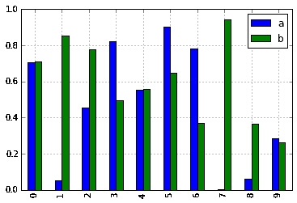
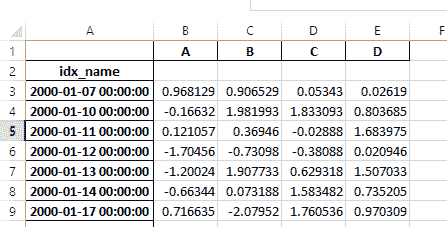
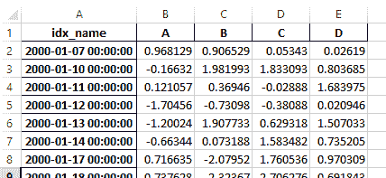

# 版本 0.17.0 (2015 年 10 月 9 日)

> 原文：[`pandas.pydata.org/docs/whatsnew/v0.17.0.html`](https://pandas.pydata.org/docs/whatsnew/v0.17.0.html)

这是从 0.16.2 开始的重要版本，并包括一小部分 API 更改，以及许多新功能、增强功能和性能改进，以及大量的错误修复。我们建议所有用户升级到此版本。

警告

pandas >= 0.17.0 将不再支持与 Python 版本 3.2 的兼容性 ([GH 9118](https://github.com/pandas-dev/pandas/issues/9118))

警告

`pandas.io.data` 包已被弃用，并将由 [pandas-datareader package](https://github.com/pydata/pandas-datareader) 替代。这将允许数据模块独立更新到您的 pandas 安装中。`pandas-datareader v0.1.1` 的 API 与 `pandas v0.17.0` 中的完全相同 ([GH 8961](https://github.com/pandas-dev/pandas/issues/8961), [GH 10861](https://github.com/pandas-dev/pandas/issues/10861))。

安装 pandas-datareader 后，您可以轻松更改导入方式：

```py
from pandas.io import data, wb 
```

变为

```py
from pandas_datareader import data, wb 
```

主要亮点包括：

+   在一些 cython 操作中释放全局解释器锁（GIL），参见 这里

+   绘图方法现在作为 `.plot` 访问器的属性可用，参见 这里

+   排序 API 已进行了重新设计，以消除一些长期存在的不一致性，参见 这里

+   支持将带时区的 `datetime64[ns]` 作为一级 dtype，参见 这里

+   `to_datetime` 的默认行为现在将是在遇到无法解析的格式时 `raise`，以前会返回原始输入。此外，日期解析函数现在返回一致的结果。参见 这里

+   `HDFStore` 中 `dropna` 的默认值已更改为 `False`，默认情况下存储所有行，即使它们全部为 `NaN`，请参见 这里

+   Datetime 访问器 (`dt`) 现在支持 `Series.dt.strftime` 以生成 datetime-likes 的格式化字符串，以及 `Series.dt.total_seconds` 以生成时间增量的每个持续时间的秒数。参见 这里

+   `Period` 和 `PeriodIndex` 可以处理类似 `3D` 的乘频率，对应于 3 天的跨度。参见 这里

+   安装版本的 pandas 现在将具有 `PEP440` 兼容的版本字符串 ([GH 9518](https://github.com/pandas-dev/pandas/issues/9518))

+   开发支持使用 [Air Speed Velocity library](https://github.com/spacetelescope/asv/) 进行基准测试 ([GH 8361](https://github.com/pandas-dev/pandas/issues/8361))

+   支持读取 SAS xport 文件，参见 这里

+   比较 SAS 与 *pandas* 的文档，请参见 这里

+   自 0.8.0 起已废弃自动 TimeSeries 广播，参见 这里

+   显示格式可以选择与 Unicode 东亚宽度对齐，参见这里

+   与 Python 3.5 兼容 ([GH 11097](https://github.com/pandas-dev/pandas/issues/11097))

+   与 matplotlib 1.5.0 兼容 ([GH 11111](https://github.com/pandas-dev/pandas/issues/11111))

在更新之前，请查看 API 更改和弃用。

v0.17.0 中的新功能

+   新功能

    +   带时区的日期时间

    +   释放 GIL

    +   绘图子方法

    +   dt 访问器的其他方法

        +   Series.dt.strftime

        +   Series.dt.total_seconds

    +   周期频率增强

    +   支持 SAS XPORT 文件

    +   在 .eval() 中支持数学函数

    +   带有 `MultiIndex` 的 Excel 更改

    +   Google BigQuery 增强

    +   与 Unicode 东亚宽度对齐的显示对齐](#display-alignment-with-unicode-east-asian-width)

    +   其他增强

+   不兼容的 API 更改

    +   排序 API 更改

    +   to_datetime 和 to_timedelta 的更改

        +   错误处理

        +   一致的解析

    +   索引比较的更改

    +   布尔比较与 None 的更改

    +   HDFStore dropna 行为

    +   display.precision 选项更改

    +   Categorical.unique 更改

    +   解析器中传递为 `header` 的 `bool` 更改

    +   其他 API 更改

    +   弃用

    +   删除之前版本的弃用/更改

+   性能改进

+   错误修复

+   贡献者

## 新功能

### 带时区的日期时间

我们正在添加一个原生支持带时区的日期时间的实现。以前，`Series`或`DataFrame`列可以分配带有时区的日期时间，并且将作为`object` dtype 工作。这会导致大量行的性能问题。有关更多详细信息，请参阅文档。([GH 8260](https://github.com/pandas-dev/pandas/issues/8260), [GH 10763](https://github.com/pandas-dev/pandas/issues/10763), [GH 11034](https://github.com/pandas-dev/pandas/issues/11034)).

新的实现允许在所有行中具有单一时区，并以高效的方式进行操作。

```py
In [1]: df = pd.DataFrame(
 ...:    {
 ...:        "A": pd.date_range("20130101", periods=3),
 ...:        "B": pd.date_range("20130101", periods=3, tz="US/Eastern"),
 ...:        "C": pd.date_range("20130101", periods=3, tz="CET"),
 ...:    }
 ...: )
 ...: 

In [2]: df
Out[2]: 
 A                         B                         C
0 2013-01-01 2013-01-01 00:00:00-05:00 2013-01-01 00:00:00+01:00
1 2013-01-02 2013-01-02 00:00:00-05:00 2013-01-02 00:00:00+01:00
2 2013-01-03 2013-01-03 00:00:00-05:00 2013-01-03 00:00:00+01:00

[3 rows x 3 columns]

In [3]: df.dtypes
Out[3]: 
A                datetime64[ns]
B    datetime64[ns, US/Eastern]
C           datetime64[ns, CET]
Length: 3, dtype: object 
```

```py
In [4]: df.B
Out[4]: 
0   2013-01-01 00:00:00-05:00
1   2013-01-02 00:00:00-05:00
2   2013-01-03 00:00:00-05:00
Name: B, Length: 3, dtype: datetime64[ns, US/Eastern]

In [5]: df.B.dt.tz_localize(None)
Out[5]: 
0   2013-01-01
1   2013-01-02
2   2013-01-03
Name: B, Length: 3, dtype: datetime64[ns] 
```

这也使用了一种新的数据类型表示，与其 numpy 表亲 `datetime64[ns]` 非常相似。

```py
In [6]: df["B"].dtype
Out[6]: datetime64[ns, US/Eastern]

In [7]: type(df["B"].dtype)
Out[7]: pandas.core.dtypes.dtypes.DatetimeTZDtype 
```

注意

由于数据类型的更改，底层 `DatetimeIndex` 的字符串表示有所不同，但在功能上它们是相同的。

先前的行为：

```py
In [1]: pd.date_range('20130101', periods=3, tz='US/Eastern')
Out[1]: DatetimeIndex(['2013-01-01 00:00:00-05:00', '2013-01-02 00:00:00-05:00',
 '2013-01-03 00:00:00-05:00'],
 dtype='datetime64[ns]', freq='D', tz='US/Eastern')

In [2]: pd.date_range('20130101', periods=3, tz='US/Eastern').dtype
Out[2]: dtype('<M8[ns]') 
```

新的行为：

```py
In [8]: pd.date_range("20130101", periods=3, tz="US/Eastern")
Out[8]: 
DatetimeIndex(['2013-01-01 00:00:00-05:00', '2013-01-02 00:00:00-05:00',
 '2013-01-03 00:00:00-05:00'],
 dtype='datetime64[ns, US/Eastern]', freq='D')

In [9]: pd.date_range("20130101", periods=3, tz="US/Eastern").dtype
Out[9]: datetime64[ns, US/Eastern] 
```  ### 释放 GIL

我们正在对一些 Cython 操作释放全局解释器锁（GIL）。这将允许在计算过程中同时运行其他线程，从而可能通过多线程获得性能改进。特别是 `groupby`、`nsmallest`、`value_counts` 和一些索引操作会从中受益。([GH 8882](https://github.com/pandas-dev/pandas/issues/8882))

例如，以下代码中的 groupby 表达式在因子化步骤期间将释放 GIL，例如 `df.groupby('key')` 以及 `.sum()` 操作。

```py
N = 1000000
ngroups = 10
df = DataFrame(
    {"key": np.random.randint(0, ngroups, size=N), "data": np.random.randn(N)}
)
df.groupby("key")["data"].sum() 
```

释放 GIL 可以使使用线程进行用户交互（例如 [QT](https://wiki.python.org/moin/PyQt)）或执行多线程计算的应用程序受益。一个可以处理这些类型并行计算的库的好例子是 [dask](https://dask.readthedocs.io/en/latest/) 库。  ### 绘图子方法

Series 和 DataFrame 的 `.plot()` 方法允许通过提供 `kind` 关键字参数来自定义绘图类型。不幸的是，许多这类绘图使用不同的必需和可选关键字参数，这使得很难发现任何给定绘图种类使用了数十种可能参数中的哪些。

为了缓解这个问题，我们添加了一个新的、可选的绘图接口，将每种绘图作为 `.plot` 属性的方法暴露出来。现在，您不仅可以编写 `series.plot(kind=<kind>, ...)`，还可以使用 `series.plot.<kind>(...)`：

```py
In [10]: df = pd.DataFrame(np.random.rand(10, 2), columns=['a', 'b'])

In [11]: df.plot.bar() 
```



由于这个变化，这些方法现在都可以通过制表完成来发现：

```py
In [12]: df.plot.<TAB>  # noqa: E225, E999
df.plot.area     df.plot.barh     df.plot.density  df.plot.hist     df.plot.line     df.plot.scatter
df.plot.bar      df.plot.box      df.plot.hexbin   df.plot.kde      df.plot.pie 
```

每个方法签名只包括相关的参数。目前，这些参数仅限于必需参数，但将来将包括可选参数。有关概述，请参阅新的 绘图 API 文档。  ### `dt` 访问器的附加方法

#### Series.dt.strftime

我们现在支持使用 `Series.dt.strftime` 方法来为类似日期时间的对象生成格式化字符串（[GH 10110](https://github.com/pandas-dev/pandas/issues/10110)）。示例：

```py
# DatetimeIndex
In [13]: s = pd.Series(pd.date_range("20130101", periods=4))

In [14]: s
Out[14]: 
0   2013-01-01
1   2013-01-02
2   2013-01-03
3   2013-01-04
Length: 4, dtype: datetime64[ns]

In [15]: s.dt.strftime("%Y/%m/%d")
Out[15]: 
0    2013/01/01
1    2013/01/02
2    2013/01/03
3    2013/01/04
Length: 4, dtype: object 
```

```py
# PeriodIndex
In [16]: s = pd.Series(pd.period_range("20130101", periods=4))

In [17]: s
Out[17]: 
0    2013-01-01
1    2013-01-02
2    2013-01-03
3    2013-01-04
Length: 4, dtype: period[D]

In [18]: s.dt.strftime("%Y/%m/%d")
Out[18]: 
0    2013/01/01
1    2013/01/02
2    2013/01/03
3    2013/01/04
Length: 4, dtype: object 
```

字符串格式与 python 标准库相同，详细信息可在 [这里](https://docs.python.org/2/library/datetime.html#strftime-and-strptime-behavior) 找到

#### Series.dt.total_seconds

`pd.Series` 类型的 `timedelta64` 具有新方法 `.dt.total_seconds()`，返回时间增量的持续时间（秒）([GH 10817](https://github.com/pandas-dev/pandas/issues/10817))

```py
# TimedeltaIndex
In [19]: s = pd.Series(pd.timedelta_range("1 minutes", periods=4))

In [20]: s
Out[20]: 
0   0 days 00:01:00
1   1 days 00:01:00
2   2 days 00:01:00
3   3 days 00:01:00
Length: 4, dtype: timedelta64[ns]

In [21]: s.dt.total_seconds()
Out[21]: 
0        60.0
1     86460.0
2    172860.0
3    259260.0
Length: 4, dtype: float64 
```  ### 周期频率增强

`Period`, `PeriodIndex`和`period_range`现在可以接受乘以频率。另外，`Period.freq`和`PeriodIndex.freq`现在被存储为`DateOffset`实例，类似于`DatetimeIndex`，而不是`str` ([GH 7811](https://github.com/pandas-dev/pandas/issues/7811))

乘以频率表示相应长度的跨度。下面的示例创建了一个 3 天的期间。加法和减法将按照其跨度移动期间。

```py
In [22]: p = pd.Period("2015-08-01", freq="3D")

In [23]: p
Out[23]: Period('2015-08-01', '3D')

In [24]: p + 1
Out[24]: Period('2015-08-04', '3D')

In [25]: p - 2
Out[25]: Period('2015-07-26', '3D')

In [26]: p.to_timestamp()
Out[26]: Timestamp('2015-08-01 00:00:00')

In [27]: p.to_timestamp(how="E")
Out[27]: Timestamp('2015-08-03 23:59:59.999999999') 
```

您可以在`PeriodIndex`和`period_range`中使用乘以频率。

```py
In [28]: idx = pd.period_range("2015-08-01", periods=4, freq="2D")

In [29]: idx
Out[29]: PeriodIndex(['2015-08-01', '2015-08-03', '2015-08-05', '2015-08-07'], dtype='period[2D]')

In [30]: idx + 1
Out[30]: PeriodIndex(['2015-08-03', '2015-08-05', '2015-08-07', '2015-08-09'], dtype='period[2D]') 
```  ### 对 SAS XPORT 文件的支持

`read_sas()`现在提供对读取*SAS XPORT*格式文件的支持。 ([GH 4052](https://github.com/pandas-dev/pandas/issues/4052)).

```py
df = pd.read_sas("sas_xport.xpt") 
```

还可以获得迭代器并逐步读取 XPORT 文件。

```py
for df in pd.read_sas("sas_xport.xpt", chunksize=10000):
    do_something(df) 
```

详细信息请参阅文档  ### 在.eval()中支持数学函数

`eval()` 现在支持调用数学函数 ([GH 4893](https://github.com/pandas-dev/pandas/issues/4893))

```py
df = pd.DataFrame({"a": np.random.randn(10)})
df.eval("b = sin(a)") 
```

支持的数学函数有`sin`, `cos`, `exp`, `log`, `expm1`, `log1p`, `sqrt`, `sinh`, `cosh`, `tanh`, `arcsin`, `arccos`, `arctan`, `arccosh`, `arcsinh`, `arctanh`, `abs` 和 `arctan2`.

这些函数映射到`NumExpr`引擎的内部函数。对于 Python 引擎，它们被映射到`NumPy`调用。

### Excel 中的更改与`MultiIndex`

在版本 0.16.2 中，具有`MultiIndex`列的`DataFrame`无法通过`to_excel`写入 Excel。已经添加了这个功能 ([GH 10564](https://github.com/pandas-dev/pandas/issues/10564))，同时更新了`read_excel`，以便通过在`header`和`index_col`参数中指定哪些列/行组成`MultiIndex`，可以读取数据而不会丢失信息 ([GH 4679](https://github.com/pandas-dev/pandas/issues/4679))

有关详细信息，请参阅文档。

```py
In [31]: df = pd.DataFrame(
 ....:    [[1, 2, 3, 4], [5, 6, 7, 8]],
 ....:    columns=pd.MultiIndex.from_product(
 ....:        [["foo", "bar"], ["a", "b"]], names=["col1", "col2"]
 ....:    ),
 ....:    index=pd.MultiIndex.from_product([["j"], ["l", "k"]], names=["i1", "i2"]),
 ....: )
 ....: 

In [32]: df
Out[32]: 
col1  foo    bar 
col2    a  b   a  b
i1 i2 
j  l    1  2   3  4
 k    5  6   7  8

[2 rows x 4 columns]

In [33]: df.to_excel("test.xlsx")

In [34]: df = pd.read_excel("test.xlsx", header=[0, 1], index_col=[0, 1])

In [35]: df
Out[35]: 
col1  foo    bar 
col2    a  b   a  b
i1 i2 
j  l    1  2   3  4
 k    5  6   7  8

[2 rows x 4 columns] 
```

以前，在`read_excel`中必须指定`has_index_names`参数，如果序列化数据具有索引名称。对于版本 0.17.0，`to_excel`的输出格式已更改，使得这个关键字不再必要 - 更改如下所示。

**旧**



**新**



警告

保存在版本 0.16.2 或之前并且具有索引名称的 Excel 文件仍然可以被读取，但必须指定`has_index_names`参数为`True`。

### Google BigQuery 增强

+   添加了使用`pandas.io.gbq.to_gbq()`函数自动创建表/数据集的能力，如果目标表/数据集不存在的话。 ([GH 8325](https://github.com/pandas-dev/pandas/issues/8325), [GH 11121](https://github.com/pandas-dev/pandas/issues/11121)).

+   添加了通过 `if_exists` 参数调用 `pandas.io.gbq.to_gbq()` 函数时替换现有表和模式的能力。 有关更多详细信息，请参阅[文档](https://pandas-gbq.readthedocs.io/en/latest/writing.html)（[GH 8325](https://github.com/pandas-dev/pandas/issues/8325)）。

+   gbq 模块中的 `InvalidColumnOrder` 和 `InvalidPageToken` 将引发 `ValueError` 而不是 `IOError`。

+   `generate_bq_schema()` 函数现已过时，并将在将来的版本中删除（[GH 11121](https://github.com/pandas-dev/pandas/issues/11121)）

+   gbq 模块现在将支持 Python 3（[GH 11094](https://github.com/pandas-dev/pandas/issues/11094)）。  ### 显示与 Unicode 东亚宽度对齐

警告

启用此选项将影响打印 `DataFrame` 和 `Series` 的性能（大约慢 2 倍）。 仅在实际需要时使用。

一些东亚国家使用 Unicode 字符，其宽度对应于 2 个字母。 如果 `DataFrame` 或 `Series` 包含这些字符，则默认输出无法正确对齐。 添加以下选项以精确处理这些字符。

+   `display.unicode.east_asian_width`：是否使用 Unicode 东亚宽度来计算显示文本宽度。 （[GH 2612](https://github.com/pandas-dev/pandas/issues/2612)）

+   `display.unicode.ambiguous_as_wide`：是否处理 Unicode 字符属于 Ambiguous 为 Wide。 （[GH 11102](https://github.com/pandas-dev/pandas/issues/11102)）

```py
In [36]: df = pd.DataFrame({u"国籍": ["UK", u"日本"], u"名前": ["Alice", u"しのぶ"]})

In [37]: df
Out[37]: 
 国籍     名前
0  UK  Alice
1  日本    しのぶ

[2 rows x 2 columns] 
```

```py
In [38]: pd.set_option("display.unicode.east_asian_width", True)

In [39]: df
Out[39]: 
 国籍    名前
0    UK   Alice
1  日本  しのぶ

[2 rows x 2 columns] 
```

更多详细信息，请参阅这里  ### 其他增强

+   支持 `openpyxl` >= 2.2。 样式支持的 API 现在稳定（[GH 10125](https://github.com/pandas-dev/pandas/issues/10125)）

+   `merge` 现在接受参数 `indicator`，它将向输出对象添加一个分类类型的列（默认称为 `_merge`），该列接受以下值（[GH 8790](https://github.com/pandas-dev/pandas/issues/8790)）

    | 观察来源 | `_merge` 值 |
    | --- | --- |
    | 仅在 `'left'` 框架中的合并键 | `left_only` |
    | 仅在 `'right'` 框架中的合并键 | `right_only` |
    | 两个框架中的合并键 | `both` |

    ```py
    In [40]: df1 = pd.DataFrame({"col1": [0, 1], "col_left": ["a", "b"]})

    In [41]: df2 = pd.DataFrame({"col1": [1, 2, 2], "col_right": [2, 2, 2]})

    In [42]: pd.merge(df1, df2, on="col1", how="outer", indicator=True)
    Out[42]: 
     col1 col_left  col_right      _merge
    0     0        a        NaN   left_only
    1     1        b        2.0        both
    2     2      NaN        2.0  right_only
    3     2      NaN        2.0  right_only

    [4 rows x 4 columns] 
    ```

    更多信息，请参阅更新文档

+   `pd.to_numeric` 是一个新函数，用于将字符串强制转换为数字（可能会进行强制转换）（[GH 11133](https://github.com/pandas-dev/pandas/issues/11133)）

+   如果它们未合并，则 `pd.merge` 现在将允许重复列名（[GH 10639](https://github.com/pandas-dev/pandas/issues/10639)）。

+   `pd.pivot` 现在将允许将索引作为 `None` 传递（[GH 3962](https://github.com/pandas-dev/pandas/issues/3962)）。

+   `pd.concat` 现在将使用提供的现有 Series 名称（如果提供）（[GH 10698](https://github.com/pandas-dev/pandas/issues/10698)）。

    ```py
    In [43]: foo = pd.Series([1, 2], name="foo")

    In [44]: bar = pd.Series([1, 2])

    In [45]: baz = pd.Series([4, 5]) 
    ```

    先前行为：

    ```py
    In [1]: pd.concat([foo, bar, baz], axis=1)
    Out[1]:
     0  1  2
     0  1  1  4
     1  2  2  5 
    ```

    新行为：

    ```py
    In [46]: pd.concat([foo, bar, baz], axis=1)
    Out[46]: 
     foo  0  1
    0    1  1  4
    1    2  2  5

    [2 rows x 3 columns] 
    ```

+   `DataFrame` 已增加 `nlargest` 和 `nsmallest` 方法（[GH 10393](https://github.com/pandas-dev/pandas/issues/10393)）

+   添加了一个 `limit_direction` 关键字参数，与 `limit` 一起使用以使 `interpolate` 填充 `NaN` 值向前、向后或两者都填充（[GH 9218](https://github.com/pandas-dev/pandas/issues/9218)，[GH 10420](https://github.com/pandas-dev/pandas/issues/10420)，[GH 11115](https://github.com/pandas-dev/pandas/issues/11115)）

    ```py
    In [47]: ser = pd.Series([np.nan, np.nan, 5, np.nan, np.nan, np.nan, 13])

    In [48]: ser.interpolate(limit=1, limit_direction="both")
    Out[48]: 
    0     NaN
    1     5.0
    2     5.0
    3     7.0
    4     NaN
    5    11.0
    6    13.0
    Length: 7, dtype: float64 
    ```

+   添加了一个 `DataFrame.round` 方法，以将值四舍五入为可变小数位数（[GH 10568](https://github.com/pandas-dev/pandas/issues/10568)）。

    ```py
    In [49]: df = pd.DataFrame(
     ....:    np.random.random([3, 3]),
     ....:    columns=["A", "B", "C"],
     ....:    index=["first", "second", "third"],
     ....: )
     ....: 

    In [50]: df
    Out[50]: 
     A         B         C
    first   0.126970  0.966718  0.260476
    second  0.897237  0.376750  0.336222
    third   0.451376  0.840255  0.123102

    [3 rows x 3 columns]

    In [51]: df.round(2)
    Out[51]: 
     A     B     C
    first   0.13  0.97  0.26
    second  0.90  0.38  0.34
    third   0.45  0.84  0.12

    [3 rows x 3 columns]

    In [52]: df.round({"A": 0, "C": 2})
    Out[52]: 
     A         B     C
    first   0.0  0.966718  0.26
    second  1.0  0.376750  0.34
    third   0.0  0.840255  0.12

    [3 rows x 3 columns] 
    ```

+   `drop_duplicates` 和 `duplicated` 现在接受一个 `keep` 关键字来定位第一个、最后一个和所有重复项。 `take_last` 关键字已弃用，请参阅此处（[GH 6511](https://github.com/pandas-dev/pandas/issues/6511)，[GH 8505](https://github.com/pandas-dev/pandas/issues/8505)）

    ```py
    In [53]: s = pd.Series(["A", "B", "C", "A", "B", "D"])

    In [54]: s.drop_duplicates()
    Out[54]: 
    0    A
    1    B
    2    C
    5    D
    Length: 4, dtype: object

    In [55]: s.drop_duplicates(keep="last")
    Out[55]: 
    2    C
    3    A
    4    B
    5    D
    Length: 4, dtype: object

    In [56]: s.drop_duplicates(keep=False)
    Out[56]: 
    2    C
    5    D
    Length: 2, dtype: object 
    ```

+   Reindex 现在具有 `tolerance` 参数，允许更精细地控制重新索引时填充的限制（[GH 10411](https://github.com/pandas-dev/pandas/issues/10411)）：

    ```py
    In [57]: df = pd.DataFrame({"x": range(5), "t": pd.date_range("2000-01-01", periods=5)})

    In [58]: df.reindex([0.1, 1.9, 3.5], method="nearest", tolerance=0.2)
    Out[58]: 
     x          t
    0.1  0.0 2000-01-01
    1.9  2.0 2000-01-03
    3.5  NaN        NaT

    [3 rows x 2 columns] 
    ```

    当用于 `DatetimeIndex`、`TimedeltaIndex` 或 `PeriodIndex` 时，如果可能的话，`tolerance` 将被强制转换为 `Timedelta`。这使您可以使用字符串指定容差：

    ```py
    In [59]: df = df.set_index("t")

    In [60]: df.reindex(pd.to_datetime(["1999-12-31"]), method="nearest", tolerance="1 day")
    Out[60]: 
     x
    1999-12-31  0

    [1 rows x 1 columns] 
    ```

    `tolerance` 也由底层的 `Index.get_indexer` 和 `Index.get_loc` 方法公开。

+   添加了在重新采样 `TimeDeltaIndex` 时使用 `base` 参数的功能（[GH 10530](https://github.com/pandas-dev/pandas/issues/10530)）

+   `DatetimeIndex` 可以使用包含 `NaT` 的字符串进行实例化（[GH 7599](https://github.com/pandas-dev/pandas/issues/7599)）

+   `to_datetime` 现在可以接受 `yearfirst` 关键字（[GH 7599](https://github.com/pandas-dev/pandas/issues/7599)）

+   `pandas.tseries.offsets` 大于 `Day` 偏移量现在可以与 `Series` 一起使用进行加法/减法（[GH 10699](https://github.com/pandas-dev/pandas/issues/10699)）。有关更多详细信息，请参阅文档。

+   `pd.Timedelta.total_seconds()` 现在返回纳秒精度的 Timedelta 时长（之前是微秒精度）（[GH 10939](https://github.com/pandas-dev/pandas/issues/10939)）

+   `PeriodIndex` 现在支持与 `np.ndarray` 的算术运算（[GH 10638](https://github.com/pandas-dev/pandas/issues/10638)）

+   支持对 `Period` 对象进行 pickling（[GH 10439](https://github.com/pandas-dev/pandas/issues/10439)）

+   `.as_blocks` 现在将接受一个 `copy` 可选参数以返回数据的副本，默认为复制（与先前版本的行为没有变化）（[GH 9607](https://github.com/pandas-dev/pandas/issues/9607)）

+   `DataFrame.filter` 的 `regex` 参数现在处理数字列名而不是引发 `ValueError`（[GH 10384](https://github.com/pandas-dev/pandas/issues/10384)）。

+   通过 URL 读取 gzip 压缩文件，可以通过显式设置压缩参数或通过推断响应中的 HTTP Content-Encoding 头来实现（[GH 8685](https://github.com/pandas-dev/pandas/issues/8685)）

+   使用 StringIO/BytesIO 在内存中写入 Excel 文件 ([GH 7074](https://github.com/pandas-dev/pandas/issues/7074))

+   在`ExcelWriter`中启用对列表和字典的序列化为字符串的功能（[GH 8188](https://github.com/pandas-dev/pandas/issues/8188))

+   SQL io 函数现在接受一个 SQLAlchemy 连接对象。([GH 7877](https://github.com/pandas-dev/pandas/issues/7877))

+   `pd.read_sql`和`to_sql`现在可以接受数据库 URI 作为`con`参数（[GH 10214](https://github.com/pandas-dev/pandas/issues/10214))

+   `read_sql_table`现在允许从视图中读取数据 ([GH 10750](https://github.com/pandas-dev/pandas/issues/10750)).

+   在使用`table`格式时，允许将复杂值写入`HDFStores` ([GH 10447](https://github.com/pandas-dev/pandas/issues/10447))

+   当 HDF 文件包含单个数据集时，允许在不指定键的情况下使用`pd.read_hdf` ([GH 10443](https://github.com/pandas-dev/pandas/issues/10443))

+   `pd.read_stata`现在可以读取 Stata 118 类型文件。 ([GH 9882](https://github.com/pandas-dev/pandas/issues/9882))

+   `msgpack`子模块已更新为 0.4.6，并保持向后兼容性 ([GH 10581](https://github.com/pandas-dev/pandas/issues/10581))

+   `DataFrame.to_dict`现在接受`orient='index'`关键字参数 ([GH 10844](https://github.com/pandas-dev/pandas/issues/10844)).

+   如果传递的函数返回一个字典且`reduce=True`，`DataFrame.apply`将返回一个字典的 Series ([GH 8735](https://github.com/pandas-dev/pandas/issues/8735)).

+   允许将`kwargs`传递给插值方法 ([GH 10378](https://github.com/pandas-dev/pandas/issues/10378)).

+   在连接空的`Dataframe`对象的可迭代对象时，改进了错误消息 ([GH 9157](https://github.com/pandas-dev/pandas/issues/9157))

+   `pd.read_csv`现在可以逐步读取 bz2 压缩文件，并且 C 解析器可以从 AWS S3 读取 bz2 压缩文件 ([GH 11070](https://github.com/pandas-dev/pandas/issues/11070), [GH 11072](https://github.com/pandas-dev/pandas/issues/11072)).

+   在`pd.read_csv`中，识别`s3n://`和`s3a://` URL 作为 S3 文件存储的指示符 ([GH 11070](https://github.com/pandas-dev/pandas/issues/11070), [GH 11071](https://github.com/pandas-dev/pandas/issues/11071)).

+   逐步从 AWS S3 读取 CSV 文件，而不是首先下载整个文件。 （Python 2 中仍需要完整文件下载以读取压缩文件。） ([GH 11070](https://github.com/pandas-dev/pandas/issues/11070), [GH 11073](https://github.com/pandas-dev/pandas/issues/11073))

+   `pd.read_csv`现在能够推断从 AWS S3 存储读取的文件的压缩类型 ([GH 11070](https://github.com/pandas-dev/pandas/issues/11070), [GH 11074](https://github.com/pandas-dev/pandas/issues/11074)).  ## 不兼容的 API 更改

### 排序 API 的更改

排序 API 存在一些长期存在的不一致性。([GH 9816](https://github.com/pandas-dev/pandas/issues/9816), [GH 8239](https://github.com/pandas-dev/pandas/issues/8239)).

以下是 0.17.0 之前的 API 的摘要：

+   `Series.sort` **就地**进行，而 `DataFrame.sort` 返回一个新对象。

+   `Series.order` 返回一个新对象

+   过去可以使用 `Series/DataFrame.sort_index` 通过传递 `by` 关键字来按 **值** 排序。

+   `Series/DataFrame.sortlevel` 仅对 `MultiIndex` 进行索引排序有效。

为了解决这些问题，我们已经重新设计了 API：

+   我们引入了一个新方法，`DataFrame.sort_values()`，它是 `DataFrame.sort()`，`Series.sort()` 和 `Series.order()` 的合并，用于处理 **值** 的排序。

+   现有的方法 `Series.sort()`，`Series.order()` 和 `DataFrame.sort()` 已被弃用，并将在将来的版本中删除。

+   `DataFrame.sort_index()` 的 `by` 参数已弃用，并将在将来的版本中删除。

+   现有方法 `.sort_index()` 将获得 `level` 关键字以启用级别排序。

现在我们有了两种不重叠的排序方法。一个 `*` 标记的项目将显示 `FutureWarning`。

要按**值**排序：

| 之前 | 替代 |
| --- | --- |
| * `Series.order()` | `Series.sort_values()` |
| * `Series.sort()` | `Series.sort_values(inplace=True)` |
| * `DataFrame.sort(columns=...)` | `DataFrame.sort_values(by=...)` |

要按 **索引** 排序：

| 之前 | 替代 |
| --- | --- |
| `Series.sort_index()` | `Series.sort_index()` |
| `Series.sortlevel(level=...)` | `Series.sort_index(level=...`) |
| `DataFrame.sort_index()` | `DataFrame.sort_index()` |
| `DataFrame.sortlevel(level=...)` | `DataFrame.sort_index(level=...)` |
| * `DataFrame.sort()` | `DataFrame.sort_index()` |

我们还已经弃用并更改了两个类似于 Series 的类中的相似方法，即 `Index` 和 `Categorical`。

| 之前 | 替代 |
| --- | --- |
| * `Index.order()` | `Index.sort_values()` |

| * `Categorical.order()` | `Categorical.sort_values()` |  ### 对 to_datetime 和 to_timedelta 的更改

#### 错误处理

`pd.to_datetime` 的错误处理默认已更改为 `errors='raise'`。在以前的版本中是 `errors='ignore'`。此外，已弃用了 `coerce` 参数，而采用了 `errors='coerce'`。这意味着无效的解析将引发异常，而不是像以前的版本那样返回原始输入。([GH 10636](https://github.com/pandas-dev/pandas/issues/10636))

先前的行为：

```py
In [2]: pd.to_datetime(['2009-07-31', 'asd'])
Out[2]: array(['2009-07-31', 'asd'], dtype=object) 
```

新行为：

```py
In [3]: pd.to_datetime(['2009-07-31', 'asd'])
ValueError: Unknown string format 
```

当然，你也可以强制执行这一点。

```py
In [61]: pd.to_datetime(["2009-07-31", "asd"], errors="coerce")
Out[61]: DatetimeIndex(['2009-07-31', 'NaT'], dtype='datetime64[ns]', freq=None) 
```

要保持以前的行为，您可以使用 `errors='ignore'`：

```py
In [4]: pd.to_datetime(["2009-07-31", "asd"], errors="ignore")
Out[4]: Index(['2009-07-31', 'asd'], dtype='object') 
```

此外，`pd.to_timedelta` 已获得了 `errors='raise'|'ignore'|'coerce'` 的类似 API，而 `coerce` 关键字已被弃用，而采用了 `errors='coerce'`。

#### 统一解析

`to_datetime`，`Timestamp`和`DatetimeIndex`的字符串解析已经统一。([GH 7599](https://github.com/pandas-dev/pandas/issues/7599))

在 v0.17.0 之前，`Timestamp`和`to_datetime`可能会使用今天的日期不正确地解析仅包含年份的日期时间字符串，否则`DatetimeIndex`将使用年初。`Timestamp`和`to_datetime`可能会在某些`DatetimeIndex`可以解析的日期时间字符串中引发`ValueError`，例如季度字符串。

先前的行为：

```py
In [1]: pd.Timestamp('2012Q2')
Traceback
 ...
ValueError: Unable to parse 2012Q2

# Results in today's date.
In [2]: pd.Timestamp('2014')
Out [2]: 2014-08-12 00:00:00 
```

v0.17.0 可以解析如下。它也适用于`DatetimeIndex`。

新的行为：

```py
In [62]: pd.Timestamp("2012Q2")
Out[62]: Timestamp('2012-04-01 00:00:00')

In [63]: pd.Timestamp("2014")
Out[63]: Timestamp('2014-01-01 00:00:00')

In [64]: pd.DatetimeIndex(["2012Q2", "2014"])
Out[64]: DatetimeIndex(['2012-04-01', '2014-01-01'], dtype='datetime64[ns]', freq=None) 
```

注意

如果要基于今天的日期执行计算，请使用`Timestamp.now()`和`pandas.tseries.offsets`。

```py
In [65]: import pandas.tseries.offsets as offsets

In [66]: pd.Timestamp.now()
Out[66]: Timestamp('2024-04-10 17:55:56.541543')

In [67]: pd.Timestamp.now() + offsets.DateOffset(years=1)
Out[67]: Timestamp('2025-04-10 17:55:56.542277') 
```

### 索引比较的更改

在`Index`上的等于操作应该与`Series`类似（[GH 9947](https://github.com/pandas-dev/pandas/issues/9947), [GH 10637](https://github.com/pandas-dev/pandas/issues/10637)）

从 v0.17.0 开始，比较不同长度的`Index`对象将引发`ValueError`。这是为了与`Series`的行为保持一致。

先前的行为：

```py
In [2]: pd.Index([1, 2, 3]) == pd.Index([1, 4, 5])
Out[2]: array([ True, False, False], dtype=bool)

In [3]: pd.Index([1, 2, 3]) == pd.Index([2])
Out[3]: array([False,  True, False], dtype=bool)

In [4]: pd.Index([1, 2, 3]) == pd.Index([1, 2])
Out[4]: False 
```

新的行为：

```py
In [8]: pd.Index([1, 2, 3]) == pd.Index([1, 4, 5])
Out[8]: array([ True, False, False], dtype=bool)

In [9]: pd.Index([1, 2, 3]) == pd.Index([2])
ValueError: Lengths must match to compare

In [10]: pd.Index([1, 2, 3]) == pd.Index([1, 2])
ValueError: Lengths must match to compare 
```

请注意，这与`numpy`的行为不同，其中比较可以进行广播：

```py
In [68]: np.array([1, 2, 3]) == np.array([1])
Out[68]: array([ True, False, False]) 
```

或者如果无法进行广播，则可以返回 False：

```py
In [11]: np.array([1, 2, 3]) == np.array([1, 2])
Out[11]: False 
```

### 布尔比较与 None 的更改

`Series`与`None`的布尔比较现在等同于与`np.nan`比较，而不是引发`TypeError`。([GH 1079](https://github.com/pandas-dev/pandas/issues/1079)).

```py
In [69]: s = pd.Series(range(3), dtype="float")

In [70]: s.iloc[1] = None

In [71]: s
Out[71]: 
0    0.0
1    NaN
2    2.0
Length: 3, dtype: float64 
```

先前的行为：

```py
In [5]: s == None
TypeError: Could not compare <type 'NoneType'> type with Series 
```

新的行为：

```py
In [72]: s == None
Out[72]: 
0    False
1    False
2    False
Length: 3, dtype: bool 
```

通常你只想知道哪些值是空的。

```py
In [73]: s.isnull()
Out[73]: 
0    False
1     True
2    False
Length: 3, dtype: bool 
```

警告

通常情况下，您会想要使用`isnull/notnull`进行这些类型的比较，因为`isnull/notnull`告诉您哪些元素为空。必须注意`nan`不相等，但`None`相等。请注意 pandas/numpy 使用`np.nan != np.nan`的事实，并将`None`视为`np.nan`。

```py
In [74]: None == None
Out[74]: True

In [75]: np.nan == np.nan
Out[75]: False 
```

### HDFStore dropna 行为

使用`format='table'`的 HDFStore 写函数的默认行为现在是保留所有缺失的行。先前的行为是删除所有缺失的行，保存索引。可以使用`dropna=True`选项复制先前的行为。([GH 9382](https://github.com/pandas-dev/pandas/issues/9382))

先前的行为：

```py
In [76]: df_with_missing = pd.DataFrame(
 ....:    {"col1": [0, np.nan, 2], "col2": [1, np.nan, np.nan]}
 ....: )
 ....: 

In [77]: df_with_missing
Out[77]: 
 col1  col2
0   0.0   1.0
1   NaN   NaN
2   2.0   NaN

[3 rows x 2 columns] 
```

```py
In [27]:
df_with_missing.to_hdf('file.h5',
 key='df_with_missing',
 format='table',
 mode='w')

In [28]: pd.read_hdf('file.h5', 'df_with_missing')

Out [28]:
 col1  col2
 0     0     1
 2     2   NaN 
```

新的行为：

```py
In [78]: df_with_missing.to_hdf("file.h5", key="df_with_missing", format="table", mode="w")

In [79]: pd.read_hdf("file.h5", "df_with_missing")
Out[79]: 
 col1  col2
0   0.0   1.0
1   NaN   NaN
2   2.0   NaN

[3 rows x 2 columns] 
```

更多细节请参阅文档。  ### 更改`display.precision`选项

`display.precision`选项已经明确指的是小数位数（[GH 10451](https://github.com/pandas-dev/pandas/issues/10451)）。

早期版本的 pandas 会将浮点数格式化为比`display.precision`中的值少一个小数位数。

```py
In [1]: pd.set_option('display.precision', 2)

In [2]: pd.DataFrame({'x': [123.456789]})
Out[2]:
 x
0  123.5 
```

如果将精度解释为“有效数字”，这对科学记数法有效，但对于具有标准格式的值则不适用。这也与 numpy 处理格式的方式不一致。

从现在开始，`display.precision`的值将直接控制小数点后的位数，用于常规格式和科学记数法，类似于 numpy 的`precision`打印选项的工作方式。

```py
In [80]: pd.set_option("display.precision", 2)

In [81]: pd.DataFrame({"x": [123.456789]})
Out[81]: 
 x
0  123.46

[1 rows x 1 columns] 
```

为保留与以前版本的输出行为一致，`display.precision`的默认值已从`7`降低到`6`。### `Categorical.unique`的更改

`Categorical.unique`现在返回具有唯一`categories`和`codes`的新`Categoricals`，而不是返回`np.array`（[GH 10508](https://github.com/pandas-dev/pandas/issues/10508)）

+   无序类别：值和类别按出现顺序排序。

+   有序类别：值按出现顺序排序，类别保持现有顺序。

```py
In [82]: cat = pd.Categorical(["C", "A", "B", "C"], categories=["A", "B", "C"], ordered=True)

In [83]: cat
Out[83]: 
['C', 'A', 'B', 'C']
Categories (3, object): ['A' < 'B' < 'C']

In [84]: cat.unique()
Out[84]: 
['C', 'A', 'B']
Categories (3, object): ['A' < 'B' < 'C']

In [85]: cat = pd.Categorical(["C", "A", "B", "C"], categories=["A", "B", "C"])

In [86]: cat
Out[86]: 
['C', 'A', 'B', 'C']
Categories (3, object): ['A', 'B', 'C']

In [87]: cat.unique()
Out[87]: 
['C', 'A', 'B']
Categories (3, object): ['A', 'B', 'C'] 
```

### 更改`parser`中传递的`header`为`bool`

在较早版本的 pandas 中，如果将`bool`传递给`read_csv`，`read_excel`或`read_html`的`header`参数，则会隐式转换为整数，导致`False`为`header=0`，`True`为`header=1`（[GH 6113](https://github.com/pandas-dev/pandas/issues/6113)）

`header`的`bool`输入现在会引发`TypeError`

```py
In [29]: df = pd.read_csv('data.csv', header=False)
TypeError: Passing a bool to header is invalid. Use header=None for no header or
header=int or list-like of ints to specify the row(s) making up the column names 
```

### 其他 API 更改

+   使用`subplots=True`的线和 kde 图现在使用默认颜色，而不是全部黑色。指定`color='k'`以绘制所有线条为黑色（[GH 9894](https://github.com/pandas-dev/pandas/issues/9894)）

+   在具有`categorical`dtype 的 Series 上调用`.value_counts()`方法现在返回具有`CategoricalIndex`的 Series（[GH 10704](https://github.com/pandas-dev/pandas/issues/10704)）

+   子类的元数据属性现在将被序列化（[GH 10553](https://github.com/pandas-dev/pandas/issues/10553)）。

+   使用`Categorical`进行`groupby`遵循上述`Categorical.unique`的相同规则（[GH 10508](https://github.com/pandas-dev/pandas/issues/10508)）

+   以`complex64`dtype 数组构造`DataFrame`以前意味着相应的列会自动提升为`complex128`dtype。pandas 现在将保留复杂数据的输入项大小（[GH 10952](https://github.com/pandas-dev/pandas/issues/10952)）

+   一些数值缩减运算符将在包含字符串和数字的对象类型上返回`ValueError`，而不是`TypeError`（[GH 11131](https://github.com/pandas-dev/pandas/issues/11131)）

+   将目前不支持的`chunksize`参数传递给`read_excel`或`ExcelFile.parse`现在会引发`NotImplementedError`（[GH 8011](https://github.com/pandas-dev/pandas/issues/8011)）

+   允许将`ExcelFile`对象传递给`read_excel`（[GH 11198](https://github.com/pandas-dev/pandas/issues/11198))

+   如果`self`和输入的`freq`都为`None`，则`DatetimeIndex.union`不会推断`freq`（[GH 11086](https://github.com/pandas-dev/pandas/issues/11086)）

+   `NaT`的方法现在要么引发`ValueError`，要么返回`np.nan`或`NaT`（[GH 9513](https://github.com/pandas-dev/pandas/issues/9513)）

    | 行为 | 方法 |
    | --- | --- |
    | 返回`np.nan` | `weekday`，`isoweekday` |
    | 返回`NaT` | `date`，`now`，`replace`，`to_datetime`，`today` |
    | 返回`np.datetime64('NaT')` | `to_datetime64`（未更改） |

    | 抛出 `ValueError` | 所有其他公共方法（不以下划线开头的名称） |  ### 弃用

+   对于 `Series`，以下索引函数已弃用 ([GH 10177](https://github.com/pandas-dev/pandas/issues/10177))。

    | 弃用的函数 | 替代方法 |
    | --- | --- |
    | `.irow(i)` | `.iloc[i]` 或 `.iat[i]` |
    | `.iget(i)` | `.iloc[i]` 或 `.iat[i]` |
    | `.iget_value(i)` | `.iloc[i]` 或 `.iat[i]` |

+   对于 `DataFrame`，以下索引函数已弃用 ([GH 10177](https://github.com/pandas-dev/pandas/issues/10177)).

    | 弃用的函数 | 替代方法 |
    | --- | --- |
    | `.irow(i)` | `.iloc[i]` |
    | `.iget_value(i, j)` | `.iloc[i, j]` 或 `.iat[i, j]` |
    | `.icol(j)` | `.iloc[:, j]` |

注意

这些索引函数自 0.11.0 起已在文档中弃用。

+   `Categorical.name` 已弃用以使 `Categorical` 更类似于 `numpy.ndarray`。使用 `Series(cat, name="whatever")` 替代 ([GH 10482](https://github.com/pandas-dev/pandas/issues/10482)).

+   在 `Categorical` 的 `categories` 中设置缺失值（NaN）将发出警告 ([GH 10748](https://github.com/pandas-dev/pandas/issues/10748)). 您仍然可以在 `values` 中有缺失值。

+   `drop_duplicates` 和 `duplicated` 的 `take_last` 关键字已弃用，建议使用 `keep`。([GH 6511](https://github.com/pandas-dev/pandas/issues/6511), [GH 8505](https://github.com/pandas-dev/pandas/issues/8505))

+   `Series.nsmallest` 和 `nlargest` 的 `take_last` 关键字已弃用，建议使用 `keep`。([GH 10792](https://github.com/pandas-dev/pandas/issues/10792))

+   `DataFrame.combineAdd` 和 `DataFrame.combineMult` 已弃用。可以通过使用 `add` 和 `mul` 方法轻松替换：`DataFrame.add(other, fill_value=0)` 和 `DataFrame.mul(other, fill_value=1.)` ([GH 10735](https://github.com/pandas-dev/pandas/issues/10735)).

+   `TimeSeries` 弃用，建议使用 `Series`（请注意，自 0.13.0 起这是一个别名），([GH 10890](https://github.com/pandas-dev/pandas/issues/10890))

+   `SparsePanel` 弃用，将在将来的版本中移除 ([GH 11157](https://github.com/pandas-dev/pandas/issues/11157)).

+   `Series.is_time_series` 弃用，建议使用 `Series.index.is_all_dates` ([GH 11135](https://github.com/pandas-dev/pandas/issues/11135))

+   旧偏移（如 `'A@JAN'`）已弃用（请注意，自 0.8.0 起这是一个别名） ([GH 10878](https://github.com/pandas-dev/pandas/issues/10878))

+   `WidePanel` 弃用，建议使用 `Panel`，`LongPanel` 弃用，建议使用 `DataFrame`（请注意，自 < 0.11.0 起这些都是别名），([GH 10892](https://github.com/pandas-dev/pandas/issues/10892))

+   `DataFrame.convert_objects` 已弃用，建议使用类型特定的函数 `pd.to_datetime`、`pd.to_timestamp` 和 `pd.to_numeric`（0.17.0 中新增） ([GH 11133](https://github.com/pandas-dev/pandas/issues/11133)).  ### 删除之前版本的弃用/更改

+   从 `Series.order()` 和 `Series.sort()` 中移除了 `na_last` 参数，改用 `na_position`。 ([GH 5231](https://github.com/pandas-dev/pandas/issues/5231))

+   从 `.describe()` 中移除了 `percentile_width`，改用 `percentiles`。 ([GH 7088](https://github.com/pandas-dev/pandas/issues/7088))

+   在 `DataFrame.to_string()` 中移除 `colSpace` 参数，改用 `col_space`，大约在 0.8.0 版本中。

+   移除自动时间序列广播功能 ([GH 2304](https://github.com/pandas-dev/pandas/issues/2304))

    ```py
    In [88]: np.random.seed(1234)

    In [89]: df = pd.DataFrame(
     ....:    np.random.randn(5, 2),
     ....:    columns=list("AB"),
     ....:    index=pd.date_range("2013-01-01", periods=5),
     ....: )
     ....: 

    In [90]: df
    Out[90]: 
     A         B
    2013-01-01  0.471435 -1.190976
    2013-01-02  1.432707 -0.312652
    2013-01-03 -0.720589  0.887163
    2013-01-04  0.859588 -0.636524
    2013-01-05  0.015696 -2.242685

    [5 rows x 2 columns] 
    ```

    以前

    ```py
    In [3]: df + df.A
    FutureWarning: TimeSeries broadcasting along DataFrame index by default is deprecated.
    Please use DataFrame.<op> to explicitly broadcast arithmetic operations along the index

    Out[3]:
     A         B
    2013-01-01  0.942870 -0.719541
    2013-01-02  2.865414  1.120055
    2013-01-03 -1.441177  0.166574
    2013-01-04  1.719177  0.223065
    2013-01-05  0.031393 -2.226989 
    ```

    当前

    ```py
    In [91]: df.add(df.A, axis="index")
    Out[91]: 
     A         B
    2013-01-01  0.942870 -0.719541
    2013-01-02  2.865414  1.120055
    2013-01-03 -1.441177  0.166574
    2013-01-04  1.719177  0.223065
    2013-01-05  0.031393 -2.226989

    [5 rows x 2 columns] 
    ```

+   在 `HDFStore.put/append` 中移除 `table` 关键字，改用 `format=` ([GH 4645](https://github.com/pandas-dev/pandas/issues/4645))

+   在 `read_excel/ExcelFile` 中移除 `kind` 参数，因为它未被使用 ([GH 4712](https://github.com/pandas-dev/pandas/issues/4712))

+   在 `pd.read_html` 中移除 `infer_type` 关键字，因为它未被使用 ([GH 4770](https://github.com/pandas-dev/pandas/issues/4770), [GH 7032](https://github.com/pandas-dev/pandas/issues/7032))

+   在 `Series.tshift/shift` 中移除 `offset` 和 `timeRule` 关键字，改用 `freq` ([GH 4853](https://github.com/pandas-dev/pandas/issues/4853), [GH 4864](https://github.com/pandas-dev/pandas/issues/4864))

+   移除 `pd.load/pd.save` 的别名，改用 `pd.to_pickle/pd.read_pickle` ([GH 3787](https://github.com/pandas-dev/pandas/issues/3787))  ## 性能提升

+   支持使用 [Air Speed Velocity library](https://github.com/spacetelescope/asv/) 进行基准测试的开发支持 ([GH 8361](https://github.com/pandas-dev/pandas/issues/8361))

+   为备用 ExcelWriter 引擎和读取 Excel 文件添加了 vbench 基准测试 ([GH 7171](https://github.com/pandas-dev/pandas/issues/7171))

+   在 `Categorical.value_counts` 中提高了性能 ([GH 10804](https://github.com/pandas-dev/pandas/issues/10804))

+   在 `SeriesGroupBy.nunique`、`SeriesGroupBy.value_counts` 和 `SeriesGroupby.transform` 中提高了性能 ([GH 10820](https://github.com/pandas-dev/pandas/issues/10820), [GH 11077](https://github.com/pandas-dev/pandas/issues/11077))

+   在整数类型的数据中提高了 `DataFrame.drop_duplicates` 的性能 ([GH 10917](https://github.com/pandas-dev/pandas/issues/10917))

+   在宽框架中提高了 `DataFrame.duplicated` 的性能。 ([GH 10161](https://github.com/pandas-dev/pandas/issues/10161), [GH 11180](https://github.com/pandas-dev/pandas/issues/11180))

+   `timedelta` 字符串解析速度提高了 4 倍 ([GH 6755](https://github.com/pandas-dev/pandas/issues/6755), [GH 10426](https://github.com/pandas-dev/pandas/issues/10426))

+   `timedelta64` 和 `datetime64` 操作性能提高了 8 倍 ([GH 6755](https://github.com/pandas-dev/pandas/issues/6755))

+   显著提高了使用切片器对 `MultiIndex` 进行索引的性能 ([GH 10287](https://github.com/pandas-dev/pandas/issues/10287))

+   使用类似列表的输入时，`iloc` 的性能提高了 8 倍 ([GH 10791](https://github.com/pandas-dev/pandas/issues/10791))

+   对于 datetimelike/integer Series，`Series.isin` 的性能得到了改善（[GH 10287](https://github.com/pandas-dev/pandas/issues/10287)）

+   当类别相同时，`concat` 的 20 倍改进（[GH 10587](https://github.com/pandas-dev/pandas/issues/10587)）

+   当指定的格式字符串为 ISO8601 时，`to_datetime` 的性能得到了改善（[GH 10178](https://github.com/pandas-dev/pandas/issues/10178)）

+   对于 float dtype，`Series.value_counts` 的 2 倍改进（[GH 10821](https://github.com/pandas-dev/pandas/issues/10821)）

+   在日期组件没有 0 填充时，在 `to_datetime` 中启用 `infer_datetime_format`（[GH 11142](https://github.com/pandas-dev/pandas/issues/11142)）

+   从嵌套字典构造 `DataFrame` 的回归问题（[GH 11084](https://github.com/pandas-dev/pandas/issues/11084)）

+   对于带有 `Series` 或 `DatetimeIndex` 的 `DateOffset` 的加法/减法操作的性能改进（[GH 10744](https://github.com/pandas-dev/pandas/issues/10744)，[GH 11205](https://github.com/pandas-dev/pandas/issues/11205)）

+   因为溢出而导致 `timedelta64[ns]` 上 `.mean()` 计算不正确的错误（[GH 9442](https://github.com/pandas-dev/pandas/issues/9442)）

+   在旧版本的 numpy 上的 `.isin` 中的错误（[GH 11232](https://github.com/pandas-dev/pandas/issues/11232)）

+   `DataFrame.to_html(index=False)` 中的错误，渲染了不必要的 `name` 行（[GH 10344](https://github.com/pandas-dev/pandas/issues/10344)）

+   `DataFrame.to_latex()` 中 `column_format` 参数无法传递的错误（[GH 9402](https://github.com/pandas-dev/pandas/issues/9402)）

+   在使用 `NaT` 进行本地化时的 `DatetimeIndex` 中的错误（[GH 10477](https://github.com/pandas-dev/pandas/issues/10477)）

+   在保留元数据方面，`Series.dt` 操作中的错误（[GH 10477](https://github.com/pandas-dev/pandas/issues/10477)）

+   在传递给 `to_datetime` 的无效构造中保留 `NaT` 的错误（[GH 10477](https://github.com/pandas-dev/pandas/issues/10477)）

+   当函数返回分类系列时，在 `DataFrame.apply` 中的错误（[GH 9573](https://github.com/pandas-dev/pandas/issues/9573)）

+   通过提供无效日期和格式给 `to_datetime` 导致的错误（[GH 10154](https://github.com/pandas-dev/pandas/issues/10154)）

+   在删除名称时，在 `Index.drop_duplicates` 中的错误（[GH 10115](https://github.com/pandas-dev/pandas/issues/10115)）

+   删除名称时，在 `Series.quantile` 中的错误（[GH 10881](https://github.com/pandas-dev/pandas/issues/10881)）

+   在空 `Series` 上设置值时，`pd.Series` 中的错误，其索引具有频率。（[GH 10193](https://github.com/pandas-dev/pandas/issues/10193)）

+   在无效的 `order` 关键字值下的 `pd.Series.interpolate` 中的错误（[GH 10633](https://github.com/pandas-dev/pandas/issues/10633)）

+   当颜色名称由多个字符指定时，在 `DataFrame.plot` 中引发 `ValueError` 的错误（[GH 10387](https://github.com/pandas-dev/pandas/issues/10387)）

+   使用元组混合列表进行`Index`构造时的 bug ([GH 10697](https://github.com/pandas-dev/pandas/issues/10697))

+   `DataFrame.reset_index`中的 bug，当索引包含`NaT`时。 ([GH 10388](https://github.com/pandas-dev/pandas/issues/10388))

+   当工作表为空时，`ExcelReader`中的 bug ([GH 6403](https://github.com/pandas-dev/pandas/issues/6403))

+   `BinGrouper.group_info`中的 bug，返回的值与基类不兼容 ([GH 10914](https://github.com/pandas-dev/pandas/issues/10914))

+   清除`DataFrame.pop`缓存时的错误和随后的原地操作中的一个 bug ([GH 10912](https://github.com/pandas-dev/pandas/issues/10912))

+   使用混合整数`Index`进行索引时导致`ImportError`的 bug ([GH 10610](https://github.com/pandas-dev/pandas/issues/10610))

+   `Series.count`中的 bug，当索引有空值时 ([GH 10946](https://github.com/pandas-dev/pandas/issues/10946))

+   在非常规频率`DatetimeIndex`的 pickling 中的 bug ([GH 11002](https://github.com/pandas-dev/pandas/issues/11002))

+   导致`DataFrame.where`在框架具有对称形状时不遵守`axis`参数的 bug。 ([GH 9736](https://github.com/pandas-dev/pandas/issues/9736))

+   `Table.select_column`中的 bug，名称未被保留 ([GH 10392](https://github.com/pandas-dev/pandas/issues/10392))

+   `offsets.generate_range`中的 bug，其中`start`和`end`的精度比`offset`更精细 ([GH 9907](https://github.com/pandas-dev/pandas/issues/9907))

+   `pd.rolling_*`中的 bug，导致输出中`Series.name`丢失 ([GH 10565](https://github.com/pandas-dev/pandas/issues/10565))

+   `stack`中的 bug，当索引或列不唯一时。 ([GH 10417](https://github.com/pandas-dev/pandas/issues/10417))

+   设置`Panel`时出现 bug，当一个轴具有 MultiIndex 时 ([GH 10360](https://github.com/pandas-dev/pandas/issues/10360))

+   `USFederalHolidayCalendar`中的 bug，导致`USMemorialDay`和`USMartinLutherKingJr`不正确 ([GH 10278](https://github.com/pandas-dev/pandas/issues/10278) 和 [GH 9760](https://github.com/pandas-dev/pandas/issues/9760))

+   `.sample()`中的 bug，如果设置了返回对象，则会出现不必要的`SettingWithCopyWarning` ([GH 10738](https://github.com/pandas-dev/pandas/issues/10738))

+   `.sample()`中的 bug，导致作为`Series`传递的权重在被处理之前未沿轴对齐，如果权重索引与抽样对象不对齐，可能会导致问题。 ([GH 10738](https://github.com/pandas-dev/pandas/issues/10738))

+   修复的回归问题 ([GH 9311](https://github.com/pandas-dev/pandas/issues/9311), [GH 6620](https://github.com/pandas-dev/pandas/issues/6620), [GH 9345](https://github.com/pandas-dev/pandas/issues/9345))，其中带有日期时间的 groupby 转换为带有某些聚合器的浮点数 ([GH 10979](https://github.com/pandas-dev/pandas/issues/10979))

+   `DataFrame.interpolate`中的 bug，带有`axis=1`和`inplace=True` ([GH 10395](https://github.com/pandas-dev/pandas/issues/10395))

+   在指定多列作为主键时，`io.sql.get_schema` 中存在 Bug ([GH 10385](https://github.com/pandas-dev/pandas/issues/10385)).

+   在 datetime-like `Categorical` 中使用 `groupby(sort=False)` 会引发 `ValueError` ([GH 10505](https://github.com/pandas-dev/pandas/issues/10505))

+   在 `groupby(axis=1)` 中使用 `filter()` 会抛出 `IndexError` ([GH 11041](https://github.com/pandas-dev/pandas/issues/11041))

+   在大端序构建上的 `test_categorical` 存在 Bug ([GH 10425](https://github.com/pandas-dev/pandas/issues/10425))

+   在不支持分类数据的情况下，`Series.shift` 和 `DataFrame.shift` 中存在 Bug ([GH 9416](https://github.com/pandas-dev/pandas/issues/9416))

+   使用分类 `Series` 的 `Series.map` 会引发 `AttributeError` ([GH 10324](https://github.com/pandas-dev/pandas/issues/10324))

+   包括 `Categorical` 的 `MultiIndex.get_level_values` 会引发 `AttributeError` ([GH 10460](https://github.com/pandas-dev/pandas/issues/10460))

+   在 `pd.get_dummies` 中，`sparse=True` 不会返回 `SparseDataFrame` ([GH 10531](https://github.com/pandas-dev/pandas/issues/10531))

+   在 `Index` 子类型（如 `PeriodIndex`）的 `.drop` 和 `.insert` 方法中未返回其自身类型的 Bug ([GH 10620](https://github.com/pandas-dev/pandas/issues/10620))

+   在 `algos.outer_join_indexer` 中，当 `right` 数组为空时存在 Bug ([GH 10618](https://github.com/pandas-dev/pandas/issues/10618))

+   在多个键分组时，`filter`（从 0.16.0 开始的回归）和 `transform` 存在 Bug，其中一个键是类似于日期时间的键 ([GH 10114](https://github.com/pandas-dev/pandas/issues/10114))

+   `to_datetime` 和 `to_timedelta` 中的 Bug 导致 `Index` 名称丢失 ([GH 10875](https://github.com/pandas-dev/pandas/issues/10875))

+   在 `len(DataFrame.groupby)` 中存在 Bug，当存在一个仅包含 NaN 的列时，会引发 `IndexError` ([GH 11016](https://github.com/pandas-dev/pandas/issues/11016))

+   当对空 Series 进行重新采样时导致 segfault 的 Bug ([GH 10228](https://github.com/pandas-dev/pandas/issues/10228))

+   在 `DatetimeIndex` 和 `PeriodIndex.value_counts` 中存在 Bug，会重置结果的名称，但在结果的 `Index` 中保留。 ([GH 10150](https://github.com/pandas-dev/pandas/issues/10150))

+   在使用 `numexpr` 引擎的 `pd.eval` 中，将 1 个元素的 numpy 数组强制转换为标量 ([GH 10546](https://github.com/pandas-dev/pandas/issues/10546))

+   在 `axis=0` 时，`pd.concat` 中存在 Bug，当列的 dtype 为 `category` 时 ([GH 10177](https://github.com/pandas-dev/pandas/issues/10177))

+   在 `read_msgpack` 中存在 Bug，输入类型并非始终被检查 ([GH 10369](https://github.com/pandas-dev/pandas/issues/10369), [GH 10630](https://github.com/pandas-dev/pandas/issues/10630))

+   在使用 kwargs `index_col=False`、`index_col=['a', 'b']` 或 `dtype` 时，`pd.read_csv` 中存在 Bug ([GH 10413](https://github.com/pandas-dev/pandas/issues/10413), [GH 10467](https://github.com/pandas-dev/pandas/issues/10467), [GH 10577](https://github.com/pandas-dev/pandas/issues/10577))

+   使用`header`关键字参数的`Series.from_csv`中的错误未设置`Series.name`或`Series.index.name`（[GH 10483](https://github.com/pandas-dev/pandas/issues/10483)）

+   对于小浮点值，导致方差不准确的`groupby.var`中的错误（[GH 10448](https://github.com/pandas-dev/pandas/issues/10448)）

+   `Series.plot(kind='hist')`中的 Y 标签不具有信息性的错误（[GH 10485](https://github.com/pandas-dev/pandas/issues/10485)）

+   使用转换器生成`uint8`类型时的`read_csv`中的错误（[GH 9266](https://github.com/pandas-dev/pandas/issues/9266)）

+   时间序列线图和区域图中存在内存泄漏的错误（[GH 9003](https://github.com/pandas-dev/pandas/issues/9003)）

+   当右侧为`DataFrame`时设置沿主轴或次要轴切片的`Panel`中的错误（[GH 11014](https://github.com/pandas-dev/pandas/issues/11014)）

+   当未实现`Panel`的操作函数（例如`.add`）时，返回`None`并且不引发`NotImplementedError`的错误（[GH 7692](https://github.com/pandas-dev/pandas/issues/7692)）

+   当`subplots=True`时，`line`和`kde`图中无法接受多个颜色的错误（[GH 9894](https://github.com/pandas-dev/pandas/issues/9894)）

+   当颜色名称由多个字符指定时，`DataFrame.plot`引发`ValueError`的错误（[GH 10387](https://github.com/pandas-dev/pandas/issues/10387)）

+   具有`MultiIndex`的左对齐和右对齐的`Series`中的错误可能被倒置（[GH 10665](https://github.com/pandas-dev/pandas/issues/10665)）

+   具有`MultiIndex`的左连接和右连接可能被倒置的错误（[GH 10741](https://github.com/pandas-dev/pandas/issues/10741)）

+   在设置了`columns`不同顺序的文件时，`read_stata`中读取文件的错误（[GH 10757](https://github.com/pandas-dev/pandas/issues/10757)）

+   当类别包含`tz`或`Period`时，`Categorical`中可能不正确地表示的错误（[GH 10713](https://github.com/pandas-dev/pandas/issues/10713)）

+   `Categorical.__iter__`中可能不会返回正确的`datetime`和`Period`的错误（[GH 10713](https://github.com/pandas-dev/pandas/issues/10713)）

+   在具有`PeriodIndex`的对象上进行索引时的错误（[GH 4125](https://github.com/pandas-dev/pandas/issues/4125)）

+   使用`engine='c'`的`read_csv`中的错误：EOF 之前有注释、空行等时没有正确处理（[GH 10728](https://github.com/pandas-dev/pandas/issues/10728)，[GH 10548](https://github.com/pandas-dev/pandas/issues/10548)）

+   通过`DataReader`读取“famafrench”数据导致 HTTP 404 错误，因为网站 URL 已更改（[GH 10591](https://github.com/pandas-dev/pandas/issues/10591)）。

+   `read_msgpack`中解码的 DataFrame 具有重复列名的错误（[GH 9618](https://github.com/pandas-dev/pandas/issues/9618)）

+   `io.common.get_filepath_or_buffer`中的错误导致读取有效的 S3 文件失败，如果存储桶还包含用户没有读取权限的键（[GH 10604](https://github.com/pandas-dev/pandas/issues/10604)）

+   Bug 在使用 python `datetime.date` 和 numpy `datetime64` 进行时间戳列的矢量化设置时 ([GH 10408](https://github.com/pandas-dev/pandas/issues/10408)，[GH 10412](https://github.com/pandas-dev/pandas/issues/10412))

+   Bug in `Index.take` 可能会添加不必要的 `freq` 属性 ([GH 10791](https://github.com/pandas-dev/pandas/issues/10791))

+   Bug in `merge` 空 `DataFrame` 可能会引发 `IndexError` ([GH 10824](https://github.com/pandas-dev/pandas/issues/10824))

+   Bug in `to_latex`，某些已记录参数的意外关键字参数 ([GH 10888](https://github.com/pandas-dev/pandas/issues/10888))

+   Bug 在大型 `DataFrame` 的索引中，未捕获 `IndexError` ([GH 10645](https://github.com/pandas-dev/pandas/issues/10645) 和 [GH 10692](https://github.com/pandas-dev/pandas/issues/10692))

+   Bug in `read_csv` 使用 `nrows` 或 `chunksize` 参数时，如果文件仅包含一个标题行 ([GH 9535](https://github.com/pandas-dev/pandas/issues/9535))

+   Bug 在存在备用编码时 HDF5 中序列化 `category` 类型 ([GH 10366](https://github.com/pandas-dev/pandas/issues/10366))

+   Bug in `pd.DataFrame` 构造空 DataFrame 时带有字符串 dtype ([GH 9428](https://github.com/pandas-dev/pandas/issues/9428))

+   Bug in `pd.DataFrame.diff` 当 DataFrame 未经合并时 ([GH 10907](https://github.com/pandas-dev/pandas/issues/10907))

+   Bug in `pd.unique` 对于具有 `datetime64` 或 `timedelta64` dtype 的数组，返回对象 dtype 的数组，而不是原始 dtype ([GH 9431](https://github.com/pandas-dev/pandas/issues/9431))

+   Bug in `Timedelta` 在从 0s 切片时引发错误 ([GH 10583](https://github.com/pandas-dev/pandas/issues/10583))

+   Bug in `DatetimeIndex.take` 和 `TimedeltaIndex.take` 对无效索引可能不会引发 `IndexError` ([GH 10295](https://github.com/pandas-dev/pandas/issues/10295))

+   Bug in `Series([np.nan]).astype('M8[ms]')`，现在返回 `Series([pd.NaT])` ([GH 10747](https://github.com/pandas-dev/pandas/issues/10747))

+   Bug in `PeriodIndex.order` 重置频率 ([GH 10295](https://github.com/pandas-dev/pandas/issues/10295))

+   Bug in `date_range` 当 `freq` 将 `end` 分成纳秒时 ([GH 10885](https://github.com/pandas-dev/pandas/issues/10885))

+   Bug in `iloc` 允许使用负整数访问 Series 超出边界的内存（[GH 10779](https://github.com/pandas-dev/pandas/issues/10779)）

+   Bug in `read_msgpack` 中未尊重编码 ([GH 10581](https://github.com/pandas-dev/pandas/issues/10581))

+   Bug 阻止使用包含适当负整数的列表时使用 `iloc` 访问第一个索引 ([GH 10547](https://github.com/pandas-dev/pandas/issues/10547)，[GH 10779](https://github.com/pandas-dev/pandas/issues/10779))

+   Bug in `TimedeltaIndex` 格式化器在尝试使用 `to_csv` 保存具有 `TimedeltaIndex` 的 `DataFrame` 时引发错误 ([GH 10833](https://github.com/pandas-dev/pandas/issues/10833))

+   当处理 Series 切片时，`DataFrame.where` 方法存在 bug（[GH 10218](https://github.com/pandas-dev/pandas/issues/10218)，[GH 9558](https://github.com/pandas-dev/pandas/issues/9558)）

+   当 Bigquery 返回零行时，`pd.read_gbq` 抛出 `ValueError` 的错误（[GH 10273](https://github.com/pandas-dev/pandas/issues/10273)）

+   在序列化 0 级 ndarray 时，`to_json` 存在导致段错误的 bug（[GH 9576](https://github.com/pandas-dev/pandas/issues/9576)）

+   在 `GridSpec` 上绘制时，绘图函数可能会引发 `IndexError` 的 bug（[GH 10819](https://github.com/pandas-dev/pandas/issues/10819)）

+   在绘图结果中，可能会显示不必要的次要刻度标签的 bug（[GH 10657](https://github.com/pandas-dev/pandas/issues/10657)）

+   在带有 `NaT` 的 `DataFrame` 上进行聚合（例如 `first`、`last`、`min`）时，`groupby` 存在错误的计算。（[GH 10590](https://github.com/pandas-dev/pandas/issues/10590)，[GH 11010](https://github.com/pandas-dev/pandas/issues/11010)）

+   当传递一个仅包含标量值的字典并指定列时，构建 `DataFrame` 时可能不会引发错误（[GH 10856](https://github.com/pandas-dev/pandas/issues/10856)）

+   当高度相似的值进行 `.var()` 计算时，可能会出现舍入错误（[GH 10242](https://github.com/pandas-dev/pandas/issues/10242)）

+   在 `DataFrame.plot(subplots=True)` 中存在重复列时，输出结果错误（[GH 10962](https://github.com/pandas-dev/pandas/issues/10962)）

+   当进行索引运算时，`Index` 类可能会导致错误的类别（[GH 10638](https://github.com/pandas-dev/pandas/issues/10638)）

+   当频率为负数时，`date_range` 方法在年度、季度和月度情况下结果为空（[GH 11018](https://github.com/pandas-dev/pandas/issues/11018)）

+   `DatetimeIndex` 无法推断负频率的 bug（[GH 11018](https://github.com/pandas-dev/pandas/issues/11018)）

+   移除了一些已弃用的 numpy 比较操作，主要在测试中。 （[GH 10569](https://github.com/pandas-dev/pandas/issues/10569)）

+   当 `Index` 数据类型未正确应用时存在 bug（[GH 11017](https://github.com/pandas-dev/pandas/issues/11017)）

+   在测试最小 Google API 客户端版本时，`io.gbq` 存在 bug（[GH 10652](https://github.com/pandas-dev/pandas/issues/10652)）

+   当从嵌套的 `dict` 构建 `DataFrame` 时，可能会存在 bug，其中包含 `timedelta` 键（[GH 11129](https://github.com/pandas-dev/pandas/issues/11129)）

+   当数据包含 datetime 数据类型时，`.fillna` 方法可能会引发 `TypeError` 的错误（[GH 7095](https://github.com/pandas-dev/pandas/issues/7095)，[GH 11153](https://github.com/pandas-dev/pandas/issues/11153)）

+   当要分组的键数与索引长度相同时，在 `.groupby` 中存在 bug（[GH 11185](https://github.com/pandas-dev/pandas/issues/11185)）

+   当全部为 null 并且 `coerce` 参数为真时，`convert_objects` 方法可能不会返回转换后的值（[GH 9589](https://github.com/pandas-dev/pandas/issues/9589)）

+   当未遵守 `copy` 参数时，`convert_objects` 方法可能不会尊重 `copy` 关键字（[GH 9589](https://github.com/pandas-dev/pandas/issues/9589)）

总共有 112 人为此版本贡献了补丁。名字后面带有“+”的人第一次贡献了补丁。

+   Alex Rothberg

+   Andrea Bedini +

+   Andrew Rosenfeld

+   Andy Hayden

+   Andy Li +

+   Anthonios Partheniou +

+   Artemy Kolchinsky

+   Bernard Willers

+   Charlie Clark +

+   Chris +

+   Chris Whelan

+   Christoph Gohlke +

+   Christopher Whelan

+   Clark Fitzgerald

+   Clearfield Christopher +

+   Dan Ringwalt +

+   Daniel Ni +

+   数据和代码专家在数据上尝试代码的实验 +

+   David Cottrell

+   David John Gagne +

+   David Kelly +

+   ETF +

+   Eduardo Schettino +

+   Egor +

+   Egor Panfilov +

+   Evan Wright

+   Frank Pinter +

+   Gabriel Araujo +

+   Garrett-R

+   Gianluca Rossi +

+   Guillaume Gay

+   Guillaume Poulin

+   Harsh Nisar +

+   Ian Henriksen +

+   Ian Hoegen +

+   Jaidev Deshpande +

+   Jan Rudolph +

+   Jan Schulz

+   Jason Swails +

+   Jeff Reback

+   Jonas Buyl +

+   Joris Van den Bossche

+   Joris Vankerschaver +

+   Josh Levy-Kramer +

+   Julien Danjou

+   Ka Wo Chen

+   Karrie Kehoe +

+   Kelsey Jordahl

+   Kerby Shedden

+   Kevin Sheppard

+   Lars Buitinck

+   Leif Johnson +

+   Luis Ortiz +

+   Mac +

+   Matt Gambogi +

+   Matt Savoie +

+   Matthew Gilbert +

+   Maximilian Roos +

+   Michelangelo D’Agostino +

+   Mortada Mehyar

+   Nick Eubank

+   Nipun Batra

+   Ondřej Čertík

+   Phillip Cloud

+   Pratap Vardhan +

+   Rafal Skolasinski +

+   Richard Lewis +

+   Rinoc Johnson +

+   Rob Levy

+   Robert Gieseke

+   Safia Abdalla +

+   Samuel Denny +

+   Saumitra Shahapure +

+   Sebastian Pölsterl +

+   Sebastian Rubbert +

+   Sheppard, Kevin +

+   Sinhrks

+   Siu Kwan Lam +

+   Skipper Seabold

+   Spencer Carrucciu +

+   Stephan Hoyer

+   Stephen Hoover +

+   Stephen Pascoe +

+   Terry Santegoeds +

+   Thomas Grainger

+   Tjerk Santegoeds +

+   Tom Augspurger

+   Vincent Davis +

+   冬花 +

+   Yaroslav Halchenko

+   Tang Yuan（特里） +

+   agijsberts

+   ajcr +

+   behzad nouri

+   cel4

+   chris-b1 +

+   cyrusmaher +

+   davidovitch +

+   ganego +

+   jreback

+   juricast +

+   larvian +

+   maximilianr +

+   msund +

+   rekcahpassyla

+   robertzk +

+   scls19fr

+   seth-p

+   sinhrks

+   springcoil +

+   terrytangyuan +

+   tzinckgraf +  ## 新功能

### 带时区的 Datetime

我们正在添加一个本地支持带时区的 datetime 的实现。 `Series`或`DataFrame`列以前*可以*被分配具有时区的 datetime，并且将作为`object`dtype 工作。这对于大量行存在性能问题。有关更多详细信息，请参见文档。（[GH 8260](https://github.com/pandas-dev/pandas/issues/8260)，[GH 10763](https://github.com/pandas-dev/pandas/issues/10763)，[GH 11034](https://github.com/pandas-dev/pandas/issues/11034)）。

新实现允许在所有行中具有单一时区，并以高效的方式进行操作。

```py
In [1]: df = pd.DataFrame(
 ...:    {
 ...:        "A": pd.date_range("20130101", periods=3),
 ...:        "B": pd.date_range("20130101", periods=3, tz="US/Eastern"),
 ...:        "C": pd.date_range("20130101", periods=3, tz="CET"),
 ...:    }
 ...: )
 ...: 

In [2]: df
Out[2]: 
 A                         B                         C
0 2013-01-01 2013-01-01 00:00:00-05:00 2013-01-01 00:00:00+01:00
1 2013-01-02 2013-01-02 00:00:00-05:00 2013-01-02 00:00:00+01:00
2 2013-01-03 2013-01-03 00:00:00-05:00 2013-01-03 00:00:00+01:00

[3 rows x 3 columns]

In [3]: df.dtypes
Out[3]: 
A                datetime64[ns]
B    datetime64[ns, US/Eastern]
C           datetime64[ns, CET]
Length: 3, dtype: object 
```

```py
In [4]: df.B
Out[4]: 
0   2013-01-01 00:00:00-05:00
1   2013-01-02 00:00:00-05:00
2   2013-01-03 00:00:00-05:00
Name: B, Length: 3, dtype: datetime64[ns, US/Eastern]

In [5]: df.B.dt.tz_localize(None)
Out[5]: 
0   2013-01-01
1   2013-01-02
2   2013-01-03
Name: B, Length: 3, dtype: datetime64[ns] 
```

这还使用了一种新的 dtype 表示法，与其 numpy 近亲`datetime64[ns]`非常相似。

```py
In [6]: df["B"].dtype
Out[6]: datetime64[ns, US/Eastern]

In [7]: type(df["B"].dtype)
Out[7]: pandas.core.dtypes.dtypes.DatetimeTZDtype 
```

注意

由于 dtype 的更改，底层的`DatetimeIndex`有一个略有不同的字符串表示形式，但从功能上讲，它们是相同的。

以前的行为：

```py
In [1]: pd.date_range('20130101', periods=3, tz='US/Eastern')
Out[1]: DatetimeIndex(['2013-01-01 00:00:00-05:00', '2013-01-02 00:00:00-05:00',
 '2013-01-03 00:00:00-05:00'],
 dtype='datetime64[ns]', freq='D', tz='US/Eastern')

In [2]: pd.date_range('20130101', periods=3, tz='US/Eastern').dtype
Out[2]: dtype('<M8[ns]') 
```

新行为：

```py
In [8]: pd.date_range("20130101", periods=3, tz="US/Eastern")
Out[8]: 
DatetimeIndex(['2013-01-01 00:00:00-05:00', '2013-01-02 00:00:00-05:00',
 '2013-01-03 00:00:00-05:00'],
 dtype='datetime64[ns, US/Eastern]', freq='D')

In [9]: pd.date_range("20130101", periods=3, tz="US/Eastern").dtype
Out[9]: datetime64[ns, US/Eastern] 
```  ### 释放 GIL

我们正在释放一些 Cython 操作的全局解释器锁（GIL）。这将允许在计算期间同时运行其他线程，可能允许来自多线程的性能改进。特别是 `groupby`、`nsmallest`、`value_counts` 和一些索引操作受益于此。 ([GH 8882](https://github.com/pandas-dev/pandas/issues/8882))

例如，下面代码中的 groupby 表达式在因子化步骤（例如 `df.groupby('key')`）以及 `.sum()` 操作期间都会释放 GIL。

```py
N = 1000000
ngroups = 10
df = DataFrame(
    {"key": np.random.randint(0, ngroups, size=N), "data": np.random.randn(N)}
)
df.groupby("key")["data"].sum() 
```

释放 GIL 可以使使用线程进行用户交互（例如 [QT](https://wiki.python.org/moin/PyQt)）或执行多线程计算的应用程序受益。一个可以处理这些并行计算的库的良好示例是 [dask](https://dask.readthedocs.io/en/latest/) 库。  ### 绘图子方法

`Series` 和 `DataFrame` 的 `.plot()` 方法允许通过提供 `kind` 关键字参数来自定义绘图类型。不幸的是，许多这些类型的绘图使用不同的必需和可选关键字参数，这使得难以发现在几十种可能的参数中任何给定绘图类型使用了什么。

为了缓解这个问题，我们添加了一个新的可选绘图接口，它将每种绘图类型都作为 `.plot` 属性的一个方法暴露出来。现在，你可以使用 `series.plot.<kind>(...)`，而不仅仅是写 `series.plot(kind=<kind>, ...)`：

```py
In [10]: df = pd.DataFrame(np.random.rand(10, 2), columns=['a', 'b'])

In [11]: df.plot.bar() 
```


由于这个改变，这些方法现在都可以通过制表符补全发现：

```py
In [12]: df.plot.<TAB>  # noqa: E225, E999
df.plot.area     df.plot.barh     df.plot.density  df.plot.hist     df.plot.line     df.plot.scatter
df.plot.bar      df.plot.box      df.plot.hexbin   df.plot.kde      df.plot.pie 
```

每个方法签名只包括相关的参数。目前，这些限于必需参数，但将来这些将包括可选参数。有关概述，请参阅新的绘图 API 文档。  ### `dt` 访问器的其他方法

#### `Series.dt.strftime`

现在我们支持 `Series.dt.strftime` 方法来为类似日期时间的对象生成格式化的字符串 ([GH 10110](https://github.com/pandas-dev/pandas/issues/10110))。示例：

```py
# DatetimeIndex
In [13]: s = pd.Series(pd.date_range("20130101", periods=4))

In [14]: s
Out[14]: 
0   2013-01-01
1   2013-01-02
2   2013-01-03
3   2013-01-04
Length: 4, dtype: datetime64[ns]

In [15]: s.dt.strftime("%Y/%m/%d")
Out[15]: 
0    2013/01/01
1    2013/01/02
2    2013/01/03
3    2013/01/04
Length: 4, dtype: object 
```

```py
# PeriodIndex
In [16]: s = pd.Series(pd.period_range("20130101", periods=4))

In [17]: s
Out[17]: 
0    2013-01-01
1    2013-01-02
2    2013-01-03
3    2013-01-04
Length: 4, dtype: period[D]

In [18]: s.dt.strftime("%Y/%m/%d")
Out[18]: 
0    2013/01/01
1    2013/01/02
2    2013/01/03
3    2013/01/04
Length: 4, dtype: object 
```

字符串格式与 Python 标准库相同，详细信息可在[此处](https://docs.python.org/2/library/datetime.html#strftime-and-strptime-behavior)找到

#### `Series.dt.total_seconds`

类型为 `timedelta64` 的 `pd.Series` 现在有一个新方法 `.dt.total_seconds()`，返回时间差的持续时间（以秒为单位） ([GH 10817](https://github.com/pandas-dev/pandas/issues/10817))

```py
# TimedeltaIndex
In [19]: s = pd.Series(pd.timedelta_range("1 minutes", periods=4))

In [20]: s
Out[20]: 
0   0 days 00:01:00
1   1 days 00:01:00
2   2 days 00:01:00
3   3 days 00:01:00
Length: 4, dtype: timedelta64[ns]

In [21]: s.dt.total_seconds()
Out[21]: 
0        60.0
1     86460.0
2    172860.0
3    259260.0
Length: 4, dtype: float64 
```  ### 周期频率增强

`Period`、`PeriodIndex` 和 `period_range` 现在可以接受乘法频率。此外，`Period.freq` 和 `PeriodIndex.freq` 现在存储为 `DateOffset` 实例，就像 `DatetimeIndex` 一样，而不是作为 `str` ([GH 7811](https://github.com/pandas-dev/pandas/issues/7811))

乘以频率表示相应长度的跨度。下面的例子创建了一个 3 天的周期。加法和减法将周期移动到其跨度。

```py
In [22]: p = pd.Period("2015-08-01", freq="3D")

In [23]: p
Out[23]: Period('2015-08-01', '3D')

In [24]: p + 1
Out[24]: Period('2015-08-04', '3D')

In [25]: p - 2
Out[25]: Period('2015-07-26', '3D')

In [26]: p.to_timestamp()
Out[26]: Timestamp('2015-08-01 00:00:00')

In [27]: p.to_timestamp(how="E")
Out[27]: Timestamp('2015-08-03 23:59:59.999999999') 
```

你可以在`PeriodIndex`和`period_range`中使用乘以频率的值。

```py
In [28]: idx = pd.period_range("2015-08-01", periods=4, freq="2D")

In [29]: idx
Out[29]: PeriodIndex(['2015-08-01', '2015-08-03', '2015-08-05', '2015-08-07'], dtype='period[2D]')

In [30]: idx + 1
Out[30]: PeriodIndex(['2015-08-03', '2015-08-05', '2015-08-07', '2015-08-09'], dtype='period[2D]') 
```  ### 支持 SAS XPORT 文件

`read_sas()` 提供对读取 *SAS XPORT* 格式文件的支持。([GH 4052](https://github.com/pandas-dev/pandas/issues/4052))。

```py
df = pd.read_sas("sas_xport.xpt") 
```

还可以获取迭代器并逐步读取 XPORT 文件。

```py
for df in pd.read_sas("sas_xport.xpt", chunksize=10000):
    do_something(df) 
```

详细信息请参阅文档。  ### 在 .eval() 中支持数学函数

`eval()` 现在支持调用数学函数 ([GH 4893](https://github.com/pandas-dev/pandas/issues/4893))。

```py
df = pd.DataFrame({"a": np.random.randn(10)})
df.eval("b = sin(a)") 
```

支持的数学函数有`sin`、`cos`、`exp`、`log`、`expm1`、`log1p`、`sqrt`、`sinh`、`cosh`、`tanh`、`arcsin`、`arccos`、`arctan`、`arccosh`、`arcsinh`、`arctanh`、`abs` 和 `arctan2`。

这些函数映射到`NumExpr`引擎的内在函数。对于 Python 引擎，它们被映射到`NumPy`调用。

### 对 Excel 的更改与`MultiIndex`

在版本 0.16.2 中，带有`MultiIndex`列的`DataFrame`无法通过`to_excel`写入到 Excel。这个功能已经被添加（[GH 10564](https://github.com/pandas-dev/pandas/issues/10564)），同时更新了`read_excel`，以便通过在`header`和`index_col`参数中指定哪些列/行组成`MultiIndex`来读取数据，以保证信息不丢失（[GH 4679](https://github.com/pandas-dev/pandas/issues/4679)）。

详细信息请参阅文档。

```py
In [31]: df = pd.DataFrame(
 ....:    [[1, 2, 3, 4], [5, 6, 7, 8]],
 ....:    columns=pd.MultiIndex.from_product(
 ....:        [["foo", "bar"], ["a", "b"]], names=["col1", "col2"]
 ....:    ),
 ....:    index=pd.MultiIndex.from_product([["j"], ["l", "k"]], names=["i1", "i2"]),
 ....: )
 ....: 

In [32]: df
Out[32]: 
col1  foo    bar 
col2    a  b   a  b
i1 i2 
j  l    1  2   3  4
 k    5  6   7  8

[2 rows x 4 columns]

In [33]: df.to_excel("test.xlsx")

In [34]: df = pd.read_excel("test.xlsx", header=[0, 1], index_col=[0, 1])

In [35]: df
Out[35]: 
col1  foo    bar 
col2    a  b   a  b
i1 i2 
j  l    1  2   3  4
 k    5  6   7  8

[2 rows x 4 columns] 
```

以前，在`read_excel`中必须指定`has_index_names`参数，如果序列化数据有索引名称的话。对于版本 0.17.0，`to_excel`的输出格式已更改，使得这个关键字不再必要 - 更改如下所示。

**旧**


**新**


警告

版本 0.16.2 或之前保存的带有索引名称的 Excel 文件仍然可以被读取，但必须将`has_index_names`参数指定为`True`。

### Google BigQuery 增强

+   添加了自动创建表格/数据集的能力，使用`pandas.io.gbq.to_gbq()`函数，如果目标表格/数据集不存在的话。([GH 8325](https://github.com/pandas-dev/pandas/issues/8325), [GH 11121](https://github.com/pandas-dev/pandas/issues/11121))。

+   添加了在调用`pandas.io.gbq.to_gbq()`函数时替换现有表格和模式的能力，通过`if_exists`参数。更多详细信息请参阅[文档](https://pandas-gbq.readthedocs.io/en/latest/writing.html)（[GH 8325](https://github.com/pandas-dev/pandas/issues/8325)）。

+   在 gbq 模块中，`InvalidColumnOrder` 和 `InvalidPageToken` 将引发`ValueError`而不是`IOError`。

+   `generate_bq_schema()` 函数现在已被弃用，并将在未来版本中移除（[GH 11121](https://github.com/pandas-dev/pandas/issues/11121)）。

+   gbq 模块现在支持 Python 3（[GH 11094](https://github.com/pandas-dev/pandas/issues/11094)）。  ### 使用 Unicode 东亚宽度进行显示对齐

警告

启用此选项将影响打印 `DataFrame` 和 `Series` 的性能（大约慢 2 倍）。仅在实际需要时使用。

一些东亚国家使用 Unicode 字符，其宽度对应于 2 个字母。如果 `DataFrame` 或 `Series` 包含这些字符，则默认输出无法正确对齐。添加以下选项以实现对这些字符的精确处理。

+   `display.unicode.east_asian_width`：是否使用 Unicode 东亚宽度来计算显示文本宽度（[GH 2612](https://github.com/pandas-dev/pandas/issues/2612)）。

+   `display.unicode.ambiguous_as_wide`：是否处理属于 Ambiguous as Wide 的 Unicode 字符（[GH 11102](https://github.com/pandas-dev/pandas/issues/11102)）。

```py
In [36]: df = pd.DataFrame({u"国籍": ["UK", u"日本"], u"名前": ["Alice", u"しのぶ"]})

In [37]: df
Out[37]: 
 国籍     名前
0  UK  Alice
1  日本    しのぶ

[2 rows x 2 columns] 
```

```py
In [38]: pd.set_option("display.unicode.east_asian_width", True)

In [39]: df
Out[39]: 
 国籍    名前
0    UK   Alice
1  日本  しのぶ

[2 rows x 2 columns] 
```

更多详细信息，请参见这里  ### 其他增强功能

+   支持 `openpyxl` >= 2.2。现在样式支持的 API 已稳定（[GH 10125](https://github.com/pandas-dev/pandas/issues/10125)）。

+   `merge` 现在接受参数 `indicator`，它会向输出对象添加一个分类列（默认名为 `_merge`），其值为（[GH 8790](https://github.com/pandas-dev/pandas/issues/8790)）。

    | 观察来源 | `_merge` 值 |
    | --- | --- |
    | 仅在 `'left'` 框架中的合并键 | `left_only` |
    | 仅在 `'right'` 框架中的合并键 | `right_only` |
    | 在两个框架中的合并键 | `both` |

    ```py
    In [40]: df1 = pd.DataFrame({"col1": [0, 1], "col_left": ["a", "b"]})

    In [41]: df2 = pd.DataFrame({"col1": [1, 2, 2], "col_right": [2, 2, 2]})

    In [42]: pd.merge(df1, df2, on="col1", how="outer", indicator=True)
    Out[42]: 
     col1 col_left  col_right      _merge
    0     0        a        NaN   left_only
    1     1        b        2.0        both
    2     2      NaN        2.0  right_only
    3     2      NaN        2.0  right_only

    [4 rows x 4 columns] 
    ```

    更多信息，请查看更新的文档。

+   `pd.to_numeric` 是一个将字符串强制转换为数字（可能会进行强制转换）的新函数（[GH 11133](https://github.com/pandas-dev/pandas/issues/11133)）。

+   `pd.merge` 现在允许重复的列名，如果它们没有被合并（[GH 10639](https://github.com/pandas-dev/pandas/issues/10639)）。

+   `pd.pivot` 现在允许将索引传递为 `None`（[GH 3962](https://github.com/pandas-dev/pandas/issues/3962)）。

+   `pd.concat` 现在会使用提供的现有 Series 名称（[GH 10698](https://github.com/pandas-dev/pandas/issues/10698)）。

    ```py
    In [43]: foo = pd.Series([1, 2], name="foo")

    In [44]: bar = pd.Series([1, 2])

    In [45]: baz = pd.Series([4, 5]) 
    ```

    先前的行为：

    ```py
    In [1]: pd.concat([foo, bar, baz], axis=1)
    Out[1]:
     0  1  2
     0  1  1  4
     1  2  2  5 
    ```

    新行为：

    ```py
    In [46]: pd.concat([foo, bar, baz], axis=1)
    Out[46]: 
     foo  0  1
    0    1  1  4
    1    2  2  5

    [2 rows x 3 columns] 
    ```

+   `DataFrame` 现在具有 `nlargest` 和 `nsmallest` 方法（[GH 10393](https://github.com/pandas-dev/pandas/issues/10393)）。

+   添加一个 `limit_direction` 关键字参数，与 `limit` 一起使用，以使 `interpolate` 前向、后向或两者填充 `NaN` 值（[GH 9218](https://github.com/pandas-dev/pandas/issues/9218)，[GH 10420](https://github.com/pandas-dev/pandas/issues/10420)，[GH 11115](https://github.com/pandas-dev/pandas/issues/11115)）。

    ```py
    In [47]: ser = pd.Series([np.nan, np.nan, 5, np.nan, np.nan, np.nan, 13])

    In [48]: ser.interpolate(limit=1, limit_direction="both")
    Out[48]: 
    0     NaN
    1     5.0
    2     5.0
    3     7.0
    4     NaN
    5    11.0
    6    13.0
    Length: 7, dtype: float64 
    ```

+   添加了一个 `DataFrame.round` 方法来将值四舍五入到可变的小数位数（[GH 10568](https://github.com/pandas-dev/pandas/issues/10568)）。

    ```py
    In [49]: df = pd.DataFrame(
     ....:    np.random.random([3, 3]),
     ....:    columns=["A", "B", "C"],
     ....:    index=["first", "second", "third"],
     ....: )
     ....: 

    In [50]: df
    Out[50]: 
     A         B         C
    first   0.126970  0.966718  0.260476
    second  0.897237  0.376750  0.336222
    third   0.451376  0.840255  0.123102

    [3 rows x 3 columns]

    In [51]: df.round(2)
    Out[51]: 
     A     B     C
    first   0.13  0.97  0.26
    second  0.90  0.38  0.34
    third   0.45  0.84  0.12

    [3 rows x 3 columns]

    In [52]: df.round({"A": 0, "C": 2})
    Out[52]: 
     A         B     C
    first   0.0  0.966718  0.26
    second  1.0  0.376750  0.34
    third   0.0  0.840255  0.12

    [3 rows x 3 columns] 
    ```

+   `drop_duplicates` 和 `duplicated` 现在接受一个 `keep` 关键字以针对第一个、最后一个和所有重复项。`take_last` 关键字已弃用，请参阅这里（[GH 6511](https://github.com/pandas-dev/pandas/issues/6511), [GH 8505](https://github.com/pandas-dev/pandas/issues/8505)）。

    ```py
    In [53]: s = pd.Series(["A", "B", "C", "A", "B", "D"])

    In [54]: s.drop_duplicates()
    Out[54]: 
    0    A
    1    B
    2    C
    5    D
    Length: 4, dtype: object

    In [55]: s.drop_duplicates(keep="last")
    Out[55]: 
    2    C
    3    A
    4    B
    5    D
    Length: 4, dtype: object

    In [56]: s.drop_duplicates(keep=False)
    Out[56]: 
    2    C
    5    D
    Length: 2, dtype: object 
    ```

+   现在 `reindex` 有一个 `tolerance` 参数，允许对重新索引填充限制进行更精细的控制（[GH 10411](https://github.com/pandas-dev/pandas/issues/10411)）：

    ```py
    In [57]: df = pd.DataFrame({"x": range(5), "t": pd.date_range("2000-01-01", periods=5)})

    In [58]: df.reindex([0.1, 1.9, 3.5], method="nearest", tolerance=0.2)
    Out[58]: 
     x          t
    0.1  0.0 2000-01-01
    1.9  2.0 2000-01-03
    3.5  NaN        NaT

    [3 rows x 2 columns] 
    ```

    当在 `DatetimeIndex`、`TimedeltaIndex` 或 `PeriodIndex` 上使用时，如果可能的话，`tolerance` 将被转换为 `Timedelta`。这允许您使用字符串指定容差：

    ```py
    In [59]: df = df.set_index("t")

    In [60]: df.reindex(pd.to_datetime(["1999-12-31"]), method="nearest", tolerance="1 day")
    Out[60]: 
     x
    1999-12-31  0

    [1 rows x 1 columns] 
    ```

    `tolerance` 也由较低级别的 `Index.get_indexer` 和 `Index.get_loc` 方法公开。

+   添加了在重采样 `TimeDeltaIndex` 时使用 `base` 参数的功能（[GH 10530](https://github.com/pandas-dev/pandas/issues/10530)）。

+   `DatetimeIndex` 可以使用包含 `NaT` 的字符串实例化（[GH 7599](https://github.com/pandas-dev/pandas/issues/7599)）。

+   `to_datetime` 现在可以接受 `yearfirst` 关键字（[GH 7599](https://github.com/pandas-dev/pandas/issues/7599)）。

+   大于 `Day` 偏移量的 `pandas.tseries.offsets` 现在可以与 `Series` 一起用于加法/减法（[GH 10699](https://github.com/pandas-dev/pandas/issues/10699)）。有关更多详情，请参阅文档。

+   `pd.Timedelta.total_seconds()` 现在返回到纳秒精度的 Timedelta 时长（先前是微秒精度）（[GH 10939](https://github.com/pandas-dev/pandas/issues/10939)）。

+   `PeriodIndex` 现在支持与 `np.ndarray` 的算术运算（[GH 10638](https://github.com/pandas-dev/pandas/issues/10638)）。

+   支持 `Period` 对象的 pickling（[GH 10439](https://github.com/pandas-dev/pandas/issues/10439)）。

+   `.as_blocks` 现在将接受一个 `copy` 可选参数以返回数据的副本，默认值为复制（与以前版本的行为相同），（[GH 9607](https://github.com/pandas-dev/pandas/issues/9607)）。

+   `DataFrame.filter` 的 `regex` 参数现在处理数值列名而不是引发 `ValueError` ([GH 10384](https://github.com/pandas-dev/pandas/issues/10384))。

+   通过 URL 读取 gzip 压缩文件，可以通过显式设置压缩参数或通过从响应中的 HTTP Content-Encoding 标头的存在推断来实现（[GH 8685](https://github.com/pandas-dev/pandas/issues/8685)）。

+   使用 StringIO/BytesIO 在内存中写入 Excel 文件（[GH 7074](https://github.com/pandas-dev/pandas/issues/7074)）。

+   在 `ExcelWriter` 中允许将列表和字典序列化为字符串（[GH 8188](https://github.com/pandas-dev/pandas/issues/8188)）。

+   SQL io 函数现在接受 SQLAlchemy 的连接对象。([GH 7877](https://github.com/pandas-dev/pandas/issues/7877))

+   `pd.read_sql` 和 `to_sql` 现在可以接受数据库 URI 作为 `con` 参数。([GH 10214](https://github.com/pandas-dev/pandas/issues/10214))

+   `read_sql_table` 现在允许从视图中读取。([GH 10750](https://github.com/pandas-dev/pandas/issues/10750))。

+   在使用 `table` 格式时，使得能够将复杂值写入到 `HDFStores` 中。([GH 10447](https://github.com/pandas-dev/pandas/issues/10447))

+   当 HDF 文件包含单个数据集时，使得可以在不指定键的情况下使用 `pd.read_hdf`。([GH 10443](https://github.com/pandas-dev/pandas/issues/10443))

+   `pd.read_stata` 现在能够读取 Stata 118 类型的文件。([GH 9882](https://github.com/pandas-dev/pandas/issues/9882))

+   `msgpack` 子模块已更新到 0.4.6 版本并保持向后兼容。([GH 10581](https://github.com/pandas-dev/pandas/issues/10581))

+   `DataFrame.to_dict` 现在接受 `orient='index'` 关键字参数。([GH 10844](https://github.com/pandas-dev/pandas/issues/10844)).

+   如果传递的函数返回一个字典且 `reduce=True`，则 `DataFrame.apply` 将返回一个字典的 Series。([GH 8735](https://github.com/pandas-dev/pandas/issues/8735)).

+   允许将 `kwargs` 传递给插值方法。([GH 10378](https://github.com/pandas-dev/pandas/issues/10378))。

+   当连接空的 `Dataframe` 对象时，改进了错误消息的显示。([GH 9157](https://github.com/pandas-dev/pandas/issues/9157))

+   `pd.read_csv` 现在能够逐步读取 bz2 压缩文件，并且 C 解析器能够从 AWS S3 中读取 bz2 压缩文件。([GH 11070](https://github.com/pandas-dev/pandas/issues/11070), [GH 11072](https://github.com/pandas-dev/pandas/issues/11072)).

+   在 `pd.read_csv` 中，识别 `s3n://` 和 `s3a://` URL 作为 S3 文件存储的标识。([GH 11070](https://github.com/pandas-dev/pandas/issues/11070), [GH 11071](https://github.com/pandas-dev/pandas/issues/11071))。

+   从 AWS S3 逐步读取 CSV 文件，而不是首先下载整个文件。（Python 2 中仍需要对压缩文件进行完整下载。）([GH 11070](https://github.com/pandas-dev/pandas/issues/11070), [GH 11073](https://github.com/pandas-dev/pandas/issues/11073))

+   `pd.read_csv` 现在能够推断从 AWS S3 存储读取的文件的压缩类型。([GH 11070](https://github.com/pandas-dev/pandas/issues/11070), [GH 11074](https://github.com/pandas-dev/pandas/issues/11074))。 ### 带有时区的日期时间

我们正在添加一种原生支持带有时区的日期时间的实现。以前`Series`或`DataFrame`列可以被赋予带有时区的日期时间，并且会作为`object` dtype 工作。这对于大量行存在性能问题。有关更多详细信息，请参见文档。([GH 8260](https://github.com/pandas-dev/pandas/issues/8260), [GH 10763](https://github.com/pandas-dev/pandas/issues/10763), [GH 11034](https://github.com/pandas-dev/pandas/issues/11034))。

新的实现允许在所有行之间具有单个时区，并以高效的方式进行操作。

```py
In [1]: df = pd.DataFrame(
 ...:    {
 ...:        "A": pd.date_range("20130101", periods=3),
 ...:        "B": pd.date_range("20130101", periods=3, tz="US/Eastern"),
 ...:        "C": pd.date_range("20130101", periods=3, tz="CET"),
 ...:    }
 ...: )
 ...: 

In [2]: df
Out[2]: 
 A                         B                         C
0 2013-01-01 2013-01-01 00:00:00-05:00 2013-01-01 00:00:00+01:00
1 2013-01-02 2013-01-02 00:00:00-05:00 2013-01-02 00:00:00+01:00
2 2013-01-03 2013-01-03 00:00:00-05:00 2013-01-03 00:00:00+01:00

[3 rows x 3 columns]

In [3]: df.dtypes
Out[3]: 
A                datetime64[ns]
B    datetime64[ns, US/Eastern]
C           datetime64[ns, CET]
Length: 3, dtype: object 
```

```py
In [4]: df.B
Out[4]: 
0   2013-01-01 00:00:00-05:00
1   2013-01-02 00:00:00-05:00
2   2013-01-03 00:00:00-05:00
Name: B, Length: 3, dtype: datetime64[ns, US/Eastern]

In [5]: df.B.dt.tz_localize(None)
Out[5]: 
0   2013-01-01
1   2013-01-02
2   2013-01-03
Name: B, Length: 3, dtype: datetime64[ns] 
```

这也使用了一个新的 dtype 表示，它在外观和感觉上与它的 numpy 堂兄`datetime64[ns]`非常相似

```py
In [6]: df["B"].dtype
Out[6]: datetime64[ns, US/Eastern]

In [7]: type(df["B"].dtype)
Out[7]: pandas.core.dtypes.dtypes.DatetimeTZDtype 
```

注意

由于 dtype 的更改，底层的`DatetimeIndex`具有略有不同的字符串 repr，但从功能上讲这些是相同的。

先前的行为：

```py
In [1]: pd.date_range('20130101', periods=3, tz='US/Eastern')
Out[1]: DatetimeIndex(['2013-01-01 00:00:00-05:00', '2013-01-02 00:00:00-05:00',
 '2013-01-03 00:00:00-05:00'],
 dtype='datetime64[ns]', freq='D', tz='US/Eastern')

In [2]: pd.date_range('20130101', periods=3, tz='US/Eastern').dtype
Out[2]: dtype('<M8[ns]') 
```

新行为：

```py
In [8]: pd.date_range("20130101", periods=3, tz="US/Eastern")
Out[8]: 
DatetimeIndex(['2013-01-01 00:00:00-05:00', '2013-01-02 00:00:00-05:00',
 '2013-01-03 00:00:00-05:00'],
 dtype='datetime64[ns, US/Eastern]', freq='D')

In [9]: pd.date_range("20130101", periods=3, tz="US/Eastern").dtype
Out[9]: datetime64[ns, US/Eastern] 
```

### 释放 GIL

我们正在释放一些 cython 操作上的全局解释器锁（GIL）。这将允许在计算期间同时运行其他线程，可能允许从多线程中获得性能改进。特别是`groupby`、`nsmallest`、`value_counts`和一些索引操作会从中受益。([GH 8882](https://github.com/pandas-dev/pandas/issues/8882))

例如，以下代码中的 groupby 表达式将在因子化步骤中释放 GIL，例如`df.groupby('key')`以及`.sum()`操作。

```py
N = 1000000
ngroups = 10
df = DataFrame(
    {"key": np.random.randint(0, ngroups, size=N), "data": np.random.randn(N)}
)
df.groupby("key")["data"].sum() 
```

GIL 的释放可以使使用线程进行用户交互（例如[QT](https://wiki.python.org/moin/PyQt)）或执行多线程计算的应用受益。一个能够处理这些类型的并行计算的库的很好的例子是[dask](https://dask.readthedocs.io/en/latest/)库。

### 绘图子方法

Series 和 DataFrame 的`.plot()`方法允许通过提供`kind`关键字参数来自定义绘图类型。不幸的是，许多这些类型的绘图使用不同的必需和可选关键字参数，这使得很难发现任何给定绘图类型使用的是哪些可能的参数中的哪些。

为了缓解这个问题，我们添加了一个新的、可选的绘图接口，它将每种类型的绘图作为`.plot`属性的一个方法暴露出来。现在你可以使用`series.plot.<kind>(...)`来替代写`series.plot(kind=<kind>, ...)`：

```py
In [10]: df = pd.DataFrame(np.random.rand(10, 2), columns=['a', 'b'])

In [11]: df.plot.bar() 
```


由于这个变化，现在可以通过制表符补全发现这些方法了：

```py
In [12]: df.plot.<TAB>  # noqa: E225, E999
df.plot.area     df.plot.barh     df.plot.density  df.plot.hist     df.plot.line     df.plot.scatter
df.plot.bar      df.plot.box      df.plot.hexbin   df.plot.kde      df.plot.pie 
```

每个方法签名只包含相关参数。目前，这些限于必需参数，但在将来，这些将包括可选参数。有关概述，请参阅新的绘图 API 文档。

### `dt` 访问器的额外方法

#### Series.dt.strftime

我们现在支持了一个用于日期型的 `Series.dt.strftime` 方法以生成格式化的字符串 ([GH 10110](https://github.com/pandas-dev/pandas/issues/10110))。例如：

```py
# DatetimeIndex
In [13]: s = pd.Series(pd.date_range("20130101", periods=4))

In [14]: s
Out[14]: 
0   2013-01-01
1   2013-01-02
2   2013-01-03
3   2013-01-04
Length: 4, dtype: datetime64[ns]

In [15]: s.dt.strftime("%Y/%m/%d")
Out[15]: 
0    2013/01/01
1    2013/01/02
2    2013/01/03
3    2013/01/04
Length: 4, dtype: object 
```

```py
# PeriodIndex
In [16]: s = pd.Series(pd.period_range("20130101", periods=4))

In [17]: s
Out[17]: 
0    2013-01-01
1    2013-01-02
2    2013-01-03
3    2013-01-04
Length: 4, dtype: period[D]

In [18]: s.dt.strftime("%Y/%m/%d")
Out[18]: 
0    2013/01/01
1    2013/01/02
2    2013/01/03
3    2013/01/04
Length: 4, dtype: object 
```

字符串格式与 Python 标准库相同，详情请查看[此处](https://docs.python.org/2/library/datetime.html#strftime-and-strptime-behavior)

#### Series.dt.total_seconds

`pd.Series` 类型的 `timedelta64` 有一个新方法 `.dt.total_seconds()` 返回时间间隔的持续时间（以秒为单位） ([GH 10817](https://github.com/pandas-dev/pandas/issues/10817))

```py
# TimedeltaIndex
In [19]: s = pd.Series(pd.timedelta_range("1 minutes", periods=4))

In [20]: s
Out[20]: 
0   0 days 00:01:00
1   1 days 00:01:00
2   2 days 00:01:00
3   3 days 00:01:00
Length: 4, dtype: timedelta64[ns]

In [21]: s.dt.total_seconds()
Out[21]: 
0        60.0
1     86460.0
2    172860.0
3    259260.0
Length: 4, dtype: float64 
```

#### Series.dt.strftime

我们现在支持了一个用于日期型的 `Series.dt.strftime` 方法以生成格式化的字符串 ([GH 10110](https://github.com/pandas-dev/pandas/issues/10110))。例如：

```py
# DatetimeIndex
In [13]: s = pd.Series(pd.date_range("20130101", periods=4))

In [14]: s
Out[14]: 
0   2013-01-01
1   2013-01-02
2   2013-01-03
3   2013-01-04
Length: 4, dtype: datetime64[ns]

In [15]: s.dt.strftime("%Y/%m/%d")
Out[15]: 
0    2013/01/01
1    2013/01/02
2    2013/01/03
3    2013/01/04
Length: 4, dtype: object 
```

```py
# PeriodIndex
In [16]: s = pd.Series(pd.period_range("20130101", periods=4))

In [17]: s
Out[17]: 
0    2013-01-01
1    2013-01-02
2    2013-01-03
3    2013-01-04
Length: 4, dtype: period[D]

In [18]: s.dt.strftime("%Y/%m/%d")
Out[18]: 
0    2013/01/01
1    2013/01/02
2    2013/01/03
3    2013/01/04
Length: 4, dtype: object 
```

字符串格式与 Python 标准库相同，详情请查看[此处](https://docs.python.org/2/library/datetime.html#strftime-and-strptime-behavior)

#### Series.dt.total_seconds

`pd.Series` 类型的 `timedelta64` 有一个新方法 `.dt.total_seconds()` 返回时间间隔的持续时间（以秒为单位） ([GH 10817](https://github.com/pandas-dev/pandas/issues/10817))

```py
# TimedeltaIndex
In [19]: s = pd.Series(pd.timedelta_range("1 minutes", periods=4))

In [20]: s
Out[20]: 
0   0 days 00:01:00
1   1 days 00:01:00
2   2 days 00:01:00
3   3 days 00:01:00
Length: 4, dtype: timedelta64[ns]

In [21]: s.dt.total_seconds()
Out[21]: 
0        60.0
1     86460.0
2    172860.0
3    259260.0
Length: 4, dtype: float64 
```

### 期间频率增强

`Period`、`PeriodIndex` 和 `period_range` 现在可以接受乘以频率的输入。此外，`Period.freq` 和 `PeriodIndex.freq` 现在存储为`DateOffset`实例，类似于`DatetimeIndex`，而不是存储为`str` ([GH 7811](https://github.com/pandas-dev/pandas/issues/7811))

乘以频率代表相应长度的跨度。下面的示例创建了一个为期 3 天的期间。加法和减法将以其跨度移动期间。

```py
In [22]: p = pd.Period("2015-08-01", freq="3D")

In [23]: p
Out[23]: Period('2015-08-01', '3D')

In [24]: p + 1
Out[24]: Period('2015-08-04', '3D')

In [25]: p - 2
Out[25]: Period('2015-07-26', '3D')

In [26]: p.to_timestamp()
Out[26]: Timestamp('2015-08-01 00:00:00')

In [27]: p.to_timestamp(how="E")
Out[27]: Timestamp('2015-08-03 23:59:59.999999999') 
```

您可以在 `PeriodIndex` 和 `period_range` 中使用频率相乘。

```py
In [28]: idx = pd.period_range("2015-08-01", periods=4, freq="2D")

In [29]: idx
Out[29]: PeriodIndex(['2015-08-01', '2015-08-03', '2015-08-05', '2015-08-07'], dtype='period[2D]')

In [30]: idx + 1
Out[30]: PeriodIndex(['2015-08-03', '2015-08-05', '2015-08-07', '2015-08-09'], dtype='period[2D]') 
```

### 对 SAS XPORT 文件的支持

`read_sas()` 提供了对*SAS XPORT*格式文件的读取支持。([GH 4052](https://github.com/pandas-dev/pandas/issues/4052)).

```py
df = pd.read_sas("sas_xport.xpt") 
```

还可以获取迭代器并逐步读取 XPORT 文件。

```py
for df in pd.read_sas("sas_xport.xpt", chunksize=10000):
    do_something(df) 
```

更多详情请参阅文档。

### 在 .eval() 中支持数学函数

`eval()` 现在支持调用数学函数 ([GH 4893](https://github.com/pandas-dev/pandas/issues/4893))

```py
df = pd.DataFrame({"a": np.random.randn(10)})
df.eval("b = sin(a)") 
```

支持的数学函数有 `sin`、`cos`、`exp`、`log`、`expm1`、`log1p`、`sqrt`、`sinh`、`cosh`、`tanh`、`arcsin`、`arccos`、`arctan`、`arccosh`、`arcsinh`、`arctanh`、`abs` 和 `arctan2`。

这些函数映射到`NumExpr`引擎的内在功能。对于 Python 引擎，它们映射到`NumPy`调用。

### Excel 中的 `MultiIndex` 的更改

在版本 0.16.2 中，带有`MultiIndex`列的`DataFrame`无法通过`to_excel`写入 Excel。该功能已添加（[GH 10564](https://github.com/pandas-dev/pandas/issues/10564)），以及更新`read_excel`，使得可以通过在`header`和`index_col`参数中指定哪些列/行组成`MultiIndex`来读取数据而无信息丢失（[GH 4679](https://github.com/pandas-dev/pandas/issues/4679)）。

有关更多详细信息，请参阅文档。

```py
In [31]: df = pd.DataFrame(
 ....:    [[1, 2, 3, 4], [5, 6, 7, 8]],
 ....:    columns=pd.MultiIndex.from_product(
 ....:        [["foo", "bar"], ["a", "b"]], names=["col1", "col2"]
 ....:    ),
 ....:    index=pd.MultiIndex.from_product([["j"], ["l", "k"]], names=["i1", "i2"]),
 ....: )
 ....: 

In [32]: df
Out[32]: 
col1  foo    bar 
col2    a  b   a  b
i1 i2 
j  l    1  2   3  4
 k    5  6   7  8

[2 rows x 4 columns]

In [33]: df.to_excel("test.xlsx")

In [34]: df = pd.read_excel("test.xlsx", header=[0, 1], index_col=[0, 1])

In [35]: df
Out[35]: 
col1  foo    bar 
col2    a  b   a  b
i1 i2 
j  l    1  2   3  4
 k    5  6   7  8

[2 rows x 4 columns] 
```

以前，如果序列化数据具有索引名称，则在`read_excel`中需要指定`has_index_names`参数。对于版本 0.17.0，`to_excel`的输出格式已更改，使得此关键字不再必要-更改如下所示。

**旧**


**新**


警告

在版本 0.16.2 或之前保存的具有索引名称的 Excel 文件仍然可以读取，但必须将`has_index_names`参数指定为`True`。

### Google BigQuery 增强功能

+   在使用`pandas.io.gbq.to_gbq()`函数时，如果目标表/数据集不存在，现在可以自动创建表格/数据集。（[GH 8325](https://github.com/pandas-dev/pandas/issues/8325)，[GH 11121](https://github.com/pandas-dev/pandas/issues/11121)）。

+   在调用`pandas.io.gbq.to_gbq()`函数时，通过`if_exists`参数添加了替换现有表格和模式的功能。更多详细信息请参阅[文档](https://pandas-gbq.readthedocs.io/en/latest/writing.html)（[GH 8325](https://github.com/pandas-dev/pandas/issues/8325)）。

+   在 gbq 模块中，`InvalidColumnOrder`和`InvalidPageToken`将引发`ValueError`而不是`IOError`。

+   `generate_bq_schema()`函数现已弃用，并将在将来的版本中删除（[GH 11121](https://github.com/pandas-dev/pandas/issues/11121)）。

+   gbq 模块现在将支持 Python 3（[GH 11094](https://github.com/pandas-dev/pandas/issues/11094)）。

### 使用 Unicode 东亚宽度进行显示对齐

警告

启用此选项将影响`DataFrame`和`Series`的打印性能（大约慢 2 倍）。只在实际需要时使用。

一些东亚国家使用 Unicode 字符，其宽度相当于 2 个字母。如果`DataFrame`或`Series`包含这些字符，则默认输出无法正确对齐。以下选项已添加以精确处理这些字符。

+   `display.unicode.east_asian_width`：是否使用 Unicode 东亚宽度来计算显示文本宽度（[GH 2612](https://github.com/pandas-dev/pandas/issues/2612)）。

+   `display.unicode.ambiguous_as_wide`：是否处理属于 Ambiguous 的 Unicode 字符为 Wide（[GH 11102](https://github.com/pandas-dev/pandas/issues/11102)）。

```py
In [36]: df = pd.DataFrame({u"国籍": ["UK", u"日本"], u"名前": ["Alice", u"しのぶ"]})

In [37]: df
Out[37]: 
 国籍     名前
0  UK  Alice
1  日本    しのぶ

[2 rows x 2 columns] 
```

```py
In [38]: pd.set_option("display.unicode.east_asian_width", True)

In [39]: df
Out[39]: 
 国籍    名前
0    UK   Alice
1  日本  しのぶ

[2 rows x 2 columns] 
```

更多细节，请参见这里

### 其他增强

+   支持 `openpyxl` >= 2.2\. 现在样式支持的 API 已经稳定 ([GH 10125](https://github.com/pandas-dev/pandas/issues/10125))

+   `merge` 现在接受 `indicator` 参数，该参数将一个分类类型列（默认为 `_merge`）添加到输出对象中，取值为 ([GH 8790](https://github.com/pandas-dev/pandas/issues/8790))

    | 观察来源 | `_merge` 值 |
    | --- | --- |
    | 仅在 `'left'` 框架中的合并键 | `left_only` |
    | 仅在 `'right'` 框架中的合并键 | `right_only` |
    | 两个框架中的合并键 | `both` |

    ```py
    In [40]: df1 = pd.DataFrame({"col1": [0, 1], "col_left": ["a", "b"]})

    In [41]: df2 = pd.DataFrame({"col1": [1, 2, 2], "col_right": [2, 2, 2]})

    In [42]: pd.merge(df1, df2, on="col1", how="outer", indicator=True)
    Out[42]: 
     col1 col_left  col_right      _merge
    0     0        a        NaN   left_only
    1     1        b        2.0        both
    2     2      NaN        2.0  right_only
    3     2      NaN        2.0  right_only

    [4 rows x 4 columns] 
    ```

    更多内容，请参见更新的文档

+   `pd.to_numeric` 是一个新函数，用于将字符串强制转换为数字（可能会进行强制转换） ([GH 11133](https://github.com/pandas-dev/pandas/issues/11133))

+   `pd.merge` 现在允许重复的列名，如果它们没有被合并 ([GH 10639](https://github.com/pandas-dev/pandas/issues/10639)).

+   `pd.pivot` 现在允许将索引传递为 `None` ([GH 3962](https://github.com/pandas-dev/pandas/issues/3962)).

+   `pd.concat` 现在将使用现有的 Series 名称（如果提供） ([GH 10698](https://github.com/pandas-dev/pandas/issues/10698)).

    ```py
    In [43]: foo = pd.Series([1, 2], name="foo")

    In [44]: bar = pd.Series([1, 2])

    In [45]: baz = pd.Series([4, 5]) 
    ```

    先前的行为：

    ```py
    In [1]: pd.concat([foo, bar, baz], axis=1)
    Out[1]:
     0  1  2
     0  1  1  4
     1  2  2  5 
    ```

    新行为：

    ```py
    In [46]: pd.concat([foo, bar, baz], axis=1)
    Out[46]: 
     foo  0  1
    0    1  1  4
    1    2  2  5

    [2 rows x 3 columns] 
    ```

+   `DataFrame` 增加了 `nlargest` 和 `nsmallest` 方法 ([GH 10393](https://github.com/pandas-dev/pandas/issues/10393))

+   添加了一个 `limit_direction` 关键字参数，与 `limit` 一起使用，使 `interpolate` 能够向前、向后或两者填充 `NaN` 值 ([GH 9218](https://github.com/pandas-dev/pandas/issues/9218), [GH 10420](https://github.com/pandas-dev/pandas/issues/10420), [GH 11115](https://github.com/pandas-dev/pandas/issues/11115))

    ```py
    In [47]: ser = pd.Series([np.nan, np.nan, 5, np.nan, np.nan, np.nan, 13])

    In [48]: ser.interpolate(limit=1, limit_direction="both")
    Out[48]: 
    0     NaN
    1     5.0
    2     5.0
    3     7.0
    4     NaN
    5    11.0
    6    13.0
    Length: 7, dtype: float64 
    ```

+   添加了一个 `DataFrame.round` 方法，将值四舍五入到可变的小数位数 ([GH 10568](https://github.com/pandas-dev/pandas/issues/10568)).

    ```py
    In [49]: df = pd.DataFrame(
     ....:    np.random.random([3, 3]),
     ....:    columns=["A", "B", "C"],
     ....:    index=["first", "second", "third"],
     ....: )
     ....: 

    In [50]: df
    Out[50]: 
     A         B         C
    first   0.126970  0.966718  0.260476
    second  0.897237  0.376750  0.336222
    third   0.451376  0.840255  0.123102

    [3 rows x 3 columns]

    In [51]: df.round(2)
    Out[51]: 
     A     B     C
    first   0.13  0.97  0.26
    second  0.90  0.38  0.34
    third   0.45  0.84  0.12

    [3 rows x 3 columns]

    In [52]: df.round({"A": 0, "C": 2})
    Out[52]: 
     A         B     C
    first   0.0  0.966718  0.26
    second  1.0  0.376750  0.34
    third   0.0  0.840255  0.12

    [3 rows x 3 columns] 
    ```

+   `drop_duplicates` 和 `duplicated` 现在接受一个 `keep` 关键字，以定位第一个、最后一个和所有重复项。`take_last` 关键字已被弃用，请参见这里 ([GH 6511](https://github.com/pandas-dev/pandas/issues/6511), [GH 8505](https://github.com/pandas-dev/pandas/issues/8505))

    ```py
    In [53]: s = pd.Series(["A", "B", "C", "A", "B", "D"])

    In [54]: s.drop_duplicates()
    Out[54]: 
    0    A
    1    B
    2    C
    5    D
    Length: 4, dtype: object

    In [55]: s.drop_duplicates(keep="last")
    Out[55]: 
    2    C
    3    A
    4    B
    5    D
    Length: 4, dtype: object

    In [56]: s.drop_duplicates(keep=False)
    Out[56]: 
    2    C
    5    D
    Length: 2, dtype: object 
    ```

+   Reindex 现在有一个 `tolerance` 参数，允许更精细地控制重新索引时的填充限制 ([GH 10411](https://github.com/pandas-dev/pandas/issues/10411)):

    ```py
    In [57]: df = pd.DataFrame({"x": range(5), "t": pd.date_range("2000-01-01", periods=5)})

    In [58]: df.reindex([0.1, 1.9, 3.5], method="nearest", tolerance=0.2)
    Out[58]: 
     x          t
    0.1  0.0 2000-01-01
    1.9  2.0 2000-01-03
    3.5  NaN        NaT

    [3 rows x 2 columns] 
    ```

    当在 `DatetimeIndex`、`TimedeltaIndex` 或 `PeriodIndex` 上使用时，如果可能的话，`tolerance` 将被强制转换为 `Timedelta`。这允许您使用字符串指定容差：

    ```py
    In [59]: df = df.set_index("t")

    In [60]: df.reindex(pd.to_datetime(["1999-12-31"]), method="nearest", tolerance="1 day")
    Out[60]: 
     x
    1999-12-31  0

    [1 rows x 1 columns] 
    ```

    `tolerance` 也可以通过更低级别的 `Index.get_indexer` 和 `Index.get_loc` 方法暴露出来。

+   添加了在对 `TimeDeltaIndex` 重新采样时使用 `base` 参数的功能 ([GH 10530](https://github.com/pandas-dev/pandas/issues/10530))

+   `DatetimeIndex` 可以使用包含 `NaT` 的字符串进行实例化 ([GH 7599](https://github.com/pandas-dev/pandas/issues/7599))

+   `to_datetime` 现在可以接受 `yearfirst` 关键字。([GH 7599](https://github.com/pandas-dev/pandas/issues/7599))

+   大于 `Day` 偏移的 `pandas.tseries.offsets` 现在可以与 `Series` 一起用于加法/减法。查看文档获取更多详细信息。

+   `pd.Timedelta.total_seconds()` 现在以纳秒精度返回 Timedelta 时长（之前是微秒精度）。([GH 10939](https://github.com/pandas-dev/pandas/issues/10939))

+   `PeriodIndex` 现在支持与 `np.ndarray` 的算术运算。([GH 10638](https://github.com/pandas-dev/pandas/issues/10638))

+   支持 `Period` 对象的 pickling。([GH 10439](https://github.com/pandas-dev/pandas/issues/10439))

+   `.as_blocks` 现在接受一个可选参数 `copy`，以返回数据的副本，默认为复制（与之前版本的行为没有变化）。([GH 9607](https://github.com/pandas-dev/pandas/issues/9607))

+   `DataFrame.filter` 的 `regex` 参数现在可以处理数字列名，而不是引发 `ValueError`。([GH 10384](https://github.com/pandas-dev/pandas/issues/10384))

+   通过 URL 读取 gzip 压缩文件，可以通过显式设置压缩参数或通过推断响应中的 HTTP Content-Encoding 头来实现。([GH 8685](https://github.com/pandas-dev/pandas/issues/8685))

+   使用 StringIO/BytesIO 在内存中写入 Excel 文件。([GH 7074](https://github.com/pandas-dev/pandas/issues/7074))

+   在 `ExcelWriter` 中允许将列表和字典序列化为字符串。([GH 8188](https://github.com/pandas-dev/pandas/issues/8188))

+   SQL io 函数现在接受 SQLAlchemy 连接。([GH 7877](https://github.com/pandas-dev/pandas/issues/7877))

+   `pd.read_sql` 和 `to_sql` 可以接受数据库 URI 作为 `con` 参数。([GH 10214](https://github.com/pandas-dev/pandas/issues/10214))

+   `read_sql_table` 现在允许从视图中读取。([GH 10750](https://github.com/pandas-dev/pandas/issues/10750))

+   在使用 `table` 格式时，允许将复杂值写入 `HDFStores`。([GH 10447](https://github.com/pandas-dev/pandas/issues/10447))

+   当 HDF 文件包含单个数据集时，允许使用 `pd.read_hdf` 而无需指定键。([GH 10443](https://github.com/pandas-dev/pandas/issues/10443))

+   `pd.read_stata` 现在可以读取 Stata 118 类型文件。([GH 9882](https://github.com/pandas-dev/pandas/issues/9882))

+   `msgpack` 子模块已更新为 0.4.6，并具有向后兼容性。([GH 10581](https://github.com/pandas-dev/pandas/issues/10581))

+   `DataFrame.to_dict` 现在接受 `orient='index'` 关键字参数。([GH 10844](https://github.com/pandas-dev/pandas/issues/10844))

+   如果传递的函数返回一个字典且 `reduce=True`，`DataFrame.apply` 将返回��个字典的 Series。([GH 8735](https://github.com/pandas-dev/pandas/issues/8735))

+   允许将`kwargs`传递给插值方法（[GH 10378](https://github.com/pandas-dev/pandas/issues/10378)）。

+   在连接空的`Dataframe`对象可迭代时改进了错误消息（[GH 9157](https://github.com/pandas-dev/pandas/issues/9157)）。

+   `pd.read_csv`现在可以逐步读取 bz2 压缩文件，C 解析器可以从 AWS S3 读取 bz2 压缩文件（[GH 11070](https://github.com/pandas-dev/pandas/issues/11070)，[GH 11072](https://github.com/pandas-dev/pandas/issues/11072))。

+   在`pd.read_csv`中，识别`s3n://`和`s3a://` URL 作为 S3 文件存储的指定（[GH 11070](https://github.com/pandas-dev/pandas/issues/11070)，[GH 11071](https://github.com/pandas-dev/pandas/issues/11071)）。

+   逐步从 AWS S3 读取 CSV 文件，而不是首先下载整个文件。（Python 2 中仍需要完整文件下载以处理压缩文件。）（[GH 11070](https://github.com/pandas-dev/pandas/issues/11070)，[GH 11073](https://github.com/pandas-dev/pandas/issues/11073)）

+   `pd.read_csv`现在能够推断从 AWS S3 存储读取的文件的压缩类型（[GH 11070](https://github.com/pandas-dev/pandas/issues/11070)，[GH 11074](https://github.com/pandas-dev/pandas/issues/11074))。

## 不兼容的 API 更改

### 排序 API 的更改

排序 API 存在一些长期的不一致性。([GH 9816](https://github.com/pandas-dev/pandas/issues/9816)，[GH 8239](https://github.com/pandas-dev/pandas/issues/8239))。

这是 0.17.0 之前的 API 摘要：

+   `Series.sort`是**原地**的，而`DataFrame.sort`返回一个新对象。

+   `Series.order`返回一个新对象

+   可以使用`Series/DataFrame.sort_index`通过传递`by`关键字来按**值**排序。

+   `Series/DataFrame.sortlevel`仅适用于通过索引排序的`MultiIndex`。

为了解决���些问题，我们已经重新设计了 API：

+   我们引入了一个新方法，`DataFrame.sort_values()`，它是`DataFrame.sort()`，`Series.sort()`和`Series.order()`的合并，用于处理**值**的排序。

+   现有方法`Series.sort()`，`Series.order()`和`DataFrame.sort()`已被弃用，并将在将来的版本中删除。

+   `DataFrame.sort_index()`的`by`参数已被弃用，并将在将来的版本中删除。

+   现有方法`.sort_index()`将增加`level`关键字以启用级别排序。

现在我们有两种不重叠的排序方法。`*`标记的项目将显示`FutureWarning`。

按**值**排序：

| 之前 | 替换 |
| --- | --- |
| * `Series.order()` | `Series.sort_values()` |
| * `Series.sort()` | `Series.sort_values(inplace=True)` |
| * `DataFrame.sort(columns=...)` | `DataFrame.sort_values(by=...)` |

按**索引**排序：

| 之前 | 替换 |
| --- | --- |
| `Series.sort_index()` | `Series.sort_index()` |
| `Series.sortlevel(level=...)` | `Series.sort_index(level=...`) |
| `DataFrame.sort_index()` | `DataFrame.sort_index()` |
| `DataFrame.sortlevel(level=...)` | `DataFrame.sort_index(level=...)` |
| * `DataFrame.sort()` | `DataFrame.sort_index()` |

我们还弃用并更改了两个类似于 Series 的类`Index`和`Categorical`中的类似方法。

| 以前 | 替换 |
| --- | --- |
| * `Index.order()` | `Index.sort_values()` |

| * `Categorical.order()` | `Categorical.sort_values()` |  ### `to_datetime`和`to_timedelta`的更改

#### 错误处理

`pd.to_datetime`的默认错误处理方式已更改为`errors='raise'`。在之前的版本中是`errors='ignore'`。此外，`coerce`参数已被弃用，改用`errors='coerce'`。这意味着无效的解析将引发错误，而不像以前的版本那样返回原始输入。([GH 10636](https://github.com/pandas-dev/pandas/issues/10636))

以前的行为：

```py
In [2]: pd.to_datetime(['2009-07-31', 'asd'])
Out[2]: array(['2009-07-31', 'asd'], dtype=object) 
```

新行为：

```py
In [3]: pd.to_datetime(['2009-07-31', 'asd'])
ValueError: Unknown string format 
```

当然您也可以强制执行这个。

```py
In [61]: pd.to_datetime(["2009-07-31", "asd"], errors="coerce")
Out[61]: DatetimeIndex(['2009-07-31', 'NaT'], dtype='datetime64[ns]', freq=None) 
```

要保持以前的行为，您可以使用`errors='ignore'`：

```py
In [4]: pd.to_datetime(["2009-07-31", "asd"], errors="ignore")
Out[4]: Index(['2009-07-31', 'asd'], dtype='object') 
```

此外，`pd.to_timedelta`也获得了类似的 API，`errors='raise'|'ignore'|'coerce'`，并且`coerce`关键字已被弃用，改用`errors='coerce'`。

#### 一致的解析

`to_datetime`，`Timestamp`和`DatetimeIndex`的字符串解析已经变得一致。([GH 7599](https://github.com/pandas-dev/pandas/issues/7599))

在 v0.17.0 之前，`Timestamp`和`to_datetime`可能会使用今天的日期不正确地解析仅包含年份的日期字符串，否则`DatetimeIndex`将使用该年的年初。`Timestamp`和`to_datetime`可能会在某些`DatetimeIndex`可以解析的日期字符串类型中引发`ValueError`，例如季度字符串。

以前的行为：

```py
In [1]: pd.Timestamp('2012Q2')
Traceback
 ...
ValueError: Unable to parse 2012Q2

# Results in today's date.
In [2]: pd.Timestamp('2014')
Out [2]: 2014-08-12 00:00:00 
```

v0.17.0 可以像下面这样解析它们。它也适用于`DatetimeIndex`。

新行为：

```py
In [62]: pd.Timestamp("2012Q2")
Out[62]: Timestamp('2012-04-01 00:00:00')

In [63]: pd.Timestamp("2014")
Out[63]: Timestamp('2014-01-01 00:00:00')

In [64]: pd.DatetimeIndex(["2012Q2", "2014"])
Out[64]: DatetimeIndex(['2012-04-01', '2014-01-01'], dtype='datetime64[ns]', freq=None) 
```

注意

如果您想要基于今天的日期执行计算，请使用`Timestamp.now()`和`pandas.tseries.offsets`。

```py
In [65]: import pandas.tseries.offsets as offsets

In [66]: pd.Timestamp.now()
Out[66]: Timestamp('2024-04-10 17:55:56.541543')

In [67]: pd.Timestamp.now() + offsets.DateOffset(years=1)
Out[67]: Timestamp('2025-04-10 17:55:56.542277') 
```

### 索引比较的更改

`Index`上的等号操作应该与`Series`类似（[GH 9947](https://github.com/pandas-dev/pandas/issues/9947), [GH 10637](https://github.com/pandas-dev/pandas/issues/10637)）

从 v0.17.0 开始，比较不同长度的`Index`对象将引发`ValueError`。这是为了与`Series`的行为保持一致。

以前的行为：

```py
In [2]: pd.Index([1, 2, 3]) == pd.Index([1, 4, 5])
Out[2]: array([ True, False, False], dtype=bool)

In [3]: pd.Index([1, 2, 3]) == pd.Index([2])
Out[3]: array([False,  True, False], dtype=bool)

In [4]: pd.Index([1, 2, 3]) == pd.Index([1, 2])
Out[4]: False 
```

新行为：

```py
In [8]: pd.Index([1, 2, 3]) == pd.Index([1, 4, 5])
Out[8]: array([ True, False, False], dtype=bool)

In [9]: pd.Index([1, 2, 3]) == pd.Index([2])
ValueError: Lengths must match to compare

In [10]: pd.Index([1, 2, 3]) == pd.Index([1, 2])
ValueError: Lengths must match to compare 
```

请注意，这与`numpy`的行为不同，其中可以进行广播比较：

```py
In [68]: np.array([1, 2, 3]) == np.array([1])
Out[68]: array([ True, False, False]) 
```

或者如果无法进行广播，则可以返回 False：

```py
In [11]: np.array([1, 2, 3]) == np.array([1, 2])
Out[11]: False 
```

### 布尔比较与 None 的更改

`Series`与`None`的布尔比较现在将等同于与`np.nan`比较，而不是引发`TypeError`。([GH 1079](https://github.com/pandas-dev/pandas/issues/1079)).

```py
In [69]: s = pd.Series(range(3), dtype="float")

In [70]: s.iloc[1] = None

In [71]: s
Out[71]: 
0    0.0
1    NaN
2    2.0
Length: 3, dtype: float64 
```

以前的行为：

```py
In [5]: s == None
TypeError: Could not compare <type 'NoneType'> type with Series 
```

新行为：

```py
In [72]: s == None
Out[72]: 
0    False
1    False
2    False
Length: 3, dtype: bool 
```

通常您只想知道哪些值为 null。

```py
In [73]: s.isnull()
Out[73]: 
0    False
1     True
2    False
Length: 3, dtype: bool 
```

警告

通常您会希望对这些类型的比较使用`isnull/notnull`，因为`isnull/notnull`告诉您哪些元素为 null。必须注意`nan`不相等，但`None`相等。请注意，pandas/numpy 使用`np.nan != np.nan`的事实，并将`None`视为`np.nan`。

```py
In [74]: None == None
Out[74]: True

In [75]: np.nan == np.nan
Out[75]: False 
```

### HDFStore dropna 行为

使用`format='table'`的 HDFStore 写函数的默认行为现在是保留所有缺失的行。以前，行为是删除所有缺失的行，保存索引。以前的行为可以使用`dropna=True`选项复制。([GH 9382](https://github.com/pandas-dev/pandas/issues/9382))

先前的行为：

```py
In [76]: df_with_missing = pd.DataFrame(
 ....:    {"col1": [0, np.nan, 2], "col2": [1, np.nan, np.nan]}
 ....: )
 ....: 

In [77]: df_with_missing
Out[77]: 
 col1  col2
0   0.0   1.0
1   NaN   NaN
2   2.0   NaN

[3 rows x 2 columns] 
```

```py
In [27]:
df_with_missing.to_hdf('file.h5',
 key='df_with_missing',
 format='table',
 mode='w')

In [28]: pd.read_hdf('file.h5', 'df_with_missing')

Out [28]:
 col1  col2
 0     0     1
 2     2   NaN 
```

新行为：

```py
In [78]: df_with_missing.to_hdf("file.h5", key="df_with_missing", format="table", mode="w")

In [79]: pd.read_hdf("file.h5", "df_with_missing")
Out[79]: 
 col1  col2
0   0.0   1.0
1   NaN   NaN
2   2.0   NaN

[3 rows x 2 columns] 
```

查看文档以获取更多详细信息。### `display.precision`选项的更改

`display.precision`选项已经明确指定为小数位数（[GH 10451](https://github.com/pandas-dev/pandas/issues/10451)）

早期版本的 pandas 会将浮点数格式化为比`display.precision`中的值少一个小数位数。

```py
In [1]: pd.set_option('display.precision', 2)

In [2]: pd.DataFrame({'x': [123.456789]})
Out[2]:
 x
0  123.5 
```

如果将精度解释为“有效数字”，这对科学计数法有效，但对于具有标准格式的值，同样的解释不起作用。这也与 numpy 处理格式的方式不一致。

从现在开始，`display.precision`的值将直接控制小数点后的位数，用于常规��式和科学计数法，类似于 numpy 的`precision`打印选项的工作方式。

```py
In [80]: pd.set_option("display.precision", 2)

In [81]: pd.DataFrame({"x": [123.456789]})
Out[81]: 
 x
0  123.46

[1 rows x 1 columns] 
```

为了保持与先前版本的输出行为一致，`display.precision`的默认值已从`7`降低到`6`。### `Categorical.unique`的更改

`Categorical.unique`现在返回具有唯一`categories`和`codes`的新`Categoricals`，而不是返回`np.array`（[GH 10508](https://github.com/pandas-dev/pandas/issues/10508)）

+   无序类别：值和类别按出现顺序排序。

+   有序类别：值按出现顺序排序，类别保持现有顺序。

```py
In [82]: cat = pd.Categorical(["C", "A", "B", "C"], categories=["A", "B", "C"], ordered=True)

In [83]: cat
Out[83]: 
['C', 'A', 'B', 'C']
Categories (3, object): ['A' < 'B' < 'C']

In [84]: cat.unique()
Out[84]: 
['C', 'A', 'B']
Categories (3, object): ['A' < 'B' < 'C']

In [85]: cat = pd.Categorical(["C", "A", "B", "C"], categories=["A", "B", "C"])

In [86]: cat
Out[86]: 
['C', 'A', 'B', 'C']
Categories (3, object): ['A', 'B', 'C']

In [87]: cat.unique()
Out[87]: 
['C', 'A', 'B']
Categories (3, object): ['A', 'B', 'C'] 
```

### 解析器中传递的`header`为`bool`的更改

在早期版本的 pandas 中，如果在`read_csv`、`read_excel`或`read_html`的`header`参数中传递了一个布尔值，它会被隐式转换为整数，导致`False`时`header=0`，`True`时`header=1`（[GH 6113](https://github.com/pandas-dev/pandas/issues/6113)）

对于`header`的`bool`输入现在会引发`TypeError`

```py
In [29]: df = pd.read_csv('data.csv', header=False)
TypeError: Passing a bool to header is invalid. Use header=None for no header or
header=int or list-like of ints to specify the row(s) making up the column names 
```

### 其他 API 更改

+   具有`subplots=True`的线条和 kde 图现在使用默认颜色，而不是全部黑色。指定`color='k'`以将所有线条绘制为黑色（[GH 9894](https://github.com/pandas-dev/pandas/issues/9894)）

+   在具有`categorical`数据类型的 Series 上调用`.value_counts()`方法现在返回一个带有`CategoricalIndex`的 Series（[GH 10704](https://github.com/pandas-dev/pandas/issues/10704)）

+   pandas 对象的子类的元数据属性现在将被序列化（[GH 10553](https://github.com/pandas-dev/pandas/issues/10553)）

+   使用`Categorical`进行`groupby`遵循上述`Categorical.unique`描述的相同规则（[GH 10508](https://github.com/pandas-dev/pandas/issues/10508)）。

+   以前使用`complex64` dtype 数组构建`DataFrame`意味着相应的列会自动提升为`complex128` dtype。现在 pandas 将保留复杂数据输入的 itemsize（[GH 10952](https://github.com/pandas-dev/pandas/issues/10952)）。

+   一些数值缩减运算符在包含字符串和数字的对象类型上会返回`ValueError`，而不是`TypeError`（[GH 11131](https://github.com/pandas-dev/pandas/issues/11131)）。

+   将当前不支持的`chunksize`参数传递给`read_excel`或`ExcelFile.parse`现在将引发`NotImplementedError`（[GH 8011](https://github.com/pandas-dev/pandas/issues/8011)）。

+   允许将`ExcelFile`对象传递给`read_excel`（[GH 11198](https://github.com/pandas-dev/pandas/issues/11198)）。

+   `DatetimeIndex.union`如果`self`和输入都将`freq`设为`None`，则不会推断`freq`（[GH 11086](https://github.com/pandas-dev/pandas/issues/11086)）。

+   `NaT`的方法现在要么引发`ValueError`，要么返回`np.nan`或`NaT`（[GH 9513](https://github.com/pandas-dev/pandas/issues/9513)）。

    | 行为 | 方法 |
    | --- | --- |
    | 返回`np.nan` | `weekday`，`isoweekday` |
    | 返回`NaT` | `date`，`now`，`replace`，`to_datetime`，`today` |
    | 返回`np.datetime64('NaT')` | `to_datetime64`（未更改） |

    | 引发`ValueError` | 所有其��公共方法（名称不以下划线开头）|  ### 弃用

+   对于`Series`，以下索引函数已被弃用（[GH 10177](https://github.com/pandas-dev/pandas/issues/10177)）。

    | 弃用函数 | 替代 |
    | --- | --- |
    | `.irow(i)` | `.iloc[i]`或`.iat[i]` |
    | `.iget(i)` | `.iloc[i]`或`.iat[i]` |
    | `.iget_value(i)` | `.iloc[i]`或`.iat[i]` |

+   对于`DataFrame`，以下索引函数已被弃用（[GH 10177](https://github.com/pandas-dev/pandas/issues/10177)）。

    | 弃用函数 | 替代 |
    | --- | --- |
    | `.irow(i)` | `.iloc[i]` |
    | `.iget_value(i, j)` | `.iloc[i, j]`或`.iat[i, j]` |
    | `.icol(j)` | `.iloc[:, j]` |

注意

这些索引函数自 0.11.0 版本起已在文档中弃用。

+   `Categorical.name`已被弃用，以使`Categorical`更像`numpy.ndarray`。请改用`Series(cat, name="whatever")`代替（[GH 10482](https://github.com/pandas-dev/pandas/issues/10482)）。

+   在`Categorical`的`categories`中设置缺失值（NaN）将发出警告（[GH 10748](https://github.com/pandas-dev/pandas/issues/10748)）。您仍然可以在`values`中有缺失值。

+   `drop_duplicates`和`duplicated`的`take_last`关键字已被弃用，推荐使用`keep`（[GH 6511](https://github.com/pandas-dev/pandas/issues/6511)，[GH 8505](https://github.com/pandas-dev/pandas/issues/8505)）。

+   `Series.nsmallest`和`nlargest`的`take_last`关键字已弃用，改用`keep`。 ([GH 10792](https://github.com/pandas-dev/pandas/issues/10792))

+   `DataFrame.combineAdd`和`DataFrame.combineMult`已弃用。可以使用`add`和`mul`方法轻松替代：`DataFrame.add(other, fill_value=0)`和`DataFrame.mul(other, fill_value=1.)` ([GH 10735](https://github.com/pandas-dev/pandas/issues/10735)).

+   `TimeSeries`已弃用，改用`Series`（请注意，自 0.13.0 以来，这一直是别名）， ([GH 10890](https://github.com/pandas-dev/pandas/issues/10890))

+   `SparsePanel`已弃用，将在将来的版本中移除 ([GH 11157](https://github.com/pandas-dev/pandas/issues/11157)).

+   `Series.is_time_series`已弃用，改用`Series.index.is_all_dates` ([GH 11135](https://github.com/pandas-dev/pandas/issues/11135))

+   已弃用传统偏移量（例如`'A@JAN'`）（请注意，自 0.8.0 以来，这一直是别名） ([GH 10878](https://github.com/pandas-dev/pandas/issues/10878))

+   `WidePanel`已弃用，改用`Panel`，`LongPanel`已弃用，改用`DataFrame`（请注意，自 0.11.0 之前，这些一直是别名）， ([GH 10892](https://github.com/pandas-dev/pandas/issues/10892))

+   `DataFrame.convert_objects`已弃用，改用类型特定的函数`pd.to_datetime`，`pd.to_timestamp`和`pd.to_numeric`（在 0.17.0 中新增） ([GH 11133](https://github.com/pandas-dev/pandas/issues/11133)).  ### 移除先前版本的弃用/更改

+   从`Series.order()`和`Series.sort()`中删除`na_last`参数，改用`na_position`。 ([GH 5231](https://github.com/pandas-dev/pandas/issues/5231))

+   从`.describe()`中删除`percentile_width`，改用`percentiles`。 ([GH 7088](https://github.com/pandas-dev/pandas/issues/7088))

+   从`DataFrame.to_string()`中删除`colSpace`参数，改用`col_space`，大约是在 0.8.0 版本。

+   自动时间序列广播已移除 ([GH 2304](https://github.com/pandas-dev/pandas/issues/2304))

    ```py
    In [88]: np.random.seed(1234)

    In [89]: df = pd.DataFrame(
     ....:    np.random.randn(5, 2),
     ....:    columns=list("AB"),
     ....:    index=pd.date_range("2013-01-01", periods=5),
     ....: )
     ....: 

    In [90]: df
    Out[90]: 
     A         B
    2013-01-01  0.471435 -1.190976
    2013-01-02  1.432707 -0.312652
    2013-01-03 -0.720589  0.887163
    2013-01-04  0.859588 -0.636524
    2013-01-05  0.015696 -2.242685

    [5 rows x 2 columns] 
    ```

    以前

    ```py
    In [3]: df + df.A
    FutureWarning: TimeSeries broadcasting along DataFrame index by default is deprecated.
    Please use DataFrame.<op> to explicitly broadcast arithmetic operations along the index

    Out[3]:
     A         B
    2013-01-01  0.942870 -0.719541
    2013-01-02  2.865414  1.120055
    2013-01-03 -1.441177  0.166574
    2013-01-04  1.719177  0.223065
    2013-01-05  0.031393 -2.226989 
    ```

    现有

    ```py
    In [91]: df.add(df.A, axis="index")
    Out[91]: 
     A         B
    2013-01-01  0.942870 -0.719541
    2013-01-02  2.865414  1.120055
    2013-01-03 -1.441177  0.166574
    2013-01-04  1.719177  0.223065
    2013-01-05  0.031393 -2.226989

    [5 rows x 2 columns] 
    ```

+   在`HDFStore.put/append`中删除`table`关键字，改用`format=` ([GH 4645](https://github.com/pandas-dev/pandas/issues/4645))

+   在`read_excel/ExcelFile`中删除`kind`，因为它没有被使用 ([GH 4712](https://github.com/pandas-dev/pandas/issues/4712))

+   从`pd.read_html`中删除`infer_type`关键字，因为它没有被使用 ([GH 4770](https://github.com/pandas-dev/pandas/issues/4770), [GH 7032](https://github.com/pandas-dev/pandas/issues/7032))

+   从`Series.tshift/shift`中删除`offset`和`timeRule`关键字，改用`freq` ([GH 4853](https://github.com/pandas-dev/pandas/issues/4853), [GH 4864](https://github.com/pandas-dev/pandas/issues/4864))

+   删除`pd.load/pd.save`别名，改用`pd.to_pickle/pd.read_pickle` ([GH 3787](https://github.com/pandas-dev/pandas/issues/3787))  ### 排序 API 的更改

排序 API 存在长期的不一致性。([GH 9816](https://github.com/pandas-dev/pandas/issues/9816), [GH 8239](https://github.com/pandas-dev/pandas/issues/8239)).

这是 0.17.0 之前 API 的摘要：

+   `Series.sort`是**INPLACE**的，而`DataFrame.sort`返回一个新对象。

+   `Series.order`返回一个新对象

+   可以使用`Series/DataFrame.sort_index`通过传递`by`关键字来按**值**排序。

+   `Series/DataFrame.sortlevel`仅在`MultiIndex`上对索引进行排序。

为了解决这些问题，我们已经重构了 API：

+   我们引入了一个新方法，`DataFrame.sort_values()`，它是`DataFrame.sort()`、`Series.sort()`和`Series.order()`的合并，用于处理**值**的排序。

+   现有的方法`Series.sort()`、`Series.order()`和`DataFrame.sort()`已被弃用，并将在未来的版本中移除。

+   `DataFrame.sort_index()`的`by`参数已被弃用，并将在未来的版本中移除。

+   现有方法`.sort_index()`将增加`level`关键字以启用级别排序。

现在我们有了两种不同且不重叠的排序方法。`*`标记了将显示`FutureWarning`的项目。

要按**值**排序：

| 以前 | 替换 |
| --- | --- |
| * `Series.order()` | `Series.sort_values()` |
| * `Series.sort()` | `Series.sort_values(inplace=True)` |
| * `DataFrame.sort(columns=...)` | `DataFrame.sort_values(by=...)` |

要按**索引**排序：

| 以前 | 替换 |
| --- | --- |
| `Series.sort_index()` | `Series.sort_index()` |
| `Series.sortlevel(level=...)` | `Series.sort_index(level=...') |
| `DataFrame.sort_index()` | `DataFrame.sort_index()` |
| `DataFrame.sortlevel(level=...)` | `DataFrame.sort_index(level=...)` |
| * `DataFrame.sort()` | `DataFrame.sort_index()` |

我们还已经弃用和更改了两个类似于 Series 的类`Index`和`Categorical`中的类似方法。

| 以前 | 替换 |
| --- | --- |
| * `Index.order()` | `Index.sort_values()` |
| * `Categorical.order()` | `Categorical.sort_values()` |

### `to_datetime`和`to_timedelta`的更改

#### 错误处理

`pd.to_datetime`错误处理的默认值已更改为`errors='raise'`。在之前的版本中是`errors='ignore'`。此外，`coerce`参数已被弃用，改用`errors='coerce'`。这意味着无效的解析将引发错误，而不是像以前的版本那样返回原始输入。([GH 10636](https://github.com/pandas-dev/pandas/issues/10636))

以前的行为：

```py
In [2]: pd.to_datetime(['2009-07-31', 'asd'])
Out[2]: array(['2009-07-31', 'asd'], dtype=object) 
```

新的行为：

```py
In [3]: pd.to_datetime(['2009-07-31', 'asd'])
ValueError: Unknown string format 
```

当然你也可以强制执行这个。

```py
In [61]: pd.to_datetime(["2009-07-31", "asd"], errors="coerce")
Out[61]: DatetimeIndex(['2009-07-31', 'NaT'], dtype='datetime64[ns]', freq=None) 
```

要保持以前的行为，可以使用`errors='ignore'`：

```py
In [4]: pd.to_datetime(["2009-07-31", "asd"], errors="ignore")
Out[4]: Index(['2009-07-31', 'asd'], dtype='object') 
```

此外，`pd.to_timedelta`已经获得了类似的 API，即`errors='raise'|'ignore'|'coerce'`，并且`coerce`关键字已被弃用，改用`errors='coerce'`。

#### 一致的解析

`to_datetime`，`Timestamp`和`DatetimeIndex`的字符串解析已经统一。 ([GH 7599](https://github.com/pandas-dev/pandas/issues/7599))

在 v0.17.0 之前，`Timestamp`和`to_datetime`可能会使用今天的日期错误地解析年份日期字符串，否则`DatetimeIndex`将使用年初。在某些`DatetimeIndex`可以解析的日期时间字符串（如季度字符串）中，`Timestamp`和`to_datetime`可能会引发`ValueError`。

先前的行为：

```py
In [1]: pd.Timestamp('2012Q2')
Traceback
 ...
ValueError: Unable to parse 2012Q2

# Results in today's date.
In [2]: pd.Timestamp('2014')
Out [2]: 2014-08-12 00:00:00 
```

v0.17.0 可以解析如下。它也适用于`DatetimeIndex`。

新行为：

```py
In [62]: pd.Timestamp("2012Q2")
Out[62]: Timestamp('2012-04-01 00:00:00')

In [63]: pd.Timestamp("2014")
Out[63]: Timestamp('2014-01-01 00:00:00')

In [64]: pd.DatetimeIndex(["2012Q2", "2014"])
Out[64]: DatetimeIndex(['2012-04-01', '2014-01-01'], dtype='datetime64[ns]', freq=None) 
```

注意

如果您想要基于今天的日期执行计算，请使用`Timestamp.now()`和`pandas.tseries.offsets`。

```py
In [65]: import pandas.tseries.offsets as offsets

In [66]: pd.Timestamp.now()
Out[66]: Timestamp('2024-04-10 17:55:56.541543')

In [67]: pd.Timestamp.now() + offsets.DateOffset(years=1)
Out[67]: Timestamp('2025-04-10 17:55:56.542277') 
```

#### 错误处理

`pd.to_datetime`的错误处理默认值已更改为`errors='raise'`。在之前的版本中，它是`errors='ignore'`。此外，`coerce`参数已弃用，改为`errors='coerce'`。这意味着无效的解析将引发而不是返回原始输入，与以前的版本不同。 ([GH 10636](https://github.com/pandas-dev/pandas/issues/10636))

先前的行为：

```py
In [2]: pd.to_datetime(['2009-07-31', 'asd'])
Out[2]: array(['2009-07-31', 'asd'], dtype=object) 
```

新行为：

```py
In [3]: pd.to_datetime(['2009-07-31', 'asd'])
ValueError: Unknown string format 
```

当然，您也可以强制执行这一点。

```py
In [61]: pd.to_datetime(["2009-07-31", "asd"], errors="coerce")
Out[61]: DatetimeIndex(['2009-07-31', 'NaT'], dtype='datetime64[ns]', freq=None) 
```

要保持先前的行为，您可以使用`errors='ignore'`：

```py
In [4]: pd.to_datetime(["2009-07-31", "asd"], errors="ignore")
Out[4]: Index(['2009-07-31', 'asd'], dtype='object') 
```

此外，`pd.to_timedelta`已经获得了相似的 API，即`errors='raise'|'ignore'|'coerce'`，并且`coerce`关键字已经弃用，改为`errors='coerce'`。

#### 一致的解析

`to_datetime`，`Timestamp`和`DatetimeIndex`的字符串解析已经统一。 ([GH 7599](https://github.com/pandas-dev/pandas/issues/7599))

在 v0.17.0 之前，`Timestamp`和`to_datetime`可能会使用今天的日期错误地解析年份日期字符串，否则`DatetimeIndex`将使用年初。在某些`DatetimeIndex`可以解析的日期时间字符串（如季度字符串）中，`Timestamp`和`to_datetime`可能会引发`ValueError`。

先前的行为：

```py
In [1]: pd.Timestamp('2012Q2')
Traceback
 ...
ValueError: Unable to parse 2012Q2

# Results in today's date.
In [2]: pd.Timestamp('2014')
Out [2]: 2014-08-12 00:00:00 
```

v0.17.0 可以解析如下。它也适用于`DatetimeIndex`。

新行为：

```py
In [62]: pd.Timestamp("2012Q2")
Out[62]: Timestamp('2012-04-01 00:00:00')

In [63]: pd.Timestamp("2014")
Out[63]: Timestamp('2014-01-01 00:00:00')

In [64]: pd.DatetimeIndex(["2012Q2", "2014"])
Out[64]: DatetimeIndex(['2012-04-01', '2014-01-01'], dtype='datetime64[ns]', freq=None) 
```

注意

如果您想要基于今天的日期执行计算，请使用`Timestamp.now()`和`pandas.tseries.offsets`。

```py
In [65]: import pandas.tseries.offsets as offsets

In [66]: pd.Timestamp.now()
Out[66]: Timestamp('2024-04-10 17:55:56.541543')

In [67]: pd.Timestamp.now() + offsets.DateOffset(years=1)
Out[67]: Timestamp('2025-04-10 17:55:56.542277') 
```

### 索引比较的更改

`Index`上的等号操作应该与`Series`类似 ([GH 9947](https://github.com/pandas-dev/pandas/issues/9947), [GH 10637](https://github.com/pandas-dev/pandas/issues/10637))

从 v0.17.0 开始，比较长度不同的`Index`对象将引发`ValueError`。这是为了与`Series`的行为一致。

先前的行为：

```py
In [2]: pd.Index([1, 2, 3]) == pd.Index([1, 4, 5])
Out[2]: array([ True, False, False], dtype=bool)

In [3]: pd.Index([1, 2, 3]) == pd.Index([2])
Out[3]: array([False,  True, False], dtype=bool)

In [4]: pd.Index([1, 2, 3]) == pd.Index([1, 2])
Out[4]: False 
```

新行为：

```py
In [8]: pd.Index([1, 2, 3]) == pd.Index([1, 4, 5])
Out[8]: array([ True, False, False], dtype=bool)

In [9]: pd.Index([1, 2, 3]) == pd.Index([2])
ValueError: Lengths must match to compare

In [10]: pd.Index([1, 2, 3]) == pd.Index([1, 2])
ValueError: Lengths must match to compare 
```

请注意，这与`numpy`的行为不同，其中比较可以广播：

```py
In [68]: np.array([1, 2, 3]) == np.array([1])
Out[68]: array([ True, False, False]) 
```

或者如果无法进行广播，则可以返回 False：

```py
In [11]: np.array([1, 2, 3]) == np.array([1, 2])
Out[11]: False 
```

### 对布尔比较与`None`的更改

与`None`比较`Series`的布尔比较现在等效于与`np.nan`比较，而不是引发`TypeError`。 ([GH 1079](https://github.com/pandas-dev/pandas/issues/1079)).

```py
In [69]: s = pd.Series(range(3), dtype="float")

In [70]: s.iloc[1] = None

In [71]: s
Out[71]: 
0    0.0
1    NaN
2    2.0
Length: 3, dtype: float64 
```

先前的行为：

```py
In [5]: s == None
TypeError: Could not compare <type 'NoneType'> type with Series 
```

新行为：

```py
In [72]: s == None
Out[72]: 
0    False
1    False
2    False
Length: 3, dtype: bool 
```

通常，您只想知道哪些值为空。

```py
In [73]: s.isnull()
Out[73]: 
0    False
1     True
2    False
Length: 3, dtype: bool 
```

警告

通常您会希望使用 `isnull/notnull` 进行这些类型的比较，因为 `isnull/notnull` 告诉您哪些元素为空。需要注意的是 `nan` 不相等，但 `None` 相等。请注意，pandas/numpy 使用 `np.nan != np.nan` 这一事实，并将 `None` 视为 `np.nan`。

```py
In [74]: None == None
Out[74]: True

In [75]: np.nan == np.nan
Out[75]: False 
```

### HDFStore dropna 行为

使用 `format='table'` 的 HDFStore 写入函数的默认行为现在是保留所有丢失的行。以前，行为是删除所有丢失的行，除了索引。以前的行为可以使用 `dropna=True` 选项复制。 （[GH 9382](https://github.com/pandas-dev/pandas/issues/9382)）

以前的行为：

```py
In [76]: df_with_missing = pd.DataFrame(
 ....:    {"col1": [0, np.nan, 2], "col2": [1, np.nan, np.nan]}
 ....: )
 ....: 

In [77]: df_with_missing
Out[77]: 
 col1  col2
0   0.0   1.0
1   NaN   NaN
2   2.0   NaN

[3 rows x 2 columns] 
```

```py
In [27]:
df_with_missing.to_hdf('file.h5',
 key='df_with_missing',
 format='table',
 mode='w')

In [28]: pd.read_hdf('file.h5', 'df_with_missing')

Out [28]:
 col1  col2
 0     0     1
 2     2   NaN 
```

新行为：

```py
In [78]: df_with_missing.to_hdf("file.h5", key="df_with_missing", format="table", mode="w")

In [79]: pd.read_hdf("file.h5", "df_with_missing")
Out[79]: 
 col1  col2
0   0.0   1.0
1   NaN   NaN
2   2.0   NaN

[3 rows x 2 columns] 
```

更多详情请参阅文档。

### 对 `display.precision` 选项的更改

`display.precision` 选项已经明确指出是指小数位数（[GH 10451](https://github.com/pandas-dev/pandas/issues/10451)）。

早期版本的 pandas 会将浮点数格式化为比 `display.precision` 中的值少一个小数位数。

```py
In [1]: pd.set_option('display.precision', 2)

In [2]: pd.DataFrame({'x': [123.456789]})
Out[2]:
 x
0  123.5 
```

如果将精度解释为“有效数字”，这对科学计数法确实有效，但对于标准格式的值，相同的解释则不起作用。这也与 numpy 处理格式的方式不一致。

未来，`display.precision` 的值将直接控制小数点后的位数，适用于常规格式和科学计数法，类似于 numpy 的 `precision` 打印选项的工作方式。

```py
In [80]: pd.set_option("display.precision", 2)

In [81]: pd.DataFrame({"x": [123.456789]})
Out[81]: 
 x
0  123.46

[1 rows x 1 columns] 
```

为了保留与之前版本的输出行为相同，`display.precision` 的默认值已从 `7` 减少到 `6`。

### 对 `Categorical.unique` 的更改

`Categorical.unique` 现在返回具有唯一 `categories` 和 `codes` 的新 `Categoricals`，而不是返回 `np.array` （[GH 10508](https://github.com/pandas-dev/pandas/issues/10508)）

+   无序类别：值和类别按出现顺序排序。

+   有序类别：值按出现顺序排序，类别保留现有顺序。

```py
In [82]: cat = pd.Categorical(["C", "A", "B", "C"], categories=["A", "B", "C"], ordered=True)

In [83]: cat
Out[83]: 
['C', 'A', 'B', 'C']
Categories (3, object): ['A' < 'B' < 'C']

In [84]: cat.unique()
Out[84]: 
['C', 'A', 'B']
Categories (3, object): ['A' < 'B' < 'C']

In [85]: cat = pd.Categorical(["C", "A", "B", "C"], categories=["A", "B", "C"])

In [86]: cat
Out[86]: 
['C', 'A', 'B', 'C']
Categories (3, object): ['A', 'B', 'C']

In [87]: cat.unique()
Out[87]: 
['C', 'A', 'B']
Categories (3, object): ['A', 'B', 'C'] 
```

### 更改传递给解析器中的 `header` 的 `bool`

在 pandas 的早期版本中，如果 `read_csv`、`read_excel` 或 `read_html` 的 `header` 参数传递了一个布尔值，则它会被隐式转换为整数，结果是 `False` 对应 `header=0`，`True` 对应 `header=1` （[GH 6113](https://github.com/pandas-dev/pandas/issues/6113)）

`header` 的 `bool` 输入现在会引发 `TypeError`。

```py
In [29]: df = pd.read_csv('data.csv', header=False)
TypeError: Passing a bool to header is invalid. Use header=None for no header or
header=int or list-like of ints to specify the row(s) making up the column names 
```

### 其他 API 更改

+   使用 `subplots=True` 时，线条和 kde 图现在使用默认颜色，而不是全黑色。指定 `color='k'` 来绘制所有线条为黑色（[GH 9894](https://github.com/pandas-dev/pandas/issues/9894)）。

+   对具有 `categorical` dtype 的 Series 调用 `.value_counts()` 方法现在将返回一个具有 `CategoricalIndex` 的 Series（[GH 10704](https://github.com/pandas-dev/pandas/issues/10704)）

+   pandas 对象的子类的元数据属性现在将被序列化（[GH 10553](https://github.com/pandas-dev/pandas/issues/10553)）。

+   使用 `Categorical` 进行 `groupby` 遵循与上述 `Categorical.unique` 相同的规则（[GH 10508](https://github.com/pandas-dev/pandas/issues/10508)）

+   当使用 `complex64` dtype 的数组构建 `DataFrame` 时，以前会自动将相应列提升为 `complex128` dtype。pandas 现在会保留复杂数据的输入项大小（[GH 10952](https://github.com/pandas-dev/pandas/issues/10952)）

+   一些数值缩减运算符在包含字符串和数字的对象类型上会返回 `ValueError` 而不是 `TypeError`（[GH 11131](https://github.com/pandas-dev/pandas/issues/11131)）

+   将当前不支持的 `chunksize` 参数传递给 `read_excel` 或 `ExcelFile.parse` 现在会引发 `NotImplementedError`（[GH 8011](https://github.com/pandas-dev/pandas/issues/8011)）

+   允许将 `ExcelFile` 对象传递给 `read_excel`（[GH 11198](https://github.com/pandas-dev/pandas/issues/11198)）

+   如果 `self` 和输入的 `freq` 都为 `None`，则 `DatetimeIndex.union` 不会推断 `freq`（[GH 11086](https://github.com/pandas-dev/pandas/issues/11086)）

+   `NaT` 的方法现在要么引发 `ValueError`，要么返回 `np.nan` 或 `NaT`（[GH 9513](https://github.com/pandas-dev/pandas/issues/9513)）

    | 行为 | 方法 |
    | --- | --- |
    | 返回 `np.nan` | `weekday`、`isoweekday` |
    | 返回 `NaT` | `date`、`now`、`replace`、`to_datetime`、`today` |
    | 返回 `np.datetime64('NaT')` | `to_datetime64`（不变） |
    | 引发 `ValueError` | 所有其他公共方法（名称不以下划线开头） |

### 弃用

+   对于 `Series`，以下索引函数已被弃用（[GH 10177](https://github.com/pandas-dev/pandas/issues/10177)）。

    | 废弃的函数 | 替代 |
    | --- | --- |
    | `.irow(i)` | `.iloc[i]` 或 `.iat[i]` |
    | `.iget(i)` | `.iloc[i]` 或 `.iat[i]` |
    | `.iget_value(i)` | `.iloc[i]` 或 `.iat[i]` |

+   对于 `DataFrame`，以下索引函数已被弃用（[GH 10177](https://github.com/pandas-dev/pandas/issues/10177)）。

    | 废弃的函数 | 替代 |
    | --- | --- |
    | `.irow(i)` | `.iloc[i]` |
    | `.iget_value(i, j)` | `.iloc[i, j]` 或 `.iat[i, j]` |
    | `.icol(j)` | `.iloc[:, j]` |

注意

这些索引函数自 0.11.0 版本以来已在文档中弃用。

+   `Categorical.name` 被弃用以使 `Categorical` 更像 `numpy.ndarray`。使用 `Series(cat, name="whatever")` 替代（[GH 10482](https://github.com/pandas-dev/pandas/issues/10482)）。

+   在 `Categorical` 的 `categories` 中设置缺失值（NaN）将发出警告（[GH 10748](https://github.com/pandas-dev/pandas/issues/10748)）。您仍然可以在 `values` 中有缺失值。

+   `drop_duplicates` 和 `duplicated` 的 `take_last` 关键字已弃用，改用 `keep`（[GH 6511](https://github.com/pandas-dev/pandas/issues/6511)，[GH 8505](https://github.com/pandas-dev/pandas/issues/8505)）

+   `Series.nsmallest` 和 `nlargest` 中的 `take_last` 关键字已废弃，推荐使用 `keep`。([GH 10792](https://github.com/pandas-dev/pandas/issues/10792))

+   `DataFrame.combineAdd` 和 `DataFrame.combineMult` 已废弃。它们可以很容易地被 `add` 和 `mul` 方法替代：`DataFrame.add(other, fill_value=0)` 和 `DataFrame.mul(other, fill_value=1.)` ([GH 10735](https://github.com/pandas-dev/pandas/issues/10735)).

+   `TimeSeries` 已废弃，推荐使用 `Series`（注意，自 0.13.0 起这是一个别名）([GH 10890](https://github.com/pandas-dev/pandas/issues/10890))

+   `SparsePanel` 已废弃，并将在将来的版本中移除 ([GH 11157](https://github.com/pandas-dev/pandas/issues/11157))

+   `Series.is_time_series` 已废弃，推荐使用 `Series.index.is_all_dates` ([GH 11135](https://github.com/pandas-dev/pandas/issues/11135))

+   弃用传统偏移（如 `'A@JAN'`）（注意，自 0.8.0 起这是一个别名）([GH 10878](https://github.com/pandas-dev/pandas/issues/10878))

+   `WidePanel` 已废弃，推荐使用 `Panel`，`LongPanel` 废弃，推荐使用 `DataFrame`（注意，这些自 < 0.11.0 起是别名）, ([GH 10892](https://github.com/pandas-dev/pandas/issues/10892))

+   `DataFrame.convert_objects` 已废弃，推荐使用类型特定的函数 `pd.to_datetime`、`pd.to_timestamp` 和 `pd.to_numeric`（0.17.0 新增）([GH 11133](https://github.com/pandas-dev/pandas/issues/11133)).

### 移除先前版本的弃用/更改

+   移除 `Series.order()` 和 `Series.sort()` 中的 `na_last` 参数，推荐使用 `na_position` ([GH 5231](https://github.com/pandas-dev/pandas/issues/5231))

+   从 `.describe()` 中移除 `percentile_width`，推荐使用 `percentiles`。([GH 7088](https://github.com/pandas-dev/pandas/issues/7088))

+   移除 `DataFrame.to_string()` 中的 `colSpace` 参数，推荐使用 `col_space`，大约在 0.8.0 版本时期。

+   移除自动时间序列广播 ([GH 2304](https://github.com/pandas-dev/pandas/issues/2304))

    ```py
    In [88]: np.random.seed(1234)

    In [89]: df = pd.DataFrame(
     ....:    np.random.randn(5, 2),
     ....:    columns=list("AB"),
     ....:    index=pd.date_range("2013-01-01", periods=5),
     ....: )
     ....: 

    In [90]: df
    Out[90]: 
     A         B
    2013-01-01  0.471435 -1.190976
    2013-01-02  1.432707 -0.312652
    2013-01-03 -0.720589  0.887163
    2013-01-04  0.859588 -0.636524
    2013-01-05  0.015696 -2.242685

    [5 rows x 2 columns] 
    ```

    以前

    ```py
    In [3]: df + df.A
    FutureWarning: TimeSeries broadcasting along DataFrame index by default is deprecated.
    Please use DataFrame.<op> to explicitly broadcast arithmetic operations along the index

    Out[3]:
     A         B
    2013-01-01  0.942870 -0.719541
    2013-01-02  2.865414  1.120055
    2013-01-03 -1.441177  0.166574
    2013-01-04  1.719177  0.223065
    2013-01-05  0.031393 -2.226989 
    ```

    当前

    ```py
    In [91]: df.add(df.A, axis="index")
    Out[91]: 
     A         B
    2013-01-01  0.942870 -0.719541
    2013-01-02  2.865414  1.120055
    2013-01-03 -1.441177  0.166574
    2013-01-04  1.719177  0.223065
    2013-01-05  0.031393 -2.226989

    [5 rows x 2 columns] 
    ```

+   移除 `HDFStore.put/append` 中的 `table` 关键字，推荐使用 `format=` ([GH 4645](https://github.com/pandas-dev/pandas/issues/4645))

+   移除 `read_excel/ExcelFile` 中的 `kind` 参数，因为它没有被使用 ([GH 4712](https://github.com/pandas-dev/pandas/issues/4712))

+   移除 `pd.read_html` 中的 `infer_type` 关键字，因为它没有被使用 ([GH 4770](https://github.com/pandas-dev/pandas/issues/4770), [GH 7032](https://github.com/pandas-dev/pandas/issues/7032))

+   移除 `Series.tshift/shift` 中的 `offset` 和 `timeRule` 关键字，推荐使用 `freq` ([GH 4853](https://github.com/pandas-dev/pandas/issues/4853), [GH 4864](https://github.com/pandas-dev/pandas/issues/4864))

+   移除 `pd.load/pd.save` 的别名，推荐使用 `pd.to_pickle/pd.read_pickle` ([GH 3787](https://github.com/pandas-dev/pandas/issues/3787))

## 性能改进

+   用于与 [Air Speed Velocity library](https://github.com/spacetelescope/asv/) 进行基准测试的开发支持。([GH 8361](https://github.com/pandas-dev/pandas/issues/8361))

+   为备选的 ExcelWriter 引擎和读取 Excel 文件添加了 vbench 基准测试。([GH 7171](https://github.com/pandas-dev/pandas/issues/7171))

+   `Categorical.value_counts` 的性能提升。([GH 10804](https://github.com/pandas-dev/pandas/issues/10804))

+   `SeriesGroupBy.nunique`、`SeriesGroupBy.value_counts` 和 `SeriesGroupby.transform` 的性能提升。([GH 10820](https://github.com/pandas-dev/pandas/issues/10820), [GH 11077](https://github.com/pandas-dev/pandas/issues/11077))

+   在整数数据类型的 `DataFrame.drop_duplicates` 中的性能改进。([GH 10917](https://github.com/pandas-dev/pandas/issues/10917))

+   `DataFrame.duplicated` 在宽表格中的性能提升。([GH 10161](https://github.com/pandas-dev/pandas/issues/10161), [GH 11180](https://github.com/pandas-dev/pandas/issues/11180))

+   时间差字符串解析的 4 倍改进。([GH 6755](https://github.com/pandas-dev/pandas/issues/6755), [GH 10426](https://github.com/pandas-dev/pandas/issues/10426))

+   在 `timedelta64` 和 `datetime64` 操作中有 8 倍的改进。([GH 6755](https://github.com/pandas-dev/pandas/issues/6755))

+   使用切片器索引 `MultiIndex` 的性能显著提升。([GH 10287](https://github.com/pandas-dev/pandas/issues/10287))

+   使用类似列表的输入时，`iloc` 的性能提升 8 倍。([GH 10791](https://github.com/pandas-dev/pandas/issues/10791))

+   对于日期时间样式/整数 Series，改进了 `Series.isin` 的性能。([GH 10287](https://github.com/pandas-dev/pandas/issues/10287))

+   在分类数据相同时，`concat` 中的性能提升 20 倍。([GH 10587](https://github.com/pandas-dev/pandas/issues/10587))

+   当指定的格式字符串是 ISO8601 时，`to_datetime` 的性能改进。([GH 10178](https://github.com/pandas-dev/pandas/issues/10178))

+   对于浮点数据类型，`Series.value_counts` 的改进 2 倍。([GH 10821](https://github.com/pandas-dev/pandas/issues/10821))

+   当日期组件没有 0 填充时，在 `to_datetime` 中启用了 `infer_datetime_format`。([GH 11142](https://github.com/pandas-dev/pandas/issues/11142))

+   从 0.16.1 开始构建嵌套字典的 `DataFrame` 中的回归。([GH 11084](https://github.com/pandas-dev/pandas/issues/11084))

+   使用 `Series` 或 `DatetimeIndex` 的 `DateOffset` 的加法/减法操作的性能改进。([GH 10744](https://github.com/pandas-dev/pandas/issues/10744), [GH 11205](https://github.com/pandas-dev/pandas/issues/11205))

## Bug 修复

+   由于溢出，`.mean()` 在 `timedelta64[ns]` 上的计算错误。([GH 9442](https://github.com/pandas-dev/pandas/issues/9442))

+   在旧版 numpy 上的 `.isin` 中的错误。([GH 11232](https://github.com/pandas-dev/pandas/issues/11232))

+   `DataFrame.to_html(index=False)` 中呈现不必要的 `name` 行的错误（[GH 10344](https://github.com/pandas-dev/pandas/issues/10344)）

+   无法传递 `column_format` 参数给 `DataFrame.to_latex()` 的错误（[GH 9402](https://github.com/pandas-dev/pandas/issues/9402)）

+   使用 `NaT` 进行本地化时 `DatetimeIndex` 中的错误（[GH 10477](https://github.com/pandas-dev/pandas/issues/10477)）

+   `Series.dt` 操作中保留元数据的错误（[GH 10477](https://github.com/pandas-dev/pandas/issues/10477)）

+   在传递 `NaT` 时保留 `NaT` 的错误，否则 `to_datetime` 构造无效。 ([GH 10477](https://github.com/pandas-dev/pandas/issues/10477))

+   当函数返回分类系列时 `DataFrame.apply` 中的错误。 ([GH 9573](https://github.com/pandas-dev/pandas/issues/9573))

+   `to_datetime` 中存在的日期和格式无效的错误（[GH 10154](https://github.com/pandas-dev/pandas/issues/10154)）

+   `Index.drop_duplicates` 中删除名称的错误（[GH 10115](https://github.com/pandas-dev/pandas/issues/10115)）

+   `Series.quantile` 中丢失名称的错误（[GH 10881](https://github.com/pandas-dev/pandas/issues/10881)）

+   在空 `Series` 上设置值时 `pd.Series` 中的错误，其索引具有频率。 ([GH 10193](https://github.com/pandas-dev/pandas/issues/10193))

+   使用无效的 `order` 关键字值时 `pd.Series.interpolate` 中的错误。 ([GH 10633](https://github.com/pandas-dev/pandas/issues/10633))

+   当颜色名称由多个字符指定时，`DataFrame.plot` 中引发 `ValueError` 的错误（[GH 10387](https://github.com/pandas-dev/pandas/issues/10387)）

+   使用混合元组列表构建 `Index` 的错误（[GH 10697](https://github.com/pandas-dev/pandas/issues/10697)）

+   当索引包含 `NaT` 时 `DataFrame.reset_index` 中的错误。 ([GH 10388](https://github.com/pandas-dev/pandas/issues/10388))

+   当工作表为空时 `ExcelReader` 中的错误（[GH 6403](https://github.com/pandas-dev/pandas/issues/6403)）

+   `BinGrouper.group_info` 中返回的值与基类不兼容的错误（[GH 10914](https://github.com/pandas-dev/pandas/issues/10914)）

+   在 `DataFrame.pop` 上清除缓存以及后续的原地操作时的错误（[GH 10912](https://github.com/pandas-dev/pandas/issues/10912)）

+   使用混合整数 `Index` 进行索引导致 `ImportError` 的错误（[GH 10610](https://github.com/pandas-dev/pandas/issues/10610)）

+   当索引包含空值时 `Series.count` 中的错误（[GH 10946](https://github.com/pandas-dev/pandas/issues/10946)）

+   非常规频率 `DatetimeIndex` 的 pickling 错误（[GH 11002](https://github.com/pandas-dev/pandas/issues/11002)）

+   当帧具有对称形状时，`DataFrame.where` 导致不尊重 `axis` 参数的错误。 ([GH 9736](https://github.com/pandas-dev/pandas/issues/9736))

+   `Table.select_column` 中未保留名称的错误（[GH 10392](https://github.com/pandas-dev/pandas/issues/10392)）

+   在 `offsets.generate_range` 中 `start` 和 `end` 的精度比 `offset` 更高的错误（[GH 9907](https://github.com/pandas-dev/pandas/issues/9907)）

+   在 `pd.rolling_*` 中，输出中将丢失 `Series.name` 的错误（[GH 10565](https://github.com/pandas-dev/pandas/issues/10565)）

+   当索引或列不唯一时，在 `stack` 中的错误（[GH 10417](https://github.com/pandas-dev/pandas/issues/10417)）

+   在轴具有 MultiIndex 时设置 `Panel` 时的错误（[GH 10360](https://github.com/pandas-dev/pandas/issues/10360)）

+   `USFederalHolidayCalendar` 中 `USMemorialDay` 和 `USMartinLutherKingJr` 不正确的错误（[GH 10278](https://github.com/pandas-dev/pandas/issues/10278) 和 [GH 9760](https://github.com/pandas-dev/pandas/issues/9760)）

+   在 `.sample()` 中如果设置了返回对象，则会给出不必要的 `SettingWithCopyWarning` 的错误（[GH 10738](https://github.com/pandas-dev/pandas/issues/10738)）

+   在 `.sample()` 中，如果权重作为 `Series` 传递，那么在被处理前未对齐权重的索引，可能会导致与被抽样对象不对齐的问题。（[GH 10738](https://github.com/pandas-dev/pandas/issues/10738)）

+   在 ([GH 9311](https://github.com/pandas-dev/pandas/issues/9311), [GH 6620](https://github.com/pandas-dev/pandas/issues/6620), [GH 9345](https://github.com/pandas-dev/pandas/issues/9345)) 中修复的回归问题，当 `groupby` 结合某些聚合器将日期时间型转换为浮点型时的错误（[GH 10979](https://github.com/pandas-dev/pandas/issues/10979)）

+   `DataFrame.interpolate` 中 `axis=1` 和 `inplace=True` 时的错误（[GH 10395](https://github.com/pandas-dev/pandas/issues/10395)）

+   在指定多个列作为主键时，`io.sql.get_schema` 中的错误（[GH 10385](https://github.com/pandas-dev/pandas/issues/10385)）

+   使用日期时间型 `Categorical` 的 `groupby(sort=False)` 引发 `ValueError` 的错误（[GH 10505](https://github.com/pandas-dev/pandas/issues/10505)）

+   `groupby(axis=1)` 与 `filter()` 结合使用会抛出 `IndexError` 的错误（[GH 11041](https://github.com/pandas-dev/pandas/issues/11041)）

+   在大端编译版本上 `test_categorical` 中的错误（[GH 10425](https://github.com/pandas-dev/pandas/issues/10425)）

+   `Series.shift` 和 `DataFrame.shift` 中不支持分类数据的错误（[GH 9416](https://github.com/pandas-dev/pandas/issues/9416)）

+   使用分类 `Series` 的 `Series.map` 引发 `AttributeError` 的错误（[GH 10324](https://github.com/pandas-dev/pandas/issues/10324)）

+   使用包括 `Categorical` 的 `MultiIndex.get_level_values` 引发 `AttributeError` 的错误（[GH 10460](https://github.com/pandas-dev/pandas/issues/10460)）

+   使用 `sparse=True` 时 `pd.get_dummies` 未返回 `SparseDataFrame` 的错误（[GH 10531](https://github.com/pandas-dev/pandas/issues/10531)）

+   `Index` 子类型（如 `PeriodIndex`）在 `.drop` 和 `.insert` 方法中未返回自己的类型的错误（[GH 10620](https://github.com/pandas-dev/pandas/issues/10620)）

+   `algos.outer_join_indexer` 中的一个 bug，当 `right` 数组为空时（[GH 10618](https://github.com/pandas-dev/pandas/issues/10618)）

+   在对多个键进行分组时，`filter`（从 0.16.0 中退化）和 `transform` 中的一个 bug，其中一个键类似于 datetime（[GH 10114](https://github.com/pandas-dev/pandas/issues/10114)）

+   在 `to_datetime` 和 `to_timedelta` 中导致 `Index` 名称丢失的 bug（[GH 10875](https://github.com/pandas-dev/pandas/issues/10875)）

+   `len(DataFrame.groupby)` 中的一个 bug，当存在只包含 NaN 的列时引发 `IndexError`（[GH 11016](https://github.com/pandas-dev/pandas/issues/11016)）

+   在对空 Series 进行重新采样时引发段错误的 bug（[GH 10228](https://github.com/pandas-dev/pandas/issues/10228)）

+   `DatetimeIndex` 和 `PeriodIndex.value_counts` 中的一个 bug，重置结果的名称，但在结果的 `Index` 中保留（[GH 10150](https://github.com/pandas-dev/pandas/issues/10150)）

+   使用 `numexpr` 引擎的 `pd.eval` 中的一个 bug，将 1 个元素的 numpy 数组强制转换为标量（[GH 10546](https://github.com/pandas-dev/pandas/issues/10546)）

+   使用 `axis=0` 时，列的 dtype 为 `category` 的 `pd.concat` 中的一个 bug（[GH 10177](https://github.com/pandas-dev/pandas/issues/10177)）

+   `read_msgpack` 中的一个 bug，未始终检查输入类型（[GH 10369](https://github.com/pandas-dev/pandas/issues/10369)，[GH 10630](https://github.com/pandas-dev/pandas/issues/10630)）

+   `pd.read_csv` 中的一个 bug，使用 kwargs `index_col=False`、`index_col=['a', 'b']` 或 `dtype` 时引发错误（[GH 10413](https://github.com/pandas-dev/pandas/issues/10413)、[GH 10467](https://github.com/pandas-dev/pandas/issues/10467)、[GH 10577](https://github.com/pandas-dev/pandas/issues/10577)）

+   `Series.from_csv` 中使用 `header` kwarg 时未设置 `Series.name` 或 `Series.index.name` 的 bug（[GH 10483](https://github.com/pandas-dev/pandas/issues/10483)）

+   `groupby.var` 中的一个 bug，导致小浮点值的方差不准确（[GH 10448](https://github.com/pandas-dev/pandas/issues/10448)）

+   `Series.plot(kind='hist')` 中的一个 bug，Y 轴标签不具备信息性（[GH 10485](https://github.com/pandas-dev/pandas/issues/10485)）

+   使用生成 `uint8` 类型的转换器时的 `read_csv` 中的一个 bug（[GH 9266](https://github.com/pandas-dev/pandas/issues/9266)）

+   在时间序列线条和区域图中引发内存泄漏的 bug（[GH 9003](https://github.com/pandas-dev/pandas/issues/9003)）

+   设置 `Panel` 沿主轴或次要轴切片时出现 bug，右侧为 `DataFrame` 时（[GH 11014](https://github.com/pandas-dev/pandas/issues/11014)）

+   当 `Panel` 的操作函数（例如 `.add`）未实现时，导致返回 `None` 并且不引发 `NotImplementedError` 的 bug（[GH 7692](https://github.com/pandas-dev/pandas/issues/7692)）

+   在 `subplots=True` 时，线条和 kde 绘图不能接受多个颜色的 bug（[GH 9894](https://github.com/pandas-dev/pandas/issues/9894)）

+   `DataFrame.plot` 中的一个 bug，当颜色名称由多个字符指定时引发 `ValueError`（[GH 10387](https://github.com/pandas-dev/pandas/issues/10387)）

+   具有`MultiIndex`的`Series`左右`align`中的错误可能被颠倒（[GH 10665](https://github.com/pandas-dev/pandas/issues/10665)）

+   具有`MultiIndex`的左右`join`中的错误可能被颠倒（[GH 10741](https://github.com/pandas-dev/pandas/issues/10741)）

+   在读取具有在`columns`中设置不同顺序的文件时的`read_stata`中的错误（[GH 10757](https://github.com/pandas-dev/pandas/issues/10757)）

+   当类别包含`tz`或`Period`时，`Categorical`中的错误可能无法正确表示（[GH 10713](https://github.com/pandas-dev/pandas/issues/10713)）

+   `Categorical.__iter__`中的错误可能不会返回正确的`datetime`和`Period`（[GH 10713](https://github.com/pandas-dev/pandas/issues/10713)）

+   在具有`PeriodIndex`的对象上进行索引时出现错误，具有`PeriodIndex`（[GH 4125](https://github.com/pandas-dev/pandas/issues/4125)）

+   使用`engine='c'`的`read_csv`中的错误：EOF 之前的注释、空行等未正确处理（[GH 10728](https://github.com/pandas-dev/pandas/issues/10728)，[GH 10548](https://github.com/pandas-dev/pandas/issues/10548)）

+   通过`DataReader`读取“famafrench”数据导致 HTTP 404 错误，因为网站 URL 已更改（[GH 10591](https://github.com/pandas-dev/pandas/issues/10591)）。

+   在`read_msgpack`中，要解码的 DataFrame 具有重复列名（[GH 9618](https://github.com/pandas-dev/pandas/issues/9618))

+   `io.common.get_filepath_or_buffer`中的错误，导致读取有效的 S3 文件失败，如果存储桶还包含用户没有读取权限的键（[GH 10604](https://github.com/pandas-dev/pandas/issues/10604)）

+   使用 python `datetime.date`和 numpy `datetime64`对时间戳列进行矢量化设置中的错误（[GH 10408](https://github.com/pandas-dev/pandas/issues/10408)，[GH 10412](https://github.com/pandas-dev/pandas/issues/10412)）

+   `Index.take`中的错误可能会添加不必要的`freq`属性（[GH 10791](https://github.com/pandas-dev/pandas/issues/10791)）

+   具有空`DataFrame`的`merge`中可能会引发`IndexError`的错误（[GH 10824](https://github.com/pandas-dev/pandas/issues/10824)）

+   在`to_latex`中，某些已记录参数的意外关键字参数错误（[GH 10888](https://github.com/pandas-dev/pandas/issues/10888)）

+   大型`DataFrame`索引中的错误，未捕获`IndexError`（[GH 10645](https://github.com/pandas-dev/pandas/issues/10645)和[GH 10692](https://github.com/pandas-dev/pandas/issues/10692)）

+   在`read_csv`中使用`nrows`或`chunksize`参数时，如果文件只包含标题行，则会出现错误（[GH 9535](https://github.com/pandas-dev/pandas/issues/9535)）

+   在存在替代编码时，`category`类型在 HDF5 中的序列化中存在错误。([GH 10366](https://github.com/pandas-dev/pandas/issues/10366))

+   在使用字符串 dtype 构建空 DataFrame 时的`pd.DataFrame`中的错误（[GH 9428](https://github.com/pandas-dev/pandas/issues/9428)）

+   在 `DataFrame` 未合并时，`pd.DataFrame.diff` 存在错误（[GH 10907](https://github.com/pandas-dev/pandas/issues/10907)）

+   对于具有 `datetime64` 或 `timedelta64` dtype 的数组的 `pd.unique` 存在错误，这意味着返回的是对象 dtype 而不是原始 dtype 的数组（[GH 9431](https://github.com/pandas-dev/pandas/issues/9431)）

+   在从 0s 切片时引发错误的 `Timedelta` 中存在错误（[GH 10583](https://github.com/pandas-dev/pandas/issues/10583)）

+   在对无效索引进行 `DatetimeIndex.take` 和 `TimedeltaIndex.take` 时可能不会引发 `IndexError` 的错误（[GH 10295](https://github.com/pandas-dev/pandas/issues/10295)）

+   `Series([np.nan]).astype('M8[ms]')` 中存在错误，现在返回 `Series([pd.NaT])`（[GH 10747](https://github.com/pandas-dev/pandas/issues/10747)）

+   在 `PeriodIndex.order` 重置频率时存在错误（[GH 10295](https://github.com/pandas-dev/pandas/issues/10295)）

+   在 `date_range` 中，当 `freq` 除以 `end` 时，导致 nanos 的错误（[GH 10885](https://github.com/pandas-dev/pandas/issues/10885)）

+   允许使用负整数访问 Series 外界限内存的 `iloc` 中存在错误（[GH 10779](https://github.com/pandas-dev/pandas/issues/10779)）

+   在 `read_msgpack` 中，不尊重编码的错误（[GH 10581](https://github.com/pandas-dev/pandas/issues/10581)）

+   当使用包含适当负整数的列表进行 `iloc` 访问时，阻止访问第一个索引的错误（[GH 10547](https://github.com/pandas-dev/pandas/issues/10547), [GH 10779](https://github.com/pandas-dev/pandas/issues/10779)）

+   在 `TimedeltaIndex` 格式化程序中存在错误，尝试使用 `to_csv` 保存带有 `TimedeltaIndex` 的 `DataFrame` 时会出错（[GH 10833](https://github.com/pandas-dev/pandas/issues/10833)）

+   在处理 Series 切片时，`DataFrame.where` 存在错误（[GH 10218](https://github.com/pandas-dev/pandas/issues/10218), [GH 9558](https://github.com/pandas-dev/pandas/issues/9558)）

+   当 `pd.read_gbq` 返回零行时抛出 `ValueError` 的错误（[GH 10273](https://github.com/pandas-dev/pandas/issues/10273)）

+   在序列化 0-rank ndarray 时导致段错误的 `to_json` 中存在错误（[GH 9576](https://github.com/pandas-dev/pandas/issues/9576)）

+   在绘图函数中，在 `GridSpec` 上绘制时可能引发 `IndexError` 的错误（[GH 10819](https://github.com/pandas-dev/pandas/issues/10819)）

+   绘图结果中可能显示不必要的次要刻度标签的错误（[GH 10657](https://github.com/pandas-dev/pandas/issues/10657)）

+   在具有 `NaT` 的 `DataFrame` 上进行聚合时 `groupby` 计算错误（例如 `first`、`last`、`min`）（[GH 10590](https://github.com/pandas-dev/pandas/issues/10590), [GH 11010](https://github.com/pandas-dev/pandas/issues/11010)）

+   在构造 `DataFrame` 时，传递只包含标量值的字典并指定列未引发错误的错误（[GH 10856](https://github.com/pandas-dev/pandas/issues/10856)）

+   在高度相似值的情况下，`.var()` 导致舍入误差的错误（[GH 10242](https://github.com/pandas-dev/pandas/issues/10242)）

+   使用`DataFrame.plot(subplots=True)`时，重复列会输出不正确的结果 ([GH 10962](https://github.com/pandas-dev/pandas/issues/10962))

+   `Index` 算术中的错误可能导致类别不正确 ([GH 10638](https://github.com/pandas-dev/pandas/issues/10638))

+   `date_range` 中的错误导致如果频率为负数，则结果为空（年度、季度和月度） ([GH 11018](https://github.com/pandas-dev/pandas/issues/11018))

+   `DatetimeIndex` 中的错误无法推断负频率 ([GH 11018](https://github.com/pandas-dev/pandas/issues/11018))

+   移除一些已弃用的 numpy 比较操作，主要是在测试中。 ([GH 10569](https://github.com/pandas-dev/pandas/issues/10569))

+   `Index` dtype 中的错误可能未正确应用 ([GH 11017](https://github.com/pandas-dev/pandas/issues/11017))

+   在测试最低 google api 客户端版本时，`io.gbq` 中的错误 ([GH 10652](https://github.com/pandas-dev/pandas/issues/10652))

+   从嵌套的`dict`中使用`timedelta`键构建`DataFrame`时的错误 ([GH 11129](https://github.com/pandas-dev/pandas/issues/11129))

+   `.fillna` 中的错误可能在数据包含日期时间 dtype 时引发`TypeError` ([GH 7095](https://github.com/pandas-dev/pandas/issues/7095), [GH 11153](https://github.com/pandas-dev/pandas/issues/11153))

+   `.groupby` 中的错误，当分组的键数与索引长度相同时 ([GH 11185](https://github.com/pandas-dev/pandas/issues/11185))

+   `convert_objects` 中的错误，如果全部为 null 并且`coerce`，则可能不返回转换后的值 ([GH 9589](https://github.com/pandas-dev/pandas/issues/9589))

+   `convert_objects` 中的错误，`copy` 关键字未被尊重 ([GH 9589](https://github.com/pandas-dev/pandas/issues/9589))

## 贡献者

总共有 112 人为这个版本贡献了补丁。名字后面带有“+”符号的人第一次贡献了补丁。

+   Alex Rothberg

+   Andrea Bedini +

+   Andrew Rosenfeld

+   Andy Hayden

+   Andy Li +

+   Anthonios Partheniou +

+   Artemy Kolchinsky

+   Bernard Willers

+   Charlie Clark +

+   Chris +

+   Chris Whelan

+   Christoph Gohlke +

+   Christopher Whelan

+   Clark Fitzgerald

+   Clearfield Christopher +

+   Dan Ringwalt +

+   Daniel Ni +

+   数据和代码专家在数据上尝试代码实验 +

+   David Cottrell

+   David John Gagne +

+   David Kelly +

+   ETF +

+   Eduardo Schettino +

+   Egor +

+   Egor Panfilov +

+   Evan Wright

+   Frank Pinter +

+   Gabriel Araujo +

+   Garrett-R

+   Gianluca Rossi +

+   Guillaume Gay

+   Guillaume Poulin

+   Harsh Nisar +

+   Ian Henriksen +

+   Ian Hoegen +

+   Jaidev Deshpande +

+   Jan Rudolph +

+   Jan Schulz

+   Jason Swails +

+   Jeff Reback

+   Jonas Buyl +

+   Joris Van den Bossche

+   Joris Vankerschaver +

+   Josh Levy-Kramer +

+   Julien Danjou

+   Ka Wo Chen

+   Karrie Kehoe +

+   Kelsey Jordahl

+   Kerby Shedden

+   Kevin Sheppard

+   Lars Buitinck

+   Leif Johnson +

+   Luis Ortiz +

+   Mac +

+   Matt Gambogi +

+   Matt Savoie +

+   Matthew Gilbert +

+   Maximilian Roos +

+   Michelangelo D’Agostino +

+   Mortada Mehyar

+   Nick Eubank

+   Nipun Batra

+   Ondřej Čertík

+   Phillip Cloud

+   Pratap Vardhan +

+   Rafal Skolasinski +

+   Richard Lewis +

+   Rinoc Johnson +

+   Rob Levy

+   Robert Gieseke

+   Safia Abdalla +

+   Samuel Denny +

+   Saumitra Shahapure +

+   Sebastian Pölsterl +

+   Sebastian Rubbert +

+   Sheppard, Kevin +

+   Sinhrks

+   Siu Kwan Lam +

+   Skipper Seabold

+   Spencer Carrucciu +

+   Stephan Hoyer

+   Stephen Hoover +

+   Stephen Pascoe +

+   Terry Santegoeds +

+   Thomas Grainger

+   Tjerk Santegoeds +

+   Tom Augspurger

+   Vincent Davis +

+   Winterflower +

+   Yaroslav Halchenko

+   Yuan Tang (Terry) +

+   agijsberts

+   ajcr +

+   behzad nouri

+   cel4

+   chris-b1 +

+   cyrusmaher +

+   davidovitch +

+   ganego +

+   jreback

+   juricast +

+   larvian +

+   maximilianr +

+   msund +

+   rekcahpassyla

+   robertzk +

+   scls19fr

+   seth-p

+   sinhrks

+   springcoil +

+   terrytangyuan +

+   tzinckgraf +
