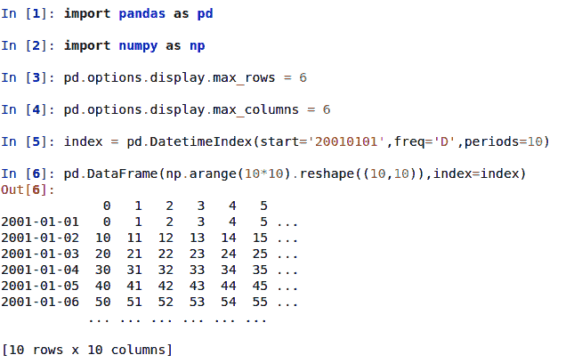
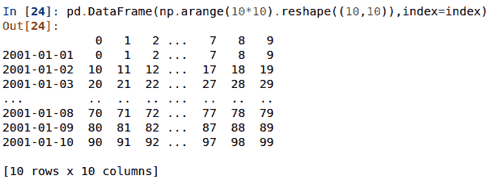

# 版本 0.14.0 (2014 年 5 月 31 日)

> 原文：[`pandas.pydata.org/docs/whatsnew/v0.14.0.html`](https://pandas.pydata.org/docs/whatsnew/v0.14.0.html)

这是从 0.13.1 的一个重大更新，包括少量 API 变更，以及一些新功能、增强和性能改进，还有大量的 bug 修复。我们建议所有用户升级到这个版本。

+   重点包括：

    +   正式支持 Python 3.4

    +   SQL 接口更新为使用 `sqlalchemy`，请参阅 这里。

    +   显示接口更改，请参阅 这里

    +   使用 Slicers 进行 MultiIndexing，请参阅 这里。

    +   能够将单索引 DataFrame 与 MultiIndexed DataFrame 进行连接，请参阅 这里

    +   分组结果更一致，分组规范更灵活，请参阅 这里

    +   `CustomBusinessDay` 现在支持假期日历，请参阅 这里

    +   绘图函数有几处改进，包括：hexbin、面积和饼图，请参阅 这里。

    +   I/O 操作的性能文档部分，请参阅 这里

+   其他增强

+   API 变更

+   文本解析 API 变更

+   分组 API 变更

+   性能改进

+   之前的弃用

+   弃用

+   已知问题

+   Bug 修复

警告

在 0.14.0 中，所有基于 `NDFrame` 的容器都经历了重大的内部重构。在此之前，每个均匀数据块都有自己的标签，需要额外注意以保持这些标签与父容器的标签同步。这不应该对用户/API 行为造成任何可见的变化 ([GH 6745](https://github.com/pandas-dev/pandas/issues/6745))

## API 变更

+   `read_excel` 使用 0 作为默认表格 ([GH 6573](https://github.com/pandas-dev/pandas/issues/6573))

+   `iloc` 现在会接受超出边界的索引器进行切片，例如超出被索引对象长度的值。这些将被排除在外。这将使 pandas 更符合 python/numpy 对超出边界值的索引方式。一个超出边界且减少对象维度的单索引器仍将引发 `IndexError` ([GH 6296](https://github.com/pandas-dev/pandas/issues/6296), [GH 6299](https://github.com/pandas-dev/pandas/issues/6299))。这可能导致轴为空 (例如返回一个空的 DataFrame)

    ```py
    In [1]: dfl = pd.DataFrame(np.random.randn(5, 2), columns=list('AB'))

    In [2]: dfl
    Out[2]: 
     A         B
    0  0.469112 -0.282863
    1 -1.509059 -1.135632
    2  1.212112 -0.173215
    3  0.119209 -1.044236
    4 -0.861849 -2.104569

    [5 rows x 2 columns]

    In [3]: dfl.iloc[:, 2:3]
    Out[3]: 
    Empty DataFrame
    Columns: []
    Index: [0, 1, 2, 3, 4]

    [5 rows x 0 columns]

    In [4]: dfl.iloc[:, 1:3]
    Out[4]: 
     B
    0 -0.282863
    1 -1.135632
    2 -0.173215
    3 -1.044236
    4 -2.104569

    [5 rows x 1 columns]

    In [5]: dfl.iloc[4:6]
    Out[5]: 
     A         B
    4 -0.861849 -2.104569

    [1 rows x 2 columns] 
    ```

    这些是超出边界的选择

    ```py
    >>> dfl.iloc[[4, 5, 6]]
    IndexError: positional indexers are out-of-bounds

    >>> dfl.iloc[:, 4]
    IndexError: single positional indexer is out-of-bounds 
    ```

+   使用负的起始、结束和步长值进行切片能更好地处理边界情况 ([GH 6531](https://github.com/pandas-dev/pandas/issues/6531))：

    +   `df.iloc[:-len(df)]` 现在为空

    +   `df.iloc[len(df)::-1]` 现在按逆序枚举所有元素

+   `DataFrame.interpolate()` 关键字 `downcast` 默认已从 `infer` 更改为 `None`。这是为了保留原始 dtype，除非显式请求否则不变（[GH 6290](https://github.com/pandas-dev/pandas/issues/6290)）。

+   将数据框转换为 HTML 时，它曾返回 `Empty DataFrame`。这种特殊情况已被移除，而是返回具有列名的标题（[GH 6062](https://github.com/pandas-dev/pandas/issues/6062)）。

+   现在 `Series` 和 `Index` 在内部共享更多的常见操作，例如 `factorize(),nunique(),value_counts()` 现在也支持在 `Index` 类型上。为了 API 一致性，已从 Series 中删除了 `Series.weekday` 属性。在 Series 上使用 `DatetimeIndex/PeriodIndex` 方法现在将引发 `TypeError`。（[GH 4551](https://github.com/pandas-dev/pandas/issues/4551), [GH 4056](https://github.com/pandas-dev/pandas/issues/4056), [GH 5519](https://github.com/pandas-dev/pandas/issues/5519), [GH 6380](https://github.com/pandas-dev/pandas/issues/6380), [GH 7206](https://github.com/pandas-dev/pandas/issues/7206)）。

+   为 `DateTimeIndex` / `Timestamp` 添加 `is_month_start`、`is_month_end`、`is_quarter_start`、`is_quarter_end`、`is_year_start`、`is_year_end` 访问器，返回一个布尔数组，指示时间戳是否在 `DateTimeIndex` / `Timestamp` 定义的月/季度/年的开始/结束处（[GH 4565](https://github.com/pandas-dev/pandas/issues/4565), [GH 6998](https://github.com/pandas-dev/pandas/issues/6998)）。

+   `pandas.eval()` / `DataFrame.eval()` / `DataFrame.query()` 中的局部变量使用方式已更改（[GH 5987](https://github.com/pandas-dev/pandas/issues/5987)）。对于 `DataFrame` 方法，有两个变化：

    +   现在列名称优先于局部变量。

    +   必须显式引用局部变量。这意味着即使你有一个不是列的局部变量，你仍然必须使用 `'@'` 前缀引用它。

    +   对于 `pandas` 中的表达式，如 `df.query('@a < a')`，不会因为名称 `a` 的歧义而导致投诉。

    +   顶层 `pandas.eval()` 函数不允许使用 `'@'` 前缀，并提供错误消息告诉您如此。

    +   `NameResolutionError` 已移除，因为不再需要。

+   定义并记录查询/计算中列名与索引名的顺序（[GH 6676](https://github.com/pandas-dev/pandas/issues/6676)）。

+   `concat`现在将使用 Series 名称或编号列来合并混合的 Series 和 DataFrames（[GH 2385](https://github.com/pandas-dev/pandas/issues/2385)）。请参阅文档

+   在`Index`类上进行切片、高级/布尔索引操作以及`Index.delete()`和`Index.drop()`方法将不再更改生成的索引的类型（[GH 6440](https://github.com/pandas-dev/pandas/issues/6440)、[GH 7040](https://github.com/pandas-dev/pandas/issues/7040)）

    ```py
    In [6]: i = pd.Index([1, 2, 3, 'a', 'b', 'c'])

    In [7]: i[[0, 1, 2]]
    Out[7]: Index([1, 2, 3], dtype='object')

    In [8]: i.drop(['a', 'b', 'c'])
    Out[8]: Index([1, 2, 3], dtype='object') 
    ```

    以前，上述操作会返回`Int64Index`。如果你想手动执行此操作，请使用`Index.astype()`

    ```py
    In [9]: i[[0, 1, 2]].astype(np.int_)
    Out[9]: Index([1, 2, 3], dtype='int64') 
    ```

+   `set_index`不再将 MultiIndexes 转换为元组的索引。例如，在这种情况下，旧行为返回一个索引（[GH 6459](https://github.com/pandas-dev/pandas/issues/6459)）：

    ```py
    # Old behavior, casted MultiIndex to an Index
    In [10]: tuple_ind
    Out[10]: Index([('a', 'c'), ('a', 'd'), ('b', 'c'), ('b', 'd')], dtype='object')

    In [11]: df_multi.set_index(tuple_ind)
    Out[11]: 
     0         1
    (a, c)  0.471435 -1.190976
    (a, d)  1.432707 -0.312652
    (b, c) -0.720589  0.887163
    (b, d)  0.859588 -0.636524

    [4 rows x 2 columns]

    # New behavior
    In [12]: mi
    Out[12]: 
    MultiIndex([('a', 'c'),
     ('a', 'd'),
     ('b', 'c'),
     ('b', 'd')],
     )

    In [13]: df_multi.set_index(mi)
    Out[13]: 
     0         1
    a c  0.471435 -1.190976
     d  1.432707 -0.312652
    b c -0.720589  0.887163
     d  0.859588 -0.636524

    [4 rows x 2 columns] 
    ```

    当向`set_index`传递多个索引时也适用：

    ```py
    # Old output, 2-level MultiIndex of tuples
    In [14]: df_multi.set_index([df_multi.index, df_multi.index])
    Out[14]: 
     0         1
    (a, c) (a, c)  0.471435 -1.190976
    (a, d) (a, d)  1.432707 -0.312652
    (b, c) (b, c) -0.720589  0.887163
    (b, d) (b, d)  0.859588 -0.636524

    [4 rows x 2 columns]

    # New output, 4-level MultiIndex
    In [15]: df_multi.set_index([df_multi.index, df_multi.index])
    Out[15]: 
     0         1
    a c a c  0.471435 -1.190976
     d a d  1.432707 -0.312652
    b c b c -0.720589  0.887163
     d b d  0.859588 -0.636524

    [4 rows x 2 columns] 
    ```

+   `pairwise`关键字已添加到统计时刻函数`rolling_cov`、`rolling_corr`、`ewmcov`、`ewmcorr`、`expanding_cov`、`expanding_corr`，以允许计算移动窗口协方差和相关矩阵（[GH 4950](https://github.com/pandas-dev/pandas/issues/4950)）。请参阅计算滚动成对协方差和相关性文档。

    ```py
    In [1]: df = pd.DataFrame(np.random.randn(10, 4), columns=list('ABCD'))

    In [4]: covs = pd.rolling_cov(df[['A', 'B', 'C']],
     ....:                       df[['B', 'C', 'D']],
     ....:                       5,
     ....:                       pairwise=True)

    In [5]: covs[df.index[-1]]
    Out[5]:
     B         C         D
    A  0.035310  0.326593 -0.505430
    B  0.137748 -0.006888 -0.005383
    C -0.006888  0.861040  0.020762 
    ```

+   `Series.iteritems()`现在是惰性的（返回一个迭代器而不是列表）。这是 0.14 之前的文档化行为。([GH 6760](https://github.com/pandas-dev/pandas/issues/6760))

+   添加`Index`的`nunique`和`value_counts`函数以计算唯一元素。([GH 6734](https://github.com/pandas-dev/pandas/issues/6734))

+   当`level`关键字引用`Index`中的非唯一项时，`stack`和`unstack`现在会引发`ValueError`（先前引发`KeyError`）。([GH 6738](https://github.com/pandas-dev/pandas/issues/6738))

+   从`Series.sort`中删除未使用的 order 参数；现在参数与`Series.order`的顺序相同；添加`na_position`参数以符合`Series.order`（[GH 6847](https://github.com/pandas-dev/pandas/issues/6847)）

+   `Series.order`的默认排序算法现在是`quicksort`，以符合`Series.sort`（和 numpy 的默认值）

+   添加`inplace`关键字到`Series.order/sort`，使它们成为反函数（[GH 6859](https://github.com/pandas-dev/pandas/issues/6859)）

+   `DataFrame.sort`现在根据`na_position`参数将 NaN 放在排序的开头或末尾。([GH 3917](https://github.com/pandas-dev/pandas/issues/3917))

+   在`concat`中接受`TextFileReader`，这影响了一个常见的用户习惯（[GH 6583](https://github.com/pandas-dev/pandas/issues/6583)），这是从 0.13.1 开始的一个回归问题。

+   在 `Index` 和 `Series` 中添加了 `factorize` 函数以获取索引器和唯一值 ([GH 7090](https://github.com/pandas-dev/pandas/issues/7090))

+   DataFrame 中的 `describe` 如果包含了时间戳和字符串类型的混合对象，则返回不同的索引 ([GH 7088](https://github.com/pandas-dev/pandas/issues/7088))。之前索引意外地被排序。

+   仅包含 `bool` 数据类型的算术操作现在会发出警告，指示它们在 `+`、`-` 和 `*` 操作中是在 Python 空间中评估的，并且对所有其他操作进行报错 ([GH 7011](https://github.com/pandas-dev/pandas/issues/7011), [GH 6762](https://github.com/pandas-dev/pandas/issues/6762), [GH 7015](https://github.com/pandas-dev/pandas/issues/7015), [GH 7210](https://github.com/pandas-dev/pandas/issues/7210))

    ```py
    >>> x = pd.Series(np.random.rand(10) > 0.5)
    >>> y = True
    >>> x + y  # warning generated: should do x | y instead
    UserWarning: evaluating in Python space because the '+' operator is not
    supported by numexpr for the bool dtype, use '|' instead
    >>> x / y  # this raises because it doesn't make sense
    NotImplementedError: operator '/' not implemented for bool dtypes 
    ```

+   在 `HDFStore` 中，当找不到键或选择器时，`select_as_multiple` 将始终引发 `KeyError` ([GH 6177](https://github.com/pandas-dev/pandas/issues/6177))

+   `df['col'] = value` 和 `df.loc[:,'col'] = value` 现在完全等价；之前 `.loc` 不一定会强制转换结果 series 的数据类型 ([GH 6149](https://github.com/pandas-dev/pandas/issues/6149))

+   `dtypes` 和 `ftypes` 现在在空容器上返回具有 `dtype=object` 的 series ([GH 5740](https://github.com/pandas-dev/pandas/issues/5740))

+   如果未提供目标路径或缓冲区，则 `df.to_csv` 现在将返回 CSV 数据的字符串 ([GH 6061](https://github.com/pandas-dev/pandas/issues/6061))

+   `pd.infer_freq()` 现在如果给定了无效的 `Series/Index` 类型，会抛出 `TypeError` 异常 ([GH 6407](https://github.com/pandas-dev/pandas/issues/6407), [GH 6463](https://github.com/pandas-dev/pandas/issues/6463))

+   传递给 `DataFame.sort_index` 的元组将被解释为索引的级别，而不需要一个元组列表 ([GH 4370](https://github.com/pandas-dev/pandas/issues/4370))

+   所有偏移量操作现在返回 `Timestamp` 类型（而不是 datetime），Business/Week 频率之前不正确 ([GH 4069](https://github.com/pandas-dev/pandas/issues/4069))

+   `to_excel` 现在将 `np.inf` 转换为字符串表示形式，可以通过 `inf_rep` 关键字参数自定义（Excel 没有原生的 inf 表示） ([GH 6782](https://github.com/pandas-dev/pandas/issues/6782))

+   将 `pandas.compat.scipy.scoreatpercentile` 替换为 `numpy.percentile` ([GH 6810](https://github.com/pandas-dev/pandas/issues/6810))

+   `datetime[ns]` series 上的 `.quantile` 现在返回 `Timestamp` 而不是 `np.datetime64` 对象 ([GH 6810](https://github.com/pandas-dev/pandas/issues/6810))

+   将无效类型传递给 `concat` 时，将 `AssertionError` 更改为 `TypeError` ([GH 6583](https://github.com/pandas-dev/pandas/issues/6583))

+   当 `DataFrame` 的 `data` 参数传递了迭代器时，抛出 `TypeError` 异常 ([GH 5357](https://github.com/pandas-dev/pandas/issues/5357))  ## 显示更改

+   大型数据框的默认打印方式已更改。超过 `max_rows` 和/或 `max_columns` 的数据框现在以居中截断的视图显示，与 `pandas.Series` 的打印方式一致（[GH 5603](https://github.com/pandas-dev/pandas/issues/5603)）。

    在以前的版本中，一旦达到维度约束，数据框就会被截断，并且省略号（…）表示部分数据被截断。

    

    在当前版本中，大型数据框会被居中截断，展示头部和尾部的预览。

    

+   允许在 `display.show_dimensions` 中使用 `'truncate'` 选项，只有在数据框被截断时才显示维度（[GH 6547](https://github.com/pandas-dev/pandas/issues/6547)）。

    `display.show_dimensions` 的默认值现在将是 `truncate`。这与 Series 的显示长度一致。

    ```py
    In [16]: dfd = pd.DataFrame(np.arange(25).reshape(-1, 5),
     ....:                   index=[0, 1, 2, 3, 4],
     ....:                   columns=[0, 1, 2, 3, 4])
     ....: 

    # show dimensions since this is truncated
    In [17]: with pd.option_context('display.max_rows', 2, 'display.max_columns', 2,
     ....:                       'display.show_dimensions', 'truncate'):
     ....:    print(dfd)
     ....: 
     0  ...   4
    0    0  ...   4
    ..  ..  ...  ..
    4   20  ...  24

    [5 rows x 5 columns]

    # will not show dimensions since it is not truncated
    In [18]: with pd.option_context('display.max_rows', 10, 'display.max_columns', 40,
     ....:                       'display.show_dimensions', 'truncate'):
     ....:    print(dfd)
     ....: 
     0   1   2   3   4
    0   0   1   2   3   4
    1   5   6   7   8   9
    2  10  11  12  13  14
    3  15  16  17  18  19
    4  20  21  22  23  24 
    ```

+   当 `display.max_rows` 小于系列长度时，多重索引系列的显示存在回归问题（[GH 7101](https://github.com/pandas-dev/pandas/issues/7101)）。

+   修复了截断的 Series 或 DataFrame 的 HTML 表示中不显示类名的 bug，当 `large_repr` 设置为 'info' 时（[GH 7105](https://github.com/pandas-dev/pandas/issues/7105))

+   `DataFrame.info()` 中的 `verbose` 关键字现在默认为 `None`，控制是否缩短 `info` 表示。这将遵循 `display.max_info_columns` 的全局设置。全局设置可以通过 `verbose=True` 或 `verbose=False` 进行覆盖。

+   修复了 `info` 表示不遵守 `display.max_info_columns` 设置的 bug（[GH 6939](https://github.com/pandas-dev/pandas/issues/6939)）

+   时间戳的 Offset/freq 信息现在在 Timestamp 的 __repr__ 中显示（[GH 4553](https://github.com/pandas-dev/pandas/issues/4553)）  ## 文本解析 API 更改

`read_csv()`/`read_table()` 现在对于无效选项会���加吵闹，而不是回退到 `PythonParser`。

+   当在 `read_csv()`/`read_table()` 中指定 `delim_whitespace=True` 时，如果同时指定了 `sep`，则会引发 `ValueError` 错误（[GH 6607](https://github.com/pandas-dev/pandas/issues/6607)）。

+   当在 `read_csv()`/`read_table()` 中指定 `engine='c'` 时，如果使用不支持的选项，则会引发 `ValueError` 错误（[GH 6607](https://github.com/pandas-dev/pandas/issues/6607)）。

+   当回退到 Python 解析器导致选项被忽略时，引发 `ValueError` ([GH 6607](https://github.com/pandas-dev/pandas/issues/6607))

+   当回退到 Python 解析器时，如果没有选项被忽略，则产生 `ParserWarning` ([GH 6607](https://github.com/pandas-dev/pandas/issues/6607))

+   如果没有指定其他不受 C 支持的选项，则将 `sep='\s+'` 翻译为 `delim_whitespace=True` 在 `read_csv()`/`read_table()` 中（如果没有其他 C-unsupported 选项指定） ([GH 6607](https://github.com/pandas-dev/pandas/issues/6607))  ## GroupBy API 变更

一些 `groupby` 方法的更一致行为：

+   `head` 和 `tail` 的 `groupby` 现在更像是 `filter` 而不是聚合：

    ```py
    In [1]: df = pd.DataFrame([[1, 2], [1, 4], [5, 6]], columns=['A', 'B'])

    In [2]: g = df.groupby('A')

    In [3]: g.head(1)  # filters DataFrame
    Out[3]:
     A  B
    0  1  2
    2  5  6

    In [4]: g.apply(lambda x: x.head(1))  # used to simply fall-through
    Out[4]:
     A  B
    A
    1 0  1  2
    5 2  5  6 
    ```

+   `head` 和 `tail` 尊重列选择：

    ```py
    In [19]: g[['B']].head(1)
    Out[19]:
     B
    0  2
    2  6

    [2 rows x 1 columns] 
    ```

+   `nth` 的 `groupby` 现在默认减少；通过传递 `as_index=False` 可以实现过滤。通过可选的 `dropna` 参数来忽略 NaN。请参阅文档

    减少

    ```py
    In [19]: df = pd.DataFrame([[1, np.nan], [1, 4], [5, 6]], columns=['A', 'B'])

    In [20]: g = df.groupby('A')

    In [21]: g.nth(0)
    Out[21]: 
     A    B
    0  1  NaN
    2  5  6.0

    [2 rows x 2 columns]

    # this is equivalent to g.first()
    In [22]: g.nth(0, dropna='any')
    Out[22]: 
     A    B
    1  1  4.0
    2  5  6.0

    [2 rows x 2 columns]

    # this is equivalent to g.last()
    In [23]: g.nth(-1, dropna='any')
    Out[23]: 
     A    B
    1  1  4.0
    2  5  6.0

    [2 rows x 2 columns] 
    ```

    过滤

    ```py
    In [24]: gf = df.groupby('A', as_index=False)

    In [25]: gf.nth(0)
    Out[25]: 
     A    B
    0  1  NaN
    2  5  6.0

    [2 rows x 2 columns]

    In [26]: gf.nth(0, dropna='any')
    Out[26]: 
     A    B
    1  1  4.0
    2  5  6.0

    [2 rows x 2 columns] 
    ```

+   对于非 Cython 函数，`groupby` 现在不会返回分组列 ([GH 5610](https://github.com/pandas-dev/pandas/issues/5610), [GH 5614](https://github.com/pandas-dev/pandas/issues/5614), [GH 6732](https://github.com/pandas-dev/pandas/issues/6732))，因为它已经是索引

    ```py
    In [27]: df = pd.DataFrame([[1, np.nan], [1, 4], [5, 6], [5, 8]], columns=['A', 'B'])

    In [28]: g = df.groupby('A')

    In [29]: g.count()
    Out[29]: 
     B
    A 
    1  1
    5  2

    [2 rows x 1 columns]

    In [30]: g.describe()
    Out[30]: 
     B 
     count mean       std  min  25%  50%  75%  max
    A 
    1   1.0  4.0       NaN  4.0  4.0  4.0  4.0  4.0
    5   2.0  7.0  1.414214  6.0  6.5  7.0  7.5  8.0

    [2 rows x 8 columns] 
    ```

+   传递 `as_index` 将保留分组列不变（这在 0.14.0 中没有变化）

    ```py
    In [31]: df = pd.DataFrame([[1, np.nan], [1, 4], [5, 6], [5, 8]], columns=['A', 'B'])

    In [32]: g = df.groupby('A', as_index=False)

    In [33]: g.count()
    Out[33]: 
     A  B
    0  1  1
    1  5  2

    [2 rows x 2 columns]

    In [34]: g.describe()
    Out[34]: 
     A     B 
     count mean       std  min  25%  50%  75%  max
    0  1   1.0  4.0       NaN  4.0  4.0  4.0  4.0  4.0
    1  5   2.0  7.0  1.414214  6.0  6.5  7.0  7.5  8.0

    [2 rows x 9 columns] 
    ```

+   通过 `pd.Grouper` 允许更复杂的 `groupby` 规范，例如同时按时间和字符串字段分组。请参阅文档 ([GH 3794](https://github.com/pandas-dev/pandas/issues/3794))

+   在执行 `groupby` 操作时更好地传播/保留系列名称：

    +   `SeriesGroupBy.agg` 将确保原始系列的名称属性传播到结果中 ([GH 6265](https://github.com/pandas-dev/pandas/issues/6265))

    +   如果提供给 `GroupBy.apply` 的函数返回一个命名系列，那么该系列的名称将保留为 `GroupBy.apply` 返回的 DataFrame 的列索引的名称 ([GH 6124](https://github.com/pandas-dev/pandas/issues/6124))。这有助于 `DataFrame.stack` 操作，其中列索引的名称被用作包含透视数据的插入列的名称。  ## SQL

现在通过 SQLAlchemy 支持更多数据库风格的 SQL 读写函数 ([GH 2717](https://github.com/pandas-dev/pandas/issues/2717), [GH 4163](https://github.com/pandas-dev/pandas/issues/4163), [GH 5950](https://github.com/pandas-dev/pandas/issues/5950), [GH 6292](https://github.com/pandas-dev/pandas/issues/6292))。所有由 SQLAlchemy 支持的数据库都可以使用，例如 PostgreSQL、MySQL、Oracle、Microsoft SQL Server（请参阅 SQLAlchemy 文档中关于[包含方言](https://sqlalchemy.readthedocs.io/en/latest/dialects/index.html)的说明）。

未来只支持为 sqlite3 提供 DBAPI 连接对象。`'mysql'` flavor 已被弃用。

引入了新函数 `read_sql_query()` 和 `read_sql_table()`。函数 `read_sql()` 仍然作为对其他两个函数的便捷包装，并根据提供的输入（数据库表名或 SQL 查询）委派到特定函数。

实际上，你需要为 SQL 函数提供一个 SQLAlchemy `engine`。要与 SQLAlchemy 连接，你可以使用 `create_engine()` 函数从数据库 URI 创建一个 engine 对象。每个要连接的数据库只需要创建一次 engine。对于内存中的 sqlite 数据库：

```py
In [35]: from sqlalchemy import create_engine

# Create your connection.
In [36]: engine = create_engine('sqlite:///:memory:') 
```

然后可以使用这个 `engine` 来向数据库写入或读取数据：

```py
In [37]: df = pd.DataFrame({'A': [1, 2, 3], 'B': ['a', 'b', 'c']})

In [38]: df.to_sql(name='db_table', con=engine, index=False)
Out[38]: 3 
```

通过指定表名，你可以从数据库中读取数据：

```py
In [39]: pd.read_sql_table('db_table', engine)
Out[39]: 
 A  B
0  1  a
1  2  b
2  3  c

[3 rows x 2 columns] 
```

或通过指定一个 SQL 查询：

```py
In [40]: pd.read_sql_query('SELECT * FROM db_table', engine)
Out[40]: 
 A  B
0  1  a
1  2  b
2  3  c

[3 rows x 2 columns] 
```

SQL 函数的一些其他增强功能包括：

+   支持写入索引。这可以通过 `index` 关键字来控制（默认为 True）。

+   使用 `index_label` 指定写入索引时要使用的列标签。

+   在 `read_sql_query()` 和 `read_sql_table()` 中使用 `parse_dates` 关键字指定要解析为日期时间的字符串列。

警告

一些现有函数或函数别名已被弃用，并将在未来版本中删除。这包括：`tquery`、`uquery`、`read_frame`、`frame_query`、`write_frame`。

警告

当使用 DBAPI 连接对象时，对 ‘mysql’ flavor 的支持已经被弃用。将进一步通过 SQLAlchemy engines 支持 MySQL（[GH 6900](https://github.com/pandas-dev/pandas/issues/6900)）。

在 0.14.0 中，我们添加了一种新的方式来对 MultiIndexed 对象进行切片。你可以通过提供多个索引器来对 MultiIndex 进行切片。

你可以像通过标签索引一样提供任何选择器，参见按标签选择，包括切片、标签列表、标签和布尔索引器。

你可以使用 `slice(None)` 来选择 *该* 级别的所有内容。你不需要指定所有 *更深层次* 的级别，它们将被暗示为 `slice(None)`。

与往常一样，由于这是标签索引，切片器的 **两侧** 都包含在内。

查看文档，另请参阅问题（[GH 6134](https://github.com/pandas-dev/pandas/issues/6134)，[GH 4036](https://github.com/pandas-dev/pandas/issues/4036)，[GH 3057](https://github.com/pandas-dev/pandas/issues/3057)，[GH 2598](https://github.com/pandas-dev/pandas/issues/2598)，[GH 5641](https://github.com/pandas-dev/pandas/issues/5641)，[GH 7106](https://github.com/pandas-dev/pandas/issues/7106)）。

警告

> 你应该在`.loc`的指定器中指定所有轴，即**索引**和**列**的索引器。在一些模棱两可的情况下，传递的索引器可能被误解为同时索引*两个*轴，而不是例如行的 MultiIndex。
> 
> 你应该这样做：

```py
 >>> df.loc[(slice('A1', 'A3'), ...), :]  # noqa: E901

rather than this: 
```

```py
>>> df.loc[(slice('A1', 'A3'), ...)]  # noqa: E901 
```

警告

你需要确保选择轴完全按字典顺序排列！

```py
In [41]: def mklbl(prefix, n):
 ....:    return ["%s%s" % (prefix, i) for i in range(n)]
 ....: 

In [42]: index = pd.MultiIndex.from_product([mklbl('A', 4),
 ....:                                    mklbl('B', 2),
 ....:                                    mklbl('C', 4),
 ....:                                    mklbl('D', 2)])
 ....: 

In [43]: columns = pd.MultiIndex.from_tuples([('a', 'foo'), ('a', 'bar'),
 ....:                                     ('b', 'foo'), ('b', 'bah')],
 ....:                                    names=['lvl0', 'lvl1'])
 ....: 

In [44]: df = pd.DataFrame(np.arange(len(index) * len(columns)).reshape((len(index),
 ....:                  len(columns))),
 ....:                  index=index,
 ....:                  columns=columns).sort_index().sort_index(axis=1)
 ....: 

In [45]: df
Out[45]: 
lvl0           a         b 
lvl1         bar  foo  bah  foo
A0 B0 C0 D0    1    0    3    2
 D1    5    4    7    6
 C1 D0    9    8   11   10
 D1   13   12   15   14
 C2 D0   17   16   19   18
...          ...  ...  ...  ...
A3 B1 C1 D1  237  236  239  238
 C2 D0  241  240  243  242
 D1  245  244  247  246
 C3 D0  249  248  251  250
 D1  253  252  255  254

[64 rows x 4 columns] 
```

使用切片、列表和标签进行基本的多重索引切片。

```py
In [46]: df.loc[(slice('A1', 'A3'), slice(None), ['C1', 'C3']), :]
Out[46]: 
lvl0           a         b 
lvl1         bar  foo  bah  foo
A1 B0 C1 D0   73   72   75   74
 D1   77   76   79   78
 C3 D0   89   88   91   90
 D1   93   92   95   94
 B1 C1 D0  105  104  107  106
...          ...  ...  ...  ...
A3 B0 C3 D1  221  220  223  222
 B1 C1 D0  233  232  235  234
 D1  237  236  239  238
 C3 D0  249  248  251  250
 D1  253  252  255  254

[24 rows x 4 columns] 
```

你可以使用`pd.IndexSlice`来快速创建这些切片

```py
In [47]: idx = pd.IndexSlice

In [48]: df.loc[idx[:, :, ['C1', 'C3']], idx[:, 'foo']]
Out[48]: 
lvl0           a    b
lvl1         foo  foo
A0 B0 C1 D0    8   10
 D1   12   14
 C3 D0   24   26
 D1   28   30
 B1 C1 D0   40   42
...          ...  ...
A3 B0 C3 D1  220  222
 B1 C1 D0  232  234
 D1  236  238
 C3 D0  248  250
 D1  252  254

[32 rows x 2 columns] 
```

使用这种方法可以在多个轴上同时执行相当复杂的选择操作。

```py
In [49]: df.loc['A1', (slice(None), 'foo')]
Out[49]: 
lvl0        a    b
lvl1      foo  foo
B0 C0 D0   64   66
 D1   68   70
 C1 D0   72   74
 D1   76   78
 C2 D0   80   82
...       ...  ...
B1 C1 D1  108  110
 C2 D0  112  114
 D1  116  118
 C3 D0  120  122
 D1  124  126

[16 rows x 2 columns]

In [50]: df.loc[idx[:, :, ['C1', 'C3']], idx[:, 'foo']]
Out[50]: 
lvl0           a    b
lvl1         foo  foo
A0 B0 C1 D0    8   10
 D1   12   14
 C3 D0   24   26
 D1   28   30
 B1 C1 D0   40   42
...          ...  ...
A3 B0 C3 D1  220  222
 B1 C1 D0  232  234
 D1  236  238
 C3 D0  248  250
 D1  252  254

[32 rows x 2 columns] 
```

使用布尔索引器可以提供与*值*相关的选择。

```py
In [51]: mask = df[('a', 'foo')] > 200

In [52]: df.loc[idx[mask, :, ['C1', 'C3']], idx[:, 'foo']]
Out[52]: 
lvl0           a    b
lvl1         foo  foo
A3 B0 C1 D1  204  206
 C3 D0  216  218
 D1  220  222
 B1 C1 D0  232  234
 D1  236  238
 C3 D0  248  250
 D1  252  254

[7 rows x 2 columns] 
```

你还可以指定`.loc`的`axis`参数，以在单个轴上解释传递的切片。

```py
In [53]: df.loc(axis=0)[:, :, ['C1', 'C3']]
Out[53]: 
lvl0           a         b 
lvl1         bar  foo  bah  foo
A0 B0 C1 D0    9    8   11   10
 D1   13   12   15   14
 C3 D0   25   24   27   26
 D1   29   28   31   30
 B1 C1 D0   41   40   43   42
...          ...  ...  ...  ...
A3 B0 C3 D1  221  220  223  222
 B1 C1 D0  233  232  235  234
 D1  237  236  239  238
 C3 D0  249  248  251  250
 D1  253  252  255  254

[32 rows x 4 columns] 
```

此外，你可以使用这些方法*设置*值。

```py
In [54]: df2 = df.copy()

In [55]: df2.loc(axis=0)[:, :, ['C1', 'C3']] = -10

In [56]: df2
Out[56]: 
lvl0           a         b 
lvl1         bar  foo  bah  foo
A0 B0 C0 D0    1    0    3    2
 D1    5    4    7    6
 C1 D0  -10  -10  -10  -10
 D1  -10  -10  -10  -10
 C2 D0   17   16   19   18
...          ...  ...  ...  ...
A3 B1 C1 D1  -10  -10  -10  -10
 C2 D0  241  240  243  242
 D1  245  244  247  246
 C3 D0  -10  -10  -10  -10
 D1  -10  -10  -10  -10

[64 rows x 4 columns] 
```

你也可以使用可对齐对象的右侧。

```py
In [57]: df2 = df.copy()

In [58]: df2.loc[idx[:, :, ['C1', 'C3']], :] = df2 * 1000

In [59]: df2
Out[59]: 
lvl0              a               b 
lvl1            bar     foo     bah     foo
A0 B0 C0 D0       1       0       3       2
 D1       5       4       7       6
 C1 D0    9000    8000   11000   10000
 D1   13000   12000   15000   14000
 C2 D0      17      16      19      18
...             ...     ...     ...     ...
A3 B1 C1 D1  237000  236000  239000  238000
 C2 D0     241     240     243     242
 D1     245     244     247     246
 C3 D0  249000  248000  251000  250000
 D1  253000  252000  255000  254000

[64 rows x 4 columns] 
```  ## 绘图

+   从`DataFrame.plot`绘制六边形二进制图，使用`kind='hexbin'`（[GH 5478](https://github.com/pandas-dev/pandas/issues/5478)，查看文档）。

+   `DataFrame.plot`和`Series.plot`现在支持使用`kind='area'`指定面积图，查看文档。

+   从`Series.plot`和`DataFrame.plot`绘制饼图，使用`kind='pie'`（[GH 6976](https://github.com/pandas-dev/pandas/issues/6976)），查看文档。

+   现在在`DataFrame`和`Series`对象的`.plot`方法中支持带有误差条的绘图（[GH 3796](https://github.com/pandas-dev/pandas/issues/3796)，[GH 6834](https://github.com/pandas-dev/pandas/issues/6834)，查看文档）。

+   `DataFrame.plot`和`Series.plot`现在支持`table`关键字用于绘制`matplotlib.Table`，查看文档。`table`关键字可以接收以下值。

    +   `False`：什么也不做（默认）。

    +   `True`：使用`DataFrame`或`Series`的`plot`方法绘制表格。数据将被转置以符合 matplotlib 的默认布局。

    +   `DataFrame`或`Series`：使用传递的数据绘制 matplotlib.table。数据将按照打印方法中显示的方式绘制（不会自动转置）。此外，添加了辅助函数`pandas.tools.plotting.table`来从`DataFrame`和`Series`创建表格，并将其添加到`matplotlib.Axes`中。

+   `plot(legend='reverse')`现在将反转大多数图例标签的顺序。 ([GH 6014](https://github.com/pandas-dev/pandas/issues/6014))

+   折线图和面积图可以通过`stacked=True`叠加（[GH 6656](https://github.com/pandas-dev/pandas/issues/6656)）

+   对于`kind='bar'`和`kind='barh'`的`DataFrame.plot()`，现在接受以下关键字：

    +   `width`: 指定柱的宽度。在以前的版本中，静态值`0.5`被传递给 matplotlib，无法被覆盖。([GH 6604](https://github.com/pandas-dev/pandas/issues/6604))

    +   `align`: 指定柱的对齐方式。默认为`center`（与 matplotlib 不同）。在以前的版本中，pandas 传递`align='edge'`给 matplotlib，并且自己调整位置为`center`，结果`align`关键字未按预期应用。 ([GH 4525](https://github.com/pandas-dev/pandas/issues/4525))

    +   `position`: 指定柱状图布局的相对对齐方式。从 0（左/底部）到 1（右/顶部）。默认值为 0.5（中心）。([GH 6604](https://github.com/pandas-dev/pandas/issues/6604))

    由于默认的`align`值变化，柱状图的坐标现在位于整数值上（0.0、1.0、2.0……）。这意在使柱状图位于与折线图相同的坐标上。然而，当您手动调整柱的位置或绘图区域时，例如使用`set_xlim`、`set_ylim`等时，柱状图可能会出现意外的差异。在这种情况下，请修改您的脚本以满足新坐标的要求。

+   `parallel_coordinates()`函数现在使用`color`参数而不是`colors`。引发`FutureWarning`以警告即将在未来的版本中不再支持旧的`colors`参数。 ([GH 6956](https://github.com/pandas-dev/pandas/issues/6956))

+   `parallel_coordinates()`和`andrews_curves()`函数现在使用位置参数`frame`而不是`data`。如果使用了旧的`data`参数名称，则会引发`FutureWarning`。([GH 6956](https://github.com/pandas-dev/pandas/issues/6956))

+   `DataFrame.boxplot()`现在支持`layout`关键字 ([GH 6769](https://github.com/pandas-dev/pandas/issues/6769))

+   `DataFrame.boxplot()`有一个新的关键字参数，`return_type`。它接受`'dict'`、`'axes'`或`'both'`，在这种情况下，返回带有 matplotlib 轴和 matplotlib Lines 字典的命名元组。## 先前版本的弃用/更改

自 0.14.0 起，已经生效的先前版本的弃用。

+   删除`DateRange`，改用`DatetimeIndex` ([GH 6816](https://github.com/pandas-dev/pandas/issues/6816))

+   从 `DataFrame.sort` 中移除 `column` 关键字（[GH 4370](https://github.com/pandas-dev/pandas/issues/4370)）

+   从 `set_eng_float_format()` 中移除 `precision` 关键字（[GH 395](https://github.com/pandas-dev/pandas/issues/395)）

+   从 `DataFrame.to_string()`、`DataFrame.to_latex()` 和 `DataFrame.to_html()` 中移除 `force_unicode` 关键字；这些函数默认使用 unicode 进行编码（[GH 2224](https://github.com/pandas-dev/pandas/issues/2224)，[GH 2225](https://github.com/pandas-dev/pandas/issues/2225)）

+   从 `DataFrame.to_csv()` 和 `DataFrame.to_string()` 中移除 `nanRep` 关键字（[GH 275](https://github.com/pandas-dev/pandas/issues/275)）

+   从 `HDFStore.select_column()` 中移除 `unique` 关键字（[GH 3256](https://github.com/pandas-dev/pandas/issues/3256)）

+   从 `Timestamp.offset()` 中移除 `inferTimeRule` 关键字（[GH 391](https://github.com/pandas-dev/pandas/issues/391)）

+   从 `get_data_yahoo()` 和 `get_data_google()` 中移除 `name` 关键字（[commit b921d1a](https://github.com/pandas-dev/pandas/commit/b921d1a2)）

+   从 `DatetimeIndex` 构造函数中移除 `offset` 关键字（[commit 3136390](https://github.com/pandas-dev/pandas/commit/3136390)）

+   从多个滚动时刻统计函数中移除 `time_rule`，例如 `rolling_sum()`（[GH 1042](https://github.com/pandas-dev/pandas/issues/1042)）

+   在 numpy 数组中，删除负数 `-` 的布尔操作，改用 `~`，因为这将在 numpy 1.9 中被弃用（[GH 6960](https://github.com/pandas-dev/pandas/issues/6960)）  ## 弃用

+   `pivot_table()`/`DataFrame.pivot_table()` 和 `crosstab()` 函数现在接受 `index` 和 `columns` 参数，而不是 `rows` 和 `cols`。会发出 `FutureWarning` 来警告将来版本中不再支持旧的 `rows` 和 `cols` 参数（[GH 5505](https://github.com/pandas-dev/pandas/issues/5505)）

+   `DataFrame.drop_duplicates()` 和 `DataFrame.duplicated()` 方法现在使用参数 `subset` 而不是 `cols`，以更好地与 `DataFrame.dropna()` 对齐。将引发 `FutureWarning`，以警示旧的 `cols` 参数将在未来版本中不再支持。([GH 6680](https://github.com/pandas-dev/pandas/issues/6680))

+   `DataFrame.to_csv()` 和 `DataFrame.to_excel()` 函数现在使用参数 `columns` 而不是 `cols`。将引发 `FutureWarning`，以警示旧的 `cols` 参数将在未来版本中不再支持。([GH 6645](https://github.com/pandas-dev/pandas/issues/6645))

+   当使用标量索引器和非浮点索引时，索引器将发出 `FutureWarning` 警告。([GH 4892](https://github.com/pandas-dev/pandas/issues/4892), [GH 6960](https://github.com/pandas-dev/pandas/issues/6960))

    ```py
    # non-floating point indexes can only be indexed by integers / labels
    In [1]: pd.Series(1, np.arange(5))[3.0]
     pandas/core/index.py:469: FutureWarning: scalar indexers for index type Int64Index should be integers and not floating point
    Out[1]: 1

    In [2]: pd.Series(1, np.arange(5)).iloc[3.0]
     pandas/core/index.py:469: FutureWarning: scalar indexers for index type Int64Index should be integers and not floating point
    Out[2]: 1

    In [3]: pd.Series(1, np.arange(5)).iloc[3.0:4]
     pandas/core/index.py:527: FutureWarning: slice indexers when using iloc should be integers and not floating point
    Out[3]:
     3    1
     dtype: int64

    # these are Float64Indexes, so integer or floating point is acceptable
    In [4]: pd.Series(1, np.arange(5.))[3]
    Out[4]: 1

    In [5]: pd.Series(1, np.arange(5.))[3.0]
    Out[6]: 1 
    ```

+   Numpy 1.9 兼容性关于弃用警告的问题 ([GH 6960](https://github.com/pandas-dev/pandas/issues/6960))

+   `Panel.shift()` 现在具有与 `DataFrame.shift()` 相匹配的函数签名。旧的位置参数 `lags` 已更改为关键字参数 `periods`，默认值为 1。如果使用旧参数 `lags`，将引发 `FutureWarning`。([GH 6910](https://github.com/pandas-dev/pandas/issues/6910))

+   `factorize()` 的 `order` 关键字参数将被移除。([GH 6926](https://github.com/pandas-dev/pandas/issues/6926)).

+   从 `DataFrame.xs()`、`Panel.major_xs()`、`Panel.minor_xs()` 中删除 `copy` 关键字。如果可能，将返回视图，否则将进行复制。以前用户可能会认为 `copy=False` 总是返回视图。([GH 6894](https://github.com/pandas-dev/pandas/issues/6894))

+   `parallel_coordinates()` 函数现在使用参数 `color` 而不是 `colors`。将引发 `FutureWarning`，以警示旧的 `colors` 参数将在未来版本中不再支持。([GH 6956](https://github.com/pandas-dev/pandas/issues/6956))

+   `parallel_coordinates()` 和 `andrews_curves()` 函数现在使用位置参数 `frame` 而不是 `data`。如果使用旧的 `data` 参数，将引发 `FutureWarning`。([GH 6956](https://github.com/pandas-dev/pandas/issues/6956))

+   使用 DBAPI 连接对象时 ‘mysql’ 风格的支持已被弃用。MySQL 将通过 SQLAlchemy 引擎进一步支持。([GH 6900](https://github.com/pandas-dev/pandas/issues/6900)).

+   下列 `io.sql` 函数已弃用：`tquery`、`uquery`、`read_frame`、`frame_query`、`write_frame`。

+   `describe()` 中的 `percentile_width` 关键字参数已弃用。请改用 `percentiles` 关键字，该关键字接受要显示的百分位数列表。默认输出未更改。

+   `boxplot()` 的默认返回类型将在未来版本中从字典更改为 matplotlib Axes。您可以通过将 `return_type='axes'` 传递给 boxplot 来立即使用未来的行为。##已知问题

+   OpenPyXL 2.0.0 破坏了向后兼容性 ([GH 7169](https://github.com/pandas-dev/pandas/issues/7169))  ##增强功能

+   如果传递了元组字典，DataFrame 和 Series 将创建一个 MultiIndex 对象，请参阅文档（[GH 3323](https://github.com/pandas-dev/pandas/issues/3323))

    ```py
    In [60]: pd.Series({('a', 'b'): 1, ('a', 'a'): 0,
     ....:           ('a', 'c'): 2, ('b', 'a'): 3, ('b', 'b'): 4})
     ....: 
    Out[60]: 
    a  b    1
     a    0
     c    2
    b  a    3
     b    4
    Length: 5, dtype: int64

    In [61]: pd.DataFrame({('a', 'b'): {('A', 'B'): 1, ('A', 'C'): 2},
     ....:             ('a', 'a'): {('A', 'C'): 3, ('A', 'B'): 4},
     ....:             ('a', 'c'): {('A', 'B'): 5, ('A', 'C'): 6},
     ....:             ('b', 'a'): {('A', 'C'): 7, ('A', 'B'): 8},
     ....:             ('b', 'b'): {('A', 'D'): 9, ('A', 'B'): 10}})
     ....: 
    Out[61]: 
     a              b 
     b    a    c    a     b
    A B  1.0  4.0  5.0  8.0  10.0
     C  2.0  3.0  6.0  7.0   NaN
     D  NaN  NaN  NaN  NaN   9.0

    [3 rows x 5 columns] 
    ```

+   将 `sym_diff` 方法添加到 `Index`。([GH 5543](https://github.com/pandas-dev/pandas/issues/5543))

+   `DataFrame.to_latex` 现在接受一个 longtable 关键字，如果设置为 True，则返回一个 longtable 环境中的表格。([GH 6617](https://github.com/pandas-dev/pandas/issues/6617))

+   添加选项以在 `DataFrame.to_latex` 中关闭转义。([GH 6472](https://github.com/pandas-dev/pandas/issues/6472))

+   如果未指定关键字 `sep`，`pd.read_clipboard` 将尝试检测从电子表格复制的数据并相应解析。([GH 6223](https://github.com/pandas-dev/pandas/issues/6223))

+   将单索引 DataFrame 与 MultiIndexed DataFrame 进行连接 ([GH 3662](https://github.com/pandas-dev/pandas/issues/3662))

    请参阅文档。目前尚不支持在左右两侧的 MultiIndex DataFrame 上进行连接。

    ```py
    In [62]: household = pd.DataFrame({'household_id': [1, 2, 3],
     ....:                          'male': [0, 1, 0],
     ....:                          'wealth': [196087.3, 316478.7, 294750]
     ....:                          },
     ....:                         columns=['household_id', 'male', 'wealth']
     ....:                         ).set_index('household_id')
     ....: 

    In [63]: household
    Out[63]: 
     male    wealth
    household_id 
    1                0  196087.3
    2                1  316478.7
    3                0  294750.0

    [3 rows x 2 columns]

    In [64]: portfolio = pd.DataFrame({'household_id': [1, 2, 2, 3, 3, 3, 4],
     ....:                          'asset_id': ["nl0000301109",
     ....:                                       "nl0000289783",
     ....:                                       "gb00b03mlx29",
     ....:                                       "gb00b03mlx29",
     ....:                                       "lu0197800237",
     ....:                                       "nl0000289965",
     ....:                                       np.nan],
     ....:                          'name': ["ABN Amro",
     ....:                                   "Robeco",
     ....:                                   "Royal Dutch Shell",
     ....:                                   "Royal Dutch Shell",
     ....:                                   "AAB Eastern Europe Equity Fund",
     ....:                                   "Postbank BioTech Fonds",
     ....:                                   np.nan],
     ....:                          'share': [1.0, 0.4, 0.6, 0.15, 0.6, 0.25, 1.0]
     ....:                          },
     ....:                         columns=['household_id', 'asset_id', 'name', 'share']
     ....:                         ).set_index(['household_id', 'asset_id'])
     ....: 

    In [65]: portfolio
    Out[65]: 
     name  share
    household_id asset_id 
    1            nl0000301109                        ABN Amro   1.00
    2            nl0000289783                          Robeco   0.40
     gb00b03mlx29               Royal Dutch Shell   0.60
    3            gb00b03mlx29               Royal Dutch Shell   0.15
     lu0197800237  AAB Eastern Europe Equity Fund   0.60
     nl0000289965          Postbank BioTech Fonds   0.25
    4            NaN                                      NaN   1.00

    [7 rows x 2 columns]

    In [66]: household.join(portfolio, how='inner')
    Out[66]: 
     male  ...  share
    household_id asset_id            ... 
    1            nl0000301109     0  ...   1.00
    2            nl0000289783     1  ...   0.40
     gb00b03mlx29     1  ...   0.60
    3            gb00b03mlx29     0  ...   0.15
     lu0197800237     0  ...   0.60
     nl0000289965     0  ...   0.25

    [6 rows x 4 columns] 
    ```

+   当使用 `DataFrame.to_csv` 时，现在可以指定 `quotechar`、`doublequote` 和 `escapechar`。([GH 5414](https://github.com/pandas-dev/pandas/issues/5414), [GH 4528](https://github.com/pandas-dev/pandas/issues/4528))

+   使用 `sort_remaining` 布尔关键字参数可以仅部分按 MultiIndex 的指定级别进行排序。([GH 3984](https://github.com/pandas-dev/pandas/issues/3984))

+   将 `to_julian_date` 添加到 `TimeStamp` 和 `DatetimeIndex`。儒略日期主要用于天文学，表示从公元前 4713 年 1 月 1 日中午起的天数。由于 pandas 中使用纳秒来定义时间，因此您可以使用的实际日期范围是公元 1678 年至公元 2262 年。([GH 4041](https://github.com/pandas-dev/pandas/issues/4041))

+   `DataFrame.to_stata` 现在会检查数据与 Stata 数据类型的兼容性，并在需要时进行向上转换。当无法无损向上转换时，会发出警告 ([GH 6327](https://github.com/pandas-dev/pandas/issues/6327))

+   `DataFrame.to_stata` 和 `StataWriter` 现在接受关键字参数 `time_stamp` 和 `data_label`，允许在创建文件时设置时间戳和数据集标签。 ([GH 6545](https://github.com/pandas-dev/pandas/issues/6545))

+   `pandas.io.gbq` 现在正确处理读取 unicode 字符串。 ([GH 5940](https://github.com/pandas-dev/pandas/issues/5940))

+   节假日日历 现在可用，并且可以与 `CustomBusinessDay` 偏移一起使用 ([GH 6719](https://github.com/pandas-dev/pandas/issues/6719))

+   `Float64Index` 现在由一个 `float64` dtype 的 ndarray 支持，而不是一个 `object` dtype 的数组 ([GH 6471](https://github.com/pandas-dev/pandas/issues/6471)).

+   实现了 `Panel.pct_change` ([GH 6904](https://github.com/pandas-dev/pandas/issues/6904))

+   对滚动时刻函数添加了 `how` 选项，用于指定如何处理重新采样；`rolling_max()` 默认为 max，`rolling_min()` 默认为 min，其他所有函数默认为 mean ([GH 6297](https://github.com/pandas-dev/pandas/issues/6297))

+   现在可用 `CustomBusinessMonthBegin` 和 `CustomBusinessMonthEnd` ([GH 6866](https://github.com/pandas-dev/pandas/issues/6866))

+   `Series.quantile()` 和 `DataFrame.quantile()` 现在接受一个分位数数组。

+   `describe()` 现在接受一个百分位数数组以包含在汇总统计信息中 ([GH 4196](https://github.com/pandas-dev/pandas/issues/4196))

+   `pivot_table` 现在可以通过 `index` 和 `columns` 关键字接受 `Grouper` ([GH 6913](https://github.com/pandas-dev/pandas/issues/6913))

    ```py
    In [67]: import datetime

    In [68]: df = pd.DataFrame({
     ....:    'Branch': 'A A A A A B'.split(),
     ....:    'Buyer': 'Carl Mark Carl Carl Joe Joe'.split(),
     ....:    'Quantity': [1, 3, 5, 1, 8, 1],
     ....:    'Date': [datetime.datetime(2013, 11, 1, 13, 0),
     ....:             datetime.datetime(2013, 9, 1, 13, 5),
     ....:             datetime.datetime(2013, 10, 1, 20, 0),
     ....:             datetime.datetime(2013, 10, 2, 10, 0),
     ....:             datetime.datetime(2013, 11, 1, 20, 0),
     ....:             datetime.datetime(2013, 10, 2, 10, 0)],
     ....:    'PayDay': [datetime.datetime(2013, 10, 4, 0, 0),
     ....:               datetime.datetime(2013, 10, 15, 13, 5),
     ....:               datetime.datetime(2013, 9, 5, 20, 0),
     ....:               datetime.datetime(2013, 11, 2, 10, 0),
     ....:               datetime.datetime(2013, 10, 7, 20, 0),
     ....:               datetime.datetime(2013, 9, 5, 10, 0)]})
     ....: 

    In [69]: df
    Out[69]: 
     Branch Buyer  Quantity                Date              PayDay
    0      A  Carl         1 2013-11-01 13:00:00 2013-10-04 00:00:00
    1      A  Mark         3 2013-09-01 13:05:00 2013-10-15 13:05:00
    2      A  Carl         5 2013-10-01 20:00:00 2013-09-05 20:00:00
    3      A  Carl         1 2013-10-02 10:00:00 2013-11-02 10:00:00
    4      A   Joe         8 2013-11-01 20:00:00 2013-10-07 20:00:00
    5      B   Joe         1 2013-10-02 10:00:00 2013-09-05 10:00:00

    [6 rows x 5 columns] 
    ```

    ```py
    In [75]: df.pivot_table(values='Quantity',
     ....:               index=pd.Grouper(freq='M', key='Date'),
     ....:               columns=pd.Grouper(freq='M', key='PayDay'),
     ....:               aggfunc="sum")
    Out[75]:
    PayDay      2013-09-30  2013-10-31  2013-11-30
    Date
    2013-09-30         NaN         3.0         NaN
    2013-10-31         6.0         NaN         1.0
    2013-11-30         NaN         9.0         NaN

    [3 rows x 3 columns] 
    ```

+   字符串数组可以被包装到指定的宽度 (`str.wrap`) ([GH 6999](https://github.com/pandas-dev/pandas/issues/6999))

+   在 Series 中添加了 `nsmallest()` 和 `Series.nlargest()` 方法，详情请见文档 ([GH 3960](https://github.com/pandas-dev/pandas/issues/3960))

+   `PeriodIndex` 完全支持像 `DatetimeIndex` 那样的部分字符串索引 ([GH 7043](https://github.com/pandas-dev/pandas/issues/7043))

    ```py
    In [76]: prng = pd.period_range('2013-01-01 09:00', periods=100, freq='H')

    In [77]: ps = pd.Series(np.random.randn(len(prng)), index=prng)

    In [78]: ps
    Out[78]:
    2013-01-01 09:00    0.015696
    2013-01-01 10:00   -2.242685
    2013-01-01 11:00    1.150036
    2013-01-01 12:00    0.991946
    2013-01-01 13:00    0.953324
     ...
    2013-01-05 08:00    0.285296
    2013-01-05 09:00    0.484288
    2013-01-05 10:00    1.363482
    2013-01-05 11:00   -0.781105
    2013-01-05 12:00   -0.468018
    Freq: H, Length: 100, dtype: float64

    In [79]: ps['2013-01-02']
    Out[79]:
    2013-01-02 00:00    0.553439
    2013-01-02 01:00    1.318152
    2013-01-02 02:00   -0.469305
    2013-01-02 03:00    0.675554
    2013-01-02 04:00   -1.817027
     ...
    2013-01-02 19:00    0.036142
    2013-01-02 20:00   -2.074978
    2013-01-02 21:00    0.247792
    2013-01-02 22:00   -0.897157
    2013-01-02 23:00   -0.136795
    Freq: H, Length: 24, dtype: float64 
    ```

+   `read_excel` 现在可以读取 Excel 日期和时间中的毫秒，要求 xlrd >= 0.9.3\. ([GH 5945](https://github.com/pandas-dev/pandas/issues/5945))

+   `pd.stats.moments.rolling_var` 现在使用 Welford 方法以增加数值稳定性（[GH 6817](https://github.com/pandas-dev/pandas/issues/6817)）

+   `pd.expanding_apply` 和 `pd.rolling_apply` 现在接受传递给函数的参数和关键字参数（[GH 6289](https://github.com/pandas-dev/pandas/issues/6289)）

+   `DataFrame.rank()` 现在具有百分比排名选项（[GH 5971](https://github.com/pandas-dev/pandas/issues/5971)）

+   `Series.rank()` 现在具有百分比排名选项（[GH 5971](https://github.com/pandas-dev/pandas/issues/5971)）

+   `Series.rank()` 和 `DataFrame.rank()` 现在接受 `method='dense'` 以获得无间隔的排名（[GH 6514](https://github.com/pandas-dev/pandas/issues/6514)）

+   支持使用 xlwt 传递 `encoding`（[GH 3710](https://github.com/pandas-dev/pandas/issues/3710)）

+   重构 Block 类，删除 `Block.items` 属性以避免项目处理中的重复（[GH 6745](https://github.com/pandas-dev/pandas/issues/6745)，[GH 6988](https://github.com/pandas-dev/pandas/issues/6988)）

+   更新测试语句以使用专门的断言（[GH 6175](https://github.com/pandas-dev/pandas/issues/6175)）  ## 性能

+   将 `DatetimeIndex` 转换为浮点序数时使用 `DatetimeConverter` 的性能改进（[GH 6636](https://github.com/pandas-dev/pandas/issues/6636)）

+   `DataFrame.shift` 的性能改进（[GH 5609](https://github.com/pandas-dev/pandas/issues/5609)）

+   在多级索引 Series 中进行索引的性能改进（[GH 5567](https://github.com/pandas-dev/pandas/issues/5567)）

+   单个数据类型索引的性能改进（[GH 6484](https://github.com/pandas-dev/pandas/issues/6484)）

+   通过删除错误的缓存（例如 MonthEnd，BusinessMonthEnd）来提高使用特定偏移量构建 DataFrame 的性能（[GH 6479](https://github.com/pandas-dev/pandas/issues/6479)）

+   改进 `CustomBusinessDay` 的性能（[GH 6584](https://github.com/pandas-dev/pandas/issues/6584)）

+   改进具有字符串键的 Series 切片索引的性能（[GH 6341](https://github.com/pandas-dev/pandas/issues/6341)，[GH 6372](https://github.com/pandas-dev/pandas/issues/6372)）

+   从可迭代对象中读取指定行数时，`DataFrame.from_records` 的性能改进（[GH 6700](https://github.com/pandas-dev/pandas/issues/6700)）

+   时间增量转换对整���数据类型的性能改进（[GH 6754](https://github.com/pandas-dev/pandas/issues/6754))

+   兼容 pickle 的性能改进（[GH 6899](https://github.com/pandas-dev/pandas/issues/6899)）

+   通过优化 `take_2d` 改进某些重新索引操作的性能（[GH 6749](https://github.com/pandas-dev/pandas/issues/6749)）

+   `GroupBy.count()` 现在在 Cython 中实现，对于大量分组速度更快（[GH 7016](https://github.com/pandas-dev/pandas/issues/7016)）

## 实验性

在 0.14.0 中没有实验性更改

## Bug 修复

+   当索引与数据不匹配时，Series 报错 ValueError（[GH 6532](https://github.com/pandas-dev/pandas/issues/6532)）

+   防止由于 HDFStore 表格式不支持 MultiIndex 导致的段错误（[GH 1848](https://github.com/pandas-dev/pandas/issues/1848)）

+   在 `pd.DataFrame.sort_index` 中，当 `ascending=False` 时，归并排序不稳定存在错误（[GH 6399](https://github.com/pandas-dev/pandas/issues/6399)）

+   当参数具有前导零时，`pd.tseries.frequencies.to_offset` 中存在错误（[GH 6391](https://github.com/pandas-dev/pandas/issues/6391)）

+   在用于开发版本的版本字符串生成时存在错误，使用浅克隆或从压缩包安装时（[GH 6127](https://github.com/pandas-dev/pandas/issues/6127)）

+   对于当前年份，`Timestamp` / `to_datetime` 的 tz 解析不一致（[GH 5958](https://github.com/pandas-dev/pandas/issues/5958)）

+   重新排序索引时存在的索引错误（[GH 6252](https://github.com/pandas-dev/pandas/issues/6252)，[GH 6254](https://github.com/pandas-dev/pandas/issues/6254)）

+   在具有 Series 多索引的 `.xs` 中存在问题（[GH 6258](https://github.com/pandas-dev/pandas/issues/6258)，[GH 5684](https://github.com/pandas-dev/pandas/issues/5684)）

+   将字符串类型转换为具有指定频率的 DatetimeIndex 时存在错误（[GH 6273](https://github.com/pandas-dev/pandas/issues/6273)，[GH 6274](https://github.com/pandas-dev/pandas/issues/6274)）

+   在大表达式中类型提升失败的 `eval` 中存在错误（[GH 6205](https://github.com/pandas-dev/pandas/issues/6205)）

+   使用 `inplace=True` 进行插值时存在错误（[GH 6281](https://github.com/pandas-dev/pandas/issues/6281)）

+   `HDFStore.remove` 现在可以处理起始和停止（[GH 6177](https://github.com/pandas-dev/pandas/issues/6177)）

+   `HDFStore.select_as_multiple` 处理起始和停止与 `select` 相同的方式（[GH 6177](https://github.com/pandas-dev/pandas/issues/6177)）

+   `HDFStore.select_as_coordinates` 和 `select_column` 现在可以使用导致过滤器的 `where` 子句（[GH 6177](https://github.com/pandas-dev/pandas/issues/6177)）

+   在非唯一索引的连接中出现的回归错误（[GH 6329](https://github.com/pandas-dev/pandas/issues/6329)）

+   在混合类型框架上使用单个函数的 groupby `agg` 存在问题（[GH 6337](https://github.com/pandas-dev/pandas/issues/6337)）

+   `DataFrame.replace()` 在传递非 `bool` 的 `to_replace` 参数时存在错误（[GH 6332](https://github.com/pandas-dev/pandas/issues/6332)）

+   在尝试在不同级别的 MultiIndex 赋值上进行对齐时出现错误（[GH 3738](https://github.com/pandas-dev/pandas/issues/3738)）

+   通过布尔索引设置复杂数据类型时存在错误（[GH 6345](https://github.com/pandas-dev/pandas/issues/6345)）

+   当存在非单调 DatetimeIndex 时，TimeGrouper/resample 存在错误的情况，将返回无效结果（[GH 4161](https://github.com/pandas-dev/pandas/issues/4161)）

+   在 TimeGrouper/resample 中索引名称传播存在错误（[GH 4161](https://github.com/pandas-dev/pandas/issues/4161)）

+   `TimeGrouper` 具有更兼容的 API，与其他分组器一致（例如，`groups` 丢失）（[GH 3881](https://github.com/pandas-dev/pandas/issues/3881)）

+   在多个分组中，依赖于目标列顺序的 `TimeGrouper` 函数存在 bug（[GH 6764](https://github.com/pandas-dev/pandas/issues/6764)）

+   在解析可能包含 `'&'` 等标记的字符串时，`pd.eval` 函数存在 bug（[GH 6351](https://github.com/pandas-dev/pandas/issues/6351)）

+   在将 Panels 中的 `-inf` 除以整数 0 时，正确处理放置位置的 bug（[GH 6178](https://github.com/pandas-dev/pandas/issues/6178)）

+   使用 `axis=1` 的 `DataFrame.shift` 函数会报错（[GH 6371](https://github.com/pandas-dev/pandas/issues/6371)）

+   在发布时禁用剪贴板测试（在本地运行 `nosetests -A disabled`）（[GH 6048](https://github.com/pandas-dev/pandas/issues/6048)）。

+   在传递包含不在要替换值中的键的嵌套 `dict` 时，`DataFrame.replace()` 函数存在 bug（[GH 6342](https://github.com/pandas-dev/pandas/issues/6342)）

+   `str.match` 函数忽略了 na 标志（[GH 6609](https://github.com/pandas-dev/pandas/issues/6609)）。

+   `take` 函数中存在的重复列未合并的错误（[GH 6240](https://github.com/pandas-dev/pandas/issues/6240)）

+   在插值时更改数据类型的 bug（[GH 6290](https://github.com/pandas-dev/pandas/issues/6290)）

+   `Series.get` 函数存在 bug，使用了有问题的访问方法（[GH 6383](https://github.com/pandas-dev/pandas/issues/6383)）

+   在形式为 `where=[('date', '>=', datetime(2013,1,1)), ('date', '<=', datetime(2014,1,1))]` 的 hdfstore 查询中存在 bug（[GH 6313](https://github.com/pandas-dev/pandas/issues/6313)）

+   在具有重复索引的 `DataFrame.dropna` 函数中存在 bug（[GH 6355](https://github.com/pandas-dev/pandas/issues/6355)）

+   从 0.12 版本开始，带有嵌套列表的链式 getitem 索引中存在回归问题（[GH 6394](https://github.com/pandas-dev/pandas/issues/6394)）

+   带有 NaN 值的 `Float64Index` 比较不正确（[GH 6401](https://github.com/pandas-dev/pandas/issues/6401)）

+   包含 `@` 字符的字符串的 `eval`/`query` 表达式现在可以正常工作（[GH 6366](https://github.com/pandas-dev/pandas/issues/6366)）。

+   在指定带有一些 NaN 值的 `method` 的情况下，`Series.reindex` 函数存在 bug（在重新采样时注意到）（[GH 6418](https://github.com/pandas-dev/pandas/issues/6418)）

+   在 `DataFrame.replace()` 函数中，嵌套字典错误地依赖于字典键和值的顺序（[GH 5338](https://github.com/pandas-dev/pandas/issues/5338)）。

+   在与空对象连接时的性能问题（[GH 3259](https://github.com/pandas-dev/pandas/issues/3259)）

+   澄清 `Index` 对象上 `sym_diff` 排序的方式，包括带有 `NaN` 值的情况（[GH 6444](https://github.com/pandas-dev/pandas/issues/6444)）

+   使用 `DatetimeIndex` 作为输入时，`MultiIndex.from_product` 函数存在回归问题（[GH 6439](https://github.com/pandas-dev/pandas/issues/6439)）

+   在传递非默认索引时使用`str.extract`存在的错误（[GH 6348](https://github.com/pandas-dev/pandas/issues/6348)）

+   在传递`pat=None`和`n=1`时使用`str.split`存在的错误（[GH 6466](https://github.com/pandas-dev/pandas/issues/6466)）

+   当传递`"F-F_Momentum_Factor"`和`data_source="famafrench"`时，`io.data.DataReader`中存在的错误（[GH 6460](https://github.com/pandas-dev/pandas/issues/6460)）

+   在`timedelta64[ns]`系列的`sum`中存在的错误（[GH 6462](https://github.com/pandas-dev/pandas/issues/6462)）

+   在具有时区和特定偏移的`resample`中存在的错误（[GH 6397](https://github.com/pandas-dev/pandas/issues/6397)）

+   在 Series 上具有重复索引时使用`iat/iloc`存在的错误（[GH 6493](https://github.com/pandas-dev/pandas/issues/6493)）

+   在`read_html`中，错误地使用 nan 来指示文本中的缺失值。应该使用空字符串以保持与 pandas 的一致��（[GH 5129](https://github.com/pandas-dev/pandas/issues/5129)）

+   在`read_html`测试中，重定向到无效 URL 会导致一个测试失败的错误（[GH 6445](https://github.com/pandas-dev/pandas/issues/6445)）

+   在非唯一索引上使用`.loc`进行多轴索引的错误（[GH 6504](https://github.com/pandas-dev/pandas/issues/6504)）

+   在 DataFrame 的列轴上进行切片索引时导致 _ref_locs 损坏的错误（[GH 6525](https://github.com/pandas-dev/pandas/issues/6525)）

+   从 0.13 版本开始在 Series 创建中对 numpy `datetime64`非 ns dtypes 的处理中存在的回归（[GH 6529](https://github.com/pandas-dev/pandas/issues/6529)）

+   传递给`set_index`的 MultiIndexes 的`.names`属性现在被保留（[GH 6459](https://github.com/pandas-dev/pandas/issues/6459)）

+   在具有重复索引和可对齐的 rhs 的 setitem 中存在的错误（[GH 6541](https://github.com/pandas-dev/pandas/issues/6541)）

+   在混合整数索引上使用`.loc`进行 setitem 的错误（[GH 6546](https://github.com/pandas-dev/pandas/issues/6546)）

+   在`pd.read_stata`中存在的错误，会使用错误的数据类型和缺失值（[GH 6327](https://github.com/pandas-dev/pandas/issues/6327)）

+   在`DataFrame.to_stata`中存在的导致某些情况下数据丢失的错误，并且可能使用错误的数据类型和缺失值导出（[GH 6335](https://github.com/pandas-dev/pandas/issues/6335))

+   `StataWriter`会将字符串列中的缺失值替换为空字符串（[GH 6802](https://github.com/pandas-dev/pandas/issues/6802)）

+   在`Timestamp`加法/减法中存在不一致的类型（[GH 6543](https://github.com/pandas-dev/pandas/issues/6543)）

+   在 Timestamp 加法/减法中保留频率的错误（[GH 4547](https://github.com/pandas-dev/pandas/issues/4547)）

+   在空列表查找中存在的错误导致`IndexError`异常（[GH 6536](https://github.com/pandas-dev/pandas/issues/6536)，[GH 6551](https://github.com/pandas-dev/pandas/issues/6551)）

+   在`Series.quantile`上对`object` dtype 引发错误（[GH 6555](https://github.com/pandas-dev/pandas/issues/6555)）

+   在删除时，带有 `nan` 的级别中的 `.xs` 中的 bug（[GH 6574](https://github.com/pandas-dev/pandas/issues/6574)）

+   使用 `method='bfill/ffill'` 和 `datetime64[ns]` dtype 的 `fillna` 中的 bug（[GH 6587](https://github.com/pandas-dev/pandas/issues/6587)）

+   在混合 dtypes 中写入 sql 时可能导致数据丢失的 bug（[GH 6509](https://github.com/pandas-dev/pandas/issues/6509)）

+   `Series.pop` 中的 bug（[GH 6600](https://github.com/pandas-dev/pandas/issues/6600)）

+   当位置索引器匹配相应轴的 `Int64Index` 且未发生重新排序时，`iloc` 索引中的 bug（[GH 6612](https://github.com/pandas-dev/pandas/issues/6612)）

+   使用 `limit` 和 `value` 指定的 `fillna` 中的 bug

+   当列具有非字符串名称时，`DataFrame.to_stata` 中的 bug（[GH 4558](https://github.com/pandas-dev/pandas/issues/4558)）

+   与 `np.compress` 兼容性中的 bug，在 ([GH 6658](https://github.com/pandas-dev/pandas/issues/6658)）中显现

+   二进制操作中，rhs 为 Series 时未对齐的 bug（[GH 6681](https://github.com/pandas-dev/pandas/issues/6681)）

+   `DataFrame.to_stata` 中的错误，不正确处理 nan 值并忽略 `with_index` 关键字参数（[GH 6685](https://github.com/pandas-dev/pandas/issues/6685)）

+   使用均匀可整除频率时，resample 中带有额外 bin 的 bug（[GH 4076](https://github.com/pandas-dev/pandas/issues/4076)）

+   传递自定义函数时，groupby 聚合的一致性 bug（[GH 6715](https://github.com/pandas-dev/pandas/issues/6715)）

+   当 `how=None` 时，resample 频率与轴频率相同时的 resample 中的 bug（[GH 5955](https://github.com/pandas-dev/pandas/issues/5955)）

+   在空数组中进行 downcasting 推断时的 bug（[GH 6733](https://github.com/pandas-dev/pandas/issues/6733)）

+   在稀疏容器的 `obj.blocks` 中，对于 dtype，丢弃除最后一项外的所有项的 bug（[GH 6748](https://github.com/pandas-dev/pandas/issues/6748)）

+   unpickling `NaT (NaTType)` 中的 bug（[GH 4606](https://github.com/pandas-dev/pandas/issues/4606)）

+   `DataFrame.replace()` 中的 bug，即使 `regex=False` 也将正则表达式元字符视为正则表达式（[GH 6777](https://github.com/pandas-dev/pandas/issues/6777)）

+   在 32 位平台上，timedelta 操作中的 bug（[GH 6808](https://github.com/pandas-dev/pandas/issues/6808)）

+   直接通过 `.index` 设置 tz-aware 索引中的 bug（[GH 6785](https://github.com/pandas-dev/pandas/issues/6785)）

+   在 expressions.py 中，numexpr 会尝试评估算术操作的 bug（[GH 6762](https://github.com/pandas-dev/pandas/issues/6762)）

+   在 Makefile 中，使用 `make clean` 时未删除 Cython 生成的 C 文件的 bug（[GH 6768](https://github.com/pandas-dev/pandas/issues/6768)）

+   从 `HDFStore` 读取长字符串时，numpy < 1.7.2 中的 bug（[GH 6166](https://github.com/pandas-dev/pandas/issues/6166)）

+   `DataFrame._reduce` 中的 bug，将非布尔型（0/1）整数转换为布尔值（[GH 6806](https://github.com/pandas-dev/pandas/issues/6806)）

+   从 0.13 版本开始出现的错误，`fillna`和类似 datetime 的 Series 会导致回归（[GH 6344](https://github.com/pandas-dev/pandas/issues/6344)）

+   将`np.timedelta64`添加到带有时区的`DatetimeIndex`中存在错误，输出不正确的结果（[GH 6818](https://github.com/pandas-dev/pandas/issues/6818)）

+   在`DataFrame.replace()`中的错误，通过替换改变 dtype 只会替换值的第一个出现（[GH 6689](https://github.com/pandas-dev/pandas/issues/6689)）

+   在`Period`构造中传递‘MS’频率时提供更好的错误消息（GH5332）

+   当`max_rows=None`且 Series 超过 1000 行时，`Series.__unicode__`存在错误（[GH 6863](https://github.com/pandas-dev/pandas/issues/6863)）

+   在`groupby.get_group`中存在错误，datelike 并不总是被接受（[GH 5267](https://github.com/pandas-dev/pandas/issues/5267)）

+   由`TimeGrouper`创建的`groupBy.get_group`存在`AttributeError`（[GH 6914](https://github.com/pandas-dev/pandas/issues/6914)）

+   在`DatetimeIndex.tz_localize`和`DatetimeIndex.tz_convert`中存在错误，错误地转换`NaT`（[GH 5546](https://github.com/pandas-dev/pandas/issues/5546)）

+   影响`NaT`的算术运算存在错误（[GH 6873](https://github.com/pandas-dev/pandas/issues/6873)）

+   在`Series.str.extract`中存在错误，单个组匹配的结果`Series`未重命名为组名

+   在`DataFrame.to_csv`中存在错误，设置`index=False`会忽略`header` kwarg（[GH 6186](https://github.com/pandas-dev/pandas/issues/6186)）

+   在`DataFrame.plot`和`Series.plot`中存在错误，当重复绘制到相同轴时，图例的行为不一致（[GH 6678](https://github.com/pandas-dev/pandas/issues/6678)）

+   修补`__finalize__`的内部测试/merge 中的错误没有最终化（[GH 6923](https://github.com/pandas-dev/pandas/issues/6923), [GH 6927](https://github.com/pandas-dev/pandas/issues/6927)）

+   在`concat`中接受`TextFileReader`，这影响了一个常见的用户习惯（[GH 6583](https://github.com/pandas-dev/pandas/issues/6583)）

+   C 解析器中存在前导空白的错误（[GH 3374](https://github.com/pandas-dev/pandas/issues/3374)）

+   在 C 解析器中存在错误，`delim_whitespace=True`和`\r`-分隔行

+   在 python 解析器中，行标题后跟随列标题的显式 MultiIndex 存在错误（[GH 6893](https://github.com/pandas-dev/pandas/issues/6893)）

+   在`Series.rank`和`DataFrame.rank`中存在错误，导致小浮点数（<1e-13）都获得相同的等级（[GH 6886](https://github.com/pandas-dev/pandas/issues/6886)）

+   在返回空结果的函数中，使用`*args`或`**kwargs`的`DataFrame.apply`中存在错误（[GH 6952](https://github.com/pandas-dev/pandas/issues/6952)）

+   在 32 位平台上，溢出时`sum/mean`存在错误（[GH 6915](https://github.com/pandas-dev/pandas/issues/6915)）

+   将`Panel.shift`移动到`NDFrame.slice_shift`并修复以考虑多种数据类型。 （[GH 6959](https://github.com/pandas-dev/pandas/issues/6959)）

+   在 `DataFrame.plot` 中启用 `subplots=True` 时只有单列会引发 `TypeError`，而 `Series.plot` 会引发 `AttributeError` 的 bug ([GH 6951](https://github.com/pandas-dev/pandas/issues/6951))

+   在启用 `subplots` 和 `kind=scatter` 时，`DataFrame.plot` 绘制不必要的轴 ([GH 6951](https://github.com/pandas-dev/pandas/issues/6951))

+   从非 utf-8 编码的文件系统中使用 `read_csv` 时出现的 bug ([GH 6807](https://github.com/pandas-dev/pandas/issues/6807))

+   在设置/对齐时的 `iloc` 中的 bug ([GH 6766](https://github.com/pandas-dev/pandas/issues/6766))

+   当 `get_dummies` 用 unicode 值和前缀调用时导致 UnicodeEncodeError 的 bug ([GH 6885](https://github.com/pandas-dev/pandas/issues/6885))

+   在频率图中的时间序列绘图光标显示的 bug ([GH 5453](https://github.com/pandas-dev/pandas/issues/5453))

+   在使用 `Float64Index` 时出现的 `groupby.plot` 中的 bug ([GH 7025](https://github.com/pandas-dev/pandas/issues/7025))

+   如果无法从 Yahoo 下载选项数据，则停止测试失败 ([GH 7034](https://github.com/pandas-dev/pandas/issues/7034))

+   在 `parallel_coordinates` 和 `radviz` 中的 bug，类列重新排序导致可能的颜色/类别不匹配 ([GH 6956](https://github.com/pandas-dev/pandas/issues/6956))

+   `radviz` 和 `andrews_curves` 中存在的一个 bug，多个值的 ‘color’ 被传递给绘图方法 ([GH 6956](https://github.com/pandas-dev/pandas/issues/6956))

+   在 `Float64Index.isin()` 中的 bug，包含 `nan` 会使索引声称它们包含所有内容 ([GH 7066](https://github.com/pandas-dev/pandas/issues/7066))

+   在 `DataFrame.boxplot` 中的 bug，未使用作为 `ax` 参数传递的轴 ([GH 3578](https://github.com/pandas-dev/pandas/issues/3578))

+   `XlsxWriter` 和 `XlwtWriter` 实现中的 bug，导致日期时间列在没有时间的情况下被格式化 ([GH 7075](https://github.com/pandas-dev/pandas/issues/7075))

+   `read_fwf()` 在 `colspec` 中处理 `None` 像普通的 python 切片一样。当 `colspec` 包含 `None` 时，现在会从开头或直到行尾读取（以前会引发 `TypeError`）

+   在链式索引和切片的缓存一致性中的 bug；在 `NDFrame` 上添加 `_is_view` 属性以正确预测视图；仅在 `xs` 是实际副本时才标记 `is_copy`（而不是视图） ([GH 7084](https://github.com/pandas-dev/pandas/issues/7084))

+   从带有 `dayfirst=True` 的字符串 ndarray 创建 DatetimeIndex 时出现的 bug ([GH 5917](https://github.com/pandas-dev/pandas/issues/5917))

+   从 `DatetimeIndex` 创建的 `MultiIndex.from_arrays` 中的 bug，不保留 `freq` 和 `tz` ([GH 7090](https://github.com/pandas-dev/pandas/issues/7090))

+   在 `unstack` 中的 bug，当 `MultiIndex` 包含 `PeriodIndex` 时引发 `ValueError` ([GH 4342](https://github.com/pandas-dev/pandas/issues/4342))

+   `boxplot` 和 `hist` 中绘制不必要轴的错误 ([GH 6769](https://github.com/pandas-dev/pandas/issues/6769))

+   `groupby.nth()` 中的回归，用于超出边界的索引器 ([GH 6621](https://github.com/pandas-dev/pandas/issues/6621))

+   具有日期时间值的 `quantile` 中的错误 ([GH 6965](https://github.com/pandas-dev/pandas/issues/6965))

+   `Dataframe.set_index`, `reindex` 和 `pivot` 中的错误，不保留 `DatetimeIndex` 和 `PeriodIndex` 属性 ([GH 3950](https://github.com/pandas-dev/pandas/issues/3950), [GH 5878](https://github.com/pandas-dev/pandas/issues/5878), [GH 6631](https://github.com/pandas-dev/pandas/issues/6631))

+   `MultiIndex.get_level_values` 中的错误，不保留 `DatetimeIndex` 和 `PeriodIndex` 属性 ([GH 7092](https://github.com/pandas-dev/pandas/issues/7092))

+   `Groupby` 中的错误，不保留 `tz` ([GH 3950](https://github.com/pandas-dev/pandas/issues/3950))

+   `PeriodIndex` 部分字符串切片中的错误 ([GH 6716](https://github.com/pandas-dev/pandas/issues/6716))

+   截断的 Series 或 DataFrame 的 HTML repr 中不显示类名，`large_repr` 设置为 'info' ([GH 7105](https://github.com/pandas-dev/pandas/issues/7105))

+   当传递的值太短时，指定 `freq` 的 `DatetimeIndex` 引发 `ValueError` ([GH 7098](https://github.com/pandas-dev/pandas/issues/7098))

+   修复了 `info` repr 不遵守 `display.max_info_columns` 设置的错误 ([GH 6939](https://github.com/pandas-dev/pandas/issues/6939))

+   具有超出边界值的 `PeriodIndex` 字符串切片中的错误 ([GH 5407](https://github.com/pandas-dev/pandas/issues/5407))

+   在大表格调整大小时，修复了哈希表实现/因子化器中的内存错误 ([GH 7157](https://github.com/pandas-dev/pandas/issues/7157))

+   应用于 0 维对象数组时 `isnull` 中的错误 ([GH 7176](https://github.com/pandas-dev/pandas/issues/7176))

+   `query`/`eval` 中全局常量未正确查找的错误 ([GH 7178](https://github.com/pandas-dev/pandas/issues/7178))

+   使用 `iloc` 和多轴元组索引器无法识别超出边界的位置列表索引器 ([GH 7189](https://github.com/pandas-dev/pandas/issues/7189)) 的错误

+   使用单个值、MultiIndex 和整数索引时的 setitem 中的错误 ([GH 7190](https://github.com/pandas-dev/pandas/issues/7190), [GH 7218](https://github.com/pandas-dev/pandas/issues/7218))

+   表达式求值中的反向操作错误显示在系列数据框操作中 ([GH 7198](https://github.com/pandas-dev/pandas/issues/7198), [GH 7192](https://github.com/pandas-dev/pandas/issues/7192))

+   具有 > 2 ndim 和 MultiIndex 的多轴索引中的错误 ([GH 7199](https://github.com/pandas-dev/pandas/issues/7199))

+   修复了无效的 eval/query 操作会导致栈溢出的错误 ([GH 5198](https://github.com/pandas-dev/pandas/issues/5198))  ## 贡献者

总共有 94 人为此版本提供了补丁。 名字旁边带有“+”的人首次贡献了补丁。

+   阿坎托斯特加 +

+   亚当·马库斯 +

+   Alex Gaudio

+   Alex Rothberg

+   AllenDowney +

+   Andrew Rosenfeld +

+   Andy Hayden

+   Antoine Mazières +

+   Benedikt Sauer

+   Brad Buran

+   Christopher Whelan

+   Clark Fitzgerald

+   DSM

+   Dale Jung

+   Dan Allan

+   Dan Birken

+   Daniel Waeber

+   David Jung +

+   David Stephens +

+   Douglas McNeil

+   Garrett Drapala

+   Gouthaman Balaraman +

+   Guillaume Poulin +

+   Jacob Howard +

+   Jacob Schaer

+   Jason Sexauer +

+   Jeff Reback

+   Jeff Tratner

+   Jeffrey Starr +

+   John David Reaver +

+   John McNamara

+   John W. O’Brien

+   Jonathan Chambers

+   Joris Van den Bossche

+   Julia Evans

+   Júlio +

+   K.-Michael Aye

+   Katie Atkinson +

+   Kelsey Jordahl

+   Kevin Sheppard +

+   Matt Wittmann +

+   Matthias Kuhn +

+   Max Grender-Jones +

+   Michael E. Gruen +

+   Mike Kelly

+   Nipun Batra +

+   Noah Spies +

+   PKEuS

+   Patrick O’Keeffe

+   Phillip Cloud

+   Pietro Battiston +

+   Randy Carnevale +

+   Robert Gibboni +

+   Skipper Seabold

+   SplashDance +

+   Stephan Hoyer +

+   Tim Cera +

+   Tobias Brandt

+   Todd Jennings +

+   Tom Augspurger

+   TomAugspurger

+   Yaroslav Halchenko

+   agijsberts +

+   akittredge

+   ankostis +

+   anomrake

+   anton-d +

+   bashtage +

+   benjamin +

+   bwignall

+   cgohlke +

+   chebee7i +

+   clham +

+   danielballan

+   hshimizu77 +

+   hugo +

+   immerrr

+   ischwabacher +

+   jaimefrio +

+   jreback

+   jsexauer +

+   kdiether +

+   michaelws +

+   mikebailey +

+   ojdo +

+   onesandzeroes +

+   phaebz +

+   ribonoous +

+   rockg

+   sinhrks +

+   unutbu

+   westurner

+   y-p

+   zach powers  ## API changes

+   `read_excel` 使用 0 作为默认工作表（[GH 6573](https://github.com/pandas-dev/pandas/issues/6573)）

+   `iloc` 现在将接受超出边界的索引器进行切片，例如超出被索引对象的长度的值。这些值将被排除。这将使 pandas 更符合 python/numpy 对超出边界值的索引。一个超出边界且减少对象维度的单个索引器仍将引发 `IndexError`（[GH 6296](https://github.com/pandas-dev/pandas/issues/6296)，[GH 6299](https://github.com/pandas-dev/pandas/issues/6299)）。这可能导致一个空轴（例如返回一个空数据框）

    ```py
    In [1]: dfl = pd.DataFrame(np.random.randn(5, 2), columns=list('AB'))

    In [2]: dfl
    Out[2]: 
     A         B
    0  0.469112 -0.282863
    1 -1.509059 -1.135632
    2  1.212112 -0.173215
    3  0.119209 -1.044236
    4 -0.861849 -2.104569

    [5 rows x 2 columns]

    In [3]: dfl.iloc[:, 2:3]
    Out[3]: 
    Empty DataFrame
    Columns: []
    Index: [0, 1, 2, 3, 4]

    [5 rows x 0 columns]

    In [4]: dfl.iloc[:, 1:3]
    Out[4]: 
     B
    0 -0.282863
    1 -1.135632
    2 -0.173215
    3 -1.044236
    4 -2.104569

    [5 rows x 1 columns]

    In [5]: dfl.iloc[4:6]
    Out[5]: 
     A         B
    4 -0.861849 -2.104569

    [1 rows x 2 columns] 
    ```

    这些是超出边界的选择

    ```py
    >>> dfl.iloc[[4, 5, 6]]
    IndexError: positional indexers are out-of-bounds

    >>> dfl.iloc[:, 4]
    IndexError: single positional indexer is out-of-bounds 
    ```

+   使用负起始、停止和步长值进行切片可以更好地处理边界情况（[GH 6531](https://github.com/pandas-dev/pandas/issues/6531)）：

    +   `df.iloc[:-len(df)]` 现在为空

    +   `df.iloc[len(df)::-1]` 现在以相反顺序枚举所有元素

+   `DataFrame.interpolate()` 关键字 `downcast` 默认值已从 `infer` 更改为 `None`。这是为了保留原始数据类型，除非明确要求否则（[GH 6290](https://github.com/pandas-dev/pandas/issues/6290)）。

+   将数据框转换为 HTML 时，以前会返回 `Empty DataFrame`。这种特殊情况已被移除，而是返回一个带有列名的标题（[GH 6062](https://github.com/pandas-dev/pandas/issues/6062)）。

+   现在 `Series` 和 `Index` 在内部共享更多常见的操作，例如 `factorize(),nunique(),value_counts()` 现在也支持在 `Index` 类型上。为了 API 一致性，从 Series 中移除了 `Series.weekday` 属性。在 Series 上使用 `DatetimeIndex/PeriodIndex` 方法现在会引发 `TypeError`。（[GH 4551](https://github.com/pandas-dev/pandas/issues/4551)，[GH 4056](https://github.com/pandas-dev/pandas/issues/4056)，[GH 5519](https://github.com/pandas-dev/pandas/issues/5519)，[GH 6380](https://github.com/pandas-dev/pandas/issues/6380)，[GH 7206](https://github.com/pandas-dev/pandas/issues/7206)）。

+   为 `DateTimeIndex` / `Timestamp` 添加 `is_month_start`、`is_month_end`、`is_quarter_start`、`is_quarter_end`、`is_year_start`、`is_year_end` 访问器，返回布尔数组，指示由 `DateTimeIndex` / `Timestamp` 的频率定义的月/季度/年的时间戳是否位于起始/结束（[GH 4565](https://github.com/pandas-dev/pandas/issues/4565)，[GH 6998](https://github.com/pandas-dev/pandas/issues/6998)）

+   `pandas.eval()`/ `DataFrame.eval()`/ `DataFrame.query()` 中的本地变量使用方式已更改（[GH 5987](https://github.com/pandas-dev/pandas/issues/5987)）。对于 `DataFrame` 方法，有两个变化：

    +   现在列名优先于本地变量

    +   必须显式引用本地变量。这意味着即使您有一个本地变量 *不* 是列，您仍然必须使用 `'@'` 前缀引用它。

    +   您可以像这样拥有一个表达式 `df.query('@a < a')`，`pandas` 不会对名称 `a` 的歧义提出任何投诉。

    +   顶级的 `pandas.eval()` 函数不允许您使用 `'@'` 前缀，并提供错误消息告诉您不允许这样做。

    +   移除了 `NameResolutionError`，因为不再需要。

+   在查询/评估中定义和记录列与索引名称的顺序（[GH 6676](https://github.com/pandas-dev/pandas/issues/6676)）

+   `concat` 现在会使用 Series 名称或编号列来连接混合的 Series 和 DataFrame，需要时进行合并（[GH 2385](https://github.com/pandas-dev/pandas/issues/2385)）。详见文档

+   在`Index`类上进行切片和高级/布尔索引操作以及`Index.delete()`和`Index.drop()`方法将不再更改结果索引的类型（[GH 6440](https://github.com/pandas-dev/pandas/issues/6440)，[GH 7040](https://github.com/pandas-dev/pandas/issues/7040))

    ```py
    In [6]: i = pd.Index([1, 2, 3, 'a', 'b', 'c'])

    In [7]: i[[0, 1, 2]]
    Out[7]: Index([1, 2, 3], dtype='object')

    In [8]: i.drop(['a', 'b', 'c'])
    Out[8]: Index([1, 2, 3], dtype='object') 
    ```

    以前，上述操作会返回`Int64Index`。如果您想手动执行此操作，请使用`Index.astype()`

    ```py
    In [9]: i[[0, 1, 2]].astype(np.int_)
    Out[9]: Index([1, 2, 3], dtype='int64') 
    ```

+   `set_index`不再将 MultiIndexes 转换为元组的索引。例如，旧行为在这种情况下返回一个索引（[GH 6459](https://github.com/pandas-dev/pandas/issues/6459)）：

    ```py
    # Old behavior, casted MultiIndex to an Index
    In [10]: tuple_ind
    Out[10]: Index([('a', 'c'), ('a', 'd'), ('b', 'c'), ('b', 'd')], dtype='object')

    In [11]: df_multi.set_index(tuple_ind)
    Out[11]: 
     0         1
    (a, c)  0.471435 -1.190976
    (a, d)  1.432707 -0.312652
    (b, c) -0.720589  0.887163
    (b, d)  0.859588 -0.636524

    [4 rows x 2 columns]

    # New behavior
    In [12]: mi
    Out[12]: 
    MultiIndex([('a', 'c'),
     ('a', 'd'),
     ('b', 'c'),
     ('b', 'd')],
     )

    In [13]: df_multi.set_index(mi)
    Out[13]: 
     0         1
    a c  0.471435 -1.190976
     d  1.432707 -0.312652
    b c -0.720589  0.887163
     d  0.859588 -0.636524

    [4 rows x 2 columns] 
    ```

    当将多个索引传递给`set_index`时，也适用这一点：

    ```py
    # Old output, 2-level MultiIndex of tuples
    In [14]: df_multi.set_index([df_multi.index, df_multi.index])
    Out[14]: 
     0         1
    (a, c) (a, c)  0.471435 -1.190976
    (a, d) (a, d)  1.432707 -0.312652
    (b, c) (b, c) -0.720589  0.887163
    (b, d) (b, d)  0.859588 -0.636524

    [4 rows x 2 columns]

    # New output, 4-level MultiIndex
    In [15]: df_multi.set_index([df_multi.index, df_multi.index])
    Out[15]: 
     0         1
    a c a c  0.471435 -1.190976
     d a d  1.432707 -0.312652
    b c b c -0.720589  0.887163
     d b d  0.859588 -0.636524

    [4 rows x 2 columns] 
    ```

+   添加了`pairwise`关键字到统计矩函数`rolling_cov`，`rolling_corr`，`ewmcov`，`ewmcorr`，`expanding_cov`，`expanding_corr`，以允许计算移动窗口协方差和相关矩阵（[GH 4950](https://github.com/pandas-dev/pandas/issues/4950)）。请参阅文档中的计算滚动成对协方差和相关性。

    ```py
    In [1]: df = pd.DataFrame(np.random.randn(10, 4), columns=list('ABCD'))

    In [4]: covs = pd.rolling_cov(df[['A', 'B', 'C']],
     ....:                       df[['B', 'C', 'D']],
     ....:                       5,
     ....:                       pairwise=True)

    In [5]: covs[df.index[-1]]
    Out[5]:
     B         C         D
    A  0.035310  0.326593 -0.505430
    B  0.137748 -0.006888 -0.005383
    C -0.006888  0.861040  0.020762 
    ```

+   `Series.iteritems()`现在是延迟执行的（返回一个迭代器而不是列表）。这是在 0.14 版本之前的文档化行为。([GH 6760](https://github.com/pandas-dev/pandas/issues/6760))

+   添加了`nunique`和`value_counts`函数到`Index`以计算唯一元素。([GH 6734](https://github.com/pandas-dev/pandas/issues/6734))

+   当`stack`和`unstack`的`level`关键字引用`Index`中的非唯一项时，现在会引发`ValueError`（以前引发`KeyError`）。([GH 6738](https://github.com/pandas-dev/pandas/issues/6738))

+   从`Series.sort`中删除未使用的 order 参数；参数现在与`Series.order`的顺序相同；添加`na_position`参数以符合`Series.order`（[GH 6847](https://github.com/pandas-dev/pandas/issues/6847)）

+   `Series.order`的默认排序算法现在是`quicksort`，以符合`Series.sort`（和 numpy 默认值）

+   添加了`inplace`关键字到`Series.order/sort`以使它们成为反向操作（[GH 6859](https://github.com/pandas-dev/pandas/issues/6859)）

+   `DataFrame.sort`现在根据`na_position`参数将 NaN 放在排序的开头或结尾。([GH 3917](https://github.com/pandas-dev/pandas/issues/3917))

+   在`concat`中接受`TextFileReader`，这影响了一个常见的用户习惯（[GH 6583](https://github.com/pandas-dev/pandas/issues/6583)），这是从 0.13.1 开始的一个回归

+   添加了`factorize`函数到`Index`和`Series`以获取索引器和唯一值（[GH 7090](https://github.com/pandas-dev/pandas/issues/7090)）

+   对于混合了 Timestamp 和类似字符串的对象的 DataFrame，`describe`返回一个不同的索引（[GH 7088](https://github.com/pandas-dev/pandas/issues/7088)）。之前索引意外地被排序。

+   **仅**具有`bool`数据类型的算术运算现在会发出警告，指示它们在`+`、`-`和`*`操作中在 Python 空间中进行评估，并对所有其他操作引发错误（[GH 7011](https://github.com/pandas-dev/pandas/issues/7011)、[GH 6762](https://github.com/pandas-dev/pandas/issues/6762)、[GH 7015](https://github.com/pandas-dev/pandas/issues/7015)、[GH 7210](https://github.com/pandas-dev/pandas/issues/7210)）

    ```py
    >>> x = pd.Series(np.random.rand(10) > 0.5)
    >>> y = True
    >>> x + y  # warning generated: should do x | y instead
    UserWarning: evaluating in Python space because the '+' operator is not
    supported by numexpr for the bool dtype, use '|' instead
    >>> x / y  # this raises because it doesn't make sense
    NotImplementedError: operator '/' not implemented for bool dtypes 
    ```

+   在`HDFStore`中，当未找到键或选择器时，`select_as_multiple`将始终引发`KeyError`（[GH 6177](https://github.com/pandas-dev/pandas/issues/6177)）

+   `df['col'] = value`和`df.loc[:,'col'] = value`现在完全等效；之前`.loc`不一定会强制转换结果系列的 dtype（[GH 6149](https://github.com/pandas-dev/pandas/issues/6149)）

+   在空容器上，`dtypes`和`ftypes`现在返回具有`dtype=object`的系列（[GH 5740](https://github.com/pandas-dev/pandas/issues/5740)）

+   如果未提供目标路径或缓冲区，则`df.to_csv`现在将返回 CSV 数据的字符串（[GH 6061](https://github.com/pandas-dev/pandas/issues/6061)）

+   如果给定无效的`Series/Index`类型，`pd.infer_freq()`现在将引发`TypeError`（[GH 6407](https://github.com/pandas-dev/pandas/issues/6407)、[GH 6463](https://github.com/pandas-dev/pandas/issues/6463)）

+   传递给`DataFame.sort_index`的元组将被解释为索引的级别，而不是要求元组列表（[GH 4370](https://github.com/pandas-dev/pandas/issues/4370)）

+   所有偏移操作现在都返回`Timestamp`类型（而不是 datetime），业务/周频率不正确（[GH 4069](https://github.com/pandas-dev/pandas/issues/4069)）

+   `to_excel`现在将`np.inf`转换为字符串表示形式，可由`inf_rep`关键字参数自定义（Excel 没有本机的无穷大表示）（[GH 6782](https://github.com/pandas-dev/pandas/issues/6782)）

+   使用`numpy.percentile`替换`pandas.compat.scipy.scoreatpercentile`（[GH 6810](https://github.com/pandas-dev/pandas/issues/6810)）

+   对于`datetime[ns]`系列的`.quantile`现在返回`Timestamp`而不是`np.datetime64`对象（[GH 6810](https://github.com/pandas-dev/pandas/issues/6810)）

+   将`concat`中传递的无效类型的`AssertionError`更改为`TypeError`（[GH 6583](https://github.com/pandas-dev/pandas/issues/6583)）

+   当将迭代器作为`data`参数传递给`DataFrame`时，引发`TypeError`（[GH 5357](https://github.com/pandas-dev/pandas/issues/5357)）

## 显示更改

+   打印大型数据框的默认方式已更改。超过 `max_rows` 和/或 `max_columns` 的数据框现在显示为居中截断的视图，与 `pandas.Series` 的打印方式保持一致（[GH 5603](https://github.com/pandas-dev/pandas/issues/5603)）。

    在以前的版本中，一旦达到尺寸限制，数据框就会被截断，并且省略号（…）会标志着数据的一部分被截断。

    

    在当前版本中，大型数据框被居中截断，显示头部和尾部的预览，两个维度都显示。

    

+   允许选项 `'truncate'` 用于 `display.show_dimensions`，只有在帧被截断时才显示维度（[GH 6547](https://github.com/pandas-dev/pandas/issues/6547)）。

    `display.show_dimensions` 的默认值现在将是 `truncate`。这与 Series 的显示长度保持一致。

    ```py
    In [16]: dfd = pd.DataFrame(np.arange(25).reshape(-1, 5),
     ....:                   index=[0, 1, 2, 3, 4],
     ....:                   columns=[0, 1, 2, 3, 4])
     ....: 

    # show dimensions since this is truncated
    In [17]: with pd.option_context('display.max_rows', 2, 'display.max_columns', 2,
     ....:                       'display.show_dimensions', 'truncate'):
     ....:    print(dfd)
     ....: 
     0  ...   4
    0    0  ...   4
    ..  ..  ...  ..
    4   20  ...  24

    [5 rows x 5 columns]

    # will not show dimensions since it is not truncated
    In [18]: with pd.option_context('display.max_rows', 10, 'display.max_columns', 40,
     ....:                       'display.show_dimensions', 'truncate'):
     ....:    print(dfd)
     ....: 
     0   1   2   3   4
    0   0   1   2   3   4
    1   5   6   7   8   9
    2  10  11  12  13  14
    3  15  16  17  18  19
    4  20  21  22  23  24 
    ```

+   使用 `display.max_rows` 少于系列长度时，多索引系列的显示中出现回归错误（[GH 7101](https://github.com/pandas-dev/pandas/issues/7101)）。

+   修复了截断的 Series 或 DataFrame 的 HTML 表示不显示设置为 'info' 的类名的错误（[GH 7105](https://github.com/pandas-dev/pandas/issues/7105)）。

+   `DataFrame.info()` 中的 `verbose` 关键字，控制是否缩短 `info` 表示，默认情况下现在是 `None`。这将遵循 `display.max_info_columns` 的全局设置。可以使用 `verbose=True` 或 `verbose=False` 来覆盖全局设置。

+   修复了 `info` 表示未遵守 `display.max_info_columns` 设置的错误（[GH 6939](https://github.com/pandas-dev/pandas/issues/6939)）。

+   时间戳 `__repr__` 中现在包含偏移/频率信息（[GH 4553](https://github.com/pandas-dev/pandas/issues/4553)）。

## 文本解析 API 变更

`read_csv()`/`read_table()` 现在对于无效选项将更吵闹，而不是回退到 `PythonParser`。

+   当在`read_csv()`/`read_table()`中指定了 `delim_whitespace=True` 的 `sep` 时，会引发 `ValueError` 错误（[GH 6607](https://github.com/pandas-dev/pandas/issues/6607)）。

+   当在`read_csv()`/`read_table()`中指定了不支持的选项时，使用 `engine='c'` 会引发 `ValueError` 错误（[GH 6607](https://github.com/pandas-dev/pandas/issues/6607)）。

+   当回退到 Python 解析器导致选项被忽略时，引发`ValueError`（[GH 6607](https://github.com/pandas-dev/pandas/issues/6607)）。

+   当没有选项被忽略时，回退到 Python 解析器会产生`ParserWarning`（[GH 6607](https://github.com/pandas-dev/pandas/issues/6607)）。

+   如果没有其他不受 C 支持的选项指定，将`sep='\s+'`翻译为`delim_whitespace=True`在`read_csv()`/`read_table()`中（[GH 6607](https://github.com/pandas-dev/pandas/issues/6607)）。

## GroupBy API 变更

一些 groupby 方法的更一致的行为：

+   groupby `head`和`tail`现在更像`filter`而不是聚合：

    ```py
    In [1]: df = pd.DataFrame([[1, 2], [1, 4], [5, 6]], columns=['A', 'B'])

    In [2]: g = df.groupby('A')

    In [3]: g.head(1)  # filters DataFrame
    Out[3]:
     A  B
    0  1  2
    2  5  6

    In [4]: g.apply(lambda x: x.head(1))  # used to simply fall-through
    Out[4]:
     A  B
    A
    1 0  1  2
    5 2  5  6 
    ```

+   groupby head 和 tail 尊重列选择：

    ```py
    In [19]: g[['B']].head(1)
    Out[19]:
     B
    0  2
    2  6

    [2 rows x 1 columns] 
    ```

+   groupby `nth`现在默认减少；通过传递`as_index=False`可以实现过滤。通过一个可选的`dropna`参数来忽略 NaN。参见文档。

    减少

    ```py
    In [19]: df = pd.DataFrame([[1, np.nan], [1, 4], [5, 6]], columns=['A', 'B'])

    In [20]: g = df.groupby('A')

    In [21]: g.nth(0)
    Out[21]: 
     A    B
    0  1  NaN
    2  5  6.0

    [2 rows x 2 columns]

    # this is equivalent to g.first()
    In [22]: g.nth(0, dropna='any')
    Out[22]: 
     A    B
    1  1  4.0
    2  5  6.0

    [2 rows x 2 columns]

    # this is equivalent to g.last()
    In [23]: g.nth(-1, dropna='any')
    Out[23]: 
     A    B
    1  1  4.0
    2  5  6.0

    [2 rows x 2 columns] 
    ```

    过滤

    ```py
    In [24]: gf = df.groupby('A', as_index=False)

    In [25]: gf.nth(0)
    Out[25]: 
     A    B
    0  1  NaN
    2  5  6.0

    [2 rows x 2 columns]

    In [26]: gf.nth(0, dropna='any')
    Out[26]: 
     A    B
    1  1  4.0
    2  5  6.0

    [2 rows x 2 columns] 
    ```

+   对于非 cython 函数，groupby 现在不会返回分组列（[GH 5610](https://github.com/pandas-dev/pandas/issues/5610)，[GH 5614](https://github.com/pandas-dev/pandas/issues/5614)，[GH 6732](https://github.com/pandas-dev/pandas/issues/6732)），因为它已经是索引了

    ```py
    In [27]: df = pd.DataFrame([[1, np.nan], [1, 4], [5, 6], [5, 8]], columns=['A', 'B'])

    In [28]: g = df.groupby('A')

    In [29]: g.count()
    Out[29]: 
     B
    A 
    1  1
    5  2

    [2 rows x 1 columns]

    In [30]: g.describe()
    Out[30]: 
     B 
     count mean       std  min  25%  50%  75%  max
    A 
    1   1.0  4.0       NaN  4.0  4.0  4.0  4.0  4.0
    5   2.0  7.0  1.414214  6.0  6.5  7.0  7.5  8.0

    [2 rows x 8 columns] 
    ```

+   传递`as_index`将保留分组列在原地（这在 0.14.0 中没有变化）

    ```py
    In [31]: df = pd.DataFrame([[1, np.nan], [1, 4], [5, 6], [5, 8]], columns=['A', 'B'])

    In [32]: g = df.groupby('A', as_index=False)

    In [33]: g.count()
    Out[33]: 
     A  B
    0  1  1
    1  5  2

    [2 rows x 2 columns]

    In [34]: g.describe()
    Out[34]: 
     A     B 
     count mean       std  min  25%  50%  75%  max
    0  1   1.0  4.0       NaN  4.0  4.0  4.0  4.0  4.0
    1  5   2.0  7.0  1.414214  6.0  6.5  7.0  7.5  8.0

    [2 rows x 9 columns] 
    ```

+   允许通过`pd.Grouper`指定更复杂的 groupby，例如同时按时间和字符串字段分组。参见文档。([GH 3794](https://github.com/pandas-dev/pandas/issues/3794))

+   在执行 groupby 操作时更好地传播/保留 Series 名称：

    +   `SeriesGroupBy.agg`将确保原始系列的名称属性传播到结果中（[GH 6265](https://github.com/pandas-dev/pandas/issues/6265)）。

    +   如果提供给`GroupBy.apply`的函数返回一个命名系列，那么系列的名称将保留为`GroupBy.apply`返回的 DataFrame 的列索引的名称（[GH 6124](https://github.com/pandas-dev/pandas/issues/6124)）。这有助于`DataFrame.stack`操作，其中列索引的名称用作包含透视数据的插入列的名称。

## SQL

现在 SQL 读取和写入函数通过 SQLAlchemy 支持更多的数据库类型（[GH 2717](https://github.com/pandas-dev/pandas/issues/2717)，[GH 4163](https://github.com/pandas-dev/pandas/issues/4163)，[GH 5950](https://github.com/pandas-dev/pandas/issues/5950)，[GH 6292](https://github.com/pandas-dev/pandas/issues/6292)）。所有 SQLAlchemy 支持的数据库都可以使用，如 PostgreSQL、MySQL、Oracle、Microsoft SQL Server（请参阅 SQLAlchemy 关于[包含的方言](https://sqlalchemy.readthedocs.io/en/latest/dialects/index.html)的文档）。

未来将仅支持为 sqlite3 提供 DBAPI 连接对象的功能。`'mysql'` flavor 已被弃用。

引入了新的函数`read_sql_query()`和`read_sql_table()`。函数`read_sql()`被保留为围绕其他两个函数的便利包装器，并将根据提供的输入（数据库表名或 SQL 查询）委托给特定函数。

在实践中，您必须为 SQL 函数提供一个 SQLAlchemy `engine`。要连接到 SQLAlchemy，您可以使用`create_engine()`函数从数据库 URI 创建一个 engine 对象。您只需要为要连接的每个数据库创建一次 engine。对于内存中的 sqlite 数据库：

```py
In [35]: from sqlalchemy import create_engine

# Create your connection.
In [36]: engine = create_engine('sqlite:///:memory:') 
```

然后可以使用这个`engine`来向数据库写入或读取数据：

```py
In [37]: df = pd.DataFrame({'A': [1, 2, 3], 'B': ['a', 'b', 'c']})

In [38]: df.to_sql(name='db_table', con=engine, index=False)
Out[38]: 3 
```

通过指定表名，您可以从数据库中读取数据。

```py
In [39]: pd.read_sql_table('db_table', engine)
Out[39]: 
 A  B
0  1  a
1  2  b
2  3  c

[3 rows x 2 columns] 
```

或通过指定 SQL 查询：

```py
In [40]: pd.read_sql_query('SELECT * FROM db_table', engine)
Out[40]: 
 A  B
0  1  a
1  2  b
2  3  c

[3 rows x 2 columns] 
```

SQL 函数的一些其他增强功能包括：

+   支持写入索引。可以使用`index`关键字进行控制（默认为 True）。

+   使用`index_label`指定要在写入索引时使用的列标签。

+   使用`parse_dates`关键字在`read_sql_query()`和`read_sql_table()`中指定要解析为日期时间的字符串列。

警告

一些现有的函数或函数别名已被弃用，并将在未来版本中移除。这包括：`tquery`、`uquery`、`read_frame`、`frame_query`、`write_frame`。

警告

使用 DBAPI 连接对象时，‘mysql’ flavor 的支持已被弃用。MySQL 将通过 SQLAlchemy 引擎进一步支持（[GH 6900](https://github.com/pandas-dev/pandas/issues/6900)）。

## 使用切片器进行多级索引

在 0.14.0 中，我们添加了一种新的方式来切片 MultiIndexed 对象。您可以通过提供多个索引器来切片 MultiIndex。

您可以像通过标签索引一样提供任何选择器，参见按标签选择，包括切片、标签列表、标签和布尔索引器。

您可以使用`slice(None)`来选择*该*级别的所有内容。您不需要指定所有*更深*的级别，它们将被隐含为`slice(None)`。

通常情况下，由于这是标签索引，切片器的**两侧**都包括在内。

参见文档 另请参见问题（[GH 6134](https://github.com/pandas-dev/pandas/issues/6134), [GH 4036](https://github.com/pandas-dev/pandas/issues/4036), [GH 3057](https://github.com/pandas-dev/pandas/issues/3057), [GH 2598](https://github.com/pandas-dev/pandas/issues/2598), [GH 5641](https://github.com/pandas-dev/pandas/issues/5641), [GH 7106](https://github.com/pandas-dev/pandas/issues/7106)）

警告

> 您应该在 `.loc` 指定器中指定所有轴，即**索引**和**列**的索引器。存在一些模糊的情况，其中传递的索引器可能被误解为索引*两个*轴，而不是例如行的 MultiIndex。
> 
> 你应该这样做：

```py
 >>> df.loc[(slice('A1', 'A3'), ...), :]  # noqa: E901

rather than this: 
```

```py
>>> df.loc[(slice('A1', 'A3'), ...)]  # noqa: E901 
```

警告

您需要确保选择轴完全按字典顺序排列！

```py
In [41]: def mklbl(prefix, n):
 ....:    return ["%s%s" % (prefix, i) for i in range(n)]
 ....: 

In [42]: index = pd.MultiIndex.from_product([mklbl('A', 4),
 ....:                                    mklbl('B', 2),
 ....:                                    mklbl('C', 4),
 ....:                                    mklbl('D', 2)])
 ....: 

In [43]: columns = pd.MultiIndex.from_tuples([('a', 'foo'), ('a', 'bar'),
 ....:                                     ('b', 'foo'), ('b', 'bah')],
 ....:                                    names=['lvl0', 'lvl1'])
 ....: 

In [44]: df = pd.DataFrame(np.arange(len(index) * len(columns)).reshape((len(index),
 ....:                  len(columns))),
 ....:                  index=index,
 ....:                  columns=columns).sort_index().sort_index(axis=1)
 ....: 

In [45]: df
Out[45]: 
lvl0           a         b 
lvl1         bar  foo  bah  foo
A0 B0 C0 D0    1    0    3    2
 D1    5    4    7    6
 C1 D0    9    8   11   10
 D1   13   12   15   14
 C2 D0   17   16   19   18
...          ...  ...  ...  ...
A3 B1 C1 D1  237  236  239  238
 C2 D0  241  240  243  242
 D1  245  244  247  246
 C3 D0  249  248  251  250
 D1  253  252  255  254

[64 rows x 4 columns] 
```

使用切片、列表和标签进行基本的 MultiIndex 切片。

```py
In [46]: df.loc[(slice('A1', 'A3'), slice(None), ['C1', 'C3']), :]
Out[46]: 
lvl0           a         b 
lvl1         bar  foo  bah  foo
A1 B0 C1 D0   73   72   75   74
 D1   77   76   79   78
 C3 D0   89   88   91   90
 D1   93   92   95   94
 B1 C1 D0  105  104  107  106
...          ...  ...  ...  ...
A3 B0 C3 D1  221  220  223  222
 B1 C1 D0  233  232  235  234
 D1  237  236  239  238
 C3 D0  249  248  251  250
 D1  253  252  255  254

[24 rows x 4 columns] 
```

您可以使用 `pd.IndexSlice` 来快捷创建这些切片

```py
In [47]: idx = pd.IndexSlice

In [48]: df.loc[idx[:, :, ['C1', 'C3']], idx[:, 'foo']]
Out[48]: 
lvl0           a    b
lvl1         foo  foo
A0 B0 C1 D0    8   10
 D1   12   14
 C3 D0   24   26
 D1   28   30
 B1 C1 D0   40   42
...          ...  ...
A3 B0 C3 D1  220  222
 B1 C1 D0  232  234
 D1  236  238
 C3 D0  248  250
 D1  252  254

[32 rows x 2 columns] 
```

可以同时在多个轴上使用此方法执行相当复杂的选择。

```py
In [49]: df.loc['A1', (slice(None), 'foo')]
Out[49]: 
lvl0        a    b
lvl1      foo  foo
B0 C0 D0   64   66
 D1   68   70
 C1 D0   72   74
 D1   76   78
 C2 D0   80   82
...       ...  ...
B1 C1 D1  108  110
 C2 D0  112  114
 D1  116  118
 C3 D0  120  122
 D1  124  126

[16 rows x 2 columns]

In [50]: df.loc[idx[:, :, ['C1', 'C3']], idx[:, 'foo']]
Out[50]: 
lvl0           a    b
lvl1         foo  foo
A0 B0 C1 D0    8   10
 D1   12   14
 C3 D0   24   26
 D1   28   30
 B1 C1 D0   40   42
...          ...  ...
A3 B0 C3 D1  220  222
 B1 C1 D0  232  234
 D1  236  238
 C3 D0  248  250
 D1  252  254

[32 rows x 2 columns] 
```

使用布尔索引器，您可以提供与*值*相关的选择。

```py
In [51]: mask = df[('a', 'foo')] > 200

In [52]: df.loc[idx[mask, :, ['C1', 'C3']], idx[:, 'foo']]
Out[52]: 
lvl0           a    b
lvl1         foo  foo
A3 B0 C1 D1  204  206
 C3 D0  216  218
 D1  220  222
 B1 C1 D0  232  234
 D1  236  238
 C3 D0  248  250
 D1  252  254

[7 rows x 2 columns] 
```

您还可以指定 `axis` 参数给 `.loc`，以在单个轴上解释传递的切片。

```py
In [53]: df.loc(axis=0)[:, :, ['C1', 'C3']]
Out[53]: 
lvl0           a         b 
lvl1         bar  foo  bah  foo
A0 B0 C1 D0    9    8   11   10
 D1   13   12   15   14
 C3 D0   25   24   27   26
 D1   29   28   31   30
 B1 C1 D0   41   40   43   42
...          ...  ...  ...  ...
A3 B0 C3 D1  221  220  223  222
 B1 C1 D0  233  232  235  234
 D1  237  236  239  238
 C3 D0  249  248  251  250
 D1  253  252  255  254

[32 rows x 4 columns] 
```

此外，您可以使用这些方法*设置*值。

```py
In [54]: df2 = df.copy()

In [55]: df2.loc(axis=0)[:, :, ['C1', 'C3']] = -10

In [56]: df2
Out[56]: 
lvl0           a         b 
lvl1         bar  foo  bah  foo
A0 B0 C0 D0    1    0    3    2
 D1    5    4    7    6
 C1 D0  -10  -10  -10  -10
 D1  -10  -10  -10  -10
 C2 D0   17   16   19   18
...          ...  ...  ...  ...
A3 B1 C1 D1  -10  -10  -10  -10
 C2 D0  241  240  243  242
 D1  245  244  247  246
 C3 D0  -10  -10  -10  -10
 D1  -10  -10  -10  -10

[64 rows x 4 columns] 
```

你也可以使用可对齐对象的右侧。

```py
In [57]: df2 = df.copy()

In [58]: df2.loc[idx[:, :, ['C1', 'C3']], :] = df2 * 1000

In [59]: df2
Out[59]: 
lvl0              a               b 
lvl1            bar     foo     bah     foo
A0 B0 C0 D0       1       0       3       2
 D1       5       4       7       6
 C1 D0    9000    8000   11000   10000
 D1   13000   12000   15000   14000
 C2 D0      17      16      19      18
...             ...     ...     ...     ...
A3 B1 C1 D1  237000  236000  239000  238000
 C2 D0     241     240     243     242
 D1     245     244     247     246
 C3 D0  249000  248000  251000  250000
 D1  253000  252000  255000  254000

[64 rows x 4 columns] 
```

## 绘图

+   从 `DataFrame.plot` 绘制六边形箱图，使用 `kind='hexbin'`（[GH 5478](https://github.com/pandas-dev/pandas/issues/5478)），参见文档。

+   `DataFrame.plot` 和 `Series.plot` 现在支持区域图的绘制，指定 `kind='area'`（[GH 6656](https://github.com/pandas-dev/pandas/issues/6656)），参见文档

+   从 `Series.plot` 和 `DataFrame.plot` 绘制饼图，使用 `kind='pie'`（[GH 6976](https://github.com/pandas-dev/pandas/issues/6976)），参见文档。

+   现在支持在 `DataFrame` 和 `Series` 对象的 `.plot` 方法中绘制带有误差条的图形（[GH 3796](https://github.com/pandas-dev/pandas/issues/3796), [GH 6834](https://github.com/pandas-dev/pandas/issues/6834)）���参见文档。

+   `DataFrame.plot` 和 `Series.plot` 现在支持 `table` 关键字用于绘制 `matplotlib.Table`，参见文档。`table` 关键字可以接收以下值。

    +   `False`: 什么也不做（默认）。

    +   `True`: 使用 `DataFrame` 或 `Series` 的 `plot` 方法绘制表。数据将被转置以符合 matplotlib 的默认布局。

    +   `DataFrame` 或 `Series`：使用传递的数据绘制 matplotlib.table。数据将按照打印方法中显示的方式绘制（不会自动转置）。此外，添加了辅助函数 `pandas.tools.plotting.table` 用于从 `DataFrame` 和 `Series` 创建表，并将其添加到 `matplotlib.Axes`。

+   `plot(legend='reverse')` 现在会反转大多数绘图种类的图例标签顺序。([GH 6014](https://github.com/pandas-dev/pandas/issues/6014))

+   线图和面积图可以通过 `stacked=True` 进行堆叠。([GH 6656](https://github.com/pandas-dev/pandas/issues/6656))

+   对于 `DataFrame.plot()` 的 `kind='bar'` 和 `kind='barh'`，现在接受以下关键字：

    +   `width`: 指定条形图的宽度。在先前版本中，静态值 0.5 被传递给 matplotlib，无法被覆盖。([GH 6604](https://github.com/pandas-dev/pandas/issues/6604))

    +   `align`: 指定条形图的对齐方式。默认为 `center`（与 matplotlib 不同）。在先前版本中，pandas 将 `align='edge'` 传递给 matplotlib 并自行调整位置为 `center`，结果导致 `align` 关键字未按预期应用。([GH 4525](https://github.com/pandas-dev/pandas/issues/4525))

    +   `position`: 指定条形图布局的相对对齐方式。从 0（左/底部端）到 1（右/顶部端）。默认为 0.5（中心）。([GH 6604](https://github.com/pandas-dev/pandas/issues/6604))

    由于默认的 `align` 值更改，条形图的坐标现在位于整数值上（0.0, 1.0, 2.0 …）。这旨在使条形图位于与线图相同的坐标上。然而，当您手动调整条形图位置或绘图区域时，例如使用 `set_xlim`，`set_ylim` 等，条形图可能会出现意外差异。在这种情况下，请修改您的脚本以符合新的坐标。

+   `parallel_coordinates()` 函数现在接受参数 `color` 而不是 `colors`。发出 `FutureWarning` 警告，指出旧的 `colors` 参数将在未来版本中不再受支持。([GH 6956](https://github.com/pandas-dev/pandas/issues/6956))

+   `parallel_coordinates()` 和 `andrews_curves()` 函数现在接受位置参数 `frame` 而不是 `data`。如果使用旧的 `data` 参数名称，将发出 `FutureWarning` 警告。([GH 6956](https://github.com/pandas-dev/pandas/issues/6956))

+   `DataFrame.boxplot()` 现在支持 `layout` 关键字。([GH 6769](https://github.com/pandas-dev/pandas/issues/6769))

+   `DataFrame.boxplot()` 有一个新的关键字参数 `return_type`。它接受 `'dict'`、`'axes'` 或 `'both'`，在这种情况下，将返回一个具有 matplotlib 轴和 matplotlib 线条字典的命名元组。

## 先前版本的弃用/更改

有一些在 0.14.0 版本中生效的��前版本弃用。 

+   弃用 `DateRange`，改用 `DatetimeIndex`。([GH 6816](https://github.com/pandas-dev/pandas/issues/6816))

+   从`DataFrame.sort`中删除`column`关键字 ([GH 4370](https://github.com/pandas-dev/pandas/issues/4370))

+   从`set_eng_float_format()`中删除`precision`关键字 ([GH 395](https://github.com/pandas-dev/pandas/issues/395))

+   从`DataFrame.to_string()`、`DataFrame.to_latex()`和`DataFrame.to_html()`中删除`force_unicode`关键字；这些函数默认编码为 unicode ([GH 2224](https://github.com/pandas-dev/pandas/issues/2224), [GH 2225](https://github.com/pandas-dev/pandas/issues/2225))

+   从`DataFrame.to_csv()`和`DataFrame.to_string()`中删除`nanRep`关键字 ([GH 275](https://github.com/pandas-dev/pandas/issues/275))

+   从`HDFStore.select_column()`中删除`unique`关键字 ([GH 3256](https://github.com/pandas-dev/pandas/issues/3256))

+   从`Timestamp.offset()`中删除`inferTimeRule`关键字 ([GH 391](https://github.com/pandas-dev/pandas/issues/391))

+   从`get_data_yahoo()`和`get_data_google()`中删除`name`关键字 ([commit b921d1a](https://github.com/pandas-dev/pandas/commit/b921d1a2))

+   从`DatetimeIndex`构造函数中删除`offset`关键字 ([commit 3136390](https://github.com/pandas-dev/pandas/commit/3136390))

+   从几个滚动时刻统计函数中，如`rolling_sum()`中删除`time_rule`关键字 ([GH 1042](https://github.com/pandas-dev/pandas/issues/1042))

+   删除 numpy 数组上的负`-`布尔操作，改用`~`，因为这将在 numpy 1.9 中被弃用 ([GH 6960](https://github.com/pandas-dev/pandas/issues/6960))

## 弃用

+   `pivot_table()`/`DataFrame.pivot_table()`和`crosstab()`函数现在使用参数`index`和`columns`而不是`rows`和`cols`。 发出`FutureWarning`以警告，旧的`rows`和`cols`参数将在将来的版本中不再受支持 ([GH 5505](https://github.com/pandas-dev/pandas/issues/5505))

+   `DataFrame.drop_duplicates()`和`DataFrame.duplicated()`方法现在采用参数`subset`而不是`cols`，以更好地与`DataFrame.dropna()`对齐。引发`FutureWarning`以警告将来不再支持旧的`cols`参数 ([GH 6680](https://github.com/pandas-dev/pandas/issues/6680))

+   `DataFrame.to_csv()`和`DataFrame.to_excel()`函数现在采用参数`columns`而不是`cols`。引发`FutureWarning`以警告将来不再支持旧的`cols`参数 ([GH 6645](https://github.com/pandas-dev/pandas/issues/6645))

+   当与标量索引器和非浮点索引一起使用时，索引器将引发`FutureWarning` ([GH 4892](https://github.com/pandas-dev/pandas/issues/4892), [GH 6960](https://github.com/pandas-dev/pandas/issues/6960))

    ```py
    # non-floating point indexes can only be indexed by integers / labels
    In [1]: pd.Series(1, np.arange(5))[3.0]
     pandas/core/index.py:469: FutureWarning: scalar indexers for index type Int64Index should be integers and not floating point
    Out[1]: 1

    In [2]: pd.Series(1, np.arange(5)).iloc[3.0]
     pandas/core/index.py:469: FutureWarning: scalar indexers for index type Int64Index should be integers and not floating point
    Out[2]: 1

    In [3]: pd.Series(1, np.arange(5)).iloc[3.0:4]
     pandas/core/index.py:527: FutureWarning: slice indexers when using iloc should be integers and not floating point
    Out[3]:
     3    1
     dtype: int64

    # these are Float64Indexes, so integer or floating point is acceptable
    In [4]: pd.Series(1, np.arange(5.))[3]
    Out[4]: 1

    In [5]: pd.Series(1, np.arange(5.))[3.0]
    Out[6]: 1 
    ```

+   Numpy 1.9 兼容性关于弃用警告 ([GH 6960](https://github.com/pandas-dev/pandas/issues/6960))

+   `Panel.shift()`现在具有与`DataFrame.shift()`相匹配的函数签名。旧的位置参数`lags`已更改为具有默认值为 1 的关键字参数`periods`。如果使用旧参数`lags`，则会引发`FutureWarning`。([GH 6910](https://github.com/pandas-dev/pandas/issues/6910))

+   `factorize()`的`order`关键字参数将被移除。([GH 6926](https://github.com/pandas-dev/pandas/issues/6926)).

+   从`DataFrame.xs()`、`Panel.major_xs()`、`Panel.minor_xs()`中删除`copy`关键字。如果可能，将返回视图，否则将进行复制。以前用户可能会认为`copy=False`总是返回视图。([GH 6894](https://github.com/pandas-dev/pandas/issues/6894))

+   `parallel_coordinates()`函数现在接受参数`color`而不是`colors`。引发`FutureWarning`以警告将来不再支持旧的`colors`参数。([GH 6956](https://github.com/pandas-dev/pandas/issues/6956))

+   `parallel_coordinates()`和`andrews_curves()`函数现在采用位置参数`frame`而不是`data`。如果使用旧的`data`参数，则会引发`FutureWarning`。([GH 6956](https://github.com/pandas-dev/pandas/issues/6956))

+   使用 DBAPI 连接对象时已经弃用对‘mysql’ flavor 的支持。MySQL 将通过 SQLAlchemy engines 进一步支持。([GH 6900](https://github.com/pandas-dev/pandas/issues/6900))

+   下列`io.sql`函数已被弃用：`tquery`、`uquery`、`read_frame`、`frame_query`、`write_frame`。

+   在`describe()`中，`percentile_width`关键字参数已被弃用。使用 `percentiles` 关键字代替，该关键字接受一个要显示的百分位数列表。默认输出不变。

+   `boxplot()`的默认返回类型将从字典更改为 matplotlib Axes，未来版本中将会生效。您可以通过向 boxplot 传递`return_type='axes'`来立即使用未来的行为。

## 已知问题

+   OpenPyXL 2.0.0 打破了向后兼容性。([GH 7169](https://github.com/pandas-dev/pandas/issues/7169))

## 增强功能

+   如果传递了一个元组字典，DataFrame 和 Series 将创建一个 MultiIndex 对象。参见文档 ([GH 3323](https://github.com/pandas-dev/pandas/issues/3323))

    ```py
    In [60]: pd.Series({('a', 'b'): 1, ('a', 'a'): 0,
     ....:           ('a', 'c'): 2, ('b', 'a'): 3, ('b', 'b'): 4})
     ....: 
    Out[60]: 
    a  b    1
     a    0
     c    2
    b  a    3
     b    4
    Length: 5, dtype: int64

    In [61]: pd.DataFrame({('a', 'b'): {('A', 'B'): 1, ('A', 'C'): 2},
     ....:             ('a', 'a'): {('A', 'C'): 3, ('A', 'B'): 4},
     ....:             ('a', 'c'): {('A', 'B'): 5, ('A', 'C'): 6},
     ....:             ('b', 'a'): {('A', 'C'): 7, ('A', 'B'): 8},
     ....:             ('b', 'b'): {('A', 'D'): 9, ('A', 'B'): 10}})
     ....: 
    Out[61]: 
     a              b 
     b    a    c    a     b
    A B  1.0  4.0  5.0  8.0  10.0
     C  2.0  3.0  6.0  7.0   NaN
     D  NaN  NaN  NaN  NaN   9.0

    [3 rows x 5 columns] 
    ```

+   在`Index`中添加了`sym_diff`方法。([GH 5543](https://github.com/pandas-dev/pandas/issues/5543))

+   `DataFrame.to_latex`现在接受一个 longtable 关键字，如果为 True，则返回一个 longtable 环境中的表格。([GH 6617](https://github.com/pandas-dev/pandas/issues/6617))

+   在`DataFrame.to_latex`中添加了关闭转义的选项。([GH 6472](https://github.com/pandas-dev/pandas/issues/6472))

+   如果未指定关键字`sep`，`pd.read_clipboard`将尝试检测从电子表格复制的数据并相应解析。([GH 6223](https://github.com/pandas-dev/pandas/issues/6223))

+   将单索引 DataFrame 与 MultiIndexed DataFrame 进行连接。([GH 3662](https://github.com/pandas-dev/pandas/issues/3662))

    参见文档。暂时不支持在左侧和右侧同时连接 MultiIndex DataFrames。

    ```py
    In [62]: household = pd.DataFrame({'household_id': [1, 2, 3],
     ....:                          'male': [0, 1, 0],
     ....:                          'wealth': [196087.3, 316478.7, 294750]
     ....:                          },
     ....:                         columns=['household_id', 'male', 'wealth']
     ....:                         ).set_index('household_id')
     ....: 

    In [63]: household
    Out[63]: 
     male    wealth
    household_id 
    1                0  196087.3
    2                1  316478.7
    3                0  294750.0

    [3 rows x 2 columns]

    In [64]: portfolio = pd.DataFrame({'household_id': [1, 2, 2, 3, 3, 3, 4],
     ....:                          'asset_id': ["nl0000301109",
     ....:                                       "nl0000289783",
     ....:                                       "gb00b03mlx29",
     ....:                                       "gb00b03mlx29",
     ....:                                       "lu0197800237",
     ....:                                       "nl0000289965",
     ....:                                       np.nan],
     ....:                          'name': ["ABN Amro",
     ....:                                   "Robeco",
     ....:                                   "Royal Dutch Shell",
     ....:                                   "Royal Dutch Shell",
     ....:                                   "AAB Eastern Europe Equity Fund",
     ....:                                   "Postbank BioTech Fonds",
     ....:                                   np.nan],
     ....:                          'share': [1.0, 0.4, 0.6, 0.15, 0.6, 0.25, 1.0]
     ....:                          },
     ....:                         columns=['household_id', 'asset_id', 'name', 'share']
     ....:                         ).set_index(['household_id', 'asset_id'])
     ....: 

    In [65]: portfolio
    Out[65]: 
     name  share
    household_id asset_id 
    1            nl0000301109                        ABN Amro   1.00
    2            nl0000289783                          Robeco   0.40
     gb00b03mlx29               Royal Dutch Shell   0.60
    3            gb00b03mlx29               Royal Dutch Shell   0.15
     lu0197800237  AAB Eastern Europe Equity Fund   0.60
     nl0000289965          Postbank BioTech Fonds   0.25
    4            NaN                                      NaN   1.00

    [7 rows x 2 columns]

    In [66]: household.join(portfolio, how='inner')
    Out[66]: 
     male  ...  share
    household_id asset_id            ... 
    1            nl0000301109     0  ...   1.00
    2            nl0000289783     1  ...   0.40
     gb00b03mlx29     1  ...   0.60
    3            gb00b03mlx29     0  ...   0.15
     lu0197800237     0  ...   0.60
     nl0000289965     0  ...   0.25

    [6 rows x 4 columns] 
    ```

+   当使用`DataFrame.to_csv`时，现在可以指定`quotechar`、`doublequote`和`escapechar`。([GH 5414](https://github.com/pandas-dev/pandas/issues/5414), [GH 4528](https://github.com/pandas-dev/pandas/issues/4528))

+   使用`sort_remaining`布尔关键字参数部分按照 MultiIndex 的指定级别排序。([GH 3984](https://github.com/pandas-dev/pandas/issues/3984))

+   向`TimeStamp`和`DatetimeIndex`添加了`to_julian_date`。儒略日主要用于天文学，表示从公元前 4713 年 1 月 1 日中午开始的天数。由于纳秒用于定义 pandas 中的时间，因此您可以使用的日期范围实际上是 1678 年到 2262 年。([GH 4041](https://github.com/pandas-dev/pandas/issues/4041))

+   `DataFrame.to_stata` 现在将检查数据与 Stata 数据类型的兼容性，并在需要时进行向上转换。当无法无损向上转换时，会发出警告 ([GH 6327](https://github.com/pandas-dev/pandas/issues/6327))

+   `DataFrame.to_stata` 和 `StataWriter` 现在接受关键字参数 `time_stamp` 和 `data_label`，允许在创建文件时设置时间戳和数据集标签。 ([GH 6545](https://github.com/pandas-dev/pandas/issues/6545))

+   `pandas.io.gbq` 现在可以正确处理读取的 Unicode 字符串。 ([GH 5940](https://github.com/pandas-dev/pandas/issues/5940))

+   假日日历 现在可用，并且可以与 `CustomBusinessDay` 偏移一起使用 ([GH 6719](https://github.com/pandas-dev/pandas/issues/6719))

+   `Float64Index` 现在由 `float64` 类型的 ndarray 支持，而不是 `object` 类型的数组 ([GH 6471](https://github.com/pandas-dev/pandas/issues/6471)).

+   实现了 `Panel.pct_change` ([GH 6904](https://github.com/pandas-dev/pandas/issues/6904))

+   在滚动时刻函数中添加了 `how` 选项来指示如何处理重采样；`rolling_max()` 默认为最大值，`rolling_min()` 默认为最小值，所有其他函数默认为平均值 ([GH 6297](https://github.com/pandas-dev/pandas/issues/6297))

+   现在可以使用 `CustomBusinessMonthBegin` 和 `CustomBusinessMonthEnd` ([GH 6866](https://github.com/pandas-dev/pandas/issues/6866))

+   `Series.quantile()` 和 `DataFrame.quantile()` 现在接受一个分位数数组。

+   `describe()` 现在接受一个百分位数数组来包含在摘要统计中 ([GH 4196](https://github.com/pandas-dev/pandas/issues/4196))

+   `pivot_table` 现在可以接受 `index` 和 `columns` 关键字参数的 `Grouper` ([GH 6913](https://github.com/pandas-dev/pandas/issues/6913))

    ```py
    In [67]: import datetime

    In [68]: df = pd.DataFrame({
     ....:    'Branch': 'A A A A A B'.split(),
     ....:    'Buyer': 'Carl Mark Carl Carl Joe Joe'.split(),
     ....:    'Quantity': [1, 3, 5, 1, 8, 1],
     ....:    'Date': [datetime.datetime(2013, 11, 1, 13, 0),
     ....:             datetime.datetime(2013, 9, 1, 13, 5),
     ....:             datetime.datetime(2013, 10, 1, 20, 0),
     ....:             datetime.datetime(2013, 10, 2, 10, 0),
     ....:             datetime.datetime(2013, 11, 1, 20, 0),
     ....:             datetime.datetime(2013, 10, 2, 10, 0)],
     ....:    'PayDay': [datetime.datetime(2013, 10, 4, 0, 0),
     ....:               datetime.datetime(2013, 10, 15, 13, 5),
     ....:               datetime.datetime(2013, 9, 5, 20, 0),
     ....:               datetime.datetime(2013, 11, 2, 10, 0),
     ....:               datetime.datetime(2013, 10, 7, 20, 0),
     ....:               datetime.datetime(2013, 9, 5, 10, 0)]})
     ....: 

    In [69]: df
    Out[69]: 
     Branch Buyer  Quantity                Date              PayDay
    0      A  Carl         1 2013-11-01 13:00:00 2013-10-04 00:00:00
    1      A  Mark         3 2013-09-01 13:05:00 2013-10-15 13:05:00
    2      A  Carl         5 2013-10-01 20:00:00 2013-09-05 20:00:00
    3      A  Carl         1 2013-10-02 10:00:00 2013-11-02 10:00:00
    4      A   Joe         8 2013-11-01 20:00:00 2013-10-07 20:00:00
    5      B   Joe         1 2013-10-02 10:00:00 2013-09-05 10:00:00

    [6 rows x 5 columns] 
    ```

    ```py
    In [75]: df.pivot_table(values='Quantity',
     ....:               index=pd.Grouper(freq='M', key='Date'),
     ....:               columns=pd.Grouper(freq='M', key='PayDay'),
     ....:               aggfunc="sum")
    Out[75]:
    PayDay      2013-09-30  2013-10-31  2013-11-30
    Date
    2013-09-30         NaN         3.0         NaN
    2013-10-31         6.0         NaN         1.0
    2013-11-30         NaN         9.0         NaN

    [3 rows x 3 columns] 
    ```

+   字符串数组可以被包装到指定的宽度 (`str.wrap`) ([GH 6999](https://github.com/pandas-dev/pandas/issues/6999))

+   为 Series 添加了 `nsmallest()` 和 `Series.nlargest()` 方法，请参见文档 ([GH 3960](https://github.com/pandas-dev/pandas/issues/3960))

+   `PeriodIndex` 完全支持类似于 `DatetimeIndex` 的部分字符串索引 ([GH 7043](https://github.com/pandas-dev/pandas/issues/7043))

    ```py
    In [76]: prng = pd.period_range('2013-01-01 09:00', periods=100, freq='H')

    In [77]: ps = pd.Series(np.random.randn(len(prng)), index=prng)

    In [78]: ps
    Out[78]:
    2013-01-01 09:00    0.015696
    2013-01-01 10:00   -2.242685
    2013-01-01 11:00    1.150036
    2013-01-01 12:00    0.991946
    2013-01-01 13:00    0.953324
     ...
    2013-01-05 08:00    0.285296
    2013-01-05 09:00    0.484288
    2013-01-05 10:00    1.363482
    2013-01-05 11:00   -0.781105
    2013-01-05 12:00   -0.468018
    Freq: H, Length: 100, dtype: float64

    In [79]: ps['2013-01-02']
    Out[79]:
    2013-01-02 00:00    0.553439
    2013-01-02 01:00    1.318152
    2013-01-02 02:00   -0.469305
    2013-01-02 03:00    0.675554
    2013-01-02 04:00   -1.817027
     ...
    2013-01-02 19:00    0.036142
    2013-01-02 20:00   -2.074978
    2013-01-02 21:00    0.247792
    2013-01-02 22:00   -0.897157
    2013-01-02 23:00   -0.136795
    Freq: H, Length: 24, dtype: float64 
    ```

+   `read_excel` 现在可以读取 Excel 日期和时间中的毫秒，要求 xlrd >= 0.9.3\. ([GH 5945](https://github.com/pandas-dev/pandas/issues/5945))

+   `pd.stats.moments.rolling_var`现在使用 Welford 方法以增加数值稳定性（[GH 6817](https://github.com/pandas-dev/pandas/issues/6817))

+   pd.expanding_apply 和 pd.rolling_apply 现在接受传递给 func 的 args 和 kwargs 参数（[GH 6289](https://github.com/pandas-dev/pandas/issues/6289))

+   `DataFrame.rank()`现在有一个百分比排名选项（[GH 5971](https://github.com/pandas-dev/pandas/issues/5971))

+   `Series.rank()`现在有一个百分比排名选项（[GH 5971](https://github.com/pandas-dev/pandas/issues/5971))

+   `Series.rank()`和`DataFrame.rank()`现在接受`method='dense'`参数以获得无间隔的排名（[GH 6514](https://github.com/pandas-dev/pandas/issues/6514))

+   支持使用 xlwt 传递`encoding`参数（[GH 3710](https://github.com/pandas-dev/pandas/issues/3710))

+   重构 Block 类以移除`Block.items`属性以避免项目处理中的重复（[GH 6745](https://github.com/pandas-dev/pandas/issues/6745), [GH 6988](https://github.com/pandas-dev/pandas/issues/6988)).

+   更新测试语句以使用专门的断言（[GH 6175](https://github.com/pandas-dev/pandas/issues/6175))

## 性能

+   使用`DatetimeConverter`将`DatetimeIndex`转换为浮点序数时的性能改进（[GH 6636](https://github.com/pandas-dev/pandas/issues/6636))

+   `DataFrame.shift`的性能改进（[GH 5609](https://github.com/pandas-dev/pandas/issues/5609))

+   在多级索引 Series 中进行索引的性能改进（[GH 5567](https://github.com/pandas-dev/pandas/issues/5567))

+   单一数据类型索引的性能改进（[GH 6484](https://github.com/pandas-dev/pandas/issues/6484))

+   通过移除错误的缓存（例如 MonthEnd，BusinessMonthEnd）来改进使用特定偏移量构建 DataFrame 的性能，（[GH 6479](https://github.com/pandas-dev/pandas/issues/6479))

+   改进`CustomBusinessDay`的性能（[GH 6584](https://github.com/pandas-dev/pandas/issues/6584))

+   改进具有字符串键的 Series 的切片索引性能（[GH 6341](https://github.com/pandas-dev/pandas/issues/6341), [GH 6372](https://github.com/pandas-dev/pandas/issues/6372))

+   从可迭代对象中读取指定行数时，`DataFrame.from_records`的性能改进（[GH 6700](https://github.com/pandas-dev/pandas/issues/6700))

+   整数数据类型的时间差转换性能改进（[GH 6754](https://github.com/pandas-dev/pandas/issues/6754))

+   兼容 pickle 的性能改进（[GH 6899](https://github.com/pandas-dev/pandas/issues/6899))

+   通过优化`take_2d`来改进某些重新索引操作的性能（[GH 6749](https://github.com/pandas-dev/pandas/issues/6749))

+   `GroupBy.count()`现在在 Cython 中实现，对于大量组更快速（[GH 7016](https://github.com/pandas-dev/pandas/issues/7016)).

## 实验性

0.14.0 版本中没有实验性更改

## Bug 修复

+   当索引与数据不匹配时，Series 报错 ValueError（[GH 6532](https://github.com/pandas-dev/pandas/issues/6532)）。

+   防止由于 HDFStore 表格格式不支持 MultiIndex 而导致的段错误（[GH 1848](https://github.com/pandas-dev/pandas/issues/1848)）。

+   `pd.DataFrame.sort_index` 中的错误，当 `ascending=False` 时 mergesort 不稳定（[GH 6399](https://github.com/pandas-dev/pandas/issues/6399)）。

+   在参数具有前导零时，`pd.tseries.frequencies.to_offset` 中的错误（[GH 6391](https://github.com/pandas-dev/pandas/issues/6391)）。

+   版本字符串生成中的错误，用于浅克隆 / 从压缩包安装的开发版本（[GH 6127](https://github.com/pandas-dev/pandas/issues/6127)）。

+   不一致的时区解析 `Timestamp` / `to_datetime` 对于当前年份（[GH 5958](https://github.com/pandas-dev/pandas/issues/5958)）。

+   重新排序索引时的索引错误（[GH 6252](https://github.com/pandas-dev/pandas/issues/6252), [GH 6254](https://github.com/pandas-dev/pandas/issues/6254)）。

+   `.xs` 中的错误，带有 Series 多级索引（[GH 6258](https://github.com/pandas-dev/pandas/issues/6258), [GH 5684](https://github.com/pandas-dev/pandas/issues/5684)）。

+   将字符串类型转换为具有指定频率的 DatetimeIndex 时存在错误（[GH 6273](https://github.com/pandas-dev/pandas/issues/6273), [GH 6274](https://github.com/pandas-dev/pandas/issues/6274)）。

+   在大表达式中类型提升失败的 `eval` 中存在错误（[GH 6205](https://github.com/pandas-dev/pandas/issues/6205)）。

+   使用 `inplace=True` 时插值中的错误（[GH 6281](https://github.com/pandas-dev/pandas/issues/6281)）。

+   `HDFStore.remove` 现在处理起始和结束位置（[GH 6177](https://github.com/pandas-dev/pandas/issues/6177)）。

+   `HDFStore.select_as_multiple` 处理起始和结束位置与 `select` 相同的方式（[GH 6177](https://github.com/pandas-dev/pandas/issues/6177)）。

+   `HDFStore.select_as_coordinates` 和 `select_column` 使用带有 `where` 子句的过滤器（[GH 6177](https://github.com/pandas-dev/pandas/issues/6177)）。

+   非唯一索引的连接中存在回归问题（[GH 6329](https://github.com/pandas-dev/pandas/issues/6329)）。

+   使用单个函数和混合类型框架的 groupby `agg` 存在问题（[GH 6337](https://github.com/pandas-dev/pandas/issues/6337)）。

+   在传递非 `bool` `to_replace` 参数时，`DataFrame.replace()` 中存在错误（[GH 6332](https://github.com/pandas-dev/pandas/issues/6332)）。

+   尝试在不同级别的 MultiIndex 赋值时引发错误（[GH 3738](https://github.com/pandas-dev/pandas/issues/3738)）。

+   通过布尔索引设置复杂数据类型时存在错误（[GH 6345](https://github.com/pandas-dev/pandas/issues/6345)）。

+   当出现非单调 DatetimeIndex 时，TimeGrouper/resample 中存在错误会导致无效结果（[GH 4161](https://github.com/pandas-dev/pandas/issues/4161)）。

+   在 TimeGrouper/resample 中存在索引名称传播错误（[GH 4161](https://github.com/pandas-dev/pandas/issues/4161)）。

+   `TimeGrouper`具有更兼容的 API，与其他分组器相匹配（例如`groups`缺失）（[GH 3881](https://github.com/pandas-dev/pandas/issues/3881)）。

+   在具有 TimeGrouper 的多重分组中，取决于��标列顺序的错误（[GH 6764](https://github.com/pandas-dev/pandas/issues/6764)）。

+   在解析可能包含`'&'`等标记的字符串时，`pd.eval`存在错误（[GH 6351](https://github.com/pandas-dev/pandas/issues/6351)）。

+   在 Panel 中正确处理`-inf`的放置，当除以整数 0 时（[GH 6178](https://github.com/pandas-dev/pandas/issues/6178)）。

+   使用`axis=1`的`DataFrame.shift`引发异常（[GH 6371](https://github.com/pandas-dev/pandas/issues/6371)）。

+   在发布时间之前禁用剪贴板测试（在本地运行`nosetests -A disabled`）（[GH 6048](https://github.com/pandas-dev/pandas/issues/6048)）。

+   在传递包含不在要替换的值中的键的嵌套`dict`时，`DataFrame.replace()`存在错误（[GH 6342](https://github.com/pandas-dev/pandas/issues/6342)）。

+   `str.match`忽略了 na 标志（[GH 6609](https://github.com/pandas-dev/pandas/issues/6609)）。

+   在未合并的重复列中使用`take`存在错误（[GH 6240](https://github.com/pandas-dev/pandas/issues/6240)）。

+   在插值时更改数据类型存在错误（[GH 6290](https://github.com/pandas-dev/pandas/issues/6290)）。

+   在`Series.get`中存在错误，使用了有错误的访问方法（[GH 6383](https://github.com/pandas-dev/pandas/issues/6383)）。

+   在形式为`where=[('date', '>=', datetime(2013,1,1)), ('date', '<=', datetime(2014,1,1))]`的 hdfstore 查询中存在错误（[GH 6313](https://github.com/pandas-dev/pandas/issues/6313)）。

+   `DataFrame.dropna`在具有重复索引的情况下存在错误（[GH 6355](https://github.com/pandas-dev/pandas/issues/6355)）。

+   从 0.12 版本开始，嵌套列表的链式索引中存在回归问题（[GH 6394](https://github.com/pandas-dev/pandas/issues/6394)）。

+   具有 NaN 值的`Float64Index`比较不正确（[GH 6401](https://github.com/pandas-dev/pandas/issues/6401)）。

+   字符串中包含`@`字符的`eval`/`query`表达式现在可以正常工作（[GH 6366](https://github.com/pandas-dev/pandas/issues/6366)）。

+   在指定`method`时存在错误的`Series.reindex`，带有一些 NaN 值时不一致（在重新采样时注意到）（[GH 6418](https://github.com/pandas-dev/pandas/issues/6418)）。

+   在`DataFrame.replace()`中存在错误，嵌套字典错误地依赖于字典键和值的顺序（[GH 5338](https://github.com/pandas-dev/pandas/issues/5338)）。

+   在与空对象连接时存在性能问题（[GH 3259](https://github.com/pandas-dev/pandas/issues/3259)）。

+   澄清`Index`对象上`sym_diff`的排序，包含`NaN`值（[GH 6444](https://github.com/pandas-dev/pandas/issues/6444)）。

+   使用`DatetimeIndex`作为输入时，`MultiIndex.from_product`存在回归问题（[GH 6439](https://github.com/pandas-dev/pandas/issues/6439)）。

+   当传递非默认索引时，`str.extract` 中存在 bug ([GH 6348](https://github.com/pandas-dev/pandas/issues/6348))

+   当传递 `pat=None` 和 `n=1` 给 `str.split` 时存在 bug ([GH 6466](https://github.com/pandas-dev/pandas/issues/6466))

+   当传递 `"F-F_Momentum_Factor"` 和 `data_source="famafrench"` 给 `io.data.DataReader` 时存在 bug ([GH 6460](https://github.com/pandas-dev/pandas/issues/6460))

+   在 `timedelta64[ns]` series 的 `sum` 中存在 bug ([GH 6462](https://github.com/pandas-dev/pandas/issues/6462))

+   `resample` 在具有时区和特定偏移量的情况下存在 bug ([GH 6397](https://github.com/pandas-dev/pandas/issues/6397))

+   在 Series 上具有重复索引的 `iat/iloc` 存在 bug ([GH 6493](https://github.com/pandas-dev/pandas/issues/6493))

+   `read_html` 中存在 bug，nan 错误地被用来表示文本中的缺失值。应该使用空字符串以保持与 pandas 其余部分的一致性 ([GH 5129](https://github.com/pandas-dev/pandas/issues/5129))。

+   在 `read_html` 测试中，重定向的无效 URL 会导致一个测试失败 ([GH 6445](https://github.com/pandas-dev/pandas/issues/6445)).

+   在非唯一索引上使用 `.loc` 进行多轴索引存在 bug ([GH 6504](https://github.com/pandas-dev/pandas/issues/6504))

+   当在 DataFrame 的列轴上进行切片索引时，引起 _ref_locs 损坏的 bug ([GH 6525](https://github.com/pandas-dev/pandas/issues/6525))

+   从 0.13 中的 numpy `datetime64` 非 ns dtype 在 Series 创建中的处理中引起的回归 ([GH 6529](https://github.com/pandas-dev/pandas/issues/6529))

+   将传递给 `set_index` 的 MultiIndexes 的 `.names` 属性现在被保留 ([GH 6459](https://github.com/pandas-dev/pandas/issues/6459)).

+   具有重复索引和可对齐的 rhs 的 setitem 存在 bug ([GH 6541](https://github.com/pandas-dev/pandas/issues/6541))

+   在混合整数索引上使用 `.loc` 的 setitem 存在 bug ([GH 6546](https://github.com/pandas-dev/pandas/issues/6546))

+   `pd.read_stata` 中的 bug 会使用错误的数据类型和缺失值 ([GH 6327](https://github.com/pandas-dev/pandas/issues/6327))

+   `DataFrame.to_stata` 中存在导致某些情况下数据丢失的 bug，并且可能会使用错误的数据类型和缺失值导出 ([GH 6335](https://github.com/pandas-dev/pandas/issues/6335))

+   `StataWriter` 会将字符串列中的缺失值替换为空字符串 ([GH 6802](https://github.com/pandas-dev/pandas/issues/6802))

+   `Timestamp` 加法/减法中存在不一致的类型 ([GH 6543](https://github.com/pandas-dev/pandas/issues/6543))

+   在 Timestamp 加法/减法中保留频率的 bug ([GH 4547](https://github.com/pandas-dev/pandas/issues/4547))

+   空列表查找引发 `IndexError` 异常 ([GH 6536](https://github.com/pandas-dev/pandas/issues/6536), [GH 6551](https://github.com/pandas-dev/pandas/issues/6551))

+   `Series.quantile` 在 `object` dtype 上引发异常 ([GH 6555](https://github.com/pandas-dev/pandas/issues/6555))

+   在 `.xs` 中，当删除时级别中有 `nan` 时的错误（[GH 6574](https://github.com/pandas-dev/pandas/issues/6574)）

+   `fillna` 中的错误，`method='bfill/ffill'` 和 `datetime64[ns]` dtype 时（[GH 6587](https://github.com/pandas-dev/pandas/issues/6587)）

+   在写入 sql 时，混合 dtypes 可能导致数据丢失的错误（[GH 6509](https://github.com/pandas-dev/pandas/issues/6509)）

+   `Series.pop` 中的错误（[GH 6600](https://github.com/pandas-dev/pandas/issues/6600)）

+   在 `iloc` 索引时，当位置索引器匹配相应轴的 `Int64Index` 且未发生重新排序时的错误（[GH 6612](https://github.com/pandas-dev/pandas/issues/6612)）

+   在 `fillna` 中，指定了 `limit` 和 `value` 时的错误

+   当列具有非字符串名称时，`DataFrame.to_stata` 中的错误（[GH 4558](https://github.com/pandas-dev/pandas/issues/4558)）

+   与 `np.compress` 兼容性中的错误，在 ([GH 6658](https://github.com/pandas-dev/pandas/issues/6658)）中显现

+   二进制操作中的错误，rhs 是 Series 时不对齐（[GH 6681](https://github.com/pandas-dev/pandas/issues/6681)）

+   `DataFrame.to_stata` 中的错误，错误处理 nan 值并忽略 `with_index` 关键字参数（[GH 6685](https://github.com/pandas-dev/pandas/issues/6685)）

+   使用均匀可整除频率时，resample 中额外箱的错误（[GH 4076](https://github.com/pandas-dev/pandas/issues/4076)）

+   在传递自定义函数时，groupby 聚合的一致性错误（[GH 6715](https://github.com/pandas-dev/pandas/issues/6715)）

+   当 `how=None` 时，resample 频率与轴频率相同时 resample 中的错误（[GH 5955](https://github.com/pandas-dev/pandas/issues/5955)）

+   在空数组中进行 downcasting 推断时的错误（[GH 6733](https://github.com/pandas-dev/pandas/issues/6733)）

+   在稀疏容器中的 `obj.blocks` 上的错误，删除除 dtype 外的所有最后项（[GH 6748](https://github.com/pandas-dev/pandas/issues/6748)）

+   在反序列化 `NaT (NaTType)` 时的错误（[GH 4606](https://github.com/pandas-dev/pandas/issues/4606)）

+   `DataFrame.replace()` 中的错误，即使 `regex=False` 时也将正则表达式元字符视为正则表达式（[GH 6777](https://github.com/pandas-dev/pandas/issues/6777)）

+   在 32 位平台上进行 timedelta 操作时的错误（[GH 6808](https://github.com/pandas-dev/pandas/issues/6808)）

+   直接通过 `.index` 设置 tz-aware 索引时的错误（[GH 6785](https://github.com/pandas-dev/pandas/issues/6785)）

+   在 expressions.py 中，numexpr 尝试评估算术操作的错误（[GH 6762](https://github.com/pandas-dev/pandas/issues/6762)）

+   在 Makefile 中，使用 `make clean` 时未删除 Cython 生成的 C 文件的错误（[GH 6768](https://github.com/pandas-dev/pandas/issues/6768)）

+   使用 numpy < 1.7.2 时，从 `HDFStore` 读取长字符串的错误（[GH 6166](https://github.com/pandas-dev/pandas/issues/6166)）

+   在 `DataFrame._reduce` 中，将非布尔型（0/1）整数转换为布尔值的错误。([GH 6806](https://github.com/pandas-dev/pandas/issues/6806))

+   从 0.13 版本中的 `fillna` 和日期类 Series 中出现的回归 ([GH 6344](https://github.com/pandas-dev/pandas/issues/6344))

+   将 `np.timedelta64` 添加到带有时区的 `DatetimeIndex` 中时出现的 Bug 输出不正确的结果 ([GH 6818](https://github.com/pandas-dev/pandas/issues/6818))

+   在 `DataFrame.replace()` 中，通过替换更改 dtype 时只会替换值的第一次出现的 Bug ([GH 6689](https://github.com/pandas-dev/pandas/issues/6689))

+   在 `Period` 构造中传递频率为 ‘MS’ 时，提供更好的错误消息 (GH5332)

+   当 `max_rows=None` 且 Series 有超过 1000 行时，`Series.__unicode__` 中的 Bug。 ([GH 6863](https://github.com/pandas-dev/pandas/issues/6863))

+   在 `groupby.get_group` 中，不始终接受日期类的 Bug ([GH 5267](https://github.com/pandas-dev/pandas/issues/5267))

+   由 `TimeGrouper` 创建的 `groupBy.get_group` 中出现的 Bug 引发 `AttributeError` ([GH 6914](https://github.com/pandas-dev/pandas/issues/6914))

+   在 `DatetimeIndex.tz_localize` 和 `DatetimeIndex.tz_convert` 中，将 `NaT` 转换为不正确的 Bug ([GH 5546](https://github.com/pandas-dev/pandas/issues/5546))

+   影响 `NaT` 的算术运算 Bug ([GH 6873](https://github.com/pandas-dev/pandas/issues/6873))

+   在 `Series.str.extract` 中，来自单个组匹配的结果 `Series` 没有重命名为组名的 Bug

+   设置 `index=False` 时，`DataFrame.to_csv` 中忽略 `header` kwarg 的 Bug ([GH 6186](https://github.com/pandas-dev/pandas/issues/6186))

+   在 `DataFrame.plot` 和 `Series.plot` 中，重复绘制相同轴时，图例的行为不一致的 Bug ([GH 6678](https://github.com/pandas-dev/pandas/issues/6678))

+   内部测试用于修补 `__finalize__` / 合并时未完成的 Bug ([GH 6923](https://github.com/pandas-dev/pandas/issues/6923), [GH 6927](https://github.com/pandas-dev/pandas/issues/6927))

+   在 `concat` 中接受 `TextFileReader`，这影响了一个常见的用户习惯 ([GH 6583](https://github.com/pandas-dev/pandas/issues/6583))

+   在具有前导空格的 C 解析器中出现的 Bug ([GH 3374](https://github.com/pandas-dev/pandas/issues/3374))

+   使用 `delim_whitespace=True` 和 `\r` 分隔行时，C 解析器中存在的 Bug

+   具有显式 MultiIndex 的 python 解析器中在列标题后的行中出现的 Bug ([GH 6893](https://github.com/pandas-dev/pandas/issues/6893))

+   导致小浮点数（<1e-13）都获得相同排名的 `Series.rank` 和 `DataFrame.rank` 中的 Bug ([GH 6886](https://github.com/pandas-dev/pandas/issues/6886))

+   使用了 `*args` 或 `**kwargs` 并返回空结果的函数时，`DataFrame.apply` 中的 Bug ([GH 6952](https://github.com/pandas-dev/pandas/issues/6952))

+   在 32 位平台上溢出时 `sum/mean` 中出现的 Bug ([GH 6915](https://github.com/pandas-dev/pandas/issues/6915))

+   将 `Panel.shift` 移动到 `NDFrame.slice_shift` 并修复以支持多种数据类型。([GH 6959](https://github.com/pandas-dev/pandas/issues/6959))

+   在 `DataFrame.plot` 中启用 `subplots=True` 时，只有单列会引发 `TypeError`，而 `Series.plot` 会引发 `AttributeError`（[GH 6951](https://github.com/pandas-dev/pandas/issues/6951)）

+   在启用 `subplots` 和 `kind=scatter` 时，`DataFrame.plot` 会绘制不必要的轴（[GH 6951](https://github.com/pandas-dev/pandas/issues/6951)）

+   `read_csv` 在具有非 utf-8 编码的文件系统中存在 bug（[GH 6807](https://github.com/pandas-dev/pandas/issues/6807)）

+   在设置/对齐时，在 `iloc` 中存在 bug（[GH 6766](https://github.com/pandas-dev/pandas/issues/6766)）

+   当 `get_dummies` 以 unicode 值和前缀调用时，会导致 UnicodeEncodeError（[GH 6885](https://github.com/pandas-dev/pandas/issues/6885)）

+   在带有频率的时间序列绘图中，光标显示存在 bug（[GH 5453](https://github.com/pandas-dev/pandas/issues/5453)）

+   使用 `Float64Index` 时，在 `groupby.plot` 中出现 bug（[GH 7025](https://github.com/pandas-dev/pandas/issues/7025)）

+   如果无法从 Yahoo 下载选项数据，测试将不再失败（[GH 7034](https://github.com/pandas-dev/pandas/issues/7034)）

+   在 `parallel_coordinates` 和 `radviz` 中存在 bug，重新排序类列可能导致颜色/类别不匹配（[GH 6956](https://github.com/pandas-dev/pandas/issues/6956)）

+   `radviz` 和 `andrews_curves` 中存在 bug，多个 'color' 值被传递给绘图方法（[GH 6956](https://github.com/pandas-dev/pandas/issues/6956)）

+   `Float64Index.isin()` 中存在 bug，包含 `nan` 会导致索引声称包含所有内容（[GH 7066](https://github.com/pandas-dev/pandas/issues/7066)）

+   `DataFrame.boxplot` 中存在 bug，未能使用作为 `ax` 参数传递的轴（[GH 3578](https://github.com/pandas-dev/pandas/issues/3578)）

+   `XlsxWriter` 和 `XlwtWriter` 实现中存在 bug，导致日期时间列在没有时间的情况下格式化（[GH 7075](https://github.com/pandas-dev/pandas/issues/7075)）

+   `read_fwf()` 在 `colspec` 中将 `None` 视为常规 python 切片。现在当 `colspec` 包含 `None` 时，将从开头或直到行尾读取（先前会引发 `TypeError`）

+   在链式索引和切片的缓存一致性中存在 bug；在 `NDFrame` 上添加 `_is_view` 属性以正确预测视图；仅在 `xs` 是实际副本时标记 `is_copy`（而不是视图）（[GH 7084](https://github.com/pandas-dev/pandas/issues/7084)）

+   从字符串 ndarray 中使用 `dayfirst=True` 创建 DatetimeIndex 中存在 bug（[GH 5917](https://github.com/pandas-dev/pandas/issues/5917)）

+   从 `DatetimeIndex` 创建的 `MultiIndex.from_arrays` 中存在 bug，不会保留 `freq` 和 `tz`（[GH 7090](https://github.com/pandas-dev/pandas/issues/7090)）

+   `unstack` 中存在 bug，当 `MultiIndex` 包含 `PeriodIndex` 时会引发 `ValueError`（[GH 4342](https://github.com/pandas-dev/pandas/issues/4342)）

+   `boxplot`和`hist`中的错误，绘制不必要的轴（[GH 6769](https://github.com/pandas-dev/pandas/issues/6769)）

+   `groupby.nth()`中的回归错误，用于越界索引器（[GH 6621](https://github.com/pandas-dev/pandas/issues/6621)）

+   `quantile`中的错误，涉及日期时间值（[GH 6965](https://github.com/pandas-dev/pandas/issues/6965)）

+   `Dataframe.set_index`、`reindex`和`pivot`中的错误，未保留`DatetimeIndex`和`PeriodIndex`属性（[GH 3950](https://github.com/pandas-dev/pandas/issues/3950)、[GH 5878](https://github.com/pandas-dev/pandas/issues/5878)、[GH 6631](https://github.com/pandas-dev/pandas/issues/6631)）

+   `MultiIndex.get_level_values`中的错误，未保留`DatetimeIndex`和`PeriodIndex`属性（[GH 7092](https://github.com/pandas-dev/pandas/issues/7092)）

+   `Groupby`中的错误未保留`tz`（[GH 3950](https://github.com/pandas-dev/pandas/issues/3950)）

+   `PeriodIndex`部分字符串切片中的错误（[GH 6716](https://github.com/pandas-dev/pandas/issues/6716)）

+   HTML repr 中的错误，截断的 Series 或 DataFrame 未显示类名，`large_repr`设置为‘info’（[GH 7105](https://github.com/pandas-dev/pandas/issues/7105)）

+   指定`freq`的`DatetimeIndex`中的错误，在传递的值过短时引发`ValueError`（[GH 7098](https://github.com/pandas-dev/pandas/issues/7098)）

+   修复了`info` repr 不遵守`display.max_info_columns`设置的错误（[GH 6939](https://github.com/pandas-dev/pandas/issues/6939)）

+   `PeriodIndex`字符串切片存在越界值的错误（[GH 5407](https://github.com/pandas-dev/pandas/issues/5407)）

+   修复了在调整大表格大小时散列表实现/因子化器中的内存错误（[GH 7157](https://github.com/pandas-dev/pandas/issues/7157)）

+   应用于 0 维对象数组时，`isnull`中的错误（[GH 7176](https://github.com/pandas-dev/pandas/issues/7176)）

+   `query`/`eval`中的错误，全局常量未正确查找（[GH 7178](https://github.com/pandas-dev/pandas/issues/7178)）

+   识别`iloc`和多轴元组索引器中的越界位置列表索引器的错误（[GH 7189](https://github.com/pandas-dev/pandas/issues/7189)）

+   使用单个值、MultiIndex 和整数索引的 setitem 中的错误（[GH 7190](https://github.com/pandas-dev/pandas/issues/7190)、[GH 7218](https://github.com/pandas-dev/pandas/issues/7218)）

+   表达式评估中的错误，显示在 series-dataframe 操作中的反向操作（[GH 7198](https://github.com/pandas-dev/pandas/issues/7198)、[GH 7192](https://github.com/pandas-dev/pandas/issues/7192)）

+   多轴索引中的错误，> 2 维和 MultiIndex（[GH 7199](https://github.com/pandas-dev/pandas/issues/7199)）

+   修复了一个错误，使得无效的 eval/query 操作会导致堆栈溢出（[GH 5198](https://github.com/pandas-dev/pandas/issues/5198)）

## 贡献者

总共有 94 人为此版本贡献了补丁。名字后面带有“+”的人第一次贡献了补丁。

+   阿坎托斯特加 +

+   亚当·马库斯 +

+   Alex Gaudio

+   Alex Rothberg

+   AllenDowney +

+   Andrew Rosenfeld +

+   Andy Hayden

+   Antoine Mazières +

+   Benedikt Sauer

+   Brad Buran

+   Christopher Whelan

+   Clark Fitzgerald

+   DSM

+   Dale Jung

+   Dan Allan

+   Dan Birken

+   Daniel Waeber

+   David Jung +

+   David Stephens +

+   Douglas McNeil

+   Garrett Drapala

+   Gouthaman Balaraman +

+   Guillaume Poulin +

+   Jacob Howard +

+   Jacob Schaer

+   Jason Sexauer +

+   Jeff Reback

+   Jeff Tratner

+   Jeffrey Starr +

+   John David Reaver +

+   John McNamara

+   John W. O’Brien

+   Jonathan Chambers

+   Joris Van den Bossche

+   Julia Evans

+   Júlio +

+   K.-Michael Aye

+   Katie Atkinson +

+   Kelsey Jordahl

+   Kevin Sheppard +

+   Matt Wittmann +

+   Matthias Kuhn +

+   Max Grender-Jones +

+   Michael E. Gruen +

+   Mike Kelly

+   Nipun Batra +

+   Noah Spies +

+   PKEuS

+   Patrick O’Keeffe

+   Phillip Cloud

+   Pietro Battiston +

+   Randy Carnevale +

+   Robert Gibboni +

+   Skipper Seabold

+   SplashDance +

+   Stephan Hoyer +

+   Tim Cera +

+   Tobias Brandt

+   Todd Jennings +

+   Tom Augspurger

+   TomAugspurger

+   Yaroslav Halchenko

+   agijsberts +

+   akittredge

+   ankostis +

+   anomrake

+   anton-d +

+   bashtage +

+   benjamin +

+   bwignall

+   cgohlke +

+   chebee7i +

+   clham +

+   danielballan

+   hshimizu77 +

+   hugo +

+   immerrr

+   ischwabacher +

+   jaimefrio +

+   jreback

+   jsexauer +

+   kdiether +

+   michaelws +

+   mikebailey +

+   ojdo +

+   onesandzeroes +

+   phaebz +

+   ribonoous +

+   rockg

+   sinhrks +

+   unutbu

+   westurner

+   y-p

+   zach powers
