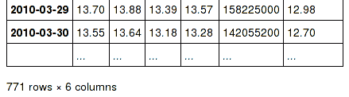

# 版本 0.13.0（2014 年 1 月 3 日）

> 原文：[`pandas.pydata.org/docs/whatsnew/v0.13.0.html`](https://pandas.pydata.org/docs/whatsnew/v0.13.0.html)

这是从 0.12.0 开始的一个重大版本发布，包括了许多 API 变更、几个新功能和增强以及大量的错误修复。

主要亮点包括：

+   对新索引类型 `Float64Index` 的支持，以及其他索引增强

+   `HDFStore` 对查询规范有了新的基于字符串的语法

+   对插值的新方法的支持

+   更新的 `timedelta` 操作

+   新的字符串操作方法 `extract`

+   对偏移量的纳秒支持

+   DataFrames 的 `isin`

添加了几个试验性功能，包括：

+   表达式评估的新的 `eval/query` 方法

+   对 `msgpack` 序列化的支持

+   Google 的 `BigQuery` 的 i/o 接口

有几个新的或更新的文档部分，包括：

+   与 SQL 的比较，对于熟悉 SQL 但仍在学习 pandas 的人来说应该很有用。

+   与 R 的比较，从 R 到 pandas 的成语翻译。

+   性能增强，使用`eval/query`提高 pandas 性能的方法。

警告

在 0.13.0 中，`Series` 在内部已经进行了重构，不再是子类 `ndarray`，而是子类 `NDFrame`，类似于其他 pandas 容器。这应该是一个透明的改变，只有非常有限的 API 影响。见 内部重构

## API 变更

+   `read_excel` 现在支持在其 `sheetname` 参数中使用整数来指定要读取的表的索引 ([GH 4301](https://github.com/pandas-dev/pandas/issues/4301))。

+   文本解析器现在将任何看起来像 inf 的内容（“inf”、“Inf”、“-Inf”、“iNf”等）视为无穷大。 ([GH 4220](https://github.com/pandas-dev/pandas/issues/4220), [GH 4219](https://github.com/pandas-dev/pandas/issues/4219))，影响了 `read_table`、`read_csv` 等。

+   `pandas` 现在与 Python 2/3 兼容，无需使用 2to3，这要归功于 @jtratner。因此，pandas 现在更广泛地使用迭代器。这也导致将 Benjamin Peterson 的 `six` 库的实质性部分引入了 compat。 ([GH 4384](https://github.com/pandas-dev/pandas/issues/4384), [GH 4375](https://github.com/pandas-dev/pandas/issues/4375), [GH 4372](https://github.com/pandas-dev/pandas/issues/4372))

+   `pandas.util.compat` 和 `pandas.util.py3compat` 已合并为 `pandas.compat`。`pandas.compat` 现在包括许多函数，允许 2/3 兼容性。它包含 range、filter、map 和 zip 的列表和迭代器版本，以及其他必要的元素，用于 Python 3 兼容性。`lmap`、`lzip`、`lrange` 和 `lfilter` 都生成列表而不是迭代器，以与 `numpy`、下标和 `pandas` 构造函数兼容。([GH 4384](https://github.com/pandas-dev/pandas/issues/4384), [GH 4375](https://github.com/pandas-dev/pandas/issues/4375), [GH 4372](https://github.com/pandas-dev/pandas/issues/4372))

+   `Series.get` 使用负索引器现在返回与 `[]` 相同的结果 ([GH 4390](https://github.com/pandas-dev/pandas/issues/4390))

+   更改了 `Index` 和 `MultiIndex` 处理元数据（`levels`、`labels` 和 `names`）的方式 ([GH 4039](https://github.com/pandas-dev/pandas/issues/4039))：

    ```py
    # previously, you would have set levels or labels directly
    >>> pd.index.levels = [[1, 2, 3, 4], [1, 2, 4, 4]]

    # now, you use the set_levels or set_labels methods
    >>> index = pd.index.set_levels([[1, 2, 3, 4], [1, 2, 4, 4]])

    # similarly, for names, you can rename the object
    # but setting names is not deprecated
    >>> index = pd.index.set_names(["bob", "cranberry"])

    # and all methods take an inplace kwarg - but return None
    >>> pd.index.set_names(["bob", "cranberry"], inplace=True) 
    ```

+   **所有** 与 `NDFrame` 对象的除法现在都是 *truedivision*，无论未来的导入如何。这意味着对 pandas 对象进行操作将默认使用 *浮点* 除法，并返回浮点 dtype。您可以使用 `//` 和 `floordiv` 进行整数除法。

    整数除法

    ```py
    In [3]: arr = np.array([1, 2, 3, 4])

    In [4]: arr2 = np.array([5, 3, 2, 1])

    In [5]: arr / arr2
    Out[5]: array([0, 0, 1, 4])

    In [6]: pd.Series(arr) // pd.Series(arr2)
    Out[6]:
    0    0
    1    0
    2    1
    3    4
    dtype: int64 
    ```

    真除法

    ```py
    In [7]: pd.Series(arr) / pd.Series(arr2)  # no future import required
    Out[7]:
    0    0.200000
    1    0.666667
    2    1.500000
    3    4.000000
    dtype: float64 
    ```

+   如果 `downcast='infer'` 被传递给 `fillna/ffill/bfill`，则推断并降级 dtype ([GH 4604](https://github.com/pandas-dev/pandas/issues/4604))

+   `__nonzero__` 对于所有的 NDFrame 对象，现在会引发 `ValueError`，这恢复到了 ([GH 1073](https://github.com/pandas-dev/pandas/issues/1073), [GH 4633](https://github.com/pandas-dev/pandas/issues/4633)) 的行为。查看 注意事项 以获取更详细的讨论。

    这样可以防止在 *整个* pandas 对象上进行布尔比较，这在本质上是模棱两可的。这些都会引发 `ValueError`。

    ```py
    >>> df = pd.DataFrame({'A': np.random.randn(10),
    ...                    'B': np.random.randn(10),
    ...                    'C': pd.date_range('20130101', periods=10)
    ...                    })
    ...
    >>> if df:
    ...     pass
    ...
    Traceback (most recent call last):
      ...
    ValueError: The truth value of a DataFrame is ambiguous.  Use a.empty,
    a.bool(), a.item(), a.any() or a.all().

    >>> df1 = df
    >>> df2 = df
    >>> df1 and df2
    Traceback (most recent call last):
      ...
    ValueError: The truth value of a DataFrame is ambiguous.  Use a.empty,
    a.bool(), a.item(), a.any() or a.all().

    >>> d = [1, 2, 3]
    >>> s1 = pd.Series(d)
    >>> s2 = pd.Series(d)
    >>> s1 and s2
    Traceback (most recent call last):
      ...
    ValueError: The truth value of a DataFrame is ambiguous.  Use a.empty,
    a.bool(), a.item(), a.any() or a.all(). 
    ```

    向 `NDFrame` 对象添加了 `.bool()` 方法，以便评估单元素布尔 Series：

    ```py
    >>> pd.Series([True]).bool()
     True
    >>> pd.Series([False]).bool()
     False
    >>> pd.DataFrame([[True]]).bool()
     True
    >>> pd.DataFrame([[False]]).bool()
     False 
    ```

+   所有非 Index NDFrames（`Series`、`DataFrame`、`Panel`、`Panel4D`、`SparsePanel` 等），现在支持整套算术运算符和算术灵活方法（add、sub、mul 等）。`SparsePanel` 不支持与非标量的 `pow` 或 `mod`。([GH 3765](https://github.com/pandas-dev/pandas/issues/3765))

+   `Series` 和 `DataFrame` 现在有一个 `mode()` 方法来计算按轴/Series 计算统计模式。([GH 5367](https://github.com/pandas-dev/pandas/issues/5367))

+   现在默认情况下，链式赋值将会在用户对副本进行赋值时发出警告。可以通过选项 `mode.chained_assignment` 进行更改，允许的选项为 `raise/warn/None`。查看 文档。

    ```py
    In [1]: dfc = pd.DataFrame({'A': ['aaa', 'bbb', 'ccc'], 'B': [1, 2, 3]})

    In [2]: pd.set_option('chained_assignment', 'warn') 
    ```

    如果尝试这样做，将显示以下警告/异常。

    ```py
    In [3]: dfc.loc[0]['A'] = 1111 
    ```

    ```py
    Traceback (most recent call last)
       ...
    SettingWithCopyWarning:
       A value is trying to be set on a copy of a slice from a DataFrame.
       Try using .loc[row_index,col_indexer] = value instead 
    ```

    这是正确的赋值方法。

    ```py
    In [4]: dfc.loc[0, 'A'] = 11

    In [5]: dfc
    Out[5]: 
     A  B
    0   11  1
    1  bbb  2
    2  ccc  3 
    ```

+   `Panel.reindex` 具有以下调用签名 `Panel.reindex(items=None, major_axis=None, minor_axis=None, **kwargs)`

    以符合其他 `NDFrame` 对象。查看 内部重构 获取更多信息。

+   `Series.argmin` 和 `Series.argmax` 现在别名为 `Series.idxmin` 和 `Series.idxmax`。这些返回*索引*

    在 0.13.0 之前，`min` 或 `max` 元素分别返回最小/最大元素的位置。([GH 6214](https://github.com/pandas-dev/pandas/issues/6214))

## 之前版本的废弃/更改

这些是在 0.12 或之前宣布的更改，将在 0.13.0 中生效

+   移除废弃的 `Factor` ([GH 3650](https://github.com/pandas-dev/pandas/issues/3650))

+   移除废弃的 `set_printoptions/reset_printoptions` ([GH 3046](https://github.com/pandas-dev/pandas/issues/3046))

+   移除废弃的 `_verbose_info` ([GH 3215](https://github.com/pandas-dev/pandas/issues/3215))

+   从 `pandas.io.parsers` 中移除废弃的 `read_clipboard/to_clipboard/ExcelFile/ExcelWriter` ([GH 3717](https://github.com/pandas-dev/pandas/issues/3717)) 这些作为主 pandas 命名空间中的函数可用（例如 `pd.read_clipboard`）

+   `tupleize_cols` 的默认值现在对于 `to_csv` 和 `read_csv` 都是 `False`。在 0.12 中有明确警告 ([GH 3604](https://github.com/pandas-dev/pandas/issues/3604))

+   `display.max_seq_len` 的默认值现在是 100 而不是 `None`。这会在各个地方激活长序列的截断显示（"..."）。([GH 3391](https://github.com/pandas-dev/pandas/issues/3391))

## 废弃

在 0.13.0 中废弃

+   废弃了 `iterkv`，将在将来的版本中移除（这是绕过 `2to3` 更改的 `iteritems` 的别名）。([GH 4384](https://github.com/pandas-dev/pandas/issues/4384), [GH 4375](https://github.com/pandas-dev/pandas/issues/4375), [GH 4372](https://github.com/pandas-dev/pandas/issues/4372))

+   废弃了字符串方法 `match`，其作用现在更符合习惯的是 `extract`。在将来的版本中，`match` 的默认行为将变为类似于 `contains`，返回一个布尔索引器。（它们的区别在于严格性：`match` 依赖于 `re.match`，而 `contains` 依赖于 `re.search`。）在此版本中，废弃的行为是默认的，但新行为可以通过关键字参数 `as_indexer=True` 获得。

## 索引 API 更改

在 0.13 之前，不可能使用标签索引器（`.loc/.ix`）设置特定轴索引中不包含的值。([GH 2578](https://github.com/pandas-dev/pandas/issues/2578))。参见文档

在 `Series` 情���下，这实际上是一个追加操作

```py
In [6]: s = pd.Series([1, 2, 3])

In [7]: s
Out[7]: 
0    1
1    2
2    3
dtype: int64

In [8]: s[5] = 5.

In [9]: s
Out[9]: 
0    1.0
1    2.0
2    3.0
5    5.0
dtype: float64 
```

```py
In [10]: dfi = pd.DataFrame(np.arange(6).reshape(3, 2),
 ....:                   columns=['A', 'B'])
 ....: 

In [11]: dfi
Out[11]: 
 A  B
0  0  1
1  2  3
2  4  5 
```

这以前会引发 `KeyError`

```py
In [12]: dfi.loc[:, 'C'] = dfi.loc[:, 'A']

In [13]: dfi
Out[13]: 
 A  B  C
0  0  1  0
1  2  3  2
2  4  5  4 
```

这就像一个 `append` 操作。

```py
In [14]: dfi.loc[3] = 5

In [15]: dfi
Out[15]: 
 A  B  C
0  0  1  0
1  2  3  2
2  4  5  4
3  5  5  5 
```

对 Panel 的任意轴进行设置操作会将输入对齐到 Panel

```py
In [20]: p = pd.Panel(np.arange(16).reshape(2, 4, 2),
 ....:             items=['Item1', 'Item2'],
 ....:             major_axis=pd.date_range('2001/1/12', periods=4),
 ....:             minor_axis=['A', 'B'], dtype='float64')
 ....:

In [21]: p
Out[21]:
<class 'pandas.core.panel.Panel'>
Dimensions: 2 (items) x 4 (major_axis) x 2 (minor_axis)
Items axis: Item1 to Item2
Major_axis axis: 2001-01-12 00:00:00 to 2001-01-15 00:00:00
Minor_axis axis: A to B

In [22]: p.loc[:, :, 'C'] = pd.Series([30, 32], index=p.items)

In [23]: p
Out[23]:
<class 'pandas.core.panel.Panel'>
Dimensions: 2 (items) x 4 (major_axis) x 3 (minor_axis)
Items axis: Item1 to Item2
Major_axis axis: 2001-01-12 00:00:00 to 2001-01-15 00:00:00
Minor_axis axis: A to C

In [24]: p.loc[:, :, 'C']
Out[24]:
 Item1  Item2
2001-01-12   30.0   32.0
2001-01-13   30.0   32.0
2001-01-14   30.0   32.0
2001-01-15   30.0   32.0 
```

## Float64Index API 更改

+   添加了新的索引类型 `Float64Index`。当在索引创建中传递浮点值时，将自动创建此索引。这使得基于纯标签的切片范式可以使 `[],ix,loc` 用于标量索引和切片的工作完全相同。([GH 263](https://github.com/pandas-dev/pandas/issues/263))

    默认情况下构造是针对浮点类型值的。

    ```py
    In [16]: index = pd.Index([1.5, 2, 3, 4.5, 5])

    In [17]: index
    Out[17]: Index([1.5, 2.0, 3.0, 4.5, 5.0], dtype='float64')

    In [18]: s = pd.Series(range(5), index=index)

    In [19]: s
    Out[19]: 
    1.5    0
    2.0    1
    3.0    2
    4.5    3
    5.0    4
    dtype: int64 
    ```

    对于`[],.ix,.loc`的标量选择始终基于标签。整数将匹配相等的浮点索引（例如，`3`等同于`3.0`）

    ```py
    In [20]: s[3]
    Out[20]: 2

    In [21]: s.loc[3]
    Out[21]: 2 
    ```

    唯一的位置索引是通过`iloc`进行的

    ```py
    In [22]: s.iloc[3]
    Out[22]: 3 
    ```

    未找到的标量索引将引发`KeyError`

    切片始终是在索引的值上进行的，对于`[],ix,loc`始终是位置性的，对于`iloc`始终是位置性的

    ```py
    In [23]: s[2:4]
    Out[23]: 
    2.0    1
    3.0    2
    dtype: int64

    In [24]: s.loc[2:4]
    Out[24]: 
    2.0    1
    3.0    2
    dtype: int64

    In [25]: s.iloc[2:4]
    Out[25]: 
    3.0    2
    4.5    3
    dtype: int64 
    ```

    在浮点索引中，允许使用浮点数进行切片

    ```py
    In [26]: s[2.1:4.6]
    Out[26]: 
    3.0    2
    4.5    3
    dtype: int64

    In [27]: s.loc[2.1:4.6]
    Out[27]: 
    3.0    2
    4.5    3
    dtype: int64 
    ```

+   其他索引类型上的索引被保留（并且对于`[],ix`是位置性的后备），唯一的例外是，在非`Float64Index`上进行浮点切片现在将引发`TypeError`。

    ```py
    In [1]: pd.Series(range(5))[3.5]
    TypeError: the label [3.5] is not a proper indexer for this index type (Int64Index)

    In [1]: pd.Series(range(5))[3.5:4.5]
    TypeError: the slice start [3.5] is not a proper indexer for this index type (Int64Index) 
    ```

    在将来的版本中将弃用使用标量浮点索引器，但目前允许使用。

    ```py
    In [3]: pd.Series(range(5))[3.0]
    Out[3]: 3 
    ```

## HDFStore API 更改

+   查询格式更改。现在支持更类似字符串的查询格式。请参阅文档。

    ```py
    In [28]: path = 'test.h5'

    In [29]: dfq = pd.DataFrame(np.random.randn(10, 4),
     ....:                   columns=list('ABCD'),
     ....:                   index=pd.date_range('20130101', periods=10))
     ....: 

    In [30]: dfq.to_hdf(path, key='dfq', format='table', data_columns=True) 
    ```

    使用布尔表达式，进行内联函数评估。

    ```py
    In [31]: pd.read_hdf(path, 'dfq',
     ....:            where="index>Timestamp('20130104') & columns=['A', 'B']")
     ....: 
    Out[31]: 
     A         B
    2013-01-05 -0.424972  0.567020
    2013-01-06 -0.673690  0.113648
    2013-01-07  0.404705  0.577046
    2013-01-08 -0.370647 -1.157892
    2013-01-09  1.075770 -0.109050
    2013-01-10  0.357021 -0.674600 
    ```

    使用内联列引用

    ```py
    In [32]: pd.read_hdf(path, 'dfq',
     ....:            where="A>0 or C>0")
     ....: 
    Out[32]: 
     A         B         C         D
    2013-01-01  0.469112 -0.282863 -1.509059 -1.135632
    2013-01-02  1.212112 -0.173215  0.119209 -1.044236
    2013-01-04  0.721555 -0.706771 -1.039575  0.271860
    2013-01-05 -0.424972  0.567020  0.276232 -1.087401
    2013-01-07  0.404705  0.577046 -1.715002 -1.039268
    2013-01-09  1.075770 -0.109050  1.643563 -1.469388
    2013-01-10  0.357021 -0.674600 -1.776904 -0.968914 
    ```

+   `format`关键字现在替换了`table`关键字；允许的值为`fixed(f)`或`table(t)`，与之前<0.13.0 相同的默认值保留，例如`put`意味着`fixed`格式，`append`意味着`table`格式。可以通过设置`io.hdf.default_format`选项将此默认格式设置为选项。

    ```py
    In [33]: path = 'test.h5'

    In [34]: df = pd.DataFrame(np.random.randn(10, 2))

    In [35]: df.to_hdf(path, key='df_table', format='table')

    In [36]: df.to_hdf(path, key='df_table2', append=True)

    In [37]: df.to_hdf(path, key='df_fixed')

    In [38]: with pd.HDFStore(path) as store:
     ....:    print(store)
     ....: 
    <class 'pandas.io.pytables.HDFStore'>
    File path: test.h5 
    ```

+   显著的表写入性能改进

+   处理以表格格式传递的`Series`（[GH 4330](https://github.com/pandas-dev/pandas/issues/4330)）

+   现在可以在表中序列化`timedelta64[ns]` dtype（[GH 3577](https://github.com/pandas-dev/pandas/issues/3577)），请参阅文档。

+   添加了一个`is_open`属性，指示底层文件句柄是否打开；关闭的存储现在在查看存储时将报告“CLOSED”（而不是引发错误）（[GH 4409](https://github.com/pandas-dev/pandas/issues/4409)）

+   关闭`HDFStore`现在将关闭`HDFStore`的实例，但仅在所有打开句柄的引用计数（由`PyTables`）为 0 时才会关闭实际文件。基本上，您有一个由变量引用的本地`HDFStore`实例。一旦关闭，它将报告已关闭。其他引用（指向同一文件）将继续操作，直到它们自己关闭。对已关闭文件执行操作将引发`ClosedFileError`

    ```py
    In [39]: path = 'test.h5'

    In [40]: df = pd.DataFrame(np.random.randn(10, 2))

    In [41]: store1 = pd.HDFStore(path)

    In [42]: store2 = pd.HDFStore(path)

    In [43]: store1.append('df', df)

    In [44]: store2.append('df2', df)

    In [45]: store1
    Out[45]: 
    <class 'pandas.io.pytables.HDFStore'>
    File path: test.h5

    In [46]: store2
    Out[46]: 
    <class 'pandas.io.pytables.HDFStore'>
    File path: test.h5

    In [47]: store1.close()

    In [48]: store2
    Out[48]: 
    <class 'pandas.io.pytables.HDFStore'>
    File path: test.h5

    In [49]: store2.close()

    In [50]: store2
    Out[50]: 
    <class 'pandas.io.pytables.HDFStore'>
    File path: test.h5 
    ```

+   删除了`_quiet`属性，如果从表中检索重复行，则替换为`DuplicateWarning`（[GH 4367](https://github.com/pandas-dev/pandas/issues/4367)）

+   从`open`中删除了`warn`参数。如果尝试使用`mode='w'`打开文件句柄，则将引发`PossibleDataLossError`异常（[GH 4367](https://github.com/pandas-dev/pandas/issues/4367))

+   允许作为`where`条件传递位置数组或掩码（[GH 4467](https://github.com/pandas-dev/pandas/issues/4467)）。请参阅文档以获取示例。

+   在 `append` 中添加关键字 `dropna=True`，以更改是否将所有 NaN 行写入存储（默认为 `True`，所有 NaN 行都不写入），也可以通过选项 `io.hdf.dropna_table` 进行设置 ([GH 4625](https://github.com/pandas-dev/pandas/issues/4625))

+   通过传递存储创建参数；可用于支持内存存储

## DataFrame repr 变更

现在的 HTML 和纯文本表示 `DataFrame` 在超过一定大小后将显示表格的截断视图，而不是切换到简短的信息视图 ([GH 4886](https://github.com/pandas-dev/pandas/issues/4886)，[GH 5550](https://github.com/pandas-dev/pandas/issues/5550))。这使得表示更加一致，因为小的 DataFrame 会变得更大。



要获取信息视图，请调用 `DataFrame.info()`。如果你更喜欢大型 DataFrame 的信息视图作为 repr，则可以通过运行 `set_option('display.large_repr', 'info')` 来设置。

## 增强功能

+   `df.to_clipboard()` 学会了一个新的 `excel` 关键字，可以让你直接将 df 数据粘贴到 excel 中（默认情况下启用）。([GH 5070](https://github.com/pandas-dev/pandas/issues/5070)).

+   `read_html` 现在会引发 `URLError`，而不是捕获并引发 `ValueError` ([GH 4303](https://github.com/pandas-dev/pandas/issues/4303)，[GH 4305](https://github.com/pandas-dev/pandas/issues/4305))

+   添加了对 `read_clipboard()` 和 `to_clipboard()` 的测试 ([GH 4282](https://github.com/pandas-dev/pandas/issues/4282))

+   剪贴板功能现在可以与 PySide 一起使用 ([GH 4282](https://github.com/pandas-dev/pandas/issues/4282))

+   当绘图参数包含重叠的颜色和样式参数时，添加了更具信息性的错误消息 ([GH 4402](https://github.com/pandas-dev/pandas/issues/4402))

+   `to_dict` 现在接受 `records` 作为可能的输出类型。返回一个以列为键的字典数组。([GH 4936](https://github.com/pandas-dev/pandas/issues/4936))

+   `get_dummies` 中的 `NaN` 处理（[GH 4446](https://github.com/pandas-dev/pandas/issues/4446)）与 `dummy_na`

    ```py
    # previously, nan was erroneously counted as 2 here
    # now it is not counted at all
    In [51]: pd.get_dummies([1, 2, np.nan])
    Out[51]: 
     1.0    2.0
    0   True  False
    1  False   True
    2  False  False

    # unless requested
    In [52]: pd.get_dummies([1, 2, np.nan], dummy_na=True)
    Out[52]: 
     1.0    2.0    NaN
    0   True  False  False
    1  False   True  False
    2  False  False   True 
    ```

+   `timedelta64[ns]` 操作。参见文档。

    警告

    大多数这些操作需要 `numpy >= 1.7`

    使用新的顶级 `to_timedelta`，你可以将标准 timedelta 格式（由 `to_csv` 生成）的标量或数组转换为 timedelta 类型（`nanoseconds` 中的 `np.timedelta64`）。

    ```py
    In [53]: pd.to_timedelta('1 days 06:05:01.00003')
    Out[53]: Timedelta('1 days 06:05:01.000030')

    In [54]: pd.to_timedelta('15.5us')
    Out[54]: Timedelta('0 days 00:00:00.000015500')

    In [55]: pd.to_timedelta(['1 days 06:05:01.00003', '15.5us', 'nan'])
    Out[55]: TimedeltaIndex(['1 days 06:05:01.000030', '0 days 00:00:00.000015500', NaT], dtype='timedelta64[ns]', freq=None)

    In [56]: pd.to_timedelta(np.arange(5), unit='s')
    Out[56]: 
    TimedeltaIndex(['0 days 00:00:00', '0 days 00:00:01', '0 days 00:00:02',
     '0 days 00:00:03', '0 days 00:00:04'],
     dtype='timedelta64[ns]', freq=None)

    In [57]: pd.to_timedelta(np.arange(5), unit='d')
    Out[57]: TimedeltaIndex(['0 days', '1 days', '2 days', '3 days', '4 days'], dtype='timedelta64[ns]', freq=None) 
    ```

    `timedelta64[ns]` 类型的 Series 现在可以除以另一个 `timedelta64[ns]` 对象，或者转换为 `float64` 类型的 Series。这是频率转换。参见文档。

    ```py
    In [58]: import datetime

    In [59]: td = pd.Series(pd.date_range('20130101', periods=4)) - pd.Series(
     ....:    pd.date_range('20121201', periods=4))
     ....: 

    In [60]: td[2] += np.timedelta64(datetime.timedelta(minutes=5, seconds=3))

    In [61]: td[3] = np.nan

    In [62]: td
    Out[62]: 
    0   31 days 00:00:00
    1   31 days 00:00:00
    2   31 days 00:05:03
    3                NaT
    dtype: timedelta64[ns] 
    ```

    ```py
    # to days
    In [63]: td / np.timedelta64(1, 'D')
    Out[63]:
    0    31.000000
    1    31.000000
    2    31.003507
    3          NaN
    dtype: float64

    In [64]: td.astype('timedelta64[D]')
    Out[64]:
    0    31.0
    1    31.0
    2    31.0
    3     NaN
    dtype: float64

    # to seconds
    In [65]: td / np.timedelta64(1, 's')
    Out[65]:
    0    2678400.0
    1    2678400.0
    2    2678703.0
    3          NaN
    dtype: float64

    In [66]: td.astype('timedelta64[s]')
    Out[66]:
    0    2678400.0
    1    2678400.0
    2    2678703.0
    3          NaN
    dtype: float64 
    ```

    将 `timedelta64[ns]` Series 除以整数或整数 Series

    ```py
    In [63]: td * -1
    Out[63]: 
    0   -31 days +00:00:00
    1   -31 days +00:00:00
    2   -32 days +23:54:57
    3                  NaT
    dtype: timedelta64[ns]

    In [64]: td * pd.Series([1, 2, 3, 4])
    Out[64]: 
    0   31 days 00:00:00
    1   62 days 00:00:00
    2   93 days 00:15:09
    3                NaT
    dtype: timedelta64[ns] 
    ```

    绝对的 `DateOffset` 对象可以等效地作为 `timedeltas`

    ```py
    In [65]: from pandas import offsets

    In [66]: td + offsets.Minute(5) + offsets.Milli(5)
    Out[66]: 
    0   31 days 00:05:00.005000
    1   31 days 00:05:00.005000
    2   31 days 00:10:03.005000
    3                       NaT
    dtype: timedelta64[ns] 
    ```

    现在支持对时间增量的 Fillna

    ```py
    In [67]: td.fillna(pd.Timedelta(0))
    Out[67]: 
    0   31 days 00:00:00
    1   31 days 00:00:00
    2   31 days 00:05:03
    3    0 days 00:00:00
    dtype: timedelta64[ns]

    In [68]: td.fillna(datetime.timedelta(days=1, seconds=5))
    Out[68]: 
    0   31 days 00:00:00
    1   31 days 00:00:00
    2   31 days 00:05:03
    3    1 days 00:00:05
    dtype: timedelta64[ns] 
    ```

    你可以对时间增量进行数值缩减操作。

    ```py
    In [69]: td.mean()
    Out[69]: Timedelta('31 days 00:01:41')

    In [70]: td.quantile(.1)
    Out[70]: Timedelta('31 days 00:00:00') 
    ```

+   `plot(kind='kde')` 现在接受可选参数 `bw_method` 和 `ind`，传递给 scipy.stats.gaussian_kde()（对于 scipy >= 0.11.0）以设置带宽，并分别传递给 gkde.evaluate() 以指定评估的索引。详见 scipy 文档。([GH 4298](https://github.com/pandas-dev/pandas/issues/4298))

+   DataFrame 构造函数现在接受一个 numpy 掩码记录数组 ([GH 3478](https://github.com/pandas-dev/pandas/issues/3478))

+   新的向量化字符串方法 `extract` 更方便地返回正则表达式匹配。

    ```py
    In [71]: pd.Series(['a1', 'b2', 'c3']).str.extract('ab')
    Out[71]: 
     0
    0    1
    1    2
    2  NaN 
    ```

    不匹配的元素返回 `NaN`。提取具有多个组的正则表达式返回一个每组一列的 DataFrame。

    ```py
    In [72]: pd.Series(['a1', 'b2', 'c3']).str.extract('([ab])(\\d)')
    Out[72]: 
     0    1
    0    a    1
    1    b    2
    2  NaN  NaN 
    ```

    不匹配的元素返回一行 `NaN`。因此，一系列混乱的字符串可以*转换*为一个索引类似的清理或更有用的字符串的 Series 或 DataFrame，而不需要使用 `get()` 来访问元组或 `re.match` 对象。

    命名组如

    ```py
    In [73]: pd.Series(['a1', 'b2', 'c3']).str.extract(
     ....:    '(?P<letter>[ab])(?P<digit>\\d)')
     ....: 
    Out[73]: 
     letter digit
    0      a     1
    1      b     2
    2    NaN   NaN 
    ```

    还可以使用可选的组。

    ```py
    In [74]: pd.Series(['a1', 'b2', '3']).str.extract(
     ....:     '(?P<letter>[ab])?(?P<digit>\\d)')
     ....: 
    Out[74]: 
     letter digit
    0      a     1
    1      b     2
    2    NaN     3 
    ```

+   `read_stata` 现在接受 Stata 13 格式 ([GH 4291](https://github.com/pandas-dev/pandas/issues/4291))

+   如果数据正确分隔且列对齐，`read_fwf` 现在可以从文件的前 100 行中推断列规格，使用提供给函数的分隔符 ([GH 4488](https://github.com/pandas-dev/pandas/issues/4488)).

+   支持纳秒时间作为偏移量

    警告

    这些操作需要 `numpy >= 1.7`

    秒及以下范围内的期间转换已经重新设计并扩展到纳秒。现在支持纳秒级别的期间。

    ```py
    In [79]: pd.date_range('2013-01-01', periods=5, freq='5N')
    Out[79]:
    DatetimeIndex([          '2013-01-01 00:00:00',
                   '2013-01-01 00:00:00.000000005',
                   '2013-01-01 00:00:00.000000010',
                   '2013-01-01 00:00:00.000000015',
                   '2013-01-01 00:00:00.000000020'],
                  dtype='datetime64[ns]', freq='5N') 
    ```

    或者使用频率作为偏移量

    ```py
    In [75]: pd.date_range('2013-01-01', periods=5, freq=pd.offsets.Nano(5))
    Out[75]: 
    DatetimeIndex([          '2013-01-01 00:00:00',
     '2013-01-01 00:00:00.000000005',
     '2013-01-01 00:00:00.000000010',
     '2013-01-01 00:00:00.000000015',
     '2013-01-01 00:00:00.000000020'],
     dtype='datetime64[ns]', freq='5ns') 
    ```

    时间戳可以在纳秒范围内修改

    ```py
    In [76]: t = pd.Timestamp('20130101 09:01:02')

    In [77]: t + pd.tseries.offsets.Nano(123)
    Out[77]: Timestamp('2013-01-01 09:01:02.000000123') 
    ```

+   DataFrames 新增了一个名为 `isin` 的方法，与布尔索引非常兼容。`isin` 的参数，我们要将 DataFrame 与之比较的内容，可以是 DataFrame、Series、字典或值数组。详见文档。

    要获取满足任何条件的行：

    ```py
    In [78]: dfi = pd.DataFrame({'A': [1, 2, 3, 4], 'B': ['a', 'b', 'f', 'n']})

    In [79]: dfi
    Out[79]: 
     A  B
    0  1  a
    1  2  b
    2  3  f
    3  4  n

    In [80]: other = pd.DataFrame({'A': [1, 3, 3, 7], 'B': ['e', 'f', 'f', 'e']})

    In [81]: mask = dfi.isin(other)

    In [82]: mask
    Out[82]: 
     A      B
    0   True  False
    1  False  False
    2   True   True
    3  False  False

    In [83]: dfi[mask.any(axis=1)]
    Out[83]: 
     A  B
    0  1  a
    2  3  f 
    ```

+   `Series` 现在支持一个 `to_frame` 方法将其转换为单列 DataFrame ([GH 5164](https://github.com/pandas-dev/pandas/issues/5164))

+   所有列在这里列出的 R 数据集 [`stat.ethz.ch/R-manual/R-devel/library/datasets/html/00Index.html`](http://stat.ethz.ch/R-manual/R-devel/library/datasets/html/00Index.html) 现在可以加载到 pandas 对象中

    ```py
    # note that pandas.rpy was deprecated in v0.16.0
    import pandas.rpy.common as com
    com.load_data('Titanic') 
    ```

+   `tz_localize` 可以根据未定位数据的结构推断秋季日光节约转换 ([GH 4230](https://github.com/pandas-dev/pandas/issues/4230)), 参见文档

+   `DatetimeIndex` 现在在 API 文档中，参见文档

+   `json_normalize()` 是一种从半结构化 JSON 数据创建平面表的新方法。参见文档（[GH 1067](https://github.com/pandas-dev/pandas/issues/1067)）

+   为 qtpandas 的 DataFrameModel 和 DataFrameWidget 添加了 PySide 支持。

+   Python csv 解析器现在支持 usecols（[GH 4335](https://github.com/pandas-dev/pandas/issues/4335)）

+   频率增加了几个新的偏移量：

    +   `LastWeekOfMonth`（[GH 4637](https://github.com/pandas-dev/pandas/issues/4637)）

    +   `FY5253` 和 `FY5253Quarter`（[GH 4511](https://github.com/pandas-dev/pandas/issues/4511)）

+   DataFrame 增加了一个新的 `interpolate` 方法，类似于 Series（[GH 4434](https://github.com/pandas-dev/pandas/issues/4434), [GH 1892](https://github.com/pandas-dev/pandas/issues/1892)）

    ```py
    In [84]: df = pd.DataFrame({'A': [1, 2.1, np.nan, 4.7, 5.6, 6.8],
     ....:                  'B': [.25, np.nan, np.nan, 4, 12.2, 14.4]})
     ....: 

    In [85]: df.interpolate()
    Out[85]: 
     A      B
    0  1.0   0.25
    1  2.1   1.50
    2  3.4   2.75
    3  4.7   4.00
    4  5.6  12.20
    5  6.8  14.40 
    ```

    此外，`interpolate` 的 `method` 参数已扩展到包括 `'nearest', 'zero', 'slinear', 'quadratic', 'cubic', 'barycentric', 'krogh', 'piecewise_polynomial', 'pchip', 'polynomial', 'spline'`。这些新方法需要[scipy](http://www.scipy.org)。请参阅 Scipy 参考[指南](https://docs.scipy.org/doc/scipy/tutorial/interpolate.html)和[文档](http://docs.scipy.org/doc/scipy/reference/interpolate.html#univariate-interpolation)，了解各种方法何时适用。参见文档。

    Interpolate 现在还接受一个 `limit` 关键字参数。这与 `fillna` 的限制类似：

    ```py
    In [86]: ser = pd.Series([1, 3, np.nan, np.nan, np.nan, 11])

    In [87]: ser.interpolate(limit=2)
    Out[87]: 
    0     1.0
    1     3.0
    2     5.0
    3     7.0
    4     NaN
    5    11.0
    dtype: float64 
    ```

+   增加了 `wide_to_long` 面板数据便捷函数。参见文档。

    ```py
    In [88]: np.random.seed(123)

    In [89]: df = pd.DataFrame({"A1970" : {0 : "a", 1 : "b", 2 : "c"},
     ....:                   "A1980" : {0 : "d", 1 : "e", 2 : "f"},
     ....:                   "B1970" : {0 : 2.5, 1 : 1.2, 2 : .7},
     ....:                   "B1980" : {0 : 3.2, 1 : 1.3, 2 : .1},
     ....:                   "X"     : dict(zip(range(3), np.random.randn(3)))
     ....:                  })
     ....: 

    In [90]: df["id"] = df.index

    In [91]: df
    Out[91]: 
     A1970 A1980  B1970  B1980         X  id
    0     a     d    2.5    3.2 -1.085631   0
    1     b     e    1.2    1.3  0.997345   1
    2     c     f    0.7    0.1  0.282978   2

    In [92]: pd.wide_to_long(df, ["A", "B"], i="id", j="year")
    Out[92]: 
     X  A    B
    id year 
    0  1970 -1.085631  a  2.5
    1  1970  0.997345  b  1.2
    2  1970  0.282978  c  0.7
    0  1980 -1.085631  d  3.2
    1  1980  0.997345  e  1.3
    2  1980  0.282978  f  0.1 
    ```

+   `to_csv` 现在接受一个 `date_format` 关键字参数，用于指定输出 datetime 对象的格式。索引、列和数值中遇到的日期时间对象都将应用此格式。（[GH 4313](https://github.com/pandas-dev/pandas/issues/4313)）

+   `DataFrame.plot` 通过传递 `kind='scatter'` 参数，将 x 轴和 y 轴绘制成散点图（[GH 2215](https://github.com/pandas-dev/pandas/issues/2215)）

+   增加了对同时支持 v2 ID 的 Google Analytics v3 API 段 ID 的支持。（[GH 5271](https://github.com/pandas-dev/pandas/issues/5271)）

## 实验性质

+   新的 `eval()` 函数使用 `numexpr` 在后台实现表达式评估。这对涉及大型 DataFrame/Series 的复杂表达式会带来大幅加速。例如，

    ```py
    In [93]: nrows, ncols = 20000, 100

    In [94]: df1, df2, df3, df4 = [pd.DataFrame(np.random.randn(nrows, ncols))
     ....:                      for _ in range(4)]
     ....: 
    ```

    ```py
    # eval with NumExpr backend
    In [95]: %timeit pd.eval('df1 + df2 + df3 + df4')
    2.82 ms +- 67.4 us per loop (mean +- std. dev. of 7 runs, 100 loops each) 
    ```

    ```py
    # pure Python evaluation
    In [96]: %timeit df1 + df2 + df3 + df4
    2.89 ms +- 56.9 us per loop (mean +- std. dev. of 7 runs, 100 loops each) 
    ```

    有关更多详细信息，请参阅文档。

+   与 `pandas.eval` 类似，`DataFrame` 增加了一个新的 `DataFrame.eval` 方法，用于在 `DataFrame` 的上下文中评估表达式。例如，

    ```py
    In [97]: df = pd.DataFrame(np.random.randn(10, 2), columns=['a', 'b'])

    In [98]: df.eval('a + b')
    Out[98]: 
    0   -0.685204
    1    1.589745
    2    0.325441
    3   -1.784153
    4   -0.432893
    5    0.171850
    6    1.895919
    7    3.065587
    8   -0.092759
    9    1.391365
    dtype: float64 
    ```

+   `query()` 方法已添加，允许您使用几乎与 Python 语法相同的自然查询语法选择 `DataFrame` 的元素。例如，

    ```py
    In [99]: n = 20

    In [100]: df = pd.DataFrame(np.random.randint(n, size=(n, 3)), columns=['a', 'b', 'c'])

    In [101]: df.query('a < b < c')
    Out[101]: 
     a   b   c
    11  1   5   8
    15  8  16  19 
    ```

    选择 `df` 中满足 `a < b < c` 的所有行。更多详情请参见 文档。

+   `pd.read_msgpack()` 和 `pd.to_msgpack()` 现在是序列化任意 pandas（和 python 对象）的支持方法，采用轻量级便携二进制格式。请参见 文档

    警告

    由于这是一个实验性库，存储格式可能在未来版本中不稳定。

    ```py
    df = pd.DataFrame(np.random.rand(5, 2), columns=list('AB'))
    df.to_msgpack('foo.msg')
    pd.read_msgpack('foo.msg')

    s = pd.Series(np.random.rand(5), index=pd.date_range('20130101', periods=5))
    pd.to_msgpack('foo.msg', df, s)
    pd.read_msgpack('foo.msg') 
    ```

    您可以将 `iterator=True` 传递给迭代解压后的结果

    ```py
    for o in pd.read_msgpack('foo.msg', iterator=True):
        print(o) 
    ```

+   `pandas.io.gbq` 提供了一种简单的方法，通过 pandas DataFrames 从 Google 的 BigQuery 数据集中提取数据，并加载数据。BigQuery 是一个高性能类似 SQL 的数据库服务，用于对极大数据集执行特定查询非常有用。请参见文档

    ```py
    from pandas.io import gbq

    # A query to select the average monthly temperatures in the
    # in the year 2000 across the USA. The dataset,
    # publicata:samples.gsod, is available on all BigQuery accounts,
    # and is based on NOAA gsod data.

    query = """SELECT station_number as STATION,
    month as MONTH, AVG(mean_temp) as MEAN_TEMP
    FROM publicdata:samples.gsod
    WHERE YEAR = 2000
    GROUP BY STATION, MONTH
    ORDER BY STATION, MONTH ASC"""

    # Fetch the result set for this query

    # Your Google BigQuery Project ID
    # To find this, see your dashboard:
    # https://console.developers.google.com/iam-admin/projects?authuser=0
    projectid = 'xxxxxxxxx'
    df = gbq.read_gbq(query, project_id=projectid)

    # Use pandas to process and reshape the dataset

    df2 = df.pivot(index='STATION', columns='MONTH', values='MEAN_TEMP')
    df3 = pd.concat([df2.min(), df2.mean(), df2.max()],
                    axis=1, keys=["Min Tem", "Mean Temp", "Max Temp"]) 
    ```

    结果 DataFrame 为：

    ```py
    > df3
                Min Tem  Mean Temp    Max Temp
     MONTH
     1     -53.336667  39.827892   89.770968
     2     -49.837500  43.685219   93.437932
     3     -77.926087  48.708355   96.099998
     4     -82.892858  55.070087   97.317240
     5     -92.378261  61.428117  102.042856
     6     -77.703334  65.858888  102.900000
     7     -87.821428  68.169663  106.510714
     8     -89.431999  68.614215  105.500000
     9     -86.611112  63.436935  107.142856
     10    -78.209677  56.880838   92.103333
     11    -50.125000  48.861228   94.996428
     12    -50.332258  42.286879   94.396774 
    ```

    警告

    要使用此模块，您将需要一个 BigQuery 账户。有关详细信息，请参见 <[`cloud.google.com/products/big-query`](https://cloud.google.com/products/big-query)>。

    截至 10/10/13，Google 的 API 中存在一个 bug，阻止结果集超过 100,000 行。修补程序计划在 10/14/13 那周发布。  ## 内部重构

在 0.13.0 中进行了一次主要的重构，主要是将 `Series` 从 `NDFrame` 中子类化，这是目前 `DataFrame` 和 `Panel` 的基类，以统一方法和行为。Series 以前直接从 `ndarray` 子类化。 ([GH 4080](https://github.com/pandas-dev/pandas/issues/4080), [GH 3862](https://github.com/pandas-dev/pandas/issues/3862), [GH 816](https://github.com/pandas-dev/pandas/issues/816))

警告

与 < 0.13.0 存在两个潜在的不兼容性

+   使用某些 numpy 函数以前会返回一个 `Series`，如果将 `Series` 作为参数传递。这似乎只影响 `np.ones_like`、`np.empty_like`、`np.diff` 和 `np.where`。现在这些将返回 `ndarrays`。

    ```py
    In [102]: s = pd.Series([1, 2, 3, 4]) 
    ```

    Numpy 用法

    ```py
    In [103]: np.ones_like(s)
    Out[103]: array([1, 1, 1, 1])

    In [104]: np.diff(s)
    Out[104]: array([1, 1, 1])

    In [105]: np.where(s > 1, s, np.nan)
    Out[105]: array([nan,  2.,  3.,  4.]) 
    ```

    Pandonic 用法

    ```py
    In [106]: pd.Series(1, index=s.index)
    Out[106]: 
    0    1
    1    1
    2    1
    3    1
    dtype: int64

    In [107]: s.diff()
    Out[107]: 
    0    NaN
    1    1.0
    2    1.0
    3    1.0
    dtype: float64

    In [108]: s.where(s > 1)
    Out[108]: 
    0    NaN
    1    2.0
    2    3.0
    3    4.0
    dtype: float64 
    ```

+   直接将 `Series` 传递给期望 `ndarray` 类型的 cython 函数将不再直接起作用，您必须传递 `Series.values`，请参见 性能增强

+   `Series(0.5)` 以前会返回标量 `0.5`，现在将返回一个包含 1 个元素的 `Series`

+   此更改破坏了 `rpy2<=2.3.8`。已针对 rpy2 提出了一个问题，并在 [GH 5698](https://github.com/pandas-dev/pandas/issues/5698) 中详细介绍了解决方法。感谢 @JanSchulz。

+   保留了对 0.13 版本之前创建的 pickle 文件的兼容性。这些必须使用 `pd.read_pickle` 进行反序列化，请参见 Pickling。

+   重构 series.py/frame.py/panel.py，将通用代码移至 generic.py

    +   在创建通用 NDFrame 结构时添加了`_setup_axes`

    +   移动了方法

        +   `from_axes,_wrap_array,axes,ix,loc,iloc,shape,empty,swapaxes,transpose,pop`

        +   `__iter__,keys,__contains__,__len__,__neg__,__invert__`

        +   `convert_objects,as_blocks,as_matrix,values`

        +   `__getstate__,__setstate__`（frame/panel 中保留兼容性）

        +   `__getattr__,__setattr__`

        +   `_indexed_same,reindex_like,align,where,mask`

        +   `fillna,replace`（`Series`的 replace 现在与`DataFrame`一致）

        +   `filter`（还在不同轴上选择性过滤的情况下添加了轴参数）

        +   `reindex,reindex_axis,take`

        +   `truncate`（已移至`NDFrame`的一部分）

+   这些是使`Panel`与`DataFrame`更一致的 API 更改

    +   在指定相同轴的`Panel`上进行`swapaxes`现在返回一个副本

    +   支持属性访问以进行设置

    +   filter 支持与原始`DataFrame` filter 相同的 API

+   使用无参数调用的 Reindex 现在将返回输入对象的副本

+   `TimeSeries`现在是`Series`的别名。属性`is_time_series`可用于区分（如果需要）

+   重构了使用 BlockManager 的稀疏对象

    +   在 internals 中创建了一个新的块类型，`SparseBlock`，可以保存多种数据类型，并且不可合并。`SparseSeries`和`SparseDataFrame`现在从那里的层次结构（Series/DataFrame）继承更多方法，并且不再从`SparseArray`继承（而是`SparseBlock`的对象）

    +   稀疏套件现在支持与非稀疏数据的集成。支持非浮点稀疏数据（部分实现）

    +   在 DataFrame 内部稀疏结构上的操作应保持稀疏性，合并类型操作将转换为密集（然后转换回稀疏），因此可能有些低效

    +   为`SparseSeries`启用布尔/整数/切片的设置项

    +   `SparsePanels`的实现未更改（例如，不使用 BlockManager，需要工作）

+   为 Series/DataFrame 添加了`ftypes`方法，类似于`dtypes`，但指示底层是稀疏的/密集的（以及 dtype）

+   所有`NDFrame`对象现在可以使用`__finalize__()`来指定从现有对象传播到新对象的各种值（例如，`Series`中的`name`现在将更自动地跟随）

+   现在通过一套生成的类进行内部类型检查，允许`isinstance(value, klass)`而无需直接导入 klass，感谢@jtratner

+   Series 更新中的错误，其中父框架未根据更改（[GH 4080](https://github.com/pandas-dev/pandas/issues/4080)）或类型（[GH 3217](https://github.com/pandas-dev/pandas/issues/3217)）更新其缓存，fillna（[GH 3386](https://github.com/pandas-dev/pandas/issues/3386)）

+   修复了带有 dtype 转换的索引（[GH 4463](https://github.com/pandas-dev/pandas/issues/4463)，[GH 4204](https://github.com/pandas-dev/pandas/issues/4204)）

+   重构`Series.reindex`到 core/generic.py（[GH 4604](https://github.com/pandas-dev/pandas/issues/4604)，[GH 4618](https://github.com/pandas-dev/pandas/issues/4618)），允许在 Series 上重新索引时使用`method=`

+   `Series.copy`不再接受`order`参数，现在与`NDFrame`的复制一致

+   重构`rename`方法到 core/generic.py；修复了`Series.rename`的问题（[GH 4605](https://github.com/pandas-dev/pandas/issues/4605)），并为`Panel`添加了相同签名的`rename`

+   将`clip`方法重构到 core/generic.py（[GH 4798](https://github.com/pandas-dev/pandas/issues/4798)）

+   将`_get_numeric_data/_get_bool_data`重构到 core/generic.py，允许 Series/Panel 功能

+   `Series`（用于索引）/ `Panel`（用于项目）现在允许对其元素进行属性访问（[GH 1903](https://github.com/pandas-dev/pandas/issues/1903)）

    ```py
    In [109]: s = pd.Series([1, 2, 3], index=list('abc'))

    In [110]: s.b
    Out[110]: 2

    In [111]: s.a = 5

    In [112]: s
    Out[112]: 
    a    5
    b    2
    c    3
    dtype: int64 
    ```  ## Bug 修复

+   `HDFStore`

    +   在追加时使用不同的块顺序引发无效的`TypeError`而不是`ValueError`（[GH 4096](https://github.com/pandas-dev/pandas/issues/4096)）

    +   `read_hdf`没有遵守传递的`mode`参数（[GH 4504](https://github.com/pandas-dev/pandas/issues/4504)）

    +   添加一个长度为 0 的表将正常工作（[GH 4273](https://github.com/pandas-dev/pandas/issues/4273)）

    +   当传递`append`和`table`两个参数时，`to_hdf`会引发错误（[GH 4584](https://github.com/pandas-dev/pandas/issues/4584)）

    +   从具有跨数据类型重复列的存储中读取将引发错误（[GH 4767](https://github.com/pandas-dev/pandas/issues/4767)）

    +   修复了当列名不是字符串时未正确引发`ValueError`的错误（[GH 4956](https://github.com/pandas-dev/pandas/issues/4956)）

    +   以固定格式编写的零长度系列未正确反序列化（[GH 4708](https://github.com/pandas-dev/pandas/issues/4708)）

    +   修复了 pyt3 上的解码性能问题（[GH 5441](https://github.com/pandas-dev/pandas/issues/5441)）

    +   在存储之前验证 MultiIndex 中的级别（[GH 5527](https://github.com/pandas-dev/pandas/issues/5527)）

    +   正确处理带有 Panel 的`data_columns`（[GH 5717](https://github.com/pandas-dev/pandas/issues/5717)）

+   修复了`tslib.tz_convert(vals, tz1, tz2)`中的错误：在尝试访问`trans[pos + 1]`时可能会引发`IndexError`异常（[GH 4496](https://github.com/pandas-dev/pandas/issues/4496)）

+   `by`参数现在与`layout`参数在`*.hist`绘图方法中正常工作（[GH 4102](https://github.com/pandas-dev/pandas/issues/4102)，[GH 4014](https://github.com/pandas-dev/pandas/issues/4014)）

+   修复了`PeriodIndex.map`中的错误，使用`str`会返回索引的字符串表示形式（[GH 4136](https://github.com/pandas-dev/pandas/issues/4136)）

+   使用自定义 matplotlib 默认颜色时，`test_time_series_plot_color_with_empty_kwargs`测试失败的问题已修复（[GH 4345](https://github.com/pandas-dev/pandas/issues/4345)）

+   修复了 stata IO 测试的运行。现在使用临时文件进行写入（[GH 4353](https://github.com/pandas-dev/pandas/issues/4353)）

+   修复了`DataFrame.sum`比整数值框架的`DataFrame.mean`慢的问题（[GH 4365](https://github.com/pandas-dev/pandas/issues/4365)）

+   `read_html`测试现在与 Python 2.6 一起工作（[GH 4351](https://github.com/pandas-dev/pandas/issues/4351)）

+   修复了`network`测试抛出`NameError`的错误，因为一个本地变量未定义（[GH 4381](https://github.com/pandas-dev/pandas/issues/4381)）

+   在`to_json`中，如果传递的`orient`会因为重复索引而导致数据丢失，则引发异常（[GH 4359](https://github.com/pandas-dev/pandas/issues/4359)）

+   在`to_json`中，修复日期处理，使毫秒成为默认时间戳，如文档字符串所述（[GH 4362](https://github.com/pandas-dev/pandas/issues/4362)）

+   在进行 groupby apply 时不再忽略`as_index`（[GH 4648](https://github.com/pandas-dev/pandas/issues/4648)，[GH 3417](https://github.com/pandas-dev/pandas/issues/3417)）

+   修复了 JSON NaT 处理问题，现在 NaT 被序列化为`null`（[GH 4498](https://github.com/pandas-dev/pandas/issues/4498)）

+   修复了 JSON 对象键中可转义字符的 JSON 处理方式（[GH 4593](https://github.com/pandas-dev/pandas/issues/4593)）

+   修复了在`na_values=None`时传递`keep_default_na=False`的问题（[GH 4318](https://github.com/pandas-dev/pandas/issues/4318)）

+   修复了在 DataFrame 具有重复列和混合 dtype 时，`values`引发错误的 bug，出现在（[GH 4377](https://github.com/pandas-dev/pandas/issues/4377)）

+   修复了在`read_json`中`orient='split'`时重复列和类型转换的 bug（[GH 4377](https://github.com/pandas-dev/pandas/issues/4377)）

+   修复了 JSON 错误，其中具有除‘.’之外的小数分隔符的语言环境在编码/解码某些值时引发异常（[GH 4918](https://github.com/pandas-dev/pandas/issues/4918)）

+   修复了使用`PeriodIndex`进行`.iat`索引的问题（[GH 4390](https://github.com/pandas-dev/pandas/issues/4390)）

+   修复了`PeriodIndex`与自身连接时返回新实例而不是相同实例的问题（[GH 4379](https://github.com/pandas-dev/pandas/issues/4379)）；同时为其他索引类型添加了此测试

+   修复了使用 CSV cparser 和 usecols 参数时，所有 dtype 转换为对象的错误（[GH 3192](https://github.com/pandas-dev/pandas/issues/3192)）

+   在合并块时修复了一个问题，导致结果 DataFrame 部分设置了 _ref_locs（[GH 4403](https://github.com/pandas-dev/pandas/issues/4403)）

+   修复了使用顶级 matplotlib API 调用 hist 子图时被覆盖的问题（[GH 4408](https://github.com/pandas-dev/pandas/issues/4408)）

+   修复了调用`Series.astype(str)`时会截断字符串的错误（[GH 4405](https://github.com/pandas-dev/pandas/issues/4405)，[GH 4437](https://github.com/pandas-dev/pandas/issues/4437)）

+   解决了一个 py3 兼容性问题，即将字节表示为元组（[GH 4455](https://github.com/pandas-dev/pandas/issues/4455)）

+   修复了 Panel 属性命名冲突问题，如果项目命名为‘a’（[GH 3440](https://github.com/pandas-dev/pandas/issues/3440)）

+   修复了绘图时引发重复索引的问题（[GH 4486](https://github.com/pandas-dev/pandas/issues/4486)）

+   修复了在布尔数据类型上 cumsum 和 cumprod 不起作用的问题（[GH 4170](https://github.com/pandas-dev/pandas/issues/4170)，[GH 4440](https://github.com/pandas-dev/pandas/issues/4440)）

+   修复了在 `xs` 中出现的 Panel 切片问题，返回的对象维度不正确（[GH 4016](https://github.com/pandas-dev/pandas/issues/4016)）

+   修复了自定义缩减函数未在只有一个组时使用的重采样错误（[GH 3849](https://github.com/pandas-dev/pandas/issues/3849)，[GH 4494](https://github.com/pandas-dev/pandas/issues/4494)）

+   修复了使用转置框架进行的 Panel 赋值问题（[GH 3830](https://github.com/pandas-dev/pandas/issues/3830)）

+   在使用 Panel 和 Panel 作为值需要对齐时，设置 Panel 索引会引发错误（[GH 3777](https://github.com/pandas-dev/pandas/issues/3777)）

+   `Series` 构造函数现在在创建 frozenset 对象时会引发错误（[GH 4482](https://github.com/pandas-dev/pandas/issues/4482)，[GH 4480](https://github.com/pandas-dev/pandas/issues/4480)）

+   修复了对排序重复的 MultiIndex 进行排序时出现的问题，该 MultiIndex 具有多个数据类型（[GH 4516](https://github.com/pandas-dev/pandas/issues/4516)）

+   修复了 `DataFrame.set_values` 中的错误，该错误导致在扩展索引时丢失名称属性（[GH 3742](https://github.com/pandas-dev/pandas/issues/3742)，[GH 4039](https://github.com/pandas-dev/pandas/issues/4039)）

+   修复了可以在未经验证的情况下在 `MultiIndex` 上设置单个 `names`、`levels` 和 `labels` 的问题（[GH 3714](https://github.com/pandas-dev/pandas/issues/3714)，[GH 4039](https://github.com/pandas-dev/pandas/issues/4039)）

+   修复了在 pivot_table 中的问题（[GH 3334](https://github.com/pandas-dev/pandas/issues/3334)）。如果值是索引，则无法计算边距。

+   修复了在与日期时间操作时具有 `np.timedelta64` 或 `np.offsets.DateOffset` 的右侧值时出现的错误（[GH 4532](https://github.com/pandas-dev/pandas/issues/4532)）

+   修复了系列/日期时间索引和 `np.timedelta64` 进行算术运算时不起作用相同的问题（[GH 4134](https://github.com/pandas-dev/pandas/issues/4134)）以及 NumPy 1.6 中的错误时间差（[GH 4135](https://github.com/pandas-dev/pandas/issues/4135)）

+   修复了在 Windows 平台上使用 PY3 时 `pd.read_clipboard` 中的错误（[GH 4561](https://github.com/pandas-dev/pandas/issues/4561））；解码不正确

+   如果代码参数超出范围，`tslib.get_period_field()` 和 `tslib.get_period_field_arr()` 现在会引发错误（[GH 4519](https://github.com/pandas-dev/pandas/issues/4519)，[GH 4520](https://github.com/pandas-dev/pandas/issues/4520)）

+   修复了在空系列上进行布尔索引时丢失索引名称的问题（[GH 4235](https://github.com/pandas-dev/pandas/issues/4235)），`infer_dtype` 可以用于空数组。

+   修复了使用多个轴进行重新索引时的问题；如果轴匹配未替换当前轴，则可能导致可能的惰性频率推断问题（[GH 3317](https://github.com/pandas-dev/pandas/issues/3317)）

+   修复`DataFrame.apply`错误地重新引发异常的问题（导致原始堆栈跟踪被截断）。

+   修复使用`ix/loc`和非唯一选择器进行选择的问题（[GH 4619](https://github.com/pandas-dev/pandas/issues/4619)）

+   修复使用 iloc/loc 进行赋值时涉及现有列中的 dtype 更改的问题（[GH 4312](https://github.com/pandas-dev/pandas/issues/4312)，[GH 5702](https://github.com/pandas-dev/pandas/issues/5702)）在核心/索引中使用 Block.setitem 的内部 setitem_with_indexer

+   修复 csv_import 中浮点数的千位运算符处理不正确的错误（[GH 4322](https://github.com/pandas-dev/pandas/issues/4322)）

+   修复 CacheableOffset 未正确被许多 DateOffset 使用的问题；这阻止了 DateOffset 被缓存（[GH 4609](https://github.com/pandas-dev/pandas/issues/4609)）

+   修复 DataFrame 在 lhs 上与列表/元组上的布尔比较的问题（[GH 4576](https://github.com/pandas-dev/pandas/issues/4576)）

+   修复在`Series/DataFrame`上使用`None`的 setitem 时的错误/ dtype 转换（[GH 4667](https://github.com/pandas-dev/pandas/issues/4667)）

+   根据传入的非默认编码修正`pd.read_stata`中的解码问题（[GH 4626](https://github.com/pandas-dev/pandas/issues/4626)）

+   修复`DataFrame.from_records`与普通`ndarray`的问题（[GH 4727](https://github.com/pandas-dev/pandas/issues/4727)）

+   修复`Index.rename`和`MultiIndex.rename`等中的一些不一致性（[GH 4718](https://github.com/pandas-dev/pandas/issues/4718)，[GH 4628](https://github.com/pandas-dev/pandas/issues/4628)）

+   使用`iloc/loc`与横截面和重复索引存在错误（[GH 4726](https://github.com/pandas-dev/pandas/issues/4726)）

+   使用`to_csv`中的`QUOTE_NONE`导致`Exception`的错误（[GH 4328](https://github.com/pandas-dev/pandas/issues/4328)）

+   Series 索引不在右侧长度不正确时引发错误的错误已修复（[GH 2702](https://github.com/pandas-dev/pandas/issues/2702)）

+   MultiIndexing 中存在部分字符串选择作为 MultIndex 的一部分的错误（[GH 4758](https://github.com/pandas-dev/pandas/issues/4758)）

+   在具有非唯一索引的索引上重新索引现在将引发`ValueError`的错误（[GH 4746](https://github.com/pandas-dev/pandas/issues/4746)）

+   使用`loc/ix`设置具有 MultiIndex 轴和 NumPy 数组的单个索引器时存在错误，相关于（[GH 3777](https://github.com/pandas-dev/pandas/issues/3777)）

+   在跨 dtypes 存在重复列的连接中存在错误，不会与 axis=0 合并（[GH 4771](https://github.com/pandas-dev/pandas/issues/4771)，[GH 4975](https://github.com/pandas-dev/pandas/issues/4975))

+   `iloc`在切片索引失败时存在错误（[GH 4771](https://github.com/pandas-dev/pandas/issues/4771)）

+   在`read_fwf`中没有 colspecs 或 width 时显示不正确的错误消息（[GH 4774](https://github.com/pandas-dev/pandas/issues/4774)）

+   修复了在具有重复索引的 Series 中进行索引时的错误（[GH 4548](https://github.com/pandas-dev/pandas/issues/4548)，[GH 4550](https://github.com/pandas-dev/pandas/issues/4550)）

+   修复了在 Python 3 中使用`read_fwf`读取压缩文件的 bug。([GH 3963](https://github.com/pandas-dev/pandas/issues/3963))

+   修复了具有重复索引和 dtype 更改的赋值问题（[GH 4686](https://github.com/pandas-dev/pandas/issues/4686)）

+   修复了在 Python 3 中读取压缩文件时将其作为`bytes`而不是`str`的错误。简化了 Python 3 中生成字节文件处理的过程（[GH 3963](https://github.com/pandas-dev/pandas/issues/3963)，[GH 4785](https://github.com/pandas-dev/pandas/issues/4785)）。

+   修复了在不同版本的 matplotlib 中对数刻度条图中的 ticklocs/ticklabels 相关问题（[GH 4789](https://github.com/pandas-dev/pandas/issues/4789)）

+   抑制了由 repr()发出的内部调用引发的 DeprecationWarning（[GH 4391](https://github.com/pandas-dev/pandas/issues/4391)）

+   修复了具有重复索引和重复选择器的`.loc`中的问题（[GH 4825](https://github.com/pandas-dev/pandas/issues/4825)）

+   修复了`DataFrame.sort_index`中的问题，当按单个列排序并传递`ascending`的列表时，`ascending`参数被解释为`True`（[GH 4839](https://github.com/pandas-dev/pandas/issues/4839)，[GH 4846](https://github.com/pandas-dev/pandas/issues/4846)）

+   修复了`Panel.tshift`无法工作的问题。为`Panel.shift`添加了`freq`支持（[GH 4853](https://github.com/pandas-dev/pandas/issues/4853)）

+   修复了 TextFileReader 在 Python 引擎（即 PythonParser）中处理 thousands != “,”时的问题（[GH 4596](https://github.com/pandas-dev/pandas/issues/4596)）

+   在使用 where 时，使用重复索引时 getitem 中的 bug（[GH 4879](https://github.com/pandas-dev/pandas/issues/4879)）

+   修复了类型推断代码将浮点列强制转换为日期时间的问题（[GH 4601](https://github.com/pandas-dev/pandas/issues/4601)）

+   修复了`_ensure_numeric`不检查复数的问题（[GH 4902](https://github.com/pandas-dev/pandas/issues/4902)）

+   修复了`Series.hist`中的一个 bug，当传递`by`参数时会创建两个图形（[GH 4112](https://github.com/pandas-dev/pandas/issues/4112)，[GH 4113](https://github.com/pandas-dev/pandas/issues/4113)）。

+   修复了`convert_objects`对于> 2 维的 bug（[GH 4937](https://github.com/pandas-dev/pandas/issues/4937)）

+   修复了 DataFrame/Panel 缓存插入和后续索引中的 bug（[GH 4939](https://github.com/pandas-dev/pandas/issues/4939)，[GH 5424](https://github.com/pandas-dev/pandas/issues/5424)）

+   修复了`FrozenNDArray`和`FrozenList`的字符串方法（[GH 4929](https://github.com/pandas-dev/pandas/issues/4929))

+   修复了在索引扩展场景中设置无效或超出范围值的 bug（[GH 4940](https://github.com/pandas-dev/pandas/issues/4940)）

+   对空系列上的 fillna 进行测试（[GH 4346](https://github.com/pandas-dev/pandas/issues/4346)), 感谢 @immerrr

+   修复了`copy()`以浅复制轴/索引，并因此保留单独的元数据的问题（[GH 4202](https://github.com/pandas-dev/pandas/issues/4202), [GH 4830](https://github.com/pandas-dev/pandas/issues/4830))

+   修复了 Python 解析器中`read_csv`中的 skiprows 选项（[GH 4382](https://github.com/pandas-dev/pandas/issues/4382))

+   修复了阻止`cut`与未显式传递标签的`np.inf`级别一起工作的错误（[GH 3415](https://github.com/pandas-dev/pandas/issues/3415))

+   修复了`DatetimeIndex.union`中重叠检查错误的问题（[GH 4564](https://github.com/pandas-dev/pandas/issues/4564))

+   修复了 csv_parser 中千位分隔符和日期解析器之间的冲突问题（[GH 4678](https://github.com/pandas-dev/pandas/issues/4678))

+   在 dtypes 不相同时修复了追加的问题（显示混合 float/np.datetime64 的错误）（[GH 4993](https://github.com/pandas-dev/pandas/issues/4993))

+   修复了 DateOffset 的 repr。不再显示 kwds 中的重复条目。删除未使用的偏移字段。([GH 4638](https://github.com/pandas-dev/pandas/issues/4638))

+   修复了在使用 usecols 时读取 csv 时错误的索引名称。仅适用于 c 解析器。([GH 4201](https://github.com/pandas-dev/pandas/issues/4201))

+   `Timestamp`对象现在可以出现在与`Series`或`DataFrame`对象的比较操作的左侧了（[GH 4982](https://github.com/pandas-dev/pandas/issues/4982)).

+   修复了使用`iloc/loc`通过`np.nan`进行索引时的 bug（[GH 5016](https://github.com/pandas-dev/pandas/issues/5016))

+   修复了低内存 c 解析器在同一文件的不同块中创建不同类型的错误的问题。现在强制转换为数值类型或引发警告。([GH 3866](https://github.com/pandas-dev/pandas/issues/3866))

+   修复了将`Series`重塑为其自身形状时引发`TypeError`的 bug（[GH 4554](https://github.com/pandas-dev/pandas/issues/4554))以及其他重塑问题。

+   修复了使用`ix/loc`和混合整数/字符串索引时的错误（[GH 4544](https://github.com/pandas-dev/pandas/issues/4544))

+   确保系列-系列布尔比较是基于标签的（[GH 4947](https://github.com/pandas-dev/pandas/issues/4947))

+   在使用 Timestamp 部分索引器的多级索引中存在的 bug（[GH 4294](https://github.com/pandas-dev/pandas/issues/4294))

+   对构建全 nan 帧的 MultiIndex 进行测试/修复（[GH 4078](https://github.com/pandas-dev/pandas/issues/4078))

+   修复了`read_html()`未正确推断带有逗号的表的值的 bug（[GH 5029](https://github.com/pandas-dev/pandas/issues/5029))

+   修复了`read_html()`未提供返回表的稳定排序的 bug（[GH 4770](https://github.com/pandas-dev/pandas/issues/4770), [GH 5029](https://github.com/pandas-dev/pandas/issues/5029)).

+   修复了`read_html()`在传递`index_col=0`时解析不正确的错误（[GH 5066](https://github.com/pandas-dev/pandas/issues/5066)）

+   修复了`read_html()`错误推断标题类型的错误（[GH 5048](https://github.com/pandas-dev/pandas/issues/5048)）

+   修复了`DatetimeIndex`与`PeriodIndex`连接导致堆栈溢出的错误（[GH 3899](https://github.com/pandas-dev/pandas/issues/3899)）

+   修复了`groupby`对象不允许绘图的错误（[GH 5102](https://github.com/pandas-dev/pandas/issues/5102)）

+   修复了`groupby`对象无法自动完成列名的错误（[GH 5102](https://github.com/pandas-dev/pandas/issues/5102)）

+   修复了`groupby.plot()`和相关函数多次复制图形的错误（[GH 5102](https://github.com/pandas-dev/pandas/issues/5102)）

+   在`fillna`上提供了`object`类型的自动转换，相关（[GH 5103](https://github.com/pandas-dev/pandas/issues/5103)）

+   修复了在选项解析器清理中默认选项被覆盖的错误（[GH 5121](https://github.com/pandas-dev/pandas/issues/5121)）

+   对于`iloc`索引使用列表/ndarray 的相同方式进行处理（[GH 5006](https://github.com/pandas-dev/pandas/issues/5006)）

+   修复了带有缺失值的`MultiIndex.get_level_values()`的错误（[GH 5074](https://github.com/pandas-dev/pandas/issues/5074)）

+   修复了使用 datetime64 输入的`Timestamp()`的边界检查错误（[GH 4065](https://github.com/pandas-dev/pandas/issues/4065)）

+   修复了`TestReadHtml`没有调用正确的`read_html()`函数的错误（[GH 5150](https://github.com/pandas-dev/pandas/issues/5150)）

+   修复了`NDFrame.replace()`中的错误，使替换看起来像是（错误地）使用正则表达式（[GH 5143](https://github.com/pandas-dev/pandas/issues/5143)）

+   为`to_datetime`提供更好的错误消息（[GH 4928](https://github.com/pandas-dev/pandas/issues/4928)）

+   确保在 travis-ci 上测试不同的区域设置（[GH 4918](https://github.com/pandas-dev/pandas/issues/4918)）。还添加了一些用于获取区域设置和使用上下文管理器设置区域设置的实用程序。

+   修复了`isnull(MultiIndex)`导致的段错误（现在会引发错误）（[GH 5123](https://github.com/pandas-dev/pandas/issues/5123)，[GH 5125](https://github.com/pandas-dev/pandas/issues/5125)）

+   允许在执行对齐操作时允许重复索引（[GH 5185](https://github.com/pandas-dev/pandas/issues/5185)，[GH 5639](https://github.com/pandas-dev/pandas/issues/5639)）

+   构造函数中的复合数据类型引发`NotImplementedError`（[GH 5191](https://github.com/pandas-dev/pandas/issues/5191)）

+   比较重复框架时存在错误（[GH 4421](https://github.com/pandas-dev/pandas/issues/4421)）相关

+   在重复框架上的描述中存在错误

+   修复了带有格式和 `coerce=True` 的 `to_datetime` 不引发异常的 bug ([GH 5195](https://github.com/pandas-dev/pandas/issues/5195))

+   修复了在使用多个索引器和需要广播的 Series 作为 rhs 时，`loc` 设置中的 bug ([GH 5206](https://github.com/pandas-dev/pandas/issues/5206))

+   修复了在 `MultiIndex` 上设置级别或标签时不会清除缓存的 `values` 属性，因此返回错误的 `values` 的 bug。([GH 5215](https://github.com/pandas-dev/pandas/issues/5215))

+   修复了对分组的 DataFrame 或 Series 进行过滤时未保持原始顺序的 bug ([GH 4621](https://github.com/pandas-dev/pandas/issues/4621))。

+   修复了 `Period` 在工作日频率上始终向前滚动的 bug。([GH 5203](https://github.com/pandas-dev/pandas/issues/5203))

+   修复了 Excel 写入器中带有重复列名的框架未正确写入的 bug。([GH 5235](https://github.com/pandas-dev/pandas/issues/5235))

+   修复了在 Series 上使用 `drop` 和非唯一索引时的 bug ([GH 5248](https://github.com/pandas-dev/pandas/issues/5248))

+   修复了在文件中传递的名称多于列数导致 C 解析器中的段错误的 bug。([GH 5156](https://github.com/pandas-dev/pandas/issues/5156))

+   修复了带有日期/时间类型的 `Series.isin` 的 bug ([GH 5021](https://github.com/pandas-dev/pandas/issues/5021))

+   C 和 Python 解析器现在可以处理更常见的 MultiIndex 列格式，不需要为索引名称添加行。([GH 4702](https://github.com/pandas-dev/pandas/issues/4702))

+   修复了尝试将越界日期用作对象 dtype 时的 bug ([GH 5312](https://github.com/pandas-dev/pandas/issues/5312))

+   修复了尝试显示嵌入的 PandasObject 时的 bug ([GH 5324](https://github.com/pandas-dev/pandas/issues/5324))

+   允许对 Timestamp 进行操作，如果结果超出边界，则返回一个 datetime 相关的 bug ([GH 5312](https://github.com/pandas-dev/pandas/issues/5312))

+   修复了 `initObjToJSON()` 的返回值/类型签名，以便与 numpy 的 `import_array()` 兼容 ([GH 5334](https://github.com/pandas-dev/pandas/issues/5334), [GH 5326](https://github.com/pandas-dev/pandas/issues/5326))

+   在 DataFrame 上重命名然后设置索引时的 bug ([GH 5344](https://github.com/pandas-dev/pandas/issues/5344))

+   测试套件在测试图形时不再保留临时文件。([GH 5347](https://github.com/pandas-dev/pandas/issues/5347))（感谢 @yarikoptic 发现这个问题！）

+   修复了在 win32 上的 html 测试。([GH 4580](https://github.com/pandas-dev/pandas/issues/4580))

+   确保 `head/tail` 基于 `iloc`，([GH 5370](https://github.com/pandas-dev/pandas/issues/5370))

+   修复了 `PeriodIndex` 字符串表示形��中存在 1 或 2 个元素时的 bug。([GH 5372](https://github.com/pandas-dev/pandas/issues/5372))

+   GroupBy 方法 `transform` 和 `filter` 可以用于具有重复（非唯一）索引的 Series 和 DataFrames。([GH 4620](https://github.com/pandas-dev/pandas/issues/4620))

+   修复了空系列在 repr 中未打印名称的问题（[GH 4651](https://github.com/pandas-dev/pandas/issues/4651)）

+   默认情况下，使测试在临时目录中创建临时文件。([GH 5419](https://github.com/pandas-dev/pandas/issues/5419))

+   标量的`pd.to_timedelta`返回一个标量（[GH 5410](https://github.com/pandas-dev/pandas/issues/5410)）

+   `pd.to_timedelta`接受`NaN`和`NaT`，返回`NaT`而不是引发异常（[GH 5437](https://github.com/pandas-dev/pandas/issues/5437)）

+   在较大尺寸的 pandas 对象上对`isnull`进行性能改进

+   修复了各种与 1d ndarray 不匹配长度的 setitem 问题（[GH 5508](https://github.com/pandas-dev/pandas/issues/5508)）

+   使用 MultiIndex 和`iloc`时，getitem 存在 bug（[GH 5528](https://github.com/pandas-dev/pandas/issues/5528)）

+   在 Series 上进行 delitem 存在 bug（[GH 5542](https://github.com/pandas-dev/pandas/issues/5542)）

+   使用自定义函数时，在 apply 中存在 bug，且对象未被改变（[GH 5545](https://github.com/pandas-dev/pandas/issues/5545)）

+   使用`loc`从非唯一索引中选择时存在 bug（[GH 5553](https://github.com/pandas-dev/pandas/issues/5553)）

+   当用户函数返回`None`时，groupby 返回非一致类型存在 bug，([GH 5592](https://github.com/pandas-dev/pandas/issues/5592))

+   解决了 numpy 1.7.0 中的回归问题，该问题错误地从`ndarray.item`引发 IndexError（[GH 5666](https://github.com/pandas-dev/pandas/issues/5666)）

+   对具有非唯一索引的对象进行重复索引存在 bug（[GH 5678](https://github.com/pandas-dev/pandas/issues/5678)）

+   使用 Series 和传递的 series/dict 时的 fillna 问题修复（[GH 5703](https://github.com/pandas-dev/pandas/issues/5703)）

+   在具有类似日期时间的分组器的 groupby transform 中存在错误（[GH 5712](https://github.com/pandas-dev/pandas/issues/5712)）

+   使用某些键时，PY3 中 MultiIndex 选择存在错误（[GH 5725](https://github.com/pandas-dev/pandas/issues/5725)）

+   在某些情况下，不同 dtype 的行连接失败（[GH 5754](https://github.com/pandas-dev/pandas/issues/5754))  ## 贡献者

总共有 77 人为此版本贡献了补丁。名字后面带有“+”的人第一次贡献了补丁。

+   阿古斯丁·赫兰斯 +

+   亚历克斯·高迪 +

+   亚历克斯·罗斯伯格 +

+   安德烈亚斯·克洛斯特曼 +

+   安德烈亚斯·武尔 +

+   安迪·海登

+   本·亚历克斯 +

+   本尼迪克特·索尔 +

+   布拉德·布兰

+   凯勒布·爱普斯坦 +

+   张舍

+   克里斯托弗·惠兰

+   DSM +

+   戴尔·郑 +

+   丹·伯肯

+   大卫·拉什 +

+   迪特·范登布斯切

+   加比·达瓦 +

+   加勒特·德拉帕拉

+   戈约 +

+   格雷格·雷达 +

+   伊万·斯米尔诺夫 +

+   杰克·凯利 +

+   雅各布·谢尔 +

+   扬·舒尔茨 +

+   杰夫·特拉特纳

+   杰弗里·特拉特纳

+   约翰·麦克纳马拉 +

+   约翰·W·奥布莱恩 +

+   乔里斯·范丹博斯切

+   贾斯汀·博佐尼尔 +

+   凯尔西·乔达尔

+   凯文·斯通

+   基兰·奥马霍尼

+   凯尔·豪斯曼 +

+   凯尔·凯利 +

+   凯尔·迈耶

+   迈克·凯利

+   莫塔达·梅希亚 +

+   尼克·福蒂 +

+   奥利维尔·哈里斯 +

+   安德烈·切尔蒂克 +

+   PKEuS

+   菲利普·克劳德

+   皮埃尔·哈西格 +

+   理查德·T·盖伊 +

+   罗曼·佩卡尔 +

+   罗伊·韩贤晋

+   斯基普·西博尔德

+   斯滕 +

+   托马斯·A·卡斯韦尔 +

+   托马斯·克卢伊弗

+   蒂亚戈·雷克奎霍 +

+   汤姆奥古斯伯格

+   特伦特·豪克

+   瓦伦丁·哈内尔 +

+   Viktor Kerkez +

+   Vincent Arel-Bundock

+   Wes McKinney

+   Wes Turner +

+   Weston Renoud +

+   Yaroslav Halchenko

+   Zach Dwiel +

+   chapman siu +

+   chappers +

+   d10genes +

+   danielballan

+   daydreamt +

+   engstrom +

+   jreback

+   monicaBee +

+   prossahl +

+   rockg +

+   unutbu +

+   westurner +

+   y-p

+   zach powers

## API 变更

+   `read_excel`现在支持在其`sheetname`参数中传入整数，以读取指定索引的工作表（[GH 4301](https://github.com/pandas-dev/pandas/issues/4301)）。

+   文本解析器现在将任何类似于 inf（“inf”，“Inf”，“-Inf”，“iNf”等）的内容视为无穷大。([GH 4220](https://github.com/pandas-dev/pandas/issues/4220), [GH 4219](https://github.com/pandas-dev/pandas/issues/4219))，影响 `read_table`，`read_csv` 等。

+   `pandas` 现在在不需要 2to3 的情况下兼容 Python 2/3，感谢 @jtratner。因此，pandas 现在更广泛地使用迭代器。这也导致将 Benjamin Peterson 的 `six` 库的实质部分引入 compat。([GH 4384](https://github.com/pandas-dev/pandas/issues/4384), [GH 4375](https://github.com/pandas-dev/pandas/issues/4375), [GH 4372](https://github.com/pandas-dev/pandas/issues/4372))

+   `pandas.util.compat` 和 `pandas.util.py3compat` 已合并为 `pandas.compat`。`pandas.compat` 现在包含许多函数，允许 2/3 兼容性。它包含 range、filter、map 和 zip 的列表和迭代器版本，以及其他必要的元素，以实现 Python 3 的兼容性。`lmap`、`lzip`、`lrange` 和 `lfilter` 都生成列表而不是迭代器，以与 `numpy`、下标和 `pandas` 构造函数兼容。([GH 4384](https://github.com/pandas-dev/pandas/issues/4384), [GH 4375](https://github.com/pandas-dev/pandas/issues/4375), [GH 4372](https://github.com/pandas-dev/pandas/issues/4372))

+   使用负索引器的 `Series.get` 现在返回与 `[]` 相同的结果 ([GH 4390](https://github.com/pandas-dev/pandas/issues/4390))

+   更改了 `Index` 和 `MultiIndex` 处理元数据（`levels`、`labels` 和 `names`）的方式 ([GH 4039](https://github.com/pandas-dev/pandas/issues/4039))

    ```py
    # previously, you would have set levels or labels directly
    >>> pd.index.levels = [[1, 2, 3, 4], [1, 2, 4, 4]]

    # now, you use the set_levels or set_labels methods
    >>> index = pd.index.set_levels([[1, 2, 3, 4], [1, 2, 4, 4]])

    # similarly, for names, you can rename the object
    # but setting names is not deprecated
    >>> index = pd.index.set_names(["bob", "cranberry"])

    # and all methods take an inplace kwarg - but return None
    >>> pd.index.set_names(["bob", "cranberry"], inplace=True) 
    ```

+   **所有** 与 `NDFrame` 对象的除法现在都是 *truedivision*，无论未来的导入如何。这意味着对 pandas 对象进行操作将默认使用 *浮点数* 除法，并返回浮点数 dtype。您可以使用 `//` 和 `floordiv` 进行整数除法。

    整数除法

    ```py
    In [3]: arr = np.array([1, 2, 3, 4])

    In [4]: arr2 = np.array([5, 3, 2, 1])

    In [5]: arr / arr2
    Out[5]: array([0, 0, 1, 4])

    In [6]: pd.Series(arr) // pd.Series(arr2)
    Out[6]:
    0    0
    1    0
    2    1
    3    4
    dtype: int64 
    ```

    真除法

    ```py
    In [7]: pd.Series(arr) / pd.Series(arr2)  # no future import required
    Out[7]:
    0    0.200000
    1    0.666667
    2    1.500000
    3    4.000000
    dtype: float64 
    ```

+   如果将 `downcast='infer'` 传递给 `fillna/ffill/bfill`，则推断并降级 dtype ([GH 4604](https://github.com/pandas-dev/pandas/issues/4604))

+   `__nonzero__`对所有 NDFrame 对象，现在将引发 `ValueError`，这恢复了 ([GH 1073](https://github.com/pandas-dev/pandas/issues/1073), [GH 4633](https://github.com/pandas-dev/pandas/issues/4633)) 的行为。有关更详细的讨论，请参见 注意事项。

    这样可以防止对 *整个* pandas 对象进行布尔比较，这在本质上是模棱两���的。所有这些都将引发 `ValueError`。

    ```py
    >>> df = pd.DataFrame({'A': np.random.randn(10),
    ...                    'B': np.random.randn(10),
    ...                    'C': pd.date_range('20130101', periods=10)
    ...                    })
    ...
    >>> if df:
    ...     pass
    ...
    Traceback (most recent call last):
      ...
    ValueError: The truth value of a DataFrame is ambiguous.  Use a.empty,
    a.bool(), a.item(), a.any() or a.all().

    >>> df1 = df
    >>> df2 = df
    >>> df1 and df2
    Traceback (most recent call last):
      ...
    ValueError: The truth value of a DataFrame is ambiguous.  Use a.empty,
    a.bool(), a.item(), a.any() or a.all().

    >>> d = [1, 2, 3]
    >>> s1 = pd.Series(d)
    >>> s2 = pd.Series(d)
    >>> s1 and s2
    Traceback (most recent call last):
      ...
    ValueError: The truth value of a DataFrame is ambiguous.  Use a.empty,
    a.bool(), a.item(), a.any() or a.all(). 
    ```

    在`NDFrame`对象中添加了`.bool()`方法，以便于评估单个元素的布尔序列：

    ```py
    >>> pd.Series([True]).bool()
     True
    >>> pd.Series([False]).bool()
     False
    >>> pd.DataFrame([[True]]).bool()
     True
    >>> pd.DataFrame([[False]]).bool()
     False 
    ```

+   所有非索引 NDFrames（`Series`，`DataFrame`，`Panel`，`Panel4D`，`SparsePanel`等）现在都支持整套算术运算符和算术灵活方法（add，sub，mul 等）。`SparsePanel`不支持非标量的`pow`或`mod`。 ([GH 3765](https://github.com/pandas-dev/pandas/issues/3765))

+   现在`Series`和`DataFrame`有一个`mode()`方法，可以按轴/序列计算统计模式。 ([GH 5367](https://github.com/pandas-dev/pandas/issues/5367))

+   现在默认情况下，如果用户正在向副本赋值，则链式赋值将发出警告。这可以通过选项`mode.chained_assignment`进行更改，允许的选项是`raise/warn/None`。请参阅文档。

    ```py
    In [1]: dfc = pd.DataFrame({'A': ['aaa', 'bbb', 'ccc'], 'B': [1, 2, 3]})

    In [2]: pd.set_option('chained_assignment', 'warn') 
    ```

    如果尝试这样做，将显示以下警告/异常。

    ```py
    In [3]: dfc.loc[0]['A'] = 1111 
    ```

    ```py
    Traceback (most recent call last)
       ...
    SettingWithCopyWarning:
       A value is trying to be set on a copy of a slice from a DataFrame.
       Try using .loc[row_index,col_indexer] = value instead 
    ```

    这是正确的分配方法。

    ```py
    In [4]: dfc.loc[0, 'A'] = 11

    In [5]: dfc
    Out[5]: 
     A  B
    0   11  1
    1  bbb  2
    2  ccc  3 
    ```

+   `Panel.reindex`具有以下调用签名`Panel.reindex(items=None, major_axis=None, minor_axis=None, **kwargs)`

    以符合其他`NDFrame`对象。有关更多信息，请参见内部重构。

+   `Series.argmin`和`Series.argmax`现在别名为`Series.idxmin`和`Series.idxmax`。这些返回*索引*的

    分别是最小或最大元素的位置。在 0.13.0 版本之前，这些将返回最小/最大元素的位置。 ([GH 6214](https://github.com/pandas-dev/pandas/issues/6214))

## 先前版本的废弃/更改

这些是在 0.12 版本或之前宣布的更改，在 0.13.0 版本生效。

+   移除了废弃的`Factor`（[GH 3650](https://github.com/pandas-dev/pandas/issues/3650)）

+   移除了废弃的`set_printoptions/reset_printoptions`（[GH 3046](https://github.com/pandas-dev/pandas/issues/3046)）

+   移除了废弃的`_verbose_info`（[GH 3215](https://github.com/pandas-dev/pandas/issues/3215)）

+   从`pandas.io.parsers`中删除了废弃的`read_clipboard/to_clipboard/ExcelFile/ExcelWriter`（[GH 3717](https://github.com/pandas-dev/pandas/issues/3717)）这些函数在主要的 pandas 命名空间中可用（例如`pd.read_clipboard`）

+   对于`to_csv`和`read_csv`，`tupleize_cols`的默认值现在都是`False`。在 0.12 版本中提出了公平警告（[GH 3604](https://github.com/pandas-dev/pandas/issues/3604)）

+   `display.max_seq_len`的默认值现在是 100 而不是`None`。这将在各个地方激活长序列的截断显示（“…”）。 ([GH 3391](https://github.com/pandas-dev/pandas/issues/3391))

## 弃用

在 0.13.0 版本中已弃用

+   废弃了`iterkv`，将在将来的版本中删除（这是 iteritems 的别名，用于绕过`2to3`的更改）。 ([GH 4384](https://github.com/pandas-dev/pandas/issues/4384), [GH 4375](https://github.com/pandas-dev/pandas/issues/4375), [GH 4372](https://github.com/pandas-dev/pandas/issues/4372))

+   弃用了字符串方法`match`，其作用现在更符合习惯的是`extract`。在将来的版本中，`match`的默认行为将更改为类似于`contains`，它返回一个布尔索引器。（它们的区别在于严格性：`match`依赖于`re.match`，而`contains`依赖于`re.search`。）在此版本中，弃用的行为是默认的，但新行为可以通过关键字参数`as_indexer=True`获得。

## 索引 API 更改

在 0.13 之前，无法使用标签索引器（`.loc/.ix`）设置不包含在特定轴索引中的值。([GH 2578](https://github.com/pandas-dev/pandas/issues/2578))。请参阅文档

在`Series`情况下，这实际上是一个追加操作。

```py
In [6]: s = pd.Series([1, 2, 3])

In [7]: s
Out[7]: 
0    1
1    2
2    3
dtype: int64

In [8]: s[5] = 5.

In [9]: s
Out[9]: 
0    1.0
1    2.0
2    3.0
5    5.0
dtype: float64 
```

```py
In [10]: dfi = pd.DataFrame(np.arange(6).reshape(3, 2),
 ....:                   columns=['A', 'B'])
 ....: 

In [11]: dfi
Out[11]: 
 A  B
0  0  1
1  2  3
2  4  5 
```

以前会出现`KeyError`。

```py
In [12]: dfi.loc[:, 'C'] = dfi.loc[:, 'A']

In [13]: dfi
Out[13]: 
 A  B  C
0  0  1  0
1  2  3  2
2  4  5  4 
```

这就像一个`append`操作。

```py
In [14]: dfi.loc[3] = 5

In [15]: dfi
Out[15]: 
 A  B  C
0  0  1  0
1  2  3  2
2  4  5  4
3  5  5  5 
```

在任意轴上进行的 Panel 设置操作将使输入与 Panel 对齐。

```py
In [20]: p = pd.Panel(np.arange(16).reshape(2, 4, 2),
 ....:             items=['Item1', 'Item2'],
 ....:             major_axis=pd.date_range('2001/1/12', periods=4),
 ....:             minor_axis=['A', 'B'], dtype='float64')
 ....:

In [21]: p
Out[21]:
<class 'pandas.core.panel.Panel'>
Dimensions: 2 (items) x 4 (major_axis) x 2 (minor_axis)
Items axis: Item1 to Item2
Major_axis axis: 2001-01-12 00:00:00 to 2001-01-15 00:00:00
Minor_axis axis: A to B

In [22]: p.loc[:, :, 'C'] = pd.Series([30, 32], index=p.items)

In [23]: p
Out[23]:
<class 'pandas.core.panel.Panel'>
Dimensions: 2 (items) x 4 (major_axis) x 3 (minor_axis)
Items axis: Item1 to Item2
Major_axis axis: 2001-01-12 00:00:00 to 2001-01-15 00:00:00
Minor_axis axis: A to C

In [24]: p.loc[:, :, 'C']
Out[24]:
 Item1  Item2
2001-01-12   30.0   32.0
2001-01-13   30.0   32.0
2001-01-14   30.0   32.0
2001-01-15   30.0   32.0 
```

## Float64Index API 更改

+   添加了新的索引类型，`Float64Index`。当在索引创建中传递浮点值时，将自动创建此类型。这使得基于纯标签的切片范式成为可能，使得`[],ix,loc`用于标量索引和切片的工作方式完全相同。([GH 263](https://github.com/pandas-dev/pandas/issues/263))

    默认情况下构造是针对浮点类型值的。

    ```py
    In [16]: index = pd.Index([1.5, 2, 3, 4.5, 5])

    In [17]: index
    Out[17]: Index([1.5, 2.0, 3.0, 4.5, 5.0], dtype='float64')

    In [18]: s = pd.Series(range(5), index=index)

    In [19]: s
    Out[19]: 
    1.5    0
    2.0    1
    3.0    2
    4.5    3
    5.0    4
    dtype: int64 
    ```

    对于`[],.ix,.loc`的标量选择将始终基于标签。整数将匹配相等的浮点索引（例如，`3`等同于`3.0`）。

    ```py
    In [20]: s[3]
    Out[20]: 2

    In [21]: s.loc[3]
    Out[21]: 2 
    ```

    唯一的位置索引是通过`iloc`进行的。

    ```py
    In [22]: s.iloc[3]
    Out[22]: 3 
    ```

    未找到的标量索引将引发`KeyError`。

    切片始终是在索引的值上进行的，对于`[],ix,loc`始终是位置性的，对于`iloc`始终是位置性的。

    ```py
    In [23]: s[2:4]
    Out[23]: 
    2.0    1
    3.0    2
    dtype: int64

    In [24]: s.loc[2:4]
    Out[24]: 
    2.0    1
    3.0    2
    dtype: int64

    In [25]: s.iloc[2:4]
    Out[25]: 
    3.0    2
    4.5    3
    dtype: int64 
    ```

    在浮点索引中，允许使用浮点数进行切片。

    ```py
    In [26]: s[2.1:4.6]
    Out[26]: 
    3.0    2
    4.5    3
    dtype: int64

    In [27]: s.loc[2.1:4.6]
    Out[27]: 
    3.0    2
    4.5    3
    dtype: int64 
    ```

+   其他索引类型的索引保留（并对`[],ix`进行位置回退），唯一的例外是，在非`Float64Index`上的浮点数切片索引现在会引发`TypeError`。

    ```py
    In [1]: pd.Series(range(5))[3.5]
    TypeError: the label [3.5] is not a proper indexer for this index type (Int64Index)

    In [1]: pd.Series(range(5))[3.5:4.5]
    TypeError: the slice start [3.5] is not a proper indexer for this index type (Int64Index) 
    ```

    在将来的版本中，将弃用使用标量浮点索引器，但目前允许使用。

    ```py
    In [3]: pd.Series(range(5))[3.0]
    Out[3]: 3 
    ```

## HDFStore API 更改

+   查询格式更改。现在支持更类似字符串的查询格式。请参阅文档。

    ```py
    In [28]: path = 'test.h5'

    In [29]: dfq = pd.DataFrame(np.random.randn(10, 4),
     ....:                   columns=list('ABCD'),
     ....:                   index=pd.date_range('20130101', periods=10))
     ....: 

    In [30]: dfq.to_hdf(path, key='dfq', format='table', data_columns=True) 
    ```

    使用布尔表达式，进行内联函数评估。

    ```py
    In [31]: pd.read_hdf(path, 'dfq',
     ....:            where="index>Timestamp('20130104') & columns=['A', 'B']")
     ....: 
    Out[31]: 
     A         B
    2013-01-05 -0.424972  0.567020
    2013-01-06 -0.673690  0.113648
    2013-01-07  0.404705  0.577046
    2013-01-08 -0.370647 -1.157892
    2013-01-09  1.075770 -0.109050
    2013-01-10  0.357021 -0.674600 
    ```

    使用内联列引用

    ```py
    In [32]: pd.read_hdf(path, 'dfq',
     ....:            where="A>0 or C>0")
     ....: 
    Out[32]: 
     A         B         C         D
    2013-01-01  0.469112 -0.282863 -1.509059 -1.135632
    2013-01-02  1.212112 -0.173215  0.119209 -1.044236
    2013-01-04  0.721555 -0.706771 -1.039575  0.271860
    2013-01-05 -0.424972  0.567020  0.276232 -1.087401
    2013-01-07  0.404705  0.577046 -1.715002 -1.039268
    2013-01-09  1.075770 -0.109050  1.643563 -1.469388
    2013-01-10  0.357021 -0.674600 -1.776904 -0.968914 
    ```

+   `format`关键字现在替换了`table`关键字；允许的值为`fixed(f)`或`table(t)`，与<0.13.0 之前的默认值相同，例如`put`意味着`fixed`格式，`append`意味着`table`格式。可以通过设置`io.hdf.default_format`选项来设置此默认格式。

    ```py
    In [33]: path = 'test.h5'

    In [34]: df = pd.DataFrame(np.random.randn(10, 2))

    In [35]: df.to_hdf(path, key='df_table', format='table')

    In [36]: df.to_hdf(path, key='df_table2', append=True)

    In [37]: df.to_hdf(path, key='df_fixed')

    In [38]: with pd.HDFStore(path) as store:
     ....:    print(store)
     ....: 
    <class 'pandas.io.pytables.HDFStore'>
    File path: test.h5 
    ```

+   显著的表写入性能改进

+   处理以表格格式传递的`Series`（[GH 4330](https://github.com/pandas-dev/pandas/issues/4330)）

+   现在可以在表格中序列化`timedelta64[ns]`数据类型（[GH 3577](https://github.com/pandas-dev/pandas/issues/3577)），请参阅文档。

+   添加了一个 `is_open` 属性，用于指示底层文件句柄是否打开；当查看存储时，关闭的存储现在将报告“CLOSED”（而不是引发错误）（[GH 4409](https://github.com/pandas-dev/pandas/issues/4409)）

+   现在关闭 `HDFStore` 将关闭该 `HDFStore` 实例，但只有在所有打开句柄的引用计数（由 `PyTables`）为 0 时才会关闭实际文件。基本上，您有一个由变量引用的本地 `HDFStore` 实例。一旦关闭，它将报告已关闭。其他引用（指向同一文件）将继续操作，直到它们自己关闭。对已关闭文件执行操作将引发 `ClosedFileError`

    ```py
    In [39]: path = 'test.h5'

    In [40]: df = pd.DataFrame(np.random.randn(10, 2))

    In [41]: store1 = pd.HDFStore(path)

    In [42]: store2 = pd.HDFStore(path)

    In [43]: store1.append('df', df)

    In [44]: store2.append('df2', df)

    In [45]: store1
    Out[45]: 
    <class 'pandas.io.pytables.HDFStore'>
    File path: test.h5

    In [46]: store2
    Out[46]: 
    <class 'pandas.io.pytables.HDFStore'>
    File path: test.h5

    In [47]: store1.close()

    In [48]: store2
    Out[48]: 
    <class 'pandas.io.pytables.HDFStore'>
    File path: test.h5

    In [49]: store2.close()

    In [50]: store2
    Out[50]: 
    <class 'pandas.io.pytables.HDFStore'>
    File path: test.h5 
    ```

+   删除了 `_quiet` 属性，如果从表中检索重复行，则替换为 `DuplicateWarning`（[GH 4367](https://github.com/pandas-dev/pandas/issues/4367)）

+   从 `open` 中删除了 `warn` 参数。如果尝试使用 `mode='w'` 与打开的文件句柄，则将引发 `PossibleDataLossError` 异常（[GH 4367](https://github.com/pandas-dev/pandas/issues/4367)）

+   允许传递位置数组或掩码作为 `where` 条件（[GH 4467](https://github.com/pandas-dev/pandas/issues/4467)）。请参阅文档以获取示例。

+   将关键字 `dropna=True` 添加到 `append` 中，以更改是否不将所有 nan 行写入存储（默认为 `True`，不写入所有 nan 行），也可通过选项 `io.hdf.dropna_table` 进行设置（[GH 4625](https://github.com/pandas-dev/pandas/issues/4625)）

+   通过存储创建参数传递；可用于支持内存存储

## DataFrame repr 更改

HTML 和纯文本表示的`DataFrame`现在在表格超过一定大小时显示截断视图，而不是切换到简短信息视图（[GH 4886](https://github.com/pandas-dev/pandas/issues/4886), [GH 5550](https://github.com/pandas-dev/pandas/issues/5550)）。这使表示更加一致，因为小的 DataFrames 变得更大。


要获取信息视图，请调用`DataFrame.info()`。如果您更喜欢信息视图作为大 DataFrames 的 repr，可以通过运行 `set_option('display.large_repr', 'info')` 来设置。

## 增强功能

+   `df.to_clipboard()` 学会了一个新的 `excel` 关键字，让您可以直接将 df 数据粘贴到 excel 中（默认启用）。([GH 5070](https://github.com/pandas-dev/pandas/issues/5070)).

+   `read_html` 现在引发 `URLError` 而不是捕获并引发 `ValueError`（[GH 4303](https://github.com/pandas-dev/pandas/issues/4303), [GH 4305](https://github.com/pandas-dev/pandas/issues/4305))

+   添加了对 `read_clipboard()` 和 `to_clipboard()` 的测试（[GH 4282](https://github.com/pandas-dev/pandas/issues/4282)）

+   剪贴板功能现在支持 PySide ([GH 4282](https://github.com/pandas-dev/pandas/issues/4282))

+   当绘图参数包含重叠的颜色和样式参数时，添加了更具信息性的错误消息 ([GH 4402](https://github.com/pandas-dev/pandas/issues/4402))

+   `to_dict` 现在接受`records`作为可能的输出类型。返回一个以列键为字典的数组。 ([GH 4936](https://github.com/pandas-dev/pandas/issues/4936))

+   `get_dummies`中的`NaN`处理 ([GH 4446](https://github.com/pandas-dev/pandas/issues/4446)) 使用`dummy_na`

    ```py
    # previously, nan was erroneously counted as 2 here
    # now it is not counted at all
    In [51]: pd.get_dummies([1, 2, np.nan])
    Out[51]: 
     1.0    2.0
    0   True  False
    1  False   True
    2  False  False

    # unless requested
    In [52]: pd.get_dummies([1, 2, np.nan], dummy_na=True)
    Out[52]: 
     1.0    2.0    NaN
    0   True  False  False
    1  False   True  False
    2  False  False   True 
    ```

+   `timedelta64[ns]` 操作。请参阅文档。

    警告

    大多数这些操作需要`numpy >= 1.7`

    使用新的顶级`to_timedelta`，您可以将标准时间增量格式（由`to_csv`生成）的标量或数组转换为时间增量类型（`np.timedelta64`中的`nanoseconds`）。

    ```py
    In [53]: pd.to_timedelta('1 days 06:05:01.00003')
    Out[53]: Timedelta('1 days 06:05:01.000030')

    In [54]: pd.to_timedelta('15.5us')
    Out[54]: Timedelta('0 days 00:00:00.000015500')

    In [55]: pd.to_timedelta(['1 days 06:05:01.00003', '15.5us', 'nan'])
    Out[55]: TimedeltaIndex(['1 days 06:05:01.000030', '0 days 00:00:00.000015500', NaT], dtype='timedelta64[ns]', freq=None)

    In [56]: pd.to_timedelta(np.arange(5), unit='s')
    Out[56]: 
    TimedeltaIndex(['0 days 00:00:00', '0 days 00:00:01', '0 days 00:00:02',
     '0 days 00:00:03', '0 days 00:00:04'],
     dtype='timedelta64[ns]', freq=None)

    In [57]: pd.to_timedelta(np.arange(5), unit='d')
    Out[57]: TimedeltaIndex(['0 days', '1 days', '2 days', '3 days', '4 days'], dtype='timedelta64[ns]', freq=None) 
    ```

    一个`timedelta64[ns]` dtype 的 Series 现在可以被另一个`timedelta64[ns]`对象除以，或者转换为`float64` dtype 的 Series。这是频率转换。请参阅文档。

    ```py
    In [58]: import datetime

    In [59]: td = pd.Series(pd.date_range('20130101', periods=4)) - pd.Series(
     ....:    pd.date_range('20121201', periods=4))
     ....: 

    In [60]: td[2] += np.timedelta64(datetime.timedelta(minutes=5, seconds=3))

    In [61]: td[3] = np.nan

    In [62]: td
    Out[62]: 
    0   31 days 00:00:00
    1   31 days 00:00:00
    2   31 days 00:05:03
    3                NaT
    dtype: timedelta64[ns] 
    ```

    ```py
    # to days
    In [63]: td / np.timedelta64(1, 'D')
    Out[63]:
    0    31.000000
    1    31.000000
    2    31.003507
    3          NaN
    dtype: float64

    In [64]: td.astype('timedelta64[D]')
    Out[64]:
    0    31.0
    1    31.0
    2    31.0
    3     NaN
    dtype: float64

    # to seconds
    In [65]: td / np.timedelta64(1, 's')
    Out[65]:
    0    2678400.0
    1    2678400.0
    2    2678703.0
    3          NaN
    dtype: float64

    In [66]: td.astype('timedelta64[s]')
    Out[66]:
    0    2678400.0
    1    2678400.0
    2    2678703.0
    3          NaN
    dtype: float64 
    ```

    将`timedelta64[ns]` Series 除以整数或整数 Series，或乘以整数

    ```py
    In [63]: td * -1
    Out[63]: 
    0   -31 days +00:00:00
    1   -31 days +00:00:00
    2   -32 days +23:54:57
    3                  NaT
    dtype: timedelta64[ns]

    In [64]: td * pd.Series([1, 2, 3, 4])
    Out[64]: 
    0   31 days 00:00:00
    1   62 days 00:00:00
    2   93 days 00:15:09
    3                NaT
    dtype: timedelta64[ns] 
    ```

    绝对`DateOffset`对象可以等效于`timedeltas`

    ```py
    In [65]: from pandas import offsets

    In [66]: td + offsets.Minute(5) + offsets.Milli(5)
    Out[66]: 
    0   31 days 00:05:00.005000
    1   31 days 00:05:00.005000
    2   31 days 00:10:03.005000
    3                       NaT
    dtype: timedelta64[ns] 
    ```

    现在支持对时间增量的`fillna`

    ```py
    In [67]: td.fillna(pd.Timedelta(0))
    Out[67]: 
    0   31 days 00:00:00
    1   31 days 00:00:00
    2   31 days 00:05:03
    3    0 days 00:00:00
    dtype: timedelta64[ns]

    In [68]: td.fillna(datetime.timedelta(days=1, seconds=5))
    Out[68]: 
    0   31 days 00:00:00
    1   31 days 00:00:00
    2   31 days 00:05:03
    3    1 days 00:00:05
    dtype: timedelta64[ns] 
    ```

    您可以对时间增量进行数值缩减操作。

    ```py
    In [69]: td.mean()
    Out[69]: Timedelta('31 days 00:01:41')

    In [70]: td.quantile(.1)
    Out[70]: Timedelta('31 days 00:00:00') 
    ```

+   `plot(kind='kde')` 现在接受可选参数`bw_method`和`ind`，传递给 scipy.stats.gaussian_kde()（对于 scipy >= 0.11.0）以设置带宽，并传递给 gkde.evaluate() 以指定评估的索引。请参阅 scipy 文档。 ([GH 4298](https://github.com/pandas-dev/pandas/issues/4298))

+   DataFrame 构造函数现在接受 numpy 掩码记录数组 ([GH 3478](https://github.com/pandas-dev/pandas/issues/3478))

+   新的矢量化字符串方法`extract`更方便地返回正则表达式匹配。

    ```py
    In [71]: pd.Series(['a1', 'b2', 'c3']).str.extract('ab')
    Out[71]: 
     0
    0    1
    1    2
    2  NaN 
    ```

    不匹配的元素返回`NaN`。提取具有多个组的正则表达式将返回一个每组一列的 DataFrame。

    ```py
    In [72]: pd.Series(['a1', 'b2', 'c3']).str.extract('([ab])(\\d)')
    Out[72]: 
     0    1
    0    a    1
    1    b    2
    2  NaN  NaN 
    ```

    不匹配的元素返回一行`NaN`。因此，一系列混乱的字符串可以*转换*为具有相同索引的清理或更有用的字符串的 Series 或 DataFrame，而无需使用`get()`来访问元组或`re.match`对象。

    命名组如

    ```py
    In [73]: pd.Series(['a1', 'b2', 'c3']).str.extract(
     ....:    '(?P<letter>[ab])(?P<digit>\\d)')
     ....: 
    Out[73]: 
     letter digit
    0      a     1
    1      b     2
    2    NaN   NaN 
    ```

    还可以使用可选组。

    ```py
    In [74]: pd.Series(['a1', 'b2', '3']).str.extract(
     ....:     '(?P<letter>[ab])?(?P<digit>\\d)')
     ....: 
    Out[74]: 
     letter digit
    0      a     1
    1      b     2
    2    NaN     3 
    ```

+   `read_stata` 现在接受 Stata 13 格式 ([GH 4291](https://github.com/pandas-dev/pandas/issues/4291))

+   如果数据具有正确分隔和正确对齐列，并使用提供给函数的分隔符，`read_fwf` 现在可以从文件的前 100 行推断列规范 ([GH 4488](https://github.com/pandas-dev/pandas/issues/4488))。

+   支持纳秒时间作为偏移量

    警告

    这些操作需要`numpy >= 1.7`

    秒及以下范围内的周期转换已经重新设计并扩展到纳秒。现在可以使用纳秒范围的周期。

    ```py
    In [79]: pd.date_range('2013-01-01', periods=5, freq='5N')
    Out[79]:
    DatetimeIndex([          '2013-01-01 00:00:00',
                   '2013-01-01 00:00:00.000000005',
                   '2013-01-01 00:00:00.000000010',
                   '2013-01-01 00:00:00.000000015',
                   '2013-01-01 00:00:00.000000020'],
                  dtype='datetime64[ns]', freq='5N') 
    ```

    或者使用频率作为偏移量

    ```py
    In [75]: pd.date_range('2013-01-01', periods=5, freq=pd.offsets.Nano(5))
    Out[75]: 
    DatetimeIndex([          '2013-01-01 00:00:00',
     '2013-01-01 00:00:00.000000005',
     '2013-01-01 00:00:00.000000010',
     '2013-01-01 00:00:00.000000015',
     '2013-01-01 00:00:00.000000020'],
     dtype='datetime64[ns]', freq='5ns') 
    ```

    时间戳可以在纳秒范围内进行修改

    ```py
    In [76]: t = pd.Timestamp('20130101 09:01:02')

    In [77]: t + pd.tseries.offsets.Nano(123)
    Out[77]: Timestamp('2013-01-01 09:01:02.000000123') 
    ```

+   DataFrames 的新方法`isin`，与布尔索引很好地配合。`isin`的参数，我们要将 DataFrame 与之进行比较的内容，可以是 DataFrame、Series、dict 或值数组。更多信息请参阅文档。

    要获取满足任何条件的行：

    ```py
    In [78]: dfi = pd.DataFrame({'A': [1, 2, 3, 4], 'B': ['a', 'b', 'f', 'n']})

    In [79]: dfi
    Out[79]: 
     A  B
    0  1  a
    1  2  b
    2  3  f
    3  4  n

    In [80]: other = pd.DataFrame({'A': [1, 3, 3, 7], 'B': ['e', 'f', 'f', 'e']})

    In [81]: mask = dfi.isin(other)

    In [82]: mask
    Out[82]: 
     A      B
    0   True  False
    1  False  False
    2   True   True
    3  False  False

    In [83]: dfi[mask.any(axis=1)]
    Out[83]: 
     A  B
    0  1  a
    2  3  f 
    ```

+   `Series`现在支持`to_frame`方法，将其转换为单列 DataFrame（[GH 5164](https://github.com/pandas-dev/pandas/issues/5164)）

+   所有列在这里列出的 R 数据集[`stat.ethz.ch/R-manual/R-devel/library/datasets/html/00Index.html`](http://stat.ethz.ch/R-manual/R-devel/library/datasets/html/00Index.html)现在可以加载到 pandas 对象中

    ```py
    # note that pandas.rpy was deprecated in v0.16.0
    import pandas.rpy.common as com
    com.load_data('Titanic') 
    ```

+   `tz_localize`可以根据未本地化数据的结构推断秋季日光节约时间转换（[GH 4230](https://github.com/pandas-dev/pandas/issues/4230)），请参阅文档

+   `DatetimeIndex`现在在 API 文档中，参见文档

+   `json_normalize()`是一个新方法，允许您从半结构化的 JSON 数据创建一个扁平表。请参阅文档（[GH 1067](https://github.com/pandas-dev/pandas/issues/1067)）

+   为 qtpandas 的 DataFrameModel 和 DataFrameWidget 添加了 PySide 支持。

+   Python csv 解析器现在支持 usecols（[GH 4335](https://github.com/pandas-dev/pandas/issues/4335)）

+   频率增加了几个新的偏移量：

    +   `LastWeekOfMonth`（[GH 4637](https://github.com/pandas-dev/pandas/issues/4637)）

    +   `FY5253`和`FY5253Quarter`（[GH 4511](https://github.com/pandas-dev/pandas/issues/4511)）

+   DataFrame 现在有一个新的`interpolate`方法，类似于 Series（[GH 4434](https://github.com/pandas-dev/pandas/issues/4434)，[GH 1892](https://github.com/pandas-dev/pandas/issues/1892)）

    ```py
    In [84]: df = pd.DataFrame({'A': [1, 2.1, np.nan, 4.7, 5.6, 6.8],
     ....:                  'B': [.25, np.nan, np.nan, 4, 12.2, 14.4]})
     ....: 

    In [85]: df.interpolate()
    Out[85]: 
     A      B
    0  1.0   0.25
    1  2.1   1.50
    2  3.4   2.75
    3  4.7   4.00
    4  5.6  12.20
    5  6.8  14.40 
    ```

    此外，`interpolate`的`method`参数已扩展到包括`'nearest', 'zero', 'slinear', 'quadratic', 'cubic', 'barycentric', 'krogh', 'piecewise_polynomial', 'pchip', 'polynomial', 'spline'`。新方法需要[scipy](http://www.scipy.org)。有关各种方法何时适用的更多信息，请参阅 Scipy 参考[指南](https://docs.scipy.org/doc/scipy/tutorial/interpolate.html)和[文档](http://docs.scipy.org/doc/scipy/reference/interpolate.html#univariate-interpolation)。请参阅文档。

    Interpolate 现在还接受一个`limit`关键字参数。这与`fillna`的限制类似：

    ```py
    In [86]: ser = pd.Series([1, 3, np.nan, np.nan, np.nan, 11])

    In [87]: ser.interpolate(limit=2)
    Out[87]: 
    0     1.0
    1     3.0
    2     5.0
    3     7.0
    4     NaN
    5    11.0
    dtype: float64 
    ```

+   添加了`wide_to_long`面板数据便利函数。请参阅文档。

    ```py
    In [88]: np.random.seed(123)

    In [89]: df = pd.DataFrame({"A1970" : {0 : "a", 1 : "b", 2 : "c"},
     ....:                   "A1980" : {0 : "d", 1 : "e", 2 : "f"},
     ....:                   "B1970" : {0 : 2.5, 1 : 1.2, 2 : .7},
     ....:                   "B1980" : {0 : 3.2, 1 : 1.3, 2 : .1},
     ....:                   "X"     : dict(zip(range(3), np.random.randn(3)))
     ....:                  })
     ....: 

    In [90]: df["id"] = df.index

    In [91]: df
    Out[91]: 
     A1970 A1980  B1970  B1980         X  id
    0     a     d    2.5    3.2 -1.085631   0
    1     b     e    1.2    1.3  0.997345   1
    2     c     f    0.7    0.1  0.282978   2

    In [92]: pd.wide_to_long(df, ["A", "B"], i="id", j="year")
    Out[92]: 
     X  A    B
    id year 
    0  1970 -1.085631  a  2.5
    1  1970  0.997345  b  1.2
    2  1970  0.282978  c  0.7
    0  1980 -1.085631  d  3.2
    1  1980  0.997345  e  1.3
    2  1980  0.282978  f  0.1 
    ```

+   `to_csv`现在接受一个`date_format`关键字参数，指定输出日期时间对象的格式。索引、列和值中遇到的日期时间都将应用此格式。([GH 4313](https://github.com/pandas-dev/pandas/issues/4313))

+   `DataFrame.plot`将通过传递`kind='scatter'`来绘制 x 与 y 的散点图。([GH 2215](https://github.com/pandas-dev/pandas/issues/2215))

+   增加了对支持 Google Analytics v3 API 段 ID 的支持，也支持 v2 ID。([GH 5271](https://github.com/pandas-dev/pandas/issues/5271))

## 实验性

+   新的`eval()`函数实现了使用`numexpr`在后台进行表达式评估。这将大大加快涉及大型 DataFrame/Series 的复杂表达式的速度。例如，

    ```py
    In [93]: nrows, ncols = 20000, 100

    In [94]: df1, df2, df3, df4 = [pd.DataFrame(np.random.randn(nrows, ncols))
     ....:                      for _ in range(4)]
     ....: 
    ```

    ```py
    # eval with NumExpr backend
    In [95]: %timeit pd.eval('df1 + df2 + df3 + df4')
    2.82 ms +- 67.4 us per loop (mean +- std. dev. of 7 runs, 100 loops each) 
    ```

    ```py
    # pure Python evaluation
    In [96]: %timeit df1 + df2 + df3 + df4
    2.89 ms +- 56.9 us per loop (mean +- std. dev. of 7 runs, 100 loops each) 
    ```

    有关更多详细信息，请参阅文档

+   与`pandas.eval`类似，`DataFrame`现在有一个新的`DataFrame.eval`方法，用于在`DataFrame`的上下文中评估表达式。例如，

    ```py
    In [97]: df = pd.DataFrame(np.random.randn(10, 2), columns=['a', 'b'])

    In [98]: df.eval('a + b')
    Out[98]: 
    0   -0.685204
    1    1.589745
    2    0.325441
    3   -1.784153
    4   -0.432893
    5    0.171850
    6    1.895919
    7    3.065587
    8   -0.092759
    9    1.391365
    dtype: float64 
    ```

+   `query()`方法已添加，允许您使用几乎与 Python 语法完全相同的自然查询语法选择`DataFrame`的元素。例如，

    ```py
    In [99]: n = 20

    In [100]: df = pd.DataFrame(np.random.randint(n, size=(n, 3)), columns=['a', 'b', 'c'])

    In [101]: df.query('a < b < c')
    Out[101]: 
     a   b   c
    11  1   5   8
    15  8  16  19 
    ```

    选择所有`df`中`a < b < c`评估为`True`的行。有关更多详细信息，请参阅文档。

+   `pd.read_msgpack()`和`pd.to_msgpack()`现在是序列化任意 pandas（和 python 对象）的支持方法，以轻量级便携二进制格式。请参阅文档

    警告

    由于这是一个实验性库，存储格式可能在未来的发布中不稳定。

    ```py
    df = pd.DataFrame(np.random.rand(5, 2), columns=list('AB'))
    df.to_msgpack('foo.msg')
    pd.read_msgpack('foo.msg')

    s = pd.Series(np.random.rand(5), index=pd.date_range('20130101', periods=5))
    pd.to_msgpack('foo.msg', df, s)
    pd.read_msgpack('foo.msg') 
    ```

    您可以传递`iterator=True`以迭代解压缩的结果

    ```py
    for o in pd.read_msgpack('foo.msg', iterator=True):
        print(o) 
    ```

+   `pandas.io.gbq`提供了一种简单的方法，通过 pandas DataFrames 从 Google 的 BigQuery 数据集中提取数据，并加载数据。BigQuery 是一个高性能类似 SQL 的数据库服务，用于针对极大数据集执行临时查询。查看文档

    ```py
    from pandas.io import gbq

    # A query to select the average monthly temperatures in the
    # in the year 2000 across the USA. The dataset,
    # publicata:samples.gsod, is available on all BigQuery accounts,
    # and is based on NOAA gsod data.

    query = """SELECT station_number as STATION,
    month as MONTH, AVG(mean_temp) as MEAN_TEMP
    FROM publicdata:samples.gsod
    WHERE YEAR = 2000
    GROUP BY STATION, MONTH
    ORDER BY STATION, MONTH ASC"""

    # Fetch the result set for this query

    # Your Google BigQuery Project ID
    # To find this, see your dashboard:
    # https://console.developers.google.com/iam-admin/projects?authuser=0
    projectid = 'xxxxxxxxx'
    df = gbq.read_gbq(query, project_id=projectid)

    # Use pandas to process and reshape the dataset

    df2 = df.pivot(index='STATION', columns='MONTH', values='MEAN_TEMP')
    df3 = pd.concat([df2.min(), df2.mean(), df2.max()],
                    axis=1, keys=["Min Tem", "Mean Temp", "Max Temp"]) 
    ```

    结果 DataFrame 是：

    ```py
    > df3
                Min Tem  Mean Temp    Max Temp
     MONTH
     1     -53.336667  39.827892   89.770968
     2     -49.837500  43.685219   93.437932
     3     -77.926087  48.708355   96.099998
     4     -82.892858  55.070087   97.317240
     5     -92.378261  61.428117  102.042856
     6     -77.703334  65.858888  102.900000
     7     -87.821428  68.169663  106.510714
     8     -89.431999  68.614215  105.500000
     9     -86.611112  63.436935  107.142856
     10    -78.209677  56.880838   92.103333
     11    -50.125000  48.861228   94.996428
     12    -50.332258  42.286879   94.396774 
    ```

    警告

    要使用此模块，您将需要一个 BigQuery 帐户。有关详细信息，请参阅<[`cloud.google.com/products/big-query`](https://cloud.google.com/products/big-query)>

    截至 2013 年 10 月 10 日，Google 的 API 中存在一个错误，阻止结果集超过 100,000 行。修补程序计划于 2013 年 10 月 14 日那周发布。

## 内部重构

在 0.13.0 中进行了主要重构，主要是将`Series`从`NDFrame`子类化，`NDFrame`目前是`DataFrame`和`Panel`的基类，以统一方法和行为。`Series`以前直接从`ndarray`子类化。([GH 4080](https://github.com/pandas-dev/pandas/issues/4080), [GH 3862](https://github.com/pandas-dev/pandas/issues/3862), [GH 816](https://github.com/pandas-dev/pandas/issues/816))

警告

与< 0.13.0 存在两个潜在的不兼容性

+   使用某些 numpy 函数以前会在传递`Series`作为参数时返回`Series`。这似乎只影响`np.ones_like`、`np.empty_like`、`np.diff`和`np.where`。现在这些函数返回`ndarrays`。

    ```py
    In [102]: s = pd.Series([1, 2, 3, 4]) 
    ```

    Numpy 用法

    ```py
    In [103]: np.ones_like(s)
    Out[103]: array([1, 1, 1, 1])

    In [104]: np.diff(s)
    Out[104]: array([1, 1, 1])

    In [105]: np.where(s > 1, s, np.nan)
    Out[105]: array([nan,  2.,  3.,  4.]) 
    ```

    Pandonic 用法

    ```py
    In [106]: pd.Series(1, index=s.index)
    Out[106]: 
    0    1
    1    1
    2    1
    3    1
    dtype: int64

    In [107]: s.diff()
    Out[107]: 
    0    NaN
    1    1.0
    2    1.0
    3    1.0
    dtype: float64

    In [108]: s.where(s > 1)
    Out[108]: 
    0    NaN
    1    2.0
    2    3.0
    3    4.0
    dtype: float64 
    ```

+   直接将`Series`传递给期望`ndarray`类型的 cython 函数将不再直接起作用，必须传递`Series.values`，请参阅 Enhancing Performance

+   `Series(0.5)`以前会返回标量`0.5`，现在会返回一个包含 1 个元素的`Series`

+   此更改破坏了`rpy2<=2.3.8`。已针对 rpy2 提出了一个问题，并在[GH 5698](https://github.com/pandas-dev/pandas/issues/5698)中详细介绍了解决方法。感谢@JanSchulz。

+   保留了对 0.13 之前创建的 pickles 的 Pickle 兼容性。这些必须使用`pd.read_pickle`进行反序列化，请参阅 Pickling。

+   重构了 series.py/frame.py/panel.py，将通用代码移动到 generic.py。

    +   添加了`_setup_axes`以创建通用的 NDFrame 结构

    +   移动的方法

        +   `from_axes,_wrap_array,axes,ix,loc,iloc,shape,empty,swapaxes,transpose,pop`

        +   `__iter__,keys,__contains__,__len__,__neg__,__invert__`

        +   `convert_objects,as_blocks,as_matrix,values`

        +   `__getstate__,__setstate__`（frame/panel 中保留了兼容性）

        +   `__getattr__,__setattr__`

        +   `_indexed_same,reindex_like,align,where,mask`

        +   `fillna,replace`（`Series`的 replace 现在与`DataFrame`一致）

        +   `filter`（还添加了轴参数以选择性地在不同轴上进行过滤）

        +   `reindex,reindex_axis,take`

        +   `truncate`（移动为`NDFrame`的一部分）

+   这些是使`Panel`与`DataFrame`更一致的 API 更改。

    +   在指定相同轴的`Panel`上执行`swapaxes`现在会返回一个副本

    +   支持属性访问进行设置

    +   filter 支持与原始`DataFrame` filter 相同的 API

+   调用没有参数的 reindex 现在将返回输入对象的副本

+   `TimeSeries`现在是`Series`的别名。属性`is_time_series`可用于区分（如果需要）

+   重构稀疏对象以使用 BlockManager

    +   在 internals 中创建了一个新的块类型，`SparseBlock`，可以容纳多种数据类型，不可合并。`SparseSeries`和`SparseDataFrame`现在从层次结构（Series/DataFrame）继承更多方法，并不再从`SparseArray`继承（而是`SparseBlock`的对象）。

    +   稀疏套件现在支持与非稀疏数据的集成。非浮点稀疏数据是可支持的（部分实现）

    +   在 DataFrame 中对稀疏结构进行操作应该保持稀疏性，合并类型操作将转换为稠密（然后再转换为稀疏），因此可能有些低效

    +   为`SparseSeries`启用`setitem`以支持布尔值/整数/切片

    +   `SparsePanels`的实现未更改（例如不使用 BlockManager，需要工作）

+   向 Series/DataFrame 添加了`ftypes`方法，类似于`dtypes`，但指示底层是稀疏的/稠密的（以及 dtype）

+   所有`NDFrame`对象现在都可以使用`__finalize__()`来指定从现有对象传播到新对象的各种值（例如`Series`中的`name`现在将更自动地跟随）

+   现在通过一系列生成的类进行内部类型检查，允许`isinstance(value, klass)`而无需直接导入 klass，感谢@jtratner

+   修复了 Series 更新中的一个 bug，其中父框架未根据更改更新其缓存（[GH 4080](https://github.com/pandas-dev/pandas/issues/4080)）或类型（[GH 3217](https://github.com/pandas-dev/pandas/issues/3217)，fillna（[GH 3386](https://github.com/pandas-dev/pandas/issues/3386)）

+   修复了进行 dtype 转换的索引操作（[GH 4463](https://github.com/pandas-dev/pandas/issues/4463)，[GH 4204](https://github.com/pandas-dev/pandas/issues/4204)）

+   重构`Series.reindex`到 core/generic.py（[GH 4604](https://github.com/pandas-dev/pandas/issues/4604)，[GH 4618](https://github.com/pandas-dev/pandas/issues/4618)），允许在 Series 上重新索引时使用`method=`

+   `Series.copy`不再接受`order`参数，现在与`NDFrame`的 copy 方法保持一致

+   将`rename`方法重构到 core/generic.py；修复了`Series.rename`（[GH 4605](https://github.com/pandas-dev/pandas/issues/4605)），并为`Panel`添加了具有相同签名的`rename`

+   将`clip`方法重构到 core/generic.py（[GH 4798](https://github.com/pandas-dev/pandas/issues/4798)）

+   将`_get_numeric_data/_get_bool_data`重构到 core/generic.py，允许 Series/Panel 功能

+   `Series`（用于索引）/ `Panel`（用于项目）现在允许对其元素进行属性访问（[GH 1903](https://github.com/pandas-dev/pandas/issues/1903)）

    ```py
    In [109]: s = pd.Series([1, 2, 3], index=list('abc'))

    In [110]: s.b
    Out[110]: 2

    In [111]: s.a = 5

    In [112]: s
    Out[112]: 
    a    5
    b    2
    c    3
    dtype: int64 
    ```

## Bug 修复

+   `HDFStore`

    +   当使用不同的块排序附加时，引发无效的`TypeError`���不是`ValueError`（[GH 4096](https://github.com/pandas-dev/pandas/issues/4096)）

    +   `read_hdf`没有遵守传递的`mode`（[GH 4504](https://github.com/pandas-dev/pandas/issues/4504)）

    +   现在可以正确地附加一个长度为 0 的表格了（[GH 4273](https://github.com/pandas-dev/pandas/issues/4273)）

    +   当同时传递`append`和`table`参数时，`to_hdf`会引发异常（[GH 4584](https://github.com/pandas-dev/pandas/issues/4584)）

    +   从具有跨 dtype 重复列的存储中读取会引发异常（[GH 4767](https://github.com/pandas-dev/pandas/issues/4767)）

    +   修复了当列名不是字符串时未正确引发`ValueError`的 bug（[GH 4956](https://github.com/pandas-dev/pandas/issues/4956)）

    +   以 Fixed 格式编写的零长度系列未正确反序列化。([GH 4708](https://github.com/pandas-dev/pandas/issues/4708))。

    +   修复了 pyt3 上的解码性能问题（[GH 5441](https://github.com/pandas-dev/pandas/issues/5441)）。

    +   在存储之前验证 MultiIndex 中的级别（[GH 5527](https://github.com/pandas-dev/pandas/issues/5527)）。

    +   正确处理具有 Panel 的`data_columns`（[GH 5717](https://github.com/pandas-dev/pandas/issues/5717)）。

+   修复了`tslib.tz_convert(vals, tz1, tz2)`中的错误：尝试访问 trans[pos + 1]时可能会引发 IndexError 异常（[GH 4496](https://github.com/pandas-dev/pandas/issues/4496)）。

+   `by`参数现在与`*.hist`绘图方法中的`layout`参数正常工作（[GH 4102](https://github.com/pandas-dev/pandas/issues/4102)，[GH 4014](https://github.com/pandas-dev/pandas/issues/4014)）。

+   修复了`PeriodIndex.map`中使用`str`会返回索引的 str 表示形式的错误（[GH 4136](https://github.com/pandas-dev/pandas/issues/4136)）。

+   在使用自定义 matplotlib 默认颜色时修复了`test_time_series_plot_color_with_empty_kwargs`的测试失败（[GH 4345](https://github.com/pandas-dev/pandas/issues/4345)）。

+   修复了 stata IO 测试的运行问题。现在使用临时文件进行写入（[GH 4353](https://github.com/pandas-dev/pandas/issues/4353)）。

+   修复了`DataFrame.sum`比整数值框架的`DataFrame.mean`慢的问题（[GH 4365](https://github.com/pandas-dev/pandas/issues/4365)）。

+   `read_html`测试现在可以在 Python 2.6 中工作（[GH 4351](https://github.com/pandas-dev/pandas/issues/4351)）。

+   修复了因未定义本地变量而引发`NameError`的`network`测试错误（[GH 4381](https://github.com/pandas-dev/pandas/issues/4381)）。

+   在`to_json`中，如果传递的`orient`会因为重复索引而导致数据丢失，就会引发错误（[GH 4359](https://github.com/pandas-dev/pandas/issues/4359)）。

+   在`to_json`中，修复日期处理，使毫秒成为默认时间戳，正如文档字符串所说的那样（[GH 4362](https://github.com/pandas-dev/pandas/issues/4362)）。

+   在进行 groupby apply 时不再忽略`as_index`（[GH 4648](https://github.com/pandas-dev/pandas/issues/4648)，[GH 3417](https://github.com/pandas-dev/pandas/issues/3417)）。

+   修复了 JSON NaT 处理问题，现在 NaT 被序列化为`null`（[GH 4498](https://github.com/pandas-dev/pandas/issues/4498)）。

+   修复了 JSON 对象键中可转义字符的 JSON 处理问题（[GH 4593](https://github.com/pandas-dev/pandas/issues/4593)）。

+   在`na_values=None`时传递`keep_default_na=False`时修复了错误（[GH 4318](https://github.com/pandas-dev/pandas/issues/4318)）。

+   在 DataFrame 具有重复列和混合数据类型时，修复了`values`引发错误的问题，出现在（[GH 4377](https://github.com/pandas-dev/pandas/issues/4377)）中。

+   在`read_json`中，当`orient='split'`时，修复了重复列和类型转换导致的错误（[GH 4377](https://github.com/pandas-dev/pandas/issues/4377)）。

+   修复了 JSON 中的 bug，其中具有除‘.’以外的小数分隔符的区��设置在编码/解码某些值时引发异常的问题（[GH 4918](https://github.com/pandas-dev/pandas/issues/4918))

+   修复了使用`PeriodIndex`进行`.iat`索引的问题（[GH 4390](https://github.com/pandas-dev/pandas/issues/4390))

+   修复了`PeriodIndex`与自身连接返回新实例而不是相同实例的问题（[GH 4379](https://github.com/pandas-dev/pandas/issues/4379)); 还为其他索引类型添加了测试

+   修复了在使用 CSV cparser 和 usecols 参数时，所有 dtypes 都被转换为 object 的 bug（[GH 3192](https://github.com/pandas-dev/pandas/issues/3192))

+   修复了合并块时导致结果 DataFrame 部分设置 _ref_locs 的问题（[GH 4403](https://github.com/pandas-dev/pandas/issues/4403))

+   修复了使用顶层 matplotlib API 调用 hist 子图时被覆盖的问题（[GH 4408](https://github.com/pandas-dev/pandas/issues/4408))

+   修复了调用`Series.astype(str)`会截断字符串的 bug（[GH 4405](https://github.com/pandas-dev/pandas/issues/4405), [GH 4437](https://github.com/pandas-dev/pandas/issues/4437))

+   修复了 py3 兼容性问题，其中 bytes 被 repr 为元组的问题（[GH 4455](https://github.com/pandas-dev/pandas/issues/4455))

+   修复了如果项目命名为'a'时 Panel 属性命名冲突的问题（[GH 3440](https://github.com/pandas-dev/pandas/issues/3440))

+   修复了绘图时重复索引引发异常的问题（[GH 4486](https://github.com/pandas-dev/pandas/issues/4486))

+   修复了 cumsum 和 cumprod 在 bool dtypes 上不起作用的问题（[GH 4170](https://github.com/pandas-dev/pandas/issues/4170), [GH 4440](https://github.com/pandas-dev/pandas/issues/4440))

+   修复了在`xs`中的 Panel 切片问题，返回了一个不正确的 dimmed 对象（[GH 4016](https://github.com/pandas-dev/pandas/issues/4016))

+   修复了自定义 reduce 函数在只有一个组时未使用的重采样 bug（[GH 3849](https://github.com/pandas-dev/pandas/issues/3849), [GH 4494](https://github.com/pandas-dev/pandas/issues/4494))

+   修复了使用转置框架进行 Panel 赋值的问题（[GH 3830](https://github.com/pandas-dev/pandas/issues/3830))

+   在使用 Panel 和 Panel 作为需要对齐的值进行设置索引时引发异常（[GH 3777](https://github.com/pandas-dev/pandas/issues/3777))

+   现在在`Series`构造函数中使用 frozenset 对象会引发异常（[GH 4482](https://github.com/pandas-dev/pandas/issues/4482), [GH 4480](https://github.com/pandas-dev/pandas/issues/4480))

+   修复了对具有多个 dtypes 的重复 MultiIndex 进行排序时的问题（[GH 4516](https://github.com/pandas-dev/pandas/issues/4516))

+   修复了`DataFrame.set_values`中的 bug，导致扩展索引时丢失 name 属性的问题（[GH 3742](https://github.com/pandas-dev/pandas/issues/3742), [GH 4039](https://github.com/pandas-dev/pandas/issues/4039))

+   修复了在 `MultiIndex` 上可以设置单独的 `names`、`levels` 和 `labels` 而不进行验证的问题（[GH 3714](https://github.com/pandas-dev/pandas/issues/3714)，[GH 4039](https://github.com/pandas-dev/pandas/issues/4039)）。

+   在 `pivot_table` 中修复了一个问题（[GH 3334](https://github.com/pandas-dev/pandas/issues/3334)）。如果 `values` 是索引，则边距未计算。

+   修复了在与日期时间操作时具有 `np.timedelta64` 或 `np.offsets.DateOffset` 的 rhs 的 bug（[GH 4532](https://github.com/pandas-dev/pandas/issues/4532)）。

+   修复了系列/日期时间索引和 `np.timedelta64` 之间的算术运算不一致的问题（[GH 4134](https://github.com/pandas-dev/pandas/issues/4134)）以及 NumPy 1.6 中的错误时间间隔（[GH 4135](https://github.com/pandas-dev/pandas/issues/4135)）。

+   修复了在 Windows 上使用 PY3 时 `pd.read_clipboard` 的 bug（[GH 4561](https://github.com/pandas-dev/pandas/issues/4561)）；未正确解码。

+   `tslib.get_period_field()` 和 `tslib.get_period_field_arr()` 现在在 code 参数超出范围时会引发异常（[GH 4519](https://github.com/pandas-dev/pandas/issues/4519)，[GH 4520](https://github.com/pandas-dev/pandas/issues/4520)）。

+   修复了空系列上的布尔索引丢失索引名称的问题（[GH 4235](https://github.com/pandas-dev/pandas/issues/4235)），`infer_dtype` 现在可以处理空数组。

+   修复了使用多个轴重新索引时的问题；如果轴匹配未替换当前轴，可能导致潜在的频率推断问题（[GH 3317](https://github.com/pandas-dev/pandas/issues/3317)）。

+   修复了 `DataFrame.apply` 不正确重新引发异常的问题（导致原始堆栈跟踪被截断）。

+   修复了使用 `ix/loc` 和非唯一选择器进行选择的问题（[GH 4619](https://github.com/pandas-dev/pandas/issues/4619)）。

+   修复了在现有列中使用 iloc/loc 进行赋值涉及 dtype 更改的问题（[GH 4312](https://github.com/pandas-dev/pandas/issues/4312)，[GH 5702](https://github.com/pandas-dev/pandas/issues/5702)）在核心索引中使用 `Block.setitem`。

+   修复了在 csv_import 中浮点数的千位操作符处理不正确的 bug（[GH 4322](https://github.com/pandas-dev/pandas/issues/4322)）。

+   修复了 `CacheableOffset` 未被多个 `DateOffset` 正确使用的问题；这导致 `DateOffset` 无法被缓存（[GH 4609](https://github.com/pandas-dev/pandas/issues/4609)）。

+   修复了在 DataFrame 左侧使用 DataFrame 进行布尔比较，右侧是列表/元组的问题（[GH 4576](https://github.com/pandas-dev/pandas/issues/4576)）。

+   修复了在 `Series/DataFrame` 上使用 `None` 进行 setitem 时的错误/类型转换问题（[GH 4667](https://github.com/pandas-dev/pandas/issues/4667)）。

+   修复了基于传入的非默认编码解码的问题在 `pd.read_stata` 中（[GH 4626](https://github.com/pandas-dev/pandas/issues/4626)）。

+   修复了使用普通 `ndarray` 的 `DataFrame.from_records` 的问题（[GH 4727](https://github.com/pandas-dev/pandas/issues/4727)）。

+   修复了`Index.rename`和`MultiIndex.rename`等中的一些不一致性。([GH 4718](https://github.com/pandas-dev/pandas/issues/4718), [GH 4628](https://github.com/pandas-dev/pandas/issues/4628))

+   使用`iloc/loc`时出现横截面和重复索引的错误（[GH 4726](https://github.com/pandas-dev/pandas/issues/4726))

+   使用`to_csv`时使用`QUOTE_NONE`导致`Exception`的错误。（[GH 4328](https://github.com/pandas-dev/pandas/issues/4328))

+   当 Series 索引的右侧长度不正确时未引发错误的错误已修复（[GH 2702](https://github.com/pandas-dev/pandas/issues/2702))

+   使用部分字符串选择作为 MultIndex 的一部分进行 MultiIndexing 时出现的错误（[GH 4758](https://github.com/pandas-dev/pandas/issues/4758))

+   在具有非唯一索引的索引上重新索引现在将引发`ValueError`的问题已修复（[GH 4746](https://github.com/pandas-dev/pandas/issues/4746))

+   修复了使用`loc/ix`设置具有多级索引轴和 NumPy 数组的单个索引器时出现的错误，相关问题（[GH 3777](https://github.com/pandas-dev/pandas/issues/3777))

+   在跨数据类型具有重复列的连接中，未使用 axis=0 合并的错误（[GH 4771](https://github.com/pandas-dev/pandas/issues/4771), [GH 4975](https://github.com/pandas-dev/pandas/issues/4975))

+   使用切片索引时`iloc`出现失败的错误（[GH 4771](https://github.com/pandas-dev/pandas/issues/4771))

+   在`read_fwf`中没有 colspecs 或 width 时出现不正确的错误消息。([GH 4774](https://github.com/pandas-dev/pandas/issues/4774))

+   修复了在具有重复索引的 Series 中进行索引时出现的错误（[GH 4548](https://github.com/pandas-dev/pandas/issues/4548), [GH 4550](https://github.com/pandas-dev/pandas/issues/4550))

+   修复了在 Python 3 中使用`read_fwf`读取压缩文件时出现的错误。([GH 3963](https://github.com/pandas-dev/pandas/issues/3963))

+   修复了具有重复索引和 dtype 更改的赋值的问题（[GH 4686](https://github.com/pandas-dev/pandas/issues/4686))

+   修复了在 Python 3 中读取压缩文件时将其作为`bytes`而不是`str`的错误。简化了 Python 3 中处理生成字节的文件的操作（[GH 3963](https://github.com/pandas-dev/pandas/issues/3963), [GH 4785](https://github.com/pandas-dev/pandas/issues/4785)).

+   修复了与不同版本的 matplotlib 中对数刻度条形图的 ticklocs/ticklabels 相关的问题（[GH 4789](https://github.com/pandas-dev/pandas/issues/4789))

+   抑制了由 repr()发出的内部调用关联的 DeprecationWarning（[GH 4391](https://github.com/pandas-dev/pandas/issues/4391))

+   修复了使用`.loc`时出现重复索引和重复选择器的问题（[GH 4825](https://github.com/pandas-dev/pandas/issues/4825))

+   修复了`DataFrame.sort_index`中的问题，当按单个列排序并传递一个`ascending`列表时，`ascending`参数被解释为`True`（[GH 4839](https://github.com/pandas-dev/pandas/issues/4839), [GH 4846](https://github.com/pandas-dev/pandas/issues/4846))

+   修复了`Panel.tshift`不起作用的问题。为`Panel.shift`添加了`freq`支持。([GH 4853](https://github.com/pandas-dev/pandas/issues/4853))

+   修复了使用 Python 引擎（即 PythonParser）时`TextFileReader`中的问题，千位分隔符不是“,”。([GH 4596](https://github.com/pandas-dev/pandas/issues/4596))

+   在使用`where`时，使用重复索引时出现的`getitem`错误已修复。([GH 4879](https://github.com/pandas-dev/pandas/issues/4879))

+   修复了类型推断代码将浮点列强制转换为日期时间的问题。([GH 4601](https://github.com/pandas-dev/pandas/issues/4601))

+   修复了`_ensure_numeric`不检查复数的问题。([GH 4902](https://github.com/pandas-dev/pandas/issues/4902))

+   修复了`Series.hist`中当传递`by`参数时创建两个图形的错误。([GH 4112](https://github.com/pandas-dev/pandas/issues/4112), [GH 4113](https://github.com/pandas-dev/pandas/issues/4113))

+   修复了`convert_objects`对> 2 维的错误。([GH 4937](https://github.com/pandas-dev/pandas/issues/4937))

+   修复了 DataFrame/Panel 缓存插入和随后索引的错误。([GH 4939](https://github.com/pandas-dev/pandas/issues/4939), [GH 5424](https://github.com/pandas-dev/pandas/issues/5424))

+   修复了`FrozenNDArray`和`FrozenList`的字符串方法。([GH 4929](https://github.com/pandas-dev/pandas/issues/4929))

+   修复了在索引扩展场景中设置无效或超出范围值时的错误。([GH 4940](https://github.com/pandas-dev/pandas/issues/4940))

+   对空`Series`进行`fillna`的测试。([GH 4346](https://github.com/pandas-dev/pandas/issues/4346))，感谢 @immerrr

+   修复了`copy()`以浅复制轴/索引，并因此保留单独的元数据。([GH 4202](https://github.com/pandas-dev/pandas/issues/4202), [GH 4830](https://github.com/pandas-dev/pandas/issues/4830))

+   修复了`read_csv`中 Python 解析器的`skiprows`选项。([GH 4382](https://github.com/pandas-dev/pandas/issues/4382))

+   修复了`cut`无法与未显式传递标签的`np.inf`级别一起使用的错误。([GH 3415](https://github.com/pandas-dev/pandas/issues/3415))

+   修复了`DatetimeIndex.union`中重叠检查的错误。([GH 4564](https://github.com/pandas-dev/pandas/issues/4564))

+   修复了`csv_parser`中千位分隔符和日期解析器之间的冲突。([GH 4678](https://github.com/pandas-dev/pandas/issues/4678))

+   在`dtypes`不相同时修复了追加的问题（显示混合 float/np.datetime64 的错误）。([GH 4993](https://github.com/pandas-dev/pandas/issues/4993))

+   修复了`DateOffset`的`repr`。不再在`kwds`中显示重复条目。移除了未使用的偏移字段。([GH 4638](https://github.com/pandas-dev/pandas/issues/4638))

+   修复了在使用`usecols`时读取`read_csv`时索引名称错误的问题。仅适用于 c 解析器。([GH 4201](https://github.com/pandas-dev/pandas/issues/4201))

+   `Timestamp`对象现在可以出现在与`Series`或`DataFrame`对象进行比较操作的左侧。([GH 4982](https://github.com/pandas-dev/pandas/issues/4982))

+   修复了使用 `iloc/loc` 通过 `np.nan` 进行索引时的 bug（[GH 5016](https://github.com/pandas-dev/pandas/issues/5016)）。

+   修复了低内存 c 解析器在同一文件的不同块中创建不同类型的 bug。现在强制转换为数值类型或引发警告（[GH 3866](https://github.com/pandas-dev/pandas/issues/3866)）。

+   修复了将`Series`重塑为其自身形状时引发`TypeError`的 bug（[GH 4554](https://github.com/pandas-dev/pandas/issues/4554)）以及其他重塑问题。

+   使用混合整数/字符串索引设置`ix/loc`时出现的 bug（[GH 4544](https://github.com/pandas-dev/pandas/issues/4544)）。

+   确保系列-系列布尔比较是基于标签的（[GH 4947](https://github.com/pandas-dev/pandas/issues/4947)）。

+   使用时间戳部分索引器进行多级索引时出现 bug（[GH 4294](https://github.com/pandas-dev/pandas/issues/4294)）。

+   修复了构建全为 nan 的框架的 MultiIndex 测试/修复（[GH 4078](https://github.com/pandas-dev/pandas/issues/4078)）。

+   修复了当表格中有逗号时，`read_html()`无法正确推断值的 bug（[GH 5029](https://github.com/pandas-dev/pandas/issues/5029)）。

+   修复了`read_html()`未提供返回表格的稳定排序的 bug（[GH 4770](https://github.com/pandas-dev/pandas/issues/4770)，[GH 5029](https://github.com/pandas-dev/pandas/issues/5029)）。

+   修复了当传递`index_col=0`时，`read_html()`错误解析的 bug（[GH 5066](https://github.com/pandas-dev/pandas/issues/5066)）。

+   修复了`read_html()`在错误推断标题类型的 bug（[GH 5048](https://github.com/pandas-dev/pandas/issues/5048)）。

+   修复了`DatetimeIndex`与`PeriodIndex`连接导致堆栈溢出的 bug（[GH 3899](https://github.com/pandas-dev/pandas/issues/3899)）。

+   修复了`groupby`对象不允许绘图的 bug（[GH 5102](https://github.com/pandas-dev/pandas/issues/5102)）。

+   修复了`groupby`对象无法自动补全列名的 bug（[GH 5102](https://github.com/pandas-dev/pandas/issues/5102)）。

+   修复了`groupby.plot()`及其相关函数多次复制图形的 bug（[GH 5102](https://github.com/pandas-dev/pandas/issues/5102)）。

+   在`fillna`时提供了`object`类型的自动转换，相关（[GH 5103](https://github.com/pandas-dev/pandas/issues/5103)）。

+   修复了默认选项在选项解析器清理中被覆盖的 bug（[GH 5121](https://github.com/pandas-dev/pandas/issues/5121)）。

+   对于使用类似列表的`iloc`索引，将列表/ndarray 视为相同（[GH 5006](https://github.com/pandas-dev/pandas/issues/5006)）。

+   修复了`MultiIndex.get_level_values()`中缺失值的 bug（[GH 5074](https://github.com/pandas-dev/pandas/issues/5074)）。

+   修复了使用 datetime64 输入的 Timestamp()的边界检查（[GH 4065](https://github.com/pandas-dev/pandas/issues/4065)）。

+   修复了`TestReadHtml`未调用正确的`read_html()`函数的 bug（[GH 5150](https://github.com/pandas-dev/pandas/issues/5150)）。

+   修复了`NDFrame.replace()`中的一个 bug，使替换看起来好像（错误地）使用了正则表达式（[GH 5143](https://github.com/pandas-dev/pandas/issues/5143)）。

+   为 to_datetime 修复更好的错误消息（[GH 4928](https://github.com/pandas-dev/pandas/issues/4928)）。

+   确保在 travis-ci 上测试不同的区域设置（[GH 4918](https://github.com/pandas-dev/pandas/issues/4918)）。还添加了一些用于获取区域设置和使用上下文管理器设置区域设置的实用程序。

+   修复了在`isnull(MultiIndex)`中的段错误（现在会引发错误）（[GH 5123](https://github.com/pandas-dev/pandas/issues/5123)，[GH 5125](https://github.com/pandas-dev/pandas/issues/5125)）。

+   在执行对齐操作时允许重复索引（[GH 5185](https://github.com/pandas-dev/pandas/issues/5185)，[GH 5639](https://github.com/pandas-dev/pandas/issues/5639)）。

+   构造函数中的复合 dtypes 引发`NotImplementedError`（[GH 5191](https://github.com/pandas-dev/pandas/issues/5191)）。

+   比较重复框架中的 bug（[GH 4421](https://github.com/pandas-dev/pandas/issues/4421)）相关。

+   在重复框架上的描述中存在 bug。

+   `to_datetime`中带有格式和`coerce=True`的 bug 未引发异常（[GH 5195](https://github.com/pandas-dev/pandas/issues/5195)）。

+   在使用多个索引器和需要广播的 Series 的 rhs 的`loc`设置中存在 bug（[GH 5206](https://github.com/pandas-dev/pandas/issues/5206)）。

+   修复了在`MultiIndex`上设置级别或标签时不会清除缓存的`values`属性，因此返回错误的`values`的 bug（[GH 5215](https://github.com/pandas-dev/pandas/issues/5215））。

+   修复了对分组的 DataFrame 或 Series 进行过滤时未保持原始顺序的 bug（[GH 4621](https://github.com/pandas-dev/pandas/issues/4621)）。

+   修复了具有业务日期频率的`Period`始终向前滚动的 bug，如果在非工作日（[GH 5203](https://github.com/pandas-dev/pandas/issues/5203)）。

+   修复了 Excel 写入器中具有重复列名的框架未正确写入的 bug（[GH 5235](https://github.com/pandas-dev/pandas/issues/5235)）。

+   修复了在 Series 上具有非唯一索引时的`drop`问题（[GH 5248](https://github.com/pandas-dev/pandas/issues/5248)）。

+   由于在文件中传递的名称多于列数而导致的 C 解析器中的段错误已修复（[GH 5156](https://github.com/pandas-dev/pandas/issues/5156)）。

+   修复了`Series.isin`与日期/时间类型的 dtypes 一起使用的 bug（[GH 5021](https://github.com/pandas-dev/pandas/issues/5021)）。

+   C 和 Python 解析器现在可以处理更常见的 MultiIndex 列格式，该格式没有索引名称的行。([GH 4702](https://github.com/pandas-dev/pandas/issues/4702))

+   尝试将超出范围的日期用作对象 dtype 时出现 bug。([GH 5312](https://github.com/pandas-dev/pandas/issues/5312))

+   尝试显示嵌入的 PandasObject 时出现 bug。([GH 5324](https://github.com/pandas-dev/pandas/issues/5324))

+   允许操作时间戳以返回日期时间，如果结果超出范围则相关（[GH 5312](https://github.com/pandas-dev/pandas/issues/5312)）

+   修复了`initObjToJSON()`的返回值/类型签名，以使其与 numpy 的`import_array()`兼容。([GH 5334](https://github.com/pandas-dev/pandas/issues/5334), [GH 5326](https://github.com/pandas-dev/pandas/issues/5326))

+   在 DataFrame 上重命名然后设置索引时出现 bug。([GH 5344](https://github.com/pandas-dev/pandas/issues/5344))

+   测试套件在测试图形时不再保留临时文件。([GH 5347](https://github.com/pandas-dev/pandas/issues/5347))（感谢 @yarikoptic 发现这个问题！）

+   修复了 win32 上的 html 测试。([GH 4580](https://github.com/pandas-dev/pandas/issues/4580))

+   确保`head/tail`是基于`iloc`的。([GH 5370](https://github.com/pandas-dev/pandas/issues/5370))

+   修复了`PeriodIndex`字符串表示中存在 1 或 2 个元素时的 bug。([GH 5372](https://github.com/pandas-dev/pandas/issues/5372))

+   GroupBy 方法`transform`和`filter`可用于具有重复（非唯一）索引的 Series 和 DataFrames。([GH 4620](https://github.com/pandas-dev/pandas/issues/4620))

+   修复了空系列在 repr 中不打印名称的问题。([GH 4651](https://github.com/pandas-dev/pandas/issues/4651))

+   确保测试默认在临时目录中创建临时文件。([GH 5419](https://github.com/pandas-dev/pandas/issues/5419))

+   标量的`pd.to_timedelta`返回一个标量。([GH 5410](https://github.com/pandas-dev/pandas/issues/5410))

+   `pd.to_timedelta`接受`NaN`和`NaT`，返回`NaT`而不是引发异常。([GH 5437](https://github.com/pandas-dev/pandas/issues/5437))

+   在更大尺寸的 pandas 对象上`isnull`的性能改进

+   修复了各种 setitem 与 1d ndarray 不具有与索引器匹配长度的 bug。([GH 5508](https://github.com/pandas-dev/pandas/issues/5508))

+   在 MultiIndex 和`iloc`中使用 getitem 时出现 bug。([GH 5528](https://github.com/pandas-dev/pandas/issues/5528))

+   在 Series 上进行 delitem 时出现 bug。([GH 5542](https://github.com/pandas-dev/pandas/issues/5542))

+   在使用自定义函数并且对象未被改变时，apply 中的 bug 修复。([GH 5545](https://github.com/pandas-dev/pandas/issues/5545))

+   在使用`loc`从非唯一索引中选择时出现 bug。([GH 5553](https://github.com/pandas-dev/pandas/issues/5553))

+   在用户函数返回`None`时，groupby 返回非一致类型的 bug。([GH 5592](https://github.com/pandas-dev/pandas/issues/5592))

+   解决 numpy 1.7.0 中的回归问题，该问题错误地从`ndarray.item`引发 IndexError（[GH 5666](https://github.com/pandas-dev/pandas/issues/5666))

+   在具有非唯一索引的对象的重复索引中的错误（[GH 5678](https://github.com/pandas-dev/pandas/issues/5678)）

+   在使用 Series 和传递的 series/dict 时 fillna 中的错误（[GH 5703](https://github.com/pandas-dev/pandas/issues/5703)）

+   在具有类似日期时间的分组器的 groupby transform 中的错误（[GH 5712](https://github.com/pandas-dev/pandas/issues/5712)）

+   在 PY3 中使用某些键时 MultiIndex 选择中的错误（[GH 5725](https://github.com/pandas-dev/pandas/issues/5725)）

+   在某些情况下，不同 dtype 的行连接失败（[GH 5754](https://github.com/pandas-dev/pandas/issues/5754)）

## 贡献者

总共有 77 人为这个版本贡献了补丁。名字后面带有“+”的人第一次贡献了补丁。

+   Agustín Herranz +

+   Alex Gaudio +

+   Alex Rothberg +

+   Andreas Klostermann +

+   Andreas Würl +

+   Andy Hayden

+   Ben Alex +

+   Benedikt Sauer +

+   Brad Buran

+   Caleb Epstein +

+   Chang She

+   Christopher Whelan

+   DSM +

+   Dale Jung +

+   Dan Birken

+   David Rasch +

+   Dieter Vandenbussche

+   Gabi Davar +

+   Garrett Drapala

+   Goyo +

+   Greg Reda +

+   Ivan Smirnov +

+   Jack Kelly +

+   Jacob Schaer +

+   Jan Schulz +

+   Jeff Tratner

+   Jeffrey Tratner

+   John McNamara +

+   John W. O’Brien +

+   Joris Van den Bossche

+   Justin Bozonier +

+   Kelsey Jordahl

+   Kevin Stone

+   Kieran O’Mahony

+   Kyle Hausmann +

+   Kyle Kelley +

+   Kyle Meyer

+   Mike Kelly

+   Mortada Mehyar +

+   Nick Foti +

+   Olivier Harris +

+   Ondřej Čertík +

+   PKEuS

+   Phillip Cloud

+   Pierre Haessig +

+   Richard T. Guy +

+   Roman Pekar +

+   Roy Hyunjin Han

+   Skipper Seabold

+   Sten +

+   Thomas A Caswell +

+   Thomas Kluyver

+   Tiago Requeijo +

+   TomAugspurger

+   Trent Hauck

+   Valentin Haenel +

+   Viktor Kerkez +

+   Vincent Arel-Bundock

+   Wes McKinney

+   Wes Turner +

+   Weston Renoud +

+   Yaroslav Halchenko

+   Zach Dwiel +

+   chapman siu +

+   chappers +

+   d10genes +

+   danielballan

+   daydreamt +

+   engstrom +

+   jreback

+   monicaBee +

+   prossahl +

+   rockg +

+   unutbu +

+   westurner +

+   y-p

+   zach powers
