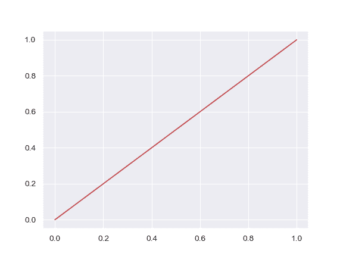
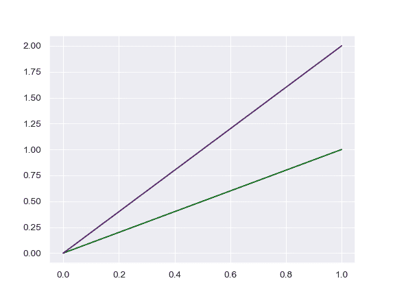

# seaborn.set_color_codes

> 译者：[cancan233](https://github.com/cancan233)

```python
seaborn.set_color_codes(palette='deep')
```

改变 matplotlib 颜色缩写词的解释方式。

调用此方法将改变 matplotlib 在后续图表中解释缩写词，例如"b"或"g"的方式。

参数： `palette`: {deep, muted, pastel, dark, bright, colorblind}

> 预命名的 seaborn 调色板，用作颜色的来源

参见

可以通过高级 seaborn 样式管理器设置颜色代码。也可以通过设置 matplotlib 颜色循环功能设置颜色代码。

示例：

将 matplotlib 颜色代码映射到默认的 seaborn 调色板。

```python
>>> import matplotlib.pyplot as plt
>>> import seaborn as sns; sns.set()
>>> sns.set_color_codes()
>>> _ = plt.plot([0, 1], color="r")
```



使用不同的 seaborn 调色板

```python
>>> sns.set_color_codes("dark")
>>> _ = plt.plot([0, 1], color="g")
>>> _ = plt.plot([0, 2], color="m")
```



