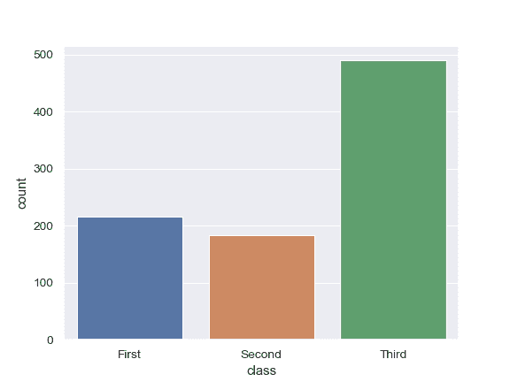
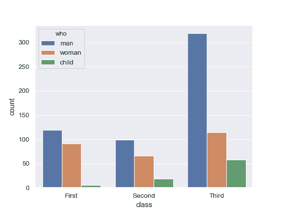
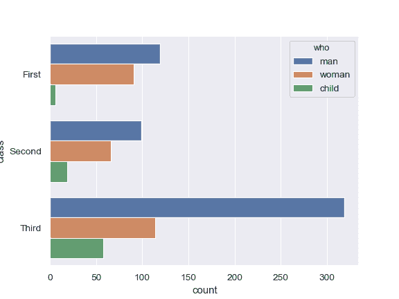
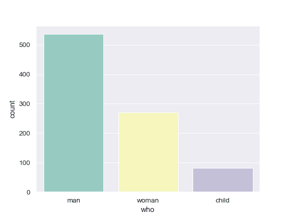
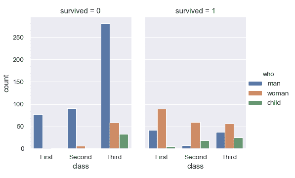

# seaborn.countplot

> 译者：[Stuming](https://github.com/Stuming)

```py
seaborn.countplot(x=None, y=None, hue=None, data=None, order=None, hue_order=None, orient=None, color=None, palette=None, saturation=0.75, dodge=True, ax=None, **kwargs)
```

seaborn.countplot 使用条形图显示每个类别中观测值的数量。

这个函数可以被认为是针对类别变量的直方图。基本的 API 和选项与[`barplot()`](seaborn.barplot.html#seaborn.barplot "seaborn.barplot")完全相同，因此可以对比学习。

可以通过多种格式传入数据，包括：

*   通过列表、numpy 数组、或者 pandas Series 对象表示的向量数据，数据直接传给`x`, `y`, 和/或`hue`参数。
*   长格式的 DataFrame，此时会通过`x`, `y`以及`hue`变量决定如何绘制数据。
*   宽格式的 DataFrame，此时每个数值型的 column 都会被绘制。
*   数组或者列表形式的向量

在绝大多数情况下，数据格式都可以使用 numpy 或者 Python 对象，但是推荐使用 pandas 对象，因为 pandas 对象中相关的名称会被用于注释坐标轴。此外，可以通过设置分组变量为使用 Categorical 类型来控制绘制元素的顺序。

这个函数总会将变量作为类别变量进行处理，按顺序(0, 1, ... n)在相应坐标轴绘制数据，即使数据为数值或者日期类型。

更多信息参考[tutorial](http://seaborn.pydata.org/tutorial/categorical.html#categorical-tutorial). 

参数：`x, y, hue`: `data`或者向量数据中的变量名，可选

> 用于绘制长格式数据的输入。查看解释示例

`data`：DataFrame, 数组，或者包含数组的列表，可选

> 用于绘制的数据集。如果`x`和`y`不存在，那么会将数据按宽格式进行处理，否则应当为长格式。 

`order, hue_order`：包含字符串的列表，可选

> 类别层级绘制的顺序，否则层级会从数据对象中推测。

`orient`: “v” &#124; “h”, 可选

> 绘制的朝向（竖直或者水平）。通过从输入变量的 dtype 进行推断。当类别变量是数值型或者绘制宽格式数据时，可以进行指定。

`color`: matplotlib 颜色，可选

> 所有元素的颜色，或者渐变调色盘的种子。

`palette`: 调色盘名称，列表或字典，可选

> 用于`hue`变量的不同级别的颜色。应当是[`color_palette()`](seaborn.color_palette.html#seaborn.color_palette "seaborn.color_palette")可以解释的东西，或者将色调级别映射到 matplotlib 颜色的字典。

`saturation`: float, 可选

> 在原有饱和度的比例下绘制颜色。大片的图块通常在略微不饱和的颜色下看起来更好，而如果想要绘制的颜色与输入颜色规格完全匹配，应当设置此值为`1`。

`dodge`: bool, 可选

> 当使用色调嵌套时，决定是否沿着类别轴对元素进行移位。

`ax`: matplotlib 轴，可选

> 绘制图像的轴对象，不指定时使用当前轴。

`kwargs`: 键值映射

> 其他关键字参数会被传递给`plt.bar`.


返回值：`ax`: matplotlib 轴

> 返回带有绘图的轴对象。


另请参阅

[`barplot()`](seaborn.barplot.html#seaborn.barplot "seaborn.barplot"): 使用条形图显示点估计和置信区间。

[`factorplot()`](seaborn.factorplot.html#seaborn.factorplot "seaborn.factorplot"): 结合类别图与`FacetGrid`类。

示例

显示单个类别变量的计数值：

```py
>>> import seaborn as sns
>>> sns.set(style="darkgrid")
>>> titanic = sns.load_dataset("titanic")
>>> ax = sns.countplot(x="class", data=titanic)

```



显示两个类别变量的计数值：

```py
>>> ax = sns.countplot(x="class", hue="who", data=titanic)

```



水平绘制条形图：

```py
>>> ax = sns.countplot(y="class", hue="who", data=titanic)

```



使用不同的颜色色盘：

```py
>>> ax = sns.countplot(x="who", data=titanic, palette="Set3")

```



使用`plt.bar`的关键字参数获得不同的显示效果：

```py
>>> ax = sns.countplot(x="who", data=titanic,
...                    facecolor=(0, 0, 0, 0),
...                    linewidth=5,
...                    edgecolor=sns.color_palette("dark", 3))

```


使用[`catplot()`](seaborn.catplot.html#seaborn.catplot "seaborn.catplot")实现结合[`countplot()`](#seaborn.countplot "seaborn.countplot")以及[`FacetGrid`](seaborn.FacetGrid.html#seaborn.FacetGrid "seaborn.FacetGrid")的效果。这样做可以在额外的类别变量中进行分组。使用[`catplot()`](seaborn.catplot.html#seaborn.catplot "seaborn.catplot")比直接使用[`FacetGrid`](seaborn.FacetGrid.html#seaborn.FacetGrid "seaborn.FacetGrid")更加安全，因为这样做可以确保跨分面的变量顺序同步：

```py
>>> g = sns.catplot(x="class", hue="who", col="survived",
...                 data=titanic, kind="count",
...                 height=4, aspect=.7);

```

