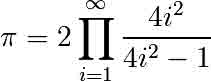

# 1.2 Python 语言

> 作者 Chris Burns, Christophe Combelles, Emmanuelle Gouillart, Gaël Varoquaux
> 
> **Python 中的科学计算** 这里我们介绍 Python 语言。这里只会仅仅解决可以用于 Numpy 和 Scipy 的最低要求。想要更多的了解这门语言，请参考[`docs.python.org/tutorial`](http://docs.python.org/tutorial) 这个非常好的教程。也可以借助专门的图书，比如：[`diveintopython.org/`](http://diveintopython.org/).

Python 是一门**编程语言**，与 C、Fortran、BASIC 和 PHP 等等类似。Python 的一些特性如下：

*   一种*解释性*（不是编译）语言。与 C 或者 Fortran 等不同，Python 代码在执行前不会编译。另外，Python 可以**交互**使用：有许多的 Python 解释器，命令和脚本可以在其中执行。
*   在**开源**证书下发布的免费软件：Python 可以免费使用和分发，即使用于商用。
*   **多平台**：Python 可以用于所有的主流操作系统，Windows、Linux/Unix、MacOS X, 甚至可能是你有手机操作系统等等。
*   可读性很强的语言，有清晰不罗嗦的语法
*   拥有大量高质量的包，可以应用于多种多样的应用，从网站框架到科学计算。
*   非常简单的接口与其他语言交互，特别是 C 和 C++
*   稍后会介绍一些语言的其他特性。例如 Python 是面向对象的语言，包含动态类型（一个变量可以在程序过程中，可以包含不同的对象类型）。

Python 的特有特性的更多信息，请见：[`www.python.org/about/`](http://www.python.org/about/)

## 1.2.1 第一步

启动**IPython** Shell(一个增强的 Python 交互 Shell)：

*   在 Linux/Mac 终端中输入“ipython”，或者在 Windows cmd sheell，
*   或者从菜单启动程序，即在[Python(x,y)](http://www.pythonxy.com/)或[EPD](http://www.enthought.com/products/epd.php)，如果你已经安装这些 Python 科学套装之一。

如果你的电脑上还没有安装 IPython，也可以选择其他 Python shells，比如在终端中输入“Python”启动纯 Python shell，或者 Idle 解释器。但是，我们建议使用 IPython Shell，因为它增强特性，特别是对于科学计算。

如果你已经启动了解释器，输入

In [2]:

```py
print "Hello, world!" 
```

```py
Hello, world! 
```

接下来就会显示信息"Hello, world!"。你已经执行了你的第一条 Python 命令，恭喜！

你自己开始吧，输入下列命令

In [1]:

```py
a = 3
b = 2*a
type(b) 
```

Out[1]:

```py
int 
```

In [2]:

```py
print b 
```

```py
6 
```

In [3]:

```py
a*b 
```

Out[3]:

```py
18 
```

In [4]:

```py
b = 'hello'
type(b) 
```

Out[4]:

```py
str 
```

In [5]:

```py
b + b 
```

Out[5]:

```py
'hellohello' 
```

In [6]:

```py
2*b 
```

Out[6]:

```py
'hellohello' 
```

上面定义了*a*和*b*两个变量。注意这里在赋值前没有声明变量类型。相反，在 C 中，应该写为：

```py
int a=3; 
```

另外，变量的类型可以改变，在一个时间点它可以等于一个特定类型，在接下来的时间里，他可以等于另外的类型。*b*首先等于整数，但是当它被赋值为*"hello"*时他变成等于字符。在 Python 中，整数的运算符（b＝2*a）原生支持的，一些字符上的操作符例如相加和相乘也是支持的，相当于串联和重复。

## 1.2.2 基础类型

### 1.2.2.1 数值类型

Python 支持如下的数值、标量类型：

**整型：**

In [8]:

```py
1 + 1 
```

Out[8]:

```py
2 
```

In [11]:

```py
a = 4
type(a) 
```

Out[11]:

```py
int 
```

**浮点型：**

In [12]:

```py
c = 2.1
type(c) 
```

Out[12]:

```py
float 
```

**复数：**

In [13]:

```py
a = 1.5 + 0.5j
a.real 
```

Out[13]:

```py
1.5 
```

In [14]:

```py
a.imag 
```

Out[14]:

```py
0.5 
```

In [15]:

```py
type(1\. + 0j ) 
```

Out[15]:

```py
complex 
```

**布尔：**

In [16]:

```py
3 > 4 
```

Out[16]:

```py
False 
```

In [17]:

```py
test = (3 > 4)
test 
```

Out[17]:

```py
False 
```

In [18]:

```py
type(test) 
```

Out[18]:

```py
bool 
```

因此，Python shell 可以代替你的口袋计算器，因为基本的代数操作符 +、-、*、/、%（模）都已经原生实现了。

In [19]:

```py
7 * 3. 
```

Out[19]:

```py
21.0 
```

In [20]:

```py
2**10 
```

Out[20]:

```py
1024 
```

In [21]:

```py
8 % 3 
```

Out[21]:

```py
2 
```

类型转化（投射）：

In [22]:

```py
float(1) 
```

Out[22]:

```py
1.0 
```

**注意**：整数相除

In [23]:

```py
3 / 2 
```

Out[23]:

```py
1 
```

**技巧**：使用浮点：

In [24]:

```py
3 / 2. 
```

Out[24]:

```py
1.5 
```

In [25]:

```py
a = 3
b = 2
a / b 
```

Out[25]:

```py
1 
```

In [26]:

```py
a / float(b) 
```

Out[26]:

```py
1.5 
```

如果你明确想要整除，请使用//：

In [27]:

```py
3.0 // 2 
```

Out[27]:

```py
1.0 
```

Python3 改变了除运算符行为。细节请看[python3porting](http://python3porting.com/preparing.html#use-instead-of-when-dividing-integers)网站.

### 1.2.2.2 容器

Python 提供了许多有效的容器类型，其中存储了对象集合。

#### 1.2.2.2.1 列表

列表是一个有序的对象集合，对象可以有多种类型。例如：

In [28]:

```py
L = ['red', 'blue', 'green', 'black', 'white']
type(L) 
```

Out[28]:

```py
list 
```

索引：访问包含在列表中的单个对象：

In [29]:

```py
L[2] 
```

Out[29]:

```py
'green' 
```

使用负索引，从结尾开始计数：

In [30]:

```py
L[-1] 
```

Out[30]:

```py
'white' 
```

In [31]:

```py
L[-2] 
```

Out[31]:

```py
'black' 
```

**注意：索引从 0 开始**（和 C 中一样），而不是 1（像在 Fortran 或 Matlab）！

切片：获得规律分布元素的子列表：

In [32]:

```py
L 
```

Out[32]:

```py
['red', 'blue', 'green', 'black', 'white'] 
```

In [33]:

```py
L[2:4] 
```

Out[33]:

```py
['green', 'black'] 
```

**注意**：L[start:stop]包含索引 start<= i < stop 的元素（i 的范围从 start 到 stop-1）。因此，L[start:stop]包含（stop-start）个元素。

**切片语法**：`L[start:stop:stride]`

所有切片参数都是可选的：

In [34]:

```py
L 
```

Out[34]:

```py
['red', 'blue', 'green', 'black', 'white'] 
```

In [35]:

```py
L[3:] 
```

Out[35]:

```py
['black', 'white'] 
```

In [36]:

```py
L[:3] 
```

Out[36]:

```py
['red', 'blue', 'green'] 
```

列表是可变对象，可以被改变：

In [38]:

```py
L[0] = 'yellow'
L 
```

Out[38]:

```py
['yellow', 'blue', 'green', 'black', 'white'] 
```

In [39]:

```py
L[2:4] = ['gray', 'purple']
L 
```

Out[39]:

```py
['yellow', 'blue', 'gray', 'purple', 'white'] 
```

**注：**一个列表的元素可以有不同的类型：

In [40]:

```py
L = [3, -200, 'hello']
L 
```

Out[40]:

```py
[3, -200, 'hello'] 
```

In [41]:

```py
L[1], L[2] 
```

Out[41]:

```py
(-200, 'hello') 
```

对于一个所有类型都相同的数值数据集合，使用 Numpy 模块提供的数组类型通常更有效。Numpy 数组是包含固定大小项目的内存组块。使用 Numpy 数组，元素上的操作可以非常快速，因为元素均匀分布在内存上并且更多的操作是通过特殊的 C 函数而不是 Python 循环。

Python 提供了一大组函数来修改或查询列表。这里是一些例子，更多内容，请见：[`docs.python.org/tutorial/datastructures.html#more-on-lists`](http://docs.python.org/tutorial/datastructures.html#more-on-lists)

添加和删除元素：

In [42]:

```py
L = ['red', 'blue', 'green', 'black', 'white']
L.append('pink')
L 
```

Out[42]:

```py
['red', 'blue', 'green', 'black', 'white', 'pink'] 
```

In [43]:

```py
L.pop() # 删除并返回最后一个项目 
```

Out[43]:

```py
'pink' 
```

In [44]:

```py
L 
```

Out[44]:

```py
['red', 'blue', 'green', 'black', 'white'] 
```

In [45]:

```py
L.extend(['pink', 'purple']) # 扩展列表 L，原地
L 
```

In [46]:

```py
L = L[:-2]
L 
```

Out[46]:

```py
['red', 'blue', 'green', 'black', 'white'] 
```

反转：

In [47]:

```py
r = L[::-1]
r 
```

Out[47]:

```py
['white', 'black', 'green', 'blue', 'red'] 
```

In [48]:

```py
r2 = list(L)
r2 
```

Out[48]:

```py
['red', 'blue', 'green', 'black', 'white'] 
```

In [49]:

```py
r2.reverse() # 原对象
r2 
```

Out[49]:

```py
['white', 'black', 'green', 'blue', 'red'] 
```

串联和重复列表：

In [50]:

```py
r + L 
```

Out[50]:

```py
['white',
 'black',
 'green',
 'blue',
 'red',
 'red',
 'blue',
 'green',
 'black',
 'white'] 
```

In [51]:

```py
r * 2 
```

Out[51]:

```py
['white',
 'black',
 'green',
 'blue',
 'red',
 'white',
 'black',
 'green',
 'blue',
 'red'] 
```

排序：

In [52]:

```py
sorted(r) # 新对象 
```

Out[52]:

```py
['black', 'blue', 'green', 'red', 'white'] 
```

In [53]:

```py
r 
```

Out[53]:

```py
['white', 'black', 'green', 'blue', 'red'] 
```

In [55]:

```py
r.sort() # 原对象
r 
```

Out[55]:

```py
['black', 'blue', 'green', 'red', 'white'] 
```

**方法和面向对象编程**

符号 r.method() (即 r.append(3) and L.pop()) 是我们第一个关于面向对象编程的例子（OOP）。作为列表，对象 r 有可以以这种方式调用的方法函数。对于这篇教程不需要关于面向对象编程的更多知识，只需要理解这种符号。

**发现方法**：

提醒：在 IPython 中：tab 完成 (按 tab)

```py
In [28]: r.<TAB>
r.__add__           r.__iadd__        r.__setattr__
r.__class__         r.__imul__        r.__setitem__
r.__contains__      r.__init__        r.__setslice__
r.__delattr__       r.__iter__        r.__sizeof__
r.__delitem__       r.__le__          r.__str__
r.__delslice__      r.__len__         r.__subclasshook__
r.__doc__           r.__lt__          r.append
r.__eq__            r.__mul__         r.count
r.__format__        r.__ne__          r.extend
r.__ge__            r.__new__         r.index
r.__getattribute__  r.__reduce__      r.insert
r.__getitem__       r.__reduce_ex__   r.pop
r.__getslice__      r.__repr__        r.remove
r.__gt__            r.__reversed__    r.reverse
r.__hash__          r.__rmul__        r.sort 
```

#### 1.2.2.2.2 字符

不同的字符语法（单引号、双引号或三个引号）：

In [58]:

```py
s = 'Hello, how are you?'
s = "Hi, what's up"
s = '''Hello, 
 how are you'''         # 三个引号可以允许字符跨行
s = """Hi,
what's up?"""
'Hi, what's up?' 
```

```py
 File "<ipython-input-58-dfe00f996c26>", line 7
 'Hi, what's up?'
              ^
SyntaxError: invalid syntax 
```

如果在字符中要是使用引号，那么应该嵌套使用，或者使用"\"进行转义，否则会报错。

换行的符号为 \n，tab 符号是\t。

字符也是类似与列表的结合。因此，也可以使用相同的语法和规则索引和切片。

索引：

In [59]:

```py
a = "hello"
a[0] 
```

Out[59]:

```py
'h' 
```

In [60]:

```py
a[1] 
```

Out[60]:

```py
'e' 
```

In [61]:

```py
a[-1] 
```

Out[61]:

```py
'o' 
```

（记住负索引从右侧开始计数。）

切片：

In [64]:

```py
a = "hello, world!"
a[3:6] # 第三到第六个（不包含）元素：元素 3、4、5 
```

Out[64]:

```py
'lo,' 
```

In [65]:

```py
a[2:10:2] # 语法：a[开始：结束：步幅] 
```

Out[65]:

```py
'lo o' 
```

In [66]:

```py
a[::3] # 从开始到结尾，每隔 3 个字母 
```

Out[66]:

```py
'hl r!' 
```

重音符号和特殊字符也可以被处理为 Unicode 字符（请见 [`docs.python.org/tutorial/introduction.html#unicode-strings）。`](http://docs.python.org/tutorial/introduction.html#unicode-strings）。)

字符是**不可变**对象，不可能修改内容。不过可以从原始的字符中创建一个新的字符。

In [68]:

```py
a = "hello, world!"
a[2] = 'z' 
```

```py
---------------------------------------------------------------------------
TypeError                                 Traceback (most recent call last)
<ipython-input-68-8f124c87c8cf> in <module>()
 1 a = "hello, world!"
----> 2  a[2] = 'z'

TypeError: 'str' object does not support item assignment 
```

In [69]:

```py
a.replace('l', 'z', 1) 
```

Out[69]:

```py
'hezlo, world!' 
```

In [70]:

```py
a.replace('l', 'z') 
```

Out[70]:

```py
'hezzo, worzd!' 
```

字符有许多有用的方法，比如上面的 a.replace。回忆一下 a.面向对象的符号，并且使用 tab 完成或者 help(str)来搜索新的方法。and use tab completion or

**更多内容** Python 提供了操作的字符的高级可能性，看一下模式或格式。感兴趣的读者请参考：[`docs.python.org/library/stdtypes.html#string-methods`](http://docs.python.org/library/stdtypes.html#string-methods) 和 [`docs.python.org/library/string.html#new-string-formatting。`](http://docs.python.org/library/string.html#new-string-formatting。)

字符格式：

In [71]:

```py
'An integer: %i; a float: %f; another string: %s' % (1, 0.1, 'string') 
```

Out[71]:

```py
'An integer: 1; a float: 0.100000; another string: string' 
```

In [72]:

```py
i = 102
filename = 'processing_of_dataset_%d.txt' % i
filename 
```

Out[72]:

```py
'processing_of_dataset_102.txt' 
```

#### 1.2.2.2.3\. Dictionaries

字典本质上是一个**映射键值**的高效表格。它是一个**无序**的容器

In [74]:

```py
tel = {'emmanuelle': 5752, 'sebastian': 5578}
tel['francis'] = 5915
tel 
```

Out[74]:

```py
{'emmanuelle': 5752, 'francis': 5915, 'sebastian': 5578} 
```

In [75]:

```py
tel['sebastian'] 
```

Out[75]:

```py
5578 
```

In [76]:

```py
tel.keys() 
```

Out[76]:

```py
['sebastian', 'francis', 'emmanuelle'] 
```

In [77]:

```py
tel.values() 
```

Out[77]:

```py
[5578, 5915, 5752] 
```

它可以方便的以名字（日期的字符和名称等）存储和获取值。更多信息见 [`docs.python.org/tutorial/datastructures.html#dictionaries。`](http://docs.python.org/tutorial/datastructures.html#dictionaries。)

一个字典的键（代表值）可以有不同的类型：

In [78]:

```py
d = {'a':1, 'b':2, 3:'hello'}
d 
```

Out[78]:

```py
{3: 'hello', 'a': 1, 'b': 2} 
```

#### 1.2.2.2.4\. More container types

**元组**

元组本质上是不可变列表。元组的元素用括号包起来，或者只是用逗号分割：

In [79]:

```py
t = 12345, 54321, 'hello!'
t[0] 
```

Out[79]:

```py
12345 
```

In [80]:

```py
t 
```

Out[80]:

```py
(12345, 54321, 'hello!') 
```

In [81]:

```py
u = (0, 2) 
```

**集合**：无序，惟一项目：

In [82]:

```py
s = set(('a', 'b', 'c', 'a'))
s 
```

Out[82]:

```py
{'a', 'b', 'c'} 
```

In [83]:

```py
s.difference(('a', 'b')) 
```

Out[83]:

```py
{'c'} 
```

#### 1.2.2.3\. 赋值运算

[Python 类库参考：](http://docs.python.org/reference/simple_stmts.html#assignment-statements)

> 赋值语句被用于（重）绑定名称与值，以及修改可变对象的项目或属性。

简单来说，它这样工作（简单赋值）：

1.  右侧表达式被评估，创建或获得产生的对象

2.  左侧的名字被赋值或绑定到右侧的对象

需要注意的事情：

*   单个对象可以有多个绑定的名称：

In [84]:

```py
a = [1, 2, 3]
b = a
a 
```

Out[84]:

```py
[1, 2, 3] 
```

In [85]:

```py
b 
```

Out[85]:

```py
[1, 2, 3] 
```

In [86]:

```py
a is b 
```

Out[86]:

```py
True 
```

In [87]:

```py
b[1] = 'hi!'
a 
```

Out[87]:

```py
[1, 'hi!', 3] 
```

*   要在**原地**改变列表，请使用索引或切片：

In [88]:

```py
a = [1, 2, 3]
a 
```

Out[88]:

```py
[1, 2, 3] 
```

In [89]:

```py
a = ['a', 'b', 'c'] # 创建另一个对象
a 
```

Out[89]:

```py
['a', 'b', 'c'] 
```

In [90]:

```py
id(a) 
```

Out[90]:

```py
4394695640 
```

In [91]:

```py
a[:] = [1, 2, 3] # 在原地修改对象
a 
```

Out[91]:

```py
[1, 2, 3] 
```

In [92]:

```py
id(a) 
```

Out[92]:

```py
4394695640 
```

与上一个 id 相同，你的可能有所不同...

*   这里的关键观点是可变 vs. 不可变

    *   可变对象可以在原地修改
    *   不可变对象一旦被创建就不可修改

**更多内容**在 David M. Beazley 的文章[Python 中的类型和对象](http://www.informit.com/articles/article.aspx?p=453682)中也可以找到关于以上问题非常不错的详尽解释。

## 1.2.3 流程控制

控制代码执行顺序。

### 1.2.3.1 if/elif/else

In [93]:

```py
if 2**2 == 4:
    print 'Obvious!' 
```

```py
Obvious! 
```

**代码块用缩进限定**

**小技巧**：在你的 Python 解释器内输入下列行，并且注意保持缩进深度。IPython shell 会在一行的 : 符号后自动增加缩进，如果要减少缩进，向左侧移动 4 个空格使用后退键。按两次回车键离开逻辑块。

In [96]:

```py
a = 10
if a == 1:
    print(1)
elif a == 2:
    print(2)
else:
    print('A lot') 
```

```py
A lot 
```

在脚本中也是强制缩进的。作为练习，在 condition.py 脚本中以相同的缩进重新输入之前几行，并在 IPython 中用`run condition.py`执行脚本。

### 1.2.3.2 for/range

在索引上迭代：

In [97]:

```py
for i in range(4):
    print(i) 
```

```py
0
1
2
3 
```

但是最经常使用，也更易读的是在值上迭代：

In [98]:

```py
for word in ('cool', 'powerful', 'readable'):
    print('Python is %s' % word) 
```

```py
Python is cool
Python is powerful
Python is readable 
```

### 1.2.3.3 while/break/continue

典型的 C 式 While 循环（Mandelbrot 问题）：

In [13]:

```py
z = 1 + 1j
while abs(z) < 100: 
    z = z**2 + 1
z 
```

Out[13]:

```py
(-134+352j) 
```

**更高级的功能**

bread 跳出 for/while 循环：

In [103]:

```py
z = 1 + 1j
while abs(z) < 100:
    if z.imag == 0:
        break
    z = z**2 + 1
    print z 
```

```py
(1+2j)
(-2+4j)
(-11-16j)
(-134+352j) 
```

continue 继续下一个循环迭代：

In [101]:

```py
a = [1, 0, 2, 4]
for element in a:
    if element == 0:
        continue
    print 1\. / element 
```

```py
1.0
0.5
0.25 
```

### 1.2.3.4 条件表达式

**if [OBJECT]：**

评估为 False：

```py
- 任何等于 0 的数字 (0、0.0、0+0j)
- 空容器（列表、元组、集合、字典, ...）
- False，None 
```

评估为 True：

```py
- 任何其他的东西 
```

**a == b：**

判断逻辑是否相等：

In [1]:

```py
1 == 1 
```

Out[1]:

```py
True 
```

**a is b：**

测试同一性：两边是相同的对象：

In [2]:

```py
1 is 1 
```

Out[2]:

```py
True 
```

In [3]:

```py
a = 1
b = 1
a is b 
```

Out[3]:

```py
True 
```

**a in b：**

对于任何集合 b：b 包含 a

In [11]:

```py
b = [1, 2, 3]
2 in b 
```

Out[11]:

```py
True 
```

In [12]:

```py
5 in b 
```

Out[12]:

```py
False 
```

如果 b 是字典，这个语法测试 a 是否是 b 的一个键。

### 1.2.3.5\. 高级循环

#### 1.2.3.5.1 序列循环

你可以在任何序列上进行循环（字符、列表、字典的键，文件的行...）：

In [14]:

```py
vowels = 'aeiouy'
for i in 'powerful':
    if i in vowels:
        print(i), 
```

```py
o e u 
```

In [15]:

```py
message = "Hello how are you?"
message.split() # 返回一个列表 
```

Out[15]:

```py
['Hello', 'how', 'are', 'you?'] 
```

In [16]:

```py
for word in message.split():
    print word 
```

```py
Hello
how
are
you? 
```

很少有语言（特别是科学计算语言）允许在整数或索引之外的循环。在 Python 中，可以在感兴趣的对象上循环，而不用担心你通常不关心的索引。这个功能通常用来让代码更易读。

**警告**：改变正在循环的序列是不安全的。

#### 1.2.3.5.2 跟踪列举数

通常任务是在一个序列上循环，同时跟踪项目数。

```py
- 可以像上面，使用带有计数器的 while 循环。或者一个 for 循环： 
```

In [17]:

```py
words = ('cool', 'powerful', 'readable')
for i in range(0, len(words)):
    print i, words[i] 
```

```py
0 cool
1 powerful
2 readable 
```

但是，Python 为这种情况提供了 enumerate 关键词：

In [18]:

```py
for index, item in enumerate(words):
    print index, item 
```

```py
0 cool
1 powerful
2 readable 
```

#### 1.2.3.5.3 字典循环

使用**iteritems**：

In [19]:

```py
d = {'a': 1, 'b':1.2, 'c':1j}
for key, val in d.iteritems():
    print('Key: %s has value: %s' % (key, val)) 
```

```py
Key: a has value: 1
Key: c has value: 1j
Key: b has value: 1.2 
```

#### 1.2.3.5.4 列表理解

In [20]:

```py
[i**2 for i in range(4)] 
```

Out[20]:

```py
[0, 1, 4, 9] 
```

**练习**

用 Wallis 公式，计算π的小数



## 1.2.4\. 定义函数

### 1.2.4.1 函数的定义

In [21]:

```py
def test():
    print('in test function')

test() 
```

```py
in test function 
```

**注意**：函数块必须像其他流程控制块一样缩进

### 1.2.4.2 返回语句

函数**可以选择**返回值。

In [22]:

```py
def disk_area(radius):
    return 3.14 * radius * radius

disk_area(1.5) 
```

Out[22]:

```py
7.0649999999999995 
```

**注意**：默认函数返回`None`。

**注意**：注意定义函数的语法：

*   def 关键字：
*   接下来是函数的名称，然后
*   在冒号后是在括号中的函数的参数。
*   函数体；
*   以及可选返回值的返回对象

### 1.2.4.3 参数

必选参数（位置参数）

In [24]:

```py
def double_it(x):
    return x * 2

double_it(3) 
```

Out[24]:

```py
6 
```

In [25]:

```py
double_it() 
```

```py
---------------------------------------------------------------------------
TypeError                                 Traceback (most recent call last)
<ipython-input-25-51cdedbb81b0> in <module>()
----> 1  double_it()

TypeError: double_it() takes exactly 1 argument (0 given) 
```

可选参数（关键词和命名参数）

In [26]:

```py
def double_it(x=2):
    return x * 2

double_it() 
```

Out[26]:

```py
4 
```

In [27]:

```py
double_it(3) 
```

Out[27]:

```py
6 
```

关键词参数允许你设置特定默认值。

**警告：**默认值在函数定义时被评估，而不是在调用时。如果使用可变类型（即字典或列表）并在函数体内修改他们，这可能会产生问题，因为这个修改会在函数被引用的时候一直持续存在。

在关键词参数中使用不可变类型：

In [2]:

```py
bigx = 10
def double_it(x=bigx):
    return x * 2
bigx = 1e9  # 现在真的非常大
double_it() 
```

Out[2]:

```py
20 
```

在关键词参数中使用可变类型（并且在函数体内修改它）：

In [3]:

```py
def add_to_dict(args={'a': 1, 'b': 2}):
    for i in args.keys():
        args[i] += 1
    print args

add_to_dict 
```

Out[3]:

```py
<function __main__.add_to_dict> 
```

In [4]:

```py
add_to_dict() 
```

```py
{'a': 2, 'b': 3} 
```

In [5]:

```py
add_to_dict() 
```

```py
{'a': 3, 'b': 4} 
```

In [6]:

```py
add_to_dict() 
```

```py
{'a': 4, 'b': 5} 
```

更复杂的例子，实现 Python 的切片：

In [7]:

```py
def slicer(seq, start=None, stop=None, step=None):
    """Implement basic python slicing."""
    return seq[start:stop:step]

rhyme = 'one fish, two fish, red fish, blue fish'.split()

rhyme 
```

Out[7]:

```py
['one', 'fish,', 'two', 'fish,', 'red', 'fish,', 'blue', 'fish'] 
```

In [8]:

```py
slicer(rhyme) 
```

Out[8]:

```py
['one', 'fish,', 'two', 'fish,', 'red', 'fish,', 'blue', 'fish'] 
```

In [9]:

```py
slicer(rhyme, step=2) 
```

Out[9]:

```py
['one', 'two', 'red', 'blue'] 
```

In [10]:

```py
slicer(rhyme, 1, step=2) 
```

Out[10]:

```py
['fish,', 'fish,', 'fish,', 'fish'] 
```

In [11]:

```py
slicer(rhyme, start=1, stop=4, step=2) 
```

Out[11]:

```py
['fish,', 'fish,'] 
```

关键词参数的顺序**不**重要：

In [12]:

```py
slicer(rhyme, step=2, start=1, stop=4) 
```

Out[12]:

```py
['fish,', 'fish,'] 
```

但是，最好是使用与函数定义相同的顺序。

*关键词参数*是特别方便的功能，可以用可变数量的参数来定义一个函数，特别是当函数据绝大多数调用都会使用默认值时。

### 1.2.4.4 值传递

可以在一个函数内部改变变量的值吗？大多数语言（C、Java...）区分了“值传递“和”引用传递“。在 Python 中，没有严格的这种区分，并且视你的变量是否会修改而有一些不同。幸运的是，这些情况存在明确的规则。

函数的参数是对象的引用，传递的是值。当你像一个函数传递了一个变量，Python 传递的是对象的引用，这个对象引用的变量（值）。而不是变量本身。

如果**值**传递给函数的值是不可变的，那么这个函数并不会改变调用者的变量。如果**值**是可变的，那么函数将可能在原地修改调用者的变量。

In [13]:

```py
def try_to_modify(x, y, z):
    x = 23
    y.append(42)
    z = [99] # 新引用
    print(x)
    print(y)
    print(z)

a = 77    # 不可变变量
b = [99]  # 可变变量
c = [28]
try_to_modify(a, b, c) 
```

```py
23
[99, 42]
[99] 
```

In [14]:

```py
print(a) 
```

```py
77 
```

In [15]:

```py
print(b) 
```

```py
[99, 42] 
```

In [16]:

```py
print(c) 
```

```py
[28] 
```

函数有名为*local namespace*的本地变量表。

变量 X 只存在于函数 try_to_modify 内部。

### 1.2.4.5 全局变量

在函数外定义的变量可以在函数内引用：

In [18]:

```py
x = 5
def addx(y):
    return x + y

addx(10) 
```

Out[18]:

```py
15 
```

但是，这些全局变量不能在函数内修改，除非在函数内声明**global**。

这样没用：

In [19]:

```py
def setx(y):
    x = y
    print('x is %d' % x)

setx(10) 
```

```py
x is 10 
```

In [20]:

```py
x 
```

Out[20]:

```py
5 
```

这样可以：

In [21]:

```py
def setx(y):
    global x
    x = y
    print('x is %d' % x)

setx(10) 
```

```py
x is 10 
```

In [22]:

```py
x 
```

Out[22]:

```py
10 
```

### 1.2.4.6 可变数量参数

函数的特殊形式：

```py
- *args：封装成元组的任意数量的位置参数
- **kwargs：封装成字典的任意数量的关键词参数 
```

In [23]:

```py
def variable_args(*args, **kwargs):
    print 'args is', args
    print 'kwargs is', kwargs

variable_args('one', 'two', x=1, y=2, z=3) 
```

```py
args is ('one', 'two')
kwargs is {'y': 2, 'x': 1, 'z': 3} 
```

### 1.2.4.7 Docstrings

关于函数作用及参数的文档。通常惯例：

In [24]:

```py
def funcname(params):
    """Concise one-line sentence describing the function.
 Extended summary which can contain multiple paragraphs.
 """
    # 函数体
    pass

funcname? 
```

```py
Type:           function
Base Class:     type 'function'>
String Form:    <function funcname at 0xeaa0f0>
Namespace:      Interactive
File:           <ipython console>
Definition:     funcname(params)
Docstring:
    Concise one-line sentence describing the function.

    Extended summary which can contain multiple paragraphs. 
```

**注 Docstring 指导**

为了标准化，Docstring 惯例页面为 Python Docstring 相关的含义及惯例提供了文档。

Numpy 和 Scipy 模块也为科学计算函数定义了清晰的标准，你可能想要在自己的函数中去遵循，这个标准有参数部分，例子部分等。见[`projects.scipy.org/numpy/wiki/CodingStyleGuidelines#docstring-standard`](http://projects.scipy.org/numpy/wiki/CodingStyleGuidelines#docstring-standard) 及 [`projects.scipy.org/numpy/browser/trunk/doc/example.py#L37`](http://projects.scipy.org/numpy/browser/trunk/doc/example.py#L37)

### 1.2.4.8 函数作为对象

函数是一级对象，这意味着他们可以是：

```py
- 可以被赋值给变量
- 列表的一个项目（或任何集合）
- 作为参数传递给另一个函数 
```

In [26]:

```py
va = variable_args

va('three', x=1, y=2) 
```

```py
args is ('three',)
kwargs is {'y': 2, 'x': 1} 
```

### 1.2.4.9 方法

方法是对象的函数。你已经在我们关于列表、字典和字符等...的例子上看到了。

### 1.2.4.10\. 练习

**练习：斐波那契数列**

写一个函数来展示斐波那契数列的前 n 个项目，定义如下：

```py
- u_0 = 1; u_1 = 1
- u_(n+2) = u_(n+1) + u_n 
```

**练习：快速排序**

实现快速排序算法，定义来自 wikipedia：

function quicksort(array)

```py
var list less, greater if length(array) < 2

    return array

select and remove a pivot value pivot from array for each x in array

    if x < pivot + 1 then append x to less else append x to greater

return concatenate(quicksort(less), pivot, quicksort(greater)) 
```