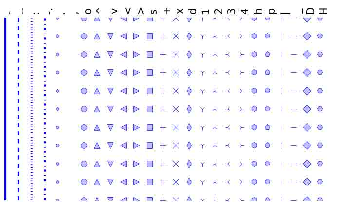
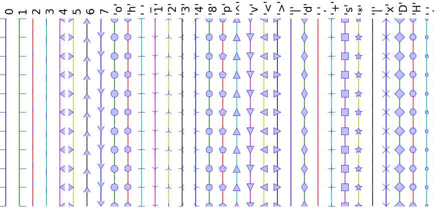
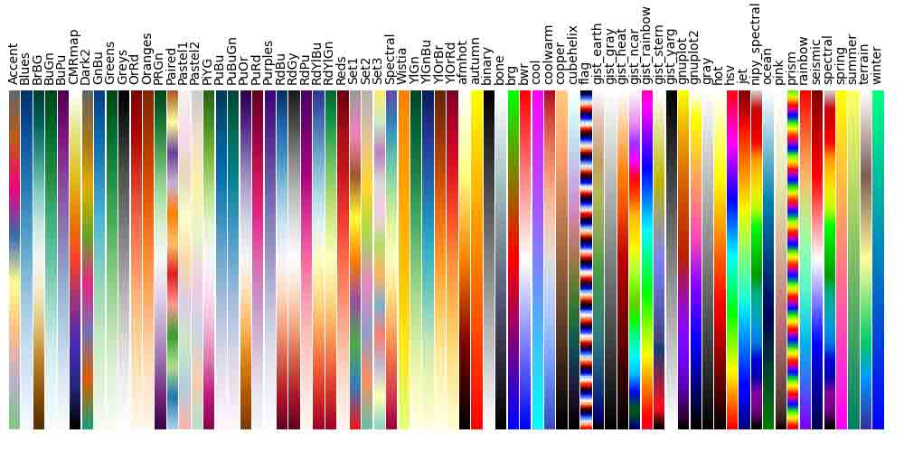

# 1.4 Matplotlib：绘图

# 1.4 Matplotlib：绘图

## 1.4.1 简介

[Matplotlib](http://matplotlib.org/) 可能是 Python 惟一一个最广泛使用的二维图包。它同时提供了从 Python 中可视化数据非常的快速方式以及多种格式的出版质量图片。我们将在交互模式下研究 Matplotlib，包含大多数的常用案例。

### 1.4.1.1 IPython 和 pylab 模式

[IPython](http://ipython.org/)是强化版交互 Python shell，有许多有趣的功能，包括：输入输出的命名、访问 shell 命令改进错误排除等。它位于 Python 中的科学计算工作流的核心，要让它与 Matplotlib 的结合使用：

用命令行参数 `-pylab`（`--pylab` 从 IPython0.12 开始）启动 IPython，获得带有 Matlab/Mathematica 类似功能的交互 Matplotlib session。

### 1.4.1.2 pylab

*pylab*提供了 matplotlib 面向对象的绘图库的程序接口。它的模型与 Matlab™非常相近。因此，pylab 中的绝大多数绘图命令 Matlab™都有带有相似函数的类似实现。重要的命令会以交互例子来解释。

## 1.4.2 简单绘图

在这个部分，我们将在同一个图像中绘制 cosine 和 sine 函数。从默认设置开始，我们将不断丰富图片，让它看起来更漂亮。

第一步获得 sine 和 cosine 函数的数据：

In [2]:

```py
import numpy as np

X = np.linspace(-np.pi, np.pi, 256, endpoint=True)
C, S = np.cos(X), np.sin(X) 
```

`X`现在是 Numpy 数组，范围是`-π`到`+π`之间（包含）的 256 个值。C 是 cosine（256 个值），而 S 是 sine（256 个值）

要运行例子，你可以在 IPython 的交互 session 中输入这些命令：

```py
ipython --pylab 
```

这会将我们带到 IPython 提示符：

```py
IPython 2.3.1 -- An enhanced Interactive Python.
?         -> Introduction and overview of IPython's features.
%quickref -> Quick reference.
help      -> Python's own help system.
object?   -> Details about 'object', use 'object??' for extra details.
Using matplotlib backend: MacOSX 
```

你可以下载每个示例，然后用平常的 Python 运行，但是，你将没法动态的数据操作：

```py
python exercice_1.py 
```

通过点击对应的图片，你可以获得每一步的源码。

### 1.4.2.1 用默认设置绘图

**提示**：文档

*   [plot 教程](http://matplotlib.sourceforge.net/users/pyplot_tutorial.html)
*   [plot()命令](http://matplotlib.sourceforge.net/api/pyplot_api.html#matplotlib.pyplot.plot)

Matplotlib 有一组默认设置，允许自定义所有的属性。你几乎可以控制在 matplotlib 中的所有属性：图片大小和 dpi、线长度、颜色和样式、坐标轴、坐标轴和网格属性、文本和字体属性等等。

```py
import pylab as pl
import numpy as np

X = np.linspace(-np.pi, np.pi, 256, endpoint=True)
C, S = np.cos(X), np.sin(X)

pl.plot(X, C)
pl.plot(X, S)

pl.show() 
```


### 1.4.2.2 默认值示例

**提示**：文档

*   [自定义 matplotlib](http://matplotlib.sourceforge.net/users/customizing.html)

在下面的脚本中，我们标示（备注）了影响绘图外观的所有图片设置。

这些设置被显式的设置为默认值，但是现在你可以交互的实验这些值以便验证他们的效果（看一下下面的[线属性](http://scipy-lectures.github.io/intro/matplotlib/matplotlib.html#line-properties)和[线样式](http://scipy-lectures.github.io/intro/matplotlib/matplotlib.html#line-styles))。

```py
import pylab as pl
import numpy as np

# 创建一个大小为 8X6 英寸，每英寸 80 个点的图片
pl.figure(figsize=(8, 6), dpi=80)

# 从 1X1 的网格创建一个子图片
pl.subplot(1, 1, 1)

X = np.linspace(-np.pi, np.pi, 256, endpoint=True)
C, S = np.cos(X), np.sin(X)

# 用宽度为 1（像素）的蓝色连续直线绘制 cosine
pl.plot(X, C, color="blue", linewidth=1.0, linestyle="-")

# 用宽度为 1（像素）的绿色连续直线绘制 sine
pl.plot(X, S, color="green", linewidth=1.0, linestyle="-")

# 设置 x 轴的极值
pl.xlim(-4.0, 4.0)

# 设置 x 轴的刻度值
pl.xticks(np.linspace(-4, 4, 9, endpoint=True))

# 设置 y 轴的极值
pl.ylim(-1.0, 1.0)

# 设置 y 轴的刻度值
pl.yticks(np.linspace(-1, 1, 5, endpoint=True))

# 用 72dpi 保存图片
# savefig("exercice_2.jpg", dpi=72)

# 在屏幕上显示结果
pl.show() 
```


### 1.4.2.3 改变颜色和线宽度

**提示**：文档

*   [控制线属性](http://matplotlib.sourceforge.net/users/pyplot_tutorial.html#controlling-line-properties)
*   [线 API](http://matplotlib.sourceforge.net/api/artist_api.html#matplotlib.lines.Line2D)

首先，我们想要 cosine 是蓝色，sine 是红色，两者都是稍稍粗一点的线。我们也改变了一点图片的大小，让它更加水平。

```py
pl.figure(figsize=(10, 6), dpi=80)
pl.plot(X, C, color="blue", linewidth=2.5, linestyle="-")
pl.plot(X, S, color="red",  linewidth=2.5, linestyle="-") 
```


### 1.4.2.4 设置极值

**提示**：文档

*   [xlim()命令](http://matplotlib.sourceforge.net/api/pyplot_api.html#matplotlib.pyplot.xlim)
*   [ylim()命令](http://matplotlib.sourceforge.net/api/pyplot_api.html#matplotlib.pyplot.ylim)

当前的图片的极值限制太拥挤了，我们希望留一点空间以便清晰的看到所有的数据点。

```py
pl.xlim(X.min() * 1.1, X.max() * 1.1)
pl.ylim(C.min() * 1.1, C.max() * 1.1) 
```


### 1.4.2.5 设置坐标轴刻度值

**提示**：文档

*   [xticks()命令](http://matplotlib.sourceforge.net/api/pyplot_api.html#matplotlib.pyplot.xticks)
*   [yticks()命令](http://matplotlib.sourceforge.net/api/pyplot_api.html#matplotlib.pyplot.yticks)
*   [刻度容器](http://matplotlib.sourceforge.net/users/artists.html#axis-container)
*   [刻度位置和格式](http://matplotlib.sourceforge.net/api/ticker_api.html)

现在的刻度不太理想，因为他们没有显示对于 sine 和 cosine 有意义的值（+/-π,+/-π/2）。我们将改变这些刻度，让他们只显示这些值。

```py
pl.xticks([-np.pi, -np.pi/2, 0, np.pi/2, np.pi])
pl.yticks([-1, 0, +1]) 
```


### 1.4.2.6 设置刻度标签

**提示**：文档

*   [操作文本](http://matplotlib.sourceforge.net/users/index_text.html)
*   [xticks()命令](http://matplotlib.sourceforge.net/api/pyplot_api.html#matplotlib.pyplot.xticks)
*   [yticks()命令](http://matplotlib.sourceforge.net/api/pyplot_api.html#matplotlib.pyplot.yticks)
*   [set_xticklabels()](http://matplotlib.sourceforge.net/api/axes_api.html?#matplotlib.axes.Axes.set_xticklabels)
*   [set_yticklabels()](http://matplotlib.sourceforge.net/api/axes_api.html?#matplotlib.axes.Axes.set_yticklabels)

刻度现在放在了正确的位置，但是标签并不是显而易见。我们能想到 3.14 是π，但是最好让它更明确。

当我们设置了刻度值，我们也可以在第二个参数中列出对应的标签。注意我们用 latex 以便更好的渲染标签。

```py
pl.xticks([-np.pi, -np.pi/2, 0, np.pi/2, np.pi],
          [r'$-\pi$', r'$-\pi/2$', r'$0$', r'$+\pi/2$', r'$+\pi$'])

pl.yticks([-1, 0, +1],
          [r'$-1$', r'$0$', r'$+1$']) 
```

### 1.4.2.7 移动脊柱

**提示**：文档

*   [脊柱](http://matplotlib.sourceforge.net/api/spines_api.html#matplotlib.spines)
*   [坐标轴容器](http://matplotlib.sourceforge.net/users/artists.html#axis-container)
*   [转换教程](http://matplotlib.sourceforge.net/users/transforms_tutorial.html)

脊柱是连接坐标轴刻度标记的线，记录了数据范围的边界。他们可以被放在任意的位置，到目前位置，他们被放在了坐标轴的四周。我们将改变他们，因为我们希望他们在中间。因为有四条（上下左右），我们通过设置颜色为 None 舍弃了顶部和右侧，并且我们将把底部和左侧的脊柱移动到数据空间坐标的零点。

```py
ax = pl.gca()  # gca stands for 'get current axis'
ax.spines['right'].set_color('none')
ax.spines['top'].set_color('none')
ax.xaxis.set_ticks_position('bottom')
ax.spines['bottom'].set_position(('data',0))
ax.yaxis.set_ticks_position('left')
ax.spines['left'].set_position(('data',0)) 
```


### 1.4.2.8 添加图例

**提示**：文档

*   [图例指南](http://matplotlib.sourceforge.net/users/legend_guide.html)
*   [legend()命令](http://matplotlib.sourceforge.net/api/pyplot_api.html#matplotlib.pyplot.legend)
*   [图例 API](http://matplotlib.sourceforge.net/api/legend_api.html#matplotlib.legend.Legend)

让我们在坐上角添加图例。这只需要在 plot 命里中添加关键词参数 label（将被用于图例框）。

```py
pl.plot(X, C, color="blue", linewidth=2.5, linestyle="-", label="cosine")
pl.plot(X, S, color="red",  linewidth=2.5, linestyle="-", label="sine")

pl.legend(loc='upper left') 
```


### 1.4.2.9 标注一些点

**提示**：文档

*   [注释坐标轴](http://matplotlib.sourceforge.net/users/annotations_guide.html)
*   [annotate()命令](http://matplotlib.sourceforge.net/api/pyplot_api.html#matplotlib.pyplot.annotate)

让我们用 annotate 命令标注一些有趣的点。我们选取值 2π/3，我们想要标注 sine 和 cosine。首先我们在曲线上画出了一个垂直的散点标记线。然后，我们将用 annotate 命令显示带有剪头的文字。

```py
t = 2 * np.pi / 3
pl.plot([t, t], [0, np.cos(t)], color='blue', linewidth=2.5, linestyle="--")
pl.scatter([t, ], [np.cos(t), ], 50, color='blue')

pl.annotate(r'$sin(\frac{2\pi}{3})=\frac{\sqrt{3}}{2}$',
            xy=(t, np.sin(t)), xycoords='data',
            xytext=(+10, +30), textcoords='offset points', fontsize=16,
            arrowprops=dict(arrowstyle="->", connectionstyle="arc3,rad=.2"))

pl.plot([t, t],[0, np.sin(t)], color='red', linewidth=2.5, linestyle="--")
pl.scatter([t, ],[np.sin(t), ], 50, color='red')

pl.annotate(r'$cos(\frac{2\pi}{3})=-\frac{1}{2}$',
            xy=(t, np.cos(t)), xycoords='data',
            xytext=(-90, -50), textcoords='offset points', fontsize=16,
            arrowprops=dict(arrowstyle="->", connectionstyle="arc3,rad=.2")) 
```


### 1.4.2.10 细节是魔鬼

**提示**：文档

*   [Artists](http://matplotlib.sourceforge.net/api/artist_api.html)
*   [BBox](http://matplotlib.sourceforge.net/api/artist_api.html#matplotlib.text.Text.set_bbox)

因为蓝色和红色的线，刻度标签很难看到。我们可以让他们更大一些，也可以调整他们的属性以便他们被处理为半透明的白色背景。这样我们就可以同时看到数据和标签。

```py
for label in ax.get_xticklabels() + ax.get_yticklabels():
    label.set_fontsize(16)
    label.set_bbox(dict(facecolor='white', edgecolor='None', alpha=0.65)) 
```


## 1.4.3 图形、子图、轴和刻度

在 matplotlib 中“**图形**”是用户界面中的整个窗口。在这个图形中可以有“**子图**”。

到目前为止，我们已经使用图形和创建数轴。这对于快速绘图是非常方便的。使用图形、子图和轴我们可以控制显示。尽管子图将图表放在标准的网格中，轴可以在图形中放在任意位置。根据你的目的不同，二者都非常有用。我们也在没有显式的调用图形和子图时使用了他们。当我们调用 plot 时，matplotlib 调用`gca()`来获得当前的坐标轴，相应的调用`gcf()`获得当前的图形。如果没有当前图形，那么将调用`figure()`去创建一个，严格来说是创建一个`subplot(111)。让我们来详细看一下。

### 1.4.3.1 图形

图形是在 GUI 中的窗口，标题是"Figure #"。图形的标号从 1 开始，而不是常规的 Python 方式从 0 开始。这明显是 MATLAB-风格。这些参数决定图形的外观：

| 参数 | 默认值 | 描述 |
| --- | --- | --- |
| num | 1 | 图形编号 |
| figsize | figure.figsize | 以英寸表示的图形大小（宽、高） |
| dpi | figure.dpi | 分辨率以每英寸点数表示 |
| facecolor | figure.facecolor | 背景色 |
| edgecolor | figure.edgecolor | 背景边缘色 |
| frameon | True | 是否绘制框架 |

默认值可以在资源文件中指明，并在绝大数时间使用。只有图形数经常被改变。

与其他对象类似，你可以用 setp 或者 set_something 方法设置图形属性。

当你使用 GUI 工作时，你可以点击右上的 X 关闭图形。但是，你可以通过调用 close 用程序关闭图形。根据参数关闭不同内容（1）当前图形（没有参数），（2）特定图形（用图形编号或图形实例做参数），（3）所有图形（"all"作为参数）。

```py
pl.close(1)     # Closes figure 1 
```

### 1.4.3.2 子图

用子图你可以将图片放置在标准方格中。你需要指定行列数和图片数。 注意[gridspec](http://matplotlib.org/users/gridspec.html)命令相对更加高级。


### 1.4.3.3 轴

轴与子图非常类似，不过允许图形放在图片的任意位置。因此，如果我们想要将一个小图形放在一个更大图形中，我们可以用轴。


### 1.4.3.4 刻度

格式良好的刻度是准备好发布图片的必要部分。Matplotlib 提供了一个完全可控的刻度系统。有刻度位置来指定刻度该出现在哪，还有刻度格式来给出你想要的刻度外观。主刻度和子刻度可以被独立放置和整理格式。之前子刻度默认是不显示的，即他们只有空列表，因为它是`NullLocator` (见下面)。

#### 1.4.3.4.1 刻度位置

刻度位置可以控制的位置。它的设置如下：

```py
ax = pl.gca()
ax.xaxis.set_major_locator(eval(locator)) 
```

不同的需求有多种位置：


所有这些位置都可以从基础类[matplotlib.ticker.Locator](http://matplotlib.org/api/ticker_api.html#matplotlib.ticker.Locator)衍生出来。你可以从中衍生出你自己的位置。将日期处理为刻度特别困哪。因此，`matplotlib`提供了特殊的位置`matplotlib.dates`。

## 1.4.4 其他类型的图形：例子与练习

### 1.4.4.1 常规图形

**提示：**你可以使用[fill_between](http://matplotlib.sourceforge.net/api/pyplot_api.html#matplotlib.pyplot.fill_between)命令。


从下面的代码开始，试着重新生成这个图片，小心处理填充区域：

```py
n = 256
X = np.linspace(-np.pi, np.pi, n, endpoint=True)
Y = np.sin(2 * X)

pl.plot(X, Y + 1, color='blue', alpha=1.00)
pl.plot(X, Y - 1, color='blue', alpha=1.00) 
```

点击图片查看答案。

### 1.4.4.2 散点图

**提示：**颜色根据角度进行分配


从下面的代码开始，试着重新生成这个图片，小心处理标记的大小颜色和透明度：

```py
n = 1024
X = np.random.normal(0,1,n)
Y = np.random.normal(0,1,n)

pl.scatter(X,Y) 
```

点击图片查看答案。

### 1.4.4.3 柱状图

**提示：**你需要小心文本对齐


从下面的代码开始，试着重新生成这个图片，添加红柱的标签。

```py
n = 12
X = np.arange(n)
Y1 = (1 - X / float(n)) * np.random.uniform(0.5, 1.0, n)
Y2 = (1 - X / float(n)) * np.random.uniform(0.5, 1.0, n)

pl.bar(X, +Y1, facecolor='#9999ff', edgecolor='white')
pl.bar(X, -Y2, facecolor='#ff9999', edgecolor='white')

for x, y in zip(X, Y1):
    pl.text(x + 0.4, y + 0.05, '%.2f' % y, ha='center', va='bottom')

pl.ylim(-1.25, +1.25) 
```

点击图片查看答案。

### 1.4.4.4 轮廓图

**提示：**你需要是使用[clabel](http://matplotlib.sourceforge.net/api/pyplot_api.html#matplotlib.pyplot.clabel)命令。


从下面的代码开始，试着重新生成这个图片，小心处理 colormap (见下面的[Colormaps](http://scipy-lectures.github.io/intro/matplotlib/matplotlib.html#colormaps))。

```py
def f(x, y):
    return (1 - x / 2 + x ** 5 + y ** 3) * np.exp(-x ** 2 -y ** 2)

n = 256
x = np.linspace(-3, 3, n)
y = np.linspace(-3, 3, n)
X, Y = np.meshgrid(x, y)

pl.contourf(X, Y, f(X, Y), 8, alpha=.75, cmap='jet')
C = pl.contour(X, Y, f(X, Y), 8, colors='black', linewidth=.5) 
```

点击图片查看答案。

### 1.4.4.5 Imshow

**提示：**你需要小心处理在 imshow 命令中的图像*原点*并使用[colorbar](http://matplotlib.sourceforge.net/api/pyplot_api.html#matplotlib.pyplot.colorbar)


从下面的代码开始，试着重新生成这个图片，小心处理 colormap 和图像插入以及原点。

```py
def f(x, y):
    return (1 - x / 2 + x ** 5 + y ** 3) * np.exp(-x ** 2 - y ** 2)

n = 10
x = np.linspace(-3, 3, 4 * n)
y = np.linspace(-3, 3, 3 * n)
X, Y = np.meshgrid(x, y)
pl.imshow(f(X, Y)) 
```

点击图片查看答案。

### 1.4.4.6 饼图

**提示：**你需要调整 Z。


从下面的代码开始，试着重新生成这个图片，小心处理颜色和切片大小。

```py
Z = np.random.uniform(0, 1, 20)
pl.pie(Z) 
```

点击图片查看答案。

### 1.4.4.7 梯度图

**提示：**你需要绘制两次箭头。


从下面的代码开始，试着重新生成这个图片，小心处理颜色和方向。

```py
n = 8
X, Y = np.mgrid[0:n, 0:n]
pl.quiver(X, Y) 
```

点击图片查看答案。

### 1.4.4.8 网格


从下面的代码开始，试着重新生成这个图片，小心处理线的样式。

```py
axes = pl.gca()
axes.set_xlim(0, 4)
axes.set_ylim(0, 3)
axes.set_xticklabels([])
axes.set_yticklabels([]) 
```

点击图片查看答案。

### 1.4.4.9 多图

**提示：**你可以用不同的分割来使用多个子图。


```py
pl.subplot(2, 2, 1)
pl.subplot(2, 2, 3)
pl.subplot(2, 2, 4) 
```

点击图片查看答案。

### 1.4.4.10 极坐标系

**提示：**你只需要修改`axes`行。


从下面的代码开始，试着重新生成这个图片。

```py
pl.axes([0, 0, 1, 1])

N = 20
theta = np.arange(0., 2 * np.pi, 2 * np.pi / N)
radii = 10 * np.random.rand(N)
width = np.pi / 4 * np.random.rand(N)
bars = pl.bar(theta, radii, width=width, bottom=0.0)

for r, bar in zip(radii, bars):
    bar.set_facecolor(cm.jet(r / 10.))
    bar.set_alpha(0.5) 
```

点击图片查看答案。

### 1.4.4.11 3D 绘图

**提示：**你需要使用[contourf](http://matplotlib.sourceforge.net/api/pyplot_api.html#matplotlib.pyplot.contourf)


从下面的代码开始，试着重新生成这个图片。

```py
from mpl_toolkits.mplot3d import Axes3D

fig = pl.figure()
ax = Axes3D(fig)
X = np.arange(-4, 4, 0.25)
Y = np.arange(-4, 4, 0.25)
X, Y = np.meshgrid(X, Y)
R = np.sqrt(X**2 + Y**2)
Z = np.sin(R)

ax.plot_surface(X, Y, Z, rstride=1, cstride=1, cmap='hot') 
```

点击图片查看答案。

**更多请见**：[用 Mayavi 3D 绘图](http://scipy-lectures.github.io/packages/3d_plotting/index.html#mayavi-label)

### 1.4.4.12 文本

**提示：**看一下[matplotlib 标识](http://matplotlib.org/examples/api/logo2.html)


试着从 0 开始做这个事情！

点击图片查看答案。

**快速阅读**

如果你想要快速看一下 Scipy 讲座以便了解生态系统，你可以直接跳到下一章：Scipy：高级科学计算。

本章的剩余部分对理解其他的介绍部分不是必须的。但是，请确保在稍后回来完成这个章节。

## 1.4.5 这本教程之外

Matplotlib 从大量的文档以及用户和开发者社区中收益匪浅。这里是一些有趣的链接：

### 1.4.5.1 教程

*   [Pyplot 教程](http://matplotlib.sourceforge.net/users/pyplot_tutorial.html)
    *   介绍
    *   控制 line 属性
    *   处理多个图形和坐标轴
    *   处理文本
*   [Image 教程](http://matplotlib.sourceforge.net/users/image_tutorial.html)
    *   开始命令
    *   从 Numpy 数组中导入图像数据
    *   将 numpy 数组绘制为图像
*   [Text 教程](http://matplotlib.sourceforge.net/users/index_text.html)
    *   Text 介绍
    *   基本 text 命令
    *   Text 属性和布局
    *   写数学表达式
    *   用 LaTeX 渲染文本
    *   文本注释
*   [Artist 教程](http://matplotlib.org/users/artists.html)
    *   介绍
    *   自定义你的对象
    *   对象容器
    *   Figure 容器
    *   Axes 容器
    *   Axis 容器
    *   刻度容器
*   [Path 教程](http://matplotlib.sourceforge.net/users/path_tutorial.html)
    *   介绍
    *   Bézier 例子
    *   复合路径
*   [转换教程](http://matplotlib.sourceforge.net/users/transforms_tutorial.html)
    *   介绍
    *   数据坐标
    *   Axes 坐标
    *   混合转换
    *   用 offset 转换来穿件一个阴影效果
    *   pipline 转换

### 1.4.5.2 Matplotlib 文档

*   [用户手册](http://matplotlib.sourceforge.net/users/index.html)
*   [常见问题](http://matplotlib.sourceforge.net/faq/index.html)
    *   安装
    *   使用
    *   如何使用
    *   故障排除
    *   环境变量
*   [屏幕截图](http://matplotlib.sourceforge.net/users/screenshots.html)

### 1.4.5.3 代码文档

代码都有很好的文档，你可以在 Python 会话中用特定命令很快的访问：

In [3]:

```py
import pylab as pl
help(pl.plot) 
```

```py
Help on function plot in module matplotlib.pyplot:

plot(*args, **kwargs)
    Plot lines and/or markers to the
    :class:`~matplotlib.axes.Axes`.  *args* is a variable length
    argument, allowing for multiple *x*, *y* pairs with an
    optional format string.  For example, each of the following is
    legal::

        plot(x, y)        # plot x and y using default line style and color
        plot(x, y, 'bo')  # plot x and y using blue circle markers
        plot(y)           # plot y using x as index array 0..N-1
        plot(y, 'r+')     # ditto, but with red plusses

    If *x* and/or *y* is 2-dimensional, then the corresponding columns
    will be plotted.

    An arbitrary number of *x*, *y*, *fmt* groups can be
    specified, as in::

        a.plot(x1, y1, 'g^', x2, y2, 'g-')

    Return value is a list of lines that were added.

    By default, each line is assigned a different color specified by a
    'color cycle'.  To change this behavior, you can edit the
    axes.color_cycle rcParam.

    The following format string characters are accepted to control
    the line style or marker:

    ================    ===============================
    character           description
    ================    ===============================
    ``'-'``             solid line style
    ``'--'``            dashed line style
    ``'-.'``            dash-dot line style
    ``':'``             dotted line style
    ``'.'``             point marker
    ``','``             pixel marker
    ``'o'``             circle marker
    ``'v'``             triangle_down marker
    ``'^'``             triangle_up marker
    ``'<'``             triangle_left marker
    ``'>'``             triangle_right marker
    ``'1'``             tri_down marker
    ``'2'``             tri_up marker
    ``'3'``             tri_left marker
    ``'4'``             tri_right marker
    ``'s'``             square marker
    ``'p'``             pentagon marker
    ``'*'``             star marker
    ``'h'``             hexagon1 marker
    ``'H'``             hexagon2 marker
    ``'+'``             plus marker
    ``'x'``             x marker
    ``'D'``             diamond marker
    ``'d'``             thin_diamond marker
    ``'|'``             vline marker
    ``'_'``             hline marker
    ================    ===============================

    The following color abbreviations are supported:

    ==========  ========
    character   color
    ==========  ========
    'b'         blue
    'g'         green
    'r'         red
    'c'         cyan
    'm'         magenta
    'y'         yellow
    'k'         black
    'w'         white
    ==========  ========

    In addition, you can specify colors in many weird and
    wonderful ways, including full names (``'green'``), hex
    strings (``'#008000'``), RGB or RGBA tuples (``(0,1,0,1)``) or
    grayscale intensities as a string (``'0.8'``).  Of these, the
    string specifications can be used in place of a ``fmt`` group,
    but the tuple forms can be used only as ``kwargs``.

    Line styles and colors are combined in a single format string, as in
    ``'bo'`` for blue circles.

    The *kwargs* can be used to set line properties (any property that has
    a ``set_*`` method).  You can use this to set a line label (for auto
    legends), linewidth, anitialising, marker face color, etc.  Here is an
    example::

        plot([1,2,3], [1,2,3], 'go-', label='line 1', linewidth=2)
        plot([1,2,3], [1,4,9], 'rs',  label='line 2')
        axis([0, 4, 0, 10])
        legend()

    If you make multiple lines with one plot command, the kwargs
    apply to all those lines, e.g.::

        plot(x1, y1, x2, y2, antialised=False)

    Neither line will be antialiased.

    You do not need to use format strings, which are just
    abbreviations.  All of the line properties can be controlled
    by keyword arguments.  For example, you can set the color,
    marker, linestyle, and markercolor with::

        plot(x, y, color='green', linestyle='dashed', marker='o',
             markerfacecolor='blue', markersize=12).

    See :class:`~matplotlib.lines.Line2D` for details.

    The kwargs are :class:`~matplotlib.lines.Line2D` properties:

      agg_filter: unknown
      alpha: float (0.0 transparent through 1.0 opaque)         
      animated: [True | False]         
      antialiased or aa: [True | False]         
      axes: an :class:`~matplotlib.axes.Axes` instance         
      clip_box: a :class:`matplotlib.transforms.Bbox` instance         
      clip_on: [True | False]         
      clip_path: [ (:class:`~matplotlib.path.Path`,         :class:`~matplotlib.transforms.Transform`) |         :class:`~matplotlib.patches.Patch` | None ]         
      color or c: any matplotlib color         
      contains: a callable function         
      dash_capstyle: ['butt' | 'round' | 'projecting']         
      dash_joinstyle: ['miter' | 'round' | 'bevel']         
      dashes: sequence of on/off ink in points         
      drawstyle: ['default' | 'steps' | 'steps-pre' | 'steps-mid' |                   'steps-post']         
      figure: a :class:`matplotlib.figure.Figure` instance         
      fillstyle: ['full' | 'left' | 'right' | 'bottom' | 'top' | 'none']         
      gid: an id string         
      label: string or anything printable with '%s' conversion.         
      linestyle or ls: [``'-'`` | ``'--'`` | ``'-.'`` | ``':'`` | ``'None'`` |                   ``' '`` | ``''``]
      linewidth or lw: float value in points         
      lod: [True | False]         
      marker: unknown
      markeredgecolor or mec: any matplotlib color         
      markeredgewidth or mew: float value in points         
      markerfacecolor or mfc: any matplotlib color         
      markerfacecoloralt or mfcalt: any matplotlib color         
      markersize or ms: float         
      markevery: unknown
      path_effects: unknown
      picker: float distance in points or callable pick function         ``fn(artist, event)``         
      pickradius: float distance in points         
      rasterized: [True | False | None]         
      sketch_params: unknown
      snap: unknown
      solid_capstyle: ['butt' | 'round' |  'projecting']         
      solid_joinstyle: ['miter' | 'round' | 'bevel']         
      transform: a :class:`matplotlib.transforms.Transform` instance         
      url: a url string         
      visible: [True | False]         
      xdata: 1D array         
      ydata: 1D array         
      zorder: any number         

    kwargs *scalex* and *scaley*, if defined, are passed on to
    :meth:`~matplotlib.axes.Axes.autoscale_view` to determine
    whether the *x* and *y* axes are autoscaled; the default is
    *True*.

    Additional kwargs: hold = [True|False] overrides default hold state 
```

### 1.4.5.4 画廊

当你搜索如何提供一个特定图片时，[matplotlib 画廊](http://matplotlib.sourceforge.net/gallery.html)也非常有用。每个例子都有源码。

[这里](http://www.loria.fr/~rougier/coding/gallery/)有一个小的画廊。

### 1.4.5.5 邮件列表

最后，你可以在[用户邮件列表](https://lists.sourceforge.net/lists/listinfo/matplotlib-users)寻求帮助，而[开发者邮件列表](https://lists.sourceforge.net/lists/listinfo/matplotlib-devel)则更偏技术。

## 1.4.6 快速参考

这里是一组表格，显示了主要的属性和样式。

### 1.4.6.1 Line 属性

| 属性 | 描述 | 外观 |
| --- | --- | --- |
| alpha (or a) | alpha 0-1 范围的透明度 |  |
| antialiased | True or False - use antialised rendering |   |
| color (or c) | matplotlib 颜色参数 |  |
| linestyle (or ls) | see Line 属性 |
| linewidth (or lw) | 浮点, 线宽度用小数表示 |  |
| solid_capstyle | 实线头的样式 |  |
| solid_joinstyle | 实线的连接样式 |  |
| dash_capstyle | 虚线头的样式 |  |
| dash_joinstyle | 虚线的连接样式 |  |
| marker | see 标记 |
| markeredgewidth (mew) | 标记符号的线宽度 |  |
| markeredgecolor (mec) | 标记边缘的颜色 |  |
| markerfacecolor (mfc) | 标记的填充颜色 |  |
| markersize (ms) | 标记的大小，以小数表示 |  |

### 1.4.6.2 线样式



### 1.4.6.3 标记



### 1.4.6.4 Colormaps

所有 colormap 都可以通过添加`_r`来进行颜色反转。例如`gray_r`是`gray`的补色。

如果你想要更多了解 colormaps，检查一下[matplotlib colormaps 的文档](https://gist.github.com/2719900)

