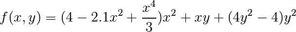

# 1.5 Scipy：高级科学计算

作者：Adrien Chauve, Andre Espaze, Emmanuelle Gouillart, Gaël Varoquaux, Ralf Gommers

**Scipy**

`scipy`包包含许多专注于科学计算中的常见问题的工具箱。它的子模块对应于不同的应用，比如插值、积分、优化、图像处理、统计和特殊功能等。

`scipy`可以与其他标准科学计算包相对比，比如 GSL (C 和 C++的 GNU 科学计算包), 或者 Matlab 的工具箱。`scipy`是 Python 中科学程序的核心程序包；这意味着有效的操作`numpy`数组，因此，numpy 和 scipy 可以一起工作。

在实现一个程序前，有必要确认一下需要的数据处理时候已经在 scipy 中实现。作为非专业程序员，科学家通常倾向于**重新发明轮子**，这产生了小玩具、不优化、很难分享以及不可以维护的代码。相反，scipy 的程序是优化并且测试过的，因此应该尽可能使用。

**警告** 这个教程根本不是数值计算的介绍。因为列举 scipy 的不同子模块和功能将会是非常枯燥的，相反我们将聚焦于列出一些例子，给出如何用 scipy 进行科学计算的大概思路。

scipy 是由针对特定任务的子模块组成的：

|  |  |
| --- | --- |
| [`scipy.cluster`](http://docs.scipy.org/doc/scipy/reference/cluster.html#scipy.cluster "(in SciPy v0.13.0)") | 向量计算 / Kmeans |
| [`scipy.constants`](http://docs.scipy.org/doc/scipy/reference/constants.html#scipy.constants "(in SciPy v0.13.0)") | 物理和数学常量 |
| [`scipy.fftpack`](http://docs.scipy.org/doc/scipy/reference/fftpack.html#scipy.fftpack "(in SciPy v0.13.0)") | 傅里叶变换 |
| [`scipy.integrate`](http://docs.scipy.org/doc/scipy/reference/integrate.html#scipy.integrate "(in SciPy v0.13.0)") | 积分程序 |
| [`scipy.interpolate`](http://docs.scipy.org/doc/scipy/reference/interpolate.html#scipy.interpolate "(in SciPy v0.13.0)") | 插值 |
| [`scipy.io`](http://docs.scipy.org/doc/scipy/reference/io.html#scipy.io "(in SciPy v0.13.0)") | 数据输入和输出 |
| [`scipy.linalg`](http://docs.scipy.org/doc/scipy/reference/linalg.html#scipy.linalg "(in SciPy v0.13.0)") | 线性代数程序 |
| [`scipy.ndimage`](http://docs.scipy.org/doc/scipy/reference/ndimage.html#scipy.ndimage "(in SciPy v0.13.0)") | n-维图像包 |
| [`scipy.odr`](http://docs.scipy.org/doc/scipy/reference/odr.html#scipy.odr "(in SciPy v0.13.0)") | 正交距离回归 |
| [`scipy.optimize`](http://docs.scipy.org/doc/scipy/reference/optimize.html#scipy.optimize "(in SciPy v0.13.0)") | 优化 |
| [`scipy.signal`](http://docs.scipy.org/doc/scipy/reference/signal.html#scipy.signal "(in SciPy v0.13.0)") | 信号处理 |
| [`scipy.sparse`](http://docs.scipy.org/doc/scipy/reference/sparse.html#scipy.sparse "(in SciPy v0.13.0)") | 稀疏矩阵 |
| [`scipy.spatial`](http://docs.scipy.org/doc/scipy/reference/spatial.html#scipy.spatial "(in SciPy v0.13.0)") | 空间数据结构和算法 |
| [`scipy.special`](http://docs.scipy.org/doc/scipy/reference/special.html#scipy.special "(in SciPy v0.13.0)") | 一些特殊数学函数 |
| [`scipy.stats`](http://docs.scipy.org/doc/scipy/reference/stats.html#scipy.stats "(in SciPy v0.13.0)") | 统计 |

他们全都依赖于[numpy](http://docs.scipy.org/doc/numpy/reference/index.html#numpy), 但是大多数是彼此独立的。导入 Numpy 和 Scipy 的标准方式：

In [1]:

```py
import numpy as np
from scipy import stats  # 其他的子模块类似 
```

`scipy`的主要命名空间通常包含的函数其实是 numpy（试一下`scipy.cos`其实是`np.cos`) 。这些函数的暴露只是因为历史原因；通常没有必要在你的代码中使用`import scipy`。

## 1.5.1 文件输入/输出：[scipy.io](http://docs.scipy.org/doc/scipy/reference/io.html#scipy.io)

载入和保存 matlab 文件：

In [2]:

```py
from scipy import io as spio
a = np.ones((3, 3))
spio.savemat('file.mat', {'a': a}) # savemat expects a dictionary
data = spio.loadmat('file.mat', struct_as_record=True)
data['a'] 
```

Out[2]:

```py
array([[ 1.,  1.,  1.],
       [ 1.,  1.,  1.],
       [ 1.,  1.,  1.]]) 
```

```py
from scipy import misc
misc.imread('fname.png')
# Matplotlib 也有类似的方法
import matplotlib.pyplot as plt
plt.imread('fname.png') 
```

更多请见：

*   加载文本文件：[numpy.loadtxt()](http://docs.scipy.org/doc/numpy/reference/generated/numpy.loadtxt.html#numpy.loadtxt)/[numpy.savetxt()](http://docs.scipy.org/doc/numpy/reference/generated/numpy.savetxt.html#numpy.savetxt)
*   智能加载文本/csv 文件：[numpy.genfromtxt()](http://docs.scipy.org/doc/numpy/reference/generated/numpy.genfromtxt.html#numpy.genfromtxt)/numpy.recfromcsv()
*   快速有效，但是针对 numpy 的二进制格式：[numpy.save()](http://docs.scipy.org/doc/numpy/reference/generated/numpy.save.html#numpy.save)/[numpy.load()](http://docs.scipy.org/doc/numpy/reference/generated/numpy.load.html#numpy.load)

## 1.5.2 特殊函数：[scipy.special](http://docs.scipy.org/doc/scipy/reference/special.html#scipy.special)

特殊函数是超验函数。[scipy.special](http://docs.scipy.org/doc/scipy/reference/special.html#scipy.special)模块的文档字符串写的很详细，因此我们不会在这里列出所有的函数。常用的一些函数如下：

*   贝塞尔函数，比如`scipy.special.jn()` (第 n 个整型顺序的贝塞尔函数)
*   椭圆函数 (`scipy.special.ellipj()` Jacobian 椭圆函数, ...)
*   Gamma 函数: scipy.special.gamma(), 也要注意 `scipy.special.gammaln()` 将给出更高准确数值的 Gamma 的 log。
*   Erf, 高斯曲线的面积：scipy.special.erf()

## 1.5.3 线性代数操作：[scipy.linalg](http://docs.scipy.org/doc/scipy/reference/linalg.html#scipy.linalg)

[scipy.linalg](http://docs.scipy.org/doc/scipy/reference/linalg.html#scipy.linalg) 模块提供了标准的线性代数操作，这依赖于底层的高效实现（BLAS、LAPACK）。

*   [scipy.linalg.det()](http://docs.scipy.org/doc/scipy/reference/generated/scipy.linalg.det.html#scipy.linalg.det) 函数计算方阵的行列式：

In [3]:

```py
from scipy import linalg
arr = np.array([[1, 2],
                [3, 4]])
linalg.det(arr) 
```

Out[3]:

```py
-2.0 
```

In [4]:

```py
arr = np.array([[3, 2],
                 [6, 4]])
linalg.det(arr) 
```

Out[4]:

```py
0.0 
```

In [5]:

```py
linalg.det(np.ones((3, 4))) 
```

```py
---------------------------------------------------------------------------
ValueError                                Traceback (most recent call last)
<ipython-input-5-4d4672bd00a7> in <module>()
----> 1  linalg.det(np.ones((3, 4)))

/Library/Python/2.7/site-packages/scipy/linalg/basic.pyc in det(a, overwrite_a, check_finite)
 440         a1 = np.asarray(a)
 441     if len(a1.shape) != 2 or a1.shape[0] != a1.shape[1]:
--> 442  raise ValueError('expected square matrix')
 443     overwrite_a = overwrite_a or _datacopied(a1, a)
 444     fdet, = get_flinalg_funcs(('det',), (a1,))

ValueError: expected square matrix 
```

*   [scipy.linalg.inv()](http://docs.scipy.org/doc/scipy/reference/generated/scipy.linalg.inv.html#scipy.linalg.inv) 函数计算逆方阵：

In [6]:

```py
arr = np.array([[1, 2],
                 [3, 4]])
iarr = linalg.inv(arr)
iarr 
```

Out[6]:

```py
array([[-2\. ,  1\. ],
       [ 1.5, -0.5]]) 
```

In [7]:

```py
np.allclose(np.dot(arr, iarr), np.eye(2)) 
```

Out[7]:

```py
True 
```

最后计算逆奇异矩阵（行列式为 0）将抛出`LinAlgError` :

In [8]:

```py
arr = np.array([[3, 2],
                 [6, 4]])
linalg.inv(arr) 
```

```py
---------------------------------------------------------------------------
LinAlgError                               Traceback (most recent call last)
<ipython-input-8-e8078a9a17b2> in <module>()
 1 arr = np.array([[3, 2],
 2                  [6, 4]])
----> 3  linalg.inv(arr)

/Library/Python/2.7/site-packages/scipy/linalg/basic.pyc in inv(a, overwrite_a, check_finite)
 381         inv_a, info = getri(lu, piv, lwork=lwork, overwrite_lu=1)
 382     if info > 0:
--> 383  raise LinAlgError("singular matrix")
 384     if info < 0:
 385         raise ValueError('illegal value in %d-th argument of internal '

LinAlgError: singular matrix 
```

*   还有更多高级的操作，奇异值分解（SVD）：

In [9]:

```py
arr = np.arange(9).reshape((3, 3)) + np.diag([1, 0, 1])
uarr, spec, vharr = linalg.svd(arr) 
```

结果的数组频谱是：

In [10]:

```py
spec 
```

Out[10]:

```py
array([ 14.88982544,   0.45294236,   0.29654967]) 
```

原始矩阵可以用`svd`和`np.dot`矩阵相乘的结果重新获得：

In [11]:

```py
sarr = np.diag(spec)
svd_mat = uarr.dot(sarr).dot(vharr)
np.allclose(svd_mat, arr) 
```

Out[11]:

```py
True 
```

SVD 常被用于统计和信号处理。其他标准分解 (QR, LU, Cholesky, Schur), 以及线性系统的求解器，也可以在[scipy.linalg](http://docs.scipy.org/doc/scipy/reference/linalg.html#scipy.linalg)中找到。

## 1.5.4 快速傅立叶变换：[scipy.fftpack](http://docs.scipy.org/doc/scipy/reference/fftpack.html#scipy.fftpack)

[scipy.fftpack](http://docs.scipy.org/doc/scipy/reference/fftpack.html#scipy.fftpack) 模块允许计算快速傅立叶变换。例子，一个（有噪音）的信号输入是这样：

In [12]:

```py
time_step = 0.02
period = 5.
time_vec = np.arange(0, 20, time_step)
sig = np.sin(2 * np.pi / period * time_vec) + \
       0.5 * np.random.randn(time_vec.size) 
```

观察者并不知道信号的频率，只知道抽样时间步骤的信号`sig`。假设信号来自真实的函数，因此傅立叶变换将是对称的。[scipy.fftpack.fftfreq()](http://docs.scipy.org/doc/scipy/reference/generated/scipy.fftpack.fftfreq.html#scipy.fftpack.fftfreq) 函数将生成样本序列，而将计算快速傅立叶变换：

In [13]:

```py
from scipy import fftpack
sample_freq = fftpack.fftfreq(sig.size, d=time_step)
sig_fft = fftpack.fft(sig) 
```

因为生成的幂是对称的，寻找频率只需要使用频谱为正的部分：

In [14]:

```py
pidxs = np.where(sample_freq > 0)
freqs = sample_freq[pidxs]
power = np.abs(sig_fft)[pidxs] 
```


寻找信号频率：

In [15]:

```py
freq = freqs[power.argmax()]
np.allclose(freq, 1./period)  # 检查是否找到了正确的频率 
```

Out[15]:

```py
True 
```

现在高频噪音将从傅立叶转换过的信号移除：

In [16]:

```py
sig_fft[np.abs(sample_freq) > freq] = 0 
```

生成的过滤过的信号可以用[scipy.fftpack.ifft()](http://docs.scipy.org/doc/scipy/reference/generated/scipy.fftpack.ifft.html#scipy.fftpack.ifft)函数：

In [17]:

```py
main_sig = fftpack.ifft(sig_fft) 
```

查看结果：

In [18]:

```py
import pylab as plt
plt.figure()
plt.plot(time_vec, sig)
plt.plot(time_vec, main_sig, linewidth=3)
plt.xlabel('Time [s]')
plt.ylabel('Amplitude') 
```

```py
/Library/Frameworks/Python.framework/Versions/2.7/lib/python2.7/site-packages/numpy/core/numeric.py:462: ComplexWarning: Casting complex values to real discards the imaginary part
  return array(a, dtype, copy=False, order=order) 
```

Out[18]:

```py
<matplotlib.text.Text at 0x107484b10> 
```


[numpy.fft](http://docs.scipy.org/doc/numpy/reference/routines.fft.html#numpy.fft)

Numpy 也有一个 FFT(numpy.fft)实现。但是，通常 scipy 的实现更受欢迎，因为，他使用更高效的底层实现。

**实例：寻找粗略周期**


**实例：高斯图片模糊**

弯曲:

$f_1(t) = \int dt'\, K(t-t') f_0(t')$

$\tilde{f}_1(\omega) = \tilde{K}(\omega) \tilde{f}_0(\omega)$


**练习：月球登陆图片降噪**


1.  检查提供的图片 moonlanding.png，图片被周期噪音污染了。在这个练习中，我们的目的是用快速傅立叶变换清除噪音。

2.  用`pylab.imread()`加载图片。

3.  寻找并使用在[scipy.fftpack](http://docs.scipy.org/doc/scipy/reference/fftpack.html#scipy.fftpack)中的 2-D FFT 函数，绘制图像的频谱（傅立叶变换）。在可视化频谱时是否遇到了麻烦？如果有的话，为什么？

4.  频谱由高频和低频成分构成。噪音被包含在频谱的高频部分，因此将那些部分设置为 0（使用数组切片）。

5.  应用逆傅立叶变换来看一下结果图片。

## 1.5.5 优化及拟合：[scipy.optimize](http://docs.scipy.org/doc/scipy/reference/optimize.html#scipy.optimize)

优化是寻找最小化或等式的数值解的问题。

[scipy.optimize](http://docs.scipy.org/doc/scipy/reference/optimize.html#scipy.optimize) 模块提供了函数最小化（标量或多维度）、曲线拟合和求根的有用算法。

In [19]:

```py
from scipy import optimize 
```

**寻找标量函数的最小值**

让我们定义下面的函数：

In [20]:

```py
def f(x):
    return x**2 + 10*np.sin(x) 
```

绘制它：

In [21]:

```py
x = np.arange(-10, 10, 0.1)
plt.plot(x, f(x))
plt.show() 
```


这个函数在-1.3 附近有一个全局最小并且在 3.8 有一个局部最小。

找到这个函数的最小值的常用有效方式是从给定的初始点开始进行一个梯度下降。BFGS 算法是这样做的较好方式：

In [22]:

```py
optimize.fmin_bfgs(f, 0) 
```

```py
Optimization terminated successfully.
         Current function value: -7.945823
         Iterations: 5
         Function evaluations: 24
         Gradient evaluations: 8 
```

Out[22]:

```py
array([-1.30644003]) 
```

这个方法的一个可能问题是，如果这个函数有一些局部最低点，算法可能找到这些局部最低点而不是全局最低点，这取决于初始点：

In [23]:

```py
optimize.fmin_bfgs(f, 3, disp=0) 
```

Out[23]:

```py
array([ 3.83746663]) 
```

如果我们不知道全局最低点，并且使用其临近点来作为初始点，那么我们需要付出昂贵的代价来获得全局最优。要找到全局最优点，最简单的算法是暴力算法，算法中会评估给定网格内的每一个点：

In [24]:

```py
grid = (-10, 10, 0.1)
xmin_global = optimize.brute(f, (grid,))
xmin_global 
```

Out[24]:

```py
array([-1.30641113]) 
```

对于更大的网格，[scipy.optimize.brute()](http://docs.scipy.org/doc/scipy/reference/generated/scipy.optimize.brute.html#scipy.optimize.brute) 变得非常慢。[scipy.optimize.anneal()](http://docs.scipy.org/doc/scipy/reference/generated/scipy.optimize.anneal.html#scipy.optimize.anneal) 提供了一个替代的算法，使用模拟退火。对于不同类型的全局优化问题存在更多的高效算法，但是这超出了`scipy`的范畴。[OpenOpt](http://openopt.org/Welcome)、[IPOPT](https://github.com/xuy/pyipopt)、[PyGMO](http://pagmo.sourceforge.net/pygmo/index.html)和[PyEvolve](http://pyevolve.sourceforge.net/)是关于全局优化的一些有用的包。

要找出局部最低点，让我们用[scipy.optimize.fminbound](http://docs.scipy.org/doc/scipy/reference/generated/scipy.optimize.fminbound.html#scipy.optimize.fminbound)将变量限制在(0,10)区间：

In [25]:

```py
xmin_local = optimize.fminbound(f, 0, 10)    
xmin_local 
```

Out[25]:

```py
3.8374671194983834 
```

**注**：寻找函数的最优解将在高级章节中：[数学优化：寻找函数的最优解](http://scipy-lectures.github.io/advanced/mathematical_optimization/index.html#mathematical-optimization)详细讨论。

**寻找标量函数的根**

要寻找上面函数 f 的根，比如`f(x)=0`的一个点，我们可以用比如[scipy.optimize.fsolve()](http://docs.scipy.org/doc/scipy/reference/generated/scipy.optimize.fsolve.html#scipy.optimize.fsolve)：

In [26]:

```py
root = optimize.fsolve(f, 1)  # 我们的最初猜想是 1
root 
```

Out[26]:

```py
array([ 0.]) 
```

注意只找到一个根。检查`f`的图发现在-2.5 左右还有应该有第二个根。通过调整我们最初的猜想，我们可以发现正确的值：

In [27]:

```py
root2 = optimize.fsolve(f, -2.5)
root2 
```

Out[27]:

```py
array([-2.47948183]) 
```

**曲线拟合**

假设我们有来自`f`的样例数据，带有一些噪音：

In [28]:

```py
xdata = np.linspace(-10, 10, num=20)
ydata = f(xdata) + np.random.randn(xdata.size) 
```

现在，如果我们知道这些 sample 数据来自的函数（这个案例中是$x² + sin(x)$）的函数形式，而不知道每个数据项的系数，那么我们可以用最小二乘曲线拟合在找到这些系数。首先，我们需要定义函数来拟合：

In [29]:

```py
def f2(x, a, b):
    return a*x**2 + b*np.sin(x) 
```

然后我们可以使用[scipy.optimize.curve_fit()](http://docs.scipy.org/doc/scipy/reference/generated/scipy.optimize.curve_fit.html#scipy.optimize.curve_fit)来找到`a`和`b`：

In [30]:

```py
guess = [2, 2]
params, params_covariance = optimize.curve_fit(f2, xdata, ydata, guess)
params 
```

Out[30]:

```py
array([  0.99719019,  10.27381534]) 
```

现在我们找到了`f`的最优解和根，并且用曲线去拟合它，我们将这些结果整合在一个图中：


**注**：在 Scipy >= 0.11 中，包含所有最小值和寻找根的算法的统一接口：[scipy.optimize.minimize()](http://docs.scipy.org/doc/scipy/reference/generated/scipy.optimize.minimize.html#scipy.optimize.minimize)、 [scipy.optimize.minimize_scalar()](http://docs.scipy.org/doc/scipy/reference/generated/scipy.optimize.minimize_scalar.html#scipy.optimize.minimize_scalar)和 [scipy.optimize.root()](http://docs.scipy.org/doc/scipy/reference/generated/scipy.optimize.root.html#scipy.optimize.root)。他们允许通过`method`关键词容易的比较多种算法。

你可以在[scipy.optimize](http://docs.scipy.org/doc/scipy/reference/optimize.html#scipy.optimize)中找到对于多维度问题有相同功能的算法。

**练习：温度数据的曲线拟合**

下面是从 1 月开始阿拉斯加每个月的温度极值（摄氏度）：

最大值: 17, 19, 21, 28, 33, 38, 37, 37, 31, 23, 19, 18

最小值: -62, -59, -56, -46, -32, -18, -9, -13, -25, -46, -52, -58

1.  绘制这些温度极值。
2.  定义一个函数，可以描述温度的最大值和最小值。提示：这个函数的周期是一年。提示：包含时间偏移。
3.  用[scipy.optimize.curve_fit()](http://docs.scipy.org/doc/scipy/reference/generated/scipy.optimize.curve_fit.html#scipy.optimize.curve_fit)拟合这个函数与数据。
4.  绘制结果。这个拟合合理吗？如果不合理，为什么？
5.  最低温度和最高温度的时间偏移是否与拟合一样精确？

**练习：2-D 最小值**


六峰驼背函数： 

有多个全局和局部最低点。找到这个函数的全局最低点。

提示：

*   变量可以被限定在-2 < x < 2 和 -1 < y < 1。
*   用[numpy.meshgrid()](http://docs.scipy.org/doc/numpy/reference/generated/numpy.meshgrid.html#numpy.meshgrid) 和 pylab.imshow() 来从视觉上来寻找区域。
*   [scipy.optimize.fmin_bfgs()](http://docs.scipy.org/doc/scipy/reference/generated/scipy.optimize.fmin_bfgs.html#scipy.optimize.fmin_bfgs) 或者另一个多维最小化。 多几个全局最小值，那些点上的函数值十多少？如果最初的猜测是$(x, y) = (0, 0)$会怎样?

看一下[非线性最小二乘曲线拟合：地形机载激光雷达数据中的点抽取](http://scipy-lectures.github.io/intro/summary-exercises/optimize-fit.html#summary-exercise-optimize)练习的总结，以及更高及的例子。

## 1.5.6\. 统计和随机数：[scipy.stats](http://docs.scipy.org/doc/scipy/reference/stats.html#scipy.stats)

[scipy.stats](http://docs.scipy.org/doc/scipy/reference/stats.html#scipy.stats)模块包含统计工具和随机过程的概率描述。在`numpy.random`中可以找到多个随机数生成器。

### 1.5.6.1 直方图和概率密度函数

给定随机过程的观察值，它们的直方图是随机过程的 PDF（概率密度函数）的估计值：

In [31]:

```py
a = np.random.normal(size=1000)
bins = np.arange(-4, 5)
bins 
```

Out[31]:

```py
array([-4, -3, -2, -1,  0,  1,  2,  3,  4]) 
```

In [32]:

```py
histogram = np.histogram(a, bins=bins, normed=True)[0]
bins = 0.5*(bins[1:] + bins[:-1])
bins 
```

Out[32]:

```py
array([-3.5, -2.5, -1.5, -0.5,  0.5,  1.5,  2.5,  3.5]) 
```

In [35]:

```py
from scipy import stats
import pylab as pl
b = stats.norm.pdf(bins)  # norm 是一种分布
pl.plot(bins, histogram)
pl.plot(bins, b) 
```

Out[35]:

```py
[<matplotlib.lines.Line2D at 0x10764cd10>] 
```


如果我们知道随机过程属于特定的随机过程家族，比如正态过程，我们可以做一个观察值的最大可能性拟合，来估计潜在分布的参数。这里我们用随机过程拟合观察数据：

In [5]:

```py
loc, std = stats.norm.fit(a)
loc 
```

Out[5]:

```py
-0.063033073531050018 
```

In [6]:

```py
std 
```

Out[6]:

```py
0.97226620529973573 
```

**练习：概率分布**

用 shape 参数为 1 的 gamma 分布生成 1000 个随机数，然后绘制那些样本的直方图。你可以在顶部绘制 pdf（应该会匹配）吗？

额外信息：这些分布都有一些有用的方法。读一下文档字符串或者用 IPython tab 完成来研究这些方法。你可以用在你的随机变量上使用`fit`方法来找回 shape 参数 1 吗？

### 1.5.6.2 百分位数

中数是有一半值在其上一半值在其下的值：

In [7]:

```py
np.median(a) 
```

Out[7]:

```py
-0.061271835457024623 
```

中数也被称为百分位数 50，因为 50%的观察值在它之下：

In [8]:

```py
stats.scoreatpercentile(a, 50) 
```

Out[8]:

```py
-0.061271835457024623 
```

同样，我们也能计算百分位数 90：

In [10]:

```py
stats.scoreatpercentile(a, 90) 
```

Out[10]:

```py
1.1746952490791494 
```

百分位数是 CDF 的估计值：累积分布函数。

### 1.5.6.3 统计检验

统计检验是一个决策指示器。例如，如果我们有两组观察值，我们假设他们来自于高斯过程，我们可以用 T 检验来决定这两组观察值是不是显著不同：

In [11]:

```py
a = np.random.normal(0, 1, size=100)
b = np.random.normal(1, 1, size=10)
stats.ttest_ind(a, b) 
```

Out[11]:

```py
(-2.8365663431591557, 0.0054465620169369703) 
```

生成的结果由以下内容组成：

*   T 统计值：一个值，符号与两个随机过程的差异成比例，大小与差异的程度有关。
*   p 值：两个过程相同的概率。如果它接近 1，那么这两个过程几乎肯定是相同的。越接近于 0，越可能这两个过程有不同的平均数。

## 1.5.7 插值：[scipy.interpolate](http://docs.scipy.org/doc/scipy/reference/interpolate.html#scipy.interpolate)

[scipy.interpolate](http://docs.scipy.org/doc/scipy/reference/interpolate.html#scipy.interpolate)对从实验数据中拟合函数是非常有用的，因此，评估没有测量过的点。这个模块是基于[netlib](http://www.netlib.org/)项目的[Fortran 子程序 FITPACK](http://www.netlib.org/dierckx/index.html)

假想一个接近 sine 函数的实验数据：

In [8]:

```py
measured_time = np.linspace(0, 1, 10)
noise = (np.random.random(10)*2 - 1) * 1e-1
measures = np.sin(2 * np.pi * measured_time) + noise 
```

[scipy.interpolate.interp1d](http://docs.scipy.org/doc/scipy/reference/generated/scipy.interpolate.interp1d.html#scipy.interpolate.interp1d)类可以建立一个线性插值函数：

In [9]:

```py
from scipy.interpolate import interp1d
linear_interp = interp1d(measured_time, measures) 
```

`scipy.interpolate.linear_interp`实例需要评估感兴趣的时间点：

In [10]:

```py
computed_time = np.linspace(0, 1, 50)
linear_results = linear_interp(computed_time) 
```

通过提供可选的参数`kind`也可以选择进行立方插值：

In [11]:

```py
cubic_interp = interp1d(measured_time, measures, kind='cubic')
cubic_results = cubic_interp(computed_time) 
```

现在结果可以被整合为下面的 Matplotlib 图片：


[scipy.interpolate.interp2d](http://docs.scipy.org/doc/scipy/reference/generated/scipy.interpolate.interp2d.html#scipy.interpolate.interp2d) 与[scipy.interpolate.interp1d](http://docs.scipy.org/doc/scipy/reference/generated/scipy.interpolate.interp1d.html#scipy.interpolate.interp1d)类似，但是是用于 2-D 数组。注意对于`interp`家族，计算的时间点必须在测量时间段之内。看一下 Sprogø气象站的最大风速预测的总结练习，了解更详细的 spline 插值实例。

## 1.5.8 数值积分：

[scipy.integrate.quad()](http://docs.scipy.org/doc/scipy/reference/generated/scipy.integrate.quad.html#scipy.integrate.quad)是最常见的积分程序：

In [1]:

```py
from scipy.integrate import quad
res, err = quad(np.sin, 0, np.pi/2)
np.allclose(res, 1) 
```

Out[1]:

```py
True 
```

In [2]:

```py
np.allclose(err, 1 - res) 
```

Out[2]:

```py
True 
```

其他的积分程序可以在`fixed_quad`、 `quadrature`、`romberg`中找到。

[scipy.integrate](http://docs.scipy.org/doc/scipy/reference/integrate.html#scipy.integrate) 可提供了常微分公式(ODE)的特色程序。特别的，[scipy.integrate.odeint()](http://docs.scipy.org/doc/scipy/reference/generated/scipy.integrate.odeint.html#scipy.integrate.odeint) 是使用 LSODA（Livermore Solver for Ordinary Differential equations with Automatic method switching for stiff and non-stiff problems）的通用积分器，更多细节请见[ODEPACK Fortran 库](http://people.sc.fsu.edu/~jburkardt/f77_src/odepack/odepack.html)。

`odeint`解决如下形式的第一顺序 ODE 系统：

$dy/dt = rhs(y1, y2, .., t0,...)$

作为一个介绍，让我们解一下在初始条件下$y(t=0) = 1$，这个常微分公式$dy/dt = -2y$在$t = 0..4$时的值。首先，这个函数计算定义位置需要的导数：

In [3]:

```py
def calc_derivative(ypos, time, counter_arr):
    counter_arr += 1
    return -2 * ypos 
```

添加了一个额外的参数`counter_arr`用来说明这个函数可以在一个时间步骤被调用多次，直到收敛。计数器数组定义如下：

In [4]:

```py
counter = np.zeros((1,), dtype=np.uint16) 
```

现在计算轨迹线：

In [5]:

```py
from scipy.integrate import odeint
time_vec = np.linspace(0, 4, 40)
yvec, info = odeint(calc_derivative, 1, time_vec,
                    args=(counter,), full_output=True) 
```

因此，导数函数被调用了 40 多次（即时间步骤数）：

In [6]:

```py
counter 
```

Out[6]:

```py
array([129], dtype=uint16) 
```

前十个时间步骤的累积循环数，可以用如下方式获得：

In [7]:

```py
info['nfe'][:10] 
```

Out[7]:

```py
array([31, 35, 43, 49, 53, 57, 59, 63, 65, 69], dtype=int32) 
```

注意，求解器对于首个时间步骤需要更多的循环。导数答案`yvec`可以画出来：


阻尼弹簧重物振子（二阶振荡器）是使用[scipy.integrate.odeint()](http://docs.scipy.org/doc/scipy/reference/generated/scipy.integrate.odeint.html#scipy.integrate.odeint)的另一个例子。链接到弹簧的重物的位置服从二阶常微分方程$y'' + 2 eps wo y' + wo² y = 0$，其中$wo² = k/m$ 弹簧的常数为 k, m 是重物质量，$eps=c/(2 m wo)$，c 是阻尼系数。例如，我们选择如下参数：

In [8]:

```py
mass = 0.5  # kg
kspring = 4  # N/m
cviscous = 0.4  # N s/m 
```

因此系统将是欠阻尼的，因为：

In [9]:

```py
eps = cviscous / (2 * mass * np.sqrt(kspring/mass))
eps < 1 
```

Out[9]:

```py
True 
```

对于[scipy.integrate.odeint()](http://docs.scipy.org/doc/scipy/reference/generated/scipy.integrate.odeint.html#scipy.integrate.odeint)求解器，二阶等式需要被变换为系统内向量$Y=(y, y')$的两个一阶等式。为了方便，定义$nu = 2 eps * wo = c / m$和$om = wo² = k/m$：

In [10]:

```py
nu_coef = cviscous / mass
om_coef = kspring / mass 
```

因此函数将计算速度和加速度：

In [11]:

```py
def calc_deri(yvec, time, nuc, omc):
    return (yvec[1], -nuc * yvec[1] - omc * yvec[0])

time_vec = np.linspace(0, 10, 100)
yarr = odeint(calc_deri, (1, 0), time_vec, args=(nu_coef, om_coef)) 
```

如下的 Matplotlib 图片显示了最终的位置和速度： 

在 Sicpy 中没有偏微分方程（PDE）求解器。存在其他求解 PDE 的 Python 包，比如[fipy](http://www.ctcms.nist.gov/fipy/)或[SfePy](http://code.google.com/p/sfepy/)。

## 1.5.9 信号处理：[scipy.signal](http://docs.scipy.org/doc/scipy/reference/signal.html#scipy.signal)

In [13]:

```py
from scipy import signal
import matplotlib.pyplot as pl 
```

*   [scipy.signal.detrend()](http://docs.scipy.org/doc/scipy/reference/generated/scipy.signal.detrend.html#scipy.signal.detrend): 从信号中删除线性趋势：

In [14]:

```py
t = np.linspace(0, 5, 100)
x = t + np.random.normal(size=100)

pl.plot(t, x, linewidth=3)
pl.plot(t, signal.detrend(x), linewidth=3) 
```

Out[14]:

```py
[<matplotlib.lines.Line2D at 0x10781e590>] 
```


*   [scipy.signal.resample()](http://docs.scipy.org/doc/scipy/reference/generated/scipy.signal.resample.html#scipy.signal.resample): 用 FFT 从信号中抽出 n 个点。

In [15]:

```py
t = np.linspace(0, 5, 100)
x = np.sin(t)

pl.plot(t, x, linewidth=3)
pl.plot(t[::2], signal.resample(x, 50), 'ko') 
```

Out[15]:

```py
[<matplotlib.lines.Line2D at 0x107855cd0>] 
```


*   [scipy.signal](http://docs.scipy.org/doc/scipy/reference/signal.html#scipy.signal) 有许多窗口函数：[scipy.signal.hamming()](http://docs.scipy.org/doc/scipy/reference/generated/scipy.signal.hamming.html#scipy.signal.hamming), [scipy.signal.bartlett()](http://docs.scipy.org/doc/scipy/reference/generated/scipy.signal.bartlett.html#scipy.signal.bartlett), [scipy.signal.blackman()](http://docs.scipy.org/doc/scipy/reference/generated/scipy.signal.blackman.html#scipy.signal.blackman)...
*   [scipy.signal](http://docs.scipy.org/doc/scipy/reference/signal.html#scipy.signal) 有滤镜 (中位数滤镜[scipy.signal.medfilt()](http://docs.scipy.org/doc/scipy/reference/generated/scipy.signal.medfilt.html#scipy.signal.medfilt), Wiener[scipy.signal.wiener()](http://docs.scipy.org/doc/scipy/reference/generated/scipy.signal.wiener.html#scipy.signal.wiener)), 但是我们将在图片部分讨论这些。

## 1.5.10 图像处理：scipy.ndimage

scipy 中专注于专注于图像处理的模块是 scipy.ndimage。

In [18]:

```py
from scipy import ndimage 
```

图像处理程序可以根据他们进行的处理来分类。

### 1.5.10.1 图像的几何变换

改变原点，解析度，..

In [19]:

```py
from scipy import misc
import matplotlib.pyplot as pl
lena = misc.lena()
shifted_lena = ndimage.shift(lena, (50, 50))
shifted_lena2 = ndimage.shift(lena, (50, 50), mode='nearest')
rotated_lena = ndimage.rotate(lena, 30)
cropped_lena = lena[50:-50, 50:-50]
zoomed_lena = ndimage.zoom(lena, 2)
zoomed_lena.shape 
```

Out[19]:

```py
(1024, 1024) 
```


In [25]:

```py
subplot(151)
pl.imshow(shifted_lena, cmap=cm.gray)
axis('off') 
```

Out[25]:

```py
(-0.5, 511.5, 511.5, -0.5) 
```


### 1.5.10.2 图像滤波器

In [26]:

```py
from scipy import misc
lena = misc.lena()
import numpy as np
noisy_lena = np.copy(lena).astype(np.float)
noisy_lena += lena.std()*0.5*np.random.standard_normal(lena.shape)
blurred_lena = ndimage.gaussian_filter(noisy_lena, sigma=3)
median_lena = ndimage.median_filter(blurred_lena, size=5)
from scipy import signal
wiener_lena = signal.wiener(blurred_lena, (5,5)) 
```

 在[scipy.ndimage.filters](http://docs.scipy.org/doc/scipy/reference/ndimage.html#scipy.ndimage.filters) 和 [scipy.signal](http://docs.scipy.org/doc/scipy/reference/signal.html#scipy.signal) 有更多应用于图像的滤波器。

练习

比较不同过滤后图像的条形图

### 1.5.10.3 数学形态学

数学形态学是集合理论分支出来的一个数学理论。它刻画并转换几何结构。特别是二元的图像（黑白）可以用这种理论来转换：被转换的集合是临近非零值像素的集合。这个理论也可以被扩展到灰度值图像。 

初级数学形态学操作使用结构化的元素，以便修改其他几何结构。

首先让我们生成一个结构化元素。

In [27]:

```py
el = ndimage.generate_binary_structure(2, 1)
el 
```

Out[27]:

```py
array([[False,  True, False],
       [ True,  True,  True],
       [False,  True, False]], dtype=bool) 
```

In [28]:

```py
el.astype(np.int) 
```

Out[28]:

```py
array([[0, 1, 0],
       [1, 1, 1],
       [0, 1, 0]]) 
```

*   腐蚀

In [29]:

```py
a = np.zeros((7,7), dtype=np.int)
a[1:6, 2:5] = 1
a 
```

Out[29]:

```py
array([[0, 0, 0, 0, 0, 0, 0],
       [0, 0, 1, 1, 1, 0, 0],
       [0, 0, 1, 1, 1, 0, 0],
       [0, 0, 1, 1, 1, 0, 0],
       [0, 0, 1, 1, 1, 0, 0],
       [0, 0, 1, 1, 1, 0, 0],
       [0, 0, 0, 0, 0, 0, 0]]) 
```

In [30]:

```py
ndimage.binary_erosion(a).astype(a.dtype) 
```

Out[30]:

```py
array([[0, 0, 0, 0, 0, 0, 0],
       [0, 0, 0, 0, 0, 0, 0],
       [0, 0, 0, 1, 0, 0, 0],
       [0, 0, 0, 1, 0, 0, 0],
       [0, 0, 0, 1, 0, 0, 0],
       [0, 0, 0, 0, 0, 0, 0],
       [0, 0, 0, 0, 0, 0, 0]]) 
```

In [31]:

```py
#腐蚀移除了比结构小的对象
ndimage.binary_erosion(a, structure=np.ones((5,5))).astype(a.dtype) 
```

Out[31]:

```py
array([[0, 0, 0, 0, 0, 0, 0],
       [0, 0, 0, 0, 0, 0, 0],
       [0, 0, 0, 0, 0, 0, 0],
       [0, 0, 0, 0, 0, 0, 0],
       [0, 0, 0, 0, 0, 0, 0],
       [0, 0, 0, 0, 0, 0, 0],
       [0, 0, 0, 0, 0, 0, 0]]) 
```

*   扩张

In [32]:

```py
a = np.zeros((5, 5))
a[2, 2] = 1
a 
```

Out[32]:

```py
array([[ 0.,  0.,  0.,  0.,  0.],
       [ 0.,  0.,  0.,  0.,  0.],
       [ 0.,  0.,  1.,  0.,  0.],
       [ 0.,  0.,  0.,  0.,  0.],
       [ 0.,  0.,  0.,  0.,  0.]]) 
```

In [33]:

```py
ndimage.binary_dilation(a).astype(a.dtype) 
```

Out[33]:

```py
array([[ 0.,  0.,  0.,  0.,  0.],
       [ 0.,  0.,  1.,  0.,  0.],
       [ 0.,  1.,  1.,  1.,  0.],
       [ 0.,  0.,  1.,  0.,  0.],
       [ 0.,  0.,  0.,  0.,  0.]]) 
```

*   开启

In [34]:

```py
a = np.zeros((5,5), dtype=np.int)
a[1:4, 1:4] = 1; a[4, 4] = 1
a 
```

Out[34]:

```py
array([[0, 0, 0, 0, 0],
       [0, 1, 1, 1, 0],
       [0, 1, 1, 1, 0],
       [0, 1, 1, 1, 0],
       [0, 0, 0, 0, 1]]) 
```

In [35]:

```py
# 开启移除了小对象
ndimage.binary_opening(a, structure=np.ones((3,3))).astype(np.int) 
```

Out[35]:

```py
array([[0, 0, 0, 0, 0],
       [0, 1, 1, 1, 0],
       [0, 1, 1, 1, 0],
       [0, 1, 1, 1, 0],
       [0, 0, 0, 0, 0]]) 
```

In [36]:

```py
# 开启也可以平滑拐角
ndimage.binary_opening(a).astype(np.int) 
```

Out[36]:

```py
array([[0, 0, 0, 0, 0],
       [0, 0, 1, 0, 0],
       [0, 1, 1, 1, 0],
       [0, 0, 1, 0, 0],
       [0, 0, 0, 0, 0]]) 
```

*   闭合: `ndimage.binary_closing`

练习

验证一下开启相当于先腐蚀再扩张。

开启操作移除小的结构，而关闭操作填满了小洞。因此这些用来”清洗“图像。

In [37]:

```py
a = np.zeros((50, 50))
a[10:-10, 10:-10] = 1
a += 0.25*np.random.standard_normal(a.shape)
mask = a>=0.5
opened_mask = ndimage.binary_opening(mask)
closed_mask = ndimage.binary_closing(opened_mask) 
```


练习

验证一下重建的方格面积比原始方格的面积小。（如果关闭步骤在开启步骤之前则相反）。

对于*灰度值图像*，腐蚀（区别于扩张）相当于用感兴趣的像素周围的结构元素中的最小（区别于最大）值替换像素。

In [39]:

```py
a = np.zeros((7,7), dtype=np.int)
a[1:6, 1:6] = 3
a[4,4] = 2; a[2,3] = 1
a 
```

Out[39]:

```py
array([[0, 0, 0, 0, 0, 0, 0],
       [0, 3, 3, 3, 3, 3, 0],
       [0, 3, 3, 1, 3, 3, 0],
       [0, 3, 3, 3, 3, 3, 0],
       [0, 3, 3, 3, 2, 3, 0],
       [0, 3, 3, 3, 3, 3, 0],
       [0, 0, 0, 0, 0, 0, 0]]) 
```

In [40]:

```py
ndimage.grey_erosion(a, size=(3,3)) 
```

Out[40]:

```py
array([[0, 0, 0, 0, 0, 0, 0],
       [0, 0, 0, 0, 0, 0, 0],
       [0, 0, 1, 1, 1, 0, 0],
       [0, 0, 1, 1, 1, 0, 0],
       [0, 0, 3, 2, 2, 0, 0],
       [0, 0, 0, 0, 0, 0, 0],
       [0, 0, 0, 0, 0, 0, 0]]) 
```

### 1.5.10.4 测量图像

首先让我们生成一个漂亮的人造二维图。

In [41]:

```py
x, y = np.indices((100, 100))
sig = np.sin(2*np.pi*x/50.)*np.sin(2*np.pi*y/50.)*(1+x*y/50.**2)**2
mask = sig > 1 
```

现在让我们看一下图像中对象的各种信息：

In [42]:

```py
labels, nb = ndimage.label(mask)
nb 
```

Out[42]:

```py
8 
```

In [43]:

```py
areas = ndimage.sum(mask, labels, xrange(1, labels.max()+1))
areas 
```

Out[43]:

```py
array([ 190.,   45.,  424.,  278.,  459.,  190.,  549.,  424.]) 
```

In [44]:

```py
maxima = ndimage.maximum(sig, labels, xrange(1, labels.max()+1))
maxima 
```

Out[44]:

```py
array([  1.80238238,   1.13527605,   5.51954079,   2.49611818,
         6.71673619,   1.80238238,  16.76547217,   5.51954079]) 
```

In [45]:

```py
ndimage.find_objects(labels==4) 
```

Out[45]:

```py
[(slice(30L, 48L, None), slice(30L, 48L, None))] 
```

In [46]:

```py
sl = ndimage.find_objects(labels==4)
import pylab as pl
pl.imshow(sig[sl[0]]) 
```

Out[46]:

```py
<matplotlib.image.AxesImage at 0x10a861910> 
```


高级例子请看一下总结练习[图像处理应用：计数气泡和未融化的颗粒](http://scipy-lectures.github.io/intro/summary-exercises/image-processing.html#summary-exercise-image-processing)

## 1.5.11 科学计算的总结练习

总结练习主要使用 Numpy、Scipy 和 Matplotlib。他们提供了一些使用 Python 进行科学计算的真实例子。现在，已经介绍了 Numpy 和 Scipy 的基本使用，邀请感兴趣的用户去做这些练习。

**练习：**

[1.5.11.13 Sprogø气象站的最大风速预测](http://scipy-lectures.github.io/intro/summary-exercises/stats-interpolate.html)

[1.5.11.14 非线性最小二乘曲线拟合：地形机载激光雷达数据中的点抽取](http://scipy-lectures.github.io/intro/summary-exercises/optimize-fit.html)

[1.5.11.15 图像处理应用：计数气泡和未融化的颗粒](http://scipy-lectures.github.io/intro/summary-exercises/image-processing.html)

**提议的解决方案:**

[1.5.11.16 图像处理练习：玻璃中的未融化颗粒的答案例子](http://scipy-lectures.github.io/intro/summary-exercises/answers_image_processing.html)

### 1.5.11.13 Sprogø气象站的最大风速预测

这个练习的目的是预测每 50 年的最大风速，即使在一个时间段内有记录。可用的数据只是位于丹麦的 Sprogø气象站的 21 年的测量数据。首先，将给出统计步骤，接着将用 scipy.interpolae 模块中的函数来解释。在最后，将邀请感兴趣的读者用不同的方法从原始数据计算结果。

#### 1.5.11.13.1 统计方法

假设年度最大值符合正态概率密度函数。但是，这个函数不能用来预测，因为它从速度最大值中给出了概率。找到每 50 年的最大风速需要相反的方法，需要从确定的概率中找到结果。这是百分位数函数的作用而这个练习的目的是找到它。在当前的模型中，假设每 50 年出现的最大风速定义为高于 2%百分位数。

根据定义，百分位数函数是累积分布函数的反函数。后者描述了年度最大值的概率分布。在这个练习中，给定年份$i$的累积概率$p_i$被定义为$p_i = i/(N+1)$，其中$N = 21$，测量的年数。因此，计算每个测量过的风速最大值的累积概率是可以行的。从这些实验点，scipy.interpolate 模块将对拟合百分位数函数非常有用。最后，50 年的最大值将从累积概率的 2%百分位数中预估出来。

#### 1.5.11.13.2 计算累积概率

计算好的 numpy 格式的年度风速最大值存储在[examples/max-speeds.npy](http://scipy-lectures.github.io/_downloads/max-speeds.npy)文件中, 因此，可以用 numpy 加载：

In [4]:

```py
import numpy as np
max_speeds = np.load('data/max-speeds.npy')
years_nb = max_speeds.shape[0] 
```

下面是前面板块的累积概率定义$p_i$，对应值将为：

In [5]:

```py
cprob = (np.arange(years_nb, dtype=np.float32) + 1)/(years_nb + 1) 
```

并且假设他们可以拟合给定的风速：

In [6]:

```py
sorted_max_speeds = np.sort(max_speeds) 
```

#### 1.5.11.13.3 用 UnivariateSpline 预测

在这个部分，百分位数函数将用`UnivariateSpline`类来估计，这个类用点代表样条。 默认行为是构建一个 3 度的样条，不同的点根据他们的可靠性可能有不同的权重。相关的变体还有`InterpolatedUnivariateSpline`和`LSQUnivariateSpline`，差别在于检查误差的方式不同。如果需要 2D 样条，可以使用`BivariateSpline`家族类。所有这些 1D 和 2D 样条使用 FITPACK Fortran 程序，这就是为什么通过`splrep`和`splev`函数来表征和评估样条的库更少。同时，不使用 FITPACK 参数的插值函数也提供更简便的用法（见`interp1d`, `interp2d`, `barycentric_interpolate`等等）。 对于 Sprogø最大风速的例子，将使用`UnivariateSpline`，因为 3 度的样条似乎可以正确拟合数据：

In [7]:

```py
from scipy.interpolate import UnivariateSpline
quantile_func = UnivariateSpline(cprob, sorted_max_speeds) 
```

百分位数函数将用评估来所有范围的概率：

In [8]:

```py
nprob = np.linspace(0, 1, 1e2)
fitted_max_speeds = quantile_func(nprob) 
```

在当前的模型中，每 50 年出现的最大风速被定义为大于 2%百分位数。作为结果，累积概率值将是：

In [9]:

```py
fifty_prob = 1\. - 0.02 
```

因此，可以猜测 50 年一遇的暴风雪风速为：

In [10]:

```py
fifty_wind = quantile_func(fifty_prob)
fifty_wind 
```

Out[10]:

```py
array(32.97989825386221) 
```

现在，结果被收集在 Matplotlib 图片中：


答案：[Python 源文件](http://scipy-lectures.github.io/intro/summary-exercises/auto_examples/plot_cumulative_wind_speed_prediction.html#example-plot-cumulative-wind-speed-prediction-py)

#### 1.5.11.13.4 Gumbell 分布练习

现在邀请感兴趣的读者用 21 年测量的风速做一个练习。测量区间为 90 分钟（原始的区间约为 10 分钟，但是，为了让练习的设置简单一些，缩小了文件的大小）。数据以 numpy 格式存储在文件[examples/sprog-windspeeds.npy](http://scipy-lectures.github.io/_downloads/sprog-windspeeds.npy)中。 在完成练习后，不要看绘图的源代码。

*   第一步将是通过使用 numpy 来找到年度最大值，然后将它们绘制为 matplotlibe 条形图。 

答案：[Python 源文件](http://scipy-lectures.github.io/intro/summary-exercises/auto_examples/plot_sprog_annual_maxima.html#example-plot-sprog-annual-maxima-py)

*   第二步将是在累积概率$p_i$使用 Gumbell 分布，$p_i$的定义是$-log( -log(p_i) )$用来拟合线性百分位数函数（记住你可以定义 UnivariateSpline 的度数）。 绘制年度最大值和 Gumbell 分布将生产如下图片。


答案：[Python 源文件](http://scipy-lectures.github.io/intro/summary-exercises/auto_examples/plot_gumbell_wind_speed_prediction.html#example-plot-gumbell-wind-speed-prediction-py)

*   最后一步将是找到在每 50 年出现的最大风速 34.23 m/s。

### 1.5.11.14 非线性最小二乘曲线拟合：地理雷达数据中的点抽取应用

这个练习的目的是用模型去拟合一些数据。这篇教程中的数据是雷达数据，下面的介绍段落将详细介绍。如果你没有耐心，想要马上进行联系，那么请跳过这部分，并直接进入[加载和可视化](http://scipy-lectures.github.io/intro/summary-exercises/optimize-fit.html#first-step)。

#### 1.5.11.14.1 介绍

雷达系统是光学测距仪，通过分析离散光的属性来测量距离。绝大多数光学测距仪向目标发射一段短光学脉冲，然后记录反射信号。然后处理这个信号来抽取雷达系统与目标间的距离。

地形雷达系统是嵌入在飞行平台的雷达系统。它们测量平台与地球的距离，以便计算出地球的地形信息（更多细节见[[1]](http://scipy-lectures.github.io/intro/summary-exercises/optimize-fit.html#mallet)）。

[1] Mallet, C. and Bretar, F. Full-Waveform Topographic Lidar: State-of-the-Art. ISPRS Journal of Photogrammetry and Remote Sensing 64(1), pp.1-16, January 2009 [`dx.doi.org/10.1016/j.isprsjprs.2008.09.007`](http://dx.doi.org/10.1016/j.isprsjprs.2008.09.007)

这篇教程的目的是分析雷达系统记录到的波形数据[[2]](http://scipy-lectures.github.io/intro/summary-exercises/optimize-fit.html#data)。这种信号包含波峰，波峰的中心和振幅可以用来计算命中目标的位置和一些特性。当激光柱的脚步距离地球表面 1m 左右，光柱可以在二次传播时击中多个目标（例如，地面和树木或建筑的顶部）。激光柱的击中每个目标的贡献之和会产生一个有多个波峰的复杂波，每一个包含一个目标的信息。

一种从这些数据中抽取信息的先进方法是在一个高斯函数和中分解这些信息，每个函数代表激光柱击中的一个目标的贡献。

因此，我们使用`the scipy.optimize`模块将波形拟合为一个高斯函数或高斯函数之和。

#### 1.5.11.14.2 加载和可视化

加载第一个波形：

In [1]:

```py
import numpy as np
waveform_1 = np.load('data/waveform_1.npy') 
```

接着可视化：

In [2]:

```py
import matplotlib.pyplot as plt
t = np.arange(len(waveform_1))
plt.plot(t, waveform_1)
plt.show() 
```


你可以注意到，这个波形是单峰 80 个区间的信息。

#### 1.5.11.14.3 用简单的高斯模型拟合波形

这个信号非常简单，可以被建模为一个高斯函数，抵消相应的背景噪音。要用函数拟合这个信号，我们必须：

*   定义一个模型
*   给出初始解
*   调用`scipy.optimize.leastsq`

##### 1.5.11.14.3.1 模型

高斯函数定义如下：

$B + A \exp\left{-\left(\frac{t-\mu}{\sigma}\right)²\right}$

在 Python 中定义如下：

In [3]:

```py
def model(t, coeffs):
    return coeffs[0] + coeffs[1] * np.exp( - ((t-coeffs[2])/coeffs[3])**2 ) 
```

其中

*   coeffs[0] is $B$ (noise)
*   coeffs[1] is $A$ (amplitude)
*   coeffs[2] is $\mu$ (center)
*   coeffs[3] is $\sigma$ (width)

##### 1.5.11.14.3.2 初始解

通过观察图形，我们可以找到大概的初始解，例如：

In [5]:

```py
x0 = np.array([3, 30, 15, 1], dtype=float) 
```

##### 1.5.11.14.3.3 拟合

`scipy.optimize.leastsq`最小化作为参数给到的函数的平方和。本质上来说，函数最小化的是残差（数据与模型的差异）：

In [6]:

```py
def residuals(coeffs, y, t):
    return y - model(t, coeffs) 
```

因此，让我们通过下列参数调用`scipy.optimize.leastsq`来求解：

*   最小化的函数
*   初始解
*   传递给函数的额外参数

In [7]:

```py
from scipy.optimize import leastsq
x, flag = leastsq(residuals, x0, args=(waveform_1, t))
print x 
```

```py
[  2.70363341  27.82020741  15.47924562   3.05636228] 
```

答案可视化：

In [8]:

```py
plt.plot(t, waveform_1, t, model(t, x))
plt.legend(['waveform', 'model'])
plt.show() 
```


备注：从 scipy v0.8 及以上，你应该使用`scipy.optimize.curve_fit`，它使用模型和数据作为参数，因此，你不再需要定义残差。

#### 1.5.11.14.4 更进一步

*   试一下包含三个波峰的更复杂波形（例如[data/waveform_2.npy](https://github.com/scipy-lectures/scipy-lecture-notes/raw/master/data/waveform_2.npy)）。你必须调整模型，现在它是高斯函数之和，而不是只有一个高斯波峰。


*   在一些情况下，写一个函数来计算 Jacobian，要比让 leastsq 从数值上估计它来的快。创建一个函数来计算残差的 Jacobian，并且用它作为 leastsq 的一个输入。
*   当我们想要识别信号中非常小的峰值，或者初始的猜测离好的解决方案太远时，算法给出的结果往往不能令人满意。为模型参数添加限制可以确保克服这些局限性。我们可以添加的先前经验是变量的符号（都是正的）。

用下列初始解：

In [9]:

```py
x0 = np.array([3, 50, 20, 1], dtype=float) 
```

添加了边界限制之后比较一下`scipy.optimize.leastsq`与`scipy.optimize.fmin_slsqp`的结果。

[2] 本教程的数据部分来自于[FullAnalyze software](http://fullanalyze.sourceforge.net/)的演示数据，由 [GIS DRAIX](http://www.ore.fr/rubrique.php3?id_rubrique=24) 友情提供。

### 1.5.11.15 图像处理应用：计数气泡和未融化的颗粒


#### 1.5.11.15.1 问题描述

1.  打开图像文件 MV_HFV_012.jpg 并且浏览一下。看一下 imshow 文档字符串中的参数，用“右”对齐来显示图片（原点在左下角，而不是像标准数组在右上角）。

    这个扫描元素显微图显示了一个带有一些气泡（黑色）和未溶解沙（深灰）的玻璃样本（轻灰矩阵）。我们想要判断样本由三个状态覆盖的百分比，并且预测沙粒和气泡的典型大小和他们的大小等。

2.  修建图片，删除带有测量信息中底部面板。

3.  用中位数过滤稍稍过滤一下图像以便改进它的直方图。看一下直方图的变化。

4.  使用过滤后图像的直方图，决定允许定义沙粒像素，玻璃像素和气泡像素掩蔽的阈限。其他的选项（家庭作业）：写一个函数从直方图的最小值自动判断阈限。

5.  将三种不同的相用不同的颜色上色并显示图片。

6.  用数学形态学清理不同的相。

7.  为所有气泡和沙粒做标签，从沙粒中删除小于 10 像素的掩蔽。要这样做，用`ndimage.sum`或`np.bincount`来计算沙粒大小。

8.  计算气泡的平均大小。

### 1.5.11.16 图像处理练习：玻璃中的未融化颗粒的答案例子

In [1]:

```py
import numpy as np
import pylab as pl
from scipy import ndimage 
```


*   打开图像文件 MV_HFV_012.jpg 并且浏览一下。看一下 imshow 文档字符串中的参数，用“右”对齐来显示图片（原点在左下角，而不是像标准数组在右上角）。

In [3]:

```py
dat = pl.imread('data/MV_HFV_012.jpg') 
```

*   修建图片，删除带有测量信息中底部面板。

In [4]:

```py
dat = dat[60:] 
```

*   用中位数过滤稍稍过滤一下图像以便改进它的直方图。看一下直方图的变化。

In [5]:

```py
filtdat = ndimage.median_filter(dat, size=(7,7))
hi_dat = np.histogram(dat, bins=np.arange(256))
hi_filtdat = np.histogram(filtdat, bins=np.arange(256)) 
```


*   使用过滤后图像的直方图，决定允许定义沙粒像素，玻璃像素和气泡像素掩蔽的阈限。其他的选项（家庭作业）：写一个函数从直方图的最小值自动判断阈限。

In [6]:

```py
void = filtdat <= 50
sand = np.logical_and(filtdat > 50, filtdat <= 114)
glass = filtdat > 114 
```

*   将三种不同的相用不同的颜色上色并显示图片。

In [7]:

```py
phases = void.astype(np.int) + 2*glass.astype(np.int) + 3*sand.astype(np.int) 
```


*   用数学形态学清理不同的相。

In [8]:

```py
sand_op = ndimage.binary_opening(sand, iterations=2) 
```

*   为所有气泡和沙粒做标签，从沙粒中删除小于 10 像素的掩蔽。要这样做，用`ndimage.sum`或`np.bincount`来计算沙粒大小。

In [9]:

```py
sand_labels, sand_nb = ndimage.label(sand_op)
sand_areas = np.array(ndimage.sum(sand_op, sand_labels, np.arange(sand_labels.max()+1)))
mask = sand_areas > 100
remove_small_sand = mask[sand_labels.ravel()].reshape(sand_labels.shape) 
```


*   计算气泡的平均大小。

In [10]:

```py
bubbles_labels, bubbles_nb = ndimage.label(void)
bubbles_areas = np.bincount(bubbles_labels.ravel())[1:]
mean_bubble_size = bubbles_areas.mean()
median_bubble_size = np.median(bubbles_areas)
mean_bubble_size, median_bubble_size 
```

Out[10]:

```py
(2416.863157894737, 60.0) 
```