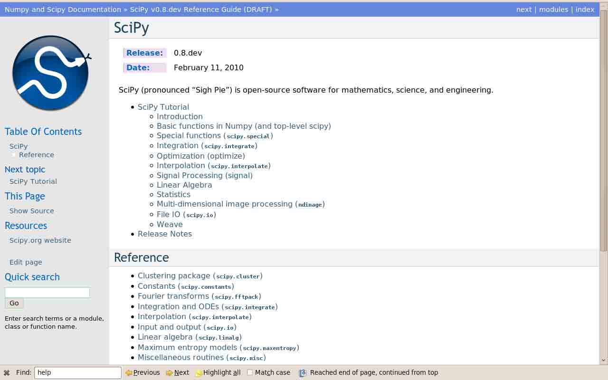
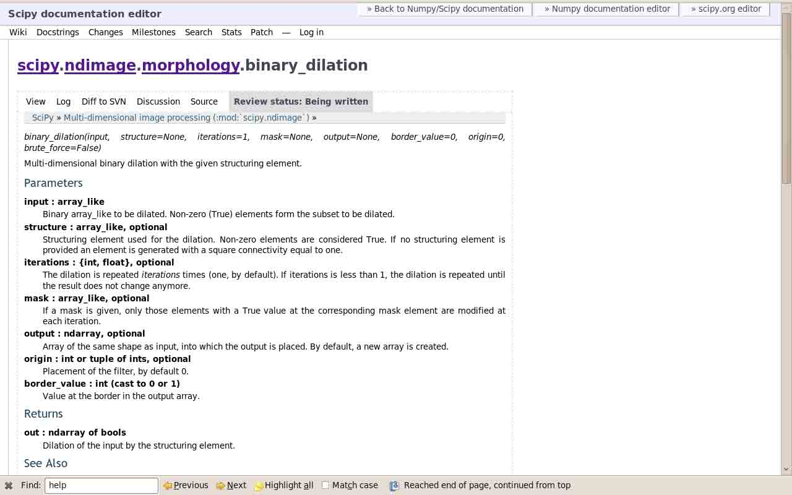
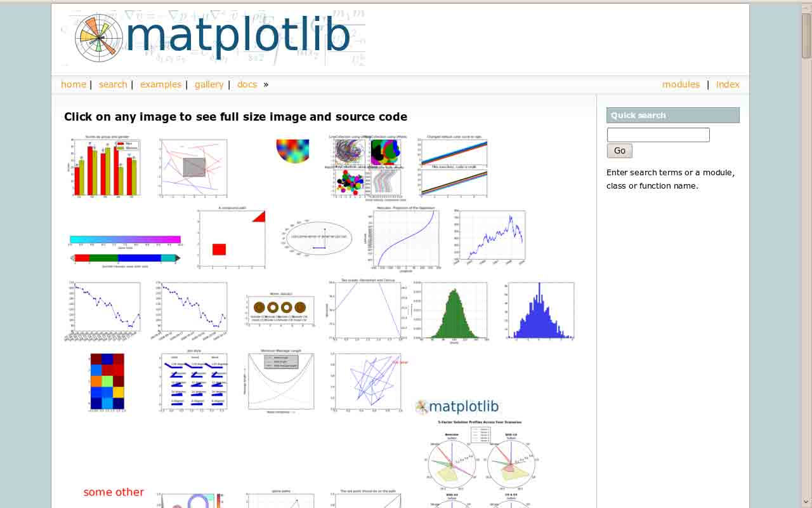

# 1.6 获取帮助及寻找文档

# 1.6 获取帮助及寻找文档

与了解 Numpy 和 Scipyzhong 的所有函数相比，通过文档和可用帮助快捷的找到信息更重要。这里是获得信息的一些方式：

*   在 Ipython 中，`help 方法`打开函数的文档字符串。只需要输入函数名的起始字母，使用 tab 完成来显示匹配到的函数。

```py
In [204]: help np.v
np.vander     np.vdot       np.version    np.void0      np.vstack
np.var        np.vectorize  np.void       np.vsplit

In [204]: help np.vander 
```

在 Ipython 中无法为帮助和问答打开一个独立的窗口；但是，可以打开另一个 Ipython shell 仅显示帮助和文档字符串...

*   Numpy 和 Scipy 的文档可以在线查看[`docs.scipy.org/doc`](http://docs.scipy.org/doc) 。两个包的参考文档([`docs.scipy.org/doc/numpy/reference/`](http://docs.scipy.org/doc/numpy/reference/) 和 [`docs.scipy.org/doc/scipy/reference/)中的搜索按钮非常有用。`](http://docs.scipy.org/doc/scipy/reference/)中的搜索按钮非常有用。)

在这个网站上也可以找到不同主题的教程以及所有字符串文档的完整 API。 

*   Numpy 和 Scipy 的文档由用户在 wiki [`docs.scipy.org/numpy/`](http://docs.scipy.org/numpy/) （链接已经失效） 上定期丰富和更新。因此，一些字符串文档在 wiki 上更清晰想尽，你可能更想在 wiki 上读取文档而不是在官方文档网站上。注意任何人都可以在 wiki 上创建一个帐号来写更好的文档；这是为开源项目做贡献以及改善你所使用的工具的简单方式！



*   Scipy 的 cookbook [`www.scipy.org/Cookbook`](http://www.scipy.org/Cookbook) 给出了许多常见问题的做法，比如拟合数据点，求解 ODE 等。

*   Matplotlib 网站 [`matplotlib.sourceforge.net/`](http://matplotlib.sourceforge.net/) 以一个拥有大量图表的非常漂亮的画廊为特色，每个图表都显示了源代码及生成的图表。这对于通过例子来学习非常有帮助。在网站上也可以找到更多的标准文档。



*   Mayavi 网站 [`code.enthought.com/projects/mayavi/docs/development/html/mayavi/`](http://code.enthought.com/projects/mayavi/docs/development/html/mayavi/) 也有非常漂亮的例子画廊 [`code.enthought.com/projects/mayavi/docs/development/html/mayavi/auto/examples.html`](http://code.enthought.com/projects/mayavi/docs/development/html/mayavi/auto/examples.html) ，人们可以查看不同的可视化方案。

最后，两个更加“技术”可能性也非常有用：

*   在 Ipython 中，魔法函数`%psearch`搜索匹配模式的对象。例如，如果不知道函数的准确名称，这将非常有用。

```py
In [3]: import numpy as np
In [4]: %psearch np.diag*
np.diag
np.diagflat
np.diagonal 
```

*   `numpy.lookfor` 查找指定模块文档字符串中的关键字。

```py
In [45]: numpy.lookfor('convolution')
Search results for 'convolution'
--------------------------------
numpy.convolve
    Returns the discrete, linear convolution of two one-dimensional
sequences.
numpy.bartlett
    Return the Bartlett window.
numpy.correlate
    Discrete, linear correlation of two 1-dimensional sequences.
In [46]: numpy.lookfor('remove', module='os')
Search results for 'remove'
---------------------------
os.remove
    remove(path)
os.removedirs
    removedirs(path)
os.rmdir
    rmdir(path)
os.unlink
    unlink(path)
os.walk
    Directory tree generator. 
```

*   如果上面列出的所有方法都失败了（并且 Google 也没有答案）... 不要绝望！你的问题适合向邮件组写一封邮件：如果你很好的描述了你的问题，那么你应该会很快得到答案。Python 科学计算的专家通过在邮件组给出非常有启发性的解释。
    *   Numpy 讨论（[[email protected]](cdn-cgi/l/email-protection)）: 全部是关于 Numpy 数组，操作数据，索引等问题。
    *   SciPy 用户列表（[[email protected]](cdn-cgi/l/email-protection)）: 用 Python 进行科学计算，高级数据处理，特别是 scipy 包的使用。
    *   [[email protected]](matplotlib-users@lists.sourceforge.net) 用 matplotlib 绘图。

In [1]:

```py
%matplotlib inline 
```