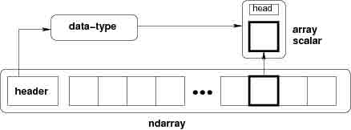
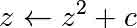

# 2.2 高级 Numpy

**作者**: Pauli Virtanen

Numpy 是 Python 科学工具栈的基础。它的目的很简单：在一个内存块上实现针对多个物品的高效操作。了解它的工作细节有助于有效的使用它的灵活性，使用有用的快捷键，基于它构建新的工作。

这个指南的目的包括：

*   剖析 Numpy 数组，以及它的重要性。提示与技巧。
*   通用函数：什么是、为什么以及如果你需要一个全新的该做什么。
*   与其他工具整合：Numpy 提供了一些方式将任意数据封装为 ndarray，而不需要不必要的复制。
*   新近增加的功能，对我来说他们包含什么：PEP 3118 buffers、广义 ufuncs, ...

**先决条件**

*   Numpy (>= 1.2; 越新越好...)
*   Cython (>= 0.12, 对于 Ufunc 例子)
*   PIL (在一些例子中使用)

在这个部分，numpy 将被如下引入：

In [2]:

```py
import numpy as np 
```

章节内容

*   ndarry 的一生
    *   它是...
    *   内存块
    *   数据类型
    *   索引体系：strides
    *   剖析中的发现
*   通用函数
    *   他们是什么？
    *   练习：从零开始构建一个 ufunc
    *   答案：从零开始构建一个 ufunc
    *   广义 ufuncs
*   协同工作功能
    *   共享多维度，类型数据
    *   旧的 buffer 协议
    *   旧的 buffer 协议
    *   数组接口协议
*   数组切片：`chararray`、`maskedarray`、`matrix`
    *   `chararray`：向量化字符操作
    *   `masked_array` 缺失值
    *   recarray：纯便利
    *   `matrix`：便利？
*   总结
*   为 Numpy/Scipy 做贡献
    *   为什么
    *   报告 bugs
    *   贡献文档
    *   贡献功能
    *   如何帮忙，总的来说

## 2.2.1 ndarray 的一生

### 2.2.1.1 它是...

**ndarray** =

```py
内存块 + 索引体系 + 数据类型描述符 
```

*   原始数据
*   如何定义一个元素
*   如何解释一个元素 

In [ ]:

```py
typedef struct PyArrayObject {
        PyObject_HEAD

        /* Block of memory */
        char *data;

        /* Data type descriptor */
        PyArray_Descr *descr;

        /* Indexing scheme */
        int nd;
        npy_intp *dimensions;
        npy_intp *strides;

        /* Other stuff */
        PyObject *base;
        int flags;
        PyObject *weakreflist;
} PyArrayObject; 
```

### 2.2.1.2 内存块

In [5]:

```py
x = np.array([1, 2, 3, 4], dtype=np.int32)
x.data 
```

Out[5]:

```py
<read-write buffer for 0x105ee2850, size 16, offset 0 at 0x105f880f0> 
```

In [6]:

```py
str(x.data) 
```

Out[6]:

```py
'\x01\x00\x00\x00\x02\x00\x00\x00\x03\x00\x00\x00\x04\x00\x00\x00' 
```

数据的内存地址：

In [7]:

```py
x.__array_interface__['data'][0] 
```

Out[7]:

```py
4352517296 
```

完整的`__array_interface__`：

In [8]:

```py
x.__array_interface__ 
```

Out[8]:

```py
{'data': (4352517296, False),
 'descr': [('', '<i4')],
 'shape': (4,),
 'strides': None,
 'typestr': '<i4',
 'version': 3} 
```

提醒：两个`ndarrays`可以共享相同的内存：

In [9]:

```py
x = np.array([1, 2, 3, 4])
y = x[:-1]
x[0] = 9
y 
```

Out[9]:

```py
array([9, 2, 3]) 
```

内存不必为一个`ndarray`拥有：

In [10]:

```py
x = '1234'
y = np.frombuffer(x, dtype=np.int8)
y.data 
```

Out[10]:

```py
<read-only buffer for 0x105ee2e40, size 4, offset 0 at 0x105f883b0> 
```

In [11]:

```py
y.base is x 
```

Out[11]:

```py
True 
```

In [12]:

```py
y.flags 
```

Out[12]:

```py
 C_CONTIGUOUS : True
  F_CONTIGUOUS : True
  OWNDATA : False
  WRITEABLE : False
  ALIGNED : True
  UPDATEIFCOPY : False 
```

`owndata`和`writeable`标记表明了内存块的状态。

也可以看一下：[array 接口](http://docs.scipy.org/doc/numpy/reference/arrays.interface.html)

### 2.2.1.3 数据类型

#### 2.2.1.3.1 描述符

`dtype`描述了数组里的一个项目：

|  |  |
| --- | --- |
| type | 数据的**标量类型**，int8、int16、float64 等之一（固定大小），str、unicode、void（可变大小） |
| itemsize | 数据块的**大小** |
| byteorder | **字节序**: big-endian `&gt;` / little-endian `&lt;` / 不可用 |
| fields | 子-dtypes，如果是一个**结构化的数据类型** |
| shape | 数组的形状，如果是一个**子数组** |

In [13]:

```py
np.dtype(int).type 
```

Out[13]:

```py
numpy.int64 
```

In [14]:

```py
np.dtype(int).itemsize 
```

Out[14]:

```py
8 
```

In [15]:

```py
np.dtype(int).byteorder 
```

Out[15]:

```py
'=' 
```

#### 2.2.1.3.2 例子：读取.wav 文件

The`.wav` file header:

|  |  |
| --- | --- |
| chunk_id | "RIFF" |
| chunk_size | 4 字节无符号 little-endian 整型 |
| format | "WAVE" |
| fmt_id | "fmt " |
| fmt_size | 4 字节无符号 little-endian 整型 |
| audio_fmt | 2 字节无符号 little-endian 整型 |
| num_channels | 2 字节无符号 little-endian 整型 |
| sample_rate | 4 字节无符号 little-endian 整型 |
| byte_rate | 4 字节无符号 little-endian 整型 |
| block_align | 2 字节无符号 little-endian 整型 |
| bits_per_sample | 2 字节无符号 little-endian 整型 |
| data_id | "data" |
| data_size | 4 字节无符号 little-endian 整型 |

*   44 字节块的原始数据（在文件的开头）
*   ...接下来是`data_size` 实际声音数据的字节。

`.wav`文件头是 Numpy 结构化数据类型：

In [6]:

```py
wav_header_dtype = np.dtype([
    ("chunk_id", (str, 4)),   # flexible-sized scalar type, item size 4
    ("chunk_size", "<u4"),    # little-endian unsigned 32-bit integer
    ("format", "S4"),         # 4-byte string
    ("fmt_id", "S4"),
    ("fmt_size", "<u4"),
    ("audio_fmt", "<u2"),     #
    ("num_channels", "<u2"),  # .. more of the same ...
    ("sample_rate", "<u4"),   #
    ("byte_rate", "<u4"),
    ("block_align", "<u2"),
    ("bits_per_sample", "<u2"),
    ("data_id", ("S1", (2, 2))), # sub-array, just for fun!
    ("data_size", "u4"),
    #
    # the sound data itself cannot be represented here:
    # it does not have a fixed size
   ]) 
```

也可以看一下`wavreader.py`

In [5]:

```py
wav_header_dtype['format'] 
```

Out[5]:

```py
dtype('S4') 
```

In [6]:

```py
wav_header_dtype.fields 
```

Out[6]:

```py
<dictproxy {'audio_fmt': (dtype('uint16'), 20),
 'bits_per_sample': (dtype('uint16'), 34),
 'block_align': (dtype('uint16'), 32),
 'byte_rate': (dtype('uint32'), 28),
 'chunk_id': (dtype('S4'), 0),
 'chunk_size': (dtype('uint32'), 4),
 'data_id': (dtype(('S1', (2, 2))), 36),
 'data_size': (dtype('uint32'), 40),
 'fmt_id': (dtype('S4'), 12),
 'fmt_size': (dtype('uint32'), 16),
 'format': (dtype('S4'), 8),
 'num_channels': (dtype('uint16'), 22),
 'sample_rate': (dtype('uint32'), 24)}> 
```

In [7]:

```py
wav_header_dtype.fields['format'] 
```

Out[7]:

```py
(dtype('S4'), 8) 
```

*   第一个元素是结构化数据中对应于名称`format`的子类型
*   第二个是它的从项目开始的偏移（以字节计算）

**练习**

小练习，通过使用偏移来创造一个“稀释”的 dtype，只使用一些字段：

In [ ]:

```py
wav_header_dtype = np.dtype(dict(
  names=['format', 'sample_rate', 'data_id'],
  offsets=[offset_1, offset_2, offset_3], # counted from start of structure in bytes
  formats=list of dtypes for each of the fields,
)) 
```

并且用它来读取 sample rate 和`data_id`（就像子数组）。

In [7]:

```py
f = open('data/test.wav', 'r')
wav_header = np.fromfile(f, dtype=wav_header_dtype, count=1)
f.close()
print(wav_header) 
```

```py
[ ('RIFF', 17402L, 'WAVE', 'fmt ', 16L, 1, 1, 16000L, 32000L, 2, 16, [['d', 'a'], ['t', 'a']], 17366L)] 
```

In [8]:

```py
wav_header['sample_rate'] 
```

Out[8]:

```py
array([16000], dtype=uint32) 
```

让我们访问子数组：

In [9]:

```py
wav_header['data_id'] 
```

Out[9]:

```py
array([[['d', 'a'],
        ['t', 'a']]], 
      dtype='|S1') 
```

In [10]:

```py
wav_header.shape 
```

Out[10]:

```py
(1,) 
```

In [11]:

```py
wav_header['data_id'].shape 
```

Out[11]:

```py
(1, 2, 2) 
```

当访问子数组时，维度被添加到末尾！

**注意：**有许多模块可以用于加载声音数据，比如`wavfile`、`audiolab`等...

#### 2.2.1.3.3 投射和再解释/视图

**投射**

*   赋值
*   数组构建
*   算术
*   等等
*   手动：`.astype(dtype)`

**data re-interpretation**

*   手动：`.view(dtype)`

##### 2.2.1.3.3.1 投射

*   算术投射，简而言之：
    *   只有类型（不是值！）操作符最重要
    *   最大的“安全”模式能代表选出的两者
    *   在一些情况下，数组中的量值可能“丢失”
*   在通用复制数据中的投射：

In [4]:

```py
x = np.array([1, 2, 3, 4], dtype=np.float)
x 
```

Out[4]:

```py
array([ 1.,  2.,  3.,  4.]) 
```

In [5]:

```py
y = x.astype(np.int8)
y 
```

Out[5]:

```py
array([1, 2, 3, 4], dtype=int8) 
```

In [6]:

```py
y + 1 
```

Out[6]:

```py
array([2, 3, 4, 5], dtype=int8) 
```

In [7]:

```py
y + 256 
```

Out[7]:

```py
array([257, 258, 259, 260], dtype=int16) 
```

In [8]:

```py
y + 256.0 
```

Out[8]:

```py
array([ 257.,  258.,  259.,  260.]) 
```

In [9]:

```py
y + np.array([256], dtype=np.int32) 
```

Out[9]:

```py
array([257, 258, 259, 260], dtype=int32) 
```

*   集合项目上的投射：数组的 dtype 在项目赋值过程中不会改变：

In [10]:

```py
y[:] = y + 1.5
y 
```

Out[10]:

```py
array([2, 3, 4, 5], dtype=int8) 
```

**注意** 具体规则：见文档：[`docs.scipy.org/doc/numpy/reference/ufuncs.html#casting-rules`](http://docs.scipy.org/doc/numpy/reference/ufuncs.html#casting-rules)

##### 2.2.1.3.3.2 再解释/视图

*   内存中的数据块（4 字节）

0x01 || 0x02 || 0x03 || 0x04

```py
- 4 of uint8, OR,
- 4 of int8, OR,
- 2 of int16, OR,
- 1 of int32, OR,
- 1 of float32, OR,
- ... 
```

如何从一个切换另一个？

*   切换 dtype：

In [11]:

```py
x = np.array([1, 2, 3, 4], dtype=np.uint8)
x.dtype = "<i2"
x 
```

Out[11]:

```py
array([ 513, 1027], dtype=int16) 
```

In [12]:

```py
0x0201, 0x0403 
```

Out[12]:

```py
(513, 1027) 
```

0x01 0x02 || 0x03 0x04

**注意** little-endian：越不重要的字节在内存的左侧

*   创建新视图：

In [14]:

```py
y = x.view("<i4")
y 
```

Out[14]:

```py
array([67305985], dtype=int32) 
```

In [15]:

```py
0x04030201 
```

Out[15]:

```py
67305985 
```

0x01 0x02 0x03 0x04

**注意：**

*   **`.view()`创建视图，并不复制（或改变）内存块**
*   **只改变 dtype（调整数组形状）:**

In [16]:

```py
x[1] = 5 
```

In [17]:

```py
y 
```

Out[17]:

```py
array([328193], dtype=int32) 
```

In [18]:

```py
y.base is x 
```

Out[18]:

```py
True 
```

**小练习：数据再解释**

**也可以看一下：** `view-colors.py`

数组中的 RGBA 数据：

In [19]:

```py
x = np.zeros((10, 10, 4), dtype=np.int8)
x[:, :, 0] = 1
x[:, :, 1] = 2
x[:, :, 2] = 3
x[:, :, 3] = 4 
```

后三个维度是 R、B 和 G，以及 alpha 渠道。

如何用字段名‘r’, ‘g’, ‘b’, ‘a’创建一个（10，10）结构化数组而不用复制数据？

In [ ]:

```py
y = ...                     

assert (y['r'] == 1).all()  
assert (y['g'] == 2).all()  
assert (y['b'] == 3).all()  
assert (y['a'] == 4).all() 
```

答案

...

**警告：**另一个占有四个字节内存的数组：

In [21]:

```py
y = np.array([[1, 3], [2, 4]], dtype=np.uint8).transpose()
x = y.copy()
x 
```

Out[21]:

```py
array([[1, 2],
       [3, 4]], dtype=uint8) 
```

In [22]:

```py
y 
```

Out[22]:

```py
array([[1, 2],
       [3, 4]], dtype=uint8) 
```

In [23]:

```py
x.view(np.int16) 
```

Out[23]:

```py
array([[ 513],
       [1027]], dtype=int16) 
```

In [24]:

```py
0x0201, 0x0403 
```

Out[24]:

```py
(513, 1027) 
```

In [25]:

```py
y.view(np.int16) 
```

Out[25]:

```py
array([[ 769, 1026]], dtype=int16) 
```

*   发生了什么？
*   ... 我们需要实际看一下 x[0,1]里面是什么

In [26]:

```py
0x0301, 0x0402 
```

Out[26]:

```py
(769, 1026) 
```

### 2.2.1.4 索引体系：步幅

#### 2.2.1.4.1 主要观点

**问题**

In [28]:

```py
x = np.array([[1, 2, 3],
             [4, 5, 6],
             [7, 8, 9]], dtype=np.int8)
str(x.data) 
```

Out[28]:

```py
'\x01\x02\x03\x04\x05\x06\x07\x08\t' 
```

item x[1,2]开始在`x.data`中的哪个字节？

**答案**（在 Numpy）

*   **步幅**：寻找一下个元素跳跃的字节数
*   每个维度一个步幅

In [29]:

```py
x.strides 
```

Out[29]:

```py
(3, 1) 
```

In [31]:

```py
byte_offset = 3*1 + 1*2   # 查找 x[1,2]
x.data[byte_offset] 
```

Out[31]:

```py
'\x06' 
```

In [32]:

```py
x[1, 2] 
```

Out[32]:

```py
6 
```

*   简单、**灵活**

##### 2.2.1.4.1.1 C 和 Fortran 顺序

In [34]:

```py
x = np.array([[1, 2, 3],
              [4, 5, 6],
              [7, 8, 9]], dtype=np.int16, order='C')
x.strides 
```

Out[34]:

```py
(6, 2) 
```

In [35]:

```py
str(x.data) 
```

Out[35]:

```py
'\x01\x00\x02\x00\x03\x00\x04\x00\x05\x00\x06\x00\x07\x00\x08\x00\t\x00' 
```

*   需要跳跃 6 个字节寻找下一行
*   需要跳跃 2 个字节寻找下一列

In [36]:

```py
y = np.array(x, order='F')
y.strides 
```

Out[36]:

```py
(2, 6) 
```

In [37]:

```py
str(y.data) 
```

Out[37]:

```py
'\x01\x00\x04\x00\x07\x00\x02\x00\x05\x00\x08\x00\x03\x00\x06\x00\t\x00' 
```

*   需要跳跃 2 个字节寻找下一行
*   需要跳跃 6 个字节寻找下一列

更高维度也类似：

```py
- C：最后的维度变化最快（=最小的步幅）
- F：最早的维度变化最快 
```


**注意**：现在我们可以理解`.view()`的行为：

In [38]:

```py
y = np.array([[1, 3], [2, 4]], dtype=np.uint8).transpose()
x = y.copy() 
```

变换顺序不影响数据的内部布局，只是步幅

In [39]:

```py
x.strides 
```

Out[39]:

```py
(2, 1) 
```

In [40]:

```py
y.strides 
```

Out[40]:

```py
(1, 2) 
```

In [41]:

```py
str(x.data) 
```

Out[41]:

```py
'\x01\x02\x03\x04' 
```

In [42]:

```py
str(y.data) 
```

Out[42]:

```py
'\x01\x03\x02\x04' 
```

*   当解释为 int16 时结果会不同
*   `.copy()`以 C 顺序（默认）创建新的数组

##### 2.2.1.4.1.2 用整数切片

*   通过仅改变形状、步幅和可能调整数据指针可以代表任何东西！
*   不用制造数据的副本

In [43]:

```py
x = np.array([1, 2, 3, 4, 5, 6], dtype=np.int32)
y = x[::-1]
y 
```

Out[43]:

```py
array([6, 5, 4, 3, 2, 1], dtype=int32) 
```

In [44]:

```py
y.strides 
```

Out[44]:

```py
(-4,) 
```

In [45]:

```py
y = x[2:]
y.__array_interface__['data'][0] - x.__array_interface__['data'][0] 
```

Out[45]:

```py
8 
```

In [46]:

```py
x = np.zeros((10, 10, 10), dtype=np.float)
x.strides 
```

Out[46]:

```py
(800, 80, 8) 
```

In [47]:

```py
x[::2,::3,::4].strides 
```

Out[47]:

```py
(1600, 240, 32) 
```

*   类似的，变换顺序绝不会创建副本（只是交换的步幅）

In [48]:

```py
x = np.zeros((10, 10, 10), dtype=np.float)
x.strides 
```

Out[48]:

```py
(800, 80, 8) 
```

In [49]:

```py
x.T.strides 
```

Out[49]:

```py
(8, 80, 800) 
```

但是：并不是所有的重排操作都可以通过操纵步幅来完成。

In [3]:

```py
a = np.arange(6, dtype=np.int8).reshape(3, 2)
b = a.T
b.strides 
```

Out[3]:

```py
(1, 2) 
```

到目前为止，都很不错，但是：

In [4]:

```py
str(a.data) 
```

Out[4]:

```py
'\x00\x01\x02\x03\x04\x05' 
```

In [5]:

```py
b 
```

Out[5]:

```py
array([[0, 2, 4],
       [1, 3, 5]], dtype=int8) 
```

In [6]:

```py
c = b.reshape(3*2)
c 
```

Out[6]:

```py
array([0, 2, 4, 1, 3, 5], dtype=int8) 
```

这里，没办法用一个给定的步长和`a`的内存块来表示数组`c`。因此，重排操作在这里需要制作一个副本。

#### 2.2.1.4.2 例子：用步长伪造维度

**步长操作**

In [2]:

```py
from numpy.lib.stride_tricks import as_strided
help(as_strided) 
```

```py
Help on function as_strided in module numpy.lib.stride_tricks:

as_strided(x, shape=None, strides=None)
    Make an ndarray from the given array with the given shape and strides. 
```

**警告**：`as_strided`并不检查你是否还待在内存块边界里..

In [9]:

```py
x = np.array([1, 2, 3, 4], dtype=np.int16)
as_strided(x, strides=(2*2, ), shape=(2, )) 
```

Out[9]:

```py
array([1, 3], dtype=int16) 
```

In [10]:

```py
x[::2] 
```

Out[10]:

```py
array([1, 3], dtype=int16) 
```

也可以看一下：stride-fakedims.py

**练习**

In [ ]:

```py
array([1, 2, 3, 4], dtype=np.int8)

-> array([[1, 2, 3, 4],
          [1, 2, 3, 4],
          [1, 2, 3, 4]], dtype=np.int8) 
```

仅使用`as_strided`.:

提示：byte_offset = stride[0]*index[0] + stride[1]*index[1] + ...

解密：

步长可以设置为 0：

In [11]:

```py
x = np.array([1, 2, 3, 4], dtype=np.int8)
y = as_strided(x, strides=(0, 1), shape=(3, 4))
y 
```

Out[11]:

```py
array([[1, 2, 3, 4],
       [1, 2, 3, 4],
       [1, 2, 3, 4]], dtype=int8) 
```

In [12]:

```py
y.base.base is x 
```

Out[12]:

```py
True 
```

#### 2.2.1.4.3 广播

*   用它来做一些有用的事情：[1, 2, 3, 4]和[5, 6, 7]的外积

In [13]:

```py
x = np.array([1, 2, 3, 4], dtype=np.int16)
x2 = as_strided(x, strides=(0, 1*2), shape=(3, 4))
x2 
```

Out[13]:

```py
array([[1, 2, 3, 4],
       [1, 2, 3, 4],
       [1, 2, 3, 4]], dtype=int16) 
```

In [14]:

```py
y = np.array([5, 6, 7], dtype=np.int16)
y2 = as_strided(y, strides=(1*2, 0), shape=(3, 4))
y2 
```

Out[14]:

```py
array([[5, 5, 5, 5],
       [6, 6, 6, 6],
       [7, 7, 7, 7]], dtype=int16) 
```

In [15]:

```py
x2 * y2 
```

Out[15]:

```py
array([[ 5, 10, 15, 20],
       [ 6, 12, 18, 24],
       [ 7, 14, 21, 28]], dtype=int16) 
```

**...看起来有一些熟悉...**

In [16]:

```py
x = np.array([1, 2, 3, 4], dtype=np.int16)
y = np.array([5, 6, 7], dtype=np.int16)
x[np.newaxis,:] * y[:,np.newaxis] 
```

Out[16]:

```py
array([[ 5, 10, 15, 20],
       [ 6, 12, 18, 24],
       [ 7, 14, 21, 28]], dtype=int16) 
```

*   在内部，数组**广播**的确使用 0 步长来实现的。

#### 2.2.1.4.4 更多技巧：对角线

**也可以看一下** stride-diagonals.py

**挑战**

*   提取矩阵对角线的起点：（假定是 C 内存顺序）：

In [ ]:

```py
x = np.array([[1, 2, 3],
              [4, 5, 6],
              [7, 8, 9]], dtype=np.int32)

x_diag = as_strided(x, shape=(3,), strides=(???,)) 
```

*   提取第一个超级-对角线的起点[2,6]。
*   那么子对角线呢？

（后两个问题的提示：切片首先移动步长起点的点。）

答案

...

提取对角线：

In [6]:

```py
x_diag = as_strided(x, shape=(3, ), strides=((3+1)*x.itemsize, ))
x_diag 
```

Out[6]:

```py
array([1, 5, 9], dtype=int32) 
```

首先切片，调整数据指针：

In [8]:

```py
as_strided(x[0, 1:], shape=(2, ), strides=((3+1)*x.itemsize, )) 
```

Out[8]:

```py
array([2, 6], dtype=int32) 
```

In [9]:

```py
as_strided(x[1:, 0], shape=(2, ), strides=((3+1)*x.itemsize, )) 
```

Out[9]:

```py
array([4, 8], dtype=int32) 
```

**笔记**

In [7]:

```py
y = np.diag(x, k=1)
y 
```

Out[7]:

```py
array([2, 6], dtype=int32) 
```

但是

In [8]:

```py
y.flags.owndata 
```

Out[8]:

```py
False 
```

这是一个副本？！

**也可以看一下**stride-diagonals.py

**挑战**

计算张量的迹：

In [9]:

```py
x = np.arange(5*5*5*5).reshape(5,5,5,5)
s = 0
for i in xrange(5):
   for j in xrange(5):
      s += x[j,i,j,i] 
```

通过跨越并且在结果上使用`sum()`。

In [ ]:

```py
y = as_strided(x, shape=(5, 5), strides=(TODO, TODO))   
s2 = ...   
assert s == s2 
```

答案

...

In [ ]:

```py
y = as_strided(x, shape=(5, 5), strides=((5*5*5 + 5)*x.itemsize,
                                         (5*5 + 1)*x.itemsize))
s2 = y.sum() 
```

#### 2.2.1.4.5 CPU 缓存效果

内存布局可以影响性能：

In [13]:

```py
x = np.zeros((20000,))
y = np.zeros((20000*67,))[::67]
x.shape, y.shape 
```

Out[13]:

```py
((20000,), (20000,)) 
```

In [14]:

```py
%timeit x.sum() 
```

```py
The slowest run took 20.69 times longer than the fastest. This could mean that an intermediate result is being cached 
10000 loops, best of 3: 15.4 µs per loop 
```

In [15]:

```py
%timeit y.sum() 
```

```py
The slowest run took 114.83 times longer than the fastest. This could mean that an intermediate result is being cached 
10000 loops, best of 3: 53 µs per loop 
```

In [16]:

```py
x.strides, y.strides 
```

Out[16]:

```py
((8,), (536,)) 
```

**小步长更快？**


*   CPU 从主内存中拉取数据到缓存块 pulls data from main memory to its cache in blocks
*   如果需要数据项连续操作适应于一个内存块（小步长）：
    *   需要更少的迁移
    *   更快

**也可以看一下**：`numexpr`设计用来减轻数组计算时的缓存效果。

#### 2.2.1.4.6 例子：原地操作（买者当心）

有时，

In [ ]:

```py
a -= b 
```

并不等同于

In [ ]:

```py
a -= b.copy() 
```

In [21]:

```py
x = np.array([[1, 2], [3, 4]])
x -= x.transpose()
x 
```

Out[21]:

```py
array([[ 0, -1],
       [ 1,  0]]) 
```

In [22]:

```py
y = np.array([[1, 2], [3, 4]])
y -= y.T.copy()
y 
```

Out[22]:

```py
array([[ 0, -1],
       [ 1,  0]]) 
```

*   `x`和`x.transpose()`共享数据
*   `x -= x.transpose()`逐个元素修改数据...
*   因为`x`和`x.transpose()`步长不同，修改后的数据重新出现在 RHS

### 2.2.1.5 剖析上的发现


*   *内存块*：可以共享，`.base`、`.data`
*   *数据类型描述符*：结构化数据、子数组、字节顺序、投射、视图、`.astype()`、`.view()`
*   *步长索引*：跨越、C/F-order、w/ 整数切片、`as_strided`、广播、跨越技巧、`diag`、CPU 缓存一致性

## 2.2.2 通用函数

### 2.2.2.1 他们是什么？

*   Ufunc 在数组的所有元素上进行元素级操作。

例子：

`np.add`、`np.subtract`、`scipy.special`.*, ...

*   自动话支持：广播、投射...
*   ufunc 的作者只提供了元素级操作，Numpy 负责剩下的。
*   元素级操作需要在 C 中实现（或者比如 Cython）

#### 2.2.2.1.1 Ufunc 的部分

*   由用户提供

In [ ]:

```py
void ufunc_loop(void **args, int *dimensions, int *steps, void *data)
{
    /*
     * int8 output = elementwise_function(int8 input_1, int8 input_2)
     *
     * This function must compute the ufunc for many values at once,
     * in the way shown below.
     */
    char *input_1 = (char*)args[0];
    char *input_2 = (char*)args[1];
    char *output = (char*)args[2];
    int i;

    for (i = 0; i < dimensions[0]; ++i) {
        *output = elementwise_function(*input_1, *input_2);
        input_1 += steps[0];
        input_2 += steps[1];
        output += steps[2];
    }
} 
```

*   Numpy 部分，由下面的代码创建

In [ ]:

```py
char types[3]

types[0] = NPY_BYTE   /* type of first input arg */
types[1] = NPY_BYTE   /* type of second input arg */
types[2] = NPY_BYTE   /* type of third input arg */

PyObject *python_ufunc = PyUFunc_FromFuncAndData(
    ufunc_loop,
    NULL,
    types,
    1, /* ntypes */
    2, /* num_inputs */
    1, /* num_outputs */
    identity_element,
    name,
    docstring,
    unused) 
```

```py
- ufunc 也可以支持多种不同输入输出类型组合。 
```

#### 2.2.2.1.2 简化一下

`ufunc_loop`是非常通用的模式，Numpy 提供了预制

|  |  |
| --- | --- |
| `PyUfunc_f_f` | `float elementwise_func(float input_1)` |
| `PyUfunc_ff_f` | `float elementwise_func(float input_1, float input_2)` |
| `PyUfunc_d_d` | `double elementwise_func(double input_1)` |
| `PyUfunc_dd_d` | `double elementwise_func(double input_1, double input_2)` |
| `PyUfunc_D_D` | `elementwise_func(npy_cdouble \*input, npy_cdouble\* output)` |
| `PyUfunc_DD_D` | `elementwise_func(npy_cdouble \*in1, npy_cdouble \*in2, npy_cdouble\* out)` |

```py
- 只有需要提供`elementwise_func`
- ... 除非当你的元素级函数不是上面的形式中的任何一种 
```

### 2.2.2.2 练习：从 0 开始构建一个 ufunc

Mandelbrot 分形由如下迭代定义：



`C=X+iy`是一个复数，只要 Z 仍然是有限的，无论迭代要跑多久，迭代都会重复。C 属于 Mandelbrot 集。

*   ufunc 调用`mandel(z0, c)`计算：

In [ ]:

```py
z = z0
for k in range(iterations):
    z = z*z + c 
```

比如，一百次迭代或者直到`z.real**2 + z.imag**2 &gt; 1000`。用它来决定哪个`C`是在 Mandelbrot 集中。

*   我们的函数是很简单的，因此，请利用`PyUFunc_*`助手。
*   用 Cython 来完成

也可以看一下`mandel.pyx`，`mandelplot.py`

提醒：一些预设 Ufunc 循环：

|  |  |
| --- | --- |
| `PyUfunc_f_f` | `float elementwise_func(float input_1)` |
| `PyUfunc_ff_f` | `float elementwise_func(float input_1, float input_2)` |
| `PyUfunc_d_d` | `double elementwise_func(double input_1)` |
| `PyUfunc_dd_d` | `double elementwise_func(double input_1, double input_2)` |
| `PyUfunc_D_D` | `elementwise_func(complex_double *input, complex_double* output)` |
| `PyUfunc_DD_D` | `elementwise_func(complex_double *in1, complex_double *in2, complex_double* out)` |

打印代码：

NPY_BOOL, NPY_BYTE, NPY_UBYTE, NPY_SHORT, NPY_USHORT, NPY_INT, NPY_UINT, NPY_LONG, NPY_ULONG, NPY_LONGLONG, NPY_ULONGLONG, NPY_FLOAT, NPY_DOUBLE, NPY_LONGDOUBLE, NPY_CFLOAT, NPY_CDOUBLE, NPY_CLONGDOUBLE, NPY_DATETIME, NPY_TIMEDELTA, NPY_OBJECT, NPY_STRING, NPY_UNICODE, NPY_VOID

#### 2.2.2.3 答案：从 0 开始创建一个 ufunc

In [ ]:

```py
# The elementwise function
# ------------------------

cdef void mandel_single_point(double complex *z_in, 
                              double complex *c_in,
                              double complex *z_out) nogil:
    #
    # The Mandelbrot iteration
    #

    #
    # Some points of note:
    #
    # - It's *NOT* allowed to call any Python functions here.
    #
    #   The Ufunc loop runs with the Python Global Interpreter Lock released.
    #   Hence, the ``nogil``.
    #
    # - And so all local variables must be declared with ``cdef``
    #
    # - Note also that this function receives *pointers* to the data;
    #   the "traditional" solution to passing complex variables around
    #

    cdef double complex z = z_in[0]
    cdef double complex c = c_in[0]
    cdef int k  # the integer we use in the for loop

    # Straightforward iteration

    for k in range(100):
        z = z*z + c
        if z.real**2 + z.imag**2 > 1000:
            break

    # Return the answer for this point
    z_out[0] = z

# Boilerplate Cython definitions
#
# You don't really need to read this part, it just pulls in
# stuff from the Numpy C headers.
# ----------------------------------------------------------

cdef extern from "numpy/arrayobject.h":
    void import_array()
    ctypedef int npy_intp
    cdef enum NPY_TYPES:
        NPY_CDOUBLE

cdef extern from "numpy/ufuncobject.h":
    void import_ufunc()
    ctypedef void (*PyUFuncGenericFunction)(char**, npy_intp*, npy_intp*, void*)
    object PyUFunc_FromFuncAndData(PyUFuncGenericFunction* func, void** data,
        char* types, int ntypes, int nin, int nout,
        int identity, char* name, char* doc, int c)

    void PyUFunc_DD_D(char**, npy_intp*, npy_intp*, void*)

# Required module initialization
# ------------------------------

import_array()
import_ufunc()

# The actual ufunc declaration
# ----------------------------

cdef PyUFuncGenericFunction loop_func[1]
cdef char input_output_types[3]
cdef void *elementwise_funcs[1]

loop_func[0] = PyUFunc_DD_D

input_output_types[0] = NPY_CDOUBLE
input_output_types[1] = NPY_CDOUBLE
input_output_types[2] = NPY_CDOUBLE

elementwise_funcs[0] = <void*>mandel_single_point

mandel = PyUFunc_FromFuncAndData(
    loop_func,
    elementwise_funcs,
    input_output_types,
    1, # number of supported input types
    2, # number of input args
    1, # number of output args
    0, # `identity` element, never mind this
    "mandel", # function name
    "mandel(z, c) -> computes iterated z*z + c", # docstring
    0 # unused
    ) 
```

In [ ]:

```py
import numpy as np
import mandel
x = np.linspace(-1.7, 0.6, 1000)
y = np.linspace(-1.4, 1.4, 1000)
c = x[None,:] + 1j*y[:,None]
z = mandel.mandel(c, c)

import matplotlib.pyplot as plt
plt.imshow(abs(z)**2 < 1000, extent=[-1.7, 0.6, -1.4, 1.4])
plt.gray()
plt.show() 
```


**笔记**：大多数模板可以由下列 Cython 模块来自动完成： [`wiki.cython.org/MarkLodato/CreatingUfuncs`](http://wiki.cython.org/MarkLodato/CreatingUfuncs)

**一些可接受的输入类型**

例如：支持小数点后一位及两位两个准确度版本

In [ ]:

```py
cdef void mandel_single_point(double complex *z_in,
                              double complex *c_in,
                              double complex *z_out) nogil:
   ...

cdef void mandel_single_point_singleprec(float complex *z_in,
                                         float complex *c_in,
                                         float complex *z_out) nogil:
   ...

cdef PyUFuncGenericFunction loop_funcs[2]
cdef char input_output_types[3*2]
cdef void *elementwise_funcs[1*2]

loop_funcs[0] = PyUFunc_DD_D
input_output_types[0] = NPY_CDOUBLE
input_output_types[1] = NPY_CDOUBLE
input_output_types[2] = NPY_CDOUBLE
elementwise_funcs[0] = <void*>mandel_single_point

loop_funcs[1] = PyUFunc_FF_F
input_output_types[3] = NPY_CFLOAT
input_output_types[4] = NPY_CFLOAT
input_output_types[5] = NPY_CFLOAT
elementwise_funcs[1] = <void*>mandel_single_point_singleprec

mandel = PyUFunc_FromFuncAndData(
    loop_func,
    elementwise_funcs,
    input_output_types,
    2, # number of supported input types   <----------------
    2, # number of input args
    1, # number of output args
    0, # `identity` element, never mind this
    "mandel", # function name
    "mandel(z, c) -> computes iterated z*z + c", # docstring
    0 # unused
    ) 
```

### 2.2.2.4 广义 ufuncs

**ufunc**

`output = elementwise_function(input)`

`output`和`input`都可以只是一个数组元素。

**广义 ufunc**

`output`和`input`可以是有固定维度数的数组

例如，矩阵迹（对象线元素的 sum）：

In [ ]:

```py
input shape = (n, n)
output shape = ()      i.e.  scalar

(n, n) -> () 
```

矩阵乘积：

In [ ]:

```py
input_1 shape = (m, n)
input_2 shape = (n, p)
output shape  = (m, p)

(m, n), (n, p) -> (m, p) 
```

*   这是广义 ufunc 的”签名“
*   g-ufunc 发挥作用的维度是“核心维度”

**Numpy 中的状态**

*   g-ufuncs 已经在 Numpy 中...
*   新的可以用`PyUFunc_FromFuncAndDataAndSignature`来创建
*   ... 但是，除了测试外，我们不会配置公用的 g-ufuncs，ATM

In [4]:

```py
import numpy.core.umath_tests as ut
ut.matrix_multiply.signature 
```

Out[4]:

```py
'(m,n),(n,p)->(m,p)' 
```

In [5]:

```py
x = np.ones((10, 2, 4))
y = np.ones((10, 4, 5))
ut.matrix_multiply(x, y).shape 
```

Out[5]:

```py
(10, 2, 5) 
```

*   后两个维度成为了核心维度，并且根据每个*签名*去修改
*   否则，g-ufunc“按元素级”运行
*   这种方式的矩阵乘法对一次在许多小矩阵是非常有用

**广义 ufunc 循环**

矩阵相乘 `(m,n),(n,p) -&gt; (m,p)`

In [ ]:

```py
void gufunc_loop(void **args, int *dimensions, int *steps, void *data)
{
    char *input_1 = (char*)args[0];  /* these are as previously */
    char *input_2 = (char*)args[1];
    char *output = (char*)args[2];

    int input_1_stride_m = steps[3];  /* strides for the core dimensions */
    int input_1_stride_n = steps[4];  /* are added after the non-core */
    int input_2_strides_n = steps[5]; /* steps */
    int input_2_strides_p = steps[6];
    int output_strides_n = steps[7];
    int output_strides_p = steps[8];

    int m = dimension[1]; /* core dimensions are added after */
    int n = dimension[2]; /* the main dimension; order as in */
    int p = dimension[3]; /* signature */

    int i;

    for (i = 0; i < dimensions[0]; ++i) {
        matmul_for_strided_matrices(input_1, input_2, output,
                                    strides for each array...);

        input_1 += steps[0];
        input_2 += steps[1];
        output += steps[2];
    }
} 
```

## 2.2.3 互操性功能

### 2.2.3.1 多维度类型数据贡献

假设你

1.  写一个库处理（多维度）二进制数据，
2.  想要它可以用 Numpy 或者其他库来简单的操作数据，
3.  ... 但是并不像依赖 Numpy。

目前，三个解决方案：

*   “旧的” buffer 接口
*   数组接口
*   “新的” buffer 接口([PEP 3118](http://www.python.org/dev/peps/pep-3118))

### 2.2.3.2 旧的 buffer 协议

*   只有 1-D buffers
*   没有数据类型信息
*   C-级接口；`PyBufferProcs` `tp_as_buffer`在类型对象中
*   但是它被整合在 Python 中（比如，字符支持这个协议）

使用 PIL(Python Imaging Library)的小练习：

也可以看一下：pilbuffer.py

In [ ]:

```py
import Image
data = np.zeros((200, 200, 4), dtype=np.int8)
data[:, :] = [255, 0, 0, 255] # Red
# In PIL, RGBA images consist of 32-bit integers whose bytes are [RR,GG,BB,AA]
data = data.view(np.int32).squeeze()
img = Image.frombuffer("RGBA", (200, 200), data)
img.save('test.png') 
```

**Q**： 检查一下如果`data`修改的话，再保存一下`img`看一下会发生什么。

### 2.2.3.3 旧的 buffer 协议

In [9]:

```py
import numpy as np
# import Image 
from PIL import Image

# Let's make a sample image, RGBA format

x = np.zeros((200, 200, 4), dtype=np.int8)

x[:,:,0] = 254 # red
x[:,:,3] = 255 # opaque

data = x.view(np.int32) # Check that you understand why this is OK!

img = Image.frombuffer("RGBA", (200, 200), data)
img.save('test.png')

#
# Modify the original data, and save again.
#
# It turns out that PIL, which knows next to nothing about Numpy,
# happily shares the same data.
#

x[:,:,1] = 254
img.save('test2.png') 
```

```py
/Library/Frameworks/Python.framework/Versions/2.7/lib/python2.7/site-packages/IPython/kernel/__main__.py:14: RuntimeWarning: the frombuffer defaults may change in a future release; for portability, change the call to read:
  frombuffer(mode, size, data, 'raw', mode, 0, 1) 
```


### 2.2.3.4 数组接口协议

*   多维度 buffers
*   存在数据类型信息
*   Numpy-特定方法；慢慢的废弃（不过不会消失）
*   然而，没有整合在 Python 中

**也可以看一下**：文档：[`docs.scipy.org/doc/numpy/reference/arrays.interface.html`](http://docs.scipy.org/doc/numpy/reference/arrays.interface.html)

In [8]:

```py
x = np.array([[1, 2], [3, 4]])
x.__array_interface__ 
```

Out[8]:

```py
{'data': (4298825184, False),
 'descr': [('', '<i8')],
 'shape': (2, 2),
 'strides': None,
 'typestr': '<i8',
 'version': 3} 
```

In [11]:

```py
# import Image
from PIL import Image
img = Image.open('data/test.png')
img.__array_interface__ 
```

Out[11]:

```py
{'data': '\xfe\x00\x00\xff\xfe\x00\x00...\xff\xfe\x00\x00\xff',
 'shape': (200, 200, 4),
 'typestr': '|u1'} 
```

In [12]:

```py
x = np.asarray(img)
x.shape 
```

Out[12]:

```py
(200, 200, 4) 
```

In [13]:

```py
x.dtype 
```

Out[13]:

```py
dtype('uint8') 
```

**笔记**： 一个对 C 更友好的数组接口变体也被定义出来了。

## 2.2.4 数组的兄弟：chararray、maskedarray、matrix

### 2.2.4.1 chararray：: 向量化字符操作

In [14]:

```py
x = np.array(['a', '  bbb', '  ccc']).view(np.chararray)
x.lstrip(' ') 
```

Out[14]:

```py
chararray(['a', 'bbb', 'ccc'], 
      dtype='|S5') 
```

In [15]:

```py
x.upper() 
```

Out[15]:

```py
chararray(['A', '  BBB', '  CCC'], 
      dtype='|S5') 
```

**笔记**：`.view()`有另一个含义：它将一个 ndarray 变成专门的 ndarray 子类的一个实例

### 2.2.4.2 masked_array 缺失数据

Masked arrays 是有缺失或无效条目的数组。

例如，假如我们有一个第四个条目无效的数组：

In [16]:

```py
x = np.array([1, 2, 3, -99, 5]) 
```

描述这个数组的一个方式是创建 masked array：

In [17]:

```py
mx = np.ma.masked_array(x, mask=[0, 0, 0, 1, 0])
mx 
```

Out[17]:

```py
masked_array(data = [1 2 3 -- 5],
             mask = [False False False  True False],
       fill_value = 999999) 
```

Masked 平均数会忽略 masked 数据：

In [18]:

```py
mx.mean() 
```

Out[18]:

```py
2.75 
```

In [19]:

```py
np.mean(mx) 
```

Out[19]:

```py
2.75 
```

**警告**：不是所有的 Numpy 函数都接收 mask，例如，`np.dot`，因此，请检查返回的类型。

`masked_array`返回原始数组的一个视图：

In [20]:

```py
mx[1] = 9
x 
```

Out[20]:

```py
array([  1,   9,   3, -99,   5]) 
```

#### 2.2.4.2.1 mask

你可以通过赋值来修改 mask：

In [21]:

```py
mx[1] = np.ma.masked
mx 
```

Out[21]:

```py
masked_array(data = [1 -- 3 -- 5],
             mask = [False  True False  True False],
       fill_value = 999999) 
```

通过赋值可以清除 mask：

In [22]:

```py
mx[1] = 9
mx 
```

Out[22]:

```py
masked_array(data = [1 9 3 -- 5],
             mask = [False False False  True False],
       fill_value = 999999) 
```

mask 也可以直接访问：

In [23]:

```py
mx.mask 
```

Out[23]:

```py
array([False, False, False,  True, False], dtype=bool) 
```

masked 条目可以通过填入一个给定值来变回一般的数组：

In [24]:

```py
x2 = mx.filled(-1)
x2 
```

Out[24]:

```py
array([ 1,  9,  3, -1,  5]) 
```

mask 也可以被清除：

In [25]:

```py
mx.mask = np.ma.nomask
mx 
```

Out[25]:

```py
masked_array(data = [1 9 3 -99 5],
             mask = [False False False False False],
       fill_value = 999999) 
```

#### 2.2.4.2.2 领域相关的函数

masked 数组包也包含一些领域相关的函数：

In [26]:

```py
np.ma.log(np.array([1, 2, -1, -2, 3, -5])) 
```

Out[26]:

```py
masked_array(data = [0.0 0.6931471805599453 -- -- 1.0986122886681098 --],
             mask = [False False  True  True False  True],
       fill_value = 1e+20) 
```

**笔记**：对于高效无缝处理数组中的缺失值的支持将在 Numpy 1.7 中出现。现在还在优化中！

**例子：Masked 统计**

加拿大的护林员在计算 1903-1918 年野兔和猞猁的数量时有些心烦意乱，数字经常出错。（尽管胡萝卜农场主不断的警告。）计算随着时间推移的平均数，忽略无效数据。

In [4]:

```py
data = np.loadtxt('data/populations.txt')
populations = np.ma.masked_array(data[:,1:])
year = data[:, 0]

bad_years = (((year >= 1903) & (year <= 1910))
           | ((year >= 1917) & (year <= 1918)))
# '&' means 'and' and '|' means 'or'
populations[bad_years, 0] = np.ma.masked
populations[bad_years, 1] = np.ma.masked

populations.mean(axis=0) 
```

Out[4]:

```py
masked_array(data = [40472.72727272727 18627.272727272728 42400.0],
             mask = [False False False],
       fill_value = 1e+20) 
```

In [5]:

```py
populations.std(axis=0) 
```

Out[5]:

```py
masked_array(data = [21087.656489006717 15625.799814240254 3322.5062255844787],
             mask = [False False False],
       fill_value = 1e+20) 
```

注意，Matplotlib 了解 masked 数组：

In [8]:

```py
plt.plot(year, populations, 'o-') 
```

Out[8]:

```py
[<matplotlib.lines.Line2D at 0x10565f250>,
 <matplotlib.lines.Line2D at 0x10565f490>,
 <matplotlib.lines.Line2D at 0x10565f650>] 
```


### 2.2.4.3 recarray：仅仅方便

In [9]:

```py
arr = np.array([('a', 1), ('b', 2)], dtype=[('x', 'S1'), ('y', int)])
arr2 = arr.view(np.recarray)
arr2.x 
```

Out[9]:

```py
chararray(['a', 'b'], 
      dtype='|S1') 
```

In [10]:

```py
arr2.y 
```

Out[10]:

```py
array([1, 2]) 
```

### 2.2.4.4 矩阵：方便？

*   通常是 2-D
*   *   是矩阵的积，不是元素级的积

In [11]:

```py
np.matrix([[1, 0], [0, 1]]) * np.matrix([[1, 2], [3, 4]]) 
```

Out[11]:

```py
matrix([[1, 2],
        [3, 4]]) 
```

## 2.2.5 总结

*   ndarray 的剖析：data、dtype, 步长
*   通用函数：元素级操作，如何常见一个新的通用函数
*   Ndarray 子类
*   整合其他工具的多种 buffer 接口
*   最近的补充：PEP 3118，广义 ufuncs

## 2.2.6 为 Numpy/Scipy 做贡献

看一下这篇教程：[`www.euroscipy.org/talk/882`](http://www.euroscipy.org/talk/882)

### 2.2.6.1 为什么

*   “这有个 bug?”
*   “我不理解这个要做什么？”
*   “我有这个神器的代码。你要吗？”
*   “我需要帮助！我应该怎么办？”

### 2.2.6.2 报告 bugs

*   Bug 跟踪（推荐这种方式）

    *   [`projects.scipy.org/numpy`](http://projects.scipy.org/numpy)
    *   [`projects.scipy.org/scipy`](http://projects.scipy.org/scipy)
    *   点击“注册”链接获得一个帐号
*   邮件列表 ( scipy.org/Mailing_Lists )

    *   如果你不确定
    *   在一周左右还没有任何回复？去开一个 bug ticket 吧。

#### 2.2.6.2.1 好的 bug 报告

Title: numpy.random.permutations fails for non-integer arguments

I'm trying to generate random permutations, using numpy.random.permutations

When calling numpy.random.permutation with non-integer arguments it fails with a cryptic error message::

```py
>>> np.random.permutation(12)
array([ 6, 11,  4, 10,  2,  8,  1,  7,  9,  3,  0,  5])
>>> np.random.permutation(12.)
Traceback (most recent call last):
  File "<stdin>", line 1, in <module>
  File "mtrand.pyx", line 3311, in mtrand.RandomState.permutation
  File "mtrand.pyx", line 3254, in mtrand.RandomState.shuffle
TypeError: len() of unsized object 
```

This also happens with long arguments, and so np.random.permutation(X.shape[0]) where X is an array fails on 64 bit windows (where shape is a tuple of longs).

It would be great if it could cast to integer or at least raise a proper error for non-integer types.

I'm using Numpy 1.4.1, built from the official tarball, on Windows 64 with Visual studio 2008, on Python.org 64-bit Python.

1.  你要做什么？
2.  **重现 bug 的小代码段**（如果可能的话）
    *   实际上发生了什么
    *   期望发生什么
3.  平台（Windows / Linux / OSX, 32/64 bits, x86/PPC, ...）
4.  Numpy/Scipy 的版本

In [2]:

```py
print np.__version__ 
```

```py
1.9.2 
```

**检查下面的文件是你所期望的**

In [3]:

```py
print np.__file__ 
```

```py
/Library/Frameworks/Python.framework/Versions/2.7/lib/python2.7/site-packages/numpy/__init__.pyc 
```

以免你想要旧/损坏的 Numpy 安装在哪里

如果不确定，试着删除现有的 Numpy 安装文件，并且重新安装...

### 2.2.6.3 为文档做贡献

1.  文档编辑器

    *   [`docs.scipy.org/numpy`](http://docs.scipy.org/numpy)
    *   注册

        *   注册一个帐号
        *   订阅 scipy-dev 邮件列表（仅限订阅者）
        *   邮件列表有问题：你可以发邮件
            *   但是：**你可以关闭邮件送达**
            *   在[`mail.scipy.org/mailman/listinfo/scipy-dev`](http://mail.scipy.org/mailman/listinfo/scipy-dev) 底部“改变你的订阅选项”
                *   给@`scipy-dev`邮件列表发一封邮件；要求激活：

        To: [[email protected]](cdn-cgi/l/email-protection)

    Hi,

    I'd like to edit Numpy/Scipy docstrings. My account is XXXXX

    Cheers, N. N.

    ```py
    ``` 
    ```py

    *   检查一下风格指南：
        *   [`docs.scipy.org/numpy/`](http://docs.scipy.org/numpy/)
    *   不要被吓住；要修补一个小事情，就修补它 ```
    *   编辑
2.  编辑源码发送补丁（和 bug 一样）
3.  向邮件列表抱怨

### 2.2.6.4 贡献功能

1.  在邮件列表上询问，如果不确定应该它应该在哪里
2.  写一个补丁，在 bug 跟踪器上添加一个增强的 ticket
3.  或者，创建一个实现了这个功能的 Git 分支 + 添加增强 ticket。
    *   特别是对于大的/扩散性的功能添加
    *   [`projects.scipy.org/numpy/wiki/GitMirror`](http://projects.scipy.org/numpy/wiki/GitMirror)
    *   [`www.spheredev.org/wiki/Git_for_the_lazy`](http://www.spheredev.org/wiki/Git_for_the_lazy)

In [ ]:

```py
# 克隆 numpy 仓库
git clone --origin svn http://projects.scipy.org/git/numpy.git numpy
cd numpy

# 创建功能分支
git checkout -b name-of-my-feature-branch  svn/trunk

<edit stuff>

git commit -a 
```

*   在[`github.com`](http://github.com) （或者其他地方）创建一个帐号
*   @ Github 创建一个新仓库
*   将你的工作推送到 github

In [ ]:

```py
git remote add github git@github:YOURUSERNAME/YOURREPOSITORYNAME.git
git push github name-of-my-feature-branch 
```

### 2.2.6.5 如何帮助，总体而言

*   永远欢迎修补 bug！
    *   什么让你最恼怒
    *   浏览一下跟踪器
*   文档工作
    *   API 文档：改善文档字符串
        *   很好的了解了一些 Scipy 模块
    *   用户指南
        *   最终需要完成
        *   想要想一下？看一下目录 [`scipy.org/Developer_Zone/UG_Toc`](http://scipy.org/Developer_Zone/UG_Toc)
*   在沟通渠道上询问：
    *   `numpy-discussion`列表
    *   `scipy-dev`列表

In [1]:

```py
%matplotlib inline
import numpy as np 
```