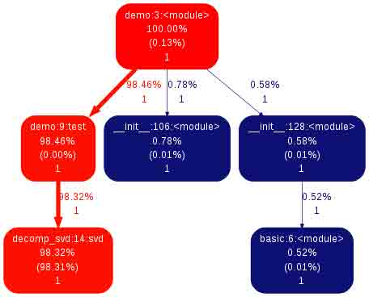

# 2.4 代码优化

**作者**：Gaël Varoquaux

**Donald Knuth**

"过早的优化是一切罪恶的根源"

本章处理用策略让 Python 代码跑得更快。

**先决条件**

*   line_profiler
*   gprof2dot
*   来自 dot 实用程序

**章节内容**

*   优化工作流
*   剖析 Python 代码
    *   Timeit
    *   Profiler
    *   Line-profiler
    *   Running `cProfile`
    *   Using `gprof2dot`
*   让代码更快
    *   算法优化
        *   SVD 的例子
*   写更快的数值代码
    *   其他的链接

## 2.4.1 优化工作流

1.  让它工作起来：用简单清晰的方式来写代码。
2.  让它可靠的工作：写自动的测试案例，以便真正确保你的算法是正确的，并且如果你破坏它，测试会捕捉到。
3.  通过剖析简单的使用案例找到瓶颈，并且加速这些瓶颈，寻找更好的算法或实现方式来优化代码。记住在剖析现实例子时简单和代码的执行速度需要进行一个权衡。要有效的运行，最好让剖析工作持续 10s 左右。

## 2.4.2 剖析 Python 代码

**无测量无优化！**

*   **测量**: 剖析, 计时
*   你可能会惊讶：最快的代码并不是通常你想的样子

### 2.4.2.1 Timeit

在 IPython 中，使用 timeit([`docs.python.org/library/timeit.html)来计时基本的操作：`](http://docs.python.org/library/timeit.html)来计时基本的操作：)

In [2]:

```py
import numpy as np

a = np.arange(1000)

%timeit a ** 2 
```

```py
The slowest run took 60.37 times longer than the fastest. This could mean that an intermediate result is being cached 
100000 loops, best of 3: 1.99 µs per loop 
```

In [3]:

```py
%timeit a ** 2.1 
```

```py
10000 loops, best of 3: 45.1 µs per loop 
```

In [4]:

```py
%timeit a * a 
```

```py
The slowest run took 12.79 times longer than the fastest. This could mean that an intermediate result is being cached 
100000 loops, best of 3: 1.86 µs per loop 
```

用这个信息来指导在不同策略间进行选择。

**笔记**：对于运行时间较长的单元，使用`%time`来代替`%timeit`; 它准确性较差但是更快。

### 2.4.2.2 Profiler

当你有个大型程序要剖析时比较有用，例如[下面这个程序](http://scipy-lectures.github.io/_downloads/demo.py)：

In [ ]:

```py
# For this example to run, you also need the 'ica.py' file

import numpy as np
from scipy import linalg

from ica import fastica

def test():
    data = np.random.random((5000, 100))
    u, s, v = linalg.svd(data)
    pca = np.dot(u[:, :10].T, data)
    results = fastica(pca.T, whiten=False)

if __name__ == '__main__':
    test() 
```

**笔记**：这种技术是两个非监督学习技术的组合，主成分分析（PCA）和独立成分分析（[ICA](http://scipy-lectures.github.io/advanced/optimizing/index.html#id16)）。PCA 是一种降维技术，即一种用更少的维度解释数据中观察到的变异的算法。ICA 是一种源信号分离技术，例如分离由多个传感器记录的多种信号。如果传感器比信号多，那么先进行 PCA 然后 ICA 会有帮助。更多的信息请见：[来自 scikits-learn 的 FastICA 例子](http://scikit-learn.org/stable/auto_examples/decomposition/plot_ica_blind_source_separation.html)。

要运行它，你也需要下载[ica 模块](http://scipy-lectures.github.io/_downloads/ica.py)。在 IPython 我们计时这个脚本：

In [8]:

```py
%run -t demo.py 
```

```py
IPython CPU timings (estimated):
  User   :       6.62 s.
  System :       0.17 s.
Wall time:       3.72 s. 
```

```py
/Users/cloga/Documents/scipy-lecture-notes_cn/ica.py:65: RuntimeWarning: invalid value encountered in sqrt
  W = (u * np.diag(1.0/np.sqrt(s)) * u.T) * W  # W = (W * W.T) ^{-1/2} * W
/Users/cloga/Documents/scipy-lecture-notes_cn/ica.py:90: RuntimeWarning: invalid value encountered in absolute
  lim = max(abs(abs(np.diag(np.dot(W1, W.T))) - 1)) 
```

并且剖析它：

```py
%run -p demo.py

         301 function calls in 3.746 seconds

   Ordered by: internal time

   ncalls  tottime  percall  cumtime  percall filename:lineno(function)
        1    3.714    3.714    3.715    3.715 decomp_svd.py:15(svd)
        1    0.019    0.019    3.745    3.745 demo.py:3(<module>)
        1    0.007    0.007    0.007    0.007 {method 'random_sample' of 'mtrand.RandomState' objects}
       14    0.003    0.000    0.003    0.000 {numpy.core._dotblas.dot}
        1    0.001    0.001    0.001    0.001 function_base.py:550(asarray_chkfinite)
        2    0.000    0.000    0.000    0.000 linalg.py:1116(eigh)
        1    0.000    0.000    3.745    3.745 {execfile}
        2    0.000    0.000    0.001    0.000 ica.py:58(_sym_decorrelation)
        2    0.000    0.000    0.000    0.000 {method 'reduce' of 'numpy.ufunc' objects}
        1    0.000    0.000    0.000    0.000 ica.py:195(gprime)
        1    0.000    0.000    0.001    0.001 ica.py:69(_ica_par)
        1    0.000    0.000    3.726    3.726 demo.py:9(test)
        1    0.000    0.000    0.001    0.001 ica.py:97(fastica)
        1    0.000    0.000    0.000    0.000 ica.py:192(g)
       23    0.000    0.000    0.000    0.000 defmatrix.py:290(__array_finalize__)
        4    0.000    0.000    0.000    0.000 twodim_base.py:242(diag)
        1    0.000    0.000    3.746    3.746 interactiveshell.py:2616(safe_execfile)
       10    0.000    0.000    0.000    0.000 {numpy.core.multiarray.array}
        1    0.000    0.000    3.745    3.745 py3compat.py:279(execfile)
        1    0.000    0.000    0.000    0.000 {method 'normal' of 'mtrand.RandomState' objects}
       50    0.000    0.000    0.000    0.000 {isinstance}
       10    0.000    0.000    0.000    0.000 defmatrix.py:66(asmatrix)
       10    0.000    0.000    0.000    0.000 defmatrix.py:244(__new__)
        9    0.000    0.000    0.000    0.000 numeric.py:394(asarray)
        1    0.000    0.000    0.000    0.000 _methods.py:53(_mean)
        1    0.000    0.000    0.000    0.000 {posix.getcwdu}
        4    0.000    0.000    0.000    0.000 {method 'astype' of 'numpy.ndarray' objects}
        6    0.000    0.000    0.000    0.000 defmatrix.py:338(__mul__)
        2    0.000    0.000    0.000    0.000 linalg.py:139(_commonType)
        4    0.000    0.000    0.000    0.000 {method 'view' of 'numpy.ndarray' objects}
        1    0.000    0.000    0.000    0.000 posixpath.py:329(normpath)
        5    0.000    0.000    0.000    0.000 {abs}
        1    0.000    0.000    0.000    0.000 {open}
        1    0.000    0.000    0.000    0.000 blas.py:172(find_best_blas_type)
        1    0.000    0.000    0.000    0.000 blas.py:216(_get_funcs)
        1    0.000    0.000    0.000    0.000 syspathcontext.py:64(__exit__)
        3    0.000    0.000    0.000    0.000 {max}
        6    0.000    0.000    0.000    0.000 {method 'transpose' of 'numpy.ndarray' objects}
        1    0.000    0.000    0.000    0.000 posixpath.py:120(dirname)
        2    0.000    0.000    0.000    0.000 linalg.py:101(get_linalg_error_extobj)
        2    0.000    0.000    0.000    0.000 linalg.py:106(_makearray)
        3    0.000    0.000    0.000    0.000 {numpy.core.multiarray.zeros}
        6    0.000    0.000    0.000    0.000 defmatrix.py:928(getT)
        1    0.000    0.000    0.000    0.000 syspathcontext.py:57(__enter__)
        2    0.000    0.000    0.000    0.000 linalg.py:209(_assertNdSquareness)
        7    0.000    0.000    0.000    0.000 {issubclass}
        4    0.000    0.000    0.000    0.000 {getattr}
        1    0.000    0.000    0.000    0.000 posixpath.py:358(abspath)
        5    0.000    0.000    0.000    0.000 {method 'startswith' of 'unicode' objects}
        2    0.000    0.000    0.000    0.000 linalg.py:198(_assertRankAtLeast2)
        2    0.000    0.000    0.000    0.000 {method 'encode' of 'unicode' objects}
       10    0.000    0.000    0.000    0.000 {method 'get' of 'dict' objects}
        1    0.000    0.000    0.000    0.000 _methods.py:43(_count_reduce_items)
        1    0.000    0.000    0.000    0.000 {method 'all' of 'numpy.ndarray' objects}
        4    0.000    0.000    0.000    0.000 linalg.py:124(_realType)
        1    0.000    0.000    0.000    0.000 syspathcontext.py:54(__init__)
        1    0.000    0.000    0.000    0.000 posixpath.py:61(join)
        1    0.000    0.000    3.746    3.746 <string>:1(<module>)
        1    0.000    0.000    0.000    0.000 _methods.py:40(_all)
        4    0.000    0.000    0.000    0.000 linalg.py:111(isComplexType)
        2    0.000    0.000    0.000    0.000 {method '__array_prepare__' of 'numpy.ndarray' objects}
        4    0.000    0.000    0.000    0.000 {min}
        1    0.000    0.000    0.000    0.000 py3compat.py:19(encode)
        1    0.000    0.000    0.000    0.000 defmatrix.py:872(getA)
        2    0.000    0.000    0.000    0.000 numerictypes.py:949(_can_coerce_all)
        6    0.000    0.000    0.000    0.000 {method 'append' of 'list' objects}
        1    0.000    0.000    0.000    0.000 numerictypes.py:970(find_common_type)
        1    0.000    0.000    0.000    0.000 {method 'mean' of 'numpy.ndarray' objects}
       11    0.000    0.000    0.000    0.000 {len}
        1    0.000    0.000    0.000    0.000 numeric.py:464(asanyarray)
        1    0.000    0.000    0.000    0.000 {method '__array__' of 'numpy.ndarray' objects}
        1    0.000    0.000    0.000    0.000 {method 'rfind' of 'unicode' objects}
        2    0.000    0.000    0.000    0.000 {method 'upper' of 'str' objects}
        1    0.000    0.000    0.000    0.000 posixpath.py:251(expanduser)
        3    0.000    0.000    0.000    0.000 {method 'setdefault' of 'dict' objects}
        1    0.000    0.000    0.000    0.000 {method 'diagonal' of 'numpy.ndarray' objects}
        1    0.000    0.000    0.000    0.000 lapack.py:239(get_lapack_funcs)
        1    0.000    0.000    0.000    0.000 {method 'rstrip' of 'unicode' objects}
        1    0.000    0.000    0.000    0.000 py3compat.py:29(cast_bytes)
        1    0.000    0.000    0.000    0.000 posixpath.py:52(isabs)
        1    0.000    0.000    0.000    0.000 {method 'split' of 'unicode' objects}
        1    0.000    0.000    0.000    0.000 {method 'endswith' of 'unicode' objects}
        1    0.000    0.000    0.000    0.000 {sys.getdefaultencoding}
        1    0.000    0.000    0.000    0.000 {method 'insert' of 'list' objects}
        1    0.000    0.000    0.000    0.000 {method 'remove' of 'list' objects}
        1    0.000    0.000    0.000    0.000 {method 'join' of 'unicode' objects}
        1    0.000    0.000    0.000    0.000 {method 'index' of 'list' objects}
        1    0.000    0.000    0.000    0.000 misc.py:126(_datacopied)
        1    0.000    0.000    0.000    0.000 {sys.getfilesystemencoding}
        1    0.000    0.000    0.000    0.000 {method 'disable' of '_lsprof.Profiler' objects} 
```

很明显`svd`（**decomp.py**中）占用了最多的时间，换句话说，是瓶颈。我们要找到方法让这个步骤跑的更快，或者避免这个步骤（算法优化）。在其他部分花费时间是没用的。

### 2.4.2.3 Line-profiler

profiler 很棒：它告诉我们哪个函数花费了最多的时间，但是，不是它在哪里被调用。

关于这一点，我们使用[line_profiler](http://packages.python.org/line_profiler/)：在源文件中，[[email protected]](cdn-cgi/l/email-protection)（不需要导入它）修饰了一些想要用检查的函数：

In [ ]:

```py
@profile
def test():
    data = np.random.random((5000, 100))
    u, s, v = linalg.svd(data)
    pca = np.dot(u[: , :10], data)
    results = fastica(pca.T, whiten=False) 
```

接着我们用[kernprof.py](http://packages.python.org/line_profiler/kernprof.py)来运行这个脚本，开启`-l, --line-by-line`和`-v, --view`来使用逐行 profiler，并且查看结果并保存他们：

```py
kernprof.py -l -v demo.py

Wrote profile results to demo.py.lprof
Timer unit: 1e-06 s

File: demo.py
Function: test at line 5
Total time: 14.2793 s

Line #      Hits         Time  Per Hit   % Time  Line Contents
==============================================================
    5                                           @profile
    6                                           def test():
    7         1        19015  19015.0      0.1      data = np.random.random((5000, 100))
    8         1     14242163 14242163.0   99.7      u, s, v = linalg.svd(data)
    9         1        10282  10282.0      0.1      pca = np.dot(u[:10, :], data)
   10         1         7799   7799.0      0.1      results = fastica(pca.T, whiten=False) 
```

SVD 占用了几乎所有时间，我们需要优化这一行。

### 2.4.2.4 运行`cProfile`

在上面的 IPython 例子中，Ipython 只是调用了内置的[Python 剖析器](http://docs.python.org/2/library/profile.html)`cProfile`和`profile`。如果你想要用一个可视化工具来处理剖析器的结果，这会有帮助。

```py
python -m cProfile -o demo.prof demo.py 
```

使用`-o`开关将输入剖析器结果到文件`demo.prof`。

### 2.4.2.5 使用`gprof2dot`

如果你想要更加视觉化的剖析器输入结果，你可以使用[gprof2dot](http://code.google.com/p/jrfonseca/wiki/Gprof2Dot)工具：

In [ ]:

```py
gprof2dot -f pstats demo.prof | dot -Tpng -o demo-prof.png 
```

这会生成下面的图片：



这种方法打印了一个类似前一种方法的图片。

## 2.4.3 让代码更快

一旦我们识别出瓶颈，我们需要让相关的代码跑得更快。

### 2.4.3.1 算法优化

第一件要看的事情是算法优化：有没有计算量更小的方法或者更好的方法？

从更高的视角来看这个问题，对算法背后的数学有一个很好的理解会有帮助。但是，寻找到像**将计算或内存分配移到循环外**这样的简单改变，来带来巨大的收益，通常很困难。

#### 2.4.3.1.1 SVD 的例子

在上面的两个例子中，SVD - [奇异值分解](http://en.wikipedia.org/wiki/Singular_value_decomposition) - 花费了最多的时间。确实，这个算法的计算成本大概是输入矩阵大小的$n³$。

但是，在这些例子中，我们并不是使用 SVD 的所有输出，而只是它第一个返回参数的前几行。如果我们使用 scipy 的`svd`实现，我们可以请求一个这个 SVD 的不完整版本。注意 scipy 中的线性代数实现比在 numpy 中更丰富，应该被优选选用。

In [20]:

```py
%timeit np.linalg.svd(data) 
```

```py
1 loops, best of 3: 4.12 s per loop 
```

In [21]:

```py
from scipy import linalg
%timeit linalg.svd(data) 
```

```py
1 loops, best of 3: 3.65 s per loop 
```

In [22]:

```py
%timeit linalg.svd(data, full_matrices=False) 
```

```py
10 loops, best of 3: 70.5 ms per loop 
```

In [23]:

```py
%timeit np.linalg.svd(data, full_matrices=False) 
```

```py
10 loops, best of 3: 70.3 ms per loop 
```

接下来我们可以用这个发现来[优化前面的代码](http://scipy-lectures.github.io/_downloads/demo_opt.py)：

In [24]:

```py
import demo 
```

In [27]:

```py
%timeit demo.test() 
```

```py
1 loops, best of 3: 3.65 s per loop 
```

In [28]:

```py
import demo_opt 
```

In [29]:

```py
%timeit demo_opt.test() 
```

```py
10 loops, best of 3: 81.9 ms per loop 
```

真实的非完整版 SVD，即只计算前十个特征向量，可以用 arpack 来计算，可以在`scipy.sparse.linalg.eigsh`找到。

**计算线性代数**

对于特定的算法，许多瓶颈会是线性代数计算。在这种情况下，使用正确的方法来解决正确的问题是关键。例如一个对称矩阵中的特征向量问题比通用矩阵中更好解决。同样，更普遍的是，你可以避免矩阵逆转，使用一些成本更低（在数字上更可靠）的操作。

了解你的计算线性代数。当有疑问时，查找`scipy.linalg`，并且用`%timeit`来试一下替代方案。

## 2.4.4 写更快的数值代码

关于 numpy 的高级使用的讨论可以在[高级 numpy](http://scipy-lectures.github.io/advanced/advanced_numpy/index.html#advanced-numpy)那章，或者由 van der Walt 等所写的文章[NumPy 数组: 一种高效数值计算结构](http://hal.inria.fr/inria-00564007/en)。这里只是一些经常会遇到的让代码更快的小技巧。

*   循环向量化

    找到一些技巧来用 numpy 数组避免循环。对于这一点，掩蔽和索引通常很有用。

*   广播

    在数组合并前，在尽可能小的数组上使用广播。

*   原地操作

In [30]:

```py
a = np.zeros(1e7)

%timeit global a ; a = 0*a 
```

```py
10 loops, best of 3: 33.5 ms per loop 
```

```py
/Library/Frameworks/Python.framework/Versions/2.7/lib/python2.7/site-packages/ipykernel/__main__.py:1: DeprecationWarning: using a non-integer number instead of an integer will result in an error in the future
  if __name__ == '__main__': 
```

In [31]:

```py
%timeit global a ; a *= 0 
```

```py
100 loops, best of 3: 8.98 ms per loop 
```

**注意**: 我们需要在 timeit 中`global a`，以便正常工作，因为，向 a 赋值，会被认为是一个本地变量。

*   对内存好一点：使用视图而不是副本

复制一个大数组和在上面进行简单的数值运算一样代价昂贵：

In [32]:

```py
a = np.zeros(1e7) 
```

```py
/Library/Frameworks/Python.framework/Versions/2.7/lib/python2.7/site-packages/ipykernel/__main__.py:1: DeprecationWarning: using a non-integer number instead of an integer will result in an error in the future
  if __name__ == '__main__': 
```

In [33]:

```py
%timeit a.copy() 
```

```py
10 loops, best of 3: 28.2 ms per loop 
```

In [34]:

```py
%timeit a + 1 
```

```py
10 loops, best of 3: 33.4 ms per loop 
```

*   注意缓存作用

    分组后内存访问代价很低：用连续的方式访问一个大数组比随机访问快很多。这意味着在其他方式中小步幅会更快（见[CPU 缓存作用](http://scipy-lectures.github.io/advanced/advanced_numpy/index.html#cache-effects)）:

In [35]:

```py
c = np.zeros((1e4, 1e4), order='C') 
```

```py
/Library/Frameworks/Python.framework/Versions/2.7/lib/python2.7/site-packages/ipykernel/__main__.py:1: DeprecationWarning: using a non-integer number instead of an integer will result in an error in the future
  if __name__ == '__main__': 
```

In [36]:

```py
%timeit c.sum(axis=0) 
```

```py
The slowest run took 5.66 times longer than the fastest. This could mean that an intermediate result is being cached 
1 loops, best of 3: 80.9 ms per loop 
```

In [37]:

```py
%timeit c.sum(axis=1) 
```

```py
10 loops, best of 3: 79.7 ms per loop 
```

In [38]:

```py
c.strides 
```

Out[38]:

```py
(80000, 8) 
```

这就是为什么 Fortran 顺序或者 C 顺序会在操作上有很大的不同：

In [39]:

```py
a = np.random.rand(20, 2**18) 
```

In [40]:

```py
b = np.random.rand(20, 2**18) 
```

In [41]:

```py
%timeit np.dot(b, a.T) 
```

```py
10 loops, best of 3: 23.8 ms per loop 
```

In [42]:

```py
c = np.ascontiguousarray(a.T) 
```

In [43]:

```py
%timeit np.dot(b, c) 
```

```py
10 loops, best of 3: 22.2 ms per loop 
```

注意，通过复制数据来绕过这个效果是不值得的：

In [44]:

```py
%timeit c = np.ascontiguousarray(a.T) 
```

```py
10 loops, best of 3: 42.2 ms per loop 
```

使用[numexpr](http://code.google.com/p/numexpr/)可以帮助自动优化代码的这种效果。

*   使用编译的代码

    一旦你确定所有的高级优化都试过了，那么最后一招就是转移热点，即将最花费时间的几行或函数编译代码。要编译代码，优先选项是用使用[Cython](http://www.cython.org/)：它可以简单的将 Python 代码转化为编译代码，并且很好的使用 numpy 支持来以 numpy 数据产出高效代码，例如通过展开循环。

**警告**：对于以上的技巧，剖析并计时你的选择。不要基于理论思考来优化。

### 2.4.4.1 其他的链接

*   如果你需要剖析内存使用，你要应该试试[memory_profiler](http://pypi.python.org/pypi/memory_profiler)
*   如果你需要剖析 C 扩展程序，你应该用[yep](http://pypi.python.org/pypi/yep)从 Python 中试着使用一下[gperftools](http://code.google.com/p/gperftools/?redir=1)。
*   如果你想要持续跟踪代码的效率，比如随着你不断向代码库提交，你应该试一下：[vbench](https://github.com/pydata/vbench)
*   如果你需要一些交互的可视化为什么不试一下[RunSnakeRun](http://www.vrplumber.com/programming/runsnakerun/)