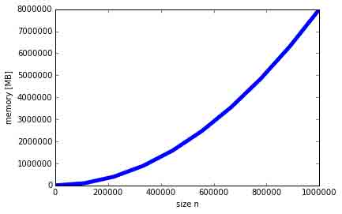
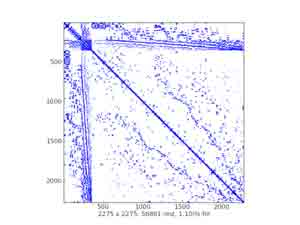
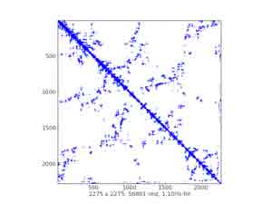
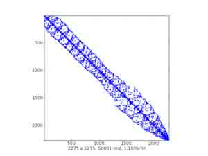

# 2.5 SciPy 中稀疏矩阵

# 2.5 SciPy 中稀疏矩阵

In [3]:

```py
%matplotlib inline
import numpy as np 
```

## 2.5.1 介绍

(密集) 矩阵是:

*   数据对象
*   存储二维值数组的数据结构

重要特征:

*   一次分配所有项目的内存
    *   通常是一个连续组块，想一想 Numpy 数组
*   *快速*访问个项目(*)

### 2.5.1.1 为什么有稀疏矩阵？

*   内存，增长是 n**2
*   小例子（双精度矩阵）:

In [5]:

```py
import numpy as np
import matplotlib.pyplot as plt
x = np.linspace(0, 1e6, 10)
plt.plot(x, 8.0 * (x**2) / 1e6, lw=5)   
plt.xlabel('size n')
plt.ylabel('memory [MB]') 
```

Out[5]:

```py
<matplotlib.text.Text at 0x105b08dd0> 
```



### 2.5.1.2 稀疏矩阵 vs. 稀疏矩阵存储方案

*   稀疏矩阵是一个矩阵，巨大多数是空的
*   存储所有的 0 是浪费 -> 只存储非 0 项目
*   想一下**压缩**
*   有利: 巨大的内存节省
*   不利: 依赖实际的存储方案, (*) 通常并不能满足

### 2.5.1.3 典型应用

*   偏微分方程（PDES）的解
    *   有限元素法
    *   机械工程、电子、物理...
*   图论
    *   （i，j）不是 0 表示节点 i 与节点 j 是联接的
*   ...

### 2.5.1.4 先决条件

最新版本的

*   `numpy`
*   `scipy`
*   `matplotlib` (可选)
*   `ipython` (那些增强很方便)

### 2.5.1.5 稀疏结构可视化

*   matplotlib 中的`spy()`
*   样例绘图:

  

## 2.5.2 存储机制

*   scipy.sparse 中有七类稀疏矩阵:
    1.  csc_matrix: 压缩列格式
    2.  csr_matrix: 压缩行格式
    3.  bsr_matrix: 块压缩行格式
    4.  lil_matrix: 列表的列表格式
    5.  dok_matrix: 值的字典格式
    6.  coo_matrix: 座标格式 (即 IJV, 三维格式)
    7.  dia_matrix: 对角线格式
*   每一个类型适用于一些任务
*   许多都利用了由 Nathan Bell 提供的稀疏工具 C ++ 模块
*   假设导入了下列模块:

In [1]:

```py
import numpy as np
import scipy.sparse as sparse
import matplotlib.pyplot as plt 
```

*   给 Numpy 用户的**warning**:
    *   使用'*'的乘是*矩阵相乘* (点积)
    *   并不是 Numpy 的一部分!
        *   向 Numpy 函数传递一个稀疏矩阵希望一个 ndarray/矩阵是没用的

### 2.5.2.1 通用方法

*   所有 scipy.sparse 类都是 spmatrix 的子类

    *   算术操作的默认实现
        *   通常转化为 CSR
        *   为了效率而子类覆盖
    *   形状、数据类型设置/获取
    *   非 0 索引
    *   格式转化、与 Numpy 交互(toarray(), todense())
    *   ...
*   属性:

    *   mtx.A - 与 mtx.toarray()相同
    *   mtx.T - 转置 (与 mtx.transpose()相同)
    *   mtx.H - Hermitian (列举) 转置
    *   mtx.real - 复矩阵的真部
    *   mtx.imag - 复矩阵的虚部
    *   mtx.size - 非零数 (与 self.getnnz()相同)
    *   mtx.shape - 行数和列数 (元组)
*   数据通常储存在 Numpy 数组中

### 2.5.2.2 稀疏矩阵类

#### 2.5.2.2.1 对角线格式 (DIA))

*   非常简单的格式
*   形状 (n_diag, length) 的密集 Numpy 数组的对角线
    *   固定长度 -> 当离主对角线比较远时会浪费空间
    *   _data_matrix 的子类 (带数据属性的稀疏矩阵类)
*   每个对角线的偏移
    *   0 是主对角线
    *   负偏移 = 下面
    *   正偏移 = 上面
*   快速矩阵 * 向量 (sparsetools)
*   快速方便的关于项目的操作
    *   直接操作数据数组 (快速的 NumPy 机件)
*   构建器接受 :
    *   密集矩阵 (数组)
    *   稀疏矩阵
    *   形状元组 (创建空矩阵)
    *   (数据, 偏移) 元组
*   没有切片、没有单个项目访问
*   用法 :
    *   非常专业
    *   通过有限微分解偏微分方程
    *   有一个迭代求解器 ##### 2.5.2.2.1.1 示例
*   创建一些 DIA 矩阵 :

In [3]:

```py
data = np.array([[1, 2, 3, 4]]).repeat(3, axis=0)
data 
```

Out[3]:

```py
array([[1, 2, 3, 4],
       [1, 2, 3, 4],
       [1, 2, 3, 4]]) 
```

In [6]:

```py
offsets = np.array([0, -1, 2])
mtx = sparse.dia_matrix((data, offsets), shape=(4, 4))
mtx 
```

Out[6]:

```py
<4x4 sparse matrix of type '<type 'numpy.int64'>'
    with 9 stored elements (3 diagonals) in DIAgonal format> 
```

In [7]:

```py
mtx.todense() 
```

Out[7]:

```py
matrix([[1, 0, 3, 0],
        [1, 2, 0, 4],
        [0, 2, 3, 0],
        [0, 0, 3, 4]]) 
```

In [9]:

```py
data = np.arange(12).reshape((3, 4)) + 1
data 
```

Out[9]:

```py
array([[ 1,  2,  3,  4],
       [ 5,  6,  7,  8],
       [ 9, 10, 11, 12]]) 
```

In [10]:

```py
mtx = sparse.dia_matrix((data, offsets), shape=(4, 4))
mtx.data 
```

Out[10]:

```py
array([[ 1,  2,  3,  4],
       [ 5,  6,  7,  8],
       [ 9, 10, 11, 12]]) 
```

In [11]:

```py
mtx.offsets 
```

Out[11]:

```py
array([ 0, -1,  2], dtype=int32) 
```

In [12]:

```py
print mtx 
```

```py
 (0, 0)    1
  (1, 1)    2
  (2, 2)    3
  (3, 3)    4
  (1, 0)    5
  (2, 1)    6
  (3, 2)    7
  (0, 2)    11
  (1, 3)    12 
```

In [13]:

```py
mtx.todense() 
```

Out[13]:

```py
matrix([[ 1,  0, 11,  0],
        [ 5,  2,  0, 12],
        [ 0,  6,  3,  0],
        [ 0,  0,  7,  4]]) 
```

*   机制的解释 :

偏移: 行

```py
 2:  9
 1:  --10------
 0:  1  . 11  .
-1:  5  2  . 12
-2:  .  6  3  .
-3:  .  .  7  4
     ---------8 
```

*   矩阵-向量相乘

In [15]:

```py
vec = np.ones((4, ))
vec 
```

Out[15]:

```py
array([ 1.,  1.,  1.,  1.]) 
```

In [16]:

```py
mtx * vec 
```

Out[16]:

```py
array([ 12.,  19.,   9.,  11.]) 
```

In [17]:

```py
mtx.toarray() * vec 
```

Out[17]:

```py
array([[  1.,   0.,  11.,   0.],
       [  5.,   2.,   0.,  12.],
       [  0.,   6.,   3.,   0.],
       [  0.,   0.,   7.,   4.]]) 
```

#### 2.5.2.2.2 列表的列表格式 (LIL))

*   基于行的联接列表
    *   每一行是一个 Python 列表（排序的）非零元素的列索引
    *   行存储在 Numpy 数组中 (dtype=np.object)
    *   非零值也近似存储
*   高效增量构建稀疏矩阵
*   构建器接受 :
    *   密集矩阵 (数组)
    *   稀疏矩阵
    *   形状元组 (创建一个空矩阵)
*   灵活切片、高效改变稀疏结构
*   由于是基于行的，算术和行切片慢
*   用途 :
    *   当稀疏模式并不是已知的逻辑或改变
    *   例子：从一个文本文件读取稀疏矩阵 ##### 2.5.2.2.2.1 示例
*   创建一个空的 LIL 矩阵 :

In [2]:

```py
mtx = sparse.lil_matrix((4, 5)) 
```

*   准备随机数据:

In [4]:

```py
from numpy.random import rand
data = np.round(rand(2, 3))
data 
```

Out[4]:

```py
array([[ 0.,  0.,  0.],
       [ 1.,  0.,  0.]]) 
```

*   使用象征所以分配数据:

In [6]:

```py
mtx[:2, [1, 2, 3]] = data
mtx 
```

Out[6]:

```py
<4x5 sparse matrix of type '<type 'numpy.float64'>'
    with 3 stored elements in LInked List format> 
```

In [7]:

```py
print mtx 
```

```py
 (0, 1)    1.0
  (0, 3)    1.0
  (1, 2)    1.0 
```

In [8]:

```py
mtx.todense() 
```

Out[8]:

```py
matrix([[ 0.,  1.,  0.,  1.,  0.],
        [ 0.,  0.,  1.,  0.,  0.],
        [ 0.,  0.,  0.,  0.,  0.],
        [ 0.,  0.,  0.,  0.,  0.]]) 
```

In [9]:

```py
mtx.toarray() 
```

Out[9]:

```py
array([[ 0.,  1.,  0.,  1.,  0.],
       [ 0.,  0.,  1.,  0.,  0.],
       [ 0.,  0.,  0.,  0.,  0.],
       [ 0.,  0.,  0.,  0.,  0.]]) 
```

更多的切片和索引:

In [10]:

```py
mtx = sparse.lil_matrix([[0, 1, 2, 0], [3, 0, 1, 0], [1, 0, 0, 1]])
mtx.todense() 
```

Out[10]:

```py
matrix([[0, 1, 2, 0],
        [3, 0, 1, 0],
        [1, 0, 0, 1]]) 
```

In [11]:

```py
print mtx 
```

```py
 (0, 1)    1
  (0, 2)    2
  (1, 0)    3
  (1, 2)    1
  (2, 0)    1
  (2, 3)    1 
```

In [12]:

```py
mtx[:2, :] 
```

Out[12]:

```py
<2x4 sparse matrix of type '<type 'numpy.int64'>'
    with 4 stored elements in LInked List format> 
```

In [13]:

```py
mtx[:2, :].todense() 
```

Out[13]:

```py
matrix([[0, 1, 2, 0],
        [3, 0, 1, 0]]) 
```

In [14]:

```py
mtx[1:2, [0,2]].todense() 
```

Out[14]:

```py
matrix([[3, 1]]) 
```

In [15]:

```py
mtx.todense() 
```

Out[15]:

```py
matrix([[0, 1, 2, 0],
        [3, 0, 1, 0],
        [1, 0, 0, 1]]) 
```

#### 2.5.2.2.3 值的字典格式 (DOK))

*   Python 字典的子类
    *   键是 (行, 列) 索引元组 (不允许重复的条目)
    *   值是对应的非零值
*   高效增量构建稀疏矩阵
*   构建器支持:
    *   密集矩阵 (数组)
    *   稀疏矩阵
    *   形状元组 (创建空矩阵)
*   高效 O(1) 对单个元素的访问
*   灵活索引，改变稀疏结构是高效
*   一旦创建完成后可以被高效转换为 coo_matrix
*   算术很慢 (循环用`dict.iteritems()`)
*   用法:
    *   当稀疏模式是未知的假设或改变时

##### 2.5.2.2.3.1 示例

*   逐个元素创建一个 DOK 矩阵:

In [16]:

```py
mtx = sparse.dok_matrix((5, 5), dtype=np.float64)
mtx 
```

Out[16]:

```py
<5x5 sparse matrix of type '<type 'numpy.float64'>'
    with 0 stored elements in Dictionary Of Keys format> 
```

In [17]:

```py
for ir in range(5):
    for ic in range(5):
        mtx[ir, ic] = 1.0 * (ir != ic)
mtx 
```

Out[17]:

```py
<5x5 sparse matrix of type '<type 'numpy.float64'>'
    with 20 stored elements in Dictionary Of Keys format> 
```

In [18]:

```py
mtx.todense() 
```

Out[18]:

```py
matrix([[ 0.,  1.,  1.,  1.,  1.],
        [ 1.,  0.,  1.,  1.,  1.],
        [ 1.,  1.,  0.,  1.,  1.],
        [ 1.,  1.,  1.,  0.,  1.],
        [ 1.,  1.,  1.,  1.,  0.]]) 
```

*   切片与索引:

In [19]:

```py
mtx[1, 1] 
```

Out[19]:

```py
0.0 
```

In [20]:

```py
mtx[1, 1:3] 
```

Out[20]:

```py
<1x2 sparse matrix of type '<type 'numpy.float64'>'
    with 1 stored elements in Dictionary Of Keys format> 
```

In [21]:

```py
mtx[1, 1:3].todense() 
```

Out[21]:

```py
matrix([[ 0.,  1.]]) 
```

In [22]:

```py
mtx[[2,1], 1:3].todense() 
```

Out[22]:

```py
matrix([[ 1.,  0.],
        [ 0.,  1.]]) 
```

#### 2.5.2.2.4 座标格式 (COO))

*   也被称为 ‘ijv’ 或 ‘triplet’ 格式
    *   三个 NumPy 数组: row, col, data
    *   `data[i]`是在 (row[i], col[i]) 位置的值
    *   允许重复值
*   `\_data\_matrix`的子类 (带有`data`属性的稀疏矩阵类)
*   构建稀疏矩阵的高速模式
*   构建器接受:
    *   密集矩阵 (数组)
    *   稀疏矩阵
    *   形状元组 (创建空数组)
    *   `(data, ij)`元组
*   与 CSR/CSC 格式非常快的互相转换
*   快速的矩阵 * 向量 (sparsetools)
*   快速而简便的逐项操作
    *   直接操作数据数组 (快速 NumPy 机制)
*   没有切片，没有算术 (直接)
*   使用:
    *   在各种稀疏格式间的灵活转换
    *   当转化到其他形式 (通常是 CSR 或 CSC), 重复的条目被加总到一起
        *   有限元素矩阵的快速高效创建

##### 2.5.2.2.4.1 示例

*   创建空的 COO 矩阵:

In [23]:

```py
mtx = sparse.coo_matrix((3, 4), dtype=np.int8)
mtx.todense() 
```

Out[23]:

```py
matrix([[0, 0, 0, 0],
        [0, 0, 0, 0],
        [0, 0, 0, 0]], dtype=int8) 
```

*   用 (data, ij) 元组创建:

In [24]:

```py
row = np.array([0, 3, 1, 0])
col = np.array([0, 3, 1, 2])
data = np.array([4, 5, 7, 9])
mtx = sparse.coo_matrix((data, (row, col)), shape=(4, 4))
mtx 
```

Out[24]:

```py
<4x4 sparse matrix of type '<type 'numpy.int64'>'
    with 4 stored elements in COOrdinate format> 
```

In [25]:

```py
mtx.todense() 
```

Out[25]:

```py
matrix([[4, 0, 9, 0],
        [0, 7, 0, 0],
        [0, 0, 0, 0],
        [0, 0, 0, 5]]) 
```

#### 2.5.2.2.5 压缩稀疏行格式 (CSR))

*   面向行
    *   三个 Numpy 数组: `indices`, `indptr`, `data`
        *   `indices`是列索引的数组
        *   `data`是对应的非零值数组
        *   `indptr`指向行开始的所以和数据
        *   长度是`n_row + 1`, 最后一个项目 = 值数量 = `indices`和`data`的长度
        *   i-th 行的非零值是列索引为`indices[indptr[i]:indptr[i+1]]`的`data[indptr[i]:indptr[i+1]]`
        *   项目 (i, j) 可以通过`data[indptr[i]+k]`, k 是 j 在`indices[indptr[i]:indptr[i+1]]`的位置来访问
    *   `_cs_matrix` (常规 CSR/CSC 功能) 的子类
    *   `_data_matrix` (带有`data`属性的稀疏矩阵类) 的子类
*   快速矩阵向量相乘和其他算术 (sparsetools)
*   构建器接受:
    *   密集矩阵 (数组)
    *   稀疏矩阵
    *   形状元组 (创建空矩阵)
    *   `(data, ij)` 元组
    *   `(data, indices, indptr)` 元组
*   高效行切片，面向行的操作
*   较慢的列切片，改变稀疏结构代价昂贵
*   用途:
    *   实际计算 (大多数线性求解器都支持这个格式)

##### 2.5.2.2.5.1 示例

*   创建空的 CSR 矩阵:

In [26]:

```py
mtx = sparse.csr_matrix((3, 4), dtype=np.int8)
mtx.todense() 
```

Out[26]:

```py
matrix([[0, 0, 0, 0],
        [0, 0, 0, 0],
        [0, 0, 0, 0]], dtype=int8) 
```

*   用`(data, ij)`元组创建:

In [27]:

```py
row = np.array([0, 0, 1, 2, 2, 2])
col = np.array([0, 2, 2, 0, 1, 2])
data = np.array([1, 2, 3, 4, 5, 6])
mtx = sparse.csr_matrix((data, (row, col)), shape=(3, 3))
mtx 
```

Out[27]:

```py
<3x3 sparse matrix of type '<type 'numpy.int64'>'
    with 6 stored elements in Compressed Sparse Row format> 
```

In [28]:

```py
mtx.todense() 
```

Out[28]:

```py
matrix([[1, 0, 2],
        [0, 0, 3],
        [4, 5, 6]]) 
```

In [29]:

```py
mtx.data 
```

Out[29]:

```py
array([1, 2, 3, 4, 5, 6]) 
```

In [30]:

```py
mtx.indices 
```

Out[30]:

```py
array([0, 2, 2, 0, 1, 2], dtype=int32) 
```

In [31]:

```py
mtx.indptr 
```

Out[31]:

```py
array([0, 2, 3, 6], dtype=int32) 
```

用`(data, indices, indptr)`元组创建:

In [32]:

```py
data = np.array([1, 2, 3, 4, 5, 6])
indices = np.array([0, 2, 2, 0, 1, 2])
indptr = np.array([0, 2, 3, 6])
mtx = sparse.csr_matrix((data, indices, indptr), shape=(3, 3))
mtx.todense() 
```

Out[32]:

```py
matrix([[1, 0, 2],
        [0, 0, 3],
        [4, 5, 6]]) 
```

#### 2.5.2.2.6 压缩稀疏列格式 (CSC))

*   面向列
    *   三个 Numpy 数组: `indices`、`indptr`、`data`
    *   `indices`是行索引的数组
    *   `data`是对应的非零值
    *   `indptr`指向`indices`和`data`开始的列
    *   长度是`n_col + 1`, 最后一个条目 = 值数量 = `indices`和`data`的长度
    *   第 i 列的非零值是行索引为`indices[indptr[i]:indptr[i+1]]`的`data[indptr[i]:indptr[i+1]]`
    *   项目 (i, j) 可以作为`data[indptr[j]+k]`访问, k 是 i 在`indices[indptr[j]:indptr[j+1]]`的位置
    *   `_cs_matrix`的子类 (通用的 CSR/CSC 功能性)
        *   `_data_matrix`的子类 (带有`data`属性的稀疏矩阵类)
*   快速的矩阵和向量相乘及其他数学 (sparsetools)
*   构建器接受：
    *   密集矩阵 (数组)
    *   稀疏矩阵
    *   形状元组 (创建空矩阵)
    *   `(data, ij)`元组
    *   `(data, indices, indptr)`元组
*   高效列切片、面向列的操作
*   较慢的行切片、改变稀疏结构代价昂贵
*   用途:
    *   实际计算 (巨大多数线性求解器支持这个格式)

##### 2.5.2.2.6.1 示例

*   创建空 CSC 矩阵:

In [33]:

```py
mtx = sparse.csc_matrix((3, 4), dtype=np.int8)
mtx.todense() 
```

Out[33]:

```py
matrix([[0, 0, 0, 0],
        [0, 0, 0, 0],
        [0, 0, 0, 0]], dtype=int8) 
```

*   用`(data, ij)`元组创建:

In [34]:

```py
row = np.array([0, 0, 1, 2, 2, 2])
col = np.array([0, 2, 2, 0, 1, 2])
data = np.array([1, 2, 3, 4, 5, 6])
mtx = sparse.csc_matrix((data, (row, col)), shape=(3, 3))
mtx 
```

Out[34]:

```py
<3x3 sparse matrix of type '<type 'numpy.int64'>'
    with 6 stored elements in Compressed Sparse Column format> 
```

In [35]:

```py
mtx.todense() 
```

Out[35]:

```py
matrix([[1, 0, 2],
        [0, 0, 3],
        [4, 5, 6]]) 
```

In [36]:

```py
mtx.data 
```

Out[36]:

```py
array([1, 4, 5, 2, 3, 6]) 
```

In [37]:

```py
mtx.indices 
```

Out[37]:

```py
array([0, 2, 2, 0, 1, 2], dtype=int32) 
```

In [38]:

```py
mtx.indptr 
```

Out[38]:

```py
array([0, 2, 3, 6], dtype=int32) 
```

*   用`(data, indices, indptr)`元组创建:

In [39]:

```py
data = np.array([1, 4, 5, 2, 3, 6])
indices = np.array([0, 2, 2, 0, 1, 2])
indptr = np.array([0, 2, 3, 6])
mtx = sparse.csc_matrix((data, indices, indptr), shape=(3, 3))
mtx.todense() 
```

Out[39]:

```py
matrix([[1, 0, 2],
        [0, 0, 3],
        [4, 5, 6]]) 
```

#### 2.5.2.2.7 块压缩行格式 (BSR))

*   本质上，CSR 带有密集的固定形状的子矩阵而不是纯量的项目
    *   块大小`(R, C)`必须可以整除矩阵的形状`(M, N)`
    *   三个 Numpy 数组: `indices`、`indptr`、`data`
        *   `indices`是每个块列索引的数组
        *   `data`是形状为(nnz, R, C)对应的非零值
        *   ...
    *   `_cs_matrix`的子类 (通用的 CSR/CSC 功能性)
    *   `_data_matrix`的子类 (带有`data`属性的稀疏矩阵类)
*   快速矩阵向量相乘和其他的算术 (sparsetools)
*   构建器接受:
    *   密集矩阵 (数组)
    *   稀疏矩阵
    *   形状元组 (创建空的矩阵)
    *   `(data, ij)`元组
    *   `(data, indices, indptr)`元组
*   许多对于带有密集子矩阵的稀疏矩阵算术操作比 CSR 更高效很多
*   用途:

    *   类似 CSR
    *   有限元素向量值离散化 ##### 2.5.2.2.7.1 示例
*   创建空的`(1, 1)`块大小的（类似 CSR...）的 BSR 矩阵:

In [40]:

```py
mtx = sparse.bsr_matrix((3, 4), dtype=np.int8)
mtx 
```

Out[40]:

```py
<3x4 sparse matrix of type '<type 'numpy.int8'>'
    with 0 stored elements (blocksize = 1x1) in Block Sparse Row format> 
```

In [41]:

```py
mtx.todense() 
```

Out[41]:

```py
matrix([[0, 0, 0, 0],
        [0, 0, 0, 0],
        [0, 0, 0, 0]], dtype=int8) 
```

*   创建块大小`(3, 2)`的空 BSR 矩阵:

In [42]:

```py
mtx = sparse.bsr_matrix((3, 4), blocksize=(3, 2), dtype=np.int8)
mtx 
```

Out[42]:

```py
<3x4 sparse matrix of type '<type 'numpy.int8'>'
    with 0 stored elements (blocksize = 3x2) in Block Sparse Row format> 
```

```py
- 一个 bug? 
```

*   用`(1, 1)`块大小 (类似 CSR...)`(data, ij)`的元组创建:

In [43]:

```py
row = np.array([0, 0, 1, 2, 2, 2])
col = np.array([0, 2, 2, 0, 1, 2])
data = np.array([1, 2, 3, 4, 5, 6])
mtx = sparse.bsr_matrix((data, (row, col)), shape=(3, 3))
mtx 
```

Out[43]:

```py
<3x3 sparse matrix of type '<type 'numpy.int64'>'
    with 6 stored elements (blocksize = 1x1) in Block Sparse Row format> 
```

In [44]:

```py
mtx.todense() 
```

Out[44]:

```py
matrix([[1, 0, 2],
        [0, 0, 3],
        [4, 5, 6]]) 
```

In [45]:

```py
mtx.indices 
```

Out[45]:

```py
array([0, 2, 2, 0, 1, 2], dtype=int32) 
```

In [46]:

```py
mtx.indptr 
```

Out[46]:

```py
array([0, 2, 3, 6], dtype=int32) 
```

*   用`(2, 1)`块大小`(data, indices, indptr)`的元组创建:

In [47]:

```py
indptr = np.array([0, 2, 3, 6])
indices = np.array([0, 2, 2, 0, 1, 2])
data = np.array([1, 2, 3, 4, 5, 6]).repeat(4).reshape(6, 2, 2)
mtx = sparse.bsr_matrix((data, indices, indptr), shape=(6, 6))
mtx.todense() 
```

Out[47]:

```py
matrix([[1, 1, 0, 0, 2, 2],
        [1, 1, 0, 0, 2, 2],
        [0, 0, 0, 0, 3, 3],
        [0, 0, 0, 0, 3, 3],
        [4, 4, 5, 5, 6, 6],
        [4, 4, 5, 5, 6, 6]]) 
```

In [48]:

```py
data 
```

Out[48]:

```py
array([[[1, 1],
        [1, 1]],

       [[2, 2],
        [2, 2]],

       [[3, 3],
        [3, 3]],

       [[4, 4],
        [4, 4]],

       [[5, 5],
        [5, 5]],

       [[6, 6],
        [6, 6]]]) 
```

### 2.5.2.3 总结

存储机制的总结

| 格式 | 矩阵 * 向量 | 提取项目 | 灵活提取 | 设置项目 | 灵活设置 | 求解器 | 备注 |
| --- | --- | --- | --- | --- | --- | --- | --- |
| DIA | sparsetools | . | . | . | . | 迭代 | 有数据数组，专门化 |
| LIL | 通过 CSR | 是 | 是 | 是 | 是 | 迭代 | 通过 CSR 的算术, 增量构建 |
| DOK | python | 是 | 只有一个轴 | 是 | 是 | 迭代 | `O(1)`条目访问, 增量构建 |
| COO | sparsetools | . | . | . | . | 迭代 | 有数据数组, 便利的快速转换 |
| CSR | sparsetools | 是 | 是 | 慢 | . | 任何 | 有数据数组, 快速以行为主的操作 |
| CSC | sparsetools | 是 | 是 | 慢 | . | 任何 | 有数据数组, 快速以列为主的操作 |
| BSR | sparsetools | . | . | . | . | 专门化 | 有数据数组，专门化 |